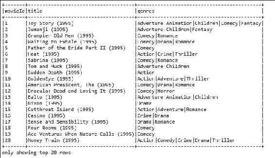
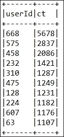
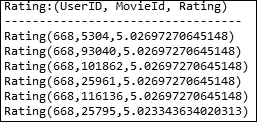
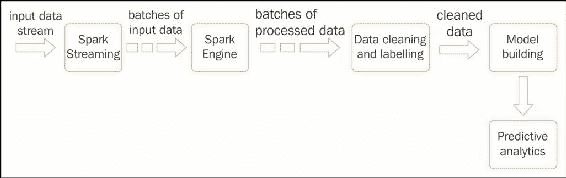
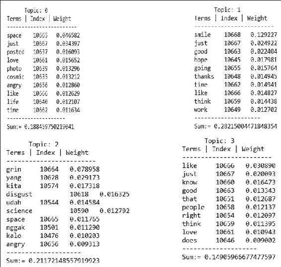
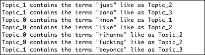

# 九、使用流和图数据的高级机器学习

本章指导读者如何在 Spark MLlib、Spark ML 和 Spark Streaming 的帮助下将机器学习技术应用到使用 GraphX 的流和图数据中。例如，从推特的实时推文数据中进行主题建模。读者将能够使用可用的应用编程接口，从推特等流媒体数据源构建实时和预测应用。通过推特数据分析，我们将展示如何进行大规模的社会情绪分析。我们还将展示如何使用 Spark MLlib 开发大规模电影推荐，这是社交网络分析的隐含部分。简而言之，本章将涵盖以下主题:

*   开发实时最大似然流水线
*   时间序列和社会网络分析
*   使用 Spark 的电影推荐
*   从流式传输开发实时最大似然流水线
*   基于图数据的最大似然流水线和半监督图学习

然而，要成为一个有效的新兴 ML 应用，它真正需要的是一个连续的标记数据流。因此，对大规模非结构化数据进行预处理并对该数据进行精确标记，本质上会引入许多不必要的延迟。

如今，我们听到和读到了很多关于实时机器学习的内容。或多或少，人们在讨论来自**社交网络服务** ( **SNS** )的情感分析、信用卡欺诈检测系统或从面向业务的交易数据中挖掘与客户相关的购买规则时，通常会提供这种吸引人的业务场景。

根据许多 ML 专家的说法，实时持续更新信用卡欺诈检测模型是可能的。这很棒，但对我来说不现实，原因有几个。首先，模型再训练不需要保证这类数据的连续流动。其次，在大多数机器学习系统中，创建标记数据可能是最慢、最昂贵的一步。

# 开发实时 ML 管道

为了开发实时机器学习应用，我们需要能够访问连续的数据流。这些数据可能包括交易数据、简单的文本、来自推特的推文、来自 Flume 或 Kafka 的消息或流等等，因为这些大多是非结构化数据。

要部署这些类型的 ML 应用，我们需要经历一系列步骤。服务于我们目的的最不可靠的数据来源是来自几个来源的实时数据。网络通常是性能瓶颈。

例如，不能保证你会一直收到推特的一堆推文。此外，将这些数据标记为动态构建 ML 模型不是一个现实的想法。然而，在这里，我们提供了一个真正的见解，我们可以如何从实时流数据开发和部署一个 ML 管道。*图 1* 展示了一个实时 ML 应用开发的工作流程。

## 作为非结构化文本数据的流数据收集

我们希望在此强调，实时流数据收集取决于:

*   数据收集的目的。如果目的是在线开发信用卡欺诈检测，那么数据应该通过网络应用编程接口从您自己的网络中收集。如果目的是收集社交媒体情绪分析，那么数据可以从推特、领英、脸书或报纸网站收集，如果目的是网络异常检测，数据可以从网络数据收集。
*   数据可用性是一个问题，因为并非所有社交媒体平台都提供收集数据的公共 API。网络条件很重要，因为数据流很大，需要非常快速的网络连接。
*   存储能力是一个重要的考虑因素，因为例如，几分钟的推文数据集合可能会产生几 GB 的数据。

此外，我们应该至少等待几天，然后将交易标记为*欺诈*或*非欺诈*。相比之下，如果有人报告了欺诈交易，为了简单起见，我们可以立即将此交易标记为*欺诈*。

### 标注数据以进行有监督的机器学习

标记数据集在整个过程中起着核心作用。它确保非常容易改变算法的参数，例如特征归一化或损失函数。在这种情况下，我们将有几个选项来选择算法本身，例如从逻辑回归到**支持向量机** ( **SVM** )或随机森林。

但是，我们不能更改带标签的数据集，因为此信息是预定义的，并且您的模型应该预测您已经拥有的标签。在前面的章节中，我们已经展示了标记结构化数据需要花费大量的时间。

现在考虑一下我们将从流或实时源接收的完全非结构化的流数据。在这种情况下，标记数据将花费大量时间。尽管如此，我们还必须进行预处理，例如标记化、清理、索引、删除停止词以及从非结构化数据中删除特殊字符。

现在，本质上，会有一个问题*数据标注过程需要多长时间？*标注数据集的最后一点是，我们应该明白，如果我们不仔细标注，标注数据集有时可能会有偏差，这可能会导致模型的性能出现很多问题。

#### 创建和构建模型

为了训练情绪分析、信用卡欺诈检测模型和关联规则挖掘模型，我们需要有大量尽可能准确的交易数据示例。一旦我们有了标记数据集，我们就可以训练和构建模型了:


图 1:实时机器学习工作流程。

在[第 7 章](07.html#1O8H62-0b803698e2de424b8aa3c56ad52b005d "Chapter 7. Tuning Machine Learning Models")、*调整机器学习模型*中，我们讨论了如何选择合适的模型和 ML 算法，以产生更好的预测分析。该模型可以表示为具有几个类的二进制或多类分类器。或者，使用主题建模概念，使用 LDA 模型进行情感分析。简而言之，*图 1* 展示了一个实时机器学习工作流程。

### 实时预测分析

当您的 ML 模型被正确地训练和构建后，您的模型就可以进行实时预测分析了。如果你从模型中得到一个很好的预测，那将是非常棒的。然而，正如我们之前在讨论一些准确性问题时提到的，例如真阳性和假阳性，如果假阳性的数量很高，那么这意味着模型的性能不令人满意。

这本质上意味着三件事:我们没有正确标记流数据集，在这种情况下迭代第二步(在*图 1* 中标记数据)，或者没有选择合适的 ML 算法来训练模型，最后我们没有调整什么最终会帮助我们找到合适的超参数或模型选择；在这种情况下，直接进入第七步(模型部署在*图 1* )。

### 调整 ML 模型以进行改进和模型评估

如第四步(图 1*中的模型评估)所述，如果模型的性能不令人满意或不够令人信服，那么我们需要对模型进行调优。正如在[第 7 章](07.html#1O8H62-0b803698e2de424b8aa3c56ad52b005d "Chapter 7. Tuning Machine Learning Models")、*调整机器学习模型*中所讨论的，我们学习了如何选择合适的模型和最大似然算法，以产生更好的预测分析。有几种技术可以调整模型和性能，我们可以根据需求和情况来选择它们。当我们完成调优后，最后我们应该进行模型评估。*

 *### 模型适应性和部署

当我们调整并找到最佳模型时，机器学习模型必须做好准备，以便在每次看到新的训练实例时更新模型时，对新的数据类型进行增量学习。当我们的模型准备好对大规模流数据进行准确可靠的预测时，我们就可以在现实生活中部署它。

# 时间序列和社交网络分析

在本节中，我们将尝试从时间序列和社交网络数据中提供处理和开发大规模 ML 管道的一些见解和挑战。

## 时间序列分析

例如，当监控工业过程或跟踪公司业务指标时，时间序列数据经常出现。通过时间序列方法建模数据之间的一个基本区别是，时间序列分析考虑了随着时间推移而获得的数据点可能具有内部结构的事实。

这可能包括应考虑的自相关、趋势或季节变化。这方面的回归分析主要用于检验理论。目标是测试以确保一个或多个独立时间序列参数的当前值与其他时间序列数据的当前属性相关联。

为了开发大规模预测分析应用，时间序列分析技术可以应用于实值、分类变量、连续数据、离散数值数据，甚至离散符号数据。时间序列是一系列浮点值，每个浮点值都链接到一个时间戳。特别是，我们尽可能努力坚持使用*时间序列*作为单变量时间序列的含义，尽管在其他上下文中，它有时指同一时间戳的一系列多个值。

时间序列数据中的瞬间是对应于单个时间点的时间序列集合中的值的向量。观察值是一个元组(时间戳、键、值)，即时间序列或瞬间中的单个值。简而言之，时间序列主要有四个特征:

*   **有趋势的系列**:因为观测值随着时间的推移而增加或减少，虽然趋势是持续的，并且有长期的运动。
*   **具有季节性的系列数据**:由于观测值保持高位，然后下降，一些模式从一个时期重复到下一个时期，并且包含有规律的周期性波动，比如在 12 个月内。
*   **具有循环成分的系列数据**:由于商业模式是周期性变化的，即商业中的衰退有时是以循环的顺序发生的。它也可能包含超过一年的重复摆动或运动。
*   **随机变化**:一种不可预测的成分，给时间序列图带来不规则或之字形的外观。它还包含不稳定或残留的波动。

由于这些具有挑战性的特性，为实际目的开发实用的机器学习应用变得非常困难。因此，直到现在，只有一个包可用于时间序列数据分析，由 Cloudera 开发；它被称为 Spark-TS 库。这里，每个时间序列通常用一个键来标记，该键能够在时间序列集合中识别它。

然而，Spark 的当前实现没有为时间序列数据分析提供任何实现的算法。然而，由于这是一个新兴的和感兴趣的趋势话题，希望在未来的版本中，我们至少会在 Spark 中实现一些算法。在[第 10 章](10.html#2BASE2-0b803698e2de424b8aa3c56ad52b005d "Chapter 10.  Configuring and Working with External Libraries")、*配置和使用外部库*中，我们将提供更多关于如何使用 Spark 的这类第三方包的信息。

## 社交网络分析

社交网络由**节点**(点)和相关的**链接**组成，其中节点、链接或边是可识别的分析类别。这些节点可能包括关于人员、组和组织的信息。通常，这种信息通常是任何类型的社会实验和分析的主要优先事项和关注点。这类分析中的链接侧重于通过集体的方式来包含社交联系人和可交换信息来扩大社交互动，如脸书、领英、推特等。因此，很明显，嵌入到更大的社会过程、链接和节点网络中的组织会影响其他组织。

另一方面，根据 Otte E.et al. ( *社会网络分析:一个强有力的策略，同样适用于信息科学*，《信息科学杂志》，28:441-453)**社会网络分析** ( **SNA** )是对寻找关联的人或群体之间的映射和测量关系的研究。它还用于查找人员、组、组织和信息处理实体之间的流动。

适当的国民账户体系分析可以用来区分三种最流行的个人中心性度量:程度中心性、中间中心性和接近中心性。**度中心性**表示一个节点有多少个链接或事件，或者一个节点有多少个联系。

**中间中心度**是图中顶点的中心度度量。这也考虑了介数的边缘。此外，中间中心性表示通过考虑其他节点之间的最短路径，一个节点充当桥梁的次数。

另一方面，一个节点的**贴近度中心度**是在一个连通图中，比如一个社交网络中，一个特定节点和所有其他节点之间最短路径的平均长度。

### 类型

建议感兴趣的读者阅读更多关于特征向量中心性、卡茨中心性、PageRank 中心性、逾渗中心性、跨团中心性和α中心性的内容，以便正确理解统计中心性和社交网络中心性。

社交网络通常表示为连通图(有向或无向)。因此，它还涉及图数据分析，其中人充当节点，连接或链接充当边。此外，收集和分析大规模数据以及随后从社交网络(如脸书、推特和领英)开发预测性和描述性分析应用也涉及社交网络数据分析，包括:链接预测(如预测关系或友谊)、确定社交网络中的社区(如图表上的聚类)以及确定网络中的意见领袖，如果对图表数据进行适当的结构，这本质上是一个页面排名问题。

Spark 有专门的图分析应用编程接口，叫做 GraphX。例如，这个应用编程接口可以用来搜索垃圾邮件、对搜索结果进行排名、确定社交网络中的社区或搜索意见领袖，它不是一个完整的图表分析应用方法列表。我们将在本章后面更详细地讨论如何使用 GraphX。

# 使用 Spark 的电影推荐

基于模型的协同过滤通常被许多公司使用，例如网飞，作为实时电影推荐的推荐系统。在这一部分，我们将看到一个完整的例子，它是如何向新用户推荐电影的。

## 使用 Spark MLlib 的基于模型的电影推荐

Spark MLlib 中的实现支持基于模型的协同过滤。在基于模型的协同过滤技术中，用户和产品由一小组因素描述，也称为**潜在因素** ( **LFs** )。然后，LFs 用于预测缺失条目。Spark API 提供了**交替最小二乘**(也广泛称为 **ALS** 算法的实现，该算法用于通过考虑六个参数来学习这些潜在因素，包括:

*   `numBlocks`
*   `rank`
*   `iterations`
*   `lambda`
*   `implicitPrefs`
*   `alpha`

要了解这些参数的更多信息，请参考[第 5 章](05.html#190862-0b803698e2de424b8aa3c56ad52b005d "Chapter 5.  Supervised and Unsupervised Learning by Examples")、*示例监督和非监督学习*中的推荐系统部分。请注意，要使用默认参数构造一个 ALS 实例，可以根据您的需求设置该值。默认值如下:`numBlocks`:1、`rank` : 10、`iterations` : 10、`lambda` : 0.01、`implicitPrefs`:假、`alpha` : 1.0。

简而言之，ALS 实例的构造如下:

*   首先，使用迭代算法 ALS 将评级矩阵建模为低排名用户和产品因素的乘积
*   之后，通过最小化观察评级的重构误差，使用这些因素来完成学习任务

然而，未知的评级可以通过将这些因素相乘来连续计算。

基于在 Spark MLlib 中使用的协同过滤技术的电影推荐或任何其他推荐的方法已经被证明是一种高性能的方法，具有高预测精度，并且对于网飞等公司使用的商品集群上的数十亿评级是可扩展的。通过采用这种方法，像网飞这样的公司可以根据预测的收视率向其订户推荐电影。最终目标是增加销售额，当然还有客户满意度。

### 数据探索

电影和相应的分级数据集是从电影在线网站([https://movielens.org](https://movielens.org/movies/1))下载的。根据 MovieLens 网站上的数据描述，所有的评分都在`ratings.csv`文件中描述。该文件的每一行后跟标题代表一个用户对一部电影的一个评价。

CSV 数据集有以下几列:`userId`、`movieId`、`rating`、`timestamp`，如图*图 2* 所示。这些行首先由用户内部的`userId`按`movieId`排序。评级以五星级标准进行；以半星为增量(0.5 星至 5.0 星)。时间戳表示自 1970 年 1 月 1 日午夜**协调世界时** ( **UTC** )以来的秒数，在这里，我们从 10，325 部电影的 668 个用户那里获得了 105，339 个评分:


图 2:前 20 部电影的分级示例。

另一方面，电影信息包含在`movies.csv`文件中。除了标题信息之外的每一行都代表一部电影，该电影包含列:`movieId`、`title`和`genres`。

电影标题可以手动创建或插入，也可以从 https://www.themoviedb.org/的电影数据库网站导入。然而，发行年份显示在括号中。

由于电影标题是手动插入的，因此这些标题中可能存在一些错误或不一致。因此，建议读者查看 IMDb 数据库([http://www.ibdb.com/](http://www.ibdb.com/))以确定其对应的发行年份是否存在不一致或不正确的标题。

流派是一个单独的列表，从以下流派类别中选择:

*   动作，冒险，动画，儿童，喜剧，犯罪
*   纪录片、戏剧、奇幻、黑色电影、恐怖、音乐剧
*   神秘，浪漫，科幻，惊悚，西部，战争



图 3:前 20 名电影的标题和流派。

### 使用 Spark MLlib 的电影推荐

在本小节中，我们将通过一个从数据收集到电影推荐的分步示例，向您展示如何为其他用户推荐电影。从 Packt 补充文档中下载`movies.csv`和`ratings.csv`文件，并将其放入您的项目目录中。

**步骤 1:配置您的 Spark 环境**

下面是配置您的 Spark 环境的代码:

```scala
static SparkSession spark = SparkSession 
      .builder() 
      .appName("JavaLDAExample") 
         .master("local[*]") 
         .config("spark.sql.warehouse.dir", "E:/Exp/"). 
          getOrCreate(); 

```

**第二步:加载、解析和浏览电影和分级数据集**

下面是代码示例:

```scala
String ratigsFile = "input/ratings.csv"; 
Dataset<Row> df1 = spark.read().format("com.databricks.spark.csv").option("header", "true").load(ratigsFile);     
Dataset<Row> ratingsDF = df1.select(df1.col("userId"), df1.col("movieId"), df1.col("rating"),  df1.col("timestamp")); 
ratingsDF.show(false); 

```

该代码段应返回与*图 2* 中相同等级的`Dataset<Row>`。另一方面，以下代码片段向您展示了电影的`Dataset<Row>`，与*图 3* 中的相同:

```scala
String moviesFile = "input/movies.csv"; 
Dataset<Row> df2 = spark.read().format("com.databricks.spark.csv").option("header", "true").load(moviesFile); 
Dataset<Row> moviesDF = df2.select(df2.col("movieId"), df2.col("title"), df2.col("genres"));  
moviesDF.show(false); 

```

**步骤 3:将两个数据集注册为临时表**

要注册这两个数据集，我们可以使用以下代码:

```scala
ratingsDF.createOrReplaceTempView("ratings"); 
moviesDF.createOrReplaceTempView("movies"); 

```

通过在最小内存中创建一个临时视图作为表，这将有助于加快内存中的查询。使用`createOrReplaceTempView()`方法的临时表的生存期与用于创建该数据集的`[[SparkSession]]`相关联。

**第四步:浏览查询相关统计**

我们来看看收视率相关的统计数据。只需使用以下代码行:

```scala
long numRatings = ratingsDF.count(); 
long numUsers = ratingsDF.select(ratingsDF.col("userId")).distinct().count(); 
long numMovies = ratingsDF.select(ratingsDF.col("movieId")).distinct().count(); 
System.out.println("Got " + numRatings + " ratings from " + numUsers + " users on " + numMovies + " movies."); 

```

你应该在 10，325 部电影中找到来自 668 个用户的 105，339 个评价。现在，让我们得到最大和最小的收视率，以及给电影评分的用户数量。

但是，您需要对我们在上一步中刚刚在内存中创建的评级表执行一个 SQL 查询。在这里进行查询很简单，它类似于从 MySQL 数据库或 RDBMS 进行查询。

但是，如果您不熟悉基于 SQL 的查询，建议您查看 SQL 查询规范，了解如何使用`SELECT`从特定表中执行选择，如何使用`ORDER`执行排序，以及如何使用`JOIN`关键字执行连接操作。

如果您知道 SQL 查询，您应该通过使用如下复杂的 SQL 查询获得一个新的数据集:

```scala
Dataset<Row> results = spark.sql("select movies.title, movierates.maxr, movierates.minr, movierates.cntu " + "from(SELECT ratings.movieId,max(ratings.rating) as maxr,"  + "min(ratings.rating) as minr,count(distinct userId) as cntu "  + "FROM ratings group by ratings.movieId) movierates " + "join movies on movierates.movieId=movies.movieId " + "order by movierates.cntu desc"); 
results.show(false); 

```


图 4:最高和最低评分以及对电影评分的用户数。

为了获得洞察力，我们需要更多地了解用户及其评分。现在让我们找出最活跃的用户，以及他们对一部电影的评分次数:

```scala
Dataset<Row> mostActiveUsersSchemaRDD = spark.sql("SELECT ratings.userId, count(*) as ct from ratings " + "group by ratings.userId order by ct desc limit 10"); 
mostActiveUsersSchemaRDD.show(false); 

```



图 5:单个用户提供的评分数量。

现在让我们看一看特定的用户，并找到电影，比如用户 668，评级高于 4:

```scala
Dataset<Row> results2 = spark.sql("SELECT ratings.userId, ratings.movieId," + "ratings.rating, movies.title FROM ratings JOIN movies "+ "ON movies.movieId=ratings.movieId " + "where ratings.userId=668 and ratings.rating > 4"); 
results2.show(false); 

```


图 6:用户 668 的相关评级。

**第五步:准备训练和测试评分数据，查看计数**

下面是代码示例:

```scala
Dataset<Row> [] splits = ratingsDF.randomSplit(new double[] { 0.8, 0.2 }); 
Dataset<Row> trainingData = splits[0]; 
Dataset<Row> testData = splits[1]; 
long numTraining = trainingData.count(); 
long numTest = testData.count(); 
System.out.println("Training: " + numTraining + " test: " + numTest); 

```

您应该会发现，培训中有 84，011 个评分，测试数据集中有 21，328 个评分。

**第六步:准备使用 ALS** 构建推荐模型的数据

下面的代码演示了如何使用 API 构建推荐模型:

```scala
JavaRDD<Rating> ratingsRDD = trainingData.toJavaRDD().map(new Function<Row, Rating>() { 
      @Override 
      public Rating call(Row r) throws Exception { 
        // TODO Auto-generated method stub 
        int userId = Integer.parseInt(r.getString(0)); 
        int movieId = Integer.parseInt(r.getString(1)); 
        double ratings = Double.parseDouble(r.getString(2)); 
        return new Rating(userId, movieId, ratings); 
      } 
    }); 

```

`ratingsRDD` RDD 将包含`userId`、`movieId`，以及我们上一步准备的训练数据集中相应的评分。另一方面，下面的`testRDD`也包含来自我们在上一步中准备的测试数据集的相同信息:

```scala
JavaRDD<Rating> testRDD = testData.toJavaRDD().map(new Function<Row, Rating>() { 
      @Override 
      public Rating call(Row r) throws Exception { 
        int userId = Integer.parseInt(r.getString(0)); 
        int movieId = Integer.parseInt(r.getString(1)); 
        double ratings = Double.parseDouble(r.getString(2)); 
        return new Rating(userId, movieId, ratings); 
      } 
    }); 

```

**第七步:构建 ALS 用户产品矩阵**

通过指定等级、迭代次数和λ，基于`ratingsRDD`建立一个 ALS 用户矩阵模型:

```scala
int rank = 20; 
int numIterations = 10; 
double lambda = 0.01; 
MatrixFactorizationModel model = ALS.train(JavaRDD.toRDD(ratingsRDD), rank, numIterations, 0.01); 

```

*   注意，我们已经随机选择秩的值为`20`，并且已经迭代模型学习 10 次，λ为`0.01`。通过这个设置，我们得到了很好的预测精度。建议读者应用超参数调整来了解这些参数的最佳值。
*   但是，建议读者根据数据集更改这两个参数的值。此外，如前所述，如果预测性能不令人满意，他们还可以使用和指定其他参数，如`numberblock`、`implicitPrefs`、`alpha`。此外，设置用户块和产品块的块数，将计算并行化为自动配置块数的`pass -1`。价值是`-1`。

**第八步:做预测**

让我们获得用户 668 的六大电影预测:

```scala
System.out.println("Rating:(UserID, MovieId, Rating)"); 
Rating[] topRecsForUser = model.recommendProducts(668, 6); 
for (Rating rating : topRecsForUser) 
System.out.println(rating.toString()); 

```



图 7:用户评分最高的六部电影 668。

**第九步:获取预测评分与测试评分进行比较**

下面是代码示例:

```scala
JavaRDD<Tuple2<Object, Object>> testUserProductRDD = testData.toJavaRDD() 
        .map(new Function<Row, Tuple2<Object, Object>>() { 
          @Override 
          public Tuple2<Object, Object> call(Row r) throws Exception { 

            int userId = Integer.parseInt(r.getString(0)); 
            int movieId = Integer.parseInt(r.getString(1)); 
            double ratings = Double.parseDouble(r.getString(2)); 
            return new Tuple2<Object, Object>(userId, movieId); 
          } 
        }); 
JavaRDD<Rating> predictionsForTestRDD = model.predict(JavaRDD.toRDD(testUserProductRDD)).toJavaRDD(); 

```

现在，让我们检查 10 个用户的前 10 个预测:

```scala
System.out.println(predictionsForTestRDD.take(10).toString()); 

```

**第 10 步:准备预测**

在这里，我们将分两步准备与 rdd 相关的预测。第一步包括准备从`predictionsForTestRDD` RDD 结构进行比较的预测。内容如下:

```scala
JavaPairRDD<Tuple2<Integer, Integer>, Double> predictionsKeyedByUserProductRDD = JavaPairRDD.fromJavaRDD( 
        predictionsForTestRDD.map(new Function<Rating, Tuple2<Tuple2<Integer, Integer>, Double>>() { 
          @Override 
          public Tuple2<Tuple2<Integer, Integer>, Double> call(Rating r) throws Exception { 
            return new Tuple2<Tuple2<Integer, Integer>, Double>( 
                new Tuple2<Integer, Integer>(r.user(), r.product()), r.rating()); 
          } 
        })); 

```

第二步包括准备对比测试:

```scala
JavaPairRDD<Tuple2<Integer, Integer>, Double> testKeyedByUserProductRDD = JavaPairRDD  .fromJavaRDD(testRDD.map(new Function<Rating, Tuple2<Tuple2<Integer, Integer>, Double>>() { 
          @Override 
          public Tuple2<Tuple2<Integer, Integer>, Double> call(Rating r) throws Exception { 
            return new Tuple2<Tuple2<Integer, Integer>, Double>( 
                new Tuple2<Integer, Integer>(r.user(), r.product()), r.rating()); 
          } 
        })); 

```

**第 11 步:加入预测测试，查看综合评分**

加入`testKeyedByUserProductRDD`和`predictionsKeyedByUserProductRDD` RDDs，获得针对每个用户和`movieId`的综合测试和预测评分:

```scala
JavaPairRDD<Tuple2<Integer, Integer>, Tuple2<Double, Double>> testAndPredictionsJoinedRDD = testKeyedByUserProductRDD 
        .join(predictionsKeyedByUserProductRDD); 
System.out.println("(UserID, MovieId) => (Test rating, Predicted rating)"); 
System.out.println("----------------------------------"); 
for (Tuple2<Tuple2<Integer, Integer>, Tuple2<Double, Double>> t : testAndPredictionsJoinedRDD.take(6)) { 
      Tuple2<Integer, Integer> userProduct = t._1; 
      Tuple2<Double, Double> testAndPredictedRating = t._2; 
      System.out.println("(" + userProduct._1() + "," + userProduct._2() + ") => (" + testAndPredictedRating._1() 
          + "," + testAndPredictedRating._2() + ")"); 
    } 

```


图 8:针对每个用户和电影 Id 的综合测试和预测评分。

**步骤 12:根据预测性能评估模型**

让我们通过检查真阳性和假阳性的数量来检查 ALS 模型的性能:

```scala
JavaPairRDD<Tuple2<Integer, Integer>, Tuple2<Double, Double>> truePositives = testAndPredictionsJoinedRDD 
        .filter(new Function<Tuple2<Tuple2<Integer, Integer>, Tuple2<Double, Double>>, Boolean>() { 
          @Override 
          public Boolean call(Tuple2<Tuple2<Integer, Integer>, Tuple2<Double, Double>> r) throws Exception { 
            return (r._2._1() <= 1 && r._2._2() < 5); 
          } 
        }); 

```

现在打印真实积极预测的数量。我们认为，当预测的评级低于最高评级(即`5`)时，预测就是真正的预测。因此，如果预测评级大于或等于`5`，则认为该预测为假阳性:

```scala
for (Tuple2<Tuple2<Integer, Integer>, Tuple2<Double, Double>> t : truePositives.take(2)) { 
      Tuple2<Integer, Integer> userProduct = t._1; 
      Tuple2<Double, Double> testAndPredictedRating = t._2; 
    } 
System.out.println("Number of true positive prediction is: "+ truePositives.count()); 

```

您应该找到如下值。

真阳性预测数为 798。现在是打印误报统计数据的时候了:

```scala
JavaPairRDD<Tuple2<Integer, Integer>, Tuple2<Double, Double>> falsePositives = testAndPredictionsJoinedRDD 
        .filter(new Function<Tuple2<Tuple2<Integer, Integer>, Tuple2<Double, Double>>, Boolean>() { 
          @Override 
          public Boolean call(Tuple2<Tuple2<Integer, Integer>, Tuple2<Double, Double>> r) throws Exception { 
            return (r._2._1() <= 1 && r._2._2() >= 5); 
          } 
        }); 
for (Tuple2<Tuple2<Integer, Integer>, Tuple2<Double, Double>> t : falsePositives.take(2)) { 
      Tuple2<Integer, Integer> userProduct = t._1; 
      Tuple2<Double, Double> testAndPredictedRating = t._2; 
    } 
System.out.println("Number of false positive prediction is: "+ falsePositives.count()); 

```

在这个特殊的例子中，我们只得到 14 个假阳性预测，这很突出。现在让我们根据测试和预测之间的平均绝对误差计算来检查预测的性能:

```scala
double meanAbsoluteError = JavaDoubleRDD        .fromRDD(testAndPredictionsJoinedRDD.values().map(new Function<Tuple2<Double, Double>, Object>() { 
          public Object call(Tuple2<Double, Double> pair) { 
            Double err = pair._1() - pair._2(); 
            return err * err; 
          } 
        }).rdd()).mean(); 
    System.out.printing("Mean Absolute Error: "+meanAbsoluteError); 

```

它返回如下值:

```scala
Mean Absolute Error: 1.5800601618477566 

```

# 从流开发实时 ML 管道

根据 Spark 在[http://Spark . Apache . org/docs/latest/Streaming-programming-guide . html](http://spark.apache.org/docs/latest/streaming-programming-guide.html)提供的 API 指南，从技术上讲，Spark Streaming 以对象的形式接收实时输入数据流(对象可以是`Java/Python/R`对象)。稍后，这些流被分成批次，然后由 Spark 引擎进行处理，以批量生成最终的输入流。为了使这个过程更加容易，Spark Streaming 提供了一个高级抽象，也称为离散化流或数据流。

**数据流**代表来自实时流源的连续数据流，如推特、卡夫卡、烟雾、驱动、传感器或任何其他来源。离散化流可以从这些源创建，或者，对其他数据流的高级操作也可以应用于此。在内部，数据流被表示为一个 RDD 序列，这意味着 RDD 抽象已经被重用来处理 rdd 流。

正如在[第 6 章](06.html#1ENBI2-0b803698e2de424b8aa3c56ad52b005d "Chapter 6.  Building Scalable Machine Learning Pipelines")、*构建大规模机器学习管道*中已经讨论过的，主题建模技术自动推断讨论的主题，并将它们作为隐藏资源固有地放置在文档集合中。这常用于**自然语言处理** ( **NLP** )和文本挖掘任务。这些主题可用于分析、总结和组织这些文档。或者，这些主题可以用于**机器学习** ( **ML** )流水线开发的后期阶段的特征化和降维。最流行的主题建模算法是**潜在狄利克雷分配** ( **LDA** )和**概率潜在语义分析** ( **pLSA** )。之前我们讨论了如何对已经可用的静态数据集应用线性判别分析算法。然而，如果主题建模是根据实时流数据准备的，那就太好了，并且可以更实时地了解推特、领英或脸书等社交媒体的趋势。

然而，由于脸书或领英的应用编程接口设施有限，很难从这些社交媒体平台收集实时数据。Spark 还提供了从推特、卡夫卡、Flume 和驱动程序访问数据的应用编程接口。从流数据开发接近实时的 ML 应用的工作流程应该遵循*图 9* 中所示的工作流程:



图 9:使用 Spark 从流数据进行实时预测 ML 模型开发。

在本节中，我们将向您展示如何开发处理流数据的实时 ML 管道。更具体地说，我们将展示一个从推特流数据逐步建模的主题。这里的主题建模有两个步骤:Twitter 数据收集和使用 LDA 的主题建模。

## 从推特实时收集推文数据

Spark 提供了从 Twitter 时间线访问实时推文的 API。推文可以通过使用关键词或标签来进一步制作。或者，推文也可以从某人的推特时间线下载。但是，在访问推文数据之前，您必须在推特上创建一个示例推特应用，并生成四个键:`consumerKey`、`consumerSecret`、`accessToken`和`accessTokenSecret`。

### 类型

请注意，在 Spark 从 1.6.2 升级到 2.0.0 期间，Twitter(以及其他一些)驱动程序支持已被删除。这意味着使用 Spark 从较少使用的流连接器(包括 Twitter、Akka、MQTT 和 ZeroMQ)收集流数据的支持在 Spark 2.0.0 中已被删除。因此，不可能使用 Spark 2.0.0 开发一个用于推特数据收集的应用。因此，Spark 1.6.1 将用于本节中的推特数据收集演示。建议读者使用提供的 Maven 友好`pom.xml`文件在 Eclipse 上创建一个 Maven 项目。

在验证您的 Spark ML 应用从 Twitter 收集数据后，您必须通过指定收集推文的`SparkConf`和持续时间来定义`JavaStreamingContext`。之后，一旦您使用`JavaStreamingContext`对象撤销`start()`方法，推文数据就可以通过 Spark 的`TwitterUtils`应用编程接口作为数据流或离散流下载。

开始接收推文后，您可以将推文数据保存在您的本地机器或 HDFS 或任何其他适用的文件系统上。但是，流式传输将继续，直到您使用`awaitTermination()`终止流式传输。

然而，接收到的推文也可以使用`foreachRDD`设计模式进行预处理或清理，然后保存到您想要的位置。由于篇幅限制，我们在此限制讨论。

### 类型

此外，感兴趣的读者应遵循 Spark 以下网页中的 Spark Streaming API 指南:[http://Spark . Apache . org/docs/latest/Streaming-programming-guide . html](http://spark.apache.org/docs/latest/streaming-programming-guide.html)。

### 使用 Spark 的 TwitterUtils API 收集推文

在这一小节中，首先，我们将向您展示如何使用`TwitterUtils` API 从 Twitter 收集实时推文数据。那么相同的推文数据将在下一小节中用于主题建模。

**第一步:装载所需的包装和原料药**

下面是加载所需包的代码:

```scala
import org.apache.log4j.Level; 
import org.apache.log4j.Logger; 
import org.apache.spark.SparkConf; 
import org.apache.spark.api.java.JavaRDD; 
import org.apache.spark.api.java.function.Function; 
import org.apache.spark.streaming.Duration; 
import org.apache.spark.streaming.api.java.JavaDStream; 
import org.apache.spark.streaming.api.java.JavaStreamingContext; 
import org.apache.spark.streaming.twitter.TwitterUtils; 
import twitter4j.Status;  

```

**步骤 2:设置记录器级别**

为了设置记录器级别，我们使用以下代码:

```scala
Logger.getLogger("org").setLevel(Level.OFF); 
Logger.getLogger("akka").setLevel(Level.OFF); 
Logger.getLogger("org.apache.spark").setLevel(Level.WARN); 
Logger.getLogger("org.eclipse.jetty.server").setLevel(Level.OFF);  

```

**第三步:Spark 流环境设置**

下面是 Spark 流的代码示例:

```scala
SparkConf conf = new SparkConf().setMaster("local[*]").setAppName("TwitterExample"); 
JavaStreamingContext jssc = new JavaStreamingContext(conf, new Duration(1000)); 

```

**第四步:设置访问推特数据的认证**

通过访问以下网址从示例推特应用获取认证值:[https://apps.twitter.com/](https://apps.twitter.com/):

```scala
String consumerKey = "VQINrM6ZcNqaCAawA6IN4xRTP"; 
String consumerSecret = "F2OsVEuJypOZSAoNDFrWgoCHyNJNXbTr8T3yEbp9cWEYjTctye"; 
String accessToken = "475468363-IfRcZnbkEVPRw6bwXovMnw1FsbxuetvEF2JvbAvD"; 
String accessTokenSecret = "vU7VtzZVyugUHO7ddeTvucu1wRrCZqFTPJUW8VAe6xgyf"; 

```

请注意，这里我们为这四个密钥提供了相同的值。相应地用您自己的键替换这些值。好了，现在我们需要使用`twitter4j.oauth`为前面的四个键设置系统属性:

```scala
System.setProperty("twitter4j.oauth.consumerKey", consumerKey); 
System.setProperty("twitter4j.oauth.consumerSecret", consumerSecret); 
System.setProperty("twitter4j.oauth.accessToken", accessToken); 
System.setProperty("twitter4j.oauth.accessTokenSecret", accessTokenSecret); 

```

**第五步:启用检查点**

下面的代码显示了如何启用检查点:

```scala
jssc.checkpoint("src/main/resources/twitterdata/"); 

```

元数据检查点主要用于从驱动程序故障中恢复，而数据或 RDD 检查点即使在使用状态转换的情况下也是基本功能所必需的。更多详情请访问 Spark 的以下网页:[http://Spark . Apache . org/docs/latest/streaming-programming-guide . html # check pointing](http://spark.apache.org/docs/latest/streaming-programming-guide.html#checkpointing)。

**第六步:开始接受作为离散流的推文流**

为了简单起见，我们只收集 100 条推文，但可以收集任意数量:

```scala
JavaDStream<Status> tweets = TwitterUtils.createStream(jssc); 
final String outputDirectory="src/main/resources/twitterdata/"; 
final long numTweetsToCollect = 100; 

```

**第七步:过滤推文并保存为常规文本文件**

过滤推文的代码如下所示:

```scala
tweets.foreachRDD(new Function<JavaRDD<Status>, Void>() { 
      public long numTweetsCollected = 0; 
      @Override 
      public Void call(JavaRDD<Status> status) throws Exception {         
        long count = status.count(); 
        if (count > 0) { 
          status.saveAsTextFile(outputDirectory + "/tweets_" + System.currentTimeMillis()); 
          numTweetsCollected += count; 
          if (numTweetsCollected >= numTweetsToCollect) { 
               System.exit(0); 
          } 
        } 
        return null; 
      } 
    }); 

```

这里我们使用 singleton 方法`foreachRDD`对推文进行预处理，只接受过滤后的推文，也就是说，如果状态计数至少为 1。当收集到的推文数量等于或大于要收集的推文数量时，则退出收集。最后，我们将推文保存为输出目录中的文本。

**第八步:控制流切换**

此处显示了控制流交换机的代码:

```scala
jssc.start(); 
jssc.awaitTermination();  

```

最终，我们将在下一步中使用这些推文文本进行主题建模。如果你回忆一下[第 6 章](06.html#1ENBI2-0b803698e2de424b8aa3c56ad52b005d "Chapter 6.  Building Scalable Machine Learning Pipelines")、*构建可扩展机器学习管道*中的主题建模，我们会看到相应的术语权重、主题名称和术语索引。但是，我们也需要有实际的条款。在下一步中，我们将展示检索术语的详细技术，该技术广泛依赖于为此需要创建的词汇表。

## 使用 Spark 进行主题建模

在这一小节中，我们介绍了一种使用 Spark 的半自动主题建模技术。以下步骤显示了从数据读取到打印主题及其术语权重的主题建模。

**第一步:装载必要的包装和原料药**

下面是加载必要包的代码:

```scala
import java.io.Serializable; 
import java.util.ArrayList; 
import java.util.HashMap; 
import java.util.Map; 
import org.apache.log4j.Level; 
import org.apache.log4j.Logger; 
import org.apache.spark.SparkConf; 
import org.apache.spark.api.java.JavaPairRDD; 
import org.apache.spark.api.java.JavaRDD; 
import org.apache.spark.api.java.JavaSparkContext; 
import org.apache.spark.api.java.function.Function; 
import org.apache.spark.api.java.function.Function2; 
import org.apache.spark.api.java.function.PairFlatMapFunction; 
import org.apache.spark.api.java.function.PairFunction; 
import org.apache.spark.ml.feature.StopWordsRemover; 
import org.apache.spark.mllib.clustering.LDA; 
import org.apache.spark.mllib.clustering.LDAModel; 
import org.apache.spark.mllib.linalg.Vector; 
import org.apache.spark.mllib.linalg.Vectors; 
import org.apache.spark.sql.SQLContext; 
import scala.Tuple2; 

```

**步骤 2:配置 Spark 环境**

下面是配置 Spark 的代码:

```scala
private transient static SparkConf sparkConf = new SparkConf().setMaster("local[*]").setAppName("TopicModelingLDA"); 
private transient static JavaSparkContext jsc = new JavaSparkContext(sparkConf); 
private transient static SQLContext sqlContext = new org.apache.spark.sql.SQLContext(jsc); 

```

**第三步:设置日志级别**

下面是设置日志记录级别的代码:

```scala
Logger.getLogger("org").setLevel(Level.OFF); 
Logger.getLogger("akka").setLevel(Level.OFF); 
Logger.getLogger("org.apache.spark").setLevel(Level.WARN); 
Logger.getLogger("org.eclipse.jetty.server").setLevel(Level.OFF); 

```

### 注

请注意，之前显示的日志记录级别的设置是可选的。

**第 4 步:创建 Java RDD 并将其缓存在内存中**

创建 Java RDD 并为上一步的推文数据缓存它们:

```scala
JavaRDD<String> data = jsc.wholeTextFiles("src/main/resources/test/*.txt") 
        .map(new Function<Tuple2<String, String>, String>() { 
          @Override 
          public String call(Tuple2<String, String> v1) throws Exception {     
            return v1._2; 
          } 
        }).cache(); 

```

**第 5 步:标记术语**

加载 Spark 提供的停止词列表，并通过应用三个约束过滤来标记术语:文本长度至少为 4，而不是停止词，并使它们每个都小写。请注意，我们在[第 6 章](06.html#1ENBI2-0b803698e2de424b8aa3c56ad52b005d "Chapter 6.  Building Scalable Machine Learning Pipelines")、*构建可扩展机器学习管道*中讨论了停止词:

```scala
public static String[] stopwords = new StopWordsRemover().getStopWords(); 
JavaRDD<String[]> tokenized = data.map(new Function<String, String[]>() { 
list.toArray(new String[0]); 
      }      @Override 
      public String[] call(String v1) throws Exception { 
        ArrayList<String> list = new ArrayList<>(); 
        for (String s : v1.split("\\s")) { 
          if (s.length() > 3 && !isStopWord(s) && isOnlyLetter(s)) 
            list.add(s.toLowerCase()); 
        } 
        return 
    }); 

```

**第六步:准备术语计数**

通过应用以下四个约束条件过滤术语计数来准备术语计数:文本长度至少为 4，不要停止单词，仅选择字符，并使它们都小写:

```scala
JavaPairRDD<String, Integer> termCounts = data 
        .flatMapToPair(new PairFlatMapFunction<String, String, Integer>() { 
          @Override 
          public Iterable<Tuple2<String, Integer>> call(String t) throws Exception {     
            ArrayList<Tuple2<String, Integer>> tc = new ArrayList<>();   
            for (String s : t.split("\\s")) { 

              if (s.length() > 3 && !isStopWord(s) && isOnlyLetter(s)) 
                tc.add(new Tuple2<String, Integer>(s.toLowerCase(), 1)); 
            } 
            return tc; 
          } 
        }).reduceByKey(new Function2<Integer, Integer, Integer>() { 
          @Override 
          public Integer call(Integer v1, Integer v2) throws Exception {     
            return v1 + v2; 
          } 
        }); 

```

注意这里`isStopWords()`和`isOnlyLetters()`是两个用户定义的方法，将在这一步结束时讨论。

**第 7 步:对术语计数进行排序**

通过应用两个转换`sortByKey()`和`mapToPair()`对术语计数进行排序:

```scala
JavaPairRDD<String, Integer> termCountsSorted = termCounts 
        .mapToPair(new PairFunction<Tuple2<String, Integer>, Integer, String>() { 
          @Override 
          public Tuple2<Integer, String> call(Tuple2<String, Integer> t) throws Exception { 
            return t.swap(); 
          } 
        }).sortByKey().mapToPair(new PairFunction<Tuple2<Integer, String>, String, Integer>() { 
          @Override 
          public Tuple2<String, Integer> call(Tuple2<Integer, String> t) throws Exception { 
            return t.swap(); 
          } 
        }); 

```

**第八步:创建词汇**

通过映射已排序的术语计数来创建词汇 RDD。最后，打印键值对:

```scala
JavaRDD<String> vocabArray = termCountsSorted.map(new Function<Tuple2<String, Integer>, String>() { 
      @Override 
      public String call(Tuple2<String, Integer> v1) throws Exception { 
        return v1._1; 
      } 
    }); 
final Map<String, Long> vocab = vocabArray.zipWithIndex().collectAsMap(); 
    for (Map.Entry<String, Long> entry : vocab.entrySet()) { 
      System.out.println(entry.getKey() + "/" + entry.getValue()); 
    } 

```

让我们来看看*图 10* 所示词汇术语及其索引的截图:


图 10:词汇术语及其索引。

**步骤 9:从标记化的单词/术语**创建文档矩阵

通过映射我们在上一步中创建的词汇表，根据标记化术语创建文档矩阵`JavaPairRDD`。之后，将 RDD 缓存在内存中以加快处理速度:

```scala
JavaPairRDD<Long, Vector> documents = JavaPairRDD 
        .fromJavaRDD(tokenized.zipWithIndex().map(new Function<Tuple2<String[], Long>, Tuple2<Long, Vector>>() { 
          @Override 
          public Tuple2<Long, Vector> call(Tuple2<String[], Long> v1) throws Exception { 
            String[] tokens = v1._1; 
            Map<Integer, Double> counts = new HashMap(); 

            for (String s : tokens) { 
              if (vocab.containsKey(s)) { 
                long idx = vocab.get(s); 
                int a = (int) idx; 
                if (counts.containsKey(a)) { 
                  counts.put(a, counts.get(a) + 1.0); 
                } else 
                  counts.put(a, 0.0); 
              } 
            } 
            ArrayList<Tuple2<Integer, Double>> ll = new ArrayList<>(); 
            ArrayList<Double> dd = new ArrayList<>(); 

            for (Map.Entry<Integer, Double> entry : counts.entrySet()) { 
              ll.add(new Tuple2<Integer, Double>(entry.getKey(), entry.getValue())); 
              dd.add(entry.getValue()); 
            } 

            return new Tuple2<Long, Vector>(v1._2, Vectors.sparse(vocab.size(), ll)); 
          } 
        })).cache(); 

```

**第十步:训练 LDA 模型**

使用步骤 9 中的文档矩阵训练 LDA 模型，为了简单起见，针对四个主题描述 10 个主题术语。

注意这里我们使用了**潜在 Dirichilet 分配** ( **LDA** )，这是最流行的常用于文本挖掘的主题建模算法之一。我们可以使用更健壮的主题建模算法，如**概率潜在情感分析** ( **pLSA** )、**柏青哥分配模型** ( **PAM** )或**分层 Dirichilet 过程** ( **HDP** )算法。然而，pLSA 存在过度拟合的问题。

另一方面，HDP 和 PAM 都是用于复杂文本挖掘的更复杂的主题建模算法，例如从高维文本数据或非结构化文本的文档中挖掘主题。而且到目前为止，Spark 只实现了一个主题建模算法，那就是 LDA。因此，我们必须合理使用 LDA:

```scala
LDAModel ldaModel = new LDA().setK(4).setMaxIterations(10).run(documents); 
Tuple2<int[], double[]>[] topicDesces = ldaModel.describeTopics(10); 
int topicCount = topicDesces.length; 

```

请注意，为了保持主题生成的简单性，我们将主题的数量设置为 4，并对 LDA 进行了 10 次迭代。另一个原因是，在下一节中，我们想展示如何通过这四个主题的常用术语来连接它们。建议读者根据自己的需求改变数值。

**第 11 步:获取每个主题的主题术语、索引、术语权重和总和**

从步骤 10 和步骤 8 中描述的词汇和主题描述中获取这些统计信息:

```scala
for (int t = 0; t < topicCount; t++) { 
      Tuple2<int[], double[]> topic = topicDesces[t]; 
      System.out.println("      Topic: " + t); 
      int[] indices = topic._1(); 
      double[] values = topic._2(); 
      double sum = 0.0d; 
      int wordCount = indices.length; 
      System.out.println("Terms |\tIndex |\tWeight"); 
      System.out.println("------------------------"); 
      for (int w = 0; w < wordCount; w++) { 
        double prob = values[w]; 
        int vocabIndex = indices[w]; 
        String vocabKey = ""; 
        for (Map.Entry<String, Long> entry : vocab.entrySet()) { 
          if (entry.getValue() == vocabIndex) { 
            vocabKey = entry.getKey(); 
            break; 
          } } 
System.out.format("%s \t %d \t %f \n", vocabKey, vocabIndex, prob); 
        sum += prob; 
      } 
      System.out.println("--------------------"); 
      System.out.println("Sum:= " + sum); 
      System.out.println(); 
    }  } 

```

如果仔细看前面的代码段，`vocabKey`表示对应的主题术语，`vocabIndex`是索引，`prob`表示一个主题中每个术语的术语权重。打印语句已用于格式化输出。现在让我们看一下在*图 11* 中简单描述四个主题的输出:



图 11:描述四个主题。

正如我们在*第 6 步*中提到的，这里我们将展示我们如何开发`isStopWord()`方法。只需使用以下代码:

```scala
public static boolean isStopWord(String word) { 
    for (String s : stopwords) { 
      if (word.equals(s))   
        return true; 
    } 
    return false; 
  } 

```

`isOnlyLetters()`方法如下:

```scala
public static boolean isOnlyLetter(String word) { 
    for (Character ch : word.toCharArray()) { 
      if (!Character.isLetter(ch)) 
        return false; 
    } 
    return true; 
  } 

```

在下一节中，我们将介绍如何使用 Spark 的 GraphX API 解析和处理大规模的图数据，以便从我们从*图 10* 获得的主题数据中找到连接的组件。

# 图数据上的 ML 流水线和基于半监督图的学习

由于大数据泛滥，出现了大量的未标记数据，以及非常少量的已标记数据。正如已经讨论过的，标记和注释这些数据在计算上很昂贵，并且是从数据中找到真正洞察力的障碍。此外，社交网络和媒体制作人不断增长的数据规模。这些数据有助于开发实时和大规模的监督学习方法，这些方法可以在输入分布中使用信息。

基于图的半监督学习背后的思想是构建一个连接相似数据点或组件的图。这使得隐藏的和未观察到的标签成为这个图的节点上的随机变量。在这种类型的学习中，相似的数据点可以有相似的标签，信息*将*从有标签的数据点传播到其他数据点。类似的限制也限制了在典型的处理和分析管道中表达许多重要步骤的能力。然而，基于图的学习并没有针对诸如 PageRank 的迭代扩散技术进行优化，因为许多计算方面是潜在的和涉及的。

此外，由于 API 的限制和不可用性，我们不会用合适的例子详细讨论这种基于图的机器学习。

然而，在本节中，我们将提供一个基于图的半监督应用开发，它基本上是我们在前一节中介绍的主题建模的延续。

## GraphX 简介

GraphX 是 Spark 中相对较新的组件，用于图处理、图分析、图可视化和图并行计算。实际上，Spark RDD 最初的计算方面是通过引入一个新的图抽象层作为弹性分布式图计算来扩展的，它在图处理和存储中提供了弹性属性。

为了提供与图相关的计算，GraphX 公开了一组基本操作符，如子图、`jointVertices`和`aggregateMessages`。除此之外，它还继承了 GraphX 实现中 Pregel API 的优化变体。

此外，为了简化图分析任务，GraphX 正在通过一系列图算法和构建器得到丰富和发展。

在下一节中，我们将介绍如何使用 Spark 的 GraphX API 解析和处理大规模的图数据，以便从我们从*图 11* 获得的主题数据中找到连接的组件。

### 使用 GraphX API 获取和解析图数据

在这一小节中，我们将向您展示如何使用 GraphX API 解析图数据，然后在下一小节中描述图中的连接组件。由于 GraphX 中的 API 限制，我们无法在 Java 中提供相同的实现，但是我们为 Scala 实现提供了相同的实现。

要运行以下源代码，请转到您的 Spark 发行版，并通过提供以下命令启动 Spark shell:

```scala
$ cd home/spark-2.0.0-bin-hadoop2.7/bin
$./spark-shell

```

然后 Spark 外壳将与 Spark 会话一起提供。我们假设您的 Spark 分布保存在`home/spark-2.0.0-bin-hadoop2.7`路径中。请相应地更改路径，以便运行 Spark 壳。另外，请将*图 11* 中显示的主题术语保存到单独的文本文件中，以便在继续执行下一步之前，您可以将这些术语用作图数据进行分析:

**第一步:装载所需的包装和原料药**

下面是加载所需包的代码:

```scala
package com.examples.graphs 
import org.apache.spark._ 
import org.apache.spark.graphx._ 
import org.apache.spark.rdd.RDD  

```

**第二步:准备 Spark 环境**

下面是准备 Spark 环境的代码:

```scala
val conf = new SparkConf().setAppName("GraphXDemo").setMaster("local[*]") 
val sc = new SparkContext(conf) 

```

**第 3 步:解析主题术语并标记它们**

下面的代码说明了如何解析主题的术语:

```scala
val corpus: RDD[String] = sc.wholeTextFiles("home/ /topics/*.txt").map(_._2) 
val tokenized: RDD[Seq[String]] = corpus.map(_.toLowerCase.split("\\s")) 
tokenized.foreach { x => println(x) } 

```

**第四步:创建文档的关系数据库**

将文档的 RDDs 创建为 RDD[( `DocumentID`、(`nodeName`、`wordCount`)]符号。例如，RDD[(1L，(Topic_0，4))]:

```scala
val nodes: RDD[(VertexId, (String, Long))] = tokenized.zipWithIndex().map{  
      case (tokens, id) => 
        val nodeName="Topic_"+id; 
        (id, (nodeName, tokens.size)) 

    } 
    nodes.collect().foreach{ 
      x =>  
        println(x._1+": ("+x._2._1+","+x._2._2+")")        
    } 

```

前面的打印方法生成如图 12 所示的输出:


图 12:节点。

**第五步:制作 word 文档对**

下面是创建 word 文档对的代码:

```scala
val wordPairs: RDD[(String, Long)] = 
      tokenized.zipWithIndex.flatMap { 
        case (tokens, id) => 
          val list = new Array[(String, Long)](tokens.size) 

          for (i <- 0 to tokens.length - 1) { 
            //tokens.foreach { term => 
            list(i) = (tokens(i), id) 
          } 
          list.toSeq 
      } 
    wordPairs.collect().foreach(x => println(x)) 
    println(wordPairs.count()) 

```

**第六步:创建节点间的图关系**

下面的代码演示了如何创建节点之间的关系图:

```scala
val relationships: RDD[Edge[String]] = wordPairs.groupByKey().flatMap{ 
      case(edge, nodes)=> 
        val nodesList = nodes.toArray 
        val list = new Array[Edge[String]](nodesList.length * nodesList.length) 
        if (nodesList.length>1){                   
          var count:Int=0; 
          for (i <- 0 to nodesList.length-2) { 
            for(j<-i+1 to nodesList.length-1){ 
         list(count) = new Edge(nodesList(i), nodesList(j), edge)  
         //list(count+1) = new Edge(nodesList(j), nodesList(i), edge) 
              count += 1; 
              //count += 2; 
            } 
          } 
        } 
        list.toSeq 
    }.filter { x => x!=null } 
    relationships.collect().foreach { x => println(x) } 

```

注意；如果您想使图连通，但不是无向的，那么只需启用下面的行:

```scala
list(count+1) = new Edge(nodesList(j), nodesList(i), edge) 

```

紧接在下面一行之后:

```scala
list(count) = new Edge(nodesList(i), nodesList(j), edge)  

```

将计数增加 2，即`count += 2`以使更改保持一致。

**第七步:初始化图**

这里展示的代码展示了如何展示这个图表:

```scala
val graph = Graph(nodes, relationships) 
println(graph.edges.count) 

```

### 查找连接的组件

根据[处的 API 文档，图的每个连接组件都由连接组件算法使用编号最低的顶点标识来标记。例如，在社交网络分析中，通过连接的组件来近似聚类。为了使这变得更容易和更快，GraphX API 包含一个算法实现作为`ConnectedComponents`对象。](http://spark.apache.org/docs/latest/graphx-programming-guide.html)

但是，没有基于 Java、Python 或 R 的实现来查找连接的组件。因此，它允许我们通过一个或多个项来计算我们使用 LDA 算法计算的主题中的连接组件，如下所示:

```scala
val facts: RDD[String] = 
      graph.triplets.map(triplet => 
        triplet.srcAttr._1 + " contains the terms "" + triplet.attr + "" like as " + triplet.dstAttr._1) 
    facts.collect.foreach(println(_)) 

```

这会产生如图 13 所示的输出:



图 13:使用 GraphX 的主题之间的连接。

如果你仔细看*图 13* 中的输出，我们已经用一个三元组打印了关系。需要注意的是，除了顶点和边的支持，Spark GraphX 还有三元组的概念。更确切地说，三元组是一个扩展边缘对象的对象。从图的角度来看，它在图中存储关于边和与其相邻的相关顶点的信息。

# 总结

在本章中，我们已经展示了如何从实时推特流数据和图数据开发大规模机器学习应用。我们已经讨论了社会网络和时间序列数据分析。此外，我们还利用 Spark MLlib 的基于内容的协同过滤算法开发了一个新兴的推荐应用，为用户进行电影推荐。但是，这些应用可以扩展和部署到其他用例中。

值得注意的是，Spark 的当前实现包含一些用于流或网络数据分析的已实现算法。然而，我们可以希望，例如，GraphX 将在未来得到改进，并不仅扩展到 Scala，还扩展到 Java、R 和 Python。在下一章中，我们将关注如何与外部数据源交互，以使 Spark 工作环境更加多样化。*