# 四、将 Spark SQL 用于数据管理

在这一代码密集的章节中，我们将介绍用于将原始数据转换为可用于分析的格式的关键数据管理技术。我们从一些适用于各种场景的通用数据收集步骤开始。然后，我们将重点转移到特定类型的数据，包括基于 Spark MLlib 的机器学习管道的时间序列数据、文本和数据预处理步骤。我们将使用几个数据集来说明这些技术。

在本章中，我们将学习:

*   什么是数据蒙恩？
*   探索数据收集技术
*   使用连接组合数据
*   依赖文本数据
*   对时间序列数据的挖掘
*   处理可变长度记录
*   机器学习管道的数据准备

# 引入数据管理

原始数据通常是混乱的，在对建模和分析工作有用之前需要一系列转换。这样的数据集可能有丢失的数据、重复的记录、损坏的数据、不完整的记录等等。最简单的形式，数据收集，或数据争论，基本上是将原始数据转换成可用的格式。在大多数项目中，这是最具挑战性和最耗时的一步。

然而，如果没有数据管理，您的项目可能会变成一个垃圾进入、垃圾排出的场景。

通常，您将执行一系列功能和过程，如子集、筛选、聚合、排序、合并、整形等。此外，您还将进行类型转换、添加新字段/列、重命名字段/列等。

一个大型项目可以由不同数据质量的几种不同类型的数据组成。可以混合使用数字数据、文本数据、时间序列数据、结构化数据和非结构化数据，包括一起或分开使用的音频和视频数据进行分析。此类项目的很大一部分由清洗和转换步骤以及一些统计分析和可视化组成。

我们将使用几个数据集来演示为后续建模和分析准备数据所需的关键数据收集技术。这些数据集及其来源如下:

*   **个人家庭用电量数据集**:数据集的原始来源由法国 Clamart EDF R&D 高级研究员 Georges Hebrail 和法国 Clamart EDF R&D TELECOM ParisTech 工程实习硕士 Alice Berard 提供。该数据集包括对一个家庭近四年期间每隔一分钟的电力消耗的测量。该数据集可从 UCI 机器学习资源库下载，网址如下:

[https://archive . ics . UCI . edu/ml/datasets/Individual+home+electric+功耗](https://archive.ics.uci.edu/ml/datasets/Individual+household+electric+power+consumption)。

*   **基于机器学习的 2012-2014 年 ZAlpha Ltd 股票推荐数据集**:该数据集包含 2012 年 1 月 1 日至 2014 年 12 月 31 日三年期间每天上午针对各种美国交易股票组合提出的推荐。本数据集可从以下网址下载:[https://archive . ics . UCI . edu/ml/datasets/Machine+Learning+based+ZZAlpha+ltd+Stock+advisors+2012-2014](https://archive.ics.uci.edu/ml/datasets/Machine+Learning+based+ZZAlpha+Ltd.+Stock+Recommendations+2012-2014)。

*   **巴黎天气历史数据集**:该数据集包含巴黎的每日天气报告。我们下载了与家庭用电量数据集中相同时间段的历史数据。此数据集可从以下网址下载:

[https://www.wunderground.com/history/airport/LFPG](https://www.wunderground.com/history/airport/LFPG)。

*   **原始 20 个新闻组数据**:该数据集由来自 20 个新闻组新闻组的 20，000 条消息组成。该数据集的原始所有者和捐赠者是卡内基梅隆大学计算机科学学院的汤姆·米切尔。大约有 1000 篇新闻组文章取自 20 个新闻组中的每一个。每个新闻组都存储在一个子目录中，每篇文章都存储在一个单独的文件中。数据集可以从以下网址下载:

[http://KDD . ics . UCI . edu/databases/20 news group/20 news group . html](http://kdd.ics.uci.edu/databases/20newsgroups/20newsgroups.html)。

*   **雅虎财经数据**:该数据集由 6 只股票的历史日股价组成，持续时间为一年(从 2015 年 4 月 12 日至 2016 年 4 月 12 日)。可以从以下网站下载每个所选股票代码的数据:

[http://finance.yahoo.com/](http://finance.yahoo.com/)。

# 探索数据收集技术

在本节中，我们将介绍几种使用家庭用电量和天气数据集的数据收集技术。学习这些技术的最好方法是实践各种方法来操作包含在各种公共可用数据集(除了这里使用的数据集)中的数据。你练习得越多，你就会越擅长。在这个过程中，你可能会发展你自己的风格，并开发几个工具集和技术来实现你的蒙恩目标。至少，您应该可以非常轻松地处理关系数据库、数据框和数据集、计算计数、不同计数和各种聚合，并在它们之间移动，从而交叉检查您的结果并匹配您对数据集的直观理解。此外，培养根据执行任何给定管理步骤的利弊做出决策的能力也很重要。

在本节中，我们将尝试实现以下目标:

1.  预处理家庭用电数据集-读取输入数据集，为行定义案例类，统计记录数量，删除标题和缺少数据值的行，并创建数据框。
2.  计算基本统计数据和聚合
3.  用与分析相关的新信息扩充数据集
4.  如果需要，执行其他杂项处理步骤
5.  预处理天气数据集-类似于步骤 1
6.  分析丢失的数据
7.  使用 JOIN 合并数据集并分析结果

此时启动 Spark 外壳，并继续阅读本节和后续章节。

导入本节中使用的所有必需类:

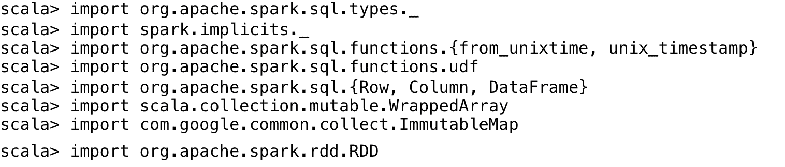

# 家庭用电数据集的预处理

为家庭用电量创建一个名为`HouseholdEPC`的`case`类:


将输入数据集读入 RDD，并计算其中的行数。

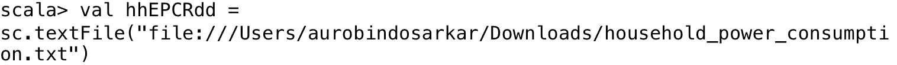

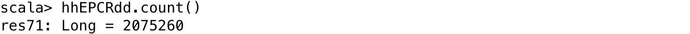

接下来，删除标题和所有其他包含缺失值的行(在输入中表示为`?'s`)，如下步骤所示:


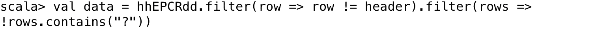

在下一步中，用我们前面定义的`case`类将`RDD [String]`转换为`RDD`，并将 RDD 转换为`HouseholdEPC`对象的数据框。

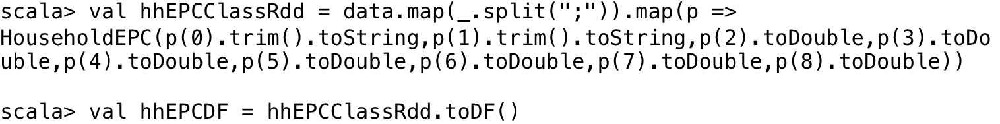

在数据框中显示一些示例记录，并计算其中的行数，以验证数据框中的行数是否与输入数据集中的预期行数相匹配。

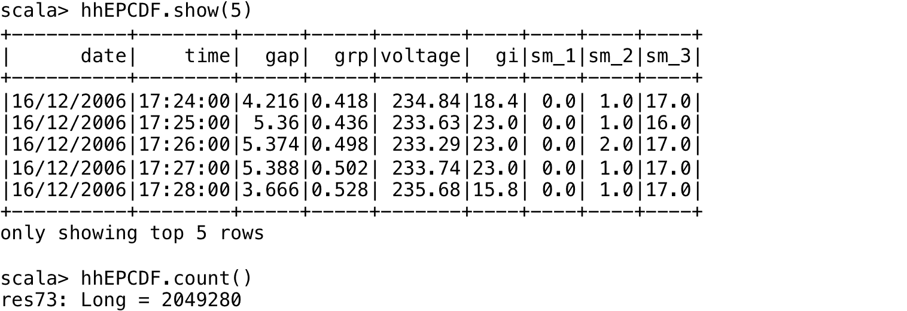

# 计算基本统计和聚合

接下来，计算并显示数据框中数值列的一些基本统计数据，以获得数据的感觉，我们将使用。


我们还可以显示四舍五入到小数点后四位的一些或所有列的基本统计数据。我们还可以通过在列名前加上一个`r`来重命名每一列，以区别于原始列名。


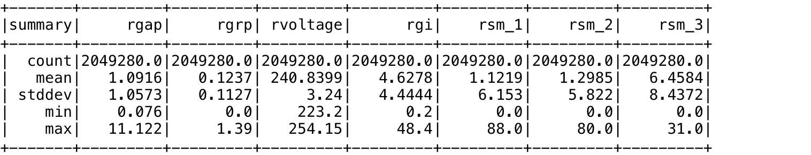

此外，我们使用聚合函数计算数据框中包含数据的不同天数:

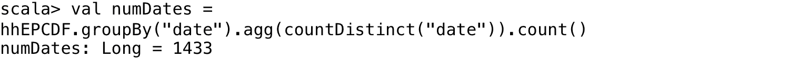

# 扩充数据集

我们可以用新的列来扩充数据框，包括星期几、月几、月几和年几的信息。例如，我们可能有兴趣研究工作日和周末的功耗。这有助于通过基于这些字段的可视化或旋转来更好地理解数据。


# 执行其他杂项处理步骤

如果需要，我们可以选择执行更多的步骤来帮助进一步清理数据，研究更多的聚合，或者转换为 typesafe 数据结构，等等。

我们可以删除时间列，并使用聚合函数(如每天读数的总和和平均值)聚合各列中的值。这里，我们用`d`前缀来重命名这些列，以表示日值。

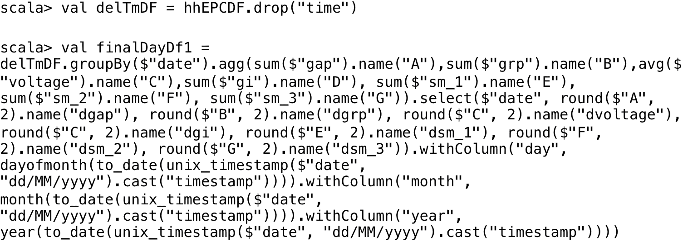

我们显示了该数据框中的一些示例记录:

```scala
scala> finalDayDf1.show(5)
```

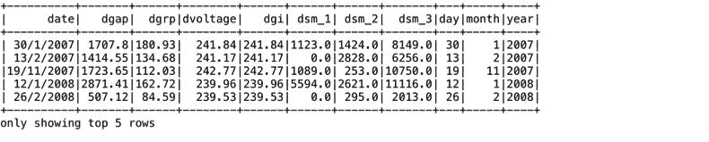

在这里，我们按年份和月份对读数进行分组，然后计算读数的数量并显示每个月份的读数。第一个月的读数很低，因为数据是在半个月内获得的。


我们还可以使用`case`类将数据框转换为数据集，如下所示:


现阶段，我们已经完成了家庭用电数据集预处理的所有步骤。我们现在将重点转移到处理天气数据集。

# 天气数据集的预处理

首先，我们为天气读数定义一个`case`类。

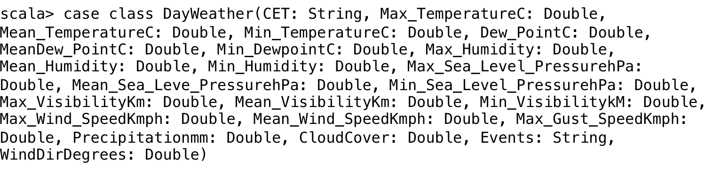

接下来，我们读入四个文件的每日天气读数(从巴黎天气网站下载)，大约与家庭电力消耗读数的持续时间相同。


从每个输入文件中删除标题，如下所示。我们显示了标题值的输出，因此您可以了解这些数据集中捕获的各种天气读数参数:


# 分析丢失的数据

如果我们想知道 RDD 中包含一个或多个缺失字段的行数，我们可以用这些行创建一个 RDD:

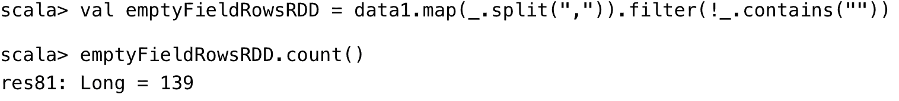

如果我们的数据在数据框中可用，我们也可以这样做，如图所示:

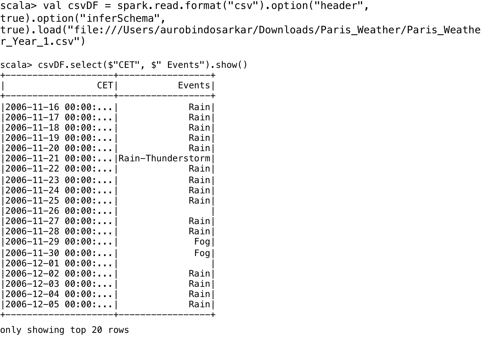

对数据集的快速检查显示，大部分缺失数据的行在“事件”和“最大阵风速度公里/小时”列中也有缺失值。实际上，对这两个列值进行筛选会捕获所有缺少字段值的行。它还与 RDD 缺失值的结果相匹配。

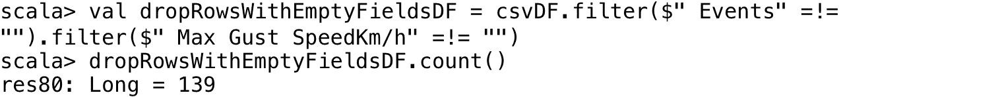

由于有许多行包含一个或多个缺失字段，我们选择保留这些行，以确保不会丢失有价值的信息。在下面的函数中，我们在 RDD 的所有缺失字段中插入`0`。

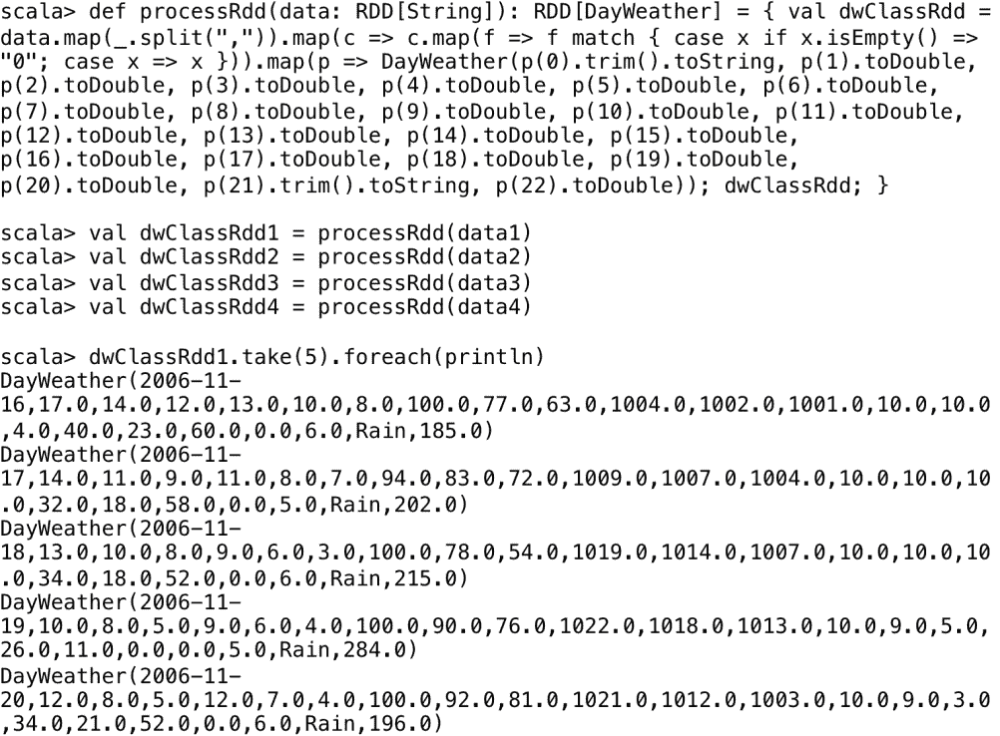

我们可以将上一步插入的`0`替换为字符串字段中的`NA`，如下所示:


在这个阶段，我们可以使用`union`操作将四个数据集的行组合成一个数据集。


在这个阶段，包含天气数据的第二个数据集的处理已经完成。在下一节中，我们使用`join`操作组合这些预处理数据集。

# 使用 JOIN 操作组合数据

在本节中，我们将介绍 JOIN 操作，其中每天的家庭用电量与天气数据相结合。我们假设家庭用电量读数的位置和天气读数足够接近，可以相关联。

接下来，我们使用连接操作将日常家庭电力消耗数据集与天气数据集相结合。


验证最终数据帧中的行数和`join`操作后预期的行数，如下所示:


您可以计算新加入的数据集中各列之间的一系列相关性，该数据集中包含来自两个原始数据集中每一个的列，以了解列之间关系的强度和方向，如下所示:


同样，您可以加入按年和月分组的数据集，以获得更高级别的数据摘要。

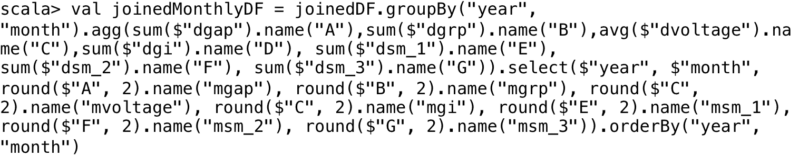

为了可视化汇总的数据，我们可以在 Apache Zeppelin 笔记本中执行前面的语句。例如，我们可以通过将`joinedMonthlyDF`转换为表格，然后从中选择适当的列来绘制每月**全球无功功率** ( **GRP** )值，如下所示:

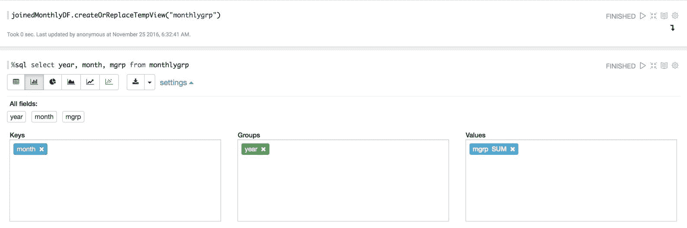


同样，如果您想按一周中的某一天分析读数，请按照所示步骤操作:


最后，我们打印连接的数据集的模式(用星期几列来扩充)，这样您就可以进一步探索这个数据框架的各个字段之间的关系:


在下一节中，我们将重点转移到收集文本数据上。

# 标记文本数据

在本节中，我们将探讨典型文本分析情况下的数据收集技术。许多基于文本的分析任务需要计算字数、删除停止词、词干等。此外，我们还将探讨如何从 HDFS 目录中一次处理一个文件。

首先，我们导入将在本节中使用的所有类:

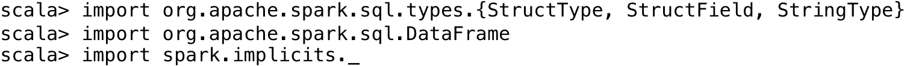

# 处理多个输入数据文件

在接下来的几个步骤中，我们初始化一组变量来定义包含输入文件的目录和一个空的 RDD。我们还从输入的 HDFS 目录中创建一个文件名列表。在下面的例子中，我们将使用包含在单个目录中的文件；然而，这些技术可以很容易地扩展到所有 20 个新闻组子目录。


接下来，我们编写一个函数来计算每个文件的字数，并将结果收集在一个`ArrayBuffer`中:


我们包含了一个 print 语句来显示文件名，如下所示:

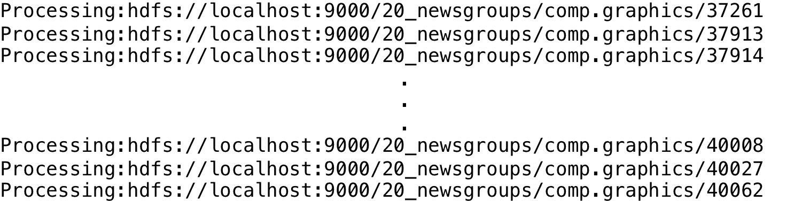

我们使用`union`操作将行添加到单个 RDD 中:


我们可以在处理每个文件时直接执行 union 步骤，如下所示:


然而，使用`RDD.union()`会在谱系图中创建一个新的步骤，每个新的 RDD 都需要一组额外的堆栈帧。这很容易导致堆栈溢出情况。相反，我们使用`SparkContext.union()`，它一次执行`union`操作，没有额外的内存开销。

我们可以缓存并打印输出 RDD 的样本行，如下所示:


在下一节中，我们将向您展示过滤掉停止词的方法。为了简单起见，我们只关注文本中格式良好的单词。但是，您可以使用字符串函数和正则表达式轻松添加条件来过滤掉我们数据中的特殊字符和其他异常(详细示例，请参考[第 9 章](09.html#4U9TC0-e9cbc07f866e437b8aa14e841622275c)、*使用 Spark SQL 开发应用)*。

# 删除停止词

在我们的示例中，我们创建了一组停止词，并从每个文件中包含的词中过滤掉它们。通常，在远程节点上执行的 Spark 操作在函数中使用的变量的单独副本上工作。我们可以使用一个广播变量在集群中的每个节点上维护一个只读的、缓存的停止字集合的副本，而不是将它的副本与要在节点上执行的任务一起发送。Spark 试图有效地分配广播变量，以减少整体通信开销。此外，我们还过滤掉函数返回的空列表，作为过滤过程的结果，并停止单词删除。


我们可以从 RDD 的每个元组中提取单词，并创建包含它们的数据帧，如下所示:


在下面的例子中，我们展示了另一种从单词列表中过滤掉停止单词的方法。为了改进两个列表之间的单词匹配，我们以类似于从输入文件中提取单词的方式处理停止单词文件。我们读取包含停止词的文件，删除前导和尾随空格，转换为小写，替换特殊字符，过滤掉空词，最后创建一个数据框(包含停止词)。

We use the list of stop words available at [http://algs4.cs.princeton.edu/35applications/stopwords.txt](http://algs4.cs.princeton.edu/35applications/stopwords.txt) in our example.


这里，我们使用一个`regex`来过滤掉文件中包含的特殊字符。

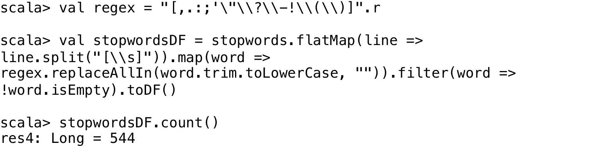

接下来，我们比较从原始单词列表中删除停止单词前后列表中的单词数量。剩余单词的最终数量表明，我们的输入文件中的大多数单词是停止单词。


有关文本数据处理(年度`10-K`财务归档文档和其他文档库)的更详细内容，包括构建预处理数据管道、识别文档库中的主题、使用朴素贝叶斯分类器以及开发机器学习应用，请参考[第 9 章](09.html#4U9TC0-e9cbc07f866e437b8aa14e841622275c)、*使用 Spark SQL 开发应用。*

在下一节中，我们将重点转移到使用 Cloudera 的`spark-time-series`库收集时间序列数据。

# 孟氏时间序列数据

时间序列数据是链接到时间戳的一系列值。在本节中，我们使用 Cloudera 的`spark-ts`包来分析时间序列数据。

Refer to *Cloudera Engineering Blog*, *A New Library for Analyzing Time-Series Data with Apache Spark*, for more details on time-series data and its processing using `spark-ts`. This blog is available at: [https://github.com/sryza/spark-timeseries](https://github.com/sryza/spark-timeseries).

`spark-ts`包可通过以下网址下载和构建:

[https://github . com/sryza/spark-time series](https://github.com/sryza/spark-timeseries)。

我们将在以下小节中尝试实现以下目标:

*   时间序列数据集的预处理
*   处理日期字段
*   持久化和加载数据
*   定义日期时间索引
*   使用`TimeSeriesRDD`对象
*   处理缺失的时间序列数据
*   计算基本统计

对于本节，如图所示，在启动 Spark 外壳时指定包含`spark-ts.jar`文件:


我们从雅虎财经网站下载了包含六只股票一年期间的定价和成交量数据的数据集。在使用`spark-ts`包进行时间序列数据分析之前，我们需要对数据进行预处理。

导入本节要求的类。


# 时间序列数据集的预处理

从输入数据文件中读取数据，并定义一个`case`类股票，包含数据集中的字段和一个用于保存股票代码的字段。

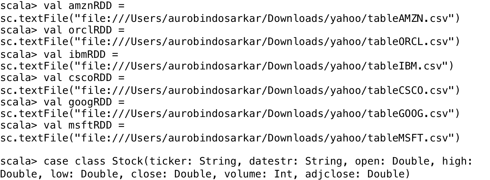

接下来，我们从每个文件中移除标题，使用`case`类映射我们的 RDD 行，包括一个用于跑马灯符号的字符串，并将 RDD 转换为数据帧。


接下来，我们使用`union`组合每个数据帧中的行。

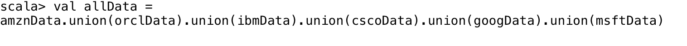

# 处理日期字段

在下一步中，我们将日期列分成三个独立的字段，包含日、月和年信息。

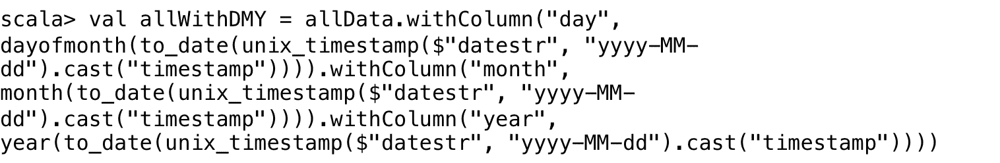

# 持久化和加载数据

在这个阶段，我们可以使用`DataFrameWriter`类将我们的数据帧保存到一个 CSV 文件中。如果文件已经存在于先前执行的`write`操作中，覆盖模式允许您覆盖该文件:


为了加载上一步写入磁盘的时间序列数据集，我们定义了一个函数来从文件中加载我们的观察值并返回一个数据帧:

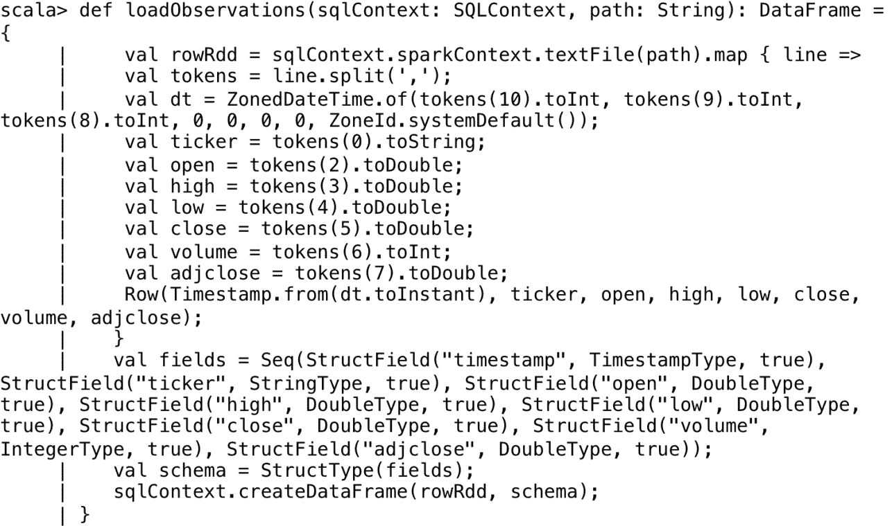

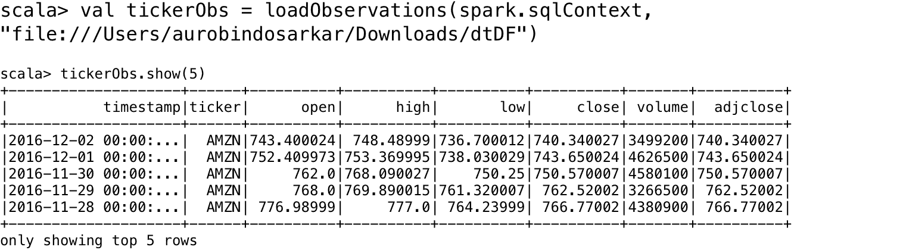

# 定义日期时间索引

我们为我们拥有数据的时间段定义了一个日期时间索引，以便每条记录(对于特定的股票代码)包括一个时间序列，该时间序列表示为一年中每一天的`366`位置的数组(加上我们从 2015 年 4 月 12 日到 2016 年 4 月 12 日下载数据的额外一天)。工作日频率指定数据仅适用于一年中的工作日。


# 使用时间体验添加对象

`spark-ts`库中的主要抽象是一个名为`TimeSeriesRDD`的 RDD。数据是一组观察值，表示为(时间戳、密钥、值)的元组。密钥是用于识别时间序列的标签。在下面的例子中，我们的元组是(时间戳、跑马灯、收盘)。RDD 的每个系列都以股票代码为关键，以股票的每日收盘价为价值。

```scala
scala> val tickerTsrdd = TimeSeriesRDD.timeSeriesRDDFromObservations(dtIndex, tickerObs, "timestamp", "ticker", "close") 
```

我们可以缓存和显示 RDD 的行数，这应该等于我们示例中的股票数量:


显示 RDD 的几行以查看每行中的数据:


# 处理缺失的时间序列数据

接下来，我们检查 RDD 的缺失数据。丢失的数据用`NaN`值标记。用存在的`NaN`值计算基本统计数据会产生误差。因此，我们需要用近似值代替这些缺失值。我们的示例数据不包含任何缺失字段。然而，作为练习，我们从输入数据集中删除一些值来模拟 RDD 的这些`NaN`值，然后使用线性插值估算这些值。其他可用的近似值包括下一个、上一个和最近的值。

我们填写缺失值的近似值，如下所示:


# 计算基本统计

最后，我们计算每个系列的平均值、标准偏差、最大值和最小值，如下所示:

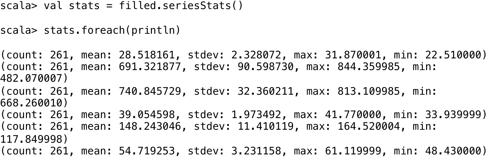

使用`TimeSeriesRDD`对象，还有许多其他有用的功能可用于探索性数据分析和数据管理。其中包括将 RDD 作为本地时间序列进行收集、查找特定的时间序列、各种过滤器和切片功能、对数据进行排序和重新分区、将时间序列写入 CSV 文件等等。

# 处理可变长度记录

在本节中，我们将探索一种处理可变长度记录的方法。我们的方法本质上是将每一行转换成一个固定长度的记录，等于最大长度记录。在我们的示例中，由于每一行代表一个投资组合，并且没有唯一的标识符，因此该方法对于将数据操作到熟悉的固定长度记录案例中非常有用。我们将生成必要数量的字段，使其等于最大投资组合中股票的最大数量。这将导致空字段，其中股票数量少于任何投资组合中股票的最大数量。处理可变长度记录的另一种方法是使用`explode()`函数为给定投资组合中的每只股票创建新行(有关使用`explode()`函数的示例，请参考[第 9 章](09.html#4U9TC0-e9cbc07f866e437b8aa14e841622275c)、*使用 Spark SQL 开发应用)。*

为了避免重复前面示例中的所有步骤来读入所有文件，在本例中，我们将数据合并为一个输入文件。

首先，我们导入所需的类，并将输入文件读入 RDD:


我们计算投资组合的总数，并打印一些来自 RDD 的记录。你可以看到，虽然第一个和第二个投资组合各包含一只股票，但第三个投资组合包含两只股票。


# 将可变长度记录转换为固定长度记录

在我们的示例数据集中，没有字段丢失，因此，我们可以使用每行中的逗号数量来导出每个投资组合中不同数量的股票相关字段。或者，可以从 RDD 的最后一个字段中包含的字符串中提取该信息。

接下来，我们创建一个 UDF，通过计算每行中逗号的数量来间接计算股票的数量。我们使用`describe`找到数据集中所有行的最大逗号数量。


在下一步中，我们用包含逗号数量的列来扩充数据框。


然后我们编写一个函数，在每行的适当位置插入正确数量的逗号:

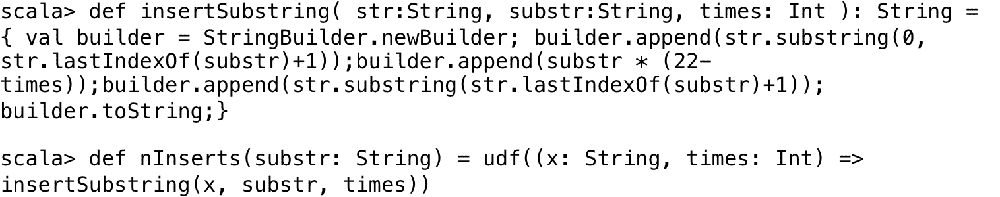

接下来，我们删除逗号列的数量，因为它在后续步骤中不是必需的:


在这个阶段，如果您想消除数据框中的重复行，那么您可以使用如下所示的`dropDuplicates`方法:


下一步，我们为最大投资组合中股票数量最多的`Portfolio`定义一个`case`类。

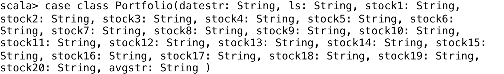

接下来，我们将 RDD 转换为数据帧。为了方便起见，我们将使用较少的股票相关列来演示操作；但是，同样的情况也可以扩展到投资组合中其他股票的字段:


我们可以用`NA`替换较小投资组合中股票的空字段，如下所示:


# 从“杂乱”的列中提取数据

在本节中，我们继续上一节的内容，但是，我们将使用单个股票来演示将数据字段修改到最终数据比开始时更干净、更丰富的状态所需的数据操作。

由于大多数字段包含几条信息，我们将执行一系列语句，将它们分成各自独立的列:


在下一步中，我们删除`datestr`列中第一个带空格的下划线。这将导致日期字段分离:


接下来，我们将股票列中的信息分离出来，因为它包含几条有用的信息，包括股票代码、卖价和买价的比率以及卖价和买价。首先，我们通过用空字符串替换股票列中的`=`来去掉它:

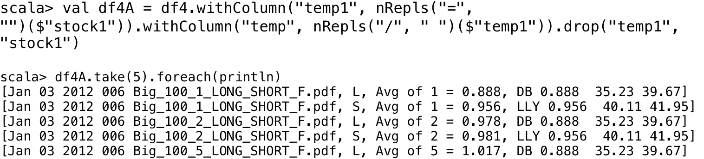

接下来，每列中由空格分隔的值被转换为一个值数组:

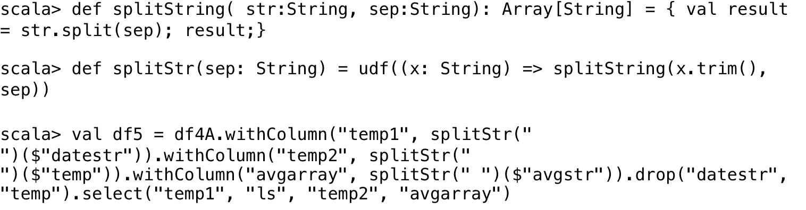


接下来，我们使用`UDF`从每一列的数组中挑选某些元素到它们自己单独的列中。


文件列对我们的分析不是特别有用，除了提取文件名开头的信息，该信息表示为任何给定投资组合挑选股票的股票池。我们接下来这样做，如下所示:


以下是数据帧的最终版本，已准备好进行进一步分析。在这个例子中，我们已经处理了一只股票，但是您可以轻松地将相同的技术扩展到任何给定投资组合中的所有股票，以获得最终的、干净的和丰富的数据框架，为查询、建模和分析做好准备。


在下一节中，我们将简要介绍为使用 Spark MLlib 机器学习算法处理分类问题准备数据所需的步骤。

# 为机器学习准备数据

在本节中，我们将介绍在应用 Spark MLlib 算法之前准备输入数据的过程。通常，我们需要有两个名为 label 和 features 的列来使用 Spark MLlib 分类算法。我们将用下面描述的例子来说明这一点:

我们导入该部分所需的类:

```scala
scala> import org.apache.spark.ml.Pipelinescala> import org.apache.spark.ml.classification.{RandomForestClassificationModel, RandomForestClassifier}scala> import org.apache.spark.ml.evaluation.MulticlassClassificationEvaluatorscala> import org.apache.spark.ml.feature.{IndexToString, StringIndexer, VectorIndexer} 
scala> import org.apache.spark.ml.linalg.Vectors 
```

# 机器学习的数据预处理

我们定义一组`UDFs`用于本节。例如，这些包括检查字符串是否包含特定的子字符串，并返回一个`0.0`或`1.0`值来创建标签列。另一个`UDF`用于从数据框中的数值字段创建特征向量。

例如，我们可以通过宁滨将星期几字段转换为数值，如下所示:


在我们的示例中，我们根据某一天是否下雨，从家庭用电量数据集的`Events`列创建`label`。出于说明的目的，我们在之前加入的数据框中使用了来自家庭电力消耗读数的列，尽管来自天气数据集的读数可能是更好的降雨预测值。

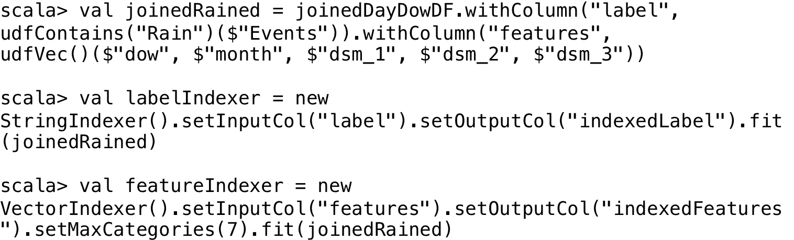

最后，我们还可以分割我们的数据框架来创建训练和测试数据集，分别包含随机选择的 70%和 30%的读数。这些数据集用于训练和测试机器学习算法。


# 创建和运行机器学习管道

在本节中，我们给出了一个机器学习管道的例子，它使用索引器和训练数据来训练一个随机森林模型。我们将不提供对这些步骤的详细解释，因为我们在这里的主要目的只是演示如何实际使用上一节中的准备步骤。

```scala
scala> val rf = new RandomForestClassifier().setLabelCol("indexedLabel").setFeaturesCol("indexedFeatures").setNumTrees(10)scala> // Convert indexed labels back to original labels.scala> val labelConverter = new IndexToString().setInputCol("prediction").setOutputCol("predictedLabel").setLabels(labelIndexer.labels)scala> // Chain indexers and forest in a Pipeline.scala> val pipeline = new Pipeline().setStages(Array(labelIndexer, featureIndexer, rf, labelConverter))scala> // Train model. This also runs the indexers.scala> val model = pipeline.fit(trainingData)scala> // Make predictions.scala> val predictions = model.transform(testData)scala> // Select example rows to display.scala> predictions.select("predictedLabel", "label", "features").show(5)
```


```scala
scala> // Select (prediction, true label) and compute test error.scala> val evaluator = new MulticlassClassificationEvaluator().setLabelCol("indexedLabel").setPredictionCol("prediction").setMetricName("accuracy")scala> val accuracy = evaluator.evaluate(predictions)accuracy: Double = 0.5341463414634147                                          scala> println("Test Error = " + (1.0 - accuracy))Test Error = 0.46585365853658534scala> val rfModel = model.stages(2).asInstanceOf[RandomForestClassificationModel]scala> println("Learned classification forest model:\n" + rfModel.toDebugString)
```


关于 Spark MLlib 处理的特定数据结构和操作的更多细节，包括向量、处理分类变量等，将在[第 6 章](06.html#3279U0-e9cbc07f866e437b8aa14e841622275c)、 **在机器学习应用中使用 Spark SQL、** 和[第 9 章](09.html#4U9TC0-e9cbc07f866e437b8aa14e841622275c)、*使用 Spark SQL 开发应用*中介绍。此外，[第 7 章](07.html#3VPBC0-e9cbc07f866e437b8aa14e841622275c)、*、*介绍了在图应用中使用 Spark SQL 的技术*、*。

# 摘要

在本章中，我们探索了使用 Spark SQL 来执行一些基本的数据收集/争论任务。我们讨论了管理文本数据、处理可变长度记录、从“混乱”的列中提取数据、使用 JOIN 组合数据以及为机器学习应用准备数据。此外，我们使用`spark-ts`库处理时间序列数据。

在下一章中，我们将把重点转移到 Spark Streaming 应用。我们将向您介绍如何在这样的应用中使用 Spark SQL。我们还将包括大量的实践课程，演示 Spark SQL 在 Spark 流式应用中实现常见用例的使用。