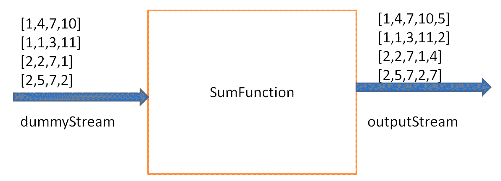
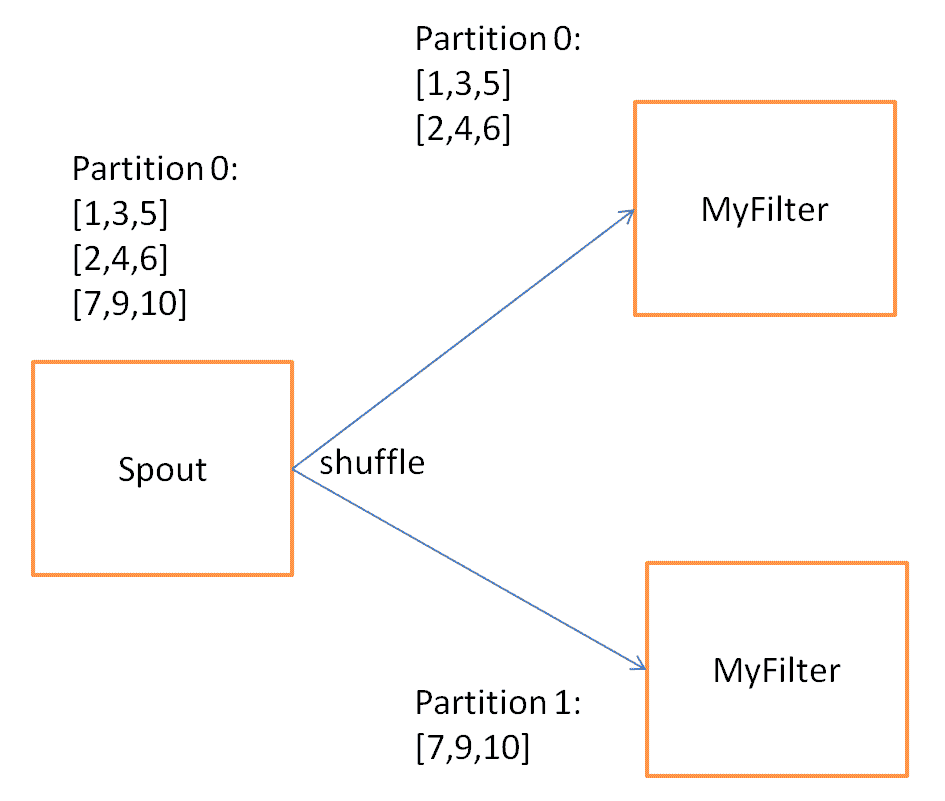
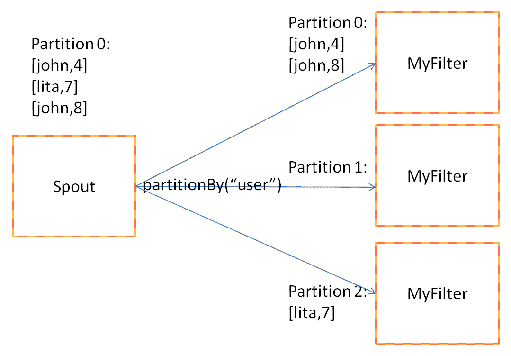
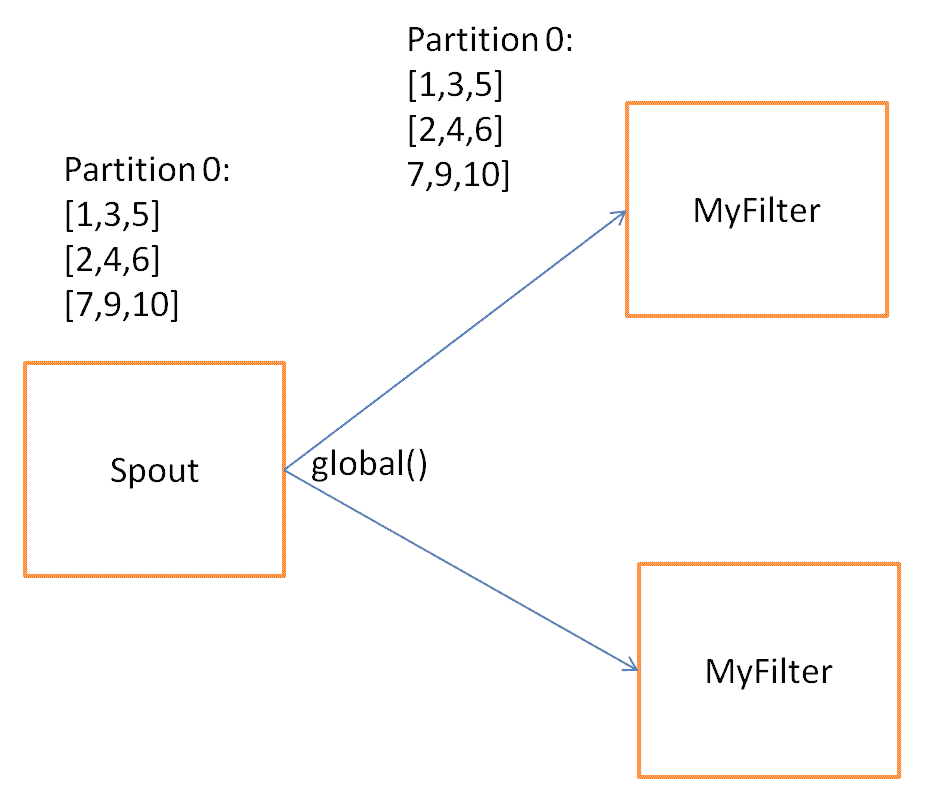
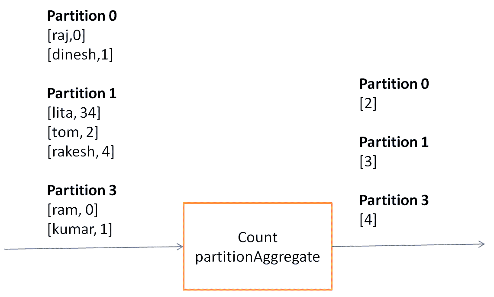

# 四、Trident 简介

在前面的章节中，我们介绍了 Storm 的体系结构、拓扑结构、螺栓、喷嘴、元组等等。 在本章中，我们将介绍 Trident，它是对 Storm 的高级抽象。

在本章中，我们将介绍以下几点：

*   Trident 简介
*   了解 Trident 的数据模型
*   编写 Trident 函数、过滤器和投影
*   Trident 重新分区操作
*   Trident 聚合器
*   何时使用 Trident

# Trident 简介

Trident 是建立在 Storm 之上的高级抽象。 Trident 支持有状态流处理，而 Pure Storm 是一个无状态处理框架。 使用 Trident 的主要优点是它保证进入拓扑的每条消息都只处理一次，这是使用 Vanilla Storm 难以实现的。 Trident 的概念类似于在 Hadoop 上开发的高级批处理工具，如 Cascading 和 Pig。 为了实现只需一次处理，Trident 以小批方式处理输入流。 我们将在[第 5 章](05.html#318PC0-6149dd15e07b443593cc93f2eb31ee7b)，*Trident 拓扑和使用*，*Trident 状态*一节中详细介绍这一点。

在前三章中，我们了解到，在 Storm 的拓扑中，喷嘴是元组的来源。 元组是 Storm 应用可以处理的数据单元，而螺栓是我们编写转换逻辑的处理引擎。 但在 Trident 拓扑中，螺栓被函数、聚合、筛选器和状态的更高级别语义所取代。

# 了解 Trident 的数据模型

Trident 元组是 Trident 拓扑的数据模型。 Trident 元组是 Trident 拓扑可以处理的基本数据单元。 每个元组由预定义的字段列表组成。 每个字段的值可以是字节、字符、整数、长整型、浮点型、双精度型、布尔型或字节数组。 在拓扑构建过程中，对元组执行操作，这将向元组添加新字段或用一组新字段替换元组。

元组中的每个字段都可以按名称`(getValueByField(String))`或其在元组中的位置索引`(getValue(int))`进行访问。 Trident 元组还提供了方便的方法，例如`getIntegerByField(String)`，它使您不必对对象进行类型转换。

# 编写 Trident 函数、过滤器和投影

本节介绍 Trident 函数、过滤器和投影的定义。 Trident 函数、过滤器和投影用于根据特定标准修改/过滤输入元组。 本节还介绍了如何编写 Trident 函数、过滤器和投影。

# Trident 功能

Trident 函数包含修改原始元组的逻辑。 Trident 函数获取元组的一组字段作为输入，并发出一个或多个元组作为输出。 输出元组的字段与输入元组的字段合并以形成完整的元组，该元组将传递到拓扑中的下一个操作。 如果 Trident 函数没有发出与输入元组对应的元组，则从流中删除该元组。

我们可以通过扩展`storm.trident.operation.BaseFunction`类并实现`execute(TridentTuple tuple, TridentCollector collector)`方法来编写自定义的 Trident 函数。

让我们编写示例 Trident 函数，它将返回名为`sum`的新字段：

```scala
public class SumFunction extends BaseFunction { 

  private static final long serialVersionUID = 5L; 

  public void execute(TridentTuple tuple, TridentCollector collector) { 
    int number1 = tuple.getInteger(0); 
    int number2 = tuple.getInteger(1); 
    int sum = number1+number2; 
    // emit the sum of first two fields 
    collector.emit(new Values(sum)); 

  } 

} 
```

假设我们获得`dummyStream`作为输入，它包含四个字段`a`、`b`、`c`、`d`，并且只有字段`a`和`b`作为输入字段传递给`SumFunction`函数。 `SumFunction`类发出新的 a 字段`sum`。 由`SumFunction`类的`execute`方法发出的`sum`字段与输入元组合并，形成完整的元组。 因此，输出元组中的字段总数为`5 (a, b, c, d, sum)`。 下面是一段示例代码，它展示了如何将输入字段和新字段的名称传递给 Trident 函数：

```scala
dummyStream.each(new Fields("a","b"), new SumFunction (), new Fields("sum")) 
```

下图显示了输入元组`SumFunction`和输出元组。 输出元组包含五个字段`a`、`b`、`c`、`d`和`sum`：



# Trident 过滤器

Trident 筛选器获取一组字段作为输入，并根据是否满足特定条件返回 TRUE 或 FALSE。 如果返回 true，则将元组保留在输出流中；否则，从流中删除元组。

我们可以通过扩展`storm.trident.operation.BaseFilter`类并实现`isKeep(TridentTuple tuple)`方法来编写自定义的 Trident 过滤器。

让我们编写一个样例 Trident 过滤器，它将检查输入字段的和是偶数还是奇数。 如果和为偶数，则 Trident 过滤器发出 TRUE；否则发出 FALSE：

```scala
public static class CheckEvenSumFilter extends BaseFilter{ 

  private static final long serialVersionUID = 7L; 

  public boolean isKeep(TridentTuple tuple) { 
    int number1 = tuple.getInteger(0); 
    int number2 = tuple.getInteger(1); 
    int sum = number1+number2; 
    if(sum % 2 == 0) { 
      return true; 
    } 
    return false; 
  } 

} 
```

假设我们获得`dummyStream`作为输入，它包含四个字段`a`、`b`、`c`、`d`，并且只有字段`a`和`b`作为输入字段传递给`CheckEvenSumFilter`过滤器。 `CheckEvenSumFilter`类的`execute`方法将只发出那些`a`和`b`之和为偶数的元组。 下面是一段示例代码，它显示了如何定义 Trident 过滤器的输入字段：

```scala
dummyStream.each(new Fields("a","b"), new CheckEvenSumFilter ()) 
```

下图显示了输入元组、`CheckEvenSumFilter`和输出元组。 `outputStream`仅包含字段`a`和`b`之和为偶数的元组：


# Trident 投影

Trident 投影仅保留在投影操作中指定的流中的那些字段。 假设一个输入流包含三个字段`x`、`y`和`z`，并且我们将字段`x`传递给投影操作，那么输出元组将包含单个字段`x`。 下面这段代码展示了如何使用投影操作：

```scala
mystream.project(new Fields("x")) 
```

下图显示了 Trident 投影：


# Trident 重新分区操作

通过执行重新分区操作，用户可以跨多个任务对元组进行分区。 重新分区操作不会对元组的内容进行任何更改。 此外，元组将仅通过网络进行重新分区操作。 以下是不同类型的重新分区操作。

# 利用混洗操作

此重新分区操作以统一、随机的方式跨多个任务对元组进行分区。 当我们想要在任务间均匀分配处理负载时，通常使用这种重新分区操作。 下图显示了如何使用`shuffle`操作对输入元组进行重新分区：



下面是一段代码，它展示了如何使用`shuffle`操作：

```scala
mystream.shuffle().each(new Fields("a","b"), new myFilter()).parallelismHint(2) 
```

# 利用分区按操作

此重新分区操作使您能够根据元组中的字段对流进行分区。 例如，如果您希望特定用户的所有 tweet 都转到同一目标分区，则可以按以下方式对 tweet 流进行分区，方法是将`partitionBy`应用到`username`字段：

```scala
mystream.partitionBy(new Fields("username")).each(new Fields("username","text"), new myFilter()).parallelismHint(2) 
```

`partitionBy`操作应用以下公式来决定目标分区：

*目标分区=哈希(字段)%(目标分区数)*

如前面的公式所示，`partitionBy`操作计算输入字段的散列以确定目标分区。 因此，它不能保证所有任务都会得到要处理的元组。 例如，如果您将`partitionBy`应用于一个字段(例如`X`)，只有两个可能的值`A`和`B`，并为`MyFilter`筛选器创建了两个任务，则 hash(`A`)%2 和 hash(`B`)%2 可能相等，这将导致所有元组被路由到单个任务，而其他元组完全空闲。

下图显示了如何使用`partitionBy`操作对输入元组进行重新分区：



如上图所示，**分区 0**和**分区 2**包含一组元组，但**分区 1**为空。

# 利用全球运营

此重新分区操作将所有元组路由到同一分区。 因此，为流中的所有批选择相同的目标分区。 下面的图表显示了如何使用`global`操作对元组进行重新分区：



下面是一段代码，它展示了如何使用`global`操作：

```scala
mystream.global().each(new Fields("a","b"), new myFilter()).parallelismHint(2) 
```

# 利用广播操作

`broadcast`操作是一种特殊的重新分区操作，它不对元组进行分区，而是将它们复制到所有分区。 下面的图表显示了元组是如何通过网络发送的：


下面是一段代码，它展示了如何使用`broadcast`操作：

```scala
mystream.broadcast().each(new Fields("a","b"), new myFilter()).parallelismHint(2) 
```

# 利用 BatchGlobal 操作

此重新分区操作将属于一批的所有元组发送到同一分区。 同一流的其他批次可以转到不同的分区。 顾名思义，这种重新分区在批处理级别是全局的。 下面的图表显示了如何使用`batchGlobal`操作对元组进行重新分区：


下面是一段代码，它展示了如何使用`batchGlobal`操作：

```scala
mystream.batchGlobal().each(new Fields("a","b"), new myFilter()).parallelismHint(2) 
```

# 利用分区操作

如果前面的重新分区都不适合您的用例，您可以通过实现`org.apche.storm.grouping.CustomStreamGrouping`接口来定义您自己的自定义重新分区函数。

下面是一个示例自定义重新分区，它根据`country`字段的值对流进行分区：

```scala
public class CountryRepartition implements CustomStreamGrouping, Serializable { 

  private static final long serialVersionUID = 1L; 

  private static final Map<String, Integer> countries = ImmutableMap.of ( 
    "India", 0,  
    "Japan", 1,  
    "United State", 2,  
    "China", 3, 
    "Brazil", 4 
  ); 

  private int tasks = 0; 

  public void prepare(WorkerTopologyContext context, GlobalStreamId stream, List<Integer> targetTasks)  
    { 
      tasks = targetTasks.size(); 
    } 

  public List<Integer> chooseTasks(int taskId, List<Object> values) { 
    String country = (String) values.get(0);    
    return ImmutableList.of(countries.get(country) % tasks); 
  } 
} 
```

`CountryRepartition`类实现`org.apache.storm.grouping.CustomStreamGrouping`接口。 `chooseTasks()`方法包含重新分区逻辑，用于标识输入元组拓扑中的下一个任务。 `prepare()`方法在开始时被调用并执行初始化活动。

# Trident 聚合器

Trident 聚合器用于对输入批、分区或输入流执行聚合操作。 例如，如果用户想要计算每批中存在的元组数量，那么我们可以使用计数聚合器来计算每批中的元组数量。 聚合器的输出完全替换输入元组的值。 在 Trident 中有三种类型的聚合器：

*   `partitionAggregate`
*   `aggregate`
*   `persistenceAggregate`

让我们详细了解一下每种类型的聚合器。

# 分区聚合

顾名思义，`partitionAggregate`在每个分区上工作，而不是在整个批上工作。 `partitionAggregate`的输出完全替换了输入元组。 此外，`partitionAggregate`的输出包含一个单字段元组。 下面是一段代码，展示了如何使用`partitionAggregate`：

```scala
mystream.partitionAggregate(new Fields("x"), new Count() ,new new Fields("count")) 
```

例如，我们得到一个包含字段`x`和`y`的输入流，并对每个分区应用一个`partitionAggregate`函数；输出元组包含一个称为`count`的字段。 `count`字段表示输入分区中出现的元组数量：



# 集合，聚集

`aggregate`对每个批次起作用。 在聚合过程中，首先使用全局操作对元组进行重新分区，以将同一批的所有分区合并为单个分区，然后在每个批上运行聚合函数。 下面是一段代码，展示了如何使用`aggregate`：

```scala
mystream.aggregate(new Fields("x"), new Count() ,new new Fields("count")) 
```

Trident 中提供了三种类型的聚合器界面：

*   `ReducerAggregator`
*   `Aggregator`
*   `CombinerAggregator`

这三个聚合器接口也可以与`partitionAggregate`一起使用。

# 减速器聚集器

`ReducerAggregator`首先在输入流上运行全局重新分区操作，将同一批处理的所有分区合并为单个分区，然后在每个批处理上运行聚合函数。 `ReducerAggregator<T>`接口包含以下方法：

*   `init()`：此方法返回初始值
*   `Reduce(T curr, TridentTuple tuple)`：此方法迭代输入元组并发出具有单个值的单个元组

此示例显示如何使用`ReducerAggregator`实现`Sum`：

```scala
public static class Sum implements ReducerAggregator<Long> { 

  private static final long serialVersionUID = 1L; 
  /** return the initial value zero     
  */ 
  public Long init() { 
    return 0L; 
  } 
  /** Iterates on the input tuples, calculate the sum and   
  * produce the single tuple with single field as output. 
  */ 
  public Long reduce(Long curr, TridentTuple tuple) {                       
    return curr+tuple.getLong(0);              
  } 

} 
```

# 集合商 / 聚合器 / 汇集者 / 聚合

`Aggregator`首先在输入流上运行全局重新分区操作，将同一批处理的所有分区合并为单个分区，然后在每个批处理上运行聚合函数。 根据定义，`Aggregator`看起来与`ReduceAggregator`非常相似。 `BaseAggregator<State>`包含以下方法：

*   `init(Object batchId, TridentCollector collector)`：在开始批处理之前调用`init()`方法。 此方法返回`State`对象，该对象将用于保存批处理的状态。 此对象由`aggregate()`和`complete()`方法使用。
*   `aggregate (State s, TridentTuple tuple, TridentCollector collector)`：此方法迭代给定批的每个元组。 此方法在处理每个元组后更新`State`对象中的状态。
*   `complete(State state, TridentCollector tridentCollector)`：如果处理了给定批次的所有元组，则在结束时调用此方法。 此方法返回与每个批对应的单个元组。

下面是一个示例，说明如何使用`BaseAggregator`实现求和：

```scala
public static class SumAsAggregator extends BaseAggregator<SumAsAggregator.State> { 

  private static final long serialVersionUID = 1L; 
  // state class 
  static class State { 
    long count = 0; 
  } 
  // Initialize the state 
  public State init(Object batchId, TridentCollector collector) { 
    return new State(); 
  } 
  // Maintain the state of sum into count variable.   
  public void aggregate(State state, TridentTuple tridentTuple, TridentCollector tridentCollector) { 
    state.count = tridentTuple.getLong(0) + state.count; 
  } 
  // return a tuple with single value as output  
  // after processing all the tuples of given batch.       
  public void complete(State state, TridentCollector tridentCollector) { 
    tridentCollector.emit(new Values(state.count)); 
  } 

} 
```

# CombinerAgregator 组合 Agregator

`CombinerAggregator`首先在每个分区上运行`partitionAggregate`，然后运行全局重新分区操作以将同一批的所有分区合并到单个分区中，然后在最后一个分区上重新运行`aggregator`以发出所需的输出。 与其他两个聚合器相比，这里的网络传输较少。 因此，`CombinerAggregator`的整体性能优于`Aggregator`和`ReduceAggregator`。

`CombinerAggregator<T>`接口包含以下方法：

*   `init()`：此方法在每个输入元组上运行，以从元组检索字段值。
*   `combine(T val1, T val2)`：此方法组合元组的值。 此方法发出具有单个字段作为输出的单个元组。
*   `zero()`：如果输入分区不包含元组，则此方法返回零。

此示例显示如何使用`CombinerAggregator`实现`Sum`：

```scala
public class Sum implements CombinerAggregator<Number> { 

  private static final long serialVersionUID = 1L; 

  public Number init(TridentTuple tridentTuple) { 
    return (Number) tridentTuple.getValue(0); 
  } 

  public Number combine(Number number1, Number number2) { 
    return Numbers.add(number1, number2); 
  } 

  public Number zero() { 
    return 0; 
  } 

} 
```

# 持之以恒的聚合

`persistentAggregate`处理流中所有批的所有元组，并将聚合结果持久化到状态源(内存、memcached、Cassandra 或其他数据库)。 下面是一些代码，展示了如何使用`persistentAggregate`：

```scala
mystream.persistentAggregate(new MemoryMapState.Factory(),new Fields("select"),new Count(),new Fields("count")); 
```

我们将在[第 5 章](05.html#318PC0-6149dd15e07b443593cc93f2eb31ee7b)，*Trident 拓扑和使用*，*Trident 状态*一节中详细讨论。

# 聚合器链

Trident 提供了将多个聚合器应用于同一输入流的功能，该过程称为**聚合器链接**。 下面是一段代码，展示了如何使用聚合器链：

```scala
mystream.chainedAgg() 
        .partitionAggregate(new Fields("b"), new Average(), new Fields("average")) 
        .partitionAggregate(new Fields("b"), new Sum(), new Fields("sum")) 
        .chainEnd(); 
```

我们已经对每个分区应用了`Average()`和`Sum()`聚合器。 `chainedAgg()`的输出包含与每个输入分区对应的单个元组。 输出元组包含两个字段`sum`和`average`。

下图显示了聚合器链的工作原理：


# 利用 groupBy 操作

`groupBy`操作不涉及任何重新分区。 `groupBy`操作将输入流转换为分组流。 `groupBy`操作的主要功能是修改后续聚合函数的行为。 下图显示了`groupBy`操作如何对单个分区的元组进行分组：


`groupBy`的行为取决于使用它的位置。 以下行为是可能的：

*   如果在`partitionAggregate`之前使用`groupBy`操作，则`partitionAggregate`将在分区内创建的每个组上运行`aggregate`。
*   如果在`aggregate`之前使用`groupBy`操作，则首先将同一批的元组重新分区为单个分区，然后将`groupBy`应用于每个单个分区，最后对每个组执行`aggregate`操作。

# 何时使用 Trident

使用 Trident 拓扑很容易实现只需一次的处理，而 Trident 就是为此目的而设计的。 香草 Storm 很难实现只需一次的处理，所以当我们需要只需要一次的处理时，Trident 将会很有用。

Trident 并不适合所有的用例，尤其是高性能的用例，因为 Trident 增加了 Storm 的复杂性并管理状态。

# 简略的 / 概括的 / 简易判罪的 / 简易的

在本章中，我们主要关注 Storm 上的 Trident 高级抽象，并了解了 Trident 过滤器、函数、聚合器和重新分区操作。

在下一章中，我们将介绍非事务拓扑、Trident 拓扑和使用分布式 RPC 的 Trident 拓扑。