# 五、基于 MLlib 的机器学习

在本章中，我们将介绍如何使用 PySpark 的 MLlib 模块构建机器学习模型。即使它现在被弃用，大多数模型现在被移到了 ML 模块，如果你把你的数据存储在 RDDs 中，你可以使用 MLlib 来做机器学习。您将学习以下食谱:

*   正在加载数据
*   探索数据
*   测试数据
*   转换数据
*   数据标准化
*   打造训练 RDD
*   预测普查对象的工作时间
*   预测普查对象的收入水平
*   构建聚类模型
*   计算性能统计

# 正在加载数据

为了建立机器学习模型，我们需要数据。因此，在我们开始之前，我们需要读取一些数据。在本食谱和本章中，我们将使用 1994 年的人口普查收入数据。

# 准备好

要执行这个食谱，你需要有一个工作的 Spark 环境。如果您没有，您可能想回到[第 1 章](1.html#OPEK0-dc04965c02e747b9b9a057725c821827)、*安装和配置 Spark*并遵循您将在那里找到的食谱。

数据集来源于[http://archive.ics.uci.edu/ml/datasets/Census+Income](http://archive.ics.uci.edu/ml/datasets/Census+Income)。

The dataset is located in the `data` folder in the GitHub repository for the book.

本章中您需要的所有代码都可以在我们为该书设置的 GitHub 资源库中找到:[http://bit.ly/2ArlBck](http://bit.ly/2ArlBck)；转到`Chapter05`打开`5\. Machine Learning with MLlib.ipynb`笔记本。

不需要其他先决条件。

# 怎么做...

我们将把数据读入一个数据框，这样我们就更容易处理了。稍后，我们将把它转换成标记点的 RDD。要读取数据，请执行以下操作:

```py
census_path = '../data/census_income.csv'

census = spark.read.csv(
    census_path
    , header=True
    , inferSchema=True
)
```

# 它是如何工作的...

首先，我们指定数据集的路径。在我们的例子中，与我们在本书中使用的所有其他数据集一样，`census_income.csv`位于`data`文件夹中，可从父文件夹访问。

接下来，我们使用`SparkSession`的`.read`属性，该属性返回`DataFrameReader`对象。`.csv(...)`方法的第一个参数指定了数据的路径。我们的数据集在第一行有列名，所以我们使用`header`选项指示读者使用第一行作为列名。`inferSchema`参数指示`DataFrameReader`自动检测每列的数据类型。

让我们检查数据类型推断是否正确:

```py
census.printSchema()
```

上述代码产生以下输出:


如您所见，某些列的数据类型被正确检测到；如果没有`inferSchema`参数，所有列都将默认为字符串。

# 还有更多...

然而，我们的数据集有一个小问题:大多数字符串列要么有前导空格，要么有尾随空格。以下是您可以纠正的方法:

```py
import pyspark.sql.functions as func

for col, typ in census.dtypes:
    if typ == 'string':
        census = census.withColumn(
            col
            , func.ltrim(func.rtrim(census[col]))
        )
```

我们遍历`census`数据框中的所有列。

The `.dtypes` property of a DataFrame is a list of tuples where the first element is the column name and the second element is the datatype.

如果列的类型等于字符串，我们应用两个函数:`.ltrim(...)`，它删除字符串中的任何前导空格，以及`.rtrim(...)`，它删除任何尾随空格。`.withColumn(...)`方法不会追加任何新列，因为我们为列重用了相同的名称:`col`。

# 探索数据

几乎每一个新的数据科学家都会犯一个错误，那就是直接进入数据建模；我们太渴望进入奖励阶段，所以我们忘记了这样一个事实，即大部分时间实际上都花在了清理数据和熟悉数据的无聊工作上。在这个食谱中，我们将探索人口普查数据集。

# 准备好

要执行这个食谱，你需要有一个工作的 Spark 环境。您应该已经完成了之前的配方，我们将普查数据加载到了数据框中。

不需要其他先决条件。

# 怎么做...

首先，我们列出想要保留的所有列:

```py
cols_to_keep = census.dtypes

cols_to_keep = (
    ['label','age'
     ,'capital-gain'
     ,'capital-loss'
     ,'hours-per-week'
    ] + [
        e[0] for e in cols_to_keep[:-1] 
        if e[1] == 'string'
    ]
)
```

接下来，我们选择数字和分类特征，因为我们将分别探讨这些特征:

```py
census_subset = census.select(cols_to_keep)

cols_num = [
    e[0] for e in census_subset.dtypes 
    if e[1] == 'int'
]
cols_cat = [
    e[0] for e in census_subset.dtypes[1:] 
    if e[1] == 'string'
]
```

# 它是如何工作的...

首先，我们提取所有列及其对应的数据类型。

We have already discussed the `.dtypes` property of DataFrame stores in the previous recipe.

我们将只保留`label`，这是保存一个关于一个人是否赚超过 5 万美元的标识符的列，以及一些其他的数字列。此外，我们继承了所有字符串特性。

接下来，我们创建一个只包含所选列的数据框，并提取所有数值和分类列；我们将这些分别存储在`cols_num`和`cols_cat`列表中。

# 数字特征

让我们探索一下数字特征。就像[第四章](4.html#5HC8K0-dc04965c02e747b9b9a057725c821827)、*准备建模数据*一样，对于数值变量，我们会计算一些基本的描述性统计:

```py
import pyspark.mllib.stat as stimport numpy as nprdd_num = (
    census_subset
    .select(cols_num)
    .rdd
    .map(lambda row: [e for e in row])
)

stats_num = st.Statistics.colStats(rdd_num)

for col, min_, mean_, max_, var_ in zip(
      cols_num
    , stats_num.min()
    , stats_num.mean()
    , stats_num.max()
    , stats_num.variance()
):
    print('{0}: min->{1:.1f}, mean->{2:.1f}, max->{3:.1f}, stdev->{4:.1f}'
          .format(col, min_, mean_, max_, np.sqrt(var_)))
```

首先，我们进一步子集化我们的`census_subset`以仅包括数字列。接下来，我们提取潜在的 RDD。由于这个 RDD 的每个元素都是一行，我们首先需要创建一个列表，这样我们就可以使用它；我们使用`.map(...)`方法来实现。

For documentation on the `Row` class, check out [http://spark.apache.org/docs/latest/api/python/pyspark.sql.html#pyspark.sql.Row](http://spark.apache.org/docs/latest/api/python/pyspark.sql.html#pyspark.sql.Row).

现在我们已经准备好了我们的 RDD，我们简单地从 MLlib 的统计模块中调用`.colStats(...)`方法。`.colStats(...)`接受数值的 RDD；这些可以是列表或向量(密集或稀疏，参见[上的`pyspark.mllib.linalg.Vectors`文档。返回一个`MultivariateStatisticalSummary`特征，它包含诸如计数、最大值、平均值、最小值、L1 和 L2 范数、非零观测值的数量和方差等数据。](http://spark.apache.org/docs/latest/api/python/pyspark.mllib.html#pyspark.mllib.linalg.Vectors)

If you are familiar with C++ or Java, traits can be viewed as virtual classes (C++) or interfaces (Java). You can read more about traits at [https://docs.scala-lang.org/tour/traits.html](https://docs.scala-lang.org/tour/traits.html).

在我们的例子中，我们只选择最小值、平均值、最大值和方差。以下是我们得到的信息:


所以，平均年龄在 39 岁左右。然而，在我们 90 岁的数据集中，肯定有一个异常值。就资本利得或损失而言，普查受访者似乎赚的钱比亏的多。平均而言，受访者每周工作 40 个小时，但我们有人每周工作接近 100 个小时。

# 分类特征

对于分类数据，我们不能计算简单的描述性统计。因此，我们将计算每个分类列中每个不同值的频率。下面的代码片段将实现这一点:

```py
rdd_cat = (
    census_subset
    .select(cols_cat + ['label'])
    .rdd
    .map(lambda row: [e for e in row])
)

results_cat = {}

for i, col in enumerate(cols_cat + ['label']):
    results_cat[col] = (
        rdd_cat
        .groupBy(lambda row: row[i])
        .map(lambda el: (el[0], len(el[1])))
        .collect()
    )
```

首先，我们对数值列重复刚才的操作，但对分类列重复:我们只将`census_subset`子集化为分类列和标签，访问底层 RDD，并将每一行转换为一个列表。我们将把结果存储在`results_cat`字典中。我们循环遍历所有分类列，并使用`.groupBy(...)`转换来聚合数据。最后，我们创建一个元组列表，其中第一个元素是值(`el[0]`)，第二个元素是频率(`len(el[1])`)。

The `.groupBy(...)` transformation outputs a list where the first element is the value and the second is a `pyspark.resultIterable.ResultIterable` object that is effectively a list of all elements from the RDD that contains the value.

现在我们已经汇总了数据，让我们看看我们要处理什么:


The preceding list is abbreviated for brevity. Check (or run the code in) the `5\. Machine Learning with MLlib.ipynb` notebook present in our GitHub repository.

正如你所看到的，我们正在处理一个不平衡的样本:它严重偏向男性，大多数是白人。此外，在 1994 年，收入超过 5 万美元的人不多，只有大约四分之一。

# 还有更多...

你可能想要检查的另一个重要指标是数值变量之间的相关性。用 MLlib 计算相关性非常容易:

```py
correlations = st.Statistics.corr(rdd_num)
```

`.corr(...)`操作返回一个或多个 NumPy 数组，或者换句话说，返回一个矩阵，其中每个元素都是皮尔逊(默认)或斯皮尔曼相关系数。

要打印出来，我们只需遍历所有元素:

```py
for i, el_i in enumerate(abs(correlations) > 0.05):
    print(cols_num[i])

    for j, el_j in enumerate(el_i):
        if el_j and j != i:
            print(
                '    '
```

```py
                , cols_num[j]
                , correlations[i][j]
            )

    print()
```

我们只打印矩阵的上三角形部分，不打印对角线。使用枚举允许我们打印出列名，因为相关性 NumPy 矩阵没有列出它们。我们得到的是:

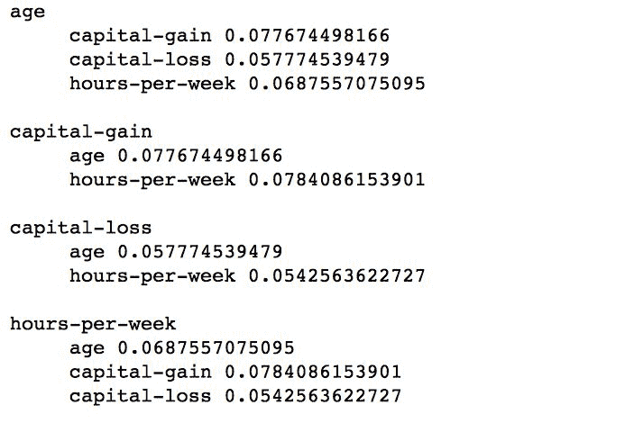

如你所见，我们的数字变量之间没有太多的相关性。这实际上是一件好事，因为我们可以在我们的模型中使用它们，因为我们不会遭受太多的多重共线性。

If you do not know what multicollinearity, is check out this lecture: [https://onlinecourses.science.psu.edu/stat501/node/343](https://onlinecourses.science.psu.edu/stat501/node/343).

# 请参见

*   你可能还想看看伯克利大学的教程:http://ampcamp . Berkeley . edu/大数据-迷你课程/数据-探索-使用-spark.html

# 测试数据

为了构建一个成功的统计或机器学习模型，我们需要遵循一个简单(但很难！)规则:尽可能简单(这样就很好地概括了被建模的现象)但不要太简单(这样就失去了主要的预测能力)。这是如何表现的一个直观例子如下(来自[http://bit.ly/2GpRybB](http://bit.ly/2GpRybB)):

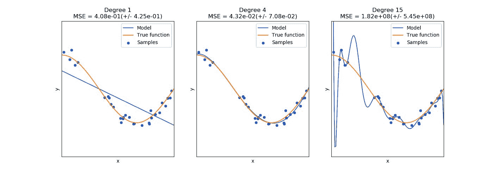

中间的图表显示了很好的拟合:模型线很好地遵循了真实函数。左图中的模型线过于简化了这一现象，实际上没有预测能力(除了少数几个点)——这是拟合不足的一个完美例子。右边的模型线几乎完美地遵循了训练数据，但是如果出现新数据，它很可能会歪曲它——这是一个被称为过度拟合的概念，也就是说，它不能很好地概括。从这三张图表中可以看出，模型的复杂性需要恰到好处，这样才能很好地模拟现象。

一些机器学习模型有过度训练的趋势。例如，任何试图找到输入数据和自变量(或标签)之间的映射(函数)的模型都有过度拟合的趋势；这些包括参数回归模型，如线性或广义回归模型，以及最近(再次！)流行的神经网络(或深度学习模型)。另一方面，一些基于决策树的模型(如随机森林)即使使用更复杂的模型也不太容易过度拟合。

那么，我们如何让模型恰到好处呢？有四个经验法则:

*   明智地选择你的特征
*   不要过度训练，或者选择不太容易过度训练的模型
*   使用从数据集中随机选择的数据运行多个模型估计
*   调整超参数

在这份食谱中，我们将集中讨论第一点，其余的点将在这一章和下两章的一些食谱中讨论。

# 准备好了

要执行这个食谱，你需要有一个工作的 Spark 环境。您应该已经完成了*加载数据*方法，我们将人口普查数据加载到数据框中。

不需要其他先决条件。

# 怎么做...

为了找到手头问题的最佳特征，我们首先需要了解我们正在处理什么问题，因为不同的方法将用于在回归问题中选择特征或用于分类器:

*   **回归**:在回归中，你的目标(或地面真相)是一个*连续*变量(比如每周工作小时数)。您有两种方法来选择最佳功能:
    *   **皮尔森相关**:我们在之前的食谱中已经讲过了。如上所述，相关性只能在两个数值(连续)特征之间计算。
    *   **方差分析(ANOVA)** :是以某些类别为条件解释(或检验)观测值分布的工具。因此，它可以用来选择连续因变量的最具区别性(分类)的特征。
*   **分类**:在分类中，你的目标(或标签)是两个(二项式)或多个(多项式)级别的离散变量。还有两种方法有助于选择最佳功能:
    *   **线性判别分析(LDA)** :这有助于找到连续特征的线性组合，最好地解释分类标签的方差
    *   ***χ <sup class="calibre70">2</sup>* 检验**:检验两个分类变量之间独立性的检验

目前，Spark 允许我们在可比变量之间测试(或选择)最佳特征；它只实现相关性(我们前面介绍的`pyspark.mllib.stat.Statistics.corr(...)`和χ <sup class="calibre70">2</sup> 检验(即`pyspark.mllib.stat.Statistics.chiSqTest(...)`或`pyspark.mllib.feature.ChiSqSelector(...)`方法)。

在这个食谱中，我们将使用`.chiSqTest(...)`来测试我们的标签(即某人收入超过 5 万美元的指标)和人口普查应答者职业之间的独立性。这里有一个片段可以帮我们做到这一点:

```py
import pyspark.mllib.linalg as ln

census_occupation = (
    census
    .groupby('label')
    .pivot('occupation')
    .count()
)

census_occupation_coll = (
    census_occupation
    .rdd
    .map(lambda row: (row[1:]))
    .flatMap(lambda row: row)
    .collect()
)

len_row = census_occupation.count()dense_mat = ln.DenseMatrix(len_row, 2, census_occupation_coll, True)chi_sq = st.Statistics.chiSqTest(dense_mat)

print(chi_sq.pValue)
```

# 它是如何工作的...

首先，我们导入 MLlib 的线性代数部分；稍后我们将使用一些矩阵表示。

接下来，我们构建一个透视表，其中我们按`occupation`特征分组，并按`label`列(要么是`<=50K`要么是`>50K`列)旋转。每次出现都会被计数，结果如下表所示:


接下来，我们通过访问底层的 RDD 并使用地图变换只选择计数来展平输出:`.map(lambda row: (row[1:]))`。`.flatMap(...)`转换创建了一长串我们需要的值。我们收集驾驶员的所有数据，以便以后创建`DenseMatrix`。

You should be cautious about using the `.collect(...)` action since it brings all the data to the driver. As you can see, we are only bringing the heavily aggregated representation of our dataset.

一旦我们在驱动程序上有了所有的数字，我们就可以创建它们的矩阵表示；我们将有一个 15 行 2 列的矩阵。首先，我们通过检查`census_occupation`元素的计数来检查有多少不同的职业值。接下来，我们调用`DenseMatrix(...)`构造函数来创建我们的矩阵。第一个参数指定行数，第二个参数指定列数。第三个参数指定数据，最后一个参数指示数据是否被转置。密集表示如下所示:


以更易读的格式(如 NumPy 矩阵)，它看起来像这样:

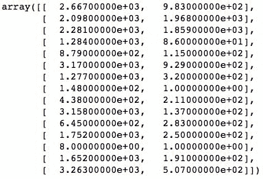

现在，我们简单地调用`.chiSqTest(...)`并将我们的矩阵作为它的唯一参数。剩下的就是检查`pValue`和`nullHypothesis`是否被拒绝:

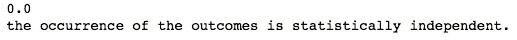

所以，如你所见，`pValue`是`0.0`，所以我们可以拒绝无效假设，即收入超过 5 万美元的人和收入低于 5 万美元的人之间的职业分布是相同的。因此，我们可以得出结论，正如 Spark 告诉我们的那样，结果的发生在统计上是独立的，也就是说，对于收入超过 5 万美元的人来说，职业应该是一个强有力的指标。

# 请参见...

*   有许多统计测试有助于确定两个总体(或样本)是否相似，或者它们是否遵循某些分布。为了获得良好的概述，我们建议使用以下文档:[http://www . stats tutor . AC . uk/resources/uploaded/tutorquickguidelitostatistics . pdf](http://www.statstutor.ac.uk/resources/uploaded/tutorsquickguidetostatistics.pdf)。

# 转换数据

**机器学习** ( **ML** )是一个旨在利用机器(计算机)理解世界现象并预测其行为的研究领域。为了建立一个 ML 模型，我们所有的数据都需要是数字的。因为我们几乎所有的特征都是绝对的，所以我们需要改变我们的特征。在这个食谱中，我们将学习如何使用散列技巧和虚拟编码。

# 准备好

要执行这个食谱，你需要有一个工作的 Spark 环境。您应该已经完成了*加载数据*方法，我们将人口普查数据加载到数据框中。

不需要其他先决条件。

# 怎么做...

我们将把数据集的维数减少大约一半，因此首先我们需要提取每列中不同值的总数:

```py
len_ftrs = []

for col in cols_cat:
    (
        len_ftrs
        .append(
            (col
             , census
                 .select(col)
                 .distinct()
                 .count()
            )
        )
    )

len_ftrs = dict(len_ftrs)
```

接下来，对于每个特征，我们将使用`.HashingTF(...)`方法来编码我们的数据:

```py
import pyspark.mllib.feature as feat
```

```py
final_data = (    census
    .select(cols_to_keep)
    .rdd
    .map(lambda row: [
        list(
            feat.HashingTF(int(len_ftrs[col] / 2.0))
            .transform(row[i])
            .toArray()
        ) if i >= 5
        else [row[i]] 
        for i, col in enumerate(cols_to_keep)]
    )
)

final_data.take(3)
```

# 它是如何工作的...

首先，我们遍历所有的类别，并添加一个列名的元组(T0)和在该列中找到的不同值的计数。后者是通过选择感兴趣的列，运行`.distinct()`转换，并计算结果值的数量来实现的。`len_ftrs`现在是元组列表。通过调用`dict(...)`方法，Python 将创建一个字典，该字典将元组的第一个元素作为键，第二个元素作为相应的值。生成的字典如下所示:

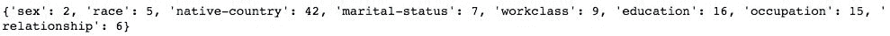

现在我们知道了每个特征中不同值的总数，我们可以使用散列技巧。首先，我们导入 MLlib 的特征组件，因为这是`.HashingTF(...)`所在的位置。接下来，我们将普查数据框子集化为我们想要保留的列。然后我们在底层 RDD 上使用`.map(...)`转换:对于每个元素，我们枚举所有的列，如果列的索引大于或等于 5，我们创建一个新的`.HashingTF(...)`实例，然后我们使用它来转换该值并将其转换为 NumPy 数组。`.HashingTF(...)`方法唯一需要指定的是元素的输出数量；在我们的例子中，我们粗略地将不同值的数量减半，所以我们会有一些散列冲突，但这没关系。

供您参考，我们的`cols_to_keep`如下:


对我们当前的数据集`final_data`进行上述操作后，它看起来如下；请注意，格式可能看起来有点奇怪，但我们很快就会为创建培训 RDD 做好准备:


# 还有更多...

唯一剩下的就是处理我们的标签；如你所见，它仍然是一个分类变量。但是，由于它只取两个值，我们可以按如下方式编码:

```py
def labelEncode(label):return [int(label[0] == '>50K')]final_data = (final_data.map(lambda row: labelEncode(row[0]) + [item for sublist in row[1:] for item in sublist]))
```

`labelEncode(...)`方法取标签，检查是否为`'>50k'`；如果是，我们得到一个布尔真，否则我们得到假。我们可以简单地将布尔数据包装在 Python 的`int(...)`方法中，将其表示为整数。

最后，我们再次使用`.map(...)`，将`row`的第一个元素——标签——传递给`labelEncode(...)`方法。然后，我们遍历所有剩余的列表，并将它们组合在一起。这部分代码一开始可能看起来有点奇怪，但实际上很容易理解。我们循环遍历所有剩余的元素(T3)，由于每个元素都是一个列表(因此我们将其命名为“T4”)，我们创建另一个循环(T5 部分)来提取单个项目。由此产生的 RDD 如下所示:

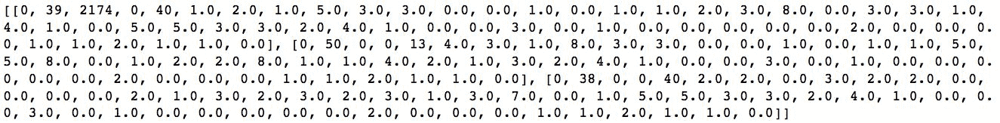

# 请参见...

*   查看此链接，了解如何在 Python 中处理分类特性的精彩概述:[http://pbpython.com/categorical-encoding.html](http://pbpython.com/categorical-encoding.html)

# 数据标准化

数据标准化(或规范化)很重要，原因有很多:

*   一些算法在标准化(或规范化)数据上收敛得更快
*   如果你的输入变量在很大程度上不同，系数的可解释性可能很难，或者得出的结论可能是错误的
*   对于某些模型，如果不标准化，最佳解决方案可能是错误的

在这个食谱中，我们将向您展示如何标准化数据，因此如果您的建模项目需要标准化数据，您将知道如何做到这一点。

# 准备好

要执行这个食谱，你需要有一个工作的 Spark 环境。你应该已经看过了之前我们对人口普查数据进行编码的方法。

不需要其他先决条件。

# 怎么做...

MLlib 为我们提供了一种完成大部分工作的方法。尽管下面的代码一开始可能会让人感到困惑，但我们会一步一步地来理解它:

```py
standardizer = feat.StandardScaler(True, True)sModel = standardizer.fit(final_data.map(lambda row: row[1:]))final_data_scaled = sModel.transform(final_data.map(lambda row: row[1:]))final_data = (final_data.map(lambda row: row[0]).zipWithIndex().map(lambda row: (row[1], row[0])).join(final_data_scaled.zipWithIndex().map(lambda row: (row[1], row[0]))).map(lambda row: row[1]))final_data.take(1)
```

# 它是如何工作的...

首先，我们创建`StandardScaler(...)`对象。设置为`True`的两个参数——前者代表均值，后者代表标准差——表明我们希望模型使用 Z 评分来标准化我们的特征: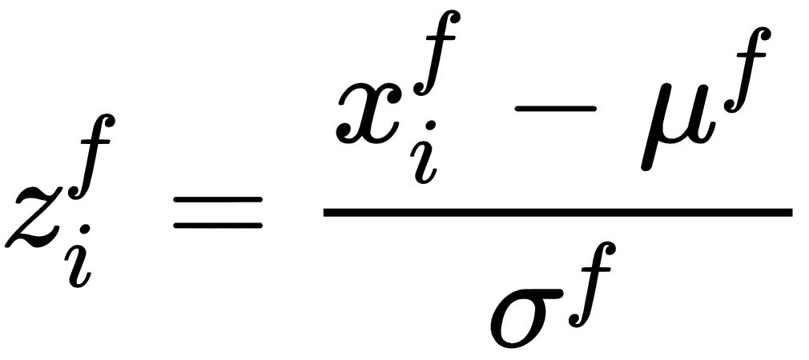，其中是*I*T6】th 对 *f* 特征的观察，μ <sup xmlns:epub="http://www.idpf.org/2007/ops" class="calibre70">* f *</sup> 是 *f* 特征中所有观察的均值，σ<sup xmlns:epub="http://www.idpf.org/2007/ops" class="calibre70">*f*T13</sup>

接下来，我们使用`StandardScaler(...)`对数据进行`.fit(...)`。请注意，我们没有标准化第一个特性，因为它实际上是我们的标签。最后，我们`.transform(...)`我们的数据集，所以我们得到了缩放的特征。

然而，由于我们不缩放我们的标签，我们需要以某种方式将其带回我们的缩放数据集。所以首先，从`final_data`开始，我们提取标签(使用`.map(lamba row: row[0])`变换)。然而，我们将无法加入`final_data_scaled`因为没有钥匙可以加入。注意，我们本质上希望以逐行的方式加入。因此，我们使用`.zipWithIndex()`方法，该方法返回给我们一个元组，第一个元素是数据，第二个元素是行号。因为我们想要连接行号，我们需要把它带到元组中的第一个位置，因为这就是`.join(...)`对 RDDs 的工作方式；我们通过第二次`.map(...)`操作实现了这一点。

In RDDs, the `.join(...)` operation cannot specify the key explicitly; both RDDs need to be two-element tuples, where the first element is the key and the second element is the data.

一旦连接完成，我们只需使用`.map(lambda row: row[1])`转换提取连接的数据。

以下是我们现在的数据:

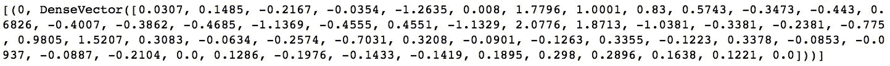

我们还可以查看`sModel`以了解使用了什么手段和标准偏差来转换我们的数据:

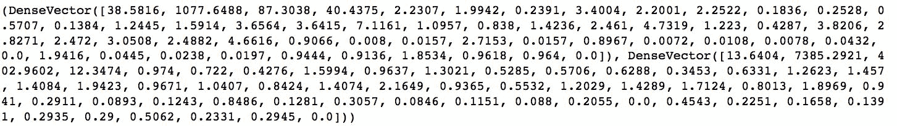

# 打造训练 RDD

在我们可以训练一个 ML 模型之前，我们需要创建一个 RDD，其中每个元素都是一个标记点。在这个食谱中，我们将使用我们在前一个食谱中创建的`final_data` RDD 来准备我们的 RDD 进行训练。

# 准备好

要执行这个食谱，你需要有一个工作的 Spark 环境。当我们对编码的人口普查数据进行标准化时，您可能已经浏览了之前的配方。

不需要其他先决条件。

# 怎么做...

许多 MLlib 模型需要一个标记点的 RDD 来训练。接下来的代码片段将为我们创建这样一个 RDD 来构建分类和回归模型。

# 分类

下面是创建标记点分类 RDD 的片段，我们将使用它来预测某人的收入是否超过 50，000 美元:

```py
final_data_income = (
    final_data
    .map(lambda row: reg.LabeledPoint(
        row[0]
        , row[1:]
        )
)
```

# 回归

下面是创建标记点回归 RDD 的片段，我们将使用它来预测人们的工作小时数:

```py
mu, std = sModel.mean[3], sModel.std[3]final_data_hours = (
    final_data
    .map(lambda row: reg.LabeledPoint(
        row[1][3] * std + mu
        , ln.Vectors.dense([row[0]] + list(row[1][0:3]) + list(row[1][4:]))
        )
)
```

# 它是如何工作的...

在我们创建 RDDs 之前，我们必须导入`pyspark.mllib.regression`子模块，因为在那里我们可以访问`LabeledPoint`类:

```py
import pyspark.mllib.regression as reg
```

接下来，我们简单地遍历`final_data` RDD 的所有元素，并使用`.map(...)`变换为每个元素创建一个标记点。

`LabeledPoint(...)`的第一个参数是标签。如果你看看这两个代码片段，它们之间唯一的区别就是我们所考虑的标签和特性。

As a reminder, a classification problem aims to find the probability of an observation belonging to a specific class; thus, the label is normally a categorical or, in other words, discrete. On the other hand, the regression problem aims to predict a value given an observation; thus, the label is normally numerical, or continuous if you will.

因此，在`final_data_income`案例中，我们使用二元指标来衡量人口普查受访者的收入是高于(值为 1)还是低于(标签等于 0)50，000 美元，而在`final_data_hours`案例中，我们使用`hours-per-week`功能(参见*加载数据*配方)，在我们的案例中，这是`final_data` RDD 每个元素的第五部分。注意对于这个标签，我们需要缩小它，所以我们需要乘以标准偏差并加上平均值。

We assume here that you are working through the `5\. Machine Learning with MLlib.ipynb` notebook and have the `sModel` object already created. If you do not, please go back to the previous recipe and follow the steps outlined there.

`LabeledPoint(...)`的第二个参数是所有特征的向量。您可以传递 NumPy 数组、列表、`scipy.sparse`列矩阵或`pyspark.mllib.linalg.SparseVector`或`pyspark.mllib.linalg.DenseVector`；在我们的例子中，我们将我们的特征编码到`DenseVector`中，因为我们已经使用哈希技巧对我们的所有特征进行了编码。

# 还有更多...

我们可以使用完整的数据集来训练我们的模型，但是我们会遇到另一个问题:我们如何评估我们的模型有多好？因此，任何数据科学家通常都会将数据分成两个子集:训练和测试。

See the *See also* section of this recipe for why this often isn't good enough, and you should actually be splitting the data into training, testing, and validation datasets.

以下两个代码片段展示了在 PySpark 中实现这一点有多容易:

```py
(
    final_data_income_train
    , final_data_income_test
) = (
    final_data_income.randomSplit([0.7, 0.3])
)
```

这里是第二个:

```py
(
    final_data_hours_train
    , final_data_hours_test
) = (
    final_data_hours.randomSplit([0.7, 0.3])
)
```

通过简单地调用 RDD 的`.randomSplit(...)`方法，我们可以快速地将我们的 rdd 划分为训练和测试子集。`.randomSplit(...)`方法唯一需要的参数是一个列表，其中每个元素指定要随机选择的数据集的比例。注意，这些比例需要加起来是 1。

We could have passed a list of three elements if we wanted to get the training, testing, and validation subsets.

# 请参见

*   为什么要分成三个数据集，而不是两个数据集，这里有很好的解释:[http://bit.ly/2GFyvtY](http://bit.ly/2GFyvtY)

# 预测普查对象的工作时间

在这个食谱中，我们将建立一个简单的线性回归模型，旨在预测每个人口普查受访者每周工作的小时数。

# 准备好了

要执行这个食谱，你需要有一个工作的 Spark 环境。您可能已经浏览了之前的方法，我们创建了用于估计回归模型的训练和测试数据集。

不需要其他先决条件。

# 怎么做...

用 MLlib 训练模型非常简单。请参见下面的代码片段:

```py
workhours_model_lm = reg.LinearRegressionWithSGD.train(final_data_hours_train)
```

# 它是如何工作的...

如您所见，我们首先创建`LinearRegressionWithSGD`对象，并调用其`.train(...)`方法。

For a very good overview of different derivatives of stochastic gradient descent, check this out: [http://ruder.io/optimizing-gradient-descent/](http://ruder.io/optimizing-gradient-descent/).

我们传递给该方法的第一个也是唯一一个必需的参数是我们之前创建的标记点的 RDD。但是，您可以指定许多参数:

*   迭代次数；默认为`100`
*   Step 是 SGD 中使用的参数；默认为`1.0`
*   `miniBatchFraction`指定每次 SGD 迭代要使用的数据比例；默认为`1.0`
*   `initialWeights`参数允许我们将系数初始化为一些特定的值；它没有默认值，算法将从等于`0.0`的权重开始
*   正则化类型参数`regType`允许我们指定使用的正则化类型:`'l1'`用于 L1 正则化，`'l2'`用于 L2 正则化；默认为`None`，无正则化
*   `regParam`参数指定正则化参数；默认为`0.0`
*   模型也可以拟合截距，但默认不设置；默认值为假
*   在训练之前，默认情况下，模型可以验证数据
*   也可以指定`convergenceTol`；默认为`0.001`

现在让我们看看我们的模型对工作时间的预测有多好:

```py
small_sample_hours = sc.parallelize(final_data_hours_test.take(10))for t,p in zip(small_sample_hours.map(lambda row: row.label).collect(), workhours_model_lm.predict(small_sample_hours.map(lambda row: row.features)).collect()):print(t,p)
```

首先，从我们完整的测试数据集中，我们选择了 10 个观察值(这样我们就可以将它们打印在屏幕上)。接下来，我们从测试数据集中提取真实值，而对于预测，我们简单地调用`workhours_model_lm`模型的`.predict(...)`方法并传递`.features`向量。以下是我们得到的信息:


如您所见，我们的模型做得不太好，因此需要进一步完善。然而，这超出了本章和本书本身的范围。

# 预测普查对象的收入水平

在这个食谱中，我们将向您展示如何通过构建两个模型来解决 MLlib 的分类问题:无处不在的逻辑回归和稍微复杂一点的模型 **SVM** ( **支持向量机**)。

# 准备好了

要执行这个食谱，你需要有一个工作的 Spark 环境。您已经完成了*创建用于训练的 RDD*配方，在该配方中，我们创建了用于估计分类模型的训练和测试数据集。

不需要其他先决条件。

# 怎么做...

就像线性回归一样，构建逻辑回归从创建一个`LogisticRegressionWithSGD`对象开始:

```py
import pyspark.mllib.classification as clincome_model_lr = cl.LogisticRegressionWithSGD.train(final_data_income_train)
```

# 它是如何工作的...

与`LinearRegressionWithSGD`模型一样，唯一需要的参数是带有标记点的 RDD。此外，您可以指定相同的参数集:

*   迭代次数；默认为`100`
*   步骤是 SGD 中使用的参数；默认为``1.0``
*   `miniBatchFraction`指定每次 SGD 迭代要使用的数据比例；默认为`1.0`
*   `initialWeights`参数允许我们将系数初始化为一些特定的值；它没有默认值，算法将从等于`0.0`的权重开始
*   正则化类型参数`regType`允许我们指定使用的正则化类型:`l1`用于 L1 正则化，`l2`用于 L2 正则化；默认为`None`，无正则化
*   `regParam`参数指定正则化参数；默认为`0.0`
*   模型也可以拟合截距，但默认不设置；默认值为假
*   在训练之前，默认情况下，模型可以验证数据
*   也可以指定`convergenceTol`；默认为`0.001`

训练结束后返回的`LogisticRegressionModel(...)`对象允许我们使用模型。通过将特征向量传递给`.predict(...)`方法，我们可以预测观察值最有可能关联的类别。

任何分类模型都会产生一组概率，逻辑回归也不例外。在二进制情况下，我们可以指定一个阈值，一旦被突破，该阈值将指示观察值将被赋予等于 1 而不是 0 的类；该阈值通常设置为`0.5`。`LogisticRegressionModel(...)`默认假设`0.5`，但是您可以通过调用`.setThreshold(...)`方法并传递介于 0 和 1(不包括 0 和 1)之间的所需阈值来更改它。

让我们看看我们的模型表现如何:

```py
small_sample_income = sc.parallelize(final_data_income_test.take(10))for t,p in zip(small_sample_income.map(lambda row: row.label).collect(), income_model_lr.predict(small_sample_income.map(lambda row: row.features)).collect()):print(t,p)
```

与线性回归示例一样，我们首先从测试数据集中提取 10 条记录，以便在屏幕上显示它们。接下来，我们提取所需的标签并将`.predict(...)`的`income_model_lr`模型称为类。以下是我们得到的信息:


所以，在 10 张唱片中，我们有 9 张是对的。还不错。

In the *Computing performance statistics* recipe, we will learn how to use the full testing dataset to more formally evaluate our models.

# 还有更多...

逻辑回归通常是用于评估其他分类模型相对性能的基准，也就是说，它们的性能是更好还是更差。然而，逻辑回归的缺点是它不能处理两个类不能被一条线分开的情况。支持向量机没有这些问题，因为它们的内核可以用非常灵活的方式表达:

```py
income_model_svm = cl.SVMWithSGD.train(final_data_income, miniBatchFraction=1/2.0)
```

在这个例子中，就像`LogisticRegressionWithSGD`模型一样，我们可以指定大量的参数(这里不再重复)。然而，`miniBatchFraction`参数指示 SVM 模型在每次迭代中只使用一半的数据；这有助于防止过度拟合。

来自`small_sample_income` RDD 的 10 个观测结果的计算方法与逻辑回归模型相同:

```py
for t,p in zip(small_sample_income.map(lambda row: row.label).collect(), income_model_svm.predict(small_sample_income.map(lambda row: row.features)).collect()):print(t,p)
```

该模型产生与逻辑回归模型相同的结果，因此我们在此不再重复。然而，在*计算性能统计*配方中，我们将看到这些有何不同。

# 构建聚类模型

通常，我们很难获得贴有标签的数据。此外，有时您可能希望在数据集中找到底层模式。在这个食谱中，我们将学习如何在 Spark 中构建流行的 k-means 聚类模型。

# 准备好

要执行这个食谱，你需要有一个工作的 Spark 环境。你应该已经完成了*标准化数据*的方法，我们标准化了编码的人口普查数据。

不需要其他先决条件。

# 怎么做...

就像分类或回归模型一样，在 Spark 中构建聚类模型非常简单。以下是旨在发现人口普查数据模式的代码:

```py
import pyspark.mllib.clustering as clu

model = clu.KMeans.train(
```

```py
    final_data.map(lambda row: row[1])
    , 2
    , initializationMode='random'
    , seed=666
)
```

# 它是如何工作的...

首先，我们需要导入 MLlib 的聚类子模块。就像之前一样，我们首先创建聚类估计器对象，`KMeans`。`.train(...)`方法需要两个参数:我们想要用来查找集群的 RDD，以及我们期望的集群数量。我们还选择了通过指定`initializationMode`来随机初始化聚类的质心；这个默认为`k-means||`。其他参数包括:

*   `maxIterations`指定在多少次迭代之后，估计应该停止；默认为`100`
*   `initializationSteps`仅在使用默认初始化模式时有用；该参数的默认值为`2`
*   `epsilon`是一个停止标准——如果所有质心的移动(根据欧几里德距离)小于这个值，迭代停止；默认为`0.0001`
*   `initialModel`允许您以`KMeansModel`的形式指定之前估计的中心；默认为`None`

# 还有更多...

一旦模型被估计出来，我们就可以用它来预测集群，看看我们的模型实际上有多好。然而，目前，Spark 没有提供评估聚类模型的方法。因此，我们将使用 scikit-learn 提供的指标:

```py
import sklearn.metrics as m

predicted = (
    model
        .predict(
            final_data.map(lambda row: row[1])
        )
)
predicted = predicted.collect()
```

```py
true = final_data.map(lambda row: row[0]).collect()

print(m.homogeneity_score(true, predicted))
print(m.completeness_score(true, predicted))
```

聚类指标位于 scikit-learn 的`.metrics`子模块。我们使用两个可用的度量标准:同质性和完整性。同质性度量一个聚类中的所有点是否来自同一个类，而完备性分数估计对于一个给定的类，所有的点是否最终都在同一个聚类中；任何一个分数的值为 1 都意味着完美的模型。

让我们看看我们得到了什么:

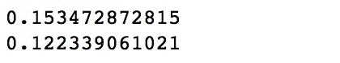

嗯，我们的聚类模型做得不太好:15%的同质性分数意味着剩余的 85%的观测值被错误地聚类，我们只对属于同一类的所有观测值进行了 12%的正确聚类。

# 请参见

*   有关聚类模型评估的更多信息，您可能需要查看[https://NLP . Stanford . edu/IR-book/html/html memorient/聚类评估-1.html](https://nlp.stanford.edu/IR-book/html/htmledition/evaluation-of-clustering-1.html)

# 计算性能统计

在前面的食谱中，我们已经看到了一些由我们的分类和回归模型预测的值，以及它们离原始值有多远或多近。在本食谱中，我们将学习如何充分计算这些模型的性能统计数据。

# 准备好

为了执行这个食谱，你需要有一个工作的 Spark 环境，你应该已经经历了本章前面介绍的*预测普查对象的工作时间*和*预测普查对象的收入水平*食谱。

不需要其他先决条件。

# 怎么做...

在 Spark 中获取回归和分类的性能指标非常简单:

```py
import pyspark.mllib.evaluation as ev(...)metrics_lm = ev.RegressionMetrics(true_pred_reg)(...)metrics_lr = ev.BinaryClassificationMetrics(true_pred_class_lr)
```

# 它是如何工作的...

首先，我们加载评估模块；这样做暴露了我们可以使用的`.RegressionMetrics(...)`和`.BinaryClassificationMetrics(...)`方法。

# 回归度量

`true_pred_reg`是元组的 RDD，其中第一个元素是来自我们的线性回归模型的预测，第二个元素是期望值(每周工作的小时数)。我们是这样创建的:

```py
true_pred_reg = (
    final_data_hours_test
    .map(lambda row: (
         float(workhours_model_lm.predict(row.features))
         , row.label))
)
```

`metrics_lm`对象包含多种度量:`explainedVariance`、`meanAbsouteError`、`meanSquaredError`、`r2`和`rootMeanSquaredError`。在这里，我们将只打印出其中的几个:

```py
print('R^2: ', metrics_lm.r2)
print('Explained Variance: ', metrics_lm.explainedVariance)
print('meanAbsoluteError: ', metrics_lm.meanAbsoluteError)
```

让我们看看线性回归模型得到了什么:


考虑到我们已经看到的情况，该模型的表现确实很差，这并不意外。不要对负 R 平方太惊讶；如果模型的预测是无意义的，它可以变成负值，即 R 平方的无意义值。

# 分类指标

我们将评估我们之前构建的两个模型；这是逻辑回归:

```py
true_pred_class_lr = (
    final_data_income_test
    .map(lambda row: (
        float(income_model_lr.predict(row.features))
        , row.label))
)

metrics_lr = ev.BinaryClassificationMetrics(true_pred_class_lr)

print('areaUnderPR: ', metrics_lr.areaUnderPR)
print('areaUnderROC: ', metrics_lr.areaUnderROC)
```

这是 SVM:

```py
true_pred_class_svm = (
    final_data_income_test
    .map(lambda row: (
        float(income_model_svm.predict(row.features))
        , row.label))
)

metrics_svm = ev.BinaryClassificationMetrics(true_pred_class_svm)

print('areaUnderPR: ', metrics_svm.areaUnderPR)
print('areaUnderROC: ', metrics_svm.areaUnderROC)
```

这两个指标——在**精度-召回** ( **PR** )下的区域和在**接收器操作特性** ( **ROC** )曲线下的区域——允许我们比较这两个模型。

Check out this interesting discussion about the two metrics on stack exchange: [https://stats.stackexchange.com/questions/7207/roc-vs-precision-and-recall-curves](https://stats.stackexchange.com/questions/7207/roc-vs-precision-and-recall-curves).

让我们看看我们得到了什么。对于逻辑回归，我们有:

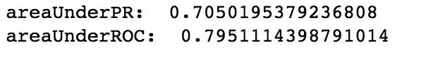

对于 SVM，我们有:


令人有点惊讶的是，SVM 的表现比逻辑回归差一点。让我们看看混淆矩阵，看看这两个模型的不同之处。对于逻辑回归，我们使用以下代码来实现:

```py
(
    true_pred_class_lr
    .map(lambda el: ((el), 1))
    .reduceByKey(lambda x,y: x+y)
    .take(4)
)
```

我们得到:

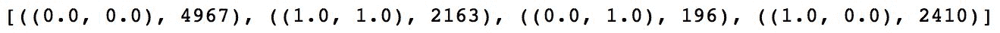

对于 SVM，代码看起来几乎相同，除了输入 RDD:

```py
(
    true_pred_class_svm
    .map(lambda el: ((el), 1))
    .reduceByKey(lambda x,y: x+y)
    .take(4)
)
```

有了前面的，我们得到:


如您所见，逻辑回归在预测阳性和阴性病例方面更准确，从而实现更少的误分类(假阳性和假阴性)观察。然而，差异并没有那么明显。

要计算总体错误率，我们可以使用以下代码:

```py
trainErr = (
    true_pred_class_lr
    .filter(lambda lp: lp[0] != lp[1]).count() 
    / float(true_pred_class_lr.count())
)
print("Training Error = " + str(trainErr))
```

对于 SVM，除了使用`true_pred_class_svm`代替`true_pred_class_lr`之外，前面的代码看起来是一样的。前面的产生下面的。对于逻辑回归，我们得到:


对于 SVM，结果如下:


SVM 的误差略高，但仍然是一个相当合理的模型。

# 请参见

*   如果您想了解更多关于各种性能指标的信息，我们建议您访问以下网址:[https://machinelearning master . com/metrics-evaluate-machine-learning-algorithms-python/](https://machinelearningmastery.com/metrics-evaluate-machine-learning-algorithms-python/)