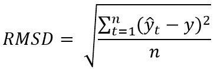
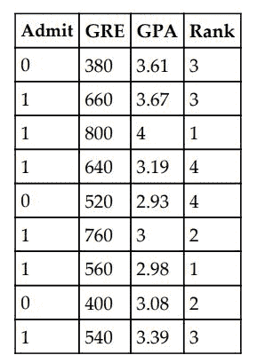
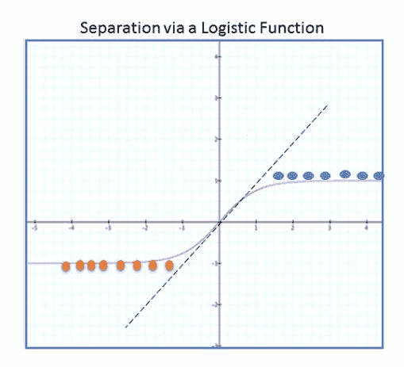
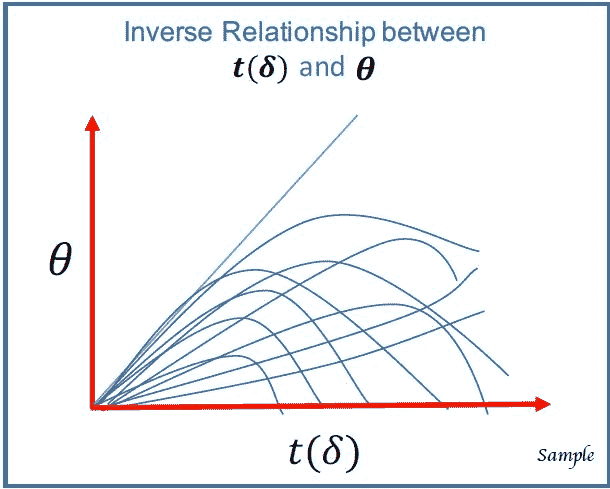
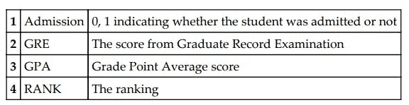
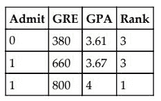
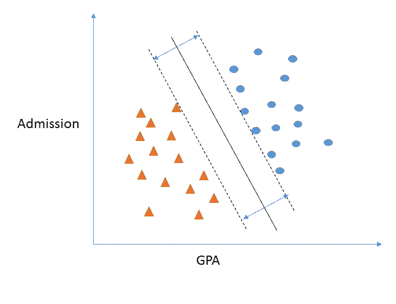
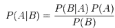

# 六、Spark 2.0 中回归和分类的实用机器学习——第二部分

在本章中，我们将介绍以下食谱:

*   Spark 2.0 中带 SGD 优化的线性回归
*   星火 2.0 中带 SGD 优化的逻辑回归
*   Spark 2.0 中带 SGD 优化的岭回归
*   Spark 2.0 中带 SGD 优化的套索回归
*   星火 2.0 中基于 BFGS 优化的逻辑回归
*   支持向量机(SVM)与 Spark 2.0
*   使用 Spark 2.0 MLlib 的朴素贝叶斯机器学习
*   在 Spark 2.0 中使用逻辑回归探索 ML 管道和数据帧

# 介绍

在这一章，即 Spark 2.0 中回归和分类的后半部分，我们重点介绍了基于 RDD 的回归，它目前在许多现有的 Spark ML 实现中得到实践。由于现有的代码基础，任何中级到高级的从业者都应该能够使用这些技术。

在本章中，您将学习如何使用各种回归(线性、逻辑、脊线和套索)来实现一个小应用，这些回归具有**随机梯度下降** ( **SGD** )和 L-BFGS 优化，这些优化具有线性但强大的分类器，例如使用 Apache Spark API 的**支持向量机** ( **SVM** )和**朴素贝叶斯** **分类器**。我们在适当的时候用样本拟合度量(例如，均方误差、RMSE、ROC 以及二进制和多类度量)来扩充每个配方，以证明 Spark MLlib 的强大和完备性。我们介绍了基于 RDD 的线性、逻辑、岭和套索回归，然后讨论了 SVM 和朴素贝叶斯来演示更复杂的分类器。

下图描述了本章中的回归和分类范围:


There have been reports of issues with regression using SGD in the field, but the issues are most likely due to poor tuning of SGD or a failure to understand the pros and cons of this technique in large parametric systems.

在这一章和下一章中，我们开始向更完整的(即插即用)回归和分类系统发展，这些系统可以在构建 ML 应用时加以利用。虽然每个配方本身都是一个程序，但使用 Spark 的 ML 管道可以组装一个更复杂的系统，以创建端到端的 ML 系统(例如，通过朴素贝叶斯对癌症簇进行分类，然后使用 lasso 对每个片段执行参数选择)。在本章的最后一个食谱中，你会看到一个关于 ML 管道的好例子。虽然回归和分类这两个章节为您提供了 Spark 2.0 分类中可用内容的一个很好的示例，但是我们为后面的章节保留了更复杂的方法。

最好使用数据科学中的最新方法，但重要的是首先掌握基础知识，从 GLM、LRM、里奇、拉索和 SVM 开始——确保在毕业到更复杂的模型之前了解何时使用每个模型。

# Spark 2.0 中带 SGD 优化的线性回归

在这个配方中，我们使用基于 Spark RDD 的回归应用编程接口来演示如何使用迭代优化技术来最小化成本函数，并获得线性回归的解决方案。

我们研究了 Spark 如何使用一种迭代方法，使用一种众所周知的方法**梯度下降**来收敛到回归问题的解。Spark 提供了一个更实用的实现，称为 SGD，用于计算截距(在本例中设置为 0)和参数的权重。

# 怎么做...

1.  我们使用来自 UCI 机器图书馆托存处的房屋数据集。您可以从以下网址下载整个数据集:

[https://archive . ics . UCI . edu/ml/机器学习-数据库/房屋/](https://archive.ics.uci.edu/ml/machine-learning-databases/housing/)

数据集由 14 列组成，前 13 列是独立变量(特征)，试图解释美国波士顿自住房屋的中值价格(最后一列)。

我们选择并清理了前八列作为特征。我们使用前 200 行来训练和预测中间价格:


2.  在 IntelliJ 或您选择的 IDE 中启动一个新项目。确保包含必要的 JAR 文件。

3.  设置程序将驻留的包位置:

```scala
package spark.ml.cookbook.chapter6
```

4.  导入 Spark 会话所需的包以访问集群，并`Log4j.Logger`减少 Spark 产生的输出量:

```scala
import org.apache.spark.mllib.regression.{LabeledPoint, LinearRegressionWithSGD}import org.apache.spark.sql.SparkSessionimport org.apache.spark.mllib.linalg.{Vector, Vectors}import org.apache.log4j.Loggerimport org.apache.log4j.Level
```

5.  使用构建器模式初始化指定配置的 Spark 会话，从而为 Spark 集群提供一个入口点:

```scala
val spark = SparkSession.builder.master("local[4]").appName("myRegress02").config("spark.sql.warehouse.dir", ".").getOrCreate()
```

6.  将输出级别设置为错误，以减少 Spark 的输出:

```scala
 Logger.getLogger("org").setLevel(Level.ERROR)Logger.getLogger("akka").setLevel(Level.ERROR)
```

7.  我们摄取并并行化数据集(仅前 200 行):

```scala
val data = sc.textFile("../data/sparkml2/chapter6/housing8.csv") 
```

8.  我们采用并行化的 RDD(即数据变量)并使用`map()`函数分割列。然后，我们继续遍历这些列，并将它们存储在 Spark(标记点)所需的结构中。LabeledPoint 是一个数据结构，第一列是因变量(即标签)，后面是 DenseVector(即`Vectors.Dense`)。我们必须为 Spark 的`LinearRegressionWithSGD()`算法提供这种格式的数据:

```scala
val RegressionDataSet = data.map { line =>val columns = line.split(',')LabeledPoint(columns(13).toDouble , Vectors.dense(columns(0).toDouble,columns(1).toDouble, columns(2).toDouble, columns(3).toDouble,columns(4).toDouble,columns(5).toDouble,columns(6).toDouble, columns(7).toDouble))}
```

9.  我们现在通过输出来检查回归数据，以熟悉标记点数据结构:

```scala
RegressionDataSet.collect().foreach(println(_)) 

(24.0,[0.00632,18.0,2.31,0.0,0.538,6.575,65.2,4.09]) 
(21.6,[0.02731,0.0,7.07,0.0,0.469,6.421,78.9,4.9671]) 
(34.7,[0.02729,0.0,7.07,0.0,0.469,7.185,61.1,4.9671]) 
(33.4,[0.03237,0.0,2.18,0.0,0.458,6.998,45.8,6.0622]) 
(36.2,[0.06905,0.0,2.18,0.0,0.458,7.147,54.2,6.0622]) 
```

10.  我们设置模型参数，即迭代次数和 SGD 步骤。由于这是一种梯度下降方法，人们必须试验各种值，以找到最佳值，从而获得良好的拟合，避免浪费资源。对于迭代，我们通常使用 100 到 20000 之间的值(极少数情况)，对于 SGD 步骤，我们通常使用. 01 到. 00001 之间的值:

```scala
val numIterations = 1000val stepsSGD      = .001
```

11.  我们打电话来建立模型:

```scala
   val myModel = LinearRegressionWithSGD.train(RegressionDataSet, numIterations,stepsSGD) 
```

12.  在这一步中，我们使用数据集来使用上一步中构建的模型预测值。然后，我们将预测值和标记值放入`predictedLabelValue`数据结构中。澄清一下，上一步是建立一个模型(即决定数据的适合性)，而这一步使用模型来预测:

```scala
val predictedLabelValue = RegressionDataSet.map { lp => val predictedValue = myModel.predict(lp.features)(lp.label, predictedValue)}
```

13.  在这一步中，我们检查八列(第 0 到第 7 列)的截距(默认情况下，未选择截距)和权重:

```scala
println("Intercept set:",myModel.intercept)println("Model Weights:",myModel.weights)
```

输出如下:

```scala
Intercept set: 0.0Model Weights:,[-0.03734048699612366,0.254990126659302,0.004917402413769299,0.004611027094514264,0.027391067379836438,0.6401657695067162,0.1911635554630619,0.408578077994874])
```

14.  为了获得预测值的感觉，我们使用`takesample()`功能随机选择二十个没有替换的值。在本例中，我们只显示了 20 个值中的 7 个值:

```scala
predictedLabelValue.takeSample(false,5).foreach(println(_)) 
```

输出如下:

```scala
(21.4,21.680880143786645)(18.4,24.04970929955823)(15.0,27.93421483734525)(41.3,23.898190127554827)(23.6,21.29583657363941)(33.3,34.58611522445151)(23.8,19.93920838257026)
```

15.  我们使用均方根误差(众多误差之一)来量化拟合。拟合度可以大幅提高(更多数据、stepsSGD、迭代次数，以及最重要的特性工程实验)，但这要留给统计书去探索。以下是 RMSD 的公式:



```scala
val MSE = predictedLabelValue.map{ case(l, p) => math.pow((l - p), 2)}.reduce(_ + _) / predictedLabelValue.countval RMSE = math.sqrt(MSE)println("training Mean Squared Error = " + MSE)println("training Root Mean Squared Error = " + RMSE)
```

输出如下:

```scala
training Mean Squared Error = 91.45318188628684training Root Mean Squared Error = 9.563115699722912
```

# 它是如何工作的...

我们使用从住房数据(自变量)文件中选择的列来预测房价(因变量)。我们使用基于 RDD 的回归方法和 SGD 优化器来迭代求解。然后我们继续输出截距和每个参数的权重。在最后一步中，我们使用样本数据进行预测，并显示输出。最后一步是输出模型的均方误差和 RMSE 值。请注意，这仅用于演示目的，您应该在模型评估和最终选择过程中使用[第 4 章](04.html#5UNGG0-4d291c9fed174a6992fd24938c2f9c77)、*实施健壮机器学习系统的通用方法*中演示的评估指标。

此方法构造函数的签名如下:

```scala
newLinearRegressionWithSGD()
```

参数默认值:

*   `stepSize= 1.0`
*   `numIterations= 100`
*   ``miniBatchFraction= 1.0``

`miniBatchFraction`是可以对性能产生重大影响的重要参数。这就是学术文献中所说的批梯度对梯度。

# 还有更多...

1.  我们还可以使用构造函数创建一个新的回归模型，然后相应地使用`setIntercept(true)`来更改默认截取行为:

示例代码如下:

```scala
  val myModel = new LinearRegressionWithSGD().setIntercept(true)
```

2.  如果模型的权重计算为 NaN，则必须更改模型参数(SGD 步长或迭代次数)，直到收敛。例如，由于参数选择不佳，模型权重计算不正确(一般来说，SGD 存在收敛问题)。第一步应该是为 SGD 使用更精细的步长参数:

```scala
(Model Weights:,[NaN,NaN,NaN,NaN,NaN,NaN,NaN,NaN]) 
```

# 请参见

我们在[第 9 章](09.html#D0O5Q0-4d291c9fed174a6992fd24938c2f9c77)、*优化-带着梯度下降下山*中详细介绍了梯度下降和 SGD。在这一章中，读者应该将 SGD 抽象为一种优化技术，它可以使拟合一条直线到一系列点的损失函数最小化。有些参数会影响 SGD 的行为，我们鼓励读者将这些参数更改为极端值，以观察性能不佳和不收敛(也就是说，结果将显示为 NaN)。

`LinearRegressionWithSGD()`构造器的文档可从以下网址获得:

[http://spark . Apache . org/docs/latest/API/Scala/index . html # org . Apache . spark . package](http://spark.apache.org/docs/latest/api/scala/index.html#org.apache.spark.package)

# 星火 2.0 中带 SGD 优化的逻辑回归

在这个食谱中，我们使用来自 UCI 机器库存储库的录取数据来构建并训练一个模型，以使用基于 RDD 的`LogisticRegressionWithSGD()` Apache Spark 应用编程接口集，基于录取过程中使用的一组给定特征(GRE、GPA 和等级)来预测学生录取。

这个方法演示了优化(SGD)和正则化(惩罚模型的复杂性或过度拟合)。我们强调它们是两回事，经常会给初学者造成困惑。在接下来的一章中，我们将更详细地演示这两个概念，因为理解这两个概念是成功研究 ML 的基础。

# 怎么做...

1.  我们使用来自加州大学洛杉矶分校**数字研究所** **和** **教育** ( **IDRE** )的录取数据集。您可以从以下网址下载整个数据集:
    *   首页可以参考[http://www.ats.ucla.edu/stat/](http://www.ats.ucla.edu/stat/)
    *   数据文件可以参考[https://stats.idre.ucla.edu/stat/data/binary.csv](https://stats.idre.ucla.edu/stat/data/binary.csv)

数据集由四列组成，第一列是因变量(标签-学生是否被录取)，接下来的三列是解释变量，即解释学生入学的特征。

我们选择并清理了前三列作为特征。我们使用前 200 行来训练和预测中间价格:

以下是前 10 行的示例数据:



2.  在 IntelliJ 或您选择的 IDE 中启动一个新项目。确保包含必要的 JAR 文件。

3.  设置程序将驻留的包位置:

```scala
package spark.ml.cookbook.chapter6
```

4.  导入 Spark 会话所需的包以访问集群，并`Log4j.Logger`减少 Spark 产生的输出量:

```scala
import org.apache.spark.mllib.classification.LogisticRegressionWithSGDimport org.apache.spark.mllib.linalg.Vectorsimport org.apache.spark.mllib.regression.{LabeledPoint, LassoWithSGD}import org.apache.spark.sql.{SQLContext, SparkSession}import org.apache.spark.{SparkConf, SparkContext}import org.apache.spark.ml.classification.{LogisticRegression, LogisticRegressionModel}import org.apache.log4j.Loggerimport org.apache.log4j.Level
```

5.  使用构建器模式初始化指定配置的`SparkSession`，从而为 Spark 簇提供入口点:

```scala
val spark = SparkSession.builder.master("local[4]").appName("myRegress05").config("spark.sql.warehouse.dir", ".").getOrCreate()
```

6.  将输出电平设置为`ERROR`以减少 Spark 的输出:

```scala
Logger.getLogger("org").setLevel(Level.ERROR)Logger.getLogger("akka").setLevel(Level.ERROR)
```

7.  加载数据文件并将其转换为 RDDs:

```scala
val data = sc.textFile("../data/sparkml2/chapter6/admission1.csv")
```

8.  在构建 labeled point(Spark 所需的数据结构)数据集时，通过拆分数据然后转换为 double 来摄取数据。第 1 列(位置 0)是回归中的因变量，而第 2 列到第 4 列(GRE、GPA、Rank)是特征:

```scala
val RegressionDataSet = data.map { line =>val columns = line.split(',')LabeledPoint(columns(0).toDouble , Vectors.dense(columns(1).toDouble,columns(2).toDouble, columns(3).toDouble ))}
```

9.  我们在加载后检查数据集，这是始终推荐的，并且还演示了标签点内部，它是单个值(例如，标签或因变量)，后面是我们试图用来解释因变量的要素的 DenseVector:

```scala
RegressionDataSet.collect().foreach(println(_)) 

(0.0,[380.0,3.61,3.0]) 
(1.0,[660.0,3.67,3.0]) 
(1.0,[800.0,4.0,1.0]) 
(1.0,[640.0,3.19,4.0])      
   . . . . .  
. . . . . 
. . . . . 
. . . . .
```

10.  我们为`LogisticRegressionWithSGD()`设置了模型参数。

这些参数最终控制拟合，因此，需要一定程度的实验来实现良好的拟合。我们在前面的配方中看到了前两个参数。第三个参数的值将影响权重的选择。您必须试验并使用模型选择技术来决定最终值。在*中还有更多...*部分，我们展示了基于两个极值的特征权重选择(即权重设置为 0):

```scala
// Logistic Regression with SGD r Model parametersval numIterations = 100val stepsSGD = .00001val regularizationParam = .05 // 1 is the default
```

11.  使用标记点和前面的参数创建并训练逻辑回归模型，调用`LogisticRegressionWithSGD()`:

```scala
val myLogisticSGDModel = LogisticRegressionWithSGD.train(RegressionDataSet, numIterations,stepsSGD, regularizationParam) 
```

12.  使用我们的模型和数据集预测值(类似于所有 Spark 回归方法):

```scala
val predictedLabelValue = RegressionDataSet.map { lp => val predictedValue =  myLogisticSGDModel.predict(lp.features)(lp.label, predictedValue)}
```

13.  我们打印我们的模型截距和权重。如果将值与线性或岭回归进行比较，您将看到选择效果。在极值或选择共线性更强的数据集时，效果会更明显。

在本例中，lasso 使用正则化参数(例如 4.13)将权重设置为 0.0，从而消除了三个参数:

```scala
println("Intercept set:",myRidgeModel.intercept) 
println("Model Weights:",myRidgeModel.weights) 

(Intercept set:,0.0) 
(Model Weights:,[-0.0012241832336285247,-7.351033538710254E-6,-8.625514722380274E-6])
```

The principles of model parameter selection from statistics still applies whether we use Spark MLlib or not. For example, a parameter weight of -8.625514722380274E-6 might be too small to include in the model. We need to look at `t-statistic` and `p value` for each parameter and decide on the final model.

14.  我们随机选择 20 个预测值，目测预测结果(这里只显示前五个值):

```scala
(0.0,0.0) 
(1.0,0.0) 
(1.0,0.0) 
(0.0,0.0) 
(1.0,0.0) 
. . . . .   
. . . . .   
```

15.  我们计算 RMSE 并显示结果:

```scala
val MSE = predictedLabelValue.map{ case(l, p) => math.pow((l - p), 2)}.reduce(_ + _) / predictedLabelValue.countval RMSE = math.sqrt(MSE)println("training Mean Squared Error = " + MSE) 
println("training Root Mean Squared Error = " + RMSE)
```

输出如下:

```scala
training Mean Squared Error = 0.3175 
```

```scala
training Root Mean Squared Error = 0.5634713834792322
```

# 它是如何工作的...

我们使用了录取数据，并尝试使用带有一些特征的逻辑回归来预测具有给定特征集(向量)的学生是否会被录取(标签)。我们拟合回归，设置 SGD 参数(您应该进行实验)，并运行 API。然后，我们输出回归系数的截距和模型权重。使用该模型，我们预测并输出一些预测值用于视觉检查。最后一步是输出模型的均方误差和 RMSE 值。请注意，这仅用于演示目的，您应该将上一章中演示的评估指标用于模型评估和最终选择过程。看看 SME 和 RMSE，我们可能需要不同的模型、参数设置、参数或更多的数据点来做得更好。

此方法构造函数的签名如下:

```scala
newLogisticRegressionWithSGD()
```

参数的默认值:

*   `stepSize` = 1.0
*   `numIterations` = 100
*   `regParm` = 0.01
*   `miniBatchFraction` = 1.0

# 还有更多...

非逻辑回归试图发现将解释因素(特征)与等式左侧的数值变量相关联的线性或非线性关系，而逻辑回归试图将特征集分类为一组离散类(例如，通过/失败、好/坏或多类)。

理解逻辑回归的最佳方式是将左侧的域视为一组离散的结果(即分类类)，用于标记新的预测。使用离散标签(例如，0 或 1)，我们能够预测一组特征是否属于特定类别(例如，疾病的存在与否)。



简而言之，常规回归和逻辑回归之间的主要区别是可以在左侧使用的变量类型。在常规回归中，预测结果(即标签)将是一个数值，而在逻辑回归中，预测是从一类离散的可能结果(即标签)中进行选择。

出于时间和空间的考虑，我们不包括在每个食谱中打破数据集进行训练和测试，因为我们已经在前面的食谱中演示了这一点。我们也不使用任何缓存，但是强调由于 Spark 中使用惰性实例化、分段和优化的方式，实际应用必须缓存数据。参见[第 4 章](04.html#5UNGG0-4d291c9fed174a6992fd24938c2f9c77)、*实现健壮机器学习系统的常用方法*，参考关于 ML 开发期间缓存和训练/测试数据分割的方法。

如果模型的权重计算为 NaN，则必须更改模型参数(即 SGD 步长或迭代次数)，直到收敛。

# 请参见

下面是构造函数的文档:

[http://spark . Apache . org/docs/latest/API/Scala/index . html # org . Apache . spark . mllib . classification . logisticregressionwithsgd](http://spark.apache.org/docs/latest/api/scala/index.html#org.apache.spark.mllib.classification.LogisticRegressionWithSGD)

# Spark 2.0 中带 SGD 优化的岭回归

在这个食谱中，我们使用来自 UCI 机器库存储库的录取数据来构建并训练一个模型，以使用基于 RDD 的`LogisticRegressionWithSGD()` Apache Spark API 集来预测学生录取。我们使用入院期间使用的一组给定特征(GRE、GPA 和秩)来使用岭回归预测模型权重。我们在不同的配方中演示了输入特征标准化，但应该注意的是，参数标准化对结果有重要影响，尤其是在岭回归设置中。

Spark 的岭回归 API ( `LogisticRegressionWithSGD`)意在处理多重共线性(解释变量或特征是相关的，潜在的和随机分布的特征变量的假设有些缺陷)。Ridge 是关于收缩(通过 L2 正则化或二次函数来惩罚)一些参数，因此减少了它们的影响，进而降低了复杂性。重要的是要记住`LogisticRegressionWithSGD()`没有套索效果，在套索效果中，一些参数实际上被减少到零(即被消除)。岭回归只收缩参数，不将参数设置为零(收缩后仍会有小的影响)。

# 怎么做...

1.  我们使用来自 UCI 机器库存储库的房屋数据集。您可以从以下网址下载整个数据集:

[https://archive . ics . UCI . edu/ml/机器学习-数据库/房屋/](https://archive.ics.uci.edu/ml/machine-learning-databases/housing/)

数据集由 14 列组成，前 13 列为自变量(即特征)，试图解释美国波士顿一套自住房屋的中位数价格(最后一列)。

我们选择并清理了前八列作为特征。我们使用前 200 行来训练和预测中间价格。

| one | 卷曲 | 按城镇分列的人均犯罪率 |
| Two | 锌 | 超过 25，000 平方米的住宅用地比例。制成 |
| three | 印度西北部的河流 | 每个城镇非零售商业用地的比例 |
| four | 临床科研信息整合平台 | 查尔斯河虚拟变量(= 1，如果河道边界河流；否则为 0) |
| five | 氮氧化合物 | 一氧化氮浓度(百万分之几) |
| six | 空间 | 每套住宅的平均房间数 |
| seven | 年龄 | 1940 年以前建造的自住单元的比例 |

2.  在 IntelliJ 或您选择的 IDE 中启动一个新项目。确保包含必要的 JAR 文件。
3.  设置程序将驻留的包位置:

```scala
package spark.ml.cookbook.chapter6
```

4.  导入 SparkSession 所需的包以访问集群，并`Log4j.Logger`减少 Spark 产生的输出量:

```scala
import org.apache.spark.mllib.regression.{LabeledPoint, LinearRegressionWithSGD, RidgeRegressionWithSGD}import org.apache.spark.sql.{SQLContext, SparkSession}import org.apache.spark.ml.tuning.{ParamGridBuilder, TrainValidationSplit}import org.apache.spark.mllib.linalg.{Vector, Vectors}import org.apache.log4j.Loggerimport org.apache.log4j.Level
```

5.  使用构建器模式初始化指定配置的 Spark 会话，从而为 Spark 集群提供一个入口点:

```scala
val spark = SparkSession.builder.master("local[4]").appName("myRegress03").config("spark.sql.warehouse.dir", ".").getOrCreate()
```

6.  为了有效地演示岭回归中模型参数的收缩(它会收缩到一个小值，但永远不会被消除)，我们使用相同的房屋数据文件，并清理和使用前八列来预测最后一列(房屋价格中位数)的值:

```scala
val data = sc.textFile("../data/sparkml2/chapter6/housing8.csv")
```

7.  在构建标记点(Spark 所需的数据结构)数据集时，通过拆分数据然后转换为双精度来摄取数据:

```scala
val RegressionDataSet = data.map { line =>val columns = line.split(',')LabeledPoint(columns(13).toDouble , Vectors.dense(columns(0).toDouble,columns(1).toDouble, columns(2).toDouble, columns(3).toDouble,columns(4).toDouble,columns(5).toDouble,columns(6).toDouble, columns(7).toDouble))}
```

8.  加载后检查数据集，这是始终推荐的做法，同时也演示了 LabeledPoint 内部，它是一个单值(标签/因变量)，后面是一个 DenseVector，它是我们试图用来解释因变量的功能:

```scala
RegressionDataSet.collect().foreach(println(_)) 

(24.0,[0.00632,18.0,2.31,0.0,0.538,6.575,65.2,4.09]) 
(21.6,[0.02731,0.0,7.07,0.0,0.469,6.421,78.9,4.9671]) 
(34.7,[0.02729,0.0,7.07,0.0,0.469,7.185,61.1,4.9671]) 

. . . . .  
. . . . . 
. . . . . 
. . . . . 

(33.3,[0.04011,80.0,1.52,0.0,0.404,7.287,34.1,7.309]) 
(30.3,[0.04666,80.0,1.52,0.0,0.404,7.107,36.6,7.309]) 
(34.6,[0.03768,80.0,1.52,0.0,0.404,7.274,38.3,7.309]) 
(34.9,[0.0315,95.0,1.47,0.0,0.403,6.975,15.3,7.6534]) 
```

我们为`RidgeRegressionWithSGD()`设置了模型参数。

在*中还有更多...*这个配方的部分，我们基于两个极值展示了收缩效果。

```scala
// Ridge regression Model parametersval numIterations = 1000val stepsSGD = .001val regularizationParam = 1.13 
```

9.  使用前面的参数，通过调用`RidgeRegressionWithSGD()`和标记点来创建和训练岭回归模型:

```scala
val myRidgeModel = RidgeRegressionWithSGD.train(RegressionDataSet, numIterations,stepsSGD, regularizationParam) 
```

10.  使用我们的模型和数据集预测值(类似于所有 Spark 回归方法):

```scala
val predictedLabelValue = RegressionDataSet.map { lp => val predictedValue = myRidgeModel.predict(lp.features)(lp.label, predictedValue)}
```

11.  打印模型截距和重量。如果你用线性回归来比较数值，你会看到收缩效应。在极端值或选择具有更多共线性的数据集时，效果会更显著:

```scala
println("Intercept set:",myRidgeModel.intercept)println("Model Weights:",myRidgeModel.weights) 

(Intercept set:,0.0) 
(Model Weights:,[-0.03570346878210774,0.2577081687536239,0.005415957423129407,0.004368409890400891, 0.026279497009143078,0.6130086051124276,0.19363086562068213,0.392655338663542])
```

12.  随机选择 20 个预测值，目测预测结果(只显示前五个值):

```scala
(23.9,15.121761357965845) 
(17.0,23.11542703857021) 
(20.5,24.075526274194395) 
(28.0,19.209708926376237) 
(13.3,23.386162089812697) 

. . . . .   
. . . . .
```

13.  计算 RMSE 并显示结果:

```scala
val MSE = predictedLabelValue.map{ case(l, p) => math.pow((l - p), 2)}.reduce(_ + _) / predictedLabelValue.countval RMSE = math.sqrt(MSE)println("training Mean Squared Error = " + MSE)println("training Root Mean Squared Error = " + RMSE) 
```

输出如下:

```scala
training Mean Squared Error = 92.60723710764655training Root Mean Squared Error = 9.623265407731752  
```

# 它是如何工作的...

为了能够与其他回归方法进行比较并看到收缩效应，我们再次使用了房屋数据，并使用`RidgeRegressionWithSGD.train` *训练了一个模型。*拟合模型后，我们为刚训练好的模型输出截距和参数权重。然后，我们继续使用`*.predict()*`应用编程接口预测数值。在输出 MSE 和 RMSE 之前，我们打印了预测值并目视检查了前 20 个数字。

此方法构造函数的签名如下:

```scala
new RidgeRegressionWithSGD()
```

这些参数最终控制拟合，因此，需要一定程度的实验来实现良好的拟合。我们在前面的配方中看到了前两个参数。第三个参数将影响基于选定值的权重收缩。您必须试验并使用模型选择技术来决定最终值。

参数的默认值:

*   `stepSize` = 1.0
*   `numIterations` = 100
*   `regParm` = 0.01
*   `miniBatchFraction` = 1.0

我们在[第 9 章](09.html#D0O5Q0-4d291c9fed174a6992fd24938c2f9c77)、*优化-梯度下降下山*中详细介绍了优化和 L1(绝对值)与 L2(二次)的对比，但是就本食谱而言，读者应该理解，岭回归使用 L2 进行惩罚(即缩小一些参数)，而即将到来的食谱，Spark 2.0 中带有 SGD 优化的*套索回归使用 L1 进行惩罚(即根据使用的阈值消除一些参数)。我们鼓励用户将该配方的权重与线性和套索回归配方进行比较，以直接看到效果。我们使用相同的房屋数据集来演示效果。*

下图显示了带有正则化函数的岭回归:


简而言之，这是一种通过添加小偏差因子(岭回归)来处理特征相关性的补救方法，该因子使用正则化惩罚来减少变量。岭回归缩小了解释变量，但从不将其设置为 0，这与套索回归不同，套索回归将消除变量。

这个方法的范围仅限于在 Spark 中演示对岭回归的 API 调用。岭回归的数学和深入解释是统计书籍中多个章节的主题。为了更好地理解，我们强烈建议读者在考虑 L1、L2，...L4 正则化以及脊线和线性主成分分析之间的关系。

# 还有更多...

参数的收缩量因参数选择而异，但要收缩权重，需要存在共线性。您可以通过使用真正随机的(由随机生成器生成的 IID 解释变量)与高度相互依赖的特征(例如，腰线和体重)来演示这一点。

以下是极端正则化值及其对模型权重和收缩的影响的两个示例:

```scala
val regularizationParam = .00001(Model Weights:,[-0.0373404807799996, 0.25499013376755847, 0.0049174051853082094, 0.0046110262713086455, 0.027391063252456684, 0.6401656691002464, 0.1911635644638509, 0.4085780172461439 ]) val regularizationParam = 50(Model Weights:,[-0.012912409941749588, 0.2792184353165915, 0.016208621185873275, 0.0014162706383970278, 0.011205887829385417, 0.2466274224421205, 0.2261797091664634, 0.1696120633704305])
```

如果模型的权重计算为 NaN，则必须更改模型参数(SGD 步长或迭代次数)，直到收敛。

下面是一个由于参数选择不当而导致模型权重计算不正确的例子。第一步应该是为 SGD 使用更细粒度的步骤参数:

```scala
(Model Weights:,[NaN,NaN,NaN,NaN,NaN,NaN,NaN,NaN])
```

# 请参见

下面是构造函数的文档:

[http://spark . Apache . org/docs/latest/API/Scala/index . html # org . Apache . spark . mllib . rejection . ridgerejectionwithsgd](http://spark.apache.org/docs/latest/api/scala/index.html#org.apache.spark.mllib.regression.RidgeRegressionWithSGD)

# Spark 2.0 中带 SGD 优化的套索回归

在本食谱中，我们将使用之前食谱中的房屋数据集来演示 Spark 基于 RDD 的套索回归`LassoWithSGD()`的收缩，该回归可以通过将其他权重设置为零来选择参数子集(因此基于阈值消除一些参数)，同时减少其他参数的影响(正则化)。我们再次强调，岭回归降低了参数权重，但从未将其设置为零。

`LassoWithSGD()`，这是 Spark 基于 RDD 的 lasso(最小绝对收缩和选择算子)API，一种同时执行变量选择和正则化的回归方法，以消除无贡献的解释变量(即特征)，从而提高预测的准确性。套索是基于**普通最小二乘** ( **OLS** )的，可以很容易地扩展到其他方法，如**一般线性方法** ( **GLM** )。

# 怎么做...

1.  在 IntelliJ 或您选择的 IDE 中启动一个新项目。确保包含必要的 JAR 文件。

2.  设置程序将驻留的包位置:

```scala
package spark.ml.cookbook.chapter6
```

3.  导入 SparkSession 所需的包以访问集群，并`Log4j.Logger`减少 Spark 产生的输出量:

```scala
import org.apache.spark.mllib.regression.{LabeledPoint, LassoWithSGD, LinearRegressionWithSGD, RidgeRegressionWithSGD}import org.apache.spark.sql.{SQLContext, SparkSession}import org.apache.spark.ml.classification.LogisticRegressionimport org.apache.spark.ml.tuning.{ParamGridBuilder, TrainValidationSplit}import org.apache.spark.mllib.linalg.{Vector, Vectors}import org.apache.log4j.Loggerimport org.apache.log4j.Level
```

4.  使用构建器模式初始化指定配置的 Spark 会话，从而为 Spark 集群提供一个入口点:

```scala
val spark = SparkSession.builder.master("local[4]").appName("myRegress04").config("spark.sql.warehouse.dir", ".").getOrCreate()
```

5.  为了有效地演示岭回归中模型参数的收缩(它将收缩到一个小值，但永远不会被消除)，我们使用相同的住房数据文件和 clean，并使用前八列来预测最后一列(住房价格中位数)的值:

```scala
val data = sc.textFile("../data/sparkml2/chapter6/housing8.csv")
```

6.  我们通过拆分数据，然后在构建 labeled point(Spark 所需的数据结构)数据集时将其转换为 double 来摄取数据:

```scala
val RegressionDataSet = data.map { line => 
val columns = line.split(',')LabeledPoint(columns(13).toDouble , Vectors.dense(columns(0).toDouble,columns(1).toDouble, columns(2).toDouble, columns(3).toDouble,columns(4).toDouble,columns(5).toDouble,columns(6).toDouble, columns(7).toDouble))} 
```

7.  我们在加载后检查数据集，这总是被推荐的，并且还演示了标签点内部，它是一个单一的值(即标签/因变量)，后面是我们试图用来解释因变量的特征的 DenseVector:

```scala
   RegressionDataSet.collect().foreach(println(_)) 

(24.0,[0.00632,18.0,2.31,0.0,0.538,6.575,65.2,4.09]) 
   . . . . .  
. . . . . 
. . . . . 
. . . . . 
   (34.6,[0.03768,80.0,1.52,0.0,0.404,7.274,38.3,7.309]) 
(34.9,[0.0315,95.0,1.47,0.0,0.403,6.975,15.3,7.6534]) 
```

8.  我们为`lassoWithSGD()`设置了模型参数。这些参数最终控制拟合，因此需要一定程度的实验来实现良好的拟合。我们在前面的配方中看到了前两个参数。第三个参数的值将影响权重的选择。您必须试验并使用模型选择技术来决定最终值。在*中还有更多...*部分，我们展示了基于两个极值的特征权重选择(即权重设置为 0):

```scala
// Lasso regression Model parametersval numIterations = 1000 
val stepsSGD = .001 
val regularizationParam = 1.13  
```

9.  我们通过调用`RidgeRegressionWithSGD()`和我们的标记点，使用前面的参数创建和训练岭回归模型:

```scala
val myRidgeModel = LassoWithSGD.train(RegressionDataSet, numIterations,stepsSGD, regularizationParam) 
```

10.  我们使用我们的模型和数据集预测值(类似于所有 Spark 回归方法):

```scala
val predictedLabelValue = RegressionDataSet.map { lp => val predictedValue = myRidgeModel.predict(lp.features) 
  (lp.label, predictedValue)} 
```

11.  我们打印我们的模型截距和权重。如果将值与线性或岭回归进行比较，您将看到选择效果。在极值或选择共线性更强的数据集时，效果会更明显。

在本例中，lasso 使用正则化参数(例如 4.13)将权重设置为 0.0，从而消除了三个参数:

```scala
println("Intercept set:",myRidgeModel.intercept) 
println("Model Weights:",myRidgeModel.weights) 

(Intercept set:,0.0) 
(Model Weights:,[-0.0,0.2714890393052161,0.0,0.0,0.0,0.4659131582283458 ,0.2090072656520274,0.2753771238137026]) 

```

12.  我们随机选择 20 个预测值，目测预测结果(这里只显示前五个值):

```scala
(18.0,24.145326403899134) 
(29.1,25.00830500878278) 
(23.1,10.127919006877956) 
(18.5,21.133621139346403) 
(22.2,15.755470439755092) 
. . . . .   
. . . . .   
```

13.  我们计算 RMSE 并显示结果:

```scala
val MSE = predictedLabelValue.map{ case(l, p) => math.pow((l - p), 2)}.reduce(_ + _) / predictedLabelValue.countval RMSE = math.sqrt(MSE)println("training Mean Squared Error = " + MSE) 
println("training Root Mean Squared Error = " + RMSE) 
```

输出如下:

```scala
training Mean Squared Error = 99.84312606110213training Root Mean Squared Error = 9.992153224460788
```

# 它是如何工作的...

同样，我们使用了住房数据，因此我们可以将这种方法与岭回归进行比较，并展示 lasso 如何不仅缩小参数，如岭回归，而且它会一直进行，并设置对零没有显著贡献的参数。

此方法构造函数的签名如下:

```scala
new LassoWithSGD()
```

参数的默认值:

*   `stepSize` = 1.0
*   `numIterations` = 100
*   `regParm` = 0.01
*   `miniBatchFraction` = 1.0

提醒一下，岭回归会降低参数的权重，但不会消除它们。在数据挖掘/机器学习中，在没有深度学习系统的情况下处理大量参数时，lasso 通常更倾向于在 ML 管道的早期阶段减少输入数量，至少在探索阶段是这样。

Lasso 在高级数据挖掘和机器学习中发挥着重要作用，因为它能够基于阈值选择权重子集(即参数)。简而言之，套索回归根据阈值决定包括或排除哪些参数(即将权重设置为 0)。

虽然岭回归可以显著降低参数对整体结果的贡献，但它永远不会将权重降至零。套索回归与脊线回归的不同之处在于能够将要素贡献的权重降至零(因此选择贡献最大的要素子集)。



# 还有更多...

参数选择(即，将一些权重设置为零)因正则化参数值而异。

这里有两个极端正则化值及其对模型权重和收缩的影响的例子:

```scala
val regularizationParam = .30
```

在这种情况下，我们使用套索消除了其中一个参数:

```scala
   (Model Weights:,[-0.02870908693284211,0.25634834423693936,1.707233741603369E-4, 0.0,0.01866468882602282,0.6259954005818621,0.19327180817037548,0.39741266136942227]) 
```

```scala
val regularizationParam = 4.13
```

在这种情况下，我们使用套索消除了四个参数:

```scala
(Model Weights:,[-0.0,0.2714890393052161,0.0,0.0,0.0, 0.4659131582283458,0.2090072656520274,0.2753771238137026])
```

如果模型的权重计算为 NaN，则必须更改模型参数(即 SGD 步长或迭代次数)，直到收敛。

这里有一个由于参数选择不当而导致模型权重计算不正确的例子(也就是说，一般情况下 SGD 的收敛问题)。第一步应该是为 SGD 使用更细粒度的步骤参数:

```scala
(Model Weights:,[NaN,NaN,NaN,NaN,NaN,NaN,NaN,NaN])
```

# 请参见

以下是构造函数的文档:

[http://spark . Apache . org/docs/latest/API/Scala/index . html # org . Apache . spark . mllib . revolution . lassowithsgd](http://spark.apache.org/docs/latest/api/scala/index.html#org.apache.spark.mllib.regression.LassoWithSGD)

# 星火 2.0 中基于 BFGS 优化的逻辑回归

在本食谱中，我们将再次使用 UCI 承认数据集，因此我们可以演示 Spark 基于 RDD 的逻辑回归解决方案`LogisticRegressionWithLBFGS()`，用于特定类型的 ML 问题中存在的极其大量的参数。

对于非常大的变量空间，我们推荐使用 L-BFGS，因为二阶导数的黑森矩阵可以使用更新来近似。如果你有数百万或数十亿个参数的 ML 问题，我们推荐深度学习技术。

# 怎么做...

1.  我们使用加州大学 IDRE 分校的入学数据集。您可以从以下网址下载整个数据集:
    *   主页请访问[http://www.ats.ucla.edu/stat/](http://www.ats.ucla.edu/stat/)链接。
    *   数据文件通过[https://stats.idre.ucla.edu/stat/data/binary.csv](https://stats.idre.ucla.edu/stat/data/binary.csv)链接。

数据集由四列组成，第一列是因变量(即标签——学生是否被录取)，接下来的三列是解释变量(解释学生入学的特征)。

我们选择并清理了前八列作为特征。我们使用前 200 行来训练和预测中间价格。



以下是前三行的一些示例数据:



2.  在 IntelliJ 或您选择的 IDE 中启动一个新项目。确保包含必要的 JAR 文件。
3.  设置程序将驻留的包位置:

```scala
package spark.ml.cookbook.chapter6
```

4.  导入 SparkSession 所需的包以访问集群，并`Log4j.Logger`减少 Spark 产生的输出量:

```scala
import org.apache.spark.mllib.linalg.Vectorsimport org.apache.spark.mllib.regression.LabeledPointimport org.apache.spark.mllib.classification.LogisticRegressionWithLBFGSimport org.apache.spark.sql.{SQLContext, SparkSession}import org.apache.log4j.Loggerimport org.apache.log4j.Level
```

5.  使用构建器模式初始化指定配置的 Spark 会话，从而为 Spark 集群提供一个入口点:

```scala
val spark = SparkSession.builder.master("local[4]").appName("myRegress06").config("spark.sql.warehouse.dir", ".").getOrCreate()
```

6.  加载数据文件并将其转换为 RDDs:

```scala
val data = sc.textFile("../data/sparkml2/chapter6/admission1.csv")
```

7.  在构建 LabeledPoint(即 Spark 所需的数据结构)数据集时，通过拆分数据然后转换为 double 来摄取数据。第 1 列(即位置 0)是回归中的因变量，而第 2 列到第 4 列(即 GRE、GPA、Rank)是特征:

```scala
val RegressionDataSet = data.map { line =>val columns = line.split(',')LabeledPoint(columns(0).toDouble , Vectors.dense(columns(1).toDouble,columns(2).toDouble, columns(3).toDouble ))}
```

8.  加载后检查数据集，这是始终建议的，同时也演示标签点内部，它是一个单一的值(即标签/因变量)，后面是我们试图用来解释因变量的功能的 DenseVector:

```scala
RegressionDataSet.collect().foreach(println(_)) 

(0.0,[380.0,3.61,3.0]) 
(1.0,[660.0,3.67,3.0]) 
(1.0,[800.0,4.0,1.0]) 
(1.0,[640.0,3.19,4.0])      
   . . . . .  
. . . . . 
. . . . . 
. . . . . 

```

9.  使用新运算符创建一个 LBFGS 回归对象，并将截距设置为 false，这样我们就可以将结果与`logisticregressionWithSGD()`配方进行同等比较:

```scala
val myLBFGSestimator = new LogisticRegressionWithLBFGS().setIntercept(false) 
```

10.  使用`run()`方法，使用数据集(即结构化为标签点)创建训练模型:

```scala
val model1 = myLBFGSestimator.run(RegressionDataSet)
```

11.  模型经过训练。使用`predict()`方法使其预测并相应地对组进行分类。在接下来的几行中，只需使用一个密集向量来定义两个学生的数据(GRE、GPA 和 Rank 特征)，并让它预测该学生是否会被录取(0 表示被拒绝录取，1 表示该学生会被录取):

```scala
// predict a single applicant on the goval singlePredict1 = model1.predict(Vectors.dense(700,3.4, 1))println(singlePredict1)val singlePredict2 = model1.predict(Vectors.dense(150,3.4, 1))println(singlePredict2) 

```

输出如下:

```scala
1.0   
0.0   
```

12.  为了展示一个稍微复杂的过程，为五个学生定义一个 SEQ 数据结构，并尝试在下一步中使用`map()`和`predict()`进行批量预测。很明显，任何数据文件都可以在此时被读取和转换，因此我们可以以更大的块进行预测:

```scala
   val newApplicants=Seq((Vectors.dense(380.0, 3.61, 3.0)),(Vectors.dense(660.0, 3.67, 3.0)),(Vectors.dense(800.0, 1.3, 1.0)),(Vectors.dense(640.0, 3.19, 4.0)),(Vectors.dense(520.0, 2.93, 1.0)))
```

13.  现在使用`map()`和`predict()`运行 SEQ 数据结构，并使用训练好的模型批量生成预测:

```scala
 val predictedLabelValue = newApplicants.map {lp => val predictedValue =  model1.predict(lp)( predictedValue)}
```

14.  看输出和学生的预测结果。0 或 1 表示根据模型拒绝或接受学生:

```scala
predictedLabelValue.foreach(println(_)) 

Output: 
0.0 
0.0 
1.0 
0.0 
1.0 
```

# 它是如何工作的...

我们使用带有`LogisticRegressionWithLBFGS()`的 UCI 录取数据来预测学生是否会被录取。截距被设置为假，并且`.run()`和`.predict()`空气污染指数被用来用拟合的模型进行预测。这里的要点是，L-BFGS 适用于极大量的参数，特别是当存在大量稀疏性时。不管使用什么优化技术，我们再次强调岭回归降低了参数权重，但从未将其设置为零。

此方法构造函数的签名如下:

```scala
LogisticRegressionWithLBFGS ()
```

Spark 中的 L-BFGS 优化，`L-BFGS()`基于牛顿优化算法(除了点处曲线的 2 <sup class="calibre28">和</sup>导数之外，还使用曲率)，这可以被认为是在可微函数上寻找平稳点的最大似然函数。应该特别注意该算法的收敛性(也就是说，要求最优或梯度为零)。

请注意，本方案仅用于演示目的，您应使用[第 4 章](04.html#5UNGG0-4d291c9fed174a6992fd24938c2f9c77)、*实施稳健机器学习系统的通用方案*中演示的评估指标进行模型评估和最终选择过程。

# 还有更多...

`LogisticRegressionWithLBFGS()`对象有一个叫做`setNumClasses()`的方法，允许它处理多项式(也就是两个以上的组)。默认情况下，它设置为二，这是二元逻辑回归。

《BFGS》是对 BFGS 原著(布赖登-弗莱彻-戈德法布-尚诺)方法的有限记忆改编。BFGS 很适合处理大量变量的回归模型。这是一种有限记忆的 BFGS 近似，它试图在大搜索空间中搜索的同时估计黑森矩阵。

我们鼓励读者退后一步，将问题视为回归加优化技术(用 SGD 回归还是用 L-BFGS 回归)。在这个食谱中，我们使用了逻辑回归，它本身是一种线性回归的形式，除了离散标签，加上一个优化算法(也就是说，我们选择 L-BFGS 而不是 SGD)来解决这个问题。

为了理解 L-BFGS 的细节，人们必须理解黑森矩阵及其作用，以及伴随的大量参数的困难(黑森或雅可比技术)，特别是当在优化中使用稀疏矩阵配置时。

# 请参见

以下是构造函数的文档:

[http://spark . Apache . org/docs/latest/API/Scala/index . html # org . Apache . spark . mllib . classification . logisticregressionwithlbfgs](http://spark.apache.org/docs/latest/api/scala/index.html#org.apache.spark.mllib.classification.LogisticRegressionWithLBFGS)

# 支持向量机(SVM)与 Spark 2.0

在这个配方中，我们使用 Spark 的基于 RDD 的 SVM API `SVMWithSGD`和 SGD 来将种群分为两个二进制类，然后使用 count 和`BinaryClassificationMetrics`来查看模型性能。

出于时间和空间的考虑，我们使用了 Spark 已经提供的示例`LIBSVM`格式，但提供了国立台湾大学提供的附加数据文件的链接，以便读者可以自行实验。**支持向量机** ( **SVM** )作为一个概念从根本上来说是非常简单的，除非你想在 Spark 或者其他任何包中深入了解它的实现细节。

虽然 SVM 背后的数学超出了本书的范围，但我们鼓励读者阅读以下教程和 SVM 的原始论文，以获得更深刻的理解。

原始论文由*瓦普尼克*和*切沃嫩基斯* (1974，1979 -俄语)撰写，还有*瓦普尼克 1979 年著作的* 1982 年译本:

[https://www . Amazon . com/Statistical-Learning-Theory-Vladimir-Vapnik/DP/0471030031](https://www.amazon.com/Statistical-Learning-Theory-Vladimir-Vapnik/dp/0471030031)

对于更现代的写作，我们推荐我们图书馆的以下三本书:

*   统计学习理论的本质:

[https://www . Amazon . com/Statistical-Learning-Information-Science-Statistics/DP/0387987800](https://www.amazon.com/Statistical-Learning-Information-Science-Statistics/dp/0387987800)

*   *核学习:支持向量机、正则化、优化和超越*:

[https://mitpress.mit.edu/books/learning-kernels](https://mitpress.mit.edu/books/learning-kernels)

*   *机器学习:概率视角*作者:k .墨菲；

[https://mitpress.mit.edu/books/machine-learning-0](https://mitpress.mit.edu/books/machine-learning-0)

# 怎么做...

1.  在 IntelliJ 或您选择的 IDE 中启动一个新项目。确保包含必要的 JAR 文件。
2.  设置程序将驻留的包位置:

```scala
package spark.ml.cookbook.chapter6
```

3.  导入 SparkSession 所需的包以访问集群，并`Log4j.Logger`减少 Spark 产生的输出量:

```scala
import org.apache.spark.mllib.util.MLUtilsimport org.apache.spark.mllib.classification.{SVMModel, SVMWithSGD}import org.apache.spark.mllib.evaluation.{BinaryClassificationMetrics, MultilabelMetrics, binary}import org.apache.spark.sql.{SQLContext, SparkSession}import org.apache.log4j.Loggerimport org.apache.log4j.Level
```

4.  使用构建器模式初始化指定配置的 Spark 会话，从而为 Spark 集群提供入口点:

```scala
val spark = SparkSession.builder.master("local[4]").appName("mySVM07").config("spark.sql.warehouse.dir", ".").getOrCreate()
```

5.  Spark 提供了 MLUtils 包，使我们能够读取任何正确格式化为`libsvm`的文件。我们使用`LoadLibSVMFile()`加载一个包含在 Spark 中的简短示例文件(100 行)，以便于实验。`sample_libsvm_data`文件可以在星火家园的`.../data/mlib/`目录中找到。我们只需将文件复制到 Windows 机器上自己的目录中，如下所示:

```scala
val dataSetSVM = MLUtils.loadLibSVMFile(sc," ../data/sparkml2/chapter6/sample_libsvm_data.txt") 
```

6.  通过输出打印并检查样本文件的内容。包含输出的简短版本供参考:

```scala
println("Top 10 rows of LibSVM data")dataSetSVM.collect().take(10).foreach(println(_)) 

Output: 
(0.0,(692,[127,128,129,130,131,154, .... ])) 
(1.0,(692,[158,159,160,161,185,186, .... ])) 

```

7.  检查以确保加载了所有数据，并且文件没有重复:

```scala
println(" Total number of data vectors =", dataSetSVM.count())val distinctData = dataSetSVM.distinct().count()println("Distinct number of data vectors = ", distinctData) 

Output: 
( Total number of data vectors =,100) 
(Distinct number of data vectors = ,100) 
```

8.  在这一步中，将数据分成两组(80/20)，并准备相应地训练模型。`allDataSVM`变量将有两个基于分割比随机选择的部分。这些部分可以被索引 0 和 1 引用，以分别引用训练数据集和测试数据集。您也可以使用`randomSplit()`中的第二个参数来定义随机分割的初始种子:

```scala
val trainingSetRatio = .20val populationTestSetRatio = .80val splitRatio = Array(trainingSetRatio, populationTestSetRatio) 
val allDataSVM = dataSetSVM.randomSplit(splitRatio)
```

9.  将迭代次数设置为 100。接下来的两个参数是 SGD 步骤和正则化参数-我们在这里使用默认值，但是您必须实验以确保算法收敛:

```scala
val numIterations = 100 
val myModelSVM = SVMWithSGD.train(allDataSVM(0), numIterations,1,1)
```

10.  在上一步训练模型后，现在使用`map()`和`predict()`功能预测测试数据(即分割数据的索引 1)的结果:

```scala
val predictedClassification = allDataSVM(1).map( x => (myModelSVM.predict(x.features), x.label)) 
```

11.  通过输出直观地检查预测(为方便起见而缩短)。接下来的步骤试图量化我们的预测有多好:

```scala
   predictedClassification.collect().foreach(println(_)) 

(1.0,1.0) 
(1.0,1.0) 
(1.0,1.0) 
(1.0,1.0) 
(0.0,0.0) 
(0.0,1.0) 
(0.0,0.0) 
   ....... 
   ....... 
```

12.  首先，使用快速计数/比率方法来感受准确性。由于我们没有设置种子，因此不同的运行次数会有所不同(但保持稳定):

```scala
 val falsePredictions = predictedClassification.filter(p => p._1 != p._2)println(allDataSVM(0).count())println(allDataSVM(1).count())println(predictedClassification.count())println(falsePredictions.count()) 

Output: 
13 
87 
87 
2 
```

13.  现在用一种更正式的方式来量化 ROC(即曲线下的面积)。这是最基本的准确度标准之一。读者可以找到许多关于这个主题的教程。我们使用标准和专有方法的组合(即手工编码)来量化测量。

14.  Spark 提供了开箱即用的二进制分类量化测量。用它来收集测量值:

```scala
val metrics = new BinaryClassificationMetrics(predictedClassification) 

```

15.  进入`areaUnderROC()`方法获取 ROC 测量:

```scala
val areaUnderROCValue = metrics.areaUnderROC() 

  println("The area under ROC curve = ", areaUnderROCValue) 

  Output: 
  (The area under ROC curve = ,0.9743589743589743) 
```

# 它是如何工作的...

我们使用 Spark 提供的样本数据(采用`LIBSVM`格式)来运行 SVM 分类配方。读取文件后，我们使用`SVMWithSGD.train`训练模型，然后将数据预测为两组标记输出，0 和 1。我们使用`BinaryClassificationMetrics`指标来衡量绩效。我们专注于一个流行的指标，ROC 曲线下的区域，使用`metrics.areaUnderROC()`来衡量绩效。

此方法构造函数的签名如下:

```scala
new SVMWithSGD()
```

参数的默认值:

*   `stepSize` = 1.0
*   `numIterations` = 100
*   `regParm` = 0.01
*   `miniBatchFraction` = 1.0

建议读者尝试各种参数，以获得最佳设置。

让 SVM 变得伟大的是这样一个事实，一些点落在错误的一边是可以的，但是模型惩罚模型选择最适合的。

Spark 中的 SVM 实现使用 SGD 优化对特征集的标签进行分类。当我们在 Spark 中使用 SVM 时，我们需要将数据准备成一种叫做`libsvm`的格式。用户可以通过以下链接了解格式，也可以从台大获得`libsvm`格式的现成数据集:

[https://www . csie . NTU . edu . tw/~ cjlin/libsvm/](https://www.csie.ntu.edu.tw/~cjlin/libsvm/)

[https://www . csie . NTU . edu . tw/~ cjlin/libsvmttools/datasets/](https://www.csie.ntu.edu.tw/~cjlin/libsvmtools/datasets/)

简而言之，`libsvm`格式如下:

```scala
<label> <index1>:<value1> <index2>:<value2> ...
```

您可以简单地用 Python 或 Scala 程序创建管道，根据需要将文本文件转换为`libsvm`格式。

Spark 在`/data/mlib`目录中有大量的各种算法的样本文件。我们鼓励读者在熟悉 Spark MLlib 算法的同时使用这些文件:

```scala
SVMWithSGD() 
```

**接收器工作特性** ( **ROC** )是一个曲线图，说明了二进制分类器系统的诊断能力，因为其辨别阈值是变化的。

ROC 教程可以在以下链接中找到:

[https://en . Wikipedia . org/wiki/Receiver _ operating _ feature](https://en.wikipedia.org/wiki/Receiver_operating_characteristic)

# 还有更多...

您可以使用`libsvm`格式的公共可用数据源，也可以使用 Spark API 调用`SVMDataGenerator()`，该调用为 SVM 生成样本数据(即高斯分布):

```scala
object SVMDataGenerator() 
```

SVM 背后的思想可以总结如下:与其使用线性判别式(例如，在多条线中选择一条线)和目标函数(例如，最小二乘最小化)来分隔和标记左侧变量，不如首先使用最大分隔边距(如下图所示)，然后在最大边距之间绘制实线。另一种思考方式是如何使用两条线(下图中的虚线)来最大程度地分隔类(即，最好和最有区别的分隔符)。简而言之，我们可以将类别划分得越宽，识别性就越好，因此，给类别贴标签的准确性就越高。

执行以下步骤，了解有关 SVM 的更多信息:

1.  选择最能区分两组的最宽的边距。
2.  第二，画一条线，把最宽的边距分开。这将作为一个线性判别式。
3.  目标函数:最大化两条分隔线。



# 请参见

以下是构造函数的文档:

[http://spark . Apache . org/docs/latest/API/Scala/index . html # org . Apache . spark . mllib . classification . svmwithsgd](http://spark.apache.org/docs/latest/api/scala/index.html#org.apache.spark.mllib.classification.SVMWithSGD)

# 基于 Spark 2.0 MLlib 的朴素贝叶斯机器学习

在这个食谱中，我们使用著名的 Iris 数据集，并使用 Apache Spark API `NaiveBayes()`来分类/预测给定的一组观察值属于三类花中的哪一类。这是一个多类分类器的例子，需要多类度量来度量适合度。之前的配方使用二进制分类和度量来衡量适合度。

# 怎么做...

1.  对于朴素贝叶斯练习，我们使用了一个著名的数据集`iris.data`，它可以从 UCI 获得。数据集最初是由费希尔在 20 世纪 30 年代提出的。该集合是一个多元数据集，花属性测量分为三组。

简而言之，通过测量四根柱子，我们试图将一个物种分为三类鸢尾花中的一类(即，濑户鸢尾、杂色鸢尾、弗吉尼亚鸢尾)。

我们可以从这里下载数据:

[https://archive.ics.uci.edu/ml/datasets/Iris/](https://archive.ics.uci.edu/ml/datasets/Iris/)

列定义如下:

我们需要对数据执行的步骤/操作如下:

2.  在 IntelliJ 或您选择的 IDE 中启动一个新项目。确保包含必要的 JAR 文件。
3.  设置程序将驻留的包位置:

```scala
package spark.ml.cookbook.chapter6
```

4.  导入 SparkSession 所需的包以访问集群，并`Log4j.Logger`减少 Spark 产生的输出量:

```scala
import org.apache.spark.mllib.linalg.{Vector, Vectors}import org.apache.spark.mllib.regression.LabeledPointimport org.apache.spark.mllib.classification.{NaiveBayes, NaiveBayesModel}import org.apache.spark.mllib.evaluation.{BinaryClassificationMetrics, MulticlassMetrics, MultilabelMetrics, binary}import org.apache.spark.sql.{SQLContext, SparkSession}import org.apache.log4j.Loggerimport org.apache.log4j.Level
```

5.  使用构建器模式初始化指定配置的 Spark 会话，从而为 Spark 集群提供一个入口点:

```scala
val spark = SparkSession.builder.master("local[4]").appName("myNaiveBayes08").config("spark.sql.warehouse.dir", ".").getOrCreate()
```

6.  加载`iris.data`文件，将数据文件转化为 RDDs:

```scala
val data = sc.textFile("../data/sparkml2/chapter6/iris.data.prepared.txt") 
```

7.  使用`map()`解析数据，然后构建一个带标签的点数据结构。在这种情况下，最后一列是标签，前四列是要素。同样，我们相应地用数值(即 0，1，2)替换最后一列中的文本(即 Iris 的类):

```scala
val NaiveBayesDataSet = data.map { line =>val columns = line.split(',')LabeledPoint(columns(4).toDouble , Vectors.dense(columns(0).toDouble,columns(1).toDouble,columns(2).toDouble,columns(3).toDouble ))}
```

8.  然后确保文件不包含任何冗余行。在这种情况下，它有三个冗余行。我们将使用不同的数据集:

```scala
println(" Total number of data vectors =", NaiveBayesDataSet.count())val distinctNaiveBayesData = NaiveBayesDataSet.distinct()println("Distinct number of data vectors = ", distinctNaiveBayesData.count()) 

Output: 

(Total number of data vectors =,150) 
(Distinct number of data vectors = ,147) 
```

9.  我们通过检查输出来检查数据:

```scala
distinctNaiveBayesData.collect().take(10).foreach(println(_)) 

Output: 
(2.0,[6.3,2.9,5.6,1.8]) 
(2.0,[7.6,3.0,6.6,2.1]) 
(1.0,[4.9,2.4,3.3,1.0]) 
(0.0,[5.1,3.7,1.5,0.4]) 
(0.0,[5.5,3.5,1.3,0.2]) 
(0.0,[4.8,3.1,1.6,0.2]) 
(0.0,[5.0,3.6,1.4,0.2]) 
(2.0,[7.2,3.6,6.1,2.5]) 
.............. 
................ 
............. 
```

10.  使用 30%和 70%的比率将数据分成训练集和测试集。在这种情况下，13L 只是一个播种数字(L 代表长数据类型)，以确保在使用`randomSplit()`方法时，结果不会因运行而变化:

```scala
val allDistinctData = distinctNaiveBayesData.randomSplit(Array(.30,.70),13L)val trainingDataSet = allDistinctData(0)val testingDataSet = allDistinctData(1)
```

11.  打印每套的计数:

```scala
println("number of training data =",trainingDataSet.count())println("number of test data =",testingDataSet.count()) 

Output: 
(number of training data =,44) 
(number of test data =,103) 
```

12.  使用`train()`和训练数据集建立模型:

```scala
         val myNaiveBayesModel = NaiveBayes.train(trainingDataSet) 
```

13.  使用训练数据集加上`map()`和`predict()`方法，根据花朵的特征对其进行分类:

```scala
val predictedClassification = testingDataSet.map( x => (myNaiveBayesModel.predict(x.features), x.label)) 
```

14.  通过输出检查预测:

```scala
predictedClassification.collect().foreach(println(_)) 

(2.0,2.0) 
(1.0,1.0) 
(0.0,0.0) 
(0.0,0.0) 
(0.0,0.0) 
(2.0,2.0) 
....... 
....... 
.......
```

15.  使用`MulticlassMetrics()`为多类分类器创建度量。提醒一下，这和之前的菜谱不一样，我们用的是`BinaryClassificationMetrics()`:

```scala
val metrics = new MulticlassMetrics(predictedClassification) 
```

16.  使用常用的混淆矩阵评估模型:

```scala
val confusionMatrix = metrics.confusionMatrixprintln("Confusion Matrix= \n",confusionMatrix) 

Output: 
   (Confusion Matrix=  
   ,35.0  0.0   0.0    
    0.0   34.0  0.0    
    0.0   14.0  20.0  ) 
```

17.  我们检查其他属性来评估模型:

```scala
val myModelStat=Seq(metrics.precision,metrics.fMeasure,metrics.recall)myModelStat.foreach(println(_)) 

Output: 
0.8640776699029126 
0.8640776699029126 
0.8640776699029126  
```

# 它是如何工作的...

我们在这个配方中使用了 IRIS 数据集，但是我们提前准备了数据，然后使用`NaiveBayesDataSet.distinct()` API 选择了不同的行数。然后，我们继续使用`NaiveBayes.train()`应用编程接口训练模型。在最后一步中，我们使用`.predict()`进行预测，然后通过`MulticlassMetrics()`输出混淆矩阵、精度和 F-Measure 度量来评估模型性能。

这里的想法是将基于所选特征集(即特征工程)的观察分类到对应于左侧标签的类中。这里的不同之处在于，我们将联合概率应用于给定的条件概率分类。这个概念被称为**贝叶斯定理**，最初是由托马斯·贝叶斯在 18 世纪提出的。有一个强有力的独立性假设，对于基础特征必须成立，以使贝叶斯分类器正常工作。

在高层次上，我们实现这种分类方法的方式是简单地将贝叶斯规则应用于我们的数据集。作为基础统计学的复习，贝叶斯法则可以写成如下形式:



该公式指出，A 给定 B 为真的概率等于 B 给定 A 为真的概率乘以 A 为真的概率除以 B 为真的概率。这是一个复杂的句子，但是如果我们退一步想一想，它就会有意义。

贝叶斯分类器是一个简单而强大的分类器，它允许用户考虑整个概率特征空间。为了欣赏它的简单性，我们必须记住概率和频率是同一枚硬币的两面。贝叶斯分类器属于增量学习类，它在遇到新样本时会更新自己。这允许模型在新的观察到达时动态更新自己，而不是仅在批处理模式下运行。

# 还有更多...

我们用不同的指标评估了一个模型。由于这是一个多类分类器，我们不得不使用`MulticlassMetrics()`来检查模型的准确性。

有关更多信息，请参见以下链接:

[http://spark . Apache . org/docs/latest/API/Scala/index . html # org . Apache . spark . mllib . evaluation . multiclass metrics](http://spark.apache.org/docs/latest/api/scala/index.html#org.apache.spark.mllib.evaluation.MulticlassMetrics)

# 请参见

以下是构造函数的文档:

[http://spark . Apache . org/docs/latest/API/Scala/index . html # org . Apache . spark . ml . classification .幼稚贝叶斯](http://spark.apache.org/docs/latest/api/scala/index.html#org.apache.spark.ml.classification.NaiveBayes)

# 在 Spark 2.0 中使用逻辑回归探索 ML 管道和数据帧

我们已经尽可能详细和简单地展示了代码，这样您就可以在没有 Scala 使用的额外语法糖的情况下开始了。

# 准备好了

在本食谱中，我们将 ML 管道和逻辑回归结合起来，演示如何在单个管道中组合各种步骤，该管道在数据帧被转换并通过管道时对其进行操作。我们跳过了一些步骤，例如拆分数据和模型评估，并将它们保留给后面的章节，以使程序更短，但是在一个配方中提供了对管道、数据帧、估计器和转换器的完整处理。

当管道和数据帧通过管道并被操作时，该方法探索管道和数据帧的细节。

# 怎么做...

1.  在 IntelliJ 或您选择的 IDE 中启动一个新项目。确保包含必要的 JAR 文件。

2.  设置程序将驻留的包位置:

```scala
package spark.ml.cookbook.chapter6
```

3.  导入建模和训练模型所需的`LogisticRegression`包。Spark MLlib 中还有其他形式的`LogisticRegression`，但目前我们只关注基本的逻辑回归方法:

```scala
import org.apache.spark.ml.classification.LogisticRegression
```

4.  导入迷你会话，这样我们就可以通过迷你会话访问集群、Spark SQL 以及所需的数据框架和数据集抽象:

```scala
org.apache.spark.sql.SparkSession
```

5.  从`ml.linlang`导入矢量包。这将允许我们从 Spark 生态系统中导入和使用密集和稀疏的向量:

```scala
import org.apache.spark.ml.linalg.Vector
```

6.  从`log4j`导入必要的包，这样我们就可以将输出级别设置为 ERROR，使程序的输出不那么冗长:

```scala
import org.apache.log4j.Loggerimport org.apache.log4j.Level
```

7.  使用导入的 Spark 会话设置成功启动并获得 Spark 集群句柄所需的各种参数。在 Spark 2.0 中，实例化和访问 Spark 的风格已经改变。见*还有更多...*一节中有更多详细信息。
8.  按如下方式设置参数:

```scala
val spark = SparkSession.builder.master("local[*]").appName("myfirstlogistic").config("spark.sql.warehouse.dir", ".").getOrCreate()
```

9.  设置所需的 Spark 簇类型，并定义访问 Spark 所需的附加参数。
10.  在这里，将其设置为本地集群，并让它获取尽可能多的可用线程/内核。您可以使用一个数字而不是`*`来告诉 Spark 需要多少内核/线程

```scala
master("local[*]")
```

11.  您可以选择通过使用数字而不是`*`来指定您想要分配的内核的确切数量:

```scala
master("local[2]")
```

这将分配两个内核。这在资源有限的小型笔记本上可能会派上用场。

12.  设置应用名称，以便跟踪集群上是否有多个应用在运行:

```scala
appName("myfirstlogistic")
```

13.  配置相对于 Spark 主目录的工作目录:

```scala
config("spark.sql.warehouse.dir", ".")
```

14.  我们现在正在构建存储前 20 行下载的学生录取数据所需的数据结构(参见前面的方法):

```scala
val trainingdata=Seq((0.0, Vectors.dense(380.0, 3.61, 3.0)),(1.0, Vectors.dense(660.0, 3.67, 3.0)),(1.0, Vectors.dense(800.0, 1.3, 1.0)),(1.0, Vectors.dense(640.0, 3.19, 4.0)),(0.0, Vectors.dense(520.0, 2.93, 4.0)),(1.0, Vectors.dense(760.0, 3.00, 2.0)),(1.0, Vectors.dense(560.0, 2.98, 1.0)),(0.0, Vectors.dense(400.0, 3.08, 2.0)),(1.0, Vectors.dense(540.0, 3.39, 3.0)),(0.0, Vectors.dense(700.0, 3.92, 2.0)),(0.0, Vectors.dense(800.0, 4.0, 4.0)),(0.0, Vectors.dense(440.0, 3.22, 1.0)),(1.0, Vectors.dense(760.0, 4.0, 1.0)),(0.0, Vectors.dense(700.0, 3.08, 2.0)),(1.0, Vectors.dense(700.0, 4.0, 1.0)),(0.0, Vectors.dense(480.0, 3.44, 3.0)),(0.0, Vectors.dense(780.0, 3.87, 4.0)),(0.0, Vectors.dense(360.0, 2.56, 3.0)),(0.0, Vectors.dense(800.0, 3.75, 2.0)),(1.0, Vectors.dense(540.0, 3.81, 1.0)))
```

15.  理解给定行的最佳方式是将其视为两个部分:
    *   标签- 0.0，表示该学生未被录取。
    *   特征向量- `Vectors.dense(380.0, 3.61, 3.0)`，显示学生的 GRE、GPA 和 RANK。我们将在接下来的章节中介绍密集向量的细节。
16.  SEQ 是一个具有特殊属性的 Scala 集合。序列可以被认为是具有定义顺序的可迭代数据结构。有关 SEQ 的更多信息，请访问以下网址:

[http://www . Scala-lang . org/API/current/index . html # Scala . collection . seq](http://www.scala-lang.org/api/current/index.html#scala.collection.Seq)

17.  下一步采用 SEQ 结构，并将其转换为数据帧。我们强烈建议您在任何新的编程中使用数据框架和数据集，而不是低级别的关系数据库，以便与新的 Spark 编程范例保持一致:

```scala
val trainingDF = spark.createDataFrame(trainingdata).toDF("label", "features")
```

`label`和`feature`将是数据框中的列标题。

18.  估计器是一个应用编程接口抽象，它接受其数据作为数据框架，并通过调用`Fit`函数产生一个实际模型。这里，我们从 Spark MLlib 中的`LogisticRegression`类创建一个估计器，然后将最大迭代设置为 80；默认情况下为 100。我们将正则化参数设置为 0.01，并告诉模型我们还希望拟合一个截距:

```scala
val lr_Estimator = new LogisticRegression().setMaxIter(80).setRegParam(0.01).setFitIntercept(true)
```

19.  为了更好地理解程序的功能，请查看以下输出并检查参数:

```scala
println("LogisticRegression parameters:\n" + lr_Estimator.explainParams() + "\n")
```

输出如下:

```scala
Admission_lr_Model parameters:{logreg_34d0e7f2a3f9-elasticNetParam: 0.0,logreg_34d0e7f2a3f9-featuresCol: features,logreg_34d0e7f2a3f9-fitIntercept: true,logreg_34d0e7f2a3f9-labelCol: label,logreg_34d0e7f2a3f9-maxIter: 80,logreg_34d0e7f2a3f9-predictionCol: prediction,logreg_34d0e7f2a3f9-probabilityCol: probability,logreg_34d0e7f2a3f9-rawPredictionCol: rawPrediction,logreg_34d0e7f2a3f9-regParam: 0.01,logreg_34d0e7f2a3f9-standardization: true,logreg_34d0e7f2a3f9-threshold: 0.5,logreg_34d0e7f2a3f9-tol: 1.0E-6}
```

20.  以下是如何解释和理解上一步列出的`Admission_lr_Model`参数:
    *   `elasticNetParam`:范围为[0，1]的弹性混合参数。对于α= 0，惩罚是 L2 惩罚。对于 alpha = 1，它是 L1 惩罚(默认值:0.0)。
    *   `featuresCol`:功能栏名称(默认:功能)。
    *   `fitIntercept`:是否符合截取项(默认:真，当前:真)。
    *   `labelCol`:标签列名(默认:标签)。
    *   `maxIter`:最大迭代次数(> = 0)(默认:100，当前:80)。
    *   `predictionCol`:预测列名(默认:预测)。
    *   `probabilityCol`:预测类条件概率的列名。请注意，并非所有模型都输出校准良好的概率估计值！这些概率应该被视为置信度，而不是精确的概率(默认:概率)。
    *   `rawPredictionCol`:原始预测，又称置信度，列名(默认:原始预测)。
    *   `regParam`:正则化参数(> = 0)(默认:0.0，当前:0.01)。
    *   `standardization`:拟合模型前是否对训练特征进行标准化(默认:真)。
    *   `threshold`:二进制分类预测中的阈值，范围为[0，1](默认值:0.5)。
    *   `thresholds`:多类分类中的阈值，调整预测每个类的概率。数组的长度必须等于类的数量，值> = 0。预测 p/t 值最大的类，其中 p 是该类的原始概率，t 是该类的阈值(未定义)。
    *   `tol`:迭代算法的收敛容差(默认值:1.0E-6)。

21.  现在调用以适应准备好的数据框架，并生成我们的逻辑回归模型:

```scala
val Admission_lr_Model=lr_Estimator.fit(trainingDF)
```

22.  现在探索模型总结，了解我们拟合后得到的结果。我们需要了解组件，以便知道下一步要提取什么:

```scala
println(Admission_lr_Model.summary.predictions)
```

以下是输出:

```scala
Admission_lr_Model Summary:[label: double, features: vector ... 3 more fields]
```

23.  现在从我们的训练数据框架中构建实际的和最终的模型。以我们创建的估计器为例，让它通过执行转换函数来运行模型。我们现在将有一个新的数据框，其中填充了所有部分(例如，预测)。打印我们的数据框的模式，感受一下新填充的数据框:

```scala
// Build the model and predictval predict=Admission_lr_Model.transform(trainingDF)
```

这是实际的转换步骤。

24.  打印模式以了解新填充的数据框:

```scala
// print a schema as a guidelinepredict.printSchema()
```

输出如下:

```scala
root|-- label: double (nullable = false)|-- features: vector (nullable = true)|-- rawPrediction: vector (nullable = true)|-- probability: vector (nullable = true)|-- prediction: double (nullable = true)
```

前两列是我们在转换为数据帧时在 API 调用中设置的标签和特征向量。`rawPredictions`列被称为置信度。概率栏将包含我们的概率对。最后一栏，预测，将是我们的模型预测的结果。这向我们显示了拟合模型的结构以及每个参数的可用信息。

25.  我们现在继续提取回归的模型参数。为了使代码清晰简单，我们将每个参数的属性分别提取到一个集合中:

```scala
// Extract pieces that you need looking at schema and parameter// explanation output earlier in the program// Code made verbose for clarityval label1=predict.select("label").collect()val features1=predict.select("features").collect()val probability=predict.select("probability").collect()val prediction=predict.select("prediction").collect()val rawPrediction=predict.select("rawPrediction").collect()
```

26.  仅供参考，我们打印原始训练集的编号:

```scala
println("Training Set Size=", label1.size )
```

输出如下:

```scala
(Training Set Size=,20)
```

27.  我们现在开始提取每行的模型预测(结果、置信度和概率):

```scala
println("No. Original Feature Vector Predicted Outcome confidence probability")println("--- --------------------------- ---------------------- ------------------------- --------------------")for( i <- 0 to label1.size-1) {print(i, " ", label1(i), features1(i), " ", prediction(i), " ", rawPrediction(i), " ", probability(i))println()}
```

输出如下:

```scala
No. Original Feature Vector Predicted Outcome confidence probability--- --------------------------- ---------------------- ------------------------- --------------------(0, ,[0.0],[[380.0,3.61,3.0]], ,[0.0], ,[[1.8601472910617978,-1.8601472910617978]], ,[[0.8653141150964327,0.13468588490356728]])(1, ,[1.0],[[660.0,3.67,3.0]], ,[0.0], ,[[0.6331801846053525,-0.6331801846053525]], ,[[0.6532102092668394,0.34678979073316063]])(2, ,[1.0],[[800.0,1.3,1.0]], ,[1.0], ,[[-2.6503754234982932,2.6503754234982932]], ,[[0.06596587423646814,0.9340341257635318]])(3, ,[1.0],[[640.0,3.19,4.0]], ,[0.0], ,[[1.1347022244505625,-1.1347022244505625]], ,[[0.7567056336714486,0.2432943663285514]])(4, ,[0.0],[[520.0,2.93,4.0]], ,[0.0], ,[[1.5317564062962097,-1.5317564062962097]], ,[[0.8222631520883197,0.17773684791168035]])(5, ,[1.0],[[760.0,3.0,2.0]], ,[1.0], ,[[-0.8604923106990942,0.8604923106990942]], ,[[0.2972364981043905,0.7027635018956094]])(6, ,[1.0],[[560.0,2.98,1.0]], ,[1.0], ,[[-0.6469082170084807,0.6469082170084807]], ,[[0.3436866013868022,0.6563133986131978]])(7, ,[0.0],[[400.0,3.08,2.0]], ,[0.0], ,[[0.803419600659086,-0.803419600659086]], ,[[0.6907054912633392,0.30929450873666076]])(8, ,[1.0],[[540.0,3.39,3.0]], ,[0.0], ,[[1.0192401951528316,-1.0192401951528316]], ,[[0.7348245722723596,0.26517542772764036]])(9, ,[0.0],[[700.0,3.92,2.0]], ,[1.0], ,[[-0.08477122662243242,0.08477122662243242]], ,[[0.4788198754740347,0.5211801245259653]])(10, ,[0.0],[[800.0,4.0,4.0]], ,[0.0], ,[[0.8599949503972665,-0.8599949503972665]], ,[[0.7026595993369233,0.29734040066307665]])(11, ,[0.0],[[440.0,3.22,1.0]], ,[0.0], ,[[0.025000247291374955,-0.025000247291374955]], ,[[0.5062497363126953,0.49375026368730474]])(12, ,[1.0],[[760.0,4.0,1.0]], ,[1.0], ,[[-0.9861694953382877,0.9861694953382877]], ,[[0.27166933762974904,0.728330662370251]])(13, ,[0.0],[[700.0,3.08,2.0]], ,[1.0], ,[[-0.5465264211455029,0.5465264211455029]], ,[[0.3666706806887138,0.6333293193112862]])
```

28.  查看上一步的输出，我们可以通过输出检查模型的表现以及它预测的和实际的情况。在接下来的章节中，我们将使用模型来预测结果。

下面是几行中的一些例子:

29.  在最后一步中，我们停止集群并发出资源取消分配的信号:

```scala
spark.stop()
```

# 它是如何工作的...

我们首先定义一个`Seq`数据结构来容纳一系列向量，每个向量都是一个标签和一个特征向量。然后，我们继续将数据结构转换为数据帧，并通过`Estimator.fit()`运行它，以生成适合数据的模型。我们检查了模型的参数和数据框架模式来理解结果模型。然后我们继续组合`.select()`和`.predict()`来分解数据帧，然后循环显示预测和结果。

虽然我们不必使用管道(Spark 中借用自 scikit-learn、[http://scikit-learn.org/stable/index.html](http://scikit-learn.org/stable/index.html))来运行回归，但我们决定让您了解 Spark ML 管道和逻辑回归算法在一体化配方中的强大功能。

根据我们的经验，所有的生产 ML 代码都使用管道的形式来组合多个步骤(例如，争论数据、聚类和回归)。接下来的章节将向您展示如何在没有管道的情况下使用这些算法来减少开发过程中的编码。

# 还有更多...

由于我们刚刚看到了如何在 Scala 和 Spark 中对管道概念进行编码，因此让我们在更高的层次上重新审视和定义一些概念，以获得坚实的概念理解。

# 管道

Spark 通过标准化可以合并到工作流中的 API(也就是说，在 Spark 中称为管道)，使得合并机器学习管道(MLlib)中的步骤变得容易。虽然可以在没有这些管道的情况下调用回归，但是工作系统的现实(即端到端)要求我们采取多步骤管道方法。

管道概念来自另一个名为 **scikit-learn** 的流行库:

*   **Transformer**:Transformer 是一种可以将一个数据帧转换成另一个数据帧的方法。
*   **估算器**:估算器对数据帧进行运算，产生一个变压器。

# 向量

向量的基本类别支持密集向量和稀疏向量。根本区别在于稀疏数据结构的表示效率。这里选择密集向量，因为每一行的训练数据都是有意义的，并且稀疏性很小。在我们处理稀疏向量、矩阵等的情况下，稀疏元组将同时包含索引和相应的值。

# 请参见

虽然使用 Spark 文档和 Scala 参考资料是可选的，并且对于本章来说可能还为时过早，但为了完整起见，包含了它们:

*   Scala 中的 SEQ 文档可在[上获得](http://www.scala-lang.org/api/current/index.html#scala.collection.Seq)

*   Spark DataFrame 文档可在[上获得](http://spark.apache.org/docs/latest/sql-programming-guide.html)

*   Spark vectors 文档可在[http://spark . Apache . org/docs/latest/API/Scala/index . html # org . Apache . spark . ml . Lina LG . vectors $](http://spark.apache.org/docs/latest/api/scala/index.html#org.apache.spark.ml.linalg.Vectors%24)获得

*   Spark 管道文档可在以下网址获得:
    *   [http://spark . Apache . org/docs/latest/API/Scala/index . html # org . Apache . spark . ml . pipeline](http://spark.apache.org/docs/latest/api/scala/index.html#org.apache.spark.ml.Pipeline)
    *   [http://spark . Apache . org/docs/latest/API/Scala/index . html # org . Apache . spark . ml . pipeline model](http://spark.apache.org/docs/latest/api/scala/index.html#org.apache.spark.ml.PipelineModel)
    *   [http://spark . Apache . org/docs/latest/API/Scala/index . html # org . Apache . spark . ml . pipeline stage](http://spark.apache.org/docs/latest/api/scala/index.html#org.apache.spark.ml.PipelineStage)
*   您还应该熟悉 Spark 中的基本线性代数包，可以参考[http://spark.apache.org/docs/latest/mllib-statistics.html](http://spark.apache.org/docs/latest/mllib-statistics.html)来完成

*   强烈建议熟悉基本数据类型，尤其是向量，为此，您可以参考[http://spark.apache.org/docs/latest/mllib-data-types.html](http://spark.apache.org/docs/latest/mllib-data-types.html)链接