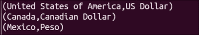
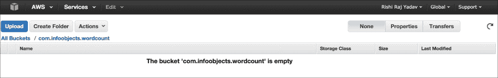
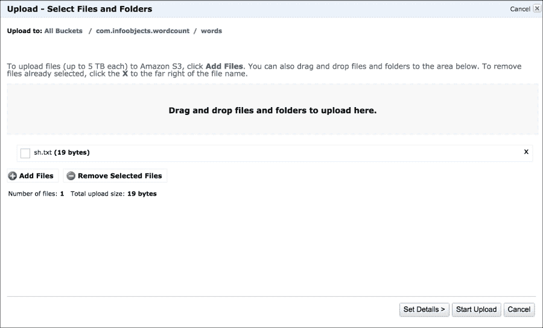
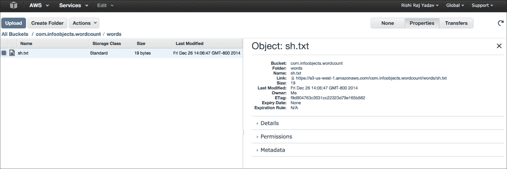
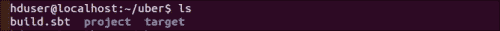

# 三、外部数据源

Spark 的优点之一是它提供了一个可以连接各种底层数据源的运行时。

在本章中，我们将连接到不同的数据源。 本章分为以下食谱：

*   从本地文件系统加载数据
*   从 HDFS 加载数据
*   使用自定义 InputFormat 从 HDFS 加载数据
*   从 Amazon S3 加载数据
*   从 Apache Cassandra 加载数据
*   从关系数据库加载数据

# 简介

Spark 为大数据提供了统一的运行时。 HDFS 是 Hadoop 的文件系统，是 Spark 最常用的存储平台，因为它为商用硬件上的非结构化和半结构化数据提供了经济高效的存储。 Spark 不仅限于 HDFS，还可以与任何 Hadoop 支持的存储配合使用。

Hadoop 支持的存储是指可以与 Hadoop 的`InputFormat`和`OutputFormat`接口一起工作的存储格式。 `InputFormat`负责从输入数据创建`InputSplits`，并将其进一步划分为记录。 `OutputFormat`负责写入存储。

我们将从写入本地文件系统开始，然后转到从 HDFS 加载数据。 在*从 HDFS*加载数据的秘诀中，我们将介绍最常见的文件格式：常规文本文件。 在下一个菜谱中，我们将介绍如何使用任何`InputFormat`接口在 Spark 中加载数据。 我们还将探讨加载存储在领先的云存储平台 Amazon S3 中的数据。

我们将探索从 Apache Cassandra 加载数据，这是一个 NoSQL 数据库。 最后，我们将探索从关系数据库加载数据。

# 从本地文件系统加载数据

尽管由于磁盘大小限制和缺乏分布式特性，本地文件系统不适合存储大量的数据，但从技术上讲，您可以使用本地文件系统在分布式系统中加载数据。 但是，您要访问的文件/目录必须在每个节点上都可用。

请注意，如果您计划使用此功能来加载端数据，这不是一个好主意。 为了加载端数据，Spark 有一个广播变量功能，这将在接下来的章节中讨论。

在本菜谱中，我们将了解如何从本地文件系统加载 Spark 中的数据。

## 怎么做……

让我们以莎士比亚的《生存还是毁灭》为例：

1.  使用以下命令创建`words`目录：

    ```scala
    $ mkdir words

    ```

2.  进入`words`目录：

    ```scala
    $ cd words

    ```

3.  创建`sh.txt`文本文件并在其中输入`"to be or not to be"`：

    ```scala
    $ echo "to be or not to be" > sh.txt

    ```

4.  启动 Spark Shell：

    ```scala
    $ spark-shell

    ```

5.  将`words`目录加载为 RDD：

    ```scala
    scala> val words = sc.textFile("file:///home/hduser/words")

    ```

6.  统计行数：

    ```scala
    scala> words.count

    ```

7.  将行(或多行)分成多个字：

    ```scala
    scala> val wordsFlatMap = words.flatMap(_.split("\\W+"))

    ```

8.  将`word`转换为(Word，1)-即，输出`1`作为`word`每次出现时的值，作为键：

    ```scala
    scala> val wordsMap = wordsFlatMap.map( w => (w,1))

    ```

9.  使用`reduceByKey`方法将每个单词的出现次数添加为一个键(此函数一次对两个连续值起作用，由`a`和`b`表示)：

    ```scala
    scala> val wordCount = wordsMap.reduceByKey( (a,b) => (a+b))

    ```

10.  打印 RDD：

    ```scala
    scala> wordCount.collect.foreach(println)

    ```

11.  一步完成前面的所有操作如下：

    ```scala
    scala> sc.textFile("file:///home/hduser/ words"). flatMap(_.split("\\W+")).map( w => (w,1)). reduceByKey( (a,b) => (a+b)).foreach(println)

    ```

这将提供以下输出：


# 从 HDFS 加载数据

HDFS 是使用最广泛的大数据存储系统。 广泛采用 HDFS 的原因之一是读取时架构。 这意味着 HDFS 在写入数据时不会对数据施加任何限制。 任何类型的数据都是受欢迎的，并且可以以原始格式存储。 此功能使其成为原始非结构化数据和半结构化数据的理想存储。

在读取数据时，即使是非结构化数据也需要赋予一定的结构才有意义。 Hadoop 使用`InputFormat`来确定如何读取数据。 Spark 完全支持 Hadoop 的`InputFormat`，所以任何可以被 Hadoop 读取的东西都可以被 Spark 读取。

默认值`InputFormat`为`TextInputFormat`。 `TextInputFormat`将行的字节偏移量作为键，将行的内容作为值。 Spark 使用`sc.textFile`方法使用`TextInputFormat`进行读取。 它忽略字节偏移量并创建字符串的 RDD。

有时文件名本身包含有用的信息，例如时间序列数据。 在这种情况下，您可能需要分别读取每个文件。 `sc.wholeTextFiles`方法允许您这样做。 它创建一个 RDD，将文件名和路径(例如，`hdfs://localhost:9000/user/hduser/words`)作为关键字，将整个文件的内容作为值。

Spark 还支持使用 DataFrames 读取各种序列化和压缩友好格式，如 Avro、Parquet 和 JSON。 这些格式将在接下来的章节中介绍。

在本菜谱中，我们将了解如何从 HDFS 加载 Spark shell 中的数据。

## 怎么做……

让我们进行个单词计数，它统计个单词出现的次数。 在此配方中，我们将从 HDFS 加载数据：

1.  使用以下命令创建`words`目录：

    ```scala
    $ mkdir words

    ```

2.  将目录更改为`words`：

    ```scala
    $ cd words

    ```

3.  创建`sh.txt text`文件并在其中输入`"to be or not to be"`：

    ```scala
    $ echo "to be or not to be" > sh.txt

    ```

4.  启动 Spark Shell：

    ```scala
    $ spark-shell

    ```

5.  Load the `words` directory as the RDD:

    ```scala
    scala> val words = sc.textFile("hdfs://localhost:9000/user/hduser/words")

    ```

    ### 备注

    `sc.textFile`方法还支持传递分区数量的附加参数。 默认情况下，Spark 为每个`InputSplit`类创建一个分区，大致相当于一个块。

    您可以要求更多的分区。 它非常适用于计算密集型的工作，比如机器学习。 由于一个分区不能包含多个块，因此不允许分区少于块。

6.  计算行数(结果为`1`)：

    ```scala
    scala> words.count

    ```

7.  将行(或多行)分成多个字：

    ```scala
    scala> val wordsFlatMap = words.flatMap(_.split("\\W+"))

    ```

8.  将 WORD 转换为(WORD，1)-即，将`1`作为键`word`每次出现时的值输出：

    ```scala
    scala> val wordsMap = wordsFlatMap.map( w => (w,1))

    ```

9.  使用`reduceByKey`方法将每个单词的出现次数添加为一个键(此函数一次对两个连续的值起作用，由`a`和`b`表示)：

    ```scala
    scala> val wordCount = wordsMap.reduceByKey( (a,b) => (a+b))

    ```

10.  打印 RDD：

    ```scala
    scala> wordCount.collect.foreach(println)

    ```

11.  上述操作一步完成如下：

    ```scala
    scala> sc.textFile("hdfs://localhost:9000/user/hduser/words"). flatMap(_.split("\\W+")).map( w => (w,1)). reduceByKey( (a,b) => (a+b)).foreach(println)

    ```

此为提供以下输出：


## 还有更多的…

有时我们需要一次访问整个文件。 有时，文件名包含有用的数据，例如时间序列。 有时，您需要将多行处理为一条记录。 `sparkContext.wholeTextFiles`来这里救援。 我们将查看来自[ftp://ftp.ncdc.noaa.gov/pub/data/noaa/](ftp://ftp.ncdc.noaa.gov/pub/data/noaa/)的天气数据集。

以下是顶级目录的外观：


查看特定年份目录-例如，1901 类似于以下屏幕截图：


这里的数据以这样一种方式划分，即每个文件名包含有用的信息，即 USAF-WBAN-Year，其中 USAF 是美国空军站号，WBAN 是气象局陆军海军位置号。

您还会注意到，所有文件都被压缩为扩展名为`.gz`的 gzip。 压缩是自动处理的，因此您只需在 HDFS 中上传数据即可。 我们将在接下来的章节中回到这个数据集。

由于整个数据集并不大，所以也可以通过伪分布式的方式上传到 HDFS 中：

1.  下载日期：Колибрипрограмма
2.  将天气数据加载到 HDFS 中：

    ```scala
    $ hdfs dfs -put ftp.ncdc.noaa.gov/pub/data/noaa weather/

    ```

3.  启动 Spark Shell：

    ```scala
    $ spark-shell

    ```

4.  在 RDD 中加载 1901 年的天气数据：

    ```scala
    scala> val weatherFileRDD = sc.wholeTextFiles("hdfs://localhost:9000/user/hduser/weather/1901")

    ```

5.  Cache weather in the RDD so that it is not recomputed every time it's accessed:

    ```scala
    scala> val weatherRDD = weatherFileRDD.cache

    ```

    ### 备注

    在 Spark 中，有各种 StorageLevel 可以持久化 RDD。 `rdd.cache`是`rdd.persist(MEMORY_ONLY)`存储级别的缩写。

6.  计算元素的个数：

    ```scala
    scala> weatherRDD.count

    ```

7.  由于文件的个全部内容作为元素加载，我们需要手动解释数据，因此让我们加载第一个元素：

    ```scala
    scala> val firstElement = weatherRDD.first

    ```

8.  Read the value of the first RDD:

    ```scala
    scala> val firstValue = firstElement._2

    ```

    `firstElement`包含形式为(字符串，字符串)的元组。 可以通过两种方式访问元组：

    *   使用以`_1`开头的位置函数。
    *   使用`productElement`方法，例如`tuple.productElement(0)`。 与大多数其他方法一样，这里的索引以`0`开头。
9.  按行拆分`firstValue`：

    ```scala
    scala> val firstVals = firstValue.split("\\n")

    ```

10.  计算`firstVals`中的元素数：

    ```scala
    scala> firstVals.size

    ```

11.  气象数据的模式非常丰富，文本的位置起到了分隔符的作用。 你可以在国家气象局网站上获得更多关于模式的信息。 让我们得到风速，它来自第 66-69 节(以米/秒为单位)：

    ```scala
    scala> val windSpeed = firstVals.map(line => line.substring(65,69)

    ```

# 使用自定义 InputFormat 从 HDFS 加载数据

有时需要加载特定格式的数据，而`TextInputFormat`并不适合。 Spark 为此提供了两种方法：

*   `sparkContext.hadoopFile`：这支持旧的 MapReduce API
*   `sparkContext.newAPIHadoopFile`：这支持新的 MapReduce API

这两个方法支持 Hadoop 的所有内置 InputFormats 接口以及任何自定义的`InputFormat`。

## 怎么做……

我们将加载 Key-Value 格式的文本数据，并使用`KeyValueTextInputFormat`将其加载到 Spark 中：

1.  使用以下命令创建`currency`目录：

    ```scala
    $ mkdir currency
    ```

2.  将当前目录更改为`currency`：

    ```scala
    $ cd currency
    ```

3.  Create the `na.txt` text file and enter currency values in key-value format delimited by tab (key: country, value: currency):

    ```scala
    $ vi na.txt
    United States of America        US Dollar
    Canada  Canadian Dollar
    Mexico  Peso

    ```

    您可以为每个大陆创建更多文件。

4.  将`currency`文件夹上传到 HDFS：

    ```scala
    $ hdfs dfs -put currency /user/hduser/currency

    ```

5.  启动 Spark Shell：

    ```scala
    $ spark-shell

    ```

6.  导入语句：

    ```scala
    scala> import org.apache.hadoop.io.Text
    scala> import org.apache.hadoop.mapreduce.lib.input.KeyValueTextInputFormat

    ```

7.  加载`currency`目录作为 RDD：

    ```scala
    val currencyFile = sc.newAPIHadoopFile("hdfs://localhost:9000/user/hduser/currency",classOf[KeyValueTextInputFormat],classOf[Text],classOf[Text])

    ```

8.  将其从(text，text)的元组转换为(string，string)的元组：

    ```scala
    val currencyRDD = currencyFile.map( t => (t._1.toString,t._2.toString))

    ```

9.  统计 RDD 中的元素数：

    ```scala
    scala> currencyRDD.count

    ```

10.  Print the values:

    ```scala
    scala> currencyRDD.collect.foreach(println)

    ```

    

### 备注

您可以使用此方法在任何 Hadoop 支持的`InputFormat`接口中加载数据。

# 从 Amazon S3 加载数据

Amazon**简单存储服务**(**S3**)为开发人员和 IT 团队提供了安全、耐用且可扩展的存储平台。 Amazon S3 最大的优势是没有前期 IT 投资，公司可以根据需要(只需点击按钮)进行容量建设。

虽然 Amazon S3 可以与任何计算平台配合使用，但它与 Amazon 的云服务(如 Amazon**Elastic Compute Cloud**(**EC2**)和 Amazon**Elastic Block Storage**(**EBS**)等云服务集成得非常好。 由于这个原因，使用**Amazon Web Services**(**AWS**)的公司很可能已经在 Amazon S3 上存储了大量数据。

这为从 AmazonS3 在 Spark 中加载数据提供了一个很好的理由，而这也正是本文要介绍的内容。

## 怎么做……

让我们从 AWS 门户开始：

1.  转到[http://aws.amazon.com](http://aws.amazon.com)并使用您的用户名和密码登录。
2.  Once logged in, navigate to **Storage & Content Delivery** | **S3** | **Create Bucket**:

    

3.  输入存储桶名称，例如`com.infoobjects.wordcount`。 请确保输入唯一的存储桶名称(两个 S3 存储桶不能全局同名)。
4.  Select **Region**, click on **Create**, and then on the bucket name you created and you will see the following screen:

    

5.  单击**创建文件夹**，然后输入`words`作为文件夹名称。
6.  在本地文件系统上创建`sh.txt`文本文件：

    ```scala
    $ echo "to be or not to be" > sh.txt

    ```

7.  Navigate to **Words** | **Upload** | **Add Files** and choose `sh.txt` from the dialog box, as shown in the following screenshot:

    

8.  在**开始上传**上单击。
9.  Select **sh.txt** and click on **Properties** and it will show you details of the file:

    

10.  将`AWS_ACCESS_KEY`和`AWS_SECRET_ACCESS_KEY`设置为环境变量。
11.  打开 Spark shell 并从`words`RDD：

    ```scala
    scala>  val words = sc.textFile("s3n://com.infoobjects.wordcount/words")

    ```

    中的`s3`加载`words`目录

现在 RDD 已加载，您可以继续在 RDD 上执行常规的转换和操作。

### 备注

有时在`s3://`和`s3n://`之间会有混淆。 `s3n://`指的是位于 S3 存储桶中但外部世界可读可写的常规文件。 此文件系统对文件大小设置了 5 GB 的限制。

`s3://`表示位于 S3 存储桶中的 HDFS 文件。 它是基于数据块的文件系统。 文件系统要求您为此文件系统指定一个存储桶。 此系统对文件大小没有限制。

# 从 Apache Cassandra 加载数据

Apache Cassandra 是一个 NoSQL 数据库，具有无主控的环形集群结构。 虽然 HDFS 非常适合流数据访问，但它在随机访问时不能很好地工作。 例如，当您的平均文件大小为 100 MB 并且您想要读取整个文件时，HDFS 会工作得很好。 如果频繁访问文件中的第*n*行或作为记录访问其他部分，HDFS 将会太慢。

传统上，关系数据库提供了一种解决方案，提供低延迟、随机访问，但它们不能很好地处理大数据。 NoSQL 数据库(如 Cassandra)通过在商用服务器上提供分布式架构的关系型数据库访问来填补这一空白。

在本配方中，我们将从 Cassandra 加载数据作为 Spark RDD。 为了实现这一目标，Cassandra 背后的 DataSTax 公司做出了贡献`spark-cassandra-connector`。 该连接器允许您将 Cassandra 表作为 Spark RDDS 加载，将 Spark RDDS 写回 Cassandra，并执行 CQL 查询。

## 怎么做……

执行以下步骤从 Cassandra 加载数据：

1.  在 Cassandra 中使用 CQL shell 创建名为`people`的密钥空间：

    ```scala
    cqlsh> CREATE KEYSPACE people WITH replication = {'class': 'SimpleStrategy', 'replication_factor': 1 };

    ```

2.  在较新版本的 Cassandra 中创建列族(从 CQL 3.0 开始，它也可以称为**表**)`person`：

    ```scala
    cqlsh> create columnfamily person(id int primary key,first_name varchar,last_name varchar);

    ```

3.  在列族中插入几条记录：

    ```scala
    cqlsh> insert into person(id,first_name,last_name) values(1,'Barack','Obama');
    cqlsh> insert into person(id,first_name,last_name) values(2,'Joe','Smith');

    ```

4.  将 Cassandra 连接器依赖项添加到 SBT：

    ```scala
    "com.datastax.spark" %% "spark-cassandra-connector" % 1.2.0

    ```

5.  You can also add the Cassandra dependency to Maven:

    ```scala
    <dependency>
      <groupId>com.datastax.spark</groupId>
      <artifactId>spark-cassandra-connector_2.10</artifactId>
      <version>1.2.0</version>
    </dependency>
    ```

    或者，您也可以下载`spark-cassandra-connector`JAR 以直接与 Spark shell 一起使用：

    ```scala
    $ wget http://central.maven.org/maven2/com/datastax/spark/spark-cassandra-connector_2.10/1.1.0/spark-cassandra-connector_2.10-1.2.0.jar

    ```

    ### 备注

    如果您想构建包含所有依赖项的`uber`JAR，请参考*There‘s More…。* 部分。

6.  现在启动 Spark Shell。
7.  在 Spark shell 中设置`spark.cassandra.connection.host`属性：

    ```scala
    scala> sc.getConf.set("spark.cassandra.connection.host", "localhost")

    ```

8.  导入 Cassandra 特定的库：

    ```scala
    scala> import com.datastax.spark.connector._

    ```

9.  将`person`柱族作为 RDD 载入：

    ```scala
    scala> val personRDD = sc.cassandraTable("people","person")

    ```

10.  统计 RDD 中的记录数：

    ```scala
    scala> personRDD.count

    ```

11.  打印 RDD 中的数据：

    ```scala
    scala> personRDD.collect.foreach(println)

    ```

12.  检索第一行：

    ```scala
    scala> val firstRow = personRDD.first

    ```

13.  获取列名：

    ```scala
    scala> firstRow.columnNames

    ```

14.  Cassandra 也可以通过 Spark SQL 访问。 它在`SQLContext`周围有一个称为`CassandraSQLContext`的包装器；让我们加载它：

    ```scala
    scala> val cc = new org.apache.spark.sql.cassandra.CassandraSQLContext(sc)

    ```

15.  将`person`数据加载为`SchemaRDD`：

    ```scala
    scala> val p = cc.sql("select * from people.person")

    ```

16.  检索`person`数据：

    ```scala
    scala> p.collect.foreach(println)

    ```

## 还有更多...

Spark Cassandra 的连接器库有很多依赖项。 连接器本身及其几个依赖项是 Spark 的第三方，不能作为 Spark 安装的一部分提供。

这些依赖项需要在运行时对驱动程序和执行器可用。 要做到这一点，一种方法是捆绑所有可传递的依赖项，但这是一个费力且容易出错的过程。 推荐的方法是将所有依赖项与连接器库捆绑在一起。 这将产生一个肥大的罐子，通常被称为`uber`罐子。

SBT 提供了`sbt-assembly`插件，这使得创建`uber`JAR 非常容易。 以下是为`spark-cassandra-connector`创建`uber`JAR 的步骤。 这些步骤足够通用，因此您可以使用它们来创建任何`uber`JAR：

1.  创建名为`uber`的文件夹：

    ```scala
    $ mkdir uber

    ```

2.  将目录更改为`uber`：

    ```scala
    $ cd uber

    ```

3.  打开 SBT 提示符：

    ```scala
    $ sbt

    ```

4.  为此项目命名`sc-uber`：

    ```scala
    > set name := "sc-uber"

    ```

5.  保存会话：

    ```scala
    > session save

    ```

6.  Exit the session:

    ```scala
    > exit

    ```

    这将在`uber`文件夹中创建`build.sbt`、`project`和`target`文件夹，如以下屏幕截图所示：

    

7.  Add the `spark-cassandra-driver` dependency to `build.sbt` at the end after leaving a blank line as shown in the following screenshot:

    ```scala
    $ vi buid.sbt

    ```

    

8.  We will use `MergeStrategy.first` as the default. Besides that, there are some files, such as `manifest.mf`, that every JAR bundles for metadata, and we can simply discard them. We are going to use `MergeStrategy.discard` for that. The following is the screenshot of `build.sbt` with `assemblyMergeStrategy` added:

    

9.  现在在`project`文件夹中创建`plugins.sbt`，并为`sbt-assembly`插件键入以下内容：

    ```scala
    addSbtPlugin("com.eed3si9n" % "sbt-assembly" % "0.12.0")

    ```

10.  We are ready to build (`assembly`) a JAR now:

    ```scala
    $ sbt assembly

    ```

    现在在`target/scala-2.10/sc-uber-assembly-0.1-SNAPSHOT.jar`中创建了`uber`JAR。

11.  将其复制到保存所有第三方 JAR 的合适位置(例如，`/home/hduser/thirdparty`)，并将其重命名为更简单的名称(除非您喜欢更长的名称)：

    ```scala
    $ mv thirdparty/sc-uber-assembly-0.1-SNAPSHOT.jar  thirdparty/sc-uber.jar

    ```

12.  使用`--jars`：

    ```scala
    $ spark-shell --jars thirdparty/sc-uber.jar

    ```

    将`uber`JAR 加载到 Spark 外壳中
13.  要将 Scala 代码提交到集群，可以使用相同的 JARS 选项调用`spark-submit`：

    ```scala
    $ spark-submit --jars thirdparty/sc-uber.jar

    ```

### SBT 装配中的合并策略

如果多个 JAR 文件具有相同的名称和相同的相对路径，则`sbt-assembly`插件的默认合并策略是验证所有文件的内容是否相同，否则会出错。 这种策略称为`MergeStrategy.deduplicate`。

以下是`sbt-assembly plugin`中可用的合并策略：

<colgroup><col style="text-align: left"> <col style="text-align: left"></colgroup> 
| 

策略名称

 | 

描述 / 描写 / 形容 / 类别

 |
| --- | --- |
| `MergeStrategy.deduplicate` | 默认策略 |
| `MergeStrategy.first` | 根据类路径选择第一个文件 |
| `MergeStrategy.last` | 根据类路径选择最后一个文件 |
| `MergeStrategy.singleOrError` | 错误输出(预期不会出现合并冲突) |
| `MergeStrategy.concat` | 将所有匹配的文件连接在一起 |
| `MergeStrategy.filterDistinctLines` | 串连省略重复项 |
| `MergeStrategy.rename` | 重命名文件 |

# 从关系数据库加载数据

很多重要数据位于 Spark 需要查询的关系数据库中。 JdbcRDD 是一个 Spark 特性，它允许将关系表作为 RDDS 加载。 本食谱将解释如何使用 JdbcRDD。

下一章将介绍的 Spark SQL 包括一个用于 JDBC 的数据源。 这应该比当前的配方更好，因为结果以 DataFrames(将在下一章中介绍)的形式返回，它可以很容易地由 Spark SQL 处理，也可以与其他数据源连接。

## 做好准备

请确保 JDBC 驱动程序 JAR 在客户端节点和将在其上运行 Executor 的所有从节点上可见。

## 怎么做……

执行以下步骤以从关系数据库加载数据：

1.  使用以下 DDL 在 MySQL 中创建名为`person`的表：

    ```scala
    CREATE TABLE 'person' (
      'person_id' int(11) NOT NULL AUTO_INCREMENT,
      'first_name' varchar(30) DEFAULT NULL,
      'last_name' varchar(30) DEFAULT NULL,
      'gender' char(1) DEFAULT NULL,
      PRIMARY KEY ('person_id');
    )
    ```

2.  插入一些数据：

    ```scala
    Insert into person values('Barack','Obama','M');
    Insert into person values('Bill','Clinton','M');
    Insert into person values('Hillary','Clinton','F');
    ```

3.  从[http://dev.mysql.com/downloads/connector/j/](http://dev.mysql.com/downloads/connector/j/)下载`mysql-connector-java-x.x.xx-bin.jar`。
4.  Make the MySQL driver available to the Spark shell and launch it:

    ```scala
    $ spark-shell --jars /path-to-mysql-jar/mysql-connector-java-5.1.29-bin.jar

    ```

    ### 备注

    请注意，`path-to-mysql-jar`不是实际的路径名。 您应该使用实际的路径名。

5.  为用户名、密码和 JDBC URL 创建变量：

    ```scala
    scala> val url="jdbc:mysql://localhost:3306/hadoopdb"
    scala> val username = "hduser"
    scala> val password = "******"

    ```

6.  导入 JdbcRDD：

    ```scala
    scala> import org.apache.spark.rdd.JdbcRDD

    ```

7.  导入 JDBC 相关类：

    ```scala
    scala> import java.sql.{Connection, DriverManager, ResultSet}

    ```

8.  创建 JDBC 驱动程序的实例：

    ```scala
    scala> Class.forName("com.mysql.jdbc.Driver").newInstance

    ```

9.  加载 JdbcRDD：

    ```scala
    scala> val myRDD = new JdbcRDD( sc, () =>
    DriverManager.getConnection(url,username,password) ,
    "select first_name,last_name,gender from person limit ?, ?",
    1, 5, 2, r => r.getString("last_name") + ", " + r.getString("first_name"))

    ```

10.  现在查询结果：

    ```scala
    scala> myRDD.count
    scala> myRDD.foreach(println)

    ```

11.  将 RDD 保存到 HDFS：

    ```scala
    scala> myRDD.saveAsTextFile("hdfs://localhost:9000/user/hduser/person")

    ```

## …的工作原理

JdbcRDD 是 RDD，它在 JDBC 连接上执行 SQL 查询并检索结果。 下面的是一个 JdbcRDD 构造函数：

```scala
JdbcRDD( SparkContext, getConnection: () => Connection,
sql: String, lowerBound: Long, upperBound: Long,
numPartitions: Int,  mapRow: (ResultSet) => T =
 JdbcRDD.resultSetToObjectArray)

```

两个？是 JdbcRDD 中预准备语句的绑定变量。第一个？是偏移量(下限)，即我们应该从哪一行开始计算，第二个？是极限(上限)，即我们应该读取多少行。

JdbcRDD 是在即席基础上直接从关系数据库加载 Spark 中数据的一种很好的方法。 如果您想从 RDBMS 批量加载数据，还有其他更好的方法，例如，Apache Sqoop 是一个功能强大的工具，可以将数据从关系数据库导入和导出到 HDFS。