# 六、在生成网络中使用 LSTM

阅读本章后，您将能够完成以下任务:

*   下载将用作输入文本的小说/书籍
*   准备和清理数据
*   标记句子
*   培训和拯救 LSTM 模式
*   使用模型生成相似的文本

# 介绍

由于**循环神经网络** ( **RNNs** )在反向传播方面的缺陷，**长短期记忆单元** ( **LSTMs** )和**门控递归单元** ( **GRUs** )在学习顺序输入数据方面越来越受欢迎，因为它们更适合解决渐变消失和爆炸的问题。

# 下载将用作输入文本的小说/书籍

在本食谱中，我们将按照需要下载小说/书籍的步骤进行，这些小说/书籍将用作执行本食谱的输入文本。

# 准备好了

*   将输入数据以`.txt`文件的形式放置在工作目录中。
*   输入可以是任何类型的文本，例如歌词、小说、杂志文章和源代码。
*   大多数经典文本不再受版权保护，可以免费下载并用于实验。获取免费书籍的最佳地点是古腾堡计划。
*   在本章中，我们将使用鲁德亚德·吉卜林的《丛林之书》作为输入来训练我们的模型，并生成统计上相似的文本作为输出。下面的截图展示了如何下载`.txt`格式的必要文件:


*   访问网站并搜索所需的书籍后，点击纯文本 UTF-8 并下载。UTF-8 基本上指定了编码的类型。通过单击链接，可以将文本复制粘贴或直接保存到工作目录中。

# 怎么做...

在开始之前，看一看数据并进行分析总是有帮助的。看完数据后，我们可以看到有很多标点符号、空格、引号以及大写和小写字母。在对数据进行任何分析或将其输入 LSTM 网络之前，我们需要先准备好数据。我们需要大量的库来简化数据处理:

1.  通过发出以下命令导入必要的库:

```py
from keras.preprocessing.text import Tokenizerfrom keras.utils import to_categoricalfrom keras.models import Sequentialfrom keras.layers import Dense, lSTM, Dropout, Embeddingimport numpy as npfrom pickle import dumpimport string
```

2.  前面命令的输出如下图所示:


3.  仔细检查当前工作目录并选择所需的文件夹作为工作目录总是一个好主意。在我们的例子中，`.txt`文件被命名为`junglebook.txt`，保存在名为`Chapter 8`的文件夹中。因此，我们将选择该文件夹作为整个章节的工作目录。这可以通过如下截图所示来完成:


4.  接下来，通过定义名为`load_document`的函数将文件加载到程序的内存中，这可以通过发出以下命令来完成:

```py
def load_document(name):file = open(name, 'r')text = file.read()file.close()return text
```

5.  使用先前定义的函数将文档加载到内存中，并使用以下脚本打印文本文件的前`2000`个字符:

```py
input_filename = 'junglebook.txt'doc = load_document(input_filename)print(doc[:2000])
```

6.  运行前面的函数和命令会产生如下截图所示的输出:

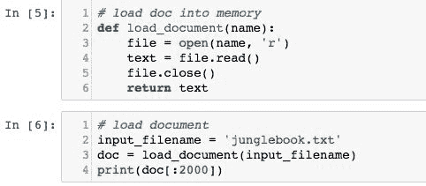

上面代码的输出如下图所示:

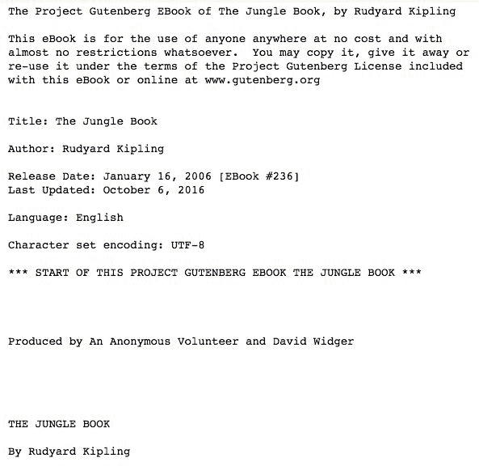

下面的截图是前面输出的延续:

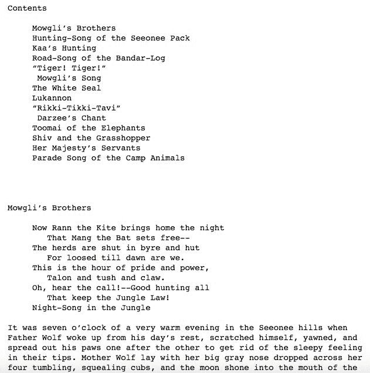

7.  从前面的截图中可以看到，`.txt`文件的第一个`2000`字符被打印出来。在对数据执行任何预处理之前，通过查看数据来分析数据总是一个好主意。这将为如何处理预处理步骤提供更好的思路。

# 它是如何工作的...

1.  `array`功能将用于处理数组形式的数据。`numpy`库很容易提供这个功能。
2.  因为我们的数据只是文本数据，所以在将单词编码为整数之前，我们将要求字符串库将所有输入数据作为字符串进行处理，这是可以输入的。
3.  `tokenizer`功能将把所有的句子拆分成记号，每个记号代表一个单词。
4.  使用`dump`功能将字典保存到泡菜文件中需要泡菜库。
5.  来自`keras`库的`to_categorical`函数将一个类向量(整数)转换成一个二进制类矩阵，例如，用于`categorical_crossentropy`，为了将标记映射到唯一的整数，我们将在后面的阶段需要它，反之亦然。
6.  本章中需要的一些其他 Keras 层是 LSTM 层、致密层、脱落层和嵌入层。模型将按顺序定义，为此我们需要`keras`库中的顺序模型。

# 还有更多...

*   你也可以对不同类型的文本使用相同的模型，比如网站上的客户评论、推文、源代码等结构化文本、数学理论等等。
*   本章的目的是了解 LSTMs 如何学习长期依赖关系，以及与循环神经网络相比，它们如何在处理顺序数据时表现得更好。
*   另一个好主意是在模型中输入*神奇宝贝*的名称，并尝试生成自己的神奇宝贝名称。

# 请参见

有关所用不同库的更多信息，请参见以下链接:

*   [https://www . scipy-讲课. org/intro/numpy/array _ object . html](https://www.scipy-lectures.org/intro/numpy/array_object.html)
*   [https://docs.python.org/2/library/string.html](https://docs.python.org/2/library/string.html)
*   [https://wiki . python . org/moin/usigpickel](https://wiki.python.org/moin/UsingPickle)
*   [https://keras.io/preprocessing/text/](https://keras.io/preprocessing/text/)
*   [https://keras.io/layers/core/](https://keras.io/layers/core/)
*   [https://keras.io/layers/recurrent/](https://keras.io/layers/recurrent/)

# 准备和清理数据

本章的这一部分将讨论在将数据作为输入输入模型之前所涉及的各种数据准备和文本预处理步骤。我们准备数据的具体方式实际上取决于我们打算如何对其建模，而这又取决于我们打算如何使用它。

# 准备好

语言模型将基于统计数据，并预测给定文本输入序列的每个单词的概率。预测的单词将作为输入输入到模型中，进而生成下一个单词。

一个关键的决定是输入序列应该有多长。它们需要足够长，以允许模型学习单词预测的上下文。当我们使用模型时，该输入长度还将定义用于生成新序列的种子文本的长度。

为了简单起见，我们将任意选择 50 个单词的长度作为输入序列的长度。

# 怎么做...

基于对文本的检查(我们之前做过)，以下是可以执行的一些操作，用于清理和预处理输入文件中的文本。我们已经介绍了一些关于文本预处理的选项。但是，您可能希望探索更多清洁操作作为练习:

*   将破折号`–`替换为空格，这样可以更好地拆分单词
*   基于空格分割单词
*   删除输入文本中的所有标点符号，以减少输入模型的文本中的唯一字符数(例如，为什么？变成为什么)
*   移除所有非字母单词，以移除独立的标点符号和表情符号
*   将所有单词从大写转换为小写，以进一步减少令牌总数的大小，并消除任何差异和数据冗余

词汇量是语言建模和决定模型训练时间的决定性因素。词汇量越小，训练速度就越快。虽然在某些情况下词汇量少是好事，但在其他情况下词汇量多有助于防止过度拟合。为了对数据进行预处理，我们需要一个函数，该函数接收整个输入文本，基于空格将其拆分，删除所有标点符号，规范化所有大小写，并返回一系列标记。为此，通过发出以下命令来定义`clean_document`功能:

```py
 import stringdef clean_document(doc):doc = doc.replace('--', ' ')tokens = doc.split()table = str.maketrans('', '', string.punctuation)tokens = [w.translate(table) for w in tokens]tokens = [word for word in tokens if word.isalpha()]tokens = [word.lower() for word in tokens]return tokens
```

1.  先前定义的函数将基本上以加载的文档/文件为参数，并返回一个干净标记的数组，如下图所示:


2.  接下来，打印出一些标记和统计数据，以便更好地理解`clean_document`函数正在做什么。该步骤通过发出以下命令来完成:

```py
tokens = clean_document(doc)print(tokens[:200])print('Total Tokens: %d' % len(tokens))print('Total Unique Tokens: %d' % len(set(tokens)))
```

3.  前一组命令的输出打印了前两百个令牌，如下面的截图所示:


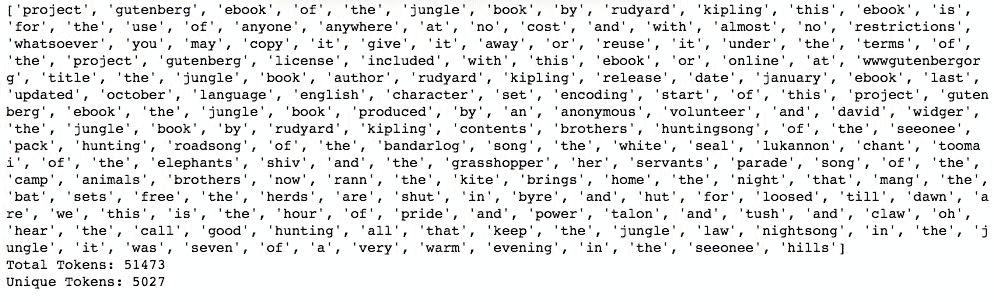

4.  接下来，使用以下命令将所有这些标记组织成序列，每个序列包含 50 个单词(任意选择):

```py
 length = 50 + 1sequences = list()for i in range(length, len(tokens)):seq = tokens[i-sequence_length:i]line = ' '.join(seq)sequences.append(line)print('Total Sequences: %d' % len(sequences))
```

从文档形成的序列总数可以通过打印出来来查看，如下图所示:


5.  通过使用以下命令定义`save_doc`函数，将所有生成的令牌和序列保存到工作目录中的文件中:

```py
def save_document(lines, name):data = '\n'.join(lines)file = open(name, 'w')file.write(data)file.close()
```

要保存序列，请使用以下两个命令:

```py
 output_filename = 'junglebook_sequences.txt'save_document(sequences, output_filename)
```

6.  下面的截图说明了这一过程:


7.  接下来，使用`load_document`函数将包含所有保存的令牌和序列的保存文档加载到内存中，该函数定义如下:

```py
def load_document(name):file = open(name, 'r')text = file.read()file.close()return text# function to load document and split based on linesinput_filename = 'junglebook_sequences.txt'doc = load_document(input_filename)lines = doc.split('\n')
```

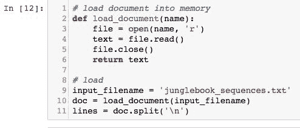

# 它是如何工作的...

1.  `clean_document`函数删除所有空格、标点符号、大写文本和引号，并将整个文档拆分为标记，其中每个标记都是一个单词。
2.  通过打印文档中的令牌总数和唯一令牌总数，我们将注意到`clean_document`函数生成了 51，473 个令牌，其中 5，027 个令牌(或单词)是唯一的。
3.  `save_document`函数保存所有这些标记以及生成我们的 50 个单词序列所需的唯一标记。请注意，通过遍历所有生成的标记，我们能够生成一个包含 51，422 个序列的长列表。这些是将被用作训练语言模型的输入的相同序列。

4.  在对所有 51，422 个序列训练模型之前，将令牌和序列保存到文件中总是一个好的做法。保存后，可以使用定义的`load_document`功能将文件加载回内存。
5.  序列被组织为 50 个输入标记和一个输出标记(这意味着每个序列有 51 个标记)。为了预测每个输出令牌，前面的 50 个令牌将被用作模型的输入。我们可以这样做:从令牌 51 开始迭代令牌列表，将前面的 50 个令牌作为一个序列，然后重复这个过程，直到所有令牌的列表结束。

# 请参见

请访问以下链接，以更好地理解使用各种功能进行数据准备:

*   [https://docs.python.org/3/library/tokenize.html](https://docs.python.org/3/library/tokenize.html)
*   [https://keras.io/utils/](https://keras.io/utils/)
*   [http://www.pythonforbeginners.com/dictionary/python-split](http://www.pythonforbeginners.com/dictionary/python-split)
*   [https://www.tutorialspoint.com/python/string_join.htm](https://www.tutorialspoint.com/python/string_join.htm)
*   [https://www.tutorialspoint.com/python/string_lower.htm](https://www.tutorialspoint.com/python/string_lower.htm)

# 标记句子

在定义数据并将数据输入 LSTM 网络之前，重要的是将数据转换成神经网络能够理解的形式。计算机理解二进制代码(0 和 1)中的一切，因此，字符串格式的文本或数据需要转换成一个热编码变量。

# 准备好

要了解热编码的工作原理，请访问以下链接:

*   [https://machinelearningmaster . com/how-one-hot-encode-sequence-data-in-python/](https://machinelearningmastery.com/how-to-one-hot-encode-sequence-data-in-python/)
*   [http://sci kit-learn . org/stable/modules/generated/sklearn . premination . onehotencoder . html](http://scikit-learn.org/stable/modules/generated/sklearn.preprocessing.OneHotEncoder.html)
*   [https://stackoverflow . com/questions/37292872/如何在 python 中进行一次热编码](https://stackoverflow.com/questions/37292872/how-can-i-one-hot-encode-in-python)
*   [https://www.ritchieng.com/machinelearning-one-hot-encoding/](https://www.ritchieng.com/machinelearning-one-hot-encoding/)
*   [https://hackernoon . com/what-one-is-hot-encoding-why-and-why-do-it-E3 c 6186d 008 f](https://hackernoon.com/what-is-one-hot-encoding-why-and-when-do-you-have-to-use-it-e3c6186d008f)

# 怎么做...

在浏览完上一节之后，你应该能够清理整个语料库并拆分句子。涉及热门编码和句子标记的后续步骤可以通过以下方式完成:

1.  一旦令牌和序列被保存到文件中并加载到内存中，它们就必须被编码为整数，因为模型中的单词嵌入层期望输入序列由整数而不是字符串组成。
2.  这是通过将词汇表中的每个单词映射到一个唯一的整数并对输入序列进行编码来实现的。稍后，在进行预测时，可以将预测转换(或映射)回数字，以便在相同的映射中查找它们相关联的单词，并将整数反向映射回单词。
3.  要执行这种编码，利用 Keras API 中的`Tokenizer`类。编码之前，必须在整个数据集上训练标记器，以便它找到所有唯一的标记，并为每个标记分配一个唯一的整数。这样做的命令如下:

```py
tokenizer = Tokenizer()tokenizer.fit_on_texts(lines)sequences = tokenizer.texts_to_sequences(lines)
```

4.  您还需要在稍后定义嵌入层之前计算词汇的大小。这是通过计算映射字典的大小来确定的。
5.  因此，在为嵌入层指定词汇大小时，将其指定为比实际词汇大 1。因此，词汇量的定义如下:

```py
vocab_size = len(tokenizer.word_index) + 1print('Vocabulary size : %d' % vocab_size)
```

6.  现在，一旦输入序列被编码，它们就需要被分成输入和输出元素，这可以通过数组切片来完成。

7.  分离后，一个热编码输出字。这意味着将它从一个整数转换成一个 0 值的 n 维向量，词汇表中的每个单词一个，1 表示单词整数值索引处的特定单词。Keras 提供了`to_categorical()`功能，可用于对每个输入输出序列对的输出字进行热编码。

8.  最后，向嵌入层指定输入序列的长度。我们知道有 50 个单词，因为模型是通过将序列长度指定为 50 来设计的，但是指定序列长度的一个好的通用方法是使用输入数据形状的第二维度(列数)。
9.  这可以通过发出以下命令来完成:

```py
sequences = array(sequences)Input, Output = sequences[:,:-1], sequences[:,-1]Output = to_categorical(Output, num_classes=vocab_size)sequence_length = Input.shape[1]
```

# 它是如何工作的...

本节将描述在执行上一节中的命令时必须看到的输出:

1.  运行用于标记句子和计算词汇长度的命令后，您必须看到如下截图所示的输出:


2.  单词被赋予从 1 到单词总数的值(例如，本例中为 5，027)。嵌入层需要为这个词汇表中从索引 1 到最大索引的每个单词分配一个向量表示。词汇末尾的单词索引将为 5，027；这意味着数组的长度必须是 5，027 + 1。
3.  数组切片并将句子分成每个序列 50 个单词的序列后的输出必须如下图所示:


4.  使用`to_categorical()`函数，以便模型学习预测下一个单词的概率分布。

# 还有更多...

有关在 Python 中重塑数组的更多信息，可以在以下链接中找到:

*   [https://docs . scipy . org/doc/numpy/reference/generated/numpy . resform . html](https://docs.scipy.org/doc/numpy/reference/generated/numpy.reshape.html)
*   [https://machinelearning master . com/index-slice-resform-numpy-arrays-machine-learning-python/](https://machinelearningmastery.com/index-slice-reshape-numpy-arrays-machine-learning-python/)

# 培训和拯救 LSTM 模式

现在，您可以从准备好的数据中训练统计语言模型。

将要训练的模型是神经语言模型。它有几个独特的特点:

*   它使用单词的分布式表示，因此具有相似含义的不同单词将具有相似的表示
*   它在学习模型的同时学习表示
*   它学习使用前 50 个单词的上下文来预测下一个单词的概率

具体来说，您将使用嵌入层来学习单词的表示，并使用**长短期记忆** ( **LSTM** )循环神经网络来学习根据单词的上下文来预测单词。

# 准备好了

如前所述，学习的嵌入需要知道词汇表的大小和输入序列的长度。它还有一个参数来指定将使用多少个维度来表示每个单词。这是嵌入向量空间的大小。

常见的值有 50、100 和 300。这里我们将使用 100，但是考虑测试更小或更大的值，并评估这些值的指标。

该网络将由以下部分组成:

*   两个 LSTM 隐藏层，每个层有 200 个存储单元。更多的存储单元和更深的网络可能会获得更好的结果。

*   压降为 0.3%或 30%的压降层，这将有助于网络减少对每个神经元/单元的依赖，并减少数据过拟合。

*   具有 200 个神经元的密集全连接层连接到 LSTM 隐藏层，以解释从序列中提取的特征。

*   输出层，它以词汇表中每个单词的概率，将下一个单词预测为词汇表大小的单个向量。

*   在第二密集或全连接层中使用 softmax 分类器，以确保输出具有归一化概率的特征(例如在 0 和 1 之间)。

# 怎么做...

1.  该模型是使用以下命令定义的，并在下面的屏幕截图中进行了说明:

```py
model = Sequential()model.add(Embedding(vocab_size, 100, input_length=sequence_length))model.add(LSTM(200, return_sequences=True))model.add(LSTM(200))model.add(Dropout(0.3))model.add(Dense(200, activation='relu'))model.add(Dense(vocab_size, activation='softmax'))print(model.summary())
```


2.  打印模型摘要只是为了确保模型按预期构建。
3.  编译模型，指定拟合模型所需的分类交叉熵损失。时代的数量设置为 75，模型以小批量训练，批量大小为 250。这是使用以下命令完成的:

```py
 model.compile(loss='categorical_crossentropy', optimizer='adam', metrics=['accuracy'])model.fit(Input, Output, batch_size=250, epochs=75)
```

4.  下面的屏幕截图显示了上述命令的输出:


5.  模型编译完成后，使用以下命令保存:

```py
model.save('junglebook_trained.h5')dump(tokenizer, open('tokenizer.pkl', 'wb'))
```

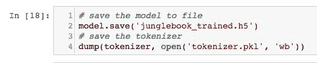

# 它是如何工作的...

1.  该模型是使用 Keras 框架中的`Sequential()`函数构建的。模型中的第一层是嵌入层，它采用词汇大小、向量维数和输入序列长度作为参数。

2.  接下来的两层是 LSTM 层，每层有 200 个存储单元。可以试验更多的存储单元和更深的网络，以检查它是否能提高精度。
3.  下一层是丢失概率为 30%的丢失层，这意味着在训练期间有 30%的概率某个存储单元没有被使用。这防止了数据的过度拟合。同样，辍学概率可以玩，并相应地调整。
4.  最后两层是两个完全连接的层。第一个具有`relu`激活功能，第二个具有 softmax 分类器。打印模型摘要，以检查模型是否按照要求构建。
5.  请注意，在这种情况下，可训练参数的总数是 2，115，228。模型摘要还显示了模型中每个层将训练的参数数量。
6.  在我们的例子中，模型在 75 个时期中以 250 个的小批量训练，以最小化训练时间。将时期的数量增加到 100 个以上，并在训练时使用更小的批次，可以大大提高模型的准确性，同时减少损失。
7.  在培训过程中，您将看到性能摘要，包括在每次批量更新结束时根据培训数据评估的损失和准确性。在我们的例子中，在运行模型 75 个时期后，我们获得了接近 40%的准确率。
8.  该模型的目的不是 100%准确地记住文本，而是捕捉输入文本的属性，例如自然语言和句子中存在的长期依赖关系和结构。
9.  模型完成训练后，保存在名为`junglebook_trained.h5`的工作目录中。
10.  当模型后来被加载到内存中进行预测时，我们还需要将单词映射到整数。这存在于`Tokenizer`对象中，也是使用`Pickle`库中的`dump ()`功能保存的。

# 还有更多...

Jason Brownlee 关于机器学习掌握的博客有很多关于开发、训练和调整机器学习模型以进行自然语言处理的有用信息。它们可以在以下链接找到:
[【https://machinelearningmastery.com/deep-learning-for-nlp/】](https://machinelearningmastery.com/deep-learning-for-nlp/)
[【https://machinelearningmastery.com/lstms-with-python/】](https://machinelearningmastery.com/lstms-with-python/)
[https://machinelearningmastery.com/blog/](https://machinelearningmastery.com/deep-learning-for-nlp/)

# 请参见

有关本节中使用的不同 keras 图层和其他功能的更多信息，请访问以下链接:

*   [https://keras.io/models/sequential/](https://keras.io/models/sequential/)
*   [https://docs.python.org/2/library/pickle.html](https://docs.python.org/2/library/pickle.html)
*   [https://keras.io/optimizers/](https://keras.io/optimizers/)
*   [https://keras.io/models/model/](https://keras.io/models/model/)

# 使用模型生成相似的文本

既然你有了一个经过训练的语言模型，就可以使用了。在这种情况下，您可以使用它来生成与源文本具有相同统计属性的新文本序列。这是不实际的，至少对于这个例子来说不是，但是它给出了语言模型所学内容的一个具体例子。

# 准备好

1.  首先再次加载训练序列。您可以使用我们最初开发的`load_document()`功能来实现。这是通过使用以下代码来完成的:

```py
def load_document(name):file = open(name, 'r')text = file.read()file.close()return text# load sequences of cleaned textinput_filename = 'junglebook_sequences.txt'doc = load_document(input_filename)lines = doc.split('\n')
```

下面的屏幕截图显示了前面代码的输出:


2.  请注意，现在输入的文件名是`'junglebook_sequences.txt'`，它会将保存的训练序列加载到内存中。我们需要文本，这样我们就可以选择一个源序列作为模型的输入来生成一个新的文本序列。
3.  该模型将需要 50 个单词作为输入。

    稍后，需要指定输入的预期长度。这可以通过计算加载数据的一行的长度并为同样在同一行的预期输出字减去 1 来从输入序列中确定，如下所示:
    `sequence_length = len(lines[0].split()) - 1`

4.  接下来，通过执行以下命令将经过训练和保存的模型加载到内存中:

```py
 from keras.models import load_modelmodel = load_model('junglebook.h5')
```

5.  生成文本的第一步是准备种子输入。为此，从输入文本中随机选择一行文本。一旦被选中，打印出来，这样你就知道使用了什么。具体如下:

```py
from random import randintseed_text = lines[randint(0,len(lines))]print(seed_text + '\n')
```

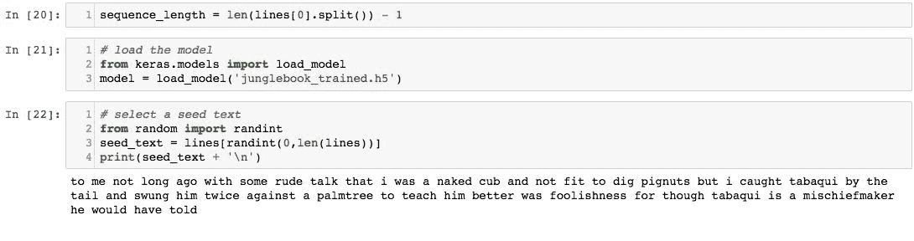

# 怎么做...

1.  您现在可以一次生成一个新单词了。首先，使用训练模型时使用的相同标记器将种子文本编码为整数，这是使用以下代码完成的:
    `encoded = tokenizer.texts_to_sequences([seed_text])[0]`

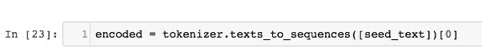

2.  模型可以通过调用`model.predict_classes()`直接预测下一个单词，这会返回概率最高的单词的索引:

```py
 prediction = model.predict_classes(encoded, verbose=0)
```

3.  在 Tokenizers 映射中查找索引以获取关联的单词，如以下代码所示:

```py
 out_word = ''for word, index in tokenizer.word_index.items():if index == prediction:out_word = wordbreak
```

4.  将此单词添加到种子文本中，并重复此过程。重要的是，输入序列会变得太长。在输入序列被编码成整数后，我们可以将其截断到所需的长度。Keras 提供了`pad_sequences()`函数，我们可以使用它来执行这种截断，如下所示:

```py
 encoded = pad_sequences([encoded], maxlen=seq_length, truncating='pre')
```

5.  将所有这些打包成一个名为`generate_sequence()`的函数，该函数将模型、标记器、输入序列长度、种子文本和要生成的单词数作为输入。然后，它返回模型生成的一系列单词。您可以使用以下代码来完成此操作:

```py
 from random import randintfrom pickle import loadfrom keras.models import load_modelfrom keras.preprocessing.sequence import pad_sequencesdef load_document(filename):file = open(filename, 'r')text = file.read()file.close()return textdef generate_sequence(model, tokenizer, sequence_length, seed_text, n_words):result = list()input_text = seed_textfor _ in range(n_words):encoded = tokenizer.texts_to_sequences([input_text])[0]encoded = pad_sequences([encoded], maxlen=seq_length,                 truncating='pre')prediction = model.predict_classes(encoded, verbose=0)out_word = ''for word, index in tokenizer.word_index.items():if index == prediction:out_word = wordbreakinput_text += ' ' + out_wordresult.append(out_word)return ' '.join(result)input_filename = 'junglebook_sequences.txt'doc = load_document(input_filename)lines = doc.split('\n')seq_length = len(lines[0].split()) - 1
```

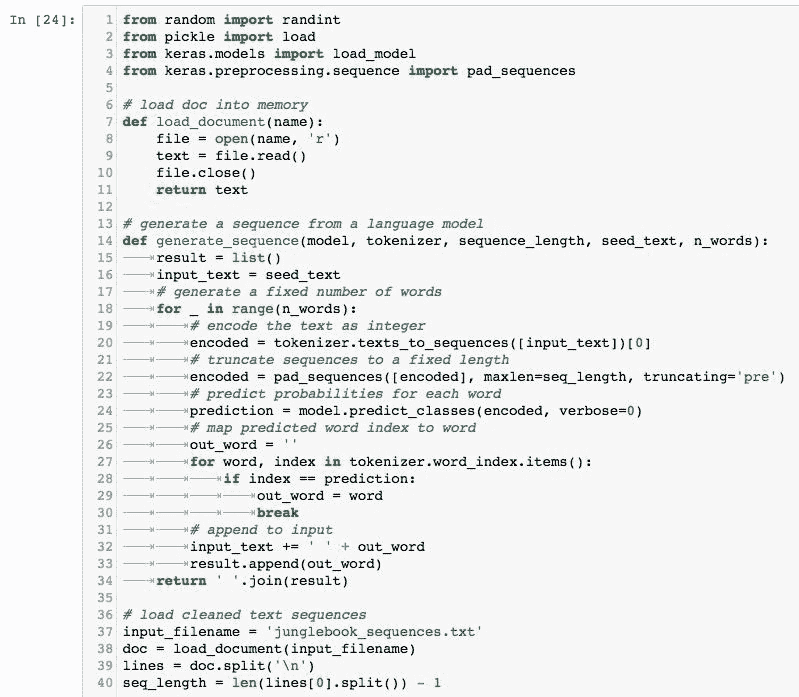

# 它是如何工作的...

我们现在准备生成一系列新单词，假设我们有一些种子文本:

1.  首先，使用以下命令再次将模型加载到内存中:

```py
 model = load_model('junglebook.h5')
```

2.  接下来，通过键入以下命令加载令牌化器:

```py
 tokenizer = load(open('tokenizer.pkl', 'rb'))
```

3.  使用以下命令随机选择种子文本:

```py
 seed_text = lines[randint(0,len(lines))]print(seed_text + '\n')
```

4.  最后，使用以下命令生成一个新序列:

```py
 generated = generate_sequence(model, tokenizer, sequence_length,             seed_text, 50)print(generated)
```

5.  在打印生成的序列时，您将看到类似于以下屏幕截图所示的输出:

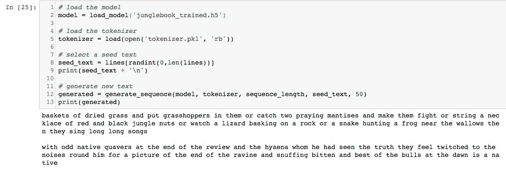

6.  该模型首先打印 50 个单词的随机种子文本，然后打印 50 个单词的生成文本。在这种情况下，随机种子文本如下:*一筐筐干草放入蚱蜢或抓两只螳螂，让它们打架或串一串红黑相间的丛林坚果项链或看一只蜥蜴在岩石上晒太阳或一条蛇在泥坑附近捕猎青蛙然后它们唱长长的长歌* *模型生成的 50 字文本，在这种情况下， 如下:*在评论的最后有一些奇怪的本地颤抖者，他看到了真相的海亚娜，他们对他周围的噪音感到抽搐，因为一张峡谷尽头和黎明时被咬死的最好的公牛的照片是本地的**
**   注意模型是如何输出一系列随机单词的，这些单词是基于它从输入文本中学到的知识生成的。您还会注意到，该模型在模仿输入文本和生成自己的故事方面做得相当好。虽然文本没有太大意义，但它提供了有价值的见解，说明模型如何学习将统计上相似的单词放在一起。*

 *# 还有更多...

*   一旦改变了设置的随机种子，网络产生的输出也会改变。您可能无法获得与前面示例完全相同的输出文本，但它将与用于训练模型的输入非常相似。
*   以下是通过多次运行生成的文本片段获得的不同结果的截图:


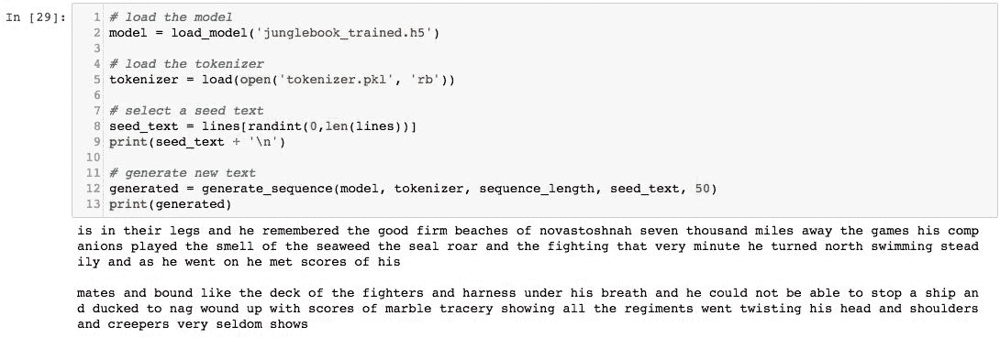

*   该模型甚至生成了自己版本的古腾堡项目许可证，如下图所示:


*   通过将纪元的数量从大约 100 个增加到 200 个，模型的精度可以提高到大约 60%。另一种增加学习的方法是以大约 50 和 100 的小批量训练模型。尝试使用不同的超参数和激活函数，看看什么会以最佳方式影响结果。
*   通过在定义模型时包括更多的 LSTM 层和漏失层，也可以使模型更密集。但是要知道，如果模型比较复杂，运行的时代比较多，只会增加训练时间。
*   经过大量实验，发现理想的批量大小在 50 到 100 之间，并且训练模型的理想时期数被确定在 100 到 200 之间。
*   没有明确的方法来完成前面的任务。您还可以尝试模型的不同文本输入，如推文、客户评论或 HTML 代码。
*   可以执行的一些其他任务包括使用简化的词汇表(例如删除所有的停用词)来进一步增强字典中的唯一词；调整嵌入层的大小和隐藏层中存储单元的数量；并且将模型扩展为使用预先训练好的模型，比如谷歌的 Word2Vec(预先训练好的单词模型)，看看是否会产生更好的模型。

# 请参见

有关本章最后一节中使用的各种函数和库的更多信息，请访问以下链接:

*   [https://keras.io/preprocessing/sequence/](https://keras.io/preprocessing/sequence/)
*   [https://wiki . python . org/moin/usigpickel](https://wiki.python.org/moin/UsingPickle)
*   [https://docs.python.org/2/library/random.html](https://docs.python.org/2/library/random.html)
*   [https://www . tensorflow . org/API _ docs/python/TF/keras/models/load _ model](https://www.tensorflow.org/api_docs/python/tf/keras/models/load_model)*