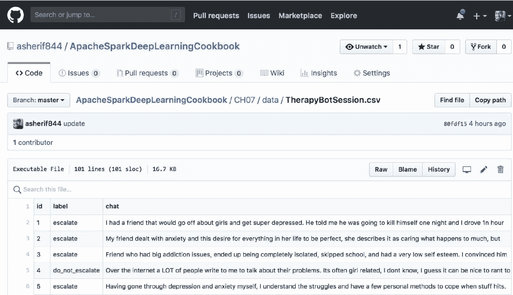
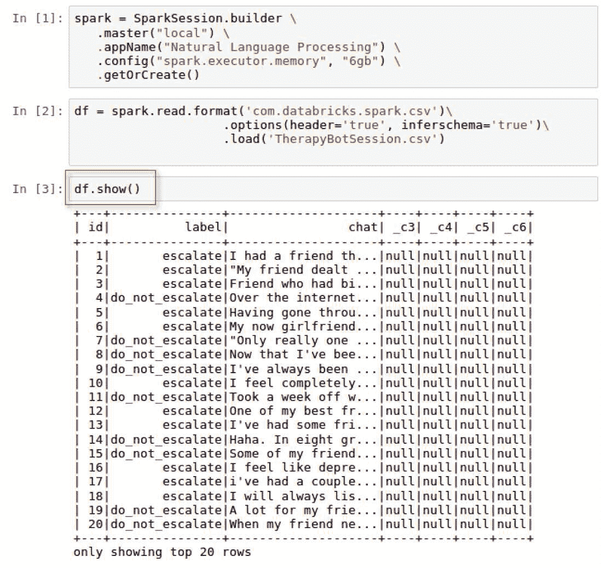
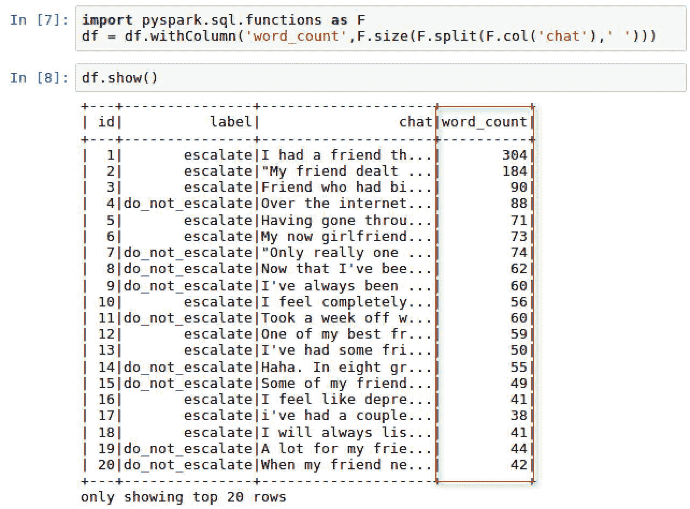
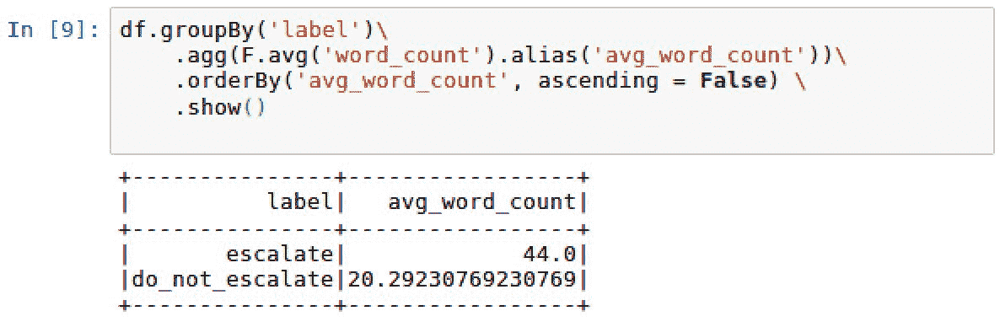
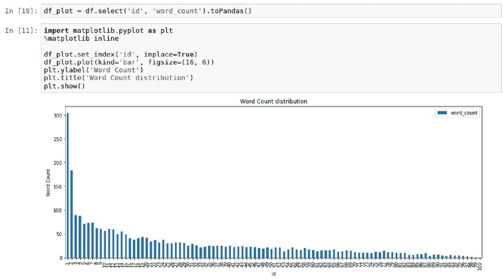
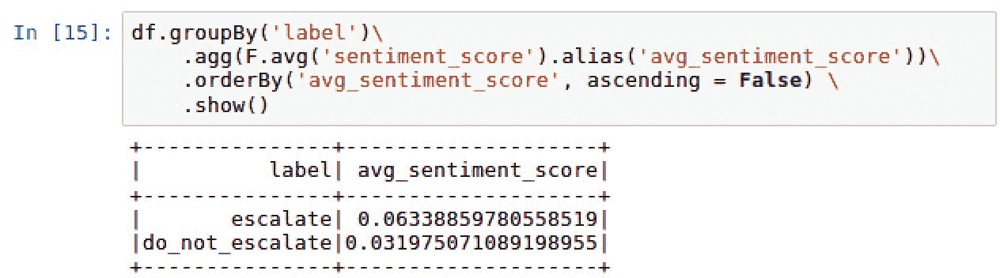
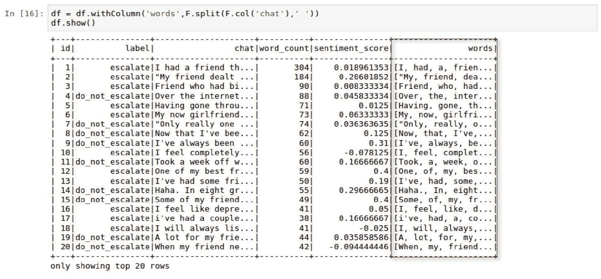
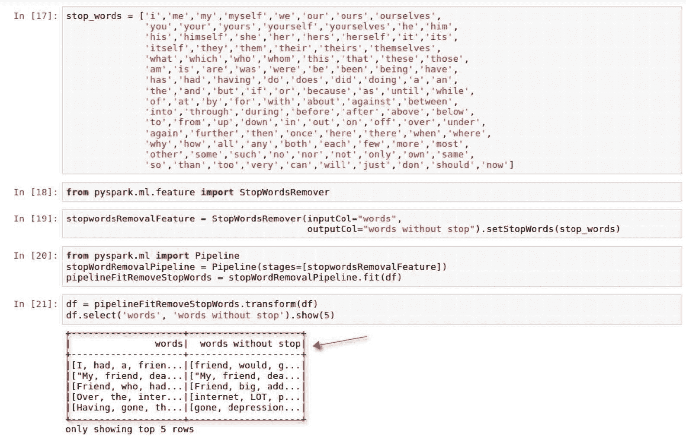
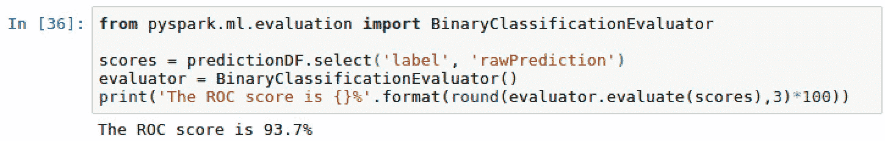

# 七、自然语言处理

在本章中，将涵盖以下配方:

*   下载治疗机器人会话文本数据集
*   分析治疗机器人会话数据集
*   可视化数据集中的字数
*   计算文本的情感分析
*   从文本中删除停止词
*   培训特遣部队-以色列国防军模式
*   评估 TF-IDF 模型的性能
*   将模型性能与基线分数进行比较

# 介绍

**自然语言处理** ( **NLP** )最近新闻满天飞，问五个不同的人，会得到十个不同的定义。最近，NLP 被用来帮助识别互联网上试图传播假新闻或更糟糕的网络欺凌等策略的机器人或巨魔。事实上，最近在西班牙有一个案例，一所学校的一名学生通过社交媒体账户受到网络欺凌，这对学生的健康产生了如此严重的影响，以至于老师们开始参与进来。学校联系了研究人员，他们能够使用自然语言处理方法(如 TF-IDF)帮助确定巨魔的几个潜在来源。最终，潜在学生的名单被提交给学校，当面对实际的嫌疑人时，他承认是肇事者。这个故事发表在一篇名为*的论文中，该论文由帕特西·加兰-加尔萨、何塞·加维里亚·德拉普埃塔、卡洛斯·劳登·戈麦斯、伊戈尔·桑多斯和巴勃罗·加尔萨·布林加斯撰写，题目是《用于检测推特社交网络中巨魔特征的监督机器学习:网络欺凌真实案例的应用》。*

本文强调了利用几种不同的方法来分析文本和开发类似人类的语言处理的能力。正是这种方法将自然语言处理融入到机器学习、深度学习和人工智能中。让机器能够摄取文本数据，并潜在地根据这些文本数据做出决策，这是自然语言处理的核心。有许多算法用于自然语言处理，例如:

*   TF-以色列国防军
*   Word2Vec
*   n 克
*   潜在狄利克雷分配
*   长短期记忆(LSTM)

本章将重点介绍一个数据集，其中包含个人和在线治疗网站上聊天机器人之间的对话。chatbot 的目的是识别需要标记的对话，以便立即关注个人，而不是继续与 chatbot 讨论。最终，我们将专注于使用 TF-IDF 算法对数据集执行文本分析，以确定聊天对话是否需要升级到个人的分类。 **TF-IDF** 代表**词频-逆文档频率**。这是算法中常用的一种技术，用于识别文档中单词的重要性。此外，TF-IDF 易于计算，尤其是在处理文档中的高字数时，并且能够测量单词的唯一性。这在处理聊天机器人数据时非常方便。主要目标是快速识别一个独特的词，该词将触发向个人的升级，以提供即时支持。

# 下载治疗机器人会话文本数据集

本章将重点介绍如何下载和设置用于自然语言处理的数据集。

# 准备好

我们将在本章中使用的数据集是基于治疗机器人和在线治疗网站访问者之间的交互。它包含 100 个交互，每个交互都被标记为`escalate`或`do_not_escalate`。如果讨论需要更严肃的对话，机器人会将讨论标记为个人的`escalate`。否则，机器人将继续与用户讨论。

# 它是如何工作的...

本节将介绍下载 chatbot 数据的步骤。

1.  从以下 GitHub 存储库中访问数据集:[https://GitHub . com/asherif 844/Apachepharkdeeplearniokbook/tree/master/CH07/data](https://github.com/asherif844/ApacheSparkDeepLearningCookbook/tree/master/CH07/data)
2.  到达存储库后，右键单击下面截图中的文件:


3.  下载`TherapyBotSession.csv`并保存到与 Jupyter 笔记本`SparkSession`相同的本地目录。

4.  使用以下脚本通过 Jupyter 笔记本访问数据集，以构建名为`spark`的`SparkSession`，并将数据集分配给 Spark 中名为`df`的数据框:

```py
spark = SparkSession.builder \.master("local") \.appName("Natural Language Processing") \.config("spark.executor.memory", "6gb") \.getOrCreate()df = spark.read.format('com.databricks.spark.csv')\.options(header='true', inferschema='true')\.load('TherapyBotSession.csv')  
```

# 怎么做...

这一部分解释了聊天机器人数据是如何进入我们的 Jupyter 笔记本的。

1.  数据集的内容可以通过点击存储库中的 TherapyBotSession.csv 来查看，如下图所示:



2.  一旦数据集被下载，就可以上传并转换成数据帧`df`。执行`df.show()`可以查看数据框，如下图所示:



3.  数据框中有 3 个我们特别感兴趣的主要字段:
    1.  `id`:网站访问者和聊天机器人之间每次交易的唯一 id。
    2.  `label`:由于这是一种监督建模方法，我们知道我们试图预测的结果，每个交易都被分类为`escalate`或`do_not_escalate`。此字段将在建模过程中用于训练文本，以识别属于这两种情况之一的单词。
    3.  `chat`:最后我们有来自网站访问者的`chat`文本，我们的模型将对其进行分类。

# 还有更多...

数据框`df`有一些额外的列`_c3`、`_c4`、`_c5`和`_c6`，这些列将不在模型中使用，因此可以使用以下脚本从数据集中排除:

```py
df = df.select('id', 'label', 'chat')df.show()
```

脚本的输出可以在下面的截图中看到:


# 分析治疗机器人会话数据集

在对同一数据集应用模型之前，首先分析任何数据集总是很重要的

# 准备好

本节将要求从`pyspark.sql`导入`functions`以在我们的数据帧上执行。

```py
import pyspark.sql.functions as F
```

# 怎么做...

下一节将介绍分析文本数据的步骤。

1.  执行以下脚本对`label`列进行分组并生成计数分布:

```py
df.groupBy("label") \.count() \.orderBy("count", ascending = False) \.show()
```

2.  使用以下脚本向数据框`df`添加新列`word_count`:

```py
import pyspark.sql.functions as Fdf = df.withColumn('word_count', F.size(F.split(F.col('response_text'),' ')))
```

3.  使用以下脚本通过`label`合计平均字数`avg_word_count`:

```py
df.groupBy('label')\.agg(F.avg('word_count').alias('avg_word_count'))\.orderBy('avg_word_count', ascending = False) \.show()
```

# 它是如何工作的...

以下部分解释了通过分析文本数据获得的反馈。

1.  跨多行收集数据并将结果按维度分组非常有用。在这种情况下，尺寸为`label`。一个`df.groupby()`功能用于测量`label`在线分发的 100 个治疗交易的计数。我们可以看到`65` : `35`分布有`do_not_escalate`到`escalate`，如下图截图所示:


2.  创建了一个新的列`word_count`，用于计算聊天机器人和在线访问者之间的 100 个交易中的每个交易使用了多少个单词。新创建的列`word_count`，如下图所示:



3.  由于`word_count`现在被添加到数据帧中，因此可以通过`label`将其聚合以计算平均字数。一旦执行此操作，我们可以看到`escalate`对话的平均时长是`do_not_escalate`对话的两倍多，如下图截图所示:



# 可视化数据集中的字数

一张图片胜过千言万语，本节将着手证明这一点。不幸的是，从 2.2 版本开始，Spark 没有任何固有的绘图能力。为了绘制数据帧中的值，我们必须转换到`pandas`。

# 准备好

本节将要求导入`matplotlib`进行绘图:

```py
import matplotlib.pyplot as plt%matplotlib inline
```

# 怎么做...

本节将介绍如何将 Spark 数据框转换为可以在 Jupyter 笔记本中看到的可视化效果。

1.  使用以下脚本将 Spark 数据帧转换为`pandas`数据帧:

```py
df_plot = df.select('id', 'word_count').toPandas()
```

2.  使用以下脚本绘制数据帧:

```py
import matplotlib.pyplot as plt%matplotlib inlinedf_plot.set_index('id', inplace=True)df_plot.plot(kind='bar', figsize=(16, 6))plt.ylabel('Word Count')plt.title('Word Count distribution')plt.show()
```

# 它是如何工作的...

本节说明如何将 Spark 数据框转换为`pandas`并绘制。

1.  使用 Spark 中的`toPandas()`方法收集 Spark 数据帧的子集并将其转换为`pandas`。
2.  然后使用 matplotlib 绘制该数据子集，将 y 值设置为`word_count`，将 x 值设置为`id`，如下图所示:



# 请参见

Python 中除了`matplotlib`还有其他的绘图能力，比如`bokeh`、`plotly`、`seaborn`。

要了解更多关于`bokeh`的信息，请访问以下网站:

[https://bokeh.pydata.org/en/latest/](https://bokeh.pydata.org/en/latest/)

要了解更多关于`plotly`的信息，请访问以下网站:

[https://plot.ly/](https://plot.ly/)

要了解更多关于`seaborn`的信息，请访问以下网站:

[https://seaborn.pydata.org/](https://seaborn.pydata.org/)

# 计算文本的情感分析

情感分析是从一个词或一系列词背后推导出语气和感觉的能力。本节将利用 python 中的技术从我们数据集中的 100 个交易中计算情感分析分数。

# 准备好

本节将要求在 PySpark 中使用函数和数据类型。另外，我们很好地导入了`TextBlob`库进行情感分析。为了在 PySpark 中使用 SQL 和数据类型函数，必须导入以下内容:

```py
from pyspark.sql.types import FloatType 
```

另外，为了使用`TextBlob`，必须导入以下库:

```py
from textblob import TextBlob
```

# 怎么做...

下一节将介绍将情感评分应用于数据集的步骤。

1.  使用以下脚本创建情绪评分函数`sentiment_score`:

```py
from textblob import TextBlobdef sentiment_score(chat):return TextBlob(chat).sentiment.polarity
```

2.  使用以下脚本将`sentiment_score`应用于数据框中的每个对话响应:
3.  创建一个名为`sentiment_score_udf`的`lambda`函数，该函数将`sentiment_score`映射到 Spark`udf`中的用户定义函数，并指定`FloatType()`的输出类型，如以下脚本所示:

```py
from pyspark.sql.types import FloatTypesentiment_score_udf = F.udf(lambda x: sentiment_score(x), FloatType())
```

4.  将函数`sentiment_score_udf`应用于数据框中的每个`chat`列，如以下脚本所示:

```py
df = df.select('id', 'label', 'chat','word_count',sentiment_score_udf('chat').alias('sentiment_score'))
```

5.  使用以下脚本通过`label`计算平均情感得分`avg_sentiment_score`:

```py
df.groupBy('label')\.agg(F.avg('sentiment_score').alias('avg_sentiment_score'))\.orderBy('avg_sentiment_score', ascending = False) \.show()
```

# 它是如何工作的...

本节解释了如何在 Spark 中将 Python 函数转换为用户定义的函数`udf`，以将情感分析分数应用于数据框中的每一列。

1.  `Textblob`是 Python 中的一个情感分析库。它可以通过一种叫做`sentiment.polarity`的方法来计算情感得分，得分从-1(非常负)到+1(非常正)，0 为中性。另外，`Textblob`可以从 0(非常客观)到 1(非常主观)来衡量主观性；虽然，我们不会在这一章衡量主观性。
2.  将 Python 函数应用于 Spark 数据帧有几个步骤:
    1.  导入`Textblob`并将名为`sentiment_score`的函数应用于`chat`列，以在新列(也称为`sentiment_score`)中生成每个机器人对话的情感极性。
    2.  Python 函数不能直接应用于 Spark 数据框，除非首先在 Spark 中进行用户定义的函数转换`udf`。
    3.  此外，还必须明确说明函数的输出，无论它是整数还是浮点数据类型。在我们的情况下，我们明确声明函数的输出将使用`FloatType() from pyspark.sql.types`。最后，使用`udf`情绪评分函数中的`lambda`函数(称为`sentiment_score_udf`，将情绪应用于每行。

3.  执行`df.show()`可以看到新创建字段`sentiment score`的更新数据框，如下图所示:


4.  现在已经为聊天对话的每个响应计算了`sentiment_score`，我们可以为每行表示-1(非常负极性)到+1(非常正极性)的值范围。正如我们对计数和平均字数所做的那样，我们可以比较`escalate`对话在情绪上是比`do_not_escalate`对话更积极还是更消极。我们可以通过`label`计算平均情绪得分`avg_sentiment_score`，如下图所示:



5.  最初，假设`escalate`对话从极性分数来看比`do_not_escalate`更负面是有意义的。我们实际上发现`escalate`的极性比`do_not_escalate`稍正；然而，两者都相当中性，因为它们接近于 0。

# 请参见

要了解更多关于`TextBlob`图书馆的信息，请访问以下网站:

[http://textblob.readthedocs.io/en/dev/](http://textblob.readthedocs.io/en/dev/)

# 从文本中删除停止词

停止词是英语中使用的一个非常常见的词，通常从常见的自然语言处理技术中删除，因为它们会分散注意力。常见的停止词是*或*和*等词。*

 *# 准备好了

此部分需要导入以下库:

```py
from pyspark.ml.feature import StopWordsRemover from pyspark.ml import Pipeline
```

# 怎么做...

本节介绍删除停止词的步骤。

1.  执行以下脚本将`chat`中的每个单词提取到数组中的一个字符串中:

```py
df = df.withColumn('words',F.split(F.col('chat'),' '))
```

2.  使用以下脚本将常用单词列表分配给变量`stop_words`，该变量将被视为停止单词:

```py
stop_words = ['i','me','my','myself','we','our','ours','ourselves','you','your','yours','yourself','yourselves','he','him','his','himself','she','her','hers','herself','it','its','itself','they','them','their','theirs','themselves','what','which','who','whom','this','that','these','those','am','is','are','was','were','be','been','being','have','has','had','having','do','does','did','doing','a','an','the','and','but','if','or','because','as','until','while','of','at','by','for','with','about','against','between','into','through','during','before','after','above','below','to','from','up','down','in','out','on','off','over','under','again','further','then','once','here','there','when','where','why','how','all','any','both','each','few','more','most','other','some','such','no','nor','not','only','own','same','so','than','too','very','can','will','just','don','should','now']
```

3.  执行以下脚本从 PySpark 导入`StopWordsRemover`函数，并配置输入和输出列，`words`和`word without stop`:

```py
from pyspark.ml.feature import StopWordsRemover stopwordsRemovalFeature = StopWordsRemover(inputCol="words", outputCol="words without stop").setStopWords(stop_words)
```

4.  执行以下脚本导入管道，并为将应用于数据帧的停止字转换过程定义`stages`:

```py
from pyspark.ml import PipelinestopWordRemovalPipeline = Pipeline(stages=[stopwordsRemovalFeature])pipelineFitRemoveStopWords = stopWordRemovalPipeline.fit(df)
```

5.  最后，使用以下脚本对数据框`df`应用停止词移除转换`pipelineFitRemoveStopWords`:

```py
df = pipelineFitRemoveStopWords.transform(df)
```

# 它是如何工作的...

本节说明如何从文本中删除停止词。

1.  就像我们在剖析和探索`chat`数据时应用一些分析一样，我们也可以调整`chat`对话的文本，并将每个单词分解成单独的数组。这将用于隔离和删除停止词。
2.  将每个单词提取为字符串的新列称为`words`，可以在下面的截图中看到:



3.  有许多方法可以将一组单词分配到停止单词列表中。其中一些单词可以使用一个名为`nltk`的合适的 Python 库自动下载和更新，T0 代表自然语言工具包。出于我们的目的，我们将利用一个共有 124 个停止词的列表来生成我们自己的列表。可以轻松地手动添加或删除列表中的其他单词。

4.  停止词不会给文本增加任何值，并将通过指定`outputCol="words without stop"`从新创建的列中删除。此外，将作为转换源的列通过指定`inputCol = "words"`来设置。

5.  我们创建一个管道`stopWordRemovalPipeline`，来定义转换数据的步骤序列或`stages`。在这种情况下，将用于转换数据的唯一阶段是特征，`stopwordsRemover`。
6.  流水线中的每个阶段都可以有一个转换角色和一个估计角色。估计器角色`pipeline.fit(df)`被调用来产生一个名为`pipelineFitRemoveStopWords`的转换函数。最后，在数据帧上调用`transform(df)`函数，以产生一个更新的数据帧，该数据帧带有一个名为`words without stop`的新列。我们可以并排比较两个列来检查差异，如下图所示:



7.  新列`words without stop`不包含任何被视为原始列`words`中的停止词的字符串。

# 请参见

要从`nltk`了解更多关于停止词的信息，请访问以下网站:

[https://www.nltk.org/data.html](https://www.nltk.org/data.html)

要了解有关 Spark 机器学习管道的更多信息，请访问以下网站:

[https://spark.apache.org/docs/2.2.0/ml-pipeline.html](https://spark.apache.org/docs/2.2.0/ml-pipeline.html)

要了解更多关于 PySpark 中`StopWordsRemover`功能的信息，请访问以下网站:

[https://spark . Apache . org/docs/2 . 2 . 0/API/python/py spark . ml . html # py spark . ml . feature . stop words remover](https://spark.apache.org/docs/2.2.0/api/python/pyspark.ml.html#pyspark.ml.feature.StopWordsRemover)

# 培训特遣部队-以色列国防军模式

我们现在准备训练我们的 TF-IDF NLP 模型，看看我们是否可以将这些交易分类为`escalate`或`do_not_escalate`。

# 准备好

本节要求从`spark.ml.feature`和`spark.ml.classification`导入。

# 怎么做...

下一节将介绍训练 TF-IDF 模型的步骤。

1.  使用以下脚本创建新的用户定义函数`udf`，为`label`列定义数值:

```py
label = F.udf(lambda x: 1.0 if x == 'escalate' else 0.0, FloatType())df = df.withColumn('label', label('label'))
```

2.  执行以下脚本来设置单词矢量化的 TF 和 IDF 列:

```py
import pyspark.ml.feature as featTF_ = feat.HashingTF(inputCol="words without stop", outputCol="rawFeatures", numFeatures=100000)IDF_ = feat.IDF(inputCol="rawFeatures", outputCol="features")
```

3.  使用以下脚本设置管道`pipelineTFIDF`，为`TF_`和`IDF_`设置阶段顺序:

```py
pipelineTFIDF = Pipeline(stages=[TF_, IDF_])
```

4.  使用以下脚本，将 IDF 估算器拟合并转换到数据帧`df`:

```py
pipelineFit = pipelineTFIDF.fit(df)df = pipelineFit.transform(df)
```

5.  使用以下脚本将数据帧分割成 75:25 的分割，以便进行模型评估:

```py
(trainingDF, testDF) = df.randomSplit([0.75, 0.25], seed = 1234)
```

6.  使用以下脚本导入和配置分类模型`LogisticRegression`:

```py
from pyspark.ml.classification import LogisticRegressionlogreg = LogisticRegression(regParam=0.25)
```

7.  将逻辑回归模型`logreg`拟合到训练数据框`trainingDF.`上，基于逻辑回归模型的`transform()`方法创建新的数据框`predictionDF`，如以下脚本所示:

```py
logregModel = logreg.fit(trainingDF)predictionDF = logregModel.transform(testDF)
```

# 它是如何工作的...

下一节将解释如何有效地训练 TF-IDF NLP 模型。

1.  理想情况下，标签采用数字格式，而不是分类形式，因为模型能够在对 0 到 1 之间的输出进行分类时解释数值。因此`label`列下的所有标签都转换为 0.0 或 1.0 的数值`label`，如下图截图所示:


2.  TF-IDF 模型需要两步方法，从`pyspark.ml.feature`导入`HashingTF`和`IDF`来处理不同的任务。第一个任务仅仅包括导入`HashingTF`和`IDF`，并为输入和后续输出列赋值。`numfeatures`参数设置为 100，000，以确保它大于数据帧中的不同字数。如果`numfeatures`比不同的字数，模型将是不准确的。

3.  如前所述，流水线的每一步都包含一个转换过程和一个估计过程。管道`pipelineTFIDF`被配置为对`IDF`将跟随`HashingTF`的步骤顺序进行排序。
4.  `HashingTF`用于将`words without stop`转换为一个名为`rawFeatures`的新列中的向量。随后，`IDF`将使用`rawFeatures`来估计数据帧的大小和拟合数据帧，以生成名为`features`的新列，如下图所示:


5.  出于训练目的，我们的数据帧将被保守地分割成一个`75` : `25`比率，随机种子设置在`1234`。

6.  由于我们的主要目标是将每个对话分类为用于升级的`escalate`或用于持续 bot 聊天的`do_not_escalate`，因此我们可以使用传统的分类算法，例如来自 PySpark 库的逻辑回归模型。逻辑回归模型的正则化参数`regParam`为 0.025。我们使用该参数，以一点偏差为代价，通过最小化过拟合来稍微改进模型。
7.  逻辑回归模型在`trainingDF`上进行训练和拟合，然后用新变换的字段`prediction`创建新的数据框`predictionDF`，如下图所示:


# 还有更多...

虽然我们确实使用了用户定义的函数`udf`来手动创建数字标签列，但我们也可以使用 PySpark 中名为`StringIndexer`的内置功能来为分类标签分配数值。要查看`StringIndexer`的运行情况，请访问[第 5 章](05.html#6976M0-3be7262ff9a54db3b2ea862fdce1797b)、*使用 Spark ML* 预测消防部门呼叫。

# 请参见

要了解有关 PySpark 中 TF-IDF 模型的更多信息，请访问以下网站:

[https://spark . Apache . org/docs/latest/mllib-feature-extraction . html # TF-IDF](https://spark.apache.org/docs/latest/mllib-feature-extraction.html#tf-idf)

# 评估 TF-IDF 模型的性能

此时，我们已经准备好评估模型的性能

# 准备好了

本节将要求导入以下库:

*   `metrics`从`sklearn`开始
*   `BinaryClassificationEvaluator`从`pyspark.ml.evaluation`开始

# 怎么做...

本节将介绍评估 TF-IDF NLP 模型的步骤。

1.  使用以下脚本创建混淆矩阵:

```py
predictionDF.crosstab('label', 'prediction').show()
```

2.  使用来自 sklearn 的`metrics`评估模型，脚本如下:

```py
from sklearn import metricsactual = predictionDF.select('label').toPandas()predicted = predictionDF.select('prediction').toPandas()print('accuracy score: {}%'.format(round(metrics.accuracy_score(actual,         predicted),3)*100))
```

3.  使用以下脚本计算 ROC 分数:

```py
from pyspark.ml.evaluation import BinaryClassificationEvaluatorscores = predictionDF.select('label', 'rawPrediction')evaluator = BinaryClassificationEvaluator()print('The ROC score is {}%'.format(round(evaluator.evaluate(scores),3)*100))
```

# 它是如何工作的...

本节说明我们如何使用评估计算来确定模型的准确性。

1.  混淆矩阵有助于快速总结实际结果和预测结果之间的准确性数字。由于我们有一个 75:25 的分割，我们应该从我们的训练数据集中看到 25 个预测。我们可以使用以下脚本构建一个构建混淆矩阵:`predictionDF.crosstab('label', 'prediction').show()`。脚本的输出可以在下面的截图中看到:


2.  我们现在正处于通过将`prediction`值与实际`label`值进行比较来评估模型准确性的阶段。`sklearn.metrics`获取两个参数，与`label`列相关的`actual`值，以及从逻辑回归模型中导出的`predicted`值。

Please note that once again we are converting the column values from Spark dataframes to pandas dataframes using the `toPandas()` method.

3.  创建两个变量`actual`和`predicted`，使用`metrics.accuracy_score()`函数计算出 91.7%的准确率，如下图截图所示:


4.  ROC(接收器操作特性)通常与测量真阳性率与假阳性率的曲线相关。曲线下面积越大越好。与曲线相关的 ROC 分数是另一个可以用来衡量模型性能的指标。我们可以使用`BinaryClassificationEvaluator`计算`ROC`，如下图所示:



# 请参见

要从 PySpark 了解更多关于`BinaryClassificationEvaluator`的信息，请访问以下网站:

[https://spark.apache.org/docs/2.2.0/api/java/index.html?org/Apache/spark/ml/evaluation/binary classificationevaluator . html](https://spark.apache.org/docs/2.2.0/api/java/index.html?org/apache/spark/ml/evaluation/BinaryClassificationEvaluator.html)

# 将模型性能与基线分数进行比较

虽然我们的模型有 91.7%的高准确率是件好事，但将其与基线分数进行比较也很重要。在这一节中，我们将深入探讨这个概念。

# 怎么做...

本节介绍计算基线精度的步骤。

1.  执行以下脚本从`describe()`方法中检索平均值:

```py
predictionDF.describe('label').show()
```

2.  减去`1- mean value score`计算基线精度。

# 它是如何工作的...

本节解释了基线准确性背后的概念，以及我们如何使用它来理解我们模型的有效性。

1.  如果每个`chat`对话都被标记为`do_not_escalate`或者反之亦然，该怎么办。我们的基线准确率会高于 91.7%吗？解决这个问题最简单的方法是使用以下脚本在`predictionDF`的`label`列上运行`describe()`方法:`predictionDF.describe('label').show()`
2.  脚本的输出可以在下面的截图中看到:


3.  `label`的平均值在 0.2083 或~21%，这意味着 1 的`label`只出现 21%的时间。因此，如果我们把每一次对话都标为`do_not_escalate`，那么我们会有 79%的时间是正确的，这比我们 91.7%的模型准确率要低。
4.  因此，我们可以说我们的模型比盲基线性能模型表现得更好。

# 请参见

要了解有关 PySpark 数据框中`describe()`方法的更多信息，请访问以下网站:

[http://spark . Apache . org/docs/2 . 2 . 0/API/python/py spark . SQL . html # py spark . SQL . data frame . description](http://spark.apache.org/docs/2.2.0/api/python/pyspark.sql.html#pyspark.sql.DataFrame.describe)*