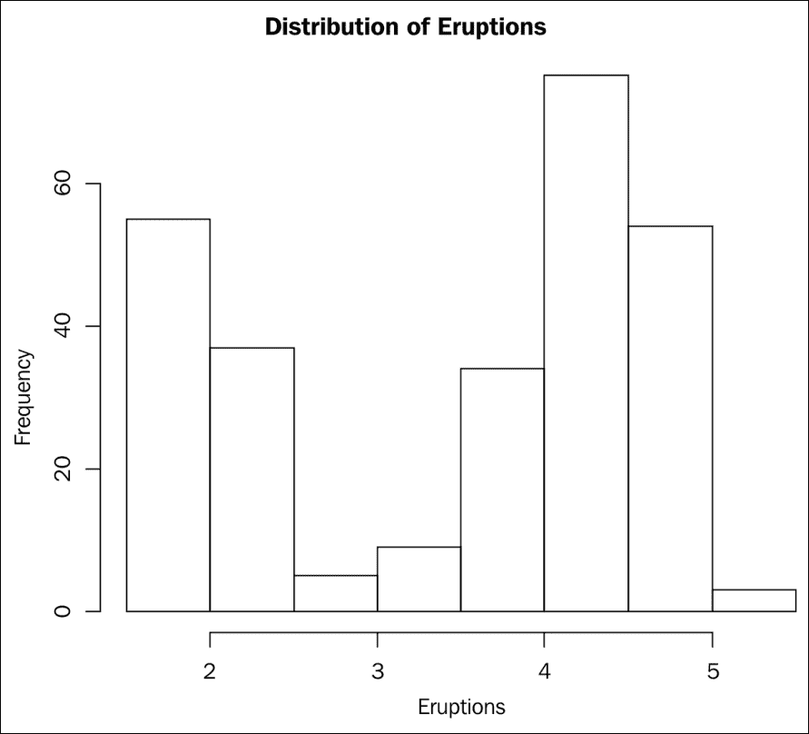

# 四、使用 R 的 Spark 编程

r 是一种流行的统计计算编程语言，被许多人使用，并在**通用公共许可证** ( **GNU** )下免费提供。r 起源于编程语言 S，由约翰·钱伯斯创造。r 是由罗斯·伊哈卡和罗伯特·绅士开发的。许多数据科学家使用 R 来满足他们的计算需求。r 固有地支持许多统计函数和许多标量数据类型，并具有用于向量、矩阵、数据帧等的复合数据结构，用于统计计算。r 是高度可扩展的，因此可以创建外部包。一旦创建了一个外部包，就必须安装和加载它，以便任何程序使用它。目录下的这些包的集合形成了一个库。换句话说，R 附带了一组基本包和附加包，可以安装在它的上面，形成所需的库，以满足所需的计算需求。除了函数，数据集也可以打包在 R 包中。

我们将在本章中讨论以下主题:

*   对 SparkR 的需求
*   R 的要素
*   数据帧
*   聚集
*   多数据源与 SparkR 连接

# 对 Spark 放电的需求

普通的 R 底座安装无法与 Spark 交互。 **SparkR** 包公开了 R 与 Spark 生态系统对话所需的所有对象和功能。与 Scala、Java 和 Python 相比，R 中的 Spark 编程有所不同，SparkR 包主要公开了基于 DataFrame 的 Spark SQL 编程的 R API。目前不能用 R 直接操纵 Spark 的 RDDs。所以实际上，Spark 的应用编程接口只能访问 Spark 的 SQL 抽象。Spark **MLlib** 也可以用 R 编程，因为 Spark MLlib 使用数据帧。

SparkR 将如何帮助数据科学家进行更好的数据处理？基本 R 安装要求所有数据都存储(或访问)在安装 R 的计算机上。数据处理发生在安装了 R 的单台计算机上。此外，如果数据大小超过计算机上可用的主内存，R 将无法进行所需的处理。使用 SparkR 包，可以访问一个全新的数据存储和数据处理节点集群世界。在 Spark 包的帮助下，可以使用 R 来访问 Spark 数据帧和 R 数据帧。

了解两种数据帧(R 数据帧和 Spark 数据帧)之间的区别非常重要。一个 R 数据框架是完全本地的，是 R 语言的数据结构。Spark 数据框架是由 Spark 基础设施管理的结构化数据的并行集合。

R 数据帧可以转换为 Spark 数据帧，Spark 数据帧可以转换为 R 数据帧。

当 Spark 数据帧被转换为 R 数据帧时，它应该适合计算机的可用内存。这种转换是一个很好的特性，有必要这样做。通过将 R 数据帧转换为 Spark 数据帧，可以并行分发和处理数据。通过将 Spark 数据帧转换为 R 数据帧，可以完成由其他 R 函数完成的大量计算、制图和绘图。简而言之，SparkR 包将分布式和并行计算能力的力量带到了 r。

通常，当用 R 执行数据处理时，由于数据的巨大规模和将其装入计算机主存储器的需要，数据处理是分多个批次进行的，结果被合并以计算最终结果。如果用带 R 的 Spark 处理数据，完全可以避免这种多批次处理。

通常，报告、图表和绘图是在汇总和汇总的原始数据上完成的。原始数据可能很大，不需要放入一台计算机。在这种情况下，可以使用带有 R 的 Spark 来处理整个原始数据，最后，可以使用汇总和汇总的数据来生成报告、图表或绘图。

由于无法处理海量数据和用 R 进行数据分析，很多时候，ETL 工具被用来对原始数据进行预处理或转换，只有在最后阶段才使用 R 进行数据分析，由于 Spark 能够大规模处理数据，所以 Spark 用 R 可以代替整个 ETL 管道，用 R 进行所需的数据分析。

许多 R 用户使用 **dplyr** R 包来操作 R 中的数据集。该包通过 R 数据帧提供快速数据操作功能。就像操作本地数据帧一样，它也可以从一些关系数据库管理系统表中访问数据。除了这些原始的数据操作能力之外，它还缺少 Spark 中的许多数据处理功能。因此，带 R 的 Spark 是 dplyr 等软件包的一个很好的替代品。

SparkR 包是另一个 R 包，但这并没有阻止任何人使用任何已经在使用的 R 包。同时，利用 Spark 巨大的数据处理能力，补充了 R 流形的数据处理能力。

# R 语言基础

这绝不是 R 编程的指南。但是，为了让那些不熟悉 R 语言的人理解本章所涵盖的内容，非常简要地介绍 R 语言的基础知识是很重要的。这里介绍了语言特性的一个非常基本的介绍。

r 带有一些内置的数据类型来保存数值、字符值和布尔值。有多种可用的复合数据结构，其中最重要的是矢量、列表、矩阵和数据帧。向量由给定类型的值的有序集合组成。列表是不同类型元素的有序集合。例如，一个列表可以包含两个向量，其中一个是包含数值的向量，另一个是包含布尔值的向量。矩阵是以行和列保存数值的二维数据结构。数据框是包含行和列的二维数据结构，其中列可以有不同的数据类型，但单个列不能包含不同的数据类型。

使用变量(向量的特例)、数值向量、字符向量、列表、矩阵、数据框以及为数据框指定列名的代码示例如下。变量名尽可能自我描述，以便读者理解，而无需额外的解释。下面的代码片段运行在一个常规的 R REPL 上，给出了 R 的数据结构的概念:

```scala
$ r 
R version 3.2.2 (2015-08-14) -- "Fire Safety" 
Copyright (C) 2015 The R Foundation for Statistical Computing 
Platform: x86_64-apple-darwin13.4.0 (64-bit) 

R is free software and comes with ABSOLUTELY NO WARRANTY. 
You are welcome to redistribute it under certain conditions. 
Type 'license()' or 'licence()' for distribution details. 

  Natural language support but running in an English locale 

R is a collaborative project with many contributors. 
Type 'contributors()' for more information and 
'citation()' on how to cite R or R packages in publications. 

Type 'demo()' for some demos, 'help()' for on-line help, or 
'help.start()' for an HTML browser interface to help. 
Type 'q()' to quit R. 

Warning: namespace 'SparkR' is not available and has been replaced 
by .GlobalEnv when processing object 'goodTransRecords' 
[Previously saved workspace restored] 
> 
> x <- 5 
> x 
[1] 5 
> aNumericVector <- c(10,10.5,31.2,100) 
> aNumericVector 
[1]  10.0  10.5  31.2 100.0 
> aCharVector <- c("apple", "orange", "mango") 
> aCharVector 
[1] "apple"  "orange" "mango"  
> aBooleanVector <- c(TRUE, FALSE, TRUE, FALSE, FALSE) 
> aBooleanVector 
[1]  TRUE FALSE  TRUE FALSE FALSE 
> aList <- list(aNumericVector, aCharVector) 
> aList 
[[1]] 
[1]  10.0  10.5  31.2 100.0 
[[2]] 
[1] "apple"  "orange" "mango" 
> aMatrix <- matrix(c(100, 210, 76, 65, 34, 45),nrow=3,ncol=2,byrow = TRUE) 
> aMatrix 
     [,1] [,2] 
[1,]  100  210 
[2,]   76   65 
[3,]   34   45 
> bMatrix <- matrix(c(100, 210, 76, 65, 34, 45),nrow=3,ncol=2,byrow = FALSE) 
> bMatrix 
     [,1] [,2] 
[1,]  100   65 
[2,]  210   34 
[3,]   76   45 
> ageVector <- c(21, 35, 52)  
> nameVector <- c("Thomas", "Mathew", "John")  
> marriedVector <- c(FALSE, TRUE, TRUE)  
> aDataFrame <- data.frame(ageVector, nameVector, marriedVector)  
> aDataFrame 
  ageVector nameVector marriedVector 
1        21     Thomas         FALSE 
2        35     Mathew          TRUE 
3        52       John          TRUE 
> colnames(aDataFrame) <- c("Age","Name", "Married") 
> aDataFrame 
  Age   Name Married 
1  21 Thomas   FALSE 
2  35 Mathew    TRUE 
3  52   John    TRUE 

```

这里讨论的主题将围绕数据帧展开。这里演示了数据框常用的一些功能。所有这些命令都将在常规的 REPL 机上执行，作为执行前面代码片段的会话的延续:

```scala
> # Returns the first part of the data frame and return two rows 
> head(aDataFrame,2) 
  Age   Name Married 
1  21 Thomas   FALSE 
2  35 Mathew    TRUE 

> # Returns the last part of the data frame and return two rows 
> tail(aDataFrame,2) 
  Age   Name Married  
2  35 Mathew    TRUE 
3  52   John    TRUE 
> # Number of rows in a data frame 
> nrow(aDataFrame) 
[1] 3 
> # Number of columns in a data frame 
> ncol(aDataFrame) 
[1] 3 
> # Returns the first column of the data frame. The return value is a data frame 
> aDataFrame[1] 
  Age 
1  21 
2  35 
3  52 
> # Returns the second column of the data frame. The return value is a data frame 
> aDataFrame[2] 
    Name 
1 Thomas 
2 Mathew 
3   John 
> # Returns the named columns of the data frame. The return value is a data frame 
> aDataFrame[c("Age", "Name")] 
  Age   Name 
1  21 Thomas 
2  35 Mathew 
3  52   John 
> # Returns the contents of the second column of the data frame as a vector.  
> aDataFrame[[2]] 
[1] Thomas Mathew John   
Levels: John Mathew Thomas 
> # Returns the slice of the data frame by a row 
> aDataFrame[2,] 
  Age   Name Married 
2  35 Mathew    TRUE 
> # Returns the slice of the data frame by multiple rows 
> aDataFrame[c(1,2),] 
  Age   Name Married 
1  21 Thomas   FALSE 
2  35 Mathew    TRUE 

```

# R 和 Spark 中的数据帧

使用 R 使用 Spark 时，很容易与 DataFrame 数据结构混淆。如前所述，它存在于 R 和 Spark SQL 中。下面的代码片段处理将 R 数据帧转换为 Spark 数据帧，反之亦然。当用 R 编程 Spark 时，这将是一个非常常见的操作。从现在开始，所有对 REPL 的引用都是关于 Spark 的 REPL:

```scala
$ cd $SPARK_HOME 
$ ./bin/sparkR 

R version 3.2.2 (2015-08-14) -- "Fire Safety" 
Copyright (C) 2015 The R Foundation for Statistical Computing 
Platform: x86_64-apple-darwin13.4.0 (64-bit) 

R is free software and comes with ABSOLUTELY NO WARRANTY. 
You are welcome to redistribute it under certain conditions. 
Type 'license()' or 'licence()' for distribution details. 

  Natural language support but running in an English locale 

R is a collaborative project with many contributors. 
Type 'contributors()' for more information and 
'citation()' on how to cite R or R packages in publications. 

Type 'demo()' for some demos, 'help()' for on-line help, or 
'help.start()' for an HTML browser interface to help. 
Type 'q()' to quit R. 

[Previously saved workspace restored] 

Launching java with spark-submit command /Users/RajT/source-code/spark-source/spark-2.0/bin/spark-submit   "sparkr-shell" /var/folders/nf/trtmyt9534z03kq8p8zgbnxh0000gn/T//RtmpmuRsTC/backend_port2d121acef4  
Using Spark's default log4j profile: org/apache/spark/log4j-defaults.properties 
Setting default log level to "WARN". 
To adjust logging level use sc.setLogLevel(newLevel). 
16/07/16 21:08:50 WARN NativeCodeLoader: Unable to load native-hadoop library for your platform... using builtin-java classes where applicable 

 Welcome to 
    ____              __  
   / __/__  ___ _____/ /__  
  _\ \/ _ \/ _ `/ __/  '_/  
 /___/ .__/\_,_/_/ /_/\_\   version  2.0.1-SNAPSHOT  
    /_/  

 Spark context is available as sc, SQL context is available as sqlContext 
During startup - Warning messages: 
1: 'SparkR::sparkR.init' is deprecated. 
Use 'sparkR.session' instead. 
See help("Deprecated")  
2: 'SparkR::sparkRSQL.init' is deprecated. 
Use 'sparkR.session' instead. 
See help("Deprecated")  
> 
> # faithful is a data set and the data frame that comes with base R 
> # Obviously it is an R DataFrame 
> head(faithful) 
  eruptions waiting 
1     3.600      79 
2     1.800      54 
3     3.333      74 
4     2.283      62 
5     4.533      85 
6     2.883      55 
> tail(faithful) 
    eruptions waiting 
267     4.750      75 
268     4.117      81 
269     2.150      46 
270     4.417      90 
271     1.817      46 
272     4.467      74 
> # Convert R DataFrame to Spark DataFrame  
> sparkFaithful <- createDataFrame(faithful) 
> head(sparkFaithful) 
  eruptions waiting 
1     3.600      79 
2     1.800      54 
3     3.333      74 
4     2.283      62 
5     4.533      85 
6     2.883      55 
> showDF(sparkFaithful) 
+---------+-------+ 
|eruptions|waiting| 
+---------+-------+ 
|      3.6|   79.0| 
|      1.8|   54.0| 
|    3.333|   74.0| 
|    2.283|   62.0| 
|    4.533|   85.0| 
|    2.883|   55.0| 
|      4.7|   88.0| 
|      3.6|   85.0| 
|     1.95|   51.0| 
|     4.35|   85.0| 
|    1.833|   54.0| 
|    3.917|   84.0| 
|      4.2|   78.0| 
|     1.75|   47.0| 
|      4.7|   83.0| 
|    2.167|   52.0| 
|     1.75|   62.0| 
|      4.8|   84.0| 
|      1.6|   52.0| 
|     4.25|   79.0| 
+---------+-------+ 
only showing top 20 rows 
> # Try calling a SparkR function showDF() on an R DataFrame. The following error message will be shown 
> showDF(faithful) 
Error in (function (classes, fdef, mtable)  :  
  unable to find an inherited method for function 'showDF' for signature '"data.frame"' 
> # Convert the Spark DataFrame to an R DataFrame 
> rFaithful <- collect(sparkFaithful) 
> head(rFaithful) 
  eruptions waiting 
1     3.600      79 
2     1.800      54 
3     3.333      74 
4     2.283      62 
5     4.533      85 
6     2.883      55 

```

就支持的功能而言，R 数据框和 Spark 数据框之间没有完全的兼容性和互操作性。

### 类型

作为一种良好的实践，最好在 R 程序中用约定的约定来命名 R 数据框和 Spark 数据框，以便区分这两种不同的类型。并非 R 数据框支持的所有功能在 Spark 数据框上都不受支持，反之亦然。请务必参考 Spark 的正确版本。

那些使用大量图表和绘图的人在结合 Spark 数据帧处理 R 数据帧时必须格外小心。R 的制图和绘图只适用于 R 数据帧。如果需要使用 Spark 处理过的数据制作图表或绘图，并且在 Spark 数据框中可用，则必须将其转换为 R 数据框才能继续制图和绘图。下面的代码片段将给出一个想法。我们将再次使用忠实的数据集来阐明 Spark 的 REPL:

```scala
head(faithful) 
  eruptions waiting 
1     3.600      79 
2     1.800      54 
3     3.333      74 
4     2.283      62 
5     4.533      85 
6     2.883      55 
> # Convert the faithful R DataFrame to Spark DataFrame   
> sparkFaithful <- createDataFrame(faithful) 
> # The Spark DataFrame sparkFaithful NOT producing a histogram 
> hist(sparkFaithful$eruptions,main="Distribution of Eruptions",xlab="Eruptions") 
Error in hist.default(sparkFaithful$eruptions, main = "Distribution of Eruptions",  :  
  'x' must be numeric 
> # The R DataFrame faithful producing a histogram 
> hist(faithful$eruptions,main="Distribution of Eruptions",xlab="Eruptions")

```

此处的图用于说明 Spark 数据框不能用于制图，而 R 数据框必须用于制图:



图 1

图表和绘图库在与 Spark DataFrame 一起使用时，由于数据类型不兼容而出现错误。

### 类型

要记住的最重要的方面是，R 数据帧是内存中驻留的数据结构，而 Spark 数据帧是分布在节点集群中的数据集的并行集合。因此，所有使用 R 数据帧的函数都不需要使用 Spark 数据帧，反之亦然。

让我们再次回顾更大的图景，如*图 2* 中所给出的，在开始使用用例之前，设置上下文并看看这里正在讨论什么。在前一章中，通过使用编程语言 Scala 和 Python 介绍了相同的主题。在本章中，将使用 R 实现 Spark SQL 编程中使用的相同用例集:


图 2

这里将要讨论的用例将演示将 SQL 查询与 r . Spark 程序混合的能力。将选择多个数据源，使用 DataFrame 从这些数据源读取数据，并将演示统一的数据访问。

# 用 R 进行 Spark 数据帧编程

为阐明用数据框编程的 Spark SQL 方式而选择的用例如下:

*   交易记录是逗号分隔的值。
*   只从列表中过滤掉好的交易记录。账号应以`SB`开头，交易金额应大于零。
*   查找所有交易金额大于 1000 的高价值交易记录。
*   找到所有账号不好的交易记录。
*   查找交易金额小于等于零的所有交易记录。
*   找到所有不良交易记录的合并列表。
*   找出所有交易金额的总和。
*   找出所有交易金额的最大值。
*   找出所有交易金额的最小值。
*   找到所有好的账号。

这与前一章中使用的用例完全相同，但是在这里，编程模型完全不同。这里，编程是在 r 中完成的。使用这组用例，这里演示了两种类型的编程模型。一种是使用 SQL 查询，另一种是使用数据框架 API。

### 类型

运行以下代码片段所需的数据文件可以从保存 R 代码的同一目录中获得。

在下面的代码片段中，数据是从文件系统中的文件中读取的。由于所有这些代码片段都是从 Spark 的 R . REPL 执行的，所以所有的数据文件都将保存在`$SPARK_HOME`目录中。

## 用 SQL 编程

在 REPL 提示符下，尝试以下语句:

```scala
> # TODO - Change the data directory location to the right location in the system in which this program is being run 
> DATA_DIR <- "/Users/RajT/Documents/CodeAndData/R/" 
> # Read data from a JSON file to create DataFrame 
>  
> acTransDF <- read.json(paste(DATA_DIR, "TransList1.json", sep = "")) 
> # Print the structure of the DataFrame 
> print(acTransDF) 
SparkDataFrame[AccNo:string, TranAmount:bigint] 
> # Show sample records from the DataFrame 
> showDF(acTransDF) 
+-------+----------+ 
|  AccNo|TranAmount| 
+-------+----------+ 
|SB10001|      1000| 
|SB10002|      1200| 
|SB10003|      8000| 
|SB10004|       400| 
|SB10005|       300| 
|SB10006|     10000| 
|SB10007|       500| 
|SB10008|        56| 
|SB10009|        30| 
|SB10010|      7000| 
|CR10001|      7000| 
|SB10002|       -10| 
+-------+----------+ 
> # Register temporary view definition in the DataFrame for SQL queries 
> createOrReplaceTempView(acTransDF, "trans") 
> # DataFrame containing good transaction records using SQL 
> goodTransRecords <- sql("SELECT AccNo, TranAmount FROM trans WHERE AccNo like 'SB%' AND TranAmount > 0") 
> # Register temporary table definition in the DataFrame for SQL queries 

> createOrReplaceTempView(goodTransRecords, "goodtrans") 
> # Show sample records from the DataFrame 
> showDF(goodTransRecords) 
+-------+----------+ 
|  AccNo|TranAmount| 
+-------+----------+ 
|SB10001|      1000| 
|SB10002|      1200| 
|SB10003|      8000| 
|SB10004|       400| 
|SB10005|       300| 
|SB10006|     10000| 
|SB10007|       500| 
|SB10008|        56| 
|SB10009|        30| 
|SB10010|      7000| 
+-------+----------+ 
> # DataFrame containing high value transaction records using SQL 
> highValueTransRecords <- sql("SELECT AccNo, TranAmount FROM goodtrans WHERE TranAmount > 1000") 
> # Show sample records from the DataFrame 
> showDF(highValueTransRecords) 
+-------+----------+ 
|  AccNo|TranAmount| 
+-------+----------+ 
|SB10002|      1200| 
|SB10003|      8000| 
|SB10006|     10000| 
|SB10010|      7000| 
+-------+----------+ 
> # DataFrame containing bad account records using SQL 
> badAccountRecords <- sql("SELECT AccNo, TranAmount FROM trans WHERE AccNo NOT like 'SB%'") 
> # Show sample records from the DataFrame 
> showDF(badAccountRecords) 
+-------+----------+ 
|  AccNo|TranAmount| 
+-------+----------+ 
|CR10001|      7000| 
+-------+----------+ 
> # DataFrame containing bad amount records using SQL 
> badAmountRecords <- sql("SELECT AccNo, TranAmount FROM trans WHERE TranAmount < 0") 
> # Show sample records from the DataFrame 
> showDF(badAmountRecords) 
+-------+----------+ 
|  AccNo|TranAmount| 
+-------+----------+ 
|SB10002|       -10| 
+-------+----------+ 
> # Create a DataFrame by taking the union of two DataFrames 
> badTransRecords <- union(badAccountRecords, badAmountRecords) 
> # Show sample records from the DataFrame 
> showDF(badTransRecords) 
+-------+----------+ 
|  AccNo|TranAmount| 
+-------+----------+ 
|CR10001|      7000| 
|SB10002|       -10| 
+-------+----------+ 
> # DataFrame containing sum amount using SQL 
> sumAmount <- sql("SELECT sum(TranAmount) as sum FROM goodtrans") 
> # Show sample records from the DataFrame 
> showDF(sumAmount) 
+-----+ 
|  sum| 
+-----+ 
|28486| 
+-----+ 
> # DataFrame containing maximum amount using SQL 
> maxAmount <- sql("SELECT max(TranAmount) as max FROM goodtrans") 
> # Show sample records from the DataFrame 
> showDF(maxAmount) 
+-----+ 
|  max| 
+-----+ 
|10000| 
+-----+ 
> # DataFrame containing minimum amount using SQL 
> minAmount <- sql("SELECT min(TranAmount)as min FROM goodtrans") 
> # Show sample records from the DataFrame 
> showDF(minAmount) 
+---+ 
|min| 
+---+ 
| 30| 
+---+ 
> # DataFrame containing good account number records using SQL 
> goodAccNos <- sql("SELECT DISTINCT AccNo FROM trans WHERE AccNo like 'SB%' ORDER BY AccNo") 
> # Show sample records from the DataFrame 
> showDF(goodAccNos) 
+-------+ 
|  AccNo| 
+-------+ 
|SB10001| 
|SB10002| 
|SB10003| 
|SB10004| 
|SB10005| 
|SB10006| 
|SB10007| 
|SB10008| 
|SB10009| 
|SB10010| 
+-------+

```

零售银行交易记录附带账号、交易金额，使用 SparkSQL 进行处理，以获得预期的用例结果。以下是前面脚本所做工作的总结:

*   与 Spark 支持的其他编程语言不同，R 没有 RDD 编程能力。因此，数据不是从集合中构建 RDD，而是从包含事务记录的 JSON 文件中读取。
*   Spark 数据帧是从 JSON 文件创建的。
*   一个表用一个名称向数据框注册。该表的注册名称可以在 SQL 语句中使用。
*   然后，所有其他活动都使用 SparkR 包中的 SQL 函数发出 SQL 语句。
*   所有这些 SQL 语句的结果都存储为 Spark DataFrames，并使用 showDF 函数将值提取到调用的 R 程序中。
*   聚合值的计算也是通过 SQL 语句完成的。
*   使用 SparkR 的`showDF`功能，数据框内容以表格格式显示。
*   使用打印功能显示数据框结构的详细视图。这类似于数据库表的 description 命令。

在前面的 R 代码中，与 Scala 代码相比，编程风格是不同的。那是因为它是一个 R 程序。使用 SparkR 库，正在使用 Spark 功能。但是函数和其他抽象并没有不同的风格。

### 注

在本章中，将会出现使用数据帧的情况。很容易混淆哪个是 R 数据帧，哪个是 Spark 数据帧。因此，要特别注意对数据帧进行限定，例如 R 数据帧和 Spark 数据帧。

## 用 R 数据帧 API 编程

在本节中，代码片段将在同一个 R . REPL 中运行。像前面的代码片段一样，最初，给出了一些特定于数据框的基本命令。这些经常用于查看内容，并对数据框及其内容进行一些健全性测试。这些命令通常用于数据分析的探索阶段，以便更深入地了解底层数据的结构和内容。

在 REPL 提示符下，尝试以下语句:

```scala
> # Read data from a JSON file to create DataFrame 
> acTransDF <- read.json(paste(DATA_DIR, "TransList1.json", sep = "")) 
> print(acTransDF) 
SparkDataFrame[AccNo:string, TranAmount:bigint] 
> # Show sample records from the DataFrame 
> showDF(acTransDF) 
+-------+----------+ 
|  AccNo|TranAmount| 
+-------+----------+ 
|SB10001|      1000| 
|SB10002|      1200| 
|SB10003|      8000| 
|SB10004|       400| 
|SB10005|       300| 
|SB10006|     10000| 
|SB10007|       500| 
|SB10008|        56| 
|SB10009|        30| 
|SB10010|      7000| 
|CR10001|      7000| 
|SB10002|       -10| 
+-------+----------+ 
> # DataFrame containing good transaction records using API 
> goodTransRecordsFromAPI <- filter(acTransDF, "AccNo like 'SB%' AND TranAmount > 0") 
> # Show sample records from the DataFrame 
> showDF(goodTransRecordsFromAPI) 
+-------+----------+ 
|  AccNo|TranAmount| 
+-------+----------+ 
|SB10001|      1000| 
|SB10002|      1200| 
|SB10003|      8000| 
|SB10004|       400| 
|SB10005|       300| 
|SB10006|     10000| 
|SB10007|       500| 
|SB10008|        56| 
|SB10009|        30| 
|SB10010|      7000| 
+-------+----------+ 
> # DataFrame containing high value transaction records using API 
> highValueTransRecordsFromAPI = filter(goodTransRecordsFromAPI, "TranAmount > 1000") 
> # Show sample records from the DataFrame 
> showDF(highValueTransRecordsFromAPI) 
+-------+----------+ 
|  AccNo|TranAmount| 
+-------+----------+ 
|SB10002|      1200| 
|SB10003|      8000| 
|SB10006|     10000| 
|SB10010|      7000| 
+-------+----------+ 
> # DataFrame containing bad account records using API 
> badAccountRecordsFromAPI <- filter(acTransDF, "AccNo NOT like 'SB%'") 
> # Show sample records from the DataFrame 
> showDF(badAccountRecordsFromAPI) 
+-------+----------+ 
|  AccNo|TranAmount| 
+-------+----------+ 
|CR10001|      7000| 
+-------+----------+ 
> # DataFrame containing bad amount records using API 
> badAmountRecordsFromAPI <- filter(acTransDF, "TranAmount < 0") 
> # Show sample records from the DataFrame 
> showDF(badAmountRecordsFromAPI) 
+-------+----------+ 
|  AccNo|TranAmount| 
+-------+----------+ 
|SB10002|       -10| 
+-------+----------+ 
> # Create a DataFrame by taking the union of two DataFrames 
> badTransRecordsFromAPI <- union(badAccountRecordsFromAPI, badAmountRecordsFromAPI) 
> # Show sample records from the DataFrame 
> showDF(badTransRecordsFromAPI) 
+-------+----------+ 
|  AccNo|TranAmount| 
+-------+----------+ 
|CR10001|      7000| 
|SB10002|       -10| 
+-------+----------+ 
> # DataFrame containing sum amount using API 
> sumAmountFromAPI <- agg(goodTransRecordsFromAPI, sumAmount = sum(goodTransRecordsFromAPI$TranAmount)) 
> # Show sample records from the DataFrame 
> showDF(sumAmountFromAPI) 
+---------+ 
|sumAmount| 
+---------+ 
|    28486| 
+---------+ 
> # DataFrame containing maximum amount using API 
> maxAmountFromAPI <- agg(goodTransRecordsFromAPI, maxAmount = max(goodTransRecordsFromAPI$TranAmount)) 
> # Show sample records from the DataFrame 
> showDF(maxAmountFromAPI) 
+---------+ 
|maxAmount| 
+---------+ 
|    10000| 
+---------+ 
> # DataFrame containing minimum amount using API 
> minAmountFromAPI <- agg(goodTransRecordsFromAPI, minAmount = min(goodTransRecordsFromAPI$TranAmount))  
> # Show sample records from the DataFrame 
> showDF(minAmountFromAPI) 
+---------+ 
|minAmount| 
+---------+ 
|       30| 
+---------+ 
> # DataFrame containing good account number records using API 
> filteredTransRecordsFromAPI <- filter(goodTransRecordsFromAPI, "AccNo like 'SB%'") 
> accNosFromAPI <- select(filteredTransRecordsFromAPI, "AccNo") 
> distinctAccNoFromAPI <- distinct(accNosFromAPI) 
> sortedAccNoFromAPI <- arrange(distinctAccNoFromAPI, "AccNo") 
> # Show sample records from the DataFrame 
> showDF(sortedAccNoFromAPI) 
+-------+ 
|  AccNo| 
+-------+ 
|SB10001| 
|SB10002| 
|SB10003| 
|SB10004| 
|SB10005| 
|SB10006| 
|SB10007| 
|SB10008| 
|SB10009| 
|SB10010| 
+-------+ 
> # Persist the DataFrame into a Parquet file  
> write.parquet(acTransDF, "r.trans.parquet") 
> # Read the data from the Parquet file 
> acTransDFFromFile <- read.parquet("r.trans.parquet")  
> # Show sample records from the DataFrame 
> showDF(acTransDFFromFile) 
+-------+----------+ 
|  AccNo|TranAmount| 
+-------+----------+ 
|SB10007|       500| 
|SB10008|        56| 
|SB10009|        30| 
|SB10010|      7000| 
|CR10001|      7000| 
|SB10002|       -10| 
|SB10001|      1000| 
|SB10002|      1200| 
|SB10003|      8000| 
|SB10004|       400| 
|SB10005|       300| 
|SB10006|     10000| 
+-------+----------+ 

```

以下是前面的脚本从数据框架应用编程接口角度所做的总结:

*   此处使用包含前一节中使用的数据超集的数据帧。
*   接下来演示记录的过滤。这里，需要注意的最重要的方面是，过滤器谓词的给出与 SQL 语句中的谓词完全一样。过滤器不能被链接。
*   接下来计算聚合方法。
*   这组语句中的最后一个语句是选择、过滤、选择不同的记录和排序。
*   最后，事务记录以拼花格式保存，从拼花商店读取，并创建一个 Spark 数据帧。关于持久性格式的更多细节已经在前一章中介绍过了，概念保持不变。只有数据帧应用编程接口语法不同。
*   在这个代码片段中，拼花格式的数据存储在当前目录中，相应的 REPL 从该目录中被调用。当它作为 Spark 程序运行时，该目录将再次成为调用 Spark 提交的当前目录。

最后几个陈述是关于将数据帧内容保存到介质中。如果将这与前一章中 Scala 和 Python 的持久性机制进行比较，这里也是以类似的方式进行的。

# 理解 Spark R 中的聚合

在 SQL 中，数据的聚合非常灵活。Spark SQL 也是如此。这里，Spark SQL 可以在分布式数据源上执行相同的操作，而不是在位于单台机器上的单个数据源上运行 SQL 语句。在介绍基于 RDD 的编程的一章中，讨论了一个 MapReduce 用例来进行数据聚合，这里也使用了相同的用例来演示 Spark SQL 的聚合能力。在这一节中，我们还以 SQL 查询和数据框架应用编程接口的方式来处理用例。

这里给出了用于阐明 MapReduce 数据处理类型的用例:

*   零售银行业务交易记录的账号和交易金额用逗号分隔
*   查找所有交易的帐户级别汇总，以获取帐户余额

在 REPL 提示符下，尝试以下语句:

```scala
> # Read data from a JSON file to create DataFrame 
> acTransDFForAgg <- read.json(paste(DATA_DIR, "TransList2.json", sep = "")) 
> # Register temporary view definition in the DataFrame for SQL queries 
> createOrReplaceTempView(acTransDFForAgg, "transnew") 
> # Show sample records from the DataFrame 
> showDF(acTransDFForAgg) 
+-------+----------+ 
|  AccNo|TranAmount| 
+-------+----------+ 
|SB10001|      1000| 
|SB10002|      1200| 
|SB10001|      8000| 
|SB10002|       400| 
|SB10003|       300| 
|SB10001|     10000| 
|SB10004|       500| 
|SB10005|        56| 
|SB10003|        30| 
|SB10002|      7000| 
|SB10001|      -100| 
|SB10002|       -10| 
+-------+----------+ 
> # DataFrame containing account summary records using SQL 
> acSummary <- sql("SELECT AccNo, sum(TranAmount) as TransTotal FROM transnew GROUP BY AccNo") 
> # Show sample records from the DataFrame 
> showDF(acSummary) 
+-------+----------+ 
|  AccNo|TransTotal| 
+-------+----------+ 
|SB10001|     18900| 
|SB10002|      8590| 
|SB10003|       330| 
|SB10004|       500| 
|SB10005|        56| 
+-------+----------+ 
> # DataFrame containing account summary records using API 
> acSummaryFromAPI <- agg(groupBy(acTransDFForAgg, "AccNo"), TranAmount="sum") 
> # Show sample records from the DataFrame 
> showDF(acSummaryFromAPI) 
+-------+---------------+ 
|  AccNo|sum(TranAmount)| 
+-------+---------------+ 
|SB10001|          18900| 
|SB10002|           8590| 
|SB10003|            330| 
|SB10004|            500| 
|SB10005|             56| 
+-------+---------------+ 

```

在 R DataFrame API 中，与它的 Scala 或 Python 对应物相比，有一些语法差异，主要是因为这是一个纯粹基于 API 的编程模型。

# 理解多数据源与 SparkR 的连接

在前一章中，已经讨论了基于密钥的多个数据帧的连接。在本节中，使用 Spark SQL 的 R API 实现了相同的用例。下一节给出了使用一个键来说明多个数据集连接的用例。

第一个数据集包含零售银行主记录摘要，包括账号、名字和姓氏。第二个数据集包含带有账号和余额的零售银行账户余额。这两个数据集的关键是账号。将两个数据集连接起来，创建一个包含账号、名字、姓氏和余额的数据集。从这份报告中，选出余额最多的三个账户。

Spark 数据帧是从持久化的 JSON 文件创建的。代替 JSON 文件，它可以是任何支持的数据文件。然后从磁盘中读取它们以形成数据帧，并将它们连接在一起。

在 REPL 提示符下，尝试以下语句:

```scala
> # Read data from JSON file 
> acMasterDF <- read.json(paste(DATA_DIR, "MasterList.json", sep = "")) 
> # Show sample records from the DataFrame 
> showDF(acMasterDF) 
+-------+---------+--------+ 
|  AccNo|FirstName|LastName| 
+-------+---------+--------+ 
|SB10001|    Roger| Federer| 
|SB10002|     Pete| Sampras| 
|SB10003|   Rafael|   Nadal| 
|SB10004|    Boris|  Becker| 
|SB10005|     Ivan|   Lendl| 
+-------+---------+--------+ 
> # Register temporary view definition in the DataFrame for SQL queries 
> createOrReplaceTempView(acMasterDF, "master")  
> acBalDF <- read.json(paste(DATA_DIR, "BalList.json", sep = "")) 
> # Show sample records from the DataFrame 
> showDF(acBalDF) 
+-------+---------+ 
|  AccNo|BalAmount| 
+-------+---------+ 
|SB10001|    50000| 
|SB10002|    12000| 
|SB10003|     3000| 
|SB10004|     8500| 
|SB10005|     5000| 
+-------+---------+ 

> # Register temporary view definition in the DataFrame for SQL queries 
> createOrReplaceTempView(acBalDF, "balance") 
> # DataFrame containing account detail records using SQL by joining multiple DataFrame contents 
> acDetail <- sql("SELECT master.AccNo, FirstName, LastName, BalAmount FROM master, balance WHERE master.AccNo = balance.AccNo ORDER BY BalAmount DESC") 
> # Show sample records from the DataFrame 
> showDF(acDetail) 
+-------+---------+--------+---------+ 
|  AccNo|FirstName|LastName|BalAmount| 
+-------+---------+--------+---------+ 
|SB10001|    Roger| Federer|    50000| 
|SB10002|     Pete| Sampras|    12000| 
|SB10004|    Boris|  Becker|     8500| 
|SB10005|     Ivan|   Lendl|     5000| 
|SB10003|   Rafael|   Nadal|     3000| 
+-------+---------+--------+---------+ 

> # Persist data in the DataFrame into Parquet file 
> write.parquet(acDetail, "r.acdetails.parquet") 
> # Read data into a DataFrame by reading the contents from a Parquet file 

> acDetailFromFile <- read.parquet("r.acdetails.parquet") 
> # Show sample records from the DataFrame 
> showDF(acDetailFromFile) 
+-------+---------+--------+---------+ 
|  AccNo|FirstName|LastName|BalAmount| 
+-------+---------+--------+---------+ 
|SB10002|     Pete| Sampras|    12000| 
|SB10003|   Rafael|   Nadal|     3000| 
|SB10005|     Ivan|   Lendl|     5000| 
|SB10001|    Roger| Federer|    50000| 
|SB10004|    Boris|  Becker|     8500| 
+-------+---------+--------+---------+ 

```

从同一个 REPL 会话继续，下面几行代码通过数据帧应用编程接口得到相同的结果:

```scala
> # Change the column names 
> acBalDFWithDiffColName <- selectExpr(acBalDF, "AccNo as AccNoBal", "BalAmount") 
> # Show sample records from the DataFrame 
> showDF(acBalDFWithDiffColName) 
+--------+---------+ 
|AccNoBal|BalAmount| 
+--------+---------+ 
| SB10001|    50000| 
| SB10002|    12000| 
| SB10003|     3000| 
| SB10004|     8500| 
| SB10005|     5000| 
+--------+---------+ 
> # DataFrame containing account detail records using API by joining multiple DataFrame contents 
> acDetailFromAPI <- join(acMasterDF, acBalDFWithDiffColName, acMasterDF$AccNo == acBalDFWithDiffColName$AccNoBal) 
> # Show sample records from the DataFrame 
> showDF(acDetailFromAPI) 
+-------+---------+--------+--------+---------+ 
|  AccNo|FirstName|LastName|AccNoBal|BalAmount| 
+-------+---------+--------+--------+---------+ 
|SB10001|    Roger| Federer| SB10001|    50000| 
|SB10002|     Pete| Sampras| SB10002|    12000| 
|SB10003|   Rafael|   Nadal| SB10003|     3000| 
|SB10004|    Boris|  Becker| SB10004|     8500| 
|SB10005|     Ivan|   Lendl| SB10005|     5000| 
+-------+---------+--------+--------+---------+ 
> # DataFrame containing account detail records using SQL by selecting specific fields 
> acDetailFromAPIRequiredFields <- select(acDetailFromAPI, "AccNo", "FirstName", "LastName", "BalAmount") 
> # Show sample records from the DataFrame 
> showDF(acDetailFromAPIRequiredFields) 
+-------+---------+--------+---------+ 
|  AccNo|FirstName|LastName|BalAmount| 
+-------+---------+--------+---------+ 
|SB10001|    Roger| Federer|    50000| 
|SB10002|     Pete| Sampras|    12000| 
|SB10003|   Rafael|   Nadal|     3000| 
|SB10004|    Boris|  Becker|     8500| 
|SB10005|     Ivan|   Lendl|     5000| 
+-------+---------+--------+---------+ 

```

代码前面部分中选择的联接类型是内部联接。除此之外，还可以使用任何其他类型的连接，无论是通过 SQL 查询方式还是通过 DataFrame API 方式。在使用使用数据框的连接应用编程接口之前，需要注意的一点是，两个 Spark 数据框的列名必须不同，以避免在生成的 Spark 数据框中出现歧义。在这个特定的用例中，可以看到数据框架应用编程接口变得有点难以处理，而 SQL 查询方式看起来非常简单。

在前面几节中，已经介绍了 Spark SQL 的应用编程接口。一般来说，如果可能的话，最好尽可能使用 SQL 查询的方式来编写代码。数据框架应用编程接口正在变得越来越好，但它不如其他语言(如 Scala 或 Python)灵活。

与本书的其他章节不同，这是一个向 R 程序员介绍 Spark 的独立章节。本章中讨论的所有用例都在 Spark 的 R . REPL 中运行。但是在现实应用中，这种方法并不理想。R 命令必须组织在脚本文件中，并提交给 Spark 集群运行。最简单的方法是使用已经存在的`$SPARK_HOME/bin/spark-submit <path to the R script file>`脚本，其中完全限定的 R 文件名是相对于调用命令的当前目录给出的。

# 参考文献

更多信息请参考:[https://spark.apache.org/docs/latest/api/R/index.html](https://spark.apache.org/docs/latest/api/R/index.html)

# 总结

本章涵盖了对 R 语言的快速浏览，随后特别提到需要区分理解 R 数据帧和 Spark 数据帧之间的区别。然后，使用前面章节中相同的用例来介绍使用 R 的基本 Spark 编程。涵盖了 Spark 的 R API，使用 SQL 查询方式和 DataFrame API 方式实现了用例。本章帮助数据科学家了解 Spark 的强大功能，并在他们的 R 应用中使用它，使用 Spark 附带的 SparkR 包。这就打开了大数据处理的大门，用 Spark 配合 R 来处理结构化数据。

已经讨论了各种语言的基于 Spark 的数据处理的主题，现在是时候关注一些带有图表和绘图的数据分析了。Python 附带了许多图表和绘图库，可以生成出版物质量的图片。下一章将讨论使用 Spark 处理的数据进行制图和绘图。