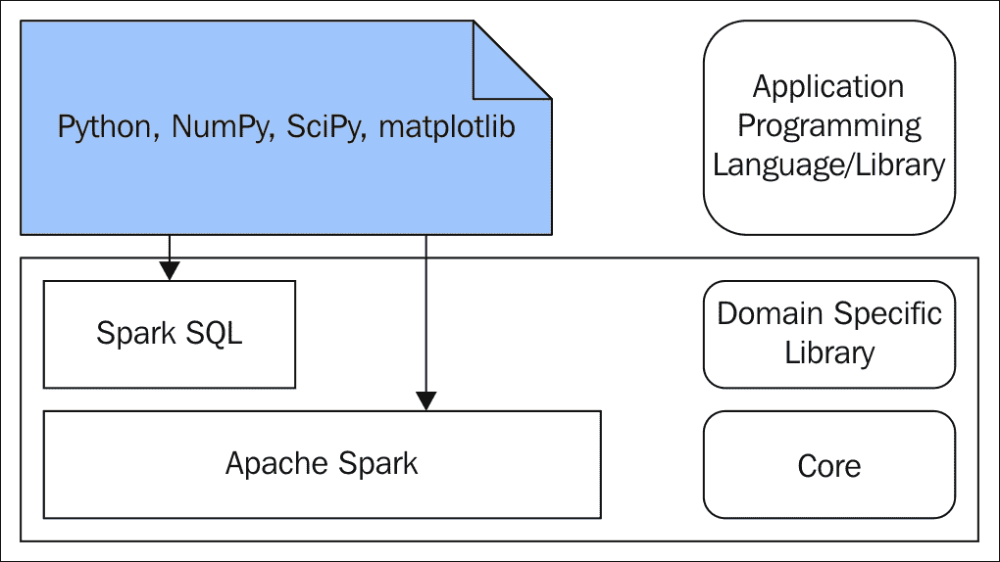
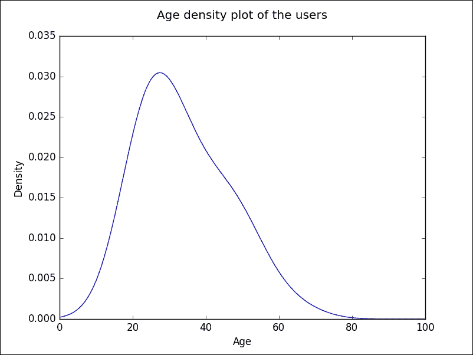
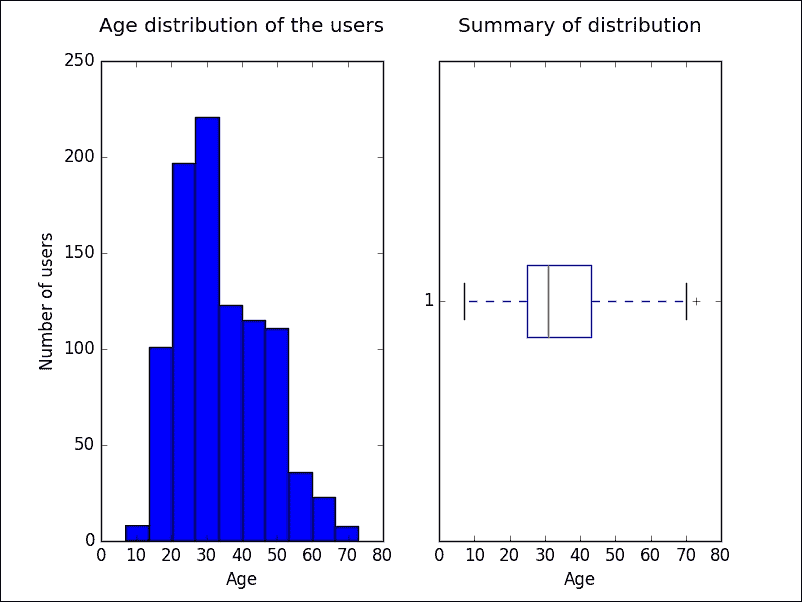
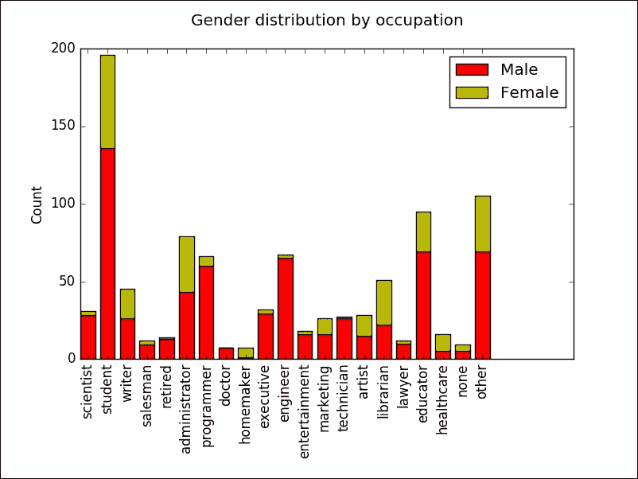
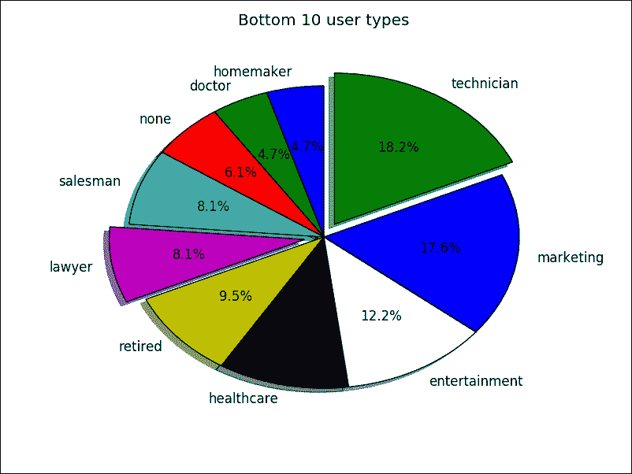
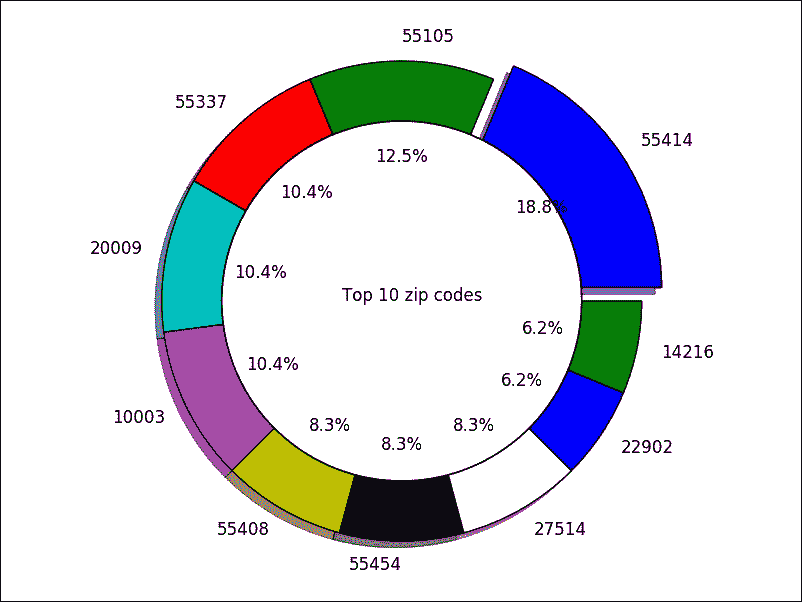
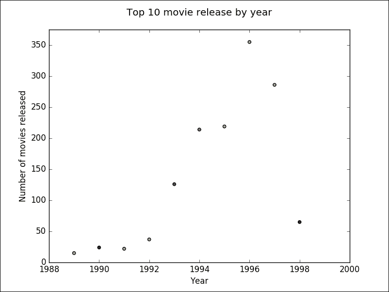
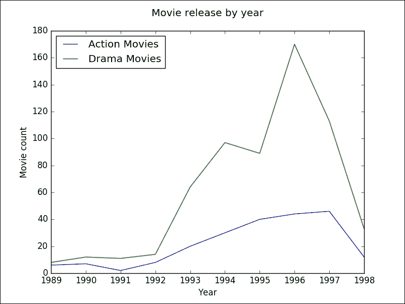

# 五、 Python 和 Spark 数据分析

处理数据的最终目标是使用结果来回答业务问题。了解用于回答业务问题的数据非常重要。为了更好地理解数据，使用了各种制表方法、图表和绘图技术。数据的可视化表示加强了对底层数据的理解。因此，数据可视化在数据分析中得到了广泛的应用。

各种出版物中使用了不同的术语来表示回答商业问题的数据分析。数据分析、数据分析和商业智能是一些无处不在的术语。本章不打算深入讨论这些术语的含义、相似之处或不同之处。另一方面，重点将是如何弥合通常由数据科学家或数据分析师完成的两项主要活动之间的差距。第一个是数据处理。第二种是利用处理过的数据，借助图表进行分析。数据分析是数据分析师和数据科学家的强项。本章将重点介绍如何使用 Spark 和 Python 处理数据，并生成图表和绘图。

在许多数据分析用例中，处理一个超级数据集，并将精简后的结果数据集用于数据分析。这在大数据分析的情况下尤其有效，在这种情况下，一小组处理过的数据被用于分析。根据用例，对于各种数据分析需求，适当的数据处理是一个先决条件。本章将要介绍的大多数用例都属于这个模型，其中第一步处理必要的数据处理，第二步处理数据分析所需的图表和绘图。

在典型的数据分析用例中，活动链涉及广泛的多阶段**提取**、**转换**和**加载** ( **ETL** )管道，以数据分析平台或应用结束。这一系列活动的最终结果包括，但不限于，汇总数据表和图表形式的数据的各种可视化表示。由于 Spark 可以非常有效地处理来自异构分布式数据源的数据，遗留数据分析应用中存在的巨大 ETL 管道可以整合到独立的应用中，进行数据处理和数据分析。

我们将在本章中讨论以下主题:

*   图表和绘图库
*   设置数据集
*   捕获数据分析用例的高级细节
*   各种图表和曲线图

# 图表和绘图库

Python 是目前被数据分析师和数据科学家大量使用的编程语言。有许多可用的科学和统计数据处理库，以及图表和绘图库，可以在 Python 程序中使用。在 Spark 中，Python 也被广泛用作开发数据处理应用的编程语言。这带来了很大的灵活性，利用 Spark、Python 和 Python 库拥有统一的数据处理和数据分析框架，使我们能够进行科学和统计处理，以及制图和绘图。有许多这样的库可以使用 Python。其中， **NumPy** 和 **SciPy** 库在这里被用来进行数值、统计和科学数据处理。这里正在使用 **matplotlib** 库来制作产生 2D 图像的图表和绘图。

### 类型

在尝试本章中给出的代码示例之前，确保 **NumPy** 、 **SciPy** 和 **matplotlib** Python 库在 Python 安装中运行良好是非常重要的。在 Spark 应用中使用之前，必须单独进行测试和验证。

*图 1* 所示的框图给出了应用堆栈的整体结构:



图 1

# 设置数据集

有许多公共数据集可供普通公众使用，可用于教育、研究和开发目的。MovieLens 网站让用户对电影推荐进行评分和个性化。GroupLens Research 公布了电影在线的评级数据集。这些数据集可以从他们的网站[http://grouplens.org/datasets/movielens/](http://grouplens.org/datasets/movielens/)下载。在本章中，MovieLens 100K 数据集被用来演示使用 Spark 结合 Python、NumPy、SciPy 和 matplotlib 进行分布式数据处理。

### 类型

在用于数据集下载的 GroupLens Research 网站上，除了前面的数据集之外，还有更大容量的数据集，如 MovieLens 1M 数据集、MovieLens 10M 数据集、MovieLens 20M 数据集和 MovieLens 最新数据集可供下载。一旦读者对程序非常熟悉，并且已经达到了足够的舒适水平，读者就可以使用这些额外的数据集来进行自己的分析工作，以加强从本章中获得的知识。

MovieLens 100K 数据集有多个文件中的数据。以下是将在本章的数据分析用例中使用的内容:

*   `u.user`: The demographic information about the users who have rated movies. The structure of the dataset is given as follows, reproduced as it is from the README file accompanying the dataset:
    *   用户标识
    *   年龄
    *   性别
    *   职业
    *   邮政区码
*   `u.item`: The information about the movies that are rated by the users. The structure of the dataset is given as follows, reproduced as it is from the README file accompanying the dataset:
    *   电影 ID
    *   电影标题
    *   发布日期
    *   视频发布日期
    *   IMDb URL
    *   未知的
    *   行动
    *   冒险
    *   动画
    *   孩子们的
    *   喜剧
    *   犯罪
    *   纪录片
    *   戏剧
    *   幻想
    *   电影-黑色
    *   恐怖
    *   音乐的
    *   秘密
    *   浪漫性
    *   科幻小说
    *   惊悚片
    *   战争
    *   西方的

# 数据分析用例

下面的列表捕获了数据分析用例的高级细节。大多数用例都围绕着各种图表和图表的创建:

*   使用直方图绘制电影分级用户的年龄分布。
*   使用与绘制直方图相同的数据绘制用户的年龄概率密度图。
*   绘制年龄分布数据的摘要，找出用户的最小、第 25<sup>百分位、中位、第 75<sup>百分位和最大年龄。</sup></sup>
*   在同一图形上绘制多个图表或绘图，以便对数据进行并排比较。
*   创建一个条形图，根据给电影评分的用户数量，捕捉前 10 个职业。
*   创建一个堆叠条形图，按职业记录给电影评分的男性和女性用户数量。
*   创建一个饼状图，根据给电影评分的人数来捕捉排名后 10 位的职业。
*   创建一个圆环图，根据给电影评分的人数来捕捉前 10 个邮政编码。
*   使用三个职业类别，创建方框图，捕捉给电影评分的用户的汇总统计数据。所有三个方框图必须绘制在一个图形上，以便进行比较。
*   创建一个条形图，按类型记录电影数量。
*   创建一个散点图，记录每年上映的电影数量的前 10 年。
*   创建一个散点图，记录每年上映的电影数量的前 10 年。在这个情节中，不要在情节中加点，而是用与当年上映的电影数量成正比的面积来创建圆圈。
*   用两个数据集创建一个折线图，一个数据集是过去 10 年上映的动作片数量，另一个数据集是过去 10 年上映的剧情片数量，以便于比较。

### 类型

在前面的所有用例中，当涉及到实现时，Spark 用于处理数据和准备所需的数据集。一旦所需的处理数据在 Spark DataFrame 中可用，就会被收集到驱动程序中。换句话说，数据从 Spark 的分布式集合转移到本地集合，作为 Python 程序中的元组，用于制图和绘图。对于制图和绘图，Python 需要本地数据。它不能直接使用 Spark 数据帧进行制图和绘图。

# 图表和曲线图

本节将重点关注创建各种图表和绘图，以直观地表示与上一节中描述的用例相关的 MovieLens 100K 数据集的各个方面。本章中描述的图表绘制过程遵循一种模式。以下是这种活动模式的重要步骤:

1.  使用 Spark 从数据文件中读取数据。
2.  使数据在 Spark 数据框中可用。
3.  使用数据框架应用编程接口应用必要的数据处理。
4.  处理的主要目的是使制图和绘图只需要最少的数据。
5.  将处理后的数据从 Spark 数据框传输到 Spark 驱动程序中的本地 Python 集合对象。
6.  使用图表和绘图库，使用 Python 集合对象中的可用数据生成图形。

## 直方图

直方图通常用于显示给定数值数据集如何分布在大小相等的连续非重叠区间上。间隔或面元大小是根据数据集选择的。区间代表数据的范围。在这个用例中，数据集由用户的年龄组成。在这种情况下，仓位大小为 100 是没有意义的，因为只有一个仓位，整个数据集都会落入其中。代表库的条的高度指示该库或区间中数据项的频率。

以下一组命令用于调出 Spark 的 Python REPL，接下来是进行数据处理、制图和绘图的程序:

```scala
$ cd $SPARK_HOME
$ ./bin/pyspark
>>> # Import all the required libraries 
>>> from pyspark.sql import Row
>>> import matplotlib.pyplot as plt
>>> import numpy as np
>>> import matplotlib.pyplot as plt
>>> import pylab as P
>>> plt.rcdefaults()
>>> # TODO - The following location has to be changed to the appropriate data file location
>>> dataDir = "/Users/RajT/Documents/Writing/SparkForBeginners/SparkDataAnalysisWithPython/Data/ml-100k/">>> # Create the DataFrame of the user dataset
>>> lines = sc.textFile(dataDir + "u.user")
>>> splitLines = lines.map(lambda l: l.split("|"))
>>> usersRDD = splitLines.map(lambda p: Row(id=p[0], age=int(p[1]), gender=p[2], occupation=p[3], zipcode=p[4]))
>>> usersDF = spark.createDataFrame(usersRDD)
>>> usersDF.createOrReplaceTempView("users")
>>> usersDF.show()
      +---+------+---+-------------+-------+

      |age|gender| id|   occupation|zipcode|

      +---+------+---+-------------+-------+

      | 24|     M|  1|   technician|  85711|

      | 53|     F|  2|        other|  94043|

      | 23|     M|  3|       writer|  32067|

      | 24|     M|  4|   technician|  43537|

      | 33|     F|  5|        other|  15213|

      | 42|     M|  6|    executive|  98101|

      | 57|     M|  7|administrator|  91344|

      | 36|     M|  8|administrator|  05201|

      | 29|     M|  9|      student|  01002|

      | 53|     M| 10|       lawyer|  90703|

      | 39|     F| 11|        other|  30329|

      | 28|     F| 12|        other|  06405|

      | 47|     M| 13|     educator|  29206|

      | 45|     M| 14|    scientist|  55106|

      | 49|     F| 15|     educator|  97301|

      | 21|     M| 16|entertainment|  10309|

      | 30|     M| 17|   programmer|  06355|

      | 35|     F| 18|        other|  37212|

      | 40|     M| 19|    librarian|  02138|

      | 42|     F| 20|    homemaker|  95660|

      +---+------+---+-------------+-------+

      only showing top 20 rows
    >>> # Create the DataFrame of the user dataset with only one column age
	>>> ageDF = spark.sql("SELECT age FROM users")
	>>> ageList = ageDF.rdd.map(lambda p: p.age).collect()
	>>> ageDF.describe().show()
      +-------+------------------+

      |summary|               age|

      +-------+------------------+

      |  count|               943|

      |   mean| 34.05196182396607|

      | stddev|12.186273150937206|

      |    min|                 7|

      |    max|                73|

      +-------+------------------+
 >>> # Age distribution of the users
 >>> plt.hist(ageList)
 >>> plt.title("Age distribution of the users\n")
 >>> plt.xlabel("Age")
 >>> plt.ylabel("Number of users")
 >>> plt.show(block=False)

```

在前一节中，逐行读取用户数据集以形成 RDD。从 RDD，一个 Spark 数据框架被创建。使用 Spark SQL，创建了另一个只包含年龄列的 Spark 数据框。显示 Spark 数据框的摘要，以显示内容的摘要统计信息；内容被收集到本地 Python 集合对象中。使用收集的数据，绘制年龄列的直方图，如*图 2* 所示:


图 2

## 密度图

还有一个非常接近直方图的图。这是密度图。每当有一个有限的数据样本需要估计随机变量的概率密度函数时，密度图就被大量使用。直方图不会显示数据何时平滑或数据点何时连续。为此，使用密度图。

### 注

由于直方图和密度图用于相似的目的，但是对于相同的数据显示不同的行为，通常，直方图和密度图在许多应用中并排使用。

*图 3* 是为用于绘制直方图的同一数据集绘制的密度图。

作为 Spark 的同一个 Python REPL 的延续，运行以下命令:

```scala
>>> # Draw a density plot
>>> from scipy.stats import gaussian_kde
>>> density = gaussian_kde(ageList)
>>> xAxisValues = np.linspace(0,100,1000)
>>> density.covariance_factor = lambda : .5
>>> density._compute_covariance()
>>> plt.title("Age density plot of the users\n")
>>> plt.xlabel("Age")
>>> plt.ylabel("Density")
>>> plt.plot(xAxisValues, density(xAxisValues))
>>> plt.show(block=False)

```



图 3

在前一节中，使用了创建的仅包含年龄列的相同 Spark DataFrame，并将内容收集到本地 Python 集合对象中。使用收集的数据，绘制年龄列的密度图，如*图 3* 所示，线间距从 0 到 100 表示年龄。

如果要并排查看多个图表或图， **matplotlib** 库提供了这样做的方法。图 4 并排显示了直方图和方框图。

作为 Spark 的同一个 Python REPL 的延续，运行以下命令:

```scala
>>> # The following example demonstrates the creation of multiple diagrams
        in one figure
		>>> # There are two plots on one row
		>>> # The first one is the histogram of the distribution 
		>>> # The second one is the boxplot containing the summary of the 
        distribution
		>>> plt.subplot(121)
		>>> plt.hist(ageList)
		>>> plt.title("Age distribution of the users\n")
		>>> plt.xlabel("Age")
		>>> plt.ylabel("Number of users")
		>>> plt.subplot(122)
		>>> plt.title("Summary of distribution\n")
		>>> plt.xlabel("Age")
		>>> plt.boxplot(ageList, vert=False)
		>>> plt.show(block=False)

```



图 4

在前面的部分中，使用了创建的仅包含年龄列的相同 Spark DataFrame，并将内容收集到本地 Python 集合对象中。使用收集到的数据，绘制了年龄列的直方图以及包含最小值、第 25 <sup>第</sup>百分位、中值、第 75 <sup>第</sup>百分位和最大值的方框图，如*图 4* 所示。在一个图形中绘制多个图表或图时，要想找到控制布局的方法，请看方法调用`plt.subplot(121)`。这里说的是一行两列布局图的选择，选择第一个。同样的，`plt.subplot(122)`谈一排两列布局的地块选择，选择第二个。

## 条形图

条形图可以用不同的方法绘制。最常见的是横条垂直立在 *X* 轴上。另一种变化是在 *Y* 轴上绘制横条，并使横条水平放置。*图 5* 为横条图。

### 注

直方图和条形图很容易混淆。重要的区别在于直方图用于绘制连续但有限的数值，而条形图用于表示分类数据。

作为 Spark 的同一个 Python REPL 的延续，运行以下命令:

```scala
>>> occupationsTop10 = spark.sql("SELECT occupation, count(occupation) as usercount FROM users GROUP BY occupation ORDER BY usercount DESC LIMIT 10")
>>> occupationsTop10.show()
      +-------------+---------+

      |   occupation|usercount|

      +-------------+---------+

      |      student|      196|

      |        other|      105|

      |     educator|       95|

      |administrator|       79|

      |     engineer|       67|

      |   programmer|       66|

      |    librarian|       51|

      |       writer|       45|

      |    executive|       32|

      |    scientist|       31|

      +-------------+---------+
	  >>> occupationsTop10Tuple = occupationsTop10.rdd.map(lambda p:
	  (p.occupation,p.usercount)).collect()
	  >>> occupationsTop10List, countTop10List = zip(*occupationsTop10Tuple)
	  >>> occupationsTop10Tuple
	  >>> # Top 10 occupations in terms of the number of users having that
	  occupation who have rated movies
	  >>> y_pos = np.arange(len(occupationsTop10List))
	  >>> plt.barh(y_pos, countTop10List, align='center', alpha=0.4)
	  >>> plt.yticks(y_pos, occupationsTop10List)
	  >>> plt.xlabel('Number of users')
	  >>> plt.title('Top 10 user types\n')
	  >>> plt.gcf().subplots_adjust(left=0.15)
	  >>> plt.show(block=False)

```


图 5

在前面的部分中，创建了一个 Spark 数据框，其中包含了按电影评分用户数量排列的前 10 个用户职业。数据被收集到 Python 收集对象中，以绘制条形图。

### 堆积条形图

上一节中绘制的条形图给出了用户数量最多的 10 种用户职业。但这并没有给出用户性别构成的细节。在这种情况下，最好使用堆叠条形图，每个条形图按性别显示计数。*图 6* 为堆叠条形图。

作为 Spark 的同一个 Python REPL 的延续，运行以下命令:

```scala
>>> occupationsGender = spark.sql("SELECT occupation, gender FROM users")>>> occupationsGender.show()
      +-------------+------+

      |   occupation|gender|

      +-------------+------+

      |   technician|     M|

      |        other|     F|

      |       writer|     M|

      |   technician|     M|

      |        other|     F|

      |    executive|     M|

      |administrator|     M|

      |administrator|     M|

      |      student|     M|

      |       lawyer|     M|

      |        other|     F|

      |        other|     F|

      |     educator|     M|

      |    scientist|     M|

      |     educator|     F|

      |entertainment|     M|

      |   programmer|     M|

      |        other|     F|

      |    librarian|     M|

      |    homemaker|     F|

      +-------------+------+

      only showing top 20 rows
    >>> occCrossTab = occupationsGender.stat.crosstab("occupation", "gender")>>> occCrossTab.show()
      +-----------------+---+---+

      |occupation_gender|  M|  F|

      +-----------------+---+---+

      |        scientist| 28|  3|

      |          student|136| 60|

      |           writer| 26| 19|

      |         salesman|  9|  3|

      |          retired| 13|  1|

      |    administrator| 43| 36|

      |       programmer| 60|  6|

      |           doctor|  7|  0|

      |        homemaker|  1|  6|

      |        executive| 29|  3|

      |         engineer| 65|  2|

      |    entertainment| 16|  2|

      |        marketing| 16| 10|

      |       technician| 26|  1|

      |           artist| 15| 13|

      |        librarian| 22| 29|

      |           lawyer| 10|  2|

      |         educator| 69| 26|

      |       healthcare|  5| 11|

      |             none|  5|  4|

      +-----------------+---+---+

      only showing top 20 rows
      >>> occupationsCrossTuple = occCrossTab.rdd.map(lambda p:
	 (p.occupation_gender,p.M, p.F)).collect()
	 >>> occList, mList, fList = zip(*occupationsCrossTuple)
	 >>> N = len(occList)
	 >>> ind = np.arange(N) # the x locations for the groups
	 >>> width = 0.75 # the width of the bars
	 >>> p1 = plt.bar(ind, mList, width, color='r')
	 >>> p2 = plt.bar(ind, fList, width, color='y', bottom=mList)
	 >>> plt.ylabel('Count')
	 >>> plt.title('Gender distribution by occupation\n')
	 >>> plt.xticks(ind + width/2., occList, rotation=90)
	 >>> plt.legend((p1[0], p2[0]), ('Male', 'Female'))
	 >>> plt.gcf().subplots_adjust(bottom=0.25)
	 >>> plt.show(block=False)

```



图 6

在前一节中，创建了一个仅包含职业和性别列的 Spark 数据框。对其进行跨选项卡操作以生成另一个 Spark 数据框，该数据框生成职业、男性用户数和女性用户数的列。在包含职业和性别列的第一个 Spark DataFrame 中，这两个列都是非数字列，因此，根据这些数据绘制成图表或绘图是没有意义的。但是，如果对这两个列值执行跨选项卡操作，对于每个不同的职业字段，性别列的值计数将可用。这样，职业字段就变成了一个分类变量，用数据绘制一个条形图也是有意义的。由于该数据中只有两个性别值，因此使用堆叠条形图来查看每个职业类别中的总人数以及男性和女性用户数量的比例是有意义的。

Spark 的数据框中有许多统计和数学函数。在这种情况下，Spark 数据框上的跨选项卡操作非常方便。对于庞大的数据集，跨选项卡操作可能会变得非常耗费处理器和时间，但是 Spark 的分布式处理能力在这种情况下有很大的帮助。

Spark SQL 具有大量的数学和统计数据处理能力。前面的部分在`SparkDataFrame`对象上使用了`describe().show()`方法。在这些 Spark 数据帧中，前面的方法作用于可用的数值列。在某些情况下，会有多个数值列，在这些情况下，前面的方法能够选择所需的列来获取汇总统计信息。同样，也有方法可以从 Spark 数据框中找到数据的协方差、相关性等。下面的代码片段演示了这些方法:

```scala
>>> occCrossTab.describe('M', 'F').show()
      +-------+------------------+------------------+

      |summary|                 M|                 F|

      +-------+------------------+------------------+

      |  count|                21|                21|

      |   mean|31.904761904761905|              13.0|

      | stddev|31.595516200735347|15.491933384829668|

      |    min|                 1|                 0|

      |    max|               136|                60|

      +-------+------------------+------------------+
    >>> occCrossTab.stat.cov('M', 'F')
      381.15
    >>> occCrossTab.stat.corr('M', 'F')
      0.7416099517313641 

```

## 饼图

如果需要可视化地表示数据集来解释整体-部分关系，饼图是非常常用的。*图 7* 为饼图。

作为 Spark 的同一个 Python REPL 的延续，运行以下命令:

```scala
>>> occupationsBottom10 = spark.sql("SELECT occupation, count(occupation) as usercount FROM users GROUP BY occupation ORDER BY usercount LIMIT 10")
>>> occupationsBottom10.show()
      +-------------+---------+

      |   occupation|usercount|

      +-------------+---------+

      |    homemaker|        7|

      |       doctor|        7|

      |         none|        9|

      |     salesman|       12|

      |       lawyer|       12|

      |      retired|       14|

      |   healthcare|       16|

      |entertainment|       18|

      |    marketing|       26|

      |   technician|       27|

      +-------------+---------+
    >>> occupationsBottom10Tuple = occupationsBottom10.rdd.map(lambda p: (p.occupation,p.usercount)).collect()
	>>> occupationsBottom10List, countBottom10List = zip(*occupationsBottom10Tuple)
	>>> # Bottom 10 occupations in terms of the number of users having that occupation who have rated movies
	>>> explode = (0, 0, 0, 0,0.1,0,0,0,0,0.1)
	>>> plt.pie(countBottom10List, explode=explode, labels=occupationsBottom10List, autopct='%1.1f%%', shadow=True, startangle=90)
	>>> plt.title('Bottom 10 user types\n')
	>>> plt.show(block=False)

```



图 7

在前面的部分中，创建了一个 Spark 数据框，其中包含了根据电影评分用户数量排名后 10 位的用户职业。数据被收集到 Python 收集对象中，以绘制饼图。

### 圆环图

饼图可以用不同的形式绘制。一种这样的形式，圆环图，现在经常被使用。图 8 显示了饼图的这个圆环图变体。

作为 Spark 的同一个 Python REPL 的延续，运行以下命令:

```scala
>>> zipTop10 = spark.sql("SELECT zipcode, count(zipcode) as usercount FROM users GROUP BY zipcode ORDER BY usercount DESC LIMIT 10")
>>> zipTop10.show()
      +-------+---------+

      |zipcode|usercount|

      +-------+---------+

      |  55414|        9|

      |  55105|        6|

      |  20009|        5|

      |  55337|        5|

      |  10003|        5|

      |  55454|        4|

      |  55408|        4|

      |  27514|        4|

      |  11217|        3|

      |  14216|        3|

      +-------+---------+
    >>> zipTop10Tuple = zipTop10.rdd.map(lambda p: (p.zipcode,p.usercount)).collect()
	>>> zipTop10List, countTop10List = zip(*zipTop10Tuple)
	>>> # Top 10 zipcodes in terms of the number of users living in that zipcode who have rated movies>>> explode = (0.1, 0, 0, 0,0,0,0,0,0,0)  # explode a slice if required
	>>> plt.pie(countTop10List, explode=explode, labels=zipTop10List, autopct='%1.1f%%', shadow=True)
	>>> #Draw a circle at the center of pie to make it look like a donut
	>>> centre_circle = plt.Circle((0,0),0.75,color='black', fc='white',linewidth=1.25)
	>>> fig = plt.gcf()
	>>> fig.gca().add_artist(centre_circle)
	>>> # The aspect ratio is to be made equal. This is to make sure that pie chart is coming perfectly as a circle.
	>>> plt.axis('equal')
	>>> plt.text(- 0.25,0,'Top 10 zip codes')
	>>> plt.show(block=False)

```



图 8

在前面的部分中，创建了一个 Spark DataFrame，其中包含用户的前 10 个邮政编码，以居住在该区域并对电影进行了分级的用户数量表示。数据被收集到一个 Python 收集对象中，以绘制圆环图。

### 类型

与本书其他图相比，*图 8* 的标题在中间。使用`text()`方法完成，而不是使用`title()`方法。此方法可用于在图表和绘图上打印水印文本。

## 方框图

通常，在一个图中比较不同数据集的汇总统计数据是常见的要求。箱式图是一种非常常见的图，用于以直观的方式捕获数据集的汇总统计数据。下一节的操作完全相同，为此，*图 9* 显示了单个图形上的多个方框图。

作为 Spark 的同一个 Python REPL 的延续，运行以下命令:

```scala
>>> ages = spark.sql("SELECT occupation, age FROM users WHERE occupation ='administrator' ORDER BY age")
>>> adminAges = ages.rdd.map(lambda p: p.age).collect()
>>> ages.describe().show()
      +-------+------------------+

      |summary|               age|

      +-------+------------------+

      |  count|                79|

      |   mean| 38.74683544303797|

      | stddev|11.052771408491363|

      |    min|                21|

      |    max|                70|

      +-------+------------------+
    >>> ages = spark.sql("SELECT occupation, age FROM users WHERE occupation ='engineer' ORDER BY age")>>> engAges = ages.rdd.map(lambda p: p.age).collect()
	>>> ages.describe().show()
      +-------+------------------+

      |summary|               age|

      +-------+------------------+

      |  count|                67|

      |   mean| 36.38805970149254|

      | stddev|11.115345348003853|

      |    min|                22|

      |    max|                70|

      +-------+------------------+
    >>> ages = spark.sql("SELECT occupation, age FROM users WHERE occupation ='programmer' ORDER BY age")>>> progAges = ages.rdd.map(lambda p: p.age).collect()
	>>> ages.describe().show()
      +-------+------------------+

      |summary|               age|

      +-------+------------------+

      |  count|                66|

      |   mean|33.121212121212125|

      | stddev| 9.551320948648684|

      |    min|                20|

      |    max|                63|

      +-------+------------------+
 >>> # Box plots of the ages by profession
 >>> boxPlotAges = [adminAges, engAges, progAges]
 >>> boxPlotLabels = ['administrator','engineer', 'programmer' ]
 >>> x = np.arange(len(boxPlotLabels))
 >>> plt.figure()
 >>> plt.boxplot(boxPlotAges)
 >>> plt.title('Age summary statistics\n')
 >>> plt.ylabel("Age")
 >>> plt.xticks(x + 1, boxPlotLabels, rotation=0)
 >>> plt.show(block=False)

```


图 9

在前面的部分中，创建了一个 Spark DataFrame，其中包含三种职业的职业和年龄列:管理员、工程师和程序员。在一个图上为每个数据集创建了箱线图，其中包含每个数据集的最小值、第 25 个百分位、中值、第 75 个<sup>百分位、最大值和异常值的指标，以便于比较。程序员职业的方框图显示了由`+`符号表示的两个值点。它们是异常值。</sup>

## 竖条图

在前面几节中，用于获取各种图表和绘制用例的主要数据集是用户数据。接下来要处理的数据集是电影数据集。在许多数据集中，为了生成各种图表和绘图，需要使数据适合适当的数字。Spark 具有丰富的数据处理功能。

下面的用例演示了通过应用一些聚合和使用 Spark SQL 来准备数据；所需的数据集是为包含按类型划分的电影计数的经典条形图准备的。*图 10* 展示了对电影数据进行聚合操作后的条形图。

作为 Spark 的同一个 Python REPL 的延续，运行以下命令:

```scala
>>> movieLines = sc.textFile(dataDir + "u.item")
>>> splitMovieLines = movieLines.map(lambda l: l.split("|"))
>>> moviesRDD = splitMovieLines.map(lambda p: Row(id=p[0], title=p[1], releaseDate=p[2], videoReleaseDate=p[3], url=p[4], unknown=int(p[5]),action=int(p[6]),adventure=int(p[7]),animation=int(p[8]),childrens=int(p[9]),comedy=int(p[10]),crime=int(p[11]),documentary=int(p[12]),drama=int(p[13]),fantasy=int(p[14]),filmNoir=int(p[15]),horror=int(p[16]),musical=int(p[17]),mystery=int(p[18]),romance=int(p[19]),sciFi=int(p[20]),thriller=int(p[21]),war=int(p[22]),western=int(p[23])))
>>> moviesDF = spark.createDataFrame(moviesRDD)
>>> moviesDF.createOrReplaceTempView("movies")
>>> genreDF = spark.sql("SELECT sum(unknown) as unknown, sum(action) as action,sum(adventure) as adventure,sum(animation) as animation, sum(childrens) as childrens,sum(comedy) as comedy,sum(crime) as crime,sum(documentary) as documentary,sum(drama) as drama,sum(fantasy) as fantasy,sum(filmNoir) as filmNoir,sum(horror) as horror,sum(musical) as musical,sum(mystery) as mystery,sum(romance) as romance,sum(sciFi) as sciFi,sum(thriller) as thriller,sum(war) as war,sum(western) as western FROM movies")
>>> genreList = genreDF.collect()
>>> genreDict = genreList[0].asDict()
>>> labelValues = list(genreDict.keys())
>>> countList = list(genreDict.values())
>>> genreDict
      {'animation': 42, 'adventure': 135, 'romance': 247, 'unknown': 2, 'musical': 56, 'western': 27, 'comedy': 505, 'drama': 725, 'war': 71, 'horror': 92, 'mystery': 61, 'fantasy': 22, 'childrens': 122, 'sciFi': 101, 'filmNoir': 24, 'action': 251, 'documentary': 50, 'crime': 109, 'thriller': 251}
    >>> # Movie types and the counts
	>>> x = np.arange(len(labelValues))
	>>> plt.title('Movie types\n')
	>>> plt.ylabel("Count")
	>>> plt.bar(x, countList)
	>>> plt.xticks(x + 0.5, labelValues, rotation=90)
	>>> plt.gcf().subplots_adjust(bottom=0.20)
	>>> plt.show(block=False)

```


图 10

在前一节中，使用电影数据集创建了一个`SparkDataFrame`。这部电影的类型是在不同的栏目中拍摄的。在整个数据集上，使用 Spark SQL 进行了聚合，创建了一个新的`SparkDataFrame`摘要，并将数据值收集到一个 Python 收集对象中。由于数据集中的列太多，所以使用 Python 函数将这种数据结构转换为字典对象，该字典对象包含列名作为键，并且所选的单行值是键的值。根据该字典，创建了两个数据集，并绘制了一个条形图。

### 类型

使用 Spark 时，使用 Python 开发数据分析应用，几乎可以肯定会有很多图表和绘图。与其尝试本章中给出的所有针对 Spark 的 Python REPL 的代码示例，不如使用 IPython 笔记本作为 IDE，这样就可以一起看到代码和结果。这本书的下载部分包含了包含所有这些代码和结果的 IPython 笔记本。读者可以直接开始使用这个。

## 散点图

散点图通常用于绘制具有两个变量的值，例如笛卡尔空间中具有`X`值和`Y`值的点。在这个电影数据集中，给定年份发行的电影数量显示了这种行为。在散点图中，通常在`X`坐标和`Y`坐标的交点处表示的值是点。由于最近的技术发展和复杂的图形包的可用性，许多使用不同的形状和颜色来表示点。在下面的散点图中，如*图 11* 所示，用具有随机颜色的均匀区域的小圆来表示数值。当使用这种直观而巧妙的技术来表示散点图中的点时，必须小心确保它不会违背目的，并失去散点图提供的传达数据行为的简单性。简单而优雅的形状不会使笛卡尔空间变得混乱，非常适合这种非点值表示。

作为 Spark 的同一个 Python REPL 的延续，运行以下命令:

```scala
>>> yearDF = spark.sql("SELECT substring(releaseDate,8,4) as releaseYear, count(*) as movieCount FROM movies GROUP BY substring(releaseDate,8,4) ORDER BY movieCount DESC LIMIT 10")
>>> yearDF.show()
      +-----------+----------+

      |releaseYear|movieCount|

      +-----------+----------+

      |       1996|       355|

      |       1997|       286|

      |       1995|       219|

      |       1994|       214|

      |       1993|       126|

      |       1998|        65|

      |       1992|        37|

      |       1990|        24|

      |       1991|        22|

      |       1986|        15|

      +-----------+----------+
    >>> yearMovieCountTuple = yearDF.rdd.map(lambda p: (int(p.releaseYear),p.movieCount)).collect()
	>>> yearList,movieCountList = zip(*yearMovieCountTuple)
	>>> countArea = yearDF.rdd.map(lambda p: np.pi * (p.movieCount/15)**2).collect()
	>>> plt.title('Top 10 movie release by year\n')
	>>> plt.xlabel("Year")
	>>> plt.ylabel("Number of movies released")
	>>> plt.ylim([0,max(movieCountList) + 20])
	>>> colors = np.random.rand(10)
	>>> plt.scatter(yearList, movieCountList,c=colors)
	>>> plt.show(block=False)

```



图 11

在前一节中，使用了一个`SparkDataFrame`来收集该年上映电影数量的前 10 年，并将这些值收集到一个 Python 收集对象中，并绘制了散点图。

### 增强散点图

*图 11* 是一个非常简单而优雅的散点图，但它并没有真正传达给定绘制值与同一空间中其他值相比的比较行为。为此，如果将点绘制成面积与值成比例的圆，而不是将点表示成固定半径的圆，那么将给出不同的视角。图 12 将显示具有相同数据的散点图，但圆圈具有代表点的比例面积。

作为 Spark 的同一个 Python REPL 的延续，运行以下命令:

```scala
>>> # Top 10 years where the most number of movies have been released
>>> plt.title('Top 10 movie release by year\n')
>>> plt.xlabel("Year")
>>> plt.ylabel("Number of movies released")
>>> plt.ylim([0,max(movieCountList) + 100])
>>> colors = np.random.rand(10)
>>> plt.scatter(yearList, movieCountList,c=colors, s=countArea)
>>> plt.show(block=False)

```


图 12

在前面的部分中，*图 11* 使用了相同的数据集来绘制相同的散点图。这些点不是用均匀的面积圆绘制的，而是用成比例的面积圆绘制的。

### 类型

在所有这些代码示例中，图表和绘图都是使用 show 方法显示的。matplotlib 中有一些方法可以将生成的图表和绘图保存到磁盘，它们可以用于电子邮件、发布到仪表板等。

## 线图

散点图和线图有相似之处。散点图非常适合表示单个数据点，但将所有数据点放在一起会给出一个趋势。折线图也表示单个数据点，但这些点是相连的。这对于观察从一点到另一点的过渡是理想的。在一个图中，可以绘制多个折线图，从而能够比较两个数据集。前面的用例使用散点图来表示过去几年发行的电影数量。这些数字只是绘制在一个数字上的离散数据点。如果需要了解这些年来电影发行的变化趋势，那么线图是理想的选择。类似地，如果需要比较两种不同类型的电影发行情况，那么每种类型可以使用一条线，并且两者都可以绘制在单线图上。*图 13* 是多数据集的折线图。

作为 Spark 的同一个 Python REPL 的延续，运行以下命令:

```scala
>>> yearActionDF = spark.sql("SELECT substring(releaseDate,8,4) as actionReleaseYear, count(*) as actionMovieCount FROM movies WHERE action = 1 GROUP BY substring(releaseDate,8,4) ORDER BY actionReleaseYear DESC LIMIT 10")
>>> yearActionDF.show()
      +-----------------+----------------+

      |actionReleaseYear|actionMovieCount|

      +-----------------+----------------+

      |             1998|              12|

      |             1997|              46|

      |             1996|              44|

      |             1995|              40|

      |             1994|              30|

      |             1993|              20|

      |             1992|               8|

      |             1991|               2|

      |             1990|               7|

      |             1989|               6|

      +-----------------+----------------+
    >>> yearActionDF.createOrReplaceTempView("action")
	>>> yearDramaDF = spark.sql("SELECT substring(releaseDate,8,4) as dramaReleaseYear, count(*) as dramaMovieCount FROM movies WHERE drama = 1 GROUP BY substring(releaseDate,8,4) ORDER BY dramaReleaseYear DESC LIMIT 10")
	>>> yearDramaDF.show()
      +----------------+---------------+

      |dramaReleaseYear|dramaMovieCount|

      +----------------+---------------+

      |            1998|             33|

      |            1997|            113|

      |            1996|            170|

      |            1995|             89|

      |            1994|             97|

      |            1993|             64|

      |            1992|             14|

      |            1991|             11|

      |            1990|             12|

      |            1989|              8|

      +----------------+---------------+
    >>> yearDramaDF.createOrReplaceTempView("drama")
	>>> yearCombinedDF = spark.sql("SELECT a.actionReleaseYear as releaseYear, a.actionMovieCount, d.dramaMovieCount FROM action a, drama d WHERE a.actionReleaseYear = d.dramaReleaseYear ORDER BY a.actionReleaseYear DESC LIMIT 10")
	>>> yearCombinedDF.show()
      +-----------+----------------+---------------+

      |releaseYear|actionMovieCount|dramaMovieCount|

      +-----------+----------------+---------------+

      |       1998|              12|             33|

      |       1997|              46|            113|

      |       1996|              44|            170|

      |       1995|              40|             89|

      |       1994|              30|             97|

      |       1993|              20|             64|

      |       1992|               8|             14|

      |       1991|               2|             11|

      |       1990|               7|             12|

      |       1989|               6|              8|

      +-----------+----------------+---------------+
   >>> yearMovieCountTuple = yearCombinedDF.rdd.map(lambda p: (p.releaseYear,p.actionMovieCount, p.dramaMovieCount)).collect()
   >>> yearList,actionMovieCountList,dramaMovieCountList = zip(*yearMovieCountTuple)
   >>> plt.title("Movie release by year\n")
   >>> plt.xlabel("Year")
   >>> plt.ylabel("Movie count")
   >>> line_action, = plt.plot(yearList, actionMovieCountList)
   >>> line_drama, = plt.plot(yearList, dramaMovieCountList)
   >>> plt.legend([line_action, line_drama], ['Action Movies', 'Drama Movies'],loc='upper left')
   >>> plt.gca().get_xaxis().get_major_formatter().set_useOffset(False)
   >>> plt.show(block=False)

```



图 13

在前一部分中，创建了 Spark 数据框，以获取过去 10 年间上映的动作电影和戏剧电影数量的数据集。数据被收集到 Python 收集对象中，并在同一图中绘制了折线图。

Python 结合 matplotlib 库，在制作出版物质量图表和绘图的方法方面非常丰富。Spark 可以作为处理来自异构数据源的数据的主力，结果也可以保存为各种数据格式。

那些接触过 Python 数据分析库**熊猫**的人会发现很容易理解本章所涵盖的材料，因为 Spark 数据框是从 R 数据框以及**熊猫**中汲取灵感而从头开始设计的。

本章仅介绍了几个可以使用 **matplotlib** 库创建的示例图表和绘图。本章的主要思想是帮助读者理解结合 Spark 使用该库的能力，Spark 在其中进行数据处理，而 **matplotlib** 则进行制图和绘图。

本章使用的数据文件是从本地文件系统中读取的。相反，它可以从 HDFS 或任何其他 Spark 支持的数据源中读取。

当使用 Spark 作为数据处理的主要框架时，需要记住的最重要的一点是，任何可能的数据处理都是由 Spark 来完成的，主要是因为 Spark 可以以最好的方式进行数据处理。只有处理过的数据才返回给 Spark 驱动程序，用于制图和绘图。

# 参考文献

有关更多信息，请参考以下链接:

*   [http://www.numpy.org/](http://www.numpy.org/)
*   [http://www.scipy.org/](http://www.scipy.org/)
*   [http://matplotlib.org/](http://matplotlib.org/)
*   [https://movielens.org/](https://movielens.org/)
*   [http://grouplens.org/datasets/movielens/](http://grouplens.org/datasets/movielens/)
*   [http://pandas.pydata.org/](http://pandas.pydata.org/)

# 总结

处理后的数据用于数据分析。数据分析需要对处理过的数据有深刻的理解。图表和绘图增强了对底层数据特征的理解。本质上，对于数据分析应用来说，数据处理、制图和绘图是必不可少的。本章介绍了 Spark 在 Python 中的使用，以及 Python 图表和绘图库在开发数据分析应用中的使用。

在大多数组织中，业务需求推动了构建数据处理应用的需求，这些应用涉及以各种形状和形式以极快的速度实时接收数据。这就要求需要处理传入组织数据接收器的数据流。下一章将讨论 Spark Streaming，这是一个工作在 Spark 之上的库，支持处理各种类型的数据流。