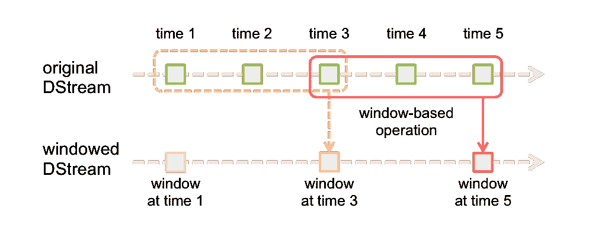

# 二、ApacheSpark 流

Apache Streaming 模块是 Apache Spark 中基于流处理的模块。它使用 Spark 集群，提供高度扩展的能力。基于 Spark，它还具有很高的容错性，能够通过检查正在处理的数据流来重新运行失败的任务。本章在介绍部分之后将涵盖以下主题，这些主题将提供 Apache Spark 如何处理基于流的数据的实用概述:

*   错误恢复和检查点
*   基于 TCP 的流处理
*   filestream
*   卡夫卡溪流源头

对于每个主题，我们将提供一个 Scala 中的工作示例，并展示如何设置和测试基于流的架构。

# 概观

下图显示了 Apache Streaming 的潜在数据源，如卡夫卡、弗鲁姆和 HDFS:


这些输入到 Spark 流模块，并作为离散流进行处理。该图还显示了其他 Spark 模块功能，如机器学习，可用于处理基于流的数据。

经过完全处理的数据可以作为 HDFS、数据库或仪表板的输出。此图基于 Spark 流媒体网站上的图，但我们想扩展它以表达 Spark 模块的功能:



# 检查点

在批处理上，我们习惯于容错。这意味着，在节点崩溃的情况下，作业不会丢失其状态，丢失的任务会重新安排给其他工作人员。中间结果被写入持久存储(当然，这也必须是容错的，HDFS、GPFS 或云对象存储就是这种情况)。现在，我们也希望在流式传输中实现同样的保证，因为我们正在处理的数据流不会丢失可能是至关重要的。

可以设置一个基于 HDFS 的检查点目录来存储基于 Apache Spark 的流信息。在这个 Scala 示例中，数据将存储在 HDFS 的`/data/spark/checkpoint`下。以下 HDFS 文件系统`ls`命令显示，在启动之前，目录不存在:

```scala
[hadoop@hc2nn stream]$ hdfs dfs -ls /data/spark/checkpoint
 ls: `/data/spark/checkpoint': No such file or directory
```

为了复制下面的例子，使用了推特应用编程接口凭证来连接到推特应用编程接口并获得推文流。以下链接解释了如何在推特用户界面中创建此类凭据:[https://dev . Twitter . com/oauth/overview/application-owner-access-token](https://dev.twitter.com/oauth/overview/application-owner-access-tokens)。

下面的 Scala 代码示例从导入 Spark 流上下文和基于推特的功能开始。然后它定义了一个名为`stream1`的应用对象:

```scala
import org.apache.spark._
import org.apache.spark.SparkContext._
import org.apache.spark.streaming._
import org.apache.spark.streaming.twitter._
import org.apache.spark.streaming.StreamingContext._

object stream1 {
```

接下来，定义一个名为`createContext`的方法，它将用于创建 Spark 和流上下文。它还将使用流上下文检查点方法将流检查到基于 HDFS 的目录，该方法将目录路径作为参数。传递给`createContext`方法的值`(cpDir)`的目录路径:

```scala
def createContext( cpDir : String ) : StreamingContext = {
  val appName = "Stream example 1"
  val conf    = new SparkConf()
  conf.setAppName(appName)
  val sc = new SparkContext(conf)
  val ssc    = new StreamingContext(sc, Seconds(5) )
  ssc.checkpoint( cpDir )
  ssc
}
```

现在，主要方法被定义为 HDFS 目录，以及推特访问权限和参数。Spark 流上下文`ssc`通过`StreamingContext`方法- `checkpoint`使用 HDFS 检查点目录检索或创建。如果目录不存在，则调用之前调用的`createContext`方法，该方法将创建上下文和`checkpoint`。显然，出于安全原因，我们在本例中截断了我们自己的推特`auth.keys`:

```scala
def main(args: Array[String]) {
  val hdfsDir = "/data/spark/checkpoint"
  val consumerKey       = "QQpxx"
  val consumerSecret    = "0HFzxx"
  val accessToken       = "323xx"
  val accessTokenSecret = "IlQxx"

  System.setProperty("twitter4j.oauth.consumerKey", consumerKey)
  System.setProperty("twitter4j.oauth.consumerSecret", consumerSecret)
  System.setProperty("twitter4j.oauth.accessToken", accessToken)
  System.setProperty("twitter4j.oauth.accessTokenSecret", accessTokenSecret)
  val ssc = StreamingContext.getOrCreate(hdfsDir,
        () => { createContext( hdfsDir ) })
  val stream = TwitterUtils.createStream(ssc,None).window( 
Seconds(60) )
  // do some processing
  ssc.start()
  ssc.awaitTermination()
} // end main
```

运行了这段没有实际处理的代码后，可以再次检查 HDFS `checkpoint`目录。这次很明显`checkpoint`目录已经创建，数据已经存储:

```scala
 [hadoop@hc2nn stream]$ hdfs dfs -ls /data/spark/checkpoint
 Found 1 items
 drwxr-xr-x   - hadoop supergroup          0 2015-07-02 13:41 
/data/spark/checkpoint/0fc3d94e-6f53-40fb-910d-1eef044b12e9
```

这个例子取自 Apache Spark 网站，向您展示了如何设置和使用检查点存储。检查点多久执行一次？元数据在每个流批处理期间存储。实际数据存储在一个时间段内，该时间段是批处理间隔的最大值，即十秒。这可能不太适合您，因此您可以使用以下方法重置该值:

```scala
 DStream.checkpoint( newRequiredInterval )
```

这里，`newRequiredInterval`是您需要的新检查点间隔值；一般来说，您应该将目标值定为批处理间隔的五到十倍。检查点保存流批处理和元数据(关于数据的数据)。

If the application fails, then, when it restarts, the checkpointed data is used when processing is started. The batch data that was being processed at the time of failure is reprocessed along with the batched data since the failure. Remember to monitor the HDFS disk space being used for the checkpointing.

在下一节中，我们将检查流源，并提供每种类型的一些示例。

# 流媒体源

在这一节中，我们将无法用实际的例子覆盖所有的流类型，但是如果这一章太小而不能包含代码，我们将至少提供一个描述。在本章中，我们将介绍 TCP 和文件流以及 Flume、Kafka 和 Twitter 流。Apache Spark 倾向于只支持这种有限的现成设置，但这不是问题，因为第三方开发人员也提供了到其他来源的连接器。我们将从一个实际的基于 TCP 的例子开始。本章研究流处理架构。

For instance, what happens in cases where the stream data delivery rate exceeds the potential data processing rate? Systems such as Kafka provide the possibility of solving this ...

# TCP 流

通过指定主机名和端口号，可以使用名为`socketTextStream`的 Spark 流上下文方法通过 TCP/IP 传输数据。本节中基于 Scala 的代码示例将在端口`10777`上接收使用`netcat` Linux 命令提供的数据。

The `netcat` command is a Linux/Unix command which allows you to send and receive data to or from local or remote IP destinations using TCP or UDP. This way every shell script can play the role of a full network client or server. The following is a good tutorial on how to use `netcat`: [http://www.binarytides.com/netcat-tutorial-for-beginners/](http://www.binarytides.com/netcat-tutorial-for-beginners/).

代码示例从导入 Spark、上下文和流类开始。名为`stream2`的对象类被定义为带有参数的主方法:

```scala
import org.apache.spark._
import org.apache.spark.SparkContext._
import org.apache.spark.streaming._
import org.apache.spark.streaming.StreamingContext._

object stream2 {
  def main(args: Array[String]) {
```

检查传递给类的参数数量，以确保它是主机名和端口号。Spark 配置对象是用定义的应用名称创建的。然后创建 Spark 和流上下文。然后，设置`10`秒的流批时间:

```scala
if ( args.length < 2 ) {
 System.err.println("Usage: stream2 <host> <port>")
 System.exit(1)
}

val hostname = args(0).trim
val portnum  = args(1).toInt
val appName  = "Stream example 2"
val conf     = new SparkConf()
conf.setAppName(appName)
val sc  = new SparkContext(conf)
val ssc = new StreamingContext(sc, Seconds(10) )
```

通过使用`hostname`和端口名参数调用流上下文的`socketTextStream`方法来创建名为`rawDstream`的数据流:

```scala
val rawDstream = ssc.socketTextStream( hostname, portnum )
```

通过按间距拆分单词，从原始流数据中创建前十个单词计数。然后，一个(键，值)对被创建为(字，1)，它被键值减少，这就是字。现在，有一个单词及其相关计数的列表。键和值被交换，因此列表变成(计数和单词)。然后，对键进行排序，这就是现在的计数。最后，将数据流中 RDD 排名前 10 的项目取出并打印出来:

```scala
val wordCount = rawDstream
  .flatMap(line => line.split(" "))
  .map(word => (word,1))
  .reduceByKey(_+_)
  .map(item => item.swap)
  .transform(rdd => rdd.sortByKey(false))
  .foreachRDD( rdd =>
    { rdd.take(10).foreach(x=>println("List : " + x)) }
  )
```

代码结束时调用 Spark 流`start`和`awaitTermination`方法开始流处理并等待过程终止:

```scala
    ssc.start()
      ssc.awaitTermination()
  } // end main
} // end stream2
```

如前所述，这个应用的数据是由 Linux Netcat ( `nc`)命令提供的。Linux `cat`命令转储日志文件的内容，该文件通过管道传输到`nc`。`lk`选项强制网猫监听连接，并在连接丢失时继续监听。这个例子表明正在使用的端口是`10777`:

```scala
 [root@hc2nn log]# pwd
 /var/log
 [root@hc2nn log]# cat ./anaconda.storage.log | nc -lk 10777
```

这里显示了基于 TCP 的流处理的输出。实际输出并不像演示的方法那么重要。但是，如预期的那样，数据以递减计数顺序显示了 10 个日志文件字的列表。请注意，顶部的单词是空的，因为流中没有筛选空单词:

```scala
 List : (17104,)
 List : (2333,=)
 List : (1656,:)
 List : (1603,;)
 List : (1557,DEBUG)
 List : (564,True)
 List : (495,False)
 List : (411,None)
 List : (356,at)
 List : (335,object)
```

如果您想使用基于 TCP/IP 的 Apache Spark Streaming 从主机和端口传输数据，这很有趣。然而，更奇特的方法呢？如果您希望从消息传递系统或通过基于内存的通道传输数据，该怎么办？如果您想使用一些当今可用的大数据工具，如 Flume 和 Kafka，该怎么办？接下来的部分将研究这些选项，但是，首先，我们将演示流如何基于文件。

# filestream

我们在最后一节修改了基于 Scala 的代码示例，通过调用名为`textFileStream`的 Spark Streaming Context 方法来监控基于 HDFS 的目录。考虑到这个小小的变化，我们不会显示所有的代码。应用类现在被称为`stream3`，它接受一个参数——HDFS 目录。目录路径也可以在另一个存储系统上(本书将提供所有代码示例):

```scala
val rawDstream = ssc.textFileStream( directory )
```

流处理与之前相同。该流被拆分成单词，并打印前十个单词列表。这次唯一的区别是，数据必须在应用运行时放在 HDFS 目录中。这已经实现...

# 水道

**Flume** 是 Apache 开源项目和产品，旨在大数据规模移动大量数据。它具有高度的可扩展性、分布式和可靠性，基于数据源、数据宿和数据通道工作，如下图所示，取自[http://flume.apache.org/](http://flume.apache.org/):


Flume 使用代理来处理数据流。从上图中可以看出，代理有一个数据源、数据处理通道和数据接收器。描述这种流动的更清晰的方式是通过我们刚才看到的图。通道充当源数据的队列，接收器将数据传递到链中的下一个链接。

水槽代理可以形成水槽架构；一个代理的接收器的输出可以是第二个代理的输入。ApacheSpark 允许两种方法使用 Apache 水槽。第一个是基于 Avro 的内存推送方法，而第二个仍然基于 Avro，是一个使用自定义 Spark 接收器库的基于 pull 的系统。在这个例子中，我们使用的是 Flume 版本:

```scala
[root@hc2nn ~]# flume-ng version
Flume 1.5.0-cdh5.3.3
Source code repository: https://git-wip-us.apache.org/repos/asf/flume.git
Revision: b88ce1fd016bc873d817343779dfff6aeea07706
Compiled by jenkins on Wed Apr  8 14:57:43 PDT 2015
From source with checksum 389d91c718e03341a2367bf4ef12428e
```

我们将在这里首先实现的基于 Flume 的 Spark 示例是基于 Flume 的推送方法，其中 Spark 充当接收器，Flume 将数据推送至 Spark。下图显示了我们将在单个节点上实现的结构:


使用 Linux `netcat` ( `nc`)命令，消息数据将被发送到名为`hc2r1m1`的主机上的端口`10777`。这将作为水槽代理(`agent1`)的来源(`source1`)，水槽代理将有一个名为`channel1`的内存通道。`agent1`使用的接收器将是基于 Apache Avro 的，同样在名为`hc2r1m1`的主机上，但这一次，端口号将是`11777.`。Apache Spark Flume 应用`stream4`(我们稍后将描述)将在该端口上侦听 Flume 流数据。

我们通过对`10777`端口执行`nc`命令来启动流式传输过程。现在，当我们在此窗口中键入文本时，它将被用作 Flume 源，数据将被发送到 Spark 应用:

```scala
[hadoop@hc2nn ~]$ nc  hc2r1m1.semtech-solutions.co.nz  10777
```

为了运行 Flume 代理`agent1`，我们创建了一个名为`agent1.flume.cfg`的 Flume 配置文件，该文件描述了代理的源、通道和接收器。文件内容如下。第一部分定义了`agent1`源、通道和接收器的名称。

```scala
agent1.sources  = source1
agent1.channels = channel1
agent1.sinks    = sink1
```

下一节将`source1`定义为基于 netcat，在名为`hc2r1m1`的主机和`10777`端口上运行:

```scala
agent1.sources.source1.channels=channel1
agent1.sources.source1.type=netcat
agent1.sources.source1.bind=hc2r1m1.semtech-solutions.co.nz
agent1.sources.source1.port=10777
```

`agent1`通道`channel1`定义为基于记忆的通道，最大事件容量为`1000`事件:

```scala
agent1.channels.channel1.type=memory
agent1.channels.channel1.capacity=1000
```

最后，`agent1`接收器`sink1`被定义为主机上的 Apache Avro 接收器，称为`hc2r1m1`和`11777`端口:

```scala
agent1.sinks.sink1.type=avro
agent1.sinks.sink1.hostname=hc2r1m1.semtech-solutions.co.nz
agent1.sinks.sink1.port=11777 agent1.sinks.sink1.channel=channel1
```

我们创建了一个名为`flume.bash`的 Bash 脚本来运行水槽代理`agent1`。它看起来如下:

```scala
[hadoop@hc2r1m1 stream]$ more flume.bash #!/bin/bash # run the bash agent flume-ng agent \
 --conf /etc/flume-ng/conf \
 --conf-file ./agent1.flume.cfg \
 -Dflume.root.logger=DEBUG,INFO,console  \
 -name agent1
```

脚本调用 Flume 可执行文件`flume-ng`，传递`agent1`配置文件。该呼叫指定了名为`agent1`的代理。它还将水槽配置目录指定为`/etc/flume-ng/conf/`，默认值。首先，我们将使用一个带有基于 Scala 的例子的`netcat` Flume 源来展示如何将数据发送到 Apache Spark 应用。然后，我们将展示如何以类似的方式处理基于 RSS 的数据馈送。最初，接收`netcat`数据的 Scala 代码是这样的。定义了应用类名。Spark 和水槽的必要类别已导入。最后，定义了主要方法:

```scala
import org.apache.spark._
import org.apache.spark.SparkContext._
import org.apache.spark.streaming._
import org.apache.spark.streaming.StreamingContext._
import org.apache.spark.streaming.flume._

object stream4 {
  def main(args: Array[String]) {
  //The host and port name arguments for the data stream are checked and extracted:
      if ( args.length < 2 ) {
        System.err.println("Usage: stream4 <host> <port>")
        System.exit(1)
      }
      val hostname = args(0).trim
      val portnum  = args(1).toInt
      println("hostname : " + hostname)
      println("portnum  : " + portnum)
```

创建 Spark 和流上下文。然后，使用流上下文主机和端口号创建基于 Flume 的数据流。基于水槽的类`FlumeUtils`已经通过调用其`createStream`方法来实现这一点:

```scala
val appName = "Stream example 4"
val conf    = new SparkConf()
conf.setAppName(appName)
val sc  = new SparkContext(conf)
val ssc = new StreamingContext(sc, Seconds(10) )
val rawDstream = FlumeUtils.createStream(ssc,hostname,portnum)
```

最后，打印一个流事件计数，并转储流内容(为了在我们测试流时进行调试)。此后，流上下文被启动并配置为运行，直到通过应用终止:

```scala
    rawDstream.count()
           .map(cnt => ">>>> Received events : " + cnt )
           .print()
    rawDstream.map(e => new String(e.event.getBody.array() ))
           .print
    ssc.start()
    ssc.awaitTermination()
  } // end main
} // end stream4
```

编译完成后，我们将使用`spark-submit`运行这个应用。在本书的其他章节中，我们将使用一个名为`run_stream.bash`的基于 Bash 的脚本来执行该作业。脚本如下所示:

```scala
[hadoop@hc2r1m1 stream]$ more run_stream.bash #!/bin/bash SPARK_HOME=/usr/local/spark
SPARK_BIN=$SPARK_HOME/bin
SPARK_SBIN=$SPARK_HOME/sbin JAR_PATH=/home/hadoop/spark/stream/target/scala-2.10/streaming_2.10-1.0.jar
CLASS_VAL=$1
CLASS_PARAMS="${*:2}" STREAM_JAR=/usr/local/spark/lib/spark-examples-1.3.1-hadoop2.3.0.jar cd $SPARK_BIN ./spark-submit \
 --class $CLASS_VAL \
 --master spark://hc2nn.semtech-solutions.co.nz:7077  \
 --executor-memory 100M \
 --total-executor-cores 50 \
 --jars $STREAM_JAR \
 $JAR_PATH \
 $CLASS_PARAMS
```

因此，这个脚本为这个作业设置了一些基于 Spark 的变量和一个 JAR 库路径。它将 Spark 类作为其第一个参数运行。它将所有其他变量作为参数传递给 Spark 应用类作业。因此，应用的执行如下所示:

```scala
[hadoop@hc2r1m1 stream]$ ./run_stream.bash stream4 hc2r1m1 11777
```

这意味着 Spark 应用已准备就绪，并作为水槽在端口`11777`上运行。水槽输入准备就绪，在港口`10777`作为`netcat`任务运行。现在，水槽代理`agent1`可以开始使用名为`flume.bash`的水槽脚本将基于源的数据发送到基于 Apache Spark 水槽:

```scala
 [hadoop@hc2r1m1 stream]$ ./flume.bash
```

现在，当文本被传递到`netcat`会话时，它应该流过 Flume，并被 Spark 处理为流。让我们试试看:

```scala
[hadoop@hc2nn ~]$ nc  hc2r1m1.semtech-solutions.co.nz 10777
 I hope that Apache Spark will print this
 OK
 I hope that Apache Spark will print this
 OK
 I hope that Apache Spark will print this
 OK
```

三个简单的文本片段被添加到`netcat`会话中，并用`OK`确认，这样它们就可以被传递到水槽中。水槽会话中的调试输出显示事件(每行一个)已被接收和处理:

```scala
2015-07-06 18:13:18,699 (netcat-handler-0) [DEBUG - org.apache.flume.source.NetcatSource$NetcatSocketHandler.run(NetcatSource.java:318)] Chars read = 41
 2015-07-06 18:13:18,700 (netcat-handler-0) [DEBUG - org.apache.flume.source.NetcatSource$NetcatSocketHandler.run(NetcatSource.java:322)] Events processed = 1
 2015-07-06 18:13:18,990 (netcat-handler-0) [DEBUG - org.apache.flume.source.NetcatSource$NetcatSocketHandler.run(NetcatSource.java:318)] Chars read = 41
 2015-07-06 18:13:18,991 (netcat-handler-0) [DEBUG - org.apache.flume.source.NetcatSource$NetcatSocketHandler.run(NetcatSource.java:322)] Events processed = 1
 2015-07-06 18:13:19,270 (netcat-handler-0) [DEBUG - org.apache.flume.source.NetcatSource$NetcatSocketHandler.run(NetcatSource.java:318)] Chars read = 41
 2015-07-06 18:13:19,271 (netcat-handler-0) [DEBUG - org.apache.flume.source.NetcatSource$NetcatSocketHandler.run(NetcatSource.java:322)] Events processed = 1
```

最后，在 Spark `stream4`应用会话中，已经接收并处理了三个事件；在这种情况下，它们已经被转储到会话中，以证明数据已经到达。当然，这不是您通常会做的事情，但我们希望通过这种配置来证明数据传输:

```scala
-------------------------------------------
 Time: 1436163210000 ms
 -------------------------------------------
 >>> Received events : 3
 -------------------------------------------
 Time: 1436163210000 ms
 -------------------------------------------
 I hope that Apache Spark will print this
 I hope that Apache Spark will print this
 I hope that Apache Spark will print this
```

这很有趣，但它并不是一个真正值得生产的 Spark 水槽数据处理的例子。因此，为了演示一种潜在的真实数据处理方法，我们将更改 Flume 配置文件的源代码细节，以便它使用一个 Perl 脚本，该脚本可执行如下:

```scala
agent1.sources.source1.type=exec
agent1.sources.source.command=./rss.perl
```

之前引用过的 Perl 脚本`rss.perl`，只是作为路透社科学新闻的来源。它以 XML 的形式接收新闻，并将其转换为 JSON 格式。它还可以清除数据中不必要的噪音。首先，它导入 LWP 和`XML::XPath`等包来启用 XML 处理。然后，它指定了一个基于科学的路透社新闻数据源，并创建了一个新的 LWP 代理来处理数据，类似于以下内容:

```scala
#!/usr/bin/perl
use strict;
use LWP::UserAgent;
use XML::XPath;
my $urlsource="http://feeds.reuters.com/reuters/scienceNews" ;
my  $agent = LWP::UserAgent->new;
#Then an infinite while loop is opened, and an HTTP GET request is carried out against  the URL. The request is configured, and the agent makes the request via 
a call to the request method:
while()
{
  my  $req = HTTP::Request->new(GET => ($urlsource));
  $req->header('content-type' => 'application/json');
  $req->header('Accept'       => 'application/json');
  my $resp = $agent->request($req);
```

如果请求成功，则返回的 XML 数据被定义为请求的解码内容。标题信息是使用名为`/rss/channel/item/title`的路径通过 XPath 调用从 XML 中提取的:

```scala
    if ( $resp->is_success )
    {
      my $xmlpage = $resp -> decoded_content;
      my $xp = XML::XPath->new( xml => $xmlpage );
      my $nodeset = $xp->find( '/rss/channel/item/title' );
      my @titles = () ;
      my $index = 0 ;
```

对于提取的标题数据`XML`字符串中的每个节点，提取数据。它清除了不需要的`XML`标签，并添加到一个名为 titles 的基于 Perl 的数组中:

```scala
     foreach my $node ($nodeset->get_nodelist) {
        my $xmlstring = XML::XPath::XMLParser::as_string($node) ;
        $xmlstring =~ s/<title>//g;
        $xmlstring =~ s/<\/title>//g;
        $xmlstring =~ s/"//g;
        $xmlstring =~ s/,//g;
        $titles[$index] = $xmlstring ;
        $index = $index + 1 ;
      } # foreach find node
```

对请求响应 XML 中基于描述的数据执行相同的过程。这次使用的 XPath 值是`/rss/channel/item/description/`。要从描述数据中清除的标签还有很多，因此有更多的 Perl 搜索和换行符作用于这些数据(`s///g`):

```scala
    my $nodeset = $xp->find( '/rss/channel/item/description' );
    my @desc = () ;
    $index = 0 ;
    foreach my $node ($nodeset->get_nodelist) {
       my $xmlstring = XML::XPath::XMLParser::as_string($node) ;
       $xmlstring =~ s///g;
       $xmlstring =~ s/href=".+"//g;
       $xmlstring =~ s/src=".+"//g;
       $xmlstring =~ s/src='.+'//g;
       $xmlstring =~ s/<br.+\/>//g;
       $xmlstring =~ s/<\/div>//g;
       $xmlstring =~ s/<\/a>//g;
       $xmlstring =~ s/<a >\n//g;
       $xmlstring =~ s///g;
       $xmlstring =~ s///g;
       $xmlstring =~ s/<div.+>//g;
       $xmlstring =~ s/<title>//g;
       $xmlstring =~ s/<\/title>//g;
       $xmlstring =~ s/<description>//g;
       $xmlstring =~ s/<\/description>//g;
       $xmlstring =~ s/&lt;.+>//g;
       $xmlstring =~ s/"//g;
       $xmlstring =~ s/,//g;
       $xmlstring =~ s/\r|\n//g;
       $desc[$index] = $xmlstring ;
       $index = $index + 1 ;
    } # foreach find node
```

最后，使用`print`命令以 RSS JSON 格式输出基于 XML 的标题和描述数据。然后，脚本休眠 30 秒，并请求处理更多的 RSS 新闻信息:

```scala
   my $newsitems = $index ;
   $index = 0 ;
   for ($index=0; $index < $newsitems; $index++) {
      print "{"category": "science","
              . " "title": "" .  $titles[$index] . "","
              . " "summary": "" .  $desc[$index] . """
               . "}\n";
      } # for rss items
    } # success ?
    sleep(30) ;
 } # while
```

我们已经创建了第二个基于 Scala 的流处理代码示例`stream5`。它类似于`stream4`示例，但是它现在处理来自流的`rss`项数据。接下来，定义`case class`来处理来自 XML RSS 信息的类别、标题和摘要。定义了一个 HTML 位置来存储来自水槽通道的结果数据:

```scala
case class RSSItem(category : String, title : String, summary : String) {
  val now: Long = System.currentTimeMillis
  val hdfsdir = "hdfs://hc2nn:8020/data/spark/flume/rss/"
```

基于水槽的事件的 RSS 流数据被转换为字符串。然后使用名为`RSSItem`的案例类对其进行格式化。如果有事件数据，则使用先前的`hdfsdir`路径将其写入 HDFS 目录:

```scala
         rawDstream.map(record => {
         implicit val formats = DefaultFormats
         read[RSSItem](new String(record.event.getBody().array()))
      }).foreachRDD(rdd => {
              if (rdd.count() > 0) {
                rdd.map(item => {
                  implicit val formats = DefaultFormats
                  write(item)
                 }).saveAsTextFile(hdfsdir+"file_"+now.toString())
               }
      })
```

运行这个代码示例，可以看到 Perl RSS 脚本正在产生数据，因为 Flume 脚本输出表明已经接受和接收了 80 个事件:

```scala
2015-07-07 14:14:24,017 (agent-shutdown-hook) [DEBUG - org.apache.flume.source.ExecSource.stop(ExecSource.java:219)] Exec source with command:./news_rss_collector.py stopped. Metrics:SOURCE:source1{src.events.accepted=80, src.events.received=80, src.append.accepted=0, src.append-batch.accepted=0, src.open-connection.count=0, src.append-batch.received=0, src.append.received=0}
The Scala Spark application stream5 has processed 80 events in two batches:
>>>> Received events : 73
>>>> Received events : 7
```

这些事件已经存储在 HDFS 的预期目录下，如 Hadoop 文件系统`ls`命令所示:

```scala
[hadoop@hc2r1m1 stream]$ hdfs dfs -ls /data/spark/flume/rss/
 Found 2 items
 drwxr-xr-x   - hadoop supergroup          0 2015-07-07 14:09 /data/spark/flume/rss/file_1436234439794
 drwxr-xr-x   - hadoop supergroup          0 2015-07-07 14:14 /data/spark/flume/rss/file_1436235208370
```

此外，使用 Hadoop 文件系统`cat`命令，可以证明 HDFS 上的文件包含`rss`基于新闻的提要数据，如下所示:

```scala
[hadoop@hc2r1m1 stream]$  hdfs dfs -cat /data/spark/flume/rss/file_1436235208370/part-00000 | head -1 {"category":"healthcare","title":"BRIEF-Aetna CEO says has not had specific conversations with DOJ on Humana - CNBC","summary":"* Aetna CEO Says Has Not Had Specific Conversations With Doj About Humana Acquisition - CNBC"}
```

这个基于 Spark 流的示例使用 Apache Flume 通过 Flume 将数据从`rss`源通过 Spark 消费者传输到 HDFS。这是一个很好的例子，但是如果你想向一群消费者发布数据呢？在下一节中，我们将研究 Apache Kafka——一个发布/订阅消息传递系统——并确定它如何与 Spark 一起使用。

# 卡夫卡

Apache Kafka([http://kafka.apache.org/](http://kafka.apache.org/))是 Apache 的顶级开源项目。这是一个快速且高度可扩展的大数据发布/订阅消息系统。它使用消息代理进行数据管理，使用 ZooKeeper 进行配置，以便将数据组织到消费者组和主题中。

卡夫卡中的数据被分割成多个分区。在这个例子中，我们将展示一个基于无接收 Spark 的 Kafka 消费者，这样当与我们的 Kafka 数据相比时，我们就不需要担心配置 Spark 数据分区了。为了演示基于卡夫卡的消息生产和消费，我们将使用上一节中的 Perl RSS 脚本作为数据源。传递到卡夫卡和 Spark 的数据将是路透社的 RSS 新闻...

# 摘要

我们也可以为其他系统提供流示例，但是这一章没有篇幅。推特流已经在*检查点*部分通过例子进行了检验。本章提供了通过 Spark Streaming 中的检查点进行数据恢复的实例。它还触及了检查点的性能限制，并表明检查点间隔应该设置为 Spark 流批处理间隔的五到十倍。

检查点在 Spark 应用出现故障时提供了基于流的恢复机制。本章提供了一些基于流的 TCP、文件、Flume 和基于卡夫卡的 Spark 流编码的工作示例。这里的例子都是基于 Scala，用`sbt`编译的。如果您更熟悉 **Maven** 的话，下面的教程将解释如何建立一个基于 Maven 的 Scala 项目:[http://www.scala-lang.org/old/node/345](http://www.scala-lang.org/old/node/345)。