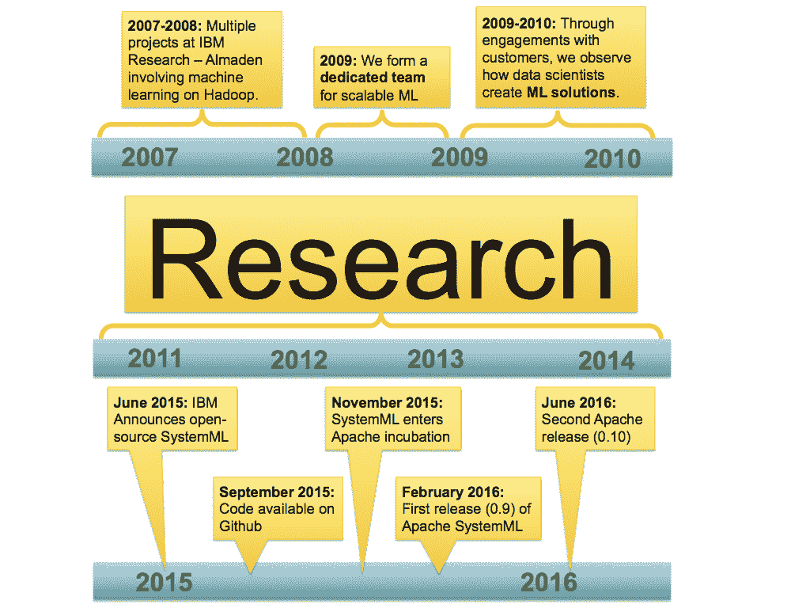
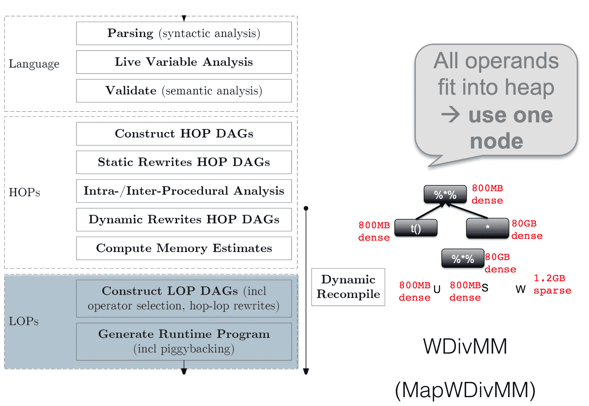

# 六、Apache 系统

到目前为止，我们只介绍了 Apache Spark 标准发行版附带的组件(当然，HDFS、卡夫卡和 Flume 除外)。然而，Apache Spark 也可以作为第三方组件的运行时，使其成为大数据应用的某种操作系统。在这一章中，我们要介绍 Apache SystemML，这是一项惊人的技术，最初是由位于加州的 *IBM Almaden 研究实验室*开发的。Apache SystemML 经历了许多转型阶段，现在已经成为 Apache 顶级项目。

在本章中，我们将涵盖以下主题，以更深入地了解该主题:

*   在 Apache Spark 上使用 SystemML 实现自己的机器学习应用
*   学问...

# 为什么我们只需要另一个图书馆？

为了回答这个问题，我们必须了解一下 SystemML 的历史，它始于十年前的 2007 年，当时是位于加州的 *IBM Almaden 研究实验室*的一个研究项目。该项目是由改善数据科学家工作流程的意图推动的，特别是那些希望改善现有机器学习算法并为其添加功能的科学家。

So, **SystemML** is a declarative markup language that can transparently distribute work on Apache Spark. It supports Scale-up using multithreading and SIMD instructions on CPUs as well as GPUs and also Scale-out using a cluster, and of course, both together.

最后，有一个基于成本的优化器来生成低级别的执行计划，将数据集大小的统计信息考虑在内。换句话说， **Apache SystemML** 是机器学习，什么 Catalyst 和 wow 是数据帧。

# 为什么在 Apache Spark 上？

Apache Spark 解决了很多数据处理和机器学习中常见的问题，所以 Apache SystemML 可以利用这些特性。例如，Apache Spark 支持在通用 RDD 结构之上统一 SQL、Graph、Stream 和机器学习数据处理。

换句话说，它是一个通用的 **DAG** ( **有向无环图**)执行引擎，支持惰性评估和分布式内存缓存。

# Apache 系统的历史

Apache SystemML 已经十年了。当然，它经历了多次重构，现在是世界上最先进、速度最快的机器学习库之一。



正如您在上图中看到的，已经对 Apache SystemML 进行了大量的研究。它比 Apache Spark 大两岁，2017 年已经变成顶级 Apache 项目，留下**孵化器**的地位。甚至在 SystemML 启动期间， *IBM Research Almaden* 的研究人员就意识到，通常情况下，现成的机器学习算法在大型数据集上的表现非常差。

因此，数据分析管道必须在小规模版本原型化后进行调整。下图说明了这一点:


这意味着，数据科学家将使用自己选择的编程语言(很可能是 Matlab、R 或 python)对其应用进行原型化，最后，系统程序员将获得这一原型，并使用 Java 或 Scala 等 JVM 语言重新实现这一原型，这通常会提供更好的性能，并且还可以在 Apache Spark 等数据并行框架上进行线性扩展。

原型的缩放版本将返回整个数据集的结果，数据科学家再次负责修改原型，整个周期再次开始。不仅 IBM Almaden Research 的工作人员经历过这种情况，就连我们的团队也见过。因此，让我们使用 Apache SystemML 让系统程序员变得多余(或者至少只要求他处理我们的 Apache Spark 工作)。

# 基于成本的机器学习算法优化器

让我们从一个例子开始，来举例说明 Apache SystemML 是如何在内部工作的。考虑一个推荐系统。

# 一个例子——交替最小二乘法

推荐系统试图基于来自其他用户的历史来预测用户可能感兴趣的潜在项目。

因此，让我们考虑一个所谓的项目-用户或产品-客户矩阵，如下图所示:


这就是所谓的**稀疏**矩阵，因为只有几个单元格填充了非零值，表示客户 *i* 和产品 *j* 之间的匹配。只需在单元格中输入一个**或任何其他数值，例如，表示购买的产品数量或来自客户 *i* 的特定产品的评级 *j* 。我们把这个矩阵叫做 *r <sub>ui</sub>* ，其中 *u* 代表用户， *i* 代表项目。**

 **熟悉线性代数的人可能知道，任何矩阵都可以被两个更小的矩阵分解。这意味着你必须找到两个矩阵 *p <sub>u</sub>* 和 *q <sub>i</sub>* ，当彼此相乘时，重建原始矩阵*r<sub>ui</sub>*；姑且称之为重构 *r <sub>ui</sub> '* 。目标是找到 *p <sub>u</sub>* 和 *q <sub>i</sub>* 来重构 *r <sub>ui</sub> '* 这样就不会和*r<sub>ui</sub>T31】相差太多。这是使用误差平方和目标来完成的。*

下图说明了这一点和矩阵的稀疏性:


一旦找到好的因素*p<sub>u</sub>T3*q<sub>I</sub>*，我们就可以构建 *r <sub>ui</sub> '* 了，最后会出现新的非零单元格，成为新的预测产品建议。如果你还没有理解所有的细节，不要担心，因为我们不需要太多的这个例子来理解本章的其余部分。*

寻找 *p <sub>u</sub>* 和 *q <sub>i</sub>* 的常见算法称为**交替最小二乘** ( **ALS** ) -交替，因为在每次迭代中优化目标从*p<sub>u</sub>T15】切换到*q<sub>I</sub>T19】，反之亦然。不要太在意它，但这就是它的实际工作方式，在 Apache Spark MLlib 中，这只是一行 Scala 代码:**


这有什么问题吗？在解释这一点之前，我们先来看看 ALS 是如何在统计编程语言中实现的，比如 R:


同样，如果你不理解每一行也不用担心，但是这个图的目的是向你展示，在 R 中，这个算法只需要 27 行代码就可以表达出来。如果我们现在看看 MLlib 中的 ALS 实现，我们会看到它有 800 多行。你可以在[https://github . com/Apache/spark/tree/master/mllib/src/main/Scala/org/Apache/spark/mllib/recommend](https://github.com/apache/spark/tree/master/mllib/src/main/scala/org/apache/spark/mllib/recommendation)找到这个实现。

那么为什么 Spark 上的 Scala 需要 800 多行，R 上只需要 27 行呢？这是因为性能优化。MLlib 中的 ALS 实现由超过 50%的性能优化代码组成。那么，如果我们可以执行以下操作呢？

*   摆脱算法实现中的所有性能优化
*   将我们的 R 代码 1:1 移植到一些并行框架中
*   如果有变化，就改变我们的 R 实现

这就是 Apache SystemML 的作用，它支持所有这些。Apache SystemML 的 **DSL** ( **领域特定语言**)是 R 语法的一个子集，所以你可以只拿前面的例子，在 Apache SystemML 的基础上 1:1 运行它，不需要任何修改。此外，基于成本的性能优化器在 Apache Spark 的基础上生成物理执行计划，以便根据数据的大小属性最大限度地减少执行时间。让我们来看看这是如何工作的。

# ApacheSystemML 架构

所以 Apache SystemML 的关键是优化器。该组件将特定领域语言中算法的高级描述转化为 Apache Spark 上高度优化的物理执行，如下图所示:


# 语言分析

让我们稍微打开这个黑盒，以便了解 Apache SystemML 优化器中到底发生了什么。引擎做的第一件事是 DSL 上的编译步骤。首先是语法检查，然后是实时变量分析，以确定仍然需要哪些中间结果，最后是语义检查。

# 生成高级运算符

一旦通过了上一步，就生成了使用所谓的**高级操作符** ( **HOPs** )的执行计划。这些是从 DSL 的**抽象语法树** ( **AST** )构建的。在此阶段，将进行以下重要的优化步骤:

*   **静态重写**:DSL 提供了一组丰富的语法和语义特性，使得实现易于理解，但可能会导致非最佳执行。Apache SystemML 检测到 AST 的这些分支，并静态地将它们重写为更好的版本，保持语义等价。
*   **动态重写**:动态重写与静态重写非常相似，但是是由考虑数据集大小的基于成本的统计数据驱动的...

# 如何优化低级操作符

让我们来看看，低级运算符是如何被选择和优化的。我们将坚持使用加权除矩阵乘法的例子——一个在 HOP 优化过程之前选择的 HOP，而不是一个普通的矩阵乘法序列。因此，现在出现了一个问题，例如，在 Apache Spark 工作机上并行运行 LOP 的并行版本是否有意义，或者本地执行是否更好。在本例中，Apache SystemML 确定所有中间结果都适合驱动程序节点的主内存，并选择本地运算符 **WDivMM** ，而不是并行运算符 **MapWDivMM** 。下图说明了这一过程:



# 性能测量

那么这些努力值得吗？让我们来看看本地 R 脚本、MLlib 和 Apache SystemML 之间的一些性能比较:


ALS 算法已经使用 R、MLlib 和 ApacheSystemML 在 1.2、12 和 120 GB 大小的不同数据集上运行。我们可以清楚地看到，即使在最小的数据集上，R 也不是一个可行的解决方案，因为它花费了 24 个多小时，我们不确定它是否会完成。在 12 GB 数据集上，我们注意到 ApacheSystemML 的运行速度明显快于 MLlib，最后，在 120 GB 数据集上，MLlib 的 ALS 实现没有在一天内完成，我们给出了...

# Apache SystemML 正在运行

让我们看一个非常简单的例子。让我们用 Apache SystemML DSL——一种类似 R 的语法——创建一个脚本，以便将两个矩阵相乘:

```scala
import org.apache.sysml.api.MLOutput
import org.apache.spark.sql.SQLContext
import org.apache.spark.mllib.util.LinearDataGenerator
import org.apache.sysml.api.MLContext
import org.apache.sysml.runtime.instructions.spark.utils.{RDDConverterUtilsExt => RDDConverterUtils}
import org.apache.sysml.runtime.matrix.MatrixCharacteristics;

val sqlContext = new SQLContext(sc)

val simpleScript =
"""
fileX = "";
fileY = "";
fileZ = "";

X = read (fileX);
Y = read (fileY);

Z = X %*% Y

write (Z,fileZ);
"""
```

然后，我们生成一些测试数据:

```scala
// Generate data
val rawDataX = sqlContext.createDataFrame(LinearDataGenerator.generateLinearRDD(sc, 100, 10, 1))
val rawDataY = sqlContext.createDataFrame(LinearDataGenerator.generateLinearRDD(sc, 10, 100, 1))

// Repartition into a more parallelism-friendly number of partitions
val dataX = rawDataX.repartition(64).cache()
val dataY = rawDataY.repartition(64).cache()
```

为了使用 Apache SystemML，我们必须创建一个`MLContext`对象:

```scala
// Create SystemML context
val ml = new MLContext(sc)
```

现在，我们必须将数据转换为 Apache SystemML 能够理解的格式:

```scala
// Convert data to proper format
val mcX = new MatrixCharacteristics()
val mcY = new MatrixCharacteristics()
val X = RDDConverterUtils.vectorDataFrameToBinaryBlock(sc, dataX, mcX, false, "features")
val Y = RDDConverterUtils.vectorDataFrameToBinaryBlock(sc, dataY, mcY, false, "features")
```

现在，我们将数据`X`和`Y`传递给 Apache SystemML 运行时，并预先注册一个名为`Z`的变量，以便从运行时获得结果:

```scala
// Register inputs & outputs
ml.reset()  
ml.registerInput("X", X, mcX)
ml.registerInput("Y", Y, mcY)
ml.registerOutput("Z")
```

最后，我们用`executeScript`方法实际执行存储在`simpleScript`中的脚本，并从运行时获得结果:

```scala
val outputs = ml.executeScript(simpleScript)

// Get outputs
val Z = outputs.getDF(sqlContext, "Z")
```

现在`Z`包含`DataFrame`与矩阵相乘的结果。搞定了。

# 摘要

您已经了解到，除了 Apache Spark 之外，还有额外的机器学习框架和库的空间，类似于我们已经在 Catalyst 中使用的基于成本的优化器可以大大加快速度。此外，从性能优化代码和算法代码中分离出来有助于算法方面的进一步改进，而不必关心性能。

此外，这些执行计划高度适应数据的大小，也适应基于主内存大小和潜在加速器(如图形处理器)的可用硬件配置。Apache SystemML 极大地改善了机器学习应用的生命周期，尤其是机器学习...**