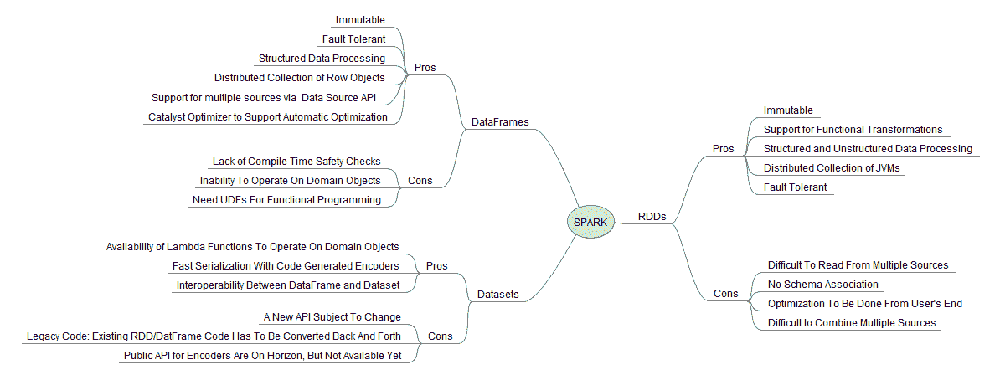
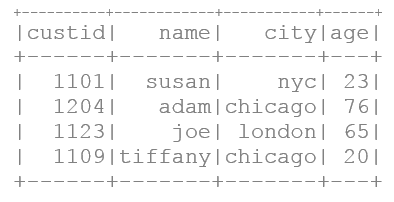
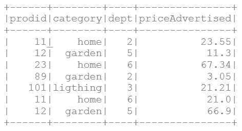
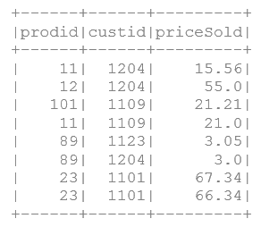
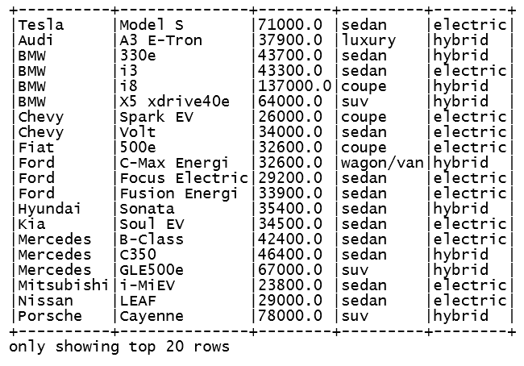

# 十一、Spark 的机器学习三大数据火枪手——完美结合

在本章中，我们将介绍以下食谱:

*   使用内部数据源使用 Spark 2.0 创建关系数据库
*   使用外部数据源使用 Spark 2.0 创建关系数据库
*   使用过滤器()应用编程接口用 Spark 2.0 转换 RDDs
*   用超级有用的平面图转换关系数据库
*   用集合操作 API 转换关系数据库
*   使用 groupBy()和 reduceByKey()进行 RDD 转换/聚合
*   使用 zip()应用编程接口转换 RDDs
*   用成对的键值 rdd 连接转换
*   使用成对键值 rdd 减少和分组转换
*   从 Scala 数据结构创建数据帧
*   在没有 SQL 的情况下以编程方式对数据帧进行操作
*   从外部源加载数据帧和设置...

# 介绍

Spark 高效处理大规模数据的三个主要工具是 RDD、数据框架和数据集应用编程接口。虽然每种方法都有自己的优点，但新的范式转变倾向于将数据集作为统一的数据应用编程接口，以在单个界面中满足所有数据争论的需求。

新的 Spark 2.0 数据集应用编程接口是一个类型安全的域对象集合，可以通过转换(类似于 RDDs 的过滤器、`map`、`flatMap()`等)使用函数或关系操作并行操作。为了向后兼容，数据集有一个名为**数据框**的视图，它是无类型的行的集合。在本章中，我们演示了所有三个应用编程接口集。下图总结了 Spark 用于数据争论的关键组件的优缺点:



出于算法增强或遗留原因，机器学习领域的高级开发人员必须理解并能够毫无问题地使用所有三个应用编程接口集。虽然我们建议每个开发人员都应该向高级数据集应用编程接口迁移，但是您仍然需要知道针对 Spark 核心系统进行编程的 rdd。例如，投资银行和对冲基金阅读机器学习、数学编程、金融、统计或人工智能领域的领先期刊，然后将研究编码在低级 API 中以获得竞争优势，这是非常常见的。

# RDDs -是什么开始了这一切...

RDD 应用编程接口对于 Spark 开发人员来说是一个关键的工具包，因为它支持在函数式编程范例中对数据的低级控制。RDDs 的强大之处也让新程序员更难使用。虽然理解 RDD 应用编程接口和手动优化技术可能很容易(例如，`groupBy()`操作之前的`filter()`，但是编写高级代码需要一致的练习和流畅度。

当数据文件、数据块或数据结构被转换成 RDDs 时，数据被分解成更小的单元，称为**分区**(类似于 Hadoop 中的拆分)，并分布在节点之间，以便它们可以同时并行操作。Spark 提供了这种功能...

# 数据框架——通过高级应用编程接口将应用编程接口和 SQL 结合在一起的自然演变

从伯克利的 AMPlab 时代开始，Spark 开发人员社区就一直努力为社区提供易于使用的高级 API。数据应用编程接口的下一个发展在迈克尔·阿姆布鲁斯特向社区提供 SparkSQL 和 Catalyst 优化器时实现了，这使得使用 Spark 使用简单且易于理解的 SQL 接口实现数据虚拟化成为可能。数据框架应用编程接口是利用 SparkSQL 的自然发展，它将数据组织成像关系表一样的命名列。

数据框架应用编程接口使大量熟悉数据框架或 Python/Pandas 的数据科学家和开发人员可以通过 SQL 进行数据争论。DataFrame)。

# 数据集——一个高级统一数据应用编程接口

数据集是不可变的对象集合，这些对象被建模/映射到传统的关系模式。有四个属性使它成为未来的首选方法。我们特别发现数据集应用编程接口很有吸引力，因为我们发现它对具有常用转换运算符(例如，`filter()`、`map()`、`flatMap()`等)的关系数据库很熟悉。数据集将遵循类似于 RDD 的惰性执行范例。试图协调数据框和数据集的最佳方式是将数据框视为别名，可以将其视为`Dataset[Row]`。

*   **强类型安全**:我们现在在统一的 Data API 中既有编译时(语法错误)又有运行时安全，这有助于 ML 开发人员...

# 使用内部数据源使用 Spark 2.0 创建关系数据库

在 Spark 中创建 rdd 有四种方法。它们的范围从用于在客户端驱动程序代码中进行简单测试和调试的`parallelize()`方法到用于近乎实时响应的流式 rdd。在这个食谱中，我们为您提供了几个例子来展示 RDD 创造使用内部资源。

# 怎么做...

1.  在 IntelliJ 或您选择的 IDE 中启动一个新项目。确保包含必要的 JAR 文件。

2.  设置程序将驻留的包位置:

```scala
package spark.ml.cookbook.chapter3
```

3.  导入必要的包:

```scala
import breeze.numerics.pow 
import org.apache.spark.sql.SparkSession 
import Array._
```

4.  导入`log4j`设置日志级别的包。这一步是可选的，但是我们强烈建议您这样做(在开发周期中适当地更改级别)。

```scala
import org.apache.log4j.Logger 
import org.apache.log4j.Level 
```

5.  将日志级别设置为警告和错误，以减少输出。有关包要求，请参见上一步。

```scala
Logger.getLogger("org").setLevel(Level.ERROR) ...
```

# 它是如何工作的...

客户端驱动程序中保存的数据被并行化，并以部分 rdd 的数量(第二个参数)为指导在集群中分布。由此产生的 RDD 是启动这一切的 Spark 的魔力(参考 Matei Zaharia 的原始白皮书)。

生成的关系数据库现在是完全分布式的数据结构，具有容错性和沿袭性，可以使用 Spark 框架并行操作。

我们将一个文本文件`A Tale of Two Cities by Charles Dickens`从[http://www.gutenberg.org/](http://www.gutenberg.org/)读入 Spark RDDs。然后，我们继续对数据进行拆分和标记，并使用 Spark 的运算符(例如，`map`、`flatMap()`等)打印总字数。

# 使用外部数据源使用 Spark 2.0 创建关系数据库

在这个食谱中，我们为您提供了几个例子来展示 RDD 创造使用外部资源。

# 怎么做...

1.  在 IntelliJ 或您选择的 IDE 中启动一个新项目。确保包含必要的 JAR 文件。

2.  设置程序将驻留的包位置:

```scala
package spark.ml.cookbook.chapter3 
```

3.  导入必要的包:

```scala
import breeze.numerics.pow 
import org.apache.spark.sql.SparkSession 
import Array._
```

4.  导入`log4j`设置日志级别的包。这一步是可选的，但是我们强烈建议您这样做(在开发周期中适当地更改级别)。

```scala
import org.apache.log4j.Logger 
import org.apache.log4j.Level 
```

5.  将日志级别设置为警告和错误，以减少输出。有关包要求，请参见上一步。

```scala
Logger.getLogger("org").setLevel(Level.ERROR) 
Logger.getLogger("akka").setLevel(Level.ERROR) 
```

6.  设置 Spark 上下文和应用参数，以便 Spark 可以运行。

```scala
val spark = SparkSession 
  .builder 
  .master("local[*]") 
  .appName("myRDD") 
  .config("Spark.sql.warehouse.dir", ".") 
  .getOrCreate()
```

7.  我们从古腾堡计划中获得数据。这是访问真实文本的一个很好的来源，从莎士比亚全集到查尔斯·狄更斯全集。

8.  从以下来源下载文本，并将其存储在本地目录中:
    *   来源:[http://www.gutenberg.org](http://www.gutenberg.org)
    *   精选书籍:*查尔斯·狄更斯的双城记*
    *   网址:[http://www.gutenberg.org/cache/epub/98/pg98.txt](http://www.gutenberg.org/cache/epub/98/pg98.txt)

9.  我们再次使用通过`SparkSession`提供的`SparkContext`及其功能`textFile()`来读取外部数据源，并在集群中对其进行并行化。值得注意的是，所有的工作都是通过 Spark 在幕后为开发人员完成的，Spark 使用一次调用来加载各种格式(例如，文本、S3 和 HDFS)，它使用`protocol:filepath`组合在集群中并行处理数据。

10.  为了演示，我们从`SparkContext`通过`SparkSession`使用`textFile()`方法加载存储为 ASCII 文本的书，该书转而在幕后工作，并在集群中创建部分关系数据库。

```scala
val book1 = spark.sparkContext.textFile("../data/sparkml2/chapter3/a.txt") 
```

输出如下:

```scala
Number of lines = 16271
```

11.  尽管我们还没有介绍 Spark 转换操作符，但我们将看一个小代码片段，它将使用空格作为分隔符将文件分解成单词。在现实生活中，需要一个正则表达式来覆盖所有空白变化的边缘情况(参考本章中的*使用过滤器用 Spark 转换 RDDs()APIS*方法)。
    *   我们使用 lambda 函数来接收每一行，并使用空格作为分隔符将其拆分成单词。
    *   我们使用平面图来分解单词列表的数组(也就是说，一行中的每组单词对应于该行的不同数组/列表)。简而言之，我们想要的是一个单词列表，而不是每行一个单词列表。

```scala
val book2 = book1.flatMap(l => l.split(" ")) 
println(book1.count())
```

输出如下:

```scala
Number of words = 143228  
```

# 它是如何工作的...

我们将文本文件`A Tale of Two Cities by Charles Dickens`从[http://www.gutenberg.org/](http://www.gutenberg.org/)读入 RDD，然后使用 RDD 本身的`.split()`和`.flatmap()`在 lambda 表达式中使用空白作为分隔符来标记单词。然后，我们继续使用 RDDs 的`.count()`方法来输出总字数。虽然这很简单，但您必须记住，操作是使用 Spark 的分布式并行框架进行的，只有几行代码。

# 还有更多...

使用外部数据源创建 RDD，无论是文本文件、Hadoop HDFS、序列文件、Casandra 还是 Parquet 文件，都非常简单。我们再次使用`SparkSession`(【Spark 2.0 之前的 T1】)来获得集群的句柄。一旦函数(例如，文本文件协议:文件路径)被执行，数据被分解成更小的片段(分区)并自动流向集群，集群作为可并行操作的容错分布式集合可供计算使用。

1.  在处理现实生活中的情况时，必须考虑许多变化。根据我们自己的经验，最好的建议是在编写自己的函数或连接器之前参考文档。Spark 要么开箱即用地支持您的数据源，要么供应商有一个可以下载的连接器来做同样的事情。
2.  我们经常看到的另一种情况是，生成了许多小文件(通常在`HDFS`目录内)，需要并行化为 RDDs 进行消费。`SparkContext`有一个名为`wholeTextFiles()`的方法，可以让你读取一个包含多个文件的目录，并将每个文件作为(文件名，内容)键值对返回。我们发现这在使用 lambda 架构的多阶段机器学习情况下非常有用，在这种情况下，模型参数以批处理的形式计算，然后每天在 Spark 中更新。

在这个例子中，我们读取多个文件，然后打印第一个文件进行检查。

`spark.sparkContext.wholeTextFiles()`功能用于读取大量小文件，并将其表示为(K，V)或键值:

```scala
val dirKVrdd = spark.sparkContext.wholeTextFiles("../data/sparkml2/chapter3/*.txt") // place a large number of small files for demo 
println ("files in the directory as RDD ", dirKVrdd) 
println("total number of files ", dirKVrdd.count()) 
println("Keys ", dirKVrdd.keys.count()) 
println("Values ", dirKVrdd.values.count()) 
dirKVrdd.collect() 
println("Values ", dirKVrdd.first()) 
```

在运行前面的代码时，您将获得以下输出:

```scala
    files in the directory as RDD ,../data/sparkml2/chapter3/*.txt
    WholeTextFileRDD[10] at wholeTextFiles at myRDD.scala:88)
    total number of files 2
    Keys ,2
    Values ,2
    Values ,(file:/C:/spark-2.0.0-bin-hadoop2.7/data/sparkml2/chapter3/a.txt,
    The Project Gutenberg EBook of A Tale of Two Cities, 
    by Charles Dickens

```

# 请参见

`textFile()`和`wholeTextFiles()`功能的 Spark 文件:

[http://spark . Apache . org/docs/latest/API/Scala/index . html # org . Apache . spark . sparkcontext](http://spark.apache.org/docs/latest/api/scala/index.html#org.apache.spark.SparkContext)

`textFile()`应用编程接口是与外部数据源接口的单一抽象。协议/路径的公式足以调用正确的解码器。我们将演示从 ASCII 文本文件、亚马逊 AWS S3 和 HDFS 读取代码片段，用户可以利用这些代码片段来构建自己的系统。

*   该路径可以表示为一个简单的路径(例如，本地文本文件)到一个具有所需协议的完整 URI(例如，s3n 用于 AWS 存储桶)以完成服务器和端口配置的资源路径(例如，从 Hadoop 集群中读取 HDFS 文件)。...

# 使用过滤器()应用编程接口用 Spark 2.0 转换 RDDs

在本食谱中，我们探索了 RDD 的`filter()`方法，该方法用于选择基本 RDD 的子集，并返回新的过滤后的 RDD。格式类似于`map()`，但是λ函数选择哪些成员将被包括在结果 RDD 中。

# 怎么做...

1.  在 IntelliJ 或您选择的 IDE 中启动一个新项目。确保包含必要的 JAR 文件。

2.  设置程序将驻留的包位置:

```scala
package spark.ml.cookbook.chapter3
```

3.  导入必要的包:

```scala
import breeze.numerics.pow 
import org.apache.spark.sql.SparkSession 
import Array._
```

4.  导入用于设置`log4j`日志级别的包。这一步是可选的，但是我们强烈建议您这样做(在开发周期中适当地更改级别)。

```scala
import org.apache.log4j.Logger 
import org.apache.log4j.Level 
```

5.  将日志级别设置为警告和错误，以减少输出。有关包要求，请参见上一步。

```scala
Logger.getLogger("org").setLevel(Level.ERROR) ...
```

# 它是如何工作的...

`filter()` API 通过几个例子进行了演示。在第一个例子中，我们经历了一个 RDD 过程，并通过使用λ表达式`.filter ( i => (i%2) == 1)`输出奇数，该表达式利用了 mod(模数)函数。

在第二个例子中，我们通过使用λ表达式`num.map(pow(_,2)).filter(_ %2 == 1)`将结果映射到一个平方函数，使它变得有点有趣。

在第三个示例中，我们浏览了文本，并使用 lambda 表达式`.filter(_.length < 30).filter(_.length > 0)`过滤掉了短行(例如，30 个字符以下的行)，以打印相对于总行数(`.count()`)的短行作为输出。

# 还有更多...

`filter()`应用编程接口遍历并行化的分布式集合(即 RDDs)，并将提供给`filter()`的选择标准作为λ应用，以便从结果 RDD 中包含或排除该元素。组合使用`map()`，变换每个元素，`filter()`，选择一个子集，是 Spark ML 编程中强大的组合。

稍后我们将看到`DataFrame`应用编程接口如何使用类似的`Filter()`应用编程接口，使用 R 和 Python(熊猫)中使用的更高级框架来实现相同的效果。

# 请参见

*   RDD 的方法调用`.filter()`的文档可在[上获得。](http://spark.apache.org/docs/2.0.0/api/scala/index.html#org.apache.spark.api.java.JavaRDD)
*   `BloomFilter()`的文档-为了完整起见，请注意还有一个 bloom filter 函数已经存在，建议您避免自己编码。同样的链接是。

# 用超级有用的平面图转换关系数据库

在这个食谱中，我们考察了`flatMap()`法，这往往是初学者困惑的来源；然而，在更仔细的检查中，我们证明了这是一个清晰的概念，它像 map 一样将 lambda 函数应用于每个元素，然后将生成的 RDD 展平为一个单一的结构(我们创建了一个由所有子列表和子列表元素组成的单一列表，而不是列表列表)。

# 怎么做...

1.  在 IntelliJ 或您选择的 IDE 中启动一个新项目。确保包含必要的 JAR 文件。

2.  设置程序将驻留的包位置

```scala
package spark.ml.cookbook.chapter3 
```

3.  导入必要的包

```scala
import breeze.numerics.pow 
import org.apache.spark.sql.SparkSession 
import Array._
```

4.  导入用于设置`log4j`日志级别的包。这一步是可选的，但是我们强烈建议您这样做(在开发周期中适当地更改级别)。

```scala
import org.apache.log4j.Logger 
import org.apache.log4j.Level 
```

5.  将日志级别设置为警告和错误，以减少输出。有关包要求，请参见上一步。

```scala
Logger.getLogger("org").setLevel(Level.ERROR) 
Logger.getLogger("akka").setLevel(Level.ERROR) 
```

6.  设置 Spark 上下文和应用参数，以便 Spark 可以运行。

```scala
val spark = SparkSession 
  .builder 
  .master("local[*]") 
  .appName("myRDD") 
  .config("Spark.sql.warehouse.dir", ".") 
  .getOrCreate() 
```

7.  我们使用`textFile()`函数从我们之前从[http://www.gutenberg.org/cache/epub/98/pg98.txt](http://www.gutenberg.org/cache/epub/98/pg98.txt)下载的文本文件中创建初始(即，RDD 基地):

```scala
val book1 = spark.sparkContext.textFile("../data/sparkml2/chapter3/a.txt")
```

8.  我们将映射函数应用于 RDDs，以演示`map()`函数转换。首先，我们用错误的方式来表达一个观点:我们首先尝试基于正则表达式 *[\s\W]+]* 来分离所有单词，仅使用`map()`来演示结果 RDD 是一个列表列表，其中每个列表对应于一行以及该行中的标记化单词。这个例子演示了在使用`flatMap()`时会给初学者造成什么困惑。

9.  下面一行修剪每一行，然后将该行拆分成单词。最终得到的 RDD(即单词 RDD2)将是一个单词列表，而不是整个文件的单个单词列表。

```scala
val wordRDD2 = book1.map(_.trim.split("""[\s\W]+""") ).filter(_.length > 0) 
wordRDD2.take(3)foreach(println(_)) 
```

在运行前面的代码时，您将获得以下输出。

```scala
[Ljava.lang.String;@1e60b459
[Ljava.lang.String;@717d7587
[Ljava.lang.String;@3e906375
```

10.  我们使用`flatMap()`方法不仅绘制地图，而且将列表展平，这样我们就得到一个由单词本身组成的 RDD。我们修剪和拆分单词(即标记化)，然后过滤大于零的单词，然后将其映射到大写。

```scala
val wordRDD3 = book1.flatMap(_.trim.split("""[\s\W]+""") ).filter(_.length > 0).map(_.toUpperCase()) 
println("Total number of lines = ", book1.count()) 
println("Number of words = ", wordRDD3.count()) 
```

在这种情况下，使用`flatMap()`展平列表后，我们可以如预期的那样获得单词的列表。

```scala
wordRDD3.take(5)foreach(println(_)) 
```

输出如下:

```scala
Total number of lines = 16271
Number of words = 141603
THE
PROJECT
GUTENBERG
EBOOK
OF  
```

# 它是如何工作的...

在这个简短的例子中，我们读取一个文本文件，然后使用`flatMap(_.trim.split("""[\s\W]+""")` lambda 表达式分割单词(也就是标记化它)，从而得到一个包含标记化内容的 RDD。此外，我们使用`filter ()`应用编程接口`filter(_.length > 0)`来排除空行，并在输出结果之前使用`.map()`应用编程接口中的λ表达式`.map(_.toUpperCase())`来映射到大写。

在某些情况下，我们不希望得到 RDD 基的每个元素的列表(例如，得到对应于一行的单词的列表)。我们有时更喜欢单一的扁平列表，它是扁平的，并且对应于文档中的每个单词。简而言之，我们想要的不是一个列表，而是一个包含...

# 还有更多...

函数`glom()`是一个让你把 RDD 中的每个分区建模成一个数组而不是一个行列表的函数。虽然在大多数情况下可以产生结果，但是`glom()`允许您减少分区之间的洗牌。

从表面上看，下面文本中提到的方法 1 和 2 在计算 RDD 中的最小数字时看起来都很相似，`glom()`函数首先将`min()`应用于所有分区，然后发送结果数据，从而减少网络中的数据移动。最好的方法是在 10M+rdd 上使用这个，并相应地观察 IO 和 CPU 的使用情况。

*   第一种方法是不用`glom()`求最小值:

```scala
val minValue1= numRDD.reduce(_ min _) 
println("minValue1 = ", minValue1)
```

在运行前面的代码时，您将获得以下输出:

```scala
minValue1 = 1.0
```

*   第二种方法是使用`glom(`找到最小值，这导致局部应用 min 函数到一个分区，然后通过一个洗牌发送结果。

```scala
val minValue2 = numRDD.glom().map(_.min).reduce(_ min _) 
println("minValue2 = ", minValue2) 
```

在运行前面的代码时，您将获得以下输出:

```scala
minValue1 = 1.0  
```

# 请参见

*   `flatMap()`、`PairFlatMap()`和 RDD 的其他变体的文档可在[上获得](http://spark.apache.org/docs/latest/api/scala/index.html#org.apache.spark.api.java.JavaRDD)
*   RDD 下`FlatMap()`功能的文档可在[上获得](http://spark.apache.org/docs/2.0.0/api/scala/index.html#org.apache.spark.api.java.function.FlatMapFunction)
*   `PairFlatMap()`函数的文档-配对数据元素的非常方便的变体可以在[上找到](http://spark.apache.org/docs/2.0.0/api/scala/index.html#org.apache.spark.api.java.function.PairFlatMapFunction)
*   `flatMap()`方法将提供的函数(lambda 或通过 def 命名的函数)应用于每个元素，展平结构，并产生新的 RDD。

# 用集合操作 API 转换关系数据库

在这个食谱中，我们探索了 RDDs 上的集合操作，例如`intersection()`、`union()`、`subtract(),`和`distinct()`以及`Cartesian()`。让我们以分布式方式实现通常的集合操作。

# 怎么做...

1.  在 IntelliJ 或您选择的 IDE 中启动一个新项目。确保包含必要的 JAR 文件。

2.  设置程序将驻留的包位置

```scala
package spark.ml.cookbook.chapter3
```

3.  导入必要的包

```scala
import breeze.numerics.pow 
import org.apache.spark.sql.SparkSession 
import Array._
```

4.  导入用于设置`log4j`日志级别的包。这一步是可选的，但是我们强烈建议您这样做(在开发周期中适当地更改级别)。

```scala
import org.apache.log4j.Logger 
import org.apache.log4j.Level 
```

5.  将日志级别设置为警告和错误，以减少输出。有关包要求，请参见上一步。

```scala
Logger.getLogger("org").setLevel(Level.ERROR) ...
```

# 它是如何工作的...

在这个例子中，我们从三组数字数组(奇数、偶数和它们的组合)开始，然后将它们作为参数传递给集合操作应用编程接口。我们介绍了如何使用`intersection()`、`union()`、`subtract()`、`distinct()`和`cartesian()` RDD 运算符。

# 请参见

虽然 RDD 集操作符很容易使用，但必须小心 Spark 在后台执行的数据洗牌，以完成其中一些操作(例如，交集)。

值得注意的是，union 运算符不会从生成的 RDD 集中移除重复项。

# 使用 groupBy()和 reduceByKey()进行 RDD 转换/聚合

在这个食谱中，我们探索了`groupBy()`和`reduceBy()`方法，它们允许我们将一个键对应的值分组。由于内部洗牌，这是一个昂贵的操作。我们首先更详细地演示`groupby()`，然后介绍`reduceBy()`来展示编码的相似性，同时强调`reduceBy()`运算符的优势。

# 怎么做...

1.  在 IntelliJ 或您选择的 IDE 中启动一个新项目。确保包含必要的 JAR 文件。

2.  设置程序将驻留的包位置:

```scala
package spark.ml.cookbook.chapter3 
```

3.  导入必要的包:

```scala
import breeze.numerics.pow 
import org.apache.spark.sql.SparkSession 
import Array._
```

4.  导入用于设置`log4j`日志级别的包。此步骤是可选的，但我们强烈建议您这样做(在开发周期中适当更改级别):

```scala
import org.apache.log4j.Logger 
import org.apache.log4j.Level 
```

5.  将日志级别设置为警告和错误，以减少输出。有关包要求，请参见上一步。

```scala
Logger.getLogger("org").setLevel(Level.ERROR) ...
```

# 它是如何工作的...

在这个例子中，我们创建了数字 1 到 12，并将它们放在三个分区中。然后，我们继续使用简单的 mod 操作将它们分成奇数/偶数。`groupBy()`用于将它们聚合成两组奇数/偶数。这是一个典型的聚合问题，对于 SQL 用户来说应该很熟悉。在本章的后面，我们将使用`DataFrame`重新讨论这个操作，它也利用了 SparkSQL 引擎提供的更好的优化技术。在后面的部分，我们演示了`groupBy()`和`reduceByKey()`的相似之处。我们设置了一组字母(即`a`和`b`)，然后将它们转换成 RDD。然后，我们根据关键字(即唯一的字母，在本例中只有两个)对它们进行聚合，并打印每组中的总数。

# 还有更多...

鉴于 Spark 的方向更倾向于数据集/数据帧范例而非低级 RDD 编码，人们必须认真考虑在 RDD 上进行`groupBy()`的理由。虽然存在需要操作的合法情况，但建议读者重新制定他们的解决方案，以利用名为 **Catalyst** 的 SparkSQL 子系统及其优化器。

Catalyst 优化器在构建优化的查询计划时会考虑 Scala 强大的功能，例如**模式匹配**和**准引号**。

*   Scala 模式匹配的文档可以在[http://docs . Scala-lang . org/教程/教程/模式匹配. html](http://docs.scala-lang.org/tutorials/tour/pattern-matching.html) 上找到
*   斯卡拉准引号的文档可在 http://docs.scala-lang.org/overviews/quasiquotes/intro.html 获得...

# 请参见

RDD 的`groupBy()`和`reduceByKey()`操作文件:

[http://spark . Apache . org/docs/latest/API/Scala/index . html # org . Apache . spark . API . Java . javaardd](http://spark.apache.org/docs/latest/api/scala/index.html#org.apache.spark.api.java.JavaRDD)

# 使用 zip()应用编程接口转换 RDDs

在本食谱中，我们探索`zip()`功能。对于我们这些在 Python 或 Scala 中工作的人来说，`zip()`是一种熟悉的方法，它允许您在应用内联函数之前对项目进行配对。使用 Spark，它可以用来促进配对之间的 RDD 运算。从概念上讲，它将两个 RDD 组合在一起，使得一个 RDD 的每个成员与占据相同位置的第二个 RDD 配对(也就是说，它将两个 rdd 排成一行，并将成员配对)。

# 怎么做...

1.  在 IntelliJ 或您选择的 IDE 中启动一个新项目。确保包含必要的 JAR 文件。

2.  设置程序将驻留的包位置

```scala
package spark.ml.cookbook.chapter3 
```

3.  导入必要的包

```scala
    import org.apache.spark.sql.SparkSession 
```

4.  导入用于设置`log4j`日志级别的包。这一步是可选的，但是我们强烈建议您这样做(在开发周期中适当地更改级别)。

```scala
import org.apache.log4j.Logger 
import org.apache.log4j.Level 
```

5.  将日志级别设置为警告和错误，以减少输出。有关包要求，请参见上一步。

```scala
Logger.getLogger("org").setLevel(Level.ERROR) 
Logger.getLogger("akka").setLevel(Level.ERROR) 
```

6.  设置 Spark 上下文和应用参数，以便 Spark 可以运行。

```scala
val spark = SparkSession 
.builder 
.master("local[*]") 
.appName("myRDD") 
.config("Spark.sql.warehouse.dir", ".") 
.getOrCreate() 
```

7.  以 RDD 为例建立数据结构。在这个例子中，我们从`Array[]`创建两个 rdd，让 Spark 决定分区的数量(也就是说，`parallize()`方法中的第二个参数没有设置)。

```scala
val SignalNoise: Array[Double] = Array(0.2,1.2,0.1,0.4,0.3,0.3,0.1,0.3,0.3,0.9,1.8,0.2,3.5,0.5,0.3,0.3,0.2,0.4,0.5,0.9,0.1) 
val SignalStrength: Array[Double] = Array(6.2,1.2,1.2,6.4,5.5,5.3,4.7,2.4,3.2,9.4,1.8,1.2,3.5,5.5,7.7,9.3,1.1,3.1,2.1,4.1,5.1) 
val parSN=spark.sparkContext.parallelize(SignalNoise) // parallelized signal noise RDD 
val parSS=spark.sparkContext.parallelize(SignalStrength)  // parallelized signal strength 
```

8.  我们将`zip()`函数应用于 RDDs 来演示转换。在这个例子中，我们采用范围的分区 RDD，并使用 mod 函数将它们标记为奇数/偶数。我们使用`zip()`函数将两个 RDD(信号噪声 RDD 和信号强度 RDD)中的元素配对，这样我们就可以应用`map()`函数并计算它们的比值(信噪比)。我们可以使用这种技术来执行几乎所有类型的算术或非算术运算，包括两个 rdd 的单个成员。

9.  两个 RDD 成员的配对充当元组或行。由`zip()`创建的配对的单个成员可以通过他们的位置来访问(例如，`._1`和`._2`

```scala
val zipRDD= parSN.zip(parSS).map(r => r._1 / r._2).collect() 
println("zipRDD=") 
zipRDD.foreach(println) 
```

在运行前面的代码时，您将获得以下输出:

```scala
zipRDD=
0.03225806451612903
1.0
0.08333333333333334
0.0625
0.05454545454545454  
```

# 它是如何工作的...

在这个例子中，我们首先设置两个代表信号噪声和信号强度的数组。它们只是一组我们本可以从物联网平台获得的测量数据。然后，我们将两个独立的数组配对，这样每个成员看起来就像是最初作为一对(x，y)输入的。然后，我们继续对该对进行分频，并使用以下代码片段产生信噪比:

```scala
val zipRDD= parSN.zip(parSS).map(r => r._1 / r._2) 
```

`zip()`方法有许多涉及分区的变体。开发人员应该熟悉带有分区的`zip()`方法的变体(例如，`zipPartitions`)。

# 请参见

*   RDD 旗下`zip()`和`zipPartitions()`运营的文档可在[上获得](http://spark.apache.org/docs/latest/api/scala/index.html#org.apache.spark.api.java.JavaRDD)

# 用成对的键值 rdd 连接转换

在本食谱中，我们介绍了`KeyValueRDD`对 RDD 和支持的加入操作，如`join()`、`leftOuterJoin`和`rightOuterJoin()`、`fullOuterJoin()`，作为通过设置操作应用编程接口提供的更传统、更昂贵的设置操作的替代，如`intersection()`、`union()`、`subtraction()`、`distinct()`、`cartesian()`等。

我们将演示`join()`、`leftOuterJoin`和`rightOuterJoin()`以及`fullOuterJoin()`，以解释键值对 rdd 的强大和灵活性。

```scala
println("Full Joined RDD = ") 
val fullJoinedRDD = keyValueRDD.fullOuterJoin(keyValueCity2RDD) 
fullJoinedRDD.collect().foreach(println(_)) 
```

# 怎么做...

1.  以 RDD 为例设置数据结构:

```scala
val keyValuePairs = List(("north",1),("south",2),("east",3),("west",4)) 
val keyValueCity1 = List(("north","Madison"),("south","Miami"),("east","NYC"),("west","SanJose")) 
val keyValueCity2 = List(("north","Madison"),("west","SanJose"))
```

2.  将列表转化为关系数据库:

```scala
val keyValueRDD = spark.sparkContext.parallelize(keyValuePairs) 
val keyValueCity1RDD = spark.sparkContext.parallelize(keyValueCity1) 
val keyValueCity2RDD = spark.sparkContext.parallelize(keyValueCity2) 
```

3.  我们可以访问一对 RDD 里面的`keys`和`values`。

```scala
val keys=keyValueRDD.keys 
val values=keyValueRDD.values 
```

4.  我们将`mapValues()`函数应用于成对的 rdd 来演示转换。在本例中，我们使用 map 函数通过向每个元素添加 100 来提升值。这是一种将噪声引入数据的流行技术(即抖动)。

```scala
val kvMappedRDD = keyValueRDD.mapValues(_+100) 
kvMappedRDD.collect().foreach(println(_)) 
```

在运行前面的代码时，您将获得以下输出:

```scala
(north,101)
(south,102)
(east,103)
(west,104)

```

5.  我们将`join()`函数应用于 RDDs 来演示转换。我们使用`join()`来加入两个 RDD。我们基于键(即北、南等)加入两个 rdd。

```scala
println("Joined RDD = ") 
val joinedRDD = keyValueRDD.join(keyValueCity1RDD) 
joinedRDD.collect().foreach(println(_)) 
```

在运行前面的代码时，您将获得以下输出:

```scala
(south,(2,Miami))
(north,(1,Madison))
(west,(4,SanJose))
(east,(3,NYC))
```

6.  我们将`leftOuterJoin()`函数应用于 RDDs 来演示转换。`leftOuterjoin`就像一个关系左外连接。Spark 用`None`而不是关系系统中常见的`NULL`来代替没有成员资格。

```scala
println("Left Joined RDD = ") 
val leftJoinedRDD = keyValueRDD.leftOuterJoin(keyValueCity2RDD) 
leftJoinedRDD.collect().foreach(println(_)) 
```

在运行前面的代码时，您将获得以下输出:

```scala
(south,(2,None))
(north,(1,Some(Madison)))
(west,(4,Some(SanJose)))
(east,(3,None))

```

7.  我们将把`rightOuterJoin()`应用于 rdd 来演示转换。这类似于关系系统中的右外连接。

```scala
println("Right Joined RDD = ") 
val rightJoinedRDD = keyValueRDD.rightOuterJoin(keyValueCity2RDD) 
rightJoinedRDD.collect().foreach(println(_)) 
```

在运行前面的代码时，您将获得以下输出:

```scala
(north,(Some(1),Madison))
(west,(Some(4),SanJose))  
```

8.  然后，我们将`fullOuterJoin()`函数应用于 RDDs 来演示转换。这类似于关系系统中的完全外部连接。

```scala
val fullJoinedRDD = keyValueRDD.fullOuterJoin(keyValueCity2RDD) 
fullJoinedRDD.collect().foreach(println(_)) 
```

在运行前面的代码时，您将获得以下输出:

```scala
Full Joined RDD = 
(south,(Some(2),None))
(north,(Some(1),Some(Madison)))
(west,(Some(4),Some(SanJose)))
(east,(Some(3),None))
```

# 它是如何工作的...

在这个配方中，我们声明了三个列表，表示关系表中可用的典型数据，可以使用连接器将其导入到 Casandra 或红移(这里没有显示以简化配方)。我们使用了三个列表中的两个来表示城市名称(即数据表)，并将它们与第一个列表连接起来，第一个列表表示方向(例如，定义表)。第一步是定义成对值的三个列表。然后，我们将它们并行化为键值 RDD，这样我们就可以在第一个 RDD(即方向)和代表城市名称的另外两个 rdd 之间执行连接操作。我们将连接函数应用于 RDDs 来演示转换。

我们演示了`join()`、`leftOuterJoin`和`rightOuterJoin() ...`

# 还有更多...

`join()`及其在 RDD 的变体的文档可在[上获得。](http://spark.apache.org/docs/latest/api/scala/index.html#org.apache.spark.api.java.JavaRDD)

# 使用成对键值 rdd 减少和分组转换

在这个食谱中，我们探索减少和分组的关键。在大多数情况下，`reduceByKey()`和`groupbyKey()`操作比`reduce()`和`groupBy()`更有效，更受青睐。这些函数提供了方便的工具来聚合值并通过键组合它们，而较少的洗牌，这在大型数据集上是有问题的。

# 怎么做...

1.  在 IntelliJ 或您选择的 IDE 中启动一个新项目。确保包含必要的 JAR 文件。

2.  设置程序将驻留的包位置

```scala
package spark.ml.cookbook.chapter3
```

3.  导入必要的包

```scala
import org.apache.spark.sql.SparkSession 
```

4.  导入用于设置`log4j`日志级别的包。这一步是可选的，但是我们强烈建议您这样做(在开发周期中适当地更改级别)。

```scala
import org.apache.log4j.Logger 
import org.apache.log4j.Level 
```

5.  将日志级别设置为警告和错误，以减少输出。有关包装要求，请参见上一步:

```scala
Logger.getLogger("org").setLevel(Level.ERROR) 
Logger.getLogger("akka").setLevel(Level.ERROR)
```

6.  设置 Spark 上下文和应用参数，以便 Spark 可以运行。

```scala
val spark = SparkSession 
  .builder 
  .master("local[*]") 
  .appName("myRDD") 
  .config("Spark.sql.warehouse.dir", ".") 
  .getOrCreate() 
```

7.  以 RDD 为例设置数据结构:

```scala
val signaltypeRDD = spark.sparkContext.parallelize(List(("Buy",1000),("Sell",500),("Buy",600),("Sell",800))) 
```

8.  我们应用`groupByKey()`来演示转换。在这个例子中，我们将所有买卖信号组合在一起，同时在分布式环境中操作。

```scala
val signaltypeRDD = spark.sparkContext.parallelize(List(("Buy",1000),("Sell",500),("Buy",600),("Sell",800))) 
val groupedRDD = signaltypeRDD.groupByKey() 
groupedRDD.collect().foreach(println(_)) 
```

在运行前面的代码时，您将获得以下输出:

```scala
Group By Key RDD = 
(Sell, CompactBuffer(500, 800))
(Buy, CompactBuffer(1000, 600))
```

9.  我们将`reduceByKey()`函数应用于这对 rdd 来演示转换。在这个例子中，函数是，总结买入和卖出信号的总量。`(_+_)`的 Scala 符号简单地表示同时添加两个成员并从中产生一个结果。就像`reduce()`一样，我们可以应用任何函数(也就是说，对于简单的函数是内联的，对于更复杂的情况是命名函数)。

```scala
println("Reduce By Key RDD = ") 
val reducedRDD = signaltypeRDD.reduceByKey(_+_) 
reducedRDD.collect().foreach(println(_))   
```

在运行前面的代码时，您将获得以下输出:

```scala
Reduce By Key RDD = 
(Sell,1300)
(Buy,1600)  
```

# 它是如何工作的...

在这个例子中，我们声明了一个正在出售或购买的物品列表以及它们相应的价格(也就是典型的商业交易)。然后，我们继续使用 Scala 简写符号`(_+_)`计算总和。在最后一步中，我们提供了每个关键组(即`Buy`或`Sell`)的总数。键值 RDD 是一个强大的构造，可以减少编码，同时提供将成对的值分组到聚合桶中所需的功能。`groupByKey()`和`reduceByKey()`功能模拟了相同的聚合功能，而`reduceByKey()`由于在组装最终结果时较少的数据洗牌，因此效率更高。

# 请参见

RDD 的`groupByKey()`和`reduceByKey()`运营文件可在[上获得。](http://spark.apache.org/docs/latest/api/scala/index.html#org.apache.spark.api.java.JavaRDD)

# 从 Scala 数据结构创建数据帧

在这个食谱中，我们探索了`DataFrame` API，它为处理数据提供了比 RDDs 更高的抽象级别。该应用编程接口类似于 R 和 Python 数据框架工具(熊猫)。

`DataFrame`简化了编码，并允许您使用标准的 SQL 来检索和操作数据。Spark 保留了关于数据帧的附加信息，这有助于应用编程接口轻松操作这些帧。每个`DataFrame`都有一个模式(从数据中推断或显式定义)，允许我们像查看一个 SQL 表一样查看框架。SparkSQL 和 DataFrame 的秘密在于 catalyst 优化器将在幕后工作，通过重新安排管道中的调用来优化访问。

# 怎么做...

1.  在 IntelliJ 或您选择的 IDE 中启动一个新项目。确保包含必要的 JAR 文件。

2.  设置程序将驻留的包位置:

```scala
package spark.ml.cookbook.chapter3 
```

3.  设置与数据框和所需数据结构相关的导入，并根据示例需要创建关系数据库:

```scala
import org.apache.spark.sql._
```

4.  导入用于设置`log4j`日志级别的包。这一步是可选的，但是我们强烈建议您这样做(在开发周期中适当地更改级别)。

```scala
import org.apache.log4j.Logger 
import org.apache.log4j.Level 
```

5.  将日志级别设置为警告和错误，以减少输出。有关包装要求，请参见上一步。

```scala
Logger.getLogger("org").setLevel(Level.ERROR) 
Logger.getLogger("akka").setLevel(Level.ERROR)
```

6.  设置 Spark 上下文和应用参数，以便 Spark 可以运行。

```scala
val spark = SparkSession 
  .builder 
  .master("local[*]") 
  .appName("myDataFrame") 
  .config("Spark.sql.warehouse.dir", ".") 
  .getOrCreate() 
```

7.  我们将 Scala 数据结构设置为两个`List()`对象和一个序列(即`Seq()`)。然后，我们继续将`List`结构转换为 RDDs，以转换为`DataFrames`进行后续步骤:

```scala
val signaltypeRDD = spark.sparkContext.parallelize(List(("Buy",1000),("Sell",500),("Buy",600),("Sell",800))) 
val numList = List(1,2,3,4,5,6,7,8,9) 
val numRDD = spark.sparkContext.parallelize(numList) 
val myseq = Seq( ("Sammy","North",113,46.0),("Sumi","South",110,41.0), ("Sunny","East",111,51.0),("Safron","West",113,2.0 )) 
```

8.  我们取一个列表，用`parallelize()`方法把它变成 RDD，用 RDD 的`toDF()`方法把它变成数据帧。`show()`方法允许我们查看数据框，它类似于一个 SQL 表。

```scala
val numDF = numRDD.toDF("mylist") 
numDF.show 
```

在运行前面的代码时，您将获得以下输出。：

```scala
+------+
|mylist|
+------+
|     1|
|     2|
|     3|
|     4|
|     5|
|     6|
|     7|
|     8|
|     9|
+------+
```

9.  在下面的代码片段中，我们采用一个通用的 Scala**Seq**(**Sequence**)数据结构，并使用`createDataFrame()`显式创建一个数据框架，同时命名列。

```scala
val df1 = spark.createDataFrame(myseq).toDF("Name","Region","dept","Hours") 
```

10.  在接下来的两个步骤中，我们使用`show()`方法查看内容，然后继续使用`printscheme()`显示基于类型的推断方案。在本例中，数据框正确地将 Seq 中的整数和双精度作为两列数字的有效类型。

```scala
df1.show() 
df1.printSchema() 
```

在运行前面的代码时，您将获得以下输出:

```scala
+------+------+----+-----+
|  Name|Region|dept|Hours|
+------+------+----+-----+
| Sammy| North| 113| 46.0|
|  Sumi| South| 110| 41.0|
| Sunny|  East| 111| 51.0|
|Safron|  West| 113|  2.0|
+------+------+----+-----+

root
|-- Name: string (nullable = true)
|-- Region: string (nullable = true)
|-- dept: integer (nullable = false)
|-- Hours: double (nullable = false) 

```

# 它是如何工作的...

在这个配方中，我们获取了两个列表和一个 Seq 数据结构，并将它们转换为 DataFrame，并使用`df1.show()`和`df1.printSchema()`来显示表格的内容和模式。

数据帧可以从内部和外部来源创建。就像 SQL 表一样，数据框架有与之相关联的模式，这些模式可以使用 Scala 案例类或`map()`函数来推断或显式定义，以便在接收数据时显式转换。

# 还有更多...

为了确保完整性，我们包含了我们在 Spark 2.0.0 之前用来运行代码的`import`语句(即 Spark 1.5.2):

```scala
import org.apache.spark._
import org.apache.spark.rdd.RDD 
import org.apache.spark.sql.SQLContext 
import org.apache.spark.mllib.linalg 
import org.apache.spark.util 
import Array._
import org.apache.spark.sql._
import org.apache.spark.sql.types 
import org.apache.spark.sql.DataFrame 
import org.apache.spark.sql.Row; 
import org.apache.spark.sql.types.{ StructType, StructField, StringType}; 
```

# 请参见

数据框架的文档可在[https://spark . Apache . org/docs/latest/SQL-programming-guide . html](https://spark.apache.org/docs/latest/sql-programming-guide.html)上获得。

如果您看到隐式转换的任何问题，请仔细检查以确保您已经包含隐式导入语句。

Spark 2.0 的示例代码:

```scala
import sqlContext.implicits 
```

# 在没有 SQL 的情况下以编程方式对数据帧进行操作

在本食谱中，我们探索了如何仅使用代码和方法调用(不使用 SQL)来操作数据框。数据框有自己的方法，允许您使用编程方法执行类似于 SQL 的操作。我们演示了其中的一些命令，如`select()`、`show()`和`explain()`，以表明数据框架本身能够在不使用 SQL 的情况下争论和操纵数据。

# 怎么做...

1.  在 IntelliJ 或您选择的 IDE 中启动一个新项目。确保包含必要的 JAR 文件。

2.  设置程序将驻留的包位置

```scala
package spark.ml.cookbook.chapter3 
```

3.  设置与数据帧和所需数据结构相关的导入，并根据示例需要创建关系数据库

```scala
import org.apache.spark.sql._
```

4.  导入`log4j`设置日志级别的包。这一步是可选的，但是我们强烈建议您这样做(在开发周期中适当地更改级别)。

```scala
import org.apache.log4j.Logger 
import org.apache.log4j.Level 
```

5.  将日志级别设置为警告和错误，以减少输出。有关包装要求，请参见上一步。

```scala
Logger.getLogger("org").setLevel(Level.ERROR) ...
```

# 它是如何工作的...

在本例中，我们将文本文件中的数据加载到 RDD 中，然后使用`.toDF()`应用编程接口将其转换为数据帧结构。然后，我们继续使用内置方法模拟 SQL 查询，如`select()`、`filter()`、`show()`和`explain()`，这些方法帮助我们以编程方式探索数据(无 SQL)。`explain()`命令显示的查询计划对于消除瓶颈非常有用。

数据框架提供了多种数据争论的方法。

对于那些喜欢 dplyr 或旧版本的来自 R([https://cran.r-project.org](https://cran.r-project.org))的 DataFrame API 和包的人来说，我们有一个编程 API，它有一套广泛的方法，让您可以通过 API 进行所有的数据争论。

对于那些更熟悉 SQL 的人来说，您可以简单地使用 SQL 来检索和操作数据，就像使用 Squirrel 或 Toad 来查询数据库一样。

# 还有更多...

为了确保完整性，我们包含了在 Spark 2.0.0 之前运行代码时使用的`import`语句(即 Spark 1.5.2):

```scala
import org.apache.spark._  import org.apache.spark.rdd.RDD import org.apache.spark.sql.SQLContext import org.apache.spark.mllib.linalg._ import org.apache.spark.util._ import Array._ import org.apache.spark.sql._ import org.apache.spark.sql.types._ import org.apache.spark.sql.DataFrame import org.apache.spark.sql.Row; import org.apache.spark.sql.types.{ StructType, StructField, StringType};
```

# 请参见

数据框架的文档可在[https://spark . Apache . org/docs/latest/SQL-programming-guide . html](https://spark.apache.org/docs/latest/sql-programming-guide.html)上获得。

如果您看到隐式转换的任何问题，请再次检查以确保您已经包含隐式`import`语句。

Spark 2.0 的示例`import`语句:

```scala
import sqlContext.implicits._
```

# 从外部源加载数据帧和设置

在这个配方中，我们使用 SQL 检查数据操作。Spark 提供实用和 SQL 接口的方法在生产环境中非常有效，在生产环境中，我们不仅需要机器学习，还需要使用 SQL 访问现有数据源，以确保与现有基于 SQL 的系统的兼容性和熟悉度。带有 SQL 的数据框为现实环境中的集成提供了一个优雅的过程。

# 怎么做...

1.  在 IntelliJ 或您选择的 IDE 中启动一个新项目。确保包含必要的 JAR 文件。

2.  设置程序将驻留的包位置:

```scala
package spark.ml.cookbook.chapter3
```

3.  设置与数据框和所需数据结构相关的导入，并根据示例需要创建关系数据库:

```scala
import org.apache.spark.sql._
```

4.  导入用于设置`log4j`日志级别的包。这一步是可选的，但是我们强烈建议您这样做(在开发周期中适当地更改级别)。

```scala
import org.apache.log4j.Logger
import org.apache.log4j.Level
```

5.  将记录级别设置为警告和`Error`以减少输出。有关包装要求，请参见上一步:

```scala
Logger.getLogger("org").setLevel(Level.ERROR)
Logger.getLogger("akka").setLevel(Level.ERROR)
```

6.  设置 Spark 上下文和应用参数，以便 Spark 可以运行。

```scala
val spark = SparkSession
 .builder
 .master("local[*]")
 .appName("myDataFrame")
 .config("Spark.sql.warehouse.dir", ".")
 .getOrCreate()
```

7.  我们创建对应于`customer`文件的数据帧。在这一步中，我们首先创建一个 RDD，然后继续使用`toDF()`将 RDD 转换为数据帧并命名列。

```scala
val customersRDD = spark.sparkContext.textFile("../data/sparkml2/chapter3/customers13.txt") //Customer file 

val custRDD = customersRDD.map {
   line => val cols = line.trim.split(",")
     (cols(0).toInt, cols(1), cols(2), cols(3).toInt) 
} 
val custDF = custRDD.toDF("custid","name","city","age")   
```

供参考的客户数据内容:

```scala
custDF.show()
```

在运行前面的代码时，您将获得以下输出:



8.  我们创建对应于`product`文件的数据帧。在这一步中，我们首先创建一个 RDD，然后继续使用`toDF()`将 RDD 转换为数据帧并命名列。

```scala
val productsRDD = spark.sparkContext.textFile("../data/sparkml2/chapter3/products13.txt") //Product file
 val prodRDD = productsRDD.map {
     line => val cols = line.trim.split(",")
       (cols(0).toInt, cols(1), cols(2), cols(3).toDouble) 
}  
```

9.  我们将`prodRDD`转换为数据帧:

```scala
val prodDF = prodRDD.toDF("prodid","category","dept","priceAdvertised")
```

10.  使用 SQL select，我们显示了表的内容。

产品数据内容:

```scala
prodDF.show()
```

在运行前面的代码时，您将获得以下输出:



11.  我们创建对应于`sales`文件的数据帧。在这一步中，我们首先创建一个 RDD，然后继续使用`toDF()`将 RDD 转换为数据帧并命名列。

```scala
val salesRDD = spark.sparkContext.textFile("../data/sparkml2/chapter3/sales13.txt") *//Sales file* val saleRDD = salesRDD.map {
     line => val cols = line.trim.split(",")
       (cols(0).toInt, cols(1).toInt, cols(2).toDouble)
}
```

12.  我们将`saleRDD`转换为数据帧:

```scala
val saleDF = saleRDD.toDF("prodid", "custid", "priceSold")  
```

13.  我们使用 SQL select 来显示该表。

销售数据内容:

```scala
saleDF.show()
```

在运行前面的代码时，您将获得以下输出:



14.  我们打印客户、产品和销售数据框架的模式，以在列定义和类型转换后验证模式:

```scala
custDF.printSchema()
productDF.printSchema()
salesDF. printSchema()
```

在运行前面的代码时，您将获得以下输出:

```scala
root
 |-- custid: integer (nullable = false)
 |-- name: string (nullable = true)
 |-- city: string (nullable = true)
 |-- age: integer (nullable = false)
root
 |-- prodid: integer (nullable = false)
 |-- category: string (nullable = true)
 |-- dept: string (nullable = true)
 |-- priceAdvertised: double (nullable = false)
root
 |-- prodid: integer (nullable = false)
 |-- custid: integer (nullable = false)
 |-- priceSold: double (nullable = false)
```

# 它是如何工作的...

在本例中，我们首先将数据加载到 RDD 中，然后使用`toDF()`方法将其转换为数据帧。DataFrame 非常擅长推断类型，但是有些情况需要手动干预。在创建 RDD(惰性初始化范例适用)后，我们使用`map()`函数通过类型转换或调用更复杂的用户定义函数(在`map()`方法中引用)来处理数据，以进行转换或数据争论。最后，我们继续使用`show()`和`printSchema()`检查三个数据帧中每一个的模式。

# 还有更多...

为了确保完整性，我们包含了在 Spark 2.0.0 之前运行代码时使用的`import`语句(即 Spark 1.5.2):

```scala
import org.apache.spark._
 import org.apache.spark.rdd.RDD
 import org.apache.spark.sql.SQLContext
 import org.apache.spark.mllib.linalg._
 import org.apache.spark.util._
 import Array._
 import org.apache.spark.sql._
 import org.apache.spark.sql.types._
 import org.apache.spark.sql.DataFrame
 import org.apache.spark.sql.Row;
 import org.apache.spark.sql.types.{ StructType, StructField, StringType};
```

# 请参见

数据框架的文档可在[https://spark . Apache . org/docs/latest/SQL-programming-guide . html](https://spark.apache.org/docs/latest/sql-programming-guide.html)上获得。

如果您看到隐式转换的任何问题，请再次检查以确保您已经包含隐式`import`语句。

Spark 1.5.2 的示例`import`语句:

```scala
 import sqlContext.implicits._
```

# 使用带有标准 SQL 语言的数据帧

在这个食谱中，我们演示了如何使用数据框 SQL 功能来执行基本的 CRUD 操作，但是没有什么会限制您使用 Spark 提供的 SQL 接口来达到任何期望的复杂程度(即 DML)。

# 怎么做...

1.  在 IntelliJ 或您选择的 IDE 中启动一个新项目。确保包含必要的 JAR 文件。

2.  设置程序将驻留的包位置

```scala
package spark.ml.cookbook.chapter3
```

3.  设置与数据帧和所需数据结构相关的导入，并根据示例需要创建关系数据库

```scala
import org.apache.spark.sql._
```

4.  导入用于设置`log4j`日志级别的包。这一步是可选的，但是我们强烈建议您这样做(在开发周期中适当地更改级别)。

```scala
import org.apache.log4j.Logger import org.apache.log4j.Level
```

5.  将记录级别设置为警告和`ERROR`以减少输出。有关包装要求，请参见上一步。

```scala
Logger.getLogger( ...
```

# 它是如何工作的...

使用 SQL 的数据框架的基本工作流程是首先通过内部 Scala 数据结构或通过外部数据源填充数据框架，然后使用`createOrReplaceTempView()`调用将数据框架注册为类似 SQL 的工件。

当您使用数据帧时，您可以受益于 Spark 存储的附加元数据(无论是应用编程接口还是 SQL 方法)，这些元数据可以在编码和执行过程中使您受益。

虽然关系数据库仍然是核心 Spark 的主力，但趋势是向数据框架方法发展，这种方法已经成功地在 Python/Pandas 或 r 等语言中展示了它的能力

# 还有更多...

将数据框注册为表发生了变化。请参考以下内容:

*   对于 Spark 2.0.0 之前的版本:`registerTempTable()`
*   对于 Spark 2 . 0 . 0 及之前版本:`createOrReplaceTempView()`

在 Spark 2.0.0 之前，将数据框注册为类似 SQL 表的工件:

在我们可以通过 SQL 使用数据框进行查询之前，我们必须将数据框注册为临时表，这样 SQL 语句就可以在没有任何 Scala/Spark 语法的情况下引用它。这一步可能会给许多初学者造成混乱，因为我们没有创建任何表(临时表或永久表)，但是调用`registerTempTable()`会在 SQL land 中创建一个名称，SQL 语句可以引用该名称，而无需额外的 UDF 或任何特定于域的查询语言。

*   注册...

# 请参见

数据框架的文档可在[https://spark . Apache . org/docs/latest/SQL-programming-guide . html](https://spark.apache.org/docs/latest/sql-programming-guide.html)上获得。

如果您看到隐式转换的任何问题，请仔细检查以确保您包含隐式`import`语句。

Spark 1.5.2 的示例`import`语句

```scala
 import sqlContext.implicits._
```

DataFrame 是一个广泛的子系统，值得单独编写整本书。它使复杂的大规模数据操作对 SQL 程序员可用。

# 使用标量序列使用数据集应用编程接口

在这个配方中，我们检查新的数据集，以及它如何与*序列* Scala 数据结构一起工作。我们经常看到与 ML 库一起使用的 LabelPoint 数据结构和与数据集配合良好的 Scala 序列(即 seq 数据结构)之间的关系。

数据集被定位为未来的统一应用编程接口。需要注意的是，DataFrame 仍然可以作为别名使用，称为`Dataset[Row]`。我们已经通过 DataFrame 方法广泛介绍了 SQL 示例，因此我们将精力集中在数据集的其他变体上。

# 怎么做...

1.  在 IntelliJ 或您选择的 IDE 中启动一个新项目。确保包含必要的 JAR 文件。

2.  设置程序将驻留的包位置

```scala
package spark.ml.cookbook.chapter3
```

3.  导入 Spark 会话所需的包以访问集群并`Log4j.Logger`减少 Spark 产生的输出量。

```scala
import org.apache.log4j.{Level, Logger}
import org.apache.spark.sql.SparkSession
```

4.  定义一个 Scala `case class`来建模数据进行处理，`Car`类将代表电动和混合动力汽车。

```scala
case class Car(make: String, model: String, price: Double,
style: String, kind: String)
```

5.  让我们创建一个 Scala 序列，并用电动和混合动力汽车填充它。

```scala
val *carData* =
*Seq*(
*Car*("Tesla", "Model S", 71000.0, "sedan","electric"),
*Car*("Audi", "A3 E-Tron", 37900.0, "luxury","hybrid"),
*Car*("BMW", "330e", 43700.0, "sedan","hybrid"),
*Car*("BMW", "i3", 43300.0, "sedan","electric"),
*Car*("BMW", "i8", 137000.0, "coupe","hybrid"),
*Car*("BMW", "X5 xdrive40e", 64000.0, "suv","hybrid"),
*Car*("Chevy", "Spark EV", 26000.0, "coupe","electric"),
*Car*("Chevy", "Volt", 34000.0, "sedan","electric"),
*Car*("Fiat", "500e", 32600.0, "coupe","electric"),
*Car*("Ford", "C-Max Energi", 32600.0, "wagon/van","hybrid"),
*Car*("Ford", "Focus Electric", 29200.0, "sedan","electric"),
*Car*("Ford", "Fusion Energi", 33900.0, "sedan","electric"),
*Car*("Hyundai", "Sonata", 35400.0, "sedan","hybrid"),
*Car*("Kia", "Soul EV", 34500.0, "sedan","electric"),
*Car*("Mercedes", "B-Class", 42400.0, "sedan","electric"),
*Car*("Mercedes", "C350", 46400.0, "sedan","hybrid"),
*Car*("Mercedes", "GLE500e", 67000.0, "suv","hybrid"),
*Car*("Mitsubishi", "i-MiEV", 23800.0, "sedan","electric"),
*Car*("Nissan", "LEAF", 29000.0, "sedan","electric"),
*Car*("Porsche", "Cayenne", 78000.0, "suv","hybrid"),
*Car*("Porsche", "Panamera S", 93000.0, "sedan","hybrid"),
*Car*("Tesla", "Model X", 80000.0, "suv","electric"),
*Car*("Tesla", "Model 3", 35000.0, "sedan","electric"),
*Car*("Volvo", "XC90 T8", 69000.0, "suv","hybrid"),
*Car*("Cadillac", "ELR", 76000.0, "coupe","hybrid")
)

```

6.  将输出级别配置为`ERROR`以减少 Spark 的日志输出。

```scala
   Logger.getLogger("org").setLevel(Level.ERROR)
   Logger.getLogger("akka").setLevel(Level.ERROR)
```

7.  创建一个 Spark 会话，允许访问 Spark 集群，包括底层会话对象属性和功能。

```scala
val spark = SparkSession
.builder
.master("local[*]")
.appName("mydatasetseq")
.config("Spark.sql.warehouse.dir", ".")
.getOrCreate()

```

8.  Import Spark 隐式化，因此只通过导入来添加行为。

```scala
import spark.implicits._
```

9.  接下来，我们将使用 Spark 会话的`createDataset()`方法从汽车数据序列中创建一个数据集。

```scala
val cars = spark.createDataset(MyDatasetData.carData) 
// carData is put in a separate scala object MyDatasetData
```

10.  让我们打印出结果，以确认我们的方法调用通过调用 show 方法将序列转换为 Spark 数据集。

```scala
infecars.show(false)
+----------+--------------+--------+---------+--------+
|make |model |price |style |kind |
```



11.  打印出数据集的隐含列名。我们现在可以使用类属性名作为列名。

```scala
cars.columns.foreach(println)
make
model
price
style
kind
```

12.  让我们展示自动生成的模式，并验证推断的数据类型。

```scala
println(cars.schema)
StructType(StructField(make,StringType,true), StructField(model,StringType,true), StructField(price,DoubleType,false), StructField(style,StringType,true), StructField(kind,StringType,true))
```

13.  最后，我们将参考`Car`类属性价格作为一列过滤价格数据集并显示结果。

```scala
cars.filter(cars("price") > 50000.00).show()
```


14.  我们通过停止 Spark 会话来关闭程序。

```scala
spark.stop()
```

# 它是如何工作的...

在这个配方中，我们引入了 Spark 的 Dataset 特性，它最早出现在 Spark 1.6 中，并在后续版本中得到进一步完善。首先，我们在属于 Spark 会话的`createDataset()`方法的帮助下，从 Scala 序列创建了一个数据集的实例。下一步是打印出关于生成的数据的元信息，以确定创建按预期进行。最后，Spark SQL 的片段被用于根据价格列过滤数据集，以获得任何高于$50，000.00 的价格，并显示执行的最终结果。

# 还有更多...

数据集有一个名为[数据框](https://spark.apache.org/docs/2.0.0/api/scala/org/apache/spark/sql/package.html#DataFrame=org.apache.spark.sql.Dataset%5Borg.apache.spark.sql.Row%5D)的视图，这是一个非类型化的[行](https://spark.apache.org/docs/2.0.0/api/scala/org/apache/spark/sql/Row.html)的数据集。数据集仍然保留了 RDD 的所有转换能力，如`filter()`、`map()`、`flatMap()`等。如果我们使用 RDDs 在 Spark 中编程，这是我们发现数据集易于使用的原因之一。

# 请参见

*   数据集的文档可以在[http://spark . Apache . org/docs/latest/API/Scala/index . html # org . Apache . spark . SQL . Dataset](http://spark.apache.org/docs/latest/api/scala/index.html#org.apache.spark.sql.Dataset)上找到。
*   KeyValue 分组数据集可在[http://spark . Apache . org/docs/latest/API/Scala/index . html # org . Apache . spark . SQL . key value group eddataset](http://spark.apache.org/docs/latest/api/scala/index.html#org.apache.spark.sql.KeyValueGroupedDataset)找到
*   关系分组数据集可在[http://spark . Apache . org/docs/latest/API/Scala/index . html # org . Apache . spark . SQL . relationalgroupeddataset](http://spark.apache.org/docs/latest/api/scala/index.html#org.apache.spark.sql.RelationalGroupedDataset)找到

# 从关系数据库创建和使用数据集，然后再返回

在这个食谱中，我们探索了如何使用 RDD 并与数据集交互来构建多阶段机器学习管道。即使数据集(在概念上被认为是具有强类型安全性的 RDD)是前进的方向，您仍然必须能够与其他机器学习算法或代码交互，这些算法或代码由于遗留或编码的原因返回/操作 RDD。在本食谱中，我们还探讨了如何创建数据集并从数据集转换到 RDD，然后再转换回来。

# 怎么做...

1.  在 IntelliJ 或您选择的 IDE 中启动一个新项目。确保包含必要的 JAR 文件。

2.  设置程序将驻留的包位置:

```scala
package spark.ml.cookbook.chapter3
```

3.  为 Spark 会话导入必要的包以访问集群并`Log4j.Logger`减少 Spark 产生的输出量。

```scala
import org.apache.log4j.{Level, Logger}import org.apache.spark.sql.SparkSession
```

4.  定义一个 Scala 案例类来建模数据进行处理。

```scala
case class Car(make: String, model: String, price: Double,style: String, kind: String)
```

5.  让我们创建一个 Scala 序列，并用电动和混合动力汽车填充它。

```scala
val carData =Seq(Car("Tesla", "Model S", 71000.0, "sedan","electric"), ...
```

# 它是如何工作的...

在本节中，我们将 RDD 转换为数据集，并最终将其转换回 RDD。我们从一个 Scala 序列开始，这个序列变成了一个 RDD。创建 RDD 之后，调用 Spark 的 session `createDataset()`方法，传递 RDD 作为参数，同时接收数据集作为结果。

接下来，数据集按品牌列分组，计算各种品牌汽车的存在。下一步包括过滤特斯拉品牌的数据集，并将结果转换回 RDD。最后，我们通过 RDD `foreach()`方法显示结果 RDD。

# 还有更多...

Spark 中的 Dataset 源文件只有大约 2500 多行 Scala 代码。这是一段非常好的代码，可以在 Apache 许可下用于专门化。我们列出了以下网址，并鼓励您至少扫描文件，了解使用数据集时缓冲是如何发挥作用的。

GitHub 上托管的数据集的源代码可在[https://GitHub . com/Apache/spark/blob/master/SQL/core/src/main/Scala/org/Apache/spark/SQL/dataset . Scala](https://github.com/apache/spark/blob/master/sql/core/src/main/scala/org/apache/spark/sql/Dataset.scala)上获得。

# 请参见

*   数据集的文档可以在[http://spark . Apache . org/docs/latest/API/Scala/index . html # org . Apache . spark . SQL . Dataset](http://spark.apache.org/docs/latest/api/scala/index.html#org.apache.spark.sql.Dataset)找到
*   KeyValue 分组数据集可在**[http://spark . Apache . org/docs/latest/API/Scala/index . html # org . Apache . spark . SQL . key value group eddataset](http://spark.apache.org/docs/latest/api/scala/index.html#org.apache.spark.sql.KeyValueGroupedDataset)找到**
***   关系分组数据集可以在[找到](http://spark.apache.org/docs/latest/api/scala/index.html#org.apache.spark.sql.RelationalGroupedDataset)**

 **# 使用数据集应用编程接口和 SQL 一起使用 JSON

在这个食谱中，我们探索了如何将 JSON 与数据集一起使用。在过去的 5 年里，JSON 格式已经迅速成为数据互操作性的事实标准。

我们探索数据集如何使用 JSON 并执行类似`select()`的应用编程接口命令。然后，我们通过创建一个视图(即`createOrReplaceTempView()`)然后执行一个 SQL 查询来演示如何使用 API 和 SQL 轻松查询 JSON 文件。

# 怎么做...

1.  在 IntelliJ 或您选择的 IDE 中启动一个新项目。确保包含必要的 JAR 文件。

2.  我们将使用一个名为`cars.json`的 JSON 数据文件，该文件是为本例创建的:

```scala
{"make": "Telsa", "model": "Model S", "price": 71000.00, "style": "sedan", "kind": "electric"}
{"make": "Audi", "model": "A3 E-Tron", "price": 37900.00, "style": "luxury", "kind": "hybrid"}
{"make": "BMW", "model": "330e", "price": 43700.00, "style": "sedan", "kind": "hybrid"}
```

3.  设置程序将驻留的包位置

```scala
package spark.ml.cookbook.chapter3
```

4.  导入 Spark 会话所需的包，以访问集群并`Log4j.Logger`减少 Spark 产生的输出量。

```scala
import org.apache.log4j.{Level, Logger}
import org.apache.spark.sql.SparkSession
```

5.  定义一个 Scala `case class`来建模数据进行处理。

```scala
case class Car(make: String, model: String, price: Double,
style: String, kind: String)
```

6.  将输出级别设置为`ERROR`以减少 Spark 的日志输出。

```scala
Logger.getLogger("org").setLevel(Level.ERROR)
Logger.getLogger("akka").setLevel(Level.ERROR)
```

7.  初始化 Spark 会话，为访问 Spark 集群创建入口点。

```scala
val spark = SparkSession
.builder
.master("local[*]")
.appName("mydatasmydatasetjsonetrdd")
.config("Spark.sql.warehouse.dir", ".")
.getOrCreate()
```

8.  Import Spark 隐式化，因此只通过导入来添加行为。

```scala
import spark.implicits._
```

9.  现在，我们将把 JSON 数据文件加载到内存中，指定类类型为`Car`。

```scala
val cars = spark.read.json("../data/sparkml2/chapter3/cars.json").as[Car]
```

10.  让我们打印出我们生成的类型为`Car`的数据集的数据。

```scala
cars.show(false)
```


11.  接下来，我们将显示数据集的列名，以验证汽车的 JSON 属性名是否被正确处理。

```scala
cars.columns.foreach(println)
make
model
price
style
kind
```

12.  让我们看看自动生成的模式，并验证推断的数据类型。

```scala
println(cars.schema)
StructType(StructField(make,StringType,true), StructField(model,StringType,true), StructField(price,DoubleType,false), StructField(style,StringType,true), StructField(kind,StringType,true))
```

13.  在这一步中，我们将选择数据集的`make`列，通过应用`distinct`方法移除重复项并显示结果。

```scala
cars.select("make").distinct().show()
```


14.  接下来，在 cars 数据集上创建一个视图，这样我们就可以对数据集执行一个文本的 Spark SQL 查询字符串。

```scala
cars.createOrReplaceTempView("cars")
```

15.  最后，我们执行一个 Spark SQL 查询来过滤电动汽车的数据集，并且只返回三个定义的列。

```scala
spark.sql("select make, model, kind from cars where kind = 'electric'").show()
```


16.  我们通过停止 Spark 会话来关闭程序。

```scala
spark.stop() 
```

# 它是如何工作的...

读取一个 **JavaScript 对象符号** ( **JSON** )数据文件并用 Spark 将其转换成数据集是非常简单的。在过去的几年里，JSON 已经成为一种广泛使用的数据格式，Spark 对这种格式的支持是相当大的。

在第一部分中，我们演示了通过 Spark 会话中内置的 JSON 解析功能将 JSON 加载到数据集。您应该注意到 Spark 的内置功能，它将 JSON 数据转换为汽车案例类。

在第二部分中，我们演示了 Spark SQL 在数据集上的应用，以将所述数据扯到一个理想的状态。我们利用数据集的选择方法检索`make`列，并应用`distinct`方法进行移除...

# 还有更多...

要充分理解和掌握数据集 API，一定要理解`Row`和`Encoder`的概念。

数据集遵循*延迟执行*范式，这意味着执行只通过调用 Spark 中的动作来进行。当我们执行一个操作时，Catalyst 查询优化器会生成一个逻辑计划，并生成一个物理计划，以便以并行分布式方式优化执行。具体步骤见介绍图。

`Row`的文档可在[上获得](http://spark.apache.org/docs/latest/api/scala/index.html#org.apache.spark.sql.Dataset)

`Encoder`的文档可在[上获得](http://spark.apache.org/docs/latest/api/scala/index.html#org.apache.spark.sql.Encoder)

# 请参见

*   数据集的文档可在[上获得](http://spark.apache.org/docs/latest/api/scala/index.html#org.apache.spark.sql.Dataset)
*   KeyValue 分组数据集的文档可在[http://spark . Apache . org/docs/latest/API/Scala/index . html # org . Apache . spark . SQL . key value group eddataset](http://spark.apache.org/docs/latest/api/scala/index.html#org.apache.spark.sql.KeyValueGroupedDataset)上获得
*   关系分组数据集的文档

同样，一定要下载并浏览数据集源文件，它大约有 2500 多行来自 GitHub。探索 Spark 源代码是学习 Scala、Scala 注释和 Spark 2.0 本身高级编程的最佳方式。

对于预 Spark 2.0 用户值得注意的是:

*   迷你会话是单个条目...

# 使用数据集应用编程接口使用域对象进行函数式编程

在这个食谱中，我们探讨了函数式编程如何与数据集一起工作。我们使用数据集和函数式编程按照汽车的模型来分离汽车(领域对象)。

# 怎么做...

1.  在 IntelliJ 或您选择的 IDE 中启动一个新项目。确保包含必要的 JAR 文件。

2.  使用包指令提供正确的路径

```scala
package spark.ml.cookbook.chapter3
```

3.  为 Spark 上下文导入必要的包，以访问集群并`Log4j.Logger`减少 Spark 产生的输出量。

```scala
import org.apache.log4j.{Level, Logger}import org.apache.spark.sql.{Dataset, SparkSession}import spark.ml.cookbook.{Car, mydatasetdata}import scala.collection.mutableimport scala.collection.mutable.ListBufferimport org.apache.log4j.{Level, Logger}import org.apache.spark.sql.SparkSession
```

4.  定义一个 Scala 案例来包含我们要处理的数据，我们的汽车类将表示电动和...

# 它是如何工作的...

在这个例子中，我们使用一个 Scala 序列数据结构来保存原始数据，它是一系列汽车及其属性。使用`createDataset()`*我们创建一个数据集并填充它。然后，我们继续使用带有`groupBy`和`mapGroups()`的“制造”属性，使用带有数据集的功能范例按车型列出汽车。在使用数据集之前，对域对象使用这种形式的函数式编程并不是不可能的(例如，使用 RDD 的 case 类或使用 DataFrame 的 UDF)，但是数据集构造使这变得简单和内在。*

 *# 还有更多...

确保在所有数据集编码中包含`implicits`语句:

```scala
import spark.implicits._
```

# 请参见

数据集的文档可通过[http://spark . Apache . org/docs/latest/API/Scala/index . html # org . Apache . spark . SQL . dataset](http://spark.apache.org/docs/latest/api/scala/index.html#org.apache.spark.sql.Dataset)访问。***