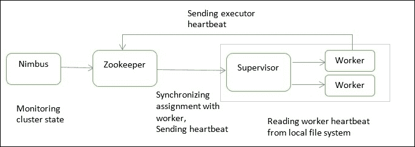
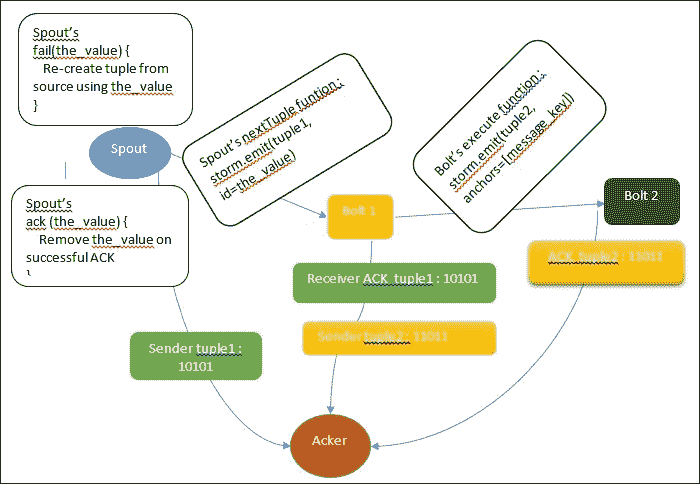
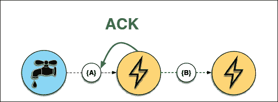
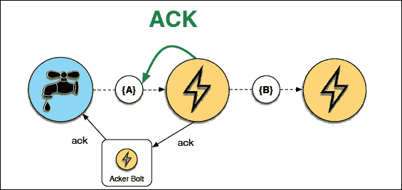
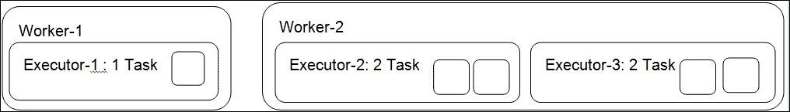
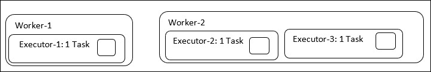

# 第二章：风暴解剖

本章详细介绍了 Storm 技术的内部结构和流程。 我们将在本章介绍以下主题：

*   风暴过程
*   特定于风暴拓扑的术语
*   进程间通信
*   风暴中的容错
*   有保证的元组处理
*   Storm-Scaling 分布式计算中的并行性

随着本章的推进，您将详细了解 Storm 的流程及其角色。 在本章中，将解释各种风暴专用术语。 您将了解 Storm 如何实现对不同类型故障的容错。 我们将了解什么是有保证的消息处理，最重要的是，如何在 Storm 中配置并行性以实现快速可靠的处理。

# 风暴过程

我们将首先从Nimbus 开始，它实际上是 Storm 中的入口点守护进程。 与 Hadoop 相比，Nimbus 实际上是 Storm 的工作跟踪器。 Nimbus 的工作是将代码分发到集群的所有管理守护进程。 因此，当提交拓扑代码时，它实际上会到达集群中的所有物理机。 Nimbus 还监控监控器的故障。 如果某个主管继续出现故障，则 Nimbus 会将这些员工的工作重新分配给另一台物理机器上的其他员工。 当前版本的 Storm 只允许 Nimbus 守护程序的一个实例运行。 Nimbus 还负责将任务分配给主管节点。 如果你失去了 Nimbus，工人们仍然会继续计算。 当工人死亡时，主管们将继续重新启动他们。 如果没有 Nimbus，一个工人的任务不会被重新分配给集群中的另一个机器工人。

如果 Nimbus 死了，没有替代的 Storm 进程会接管它，甚至没有进程会尝试重新启动它。 不过，没有什么好担心的，因为它可以随时重新启动。 在生产环境中，还可以在 Nimbus 死时设置警报。 在未来，我们可能会看到高度可用的 Nimbus。

## 主管

主管管理各自机器的所有工人。 由于群集中每台计算机都有一个管理程序，因此 Storm 中的分布式计算可能是由于管理程序守护程序所致。 Supervisor 守护进程侦听 Nimbus 分配给它运行的计算机的工作，并将其分发给工作进程。 由于任何运行时异常，工作人员随时可能死亡，当死亡的工作人员没有心跳时，主管会重新启动他们。 每个工作进程执行拓扑的一部分。 与 Hadoop 生态系统类似，Supervisor 是 Storm 的任务跟踪器。 它跟踪同一台机器的工人的任务。 可能的最大工作进程数取决于`storm.yaml`中定义的端口数。

## ==同步，由 Elderman 更正==@ELDER_MAN

除了自己的组件之外，Storm 还依赖 ZooKeeper 集群(一个或多个 ZooKeeper 服务器)来执行 Nimbus 和主管之间的协调工作。 除了使用 ZooKeeper 进行协调之外，Nimbus 和主管还将他们的所有状态存储在 ZooKeeper 中，ZooKeeper 将它们存储在它正在运行的本地磁盘上。 拥有多个 ZooKeeper 守护进程可以提高系统的可靠性，因为如果一个守护进程关闭，另一个守护进程将成为领导者。

## Storm UI

Storm还配备了基于 Web 的用户界面。 它应该在也运行 Nimbus 的机器上启动。 Storm UI 提供整个群集的报告，例如所有活动管理计算机的总和、分配给每个拓扑的可用工作进程的总数以及剩余数量，以及拓扑级诊断，例如元组统计信息(发出了多少元组，以及喷嘴到螺栓或螺栓到螺栓之间的确认)。 Storm UI 还显示了工作进程的总数，实际上是所有主管机器上所有可用的工作进程的总和。

以下屏幕截图显示了 Storm UI 的示例屏幕：


以下是 Storm UI 的说明：

*   **拓扑统计信息**：在**拓扑统计信息**下，您可以单击并查看过去 10 分钟、3 小时或所有时间的统计信息。
*   **spout(All Time)**：此显示为此 spout 分配的执行器和任务的数量，以及发出的元组的统计信息和其他延迟统计信息。
*   **螺栓(所有时间)**：此显示所有螺栓的列表，以及分配的执行器/任务。 进行性能调优时，请将**容量**列保持在接近`1`的位置。 在前面的**聚合器螺栓**示例中，它是`1.500`，因此我们可以使用`300`代替`200`执行器/任务。 **Capacity**列帮助我们确定正确的并行度。 这个想法非常简单；如果**Capacity**列的读数超过了`1`，请尝试以相同的比例增加执行器和任务。 如果执行器/任务的值很高，并且**Capacity**列接近于零，请尝试减少执行器/任务的数量。 您可以执行此操作，直到获得最佳配置。

# 风暴拓扑专用术语

拓扑是将编程工作逻辑分离到许多称为 Spout 和 Bolt 的小规模处理单元中，这类似于 Hadoop 中的 MapReduce。 拓扑可以用许多语言编写，包括 Java、Python 和更多受支持的语言。 在视觉描述中，拓扑显示为连接接管和螺栓的图形。 喷嘴和螺栓在整个集群中执行任务。 Storm 有两种运行模式，称为本地模式和分布式模式：

*   在本地模式下，Storm 和 Worker 的所有进程都在代码开发环境中运行。 这有利于拓扑的测试和开发。
*   在分布式模式下，Storm作为机器群集运行。 当您向 Nimbus 提交拓扑代码时，Nimbus 会负责分发代码，并根据您的配置分配工作器来运行您的拓扑。

在下图中，我们有紫色螺栓；这些螺栓从其上方的管口接收元组或记录。 元组支持正在编写拓扑代码的编程语言中可用的大多数数据类型。 它作为一个独立的单元从一个喷嘴流向一个螺栓，或从一个螺栓流向另一个螺栓。 元组的无限流称为流。 在单个元组中，可以有许多键-值对一起传递。

下图更详细地说明了流。 喷嘴连接到元组的源，并作为流为拓扑生成连续的元组。 您作为键-值对从管口发出的内容可以由使用相同密钥的螺栓接收。


## 工作进程、执行器和任务

Storm 区分以下三个主要实体，它们用于在 Storm 集群中实际运行拓扑：

*   工人 / 劳动者 / 做成特定事情的人 / 职蚁
*   执行者 / 遗嘱执行人 / 实施者
*   要求极高 / 考验 / 使费尽心机 / 分派任务

假设我们已经决定保留两个 Worker，一个 Spout Executor，三个**Bolt1**Executor 和两个**Bolt2**Executor。 假设个执行者和任务的数量之比相同。 对于喷嘴和螺栓，执行机构总数为 6 个。 在六个执行者中，有些将在 Worker 1 的范围内运行，有些将在 Worker 2 的控制范围内运行；这一决定由主管做出。 这在下图中进行了说明：


下图说明了在计算机上运行的主管范围内的工人和执行者的位置：


在构建拓扑代码时设置执行器和任务的数量。 在上图中，我们有两个工人(1 和 2)，由该机器的主管运行和管理。 假设**Executor 1**正在运行一个任务，因为 Executor与 Tasks 的比率相同(例如，10 个 Executor 等于 10 个任务，因此比率为 1：1)。 但是**Executor 2**连续运行两个任务，因此任务与 Executor 的比例是 2：1(例如，10 个 Executor 意味着 20 个任务，这使得比例为 2：1)。 拥有更多的任务从来不意味着更高的处理速度，但对于更多的执行器来说是如此，因为任务是按顺序运行的。

## 工作进程

单个工作进程执行拓扑的一部分，并在其自己的 JVM 上运行。 在拓扑提交期间分配工作进程。 工作进程链接到特定拓扑，并且可以为该拓扑的一个或多个喷嘴或螺栓运行一个或多个执行器。 正在运行的拓扑由在 Storm 群集中的多台计算机上运行的许多这样的工作进程组成。

## 执行人

Executor 是在工作者的 JVM 作用域内运行的线程。 执行器可以顺序地运行用于喷嘴或螺栓的一个或多个任务。

对于其所有任务，Executor 总是在一个线程上运行，这意味着任务在 Executor 上串行运行。 在拓扑启动而不关机后，可以使用`rebalance`命令更改执行器的数量：

```py
storm rebalance <topology name> -n <number of workers> -e <spout>=<number of executors> -e <bolt1 name>=<number of executors> -e <bolt2 name>=<number of executors>
```

## 任务

任务执行数据处理，并在其父执行器的执行线程中运行。 任务数的默认值与执行者数相同。 在构建拓扑的同时，我们还可以保留更多的任务。 它可以帮助增加未来的执行者数量，从而保持伸缩范围的开放。 最初，我们可以有 10 个执行者和 20 个任务，所以比例是 2：1。这意味着每个执行者有两个任务。 未来的再平衡行动可能会产生 20 个执行者和 20 个任务，这将使这一比例达到 1：1。

## 进程间通信

下图显示了 Storm Submitter(客户端)、Nimbus Thrift 服务器、ZooKeeper、主管、主管的工作人员、执行者和任务之间的通信。 每个工作进程都作为单独的 JVM 运行。


# 风暴群集的物理视图

下图说明了每个流程的物理位置。 只能有一个光轮。 但是，不止一个 ZooKeeper 在那里支持故障转移，并且每台机器都有一个主管。


## 流分组

流分组控制从喷嘴到螺栓或从螺栓到螺栓之间的元组流动。 在 Storm 中，我们有四种类型的分组。 混洗和字段分组是最常用的两种方式：

*   **改组分组**：该组中两个随机任务之间的元组流
*   **字段分组**：具有特定字段键的元组总是传递给下游螺栓的同一任务
*   **所有分组**：向下游螺栓的所有任务发送相同的元组
*   **全局分组**：来自所有任务的元组到达一个任务

下图对所有四种类型的分组进行了图解说明：


## 风暴环境下的容错

Supervisor 运行同步线程以从 ZooKeeper 获取分配信息(我应该运行拓扑的哪个部分)并写入本地磁盘。 此本地文件系统信息可帮助工作人员保持最新状态：

*   **Case 1**: This is the ideal case for most of the times. When the cluster works normally, the worker's heartbeat goes back to the supervisors and Nimbus via Zookeeper.

    

*   **情况 2**：如果主管死亡，处理仍会继续，但分配永远不会同步。 Nimbus 会将工作重新分配给另一台机器的另一位主管。 这些工作进程将运行，但不会收到任何新的元组。 请务必设置警报以重新启动 Supervisor 或使用可重新启动 Supervisor 的 Unix 工具。
*   **情况 3**：如果 Nimbus 死了，拓扑将继续正常工作。 处理仍将继续，但拓扑生命周期操作和重新分配到另一台计算机将不可能。
*   **情况 4**：如果工作进程死亡(因为心跳停止到达)，主管将尝试重新启动工作进程，处理将继续。 如果某个工作进程重复死亡，Nimbus 会将工作重新分配给集群中的其他节点。

## Storm 中有保证的元组处理

由于 Storm 已经具备了处理各种流程级故障的能力，因此另一个重要特性是能够处理工作进程死亡时发生的元组故障。 这只是给出一个按位 XOR 的概念：两组相同位的 XOR 是 0。 这被称为 XOR 魔术，它可以帮助我们知道将元组传递到下一个螺栓是否成功。 Storm 使用 64 位来跟踪元组。 每个元组都有一个 64 位的元组 ID，这个 64 位的 ID 和任务 ID 一起保存在 Acker 中。

在下一图中，说明了打包和重放案例：



### 进位中的异或魔术

直到链接元组树中的所有元组都完成之后，才完全处理喷嘴元组。 如果元组树在配置的超时时间内未完成(默认值为`topology.message.timeout.secs: 30`)，则重放输出元组。

在上图中，第一个 Acker 从喷嘴获取元组 1 的`10101`(为简单起见，我们保留 5 位)。 一旦**螺栓 1**接收到相同的元组，它也会确认到 Acker。 从这两个来源，Acker 得到`10101`。 这意味着`10101`XOR`10101 = 0`。 元组 1 被**螺栓 1**成功接收。 同样的过程在螺栓 1 和螺栓 2 之间重复。最后，**螺栓 2**向 Acker 发送 ACK，并完成元组树。 这将创建一个信号来调用喷嘴的`success`函数。 元组处理中的任何失败都会触发输出的`fail`函数调用，该调用指示将元组发回以再次处理。

Storm 的 Acker 通过在发送方的元组和接收方的元组之间执行 XOR 来跟踪元组树的完成情况。 每次发送元组时，其值被异或到 Acker 维护的校验和中，而每次确认元组时，其值在 Acker 处再次被异或。

如果所有元组都已成功确认，则校验和将为零。 Ackers 是系统级的执行者。

在喷嘴中，我们可以选择两个 Emit 函数。

*   `emit([tuple])`：这是一个简单的发射
*   `storm.emit([tuple], id=the_value)`：这会创建可靠的喷嘴，但前提是您可以使用`the_value`重新发出元组

在喷嘴中，我们还有两个 ACK 功能：

*   `fail(the_value)`：发生超时或元组失败时调用此函数
*   `ack(the_value)`：当拓扑的最后一个螺栓确认元组树时，调用此函数

此 ID 字段应该是从喷嘴的`fail`函数重放的随机且唯一的值。 使用此 ID，我们可以从`fail`函数重新发射它。 如果成功，jn`success`函数将调用，它可以从全局列表中删除成功的元组或从源重新创建。

如果拓扑中有可靠的出口，您将能够重新创建相同的元组。 要创建可靠的喷嘴，请从喷嘴的下一个元组函数以及元组发出唯一的消息 ID(`the_value`)：

```py
storm.emit([tuple], id=the_value)
```

无论元组在配置的时间段内未被确认，还是编程代码由于某种错误条件导致元组失败，这两种情况都是有效的重播情况。

当调用`fail`函数时，代码可以使用相同的消息 ID 从喷嘴的来源读取，并且当调用`success`函数时，可以执行诸如从队列中删除消息之类的操作。

消息 ID 是特定于应用程序的键，可以帮助您重新创建元组并将其从喷嘴发出。 消息 ID 的示例可以是队列消息 ID 或表的主键。 如果发生超时或由于任何其他原因，则认为元组失败。

Storm 有一种容错机制，可以保证只对从可靠喷嘴发出的所有元组进行至少一次处理。

一旦有了可靠的入口，就可以让螺栓在输入和输出元组之间进行链接，从而创建元组树。 一旦建立了元组树，Acker 就知道链接树中的任何故障，并使用原始邮件 ID 再次创建整个元组树。

在螺栓中，有两种功能：

*   `emit([tuple])`：没有元组树链接。 我们无法跟踪使用了哪个原始邮件 ID。
*   `storm.emit([tuple], anchors=[message_key])`：链接到位后，现在可以重放原始元组。

下图说明了如何从元组 A 生成元组 B：


下图说明执行**ACK**的螺栓：



下图说明了故障情况，即信号在故障时到达喷嘴：


成功的**ACK**如下所示：



下图说明了一个没有螺栓的大型元组树的情况，没有出现故障：


下图演示了元组树(位于元组树中间)中的故障示例：


# 调整 Storm 中的并行性-扩展分布式计算

为了解释 Storm 的并行性，我们将配置三个参数：

*   工人的数量
*   遗嘱执行人的人数
*   任务数

下图图解说明了一个示例，在该示例中，我们的拓扑只有一个管口和一个螺栓。 在本例中，我们将在 spout 和 bolt 级别为工作进程、执行器和任务的数量设置不同的值，并查看并行性在每种情况下是如何工作的：


```py
// assume we have two workers in total for topology.
topology.workers: 2
 // just one executor of spout.
builder.setSpout("spout-sentence", TwitterStreamSpout(),1)

// two executors of bolt.
builder.setBolt("bolt-split", SplitSentenceBolt(),2)
 // four tasks for bolts.
.setNumTasks(4)
.shuffleGrouping("spout-sentence");
```

对于此配置，我们将有两个工作器，它们将在单独的 JVM 中运行(工作器 1 和工作器 2)。

对于喷嘴，有一个执行器，默认的任务数是一个，这使得比率为 1：1(每个执行器一个任务)。

对于螺栓，有两个执行器和四个任务，这使得每个执行器有 4/2=两个任务。 这两个执行器在 Worker 2 下运行，每个执行器都有两个任务，而 Worker 1 的执行器只有一个任务。

可以用下图很好地说明这一点：



让我们将螺栓中的配置更改为两个执行器和两个任务：

```py
builder.setBolt("bolt-split", SplitSentenceBolt(),2)
 // 2 tasks for bolts.
.setNumTasks(2)
.shuffleGrouping("spout-sentence");
```

这里可以很好地说明这一点：



工人的人数又是两个。 因为螺栓有两个执行器和两个任务，所以它是 2/2，或者说每个执行器有一个任务。 现在您可以看到，两个执行器各有一个任务。 就性能而言，这两种情况完全相同，因为任务在 Executor 线程中按顺序运行。 更多的执行器意味着更高的并行度，更多的工作者意味着更有效地使用 CPU 和 RAM 等资源。 内存分配是在工作进程级别使用`worker`完成的。 `childopts`设置。 我们还应该监视特定工作进程持有的最大内存量。 这在决定工人总数方面起着重要作用。 可以使用`ps -ef`选项查看。 始终保持任务和执行器的比例相同，并使用 Storm UI 的 Capacity 列导出正确的执行器数量值。 重要的一点是，我们应该保留持续时间较短的事务，并尝试通过将代码拆分成更多的螺栓或减少批量大小的元组来对其进行调优。 批次大小是螺栓在一次元组传递中接收到的记录数。 此外，不要因为持有事务时间较长而阻塞 Spout 的`nextTuple`方法。

# 摘要

随着本章接近尾声，您一定已经对 Nimbus、Supervisor、UI 和 ZooKeeper 进程有了一个简要的了解。 本章还教会了您如何通过调整工作进程、执行器和任务的数量来调整 Storm 中的并行性。 您已经熟悉了分布式计算的重要问题，即故障以及通过系统中提供的不同类型的容错来克服故障。 最重要的是，您学习了如何编写“可靠的”端口来实现可靠的消息处理和连接。

下一章将介绍如何使用名为 Petrel 的 Python 库构建简单的拓扑。 Petrel 解决了 Storm 内置 Python 支持的一些限制，提供了更简单、更流畅的开发。