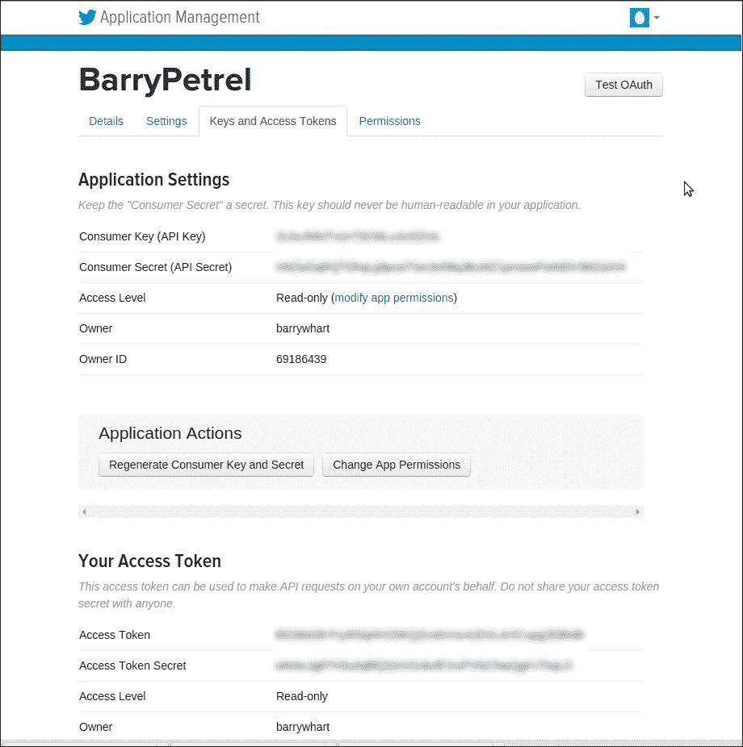
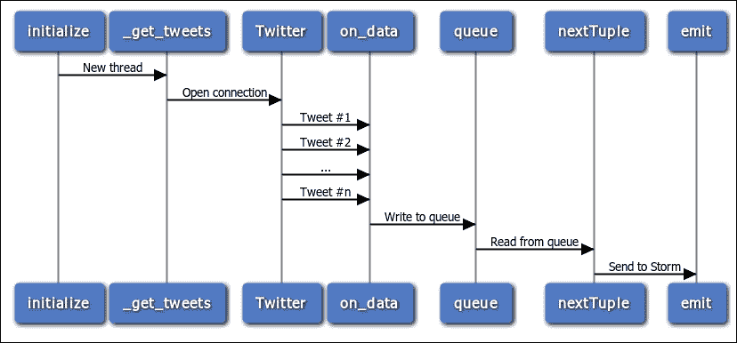
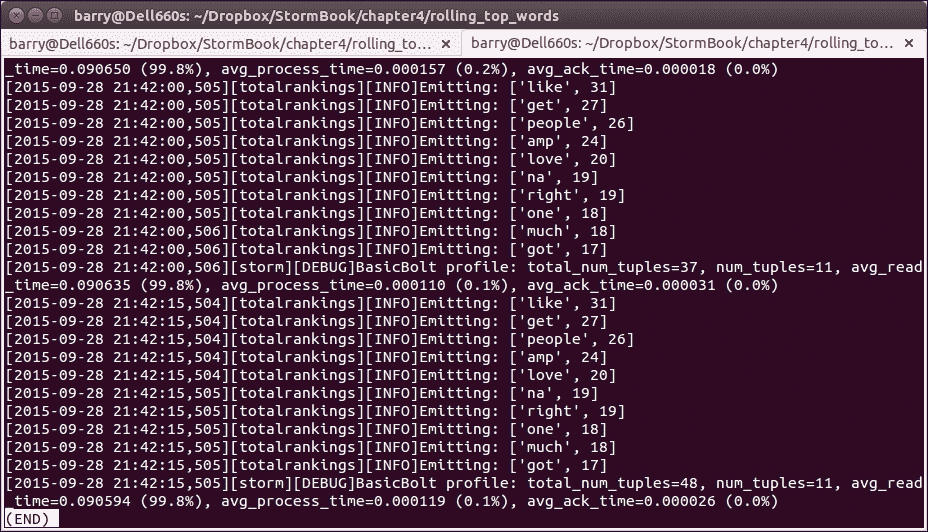

# 四、拓扑示例——Twitter

本章以介绍 Petrel 的[章](3.html "Chapter 3. Introducing Petrel")、*中的内容为基础。 在本章中，我们将构建一个拓扑来演示许多新功能和技术。 特别是，我们将了解如何：*

*   实现从 Twitter 读取的扩展
*   基于第三方 Python 库构建拓扑组件
*   计算滚动时段的统计数据和排名
*   从`topology.yaml`读取自定义配置设置
*   使用“Tick tuples”按计划执行逻辑

# 推特分析

你们中的大多数人都听说过 Twitter，但如果你还没有听说过，看看维基百科是如何描述 Twitter 的：

> *“一种在线社交网络服务，允许用户发送和阅读被称为”tweet“的 140 个字符的短消息。”*

2013 年，用户每天在 Twitter 上发布 4 亿条消息。 Twitter 提供了一个 API，让开发者可以实时访问 tweet 流。 在它上面，消息默认是公开的。 消息的数量、API 的可用性以及 tweet 的公共性使 Twitter 成为洞察时事、感兴趣的话题、公众情绪等的宝贵资源。

Storm最初是由 BackType 开发的，用于处理 tweet，Twitter 分析仍然是 Storm 的一个流行用例。 您可以在 Storm 网站[https://storm.apache.org/documentation/Powered-By.html](https://storm.apache.org/documentation/Powered-By.html)上看到几个示例。

本章的拓扑结构演示了如何读取 Twitter 的实时流 API，计算最受欢迎单词的排名。 它是暴风网站([https://github.com/apache/storm/blob/master/examples/storm-starter/src/jvm/storm/starter/RollingTopWords.java](https://github.com/apache/storm/blob/master/examples/storm-starter/src/jvm/storm/starter/RollingTopWords.java))上的“滚动词条”示例的 Python 版本，由以下组件组成：

*   Twitter stream spout(`twitterstream.py`)：这个从 Twitter 样本流读取 tweet。
*   拆分器螺栓(`splitsentence.py`)：它接收 tweet 并将它们拆分成单词。 它是[第 3 章](3.html "Chapter 3. Introducing Petrel")，*介绍 Petrel*中的分离器螺栓的改进版本。
*   滚动单词计数螺栓(`rollingcount.py`)：这个接收单词并对出现的单词进行计数。 它类似于介绍 Petrel 的[第 3 章](3.html "Chapter 3. Introducing Petrel")*中的字数计数螺栓，但实现了滚动计数(这意味着螺栓定期丢弃旧数据，因此字数计数只考虑最近的消息)。*
*   中间排名螺栓(`intermediaterankings.py`)：这会消耗字数，并且会周期性地发出*n*个最常出现的单词。
*   总排名螺栓(`totalrankings.py`)：这类似于中间排名螺栓。 它组合中间排名以产生一组整体排名。

# Twitter 的流媒体 API

Twitter 的公共 API既强大又灵活。 它有许多功能，既可以发布推文，也可以消费推文。 我们的应用需要实时接收和处理 tweet。 Twitter 的流媒体 API 就是为解决这个问题而设计的。 在计算机科学中，*流*是随时间可用的数据元素(在本例中为 tweet)序列。

在[https://dev.twitter.com/streaming/overview](https://dev.twitter.com/streaming/overview)中详细解释了流接口。 要使用它，应用首先要创建到 Twitter 的连接。 连接保持无限期开放以接收推文。

流 API 提供了几种方法来选择您的应用接收哪些 tweet。 我们的拓扑使用所谓的样本流，它提供 Twitter 任意选择的所有 tweet 的一小部分。 样本流用于演示和测试。 Production应用通常使用其他流类型之一。 有关可用流的更多信息，请参阅[https://dev.twitter.com/streaming/public](https://dev.twitter.com/streaming/public)。

## 创建一个 Twitter 应用以使用流 API

在我们可以使用 Twitter 的流媒体 API 之前，Twitter 要求我们创建一个应用。 这听起来很复杂，但设置起来相当容易；基本上，我们只需在网站上填写一张表格：

1.  如果您没有推特帐户，请在[https://twitter.com/](https://twitter.com/)创建一个。
2.  拥有帐户后，请登录并转到[https://apps.twitter.com/](https://apps.twitter.com/)。 单击**创建新应用**。 填写用于创建应用的表单。 将**回调 URL**字段留空。 默认的访问级别是只读，这意味着该应用只能读取 tweet；它不能发布或进行其他更改。 对于本例来说，只读访问就可以了。 最后，单击**创建您的 Twitter 应用**。 您将被重定向至您的应用页面。
3.  Click on the **Keys and Access Tokens** tab, then click on **Create my access token**. Twitter will generate an access token consisting of two parts: **Access Token** and **Access Token Secret**. While connecting to Twitter, your application will use this token along with **Consumer Key** and **Consumer Secret**.

    以下屏幕截图显示了生成访问令牌后的**密钥和访问令牌**选项卡：

    

## 拓扑配置文件

既然我们已经设置了一个具有 API 访问权限的 Twitter 帐户，我们就可以创建拓扑了。 首先，创建`topology.yaml`。 我们首先在介绍 Petrel 的[章](3.html "Chapter 3. Introducing Petrel")，*中看到了一个基本的`topology.yaml`文件。 这里，`topology.yaml`还将保存 Twitter 的连接参数。 输入以下文本，将四个`oauth`值替换为您自己的来自[https://apps.twitter.com/](https://apps.twitter.com/)的推特凭证：*

```py
nimbus.host: "localhost"
topology.workers: 1

oauth.consumer_key: "blahblahblah"
oauth.consumer_secret: "blahblahblah"
oauth.access_token: "blahblahblah"
oauth.access_token_secret: "blahblahblah"
```

## 推特流喷出

现在，让我们看看Twitter 的喷嘴。 在`twitterstream.py`中输入此代码：

```py
import json
import Queue
import threading

from petrel import storm
from petrel.emitter import Spout

from tweepy.streaming import StreamListener
from tweepy import OAuthHandler, Stream

class QueueListener(StreamListener):
    def __init__(self, queue):
        self.queue = queue

    def on_data(self, data):
        tweet = json.loads(data)
        if 'text' in tweet:
            self.queue.put(tweet['text'])
        return True

class TwitterStreamSpout(Spout):
    def __init__(self):
        super(TwitterStreamSpout, self).__init__(script=__file__)
        self.queue = Queue.Queue(1000)

    def initialize(self, conf, context):
        self.conf = conf
        thread = threading.Thread(target=self._get_tweets)
        thread.daemon = True
        thread.start()

    @classmethod
    def declareOutputFields(cls):
        return ['sentence']

    def _get_tweets(self):
        auth = OAuthHandler(
            self.conf['oauth.consumer_key'],
            self.conf['oauth.consumer_secret'])
        auth.set_access_token(
            self.conf['oauth.access_token'],
            self.conf['oauth.access_token_secret'])
        stream = Stream(auth, QueueListener(self.queue))
        stream.sample(languages=['en'])

    def nextTuple(self):
        tweet = self.queue.get()
        storm.emit([tweet])
        self.queue.task_done()

def run():
    TwitterStreamSpout().run()
```

喷嘴是如何与推特交流的？ Twitter API 对 API 客户端提出了许多要求：

*   连接必须使用安全套接字层(SSL)加密
*   API 客户端必须使用 OAuth 进行身份验证，OAuth 是一种用于与安全 Web 服务交互的流行身份验证协议
*   因为它涉及长期连接，所以流 API 涉及的不仅仅是一个简单的 HTTP 请求

幸运的是，有一个名为**Tweepy**([http://www.tweepy.org/](http://www.tweepy.org/))的库可以在简单易用的 Python API 中实现这些需求。 Tweepy 提供了一个`Stream`类来连接到流 API。 它在`_get_tweets()`中使用。

创建 Tweepy 流需要前面列出的四个 Twitter 连接参数。 我们可以直接在我们的端口中硬编码这些代码，但是如果连接参数发生变化，我们就必须更改代码。 相反，我们将此信息放入`topology.yaml`配置文件中。 我们的分配器在`initialize()`函数中读取这些设置。 Storm 在此组件的任务启动时调用此函数，向其传递有关环境和配置的信息。 这里，`initialize()`函数捕获`self.conf`中的拓扑配置。 本词典包括`oauth`值。

下面的序列图显示了喷嘴如何与 Twitter 通信、接收 tweet 并发出它们。 您可能已经注意到，喷嘴创建了一个后台线程。 该线程接收来自 Tweepy 的 tweet，并使用 Python 队列将它们传递给主输出线程。



为什么喷嘴要用线呢？ 通常，线程用于支持并发处理。 这里的情况并非如此。 相反，Tweepy 和 Petrel spout API 之间的行为只是不匹配。

从Twitter 流读取时，Tweepy 会阻塞执行，为接收到的每个 tweet 调用应用提供的事件处理函数。

在 Petrel 中，在每个元组之后，喷嘴上的`nextTuple()`函数必须从函数返回。

在写入队列的后台线程中运行 Tweepy 为这些相互冲突的需求提供了一种简单而优雅的解决方案。

## 分流螺栓

这里的分离器螺栓在结构上类似于介绍 Petrel 的[章](3.html "Chapter 3. Introducing Petrel")，*中的那个。 这个版本有两个改进，使它更有用和现实。*

### 提示

忽略那些在“热门词汇”列表中没有趣味性或没有用处的常用词汇。 这包括像“the”这样的英文单词，以及像“http”、“https”和“rt”这样在 Tweet 中频繁出现的类似单词的术语。

将推文拆分为单词时省略标点符号。

名为**Natural Language Toolkit**(**NLTK**)的 Python 库使两者的实现都很容易。 NLTK 还有许多其他吸引人的、强大的语言处理特性，但这些都超出了本书的范围。

在`splitsentence.py`中输入此代码：

```py
import nltk.corpus

from petrel import storm
from petrel.emitter import BasicBolt

class SplitSentenceBolt(BasicBolt):
    def __init__(self):
        super(SplitSentenceBolt, self).__init__(script=__file__)
        self.stop = set(nltk.corpus.stopwords.words('english'))
        self.stop.update(['http', 'https', 'rt'])

    def declareOutputFields(self):
        return ['word']

    def process(self, tup):
        for word in self._get_words(tup.values[0]):
            storm.emit([word])

    def _get_words(self, sentence):
        for w in nltk.word_tokenize(sentence):
            w = w.lower()
            if w.isalpha() and w not in self.stop:
                yield w

def run():
    SplitSentenceBolt().run()
```

## 滚动字数螺栓

滚动字计数螺栓类似于介绍 Petrel 的[第 3 章](3.html "Chapter 3. Introducing Petrel")、*中的字计数螺栓。 前面一章中的闪电只是简单地积累了单词的无限计数。 这不利于分析推特上的热门词汇，因为推特上的热门话题可能会随时发生变化。 相反，我们需要反映最新信息的计数。 为此，滚动字数计数螺栓将数据存储在基于时间的存储桶中。 然后，它会定期丢弃使用时间超过 5 分钟的桶。 因此，此闪电中的字数仅考虑最后 5 分钟的数据。*

在`rollingcount.py`中输入以下代码：

```py
from collections import defaultdict

from petrel import storm
from petrel.emitter import BasicBolt

class SlotBasedCounter(object):
    def __init__(self, numSlots):
        self.numSlots = numSlots
        self.objToCounts = defaultdict(lambda: [0] * numSlots)

    def incrementCount(self, obj, slot):
        self.objToCounts[obj][slot] += 1

    def getCount(self, obj, slot):
        return self.objToCounts[obj][slot]

    def getCounts(self):
        return dict((k, sum(v)) for k, v in self.objToCounts.iteritems())

    def wipeSlot(self, slot):
        for obj in self.objToCounts.iterkeys():
            self.objToCounts[obj][slot] = 0

    def shouldBeRemovedFromCounter(self, obj):
        return sum(self.objToCounts[obj]) == 0

    def wipeZeros(self):
        objToBeRemoved = set()
        for obj in self.objToCounts.iterkeys():
            if sum(self.objToCounts[obj]) == 0:
                objToBeRemoved.add(obj)
        for obj in objToBeRemoved:
            del self.objToCounts[obj]

class SlidingWindowCounter(object):
    def __init__(self, windowLengthInSlots):
        self.windowLengthInSlots = windowLengthInSlots
        self.objCounter = /
            SlotBasedCounter(
                self.windowLengthInSlots)
        self.headSlot = 0
        self.tailSlot = self.slotAfter(self.headSlot)

    def incrementCount(self, obj):
        self.objCounter.incrementCount(obj, self.headSlot)

    def getCountsThenAdvanceWindow(self):
        counts = self.objCounter.getCounts()
        self.objCounter.wipeZeros()
        self.objCounter.wipeSlot(self.tailSlot)
        self.headSlot = self.tailSlot
        self.tailSlot = self.slotAfter(self.tailSlot)
        return counts

    def slotAfter(self, slot):
        return (slot + 1) % self.windowLengthInSlots

class RollingCountBolt(BasicBolt):
    numWindowChunks = 5
    emitFrequencyInSeconds = 60
    windowLengthInSeconds = numWindowChunks * \
        emitFrequencyInSeconds

    def __init__(self):
        super(RollingCountBolt, self).__init__(script=__file__)
        self.counter = SlidingWindowCounter(
            self.windowLengthInSeconds /
                self.emitFrequencyInSeconds

    @classmethod
    def declareOutputFields(cls):
        return ['word', 'count']

    def process(self, tup):
        if tup.is_tick_tuple():
            self.emitCurrentWindowCounts()
        else:
            self.counter.incrementCount(tup.values[0])

    def emitCurrentWindowCounts(self):
        counts = self.counter.getCountsThenAdvanceWindow()
        for k, v in counts.iteritems():
            storm.emit([k, v])

    def getComponentConfiguration(self):
        return {"topology.tick.tuple.freq.secs":
            self.emitFrequencyInSeconds}

def run():
    RollingCountBolt().run()
```

`SlotBasedCounter`存储每个单词的`numSlots`(五个)计数值的列表。 每个时隙存储`emitFrequencyInSeconds`(60)秒的数据。 超过 5 分钟的计数值将被丢弃。

螺栓如何知道 60 秒已经过去？ Storm 提供了一个称为**Tick tuples**的特性，从而简化了这一过程。 当您需要根据时间表在螺栓内执行某些逻辑时，此功能非常有用。 要使用此功能，请执行以下步骤：

*   在`getComponentConfiguration()`中，返回包含`topology.tick.tuple.freq.secs`键的字典。 该值是刻度之间所需的秒数。
*   在`process()`中，检查元组是普通元组还是刻度元组。 当收到滴答元组时，螺栓应该运行其预定的处理。

## 中间排名螺栓

中间排名螺栓维护按出现计数排名的前`maxSize`(10)个项目的字典，并且每`emitFrequencyInSeconds`(15)秒发出这些项目。 在生产中，拓扑将运行此螺栓的许多实例，每个实例都维护所看到的全部单词的*子集*的最高单词。 拥有同一组件的许多实例允许拓扑处理大量的 tweet 并轻松地将所有计数保存在内存中，即使不同的单词数量相当大。

在`intermediaterankings.py`中输入此代码：

```py
from petrel import storm
from petrel.emitter import BasicBolt

def tup_sort_key(tup):
    return tup.values[1]

class IntermediateRankingsBolt(BasicBolt):
    emitFrequencyInSeconds = 15
    maxSize = 10

    def __init__(self):
        super(IntermediateRankingsBolt, self).__init__(script=__file__)
        self.rankedItems = {}

    def declareOutputFields(self):
        return ['word', 'count']

    def process(self, tup):
        if tup.is_tick_tuple():
            for t in self.rankedItems.itervalues():
                storm.emit(t.values)
        else:
            self.rankedItems[tup.values[0]] = tup
            if len(self.rankedItems) > self.maxSize:
                for t in sorted(
                        self.rankedItems.itervalues(), key=tup_sort_key):
                    del self.rankedItems[t.values[0]]
                    break

    def getComponentConfiguration(self):
        return {"topology.tick.tuple.freq.secs":
            self.emitFrequencyInSeconds}

def run():
    IntermediateRankingsBolt().run()
```

## 总排名螺栓

总排名螺栓与中间排名螺栓非常相似。 在拓扑中只有一个此螺栓的实例。 它从该螺栓的每个实例接收前几个单词，并选择全部前`maxSize`(10)项。

在`totalrankings.py`中输入以下代码：

```py
import logging

from petrel import storm
from petrel.emitter import BasicBolt

log = logging.getLogger('totalrankings')

def tup_sort_key(tup):
    return tup.values[1]

class TotalRankingsBolt(BasicBolt):
    emitFrequencyInSeconds = 15
    maxSize = 10

    def __init__(self):
        super(TotalRankingsBolt, self).__init__(script=__file__)
        self.rankedItems = {}

    def declareOutputFields(self):
        return ['word', 'count']

    def process(self, tup):
        if tup.is_tick_tuple():
            for t in sorted(
                    self.rankedItems.itervalues(),
                    key=tup_sort_key,
                    reverse=True):
                log.info('Emitting: %s', repr(t.values))
                storm.emit(t.values)
        else:
            self.rankedItems[tup.values[0]] = tup
            if len(self.rankedItems) > self.maxSize:
                for t in sorted(
                        self.rankedItems.itervalues(),
                        key=tup_sort_key):
                    del self.rankedItems[t.values[0]]
                    break
            zero_keys = set(
                k for k, v in self.rankedItems.iteritems()
                if v.values[1] == 0)
            for k in zero_keys:
                del self.rankedItems[k]

    def getComponentConfiguration(self):
        return {"topology.tick.tuple.freq.secs": self.emitFrequencyInSeconds}

def run():
    TotalRankingsBolt().run()
```

## 定义拓扑

下面是定义拓扑结构的`create.py`脚本：

```py
from twitterstream import TwitterStreamSpout
from splitsentence import SplitSentenceBolt
from rollingcount import RollingCountBolt
from intermediaterankings import IntermediateRankingsBolt
from totalrankings import TotalRankingsBolt

def create(builder):
    spoutId = "spout"
    splitterId = "splitter"
    counterId = "counter"
    intermediateRankerId = "intermediateRanker"
    totalRankerId = "finalRanker"
    builder.setSpout(spoutId, TwitterStreamSpout(), 1)
    builder.setBolt(
        splitterId, SplitSentenceBolt(), 1).shuffleGrouping("spout")
    builder.setBolt(
        counterId, RollingCountBolt(), 4).fieldsGrouping(
            splitterId, ["word"])
    builder.setBolt(
        intermediateRankerId,
        IntermediateRankingsBolt(), 4).fieldsGrouping(
            counterId, ["word"])
    builder.setBolt(
        totalRankerId, TotalRankingsBolt()).globalGrouping(
            intermediateRankerId)
```

该拓扑的结构类似于[章](3.html "Chapter 3. Introducing Petrel")，*介绍 Petrel*中的字数拓扑。 `TotalRankingsBolt`有了新的皱纹。 如前所述，这个螺栓只有一个实例，它使用`globalGrouping()`，所以来自`IntermediateRankingsBolt`的所有元组都被发送到它。

您可能想知道为什么拓扑需要中间排名和总排名螺栓。 为了让我们从整体上了解排名靠前的单词，需要有一个可以看到整个 tweet 流的单一 Bolt 实例(总排名)。 但在高数据速率下，单个螺栓不可能跟上流量。 中间排名闪电实例“屏蔽”了该流量的总排名闪电，计算它们在推特流中的前几个单词。 这使得最终排名螺栓能够计算出最常用的单词总数，而只消耗总数中的一小部分。 优雅！

# 运行拓扑

在运行拓扑之前，我们还有几个个小项目要处理：

1.  将`logconfig.ini`文件从[第 3 章](3.html "Chapter 3. Introducing Petrel")，*介绍 Petrel*中的第二个示例复制到此拓扑的目录中。
2.  创建名为`setup.sh`的文件。 Petrel 会将此脚本与拓扑打包，并在启动时运行。 此脚本安装拓扑使用的第三方 Python 库。 该文件如下所示：

    ```py
    pip install -U pip
    pip install nltk==3.0.1 oauthlib==0.7.2 tweepy==3.2.0
    ```

3.  使用以下两行创建名为`manifest.txt`的文件：

    ```py
    logconfig.ini
    setup.sh
    ```

4.  在运行拓扑之前，让我们查看一下已经创建的文件列表。 确保已正确创建这些文件：
    *   `topology.yaml`
    *   `twitterstream.py`
    *   `splitsentence.py`
    *   `rollingcount.py`
    *   `intermediaterankings.py`
    *   `totalrankings.py`
    *   `manifest.txt`
    *   `setup.sh`
5.  使用以下命令运行拓扑：

    ```py
    petrel submit --config topology.yaml --logdir `pwd`
    ```

拓扑开始运行后，在`topology`目录中打开另一个终端。 输入以下命令查看总排名螺栓的`log`文件，从最旧到最新排序：

```py
ls -ltr petrel*totalrankings.log
```

如果这是您第一次运行拓扑，则只会列出一个日志文件。 每次运行都会创建一个新文件。 如果列出了多个文件，请选择最新的一个。 输入以下命令以监视日志文件的内容(您系统上的确切文件名将有所不同)：

```py
tail -f petrel24748_totalrankings.log
```

大约每隔 15 秒，您就会看到按受欢迎程度降序排列的前 10 个单词的日志消息，如下所示：



# 摘要

在本章中，我们使用许多新技术和库开发了复杂的拓扑。 阅读完此示例后，您应该已经准备好开始应用 Petrel 和 Storm 来解决实际问题。

在接下来的一章中，我们将进一步了解 Storm 的一些内置功能，这些功能在操作集群时非常有用，例如日志记录和监控。