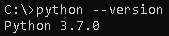
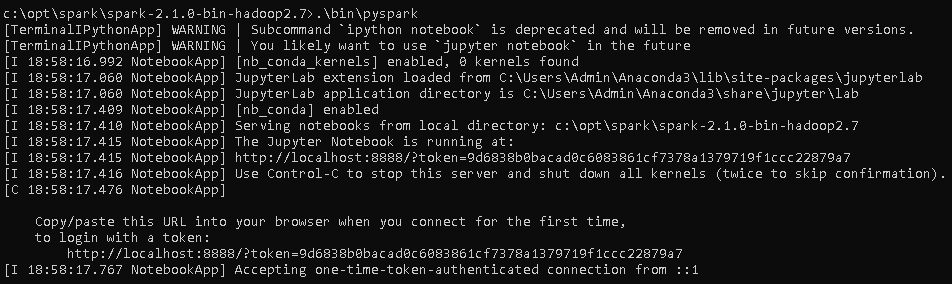
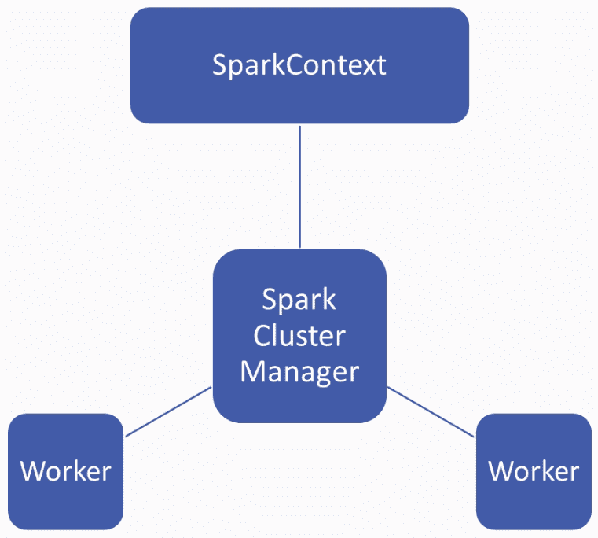
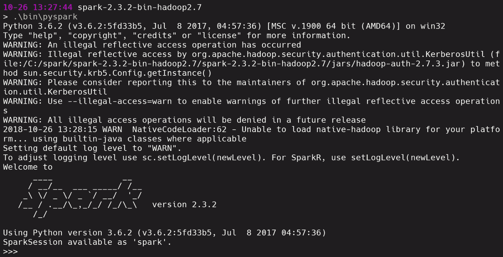

# 安装 Pyspark 并设置您的开发环境

在本章中，我们将介绍 Spark 并学习核心概念，如 SparkContext，以及 SparkConf 和 Spark shell 等 Spark 工具。唯一的先决条件是对 Python 基本概念的了解以及从大数据中寻求洞察力的愿望。我们将学习如何使用 Spark SQL 分析和发现模式，以提高我们的商业智能。此外，通过为您自己的计算机设置 PySpark，您将能够快速迭代您的解决方案。到本书结束时，您将能够使用 PySpark 处理现实生活中杂乱的数据集，从而获得实用的大数据体验。

在本章中，我们将涵盖以下主题:

*   PySpark 概述
*   在 Windows 和 PySpark 上设置 Spark
*   Spark 和 PySpark 中的核心概念

# PySpark 概述

在开始安装 PySpark(这是 Spark 的 Python 接口)之前，让我们先了解一下 Spark 和 PySpark 中的一些核心概念。Spark 是来自 Apache 的最新大数据工具，只需前往[http://spark.apache.org/](http://spark.apache.org/)即可找到。它是大规模数据处理的统一分析引擎。这意味着，如果您有大量数据，您可以将这些数据输入 Spark，以很快的速度创建一些分析。如果我们看看 Hadoop 和 Spark 之间的运行时间，Spark 比 Hadoop 快一百多倍。它非常容易使用，因为有非常好的 API 供 Spark 使用。

Spark 平台的四个主要组件如下:

*   **火花 SQL** :火花的清除语言
*   **火花流**:允许你输入实时流数据
*   **MLlib(机器学习)**:Spark 的机器学习库
*   **GraphX(图形)**:火花的图形库

Spark 的核心概念是 RDD，类似于熊猫数据框，或者 Python 字典或列表。这是 Spark 为我们在基础架构上存储大量数据的一种方式。RDD 与本地存储器中的东西(如熊猫数据框)的主要区别在于，RDD 分布在多台机器上，但它看起来像一个统一的数据集。这意味着，如果你有大量的数据要并行处理，你可以把它放在 RDD，Spark 将为你处理数据的并行化和聚类。

Spark 有三种不同的接口，如下所示:

*   斯卡拉
*   Java 语言(一种计算机语言，尤用于创建网站)
*   计算机编程语言

Python 类似于 PySpark 集成，我们将很快介绍。目前，我们将从 PySpark 包中导入一些库来帮助我们使用 Spark。我们理解 Spark 的最好方法是看一个例子，如下图截图所示:

```py
lines = sc.textFile("data.txt")
lineLengths = lines.map(lambda s: len(s))
totalLength = lineLengths.reduce(lambda a, b: a + b)
```

在前面的代码中，我们通过调用`SC.textFile ("data.txt")`创建了一个名为`lines`的新变量。`sc`是我们的 Python 对象，代表我们的 Spark 集群。Spark 集群是存储我们的 Spark 流程的一系列实例或云计算机。通过调用一个`textFile`构造函数并输入`data.text`，我们可能输入了一个大的文本文件，并使用这一行创建了一个 RDD。换句话说，我们在这里试图做的是将一个大的文本文件馈送到一个分布式集群和 Spark 中，Spark 为我们处理这个集群。

在第二行和第三行，我们有一个 MapReduce 函数。在第二行，我们使用`lambda`函数将长度函数映射到`data.text`的每一行。在第三行，我们调用了一个缩减函数，将所有的`lineLengths`加在一起，生成文档的总长度。虽然 Python 的`lines`是一个包含`data.text`中所有行的变量，但在引擎盖下，Spark 实际上是在 Spark 集群上的两个不同实例中处理`data.text`片段的分布，并在所有这些实例上处理 MapReduce 计算。

# 火花 SQL

正如我们在本章前面看到的，Spark SQL 是 Spark 平台上的四个组件之一。它可以用来执行 SQL 查询或从任何现有的 Hive 隔离中读取数据，其中 Hive 也是来自 Apache 的数据库实现。Spark SQL 看起来很像 MySQL 或者 Postgres。下面的代码片段是一个很好的例子:

```py
#Register the DataFrame as a SQL temporary view
df.CreateOrReplaceTempView("people")

sqlDF = spark.sql("SELECT * FROM people")
sqlDF.show()

#+----+-------+
#| age|   name|
#+----+-------+
#+null|Jackson|
#|  30| Martin|
#|  19| Melvin|
#+----|-------|
```

您将需要从某个表中选择所有的列，例如`people`，并且使用 Spark 对象，您将输入一个非常标准的 SQL 语句，它将显示一个与您期望的普通 SQL 实现非常相似的 SQL 结果。

现在让我们看看数据集和数据帧。数据集是数据的分布式集合。它是在 Spark 1.6 中添加的一个接口，在 RDDs 之上提供了好处。另一方面，使用过熊猫或 R. A DataFrame 的人非常熟悉 DataFrame，它只是一个组织成命名列的数据集，类似于关系数据库或 Python 中的 DataFrame。数据集和数据框之间的主要区别在于数据框有列名。可以想象，这对于机器学习工作和输入 scikit-learn 之类的东西会非常方便。

让我们看看如何使用数据帧。以下代码片段是数据框的一个快速示例:

```py
# spark is an existing SparkSession
df = spark.read.json("examples/src/main/resources/people.json")
# Displays the content of the DataFrame to stdout
df.show()

#+----+-------+
#| age|   name|
#+----+-------+
#+null|Jackson|
#|  30| Martin|
#|  19| Melvin|
#+----|-------|
```

同样，就像熊猫或 R 会做的那样，`read.json`允许我们从一个 JSON 文件中输入一些数据，`df.show`以类似熊猫的方式向我们显示数据框的内容。

众所周知，MLlib 用于使机器学习变得可扩展和容易。MLlib 允许你做常见的机器学习任务，比如特征化；创建管道；保存和加载算法、模型和管道；以及一些实用程序，如线性代数、统计和数据处理。另外需要注意的是，Spark 和 RDD 几乎是不可分割的概念。如果您对 Spark 的主要使用案例是机器学习，那么 Spark 现在实际上鼓励您对 MLlib 使用基于 DataFrame 的 API，这对于我们来说是相当有益的，因为我们已经熟悉了 pandas，这意味着平稳过渡到 Spark。

在下一节中，我们将看到如何在 Windows 上设置 Spark，并将 PySpark 设置为接口。

# 在 Windows 和 PySpark 上设置 Spark

完成以下步骤，在 Windows 机器上安装 PySpark:

1.  从[https://github . com/bmatzelle/GOW/releases/download/v 0 . 8 . 0/GOW-0 . 8 . 0 . exe](https://github.com/bmatzelle/gow/releases/download/v0.8.0/Gow-0.8.0.exe)下载 **Gnu on Windows** ( **GOW** )。
2.  GOW 允许在 Windows 上使用 Linux 命令。我们可以使用以下命令来查看安装 GOW 所允许的基本 Linux 命令:

```py
gow --list 
```

这给出了以下输出:


3.  下载并安装 Anaconda。如果需要帮助，可以通过以下教程:[https://medium . com/@ galarnykkmichael/install-python-on-windows-anaconda-c63c 7 C3 d 1444](https://medium.com/@GalarnykMichael/install-python-on-windows-anaconda-c63c7c3d1444)。
4.  关闭上一个命令行并打开一个新的命令行。
5.  去阿帕奇星火网站([https://spark.apache.org/](https://spark.apache.org/))。
6.  要下载火花，请从下拉菜单中选择以下选项:
    *   最近发布的火花
    *   合适的包装类型

下面的截图显示了 Apache Spark 的下载页面:


7.  然后，下载 Spark。下载后，将文件移动到要解压缩的文件夹中。
8.  您可以手动解压缩或使用以下命令:

```py
gzip -d spark-2.1.0-bin-hadoop2.7.tgz tar xvf spark-2.1.0-bin-hadoop2.7.tar
```

9.  现在，使用以下命令将`winutils.exe`下载到您的`spark-2.1.0-bin-hadoop2.7\bin`文件夹中:

```py
curl -k -L -o winutils.exe https://github.com/steveloughran/winutils/blob/master/hadoop-2.6.0/bin/winutils.exe?raw=true
```

10.  确保您的机器上安装了 Java。您可以使用以下命令查看 Java 版本:

```py
java --version
```

这给出了以下输出:


11.  使用以下命令检查 Python 版本:

```py
python --version 
```

这给出了以下输出:



12.  让我们编辑我们的环境变量，以便可以在任何目录中打开 Spark，如下所示:

```py
setx SPARK_HOME C:\opt\spark\spark-2.1.0-bin-hadoop2.7
setx HADOOP_HOME C:\opt\spark\spark-2.1.0-bin-hadoop2.7
setx PYSPARK_DRIVER_PYTHON ipython
setx PYSPARK_DRIVER_PYTHON_OPTS notebook
```

将`C:\opt\spark\spark-2.1.0-bin-hadoop2.7\bin`添加到您的路径中。

13.  关闭终端，打开一个新终端，并键入以下命令:

```py
--master local[2]
```

The `PYSPARK_DRIVER_PYTHON` and the `PYSPARK_DRIVER_PYTHON_OPTS` parameters are used to launch the PySpark shell in Jupyter Notebook. The `--master` parameter is used for setting the master node address.

14.  接下来要做的是在`bin`文件夹中运行 PySpark 命令:

```py
.\bin\pyspark
```

这给出了以下输出:



# Spark 和 PySpark 中的核心概念

现在让我们看看 Spark 和 PySpark 中的以下核心概念:

*   sparks context(储蓄上下文)
*   斯巴基 Conf
*   火花壳

# sparks context(储蓄上下文)

火花上下文是火花中的一个对象或概念。这是一个大数据分析引擎，允许您以编程方式利用 Spark 的力量。

当您有大量数据不适合您的本地机器或笔记本电脑，因此您需要两台或多台计算机来处理这些数据时，就可以看到 Spark 的威力。您还需要在处理数据时保持处理这些数据的速度。我们不仅希望数据能够在几台计算机之间进行分割计算；我们也希望计算是并行的。最后，您希望这个计算看起来像一个单一的计算。

让我们考虑一个例子，我们有一个有 5000 万个名字的大型联系人数据库，我们可能想从这些联系人中提取第一个名字。显然，很难将 5000 万个名字放入您的本地内存中，尤其是如果每个名字都嵌入在一个更大的联系人对象中。这就是火花出现的地方。Spark 允许你给它一个大数据文件，并将帮助处理和上传这个数据文件，同时为你处理对这个数据进行的所有操作。该电源由 Spark 的集群管理器管理，如下图所示:



群集管理器管理多个工作人员；可能有 2 个、3 个甚至 100 个。主要的一点是，Spark 的技术有助于管理这个工人集群，您需要一种方法来控制集群的行为，并从集群速率来回传递数据。

一个 **SparkContext** 可以让你像使用 Python 对象一样使用 Spark 的集群管理器的能力。因此，有了 **SparkContext** ，您可以将作业和资源、计划任务和完成任务从 **SparkContext** 向下传递到 **Spark 集群管理器**，一旦完成计算，该管理器将从 **Spark 集群管理器**取回结果。

让我们看看这在实践中是什么样子，并看看如何设置一个 SparkContext:

1.  首先，我们需要导入`SparkContext`。
2.  使用`SparkContext`构造函数在代表迷你图上下文的`sc`变量中创建新对象。
3.  在`SparkContext`构造函数中，传递一个`local`上下文。我们在这种背景下看待`hands on PySpark`，如下:

```py
from pyspark import SparkContext
sc = SparkContext('local', 'hands on PySpark')
```

4.  在我们建立了这个之后，我们所需要做的就是使用`sc`作为我们的 Spark 操作的入口点，如下面的代码片段所示:

```py
visitors = [10, 3, 35, 25, 41, 9, 29] df_visitors = sc.parallelize(visitors) df_visitors_yearly = df_visitors.map(lambda x: x*365).collect() print(df_visitors_yearly)
```

我们举个例子；如果我们要分析服装店访客数量的合成数据集，我们可能会有一个列表`visitors`来表示每天来我们店的访客。然后，我们可以创建数据帧的并行版本，调用`sc.parallelize(visitors)`，并输入`visitors`数据集。`df_visitors`然后为我们创建一个访问者的数据框架。然后我们可以映射一个函数；例如，通过映射一个`lambda`函数，将每日数字(`x`)乘以`365`，即一年中的天数，来制作每日数字并将其外推为年度数字。然后，我们调用一个`collect()`函数来确保 Spark 在这个`lambda`调用上执行。最后，我们打印出`df_ visitors_yearly`。现在，我们让 Spark 在幕后对我们的合成数据进行计算，而这只是一个 Python 操作。

# 火花壳

我们将回到我们的 Spark 文件夹，也就是`spark-2.3.2-bin-hadoop2.7`，通过键入`.\bin\pyspark`来启动我们的 PySpark 二进制文件。

在下面的截图中，我们可以看到我们已经用 Spark 启动了一个 shell 会话:



Spark 现在可以作为`spark`变量提供给我们。让我们在 Spark 中尝试一个简单的事情。首先要做的是加载一个随机文件。在每个 Spark 安装中，都有一个`README.md`标记文件，所以让我们按照如下方式将其加载到内存中:

```py
text_file = spark.read.text("README.md")
```

如果我们使用`spark.read.text`然后放入`README.md`，我们会得到一些警告，但是我们现在不应该太担心，因为我们将在后面看到我们将如何修复这些东西。这里最主要的是我们可以使用 Python 语法来访问 Spark。

我们在这里做的是把`README.md`作为`spark`读取的文本数据放入 Spark 中，我们可以用`text_file.count()`可以得到 Spark 来统计我们的文本文件中有多少个字符，如下所示:

```py
text_file.count()
```

由此，我们得到以下输出:

```py
103
```

我们还可以看到第一行是什么，如下所示:

```py
text_file.first()
```

我们将获得以下输出:

```py
Row(value='# Apache Spark')
```

我们现在可以通过执行以下操作来计算包含单词`Spark`的行数:

```py
lines_with_spark = text_file.filter(text_file.value.contains("Spark"))
```

在这里，我们已经使用`filter()`函数对行进行了过滤，并且在`filter()`函数中，我们已经指定`text_file_value.contains`包含单词`"Spark"`，并且我们已经将这些结果放入`lines_with_spark`变量中。

我们可以修改前面的命令，只需添加`.count()`，如下所示:

```py
text_file.filter(text_file.value.contains("Spark")).count()
```

我们现在将获得以下输出:

```py
20
```

我们可以看到文本文件中的`20`行包含`Spark`这个词。这只是我们如何使用火花壳的一个简单例子。

# 斯巴基 Conf

SparkConf 允许我们配置一个 Spark 应用程序。它将各种 Spark 参数设置为键值对，因此通常会创建一个带有`SparkConf()`构造函数的`SparkConf`对象，然后该构造函数会从`spark.*`底层 Java 系统加载值。

有几个有用的功能；例如，我们可以使用`sets()`功能来设置配置属性。我们可以使用`setMaster()`功能设置要连接的主网址。我们可以使用`setAppName()`功能来设置应用程序名称，使用`setSparkHome()`来设置 Spark 将安装在工作节点上的路径。

You can learn more about SparkConf at [https://spark.apache.org/docs/0.9.0/api/pyspark/pysaprk.conf.SparkConf-class.html](https://spark.apache.org/docs/0.9.0/api/pyspark/pysaprk.conf.SparkConf-class.html). 

# 摘要

在本章中，我们学习了 Spark 和 PySpark 中的核心概念。我们学习了在 Windows 上设置 Spark 和使用 PySpark。我们还浏览了 Spark 的三个主要支柱，即 SparkContext、Spark shell 和 SparkConf。

在下一章中，我们将研究如何使用 RDDs 将您的大数据引入 Spark 环境。