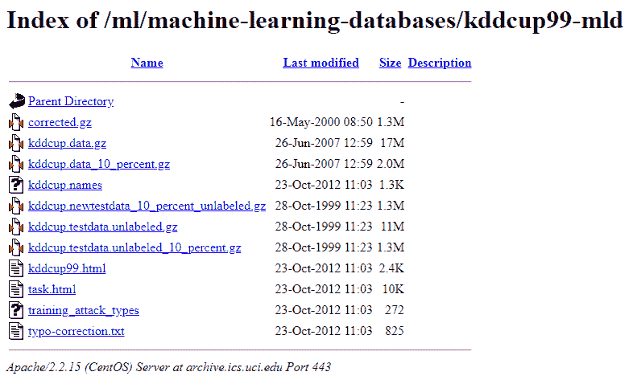

# 二、使用 RDD 将您的大数据带入 Spark 环境

首先，本章将简要概述如何使用**弹性分布式数据集** ( **RDDs** )将您的大数据引入 Spark 环境。我们将使用各种工具来与这些数据进行交互和修改，以便提取有用的见解。我们将首先在 Spark RDDs 上加载数据，然后用 Spark RDDs 进行并行化。

在本章中，我们将涵盖以下主题:

*   将数据加载到Spark RDDs
*   使用 Spark RDDs 的并行化
*   RDD 操作基础

# 将数据加载到Spark RDDs

在本节中，我们将了解如何将数据加载到 Spark RDDs，并将涵盖以下主题:

*   UCI 机器学习数据库
*   从存储库中获取数据到 Python
*   将数据输入 Spark

让我们从 UCI 机器学习数据仓库的概述开始。

# UCI 机器学习知识库

我们可以通过导航到[https://archive.ics.uci.edu/ml/](https://archive.ics.uci.edu/ml/)来访问 UCI 机器学习资源库。那么，什么是 UCI 机器学习知识库呢？UCI 代表加州大学欧文分校机器学习资源库，它是获取机器学习开源和免费数据集的非常有用的资源。虽然 PySpark 的主要问题或解决方案与机器学习无关，但我们可以利用这个机会获得大数据集，帮助我们测试 PySpark 的功能。

让我们看一下 KDD 杯 1999 数据集，我们将下载它，然后将整个数据集加载到 PySpark 中。

# 从存储库中获取数据到 Spark

我们可以按照以下步骤下载数据集并将其加载到 PySpark 中:

1.  单击数据文件夹。
2.  您将被重定向到包含各种文件的文件夹，如下所示:



你可以看到 kddcup.data.gz，在 kddcup.data_10_percent.gz 中也有 10%的数据。我们将使用食物数据集。要使用食物数据集，右键单击 kddcup.data.gz，选择复制链接地址，然后返回到 PySpark 控制台并导入数据。

让我们通过以下步骤来看看这是如何工作的:

1.  启动 PySpark 后，我们首先需要做的就是导入`urllib`，这是一个允许我们与互联网上的资源进行交互的库，如下所示:

```py
import urllib.request
```

2.  接下来要做的就是用这个`request`库从网上拉一些资源，如下代码所示:

```py
f = urllib.request.urlretrieve("https://archive.ics.uci.edu/ml/machine-learning-databases/kddcup99-mld/kddcup.data.gz"),"kddcup.data.gz"
```

此命令需要一些时间来处理。文件下载完成后，我们可以看到 Python 已经返回，控制台处于活动状态。

3.  接下来，使用`SparkContext`加载。因此，`SparkContext`在 Python 中被具体化或对象化为`sc`变量，如下所示:

```py
sc
```

该输出如以下代码片段所示:

```py
SparkContext
Spark UI
Version
 v2.3.3
Master
 local[*]
AppName
 PySparkShell
```

# 将数据输入 Spark

1.  接下来，使用`sc`将 KDD 杯数据加载到 PySpark 中，如下命令所示:

```py
raw_data = sc.textFile("./kddcup.data.gz")
```

2.  在下面的命令中，我们可以看到原始数据现在在`raw_data`变量中:

```py
raw_data
```

该输出如以下代码片段所示:

```py
./kddcup.data,gz MapPartitionsRDD[3] at textFile at NativeMethodAccessorImpl.java:0
```

如果我们输入`raw_data`变量，它会给我们关于`kddcup.data.gz`的详细信息，数据文件的原始数据位于这里，并告诉我们关于`MapPartitionsRDD.`

现在我们知道了如何将数据加载到 Spark 中，让我们了解一下使用 Spark RDDs 的并行化。

# 使用 Spark RDDs 的并行化

现在我们知道了如何在从互联网上收到的文本文件中创建 RDD，我们可以用不同的方法来创建这个 RDD。让我们用我们的 Spark RDDs 来讨论并行化。

在本节中，我们将涵盖以下主题:

*   什么是并行化？
*   我们如何并行化 Spark RDDs？

让我们从并行化开始。

# 什么是并行化？

理解 Spark 或任何语言的最好方法是查看文档。如果我们查看 Spark 的文档，它清楚地表明，对于我们上次使用的`textFile`函数，它从 HDFS 读取文本文件。

另一方面，如果我们看一下`parallelize`的定义，我们可以看到这是通过分发本地 Scala 集合来创建一个 RDD。

因此，使用`parallelize`创建 RDD 和使用`textFile`创建 RDD 的主要区别在于数据的来源。

让我们看看这实际上是如何工作的。让我们从之前停止的地方转到 PySpark 安装屏幕。所以我们导入`urllib`，用`urllib.request`从网上检索一些数据，用`SparkContext`和`textFile`把这些数据加载到 Spark。另一种方法是使用`parallelize`。

让我们看看如何做到这一点。让我们首先假设我们的数据已经在 Python 中，因此，出于演示目的，我们将创建一个包含 100 个数字的 Python 列表，如下所示:

```py
a = range(100)
a
```

这为我们提供了以下输出:

```py
range(0, 100)
```

比如我们看`a`，简单来说就是 100 个数字的列表。如果我们将其转换为`list`，它将向我们显示 100 个数字的列表:

```py
list (a)
```

这为我们提供了以下输出:

```py
[0,
 1,
 2,
 3,
 4,
 5,
 6,
 7,
 8,
 9,
 10,
 11,
 12,
 13,
 14,
 15,
 16,
 17,
 18,
 19,
 20,
 21,
 22,
 23,
 24,
 25,
 26,
 27,
...
```

以下命令向我们展示了如何将它变成 RDD:

```py
list_rdd = sc.parallelize(a)
```

如果我们查看`list_rdd`包含的内容，我们可以看到它是`PythonRDD.scala:52`，所以，这告诉我们，Scala 支持的 PySpark 实例已经将它识别为 Python 创建的 RDD，如下所示:

```py
list_rdd
```

这为我们提供了以下输出:

```py
PythonRDD[3] at RDD at PythonRDD.scala:52
```

现在，让我们看看我们可以用这个列表做什么。我们可以做的第一件事是使用以下命令计算`list_rdd`中存在多少元素:

```py
list_rdd.count()
```

这为我们提供了以下输出:

```py
100
```

我们可以看到`list_rdd`数到 100。如果我们在没有切入结果的情况下再次运行它，我们实际上可以看到，由于 Scala 在通过 RDD 时是实时运行的，所以它比只运行`a`的长度要慢，这是瞬间的。

然而，RDD 需要一些时间，因为它需要时间来完成列表的并行版本。因此，在只有 100 个数字的小范围内，进行这种权衡可能不是很有帮助，但是随着数据量的增加和数据元素的个体大小的增加，这将更有意义。

我们还可以从列表中任意提取元素，如下所示:

```py
list_rdd.take(10)
```

这为我们提供了以下输出:

```py
[0, 1, 2, 3, 4, 5, 6, 7, 8, 9]
```

当我们运行前面的命令时，我们可以看到 PySpark 在返回列表的前十个元素之前已经执行了一些计算。请注意，所有这些现在都由 PySpark 支持，我们正在使用 Spark 的力量来操纵这 100 个项目的列表。

现在让我们使用`list_rdd`中的 reduce 函数，或者一般的 RDDs，来演示我们可以用 PySpark 的 RDDs 做什么。我们将两个参数函数作为匿名`lambda`函数应用于`reduce`调用，如下所示:

```py
list_rdd.reduce(lambda a, b: a+b)
```

这里，`lambda`取两个参数，`a`和`b`。它只是将这两个数字加在一起，从而得到`a+b`，并返回输出。通过 RDD `reduce`调用，我们可以依次将 RDD 列表的前两个数字加在一起，返回结果，然后将第三个数字加到结果中，以此类推。所以，最终，你用`reduce`把所有 100 个数字加到同一个结果上。

现在，在通过分布式数据库做了一些工作之后，我们现在可以看到将数字从`0`添加到`99`给了我们`4950`，这一切都是使用 PySpark 的 RDD 方法完成的。您可能会从术语 MapReduce 中认识到这个函数，事实上，这是一回事。

我们刚刚学习了什么是 PySpark 中的并行化，以及如何对 Spark RDDs 进行并行化。这实际上相当于我们创建 rdd 的另一种方式，这对我们非常有用。现在，让我们来看看 RDD 操作的一些基本知识。

# RDD 操作基础

现在让我们来看看 RDD 的一些操作基础。理解一个函数做什么的最好方法是查看文档，这样我们就可以对函数执行什么有一个严格的理解。

这一点之所以非常重要，是因为文档是定义函数和设计函数用途的黄金来源。通过阅读文档，我们确保在理解中尽可能接近源。相关文档的链接是[https://spark . Apache . org/docs/latest/rdd-programming-guide . html](https://spark.apache.org/docs/latest/rdd-programming-guide.html)。

那么，让我们从`map`功能开始。`map`函数通过将`f`函数应用于 RDD 的每个元素来返回 RDD。换句话说，它的工作原理与我们在 Python 中看到的`map`函数相同。另一方面，`filter`函数返回一个新的 RDD，该只包含满足谓词的元素，而该谓词是一个布尔型的，通常由馈入`filter`函数的`f`函数返回。同样，这与 Python 中的`filter`函数非常相似。最后，`collect()`函数返回一个包含这个 RDD 中所有元素的列表。当我们看到这样的笔记时，这就是我认为阅读文档的真正亮点。如果你只是简单地在谷歌上搜索这是什么，这永远不会出现在堆栈溢出或博客文章中。

所以，我们说`collect()`应该只在结果数组预计很小的情况下使用，因为所有的数据都加载在驱动程序的内存中。这意味着，如果我们回想一下[第 01 章](01.html)、*安装 PySpark 和设置您的开发环境*，Spark 是极好的，因为它可以跨许多不同的独特机器收集和并行化数据，并且可以从一个终端透明地操作。收集笔记的意思是，如果我们调用`collect()`，产生的 RDD 将被完全加载到驱动程序的内存中，在这种情况下，我们将失去在 Spark 实例集群中分发数据的好处。

现在我们已经了解了所有这些，让我们看看如何将这三个函数实际应用到我们的数据中。所以，回到 PySpark 终端；正如我们在前面几章中看到的，我们已经将原始数据加载为文本文件。

我们将编写一个`filter`函数来查找所有表示 RDD 数据的行，其中每一行`contains`都是`normal`这个词，如下图截图所示:

```py
contains_normal = raw_data.filter(lambda line: "normal." in line)
```

我们来分析一下这意味着什么。首先，我们为 RDD 原始数据调用`filter`函数，并向它提供一个匿名的`lambda`函数，该函数接受一个`line`参数并返回谓词，正如我们在文档中读到的，关于单词`normal`是否存在于行中。此时此刻，正如我们在前面章节中所讨论的，我们还没有实际计算这个`filter`操作。我们需要做的是调用一个函数，它实际上合并了数据，并强制 Spark 计算一些东西。在这种情况下，我们可以依靠`contains_normal`，如下图所示:


你可以看到它在包含`normal`这个词的原始数据中已经统计了 97 万多行。为了使用`filter`函数，我们为它提供了`lambda`函数，并使用了一个合并函数，如`counts`，该函数强制 Spark 计算底层数据帧中的数据。

对于第二个例子，我们将使用地图。由于我们下载了 KDD 杯数据，我们知道它是一个逗号分隔的值文件，因此，我们要做的一件非常简单的事情是用两个逗号分隔每行，如下所示:

```py
split_file = raw_data.map(lambda line: line.split(","))
```

让我们分析一下正在发生的事情。我们在`raw_data`上调用`map`功能。我们给它提供了一个名为`line`的匿名`lambda`函数，我们使用`,`来拆分`line`函数。结果是一个分割文件。现在，Spark的力量真正发挥作用了。回想一下，在`contains_normal.`过滤器中，当我们调用一个迫使 Spark 计算`count`的函数时，我们花了几分钟才得出正确的结果。如果我们执行`map`功能，它将具有相同的效果，因为我们需要映射数百万行数据。因此，快速预览我们的映射函数是否正确运行的方法之一是我们是否可以物化几行而不是整个文件。

为此，我们可以使用之前用过的`take`功能，如下图所示:


这可能需要几秒钟，因为我们只采取了五条线，这是我们的分裂，实际上是相当容易管理的。如果我们看看这个示例输出，我们可以理解我们的`map`函数已经成功创建。我们能做的最后一件事是在原始数据上调用`collect()`，如下所示:

```py
raw_data.collect()
```

这是为了将所有原始数据从 Spark 的 RDD 数据结构转移到内存中。

# 摘要

在本章中，我们学习了如何在 Spark RDDs 上加载数据，并介绍了使用 Spark RDDs 的并行化。在加载数据之前，我们对 UCI 机器学习存储库进行了简单的概述。我们对基本的 RDD 操作进行了概述，并从官方文档中检查了功能。

在下一章中，我们将讨论大数据清理和数据整理。