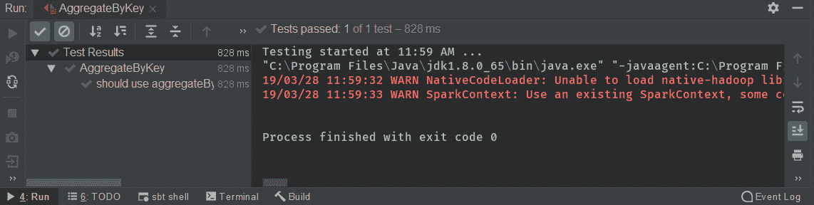
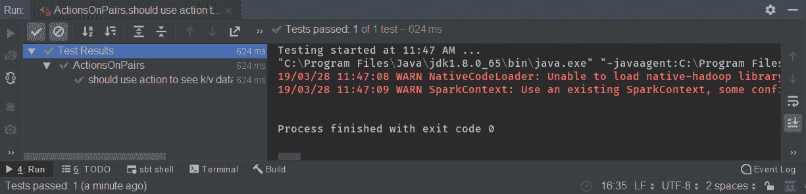
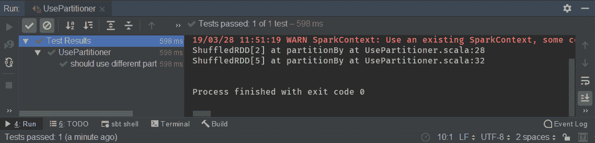

# 十一、使用 Spark 键/值应用编程接口

在本章中，我们将使用 Spark 键/值 API。我们将从查看键/值对上可用的转换开始。然后我们将学习如何使用`aggregateByKey`方法代替`groupBy()`方法。稍后，我们将查看键/值对上的操作，并查看键/值数据上可用的分区器。在本章的最后，我们将实现一个高级分区器，它将能够按范围对我们的数据进行分区。

在本章中，我们将涵盖以下主题:

*   键/值对上的可用操作
*   使用 aggregateByKey 而不是 groupBy()
*   对键/值对的操作
*   键/值数据的可用分割器
*   实现自定义分区器

# 键/值对上的可用操作

在本节中，我们将涵盖以下主题:

*   键/值对上的可用转换
*   使用`countByKey()`
*   了解其他方法

因此，这是我们众所周知的测试，我们将在键/值对上使用转换。

首先，我们将为用户`A`、`B`、`A`、`B`和`C`创建一个用户交易数组，用于某个金额，如下例所示:

```py
 val keysWithValuesList =
 Array(
 UserTransaction("A", 100),
 UserTransaction("B", 4),
 UserTransaction("A", 100001),
 UserTransaction("B", 10),
 UserTransaction("C", 10)
 )
```

然后，我们需要通过特定的字段来键入数据，如下例所示:

```py
val keyed = data.keyBy(_.userId)
```

我们将通过调用带有一个`userId`参数的`keyBy`方法，通过`userId`来键入它。

现在，我们的数据被分配给`keyed`变量，它的类型是一个元组。第一个元素是字符串，即`userId`，第二个元素是`UserTransaction`。

让我们看看可用的转换。首先，我们来看看`countByKey`。

让我们看看它的实现，如下例所示:

```py
val data = spark.parallelize(keysWithValuesList)
 val keyed = data.keyBy(_.userId)
//when
 val counted = keyed.countByKey()
// keyed.combineByKey()
// keyed.aggregateByKey()
// keyed.foldByKey()
// keyed.groupByKey()
//then
 counted should contain theSameElementsAs Map("B" -> 2, "A" -> 2, "C" -> 1)
```

这会返回一个键`K`的`Map`，而`Long`是一个泛型类型，因为它可以是任何类型的键。在本例中，密钥将是一个字符串。每个返回 map 的操作都不是完全安全的。如果您看到正在返回 map 的方法的签名，则表明该数据将被发送给驱动程序，并且它需要适合内存。如果有太多的数据放入一个驱动程序的内存中，那么我们将耗尽内存。因此，我们在使用这种方法时需要谨慎。

然后，我们执行一个断言计数，它应该包含与映射相同的元素，如下例所示:

```py
counted should contain theSameElementsAs Map("B" -> 2, "A" -> 2, "C" -> 1)
```

`B`是`2`，因为我们有两个值。此外，`A`与`C`相似，因为它们只有一个值。`CountByKey()`内存不贵，因为它只存储钥匙和计数器。然而，如果密钥是一个复杂且大的对象，例如，一个具有多个字段的事务，多于两个，那么这个映射可能真的很大。

但是让我们开始这个测试，如下例所示:


从前面的截图中，我们可以看到我们的测试通过了。

我们还有一个`combineByKey()`方法，为同一个键组合相同的元素，共享能够聚合不同类型的负`aggregateByKey()`。我们有`foldByKey`，它采用当前状态和值，但返回与键的值相同的类型。

我们还有`groupByKey()`，这是我们在上一节中了解到的。这将所有内容按特定键分组，并返回一个键的值的迭代器。这也是一个非常消耗内存的操作，所以我们在使用时需要小心。

在下一节中，我们将使用`aggregateByKey`代替`groupBy`。我们将学习`groupBy`是如何工作的，并修正它的缺点。

# 使用 aggregateByKey 而不是 groupBy()

在这一节中，我们将探讨我们使用`aggregateByKey`而不是`groupBy`的原因。

我们将涵盖以下主题:

*   为什么要避免使用`groupByKey`
*   `aggregateByKey`给了我们什么
*   使用`aggregateByKey`实现逻辑

首先，我们将创建用户事务数组，如下例所示:

```py
 val keysWithValuesList =
 Array(
 UserTransaction("A", 100),
 UserTransaction("B", 4),
 UserTransaction("A", 100001),
 UserTransaction("B", 10),
 UserTransaction("C", 10)
 )
```

然后我们将使用`parallelize`来创建一个 RDD，因为我们希望我们的数据是关键的。这在以下示例中显示:

```py
 val data = spark.parallelize(keysWithValuesList)
 val keyed = data.keyBy(_.userId)
```

在前面的代码中，我们为`userId`调用了`keyBy`来获取付款人、密钥和用户交易的数据。

让我们考虑我们想要聚合，其中我们想要为同一个键执行一些特定的逻辑，如下例所示:

```py
 val aggregatedTransactionsForUserId = keyed
 .aggregateByKey(amountForUser)(addAmount, mergeAmounts)
```

这样做的理由可以是选择最大元素、最小元素或计算平均值。`aggregateByKey`需要取三个参数，如下例所示:

```py
aggregateByKey(amountForUser)(addAmount, mergeAmounts)
```

第一个参数是类型为 T 的初始参数，定义`amountForUser`是类型为`ArrayBuffer`的初始参数。这一点非常重要，因为 Scala 编译器会推断出该类型，并且参数编号`1`和`2`在本例中需要具有完全相同的类型 that】。

下一个参数是一个获取我们正在处理的当前元素的方法。在这个例子中，`transaction: UserTransaction) =>`是一个当前事务，也需要采用我们初始化函数的状态，因此，这里它将是一个数组缓冲区。

它需要与下面代码块中显示的类型相同，因此这是我们的类型 T:

```py
mutable.ArrayBuffer.empty[Long]
```

此时，我们可以接受任何事务，并将其添加到特定状态。这是以分布式方式完成的。对于一个密钥，在一个执行器上执行，对于完全相同的密钥，在不同的执行器上执行。这是并行发生的，因此将为同一个密钥添加多个交易。

现在，Spark 知道，对于完全相同的键，它有多个需要合并的 T `ArrayBuffer`类型的状态。所以，我们需要`mergeAmounts`为我们的交易申请同一个密钥。

`mergeArgument`是一个取两个状态的方法，两个状态都是 T 型的中间状态，如下代码块所示:

```py
 val mergeAmounts = (p1: mutable.ArrayBuffer[Long], p2: mutable.ArrayBuffer[Long]) => p1 ++= p2
```

在本例中，我们希望将释放缓冲区合并到一个数组缓冲区中。因此，我们发布`p1 ++= p2`。这将把两个数组缓冲区合并成一个。

现在，我们已经准备好了所有的参数，我们能够执行`aggregateByKey`并查看结果。结果是一个字符串和 T 型的 RDD，`ArrayBuffer[long]`，这是我们的状态。我们将不再把`UserTransaction`留在我们的 RDD，这有助于减少记忆量。`UserTransaction`是一个重物，因为它可以有多个字段，在这个例子中，我们只对金额字段感兴趣。这样，我们可以减少使用的内存。

以下示例显示了我们的结果应该是什么样子:

```py
 aggregatedTransactionsForUserId.collect().toList should contain theSameElementsAs List(
 ("A", ArrayBuffer(100, 100001)),
 ("B", ArrayBuffer(4,10)),
 ("C", ArrayBuffer(10)))
```

我们应该有一个键`A`，一个`100`和`10001`的`ArrayBuffer`，因为这是我们的输入数据。`B`应该是`4``10`，最后`C`应该是`10`。

让我们开始测试，检查我们是否正确实现了`aggregateByKey`，如下例所示:



从前面的输出中，我们可以看到它如预期的那样工作。

在下一节中，我们将查看键/值对上可用的操作。

# 对键/值对的操作

在本节中，我们将研究对键/值对的操作。

我们将涵盖以下主题:

*   检查键/值对上的操作
*   使用`collect()`
*   检查键/值 RDD 的输出

在本章的第一部分，我们介绍了键/值对上可用的转换。我们发现，与 rdd 相比，它们有些不同。此外，对于操作，它在结果方面略有不同，但在方法名称方面没有。

因此，我们将使用`collect()`并检查我们对这些键/值对的操作输出。

首先，我们将根据`userId`创建我们的事务数组和 RDD，如下例所示:

```py
 val keysWithValuesList =
 Array(
 UserTransaction("A", 100),
 UserTransaction("B", 4),
 UserTransaction("A", 100001),
 UserTransaction("B", 10),
 UserTransaction("C", 10)
 )
```

我们想到的第一个动作是`collect()`。`collect()`取每个元素赋给结果，这样我们的结果和`keyBy`的结果就大不相同了。

我们的结果是一对键，`userId`，和一个值，即`UserTransaction`。从下面的例子中，我们可以看到，我们可以有一个重复的密钥:

```py
 res should contain theSameElementsAs List(
 ("A",UserTransaction("A",100)),
 ("B",UserTransaction("B",4)),
 ("A",UserTransaction("A",100001)),
 ("B",UserTransaction("B",10)),
 ("C",UserTransaction("C",10))
 )//note duplicated key
```

正如我们在前面的代码中看到的，我们有多次相同的顺序。对于像字符串这样的简单密钥，复制并不是很昂贵。然而，如果我们有一把更复杂的钥匙，它将是昂贵的。

因此，让我们开始这个测试，如下例所示:



从前面的输出中，我们可以看到我们的测试已经通过。要查看其他操作，我们将查看不同的方法。

如果一个方法是返回 RDD，比如`collect[U] (f: PartialFunction[(String, UserTransaction), U])`，就说明这不是一个动作。如果有什么东西回到了 RDD，那就意味着它不是一个行动。键/值对就是这种情况。

`collect()`不返回 RDD 而是返回数组，因此是一个动作。`count`返回`long`，所以这也是一个动作。`countByKey`返回地图。如果我们想`reduce`我们的元素，那么这是一个动作，但是`reduceByKey`不是一个动作。这就是`reduce`和`reduceByKey`的大区别。

我们可以看到，按照 RDD 的说法，一切都是正常的，所以行动是一样的，差异只是在转化。

在下一节中，我们将查看键/值数据的可用分区器。

# 键/值数据的可用分割器

我们知道分区和分区器是 Apache Spark 的关键组件。它们影响我们的数据是如何划分的，这意味着它们影响数据实际驻留在哪些执行器上。如果我们有一个好的分区器，那么我们将有好的数据局部性，这将减少打乱。我们知道打乱对于处理来说是不可取的，所以减少打乱是至关重要的，因此，选择合适的分割器对我们的系统来说也是至关重要的。

在本节中，我们将涵盖以下主题:

*   检查`HashPartitioner`
*   检查`RangePartitioner`
*   测试

我们将首先检查我们的`HashPartitioner`和`RangePartitioner`。然后，我们将比较它们，并使用两个分区器测试代码。

首先我们将创建一个`UserTransaction`数组，如下例所示:

```py
 val keysWithValuesList =
 Array(
 UserTransaction("A", 100),
 UserTransaction("B", 4),
 UserTransaction("A", 100001),
 UserTransaction("B", 10),
 UserTransaction("C", 10)
 )
```

然后我们将使用`keyBy`(如下例所示)，因为分割器将自动为我们的数据处理密钥:

```py
 val keyed = data.keyBy(_.userId)
```

然后我们将获取一组`partitioner`关键数据，如下例所示:

```py
 val partitioner = keyed.partitioner
```

代码显示`partitioner.isEmpty`，因为我们没有定义任何`partitioner`，因此此时为空，如下例所示:

```py
 assert(partitioner.isEmpty)
```

我们可以使用`partitionBy`方法指定一个`partitioner`，如下例所示:

```py
val hashPartitioner = keyed.partitionBy(new HashPartitioner(100))
```

该方法需要一个`partitioner`抽象类实现。我们将有几个实现，但是首先，让我们关注`HashPartitioner`。

`HashPartitioner`取若干分区，有若干分区。`numPartition`返回我们的参数，但是`getPartition`有点复杂，如下例所示:

```py
    def numPartitions: Int = partitions
    def getPartition(key: Any): int = key match {
        case null => 0
        case_ => Utils.nonNegativeMode(key.hashCode, numPartitions)
    }
```

它首先检查我们的`key`是否是`null`。如果是`null`，将在分区号`0`降落。如果我们有带有`null`键的数据，它们将全部落在同一个执行器中，正如我们所知，这不是一个好的情况，因为执行器将有大量的内存开销，并且它们可以在没有内存异常的情况下失败。

如果`key`不是`null`，则从`hashCode`和分区数做一个`nonNegativeMod`。它必须是分区数的模，这样才能分配给适当的分区。由此可见，`hashCode`方法对于我们的钥匙是非常重要的。

如果我们提供的是自定义键，而不是像整数或字符串这样的具有众所周知的`hashCode`的基元类型，那么我们也需要提供并实现一个合适的`hashCode`。但是最好的做法是使用 Scala 的`case`类，因为它们已经为您实现了`hashCode`和 equals。

我们现在已经定义了`partitioner`，但是`partitioner`是可以动态改变的。我们可以把我们的`partitioner`变成`rangePartitioner`。`rangePartitioner`拿着 RDD 的分区。

`rangePartitioner`更复杂，因为它试图将我们的数据划分为范围，这不像`HashPartitioner`在获取分区时那么简单。这种方法非常复杂，因为它试图均匀地分布我们的数据，并且有复杂的逻辑将数据分布到各个范围。

让我们开始测试，检查我们是否能够正确分配`partitioner`，如以下输出所示:



我们的测试通过了。这意味着，在开始的时候`partitioner`是空的，然后我们不得不在`partitionBy`打乱 RDD，还有一个`branchPartitioner`。但是它只显示了我们创建`partitioner`界面实例的数字线。

在下一节中，我们将尝试改进它，或者尝试通过实现自定义分区器来调整和使用分区器。

# 实现自定义分区器

在这一节中，我们将实现一个自定义分区器，并创建一个获取带有范围的解析列表的分区器。如果我们的键落入一个特定的范围，我们将分配列表的分区号索引。

我们将涵盖以下主题:

*   实现自定义分区器
*   实现范围分割器
*   测试我们的分割器

我们将基于我们自己的范围划分实现逻辑范围划分，然后测试我们的划分器。让我们从黑盒测试开始，不要看实现。

代码的第一部分类似于我们已经使用的部分，但是这次我们有`keyBy`数量的数据，如下例所示:

```py
 val keysWithValuesList =
 Array(
 UserTransaction("A", 100),
 UserTransaction("B", 4),
 UserTransaction("A", 100001),
 UserTransaction("B", 10),
 UserTransaction("C", 10)
 )
 val data = spark.parallelize(keysWithValuesList)
 val keyed = data.keyBy(_.amount)
```

我们按金额键入，我们有以下键:`100`、`4`、`100001`、`10`和`10`。

然后，我们将创建一个分区器并将其称为`CustomRangePartitioner`，它将获取元组列表，如下例所示:

```py
 val partitioned = keyed.partitionBy(new CustomRangePartitioner(List((0,100), (100, 10000), (10000, 1000000))))
```

第一个元素是从`0`到`100`，意思是如果按键在`0`到`100`的范围内，就应该去分区`0`。因此，我们有四个键应该属于该分区。下一个分区号的范围为`100`和`10000`，因此该范围内的每条记录都应归入分区号`1`，包括两端。最后一个范围在`10000`和`1000000`元素之间，因此，如果记录在该范围之间，它应该属于该分区。如果我们有一个超出范围的元素，那么分区器将失败，并出现一个非法的参数异常。

让我们看看下面的例子，它展示了我们的自定义范围分割器的实现:

```py
class CustomRangePartitioner(ranges: List[(Int,Int)]) extends Partitioner{
 override def numPartitions: Int = ranges.size
override def getPartition(key: Any): Int = {
 if(!key.isInstanceOf[Int]){
 throw new IllegalArgumentException("partitioner works only for Int type")
 }
 val keyInt = key.asInstanceOf[Int]
 val index = ranges.lastIndexWhere(v => keyInt >= v._1 && keyInt <= v._2)
 println(s"for key: $key return $index")
 index
 }
}
```

它将范围作为元组的参数列表，如下例所示:

```py
(ranges: List[(Int,Int)])
```

我们的`numPartitions`应该等于`ranges.size`，所以分区的数量等于大小范围的数量。

接下来，我们有`getPartition`方法。首先，我们的分割器将只对整数起作用，如下例所示:

```py
if(!key.isInstanceOf[Int])
```

我们可以看到，这是一个整数，不能用于其他类型。出于同样的原因，我们首先需要检查我们的键是否是整数的实例，如果不是，我们得到一个`IllegalArgumentException`，因为那个分割器只对 int 类型有效。

我们现在可以通过使用`asInstanceOf`来测试我们的`keyInt`。一旦这样做了，当索引在谓词之间时，我们就能够迭代范围并取最后一个范围。我们的谓词是一个元组`v`，应该如下:

```py
 val index = ranges.lastIndexWhere(v => keyInt >= v._1 && keyInt <= v._2)
```

`KeyInt`应该大于等于`v._1`，这是元组的第一个元素，但也应该低于第二个元素，`v._2`。

范围的开始是`v._1`，范围的结束是`v._2`，所以我们可以检查我们的元素是否在范围内。

最后，我们将打印在索引中找到的 for 键，用于调试目的，并且我们将返回索引，这将是我们的分区。这在以下示例中显示:

```py
println(s"for key: $key return $index")
```

让我们开始下面的测试:


我们可以看到对于键`100001`，代码返回了分区号`2`，这是意料之中的。对于键`100`返回分区一，对于`10`、`4`、`10`返回分区零，这意味着我们的代码工作正常。

# 摘要

在本章中，我们首先看到了键/值对的可用转换。然后我们学习了如何使用`aggregateByKey`代替`groupBy`。我们还介绍了对键/值对的操作。后来，我们在键/值数据上查看了可用的分区器，如`rangePartitioner`和`HashPartition`。到本章结束时，我们已经实现了我们的自定义分区器，它能够基于学习目的的范围的结束和开始来分配分区。

在下一章中，我们将学习如何测试我们的 Spark 作业和 Apache Spark 作业。