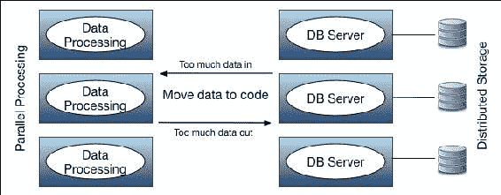
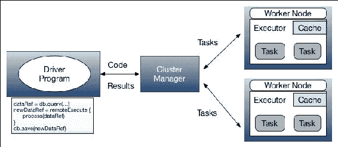
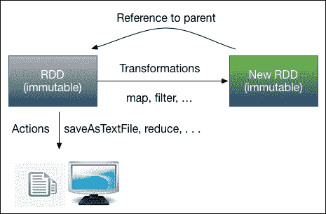
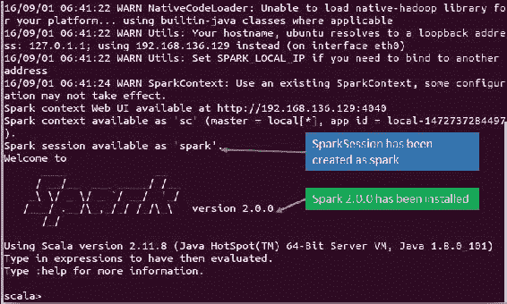
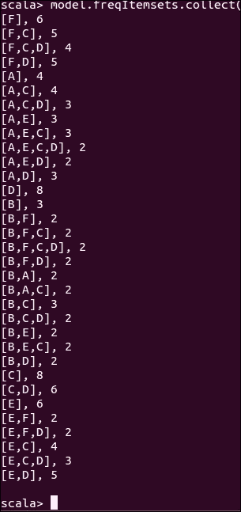
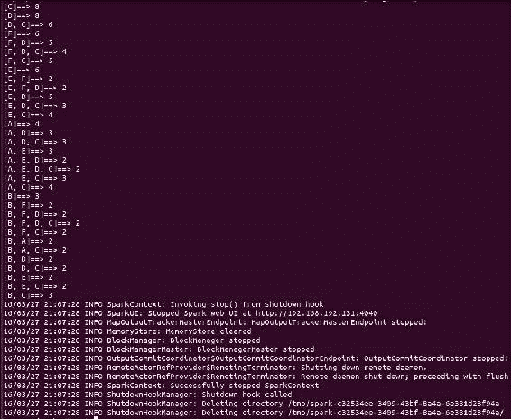
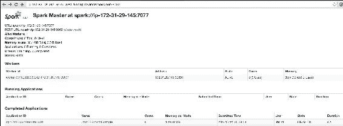

# 第一章。Spark 数据分析简介

本章概述了 Apache Spark、其计算范例以及入门安装。它将简要描述 Spark 的主要组件，并重点介绍其新的计算进展。对**弹性分布式数据集**(**【RDD】**)和数据集的描述将作为本书其余部分的基础知识进行讨论。然后，它将重点关注 Spark 机器学习库。安装和打包一个简单的机器学习应用程序与 Spark 和 Maven 将被演示，然后才上车。简而言之，本章将涵盖以下主题:

*   Spark概述
*   使用 Spark 的新计算范例
*   Spark生态系统
*   Spark 机器学习库
*   安装并开始使用 Spark
*   用依赖项打包应用程序
*   运行简单的机器学习应用程序

# Spark概述

本节描述了 Spark([https://spark.apache.org/](https://spark.apache.org/))的基础知识，接着是传统并行和分布式计算的问题，然后是 Spark 是如何发展的，然后它带来了一个跨越大数据处理和分析的新计算范式。此外，我们还展示了 Spark 的一些激动人心的特性，这些特性很容易吸引大数据工程师、数据科学家和研究人员，包括:

*   数据处理和计算的简单性
*   计算速度
*   跨大规模数据集的可扩展性和吞吐量
*   跨不同数据类型的复杂性
*   使用不同的集群管理器简化集群计算和部署
*   各种大数据存储和来源的工作能力和支持
*   各种各样的 API 是用广泛使用的和新兴的编程语言编写的

## Spark基础

在赞扬 Spark 及其诸多优点之前，任务中有一个简短的概述。Apache Spark 是一个快速、内存中的大数据处理和通用集群计算框架，具有一系列用于高级数据分析的复杂 API。基于 Hadoop 的 MapReduce 仅适用于速度和易用性方面的批处理作业，与此不同，Spark 可以被视为一个通用执行引擎，适用于对静态(批处理)和实时数据应用高级分析:

*   Spark 最初是由加州大学伯克利分校的 AMPLab 基于**弹性分布式数据集** ( **RDDs** )开发的，它为内存集群计算设施提供了容错抽象。然而，后来 Spark 的代码库被遗赠给了 Apache 软件基金会，使其成为开源的，从那时起开源社区就开始关注它。Spark 通过其用 Java、Scala、Python 和 r 编写的高级 API，提供了一个接口，以隐式数据并行和容错的方式对整个集群进行大规模数据分析

在 Spark 2.0.0 中，实现了提升的库(最广泛使用的数据分析算法)，包括:

*   用于查询和处理大规模结构化数据的 Spark SQL
*   统计计算的 SparkR，使用编程语言 R 提供大规模的分布式计算
*   面向机器学习(ML)应用的 MLlib，内部分为两部分；MLlib 用于基于 RDD 的机器学习应用程序开发，Spark ML 用于高级抽象，以开发完整的计算数据科学和机器学习工作流
*   用于大规模图形数据处理的 GraphX
*   Spark Streaming 用于处理大规模实时流数据，为静态机器学习提供动态工作环境

自第一次稳定发布以来，Spark 已经经历了戏剧性的快速发展，并通过来自世界各地的各种信息技术解决方案提供商、开源社区和研究人员的积极举措得到了广泛采用。最近，它已成为大数据处理和集群计算领域最活跃、最大的开源项目之一，不仅因为它的全面采用，还因为它的部署和全球 it 人员、数据科学家和大数据工程师的调查。引用 Spark 创始人、*Databricks*CTO Matei Zaharia 在*大数据分析*新闻网站上的话:

> *这是一件有趣的事情。商业上没有太多关于它的噪音，但是实际的开发人员社区用他们的脚投票，人们实际上正在完成事情并与项目一起工作。*

尽管许多科技巨头如雅虎、百度、康维瓦、ClearStory、Hortonworks、Gartner 和腾讯已经在生产中使用 Spark-另一方面，IBM、DataStax、Cloudera 和 BlueData 为企业提供了商业化的 Spark 发行版。这些公司热情地大规模部署了 Spark 应用程序，共同在 8000 个节点的集群上处理数千兆字节的数据，这是 Spark 已知的最大集群。

## Spark之美

您是否计划开发一个机器学习(ML)应用程序？如果是这样，在对数据训练模型之前，您可能已经有一些数据要执行预处理，最后，您将使用训练好的模型对新数据进行预测，以查看适应性。你就需要这些吗？我们想不会，因为你还得考虑其他参数。显然，您将希望您的 ML 模型在准确性、执行时间、内存使用、吞吐量、调优和适应性方面完美工作。等等！仍未完成；如果您想让您的应用程序大规模处理大型训练和新数据集，会发生什么？或者，作为一名数据科学家，如果您可以通过在大集群和个人计算机上运行相同的机器学习代码，在从数据合并到训练和错误再到生产的多步旅程中构建您的 ML 模型来克服这些问题，而不会进一步崩溃，会怎么样？你可以简单的依靠 Spark，闭上眼睛。

Spark 相对于其他大数据技术有几个优势，比如 MapReduce(关于 MapReduce 教程可以参考[https://hadoop.apache.org/docs/r1.2.1/mapred_tutorial.html](https://hadoop.apache.org/docs/r1.2.1/mapred_tutorial.html)和研究论文 *MapReduce:大型集群上的简化数据处理，Jeffrey Dean 等，In proc of OSDI，2004* 了解更多)和 Storm，后者是一个免费的开源分布式实时计算系统(关于基于 Storm 的分布式计算的更多信息，请参考[http://storm.apache.org/](http://storm.apache.org/))。首先，Spark 提供了一个全面、统一的引擎来管理各种数据集的大数据处理需求，如文本和表格到图形数据，以及性质不同的数据源(批处理和实时流数据)。作为用户(数据科学工程师、院士或开发人员)，您可能会从 Spark 的快速应用程序开发中受益，这是通过跨批次、交互式和实时流应用程序的简单且易于理解的 API 实现的。

使用 Spark 工作和编程既简单又容易。让我们给你看一个例子。雅虎是 Spark 的贡献者和早期采用者之一，Spark 用 120 行 Scala 代码实现了一个 ML 算法。在一个有一亿条记录的大数据集上，只需 30 分钟的训练，Scala ML 算法就可以投入使用了。令人惊讶的是，之前在 15000 行代码中使用 C++编写了相同的算法(更多内容请参考以下网址:[https://www . datanami . com/2014/03/06/Apache _ spark _ 3 _ real-world _ use _ cases/](https://www.datanami.com/2014/03/06/apache_spark_3_real-world_use_cases/))。您可以使用 Java、Scala、R 或 Python 开发您的应用程序，这些应用程序内置了一组超过 100 个高级运算符(大多数在 Spark 1 . 6 . 1 版之后得到支持)，用于转换数据集，并熟悉用于操作半结构化、结构化和流式数据的数据框架 APIs。除了映射和缩减操作，它还支持 SQL 查询、流数据、机器学习和图形数据处理。此外，Spark 还提供了一个用 Scala 和 Python 编写的交互式 shell，用于按顺序执行您的代码(例如 SQL 或 R 风格)。

Spark 如此迅速采用的主要原因是因为两个主要因素:速度和复杂程度。Spark 使用称为弹性分布式数据集的粗粒度、不可变和复杂的数据为许多应用程序提供了数量级的性能，这些数据分布在集群中，可以存储在内存或磁盘中。RDD 提供了容错能力，这种能力是有弹性的，一旦被创造出来就不会被改变。此外，如果在计算过程中丢失了星火的 RDD，它具有从血统中重建的特性。此外，RDD 可以通过分区的方式自动分布在集群中，它保存您的数据。您还可以通过 Spark 的缓存机制将其保留在内存中的数据上，这种机制使基于 Hadoop 的 MapReduce 集群中的大数据应用程序在迭代执行的情况下，在内存中的执行速度提高了 100 倍，在基于磁盘的操作中甚至提高了 10 倍。

让我们看看一个关于 Spark 及其计算能力的惊人统计数据。最近，Spark 接手了基于 Hadoop 的 MapReduce，在 100 TB 类别中完成了 2014 年 Gray Sort Benchmark，这是一个关于一个系统对 100 TB 数据(1 万亿条记录)排序速度的行业基准(请参考[http://Spark . Apache . org/news/Spark-wins-Daytona-Gray-Sort-100tb-Benchmark . html](http://spark.apache.org/news/spark-wins-daytona-gray-sort-100tb-benchmark.html)和[http://sortbenchmark.org/](http://sortbenchmark.org/))。最后成为开源引擎(更多信息请参考以下网址[https://databricks . com/blog/2014/11/05/spark-official-set-a-new-record-in-scale-sorting . html](https://databricks.com/blog/2014/11/05/spark-officially-sets-a-new-record-in-large-scale-sorting.html))进行 petabyte 规模的排序。相比之下，Hadoop MapReduce 之前创下的世界纪录必须使用 2100 台机器，需要 72 分钟的执行时间，这意味着 Spark 使用少 10 倍的机器对相同数据进行排序的速度快了 3 倍。此外，您可以无缝地组合多个库来开发大规模的机器学习和数据分析管道，以便通过访问数据存储和资源(如 **HDFS** 、**卡珊德拉**、**HbSe**、**亚马逊 S3** ，甚至**关系数据库管理系统**)来在各种集群管理器(如 Hadoop YARN、Mesos)或云中执行作业。此外，该作业可以在本地电脑或集群上以独立模式执行，甚至可以在 **AWS EC2** 上执行。因此，在集群上部署 Spark 应用程序很容易(我们将在本章后面介绍如何在集群上部署 Spark 应用程序)。

Spark 的其他优点是:它是开源的，平台独立的。这两个也是它最大的优势，它可以在任何平台上自由使用、分发、修改和开发应用程序。开源项目也更安全，因为每个人都可以访问代码，任何人都可以在发现错误时修复它们。因此，Spark 发展如此之快，以至于它已经成为涉及大数据解决方案的最大开源项目，有来自 200 多个组织的 750 多名贡献者。

# 带 Spark 的新计算范式

在本节中，我们将展示 Spark 的年表，该年表将提供一个概念，说明它是如何演变并成为大数据处理和集群计算革命的。除此之外，我们还将简要描述 Spark 生态系统，以更详细地了解 Spark 的功能和设施。

## 传统分布式计算

传统的数据处理范式通常被称为客户机-服务器模型，人们习惯于将数据移动到代码中。数据库服务器(或简称服务器)主要负责执行数据操作，然后将结果返回给客户机-服务器(或简称客户机)程序。然而，当要计算的任务数量增加时，各种操作和客户端设备也开始呈指数级增加。因此，服务器中逐渐复杂的计算端点阵列也在后台启动。因此，为了保持这种类型的计算模型，我们需要平衡地增加应用程序(客户端)服务器和数据库服务器，以存储和处理增加的操作数量。因此，节点之间的数据传播和在该网络上来回的数据传输也急剧增加。因此，网络本身成为性能瓶颈。因此，这种计算模式的性能(在可伸缩性和吞吐量方面)无疑也会下降。如下图所示:



图 1:传统的分布式处理正在运行。

在生命科学中人类基因组项目成功完成后，实时 IOT 数据、传感器数据、移动设备数据和网络数据正在创造数据洪流，并为大数据做出贡献，而大数据已经发展成为数据密集型计算。如今，数据密集型计算正以一种新兴的方式变得越来越受欢迎，这需要一个集成的基础架构或计算范式，以便将计算资源和数据引入一个公共平台，并在其上执行分析。原因是多种多样的，因为大数据在复杂性方面真的是巨大的(**卷**、**品种**、**速度**)，从运营角度看四 ms(即**移动**、**管理**、**合并**、 **munge** )。

此外，由于我们将在本书中讨论大规模机器学习应用，我们还需要考虑一些附加和关键的评估参数，如有效性、准确性、价值和可见性，以发展业务。可见性很重要，因为假设您有一个大小为 1 PB 的大数据集；然而，如果没有能见度，一切都是黑洞。我们将在接下来的章节中解释更多关于大数据价值的内容。

在单个系统中存储和处理这些大规模、复杂的大数据集可能是不可行的；因此，它们需要跨多个物理机进行分区和存储。好吧，大数据集是分区或分布式的，但是为了处理和分析这些严格复杂的数据集，可能需要增加数据库服务器和应用服务器，以大规模增强处理能力。同样，同样的性能瓶颈问题在多维度达到最糟糕的程度，这需要新的、更数据密集型的大数据处理和相关计算范式。

## 将代码移动到数据

为了克服前面提到的问题，迫切需要一种新的计算范式，以便我们可以将代码或应用程序移动到数据中，并在家里(即数据存储的地方)执行数据操作、处理和相关计算，而不是将数据移动到代码/应用程序中。正如你所理解的动机和目标，现在还原的编程模型可以被称为**将代码移动到数据，并在分布式系统**上进行并行处理，如下图所示:



图 2:新的计算(将代码转移到数据，并在分布式系统上进行并行处理)。

为了理解*图 2* 中所示的工作流程，我们可以设想一个新的编程模型，描述如下:

*   使用在您的个人计算机上启动的应用程序执行大数据处理(让我们称之为**驱动程序**)，该程序在集群或网格或更开放的云内的多个计算节点之间远程协调执行。
*   现在您需要的是将您开发的应用程序/算法/代码段(可以使用命令行或 shell 脚本作为简单的编程语言符号来调用或撤销)转移到计算/工作节点(具有大的存储、主内存和处理能力)。我们可以简单地想象，要计算或操作的数据已经作为分区或块存储在这些计算节点中。
*   同样可以理解的是，由于网络或计算瓶颈，大容量数据不再需要传输(上传/下载)到您的驱动程序中，但它只在其变量中保存数据引用，该变量基本上是一个地址(带端口的主机名/IP 地址)，用于定位存储在集群中计算节点中的物理数据(当然，大容量上传可以使用其他解决方案来执行，例如将在后面章节中讨论的可扩展供应)。
*   那么远程计算节点有哪些呢？他们有数据和代码来执行数据计算和必要的处理，以实现输出或修改的数据，而不用离开他们的家(更严格地说，计算节点)。
*   最后，根据您的请求，只有结果可以通过网络传输到您的驱动程序进行验证或其他分析，因为原始数据集有许多子集。

值得注意的是，通过将代码转移到数据，计算结构已经发生了巨大的变化。最有趣的是，通过网络传输的数据量大幅减少。这里的理由是，您将只向计算节点传输一小块软件代码，并接收一小部分原始数据作为回报。这是 Spark 为我们带来的大数据处理最重要的范式转变，它带来了 RDD、数据集、数据框架和其他有利可图的功能，这些功能意味着大数据工程和集群计算历史上的一场伟大革命。然而，为了简洁起见，在下一节中，我们将只讨论 RDD 的概念，其他计算特性将在后面的章节中讨论

## RDD——新的计算范例

要理解新的计算范式，我们需要理解**弹性分布式数据集** ( **RDDs** )的概念，Spark 通过该概念以及如何实现数据参考概念。因此，它能够轻松地转移数据处理，以实现规模化。RDD 的基本特点是，它可以帮助您像对待任何其他数据对象一样对待输入数据集。换句话说，它带来了输入数据类型的多样性，这是您在基于 Hadoop 的 MapReduce 框架中非常错过的。

RDD 以一种弹性的方式提供容错能力，即一旦创建就不能更改，一旦失败，Spark 引擎将尝试迭代操作。它是分布式的，因为一旦它创建了已执行的分区操作，rdd 就会通过分区自动分布在集群中。RDDs 让您可以更多地使用输入数据集，因为 RDDs 还可以快速、健壮地转换成其他形式。与此同时，rdd 也可以通过一个动作转储，并在逻辑上相关或计算上同质的应用程序之间共享。这是可以实现的，因为它是 Spark 通用执行引擎的一部分，可以获得巨大的并行性，因此它实际上可以应用于任何类型的数据集。

但是，为了对输入进行 RDD 和相关操作，Spark 引擎要求您在数据指针(即引用)和输入数据本身之间建立一条区别界线。基本上，您的驱动程序不会保存数据，而只保存数据在集群中远程计算节点上的引用。

为了让数据处理更快更容易，Spark 支持两种操作，可以在 RDDs 上执行:转换和动作(请参考*图 3* )。转换操作基本上是从现有数据集创建一个新数据集。另一方面，在对远程服务器上的输入数据集(更确切地说是计算节点)进行成功计算后，操作会将一个值具体化为驱动程序。

驱动程序发起的数据执行风格建立了一个图形作为**有向无环图** ( **DAG** )风格；其中节点表示 RDDs，转换操作由边表示。但是，在执行操作之前，执行本身不会在 Spark 集群中的计算节点中开始。然而，在开始操作之前，驱动程序将执行图(表示数据计算流水线或工作流的操作风格)和代码块(作为特定于域的脚本或文件)发送到集群，并且每个工作者/计算节点从集群管理器节点接收副本:



图 3:行动中的 RDD(转型与行动运作)。

在进入下一部分之前，我们建议您更详细地了解动作和转换操作。虽然我们会在[第三章](03.html#TI1E2-0b803698e2de424b8aa3c56ad52b005d "Chapter 3. Understanding the Problem by Understanding the Data")、*通过理解数据*来详细讨论这两个操作。Spark 目前支持两种类型的转换操作。第一个是狭窄的转换，其中数据混合是不必要的。典型的 Spark 窄变换操作使用`filter()`、`sample()`、`map()`、`flatMap()`、`mapPartitions()`和其他方法执行。宽转换对于对输入数据集进行更大范围的更改是必不可少的，这样数据就可以从多个数据混洗分区中进入一个公共节点。宽变换操作包括`groupByKey()`、`reduceByKey()`、`union()`、`intersection()`、`join()`等。

动作操作通过触发执行作为**有向无环图** ( **DAG** )样式返回到驱动程序，从转换返回 RDD 计算的最终结果。但是物化结果实际上是写在存储上的，包括数据对象的中间转换结果，并返回最终结果。常见动作有:`first()`、`take()`、`reduce()`、`collect()`、`count()`、`saveAsTextFile()`、`saveAsSequenceFile()`等。在这一点上，我们相信您已经获得了 RDDs 的基本操作，因此我们现在可以以自然的方式定义一个 RDD 和相关的程序。Spark 提供的典型 RDD 编程模型可以描述如下:

*   从一个环境变量，Spark Context (Spark shell 或 Python Pyspark 为您提供了一个 Spark Context，或者您可以自己创建，这将在本章后面描述)创建一个初始数据引用 RDD 对象。
*   转换初始 RDD，按照函数式编程风格创建更多的 RDDs 对象(稍后讨论)。
*   将驱动程序中的代码/算法/应用程序发送到集群管理器节点。然后，集群管理器向每个计算节点提供一个副本。
*   计算节点在其分区中保存 RDDs 的引用(同样，驱动程序也保存数据引用)。然而，计算节点也可以拥有由集群管理器提供的输入数据集。
*   经过一次改造(通过狭义或广义的改造)，产生的结果是一个全新的 RDD，因为原来的不会变异。最后，通过将 RDD 转储到存储中的操作来具体化 RDD 对象或更多对象(特别是数据引用)。
*   驱动程序可以向计算节点请求用于程序分析或可视化的结果块。

等等！到目前为止，我们进展顺利。我们假设您将把应用程序代码发送到集群中的计算节点。您仍然需要将输入数据集上传或发送到集群，以便在计算节点之间分发。即使在批量上传期间，您也必须通过网络传输数据。我们还认为应用程序代码和结果的大小可以忽略或微不足道。另一个障碍是，如果您/我们希望 Spark 在规模计算时处理数据，它可能需要首先从多个分区中合并数据对象。这意味着我们将需要在通常由`partition()`、`intersection()`和`join()`转换操作完成的工作/计算节点之间重组数据。

所以坦率地说，数据传输并没有完全消除。正如我们和您所理解的，特别是这些操作的批量上传/下载产生的开销，它们相应的结果如下:


图 4: RDD 在行动(缓存机制)。

嗯，我们确实被这些负担所困扰。但是，使用 Spark 的缓存机制可以解决或显著减少这种情况。想象一下，你要在同一个 RDD 物体上多次执行一个动作，这些物体有很长的血统；这将导致计算节点内执行时间和数据移动的增加。您可以使用 Spark ( *图 4* )的缓存机制移除(或至少减少)这种冗余，该机制将 RDD 的计算结果存储在内存中。这消除了每次重复计算。因为，当您在 RDD 上缓存时，它的分区被加载到主内存中，而不是加载到保存它的节点的磁盘中(但是，如果内存中没有足够的空间，将使用磁盘)。这种技术使 Spark 集群上的大数据应用程序在每一轮并行处理中的性能都显著优于 MapReduce。我们将在[第三章](03.html#TI1E2-0b803698e2de424b8aa3c56ad52b005d "Chapter 3. Understanding the Problem by Understanding the Data")、*中详细讨论 Spark 数据操作和其他技术。*

# Spark生态系统

为了提供更多增强功能和额外的大数据处理能力，可以在现有的基于 Hadoop 的集群上配置和运行 Spark。如前所述，尽管 Hadoop 提供了 **Hadoop 分布式文件系统** ( **HDFS** )来廉价高效地存储大规模数据；然而，MapReduce 提供了完全基于磁盘的计算。MapReduce 的另一个限制是；只有简单的计算可以用高延迟批处理模型来执行，或者更具体地说，静态数据。另一方面，Spark 中的核心 API 是用 Java、Scala、Python 和 r 编写的。与 MapReduce 相比，凭借更通用和强大的编程模型，Spark 还提供了几个库，这些库是 Spark 生态系统的一部分，用于大数据分析、处理和机器学习领域的冗余功能。Spark 生态系统由以下组件组成，如*图 5* 所示:


图 5: Spark 生态系统(截止到 Spark 1.6.1)。

正如我们已经说过的，无缝结合这些 API 来开发大规模的机器学习和数据分析应用是非常可能的。此外，该作业可以在各种集群管理器上执行，例如 Hadoop 纱、Mesos、独立的，或者通过访问数据存储和资源(例如 HDFS、卡珊德拉、HBase、亚马逊 S3，甚至关系数据库管理系统)在云中执行。

尽管如此，Spark 还是丰富了其他特性和 API。例如，最近思科宣布向思科 Spark 混合服务投资 1.5 亿美元的 Spark 生态系统(http://www . Cisco . com/c/en/us/solutions/collaboration/cloud-collaboration/index . html)。因此，思科 Spark 开放 API 可以在更高基数(高度安全的协作和将智能手机系统连接到云)中提升其在开发者中的受欢迎程度。除此之外，Spark 最近还集成了超光速粒子([http://ampcamp.berkeley.edu/5/exercises/tachyon.html](http://ampcamp.berkeley.edu/5/exercises/tachyon.html))，这是一种分布式内存存储系统，在经济上适合内存，以进一步提高 Spark 的性能。

## Spark核心发动机

Spark 本身是用功能性的 Scala 以及运行在 JVM 之上的**面向对象编程语言**(**OOP**)编写的。此外，正如*图 5* 中提到的，Spark 的生态系统建立在通用和核心执行引擎之上，该引擎具有一些用不同语言实现的可扩展 API。较低层或较高层也使用 Spark 核心引擎作为一般执行作业执行引擎，并且它在顶部提供所有其他功能。如前所述，Spark Core 是用 Scala 编写的，它运行在 **Java 虚拟机** ( **JVM** )和高级 API(即 Spark MLlib、SparkR、Spark SQL、Dataset、DataFrame、Spark Streaming 和 GraphX)上，这些 API 在执行时使用这个核心。

Spark 使内存计算模式变得非常引人注目。这一概念(内存计算)使 Spark 核心引擎能够通过通用执行模型利用速度来开发不同的应用程序。

用 Java、Scala、R 和 Python 编写的通用数据计算和机器学习算法的低级实现很容易用于大数据应用程序开发。Spark 框架建立在 Scala 之上，因此在 Scala 中开发 ML 应用程序可以提供对其他 Spark 语言最初可能没有的最新特性的访问。然而，这不是一个大问题，开源社区也照顾到了全球开发者的需要。因此，如果您确实需要开发特定的机器学习算法，并且想要将其添加到 Spark 库中，则可以将其贡献给 Spark 社区。Spark 的源代码作为 Apache Spark 镜像在 GitHub[https://github.com/apache/spark](https://github.com/apache/spark)公开提供。您可以执行拉出请求，开源社区将在将其添加到主分支之前审查您的更改或算法。更多信息请查看[Spark 吉拉汇流网站 https://cwiki . Apache . org/汇流/显示/Spark/contribution+to+Spark](https://cwiki.apache.org/confluence/display/SPARK/Contributing+to+Spark)。

Python 在之前是数据科学家的一个很棒的武器库，Python 在 Spark 中的贡献也没什么不同。这意味着 Python 也有一些优秀的数据分析和处理库；然而，它比 Scala 相对慢。另一方面，r 拥有丰富的数据操作、数据预处理、图形分析、机器学习和统计分析环境，有助于提高开发人员的工作效率。对于来自 Java 和 Hadoop 背景的开发人员来说，Java 绝对是一个不错的选择。然而，Java 也有类似于 Python 的问题，因为 Java 也比 Scala 慢。

数据库网站[http://go.databricks.com/2015-spark-survey](http://go.databricks.com/2015-spark-survey)最近发布的一项关于 Spark 用户的调查(66%的用户评估了 Spark 语言，其中 41%是数据工程师，22%是数据科学家)显示，58%的用户使用 Python，71%的用户使用 Scala，31%的用户使用 Java，18%的用户使用 R 开发他们的 Spark 应用程序。然而，在本书中，为了简单起见，我们将尽量提供主要用 Java 编写的示例，如果需要的话，还会提供一些用 Scala 编写的示例。原因是许多读者非常熟悉基于 Java 的 MapReduce。尽管如此，我们将在最后的附录中提供一些在 Python 或 R 中使用相同示例的提示。

## Spark SQL

Spark SQL 是一个用于查询和结构化数据处理的 Spark 组件。这种需求是显而易见的，因为许多数据科学工程师和商业智能分析师也依赖交互式 SQL 查询来探索来自关系数据库管理系统的数据。以前，微软的 SQL 服务器、甲骨文和 DB2 经常被企业使用。然而，这些工具不可扩展，也不可交互。因此，为了使它更容易，Spark SQL 提供了一种称为 DataFrames 和数据集的编程抽象，它们作为分布式 SQL 查询引擎工作，支持未修改的 Hadoop Hive 查询，在现有部署和数据上执行速度快 100 倍。Spark SQL 是与 Spark 生态系统其余部分的强大集成。

最近，Spark 提供了一个新的实验界面，通常被称为数据集(将在下一节中更详细地讨论)，它提供了与 RDDs 相同的好处，可以强有力地使用`lambda`函数。Lambda 是从 Lambda 演算([http://en.wikipedia.org/wiki/Lambda_calculus](http://en.wikipedia.org/wiki/Lambda_calculus))演变而来的，它指的是计算机编程中的匿名函数。这是现代编程语言中一个灵活的概念，允许您快速编写任何函数，而无需命名它们。此外，它还提供了一种编写闭包的好方法。例如，在 Python 中:

```scala
def adder(x): 
    return lambda y: x + y 
add6 = adder(6) 
add4(4) 

```

它将结果返回为`10`。另一方面，在 Java 中，如果一个整数是奇数或偶数，也可以类似地编写:

```scala
Subject<Integer> sub = x -> x % 2 = 0; // Tests if the parameter is even. 
boolean result = sub.test(8); 

```

先前的`lambda`功能检查参数是否为偶数，并返回`true`或`false`。例如，前面的片段将返回`true`，因为`8`可以被`2`整除。

请注意，在 Spark 2.0.0 中，在 SQL 2003 的支持下，Spark SQL 的 SQL 功能得到了实质性的改进。因此，Spark SQL 现在可以与所有 99 个 TPC-DS 查询一起执行。更重要的是，现在一个原生的 SQL 解析器支持 ANSI_SQL 和 Hive QL。本机 DDL 是一个也可以执行的命令，它现在也支持 SQL 的子查询和规范化支持的视图。

## 数据框架和数据集的统一

在最新的 Spark 2 . 0 . 0 版本中，在 Scala 和 Java 中，数据框架和数据集已经统一。换句话说，数据框只是行数据集的类型别名。但是在 Python 和 R 中，由于缺乏类型安全，DataFrame 是主要的编程接口。对于 Java，不再支持数据框，但是只支持基于数据集和 RDD 的计算，并且数据框已经过时(请注意，它已经过时-没有折旧)。虽然为了向后兼容保留了 SQLContext 和 HiveContext 但是，在 Spark 2.0.0 版本中，为 DataFrame 和数据集 API 替换旧的 SQLContext 和 HiveContext 的新入口点是 SparkSession。

## Spark流

您可能希望您的应用程序不仅能够处理和分析静态数据集，还能够处理和分析实时流数据。为了让您的愿望更容易实现，Spark Streaming 提供了将您的应用程序与流行的批处理和流数据源集成的工具。最常用的数据源包括 HDFS、水槽、卡夫卡和推特，它们可以通过它们的公共 API 使用。这种集成允许用户在流和历史数据上开发强大的交互和分析应用程序。除此之外，容错特性通过 Spark 流来实现。

## 图形计算–图形 x

**GraphX** 是一个建立在 Spark 之上的弹性分布式图形计算引擎。GraphX 给那些想要以交互方式构建、转换和推理具有数百万个节点和顶点的结构化数据的用户带来了一场革命。作为一名开发人员，您将享受这种简单性，以便使用用 Scala、Java 或 Python 编写的一小块代码来表示大规模图形(社交网络图、正常网络图或天体物理图)。GraphX 使开发人员能够利用数据并行和图形并行系统的优势，轻松、快速地高效表达图形计算。GraphX 的机柜中增加的另一个优点是，它可以用于在实时流数据上构建端到端的图形分析管道，其中图形空间划分用于处理具有与每个顶点和边相关联的属性的大规模有向多图。一些基本的图操作符被用来实现这一点，比如子图、连接顶点和聚合消息，特别是 Pregel API 的优化变体。

## 机器学习和 Spark ML 管道

传统的机器学习应用程序是使用缺乏可扩展性问题的 R 或 Matlab 构建的。Spark 带来了两个新兴的 API，Spark MLlib 和 Spark ML。这些应用编程接口使机器学习成为工程大数据消除可伸缩性限制的一种可行的见解。MLlib 建立在 Spark 之上，是一个可扩展的机器学习库，其中丰富了许多高质量的算法，具有主要适用于 RDDs 的高精度性能。Spark 为使用 Java、Scala、R 和 Python 开发完整工作流的开发人员提供了许多语言选项。另一方面，Spark ML 是一个 ALPHA 组件，它增强了一套新的机器学习算法，使数据科学家能够在 DataFrames 之上快速组装和配置实用的机器学习管道。

## 统计计算–Spark

SparkR 是一个 R 包，专门为熟悉 R 语言并希望从 R shell 中分析大型数据集和交互式运行作业的数据科学家设计，它支持所有主要的 Spark DataFrame 操作，如聚合、过滤、分组、汇总统计等。同样，用户也可以从本地的 R 数据帧，或者从任何 Spark 支持的数据源(如 Hive、HDFS、Parquet 或 JSON)创建 SparkR 数据帧。从技术上讲，Spark DataFrame 的概念是一个类似于 R 的原生 DataFrame 的表格数据对象([https://cran . R-project . org/web/packages/dplyr/晕映/data_frames.html](https://cran.r-project.org/web/packages/dplyr/vignettes/data_frames.html) ，另一方面，它在语法上类似于`dplyr`(一个 R 包，参考[https://cran . rstudio . com/web/packages/dplyr/晕映/introduction.html](https://cran.rstudio.com/web/packages/dplyr/vignettes/introduction.html) ，但存储在集群设置中

# Spark机器学习库

在本节中，我们将描述两个主要的机器学习库(Spark MLib 和 Spark ML)以及最广泛使用的实现算法。最终目标是让您熟悉 Spark 的机器学习宝藏，因为许多人仍然认为 Spark 只是一个通用的内存大数据处理或集群计算框架。然而，情况并非如此，相反，这些信息将帮助您理解使用 Spark 机器学习 API 可以做些什么。此外，这些信息将帮助您探索并提高可用性，同时使用 Spark MLlib 和 Spark ML 部署真实的机器学习管道。

## 带Spark的机器学习

在前 Spark 时代，大数据建模师通常用来构建他们的 ML 模型。其中模型是通过训练过程准备的，需要进行预测，并且当预测错误时进行纠正。简而言之，ML 模型是接受输入、进行一些处理并最终产生输出的对象。这些模型通常是使用统计语言如 R 和 SAS 构建的。然后数据工程师用 Java 重新实现同样的模型，部署在 Hadoop 上。然而，随着执行时间的延长，这种工作流缺乏效率、可伸缩性、吞吐量和准确性。使用 Spark，可以构建、采用和部署相同的 ML 模型，从而使整个工作流更加高效、健壮和快速，并允许您提供实践洞察力来提高性能。Spark 机器学习库的主要目标是使实际的机器学习应用程序可扩展、更快、更容易。它由常用且广泛使用的机器学习算法及其实用程序组成，包括分类、回归、聚类、协同过滤和降维。分为两个包:Spark MLlib ( `spark.mllib`)和 Spark ML ( `spark.ml`)。

## spar mllib

MLlib 是 Spark 的机器学习库。它是一个分布式的低级库，是用 Scala、Java 和 Python 针对 Spark 核心运行时编写的。MLlib 主要关注学习算法及其适当的实用程序，不仅提供机器学习分析能力。主要的学习工具包括分类、回归、聚类、推荐系统和降维。此外，它还有助于优化用于开发大规模机器学习管道的通用原语。如前所述，MLlib 附带了一些用 Java、Scala、R 和 Python 编写的令人兴奋的 API。Spark MLlib 的主要组件将在以下章节中介绍。

### 数据类型

Spark 支持存储在单台机器上的本地向量和矩阵数据类型，以及由一个或多个 rdd 支持的分布式矩阵。局部向量和矩阵是用作公共接口的简单数据模型。向量和矩阵运算严重依赖于线性代数运算，建议您在使用这些数据类型之前获得一些背景知识。

### 基础统计

Spark 不仅提供了要在 RDDs 上执行的列汇总和基本统计，还支持计算两个系列数据之间的相关性或更复杂的相关性操作，例如许多系列数据之间的成对相关性，这是统计中常见的操作。然而，目前皮尔森和斯皮尔曼的相关性只得到支持，更多的将被添加到未来的Spark释放。与其他统计函数不同的是，Spark 也支持分层抽样，并且可以作为键值对在 RDD 上执行；但是，Python 开发人员还需要添加一些功能。

Spark 仅针对索赔假设的拟合优度和独立性提供了用于假设检验的皮尔逊卡方检验，这是统计学中的一项强大技术，可确定结果是否具有满足索赔的统计显著性。Spark 还提供了一些测试的在线实现来支持用例，例如 A/B 测试，因为流重要性测试通常是在实时流数据上执行的。Spark 的另一个令人兴奋的特性是生成随机双 rdd 或向量 rdd 的工厂方法，这些方法对随机化算法、原型制作、性能和假设测试都很有用。当前 Spark MLib 中的其他功能提供了从样本 rdd 估计核密度的计算工具，这是可视化经验概率分布的有用技术。

### 分类回归

分类是一个典型的过程，它帮助新的数据对象和组件在训练数据的基础上以某种方式被组织、区分和理解或归属。在统计计算中，存在两种类型的分类，二元分类(也通常称为二项式分类)和多类分类。二元分类是将给定观察的数据对象分为两组的任务。**支持向量机** ( **支持向量机**)、逻辑回归、决策树、随机森林、梯度增强树和朴素贝叶斯已经实现到最新版本的 Spark。

另一方面，多类分类是将给定观察的数据对象分成两个以上组的任务。逻辑回归、决策树、随机森林和朴素贝叶斯被实现为多类分类。然而，更复杂的分类算法，如多级分类和多类感知器还没有实现。回归分析也是一个统计过程，估计变量或观察之间的关系。除了分类过程之外，回归分析还涉及几种建模和分析数据对象的技术。目前，Spark MLlib 库支持以下算法:

*   线性最小二乘法
*   套索
*   里脊回归
*   决策树
*   随机森林
*   梯度增强树
*   等渗回归

### 推荐系统开发

智能且可扩展的推荐系统是一种新兴的应用程序，目前许多企业正在开发该应用程序，以将业务和成本扩展到为客户自动推荐。协同过滤方法是推荐系统中应用最广泛的算法，旨在填补用户-项目关联矩阵中缺失的条目。例如，网飞就是一个例子，他可以设法减少他们的电影推荐数百万美元。然而，当前 Spark MLlib 的实现只提供了基于模型的协同过滤技术。

基于模型的协同过滤算法的优点是用户和产品可以用一小组潜在因素来描述，从而使用**交替最小二乘** ( **ALS** )算法来预测缺失条目。缺点是预测兴趣时不能考虑用户评分或反馈。有趣的是，开源开发者也在致力于开发一种基于内存的协同过滤技术，该技术将被纳入 Spark MLib，在该技术中，用户评级数据可用于计算用户或项目之间的相似性，从而使 ML 模型更加通用。

### 聚类

聚类是一种无监督的机器学习问题/技术。其目的是基于某种相似性概念将实体子集彼此分组，这种相似性通常用于探索性分析和开发分层监督学习管道。Spark MLib 支持多种聚类模型，如 K 均值、高斯矩阵、**幂迭代聚类** ( **PIC** )、**潜在狄利克雷分配** ( **LDA** )、从实时流数据中分割 K 均值和流 K 均值。我们将在接下来的章节中讨论更多关于监督/非监督和强化学习的内容。

### 降维

处理高维数据很酷，需要满足大数据相关的复杂性。然而，高维数据的问题之一是不需要的特征或变量。由于所有测量的变量对于构建模型可能并不重要，要回答感兴趣的问题，您可能需要减少搜索空间。因此，基于某些考虑或要求，我们需要在创建任何模型之前降低原始数据的维度，而不牺牲原始结构。

MLib API 的当前实现支持两种类型的降维技术:**奇异值分解** ( **奇异值分解**)和**主成分分析** ( **主成分分析**)用于以面向行的格式存储的高瘦矩阵和任何向量。奇异值分解技术有一些性能问题；然而，主成分分析是降维中应用最广泛的技术。这两种技术在大规模 ML 应用中非常有用，但它们需要强大的线性代数背景知识。

### 特征提取和变换

Spark 通过**术语频率-逆文档频率** ( **TF-IDF** )、 **Word2Vec** 、 **StandardScaler** 、**chiqselector**等提供了不同的技术，使特征工程易于使用。如果您正在或计划在挖掘领域构建一个文本挖掘 ML 应用程序，TF-IDF 将是 Spark MLlib 中一个有趣的选项。TF-IDF 提供了一种特征向量化方法来反映术语对语料库中文档的重要性，这对于开发文本分析管道非常有帮助。

此外，您可能有兴趣在您的 ML 应用程序上使用 Word2Vec 计算机单词或语料库的分布式向量表示来进行文本分析。Word2Vec 的这一特性最终将使您的泛化和模型估计在新模式领域更加健壮。您还可以使用标准缩放器，通过缩放到单位方差或根据列汇总统计移除平均值来对提取的特征进行归一化。在预处理步骤中需要它，同时构建一个可伸缩的 ML 应用程序，该应用程序通常对训练数据集中的样本执行。那么，假设您已经通过这种方法提取了特征，现在您将需要选择要合并到您的 ML 模型中的特征。因此，你可能也会对 Spark MLlib 的用于特征选择的 ChiSqSelector 算法着迷。ChiSqSelector 试图在 ML 模型构建过程中识别相关特征。这显然是为了在基于树的方法中减小特征空间和搜索空间的大小，并在强化学习算法中提高速度和统计学习行为。

### 频繁模式挖掘

在开始构建 ML 模型之前，挖掘频繁项、最大频繁模式/项目集、连续频繁模式或子序列或其他子结构通常是分析大规模数据集的第一步。Spark MLib 的当前实现提供了一个并行的 FP-growth 实现，用于挖掘频繁模式和关联规则。它还提供了另一种流行算法 PrefixSpan 的实现，用于挖掘序列模式。但是，您必须相应地定制挖掘最大频繁模式的算法。在接下来的章节中，我们将提供一个可扩展的 ML 应用程序来挖掘隐私，并保留最大频繁模式。

## Spark ML

Spark ML 是一个 ALPHA 组件，它添加了一组新的机器学习 API，让用户可以在 DataFrames 之上快速组装和配置实用的机器学习管道。在赞扬 Spark ML 的特性和优势之前，我们应该了解一下 DataFrames 机器学习技术，这些技术可以应用和开发到各种各样的数据类型，如矢量、非结构化(即原始文本)、图像和结构化数据。为了支持多种数据类型，使应用程序开发更加容易，最近，Spark ML 采用了 Spark SQL 中的 DataFrame 和 Dataset。

可以隐式或显式地从支持基本和结构化类型的对象 RDD 创建数据框或数据集。Spark ML 的目标是提供一套统一的高级 API，这些 API 建立在数据框架和数据集之上，而不是关系数据库之上。它帮助用户创建和调整实用的机器学习管道。Spark ML 还提供了用于开发可扩展 ML 管道的特征估计器和转换器。Spark ML 系统化了许多 ML 算法和 API，使得将多种算法组合成单个管道或使用数据框架和数据集概念的数据工作流变得更加容易。

特征工程的三个基本步骤是特征提取、特征转换和选择。Spark ML 提供了几种算法的实现，使这些步骤更加容易。提取提供了从原始数据中提取特征的工具，而转换提供了缩放、转换或修改从提取步骤中找到的特征的工具，并且选择有助于从第二步骤的更大特征集中选择子集。Spark ML 还提供了几种分类(逻辑回归、决策树分类器、随机森林分类器等)、回归(线性回归、决策树回归、随机森林回归、生存回归和梯度增强树回归)、决策树和树集成(随机森林和梯度增强树)，以及为在数据帧上开发 ML 管道而实现的聚类(K-means 和 LDA)算法。我们将在[第 3 章](03.html#TI1E2-0b803698e2de424b8aa3c56ad52b005d "Chapter 3. Understanding the Problem by Understanding the Data")、*通过理解数据来理解问题*中讨论更多关于 rdd 和数据框架及其底层操作的内容。

# 安装并开始使用 Spark

Spark 是 Apache Hadoop 的继任者。因此，最好将 Spark 安装并工作到基于 Linux 的系统中，即使您也可以在 Windows 和 Mac OS 上进行尝试。还可以将您的 Eclipse 环境配置为在任何操作系统上与 Spark 一起作为一个 Maven 项目工作，并将您的应用程序捆绑为一个包含所有依赖项的 jar 文件。其次，您可以尝试按照与 SQL 或 R 编程相同的方式，从 Spark shell(更具体地说是 Scala shell)运行应用程序:

第三种方式是从命令行(Windows)/终端(Linux/Mac OS)。首先，您需要使用 Scala 或 Java 编写您的 ML 应用程序，并准备带有所需依赖项的 jar 文件。然后可以将 jar 文件提交给集群来计算 Spark 作业。

我们将以三种方式展示如何开发和部署 Spark ML 应用程序。然而，首先要做的是准备好您的 Spark 应用程序开发环境。您可以在许多操作系统上安装和配置 Spark，包括:

*   Windows (XP/7/8/10)
*   Mac OS X (10.4.7+)
*   Linux 发行版(包括 Debian、Ubuntu、Fedora、RHEL、CentOS 等)

### 注

请查看位于[https://spark.apache.org/documentation.html](https://spark.apache.org/documentation.html)的 Spark 网站，了解 Spark 版本和操作系统相关文档。以下步骤向您展示了如何在 Ubuntu 14.04 (64 位)上安装和配置 Spark。请注意，Spark 2.0.0 运行在 Java 7+、Python 2.6+/3.4+、R 3.1+上。对于 Scala API，Spark 2.0.0 使用 Scala 2.11。因此，您需要使用兼容的 Scala 版本(2.11.x)。

**第一步:Java 安装**

Java 安装应该被认为是安装 Spark 的必备要求之一，因为基于 Java 和 Scala 的 API 要求在系统上安装一个 Java 虚拟机。尝试以下命令来验证 Java 版本:

```scala
$ java -version 

```

如果您的系统上已经安装了 Java，您应该会看到以下消息:

```scala
java version "1.7.0_80"
Java(TM) SE Runtime Environment (build 1.7.0_80-b15)
Java HotSpot(TM) 64-Bit Server VM (build 24.80-b11, mixed mode)

```

如果您的系统上没有安装 Java，请确保在继续下一步之前安装 Java。请注意，为了获得和享受 lambda 表达式支持，建议在您的系统上安装 Java 8，最好是 JDK 和 JRE。尽管对于 Spark 1.6.2 和之前的版本，Java 7 应该足够了:

```scala
$ sudo apt-add-repository ppa:webupd8team/java
$ sudo apt-get update
$ sudo apt-get install oracle-java8-installer

```

安装后，不要忘记设置`JAVA_HOME`。只需应用以下命令(我们假设 Java 安装在`/usr/lib/jvm/java-8-oracle`):

```scala
$ echo "export JAVA_HOME=/usr/lib/jvm/java-8-oracle" >> ~/.bashrc 
$ echo "export PATH=$PATH:$JAVA_HOME/bin" >> ~/.bashrc

```

您可以在主目录中的`.bashrc`文件中手动添加这些环境变量。如果你找不到这个文件，它可能是隐藏的，所以需要被浏览。只需转到**查看**选项卡并启用**显示隐藏文件**。

**第二步:Scala 安装**

Spark 是用 Scala 本身写的；因此，您应该在系统上安装 Scala。使用以下命令直接检查:

```scala
$ scala -version

```

如果您的系统上已经安装了 Scala，您应该会在终端上看到以下消息:

```scala
Scala code runner version 2.11.8 -- Copyright 2002-2016, LAMP/EPFL

```

请注意，在编写本安装的过程中，我们使用了 Scala 的最新版本，即 2.11.8。如果您的系统上没有安装 Scala，请确保您已经安装了它，因此在继续下一步之前，您可以从 Scala 网站的[http://www.scala-lang.org/download/](http://www.scala-lang.org/download/)下载最新版本的 Scala。下载完成后，您应该会在下载文件夹中找到 Scala `tar`文件:

1.  通过从其位置提取来提取 Scala `tar`文件，或者键入以下命令从终端提取 Scala tar 文件:

    ```scala
     $ tar -xvzf scala-2.11.8.tgz 

    ```

2.  现在通过以下命令将 Scala 分布移动到用户的视角(例如`/usr/local/scala`)或者手动操作:

    ```scala
     $ cd /home/Downloads/ 
     $ mv scala-2.11.8 /usr/local/scala 

    ```

3.  设置 Scala 主页:

    ```scala
    $ echo "export SCALA_HOME=/usr/local/scala/scala-2.11.8" >> 
            ~/.bashrc 
    $ echo "export PATH=$PATH:$SCALA_HOME/bin" >> ~/.bashrc

    ```

4.  安装完成后，您应该使用以下命令进行验证:

    ```scala
     $ scala -version

    ```

5.  如果已经在您的系统上成功配置了 Scala，您应该会在您的终端上看到以下消息:

    ```scala
    Scala code runner version 2.11.8 -- Copyright 2002-2016, LAMP/EPFL

    ```

**第三步:安装Spark**

从位于[https://spark.apache.org/downloads.html](https://spark.apache.org/downloads.html)的 Apace Spark 网站下载最新版本的 Spark。对于这个安装步骤，我们使用了为 Hadoop 2.7 和更高版本预构建的最新 Spark 稳定版本 2.0.0。下载完成后，您会在下载文件夹中找到 Spark `tar`文件:

1.  从其位置提取 Scala `tar`文件，或者键入以下命令从终端提取 Scala `tar`文件:

    ```scala
     $ tar -xvzf spark-2.0.0-bin-hadoop2.7.tgz 

    ```

2.  现在通过以下命令将 Scala 分布移动到用户的视角(例如`/usr/local/spark`)或者手动操作:

    ```scala
     $ cd /home/Downloads/ 
     $ mv spark-2.0.0-bin-hadoop2.7 /usr/local/spark 

    ```

3.  要在安装 Spark 后进行设置，只需应用以下命令:

    ```scala
    $ echo "export SPARK_HOME=/usr/local/spark/spark-2.0.0-bin-hadoop2.7" >>
          ~/.bashrc 
    $ echo "export PATH=$PATH:$SPARK_HOME/bin" >> ~/.bashrc

    ```

**第 4 步:使所有更改永久化**

使用以下命令获取`~/.bashrc`文件，使更改永久化:

```scala
$ source ~/.bashrc

```

如果您执行`$ vi ~/. bashrc`命令，您将在您的`bashrc`文件中看到如下条目:

```scala
export JAVA_HOME=/usr/lib/jvm/java-8-oracle
export PATH=/usr/local/sbin:/usr/local/bin:/usr/sbin:/usr/bin:/sbin:/bin:/usr/games:/usr/local/games:/usr/lib/jvm/java-8-oracle/bin:/usr/lib/jvm/java-8-oracle/db/bin:/usr/lib/jvm/java-8-oracle/jre/bin: /usr/lib/jvm/java-8-oracle/bin
export SCALA_HOME=/usr/local/scala/scala-2.11.8
export PATH=/usr/local/sbin:/usr/local/bin:/usr/sbin:/usr/bin:/sbin:/bin:/usr/games:/usr/local/games:/usr/lib/jvm/java-8-oracle/bin:/usr/lib/jvm/java-8-oracle/db/bin:/usr/lib/jvm/java-8-oracle/jre/bin: /bin
export SPARK_HOME=/usr/local/spark/spark-2.0.0-bin-hadoop2.7
export PATH=/usr/local/sbin:/usr/local/bin:/usr/sbin:/usr/bin:/sbin:/bin:/usr/games:/usr/local/games:/usr/lib/jvm/java-8-oracle/bin:/usr/lib/jvm/java-8-oracle/db/bin:/usr/lib/jvm/java-8-oracle/jre/bin: /bin

```

**第五步:验证Spark安装**

Spark安装的验证如下图所示:



图 6:Spark外壳确认Spark安装成功。

编写以下命令来打开 Spark 外壳，以验证 Spark 是否已成功配置:

```scala
$ spark-shell

```

如果 Spark 安装成功，应该会看到如下消息(*图 6* )。

Spark 服务器将在本地主机上的端口`4040`启动，更准确地说是在`http://localhost:4040/` ( *图 7* )启动。只需移动到那里，以确保它是否真的在运行:


图 7: Spark 作为本地网络服务器运行。

干得好！现在，您已经准备好开始在 Spark shell 上编写 Scala 代码了。

# 用依赖项打包您的应用程序

现在我们将向您展示如何将应用程序打包为一个 Java 归档(`JAR`)文件，其中包含 Eclipse 所需的所有依赖项，Eclipse 是一个**集成开发环境** ( **IDE** )和一个开源工具，用于将 Java 开发为一个 Apache Maven 项目([https://maven.apache.org/](https://maven.apache.org/))。Maven 是一个像 Eclipse 一样的软件项目管理和理解工具。基于**项目对象模型** ( **POM** )的概念，Maven 可以从一条中心信息管理项目的构建、报告和记录。

请注意，可以使用命令提示符将用 Java 或 Scala 编写的 ML 应用程序导出为归档/可执行 jar 文件。然而，为了简单和更快的应用程序开发，我们将使用与使用 Eclipse 的 Maven 项目相同的工具，以便读者可以享受相同的功能，将应用程序提交给主节点进行计算。现在让我们继续讨论将频繁模式挖掘应用程序导出为一个包含所有依赖项的 jar 文件。

**步骤 1:在 Eclipse 中创建一个 Maven 项目**

在成功创建一个 Maven 示例项目后，您将在 Eclipse 中看到如下项目结构，如图 8 所示:


图 Eclipse 中的 Maven 项目结构。

**第二步:应用开发**

创建一个 Java 类，将下面的源代码复制到`src/main/java`目录下，用于挖掘频繁模式。这里，输入文件名是由通过命令行参数提供的文件名字符串或通过手动指定源来指定的。目前，我们只是提供了行内评论，但是，您将从[第 3 章](03.html#TI1E2-0b803698e2de424b8aa3c56ad52b005d "Chapter 3. Understanding the Problem by Understanding the Data")、*通过了解数据了解问题*开始了解详情:

```scala
import java.util.Arrays; 
import java.util.List; 
import org.apache.spark.api.java.JavaRDD; 
import org.apache.spark.api.java.function.Function; 
import org.apache.spark.mllib.fpm.FPGrowth; 
import org.apache.spark.mllib.fpm.FPGrowthModel; 
import org.apache.spark.rdd.RDD; 
import org.apache.spark.sql.SparkSession; 

public class JavaFPGrowthExample { 
  public static void main(String[] args) { 
   //Specify the input transactional as command line argument  
   String fileName = "input/input.txt";  
   //Configure a SparkSession as spark by specifying the application name, master URL, Spark config, and Spark warehouse directory 
  SparkSession spark = SparkSession 
                  .builder() 
                  .appName("JavaFPGrowthExample") 
                  .master("local[*]") 
                  .config("spark.sql.warehouse.dir", "E:/Exp/") 
                  .getOrCreate(); 

   //Create an initial RDD by reading the input database  
   RDD<String> data = spark.sparkContext().textFile(fileName, 1); 

   //Read the transactions by tab delimiter & mapping RDD(data) 
   JavaRDD<List<String>> transactions = data.toJavaRDD().map( 
                   new Function<String, List<String>>(){ 
                   public List<String> call(String line) { 
                          String[] parts = line.split(" "); 
                          return Arrays.asList(parts); 
                                 } 
                             }); 

  //Create FPGrowth object by min. support & no. of partition     
  FPGrowth fpg = new  FPGrowth() 
                       .setMinSupport(0.2) 
                       .setNumPartitions(10); 

  //Train and run your FPGrowth model using the transactions 
  FPGrowthModel<String> model = fpg.run(transactions); 

  //Convert and then collect frequent patterns as Java RDD. After that print the frequent patterns along with their support 
    for (FPGrowth.FreqItemset<String> itemset :      
          model.freqItemsets().toJavaRDD().collect()) {   
       System.out.println(itemset.javaItems()  
                             + "==> " + itemset.freq()); 
      } 
    }   
  }  

```

**第三步:Maven 配置**

现在，您需要配置 Maven，指定相关的依赖关系和配置。首先，编辑您现有的`pom.xml`文件，将每个 XML 源代码片段复制到`<dependencies>`标签中。请注意，基于 Spark 版本，您的依赖关系可能会有所不同，因此请相应地更改版本:

1.  Spark上下文和配置的Spark核心依赖性:

    ```scala
          <dependency> 
          <groupId>org.apache.spark</groupId> 
          <artifactId>spark-core_2.11</artifactId> 
          <version>2.0.0</version> 
         </dependency> 

    ```

2.  FPGrowth 的Spark MLib 依赖性:

    ```scala
        <dependency> 
          <groupId>org.apache.spark</groupId> 
          <artifactId>spark-mllib_2.11</artifactId> 
          <version>2.0.0</version> 
         </dependency> 

    ```

现在您需要添加构建需求。在`</dependencies>`标签后立即复制以下代码片段。这里我们将`<groupId>`指定为 maven 插件，`<artifactId>`指定为 maven shade 插件，并使用`<finalName>`标签指定 jar 文件命名约定。确保您已经指定了源代码下载插件，设置了编译器级别，并为 Maven 设置了程序集插件，如下所述:

1.  用 Maven 指定源代码下载插件:

    ```scala
           <plugin> 
            <groupId>org.apache.maven.plugins</groupId> 
            <artifactId>maven-eclipse-plugin</artifactId> 
            <version>2.9</version> 
            <configuration> 
              <downloadSources>true</downloadSources> 
              <downloadJavadocs>false</downloadJavadocs> 
            </configuration> 
          </plugin>  

    ```

2.  设置 Maven 的编译器级别:

    ```scala
          <plugin> 
            <groupId>org.apache.maven.plugins</groupId> 
            <artifactId>maven-compiler-plugin</artifactId> 
            <version>2.3.2</version>         
          </plugin> 
          <plugin> 
            <groupId>org.apache.maven.plugins</groupId> 
            <artifactId>maven-shade-plugin</artifactId> 
            <configuration> 
              <shadeTestJar>true</shadeTestJar> 
            </configuration> 
          </plugin> 

    ```

3.  设置 Maven 组装插件:

    ```scala
          <plugin> 
            <groupId>org.apache.maven.plugins</groupId> 
            <artifactId>maven-assembly-plugin</artifactId> 
            <version>2.4.1</version> 
            <configuration> 
              <!-- get all project dependencies --> 
              <descriptorRefs> 
                <descriptorRef>jar-with-dependencies</descriptorRef> 
              </descriptorRefs> 
              <!-- MainClass in mainfest make a executable jar --> 
              <archive> 
                <manifest>              <mainClass>com.example.SparkFPGrowth.JavaFPGrowthExample</mainClass>            </manifest> 
              </archive> 
              <property> 
                <name>oozie.launcher.mapreduce.job.user.classpath.first</name> 
                <value>true</value> 
              </property> 
              <finalName>FPGrowth-${project.version}</finalName> 
            </configuration> 
            <executions> 
              <execution> 
                <id>make-assembly</id> 
                <!-- bind to the packaging phase --> 
                <phase>package</phase> 
                <goals> 
                  <goal>single</goal> 
                </goals> 
              </execution> 
            </executions> 
          </plugin> 

    ```

完整的`pom.xml`文件、输入数据和 Java 源文件可以从我们位于[https://github.com/rezacsedu/PacktMLwithSpark](https://github.com/rezacsedu/PacktMLwithSpark)的 GitHub 存储库中下载。请注意，我们为 Java 开发人员使用了 Eclipse Mars Eclipse IDE，版本是 Mars Release (4.5.0)。你可以选择这个版本或者其他发行版，比如 Eclipse Luna。

**第四步:马文建造**

在本节中，我们将描述如何在 Eclipse 上创建一个 Maven 友好项目。完成所有步骤后，您将能够成功运行 Maven 项目。这些步骤应按时间顺序排列，如下所示:

1.  以 Maven 安装的形式运行您的项目。
2.  如果您的代码和 maven 配置文件正常，maven 构建将会成功。
3.  构建 maven 项目。
4.  右键单击您的项目并运行 maven 项目作为 **Maven 构建...**并在**目标**选项中写入`clean package`。
5.  检查 Maven 依赖项。
6.  展开 Maven 依赖关系树，检查所需的 jar 文件是否已经安装。
7.  检查 jar 文件是否是用依赖项生成的。
8.  As we specified, you should find two jar files under the `/target` directory tree (refer to *Figure 9*). The packaging file should contain exactly the same name as specified in the `<finalName>` tag. Now move your code (jar file) to a directory that aligns our experiment (that is, `/user/local/code`) and your data (that is, `/usr/local/data/`). We will use this jar file to execute the Spark job on an AWS EC2 cluster in a later stage. We will discuss the input dataset in the next step.

    

    图 9: Maven 项目，生成的 jar 包含 Eclipse 所需的所有依赖项。

# 运行示例机器学习应用程序

在本节中，我们将描述如何在本地机器上以独立模式从 Spark shell 运行示例机器学习应用程序，最后我们将向您展示如何使用 Amazon EC2([https://aws.amazon.com/ec2/](https://aws.amazon.com/ec2/))在 Spark 集群上部署和运行该应用程序。

## 从Spark外壳运行Spark应用程序

请注意，这只是一个检查示例代码的安装和运行的练习。从[第 3 章](03.html#TI1E2-0b803698e2de424b8aa3c56ad52b005d "Chapter 3. Understanding the Problem by Understanding the Data")、*通过理解数据理解问题*到*T5】第 9 章* 、*带流和图形数据的高级机器学习*将讲述机器学习应用程序开发的细节。

现在，我们将使用频繁模式增长或 FP-growth 进一步处理一个流行的机器学习问题，也称为频繁模式挖掘。假设我们有一个事务数据库，如下表所示。每一行表示特定客户完成的交易。我们的目标是从数据库中找到频繁模式，这是从客户购买规则中计算关联规则([https://en.wikipedia.org/wiki/Association_rule_learning](https://en.wikipedia.org/wiki/Association_rule_learning))的前提。将该数据库保存为`/usr/local/data`目录中的`input.txt`，不包含交易标识:

<colgroup class="calibre11"><col class="calibre12"> <col class="calibre12"></colgroup> 
| **交易标识** | **交易** |
| oneTwothreefourfivesixseveneightnineTen | 英国海关总署英国商会英国海关总署华盛顿特区海关总署国防部长D E海关总署成本加运费华盛顿特区 |

表 1:事务数据库。

现在，让我们转到 Spark shell，指定用作独立模式的计算内核的主内核和数量(例如，这里有四个内核):

```scala
$ spark-shell --master "local[4]" 

```

**第一步:装载包裹**

加载所需的 FPGrowth 包和其他相关包:

```scala
scala>import org.apache.spark.mllib.fpm.FPGrowth
scala>import org.apache.spark.{SparkConf, SparkContext}

```

**步骤 2:创建Spark上下文**

要创建 Spark 上下文，首先需要通过提及应用程序名称和主 URL 来配置 Spark 会话。然后，您可以使用Spark配置实例变量来创建Spark上下文，如下所示:

```scala
val conf = new SparkConf().setAppName(s"FPGrowthExample with $params")
val sc = new SparkContext(conf)

```

**第三步:读取交易**

让我们在创建的 Spark Context ( `sc`)上将事务作为 rdd 读取(参见*图 6* ):

```scala
scala> val transactions = sc.textFile(params.input).map(_.split(" ")).cache()

```

**第四步:检查交易数量**

下面是检查交易数量的代码:

```scala
Scala>println(s"Number of transactions: ${transactions.count()}")
Number of transactions: 22
Scala>

```

**步骤 5:创建一个 FPGrowth 模型**

通过指定最小支持阈值(另请参见[https://en.wikipedia.org/wiki/Association_rule_learning](https://en.wikipedia.org/wiki/Association_rule_learning))和分区数量来创建模型:

```scala
scala>val model = new FPGrowth()
 .setMinSupport(0.2)
 .setNumPartitions(2)
 .run(transactions)

```

**第六步:检查频繁模式数量**

下面的代码解释了如何检查频繁模式的数量:

```scala
scala> println(s"Number of frequent itemsets:
    ${model.freqItemsets.count()}")
Number of frequent itemsets: 18
Scala>

```

**第七步:打印图案和支持**

打印频繁模式及其对应的支持/频率计数(见*图 10* )。Spark 作业将在本地主机上运行(参见*图 11* ):

```scala
scala> model.freqItemsets.collect().foreach { itemset => println(itemset.items.mkString("[", ",", "]") + ", " + itemset.freq)}

```



图 10:频繁模式。

## 在本地集群上运行 Spark 应用程序

一旦用户应用程序被捆绑为 jar 文件(用 Scala 或 Java 编写)或 Python 文件，就可以使用位于 Spark 发行版 bin 目录下的`spark-submit`脚本启动它。

根据 spark 网站[http://Spark . Apache . org/docs/2 . 0 . 0-preview/submit-applications . html](http://spark.apache.org/docs/2.0.0-preview/submitting-applications.html)提供的 API 文档，这个脚本负责用 Spark 及其依赖项设置类路径，可以支持不同的集群管理器，部署 Spark 支持的模型。简单来说，Spark 作业提交语法如下:

```scala
$spark-submit [options] <app-jar | python-file> [app arguments]

```

在这里，`[options]`可以是:`--class <main-class>` `--master <master-url>` `--deploy-mode <deploy-mode>`，以及多个其他选项。

更具体地说，`<main-class>`是主类名的名字，是我们应用的入口点。`<master-url>`指定集群的主 URL(例如，`spark://HOST:PORT`用于连接到给定的 Spark 独立集群主服务器，【本地】用于在本地运行 Spark，其中一个工作线程完全没有并行性，`local [k]`用于在本地运行 Spark 作业，其中 K 个工作线程是您机器上的核心数，`local[*]`用于在本地运行 Spark 作业，其中工作线程与您机器上的逻辑核心数一样多， 和`mesos://IP:PORT`连接到可用的 Mesos 集群，甚至你可以提交你的工作到纱集群-更多信息，见[http://spark . Apache . org/docs/latest/submit-applications . html # master-URL](http://spark.apache.org/docs/latest/submitting-applications.html#master-urls)。

`<deploy-mode>`用于将我们的驱动程序部署在工作节点(集群)上，或者作为外部客户端(客户端)本地部署。`<app-jar>`是我们刚刚构建的 jar 文件，包括所有的依赖项。`<python-file>`是使用 Python 编写的应用程序主要源代码。`[app-arguments]`可以是应用程序开发人员指定的输入或输出参数:


图 11:本地主机上运行的 Spark 作业

因此，对于我们的情况，作业提交语法如下:

```scala
$./bin/spark-submit --class com.example.SparkFPGrowth.JavaFPGrowthExample --master local[4] FPGrowth-0.0.1-SNAPSHOT-jar-with-dependencies.jar input.txt

```

这里，`JavaFPGrowthExample`是用 Java 写的主类文件；本地是主网址；`FPGrowth-0.0.1-SNAPSHOT-jar-with-dependencies.jar`是我们刚刚通过 maven 项目生成的应用`jar`文件；`input.txt`是作为文本文件的事务数据库，输出是要生成输出的目录(在我们的例子中，输出将显示在控制台上)。现在让我们提交这个要在本地执行的作业。

如果执行成功，您会发现以下消息，包括图 12 中的输出(节略):



图 12:终端上的Spark作业输出。

## 在 EC2 集群上运行 Spark 应用程序

在前一节中，我们说明了如何在本地或独立模式下提交Spark作业。在这里，我们将描述如何在集群模式下运行 spark 应用程序。为了让我们的应用在 spark cluster 模式下运行，我们将 **Amazon 弹性计算云** ( **EC2** )服务视为**基础设施即服务** ( **IaaS** )或**平台即服务** ( **PaaS** )。价格及相关信息请参考本网址[https://aws.amazon.com/ec2/pricing/](https://aws.amazon.com/ec2/pricing/)。

**第一步:密钥对和访问密钥配置**

我们假设您已经创建了 EC2 帐户。第一个要求是创建 EC2 密钥对和 AWS 访问密钥。EC2 密钥对是您在通过 SSH 与 EC2 服务器或实例建立安全连接时需要的私钥。要制作密钥，您必须通过 AWS 控制台，网址为[。请参考*图 13* ，该图显示了 EC2 帐户的密钥对创建页面:](http://docs.aws.amazon.com/AWSEC2/latest/UserGuide/ec2-key-pairs.html#having-ec2-create-your-key-pair)


图 13: AWS 密钥对生成窗口。

下载并保存在本地机器上后，命名为`my-key-pair.pem`。然后通过执行以下命令来确保权限(出于安全目的，您应该将该文件存储在安全的位置，比如`/usr/local/key`):

```scala
$ sudo chmod  400  /usr/local/key/my-key-pair.pem

```

现在，您需要的是 AWS 访问密钥，即您帐户的凭据，如果您想使用 spark-ec2 脚本从本地计算机向计算节点提交您的 Spark 作业，则需要这些密钥。要生成和下载密钥，请登录您的 AWS IAM 服务，网址为[。下载完成后(即`/usr/local/key`)，您需要在本地机器中设置两个环境变量。只需执行以下命令:](http://docs.aws.amazon.com/IAM/latest/UserGuide/id_credentials_access-keys.html#Using_CreateAccessKey)

```scala
$ echo "export AWS_ACCESS_KEY_ID=<access_key_id>" >> ~/.bashrc 
$ echo " export AWS_SECRET_ACCESS_KEY=<secret_access_key_id>" >> ~/.bashrc 

```

**步骤 2:在 EC2** 上配置Spark簇

Spark distribution(即`/usr/local/spark` `/ec2`)提供了一个名为`spark-ec2`的脚本，用于从本地机器(驱动程序)启动 EC2 实例中的 Spark Cluster，这有助于启动、管理和关闭 Spark Cluster。

### 注

请注意，在 AWS 上启动集群需要花费金钱。因此，当计算完成时，停止或销毁集群始终是一种好的做法。否则，会产生额外的成本。有关 AWS 定价的更多信息，请参考此网址[https://aws.amazon.com/ec2/pricing/](https://aws.amazon.com/ec2/pricing/)。

执行以下命令启动新实例后，它会自动在群集上设置 Spark、HDFS 和其他依赖项:

```scala
$./spark-ec2 --key-pair=<name_of_the_key_pair> --identity-file=<path_of_the key_pair>  --instance-type=<AWS_instance_type > --region=<region> zone=<zone> --slaves=<number_of_slaves> --hadoop-major-version=<Hadoop_version> --spark-version=<spark_version> launch <cluster-name>

```

我们认为这些参数是不言自明的，或者，请参见[http://spark.apache.org/docs/latest/ec2-scripts.html](http://spark.apache.org/docs/latest/ec2-scripts.html)的详细信息。对于我们的情况，应该是这样的:

```scala
$./spark-ec2 --key-pair=my-key-pair --identity-file=/usr/local/key/my-key-pair.pem  --instance-type=m3.2xlarge --region=eu-west-1 --zone=eu-west-1a --slaves=2 --hadoop-major-version=yarn --spark-version=1.6.0 launch ec2-spark-cluster-1

```

如下图所示:


图 14:集群主页。

成功完成后，spark 集群将在您的 EC2 帐户上实例化两个工作(从)节点。这个任务；但是，根据您的互联网速度和硬件配置，有时可能需要大约半小时。因此，你很想喝杯咖啡休息一下。集群设置成功竞争后，您将在终端上获得Spark集群的网址。

要检查以确保集群是否真正运行，请在浏览器上检查该网址`https://<master-hostname>:8080`，其中主主机名是您在终端上收到的网址。如果一切正常，您会发现您的集群正在运行，参见*图 14* 中的集群主页。

**步骤 3:在Spark集群上运行和部署Spark作业**

对 SSH 远程Spark集群执行以下命令:

```scala
$./spark-ec2 --key-pair=<name_of_the_key_pair> --identity-file=<path_of_the _key_pair> --region=<region> login <cluster-name> 

```

对于我们的情况，应该是这样的:

```scala
$./spark-ec2 --key-pair=my-key-pair --identity-file=/usr/local/key/my-key-pair.pem --region=eu-west-1 login ec2-spark-cluster-1 

```

现在，通过执行以下命令(在新的终端中)，将您的应用程序(我们在 Eclipse 上作为 Maven 项目生成的 jar)复制到远程实例(在我们的例子中是`ec2-52-48-119-121.eu-west-1.compute.amazonaws.com`):

```scala
$ scp -i /usr/local/key/my-key-pair.pem  /usr/local/code/FPGrowth-0.0.1-SNAPSHOT-jar-with-dependencies.jar ec2-user@ec2-52-18-252-59.eu-west-1.compute.amazonaws.com:/home/ec2-user/

```

然后，您需要通过执行以下命令将您的数据(在我们的例子中为`/usr/local/data/input.txt`)复制到同一个远程实例:

```scala
$ scp -i /usr/local/key/my-key-pair.pem /usr/local/data/input.txt ec2-user@ec2-52-18-252-59.eu-west-1.compute.amazonaws.com:/home/ec2-user/ 

```



图 15:Spark集群的作业运行状态。

干得好！你快完成了！现在，最后您必须提交您的 Spark 作业，由从属节点或工作节点进行计算。为此，只需执行以下命令:

```scala
$./bin/spark-submit --class com.example.SparkFPGrowth.JavaFPGrowthExample --master spark://ec2-52-48-119-121.eu-west-1.compute.amazonaws.com:7077 /home/ec2-user/FPGrowth-0.0.1-SNAPSHOT-jar-with-dependencies.jar /home/ec2-user/input.txt

```

作业计算成功完成后，您应该在端口 8080 上看到作业的状态，如图 15 (输出将显示在终端上)。

**第四步:暂停并重启Spark簇**

要停止集群，请在本地计算机上执行以下命令:

```scala
$./ec2/spark-ec2 --region=<ec2-region> stop <cluster-name>

```

对我们来说，应该是:

```scala
$./ec2/spark-ec2 --region=eu-west-1 stop ec2-spark-cluster-1

```

要稍后重新启动群集，请执行以下命令:

```scala
$./ec2/spark-ec2 -i <key-file> --region=<ec2-region> start <cluster-name>

```

对于我们的情况，它将如下所示:

```scala
$./ec2/spark-ec2 --identity-file=/usr/local/key/my-key-pair.pem --region=eu-west-1 start ec2-spark-cluster-1

```

### 类型

要终止您的Spark簇:`$./spark-ec2 destroy <cluster-name>`

在我们的情况下，应该是:` **$./spark-ec2 --region=eu-west-1 destroy ec2-spark-cluster-1**`

如果您想让您的应用程序针对大规模数据集进行扩展，最快的方法是将它们从亚马逊 S3 或亚马逊 EBS 设备加载到节点上的 **Hadoop 分布式文件系统** ( **HDFS** )的实例中。我们将在后面的章节中通过实际的机器学习例子来讨论这项技术。

# 参考文献

*   *弹性分布式数据集* : *内存集群计算的容错抽象*，*扎哈里亚，莫沙拉夫·乔杜里，如来佛·达斯，安库尔·戴夫，贾斯汀·马，墨菲·麦考利，迈克尔·J*。*富兰克林，斯科特申克，伊恩斯托伊察。* *NSDI 2012* *。2012 年 4 月。*
*   *Spark* : *集群计算与工作* *集*， *Matei Zaharia，Mosharaf Chowdhury，Michael J* 。*富兰克林、斯科特·申克、伊恩·斯托伊察、*T10】HotCloud 2010T12。2010 年 6 月。

*   *Spark SQL*:*Spark*、 *Michael、Reynold S. Xin、Cheng Lian、尹怀、Davies Liu、Joseph K. Bradley、*T6、、 *Tomer Kaftan* 、 *Michael J. Franklin* 、 *Ali Ghodsi* 、 *Matei Zaharia* 、*SIGMOD**20202015 年 6 月。*
*   *离散流* : *大规模容错流计算，*T4】马泰·扎哈利亚，如来达斯，李皓原，蒂莫西·亨特，斯科特·申克，扬·斯托伊察。 *SOSP 2013* *。2013 年 11 月。*
*   *离散化流* : *一种高效容错的大型集群流处理模型*。*马泰·扎哈利亚，如来达斯，李皓原，斯科特·申克，扬·斯托伊察。* *HotCloud 2012* *。2012 年 6 月。*
*   *GraphX* : *统一数据并行和图形并行分析*。*雷诺·辛*、*丹尼尔·兰克肖、安库尔·戴夫、约瑟夫·e .*冈萨雷斯、迈克尔·j·富兰克林、*伊恩·斯托伊察。* *OSDI 2014* *。2014 年 10 月。*
*   *MLlib*:*Apache Spark 中的机器学习*，*孟等*。 *arXiv:1505.06807v1，[cs。LG]，2015 年 5 月 26 日。*
*   *推荐者* : *协同过滤技术分析*，*克里斯多夫·阿伯格*，*斯坦福出版社，2014。*

# 总结

这结束了我们相当快的Spark之旅。我们试图介绍 Spark 的一些最基本的特性，它的计算范例，并通过安装和配置开始使用 Spark。如果它们很好地符合 ML 管道概念(例如，特征提取、转换和选择)，则推荐使用 Spark ML，因为它在数据帧和数据集方面更加通用和灵活。然而，根据阿帕奇的文件，随着 Spark ML 的积极发展，他们将继续支持和贡献 Spark MLib。

另一方面，数据科学开发人员应该对使用 Spark MLlib 的功能感到满意，并且应该期待未来有更多的功能。然而，一些算法不可用或尚未添加到 Spark ML 中，最显著的是降维。然而，开发人员可以将 Spark MLib 中的这些技术的实现与 Spark ML 中的其他算法无缝结合，作为混合或可互操作的 ML 应用程序。我们还展示了在集群和云服务上部署 ML 应用程序的一些基本技术，尽管您也可以尝试其他可用的部署选项。

### 类型

有关更多更新，感兴趣的读者应参考位于[http://spark.apache.org/docs/latest/mllib-guide.html](http://spark.apache.org/docs/latest/mllib-guide.html)的 Spark 网站，了解发布日期、API 和规范。由于 Spark 的开源社区和来自全球各地的开发人员正在不断丰富和更新实现，因此，最好进行更新。

在下一章([第 2 章](02.html#LTSU2-5afe140a04e845e0842b44be7971e11a "Chapter 2. Machine Learning Best Practices")、*机器学习最佳实践*)中，我们将讨论使用 Spark 开发高级机器学习时的一些最佳实践，包括机器学习任务和类、一些实际的机器学习问题及其相关讨论、机器学习应用程序开发中的一些最佳实践、为 ML 应用程序选择正确的算法等等。