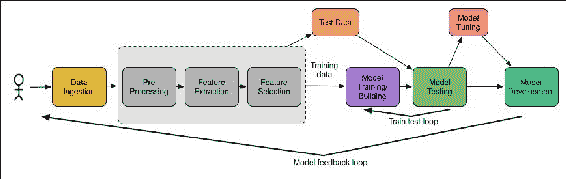
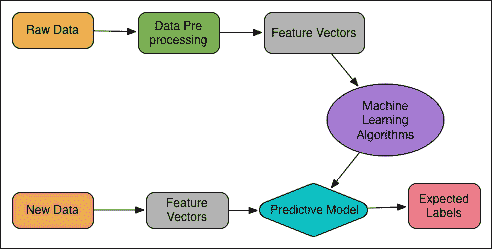
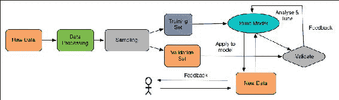
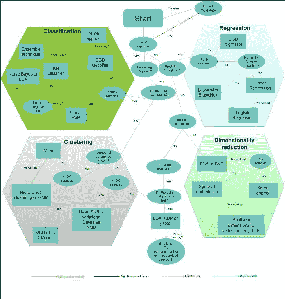

# 第二章。机器学习最佳实践

本章的目的是为那些在典型的统计培训中可能不会接触到统计学方法的人提供统计学**机器学习** ( **ML** )技术的概念性介绍。本章还旨在用几个步骤将一个新手从机器学习的最低知识一路带到一个知识渊博的实践者。本章的第二部分着重于根据应用类型和要求给出一些选择合适的机器学习算法的建议。然后，在应用大规模机器学习管道时，它将引导一些最佳实践。简而言之，本章将讨论以下主题:

*   什么是机器学习？
*   机器学习任务
*   实际的机器学习问题
*   Spark 中的大规模机器学习 API
*   实用的机器学习最佳实践
*   为您的应用选择正确的算法

# 什么是机器学习？

在本节中，我们将尝试从计算机科学、统计学和数据分析的角度来定义术语机器学习。然后我们将展示分析机器学习应用程序的步骤。最后，我们将讨论一些典型的和新兴的机器学习任务，然后说出一些需要解决的实际机器学习问题。

## 现代文学中的机器学习

让我们看看著名的机器学习教授，CMU 机器学习系主任、卡耐基梅隆大学教授汤姆·米切尔在他的文献中是如何定义机器学习这个术语的(*汤姆·m·米切尔，机器学习的学科，CMU-ML-06-108，2006 年 7 月*，[http://www.cs.cmu.edu/~tom/pubs/MachineLearning.pdf](http://www.cs.cmu.edu/~tom/pubs/MachineLearning.pdf)):

> *机器学习是计算机科学和统计学交叉的自然产物。我们可能会说，计算机科学的决定性问题是‘我们如何才能制造出解决问题的机器，以及哪些问题本来就容易处理/难以解决？’在很大程度上定义统计学的问题是“从数据加上一组建模假设可以推断出什么，可靠性如何？”机器学习的定义问题建立在两者之上，但它是一个不同的问题。虽然计算机科学主要关注如何手动编程计算机，但机器学习关注的是如何让计算机自己编程的问题(根据经验加上一些初始结构)。虽然统计主要关注从数据中可以推断出什么结论，但机器学习包含了更多的问题，例如什么计算架构和算法可以用来最有效地捕获、存储、索引、检索和合并这些数据，如何在一个更大的系统中协调多个学习子任务，以及计算可处理性的问题。*

我们认为汤姆教授的这个定义是不言自明的。然而，在接下来的两个小节中，我们将从计算机科学、统计学和数据分析的角度对机器学习提供一些更清晰的理解。

### 类型

感兴趣的读者应该关注其他资源，以获得更多关于机器学习及其理论视角的见解。这里我们提供了如下一些链接:*机器学习*:[https://en.wikipedia.org/wiki/Machine_learning](https://en.wikipedia.org/wiki/Machine_learning)。

*机器学习:它是什么以及为什么重要*-[http://www . SAS . com/en _ us/insights/analytics/Machine-learning . html](http://www.sas.com/en_us/insights/analytics/machine-learning.html)。

*机器学习入门*:[https://www.youtube.com/watch?v=NOm1zA_Cats](https://www.youtube.com/watch?v=NOm1zA_Cats)。

*什么是机器学习，它是如何工作的*:[https://www.youtube.com/watch?v=elojMnjn4kk](https://www.youtube.com/watch?v=elojMnjn4kk)。

*使用机器学习进行数据分析简介*:[https://www.youtube.com/watch?v=U4IYsLgNgoY](https://www.youtube.com/watch?v=U4IYsLgNgoY)。

### 机器学习和计算机科学

机器学习是计算机科学的一个分支，它研究算法的设计，这些算法可以从其启发式算法中学习，这些启发式算法通常是从人工智能中的模式识别和计算学习理论的研究中演变而来的。关于机器，艾伦·图灵想到了一个有趣的问题，那就是，*机器会思考吗？*事实上，有一些很好的理由相信一个足够复杂的机器有一天会通过无限制的图灵测试；让我们把这个问题推迟到图灵测试，但是通过了。然而，机器至少可以学习。随后，1959 年，阿瑟·萨缪尔是第一个将“T2”机器学习定义为“T4”研究领域的人，该领域赋予计算机无需明确编程就能学习的能力。典型的机器学习任务是概念学习、预测建模、分类、回归、聚类、降维、推荐系统、深度学习和从大规模数据集中寻找有用的模式。

最终的目的是提高学习的自动化程度，这样就不再需要人工交互，或者尽可能降低人工交互的水平。虽然机器学习有时与**知识发现和数据挖掘** ( **KDDM** )混为一谈，但后者子领域则更侧重于探索性数据分析，被称为无监督学习——如聚类分析、异常检测、**人工神经网络** ( **ANN** )等。

其他机器学习技术包括监督学习，其中学习算法分析训练数据并产生可用于将新示例映射到预测的推断函数。分类和回归分析是监督学习的两个典型例子。另一方面，强化学习受到行为主义心理学的启发(另见[https://en.wikipedia.org/wiki/Behaviorism](https://en.wikipedia.org/wiki/Behaviorism)，它通常关注软件代理如何通过最大化`reward`功能在新的*环境*中执行动作。动态规划和智能代理是强化学习的两个例子。

典型的机器学习应用可以分为科学知识发现和更多的商业应用，从机器人或**人机交互** ( **HCI** )到反垃圾邮件过滤和推荐系统。

### 统计和数据分析中的机器学习

机器学习探测算法的研究和构造(另见[https://en.wikipedia.org/wiki/Algorithm](https://en.wikipedia.org/wiki/Algorithm))，该算法可以从试探法中学习(另见[https://en.wikipedia.org/wiki/Learning](https://en.wikipedia.org/wiki/Learning))并对数据做出有意义的预测。然而，为了做出数据驱动的预测或决策，这种算法通过从训练数据集构建模型(也参见[https://en.wikipedia.org/wiki/Mathematical_model](https://en.wikipedia.org/wiki/Mathematical_model))来运行，比遵循严格静态的程序或指令更快。机器学习也与计算统计的本质密切相关，并且经常重叠。另一方面，计算统计学是统计学的一个应用领域，其重点是通过计算机方法进行预测。此外，它对数学优化有很强的阻碍，数学优化提供方法和计算任务以及理论和应用领域。由于对强大的数学背景知识的需求，在数学中不可行的任务，机器学习最适合，并且可以作为其替代应用。

另一方面，在数据分析领域中，机器学习是一种用于设计复杂模型和算法的方法，这些模型和算法使自己朝着预测未来结果的方向前进。这些分析模型允许研究人员、数据科学家、工程师和分析师产生可靠、可重复和可再现的结果，并通过学习数据中过去的关系(启发式)和趋势来挖掘隐藏的见解。我们将再次参考汤姆教授的一个著名定义，他在文献中从计算机科学的角度解释了学习的真正含义(*汤姆·米契尔，机器学习的学科，CMU-ML-06-108，2006 年 7 月*，[http://www.cs.cmu.edu/~tom/pubs/MachineLearning.pdf](http://www.cs.cmu.edu/~tom/pubs/MachineLearning.pdf)):

> *如果一个计算机程序在任务 T 中的表现随着经验 E 而提高，那么该计算机程序就被称为从经验 E 中学习某类任务 T 和表现量度 P*

因此，我们可以得出结论，一个或多个计算机程序可以:

*   从数据和历史中学习
*   可以通过经验来改进
*   交互式增强可用于预测问题结果的模型

此外，下图有助于我们理解机器学习的整个过程:

图 1:机器学习一目了然。

## 典型的机器学习工作流程

图 2 显示了一个典型的机器学习应用程序，包括从输入、处理到输出的几个步骤，形成了一个科学的工作流程。典型的机器学习应用包括以下步骤:

1.  加载样本数据。
2.  将数据解析为算法的输入格式。
3.  预处理数据并处理丢失的值。
4.  将数据分成两组，一组用于构建模型(训练数据集)，另一组用于测试模型(测试数据集或验证数据集)。
5.  运行算法来构建或训练你的 ML 模型。
6.  用训练数据做预测，观察结果。
7.  使用测试数据测试和评估模型，或者使用第三个数据集(称为验证数据集)通过某种交叉验证技术验证模型。
8.  调整模型以获得更好的性能和准确性。
9.  扩大模型规模，以便将来可以处理大量数据集。
10.  Deploy the ML model in commercialization:

    

    图 2:机器学习工作流程。

通常，机器学习算法有一些方法来处理数据集的偏斜度；不过，这种偏斜有时会非常大。在第 4 步中，实验数据集通常被随机分成训练集和测试集，这被称为采样。训练数据集用于训练模型，而测试数据集用于最终评估最佳模型的性能。更好的做法是尽可能多地使用训练数据集来提高泛化性能。另一方面，在计算预测误差和相关度量时，建议只使用一次测试数据集，以避免过拟合和欠拟合问题。

### 类型

过拟合是一种统计特性，通过它可以描述除正常关系和潜在关系之外的随机误差和噪声。它主要发生在相对于观测值或特征的数量有太多超参数的时候。另一方面，欠拟合指的是既不能对训练数据建模，也不能对新数据进行泛化以对模型进行评估或适应性的模型。

然而，这些步骤由几种技术组成，我们将在[第 5 章](05.html#190862-0b803698e2de424b8aa3c56ad52b005d "Chapter 5.  Supervised and Unsupervised Learning by Examples")、*通过示例进行监督和非监督学习*中详细讨论这些技术。步骤 9 和 10 通常被认为是高级步骤，因此将在后面的章节中讨论。

# 机器学习任务

根据学习系统可用的学习反馈的性质，机器学习任务或机器学习过程通常分为三大类。监督学习、非监督学习和强化学习；这三种机器学习任务如图*图 3* 所示，本节将进行讨论:

图 3:机器学习任务。

## 监督学习

一个**监督学习**应用程序基于一组例子进行预测，目标是学习将输入映射到与现实世界一致的输出的一般规则。例如，垃圾邮件过滤数据集通常包含垃圾邮件和非垃圾邮件。因此，我们可以知道训练集中哪些消息是 spam，哪些是非 spam。然而，我们可能有机会使用这些信息来训练我们的模型，以便对新的和看不见的消息进行分类。图 4 显示了监督学习的示意图。

换句话说，在这种情况下，用于训练 ML 模型的数据集用感兴趣的值来标记，并且监督学习算法在这些值标签中寻找模式。在算法找到所需的模式后，这些模式可用于对未标记的测试数据进行预测。这是最流行和最有用的机器学习任务类型，Spark 也不例外，它的大多数算法都是有监督的学习技术:

图 4:行动中的监督学习。

## 无监督学习

在**无监督学习**中，数据点没有相关的标签，或者换句话说，无监督学习中训练数据集的正确类别是未知的，如图*图 5* 所示。因此，必须从非结构化数据集中推断类，这意味着无监督学习算法的目标是通过描述数据的结构，以某种结构化的方式对数据进行预处理。

为了克服无监督学习中的这一障碍，聚类技术通常用于基于某些相似性度量对未标记样本进行分组，挖掘隐藏模式以进行特征学习。从技术上讲，我们可以写下一个生成模型，然后告诉数据找到解释数据的参数。如果我们不满意这个解释的可能性，接下来会发生什么？答案是，我们应该告诉数据再做一次，直到我们使用一些有效的算法或技术。

现在一个新的问题可能会出现在你的脑海中，为什么我们要在数据上贴标签？或者，我们不能只欣赏当前顺序的数据，认识到每个数据都是唯一的，并且是雪花之前的数据吗？换句话说，只要有一点监管，我们的数据就可以成长为它想成为的任何东西！那么，为什么还要考虑未标记的数据呢？

嗯，关于这个有一些更深层次的问题。例如，数据中的大部分变化来自与我们期望的标记方案无关的现象。一个更现实的例子是 Gmail 如何使用监督学习技术将电子邮件分类为垃圾邮件和垃圾邮件，其中数据可能使用其参数来解释其语义，而我们只关心其语法属性:

图 5:无监督学习。

## 强化学习

**强化学习**是模型本身从一系列动作或行为中学习的技术。数据集的复杂度或样本复杂度在算法成功学习目标函数所需的强化学习中非常重要。此外，为了响应实现最终目标的每个数据点，在与外部环境交互时，应确保奖励功能的最大化，如*图 6* 所示。为了使最大化更容易，奖励函数可以通过惩罚不好的行为或奖励好的行为来利用。

为了获得最高的回报，应该用一种策略来修改算法，该策略还允许机器或软件代理定期学习其行为。这些行为可以一劳永逸地学习，或者机器学习模型可以随着时间的推移不断适应:

图 6:强化学习。

例如，强化学习在机器人学中很常见；算法必须根据一组传感器读数来选择机器人的下一个动作。它也自然适合**物联网** ( **物联网**)应用，在这种应用中，计算机程序与动态环境交互，在这种环境中，它必须执行某个目标，而无需明确的导师。另一个例子是游戏 **Flappy Bird** ，它已经被训练自己玩。

## 推荐系统

推荐系统是一种新兴的应用，它是信息过滤系统的一个子类，用于预测用户通常对某个项目的评价或偏好。推荐系统的概念在最近几年变得非常普遍，并随后应用于不同的应用中。最受欢迎的可能是产品(例如，电影、音乐、书籍、研究文章、新闻、搜索查询、社交标签等)。推荐系统通常可以分为四类:

*   协同过滤系统，其中消费者偏好的积累和对其他用户的推荐是基于行为模式的相似性。
*   基于内容的系统，其中监督机器学习用于说服分类器区分用户感兴趣和不感兴趣的项目。
*   混合推荐系统是一种最新的研究和混合方法(即结合协同过滤和基于内容的过滤)。网飞就是这种推荐系统的一个很好的例子，它使用**受限玻尔兹曼机器** ( **RBM** )和一种用于大型电影数据库的矩阵分解算法，比如 IMDb。这种简单地通过比较相似用户的观看和搜索习惯来推荐电影或电视剧或流媒体的推荐方式，称为评分预测。
*   基于知识的系统，其中关于用户和产品的知识被用来推理满足用户需求的东西，使用感知树、决策支持系统和基于案例的推理。

## 半监督学习

在有监督学习和无监督学习之间，有一个很小的地方可以进行**半监督学习**；其中 ML 模型通常接收不完整的训练信号。更具统计意义的是，ML 模型接收的训练集缺少一些目标输出。半监督学习或多或少是基于假设的，通常使用三种假设算法作为未标记数据集的学习算法。使用以下假设:平滑度、聚类和流形假设。

换句话说，半监督学习还可以表示为**弱监督**或**自举**技术，用于使用未标记示例的隐藏财富来增强从少量标记数据的学习。新兴的例子包括*半监督期望最小化，以及人类认知和传递性支持向量机*中的概念学习。

# 实际的机器学习问题

机器学习到底是什么意思？在本章的开头，我们已经看到了这个术语的一些令人信服的定义以及术语*学习*的含义。然而，现实是机器学习本身是由需要解决的问题来定义的。在这一节中，我们将首先强调机器学习课程，然后我们将列出一些众所周知的和普遍使用的真实世界机器学习问题的例子。典型的类包括分类、聚类、规则提取和回归，这些都将被讨论。

此外，我们还将基于标准机器学习问题的主要分类来讨论这些问题。这很重要，因为知道我们可能面临的问题类型可以让我们思考我们需要的数据。另一个重要的事实是，在了解一些实际的机器学习问题之前，你可能会面临开发机器学习应用程序的困难。换句话说，要知道问题，我们首先需要知道数据。因此，本章将讨论算法的类型及其最优性；然而，数据操作将在[第 3 章](03.html#TI1E2-0b803698e2de424b8aa3c56ad52b005d "Chapter 3. Understanding the Problem by Understanding the Data")、*通过理解数据来理解问题*中进行讨论。

## 机器学习课

我们上面提到的问题类是我们在日常生活中使用机器学习技术时参考的大多数问题的标准。然而，仅仅知道 ML 类是不够的，我们还需要知道机器正在学习什么类型的问题，因为你会发现许多问题只是简单的问题解决，根本无助于 ML 模型或代理的学习。

当你认为一个问题是机器学习问题时，更确切地说，你想到的是一个决策问题，这个问题需要从可以被称为机器学习问题的数据中建模。换句话说，作为数据科学家或人类专家，如果你有足够的时间通过了解可用的数据集来回答特定的问题，你或多或少可以应用一个合适的机器学习问题。因此，我们可以假设使用一些最大似然算法的可解问题主要有两个部分——数据本身，它可以用来指出问题的具体观察，其次是可用解决方案质量的定量测量。一旦你成功地将一个问题识别为最大似然问题，你可能会思考你可以很容易地用它来表达什么类型的问题，或者你的客户会要求什么类型的后果，或者需要满足什么样的要求。正如在上面的章节中已经说过的，更常用的机器学习类是:分类、聚类、回归和规则提取。我们现在将提供每个类的简短概述。

### 分类和聚类

如果实验数据集被标记，这意味着已经给它分配了一个类。例如，垃圾邮件检测期间的垃圾邮件/非垃圾邮件，或者信用卡欺诈识别期间的欺诈/非欺诈。然而，如果将基于其做出基本决策或建模的数据集是未标记的，则需要手动或通过算法做出新的标记。这可能很难，可以认为是一个判断问题。相反，刻画几个组之间的差异或相似性可能在计算上更难。

另一方面，聚类处理未标记或未标记的数据。但是，它仍然可以根据相似性和您所拥有的数据中的其他自然结构度量来分组。仅通过没有名字的脸来组织数字相册中的图片可能是一个例子，在这种情况下，像我们这样的人类用户必须手动为组分配名字。同样，手动标记多个图像文件可能会产生相同的计算复杂性；我们将在后面的章节中提供一些例子，说明 Spark 如何提供几种 API 来解决这些问题。

## 规则提取和回归

根据给定的数据集，命题规则可以通过 *if 中的先行和后继来生成...然后是定义机器学习代理行为的*风格。这种类型的规则生成技术通常被称为*规则提取*。你可能想知道这样的规则是否存在，然而，它们通常不是直接的。这意味着用于发现数据中属性之间有统计学意义或有统计学意义的关系的方法。

规则提取的一个例子是从面向业务的事务数据库中挖掘项目之间的关联规则。非技术上，一个实际的例子可能是发现购买啤酒和尿布之间的关系或联系，这说明了顾客的愿望和机会。然而，可能会出现一些情况，其中一些超出规则或数据的预测不一定直接涉及。

现在让我们来谈谈回归，其中数据被标记为实值。更准确地说，是一些浮点值，而不是数据中有标签。理解一个例子最简单的方法是时间序列数据，类似于股票或货币的价格随时间变化。在这些类型的数据中，回归任务是通过一些回归建模技术对新的和未预测的数据进行预测。

# 最广泛使用的机器学习问题

你会在日常生活中发现大量使用机器学习相关问题的例子，因为它们解决了广泛使用的技术或算法中的困难部分。我们经常使用许多基于桌面或网络的应用程序来解决您的数据问题，即使不知道使用了什么底层技术。你会惊讶地知道，他们中的许多人实际上使用广泛使用的机器学习算法来让你的生活更容易。周围有很多机器学习问题。在这里，我们将提到一些真正代表机器学习的示例问题:

*   **垃圾邮件检测或垃圾邮件过滤**:给定收件箱中的一些电子邮件，任务是识别哪些电子邮件是垃圾邮件，哪些是非垃圾邮件(通常称为 ham)电子邮件。现在最具挑战性的部分是开发一个可以应用的 ML 应用程序，这样它就可以只识别留在收件箱中的非垃圾邮件。并将垃圾邮件移动到相应的垃圾邮件文件夹中，或者将其从电子邮件帐户中永久删除。一个典型的例子是手动使用 Gmail 时可能会做什么，但是如果你有一个 ML 应用程序，该应用程序会自动完成。
*   **异常检测或异常值检测**:异常检测处理对数据集中的项目、事件或不符合预期模式的观察的识别；换句话说，可疑模式的识别。最常见的例子是使用一些机器学习应用程序的网络异常检测。现在，具有挑战性的任务是开发一个 ML 应用程序，该应用程序可以成功地应用于从通过网络传播的数据中简单地识别异常数据点。
*   **信用卡诈骗检测**:现在信用卡诈骗非常普遍。从网上购物中窃取信用卡相关信息并以非法方式使用在许多国家都有发生。假设您有一个特定月份的客户事务数据库。现在具有挑战性的任务是开发一个 ML 应用程序来识别那些由客户自己进行的交易和那些由其他人非法进行的交易。
*   **语音识别**:识别一个语音，并将其转换为相应的文本命令，然后执行一些动作，就像智能代理一样。使用最广泛的应用包括苹果 Siri、三星 S-Voice、亚马逊的 Echo(消费者空间)、微软 Cortana(特别是因为 Cortana 有可扩展性和集成的 SDK 等等)。另一个例子是通过识别语音锁定或解锁你的智能手机。
*   **数字/字符识别**:假设你在一个信封上/里面有一个手写的邮政编码或地址或信息，现在数字/字符识别的任务是对不同人制作的每个手写字符的数字或字符进行识别和分类。在这方面，一个高效的 ML 应用程序可以帮助阅读和理解手写邮政编码或字符，并根据地理区域，或者更确切地说，根据图像分割对信封内容进行分类。
*   **物联网**:大规模传感器数据分析，用于根据实时流数据进行预测和分类。比如智能客厅监控，包括水位检查、室温检查、家电控制等等。
*   **游戏分析**:针对运动、游戏和基于控制台的游戏配置文件的分析，以预测追加销售并瞄准应用内购买和修改。
*   **人脸检测**:给定一个几百张或者几千张照片的数码相册，任务是识别那些与给定人物相似的照片。在这种情况下，一个高效的 ML 应用程序可以帮助人们组织照片。
*   **产品推荐**:提供客户的购买历史以及大量产品库存，目标是识别客户可能有兴趣使用 ML 系统购买的产品。亚马逊、脸书和谷歌 Plus 等商业和科技巨头都为用户推荐了这项功能。
*   **股票交易**:给定一个股票市场的当前和历史价格，借助 ML 系统预测股票应该买入还是卖出，以便获利。

以下是一些正在出现的机器学习的例子和当前研究的需求:

*   **隐私保护数据挖掘**:从面向业务的零售数据库中的最大频繁模式和关联规则中挖掘客户的购买规则，以增加未来的购买量
*   **作者姓名消歧**:通过手动验证来自一组给定出版物的作者列表的聚类结果的随机样本对来评估消歧性能
*   **推荐系统**:利用关联规则挖掘的基于点击流数据的推荐系统
*   **文本挖掘**:例如从给定的文本语料库中进行抄袭检查
*   **情绪分析**:这几天很多决策都是商业和科技公司根据别人的意见做出的，这将是一个创新机器学习的好地方
*   **语音理解**:给定用户的话语，目标是识别用户做出的特定请求。这个问题的模型将允许程序理解并尝试满足这个请求。例如，在会议模式下搭载 Siri 和三星语音记录器的 iPhone 就实现了这一功能

其中一些问题是人工智能、自然语言处理和计算机视觉中最难的问题，可以使用最大似然算法来解决。同样，我们将在接下来的章节中尝试开发一些强调这些问题的 ML 应用程序。

# Spark 中的大规模机器学习 API

在这一节中，我们将描述由 Spark 机器学习库(Spark MLlib 和 Spark ML)引入的两个关键概念，以及与我们在上面几节中讨论的监督和非监督学习技术相一致的最广泛使用的实现算法。

## 火花机器学习库

如前所述，在前 Spark 时代，大数据建模人员通常使用统计语言(如 R、STATA 和 SAS)来构建他们的 ML 模型。然后数据工程师用 Java 重新实现同样的模型，例如，部署在 Hadoop 上。

然而，这种工作流缺乏效率、可伸缩性、吞吐量和准确性以及延长的执行时间。

使用 Spark，可以重新构建、采用和部署相同的 ML 模型，使整个工作流更加高效、健壮和快速，这使您能够提供实际的洞察力来提高性能。Spark 机器学习库分为两个包:Spark MLlib ( `spark.mllib`)和 Spark ML ( `spark.ml`)。

### spar mllib

MLlib 是 Spark 的可扩展机器学习库，它是 Spark Core API 的扩展，提供了一个易于使用的机器学习算法库。算法是用 Java、Scala 和 Python 实现和编写的。Spark 支持存储在单台机器上的本地向量和矩阵数据类型，以及由一个或多个 rdd 支持的分布式矩阵:

<colgroup class="calibre11"><col class="calibre12"> <col class="calibre12"> <col class="calibre12"></colgroup> 
| **spar mllib** |   |   |
| **ML 任务** | **离散** | **连续** |
| 监督 | 分类:逻辑回归和正则化变体线性 SVM奈伊夫拜厄斯决策树随机森林梯度增强树 | 回归:线性回归和正则化变体线性最小二乘法套索和岭回归等渗回归 |
| 无人监督的 | 聚类:k 均值高斯矩阵**幂迭代聚类** ( **PIC** )**潜在狄利克雷分配** ( **LDA** )平分 K 均值流式 K 均值 | 降维、矩阵分解:主成分分析奇异值分解交替最小二乘法 |
| 加强 | 不适用的 | 不适用的 |
| 推荐系统 | 协同过滤:网飞的建议 | 不适用的 |

表 1:火花 MLlib 一目了然。

*   **图例**:连续:对连续变量进行预测，例如，对未来几天的最高温度进行预测
*   **离散**:给特定的观测值分配离散的类别标签，作为预测的结果，例如，在天气预报中，它可以是晴天、雨天或下雪天的预测

Spark MLlib 的美不胜收。例如，使用 Scala、Java 和 Python 实现的算法是高度可扩展的，并且利用了 Spark 处理大量数据的能力。它们正在快速走向基于内存操作的并行计算，与使用基于数据集、数据帧或**有向无环图** ( **DAG** )的 RDD APIs 的 MapReduce 数据处理相比，这要快 100 倍(它们还支持基于磁盘的操作，比 MapReduce 的正常数据处理快 10 倍)。

它们也是多种多样的，因为它们涵盖了回归分析、分类、聚类、推荐系统、文本分析、频繁模式挖掘等常见的机器学习算法，而且它们显然涵盖了构建可扩展的机器学习应用程序所需的所有步骤。

### 火花 ML

Spark ML 增加了一套新的机器学习 API，让用户在数据集之上快速组装和配置实用的机器学习管道。Spark ML 的目标是提供一套统一的高级应用编程接口，这些接口建立在数据框架而不是关系数据库之上，帮助用户创建和调整实用的机器学习管道。Spark ML API 将机器学习算法标准化，使学习任务更容易为数据科学家将多种算法组合到单个管道或数据工作流中。

Spark ML 使用了 DataFrame 的概念(虽然在 Java 中已经过时，但在 Python 和 R 中仍然是主要的编程接口)，它是在 Spark SQL 的 Spark 1.3.0 版本中作为机器学习数据集引入的。数据集包含不同的数据类型，如存储文本的列、特征向量和数据的真实标签。除此之外，Spark ML 还使用转换器将一个数据帧转换成另一个数据帧，反之亦然，其中估计器的概念用于拟合数据帧以产生新的转换器。另一方面，管道应用编程接口可以将多个转换器和估计器约束在一起，以指定一个最大似然数据工作流。引入参数的概念是为了在 ML 应用程序的开发过程中，指定所有的转换器和估计器共享一个通用的 API:

<colgroup class="calibre11"><col class="calibre12"> <col class="calibre12"> <col class="calibre12"></colgroup> 
| **火花 ML** |   |   |
| **ML 任务** | **离散** | **连续** |
| 监督 | 分类:逻辑回归决策树分类器随机森林分类器梯度增强的树分类器多层感知分类器一对多分类器 | 回归:线性回归决策树回归随机森林回归梯度增强的树回归生存回归 |
| 无人监督的 | 聚类:k 均值**潜在狄利克雷分配** ( **LDA** ) | 树集合:随机森林梯度增强树 |
| 加强 | 不适用的 | 不适用的 |
| 推荐系统 | 不适用的 | 不适用的 |

表 2:火花 ML 一目了然(图例与表 1 相同)。

如表 2 所示，Spark ML 还提供了几种分类、回归、决策树和树集合，以及一种为在数据帧之上开发 ML 管道而实现的聚类算法。主动实现下的优化算法称为**or ant-Wise 有限记忆拟牛顿** ( **OWL-QN** )，也是 L-BFGS 的一种高级算法，可以有效处理 L1 正则化和弹性网(另见 Spark ML Advanced 主题，[https://spark.apache.org/docs/latest/ml-advanced.html](https://spark.apache.org/docs/latest/ml-advanced.html))。

### 从业人员重要注意事项

然而，目前只支持皮尔森和斯皮尔曼的相关性，在未来的火花版本中还会增加更多的相关性。与其他统计函数不同的是，Spark 也支持分层抽样，它可以作为键值对在 rdd 上执行；但是，Python 开发人员还需要添加一些功能。目前火花机器学习库中没有强化学习算法模块(请参考*表 1**表 2* )。Spark MLlib 的当前实现提供了一个并行的 FP-growth 实现，用于挖掘频繁模式和关联规则。但是，您必须相应地定制挖掘最大频繁模式的算法。在接下来的章节中，我们将提供一个可扩展的 ML 应用程序来挖掘隐私保护最大频繁模式。

另一个事实是，Spark 中基于协作的推荐系统的当前实现不支持使用实时流数据，然而，在后面的章节中，我们将尝试使用关联规则挖掘展示一个基于点击流数据的实用推荐系统(参见 Mitchell，Tom M. *《机器学习的纪律》*，2006，[http://www.cs.cmu.edu/](http://www.cs.cmu.edu/))。CMU。网络。2014 年 12 月)。然而，有些算法不可用或尚未添加到 Spark ML 中，最值得注意的是降维就是这样一个例子。

然而，开发人员可以将 Spark MLlib 中的这些技术的实现与 Spark ML 中的其余算法无缝地结合起来，作为混合的或可互操作的 ML 应用程序。Spark 的神经网络和感知是受大脑启发的学习算法，涵盖了 Spark ML APIs 中尚未实现的多类、两类和回归问题。

# 实用的机器学习最佳实践

在本节中，我们将描述在开发特别感兴趣的机器学习应用程序之前需要遵循的一些良好的机器学习实践，如*图 7* 中所述:

图 7:机器学习系统化过程。

一个可扩展和精确的 ML 应用程序要求遵循一个系统的方法来开发它，从问题定义到呈现结果，可以总结为四个步骤:问题定义和制定，数据准备，找到适合机器学习的算法，最后，在机器学习模型部署后呈现结果。嗯，这些步骤可以如图*图 6* 所示。

## 开发 ML 应用程序前的最佳实践

机器学习系统的学习可以表述为表示、评估和优化的总和。换句话说，根据 Pedro D 等人(Pedro Domingos，*关于机器学习的一些有用的知识*、[https://homes.cs.washington.edu/~pedrod/papers/cacm12.pdf](https://homes.cs.washington.edu/~pedrod/papers/cacm12.pdf)):

*学习=表征+评价+优化*

考虑到这个公式，我们将在进入 ML 应用程序开发之前为从业者提供一些建议。

### 好的机器学习和数据科学价值巨大

那么，有效的机器学习应用程序开发需要什么呢？在开始开发 ML 应用程序之前，我们实际上需要四个兵工厂；包括:

*   数据基元(或者更坦率地说是实验数据)。
*   流水线综合工具(用于理解机器学习步骤中的数据和控制流程)。
*   一个有效和稳健的错误分析工具。
*   验证或确认工具(用于验证或确认最大似然模型的预测精度或性能)。然而，最重要的是，如果没有一些强大的理论基础，加上价值巨大的良好数据科学，整个过程将是徒劳的。事实上，许多数据科学家和机器学习专家经常引用这样的说法:*如果你能把你的问题说成是一个简单的优化问题，那么你就差不多完成了*(见*数据分析& R* ，[http://advanceddataanalytics . net/2015/01/31/condented-news-7/](http://advanceddataanalytics.net/2015/01/31/condensed-news-7/))。

这意味着在你开始你的机器学习之旅之前，如果你能确定你的问题是否是机器学习问题，你将能够找到一些合适的算法来开发你的 ML 应用程序。当然，在实践中，大多数机器学习应用程序都不能变成简单的优化问题。因此，像您这样的数据科学家有责任管理和维护复杂的数据集。之后，您将不得不处理其他问题，例如在设计机器学习管道以解决我们前面提到的问题时出现的分析问题。

因此，最佳实践是使用 Spark MLlib、Spark ML、GraphX 和 Spark Core APIs 以及最佳实践数据科学试探法来一起开发您的机器学习应用程序。现在你可能会想到从中获取利益；是的，好处显而易见，具体如下:

*   内置分布式算法
*   内存和基于磁盘的数据计算和处理
*   迭代工作负载的内存能力
*   算法精度和性能
*   更快的数据清理、功能工程和功能选择、培训和测试
*   预测结果的实时可视化
*   向更好的性能调整
*   新数据集的适应性
*   随着数据集的增加而扩展

### 最佳实践–功能工程和算法性能

在最佳实践中，特征工程应该被认为是机器学习最重要的部分之一。问题是从实验数据集中找到一个更好的非技术特征表示。与此同时，使用哪些学习算法或技术也很重要。参数调优，当然，除此之外，最终的选择更多的是通过您将要开发的 ML 模型进行实验。

然而，在实践中，通过**现成的**方法(也称为功能性或 **OOTB** 简称，这是感兴趣的产品的一个特性，在安装或配置后立即起作用)和良好的数据预处理来掌握天真的性能基线是微不足道的。因此，您可能会不断地这样做，以便知道基线在哪里，以及这个性能是否达到了令人满意的水平，或者是否足以满足您的需求。

一旦你训练好了所有现成的方法，它总是被推荐的，试着把它们打包在一起是个好主意。此外，为了解决最大似然问题，通常你可能需要知道这样一个事实:计算困难的问题(如第 2 节所示)需要特定领域的知识或者大量挖掘数据，或者两者都需要。因此，广泛接受的特征工程技术和特定领域知识的结合将帮助你的最大似然算法/应用程序/系统解决预测相关问题。

简而言之，如果你有所需的数据集和强大的算法，可以通过学习复杂的特征来利用数据集的优势，几乎可以保证你会成功。此外，有时领域专家在选择好的特性时可能是错误的；因此，多个领域专家(问题领域专家)、更结构化的数据和 ML 专业知识的结合总是有帮助的。

最后但并非最不重要的是，有时我们建议考虑错误率，而不仅仅是准确性。例如，假设具有 99%精度和 50%误差的 ML 系统比具有 90%精度但 25%误差的 ML 系统更差。

### 谨防过配和欠配

新手数据科学家经常犯的一个常见错误是容易出现过度拟合的问题，这种问题可能会在通过听觉而不是归纳来构建 ML 模型时演变。更确切地说，如果你根据训练数据而不是测试或验证数据来评估你的模型，你可能无法清楚地说明你的模型是否过度拟合。常见的症状有:

*   用于训练的数据的预测准确度可能会过高(也就是说，有时甚至是 100%)
*   与对新数据的随机预测相比，该模型可能会表现得更好一些

有时 ML 模型本身变得不适合特定的调优或数据点，这意味着模型变得过于简单。我们的建议(和我们相信的其他建议一样)如下:

*   将数据集分成两组来检测过拟合情况，第一组用于训练和模型选择，称为训练集；第二个是测试集，用于评估代替 ML 工作流部分陈述的模型
*   或者，您也可以通过使用更简单的模型(例如，优先于高斯核 SVM 的线性分类器)或通过扩大 ML 模型的正则化参数(如果可用)来避免过度拟合
*   使用正确的参数数据值调整模型，以避免过拟合和欠拟合

Hastie 等人(Hastie Trevor，Tibshirani Robert，Friedman Jerome，*统计学习的要素:数据挖掘、推理和预测*，第二版，2009)另一方面，已经建议将大规模数据集拆分为三个集合:训练集(50%)、验证集(25%)和测试集(25%)(大致如此)。他们还建议使用训练集建立模型，并使用验证集计算预测误差。推荐使用测试集来评估最终模型的泛化误差。

如果在监督学习期间可用的标记数据量较小，则不建议分割数据集。在这种情况下，使用交叉验证或训练分割技术(这将在[第 7 章](07.html#1O8H62-0b803698e2de424b8aa3c56ad52b005d "Chapter 7. Tuning Machine Learning Models")、*调整机器学习模型、*中讨论，并有几个例子)。更具体地说，将数据集分成大小(大致)相等的 10 个部分，然后对于这 10 个部分中的每一个，迭代训练分类器，并使用第 10 个部分来测试模型。

### 继续关注并结合火花 MLlib 和火花 ML

管道设计的第一步是创建构建块(作为由节点和边组成的有向或无向图)，并在这些块之间建立链接。然而，作为一名数据科学家，您也应该关注节点(原语)的扩展和优化，以便能够在后期扩展应用程序来处理大规模数据集，从而使您的 ML 管道的性能保持一致。管道过程还将帮助您使模型适应新数据集。然而，这些原语中的一些可能被明确定义为特定的域和数据类型(例如，文本、图像、视频、音频和时空)。

除了这些类型的数据，原语还应该用于通用领域统计或数学。根据这些原语来转换您的 ML 模型将使您的工作流更加透明、可解释、可访问和可解释。最近的一个例子是 ML-Matrix，它是一个分布式矩阵库，可以在 Spark 之上使用:

图 8:保持调优并互操作 ML、MLlib 和 GraphX。

正如我们在上一节中已经说过的，作为一名开发人员，您可以将 Spark MLlib 中的实现技术与 Spark ML、Spark SQL、GraphX 和 Spark Streaming 中开发的算法无缝地结合起来，作为 RDD、数据框架和数据集之上的混合或可互操作的 ML 应用程序，如图 8 所示。例如，可以使用混合模型开发基于物联网的实时应用程序。因此，这里的建议是保持对您周围的最新技术的关注或同步，以改进您的 ML 应用程序。

### 使 ML 应用程序模块化，简化流水线综合

在构建您的 ML 管道时，另一个好的并且经常使用的实践是将 ML 系统模块化。一些有监督的学习问题可以使用通常被称为广义线性模型的非常简单的模型来解决。然而，这取决于你将使用的数据，而其他人根本不使用。

因此，要聚合一系列简单的线性二进制分类器，请尝试采用轻量级模块化体系结构。这可能是在工作流主干或算法级别。优势显而易见，因为您的应用程序的模块化体系结构以并行和分布式的方式处理大量数据流。因此，我们建议您使用文献中提到的三种关键创新机制:加权阈值采样、逻辑校准和智能数据划分(例如，于进；尼克·杜菲尔德；杰弗里·埃尔曼；帕特里克·哈夫纳；Subhabrata Sen 张，，*大型网络流级流量分类的模块化机器学习系统*，ACM 数据知识发现学报，第 6 卷，第 1 期，2012 年 3 月。目标是实现可伸缩性和高吞吐量，同时获得 ML 应用程序/系统预测结果的高精度。虽然原语可以作为构建块，但您仍然需要一些其他工具来使用户能够构建 ML 管道。

随后，工作流工具变得越来越普遍，这种工具存在于数据工程师、数据科学家，甚至业务分析师，如 Alteryx、RapidMiner、Alpine Data 和 Dataiku。在这一点上，我们正在谈论和强调业务分析师，因为在最后阶段，您的目标客户将是重视您的 ML 模型的商业公司，对吗？最新版本的 Spark 附带了 Spark ML APIs，用于构建机器学习管道和制作管道的领域特定语言(参见[https://en.wikipedia.org/wiki/Domain-specific_language](https://en.wikipedia.org/wiki/Domain-specific_language))。

### 创新 ML 系统的思考

然而，为了开发算法以在可用数据的帮助下连续学习 ML 模型，机器学习背后的观点是自动创建分析模型。不断发展的模型产生越来越积极的结果，并减少了人类互动的需要。这使得最大似然模型能够自动产生可靠且可重复的预测。

从技术上来说，假设您计划使用 ML 算法开发一个推荐系统。那么，开发这个推荐系统的目标是什么呢？机器学习中的产品开发有哪些创新的想法？这两个是在开始开发 ML 应用程序或系统之前应该考虑的典型问题。持续的创新可能很有挑战性，尤其是在推动新思想的时候，理解最大的好处在哪里也很难。机器学习可以提供从端到端的各种路径的创新，例如确定当前产品的弱点、预测分析或识别以前隐藏的模式。

因此，您将不得不考虑大规模计算来离线训练您的 ML 模型，并且稍后您的推荐系统必须能够作为传统的搜索引擎来分析在线推荐。因此，如果您的系统:

*   可以使用您的机器学习应用程序预测购买项目
*   能做产品分析
*   可以作为一种新兴的生产趋势

### 思考大数据复杂性并变得更聪明

如图 9 所示，新的业务模型是可用数据利用的不可避免的扩展，因此考虑大数据及其业务价值可以使业务分析师的工作、生活和思维更聪明，从而使您的目标公司为客户提供价值。除此之外，你还必须调查(更准确地说是分析)竞争对手或更好的公司。

现在的问题是，如何收集和使用企业数据？大数据不仅仅是规模(体积)，它还与其速度、准确性、多样性和价值相关。例如，对于这些类型的复杂性，可以使用 Spark Streaming 解决速度问题，因为基于流的数据也是需要实时分析方法的大数据。对于大数据处理，可以使用 Spark Core 和 Spark MLlib/ML 来处理其他参数，如数量和种类。

嗯，你必须不择手段地管理数据。如果您能够管理数据，从数据中获得的见解将真正改变企业的运营方式，带来大数据的有用特性:

图 9:大数据最佳实践中的机器学习。

在这一点上，光有数据是不够的(参见 Pedro Domingos，*关于机器学习的几个有用的知识，*)，但是从数据中提取有意义的特征并将数据的语义放入模型中更为重要。这就像 LinkedIn 等大多数科技巨头正在通过大规模的机器学习框架，从针对其社区的功能定位中进行开发，这或多或少是一种监督学习技术。工作流程如下:

*   获取数据，提取特征，并设置目标
*   功能和目标连接
*   从串联数据创建快照
*   将快照分成两部分:训练集和测试集
*   从训练集中，通过采样技术准备样本数据
*   使用采样数据训练模型
*   得分
*   根据之前开发的持久模型以及步骤 4 中准备的测试数据评估模型
*   如果找到了最佳模型
*   为目标受众部署模型

那么接下来呢？您的模型还应该能够适应大规模动态数据，例如实时流式物联网数据 PLUS 实时反馈也很重要，这样您的 ML 系统就可以从错误中吸取教训。下一小节将讨论这一点。

### 将机器学习应用于动态数据

原因很明显，因为机器学习给物联网项目带来了具体和动态的方面。最近，机器学习在工业公司中受到欢迎，他们开箱即用地获利。因此，除了每个信息技术供应商之外，所有供应商都在仓促宣布物联网平台和咨询服务。但是通过物联网数据实现财务效益并不是一件容易的事情。此外，许多企业未能清楚地确定随着物联网战略的实施，哪些领域将发生变化。

综合考虑这些积极和消极的问题，您的 ML 模型应该适应大的动态数据，因为大规模的数据意味着数十亿条记录、大的特征空间以及稀疏问题带来的低阳性率。然而，数据是动态的，因此，最大似然模型必须具有足够的适应性；否则你将不得不面对一次糟糕的经历或者迷失在黑洞中。

## 开发 ML 应用程序后的最佳实践

ML 模型/系统开发完成后，最佳实践的典型步骤是:理解预测值的可视化、模型验证、误差和精度分析、模型调整、模型调整，以及轻松处理大规模数据集的放大。

### 如何启用实时 ML 可视化

可视化提供了一个交互界面来保持对 ML 模型本身的调整。因此，如果不可视化预测结果，就很难进一步提高 ML 应用程序的性能。最佳实践可以是这样的:

*   将一些第三方工具与 GraphX 结合在一起，用于大规模图形相关数据的可视化(更多内容将在 *[第 9 章](09.html#25JP22-0b803698e2de424b8aa3c56ad52b005d "Chapter 9.  Advanced Machine Learning with Streaming and Graph Data")**利用流和图形数据的高级机器学习*中讨论)
*   For non-graph data, a call-back interface for the Spark ML algorithm to send and receive messages by incorporating other tools like Apache Kafka:
    *   算法决定什么时候发送什么消息
    *   算法不关心消息是如何传递的
*   A task channel to handle the message delivery service from the Spark Driver program to Spark Client or Spark cluster nodes. The task channel would be communicating using Spark Core at a lower level of abstraction:
    *   它不关心消息的内容或消息的接收者
*   The message is delivered from Spark Client to the browser or visualization client:
    *   我们推荐一起使用 HTML5 **服务器发送事件** ( **SSE** )和 HTTP 分块响应(PUSH)。Spark 与此类技术的结合将在[第 10 章](10.html#2BASE2-0b803698e2de424b8aa3c56ad52b005d "Chapter 10.  Configuring and Working with External Libraries")、*配置和使用外部库*中讨论
    *   拉是可能的；但是，它需要一个消息队列
*   可视化使用`Plot.ly`(请参考[https://plot.ly/](https://plot.ly/))`D3.js`(请参考[https://d3js.org/](https://d3js.org/))等 JavaScript 框架

### 做一些误差分析

随着算法变得越来越普遍，我们需要更好的工具来构建复杂、健壮和稳定的机器学习系统。像 Apache Spark 这样受欢迎的分布式框架将这些想法带到了面向更广泛受众的超大数据集上。因此，如果我们能够绑定分层管道的近似误差和收敛速度，那就更好了。

假设我们可以计算节点的误差线，下一步将是为这些管道提取误差线的机制。然而，在实践中，当 ML 模型被部署用于生产时，我们可能需要工具来确认管道将工作并且不会出现故障或中途停止，并且它可以提供一些预期的错误度量。

### 保持您的 ML 应用程序的优化

设计一两个在简单问题上表现稳定的算法可以被认为是一个很好的开端。然而，有时你可能渴望获得最好的精度，甚至牺牲你宝贵的时间和可用的计算资源。这将是一个更聪明的方法，它不仅能帮助你挤出额外的性能，还能提高你之前设计的机器学习算法的准确性。为了做到这一点，当您调整模型和相关算法时，本质上，您必须对结果有很高的信心。

显然，这些结果将在您指定测试和验证之后可用。这意味着您应该只使用那些减少性能度量差异的技术，以便您可以评估运行更平稳的算法。

与此同时，像大多数数据从业者一样，我们也建议您使用交叉验证技术(通常也称为旋转估计)，该技术具有相当高的折叠数(即 K 折叠交叉验证，其中单个子样本用作测试模型本身的验证数据集，剩余的 K-1 子样本用于训练数据)。虽然确切的折叠数或 K 取决于您的数据集，但是通常使用 10 倍交叉验证，但大多数情况下 K 的值保持不变。我们将在这里提到三个策略，您将需要调整您的机器学习模型:

*   **算法调优**:让你的机器学习算法参数化。之后，调整这些参数的值(如果它们有多个参数)，以影响整个学习过程的结果。
*   **合奏**:有时候天真就好！因此，为了获得更好的结果，继续尝试组合来自多种机器学习方法或算法的结果。
*   **极限特征工程**:如果你的数据中嵌入了复杂的多维结构，ML 算法知道如何发现并利用它来做出决策。

### 保持您的 ML 应用程序的适应性和扩展性

如图 10 所示，根据罗布·芒罗的说法，自适应学习融合了前几代基于规则的简单机器学习和机器智能的深度学习方法:

图 10:四代机器智能(图由罗布·芒罗提供)。

第四代机器学习:自适应学习，(`http://idibon.com/the-fourth-generation-of-machine-learning-adaptive-learning/#comment-175958`)。

研究还表明，自适应学习在预测人们购车意向方面的准确率高达 95%，例如(请参考 Rob Munro，*第四代机器学习:自适应学习*、`http://idibon.com/the-fourth-generation-of-machine-learning-adaptive-learning/#comment-175958`)。此外，如果您的 ML 应用程序能够适应新的环境和新的数据，那么如果提供了足够的基础设施，您的 ML 系统就可以针对不断增加的数据负载进行扩展。

# 为您的应用选择正确的算法

*应该用什么机器学习算法？*对于朴素机器学习的实践者来说是一个非常常见的问题，但是答案总是我 *t 取决于*。更精心地:

*   这取决于需要测试/使用的数据的数量、质量、复杂性和性质
*   它取决于外部环境和参数，如您的计算系统配置或底层基础架构
*   这取决于你想怎么处理这个答案
*   这取决于算法的数学和统计公式如何转化为计算机的机器指令
*   这取决于你有多少时间
*   *Figure 11* provides a complete work-flow for choosing the right algorithm for your ML problem. However, note that some tricks might not work-flow depending upon data and problem types:

    

    图 11:选择正确算法的工作流程

现实是，即使是最有经验的数据科学家或数据工程师，在一起尝试之前，也无法直接推荐哪种 ML 算法性能最好。大多数同意/不同意的陈述以*开头，取决于...嗯（表示踌躇等）...*习惯性地，你可能会沉思是否有机器学习算法的备忘单，如果有，如何使用该备忘单。我们交谈过的几位数据科学家说，找到最佳算法的唯一可靠方法是尝试所有算法；因此，没有捷径的纨绔子弟！让我们弄清楚，假设您确实有一组数据，并且想要进行一些聚类。因此，从技术上讲，如果你的数据是有标签的/无标签的，或者是值或训练集数据，这可能是分类或回归。现在，你脑海中浮现的第一个问题是:

*   在选择合适的算法之前，我应该考虑哪些因素？还是应该随便选一个算法？
*   如何选择可应用于我的数据的任何数据预处理算法或工具？
*   我应该使用什么样的特征工程技术来提取有用的特征？
*   哪些因素可以提高我的 ML 模型的性能？
*   如何将我的 ML 应用程序用于新的数据类型？
*   我可以针对大规模数据集扩展我的 ML 应用程序吗？等等。

你总是会期待最好的答案，这个答案要合理得多，并且解释了一些人应该考虑的一切。在本节中，我们将尝试用我们的机器学习小知识来回答这些问题。

## 选择算法时的注意事项

我们在此提供的一条或多条建议是针对具有学习机器学习能力的数据科学家新手，以及试图选择最佳算法以启动 Spark ML APIs 的专家数据科学家。这意味着，它做了一些概述和过度简化，但它会给你指出一个安全的方向，相信我们！假设您计划开发一个 ML 系统，根据规则回答以下问题:

*   `IF`特征 X 有属性 Z `THEN`做 Y

肯定地说，应该有这样的规则:

*   如果 X `THEN`使用属性 Z 尝试 Y 并避免 W 是明智的

然而，什么是明智的，什么不是取决于:

*   您的应用程序和问题的预期复杂性。
*   数据集的大小(即有多少行/列，有多少独立的案例)。
*   你的数据集有标签还是没有标签？
*   数据的类型和测量的类型，因为不同性质的数据意味着不同的顺序或结构，对吗？
*   很明显，在实践中，你有效而聪明地运用不同方法的经验。

此外，如果你想对一个一般性的问题有一个大致的答案，我们推荐《统计学习的要素》(Hastie Trevor，Tibshirani Robert，Friedman Jerome，*统计学习的要素:数据挖掘、推理和预测*，第二版，2009 年)作为一个全新的开始。然而，我们也建议使用以下算法属性:

*   显示出色的准确性
*   训练时间快
*   和线性的使用

### 准确度

从您的 ML 应用程序中获得最准确的结果并不总是不可或缺的。根据你想用它做什么，有时一个近似值就足够了。如果情况是这样的，您可以通过结合更好的估计方法来大大减少处理时间。当您熟悉 Spark 机器学习 API 的工作流程时，您将会享受到拥有更多近似方法的优势，因为这些近似方法将会自动避免 ML 模型中的过拟合问题。

### 训练时间

执行时间要求完成数据预处理或构建模型，并且在不同的算法、继承的复杂性以及当然的健壮性之间有很大的差异。训练时间往往与准确性密切相关。此外，通常你会发现，与其他算法相比，你将使用的一些算法在数据点数量上难以捉摸。然而，当你的时间足够的时候，尤其是当数据集比较大的时候，为了做好所有的手续，它可以随意选择算法。因此，如果你特别关心时间，试着牺牲精度或性能，使用一个简单的算法来满足你的最低要求。

### 线性

最近开发了许多利用线性的机器学习算法(在 Spark MLlib 和 Spark ML 中也有)。例如，线性分类算法允许通过绘制一条有区别的直线或者通过数据集的更高维等效物来分离类别。另一方面，线性回归算法假设数据趋势遵循简单的直线。这个假设对于一些机器学习问题来说并不幼稚；然而，在其他一些情况下，精度可能会下降。尽管线性算法有其危险性，但作为疫情爆发的第一线，它非常受数据工程师或数据科学家的欢迎。此外，在整个过程中，这些算法在算法上也倾向于简单快速地训练你的模型。

## 选择算法时与数据对话

你会在[http://machinelearning master . com/real-world-Machine-Learning-problems/](http://machinelearningmastery.com/tour-of-real-world-machine-learning-problems/)或加州大学欧文分校机器学习资源库(位于[http://archive.ics.uci.edu/ml/](http://archive.ics.uci.edu/ml/))找到许多免费的机器学习数据集。下列数据属性也应该放在第一位:

*   参数数量
*   特征数量
*   训练数据集的大小

### 参数数量

参数或数据属性是像您这样的数据科学家在设置算法时需要考虑的问题。它们是影响算法性能的数字，例如误差容限或迭代次数，或者算法行为的变量之间的选项。算法的训练时间和准确性有时对获得正确的设置非常敏感。通常，具有大量参数的算法需要反复试验才能找到最佳组合。

尽管这是一种跨越参数空间的好方法，但模型构建或训练时间会随着参数数量的增加而呈指数增长。这是一个两难的选择，也是时间-性能的权衡。积极的一面是有许多参数的特征表明更大的最大似然算法的灵活性。其次，您的 ML 应用程序实现了更好的准确性。

### 你的训练集有多大？

如果您的训练集较小，则使用低方差分类器(如朴素贝叶斯)的高偏差比使用高方差分类器(如 kNN)的低偏差更有优势。因此，后者会过度适合。但是，另一方面，随着训练集线性或指数增长，高方差分类器的低偏差开始胜出，因为它们具有更低的渐近误差。这是因为高偏差分类器不够强大，无法提供准确的模型。你也可以认为这是生成模型和区别模型之间的权衡。

### 特征数量

对于某些类型的实验数据集，与数据点本身的数量相比，提取的特征的数量可能非常大。基因组学、生物医学或文本数据通常就是这种情况。大量的特征会淹没一些学习算法，使得训练时间高得离谱。在这种情况下，支持向量机特别适合，因为它具有高精度、关于过拟合的良好理论保证以及合适的核。

## 关于广泛使用的 ML 算法的特殊注释

在本节中，我们将为最常用的机器学习算法或技术提供一些特别的注意事项。我们将强调的技术是逻辑回归、线性回归、推荐系统、SVM、决策树、随机森林、贝叶斯方法和决策森林、决策丛林和变体。表 3 显示了一些广泛使用的算法的优缺点，包括选择这些算法的地点和时间。

<colgroup class="calibre11"><col class="calibre12"> <col class="calibre12"> <col class="calibre12"> <col class="calibre12"></colgroup> 
| **算法** | **优点** | cons | **在**更好 |
| **线性回归(LR)** | 非常快，并且经常以恒定的时间运行造型简单易懂不易过度装配和装配不足本质上简单非常快，因此建模时间更短不易过度装配和装配不足具有低方差 | 通常无法进行复杂的数据建模如果不转换输入数据集，通常无法将非线性关系概念化不适合复杂的造型只有一个决策边界时效果更好需要大样本量才能获得稳定的结果高偏差 | 包含大量要素的数值数据集广泛用于生物、行为和社会科学，以预测变量之间可能的关系适用于数值和分类变量用于各个领域，包括医学和社会科学 |
| **决策树(DT)** | 建模和预测时间更少对噪声和缺失值具有鲁棒性高准确度 | 大型复杂的树木很难解释重复可能发生在同一子树中对角决策边界的可能问题 | 目标高精度分类医学诊断和预后信用风险分析 |
| **神经网络** | 极其强大和健壮能够模拟非常复杂的关系可以在不知道底层数据的情况下工作 | 高度过拟合和欠拟合倾向高训练和预测时间计算成本高，需要强大的计算能力模型不可读或不可重用 | 图像处理视频处理人类智能机器人学深度学习 |
| **随机森林(RF)** | 对袋装树有好处低方差高准确度可以处理过拟合问题 | 视觉上不容易理解高训练和预测时间 | 当处理可能相关的多个特征时生物医学诊断和预后可以应用于分类和回归 |
| **支持向量机(SVM)** | 高准确度 | 容易过度装配和装配不足没有数值稳定性计算成本高，需要大的计算能力 | 图像分类手写识别 |
| **K-最近邻(K-NN)** | 简单而强大包含懒惰训练可以应用于多类分类和回归 | 高训练和预测时间需要有精确的距离功能高维数据集的低性能 | 低维数据集异常检测，如异常检测半导体中的故障检测基因表达蛋白质-蛋白质相互作用 |
| **K-表示** | 线性执行时间性能优于分层聚类超球形星团非常出色 | 可重复且缺乏一致性要求事先知道 K | 如果数据集中出现的自然簇是非球形的，这不是一个好的选择适合大数据集 |
| **潜在直接分配(LDA)** | 可应用于大规模文本数据集可以克服 pLSA 的过拟合问题可以通过主题建模应用于文档分类和聚类 | 不能应用于高维复杂文本数据库需要指定主题的数量找不到最佳级别的粒度分层狄利克雷过程(HDP)是更好的选择 | 通过大规模文本数据集中的主题建模进行文档分类和聚类可应用于自然语言处理和其他文本分析 |
| **朴素贝叶斯(NB)** | 计算速度快易于实现适用于高尺寸可以处理缺失的值因为该模型可以用新的训练数据修改而无需重建模型 | 依赖于独立性假设，因此如果不满足该假设，则表现不佳相对较低的精度 | 当数据有大量缺失值时特征之间的相互依赖性是相似的垃圾邮件过滤和分类对科技、政治或体育新闻进行分类文本挖掘 |
| **奇异值分解和主成分分析** | 反映了对数据的真实直觉允许估计高维数据中的概率数据量大幅减少两者都基于强线性代数 | 对于很多应用程序来说，比如推特和网络分析，太贵了对于具有细粒度类的任务来说是灾难性的需要正确理解线性复杂性通常是立方的计算速度较慢 | 奇异值分解应用于低秩矩阵逼近、图像处理、生物信息学、信号处理、自然语言处理主成分分析用于利率衍生品投资组合、神经科学等两者都适用于具有高维和多元数据的数据集 |

表 3:一些广泛使用的算法的优缺点

### 逻辑回归和线性回归

逻辑回归是在全球范围内开发的一个强大的工具，用于两类和多类分类，因为它既快速又简单。事实是它用的是 *S* 形曲线而不是直线。使得它自然适合将数据划分为组。它提供了线性类边界，因此当您使用它时，请确保线性近似是您可以使用的东西。与决策树或支持向量机不同，您还有一个很好的概率解释，因此您将能够更新您的模型，以轻松适应新的数据集。

因此，建议是，如果你想有概率框架的味道，或者如果你希望在将来收到更多的训练数据来合并到你的模型中，就使用它。如前所述，线性回归将直线、平面或超平面拟合到数据集。这是一个工作狂，简单而快速，但对于某些问题来说可能过于简单。

### 推荐系统

我们已经讨论了主要使用的 ML 算法和工具的准确性和性能问题。然而，除了对推荐系统的准确性研究之外，人们还关心找到另一个环境因素或/和参数多样性。因此，具有良好准确性和更高列表内多样性的推荐系统将是赢家。因此，你的产品对你的目标客户来说是珍贵的。然而，让用户对项目重新评分会比只显示新项目更有效。如果您的客户有一些额外的要求需要满足，例如隐私或安全，您的系统必须能够处理与隐私相关的问题。

这一点尤其重要，因为客户还必须提供一些个人信息，因此建议不要公开这些敏感信息。

另一方面，从隐私角度来看，使用一些强大的技术或算法(如协作过滤)来构建用户配置文件可能会有问题。此外，该领域的研究发现，用户人口统计信息可能会影响其他用户对推荐的满意度(另请参见 Joeran Beel，Stefan Langer，Andreas Nürnberger，Marcel Genzmehr，*人口统计(年龄和性别)和其他用户特征对评估推荐系统的影响*)。在特隆德·阿尔伯格、米莲娜·多布列瓦、克里斯特斯·帕帕西奥多罗、詹尼斯·察科纳斯和查尔斯·法鲁吉亚。*第 17 届数字图书馆理论与实践国际会议论文集，斯普林格，第 400-404 页，检索日期:2013 年 11 月 1 日*。

尽管意外发现是衡量推荐令人惊讶程度的一个重要标准，但最终还是需要使用推荐系统来建立信任。这可以通过解释它如何生成推荐，以及为什么它从用户那里推荐一个即使很少人口统计信息的项目来实现。

因此，如果用户根本不信任系统，他们将不会提供任何人口统计信息，也不会对项目进行重新评级。根据考利等人的说法，一个支持向量机。(G. C .考利和 N. L. C .塔尔博特，*模型选择中的过度拟合和性能评估中的后续选择偏差，《机器学习研究杂志》，第 11 卷，第 2079-2107 页，2010 年 7 月*)，支持向量机有几个优点:

*   你可以解决过拟合问题，因为支持向量机为你提供了一个正则化参数
*   SVM 使用内核技巧，通过轻松设计内核来帮助构建机器学习模型
*   基于凸优化问题开发、设计和定义了 SVM 算法，因此不存在局部极小值的概念
*   这是一个测试错误率范围的大概数字，在这个范围内，有一个重要且经过充分研究的理论在起作用

SVM 这些有前景的特点真的会对你有帮助，建议经常使用。另一方面，缺点是:

*   该理论只能真正涵盖正则化和核参数给定值的参数确定。因此，您只能选择内核。
*   可能还有更糟糕的情况，在模型选择标准中，内核模型本身对过度拟合非常敏感。

### 决策树

决策树很酷，因为它们的可用性，它们很容易解释和解释周围的机器学习问题。与此同时，它们可以很容易地处理与功能相关的交互。最重要的是，它们通常是非参数的。因此，即使你是一个工作熟练程度有限的普通数据科学家，你也不需要担心异常值、参数设置和调优等问题。有时，从根本上来说，您可以与决策树进行中继，这样它们会让您在处理数据线性问题时感到压力，或者从技术上来说，无论您的数据是否可线性分离，您都不必担心。相反，也有一些缺点。例如:

*   在某些情况下，决策树将不适合，有时它们不支持实时数据集的在线学习。在这种情况下，当新的例子或数据集出现时，你必须重建你的树；从技术上讲，获得模型适应性是不可能的。
*   其次，如果你没有意识到，它们很容易变得过于合身。

### 随机森林

随机森林非常受欢迎，是数据科学家的赢家，因为它们是一个有很多分类问题的包的神。就可用性而言，它们通常稍微领先于支持向量机，并且对大多数分类问题具有更快的操作速度。除此之外，在增加可用数据集时，它们也是可扩展的。与此同时，您不需要担心调整一组参数。相反，在处理数据时，您需要注意许多参数和调整。

### 决策森林、决策丛林和变体

决策森林、决策丛林和增强的决策树都是基于决策树的，决策树是一种基本的机器学习概念，使用较少。决策树有很多变体；尽管如此，它们都在做同样的事情，即将特征空间细分为具有相同标签的区域。为了避免过拟合问题，用数学和统计公式构造了一大组树，其中树完全不相关。

这个平均值称为决策森林；该树避免了前面提到的过拟合问题。然而，缺点是决策森林会占用大量内存。另一方面，决策丛林是一种变体，它通过牺牲稍长的训练时间来消耗更少的内存。幸运的是，增强的决策树通过限制细分数量和每个区域中允许的数据点数量来避免过度拟合。

### 贝叶斯方法

当实验或样本数据集大时，贝叶斯方法通常为参数模型提供与其他经典统计方法产生的结果非常相似的结果。Elam 等人总结了使用贝叶斯方法的一些潜在优势(W. T. Elam，B. Scruggs，f .埃格特和 J. A. Nicolosi，*获得 XRF 净强度的方法的优势和劣势*，版权所有 JCPDS-国际衍射数据中心 2011 ISSN 1097-0002)。例如，它提供了一种将先验信息与数据相结合的自然方式。因此，作为一名数据科学家，您可以合并过去关于参数的信息，并形成一个先验分布，用于未来对新数据集的分析。它还提供了以数据为条件的推论，而不需要算法的渐近近似。

它为各种各样的模型提供了一些合适的设置，例如分层模型和缺失数据问题。使用贝叶斯分析也有缺点。例如，它没有告诉你如何选择先验超过世界模型，甚至没有正确的方法来选择先验。因此，如果不谨慎操作，如果模型中的参数数量很大，可能会产生许多假阳性或假阴性结果，这通常会带来很高的计算成本。

# 总结

这就结束了我们相当快速的机器学习之旅和需要遵循的最佳实践。尽管我们试图涵盖一些需要记住的最基本的东西，但合适的数据往往胜过更好的算法和更好的需求。最重要的是，从数据中设计出好的特性可能需要很长时间；然而，这对你很有帮助。但是，如果您有一个大规模数据集要应用于您的机器学习算法或模型，那么您使用的分类、聚类或回归算法可能与机器学习类及其各自的分类性能无关。

因此，选择合适的机器学习算法来满足速度、内存使用、吞吐量、可伸缩性或可用性等要求将是一个明智的决定。除了回顾我们在上面几节中所说的，如果你真的关心实现准确性，你无疑应该尝试一组不同的分类器来使用交叉验证技术找到最佳的一个，或者仅仅使用集成方法来一起选择它们。

你也可以受到激励，从 Netflix 有奖游戏中吸取教训。我们详细讨论了 Spark 机器学习 API、ML 应用程序开发中的一些最佳实践、机器学习任务和类、一些广泛使用的最佳实践等等。然而，我们没有对机器学习技术进行深入分析。我们打算在[第 4 章](04.html#147LC2-5afe140a04e845e0842b44be7971e11a "Chapter 4. Extracting Knowledge through Feature Engineering")、*通过特征工程*提取知识中更详细地讨论这一点。

在下一章中，我们将详细介绍数据框架、数据集和**弹性分布式数据集** ( **RDD** )应用编程接口，用于处理结构化数据目标，以提供对可用数据的机器学习问题的基本理解。因此，最终，您将能够轻松地应用从基本到复杂的数据操作。