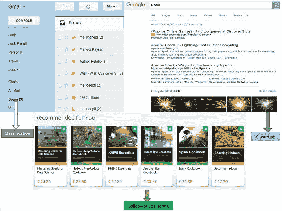
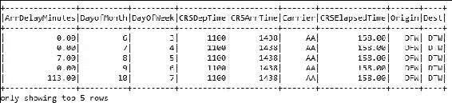
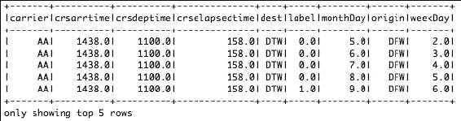
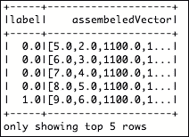
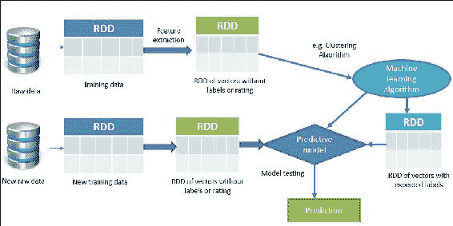
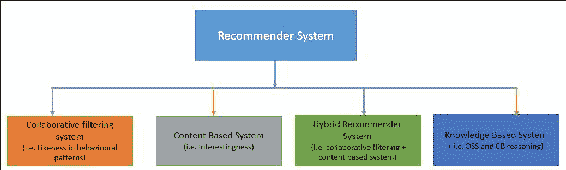
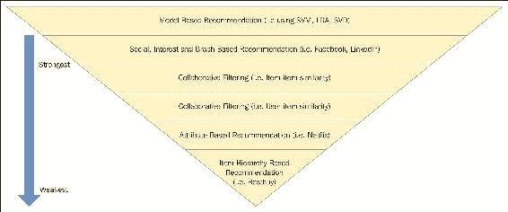

# 第五章。示例监督和非监督学习

在[第 2 章](02.html#LTSU2-5afe140a04e845e0842b44be7971e11a "Chapter 2. Machine Learning Best Practices")、*机器学习最佳实践*中，读者学习了一些基本机器学习技术的理论基础。鉴于，[第 3 章](03.html#TI1E2-0b803698e2de424b8aa3c56ad52b005d "Chapter 3. Understanding the Problem by Understanding the Data")、*通过理解数据来理解问题，*描述了使用 Spark 的 API(如 RDD、数据框架和数据集)进行的基本数据操作。[第四章](04.html#147LC2-5afe140a04e845e0842b44be7971e11a "Chapter 4. Extracting Knowledge through Feature Engineering")、*通过特征工程*提取知识另一方面，从理论和实践两个角度描述特征工程。然而，在本章中，读者将通过一些基于前几章理解的广泛使用的例子，快速而有力地学习在可用数据上应用监督和非监督技术来解决新问题所需的实用知识。我们正在讨论的这些例子将从 Spark 的角度进行演示。简而言之，本章将涵盖以下主题:

*   机器学习课程
*   监督学习
*   无监督学习
*   推荐系统
*   高级学习和概括

# 机器学习课

如[第 1 章](01.html#DB7S2-0b803698e2de424b8aa3c56ad52b005d "Chapter 1. Introduction to Data Analytics with Spark")、*带Spark的数据分析简介*和[第 2 章](02.html#LTSU2-5afe140a04e845e0842b44be7971e11a "Chapter 2. Machine Learning Best Practices")、*机器* *学习最佳实践*所述，机器学习技术可以进一步分为三大类算法:监督学习、无监督学习和推荐系统。在分类和回归算法被广泛用于有监督学习应用开发的情况下，另一方面，聚类属于无监督学习的范畴。在这一部分，我们将描述一些监督学习技术的例子。

然后，我们将提供一些使用 Spark 呈现的相同示例的示例。另一方面，聚类技术的一个例子将在本节中讨论:*无监督学习*，其中回归技术通常对变量之间的过去关系进行建模，以预测它们未来的变化(向上或向下)。这里我们分别展示了分类和回归算法的两个真实例子。相比之下，分类技术采用一组带有已知标签的数据，并根据这些信息学习如何给新记录贴标签:

*   **示例(分类)** : Gmail 使用一种称为分类的机器学习技术，根据电子邮件的数据来指定电子邮件是否是垃圾邮件。
*   **Example (regression)**: As an example, suppose you are an online currency trader and you work on Forex or Fortrade. Right now you have two currency pairs in mind to buy or sell say: GBP/USD and USD/JPY. If you look at these two pairs carefully, USD is a common in these two pairs. Now if you look at the historical prices of USD, GBP, or JPY you can predict the future outcome of whether you should open the trade in buy or sell. These types of problems can be resolved with supervised learning techniques using regression analysis:

    

    图 1:分类、聚类和协同过滤-大图

另一方面，聚类和降维通常用于无监督学习。以下是一些例子:

*   **示例(聚类)**:谷歌新闻使用一种叫做聚类的技术，根据标题和内容将新闻文章分成不同的类别。聚类算法发现数据集合中出现的分组。
*   **示例(协同过滤)**:推荐系统开发中经常用到协同过滤算法。像亚马逊和网飞这样的知名公司使用一种叫做协同过滤的机器学习技术，根据用户的历史和与其他用户的相似性来确定用户会喜欢哪些产品。
*   **示例(降维)**:降维常用于使可用数据集为高维。例如，假设您有一个大小为 2048x1920 的图像，您希望在不牺牲质量的情况下将尺寸缩小到 1080x720。在这种情况下，可以使用流行的算法，如**主成分分析** ( **主成分分析**)或**奇异值分解** ( **奇异值分解**)虽然您也可以实现奇异值分解来实现主成分分析。这也是为什么 SVD 应用更广泛的原因。

## 监督学习

如前所述，监督学习应用程序基于一组示例进行预测，目标是学习将输入映射到与现实世界一致的输出的一般规则。例如，垃圾邮件过滤数据集通常包含垃圾邮件和非垃圾邮件。因此，我们可以知道训练集中哪些消息是垃圾邮件或非垃圾邮件。因此，监督学习是从标记的训练数据推断函数的机器学习技术。监督学习任务包括以下步骤:

*   用训练数据集训练 ML 模型
*   使用测试数据集测试模型性能

因此，在这种情况下，用于训练 ML 模型的数据集用感兴趣的值来标记，并且监督学习算法在这些值标签中寻找模式。在算法找到所需的模式后，这些模式可用于对未标记的测试数据进行预测。

监督学习的典型用途是多样的，通常用于生物信息学、化学信息学、数据库营销、手写识别、信息检索、计算机视觉中的对象识别、光学字符识别、垃圾邮件检测、模式识别、语音识别等，并且在这些应用中主要使用分类技术。另一方面，监督学习是生物系统中向下因果关系的特例。

### 类型

关于监督学习技术如何从理论角度工作的更多信息，可以在以下书籍中找到:统计学习理论的本质(第二版)。)，Springer Verlag，2000；和 Mehryar M .，Afshin R. Ameet T. (2012)《机器学习基础》，麻省理工学院出版社 ISBN 9780262018258。

### 监督学习示例

分类是一系列有监督的机器学习算法，将输入指定为属于几个预定义类之一。一些常见的分类用例包括:

*   信用卡欺诈检测
*   垃圾邮件检测

例如，分类数据被标记为垃圾邮件/非垃圾邮件或欺诈/非欺诈。机器学习为新数据分配一个标签或类别。你根据预先确定的特征对事物进行分类。特征就是你问的 *if 问题*。这个标签就是这些问题的答案。例如，如果一个物体像鸭子一样行走、游泳和嘎嘎叫，那么标签将是*鸭子*。或者假设一个航班的起飞或到达被延迟了一个多小时，那就是一个延迟；否则不会耽搁。

# 带 Spark 的监督学习——一个例子

我们将通过分析一次航班延误来演示一个例子。将使用来自位于[http://www.transtats.bts.gov/](http://www.transtats.bts.gov/)的联合运输部网站的名为`On_Time_Performance_2016_1.csv`的数据集。

## 使用 Spark 进行空中飞行延迟分析

我们正在使用 2016 年的航班信息。对于每个航班，我们在*表 1* 中提供了以下信息(截至 2016 年 5 月 17 日，我们仅提供了 444，827 行和 110 列中的几个字段):

<colgroup class="calibre11"><col class="calibre12"> <col class="calibre12"> <col class="calibre12"></colgroup> 
| **数据字段** | **描述** | **示例值** |
| `DayofMonth` | 每月的某一天 | Two |
| `DayOfWeek` | 一周中的某一天 | five |
| `TailNum` | 飞机的尾号 | N505NK |
| `FlightNum` | 航班号 | Forty-eight |
| `AirlineID` | 航空公司 ID | Nineteen thousand eight hundred and five |
| `OriginAirportID` | 始发地机场标识 | 约翰·菲茨杰拉德·肯尼迪(John Fitzgerald Kennedy) |
| `DestAirportID` | 目的地机场标识 | 松懈的 |
| `Dest` | 目的地机场代码 | One thousand four hundred and twenty-four |
| `CRSDepTime` | 计划出发时间 | ten o'clock |
| `DepTime` | 实际出发时间 | half past ten |
| `DepDelayMinutes` | 出发延迟分钟 | Thirty |
| `CRSArrTime` | 计划到达时间 | fifteen to eleven p.m./a quarter to eleven p.m. |
| `ArrTime` | 实际到达时间 | fifteen to twelve p.m./a quarter to twelve p.m. |
| `ArrDelayMinutes` | 到达延迟(分钟) | Sixty |
| `CRSElapsedTime` | 经过时间 | Eight hundred and twenty-five |
| `Distance` | 全距离 | Six thousand two hundred |

表 1:来自“2016_1 准时性能”数据集的样本数据

在这个场景中，我们将基于图中所示的以下特征构建一个树来预测延迟或未延迟的标签，这是一个航空飞行数据集的小快照。这里`ArrDelayMinutes`是 113，应该分类为延迟(1.0)，其他行小于 60 分钟，所以标签应该是 0.0(不延迟)。根据这个数据集，我们将进行一些操作，如特征提取、转换和选择。*表 2* 显示了与本例中我们将考虑的特性相关的前五行，如下所示:

*   **标签**:延迟和未延迟-如果延迟> 60 分钟
*   **Features**: {`DayOfMonth`, `WeekOfday`, `CRSdeptime`, `CRSarrtime`, `Carrier`, `CRSelapsedtime`, `Origin`, `Dest`, `ArrDelayMinutes`}

    

    图 2:空中飞行延迟预测的选定特征

### 加载和解析数据集

在执行特征提取之前，我们需要加载和解析数据集。这一步还包括:加载包和相关的依赖项，将数据集作为 DataFrame 读取，制作 POJO 或 Bean 类，以及根据需求添加新的标签列。

**步骤 1:加载所需的包和依赖项**

为了读取 csv 文件，我们使用了 Databricks 提供的 csv 阅读器:

```scala
import org.apache.log4j.Level; 
import org.apache.log4j.Logger; 
import org.apache.spark.api.java.JavaRDD; 
import org.apache.spark.api.java.function.Function; 
import org.apache.spark.ml.Pipeline; 
import org.apache.spark.ml.PipelineModel; 
import org.apache.spark.ml.PipelineStage; 
import org.apache.spark.ml.classification.DecisionTreeClassificationModel; 
import org.apache.spark.ml.classification.DecisionTreeClassifier; 
import org.apache.spark.ml.evaluation.MulticlassClassificationEvaluator; 
import org.apache.spark.ml.feature.IndexToString; 
import org.apache.spark.ml.feature.LabeledPoint; 
import org.apache.spark.ml.feature.StringIndexer; 
import org.apache.spark.ml.feature.StringIndexerModel; 
import org.apache.spark.ml.feature.VectorAssembler; 
import org.apache.spark.ml.feature.VectorIndexer; 
import org.apache.spark.ml.feature.VectorIndexerModel; 
import org.apache.spark.ml.linalg.Vector; 
import org.apache.spark.rdd.RDD; 
import org.apache.spark.sql.Dataset; 
import org.apache.spark.sql.Row; 
import org.apache.spark.sql.SparkSession; 
import scala.Tuple2; 

```

**步骤 2:创建Spark会话**

下面是创建Spark会话的代码:

```scala
  static SparkSession spark = SparkSession 
      .builder() 
      .appName("JavaLDAExample") 
      .master("local[*]") 
      .config("spark.sql.warehouse.dir", "E:/Exp/") 
      .getOrCreate(); 

```

**第三步:使用数据集**读取并解析 csv 文件

该数据集包含许多列，在本例中，我们不会将这些列作为一项功能包括在内。因此，我们将从数据框中仅选择我们之前提到的功能。该数据帧输出已经显示在*图 2* 中:

```scala
String csvFile = "input/On_Time_On_Time_Performance_2016_1.csv"; 
Dataset<Row> df = spark.read().format("com.databricks.spark.csv").option("header", "true").load(csvFile);  
RDD<Tuple2<String, String>> distFile = spark.sparkContext().wholeTextFiles("input/test/*.txt", 2); 
JavaRDD<Tuple2<String, String>> distFile2 = distFile.toJavaRDD(); 
JavaRDD<Row> rowRDD = df.toJavaRDD(); 
Dataset<Row> newDF = df.select(df.col("ArrDelayMinutes"), 
df.col("DayofMonth"), df.col("DayOfWeek"), 
df.col("CRSDepTime"), df.col("CRSArrTime"), df.col("Carrier"), 
df.col("CRSElapsedTime"), df.col("Origin"), df.col("Dest")); 
newDF.show(5); 

```

下面是前 5 行的输出:



**第四步:制作 POJO 或 Bean 类**

我们开发的 POJO 类被称为`Flight`，其中所需的特性和标签字段将用相应的 setter 和 getter 来定义。

```scala
public class Flight implements Serializable { 
  double label; 
  double monthDay; 
  double weekDay; 
  double crsdeptime; 
  double crsarrtime; 
  String carrier; 
  double crselapsedtime; 
  String origin; 
  String dest; 

public Flight(double label, double monthDay, double weekDay, double crsdeptime, double crsarrtime, String carrier, 
      double crselapsedtime, String origin, String dest) { 
    super(); 
    this.label = label; 
    this.monthDay = monthDay; 
    this.weekDay = weekDay; 
    this.crsdeptime = crsdeptime; 
    this.crsarrtime = crsarrtime; 
    this.carrier = carrier; 
    this.crselapsedtime = crselapsedtime; 
    this.origin = origin; 
    this.dest = dest; 
  } 
  public double getLabel() { 
    return label; 
  } 
  public void setLabel(double label) { 
    this.label = label; 
  } 
  public double getMonthDay() { 
    return monthDay; 
  } 
  public void setMonthDay(double monthDay) { 
    this.monthDay = monthDay; 
  } 
  public double getWeekDay() { 
    return weekDay; 
  } 
  public void setWeekDay(double weekDay) { 
    this.weekDay = weekDay; 
  } 
  public double getCrsdeptime() { 
    return crsdeptime; 
  } 
  public void setCrsdeptime(double crsdeptime) { 
    this.crsdeptime = crsdeptime; 
  } 
  public double getCrsarrtime() { 
    return crsarrtime; 
  } 
  public void setCrsarrtime(double crsarrtime) { 
    this.crsarrtime = crsarrtime; 
  } 
  public String getCarrier() { 
    return carrier; 
  } 
  public void setCarrier(String carrier) { 
    this.carrier = carrier; 
  } 
  public double getCrselapsedtime() { 
    return crselapsedtime; 
  } 
  public void setCrselapsedtime(double crselapsedtime) { 
    this.crselapsedtime = crselapsedtime; 
  } 
  public String getOrigin() { 
    return origin; 
  } 
  public void setOrigin(String origin) { 
    this.origin = origin; 
  } 
  public String getDest() { 
    return dest; 
  } 
  public void setDest(String dest) { 
    this.dest = dest; 
  } 
  @Override 
  public String toString() { 
    return "Flight [label=" + label + ", monthDay=" + monthDay + ", weekDay="
       + weekDay + ", crsdeptime=" 
        + crsdeptime + ", crsarrtime=" + crsarrtime + ", carrier=" + 
      carrier + ", crselapsedtime=" 
        + crselapsedtime + ", origin=" + origin + ", dest=" +
       dest + "]"; 
  } 

```

我们认为前面的类是不言自明的，它用于从原始数据集设置和获取特征值。

**第五步:基于延迟列**添加新的标签列

如果延迟大于 40，则标签应为 1，否则应为 0。使用飞行 bean 类创建一个新的数据集。该数据集可以包含`ArrDelayMinutes`列的空字符串。因此，在映射之前，我们从数据集中筛选了包含空字符串的行:

```scala
JavaRDD<Flight> flightsRDD = newDF.toJavaRDD().filter(new Function<Row, Boolean>() { 
          @Override 
          public Boolean call(Row v1) throws Exception { 
            return !v1.getString(0).isEmpty(); 
          } 
        }).map(new Function<Row, Flight>() { 
          @Override 
          public Flight call(Row r) throws Exception { 
            double label; 
            double delay = Double.parseDouble(r.getString(0)); 
            if (delay > 60) 
              label = 1.0; 
else 
      label = 0.0; 
double monthday = Double.parseDouble(r.getString(1)) - 1; 
double weekday = Double.parseDouble(r.getString(2)) - 1; 
double crsdeptime = Double.parseDouble(r.getString(3)); 
double crsarrtime = Double.parseDouble(r.getString(4)); 
String carrier = r.getString(5); 
double crselapsedtime1 = Double.parseDouble(r.getString(6)); 
String origin = r.getString(7); 
String dest = r.getString(8); 
Flight flight = new Flight(label, monthday, weekday,crsdeptime, crsarrtime, carrier,crselapsedtime1, origin, dest); 
        return flight; 
    }}); 

```

现在根据我们在上面创建的 RDD 创建一个新的数据测试，如下所示:

```scala
Dataset<Row> flightDelayData = spark.sqlContext().createDataFrame(flightsRDD,Flight.class); 
flightDelayData.printSchema(); 

```

现在显示数据框`flightDelayData`的前 5 行，如下图*:*

```scala
flightDelayData.show(5); 

```

[输出:]



图 3:显示新标签列的数据框

### 特征提取

为了提取特征，我们必须制作数值，如果有任何文本值，那么我们必须制作一个标记向量来应用机器学习算法。

**第一步:向特征提取转化**

这里我们将包含文本的列转换为双值列。这里我们使用`StringIndexer`为每个唯一的文本建立一个唯一的索引:

```scala
StringIndexer carrierIndexer = new StringIndexer().setInputCol("carrier").setOutputCol("carrierIndex"); 
Dataset<Row> carrierIndexed = carrierIndexer.fit(flightDelayData).transform(flightDelayData); 
StringIndexer originIndexer = new StringIndexer().setInputCol("origin").setOutputCol("originIndex"); 
Dataset<Row> originIndexed = originIndexer.fit(carrierIndexed).transform(carrierIndexed); 
StringIndexer destIndexer = new StringIndexer().setInputCol("dest").setOutputCol("destIndex"); 
Dataset<Row> destIndexed = destIndexer.fit(originIndexed).transform(originIndexed); 
destIndexed.show(5); 

```

[输出]:


图 4:每个唯一文本的唯一索引

**第二步:使用向量汇编器**制作特征向量

用向量汇编器生成特征向量，并将其转换为标记向量，以应用机器学习算法(决策树)。注意，这里我们使用决策树来展示一个例子，因为它展示了更好的分类精度。基于算法和模型的选择和调整，您将能够进一步探索和使用其他分类器:

```scala
VectorAssembler assembler = new VectorAssembler().setInputCols( 
        new String[] { "monthDay", "weekDay", "crsdeptime", 
            "crsarrtime", "carrierIndex", "crselapsedtime", 
            "originIndex", "destIndex" }).setOutputCol( 
        "assembeledVector"); 

```

现在将汇编程序转换为行的数据集，如下所示:

```scala
Dataset<Row> assembledFeatures = assembler.transform(destIndexed); 

```

现在将数据集转换为`JavaRDD`以生成如下特征向量:

```scala
JavaRDD<Row> rescaledRDD = assembledFeatures.select("label","assembeledVector").toJavaRDD(); 

```

如下图所示绘制`LabeledPoint`的 RDD:

```scala
JavaRDD<LabeledPoint> mlData = rescaledRDD.map(new Function<Row, LabeledPoint>() { 
          @Override 
          public LabeledPoint call(Row row) throws Exception { 
            double label = row.getDouble(0); 
            Vector v = row.getAs(1); 
            return new LabeledPoint(label, v); 
          } 
        }); 

```

现在打印前五个值，如下所示:

```scala
System.out.println(mlData.take(5));  

```

[输出]:



图 5:相应的组合向量

### 准备训练和测试集

这里，我们将从标记向量的数据集准备训练数据集。最初，我们将制作一个训练集，其中 15%的记录是非延迟的，85%的记录是延迟的。最后，训练和测试数据集将分别准备为 70%和 30%。

**第一步:从整个数据集制作训练和测试集**

首先，根据我们之前创建的标签(即 1 和 0)过滤 RDD，创建一个新的 RDD，如下所示:

```scala
JavaRDD<LabeledPoint> splitedData0 = mlData.filter(new Function<LabeledPoint, Boolean>() { 
          @Override 
          public Boolean call(LabeledPoint r) throws Exception { 
              return r.label() == 0; 
          } 
        }).randomSplit(new double[] { 0.85, 0.15 })[1]; 

    JavaRDD<LabeledPoint> splitedData1 = mlData.filter(new Function<LabeledPoint, Boolean>() { 
          @Override 
          public Boolean call(LabeledPoint r) throws Exception { 
            return r.label() == 1; 
          } 
        }); 

    JavaRDD<LabeledPoint> splitedData2 = splitedData1.union(splitedData0); 
    System.out.println(splitedData2.take(1)); 

```

现在使用如下`union()`方法联合两个 rdd:

```scala
JavaRDD<LabeledPoint> splitedData2 = splitedData1.union(splitedData0); 
System.out.println(splitedData2.take(1)); 

```

现在进一步将组合 RDD 转换为行的数据集，如下所示(最大类别设置为 4):

```scala
Dataset<Row> data = spark.sqlContext().createDataFrame(splitedData2, LabeledPoint.class); 
data.show(100); 

```

现在我们需要对分类变量进行向量索引器，如下所示:

```scala
VectorIndexerModel featureIndexer = new VectorIndexer() 
          .setInputCol("features") 
          .setOutputCol("indexedFeatures") 
          .setMaxCategories(4) 
          .fit(data); 

```

现在我们有了使用`VectorIndexerModel`估计器的特征索引器。现在下一个任务是使用`StringIndexerModel`估算器进行字符串索引，如下所示:

```scala
StringIndexerModel labelIndexer = new StringIndexer() 
          .setInputCol("label") 
          .setOutputCol("indexedLabel") 
          .fit(data); 

```

最后，将行的数据集分为训练集和测试集(分别为 70%和 30%，但您应该根据自己的需求调整值)，如下所示:

```scala
Dataset<Row>[] splits = data.randomSplit(new double[]{0.7, 0.3}); 
Dataset<Row> trainingData = splits[0]; 
Dataset<Row> testData = splits[1]; 

```

干得好！现在我们的数据集已经准备好训练模型了，对吗？暂时，我们会天真地选择一个分类器，说让我们使用决策树分类器来解决我们的目的。您可以基于[第 6 章](06.html#1ENBI2-0b803698e2de424b8aa3c56ad52b005d "Chapter 6.  Building Scalable Machine Learning Pipelines")、*构建可扩展的机器学习管道*、[第 7 章](07.html#1O8H62-0b803698e2de424b8aa3c56ad52b005d "Chapter 7. Tuning Machine Learning Models")、*调整机器学习模型*和[第 8 章](08.html#1VSLM1-5afe140a04e845e0842b44be7971e11a "Chapter 8.  Adapting Your Machine Learning Models")、*调整您的机器学习模型*中提供的示例，尝试使用其他多类分类器。

### 训练模型

如图*图 2* 所示，从原始数据中采集训练和测试数据。特征工程过程完成后，在建立预测模型之前，带有标签或评级的特征向量的 RDD 将被用于接下来的分类算法处理(如图*图 6* 所示)，并且最终测试数据将被用于测试模型性能:


图 6:使用 Spark 的监督学习

接下来，我们准备决策树所需的参数值。你可能想知道为什么我们要讨论决策树。原因很简单，因为与朴素贝叶斯方法相比，使用决策树(即**二进制决策树**)我们观察到了更好的预测精度。参见*表 2* ，该表描述了分类特征及其意义如下:

<colgroup class="calibre11"><col class="calibre12"> <col class="calibre12"> <col class="calibre12"></colgroup> 
| **分类特征** | **映射** | **显著** |
| 分类特征信息 | 0 -> 31 | 指定要素索引 0(表示一个月中的某一天)有 31 个类别[值{0，..., 31}] |
| 分类特征信息 | 1 -> 7 | 表示一周中的几天，并指定要素索引 1 有七个类别 |
| 载体 | 0 -> N | n 表示从 0 到不同载波数的数字 |

表 2:分类特征及其意义

现在我们将简要描述决策树的构造方法。我们将使用 CategoricalFeaturesInfo 来指定哪些特征是分类的，以及在树构建过程中这些特征中的每一个可以取多少分类值。这是从要素索引到该要素类别数量的映射。

然而，模型是通过在输入特征和与这些特征相关联的标记输出之间建立关联来训练的。我们使用`DecisionTreeClassifier`方法训练模型，最终返回一个`DecisionTreeModel`，如图*图 7* 所示。构建树的详细源代码将在本节后面显示:


图 7:为空中飞行延迟分析生成的二进制决策树(部分显示)

**第一步:训练决策树模型**

为了训练决策树分类器模型，我们需要有必要的标签和特征:

```scala
DecisionTreeClassifier dt = new DecisionTreeClassifier() 
      .setLabelCol("indexedLabel") 
      .setFeaturesCol("indexedFeatures"); 

```

**第二步:将索引标签转换回原始标签**

为了创建决策树管道，我们需要将原始标签与索引标签分开。所以，让我们按如下方式进行:

```scala
IndexToString labelConverter = new IndexToString() 
      .setInputCol("prediction") 
      .setOutputCol("predictedLabel")         
        .setLabels(labelIndexer.labels());  

```

**第三步:将索引器和树链接在一个管道中**

创建一个新管道，其阶段如下:`labelIndexer`、`featureIndexer`、`dt`、`labelConverter`如下:

```scala
Pipeline pipeline = new Pipeline() 
      .setStages(new PipelineStage[]{labelIndexer,  
        featureIndexer, dt, labelConverter}); 

```

现在，使用我们在*步骤 8* 中创建的训练集来拟合管道，如下所示:

```scala
PipelineModel model = pipeline.fit(trainingData); 

```

### 测试模型

这里，我们将按照以下步骤测试模型:

**第一步:对测试数据集**进行预测

通过变换`PipelineModel`对测试集进行预测，并显示如下性能参数:

```scala
Dataset<Row> predictions = model.transform(testData); 
predictions.select("predictedLabel", "label", "features").show(5); 

```

**第二步:评估模型**

通过多类分类评估器评估模型，并按如下方式打印精度和测试误差:

```scala
MulticlassClassificationEvaluator evaluator = new MulticlassClassificationEvaluator() 
      .setLabelCol("indexedLabel") 
      .setPredictionCol("prediction") 
      .setMetricName("accuracy"); 
    double accuracy = evaluator.evaluate(predictions); 
    System.out.println("accuracy: "+accuracy); 
    System.out.println("Test Error = " + (1.0 - accuracy)); 

```

前面的代码段产生的分类精度和测试误差如下:

```scala
Accuracy: 0.7540472721385786 
Test Error = 0.24595272786142142 

```

请注意，由于我们将数据集随机分为训练和测试，您可能会得到不同的结果。分类准确率为 75.40%，我们认为这并不好。

但是，现在轮到您在部署模型之前使用不同的分类器并进行调整了。更详细的讨论将在[第 7 章](07.html#1O8H62-0b803698e2de424b8aa3c56ad52b005d "Chapter 7. Tuning Machine Learning Models")、*调整机器学习模型、*中进行，关于调整 ML 模型。

**第三步:打印决策树**

下面是打印决策树的代码:

```scala
DecisionTreeClassificationModel treeModel = 
      (DecisionTreeClassificationModel) (model.stages()[2]); 
System.out.println("Learned classification tree model:\n" + treeModel.toDebugString()); 

```

该代码段产生一个决策树，如图 7 所示。

**步骤 4:停止Spark会话**

使用Spark的`stop()`方法停止Spark会话，如下所示:

```scala
spark.stop();
```

这是一个很好的实践，您可以启动一个 Spark 会话，并适当地关闭或停止它，以避免应用程序中的内存泄漏。

# 无监督学习

在无监督学习中，数据点没有与之相关的标签；因此，我们需要在算法上给它们贴上标签。换句话说，无监督学习中训练数据集的正确类别是未知的。

因此，必须从非结构化数据集中推断类别，这意味着无监督学习算法的目标是通过描述数据的结构，以某种结构化的方式对数据进行预处理。无监督学习算法或技术的主要目标是探索大部分未标记的输入数据的未知模式。这样，它就与理论和应用统计学中使用的密度估计问题密切相关。

然而，无监督学习还包括许多其他技术来总结和解释数据的关键特征，包括探索性数据分析以发现这些隐藏模式，甚至将数据点或特征分组，以及将基于数据挖掘方法的无监督学习技术应用于数据预处理。

为了克服无监督学习中的这一障碍，聚类技术通常用于基于某些相似性度量对未标记样本进行分组，挖掘隐藏模式以进行特征学习。

### 类型

关于深入的理论知识，无监督算法是如何工作的，请参考这三本书:Bousquet，o；美国冯卢克斯堡；雷奇，g .，编辑。(2004).*机器学习高级讲座*。斯普林格-弗拉格。ISBN 978-3540231226。或者杜达，理查德·奥；彼得·哈特；戴维·g·斯托尔克(2001 年)。*无监督学习和聚类*。*模式分类(第二版。)*。威利。ISBN 0-471-05669-3 和迈克尔·乔丹一世；克里斯托弗·贝肖普(2004 年)。*神经网络*。艾伦·塔克。计算机*科学手册，第二版(第七节:智能系统)*。佛罗里达州博卡拉顿:查普曼&大厅/华润新闻有限责任公司。ISBN 1-58488-360-X

## 无监督学习示例

在聚类中，一种算法通过分析输入示例之间的相似性来将对象分组到类别中，其中相似的对象或特征被聚类并使用它们周围的圆圈进行标记。

聚类用途包括:**搜索结果分组**如客户分组，**异常检测**用于可疑模式发现，**文本分类**用于在测试中发现有用模式，**社交网络分析**用于发现连贯组，**数据中心计算集群**用于找到将相关计算机放在一起以提高性能的方法，**天文数据分析**用于星系形成，**房地产数据分析**用于基于相似特征识别邻域。此外，聚类使用无监督算法，该算法事先没有输出。

使用 K-means 算法的聚类开始于将所有坐标初始化为质心。请注意，Spark 还支持其他聚类算法，如高斯混合、**幂迭代聚类** ( **PIC** )、**潜在狄利克雷分配** ( **LDA** )、平分 k 均值和流式 k 均值。然而，高斯混合主要用于期望最小化作为优化算法，另一方面，线性判别分析用于文档分类和聚类。PIC 用于给定成对相似性作为边属性的图的聚类顶点。平分 K-means 比常规 K-means 更快，但它通常会产生不同的聚类。因此，为了简化讨论，我们将使用 K-means 算法来达到我们的目的。

感兴趣的读者应该参考分别位于[https://spark.apache.org/docs/latest/ml-clustering.html](https://spark.apache.org/docs/latest/ml-clustering.html)和[https://spark.apache.org/docs/latest/mllib-clustering.html](https://spark.apache.org/docs/latest/mllib-clustering.html)网页的基于 Spark ML 和 Spark MLlib 的聚类技术，以获得更多见解。随着算法的每一次通过，每个点都被分配到基于某个距离度量的最近质心，通常是**欧几里德距离**。

请注意，还有其他计算距离的方法，例如**切比雪夫距离**用于仅考虑最重要的维度来测量距离。**汉明距离算法**用于一点一点地识别两个字符串的差异。**马氏距离**用于归一化协方差矩阵，以使距离度量尺度不变。

**曼哈顿距离**仅用于测量沿轴线方向的距离。**闵可夫斯基距离算法**用于推广欧几里德距离、曼哈顿距离和切比雪夫距离。**哈弗森距离**用于测量球体上两点之间的大圆距离，即它们的经度和纬度。考虑到这些距离测量算法，显然欧几里德距离算法将是解决我们的问题的最合适的方法。

然后，质心被更新为该路径中指定给它的所有点的中心。这样重复，直到中心的变化最小。k-means 算法是一种迭代算法，分两步工作:

*   **聚类分配步骤**:该算法将遍历每个数据点，并根据其更接近哪个质心，将其分配给该质心，进而分配给其所代表的聚类
*   **移动质心步骤**:该算法将获取每个质心，并将其移动到聚类中数据点的平均值

### 用 Spark 进行无监督学习——一个例子

我们将使用从网址[http://course1.winona.edu/bdeppa/Stat%20425/Datasets.html](http://course1.winona.edu/bdeppa/Stat%20425/Datasets.html)下载的*萨拉托加纽约家园*来演示一个使用 Java 中的 Spark 作为无监督学习技术的聚类示例。数据集包含以下几个特征:价格、地块大小、滨水区、年龄、土地价值、新建筑、中央空调、燃料类型、供暖类型、下水道类型、生活区、Pct。学院、卧室、壁炉、浴室和房间数量。但是，在这些列中，我们只在*表 3* 中显示了一些选定的列。请注意，原始数据集已下载，随后会转换为相应的文本文件作为制表符分隔符:

<colgroup class="calibre11"><col class="calibre12"> <col class="calibre12"> <col class="calibre12"> <col class="calibre12"> <col class="calibre12"> <col class="calibre12"></colgroup> 
| **价格** | **批量** | **水锋** | **年龄** | **土地价值** | **房间** |
| One hundred and thirty-two thousand five hundred | Zero point zero nine | Zero | forty-two | Five thousand | five |
| One hundred and eighty-one thousand one hundred and fifteen | Zero point nine two | Zero | Zero | Twenty-two thousand three hundred | six |
| One hundred and nine thousand | Zero point one nine | Zero | One hundred and thirty-three | Seven thousand three hundred | eight |
| One hundred and fifty-five thousand | Zero point four one | Zero | Thirteen | Eighteen thousand seven hundred | five |
| Eighty-six thousand and sixty | Zero point one one | Zero | Zero | Fifteen thousand | three |
| One hundred and twenty thousand | Zero point six eight | Zero | Thirty-one | Fourteen thousand | eight |
| One hundred and fifty-three thousand | Zero point four | Zero | Thirty-three | Twenty-three thousand three hundred | eight |
| One hundred and seventy thousand | One point two one | Zero | Twenty-three | One hundred and forty-six thousand | nine |
| Ninety thousand | Zero point eight three | Zero | Thirty-six | Two hundred and twenty-two thousand | eight |
| One hundred and twenty-two thousand nine hundred | One point nine four | Zero | four | Two hundred and twelve thousand | six |
| Three hundred and twenty-five thousand | Two point two nine | Zero | One hundred and twenty-three | One hundred and twenty-six thousand | Twelve |

表 3:来自“萨拉托加纽约家园”数据集的样本数据

为了简单起见，我们使用了前一章中介绍的 Spark 特征学习算法，只进一步学习了前两个特征(即价格和批量)。我们的目标是展示基于这两个特征的探索性分析，用于位于同一区域的房屋的可能邻域。首先，根据数据集中的值查看基本散点图:


图 8:邻域聚类

很明显在*图 8* 中标记为圆圈的地块上有四个集群。然而，找到许多集群是一项棘手的任务。在这里，我们有视觉检查的优势，这对于超平面或多维数据上的数据是不可用的。现在我们需要使用 Spark 找到相同的结果。为了简单起见，我们将使用 Spark 的 K 均值聚类 API。*图 9* 显示了原始数据的使用和特征向量的查找:



图 9:使用 Spark 的无监督学习

### 邻域的 K 均值聚类

在执行特征提取之前，我们需要加载并解析萨拉托加纽约家园数据集。该步骤还包括:加载包和相关依赖项、将数据集读取为 RDD、模型训练和预测、收集本地解析数据以及比较聚类。

**第一步:导入统计及相关类**

下面是导入统计数据和相关类的代码:

```scala
import java.io.Serializable; 
import java.util.List; 
import org.apache.spark.api.java.JavaRDD; 
import org.apache.spark.api.java.function.Function; 
import org.apache.spark.mllib.clustering.KMeans; 
import org.apache.spark.mllib.clustering.KMeansModel; 
import org.apache.spark.mllib.linalg.Vector; 
import org.apache.spark.mllib.linalg.Vectors; 
import org.apache.spark.rdd.RDD; 
import org.apache.spark.sql.SparkSession;  

```

**步骤 2:创建Spark会话**

下面是创建Spark会话的代码:

```scala
  static SparkSession spark = SparkSession 
      .builder().appName("JavaLDAExample") 
      .master("local[*]") 
      .config("spark.sql.warehouse.dir", "E:/Exp/") 
      .getOrCreate(); 

```

**第三步:加载萨拉托加纽约家园**

从数据集中读取、解析和创建关系数据库:

```scala
RDD<String> data = spark.sparkContext().textFile("input/Saratoga_ NY_Homes.txt", 2); 

```

**步骤 4:将数据转换成密集向量的 RDD**

如果你仔细遵循前面的步骤，实际上我们已经创建了正常的 RDD。因此，在使用矢量映射到密集矢量之前，必须将 RDD 转换为相应的`JavaRDD`:

```scala
JavaRDD<Vector> parsedData = data.toJavaRDD().map(new Function<String, Vector>() { 
      @Override 
      public Vector call(String s) throws Exception { 
        String[] sarray = s.split(","); 
        double[] values = new double[sarray.length]; 
        for (int i = 0; i < sarray.length; i++) 
          values[i] = Double.parseDouble(sarray[i]); 
        return Vectors.dense(values); 
      } 
    });  

```

**第五步:训练模型**

通过指定四个集群和五次迭代来训练模型。只需参考以下代码即可:

```scala
int numClusters = 4; 
int numIterations = 10; 
int runs = 2; 
KMeansModel clusters = KMeans.train(parsedData.rdd(), numClusters, numIterations, runs , KMeans.K_MEANS_PARALLEL());  
Now estimate the cost to compute the clsuters as follows: 
double cost = clusters.computeCost(parsedData.rdd()); 
System.out.println("Cost: " + cost);  

```

您应该会收到如下结果:

```scala
Cost: 3.60148995801542E12   

```

**步骤 6:显示集群中心**

```scala
Vector[] centers = clusters.clusterCenters(); 
System.out.println("Cluster Centers: "); 
for (Vector center : centers)  
{ 
  System.out.println(center); 
} 

```

前面的代码应该产生如下的簇中心:

```scala
[545360.4081632652,0.9008163265306122,0.1020408163265306,21.73469387755102,111630.61224489794,0.061224489795918366,0.7551020408163265,2.3061224489795915,2.1632653061224487,2.714285714285714,2860.755102040816,59.346938775510196,3.510204081632653,1.1020408163265305,2.714285714285714,10.061224489795917] 
[134073.06845637583,0.3820000000000002,0.0026845637583892616,33.72617449664429,19230.76510067114,0.012080536912751677,0.22818791946308722,2.621476510067114,2.7234899328859057,2.6630872483221477,1332.9234899328858,52.86040268456375,2.7395973154362414,0.38120805369127514,1.4946308724832214,5.806711409395973] 
[218726.0625,0.5419711538461538,0.0,25.495192307692307,32579.647435897434,0.041666666666666664,0.3830128205128205,2.3205128205128203,2.4615384615384617,2.692307692307692,1862.3076923076922,57.4599358974359,3.3894230769230766,0.7019230769230769,2.032852564102564,7.44551282051282] 
[332859.0580645161,0.6369354838709671,0.025806451612903226,19.803225806451614,63188.06451612903,0.13870967741935483,0.6096774193548387,2.2225806451612904,2.2483870967741937,2.774193548387097,2378.4290322580646,57.66774193548387,3.6225806451612903,0.8516129032258064,2.479032258064516,8.719354838709677] 

```

**第七步:评估模型错误率**

```scala
double WSSSE = clusters.computeCost(parsedData.rdd()); 
System.out.println("Within Set Sum of Squared Errors = " + WSSSE); 

```

这将产生如下结果:

```scala
Within Set Sum of Squared Errors = 3.60148995801542E12 

```

**第八步:预测第二个元素的聚类**

```scala
List<Vector> houses = parsedData.collect(); 
int prediction  = clusters.predict(houses.get(18)); 
System.out.println("Prediction: "+prediction);  

```

输出预测:0

**步骤 9:停止Spark会话**

使用如下`stop()`方法停止Spark会话:

```scala
spark.stop(); 

```

**步骤 10:聚类比较**

现在，让我们将 k-means 的集群分配与我们单独完成的集群分配进行比较。k-means 算法给出了从 0 开始的聚类 id。检查数据后，您会发现我们在表 4 中给出的 A 到 D 聚类标识与 K 均值之间的映射如下:

<colgroup class="calibre11"><col class="calibre12"> <col class="calibre12"> <col class="calibre12"></colgroup> 
| **集群名称** | **集群号** | **集群分配** |
| A | three | A=>3 |
| B | one | B=>1 |
| C | Zero | C=>0 |
| D | Two | D=>2 |

表 4:邻域 K 均值聚类示例的聚类分配

现在，让我们从图表的不同部分挑选一些数据，并预测它属于哪个集群。让我们看看房子(比如说 1)的数据，它有 876 平方英尺的大面积，定价为 66.5 万美元:

```scala
int prediction  = clusters.predict(houses.get(18)); 
    System.out.println("Prediction: "+prediction); 

```

[输出]预测:2

这意味着拥有上述房产的房屋属于第二类。当然，你可以用更多的数据来测试预测能力。让我们做一些邻域分析，看看这些簇有什么意义。我们可以假设集群 3 中的大多数房子都在市中心附近。例如，第 2 组房屋位于丘陵地带。

在这个例子中，我们处理了一组非常小的特征；常识和视觉检查也会让我们得出同样的结论。然而，如果你想获得更高的精度，你当然应该构建更有意义的特征，不仅考虑地段大小和房价，还要考虑其他特征，如房间数量、房龄、土地价值、供暖类型等。

然而，将*滨水区*作为一个有意义的特征是不明智的，因为在这个例子中，没有房子在房子前面有一个水上花园。我们将在下一章中详细分析有意义的预测的更好的准确性，在这一章中我们将展示这些考虑。

k-means 算法的美妙之处在于它对具有无限数量特征的数据进行聚类。当你有原始数据并且想知道数据中的模式时，这是一个很好的工具。然而，在做实验之前决定簇的数量可能不成功，但有时可能会导致过拟合问题或欠拟合问题。

### 类型

为了克服上述 K-means 的限制，我们有一些更稳健的算法，如**马尔可夫链蒙特卡罗** ( **MCMC** ，另请参见[https://en.wikipedia.org/wiki/Markov_chain_Monte_Carlo](https://en.wikipedia.org/wiki/Markov_chain_Monte_Carlo))在特里布尔，塞思，*马尔可夫链蒙特卡罗算法使用完全均匀分布的驾驶序列*，迪斯。斯坦福大学，2007 年。此外，更技术性的讨论也可以在网址[http://www.autonlab.org/tutorials/kmeans11.pdf](http://www.autonlab.org/tutorials/kmeans11.pdf)找到。

# 推荐系统

推荐系统是一个原始的杀手级应用程序，它是信息过滤系统的一个子类，旨在预测用户通常对某个项目的评价或偏好。推荐系统的概念在最近几年变得非常普遍，并且随后被应用于不同的应用中。最受欢迎的可能是产品(例如，电影、音乐、书籍、研究文章)、新闻、搜索查询、社交标签等)。推荐系统可以分为四类，如[第 2 章](02.html#LTSU2-5afe140a04e845e0842b44be7971e11a "Chapter 2. Machine Learning Best Practices")、*机器学习最佳实践所述。*见*图 10* :

*   **协同过滤系统**:这是消费者基于行为模式相似性对其他用户的偏好和推荐的积累**基于内容的系统**:这里监督机器学习用于说服分类器区分用户感兴趣和不感兴趣的项目
*   **混合推荐系统**:这是一种最新的研究和混合方法(即结合协同过滤和基于内容的过滤)
*   **Knowledge-based systems**: Here knowledge about users and products are used to understand what fulfils a user's requirements, using a perception tree, decision support systems, and case-based reasoning:

    

    图 10:推荐系统的层次结构

从技术角度来看，我们可以将它们进一步分类如下:

*   物品**等级**是最弱的一个，它天真地假设一个物品与另一个物品相关联，例如，如果你买了一台打印机，你更有可能买墨水。此前**百思买**采用了这种方法
*   **基于属性的推荐**:假设你喜欢西尔维斯特·史泰龙主演的动作片，那么，你可能会喜欢兰博系列。**网飞**习惯用这种方法
*   **协同过滤** (U **服务用户相似度):**这假设并举例说明了像你这样带了婴儿奶的人也买了纸尿裤。目标使用这种方法
*   **协同过滤** ( **物品-物品相似度)**:这假设并举例说明了喜欢教父系列的人也喜欢 Scarface。网飞目前使用这种方法
*   **基于社交、兴趣和图表的方法**:这假设例如你喜欢米歇尔·杰克逊的朋友也会喜欢*只是击败它*。像**领英**和**脸书**这样的科技巨头使用这种方法
*   **基于模型的方法**:这使用了基于隐式特征的高级算法，例如 **SVM** 、 **LDA** 和 **SVD**

如图*图 11* 所示，广泛使用 SVM、LDA 或 SVD 等高级算法的基于模型的推荐系统是推荐系统类中最健壮的方法:



图 11:从技术角度看推荐系统

## Spark中的协同过滤

如上所述，协同过滤技术通常用于推荐系统。但是，Spark MLlib 目前只支持基于模型的协同过滤。在这里，用户和产品是由一小组潜在因素描述的。潜在因素随后被用于预测缺失条目。根据[上协同过滤的 Spark API 参考 http://Spark . Apache . org/docs/latest/mllib-协同过滤. html](http://spark.apache.org/docs/latest/mllib-collaborative-filtering.html):**交替最小二乘** ( **ALS** )(又称非线性最小二乘，即 NLS；详见[https://en.wikipedia.org/wiki/Non-linear_least_squares](https://en.wikipedia.org/wiki/Non-linear_least_squares))算法用于通过考虑以下参数来学习这些潜在因素:

*   `numBlocks`是使用本机 LAPACK 进行并行计算时使用的块数
*   `rank`是机器学习模型构建过程中潜在因素的数量
*   `iterations`是获得更精确预测所需的迭代次数
*   `lambda`表示 ALS 算法的正则化参数
*   `implicitPrefs`指定要使用的反馈(显性反馈 ALS 变体或适用于隐性反馈数据的反馈)
*   `alpha`指定 ALS 算法偏好观察的基线置信度

首先，利用迭代算法 ALS 将评分矩阵建模为低排名用户和产品因素的乘积。之后，通过最小化观察评级的重构误差，使用这些因素来完成学习任务。

然而，未知的评级可以通过将这些因素相乘来连续计算。事实证明，基于 Spark MLlib 中使用的协作过滤技术的移动推荐或任何其他推荐方法表现出色，具有很高的预测准确性，并可针对网飞等公司使用的商品集群的数十亿评级进行扩展。按照这种方式，像网飞这样的公司可以根据预测的收视率向其订户推荐电影。最终目标是增加销售额，当然还有客户满意度。

为了简洁和页面限制，我们不会在本章中展示使用协作过滤方法的电影推荐。但是，使用 Spark 的分步示例将在[第 9 章](09.html#25JP22-0b803698e2de424b8aa3c56ad52b005d "Chapter 9.  Advanced Machine Learning with Streaming and Graph Data")、*高级*、*带流和图形数据的机器学习*中显示。

### 类型

目前，建议感兴趣的读者访问 Spark 网站获取最新的 API 及其代码，网址为:[http://Spark . Apache . org/docs/latest/mllib-collaborative-filtering . html](http://spark.apache.org/docs/latest/mllib-collaborative-filtering.html)，这里已经展示了一个使用 ALS 算法的示例电影推荐。

# 高级学习和概括

在本节中，我们将讨论学习的一些高级方面，例如，我们如何将监督学习技术推广到半监督学习、主动学习、结构化预测和强化学习。此外，将简要讨论强化和半监督学习。

## 监督学习的推广

有几种方法可以推广标准监督学习问题:

*   **半监督学习**:在这种泛化技术中，只为训练数据的子集提供所选特征所需的输出值，以构建和评估机器学习模型。另一方面，剩余的数据保持不变或未标记。
*   **主动学习**:相比之下，在主动学习中，算法通常通过向人类用户进行查询来交互式地收集新特征，而不是假设给出了所有的训练特征。因此，这里使用的查询是基于未标记的数据。有趣的是，这也是半监督学习和主动学习相结合的一个例子。
*   **结构化预测**:有时需要从解析树或标记图等复杂对象中提取或选择期望的特征，然后必须改进标准的有监督或无监督方法以使其具有通用性。更准确地说，例如，当有监督的机器学习技术试图预测结构化或非结构化文本时，例如将自然语言处理句子翻译成句法表示，结构化预测需要处理大规模解析树。为了使这一任务更容易，通常使用结构化支持向量机或马尔可夫逻辑网络或约束条件模型，在技术上扩展和更新经典的监督学习算法。
*   **学习排序**:当输入本身是对象的子集，期望的输出是这些对象的排序时，需要机器学习排序，那么标准方法必须类似于结构预测技术进行扩展或改进。

### 类型

感兴趣的读者可以参考这两个网址:[https://en.wikipedia.org/wiki/Learning_to_rank](https://en.wikipedia.org/wiki/Learning_to_rank)和[https://en.wikipedia.org/wiki/Structured_prediction](https://en.wikipedia.org/wiki/Structured_prediction)，在这里可以找到更详细的讨论。

# 总结

我们已经从理论和 Spark 的角度讨论了一些有监督的、无监督的和推荐系统。然而，有监督的、无监督的、强化的或推荐的系统也有许多例子。尽管如此，为了简单起见，我们还是试图给出一些简单的例子。

我们将在[第 6 章](06.html#1ENBI2-0b803698e2de424b8aa3c56ad52b005d "Chapter 6.  Building Scalable Machine Learning Pipelines")、*构建可扩展的机器学习管道*中提供关于这些示例的更多见解。更多的特征合并、提取、使用 Spark ML 和 Spark MLlib 管道的选择、模型缩放和调整也将被讨论。我们也打算提供一些例子，包括数据收集到模型建立和预测。*