# 六、构建可扩展的机器学习管道

机器学习的最终目标是制造一台能够根据数据自动构建模型的机器，而不需要繁琐耗时的人工参与和交互。因此，本章通过使用 Spark MLlib 和 Spark ML 创建一些实用且广泛使用的机器学习管道和应用来指导读者。这两个 API 都将被详细描述，一个基线用例也将被涵盖。然后，我们将重点关注扩展 ML 应用，以便它能够应对不断增加的数据负载。在阅读了本章的所有章节之后，读者将能够区分这两种 API，并选择最适合他们需求的一种。简而言之，本章将涵盖以下主题:

*   Spark 机器学习管道 API
*   带 Spark 的癌症诊断管道
*   带 Spark 的癌症预测管道
*   星火核心的市场篮子分析
*   带 Spark 的光学字符识别管道
*   使用 Spark MLlib 和 ML 进行主题建模
*   带有 Spark 的信用风险分析管道
*   缩放最大似然管道
*   提示和性能注意事项

# Spark 机器学习流水线 API

MLlib 的目标是让实用的机器学习(ML)变得可扩展和容易。Spark 引入了管道应用编程接口，便于创建和调整实用的 ML 管道。正如[第 4 章](04.html#147LC2-5afe140a04e845e0842b44be7971e11a "Chapter 4. Extracting Knowledge through Feature Engineering")、*通过特征工程*提取知识所讨论的，一个实用的 ML 管道包括一系列的数据收集、预处理、特征提取、特征选择、模型拟合、验证和模型评估阶段。例如，对文本文档进行分类可能涉及文本分割和清理、提取特征，以及训练分类模型，并对其进行交叉验证以进行调整。大多数 ML 库不是为分布式计算设计的，或者它们不为管道创建和调优提供本地支持。

## 数据集抽象

如[第 1 章](01.html#DB7S2-0b803698e2de424b8aa3c56ad52b005d "Chapter 1. Introduction to Data Analytics with Spark")、*使用 Spark* 进行数据分析的介绍中所述，当从另一种编程语言中运行 SQL 时，结果作为数据框返回。数据框是组织成命名列的分布式数据集合。另一方面，数据集是一个接口，它试图从 Spark SQL 中提供关系数据库的好处。

数据集可以由 JVM 对象构建，它可以在 Scala 和 Java 中使用。在 Spark 管道设计中，数据集由 Spark SQL 的数据集表示。ML 管道包含一系列数据集转换和模型。每个转换都获取一个输入数据集，并输出转换后的数据集，该数据集将成为下一阶段的输入。

因此，数据导入和导出是 ML 管道的起点和终点。为了使这些更容易，Spark MLlib 和 Spark ML 为几个特定于应用的类型提供了数据集、数据框、RDD 和模型的导入和导出实用程序，包括:

*   分类和回归的标记点
*   交叉验证和**潜在狄利克雷分配** ( **LDA** )的标记文档
*   协作过滤的评级和排名

然而，真实数据集通常包含许多类型，如用户标识、项目标识、标签、时间戳和原始记录。

不幸的是，当前 Spark 实现的实用程序无法轻松处理由这些类型组成的数据集，尤其是时间序列数据集。如果你回忆一下[第四章](04.html#147LC2-5afe140a04e845e0842b44be7971e11a "Chapter 4. Extracting Knowledge through Feature Engineering")、*通过特征工程*提取特征的*机器学习管道-概述*一节，特征变换通常构成了实用的 ML 管道的大部分。要素转换可视为追加或删除从现有列创建的新列。

在*图 1* 、*机器学习模型的文本处理*中，你会看到文本标记器将一个文档分解成一袋单词。之后，TF-IDF 算法将一包单词转换成特征向量。在转换过程中，需要为模型拟合阶段保留标签:

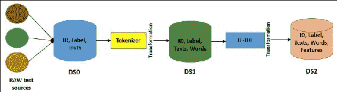

图 1:机器学习模型的文本处理(DS 表示数据源)

如果您回忆起[第 4 章](04.html#147LC2-5afe140a04e845e0842b44be7971e11a "Chapter 4. Extracting Knowledge through Feature Engineering")、*通过特征工程*提取特征中的*图 5* 和*图 6* ，则在转换步骤中会让出标识、文本和单词。它们在进行预测和模型检验时很有用。然而，它们对于模型拟合状态实际上是不必要的。根据[https://Databricks . com/blog/2015/01/07/ML-pipelines-a-new-high-level-API-for-mllib . html](https://databricks.com/blog/2015/01/07/ml-pipelines-a-new-high-level-api-for-mllib.html)上的一篇 Databricks 博客，如果预测数据集只包含预测的标签，则不会提供太多信息。

因此，如果您想要检查预测指标，例如准确性、精确度、召回率、加权真阳性和加权假阳性，那么查看预测标签以及原始输入文本和标记化单词是非常有用的。同样的建议也适用于其他使用 Spark ML 和 Spark MLlib 的机器学习应用。

因此，对于内存、磁盘或外部数据源(如 Hive 和 Avro)来说，RDDs、数据集和数据帧之间的简单转换成为可能。虽然使用用户定义的函数从现有列创建新列很容易，但是数据集的表现形式是一种惰性操作。

相比之下，数据集只支持一些标准数据类型。然而，为了提高可用性并更好地适应机器学习模型，Spark 还增加了对矢量类型的支持，这是一种用户定义的类型，支持`mllib.linalg.DenseVector`和`mllib.linalg.Vector`下的密集和稀疏特征矢量。

### 类型

可以在 Spark 发行版下的`examples/src/main/`文件夹下找到 Java、Scala 和 Python 中完整的 DataFrame、Dataset 和 RDD 示例。感兴趣的读者可以参考 Spark SQL 的用户指南，了解更多关于 DataFrame、Dataset 及其支持的操作的信息。

## 管道

Spark 提供了 Spark ML 下的管道 API。如前所述，流水线由一系列阶段组成，这些阶段包括变压器和估计器。有两种基本类型的流水线阶段，称为转换器和估计器。

转换器将数据集作为输入，并生成一个扩充数据集作为输出，以便输出可以被馈送到下一步。比如**令牌**和 **H **阿星图**T5】就是两台变压器。标记器将包含文本的数据集转换为包含标记化单词的数据集。另一方面，哈希函数产生频率项。标记化和哈希函数的概念通常用于文本挖掘和文本分析。**

相反，估计量必须是输入数据集中产生模型的第一个。在这种情况下，模型本身将被用作将输入数据集转换为扩充输出数据集的转换器。例如，在用相应的标签和特征拟合训练数据集之后，可以使用**逻辑回归**或线性回归作为估计器。

之后，它产生一个逻辑或线性回归模型。这意味着开发管道既简单又容易。嗯，你只需要声明需要的阶段，然后配置相关阶段的参数；最后，将它们链接到一个管道对象中，如图 2 所示:


图 2:使用逻辑回归估计器的 Spark ML 管道模型(DS 表示数据存储，虚线内的步骤只发生在管道拟合期间)

如果你看一下*图 2* ，拟合模型由一个标记器、一个哈希函数特征提取器和一个拟合逻辑回归模型组成。拟合的管道模型充当转换器，可用于预测、模型验证、模型检查，最后是模型部署。然而，为了提高预测精度，需要对模型本身进行调整。我们将在[第 7 章](07.html#1O8H62-0b803698e2de424b8aa3c56ad52b005d "Chapter 7. Tuning Machine Learning Models")、*调整机器学习模型*中讨论如何调整机器学习模型。

为了更实际地展示流水线技术，下一节将展示如何使用 Spark ML 和 MLlib 创建一个实用的癌症诊断流水线。

# 带 Spark 的癌症诊断管道

在这一节中，我们将看看如何用 Spark ML 和 MLlib 开发一个癌症诊断管道。一个真实的数据集将被用来预测乳腺癌的概率，这几乎是可以治愈的，因为这种癌症类型的罪魁祸首基因已经被成功地识别出来。然而，我们想讨论这种癌症类型，因为在非洲和亚洲的第三世界国家，它仍然是一种致命的疾病。

### 类型

我们建议读者对这种疾病的结果或状态保持开放的心态，因为我们将通过整合和组合来自以下网站的数据集来展示如何使用 Spark ML API 来预测癌症:威斯康星乳腺癌(原文)、**威斯康星诊断乳腺癌** ( **WDBC** )和**威斯康星预后乳腺癌**(**WPBC**):[http://archive.ics.uci.edu/ml](http://archive.ics.uci.edu/ml)。

## 带 Spark 的乳腺癌诊断管道

在本小节中，我们将开发一个逐步的癌症诊断管道。这些步骤包括乳腺癌的背景研究、数据集收集、数据探索、问题形式化和基于 Spark 的实现。

### 背景研究

根据 Salama 等人(*使用多分类器在三个不同数据集上的乳腺癌诊断，国际计算机和信息技术杂志* ( *2277 - 0764* ) *第 01 卷-第 01 期，2012 年 9 月*)，在 20 至 29 岁的女性中，乳腺癌排在甲状腺癌、黑色素瘤和淋巴瘤之后的第四位。

乳腺癌由乳房组织发展而来，由于包括性别、肥胖、酒精、家族史、缺乏体育锻炼等多种因素而变异。此外，根据**疾病控制和预防中心**(**TCDCP**)([https://www.cdc.gov/cancer/breast/statistics/](https://www.cdc.gov/cancer/breast/statistics/))的统计，2013 年，全美共有 230，815 名女性和 2，109 名男性被诊断为乳腺癌。不幸的是，40，860 名妇女和 464 名男子死于这种疾病。

研究发现，约 5-10%的病例是由于父母的一些遗传，包括 BRCA1 和 BRCA2 基因突变等等。早期诊断有助于拯救全球数千名乳腺癌患者。尽管已经确定了罪魁祸首基因，但化疗并没有被证明非常有效。基因沉默正在变得流行，但还需要更多的研究。

如前所述，机器学习中的学习任务在很大程度上依赖于分类、回归和聚类技术。此外，传统的数据挖掘技术与这些机器学习技术一起被应用，这是最基本和最重要的任务。因此，通过与 Spark 集成，这些应用技术在生物医学数据分析领域获得了广泛的接受和采用。此外，正在生物医学数据集上使用多类和多级分类器和特征选择技术对癌症诊断和预后进行大量实验。

### 数据集集合

**癌症基因组图谱**(**【TCGA】**)**癌症体细胞突变目录**(**COSMIC**)**国际癌症基因组联盟** ( **ICGC** )是用于研究目的最广泛的癌症和肿瘤相关数据集。这些数据来源是由世界著名的机构，如麻省理工学院、哈佛大学、牛津大学等收集的。然而，可用的数据集是非结构化的、复杂的和多维的。因此，我们不能直接使用它们来展示如何将大规模机器学习技术应用于它们。原因是这些数据集需要大量的预处理和清理，这需要大量的页面。

在实践这一应用后，我们相信读者将能够将同样的技术应用于任何种类的用于癌症诊断的生物医学数据集。由于页面限制，我们应该使用更简单的数据集，这些数据集是结构化的，并且是为机器学习应用开发而手动精选的，当然，其中许多数据集显示出良好的分类准确性。

例如，威斯康辛大学研究人员捐赠的 http://archive.ics.uci.edu/ml UCI 机器学习存储库中的威斯康辛乳腺癌数据集包含乳腺肿块细针抽吸数字化图像的测量值。这些值代表下一小节中描述的数字图像中存在的细胞核的特征。

### 类型

要了解更多有关威斯康星乳腺癌数据的信息，请参考作者的出版物:*用于乳腺肿瘤诊断的核特征提取。IS & T/SPIE 1993 电子成像国际研讨会:科学与技术，第 1905 卷，第 861-870 页。*

### 数据集描述和准备

如[网站上的**威斯康星乳腺癌数据集** ( **WDBC** )手册所示，丛厚度良性细胞倾向于以单层分组，而癌细胞通常以多层分组。因此，在应用机器学习技术之前，手册中提到的所有特征和领域都很重要，因为这些特征将有助于识别特定细胞是否癌变。](https://archive.ics.uci.edu/ml/machine-learning-databases/breast-cancer-wisconsin/wdbc.names)

乳腺癌数据包括 569 个癌症活检样本，每个样本有 32 个特征。一个特征是患者的识别号，另一个是癌症诊断，标记为良性或恶性，其余的是数值，称为生物测定，在分子实验室工作中被识别。就癌症诊断而言，诊断编码为 M 表示恶性，或 B 表示良性。

类别分布如下:良性 357 例(62.74%)，恶性 212 例(37.25%)。训练和测试数据集将按照这里给出的数据集描述进行准备。30 个数字测量值包括平均值、标准误差和最差值，最差值是三个最大值的平均值。字段 3 是平均半径，13 是半径 SE，23 是最差半径。通过*表 1 中描述的数字化细胞核的不同特征，为每个细胞核计算 10 个实值特征，10 个实值特征及其描述*:

<colgroup class="calibre11"><col class="calibre12"> <col class="calibre12"> <col class="calibre12"></colgroup> 
| **编号** | **值** | **解释** |
| one | 半径 | 从中心到周边点的平均距离 |
| Two | 纹理 | 灰度值的标准偏差 |
| three | 周长 | 细胞核的周长 |
| four | 面积 | 细胞核覆盖周边的区域 |
| five | 平滑 | 半径长度的局部变化 |
| six | 紧凑 | 计算如下:(Perimeter)^2 /面积- 1.0 |
| seven | 凹面 | 轮廓凹陷部分的严重程度 |
| eight | 凹点 | 轮廓凹入部分的数量 |
| nine | 对称 | 指示单元格结构是否对称 |
| Ten | 分形维数 | 计算公式为:海岸线近似值- 1 |

表 1: 10 个实值特征及其描述

所有特征值都用四个有效数字记录，没有缺失值或空值。因此，我们不需要执行任何数据清理。然而，从前面的描述来看，对于一个人来说，很难很好地了解这些数据。例如，除非你是肿瘤学家，否则你不太可能知道每个领域与良性或恶性肿块的关系。随着我们继续机器学习过程，这些模式将会被揭示。数据集的快照示例如图 3 所示:


图 3:数据快照(部分)

### 问题形式化

*图 4* 、*乳腺癌诊断和预后管道模型*，描述了提出的乳腺癌诊断模型。该模型包括两个阶段，即培训和测试阶段:

*   训练阶段包括四个步骤:数据收集、预处理、特征提取和特征选择
*   测试阶段包括与培训阶段相同的四个步骤，并增加了分类步骤

在数据收集步骤中，首先进行预处理，检查是否有不需要的值或缺少任何值。我们已经提到，不存在缺失值。然而，检查总是好的做法，因为即使是一个特殊角色不需要的值也可能会停止整个训练过程。之后，通过特征提取和选择过程完成特征工程步骤，以确定后续逻辑或线性回归分类器的正确输入向量:

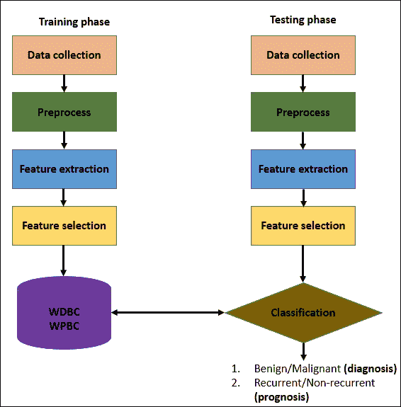

图 4:乳腺癌诊断和预后管道模型

这有助于决定与模式向量相关的类。基于特征选择或特征提取，实现了降维技术。但是，请注意，我们不会使用任何形式的降维算法来开发该应用。关于降维的更多信息，可以参考[第四章](04.html#147LC2-5afe140a04e845e0842b44be7971e11a "Chapter 4. Extracting Knowledge through Feature Engineering")、*通过特征工程*提取知识中的*降维*部分。

在分类步骤中，应用逻辑回归分类器来获得用于肿瘤诊断和预后的最佳结果。

### 用 Spark ML 开发癌症诊断管道

如前所述，在[的 WDBC 数据集中发现的属性的细节包括患者 ID、诊断(M =恶性，B =良性)，并且为每个细胞核计算 10 个实值特征，如*表 1* 、 *10 个实值特征及其描述*中所述。](https://archive.ics.uci.edu/ml/machine-learning-databases/breast-cancer-wisconsin/breast-cancer-wisconsin.names)

这些特征是从乳腺肿块的**细针抽吸**(**【FNA】**)的数字化图像中计算出来的，因为我们对数据集有足够的了解。在本小节中，我们将逐步了解如何开发乳腺癌诊断机器学习管道，包括在*图 4* 中描述的 10 个步骤中将数据集的输入作为数据工作流进行预测。

**第一步:导入必要的包/库/API**

下面是导入包的代码:

```scala
import org.apache.spark.api.java.JavaRDD; 
import org.apache.spark.api.java.function.Function; 
import org.apache.spark.ml.Pipeline; 
import org.apache.spark.ml.PipelineModel; 
import org.apache.spark.ml.PipelineStage; 
import org.apache.spark.ml.classification.LogisticRegression; 
import org.apache.spark.ml.feature.LabeledPoint; 
import org.apache.spark.ml.linalg.DenseVector; 
import org.apache.spark.ml.linalg.Vector; 
import org.apache.spark.sql.Dataset; 
import org.apache.spark.sql.Row; 
import org.apache.spark.sql.SparkSession; 

```

**步骤 2:初始化 Spark 会话**

Spark 会话可以在以下代码的帮助下初始化:

```scala
static SparkSession spark = SparkSession 
        .builder() 
        .appName("BreastCancerDetectionDiagnosis") 
       .master("local[*]") 
       .config("spark.sql.warehouse.dir", "E:/Exp/") 
       .getOrCreate();
```

这里我们将应用名称设置为`BreastCancerDetectionDiagnosis`，主 URL 设置为`local` `.`Spark 上下文是程序的入口点。请相应地设置这些参数。

**第三步:以乳腺癌数据为输入，从数据中准备 JavaRDD】**

下面是准备`JavaRDD:`的代码

```scala
  String path = "input/wdbc.data"; 
  JavaRDD<String> lines = spark.sparkContext().textFile(path, 3).toJavaRDD();
```

要了解更多数据，请参考*图 3* : *数据快照(部分*)。

**第 4 步:为回归创建标记点关系数据库**

创建`LabeledPoint`诊断用 rdd(B =良性，M=恶性):

```scala
JavaRDD<LabeledPoint> linesRDD = lines 
        .map(new Function<String, LabeledPoint>() { 
          public LabeledPoint call(String lines) { 
            String[] tokens = lines.split(","); 
            double[] features = new double[30]; 
            for (int i = 2; i < features.length; i++) { 
              features[i - 2] = Double.parseDouble(tokens[i]); 
            } 
            Vector v = new DenseVector(features); 
            if (tokens[1].equals("B")) { 
              return new LabeledPoint(1.0, v); // benign 
            } else { 
              return new LabeledPoint(0.0, v); // malignant 
            } 
          } 
        }); 

```

**第 5 步:从线形图创建行数据集，并显示顶部特征**

下面是代码示例:

```scala
Dataset<Row> data = spark.createDataFrame(linesRDD,LabeledPoint.class); 
data.show(); 

```

下图显示了顶部要素及其对应的标签:

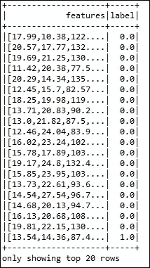

图 5:顶级特性及其对应的标签

**第六步:拆分数据集准备训练和测试集**

这里，我们将原始数据帧分为训练集和测试集，分别为 60%和 40%。这里，`12345L`是种子值。该值表示每次拆分都是相同的，因此 ML 模型在每次迭代中都产生相同的结果。在准备测试和训练集的每一章中，我们遵循相同的转换:

```scala
Dataset<Row>[] splits = data.randomSplit(new double[] { 0.6, 0.4 }, 12345L); 
Dataset<Row> trainingData = splits[0]; 
Dataset<Row> testData = splits[1]; 

```

要查看这两个集合的快速快照，只需分别为训练集和测试集编写`trainingData.show()`和`testData.show()`。

**步骤 7:创建逻辑回归分类器**

通过指定最大迭代和回归参数来创建逻辑回归分类器:

```scala
LogisticRegression logisticRegression = new LogisticRegression() 
                          .setMaxIter(100) 
                             .setRegParam(0.01) 
                             .setElasticNetParam(0.4); 

```

### 类型

逻辑回归通常采用三个参数:最大迭代次数、回归参数和弹性网正则化。请参阅以下几行，以获得更清晰的概念:

```scala
      LogisticRegression lr = new 
      LogisticRegression().setMaxIter(100)
      .setRegParam(0.01).setElasticNetParam(0.4); 

```

### 类型

前面的语句创建了一个逻辑回归模型`lr`，该模型具有最大迭代`100`、回归参数`0.01`和弹性网络参数`0.4`。

**步骤 8:创建并训练管道模型**

下面是代码示例:

```scala
Pipeline pipeline = new Pipeline().setStages(new PipelineStage[] {logisticRegression}); 
PipelineModel model = pipeline.fit(trainingData); 

```

在这里，我们创建了一个管道，其阶段由逻辑回归阶段定义，这也是我们刚刚创建的估计器。请注意，如果要处理文本数据集，可以尝试创建标记器和哈希函数阶段。

然而，在这个癌症数据集中，我们所有的值都是数字。因此，我们不会创建这样的阶段来链接到管道。

**步骤 9:创建数据集，转换模型和预测**

创建类型为“行”的数据集，并转换模型以基于测试数据集进行预测:

```scala
Dataset<Row> predictions=model.transform(testData); 

```

**步骤 10:以预测精度显示预测**

```scala
predictions.show(); 
long count = 0; 
for (Row r : predictions.select("features", "label", "prediction").collectAsList()) { 
    System.out.println("(" + r.get(0) + ", " + r.get(1) + r.get(2) + ", prediction=" + r.get(2)); 
      count++; 
    } 

```


图 6:具有预测精度的预测

*图 7* 显示了测试集的预测数据集。所示的打印方法基本上生成输出，类似于以下内容:


图 7:预测的样本输出。第一个值是特征，第二个值是标签，最后一个值是预测值

现在让我们计算精度分数。为此，我们将计数器乘以 100，然后将该值除以预测次数，如下所示:

```scala
System.out.println("precision: " + (double) (count * 100) / predictions.count()); 
Precision - 100.0 

```

因此，精度是 100%，这太棒了。但是，如果您仍然不满意或有任何困惑，下一章将演示如何调整几个参数，以提高预测精度，因为可能有许多假阴性预测。

此外，由于您这边的随机分割特性和数据集处理，结果可能会因您的平台而异。

# 带 Spark 的癌症预测管道

在前一节中，我们展示了如何开发一个基于两个标签(良性和恶性)预测癌症的癌症诊断管道。在本节中，我们将了解如何使用 Spark ML 和 MLlib APIs 开发癌症预后管道。威斯康星预后乳腺癌 ( **WPBC** )数据集将用于预测乳腺癌复发和非复发肿瘤细胞的预后概率。同样，数据集是从[下载的。为了理解问题的形式化，请再次参考*图 1* ，因为我们将遵循癌症预后管道开发期间几乎相同的阶段。](https://archive.ics.uci.edu/ml/datasets/Breast+Cancer+Wisconsin+(Prognostic))

## 数据集探索

在[https://archive . ics . UCI . edu/ml/机器学习-数据库/乳腺癌-威斯康星/wpbc . name](https://archive.ics.uci.edu/ml/machine-learning-databases/breast-cancer-wisconsin/wpbc.names)的 WPBC 数据集中找到的属性详情如下:

*   识别号
*   结果(复发，非复发)
*   时间(如果字段 2，则为复发时间=> R，如果字段 2，则为无病时间=> N)
*   3 to 33: Ten real-valued features are computed for each cell nucleus: Radius, Texture, Perimeter, Area, Smoothness, Compactness, Concavity, Concave points, Symmetry, and Fractal dimension. Thirty-four is Tumor size and thirty-five is the Lymph node status, as follows:
    *   肿瘤大小:切除肿瘤的直径，单位为厘米
    *   淋巴结状态:腋窝淋巴结阳性的数量

如果你比较*图 3* 和*图 9* ，你会发现诊断和预后有相同的特征，但预后有两个额外的特征(前面提到为 34 和 35)。请注意，这些是在 1988 年至 1995 年手术时观察到的，在 198 例中，151 例为非复发性(N)，47 例为复发性(R)，如图 8*所示。*

当然，如今真正的癌症诊断和预后数据集以结构化或非结构化的方式包含许多其他特征和领域:

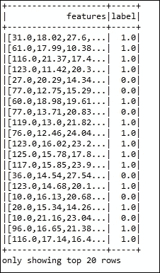

图 8:数据快照(部分)

### 类型

对于更详细的讨论和有意义的见解，感兴趣的读者可以参考以下研究论文:*威斯康星乳腺癌问题:使用概率和广义回归神经分类器的诊断和 DFS 时间预测肿瘤学报告，特刊《肿瘤学中的计算分析和决策支持系统》，2005 年最后一个季度，由 Ioannis A .等人在以下链接中发现:*[http://citeseerx.ist.psu.edu/viewdoc/download?doi = 10 . 1 . 1 . 65 . 2463&rep = rep1&type = pdf](http://citeseerx.ist.psu.edu/viewdoc/download?doi=10.1.1.65.2463&rep=rep1&type=pdf)。

## 带有 Spark ML/MLlib 的乳腺癌预后管道

在本小节中，我们将逐步了解如何开发乳腺癌预后机器学习管道，包括将数据集的输入作为数据工作流，以 10 个不同的步骤进行预测，这些步骤在*图 1* 中描述。

### 类型

建议读者从 Packt 资料下载数据集和项目文件，以及 Maven 项目配置的`pom.xml`文件。我们在前面的章节中已经建议了如何使代码工作，例如，[第 1 章](01.html#DB7S2-0b803698e2de424b8aa3c56ad52b005d "Chapter 1. Introduction to Data Analytics with Spark")，*用 Spark* 介绍数据分析。

**第一步:导入必要的包/库/API**

```scala
import org.apache.spark.api.java.JavaRDD; 
import org.apache.spark.api.java.function.Function; 
import org.apache.spark.ml.Pipeline; 
import org.apache.spark.ml.PipelineModel; 
import org.apache.spark.ml.PipelineStage; 
import org.apache.spark.ml.classification.LogisticRegression; 
import org.apache.spark.ml.feature.LabeledPoint; 
import org.apache.spark.ml.linalg.DenseVector; 
import org.apache.spark.ml.linalg.Vector; 
import org.apache.spark.sql.Dataset; 
import org.apache.spark.sql.Row; 
import org.apache.spark.sql.SparkSession; 

```

**步骤 2:初始化必要的 Spark 环境**

```scala
static SparkSession spark = SparkSession 
        .builder() 
        .appName("BreastCancerDetectionPrognosis") 
       .master("local[*]") 
       .config("spark.sql.warehouse.dir", "E:/Exp/") 
       .getOrCreate(); 

```

这里我们将应用名称设置为`BreastCancerDetectionPrognosis`，主网址设置为`local[*]`。Spark 上下文是程序的入口点。请相应地设置这些参数。

**第三步:以乳腺癌数据为输入，从数据中准备 JavaRDD】**

```scala
String path = "input/wpbc.data"; 
JavaRDD<String> lines = spark.sparkContext().textFile(path, 3).toJavaRDD(); 

```

### 类型

要了解更多数据，请参考*图 5* 及其描述和数据集探索小节。

**第 4 步:创建标记点 RDDs**

使用以下代码段分别为 N =复发和 R=非复发的预后创建`LabeledPoint`rdd:

```scala
JavaRDD<LabeledPoint> linesRDD = lines.map(new Function<String, LabeledPoint>() { 
      public LabeledPoint call(String lines) { 
        String[] tokens = lines.split(","); 
        double[] features = new double[30]; 
        for (int i = 2; i < features.length; i++) { 
          features[i - 2] = Double.parseDouble(tokens[i]); 
        } 
        Vector v = new DenseVector(features); 
        if (tokens[1].equals("N")) { 
          return new LabeledPoint(1.0, v); // recurrent 
        } else { 
          return new LabeledPoint(0.0, v); // non-recurrent 
        } 
      } 
    });  

```

**步骤 5:根据 RDD 线创建数据集，并显示顶部特征**

```scala
Dataset<Row> data = spark.createDataFrame(linesRDD,LabeledPoint.class); 
data.show(); 

```

顶部特征及其对应的标签见*图 9* :


图 9:顶级特性及其对应的标签

**第六步:拆分数据集准备训练和测试集**

这里，我们将要测试的数据集和训练集分别拆分为 60%和 40%。请根据您的要求进行调整:

```scala
Dataset<Row>[] splits = data.randomSplit(new double[] { 0.6, 0.4 }, 12345L); 
Dataset<Row> trainingData = splits[0];   
Dataset<Row> testData = splits[1]; 

```

要查看这两个集合的快速快照，只需分别为训练集和测试集编写`trainingData.show()`和`testData.show()`。

**步骤 7:创建逻辑回归分类器**

通过指定最大迭代和回归参数来创建逻辑回归分类器:

```scala
LogisticRegression logisticRegression = new LogisticRegression() 
.setMaxIter(100) 
.setRegParam(0.01) 
.setElasticNetParam(0.4); 

```

**步骤 8:创建管道并训练管道模型**

```scala
Pipeline pipeline = new Pipeline().setStages(new PipelineStage[]{logisticRegression}); 
PipelineModel model=pipeline.fit(trainingData); 

```

这里，类似于诊断管道，我们创建了预测管道，其阶段仅由逻辑回归定义，逻辑回归也是估计器，当然也是阶段。

**步骤 9:创建数据集并转换模型**

创建一个数据集，并进行转换以基于测试数据集进行预测:

```scala
Dataset<Row> predictions=model.transform(testData); 

```

**步骤 10:以预测精度显示预测**

```scala
predictions.show(); 

```


图 10:具有预测精度的预测

```scala
long count = 0; 
for (Row r : predictions.select("features", "label", "prediction").collectAsList()) { 
      System.out.println("(" + r.get(0) + ", " + r.get(1) + r.get(2) + ", prediction=" + r.get(2)); 
      count++; 
    } 

```

该代码段将产生类似于*图 7* 所示的输出，具有不同的特征、标签和预测:

```scala
System.out.println("precision: " + (double) (count * 100) / predictions.count());  
Precision: 100.0  

```

所以精度几乎是 100%，太神奇了。但是，根据数据准备情况，您可能会收到不同的结果。

如果您有任何困惑，下一章将演示如何调整参数以提高预测精度，因为它们可能有许多假阴性预测。

### 类型

在他们题为《与 R 一起进行机器学习》的书中，帕克特出版社，2015 年，布雷特·兰茨在 el。认为通过将每个肿块分为恶性、良性、复发性或非复发性，完全消除假阴性是可能的。显然，这不是一个现实的策略。尽管如此，它还是说明了这样一个事实:预测需要在假阳性率和假阴性率之间取得平衡。

如果您仍然不满意，我们将在[第 7 章](07.html#1O8H62-0b803698e2de424b8aa3c56ad52b005d "Chapter 7. Tuning Machine Learning Models")、*调整机器学习模型*中调整几个参数，以便预测精度朝着更复杂的测量预测精度的方法提高，该方法可用于根据每种类型的误差成本来确定误差率可以优化的地方。

# 星火核心的市场篮子分析

在本节中，我们将从市场篮子分析的角度来看如何开发一个大规模的机器学习管道。除了使用 Spark ML 和 MLlib 之外，我们将演示如何使用 Spark Core 来开发这样的应用。

## 背景

在早期的论文《Hadoop 上具有改进的 MapReduce 框架的高效市场篮子分析技术:电子商务视角》(可在[【http://onlinepresent.org/proceedings/vol6_2012/8.pdf】](http://onlinepresent.org/proceedings/vol6_2012/8.pdf)获得)中，作者认为**市场篮子分析** ( **MBA** )技术对日常商业决策非常重要，因为客户的购买规则可以通过发现他们经常一起购买的商品而从关联规则中提取出来。因此，可以基于这些关联规则为频繁购物者揭示购买规则。

你可能仍然想知道为什么我们需要市场篮子分析，为什么它很重要，为什么它在计算上很昂贵。嗯，如果你能识别出高度特定的关联规则，比如，如果一个客户喜欢芒果或橘子果酱以及他们的牛奶或黄油，你需要有大规模的交易数据来分析和处理。此外，一些大型连锁零售商或超市，例如，E-mart(英国)、HomePlus(韩国)、Aldi(德国)或 Dunnes Stores(爱尔兰)使用数百万甚至数十亿笔交易的数据库，以便找到特定商品在品牌、颜色、产地甚至风味方面的关联，从而增加销售和利润的可能性。

在本节中，我们将研究一种利用 Spark 库进行大规模市场篮子分析的有效方法。阅读并实践了这一点之后，您将能够展示 Spark 框架如何将现有的单节点管道提升为可在多节点数据挖掘集群上使用的管道。结果是，我们提出的关联规则挖掘算法可以并行重用，具有相同的好处。

我们使用首字母缩略词 SAMBA 表示基于 Spark 的市场篮子分析， *min_sup* 表示最低支持度， *min_conf* 表示最低置信度。我们也交替使用术语频繁模式和频繁项目集。

## 动机

传统的主内存或基于磁盘的计算和关系数据库管理系统无法处理不断增加的大型事务数据。此外，如[第 1 章](01.html#DB7S2-0b803698e2de424b8aa3c56ad52b005d "Chapter 1. Introduction to Data Analytics with Spark")、*使用 Spark* 进行数据分析简介中所述，MapReduce 在 I/O 操作、算法复杂性、低延迟和完全基于磁盘的操作方面存在一些问题。因此，找到空事务并随后从未来的方案中消除它们是这种方法的初始部分。

通过识别那些没有出现在至少一个频繁 1 项集上的事务，很有可能找到所有的空事务。如前所述，Spark 将中间数据缓存到内存中，并提供了**弹性分布式数据集** ( **RDDs** )的抽象，该抽象可用于通过产生巨大差异来克服这些问题，在过去三年中在分布式计算系统中处理大规模数据方面取得了巨大成功。这些成功是有希望和激励的例子，探索这项研究工作，以应用 Spark 在市场篮子分析。

## 探索数据集

请从下载菜篮子分析的杂货数据集。原始`grocery.csv` 数据的前五行如下图*图 11* 。这些线表示 10 个独立的杂货店交易。第一笔交易包括四个项目:柑橘类水果、半成品面包、人造黄油和现成的汤。相比之下，第三笔交易只包括一种商品，全脂牛奶:

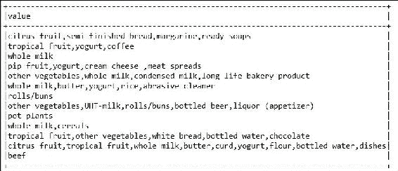

图 11:杂货数据集的快照

## 问题陈述

我们相信，我们有足够的动机和理由来解释为什么我们需要使用交易或零售数据集来分析市场篮子。现在，让我们讨论一些背景研究，这是应用我们基于 Spark 的市场篮子分析技术所需要的。

假设你有一组不同的项目 *I = {i1，i2...in}* 和 *n* 是不同物品的数量。事务数据库 *T = {t1，t2...tN}* 为一组 *N* 笔交易， *|N|* 为总交易笔数。集合 *X* 被称为模式或项目集。我们假设输入是以事务序列的形式给出的，其中项目用逗号分隔，如*表 1* 所示。

为了简单描述背景研究，相同的交易在*表 2* 中用单个字符表示:

<colgroup class="calibre11"><col class="calibre12"> <col class="calibre12"></colgroup> 
| 交易记录 1 交易 2 交易 3 交易 4... | 饼干，冰淇淋，可乐，橘子，牛肉、比萨饼、可乐、面包法式面包、苏打水、洗发水、饼干、百事可乐汉堡、奶油奶酪、尿布、牛奶... |

表 1。客户进行的交易示例

<colgroup class="calibre11"><col class="calibre12"> <col class="calibre12"></colgroup> 
| **时间** | **项目集(项目序列)** |
| Ten | 甲、乙、丙、己 |
| Twenty | 丙、丁、戊 |
| Thirty | 甲、丙、戊、丁 |
| Forty | A |
| Fifty | 丁、戊、庚 |
| Sixty | 乙、丁 |
| Seventy | B |
| Eighty | 甲、乙、丙 |
| Ninety | 甲、丙、丁 |
| One hundred | 乙、戊、丁 |

表 2。事务数据库

如果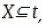，则表示 *X* 出现在 *t* 或 *t* 包含 *X* 。支持计数是项目集在所有事务中出现的频率，可以描述如下:


换句话说，如果*支持* 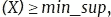，我们说 *X* 是频繁项集。例如在*表 2* 中，项集 *CD* 、 *DE、*和 *CDE* 的出现次数分别为 *3* 、 *3* 和 *2* ，如果 *min_sup* 为 *2* ，则这些都是频繁项集。

另一方面，关联规则是形式的陈述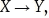或者更正式地说:


因此，我们可以说关联规则是这样一种模式:当 *X* 发生时，那么 *Y* 以一定的概率发生。等式 1 中定义的关联规则的置信度可以表示为 *Y* 中的项目出现在也包含 *X* 的交易中的频率，如下所示:


现在，我们需要引入一个新的参数，称为`lift`，作为一个指标，它是一个项目相对于其典型购买率被购买的可能性的度量，假设您知道另一个项目已经被购买。这由以下等式定义:


简而言之，给定一个事务数据库，现在市场篮子分析的问题是通过关联规则从支持度和置信度分别不低于 *min_sup* 和 *min_conf* 阈值的频繁项集中找到客户购买规则的完整集合。

## 使用 Spark 进行大规模市场篮子分析

如图 12 所示，我们假设事务数据库以分布式方式存储在数据库服务器集群中。数据库服务器是具有大存储和主存储器的计算节点。因此，它可以存储大型数据集，因此可以计算分配给它的任何任务。驱动 PC 也是一个计算节点，主要作为客户端工作，控制整个进程。

显然，它需要有一个大的内存来处理和保存要通过计算节点发送的 Spark 代码。代码由数据库服务器标识、最小支持度、最小置信度和挖掘算法组成:

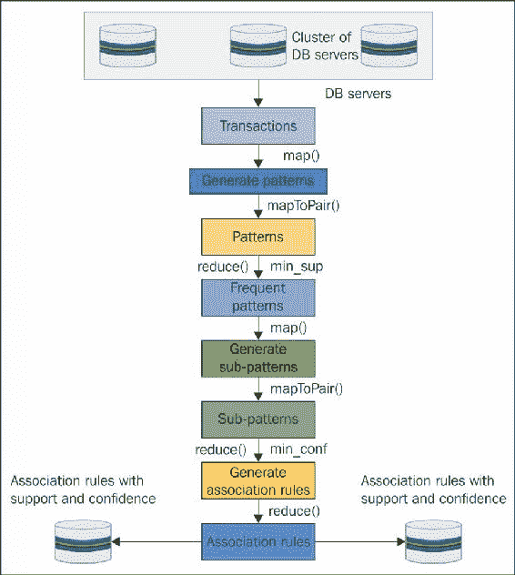

图 12:使用 Spark 的 SAMBA 算法的工作流程

从模式中，使用减少阶段 1 生成频繁模式，其满足约束 *min_sup* 。映射阶段应用于计算的频繁模式，以生成最终有助于生成关联规则的子模式。从子模式中，应用缩减阶段 2 来生成满足约束 *min_conf* 的关联规则。

由于面向 Spark 核心和相关 API 的 Spark 生态系统，合并两个 Map 和 Reduce 阶段是可能的。最终结果是完整的关联规则集及其各自的支持计数和置信度。

这些店主可以根据商品之间的关联，以完整的形式放置他们的商品，以增加对频繁和不频繁购物者的销售。由于空间限制，我们无法展示*表 2* 中展示的示例事务数据库的分步示例。

然而，我们相信工作流和伪代码足以理解整个场景。数据库服务器接收从驱动程序计算机发送的代码输入并开始计算。从环境变量 Spark 会话中，我们创建了一些初始数据引用或 RDD 对象。然后，初始 RDD 对象被转换，以在数据库服务器中创建更多全新的 RDD 对象。首先，它将数据集作为纯文本(或其他支持的格式)读取，并使用窄/宽转换(即`flatMap`、`mapToPair`和`reduceByKey`)为空事务。

因此，过滤器连接 RDD 操作提供了没有空事务的数据段。然后将 RDD 对象具体化，将 RDD 作为过滤后的数据集转储到数据库服务器的存储中。Spark 的 inter RDD 连接操作允许在单个数据节点内组合多个 RDD 的内容。总之，在获取筛选数据集之前，我们遵循这里给出的步骤:

1.  将分布式处理模型和集群管理器(即 Mesos)的系统属性设置为 true。该值可以作为标准的 Spark 代码保存在您的应用开发中。
2.  设置 SparkConf、AppName、主 URL、Spark 本地 IP、Spark 驱动程序主机 IP、Spark 执行器内存和 Spark 驱动程序内存。
3.  使用`SparkConf`创建`JavaSparkContext`。
4.  创建`JavaRDD`并以纯文本、事务的形式读取数据集，并执行必要的分区。
5.  在 RDD 上执行`flatMap`操作，将交易拆分为项目。
6.  执行`mapToPair`操作，轻松找到项目的键/值对。
7.  执行筛选操作以删除所有空事务。

当我们拥有过滤后的数据库时，如果数据集没有足够的存储空间供单台机器使用，我们会物化一个操作间 RDD 连接操作，将数据集保存在数据库服务器或分区上，如果没有足够的内存，则保存在缓存中。

*图 12* 展示了使用 Spark 的 API 获取关联规则作为最终结果的完整工作流程。另一方面，图 13 显示了算法的伪代码，即**基于 Spark 的菜篮子分析** ( **SAMBA** )。实际上有两个相关的映射和缩减操作，如下所述:

*   **映射/减少阶段 1** :映射器从 HDFS 服务器读取事务，并将事务转换为模式。另一方面，减压器找到了频繁模式。
*   **Map/Reduce phase 2**: Mappers convert the frequent patterns into sub-patterns. On the other hand, a reducer generates the association rules based on the given constraints (`min_conf` and `lift`):

    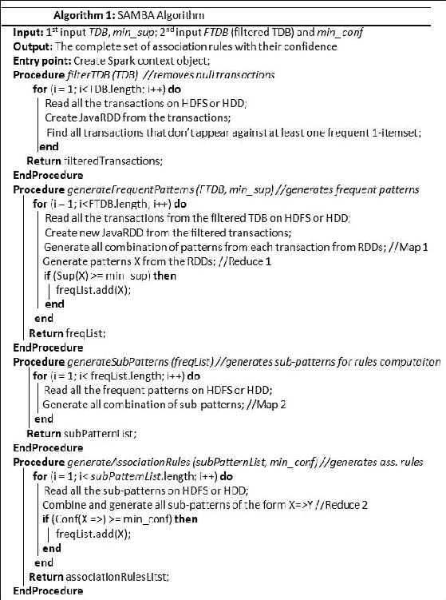

    图 SAMBA 算法

之后，SAMBA 算法读取**过滤后的数据库** ( **FTDB** )并应用地图阶段 1 来生成所有可能的模式组合。然后`mapToPair()`将它们作为具有各自支持的模式进行方法。

## 采用 Spark 核的算法求解

这里我们将看看如何使用 Spark Core 进行市场篮子分析。请注意，我们不会使用 Spark ML 或 MLlib，因为虽然 MLlib 提供了一种计算关联规则的技术，但是它没有显示如何计算一些其他参数，例如计算信心、支持和提升，这些是食品杂货数据集的完整分析所非常需要的。因此，我们将展示一个完整的示例，从数据探索到关联规则生成的一步一步。

**第一步:导入必要的包装和原料药**

下面是导入包和 API 的代码:

```scala
import java.util.ArrayList; 
import java.util.Iterator; 
import java.util.List; 
import org.apache.spark.api.java.JavaPairRDD; 
import org.apache.spark.api.java.JavaRDD; 
import org.apache.spark.api.java.function.Function; 
import org.apache.spark.api.java.function.Function2; 
import org.apache.spark.api.java.function.PairFlatMapFunction; 
import org.apache.spark.rdd.RDD; 
import org.apache.spark.sql.SparkSession; 
import scala.Tuple2;  
import scala.Tuple4; 

```

**步骤 2:通过指定 Spark 会话**创建入口点

可以在以下代码的帮助下创建入口点:

```scala
SparkSession spark = SparkSession 
.builder() 
.appName("MarketBasketAnalysis") 
.master("local[*]") 
.config("spark.sql.warehouse.dir", "E:/Exp/") 
.getOrCreate(); 

```

**步骤 3:为事务创建 Java RDD**

事务的 Java RDD 可以在以下代码的帮助下创建:

```scala
String transactionsFileName = "Input/groceries.data"; 
RDD<String> transactions = spark.sparkContext().textFile(transactionsFileName, 1); 
transactions.saveAsTextFile("output/transactions"); 

```

**第四步:创建创建列表的方法**

从创建的事务 RDDs 中创建一个名为`toList`的方法，该方法将添加事务中的所有项目:

```scala
  static List<String> toList(String transaction) { 
    String[] items = transaction.trim().split(","); 
    List<String>list = new ArrayList<String>(); 
    for (String item :items) { 
      list.add(item); 
    } 
    returnlist; 
  } 

```

**第五步:删除不常用的项目并清空交易**

创建一个名为`removeOneItemAndNullTransactions`的方法来删除不常见的项目和空事务:

```scala
static List<String> removeOneItemAndNullTransactions(List<String>list, int i) { 
    if ((list == null) || (list.isEmpty())) { 
      returnlist; 
    } 
    if ((i< 0) || (i> (list.size() - 1))) { 
      returnlist; 
    } 
    List<String>cloned = new ArrayList<String>(list); 
    cloned.remove(i); 
    return cloned; 
  } 

```

**步骤 6:平面映射和 1-项目集创建(映射阶段 1)**

执行`flatmap`并创建 1 项集。最后，保存模式:

```scala
JavaPairRDD<List<String>, Integer> patterns = transactions.toJavaRDD() 
        .flatMapToPair(new PairFlatMapFunction<String, List<String>, Integer>() { 
          @Override 
  public Iterator<Tuple2<List<String>, Integer>> call(String transaction) { 
  List<String> list = toList(transaction); 
  List<List<String>> combinations = Combination.findSortedCombinations(list); 
  List<Tuple2<List<String>, Integer>> result = new ArrayList<Tuple2<List<String>, Integer>>(); 
for (List<String> combList : combinations) { 
  if (combList.size() > 0) { 
  result.add(new Tuple2<List<String>, Integer>(combList, 1)); 
              } 
            } 
    return result.iterator(); 
          } 
        }); 
    patterns.saveAsTextFile("output/1itemsets"); 

```

### 注

请注意，模式 RDD 的最后一次保存是为了可选的参考目的，以便您可以看到关系数据库的内容。

以下是 1 项集的屏幕截图:

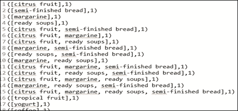

图 14: 1 项集

**第 7 步:合并并减少频繁模式(减少阶段 1)**

组合并减少所有频繁模式，并保存它们:

```scala
JavaPairRDD<List<String>, Integer> combined = patterns.reduceByKey(new Function2<Integer, Integer, Integer>() { 
      public Integer call(Integer i1, Integer i2) { 
        int support = 0; 
        if (i1 + i2 >= 2) { 
          support = i1 + i2; 
        } 
        // if(support >= 2) 
        return support; 
      } 
    }); 
  combined.saveAsTextFile("output/frequent_patterns"); 

```

以下是频繁模式及其各自支持的快照(图 15 中的*频率)*:

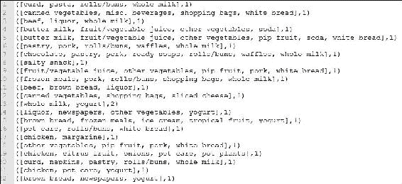

图 15:频繁模式及其各自的支持(频率)

**步骤 8:生成所有候选频繁模式(图 2 阶段)**

通过去除频繁模式中的 1-项集，生成所有候选频繁模式或子模式，最后保存候选模式:

```scala
JavaPairRDD<List<String>, Tuple2<List<String>, Integer>> candidate-patterns = combined.flatMapToPair( 
new PairFlatMapFunction<Tuple2<List<String>, Integer>, List<String>, Tuple2<List<String>, Integer>>() { 
          @Override 
public Iterator<Tuple2<List<String>, Tuple2<List<String>, Integer>>> call( 
Tuple2<List<String>, Integer> pattern) { 
List<Tuple2<List<String>, Tuple2<List<String>, Integer>>> result = new ArrayList<Tuple2<List<String>, Tuple2<List<String>, Integer>>>(); 
  List<String> list = pattern._1; 
  frequency = pattern._2; 
  result.add(new Tuple2(list, new Tuple2(null, frequency))); 
            if (list.size() == 1) { 
              return result.iterator(); 
            } 

  // pattern has more than one item 
  // result.add(new Tuple2(list, new Tuple2(null,size))); 
    for (int i = 0; i < list.size(); i++) { 
    List<String> sublist = removeOneItem(list, i); 
              result.add(new Tuple2<List<String>, Tuple2<List<String>, Integer>>(sublist, 
                  new Tuple2(list, frequency))); 
            } 
            return result.iterator(); 
          } 
        }); 
candidate-patterns.saveAsTextFile("output/sub_patterns"); 

```

以下是子模式的快照:


图 16:项目的子模式

**第九步:合并所有子模式**

合并所有子模式，并将其保存在磁盘或内存中:

```scala
JavaPairRDD<List<String>, Iterable<Tuple2<List<String>, Integer>>>rules = candidate_patterns.groupByKey(); 
rules.saveAsTextFile("Output/combined_subpatterns"); 

```

以下是组合形式的候选模式(子模式)的屏幕截图:


图 17:组合形式的候选模式(子模式)

**第十步:生成关联规则**

通过指定`confidence`和`lift`，从子模式生成所有关联规则(减少阶段 2):

```scala
JavaRDD<List<Tuple4<List<String>, List<String>, Double, Double>>> assocRules = rules.map( 
        new Function<Tuple2<List<String>, Iterable<Tuple2<List<String>, Integer>>>, List<Tuple4<List<String>, List<String>, Double, Double>>>() { 
          @Override 
public List<Tuple4<List<String>, List<String>, Double, Double>> call( 
Tuple2<List<String>, Iterable<Tuple2<List<String>, Integer>>> in) throws Exception { 

List<Tuple4<List<String>, List<String>, Double, Double>> result = new ArrayList<Tuple4<List<String>, List<String>, Double, Double>>(); 
  List<String> fromList = in._1; 
  Iterable<Tuple2<List<String>, Integer>> to = in._2; 
  List<Tuple2<List<String>, Integer>> toList = new ArrayList<Tuple2<List<String>, Integer>>(); 
Tuple2<List<String>, Integer> fromCount = null; 
      for (Tuple2<List<String>, Integer> t2 : to) { 
        // find the "count" object 
      if (t2._1 == null) { 
                fromCount = t2; 
              } else { 
                toList.add(t2); 
              } 
            } 
            if (toList.isEmpty()) { 
              return result; 
            } 
for (Tuple2<List<String>, Integer> t2 : toList) { 
  double confidence = (double) t2._2 / (double) fromCount._2; 
double lift = confidence / (double) t2._2; 
double support = (double) fromCount._2; 
List<String> t2List = new ArrayList<String>(t2._1); 
t2List.removeAll(fromList); 
if (support >= 2.0 && fromList != null && t2List != null) { 
  result.add(new Tuple4(fromList, t2List, support, confidence)); 
System.out.println(fromList + "=>" + t2List + "," + support + "," + confidence + "," + lift); 
              } 
            } 
            return result; 
          } 
        }); 
assocRules.saveAsTextFile("output/association_rules_with_conf_lift"); 

```

以下是关联规则的输出，包括它们的置信度和提升。有关支持、信心和提升的更多详细信息，请参考问题陈述部分。

[前因= >后果]，支持，信心，提升:

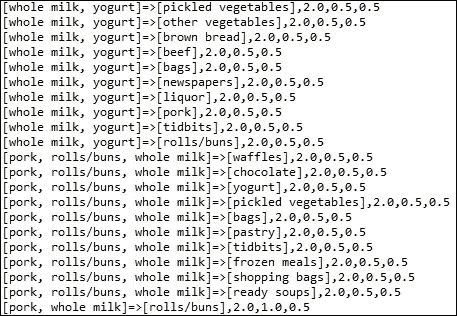

图 18:关联规则，包括它们的置信度和提升

## 在 SAMBA 中调整和设置正确的参数

请注意，如果您尝试使用默认参数设置作为支持= 0.1 和置信度= 0.6，您可能最终会生成空规则，或者从技术上讲，没有规则。你可能想知道为什么。实际上，默认支持 0.1 意味着为了生成关联规则，一个项目必须至少出现过 *0.1 * 9385 = 938.5* 笔交易或 938.5 次(对于我们正在使用的数据集，|N| = 9385)。

然而，在这方面，在他们题为《与 R 一起进行机器学习》的书中，Packt 出版公司，2015 年，Brett Lantz 在 el。认为有一种方法可以在获得支持的同时解决这个问题。他们建议在考虑模式的趣味性之前，先考虑所需的最小交易数量。此外，例如，你也可以争辩说，如果一件物品一天购买两次(大约一个月 60 次)，那么考虑该交易可能不是小事。

从这个角度来看，可以估计如何设置只找到至少匹配那么多事务的规则所需的支持值。因此，您可以将最小支持值设置为 0.006，因为 9835 中的 60 等于 0.006；我们将首先尝试在那里设置支持。

另一方面，设置最低置信度也需要一个棘手的平衡，在这方面，我们再次希望您参考 Brett Lantz 等人的书，书名为《带 R 的*机器学习》，Packt Publishing，2015* 。如果信心太低，显然我们可能不相信大量不可靠的规则假阳性结果。

因此，最小置信度阈值的最佳值在很大程度上取决于您的分析目标。因此，如果你从保守的价值观开始，如果你没有找到可操作的情报，你总是可以减少他们来扩大搜索范围。如果您将最小置信度阈值设置为 0.25，这意味着为了包含在结果中，规则必须至少有 25%的时间是正确的。这将消除最不可靠的规则，同时为我们提供一些空间，通过有针对性的产品促销来改变行为。

现在，我们来谈谈第三个参数`lift`。在建议如何设置`lift`的值之前，让我们先看一个实际的例子，它可能如何影响关联规则的生成。第三次，我们参考布雷特·兰茨等人的书，书名为《带 R 的 T2 机器学习》，帕克特出版社，2015 年。

例如，假设在超市商店，许多人经常一起购买牛奶和面包。因此，自然地，你会期望找到许多既包含牛奶又包含面包的交易。然而，如果`lift`(牛奶= >面包)大于 1，这意味着这两个项目被发现在一起的频率比人们预期的要高。因此，大的`lift`值是一个强有力的指标，表明规则是重要的，并反映了交易中项目之间的真实联系。

总之，通过考虑前面的例子，我们需要仔细设置这些参数的值。然而，作为一个独立的模型，这些算法可能需要几个小时才能完成。所以，用足够的时间运行应用。或者，减少长事务以减少时间开销。

# 带 Spark 的光学字符识别管道

图像处理和计算机视觉是两个经典但仍在兴起的研究领域，它们经常适当地利用许多类型的机器学习算法。有几个用例，其中将图像像素的模式链接到更高的概念的关系极其复杂且难以定义，当然，计算量也很大。

从实用的角度来看，人类识别物体是脸、狗还是字母或字符相对容易。然而，在某些情况下定义这些模式是困难的。此外，与图像相关的数据集通常是有噪声的。

在本节中，我们将开发一个类似于用作文档扫描仪的**光学字符识别** ( **光学字符识别**)的核心模型。这种软件通过将打印或手写文本转换成电子形式保存在数据库中，帮助处理纸质文档。

当光学字符识别软件第一次处理文档时，它会将纸张或任何对象分成一个矩阵，这样网格中的每个单元格都包含一个字形(也称为不同的图形形状)，这只是引用纸张或对象中的字母、符号或数字或任何上下文信息的一种精心制作的方式。

为了演示 OCR 管道，我们将假设文档仅包含英文字母字符，这些字符将字形与 26 个字母 A 到 z 中的一个相匹配。我们将使用来自 UCI 机器学习数据存储库([http://archive.ics.uci.edu/ml](http://archive.ics.uci.edu/ml))的 OCR 字母数据集。该数据集由 W. Frey 和 D. J. Slate 等人捐赠。为了探索该数据集，我们发现该数据集包含 26 个英文字母大写字母的 20，000 个示例，这些示例使用 20 种不同的随机重塑和扭曲的黑白字体作为不同形状的字形进行打印。

### 类型

有关这些数据的更多信息，请参考*使用荷兰式自适应分类器的字母识别，机器学习，第 6 卷，第 161-182 页，作者:W. Frey 和 D.J. Slate (1991)* 。

*图 19* 中显示的图像是由 Frey 和 Slate 出版的，并提供了一些印刷字形的示例。这些字母以这种方式变形，对计算机来说很难识别，但很容易被人类识别。前 20 行的统计属性见*图 20* :


图 19:一些印刷的字形[文章标题为使用荷兰式自适应分类器的字母识别，机器学习，第 6 卷，第 161-182 页，作者:W. Frey 和 D.J. Slate (1991)]

## 探索和准备数据

根据 Frey 和 Slate 提供的文档，当使用光学字符识别阅读器将字形扫描到计算机时，它们会自动转换为像素。因此，提到的 16 个统计属性也被记录到计算机中。

请注意，黑色像素在指示字符的框的各个区域的集中应该提供了一种使用光学字符识别或待训练的机器学习算法来区分字母表的 26 个字母的方法。

### 类型

按照这个例子，从 Packt Publishing 网站下载`letterdata.data`文件，并将其保存到您的项目目录中，在一个或另一个目录中工作。

在从 Spark 工作目录中读取数据之前，我们确认已经收到了定义每个字母类示例的 16 个特征的数据。不出所料，字母有 26 级，如图*图 20* :


图 20:显示为数据框的数据集快照

回想一下，SVM、基于朴素贝叶斯的分类器或任何其他分类器算法，以及它们相关的学习者，要求所有的特征都是数字的。此外，每个特征被缩放到相当小的间隔。

此外，SVM 在密集矢量化特征上表现良好，因此在稀疏矢量化特征上表现不佳。在我们的例子中，每个特征都是一个整数。因此，我们不需要将任何值转换成数字。另一方面，这些整数变量的一些范围看起来相当宽。

在实际情况下，它可能需要我们针对所有几个特征点来标准化数据。

## 带 Spark ML 和 Spark MLlib 的 OCR 管道

由于其准确性和鲁棒性，让我们看看 SVM 是否胜任这项任务。在*图 17* 中可以看到，我们有一个多类 OCR 数据集(更精确的说，有 26 个类)；因此，我们需要有一个多类分类算法，例如逻辑回归模型，因为 Spark 中 liner SVM 的当前实现不支持多类分类。

### 类型

详情请参考以下网址:[http://spark . Apache . org/docs/latest/mllib-linear-methods . html # linear-support-vector-machines-SVMs](http://spark.apache.org/docs/latest/mllib-linear-methods.html#linear-support-vector-machines-svms)。

**第一步:导入必要的包/库/API**

以下是导入必要包的代码:

```scala
import java.util.HashMap; 
import java.util.Map; 
import org.apache.spark.api.java.JavaRDD; 
import org.apache.spark.api.java.function.Function; 
import org.apache.spark.mllib.classification.LogisticRegressionWithLBFGS; 
import org.apache.spark.mllib.evaluation.MulticlassMetrics; 
import org.apache.spark.mllib.evaluation.MultilabelMetrics; 
import org.apache.spark.mllib.linalg.DenseVector; 
import org.apache.spark.mllib.linalg.Vector; 
import org.apache.spark.mllib.regression.LabeledPoint; 
import org.apache.spark.sql.Dataset; 
import org.apache.spark.sql.Row; 
import org.apache.spark.sql.SparkSession; 
import scala.Tuple2; 

```

**步骤 2:初始化必要的 Spark 环境**

以下是初始化 Spark 环境的代码:

```scala
  static SparkSession spark = SparkSession 
        .builder() 
        .appName("OCRPrediction") 
            .master("local[*]") 
            .config("spark.sql.warehouse.dir", "E:/Exp/"). 
            getOrCreate(); 

```

这里我们将应用名称设置为`OCRPrediction`，主网址设置为`local`。Spark 会议是该计划的切入点。请相应地设置这些参数。

**第三步:读取数据文件，创建相应的数据集，显示前 20 行**

以下是读取数据文件的代码:

```scala
String input = "input/letterdata.data"; 
Dataset<Row> df = spark.read().format("com.databricks.spark.csv").option("header", "true").load(input);  
  df.show();  

```

前 20 行请参考*图 5* 。我们可以看到，有 26 个字符呈现为需要预测的单个字符；因此，我们需要为每个字符分配一个随机的双精度值，以便将该值与其他特征对齐。因此，在下一步，这就是我们要做的。

**第四步:创建一个字典，为每个字符随机分配一个双精度值**

下面的代码将创建一个字典，为每个字符随机分配一个双精度值:

```scala
final Map<String, Integer>alpha = newHashMap(); 
    intcount = 0; 
    for(chari = 'A'; i<= 'Z'; i++){ 
      alpha.put(i + "", count++); 
      System.out.println(alpha); 
    } 

```

下面是从前面的代码段生成的映射输出:


图 21:映射分配

**第五步:创建标记点和特征向量**

为由 16 个要素(即 16 列)组合而成的要素创建标记点和要素向量。此外，将它们保存为 Java RDD 并转储或缓存在磁盘或内存中，并显示示例输出:

```scala
JavaRDD<LabeledPoint> dataRDD = df.toJavaRDD().map(new Function<Row, LabeledPoint>() { 
      @Override 
      public LabeledPoint call(Row row) throws Exception { 

        String letter = row.getString(0); 
        double label = alpha.get(letter); 
        double[] features= new double [row.size()]; 
        for(int i = 1; i < row.size(); i++){ 
          features[i-1] = Double.parseDouble(row.getString(i)); 
        } 
        Vector v = new DenseVector(features);         
        return new LabeledPoint(label, v); 
      } 
    }); 

dataRDD.saveAsTextFile("Output/dataRDD"); 
System.out.println(dataRDD.collect()); 

```

如果仔细查看前面的代码段，我们已经为 16 个要素创建了一个名为 features 的数组，并创建了一个密集向量表示，因为密集向量表示是一个更紧凑的表示，其中的内容可以如下面的屏幕截图所示:

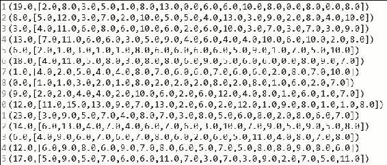

图 22:对应的标签和特征作为向量的 Java RDD

**第六步:生成训练和测试集**

下面是生成测试集的代码:

```scala
JavaRDD<LabeledPoint>[] splits = dataRDD.randomSplit(new double[] {0.7, 0.3}, 12345L); 
JavaRDD<LabeledPoint> training = splits[0]; 
JavaRDD<LabeledPoint> test = splits[1];  

```

如果您希望看到训练或测试数据集的快照，您应该转储或缓存它们。下面是一个示例代码:

```scala
training.saveAsTextFile("Output/training"); 
test.saveAsTextFile("Output/test"); 

```

### 类型

我们已经为要训练和测试的模型随机生成了训练和测试集。在我们的情况下，分别是 70%和 30%，11L 作为长种子。根据数据集重新调整值。请注意，如果您将种子添加到随机数中，每次运行代码时都会得到相同的结果，这些结果是高达 1062348 的素数。

**第七步:训练模型**

如您所见，我们有一个包含 26 个类的多类数据集；因此，我们需要有一个多类分类算法，例如，逻辑回归模型:

```scala
Boolean useFeatureScaling= true; 
final LogisticRegressionModel model = new LogisticRegressionWithLBFGS() 
  .setNumClasses(26).setFeatureScaling(useFeatureScaling) 
  .run(training.rdd()); 

```

前面的代码段通过指定类的数量(即`26`)和特征缩放为`Boolean true`，使用训练数据集构建模型。如您所见，我们使用了 RDD 版本的训练数据集`training.rdd()`，因为训练数据集是法向量格式的。

### 类型

Spark 支持多类逻辑回归算法，该算法支持**有限记忆-Broyden-Fletcher-Goldfarb-Shanno**(**LBFGS**)算法。在数值优化中，**布罗伊登-弗莱彻-戈德法布-夏诺** ( **BFGS** )算法是一种求解无约束非线性优化问题的迭代方法。

**第八步:计算测试数据集中的原始分数**

下面是计算原始分数的代码:

```scala
JavaRDD<Tuple2<Object, Object>> predictionAndLabels = test.map( 
    new Function<LabeledPoint, Tuple2<Object, Object>>() { 
    public Tuple2<Object, Object> call(LabeledPoint p) { 
    Double prediction = model.predict(p.features()); 
    return new Tuple2<Object, Object>(prediction, p.label()); 
          } 
        } 
      );  
predictionAndLabels.saveAsTextFile("output/prd2");  

```

如果你仔细看前面的代码，你会发现我们实际上是在计算我们在*步骤 7* 中创建的模型的预测特征，方法是让它们成为 Java RDD。

**第九步:预测标签 8.0(即 I)的结果，得到评价指标**

下面的代码说明了如何预测结果:

```scala
MulticlassMetrics metrics = new MulticlassMetrics(predictionAndLabels.rdd()); 
MultilabelMetrics(predictionAndLabels.rdd()); 
System.out.println(metrics.confusionMatrix()); 
double precision = metrics.precision(metrics.labels()[0]); 
double recall = metrics.recall(metrics.labels()[0]); 
double tp = 8.0; 
double TP = metrics.truePositiveRate(tp); 
double FP = metrics.falsePositiveRate(tp); 
double WTP = metrics.weightedTruePositiveRate(); 
double WFP =  metrics.weightedFalsePositiveRate(); 
System.out.println("Precision = " + precision); 
System.out.println("Recall = " + recall); 
System.out.println("True Positive Rate = " + TP); 
System.out.println("False Positive Rate = " + FP); 
System.out.println("Weighted True Positive Rate = " + WTP); 
System.out.println("Weighted False Positive Rate = " + WFP); 

```

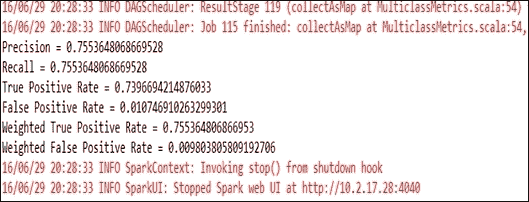

图 23:精确度和召回率的性能指标

因此，精度为 75%，这显然是不令人满意的。但是，如果您仍然不满意，下一章将研究如何调整参数，以提高预测精度。

### 类型

想要了解如何计算准确率、召回率、真阳性率和真阴性率，请参考[https://en.wikipedia.org/wiki/Sensitivity_and_specificity](https://en.wikipedia.org/wiki/Sensitivity_and_specificity)的维基百科页面，该页面详细讨论了灵敏度和特异性。你也可以参考*鲍尔斯，大卫·M·W(2011)。评价:从精确度、召回率和 f 检验到 ROC、信息度、标记度&相关(PDF)。机器学习技术杂志 2 (1): 37-63* 。

# 使用 Spark MLlib 和 ML 进行主题建模

主题建模技术广泛应用于从大量文档中挖掘文本的任务。这些主题可用于总结和组织包含主题术语及其相对权重的文档。自 Spark 1.3 发布以来，MLlib 支持 LDA，这是文本挖掘和**自然语言处理** ( **NLP** )领域使用最成功的主题建模技术之一。而且，LDA 也是第一个采用 Spark GraphX 的 MLlib 算法。

### 类型

要获得更多关于 LDA 背后的理论如何工作的信息，请参考 *David M. Blei，Andrew Y. Ng 和 Michael I. Jordan，潜伏狄利克雷分配，机器学习研究杂志 3 (2003) 993-1022* 。

*图 24* 显示了随机生成的推文文本的主题分布输出，将在[第 9 章](09.html#25JP22-0b803698e2de424b8aa3c56ad52b005d "Chapter 9.  Advanced Machine Learning with Streaming and Graph Data")、*带流和图数据的高级机器学习*中进一步讨论。此外，我们将在[第 9 章](09.html#25JP22-0b803698e2de424b8aa3c56ad52b005d "Chapter 9.  Advanced Machine Learning with Streaming and Graph Data")、*流和图数据高级机器学习*中提供更多理由来解释为什么我们使用 LDA 而不是其他主题建模算法:


图 24:主题分布及其外观

在本节中，我们将看一个使用 Spark MLlib 的 LDA 算法对非结构化原始推文数据集进行主题建模的示例。

## 用 Spark MLlib 进行主题建模

在这一小节中，我们将介绍一种使用 Spark 的半自动主题建模技术。以下步骤显示了从数据读取到主题打印的主题建模，以及它们的术语权重。使用其他选项作为默认值，我们在[https://GitHub . com/Ming hui/Twitter-LDA/tree/master/data/data4 model/test](https://github.com/minghui/Twitter-LDA/tree/master/data/Data4Model/test)从 GitHub URL 下载的数据集上训练 LDA。

**第一步:装载所需的包装和原料药**

下面是加载所需包的代码:

```scala
import java.io.File; 
import java.io.FileNotFoundException; 
import java.io.Serializable; 
import java.util.ArrayList; 
import java.util.List; 
import java.util.Scanner; 
import org.apache.spark.ml.clustering.LDA; 
import org.apache.spark.ml.clustering.LDAModel; 
import org.apache.spark.ml.feature.ChiSqSelector; 
import org.apache.spark.ml.feature.HashingTF; 
import org.apache.spark.ml.feature.IDF; 
import org.apache.spark.ml.feature.IDFModel; 
import org.apache.spark.ml.feature.RegexTokenizer; 
import org.apache.spark.ml.feature.StopWordsRemover; 
import org.apache.spark.ml.feature.StringIndexer; 
import org.apache.spark.sql.Dataset; 
import org.apache.spark.sql.Row; 
import org.apache.spark.sql.SparkSession; 
import org.apache.spark.sql.types.DataTypes; 

```

**步骤 2:创建 Spark 会话**

下面是创建 Spark 会话的代码:

```scala
static SparkSession spark = SparkSession 
        .builder() 
        .appName("JavaLDAExample") 
        .master("local[*]") 
        .config("spark.sql.warehouse.dir", "E:/Exp/") 
        .getOrCreate(); 

```

**第三步:阅读和查看数据集的内容**

下面的代码说明了如何读取和查看数据集的内容:

```scala
Dataset<Row> df = spark.read().text("input/test/*.txt"); 

```

请注意，使用字符 `***` 表示读取项目路径中输入/文本目录中的所有文本文件。如果我们打印前 20 行，只需使用以下代码，您将看到以下文本:

```scala
df.show(); 

```

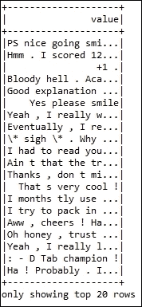

图 25:前 20 行文本

从前面的截图中，很明显我们使用的文本文件只不过是包含列名标签的非常非结构化的文本。因此，在我们将它们用于我们的目的之前，需要使用正则表达式标记器使用特征变换对它们进行预处理。

**步骤 4:使用正则表达式器的特征变压器**

以下是`RegexTokenizer`的代码:

```scala
RegexTokenizer regexTokenizer1 = new RegexTokenizer().setInputCol("value").setOutputCol("labelText").setPattern("\\t.*$"); 

```

如果您仔细查看前面的代码段，您会看到我们已经将输入列名指定为`value`，将输出列名指定为`labelText`以及模式。现在使用正则表达式标记器创建另一个数据帧，我们使用以下代码段对其进行标记:

```scala
Dataset<Row> labelTextDataFrame = regexTokenizer1.transform(df); 

```

现在，让我们使用以下语句来看看新的数据框`labelTextDataFrame`包含什么:

```scala
labelTextDataFrame.show(); 

```


图 26:一个新的列，其中的字符被转换成相应的小写字符

前面的截图(*图 26* )显示了标记器创建了一个新的列，并且大部分大写单词或字符已经被转换为相应的小写字符。由于主题建模关心每个输入单词的术语权重和频率，我们需要从标签文本中分离单词，这是通过使用以下代码段来完成的:

```scala
RegexTokenizer regexTokenizer2 = new RegexTokenizer().setInputCol("value").setOutputCol("text").setPattern("\\W"); 

```

现在，让我们创建另一个数据框，并使用以下代码查看转换的结果:

```scala
Dataset<Row> labelFeatureDataFrame = regexTokenizer2.transform(labelTextDataFrame); 
labelFeaturedDataFrame.show(); 

```

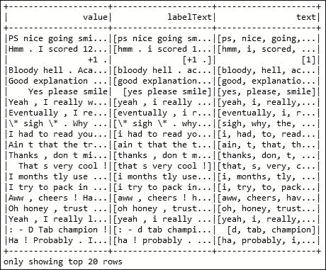

图 27:将文本标记为由逗号分隔的独立单词

从前面的截图(*图 27* )中，我们可以看到增加了一个新的列`label`，它将标签文本显示为单独的单词，用逗号分隔。

现在，由于我们有一堆文本可用，为了使预测和主题建模更容易，我们需要为我们拆分的单词建立索引。但是在此之前，我们需要在一个新的数据帧中交换`labelText`和`text`，如图*图 28* 所示。要检查是否真的发生了，只需打印新创建的数据框:

```scala
Dataset<Row> newDF = labelFeatureDataFrame 
        .withColumn("labelTextTemp",          labelFeatureDataFrame.col("labelText") 
          .cast(DataTypes.StringType))        .drop(labelFeatureDataFrame.col("labelText")).withColumnRenamed("labelTextTemp", "labelText"); 
newDF.show(); 

```

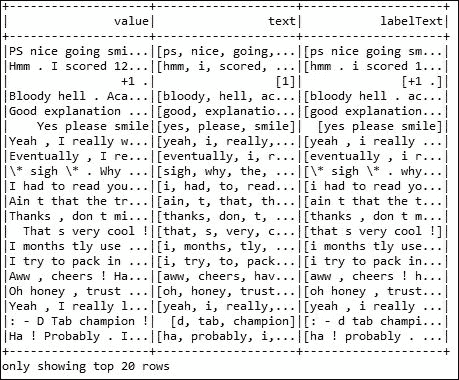

图 28:在新的数据框中交换标签文本和文本

**第五步:通过字符串索引器**进行特征转换

下面是特征变换的代码:

```scala
StringIndexer indexer = new StringIndexer().setInputCol("labelText").setOutputCol("label"); 

```

现在为我们在*步骤 2* 中创建的数据框`newDF`创建一个新的数据框，并查看数据框的内容。请注意，我们选择了旧列`labelText`，并将新列简单设置为`label`:

```scala
Dataset<Row> indexed = indexer.fit(newDF).transform(newDF); 
indexed.select(indexed.col("labelText"), indexed.col("label"), indexed.col("text")).show(); 
Indexed.show(); 

```

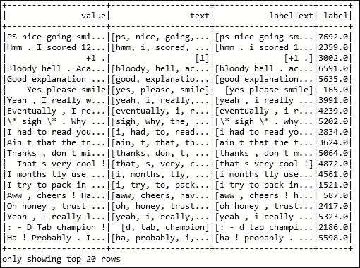

图 29:标签文本列对应的标签

所以，如图 29*所示*，我们得到了一个新的列`label`，它包含了与`labelText`列相对应的标签。下一步是删除停止词。

**第六步:特征变换(去掉停止词)**

下面是删除停止词的特征转换代码:

```scala
StopWordsRemover remover = new StopWordsRemover(); 
String[] stopwords = remover.getStopWords(); 
remover.setStopWords(stopwords).setInputCol("text").setOutputCol("filteredWords"); 

```

Spark 的`StopWordsRemover`类的当前实现包含以下单词作为停止单词。既然我们没有任何前提条件，我们就直接用了那些词:

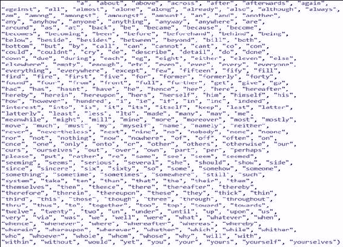

图 30:Spark 为文本分析提供的一堆停止词

**步骤 7:通过移除停止词**来创建过滤数据集

下面是通过删除停止词来创建过滤数据集的代码:

```scala
Dataset<Row> filteredDF = remover.transform(indexed); 
filteredDF.show(); 
filteredDF.select(filteredDF.col("label"), filteredDF.col("filteredWords")).show(); 

```

现在为过滤后的单词创建一个新的数据框(也就是说，不包括停止单词)。让我们看看过滤后的数据集的内容:

```scala
Dataset<Row> featurizedData = hashingTF.transform(filteredDF); 
featurizedData.show(); 

```

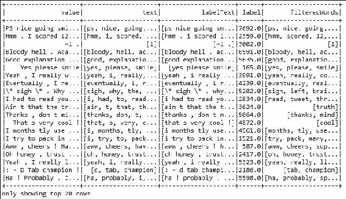

图 31:不包括停止词的过滤词

**第八步:使用哈希函数**进行特征提取

下面是使用哈希函数提取特征的代码:

```scala
int numFeatures = 5; 
HashingTF hashingTF = new HashingTF().setInputCol("filteredWords").setOutputCol("rawFeatures").setNumFeatures(numFeatures); 

```

在前面的代码中，为了简单起见，我们只针对五个特性进行了哈希函数。现在从旧数据帧(即`filteredDF`)上提取的特征创建另一个数据帧，并显示相同的输出:

```scala
Dataset<Row> featurizedData = hashingTF.transform(filteredDF); 
       featurizedData.show();   

```

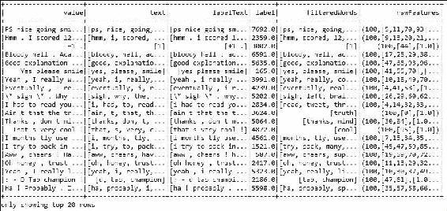

图 32:旧数据帧上提取特征的数据帧，过滤

### 类型

有关特征转换、估计器和散列的更多信息和应用编程接口文档细节，请参考位于[https://spark.apache.org/docs/latest/ml-features.html](https://spark.apache.org/docs/latest/ml-features.html)的 Spark 网站。

**步骤 9:使用 IDF 估计器进行特征提取**

```scala
IDF idf = new IDF().setInputCol("rawFeatures").setOutputCol("features"); 
IDFModel idfModel = idf.fit(featurizedData); 

```

前面的代码通过在步骤 5 中拟合采用特征数据帧(即`featurizedData`)的`idfModel`，从原始特征创建新特征。现在，让我们使用我们刚刚创建的估计器(即`idfModel`)为重新缩放的数据创建并显示一个新的数据帧，该估计器消耗特征化数据的旧数据帧(即`featurizedData`):

```scala
Dataset<Row> rescaledData = idfModel.transform(featurizedData); 
rescaledData.show(). 

```


图 33:使用估计器的重新标度数据

**步骤 10:卡方特征选择**

卡方特征选择选择用于预测分类标签的分类特征。下面的代码段完成了这一选择:

```scala
ChiSqSelector selector = new org.apache.spark.ml.feature.ChiSqSelector(); 
selector.setNumTopFeatures(5).setFeaturesCol("features").setLabelCol("label").setOutputCol("selectedFeatures"); 

```

现在为所选要素创建另一个数据框，如下所示:

```scala
Dataset<Row> result = selector.fit(rescaledData).transform(rescaledData); 
result.show(); 

```


图 34:卡方特征选择

您可以从前面的输出/截图中看到，我们的数据已经为训练 LDA 模型和进行主题建模做好了准备。

**步骤 11:创建并训练 LDA 模型**

通过指定 *K* (这是主题建模必须为> 1 的聚类数，其中默认值为 10)和最大迭代，使用训练数据集(即数据帧结果)创建和训练 LDA 模型:

```scala
long value = 5;     
LDA lda = new LDA().setK(10).setMaxIter(10).setSeed(value); 
LDAModel model = lda.fit(result); 

```

现在我们已经为我们的目的训练、安装并准备好了模型，让我们看看我们的输出。然而，在此之前，我们需要有一个数据框架来捕获与主题相关的度量。使用以下代码:

```scala
System.out.println(model.vocabSize()); 
Dataset<Row> topics = model.describeTopics(5); 
org.apache.spark.ml.linalg.Matrix metric = model.topicsMatrix(); 

```

现在让我们看看主题分布。查看之前的数据集:

```scala
System.out.println(metric); 
topics.show(false); 

```


图 35:对应的术语权重、主题名称和术语索引

如果您仔细查看前面的输出，我们已经找到了相应的术语权重、主题名称和术语索引。上述术语及其相应的权重将在[第 9 章](09.html#25JP22-0b803698e2de424b8aa3c56ad52b005d "Chapter 9.  Advanced Machine Learning with Streaming and Graph Data")、*高级机器学习和图数据*中使用，用于使用 GraphX 和 Scala 查找连接的组件。

但是，我们也需要有实际的条款。我们将在[第 9 章](09.html#25JP22-0b803698e2de424b8aa3c56ad52b005d "Chapter 9.  Advanced Machine Learning with Streaming and Graph Data")、*利用流和图数据的高级机器学习*中展示检索术语的详细技术，这在很大程度上取决于需要使用术语包概念中的术语开发或生成的术语词汇。

## 可扩展性

前面的例子展示了如何使用 LDA 算法作为独立的应用来执行主题建模。然而，根据 Joseph B .在[https://Databricks . com/blog/2015/03/25/topic-modeling-with-lda-mllib-meets-graphx . html](https://databricks.com/blog/2015/03/25/topic-modeling-with-lda-mllib-meets-graphx.html)的一篇 Databricks 博客，LDA 的并行化并不简单，已经有很多研究论文提出了不同的策略。这方面的主要障碍是所有方法都需要大量的沟通。根据 Databricks 网站上的博客，以下是实验期间使用的数据集和相关训练及测试集的统计数据:

*   训练集大小:460 万个文档
*   词汇量:110 万个词汇
*   训练集大小:11 亿代币(~239 字/文档)
*   100 个主题
*   16 人 EC2 集群，例如，M4。大型或 M3。中型，取决于预算和要求
*   计时结果:10 次迭代平均 176 秒/次

# 带 Spark 的信用风险分析管道

在本节中，我们将开发一个通常用于银行和信用合作社等金融机构的信用风险管道。首先，我们将讨论什么是信用风险分析，以及在使用基于随机森林的分类器开发基于 Spark ML 的管道之前为什么它很重要。最后，我们将提供一些性能改进建议。

## 什么是信用风险分析？为什么重要？

当申请人申请贷款，银行收到申请时，银行必须根据申请人的个人资料决定是否批准贷款申请。

在这方面，有两种类型的风险与银行对贷款申请的决定有关:

*   **申请人信用风险好**:说明客户或申请人更有可能还贷。然后，如果贷款不被批准，银行可能会遭受业务损失。
*   **申请人为不良信用风险**:即客户或申请人最有可能不还款。在这种情况下，批准客户贷款将导致银行的财务损失。

我们的常识是，第二个风险是更大的风险，因为银行不偿还借款金额的可能性更高。

因此，大多数银行或信用合作社评估与向客户、申请人或客户贷款相关的风险。在商业分析中，最小化风险往往会使银行本身的利润最大化。换句话说，从财务角度来看，利润最大化和损失最小化很重要。

通常，银行会根据申请人的不同因素和参数决定是否批准贷款申请。例如，关于他们的贷款申请的人口和社会经济条件。

## 利用 Spark ML 开发信用风险分析管道

在本节中，我们将首先详细讨论信用风险数据集，以便获得一些见解。之后，我们再看如何发展大规模的信用风险管道。最后，我们将为提高预测精度提供一些性能改进建议。

### 数据集探索

德国学分数据集是从 UCI 机器学习资源库[下载的。虽然在链接中有数据集的详细描述，但我们在*表 3* 中提供了一些简要的见解。该数据包含 21 个变量的信用相关数据，以及对 1000 名贷款申请人来说，一名申请人被认为是好的还是坏的信用风险的分类。*表 3* 显示了在线提供数据集之前考虑的每个变量的详细信息:](https://archive.ics.uci.edu/ml/machine-learning-databases/statlog/german/)

<colgroup class="calibre11"><col class="calibre12"> <col class="calibre12"> <col class="calibre12"></colgroup> 
| **条目** | **变量** | **解释** |
| one | `creditability` | 有偿还能力的 |
| Two | `balance` | 经常项目差额 |
| three | `duration` | 申请贷款的期限 |
| four | `history` | 是否有不良贷款历史？ |
| five | `purpose` | 贷款用途 |
| six | `amount` | 申请金额 |
| seven | `savings` | 每月储蓄 |
| eight | `employment` | 就业率 |
| nine | `instPercent` | 利息百分比 |
| Ten | `sexMarried` | 性别和婚姻状况 |
| Eleven | `guarantors` | 有担保人吗？ |
| Twelve | `residenceDuration` | 在当前地址居住的时间 |
| Thirteen | `assets` | 净资产 |
| Fourteen | `age` | 申请人年龄 |
| Fifteen | `concCredit` | 并行信贷 |
| Sixteen | `apartment` | 居住状况 |
| Seventeen | `credits` | 当前信用 |
| Eighteen | `occupation` | 职业 |
| Nineteen | `dependents` | 受抚养人人数 |
| Twenty | `hasPhone` | 如果申请人使用电话 |
| Twenty-one | `foreign` | 如果申请人是外国人 |

表 3:德国信贷数据集属性

注意，虽然*表 3* 描述了数据集中的变量，但是没有关联的表头。在*表 3* 中，我们已经显示了变量、位置和每个变量的相关意义。

## 带有 Spark ML 的信用风险管道

将涉及几个步骤，从数据加载、解析、数据准备、训练测试集准备、模型训练、模型评估和结果解释。让我们一步一步来。

**步骤 1:加载所需的 API 和库**

以下是加载所需的应用编程接口和库的代码:

```scala
import org.apache.spark.api.java.JavaRDD; 
import org.apache.spark.api.java.function.Function; 
import org.apache.spark.ml.classification.RandomForestClassificationModel; 
import org.apache.spark.ml.classification.RandomForestClassifier; 
import org.apache.spark.ml.evaluation.BinaryClassificationEvaluator; 
import org.apache.spark.ml.feature.StringIndexer; 
import org.apache.spark.ml.feature.VectorAssembler; 
import org.apache.spark.mllib.evaluation.RegressionMetrics; 
import org.apache.spark.sql.Dataset; 
import org.apache.spark.sql.Row; 
import org.apache.spark.sql.SparkSession; 

```

**步骤 2:创建 Spark 会话**

以下是创建 Spark 会话的另一个代码:

```scala
  static SparkSession spark = SparkSession.builder() 
      .appName("CreditRiskAnalysis") 
      .master("local[*]") 
      .config("spark.sql.warehouse.dir", "E:/Exp/") 
      .getOrCreate();  

```

**第三步:加载并解析信用风险数据集**

请注意，数据集采用**逗号分隔值** ( **CSV** 格式。现在使用 Databricks 提供的 CSV 读取器加载和解析数据集，并准备一个行数据集，如下所示:

```scala
String csvFile = "input/german_credit.data"; 
Dataset<Row> df = spark.read().format("com.databricks.spark.csv").option("header", "false").load(csvFile); 

```

现在，显示数据集以了解确切的结构，如下所示:

```scala
df.show(); 

```

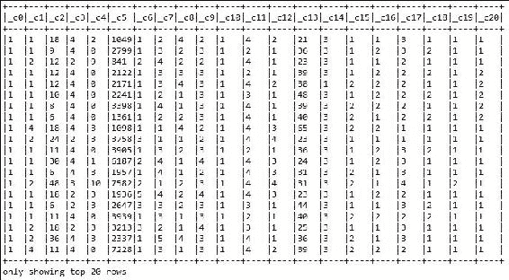

图 36:信用风险数据集的快照

**第 4 步:创建信用类型的 RDD**

创建类型化类`Credit`的 RDD，如下所示:

```scala
JavaRDD<Credit> creditRDD = df.toJavaRDD().map(new Function<Row, Credit>() { 
      @Override 
      public Credit call(Row r) throws Exception { 
        return new Credit(parseDouble(r.getString(0)), parseDouble(r.getString(1)) - 1, 
            parseDouble(r.getString(2)), parseDouble(r.getString(3)), parseDouble(r.getString(4)), 
            parseDouble(r.getString(5)), parseDouble(r.getString(6)) - 1, parseDouble(r.getString(7)) - 1, 
            parseDouble(r.getString(8)), parseDouble(r.getString(9)) - 1, parseDouble(r.getString(10)) - 1, 
            parseDouble(r.getString(11)) - 1, parseDouble(r.getString(12)) - 1, 
            parseDouble(r.getString(13)), parseDouble(r.getString(14)) - 1, 
            parseDouble(r.getString(15)) - 1, parseDouble(r.getString(16)) - 1, 
            parseDouble(r.getString(17)) - 1, parseDouble(r.getString(18)) - 1, 
            parseDouble(r.getString(19)) - 1, parseDouble(r.getString(20)) - 1); 
      } 
    }); 

```

前面的代码段在使用`parseDouble()`方法将变量作为双精度值后创建了一个类型为`Credit`的 RDD，该方法采用一个字符串并以`Double`格式返回相应的值。`parseDouble()`方法如下:

```scala
  public static double parseDouble(String str) { 
    return Double.parseDouble(str); 
  } 

```

现在我们需要知道`Credit`类的结构，这样结构本身就有助于使用类型化类创建 RDDs。

嗯，`Credit`类基本上是一个单例类，它通过构造函数初始化数据集的 21 个变量的所有 setter 和 getter 方法。这是课堂:

```scala
public class Credit { 
  private double creditability; 
  private double balance; 
  private double duration; 
  private double history; 
  private double purpose; 
  private double amount; 
  private double savings; 
  private double employment; 
  private double instPercent; 
  private double sexMarried; 
  private double guarantors; 
  private double residenceDuration; 
  private double assets; 
  private double age; 
  private double concCredit; 
  private double apartment; 
  private double credits; 
  private double occupation; 
  private double dependents; 
  private double hasPhone; 
  private double foreign; 

  public Credit(double creditability, double balance, double duration, 
  double history, double purpose, double amount, 
      double savings, double employment, double instPercent, 
      double sexMarried, double guarantors, 
      double residenceDuration, double assets, double age, 
      double concCredit, double apartment, double credits, 
      double occupation, double dependents, double hasPhone, double foreign) { 
    super(); 
    this.creditability = creditability; 
    this.balance = balance; 
    this.duration = duration; 
    this.history = history; 
    this.purpose = purpose; 
    this.amount = amount; 
    this.savings = savings; 
    this.employment = employment; 
    this.instPercent = instPercent; 
    this.sexMarried = sexMarried; 
    this.guarantors = guarantors; 
    this.residenceDuration = residenceDuration; 
    this.assets = assets; 
    this.age = age; 
    this.concCredit = concCredit; 
    this.apartment = apartment; 
    this.credits = credits; 
    this.occupation = occupation; 
    this.dependents = dependents; 
    this.hasPhone = hasPhone; 
    this.foreign = foreign; 
  } 

  public double getCreditability() { 
    return creditability; 
  } 

  public void setCreditability(double creditability) { 
    this.creditability = creditability; 
  } 

  public double getBalance() { 
    return balance; 
  } 

  public void setBalance(double balance) { 
    this.balance = balance; 
  } 

  public double getDuration() { 
    return duration; 
  } 

  public void setDuration(double duration) { 
    this.duration = duration; 
  } 

  public double getHistory() { 
    return history; 
  } 

  public void setHistory(double history) { 
    this.history = history; 
  } 

  public double getPurpose() { 
    return purpose; 
  } 

  public void setPurpose(double purpose) { 
    this.purpose = purpose; 
  } 

  public double getAmount() { 
    return amount; 
  } 

  public void setAmount(double amount) { 
    this.amount = amount; 
  } 

  public double getSavings() { 
    return savings; 
  } 

  public void setSavings(double savings) { 
    this.savings = savings; 
  } 

  public double getEmployment() { 
    return employment; 
  } 

  public void setEmployment(double employment) { 
    this.employment = employment; 
  } 

  public double getInstPercent() { 
    return instPercent; 
  } 

  public void setInstPercent(double instPercent) { 
    this.instPercent = instPercent; 
  } 

  public double getSexMarried() { 
    return sexMarried; 
  } 

  public void setSexMarried(double sexMarried) { 
    this.sexMarried = sexMarried; 
  } 

  public double getGuarantors() { 
    return guarantors; 
  } 

  public void setGuarantors(double guarantors) { 
    this.guarantors = guarantors; 
  } 

  public double getResidenceDuration() { 
    return residenceDuration; 
  } 

  public void setResidenceDuration(double residenceDuration) { 
    this.residenceDuration = residenceDuration; 
  } 

  public double getAssets() { 
    return assets; 
  } 

  public void setAssets(double assets) { 
    this.assets = assets; 
  } 

  public double getAge() { 
    return age; 
  } 

  public void setAge(double age) { 
    this.age = age; 
  } 

  public double getConcCredit() { 
    return concCredit; 
  } 

  public void setConcCredit(double concCredit) { 
    this.concCredit = concCredit; 
  } 

  public double getApartment() { 
    return apartment; 
  } 

  public void setApartment(double apartment) { 
    this.apartment = apartment; 
  } 

  public double getCredits() { 
    return credits; 
  } 

  public void setCredits(double credits) { 
    this.credits = credits; 
  } 

  public double getOccupation() { 
    return occupation; 
  } 

  public void setOccupation(double occupation) { 
    this.occupation = occupation; 
  } 

  public double getDependents() { 
    return dependents; 
  } 

  public void setDependents(double dependents) { 
    this.dependents = dependents; 
  } 

  public double getHasPhone() { 
    return hasPhone; 
  } 

  public void setHasPhone(double hasPhone) { 
    this.hasPhone = hasPhone; 
  } 

  public double getForeign() { 
    return foreign; 
  } 

  public void setForeign(double foreign) { 
    this.foreign = foreign; 
  } 
} 

```

如果您查看类的流程，首先它为数据集中的 21 个要素声明了 21 个变量。然后它使用构造函数初始化它们。其余的是简单的 setter 和 getter 方法。

**步骤 5:从信用类型**的 RDD 创建行类型的数据集

下面的代码显示了如何创建行类型的数据集:

```scala
Dataset<Row> creditData = spark.sqlContext().createDataFrame(creditRDD, Credit.class); 

```

现在将数据集保存为临时视图，或者更正式地说，保存为内存中的表，以供查询，如下所示:

```scala
creditData.createOrReplaceTempView("credit"); 

```

现在让我们了解一下表的模式，如下所示:

```scala
creditData.printSchema(); 

```


图 37:数据集的模式

**步骤 6:使用矢量汇编器**创建特征矢量

使用 Spark 的`VectorAssembler`类为 21 个变量创建新的特征向量，如下所示:

```scala
VectorAssembler assembler = new VectorAssembler() 
        .setInputCols(new String[] { "balance", "duration", "history", "purpose", "amount", "savings", 
            "employment", "instPercent", "sexMarried", "guarantors", "residenceDuration", "assets", "age", 
            "concCredit", "apartment", "credits", "occupation", "dependents", "hasPhone", "foreign" }) 
        .setOutputCol("features"); 

```

**步骤 7:通过组合和转换汇编器**来创建数据集

通过使用先前创建的`creditData`数据集转换汇编程序来创建数据集，并打印数据集的前 20 行，如下所示:

```scala
Dataset<Row> assembledFeatures = assembler.transform(creditData); 
assembledFeatures.show(); 

```


图 38:新创建的特色信贷数据集

**第 8 步:创建进行预测的标签**

从前面数据集的可信度列中创建一个标签列(*图 38* ，如下所示:

```scala
StringIndexer creditabilityIndexer = new StringIndexer().setInputCol("creditability").setOutputCol("label"); 
Dataset<Row> creditabilityIndexed = creditabilityIndexer.fit(assembledFeatures).transform(assembledFeatures); 

```

现在让我们使用`show()`方法探索新数据集，如下所示:

```scala
creditabilityIndexed.show(); 

```

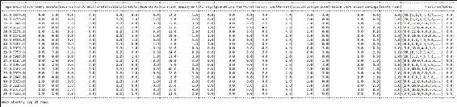

图 39:带有新标签列的数据集

从上图中，我们可以理解只有两个标签与数据集相关联，分别是 1.0 和 0.0。这表明这个问题是一个二元分类问题。

**第九步:准备训练和测试集**

按照以下步骤准备培训和测试集:

```scala
long splitSeed = 12345L; 
Dataset<Row>[] splits = creditabilityIndexed.randomSplit(new double[] { 0.7, 0.3 }, splitSeed); 
Dataset<Row> trainingData = splits[0]; 
Dataset<Row> testData = splits[1]; 

```

这里，训练集和测试集的比率分别为 70%和 30%，长种子值不允许在每次迭代中生成随机结果。

**第十步:训练随机森林模型**

要训练随机森林模型，请使用以下代码:

```scala
RandomForestClassifier classifier = new RandomForestClassifier() 
        .setImpurity("gini") 
        .setMaxDepth(3) 
        .setNumTrees(20) 
        .setFeatureSubsetStrategy("auto") 
        .setSeed(splitSeed); 

```

如前所述，这个问题是一个二元分类问题。因此，我们将使用二元评估器对`label`列进行评估，如下所示:

```scala
RandomForestClassificationModel model = classifier.fit(trainingData); 
BinaryClassificationEvaluator evaluator = new BinaryClassificationEvaluator().setLabelCol("label"); 

```

现在我们需要在测试集上收集模型性能度量，如下所示:

```scala
Dataset<Row> predictions = model.transform(testData); 
model.toDebugString(); 

```

**第 11 步:打印性能参数**

我们将观察二元评价器的几个性能参数，例如拟合模型后的精度、**均方误差** ( **MSE** )、**均方绝对误差** ( **MAE** )、**均方根误差** ( **RMSE** )、R 平方和解释变量等等。让我们按如下方式操作:

```scala
double accuracy = evaluator.evaluate(predictions); 
System.out.println("Accuracy after pipeline fitting: " + accuracy); 
RegressionMetrics rm = new RegressionMetrics(predictions); 
System.out.println("MSE: " + rm.meanSquaredError()); 
System.out.println("MAE: " + rm.meanAbsoluteError()); 
System.out.println("RMSE Squared: " + rm.rootMeanSquaredError()); 
System.out.println("R Squared: " + rm.r2()); 
System.out.println("Explained Variance: " + rm.explainedVariance() + "\n"); 

```

前面的代码段生成以下输出:

```scala
Accuracy after pipeline fitting: 0.7622000403307129 
MSE: 1.926235109206349E7 
MAE: 3338.3492063492063 
RMSE Squared: 4388.8895055655585 
R Squared: -1.372326447615067 
Explained Variance: 1.1144695981899707E7 

```

### 性能调整和建议

如果看第 11 步的业绩指标，很明显信用风险预测不尽如人意，尤其是准确性方面，只有 76.22%。这意味着，对于给定的测试数据，我们的模型可以以 76.22%的精度预测是否存在信用风险。由于我们需要对这种敏感的金融部门更加小心，因此，无疑需要更加准确。

现在，如果您想提高预测性能，您应该尝试使用基于随机森林的分类器之外的模型来训练您的模型。例如，逻辑回归或基于朴素贝叶斯的分类器。

此外，您可以使用基于 SVM 的分类器或基于神经网络的多层感知器分类器。在[第 7 章](07.html#1O8H62-0b803698e2de424b8aa3c56ad52b005d "Chapter 7. Tuning Machine Learning Models")*调整机器学习模型*中，我们将了解如何调整超参数以选择最佳模型。

# 缩放 ML 管道

数据挖掘和机器学习算法对并行和分布式计算平台提出了突出的挑战。此外，机器学习算法的并行化是高度特定于任务的，并且通常依赖于前面的问题。在[第 1 章](01.html#DB7S2-0b803698e2de424b8aa3c56ad52b005d "Chapter 1. Introduction to Data Analytics with Spark")、*带 Spark* 的数据分析简介中，我们讨论并展示了如何在集群或云计算基础设施(即亚马逊 AWS/EC2)之上部署相同的机器学习应用。

按照这种方法，我们可以处理大批量或实时的数据集。除此之外，扩大机器学习应用还会带来另一种权衡，例如成本、复杂性、运行时间和技术要求。此外，为大规模机器学习做出适合任务的算法和平台选择需要了解可用选项的好处、权衡和限制。

为了处理这些问题，在本节中，我们将提供一些处理大数据集以部署大规模机器学习应用的理论方面。然而，在进一步讨论之前，我们需要知道一些问题的答案。例如:

*   我们如何收集大数据集来满足我们的需求？
*   大数据集有多大，我们如何处理它们？
*   有多少训练数据足以在大数据集上扩展 ML 应用？
*   如果我们没有足够的训练数据，还有什么替代方法？
*   应该使用什么样的机器学习算法来满足我们的需求？
*   平行学习应该选择什么平台？

在这里，我们讨论了部署和扩展机器学习应用的一些重要方面，该应用处理前面的大数据挑战，包括大小、数据偏斜度、成本和基础架构。

## 大小很重要

大数据是指在数量、种类、准确性、速度和价值方面都太大，传统的内存计算机系统无法处理的数据。通过处理大数据来扩展机器学习应用涉及分类、聚类、回归、特征选择、增强决策树和支持向量机等任务。我们如何处理 10 亿或 1 万亿个数据实例？此外，50 亿部手机、推特等社交网络以前所未有的方式产生大数据集。另一方面，众包是现实，就是一周内标注 10 万+个数据实例。

就稀疏性而言，从内容的角度来看，大数据集不能太稀疏，但要密集。从机器学习的角度来看，为了证明这种说法，让我们考虑一个数据标注的例子。例如，1M 数据实例不能属于 1M 类，这仅仅是因为拥有 1M 类是不切实际的，但是不止一次的数据实例属于一个特定的类。因此，基于如此大规模数据集的稀疏性和规模，进行预测分析是另一个挑战，需要在扩大规模的同时加以考虑和处理。

## 尺寸与偏斜度的考虑

机器学习还依赖于标记数据的可用性，其可信度基于学习任务，如有监督、无监督或半监督。您可能有一个结构化的数据集，但具有极大的偏斜度。更具体地说，假设你有 1K 个已标记和 1M 个未标记的数据点，那么标记和未标记的比率为 0.1%。

因此，你认为只有 1K 个标签点就足以训练一个监督模型吗？作为另一个例子，例如，假设您有 1M 标记和 1B 未标记的数据点，其中标记和未标记的比率也是 0.1%。同样的问题也出现了，那就是仅仅有 1M 的标签来训练一个监督模型就足够了吗？

现在的问题是，使用现有标签作为唯一的指导，而不是半监督聚类、分类或回归的指导，可以做什么或采取什么方法。或者，标记更多的数据，或者手动标记，或者在人群的帮助下标记。例如，假设有人想要对疾病进行聚类或分类分析。更具体地说，假设我们想对推文进行分类，如果特定的推文表明存在埃博拉或流感相关疾病。在这种情况下，我们应该使用半监督的方法来标记推文。

但是，在这种情况下，数据集可能非常倾斜，或者标注可能有偏差。通常，训练数据来自不同的用户，其中明确的用户反馈可能经常会产生误导。

因此，从内隐反馈中学习是一个更好的想法；例如，通过点击网络搜索结果来收集数据。在这些类型的大规模数据集中，训练数据的偏斜度难以检测，如[第 4 章](04.html#147LC2-5afe140a04e845e0842b44be7971e11a "Chapter 4. Extracting Knowledge through Feature Engineering")、*通过特征工程提取知识*所述。因此，要警惕大数据集的这种偏斜。

## 成本和基础设施

为了扩大机器学习应用的规模，您将需要更好的基础架构和计算能力来处理如此大的数据集。最初，您可能希望利用本地集群。但是，有时，如果数据集呈指数级增长，集群可能不足以扩展您的 ML 应用。

正如在关于在强大的基础设施(如亚马逊 AWS 云计算，如 EC2)上部署 ML 管道的一章中所讨论的那样，即使您将自己的 ML 应用用作软件即服务，您也必须采用现收现付的方式来享受云即平台即服务和基础设施即服务。

# 提示和性能考虑

Spark 还支持超参数调整的交叉验证，这将在下一章中广泛讨论。Spark 认为交叉验证是一种元算法，它用用户指定的参数组合来拟合基础估计量，交叉评估拟合的模型并输出最佳模型。

然而，对底层估计器没有具体要求，它可以是流水线，只要它可以与从预测中输出标量度量(如精度和召回率)的评估器配对。

我们再回忆一下 OCR 预测，我们发现准确率是 75%，这显然是不尽如人意的，再一次。现在为了进一步调查原因，让我们打印标签 8.0 或“我”的混淆矩阵。如果查看*图 40* 中的以下矩阵，会发现正确预测的实例数量很少:

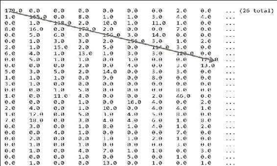

图 40:标签 8.0 或“我”的混淆矩阵

现在让我们尝试使用随机森林模型来做预测。但是在进入模型训练步骤之前，让我们对随机森林分类器所需的参数进行一些初始化，该分类器也支持多类分类，例如带有 LBFGS 的逻辑回归模型:

```scala
Integer numClasses = 26; 
HashMap<Integer, Integer>categoricalFeaturesInfo = new HashMap<Integer, Integer>(); 
Integer numTrees = 5; // Use more in practice. 
String featureSubsetStrategy = "auto"; // Let the algorithm choose. 
String impurity = "gini"; 
Integer maxDepth = 20; 
Integer maxBins = 40; 
Integer seed = 12345; 

```

现在通过指定前面的参数来训练模型，如下所示:

```scala
final RandomForestModelmodel = RandomForest.trainClassifier(training, numClasses, categoricalFeaturesInfo, numTrees, featureSubsetStrategy, impurity, maxDepth, maxBins, seed); 

```

现在让我们看看它的表现。我们将重复使用步骤 9 中使用的相同代码段。参考以下截图:


图 41:精确度和召回率的性能指标


图 42:标签 8.0 或“我”的改进混淆矩阵

如果看*图 42* ，我们在打印的所有参数方面都有了显著的提升，精度从 75.30%提升到了 89.20%。这背后的原因是随机森林模型对预测精度和混淆矩阵的全局最大值计算的改进解释，如图 38 所示。您会发现由对角箭头标记的预测实例的数量有了显著的改进。

通过一个反复试验的过程，你可以确定一个显示有希望的算法的简短列表，但是你怎么知道哪个是最好的呢？此外，如前所述，很难为数据集找到性能良好的机器学习算法。因此，如果你仍然对 89.20%的准确率不满意，我建议你调整参数值，看看精度和召回率。

# 总结

在本章中，我们展示了几个机器学习应用，并试图区分 Spark MLlib 和 Spark ML。我们还表明，仅使用 Spark ML 或 Spark MLlib 开发一个完整的机器学习应用确实很困难。

然而，我们认为这两个 API 之间的组合方法或互操作性最适合这些目的。此外，我们还学习了如何通过使用 Spark ML 库来构建 ML 管道，以及如何通过考虑一些性能因素来扩展基本模型。

调整算法或机器学习应用可以简单地认为是一个过程，通过这个过程，人们可以优化影响模型的参数，以使算法能够以最佳状态运行(在运行时和内存使用方面)。

在[第 7 章](07.html#1O8H62-0b803698e2de424b8aa3c56ad52b005d "Chapter 7. Tuning Machine Learning Models")*调优机器学习模型*中，我们将讨论更多关于调优机器学习模型的内容。我们将尝试重用本章和[第 5 章](05.html#190862-0b803698e2de424b8aa3c56ad52b005d "Chapter 5.  Supervised and Unsupervised Learning by Examples")、*示例监督和非监督学习*中的一些应用，通过调整几个参数来调整性能。