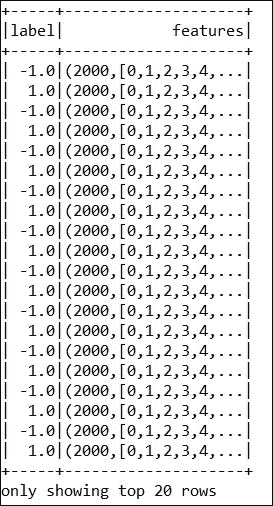
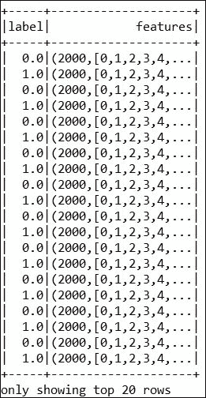
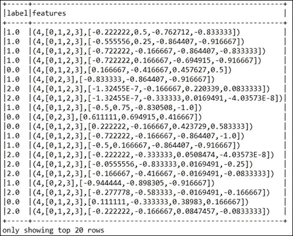

# 第八章。调整您的机器学习模型

本章涵盖先进的**机器学习** ( **ML** )技术，以便能够使算法适应新数据。读者还将看到机器学习算法如何对数据进行增量学习，也就是说，每次看到新的训练实例时，模型都会更新。还将讨论在动态环境中通过让步不同的约束进行学习。总之，本章将涵盖以下主题:

*   调整机器学习模型
*   最大似然模型的推广
*   通过增量算法进行调整
*   通过重用最大似然模型进行调整
*   动态环境中的机器学习

# 适应机器学习模型

正如我们前面讨论的，作为 ML 训练过程的一部分，模型是使用一组数据(即训练、测试和验证集)来训练的。能够适应其环境并从其经验中学习的机器学习模型吸引了来自不同领域的消费者和研究人员，包括计算机科学、工程、数学、物理、神经科学和认知科学。在本节中，我们将提供一个技术概述，介绍如何为新的数据和需求采用机器学习模型。

## 技术概述

从技术上来说，如果需要改进，同样的模型可能需要在稍后阶段重新培训。这实际上取决于几个因素，例如，当新数据变得可用时，或者当应用编程接口的使用者有自己的数据来训练模型时，或者当数据需要被过滤并且模型用数据子集训练时。在这些场景中，ML 算法应该提供足够的 API，以提供一种方便的方式，允许其消费者生成一个可以一次性或定期使用的客户端，以便他们可以使用自己的数据重新训练模型。

因此，客户将能够评估再培训的结果，并相应地更新网络服务应用编程接口。或者，他们将能够使用新训练的模型。在这方面，有几个领域适应的背景。但是，它们在考虑应用类型和要求的信息方面有所不同:

*   **无监督领域自适应**:学习样本包含一组已标记的源示例、一组未标记的源示例和一组未标记的目标示例
*   **半监督域自适应**:在这种情况下，我们还考虑了一小组标注的目标示例
*   **监督域自适应**:所有考虑的例子都应该标注:


图 1:再培训流程概述(虚线表示再培训步骤)

从技术上讲，应该有三种选择来使 ML 模型具有适应性:

*   最广泛使用的机器学习技术和算法包括决策树、决策规则、神经网络、统计分类器和概率图形模型，它们都需要开发，以便能够适应新的需求
*   其次，前面提到的算法或技术应该被一般化，以便它们能够以最小的努力被使用
*   此外，为了理解计算学习理论，需要开发更健壮的理论框架和算法，例如贝叶斯学习理论、经典统计理论、最小描述长度理论和统计力学方法

这三种自适应特性和技术的好处将提供对实验结果的洞察，这也将指导机器学习社区为不同的学习算法做出贡献。

# ML 模型的泛化

在[第 5 章](05.html#190862-0b803698e2de424b8aa3c56ad52b005d "Chapter 5.  Supervised and Unsupervised Learning by Examples")、*有监督和无监督学习举例*中，我们讨论了如何以及为什么要推广学习算法以适应半监督学习、主动学习、结构化预测和强化学习。在本节中，我们将讨论如何在**光学字符识别** ( **光学字符识别**)数据集上推广线性回归算法，以展示线性回归模型的推广示例。

## 广义线性回归

如[第 5 章](05.html#190862-0b803698e2de424b8aa3c56ad52b005d "Chapter 5.  Supervised and Unsupervised Learning by Examples")、*示例监督和非监督学习*中所述，线性回归和逻辑回归技术假设输出遵循高斯分布。另一方面，广义线性模型 ( **GLMs** )是线性模型的规范，其中响应变量，即 Yi，遵循来自指数分布族的线性分布。

Spark 的`GeneralizedLinearRegression`应用编程接口允许我们对 GLMs 进行灵活的规范。Spark 中广义线性回归的当前实现可用于多种类型的预测问题，例如线性回归、泊松回归、逻辑回归等。

然而，限制在于，在基于Spark的 GLM 算法的当前实现中，仅支持指数族分布的子集。此外，还有另一个可扩展性问题，即通过其`GeneralizedLinearRegression` API 仅支持 4096 个特性。因此，如果特征数超过 4096，算法将抛出异常。

幸运的是，可以使用线性回归和逻辑回归估计器来训练具有更多特征的模型，如[第 6 章](06.html#1ENBI2-0b803698e2de424b8aa3c56ad52b005d "Chapter 6.  Building Scalable Machine Learning Pipelines")、*构建可扩展机器学习管道*中的几个例子所示。

## 带 Spark 的广义线性回归

在本小节中，我们将讨论一个分步示例，该示例展示了如何将广义线性回归应用于我们在[第 7 章](07.html#1O8H62-0b803698e2de424b8aa3c56ad52b005d "Chapter 7. Tuning Machine Learning Models")、*调整机器学习模型*中讨论的**光学字符识别** ( **OCR** )数据的`libsvm`版本。由于相同的数据集将在这里重复使用，我们决定不再进一步描述它们。

**第一步:加载必要的 API 和包**

下面是加载 essay api 和包的代码:

```scala
import java.util.Arrays; 
import org.apache.spark.ml.regression.GeneralizedLinearRegression; 
import org.apache.spark.ml.regression.GeneralizedLinearRegressionModel; 
import org.apache.spark.ml.regression.GeneralizedLinearRegressionTrainingSummary; 
import org.apache.spark.sql.Dataset; 
import org.apache.spark.sql.Row; 
import org.apache.spark.sql.SparkSession; 

```

**步骤 2:创建Spark会话**

以下代码显示了如何创建Spark会话:

```scala
SparkSession spark = SparkSession 
    .builder() 
    .appName("JavaGeneralizedLinearRegressionExample") 
    .master("local[*]") 
    .config("spark.sql.warehouse.dir", "E:/Exp/") 
    .getOrCreate();  

```

**步骤 3:加载并创建数据集**

从光学字符识别数据集中加载并创建数据集。这里我们将数据集格式指定为`libsvm`:

```scala
Dataset<Row>dataset = spark.read().format("libsvm").load("input/Letterdata_libsvm.data"); 

```

**第四步:准备训练和测试集**

以下代码说明了如何准备培训和测试集:

```scala
double[] weights = {0.8, 0.2}; 
long seed = 12345L; 
Dataset<Row>[] split = dataset.randomSplit(weights, seed); 
Dataset<Row> training = split[0]; 
Dataset<Row> test = split[1]; 

```

**步骤 5:创建广义线性回归估计量**

通过指定族、链接、最大迭代和回归参数来创建广义线性回归估计量。这里我们选择了家庭为`"gaussian"`，链接为`"identity"`:

```scala
GeneralizedLinearRegression glr = new GeneralizedLinearRegression() 
.setFamily("gaussian") 
.setLink("identity") 
.setMaxIter(10) 
.setRegParam(0.3); 

```

注意，根据[http://spark . Apache . org/docs/latest/ml-分类-回归. html #广义-线性-回归](http://spark.apache.org/docs/latest/ml-classification-regression.html#generalized-linear-regression)的 API 文档，使用 Spark 实现该算法支持以下选项:


图 2:当前通用线性回归实现的可用支持系列

**第六步:拟合模型**

下面是适合该模型的代码:

```scala
GeneralizedLinearRegressionModel model = glr.fit(training); 

```

**第七步:检查系数并截取**

打印我们在步骤 6 中创建的线性回归模型的系数和截距:

```scala
System.out.println("Coefficients: " + model.coefficients()); 
System.out.println("Intercept: " + model.intercept()); 

```

这两个参数的输出将类似于以下内容:

```scala
Coefficients: [-0.0022864381796305487,-0.002728958263362158,0.001582003618682323,-0.0027708788253722914,0.0021962329827476565,-0.014769839282003813,0.027752802299957722,0.005757124632688538,0.013869444611365267,-0.010555326094498824,-0.006062727351948948,-0.01618167221020619,0.02894330366681715,-0.006180003317929849,-0.0025768386348180294,0.015161831324693125,0.8125261496082304] 
Intercept: 1.2140016821111255  

```

需要注意的是`System.out.println`方法在集群模式下不会工作。这只能在独立或伪模式下工作。只是为了验证结果。

**第八步:总结模型**

根据训练集总结模型，并打印出一些指标:

```scala
GeneralizedLinearRegressionTrainingSummary summary = model.summary(); 

```

**第九步:验证一些通用指标**

让我们打印一些通用指标，如**系数标准误差** ( **CSE** )、T 值、P 值、离差、零偏差、剩余自由度零、AIC 和偏差残差。由于页面限制，我们没有显示这些值在计算过程中的重要性:

```scala
System.out.println("Coefficient Standard Errors: " 
      + Arrays.toString(summary.coefficientStandardErrors())); 
System.out.println("T Values: " + Arrays.toString(summary.tValues())); 
System.out.println("P Values: " + Arrays.toString(summary.pValues())); 
System.out.println("Dispersion: " + summary.dispersion()); 
System.out.println("Null Deviance: " + summary.nullDeviance()); 
System.out.println("Residual Degree Of Freedom Null: " + summary.residualDegreeOfFreedomNull()); 
System.out.println("Deviance: " + summary.deviance()); 
System.out.println("Residual Degree Of Freedom: " + summary.residualDegreeOfFreedom()); 
    System.out.println("AIC: " + summary.aic()); 

```

让我们看看之前创建的训练集的值:

```scala
Coefficient Standard Errors:[2.877963555951775E-4, 0.0016618949921257992, 9.147115254397696E-4, 0.001633197607413805, 0.0013194682048354774, 0.001427648472211677, 0.0010797461071614422, 0.001092731825368789, 7.922778963434026E-4, 9.413717346009722E-4, 8.746375698587989E-4, 9.768068714323967E-4, 0.0010276211138097238, 0.0011457739746946476, 0.0015025626835648176, 9.048329671989396E-4, 0.0013145697411570455, 0.02274018067510297] 
T Values:[-7.944639100457261, -1.6420762300218703, 1.729510971146599, -1.6965974067032972, 1.6644834446931607, -10.345571455081481, 25.703081600282317, 5.2685613240426585, 17.50578259898057, -11.212707697212734, -6.931702411237277, -16.56588695621814, 28.165345454527458, -5.3937368577226055, -1.714962485760994, 16.756497468951743, 618.0928437414578, 53.385753589911985] 
P Values:[1.9984014443252818E-15, 0.10059394323065063, 0.08373705354670546, 0.0897923347927514, 0.09603552109755675, 0.0, 0.0, 1.3928712139232857E-7, 0.0, 0.0, 4.317657342767234E-12, 0.0, 0.0, 6.999167956323049E-8, 0.08637155105770145, 0.0, 0.0, 0.0] 
Dispersion: 0.07102433332236015  
Null Deviance: 41357.85510971454 
Residual Degree Of Freedom Null: 15949 
Deviance: 1131.5596784918419 
Residual Degree Of Freedom: 15932 
AIC: 3100.6418768238423  

```

**步骤 10:显示偏差残差**

以下代码用于显示偏差残差:

```scala
summary.residuals().show(); 

```


图 3:光学字符识别数据集的偏差残差汇总

### 类型

感兴趣的读者可以参考以下网页，了解更多关于该算法及其实现细节的信息和见解:[http://spark . Apache . org/docs/latest/ml-classing-revolution . html](http://spark.apache.org/docs/latest/ml-classification-regression.html)

# 通过增量算法进行适应

根据 Robi Polikar 等人( *Learn++:监督神经网络的增量学习算法，IEEE 系统、人和控制论事务，V-21，No-4，2001 年 11 月*)，已经提出了各种算法用于增量学习。因此，增量学习意味着解决不同的问题。在一些文献中，术语增量学习被用来指分类器的生长或修剪。或者，它可以指选择信息量最大的训练样本，以增量方式解决问题。

在其他情况下，使常规的最大似然算法递增意味着通过用错误分类的信号重新训练来执行分类器中的某种形式的受控权重修改。有些算法能够学习新的信息；然而，它们并不同时满足前面提到的所有标准。此外，它们要么需要访问旧的数据，要么需要一路上忘记先前的知识，并且由于它们不能适应新的类，它们不能适应新的数据集。

考虑到前面提到的问题，在本节中，我们将讨论如何使用原始算法的增量版本采用 ML 模型。增量 SVM，贝叶斯网络和神经网络将被简要讨论。此外，当适用时，我们将提供这些算法的常规 Spark 实现。

## 增量支持向量机

让一个常规的 ML 算法递增是相当困难的。简而言之，这是可能的，但并不完全容易。如果你想做到这一点，你必须改变你正在使用的 Spark 库中的底层源代码，或者自己实现训练算法。

不幸的是，Spark 没有实现 SVM 的增量版本。然而，在进行线性 SVM 增量之前，您需要首先了解线性 SVM 本身。因此，我们在下一小节中使用 Spark 为新数据集提供了一些线性支持向量机的概念。

### 类型

据我们所知，我们只找到了两种可能的解决方案，分别叫做 SVMHeavy([http://people.eng.unimelb.edu.au/shiltona/svm/](http://people.eng.unimelb.edu.au/shiltona/svm/))和 LaSVM([http://leon.bottou.org/projects/lasvm](http://leon.bottou.org/projects/lasvm))，它们都支持增量训练。但我们也没用过。感兴趣的读者应该关注这两篇关于增量支持向量机的论文，以获得一些见解。这两篇论文很直白，如果你刚刚入门，它们会显示出很好的研究成果:

[http://cbcl . MIT . edu/cbcl/publications/PS/cauwenberghs-nips 00 . pdf](http://cbcl.mit.edu/cbcl/publications/ps/cauwenberghs-nips00.pdf)。

[http://www.jmlr.org/papers/volume7/laskov06a/laskov06a.pdf](http://www.jmlr.org/papers/volume7/laskov06a/laskov06a.pdf)。

### 使用 Spark 使支持向量机适应新数据

在本节中，我们将首先讨论如何使用 Spark 实现的线性支持向量机来执行二进制分类。然后我们将展示如何对新的数据类型采用相同的算法。

**第一步:数据收集和探索**

我们从[https://www . csie . NTU . edu . tw/~ cjlin/libsvmtols/datasets/binary . html](https://www.csie.ntu.edu.tw/~cjlin/libsvmtools/datasets/binary.html)收集了一个结肠癌数据集。最初，数据集被标记为-1.0 和 1.0，如下所示:



图 4:原始结肠癌数据快照

### 类型

数据集用于以下出版物: *U. Alon、N. Barkai、D. A. Notterman、K. Gish、S.Ybarra、D.Mack 和 A. J. Levine。通过寡核苷酸阵列探测的肿瘤和正常结肠组织的聚类分析揭示了基因表达的广泛模式*。*细胞生物学，96:6745-6750，1999* 。感兴趣的读者应该参考该出版物，以获得对数据集的更多见解。

在此之后，执行实例化规范化，使平均值为零，方差为 1。然后进行特征归一化，得到零和方差 1 作为预处理步骤。然而，为了简单起见，我们将-1.0 视为 0.1，因为 SVM 不识别符号(即+或-)。因此，数据集现在包含两个标签 1 和 0(也就是说，这是一个二进制分类问题)。经过预处理和缩放，有两个类和 2000 个功能。以下是*图 5* 中的数据集示例:



图 5:预处理的结肠癌数据

**第二步:装载必要的包装和原料药**

下面是加载必要包的代码:

```scala
import org.apache.spark.api.java.JavaRDD; 
import org.apache.spark.api.java.function.Function; 
import org.apache.spark.mllib.classification.SVMModel; 
import org.apache.spark.mllib.classification.SVMWithSGD; 
import org.apache.spark.mllib.evaluation.BinaryClassificationMetrics; 
import org.apache.spark.mllib.evaluation.MulticlassMetrics; 
import org.apache.spark.mllib.optimization.L1Updater; 
import org.apache.spark.mllib.regression.LabeledPoint; 
import org.apache.spark.mllib.util.MLUtils; 
import org.apache.spark.sql.SparkSession; 

```

**步骤 3:配置Spark会话**

以下代码帮助我们创建Spark会话:

```scala
SparkSession spark = SparkSession 
    .builder() 
    .appName("JavaLDAExample") 
    .master("local[*]") 
    .config("spark.sql.warehouse.dir", "E:/Exp/") 
    .getOrCreate(); 

```

**步骤 4:根据数据创建数据集**

下面是创建数据集的代码:

```scala
String path = "input/colon-cancer.data"; 
JavaRDD<LabeledPoint>data = MLUtils.loadLibSVMFile(spark.sparkContext(), path).toJavaRDD(); 

```

**第五步:准备训练和测试集**

以下是准备培训和测试集的代码:

```scala
    JavaRDD<LabeledPoint>training = data.sample(false, 0.8, 11L); 
training.cache(); 
    JavaRDD<LabeledPoint>test = data.subtract(training); 

```

**第六步:建立并训练 SVM 模型**

下面的代码说明了如何构建和训练 SVM 模型:

```scala
intnumIterations = 500; 
final SVMModel model = SVMWithSGD.train(training.rdd(), numIterations); 

```

**第七步:计算测试集**上的原始预测分数

下面是计算原始预测的代码:

```scala
JavaRDD<Tuple2<Object, Object>>scoreAndLabels = test.map( 
newFunction<LabeledPoint, Tuple2<Object, Object>>() { 
public Tuple2<Object, Object> call(LabeledPoint p) { 
          Double score = model.predict(p.features()); 
returnnew Tuple2<Object, Object>(score, p.label()); 
        }}); 

```

**第八步:评估模型**

下面是评估模型的代码:

```scala
BinaryClassificationMetrics metrics = new BinaryClassificationMetrics(JavaRDD.toRDD(scoreAndLabels)); 
System.out.println("Area Under PR = " + metrics.areaUnderPR()); 
System.out.println("Area Under ROC = " + metrics.areaUnderROC()); 
Area Under PR = 0.6266666666666666 
Area Under ROC = 0.875  

```

然而，ROC 的值在 0.5 和 1.0 之间。如果该值大于 0.8，则表示分类器良好，如果 ROC 值小于 0.8，则表示分类器不良。`SVMWithSGD.train()`方法默认执行二级(L2)正则化，正则化参数设置为 1.0。

如果要配置这个算法，应该直接新建一个对象，进一步自定义`SVMWithSGD`。之后，您可以进一步使用 setter 方法来设置对象的值。

有趣的是，所有其他的 Spark MLlib 算法都可以这样定制。但是，在定制完成后，您需要构建源代码来进行 API 级别的更改。感兴趣的读者可以将自己添加到 Apache Spark 邮件列表中，如果他们想为开源做出贡献的话。

请注意，Spark 的源代码可以在 GitHub 上的网址[https://github.com/apache/spark](https://github.com/apache/spark)上作为开源获得，它发送拉取请求来丰富 Spark。更多技术讨论可以在[http://spark.apache.org/](http://spark.apache.org/)的星火网站找到。

例如，下面的代码生成一个一级(`L1`)正则化的 SVMs 变体，正则化参数设置为 0.1，并运行 500 次迭代的训练算法如下:

```scala
SVMWithSGD svmAlg = new SVMWithSGD(); 
svmAlg.optimizer() 
      .setNumIterations(500) 
      .setRegParam(0.1) 
      .setUpdater(new L1Updater()); 
final SVMModel model = svmAlg.run(training.rdd()); 

```

你的模型现在已经训练好了。现在，如果执行*第 7 步*和*第 8 步*，将生成以下指标:

```scala
Area Under PR = 0.9380952380952381 
Area Under ROC = 0.95 

```

如果把这个结果和*第 8 步*产生的结果对比一下，现在好多了，不是吗？但是，根据数据准备的不同，您可能会遇到不同的结果。

它表明了一个更好的分类(也请参见[https://www . research gate . net/post/What _ is _ the _ value _ of _ the _ area _ under _ roc _ curve _ AUC _ to _ conclude _ a _ classifier _ is _ example](https://www.researchgate.net/post/What_is_the_value_of_the_area_under_the_roc_curve_AUC_to_conclude_that_a_classifier_is_excellent))。这样，SVM 可以针对新的数据类型进行优化或自适应。

但是，应该相应地设置参数(即迭代次数、回归参数和更新器)。

## 增量神经网络

R 或 Mat 实验室中神经网络的增量版本使用自适应功能提供适应性。这是更新而不是迭代覆盖吗？为了验证这种说法，读者可以尝试使用基于增量神经网络的分类器的 R 或 Mat 实验室版本，该分类器可能需要选择第一个数据块的子集作为训练中的第二个数据块。如果是覆盖，当您使用子集的训练网络来测试您的第一个数据块时，它可能很难预测不属于子集的数据。

### 用 Spark 进行多层感知器分类

到目前为止，还没有在 Spark 中实现神经网络的增量版本。根据[https://spark . Apache . org/docs/latest/ml-分类-回归. html #多层-感知器-分类器](https://spark.apache.org/docs/latest/ml-classification-regression.html#multilayer-perceptron-classifier)提供的 API 文档，Spark 的**多层感知器分类器** ( **MLPC** )是基于**前馈人工神经网络** ( **FANN** )的分类器。MLPC 由多层节点组成，包括隐藏层。网络中的每一层都与下一层完全相连，依此类推。输入层中的节点代表输入数据。所有其他节点通过输入与节点权重 *w* 和偏置 *b* 的线性组合，并通过应用激活函数，将输入映射到输出。输出层节点 *N* 的数量对应类的数量。

MLPC 还执行反向传播来学习模型。Spark 使用逻辑损失函数进行优化，**有限记忆 Broyden-Fletcher-Goldfarb-Shanno**(**L-BFGS**)作为优化例程。请注意，L-BFGS 是**拟牛顿法** ( **QNM** )家族中的一种优化算法，它使用有限的主存储器来近似 Broyden-Fletcher-Goldfarb-Shanno 算法。为了训练多层感知器分类器，需要设置以下参数:

*   层
*   迭代公差
*   学习的块大小
*   种子大小
*   最大迭代次数

请注意，图层由输入、隐藏和输出图层组成。此外，较小的收敛容差值将导致更高的精度，而代价是更多的迭代。默认块大小参数为 128，最大迭代次数设置为默认值 100。我们建议您相应地仔细设置这些值。

在这一小节中，我们将展示 Spark 如何通过 Iris 数据集上的多层感知分类器实现神经网络学习算法。

**第一步:数据集收集、处理和探索**

最初的 Iris 植物数据集是从机器学习存储库([)](http://www.ics.uci.edu/~mlearn/MLRepository.html))中收集的，然后由 Chang 等人进行预处理，缩放为 libsvm 格式，并作为 libsvm 放置在支持向量机的综合库中，该库位于([https://www . csie . NTU . edu . tw/~ cjlin/libsvmtols/datasets/multi class . html](https://www.csie.ntu.edu.tw/~cjlin/libsvmtools/datasets/multiclass.html))中，用于二进制、多类和多标签分类任务。Iris 数据集包含三个类和四个特征，其中萼片和花瓣长度根据 libsvm 格式进行缩放。更具体地说，这里是属性信息:

*   类别:濑户鸢尾、彩叶鸢尾、弗吉尼亚鸢尾(第 1 栏)
*   萼片长厘米(第 2 栏)
*   萼片宽度厘米(第 3 栏)
*   花瓣长度(厘米)(第 4 栏)
*   花瓣宽度(厘米)(第 5 栏)

数据集的快照显示在*图 6* 中:



图 6:爱尔兰数据集快照

**第二步:装载所需的包装和原料药**

下面是加载所需包和 API 的代码:

```scala
import org.apache.spark.ml.classification.MultilayerPerceptronClassificationModel; 
import org.apache.spark.ml.classification.MultilayerPerceptronClassifier; 
import org.apache.spark.ml.evaluation.MulticlassClassificationEvaluator; 
import org.apache.spark.sql.Dataset; 
import org.apache.spark.sql.Row; 
import org.apache.spark.sql.SparkSession; 
import com.example.SparkSession.UtilityForSparkSession; 

```

**步骤 3:创建Spark会话**

以下代码帮助我们创建Spark会话:

```scala
SparkSession spark = UtilityForSparkSession.mySession(); 

```

注意，创建并返回Spark会话对象的`mySession()`方法如下:

```scala
public static SparkSession mySession() { 
SparkSession spark = SparkSession.builder() 
.appName("MultilayerPerceptronClassificationModel") 
.master("local[*]") 
.config("spark.sql.warehouse.dir", "E:/Exp/") 
.getOrCreate(); 
    return spark; 
  } 

```

**第四步:解析并准备数据集**

将输入数据加载为`libsvm`格式:

```scala
String path = "input/iris.data"; 
Dataset<Row> dataFrame = spark.read().format("libsvm").load(path); 

```

**第五步:准备训练和测试集**

准备训练和测试集:训练= 70%，测试= 30%，种子= 12345L

```scala
Dataset<Row>[] splits = dataFrame.randomSplit(new double[] { 0.7, 0.3 }, 12345L); 
Dataset<Row> train = splits[0]; 
Dataset<Row> test = splits[1]; 

```

**步骤 6:指定神经网络的层数**

指定神经网络的层。这里，输入层大小为 4(要素)，两个中间层(即隐藏层)大小为 4 和 3，输出层大小为 3(类):

```scala
int[] layers = newint[] { 4, 4, 3, 3 }; 

```

**步骤 7:创建多层感知器估计器**

创建`MultilayerPerceptronClassifier`训练器并设置其参数。在这里，使用*步骤 6* 中的`setLayers()`方法设置`param [[layers]]`的值。使用`setTol()`方法设置迭代的收敛容差，因为较小的值将导致更高的精度，但需要更多的迭代。

注意默认为`1E-4`。使用`setBlockSize()`方法设置参数`[[blockSize]]`的值，默认值为 128 千字节。如果未设置使用`setInitialWeights()`的权重，则设置用于权重初始化的种子。最后，使用`setMaxIter()`方法设置最大迭代次数，默认值为 100:

```scala
MultilayerPerceptronClassifier trainer = new MultilayerPerceptronClassifier() 
        .setLayers(layers)        
        .setTol(1E-4)         
        .setBlockSize(128)         
        .setSeed(12345L)  
        .setMaxIter(100); 

```

**第八步:训练模型**

从第 7 步开始，使用前面的估计器训练`MultilayerPerceptronClassificationModel`:

```scala
MultilayerPerceptronClassificationModel model = trainer.fit(train); 

```

**第九步:在测试集**上计算精度

以下是计算测试集准确度的代码:

```scala
Dataset<Row> result = model.transform(test); 
Dataset<Row> predictionAndLabels = result.select("prediction", "label"); 

```

**第十步:评估模型**

评估模型，计算指标`，并打印准确性、加权精度和加权召回率:

```scala
MulticlassClassificationEvaluator evaluator = new MulticlassClassificationEvaluator().setMetricName("accuracy"); 
MulticlassClassificationEvaluator evaluator2 = new MulticlassClassificationEvaluator().setMetricName("weightedPrecision"); 
MulticlassClassificationEvaluator evaluator3 = new MulticlassClassificationEvaluator().setMetricName("weightedRecall"); 
System.out.println("Accuracy = " + evaluator.evaluate(predictionAndLabels)); 
System.out.println("Precision = " + evaluator2.evaluate(predictionAndLabels)); 
System.out.println("Recall = " + evaluator3.evaluate(predictionAndLabels)); 

```

输出应该如下所示:

```scala
Accuracy = 0.9545454545454546  
Precision = 0.9595959595959596 
Recall = 0.9545454545454546  

```

**步骤 11:停止Spark会话**

以下代码用于停止Spark会话:

```scala
spark.stop(); 

```

从前面的预测指标来看，很明显分类任务令人印象深刻。现在轮到你调整你的模型了。现在尝试使用新数据集进行训练和测试，并使您的 ML 模型具有适应性。

## 增量贝叶斯网络

如前所述，朴素贝叶斯是一种简单的多类分类算法，假设每对特征之间是独立的。基于朴素贝叶斯的模型可以非常有效地训练。该模型可以在给定标签的情况下计算每个特征的条件概率分布，因为这是对训练数据的传递。然后，应用贝叶斯定理计算标签的条件概率分布进行预测。

然而，还没有将贝叶斯网络的增量版本实现到 Spark 中。根据[http://spark.apache.org/docs/latest/mllib-naive-bayes.html](http://spark.apache.org/docs/latest/mllib-naive-bayes.html)提供的 API 文档，每个观察都是一个文档，每个特征代表一个术语。观测值是项的频率或 0 或 1。该值指示对于文档分类，多项式朴素贝叶斯和伯努利朴素贝叶斯是否分别在文档中找到该术语。

请注意，与基于线性 SVM 的学习一样，这里的特征值也必须是非负的。模型的类型通过可选参数选择，多项式或伯努利。默认模型类型是多项式。此外，可以通过设置参数μ来使用加性平滑(即λ)。注意 lambda 的默认值是 1.0。

关于基于贝叶斯网络的学习的大数据方法的更多技术细节可以在论文中找到:*一种用于大数据贝叶斯网络学习的可扩展数据科学工作流方法 b* *y Jianwu W，et al.* ，([http://users . sdsc . edu/~吴健/jianwwang _ files/A _ Scalable _ Data _ Science _ Workflow _ Approach _ for _ Big _ Data _ Bayesian _ Network _ Learning . pdf](http://users.sdsc.edu/~jianwu/JianwuWang_files/A_Scalable_Data_Science_Workflow_Approach_for_Big_Data_Bayesian_Network_Learning.pdf))。

感兴趣的读者还应该参考以下出版物，了解更多关于增量贝叶斯网络的信息:

*   [http://www . jmlr . org/papers/volume 11/Henderson 10a/Henderson 10a . pdf](http://www.jmlr.org/papers/volume11/henderson10a/henderson10a.pdf)
*   [http://www . machine learning . org/proceedings/icml 2007/papers/351 . pdf](http://www.machinelearning.org/proceedings/icml2007/papers/351.pdf)
*   [https://tel . archives-open . fr/tel-01284332/document](https://tel.archives-ouvertes.fr/tel-01284332/document)

### 使用带Spark的朴素贝叶斯分类

Spark MLlib 中的当前实现支持多项式朴素贝叶斯和伯努利朴素贝叶斯。但是，增量版本尚未实现。因此，在本节中，我们将向您展示如何在车辆衡数据集上使用 nave Bayes 的 Spark MLlib 版本来执行分类，从而为您提供基于 nave Bayes 的学习的一些概念。

注意，由于使用 Spark ML 的准确性和精度较低，我们没有提供 Pipeline 版本，而是仅使用 Spark MLlib 实现了相同的版本。而且，如果你有合适的更好的数据，可以尝试轻松实现 Spark ML 版本。

**第一步:数据采集、预处理和探索**

数据集从[https://www . csie . NTU . edu . tw/~ cjlin/libsvmtols/datasets/multi class . html # aloi](https://www.csie.ntu.edu.tw/~cjlin/libsvmtools/datasets/multiclass.html#aloi)下载，由大卫·d·刘易斯、杨益明、托尼·g·罗斯和范蠡提供。RCV1:一个新的文本分类研究基准集。*机器学习研究杂志*，5:361-397，2004。

**预处理:**预处理考虑了以下两个步骤:

*   通过将数据集映射到 RCV1(即修订版)主题层次结构的第二层，重新组织标签层次结构。具有第三层或第四层的文档仅映射到其第二层的父类别。因此，创建映射时不考虑具有第一层的文档。
*   由于当前在 Spark 中实现的多级分类器不够健壮，因此删除了多标签实例。

执行这两个步骤后，最终收集到 53 个类和 47，236 个特征。这是*图 7 所示数据集的快照:*


图 7: RCV1 主题层次数据集

**第二步:加载需要的库和包**

下面是加载库和包的代码:

```scala
import org.apache.spark.api.java.JavaPairRDD; 
import org.apache.spark.api.java.JavaRDD; 
import org.apache.spark.api.java.function.Function; 
import org.apache.spark.api.java.function.PairFunction; 
import org.apache.spark.mllib.classification.NaiveBayes; 
import org.apache.spark.mllib.classification.NaiveBayesModel; 
import org.apache.spark.mllib.regression.LabeledPoint; 
import org.apache.spark.mllib.util.MLUtils; 
import org.apache.spark.sql.SparkSession; 
importscala.Tuple2; 

```

**第三步:启动Spark会话**

以下代码帮助我们创建Spark会话:

```scala
static SparkSession spark = SparkSession 
      .builder() 
      .appName("JavaLDAExample").master("local[*]") 
      .config("spark.sql.warehouse.dir", "E:/Exp/") 
      .getOrCreate();  

```

**第四步:准备标记点 RDDs**

解析 libsvm 格式的数据集，准备`LabeledPoint` RDDs:

```scala
static String path = "input/rcv1_train.multiclass.data"; 
JavaRDD<LabeledPoint> inputData = MLUtils.loadLibSVMFile(spark.sparkContext(), path).toJavaRDD();  

```

对于文档分类，输入特征向量通常是稀疏的，应该提供稀疏向量作为输入以利用稀疏性。因为训练数据只使用一次，所以没有必要缓存它。

**第五步:准备训练和测试集**

以下是准备培训和测试集的代码:

```scala
JavaRDD<LabeledPoint>[] split = inputData.randomSplit(new double[]{0.8, 0.2}, 12345L); 
JavaRDD<LabeledPoint> training = split[0];  
JavaRDD<LabeledPoint> test = split[1]; 

```

**第六步:训练朴素贝叶斯模型**

通过将模型类型指定为多项式和 lambda = 1.0 来训练朴素贝叶斯模型，这是默认的并且适合于任何特征的多类分类。但是，请注意，伯努利朴素贝叶斯需要 0 或 1 个特征值:

```scala
final NaiveBayesModel model = NaiveBayes.train(training.rdd(), 1.0, "multinomial"); 

```

**第七步:在测试数据集**上计算预测

下面是计算预测的代码:

```scala
JavaPairRDD<Double,Double> predictionAndLabel = 
test.mapToPair(new PairFunction<LabeledPoint, Double, Double>() { 
@Override 
public Tuple2<Double, Double> call(LabeledPoint p) { 
return new Tuple2<>(model.predict(p.features()), p.label()); 
          } 
        }); 

```

**第八步:计算预测精度**

下面是计算预测精度的代码:

```scala
double accuracy = predictionAndLabel.filter(new Function<Tuple2<Double, Double>, Boolean>() { 
@Override 
public Boolean call(Tuple2<Double, Double>pl) { 
returnpl._1().equals(pl._2()); 
        } 
      }).count() / (double) test.count(); 

```

**第九步:打印精度**

下面是打印精度的代码:

```scala
System.out.println("Accuracy of the classification: "+accuracy); 

```

这提供了以下输出:

```scala
Accuracy of the classification: 0.5941753719531497  

```

这很低，对吧？这是我们在[第 7 章](07.html#1O8H62-0b803698e2de424b8aa3c56ad52b005d "Chapter 7. Tuning Machine Learning Models")、*调整机器学习模型*时讨论过的。通过交叉验证和训练分割选择合适的算法(即分类器或回归器)，还有机会提高预测精度。

# 通过重用 ML 模型进行适应

在本节中，我们将描述如何使机器学习模型适应新的数据集。将展示一个预测心脏病的例子。首先我们将描述问题陈述，然后我们将探索心脏病数据集。在数据集探索之后，我们将训练模型并将它保存到本地存储中。之后，将对模型进行评估，看看它的表现如何。最后，我们将重用/重新加载为新数据类型而训练的相同模型。

更具体地说，我们将展示如何通过使用包括 Spark MLlib、Spark ML 和 Spark SQL 在内的 Spark 机器学习 API 来预测未来心脏病的可能性。

## 问题陈述和目标

机器学习和大数据是一个彻底的结合，在研究领域对学术界和工业界以及生物医学领域产生了巨大的影响。在生物医学数据分析领域，这将对真实数据集产生更好的影响，从而为更好的医疗保健提供诊断和预测。此外，生命科学研究也正在进入大数据领域，因为数据集正在以前所未有的方式生成和产生。这给机器学习和生物信息学工具和算法带来了巨大的挑战，以从大数据标准(如容量、速度、多样性、准确性、可见性和价值)中找到价值。

## 数据探索

近年来，生物医学研究取得了巨大进步，越来越多的生命科学数据集正在生成，使其中许多成为开源的。然而，为了简单和方便，我们决定使用克利夫兰数据库。迄今为止，大多数将机器学习技术应用于生物医学数据分析的研究人员都使用了这个数据集。根据[https://archive . ics . UCI . edu/ml/机器学习-数据库/heart-disease/heart-disease . name](https://archive.ics.uci.edu/ml/machine-learning-databases/heart-disease/heart-disease.names)的数据集描述，该心脏病数据集是生物医学数据分析和机器学习领域的研究人员分别使用最多和研究最深入的数据集之一。

该数据集可在 UCI 机器学习数据集存储库中免费获得，网址为[。这些数据总共包含 76 个属性，然而，大多数已发表的研究论文只提到使用该领域 14 个特征的子集。“目标”字段用于表示心脏病是否存在。它有五个可能的值，范围从 0 到 4。值 0 表示没有心脏病。值 1 和 2 表示疾病存在，但处于初级阶段。另一方面，数值 3 和 4 表明心脏病的可能性很大。克利夫兰数据集的生物医学实验室实验只是试图区分存在(值 1、2、3、4)和不存在(值 0)。简而言之，数值越高，疾病发生的可能性就越大，存在的证据也就越多。另一件事是，隐私是生物医学数据分析以及各种诊断和预后领域的重要关注点。因此，最近从数据集中删除了患者的姓名和社会安全号码，以避免隐私问题。因此，这些值被替换为伪值。](https://archive.ics.uci.edu/ml/machine-learning-databases/heart-disease/)

需要注意的是，已经处理了三个文件，包含克利夫兰、匈牙利和瑞士数据集。所有四个未处理的文件也存在于该目录中。为了演示该示例，我们将使用克利夫兰数据集来训练和评估模型。但是，匈牙利数据集将用于重复使用保存的模型。正如我们已经说过的，虽然属性的数量是 76(包括预测的属性)，但是像其他 ML/Biomedical 研究人员一样，我们也将只使用具有以下属性信息的 14 个属性:

<colgroup class="calibre11"><col class="calibre12"> <col class="calibre12"> <col class="calibre12"></colgroup> 
| **编号** | **属性名** | **解释** |
| one | 年龄 | 以年为单位的年龄 |
| Two | 性 | 男性或女性:性别(1 =男性；0 =女性) |
| three | 丙酸纤维素 | 胸痛类型:—值 1:典型心绞痛—值 2:不典型心绞痛—值 3:非心绞痛疼痛—值 4:无症状 |
| four | treatbps | 静息血压(入院时的毫米汞柱) |
| five | 胆固醇 | 血清胆固醇毫克/分升 |
| six | 前沿系统 | 空腹血糖。如果> 120 毫克/分升(1 =真；0 =假) |
| seven | 尊重 | 静息心电图结果:—值 0:正常—值 1:有 ST-T 波异常—值 2:根据 Estes 的标准显示可能或确定的左心室肥厚。 |
| eight | 塔尔巴赫 | 达到最大心率 |
| nine | 考试 | 运动诱发心绞痛(1 =是；0 =否) |
| Ten | 旧山峰 | 运动相对于休息诱发的 ST 段压低 |
| Eleven | 倾斜 | 峰值运动 ST 段的斜率—价值 1:上升—值 2:平面—值 3:向下倾斜 |
| Twelve | 加拿大 | 荧光镜下着色的主要血管数量(0-3) |
| Thirteen | thal | 心率:—值 3 =正常；—值 6 =固定缺陷—值 7 =可逆缺陷 |
| Fourteen | 数字 | 心脏病诊断(血管造影疾病状态)—值 0: < 50%直径变窄—值 1: > 50%直径变窄 |

表 1:数据集特征

数据集的示例快照如下所示:


图 8:心脏病数据集的示例快照

## 开发心脏病预测模型

**第一步:装载所需的包装和原料药**

为了我们的目的，需要导入以下包和 API。如果您具有 Spark 2.0.0 的最低工作经验，我们相信这些包是不言自明的:

```scala
import java.util.HashMap; 
import java.util.List; 
import org.apache.spark.api.java.JavaPairRDD; 
import org.apache.spark.api.java.JavaRDD; 
import org.apache.spark.api.java.function.Function; 
import org.apache.spark.api.java.function.PairFunction; 
import org.apache.spark.ml.classification.LogisticRegression; 
import org.apache.spark.mllib.classification.LogisticRegressionModel; 
import org.apache.spark.mllib.classification.NaiveBayes; 
import org.apache.spark.mllib.classification.NaiveBayesModel; 
import org.apache.spark.mllib.linalg.DenseVector; 
import org.apache.spark.mllib.linalg.Vector; 
import org.apache.spark.mllib.regression.LabeledPoint; 
import org.apache.spark.mllib.regression.LinearRegressionModel; 
import org.apache.spark.mllib.regression.LinearRegressionWithSGD; 
import org.apache.spark.mllib.tree.DecisionTree; 
import org.apache.spark.mllib.tree.RandomForest; 
import org.apache.spark.mllib.tree.model.DecisionTreeModel; 
import org.apache.spark.mllib.tree.model.RandomForestModel; 
import org.apache.spark.rdd.RDD; 
import org.apache.spark.sql.Dataset; 
import org.apache.spark.sql.Row; 
import org.apache.spark.sql.SparkSession; 
import com.example.SparkSession.UtilityForSparkSession; 
import javassist.bytecode.Descriptor.Iterator; 
import scala.Tuple2; 

```

**步骤 2:创建一个活动的Spark会话**

以下代码帮助我们创建Spark会话:

```scala
SparkSession spark = UtilityForSparkSession.mySession(); 

```

以下是创建并返回活动Spark会话的`UtilityForSparkSession`类:

```scala
import org.apache.spark.sql.SparkSession; 
public class UtilityForSparkSession { 
  public static SparkSession mySession() { 
    SparkSession spark = SparkSession 
                          .builder() 
                          .appName("UtilityForSparkSession") 
                          .master("local[*]") 
                          .config("spark.sql.warehouse.dir", "E:/Exp/") 
                          .getOrCreate(); 
    return spark; 
  } 
} 

```

请注意，在 Windows 7 平台中，我们已经将 Spark SQL 仓库设置为`E:/Exp/`，但是根据您的操作系统相应地设置您的路径。

**第三步:数据解析和标签点创建的 RDD**

将输入作为简单的文本文件，将它们解析为文本文件，并创建标签点的 RDD，用于分类和回归分析。还要指定输入源和分区号。根据数据集大小调整分区数量。这里分区的数量被设置为 2:

```scala
String input = "heart_diseases/processed_cleveland.data"; 
Dataset<Row> my_data = spark.read().format("com.databricks.spark.csv").load(input); 
my_data.show(false); 
RDD<String> linesRDD = spark.sparkContext().textFile(input, 2); 

```

由于`JavaRDD`不能直接从文本文件中创建，我们创建了一个简单的 RDDs，以便在必要时将其转换为`JavaRDD`。现在让我们创建带有标签点的`JavaRDD`。但是，我们首先需要将 RDD 转换为`JavaRDD`以达到我们的目的，如下所示:

```scala
JavaRDD<LabeledPoint> data = linesRDD.toJavaRDD().map(new Function<String, LabeledPoint>() { 
      @Override 
  public LabeledPoint call(String row) throws Exception { 
      String line = row.replaceAll("\\?", "999999.0"); 
      String[] tokens = line.split(","); 
      Integer last = Integer.parseInt(tokens[13]); 
      double[] features = new double[13]; 
      for (int i = 0; i < 13; i++) { 
      features[i] = Double.parseDouble(tokens[i]); 
      } 
      Vector v = new DenseVector(features); 
      Double value = 0.0; 
      if (last.intValue() > 0) 
        value = 1.0; 
      LabeledPoint lp = new LabeledPoint(value, v); 
    return lp; 
      } 
    }); 

```

使用`replaceAll()`方法，我们已经使用*处理了原始文件中指定的无效值，如缺失值？*人物。为了消除丢失或无效的值，我们用一个对原始分类或预测结果没有副作用的非常大的值来替换它们。其原因是缺失或稀疏的数据会导致高度误导的结果。

**第四步:将标签点的 RDD 分割成训练集和测试集**

在上一步中，我们创建了可用于回归或分类任务的 RDD 标签点数据。现在，我们需要将数据分成如下训练集和测试集:

```scala
double[] weights = {0.7, 0.3}; 
long split_seed = 12345L; 
JavaRDD<LabeledPoint>[] split = data.randomSplit(weights, split_seed); 
JavaRDD<LabeledPoint> training = split[0]; 
JavaRDD<LabeledPoint> test = split[1]; 

```

如果您查看前面的代码段，您会发现我们将 RDD 标签点分为 70%用于训练，30%用于测试集。`randomSplit()`方法执行此拆分。请注意，我们已经设置了这个 RDD 存储级别，以便在第一次计算后在操作之间保持其值。只有在 RDD 尚未设置存储级别的情况下，这才能用于分配新的存储级别。分割种子值是一个长整数，表示分割是随机的，但结果不会是模型构建或训练期间每次运行或迭代的变化。

**第五步:训练模型**

首先，我们将训练线性回归模型，这是最简单的回归分类器:

```scala
final double stepSize = 0.0000000009; 
final int numberOfIterations = 40;  
LinearRegressionModel model = LinearRegressionWithSGD.train(JavaRDD.toRDD(training), numberOfIterations, stepSize); 

```

如您所见，前面的代码使用随机梯度下降训练了一个没有正则化的线性回归模型。这解决了最小二乘回归公式 f *(权重)= 1/n ||A weights-y||^2^* ，这是均方误差。这里的数据矩阵有 *n* 行，输入的 RDD 保存了 A 行的集合，每一行都有相应的右侧标签 y。同样，为了训练模型，它需要训练集、迭代次数和步长。我们在这里为最后两个参数提供一些随机值。

**第六步:保存模型以备将来使用**

现在让我们保存刚刚创建的模型以备将来使用。这非常简单——只需使用下面的代码，按照如下方式指定存储位置:

```scala
String model_storage_loc = "models/heartModel";   
model.save(spark.sparkContext(), model_storage_loc); 

```

一旦模型保存在您想要的位置，您将在 Eclipse 控制台中看到以下输出:


图 9:模型保存到存储器后的日志

**步骤 7:用测试集**评估模型

现在让我们计算测试数据集上的预测分数:

```scala
JavaPairRDD<Double,Double> predictionAndLabel = 
  test.mapToPair(new PairFunction<LabeledPoint, Double, Double>() { 
            @Override 
    public Tuple2<Double, Double> call(LabeledPoint p) { 
       return new Tuple2<>(model.predict(p.features()), p.label()); 
            } 
          });   

```

预测预测的准确性:

```scala
double accuracy = predictionAndLabel.filter(new Function<Tuple2<Double, Double>, Boolean>() { 
          @Override 
          public Boolean call(Tuple2<Double, Double> pl) { 
            return pl._1().equals(pl._2()); 
          } 
        }).count() / (double) test.count(); 
System.out.println("Accuracy of the classification: "+accuracy);   

```

输出如下所示:

```scala
Accuracy of the classification: 0.0 

```

**步骤 8:使用不同分类器的预测分析**

不幸的是，根本没有预测的准确性，对吗？这可能有以下几个原因:

*   数据集特征
*   型号选择
*   参数选择-也称为超参数调整

为了简单起见，我们假设数据集是可以的，因为正如我们已经说过的，它是一个广泛使用的数据集，用于全球许多研究人员使用的机器学习研究。接下来呢。让我们考虑另一个分类器算法，例如，随机森林或决策树分类器。兰登森林怎么样？让我们去第二个随机森林分类器。只需使用以下代码使用训练集训练模型:

```scala
Integer numClasses = 26; //Number of classes 

```

现在使用`HashMap`来限制树构造中的精细度:

```scala
HashMap<Integer, Integer> categoricalFeaturesInfo = new HashMap<Integer, Integer>(); 

```

现在声明训练随机森林分类器所需的其他参数:

```scala
Integer numTrees = 5; // Use more in practice 
String featureSubsetStrategy = "auto"; // Let algorithm choose the best 
String impurity = "gini"; // info. gain & variance also available 
Integer maxDepth = 20; // set the value of maximum depth accordingly 
Integer maxBins = 40; // set the value of bin accordingly 
Integer seed = 12345; //Setting a long seed value is recommended       
final RandomForestModel model = RandomForest.trainClassifier(training, numClasses,categoricalFeaturesInfo, numTrees, featureSubsetStrategy, impurity, maxDepth, maxBins, seed); 

```

我们认为`trainClassifier()`方法使用的参数是不言自明的，因此我们将留给读者来了解每个参数的意义。太棒了！我们已经使用随机森林分类器训练了模型，并管理云以保存模型供将来使用。现在，如果您重用我们在*使用测试集*评估模型步骤中描述的相同代码，您应该会得到以下输出:

```scala
Accuracy of the classification: 0.7843137254901961  

```

现在预测的准确性应该会好很多。如果您仍然不满意，您可以尝试使用另一个分类器模型，如朴素贝叶斯分类器，并执行[第 7 章](07.html#1O8H62-0b803698e2de424b8aa3c56ad52b005d "Chapter 7. Tuning Machine Learning Models")、*调整机器学习模型*中讨论的超参数调整。

**步骤 9:使模型适应新的数据集**

我们已经提到我们已经保存了模型以备将来使用，现在我们应该抓住机会为新数据集使用相同的模型。如果你回忆一下步骤，原因是我们已经使用训练集训练了模型，并使用测试集对其进行了评估。现在，如果您有更多数据或新数据可供使用，您会怎么做？你会去重新训练模型吗？当然不是，因为你将不得不重复几个步骤，你将不得不牺牲宝贵的时间和成本。

因此，明智的做法是使用已经训练好的模型，并在新的数据集上预测性能。好了，现在让我们重用存储的模型。请注意，您将不得不重用为同一模型训练的同一模型。例如，如果您已经使用随机森林分类器进行了模型训练，并且在重用模型的同时保存了模型，那么您将不得不使用相同的分类器模型来加载保存的模型。因此，我们将使用随机森林来加载模型，同时使用新的数据集。使用下面的代码来实现。现在从新数据集(即具有相同 14 个属性的匈牙利数据库)创建一个 RDD 标签点:

```scala
String new_data = "heart_diseases/processed_hungarian.data"; 
RDD<String> linesRDD = spark.sparkContext().textFile(new_data, 2); 
JavaRDD<LabeledPoint> data = linesRDD.toJavaRDD().map(new Function<String, LabeledPoint>() { 
      @Override 
  public LabeledPoint call(String row) throws Exception { 
  String line = row.replaceAll("\\?", "999999.0"); 
  String[] tokens = line.split(","); 
  Integer last = Integer.parseInt(tokens[13]); 
    double[] features = new double[13]; 
             for (int i = 0; i < 13; i++) { 
          features[i] = Double.parseDouble(tokens[i]); 
                } 
      Vector v = new DenseVector(features); 
      Double value = 0.0; 
      if (last.intValue() > 0) 
        value = 1.0; 
      LabeledPoint p = new LabeledPoint(value, v); 
      return p; 
      } }); 

```

现在让我们使用随机森林模型算法加载保存的模型，如下所示:

```scala
RandomForestModel model2 =  
RandomForestModel.load(spark.sparkContext(), model_storage_loc); 

```

现在让我们计算测试集上的预测:

```scala
JavaPairRDD<Double, Double> predictionAndLabel = 
  data.mapToPair(new PairFunction<LabeledPoint, Double, Double>() { 
          @Override 
          public Tuple2<Double, Double> call(LabeledPoint p) { 
      return new Tuple2<>(model2.predict(p.features()), p.label()); 
            } 
          }); 

```

现在计算预测的准确性，如下所示:

```scala
double accuracy = predictionAndLabel.filter(new Function<Tuple2<Double, Double>, Boolean>() { 
          @Override 
          public Boolean call(Tuple2<Double, Double> pl) { 
            return pl._1().equals(pl._2()); 
          } 
        }).count() / (double) data.count(); 
System.out.println("Accuracy of the classification: "+accuracy);   

```

我们应该有以下输出:

```scala
Accuracy of the classification: 0.9108910891089109 

```

现在训练朴素贝叶斯分类器，看看预测性能。只需下载朴素贝叶斯分类器的源代码，并使用包含所需 JARs 和 API 的所有依赖项的`pom.xml`文件作为一个对 Maven 友好的项目运行代码。

下表显示了三个分类器(即线性回归、随机森林和朴素贝叶斯分类器)之间预测精度的比较。请注意，根据训练的不同，您得到的模型可能会有不同的输出，因为我们将数据集随机分为训练和测试:

<colgroup class="calibre11"><col class="calibre12"> <col class="calibre12"> <col class="calibre12"> <col class="calibre12"></colgroup> 
| **分类器** | **建模时间** | **模型保存时间** | **精度** |
| 线性回归 | 1199 毫秒 | 2563 毫秒 | 0.0% |
| 朴素贝叶斯 | 873 毫秒 | 25 时 14 分 | 45% |
| 随机森林 | 2120 毫秒 | 2538 毫秒 | 91% |

表 2:三种分类器的比较

### 注

我们在一台配备 Windows 7(64 位)、酷睿 i7(2.90 千兆赫)处理器和 32GB 主内存的机器上使用了上述输出。因此，根据您的操作系统类型和硬件配置，您可能会收到不同的结果。

这样，ML 模型可以适应新的数据类型。但是，请确保使用相同的分类器或回归器来训练和重用模型，以使 ML 应用程序具有适应性。

# 动态环境下的机器学习

在动态环境中进行预测并不总能成功产生预期的结果，尤其是在复杂和非结构化的数据中。

这有几个原因。例如，您如何从一点数据中推断出一个现实的结果，或者如何处理被认为过于繁琐的非结构化和高维数据？此外，用有效策略控制现实环境的模型修正也是昂贵的。

此外，有时输入数据集的维数很高。因此，数据可能过于密集或非常稀疏。在这种情况下，如何处理非常大的设置，以及如何将静态模型应用于新兴应用领域，如机器人、图像处理、深度学习、计算机视觉或网络挖掘，都是具有挑战性的。另一方面，集成方法越来越流行于从现有模型中选择和组合模型，以使最大似然模型更具适应性。基于环境的分层动态学习如图 10 所示


图 10:动态环境中机器学习的层次结构

在这种情况下，神经网络和基于统计的学习等最大似然技术也因其在工业和研究(如生物系统)中的大量应用而变得流行。特别是，经典的学习算法，如神经网络、决策树或矢量量化，通常仅限于纯粹的前馈设置和简单的矢量数据，而不是动态环境。矢量化的特点往往因为其丰富的结构而提供更好的预测。总之，在动态环境中开发 ML 应用程序有三个挑战:

*   数据结构是如何在自主环境中形成的？
*   我们如何处理统计上稀疏和高维的输入数据？更具体地说，使用在线算法对大规模数据集进行预测分析，应用降维等怎么样？

只有有限的强化信号、不适定的域或部分未指定的设置，我们如何在动态环境中开发受控且有效的策略？考虑到这些问题和研究中有希望的进展，在这一部分，我们将通过一个统计和对抗模型提供一些关于在线学习技术的见解。由于在流式等动态环境中的学习将在[第 9 章](09.html#25JP22-0b803698e2de424b8aa3c56ad52b005d "Chapter 9.  Advanced Machine Learning with Streaming and Graph Data")、*带流式的高级机器学习和图形数据*中讨论，因此我们将不会在本章中讨论基于流式的学习。

## 在线学习

批处理学习技术通过一次对整个训练数据集进行学习来生成最佳预测器，通常称为静态学习。静态学习算法采用批量训练数据来训练模型，然后使用测试样本和找到的关系进行预测，而在线学习算法采用初始猜测模型，然后从训练群体中获得一对一的观察，并重新校准每个输入参数的权重。数据通常以批处理的顺序出现。顺序数据用于更新每一步结果的最佳预测值，如图 11*所示。在线学习有三个使用案例:*

*   首先，在整个数据集上训练 ML 模型在计算上不可行的地方，通常使用在线学习
*   其次，它还用于算法需要动态适应数据中新模式的情况
*   第三，当数据本身作为时间的函数生成时，例如股票价格预测，使用它

因此，在线学习需要核外算法，即能够在考虑网络约束的情况下执行的算法。在线学习模型有两种通用的建模策略:

*   **统计学习模型**:比如随机梯度下降和感知器
*   **对抗模型**:例如垃圾邮件过滤就属于这一类，因为对手会根据垃圾邮件检测器的当前行为动态生成新的垃圾邮件

虽然在线和增量学习技术相似，但它们也略有不同。在线上，通常可以配置单个通道(纪元=1)或多个纪元，而增量意味着您已经有了一个模型。不管它是如何构建的，模型都可以被新的例子改变。此外，通常需要在线和增量相结合。

数据每天都以前所未有的方式在各地生成。这些庞大的数据对构建能够以高容量、高速度和高准确性处理数据的 ML 工具提出了巨大的挑战。简而言之，在线生成的数据也是大数据。因此，我们需要知道学习在线学习算法的技术，这些算法旨在用性能有限的机器处理如此高容量和速度的数据。


图 11:批处理(静态)与在线学习的概述

## 统计学习模型

如前所述，在基于统计的学习模型中，例如**随机梯度下降****【SGD】**和人工神经网络或感知器，数据样本被假设为彼此独立。除此之外，还假设数据集作为随机变量相同分布。换句话说，他们不适应时间。因此，ML 算法对数据的访问是有限的。

在统计学习模型领域，有两种被认为是重要的解释:

*   **第一种解释**:这考虑了随机梯度下降法应用于最小化预期风险的问题。在一个无限的数据流中，预测分析被认为是从正态分布中提取的。因此，仅使用随机梯度下降法来约束偏差。这种解释对于有限训练集也是有效的。
*   **第二种解释:**这适用于有限训练集的情况，并将 SGD 算法视为增量梯度下降法的一个实例。在这种情况下，我们转而考虑经验风险:由于在递增梯度下降中的梯度，迭代也是梯度的随机估计，这种解释适用于最小化经验风险，而不是预期风险。为什么允许多次通过数据，并实际上导致偏差的更严格的界限。

## 对抗模式

经典的机器学习，特别是在课堂上教授的，强调一个静态的环境，在这个环境中，通常不变的数据被用来进行预测。因此，与统计或因果推断或动态环境相比，形式上更容易。另一方面，将学习问题作为两个参与者之间的游戏来发现和解决，例如，动态环境中的学习者对数据生成器，是对抗性模型的一个例子。这种建模和进行预测性分析是极其乏味的，因为全世界都不知道你正试图对其进行正式建模。

此外，你的模式对世界没有任何积极或消极的影响。因此，这种模型的最终目标是最小化由另一个玩家的移动和游戏所产生的环境中的损失。对手可以在运行时或动态地调整基于学习算法的输出生成的数据。由于没有对数据进行分布假设，因此提前观察整个序列的良好表现成为最终目标。此外，遗憾是要尽量减少的假设在最后一步。根据 Cathy O .等人(*数学毁灭武器*、Cathy O'Neil 和 Crown，2016 年 9 月 6 日)的观点，基于对抗的机器学习可以定义如下:

对抗性机器学习是一个正式的名称，用于研究当放弃这些类型的假设(无害地称为**放松假设**)的稍微现实的替代方案时会发生什么。

### 类型

直到 Spark 2.0.0 版本，该版本中还没有实现正式的算法。因此，我们无法提供任何可以进一步详细解释的具体例子。感兴趣的读者应该查看最新的 Spark 版本以了解更新。

# 总结

在这一章中，我们试图涵盖一些先进的机器学习技术，使机器学习模型和应用程序适应新的问题和数据类型。

我们已经展示了几个机器学习算法的例子，这些算法从批处理或基于静态的学习中学习模型的数据，这些数据在每次看到新的训练实例时都会更新。

我们还讨论了如何通过泛化、增量学习、模型重用以及在动态环境中使模型具有适应性。

在[第 9 章](09.html#25JP22-0b803698e2de424b8aa3c56ad52b005d "Chapter 9.  Advanced Machine Learning with Streaming and Graph Data")、*带流和图数据的高级机器学习*中，我们将指导您如何借助 Spark MLlib 和 Spark ML 在流和图数据上应用机器学习技术，例如主题建模。