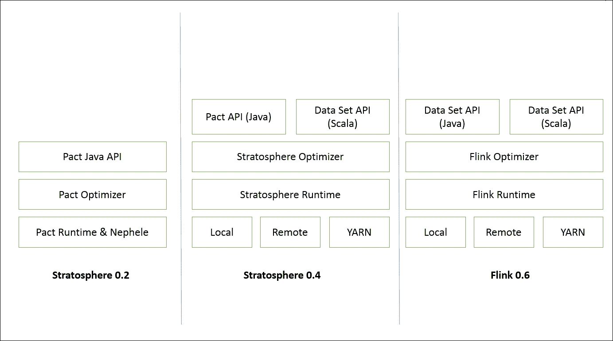
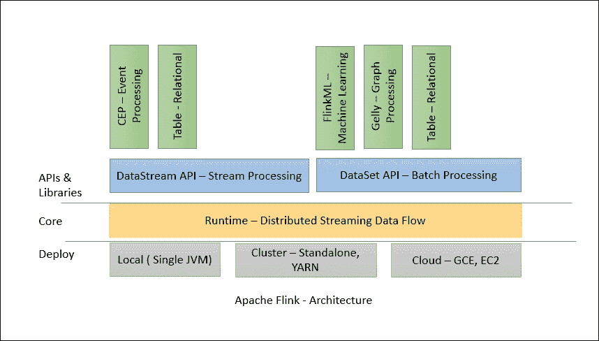
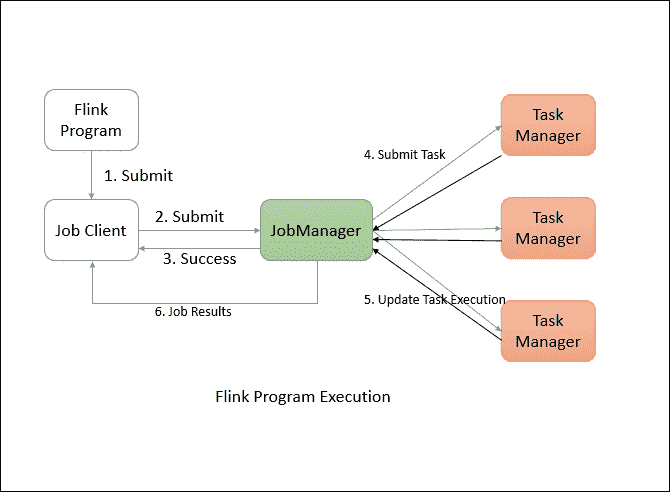
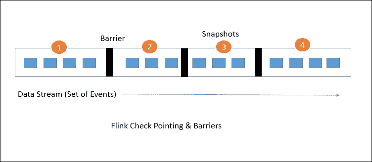
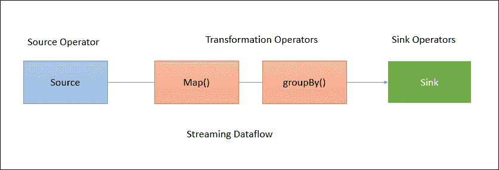
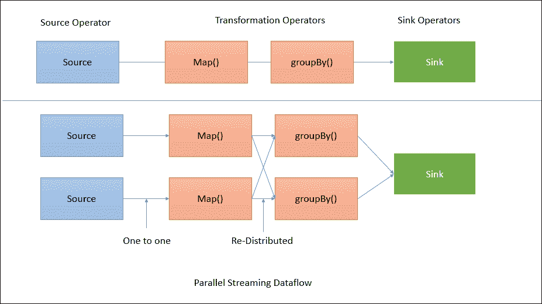
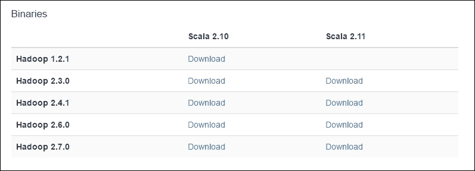
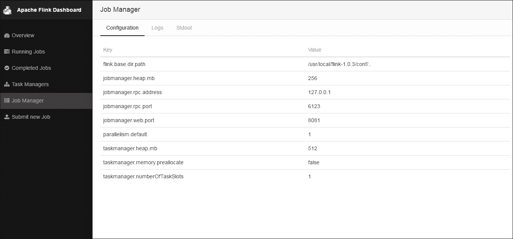
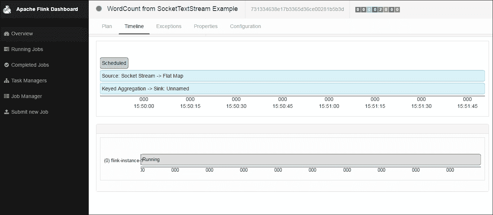

# 一、ApacheFlink 简介

随着分布式技术的不断发展，工程师们正试图将这些技术推向极限。早些时候，人们在寻找更快、更便宜的方法来处理数据。当 Hadoop 被引入时，这种需求得到了满足。每个人都开始使用 Hadoop，开始用 Hadoop 绑定的生态系统工具替换他们的 ETl。现在这一需求已经得到满足，Hadoop 已经在许多公司投入生产，另一个需求是以流式方式处理数据，这就产生了 Apache Spark 和 Flink 等技术。一些特性，如快速处理引擎、在短时间内扩展的能力以及对机器学习和图技术的支持，正在开发者社区中普及这些技术。

你们中的一些人可能已经在日常生活中使用了 Apache Spark，可能会想知道我是否有 Spark，为什么我需要使用 Flink？这个问题是意料之中的，比较自然。让我简单地回答这个问题。我们在这里首先需要理解的是，Flink 是基于**流优先原则**的，这意味着它是真正的流处理引擎，而不是以小批量收集流的快速处理引擎。Flink 认为批处理是流式传输的一种特殊情况，而 Spark 的情况则相反。同样，我们将在整本书中发现更多这样的差异。

这本书是关于最有前途的技术之一——Apache Flink。在本章中，我们将讨论以下主题:

*   历史
*   体系结构
*   分布式执行
*   特征
*   快速启动设置
*   集群设置
*   运行示例应用程序

# 历史

Flink 最初是一个名为*平流层*的研究项目，目标是在柏林地区的大学建立下一代大数据分析平台。它于 2014 年 4 月 16 日被接受为 Apache 孵化器项目。《同温层》的最初版本是基于霞飞在 http://stratosphere.eu/assets/papers/Nephele_09.pdf T2 发表的一篇研究论文。

下图显示了平流层的演变是如何随着时间发生的:



平流层的第一个版本侧重于运行时、优化器和 Java 应用编程接口。后来，随着平台越来越成熟，它开始支持在各种本地环境以及**纱**上执行。从 0.6 版本开始，平流层改名为 Flink。Flink 的最新版本专注于支持各种功能，如批处理、流处理、图处理、机器学习等。

Flink 0.7 引入了 Flink 最重要的特性，那就是 Flink 的流媒体 API。最初版本只有 Java API。后来的版本也开始支持 Scala 应用编程接口。现在让我们在下一节看看 Flink 的当前架构。

# 建筑

Flink 1 号。x 的架构由各种组件组成，如部署、核心处理和 API。我们可以很容易地将最新的架构与平流层的架构进行比较，看看它的演变。下图显示了组件、应用编程接口和库:



Flink 采用分层架构，每个组件都是特定层的一部分。为了清晰的抽象，每一层都建立在其他层之上。Flink 旨在运行在本地机器上、纱簇中或云上。运行时是 Flink 的核心数据处理引擎，通过 JobGraph 形式的 API 接收程序。 **JobGraph** 是一个简单的并行数据流，有一组产生和消耗数据流的任务。

数据流和数据集应用编程接口是程序员可以用来定义作业的接口。这些应用编程接口在编译程序时生成作业图。一旦编译完成，数据集应用编程接口允许优化器生成最佳执行计划，而数据流应用编程接口使用流构建来实现高效的执行计划。

然后根据部署模型将优化的作业图提交给执行者。您可以选择本地、远程或纱部署模式。如果您有一个已经运行的 Hadoop 集群，那么使用 have 部署模式总是更好。

# 分布式执行

Flink 的分布式执行由两个重要的进程组成，主进程和工作进程。当一个 Flink 程序被执行时，各种进程参与执行，即**作业管理器**、**任务管理器**、**作业客户端**。

下图显示了 Flink 程序的执行情况:



Flink 程序需要提交到**作业客户端**。**作业客户端**然后将作业提交给**作业管理器**。协调资源分配和工作执行是**工作经理的**职责。它做的第一件事就是分配所需的资源。一旦资源分配完成，任务就被提交给各自的**任务管理器**。接收到任务后，**任务管理器**启动一个线程开始执行。当执行到位时，任务管理器继续向**作业管理器**报告状态变化。可以有各种状态，如开始执行、进行中或完成。一旦作业执行完成，结果将被发送回客户端。

## 作业管理器

**主**流程，也称为**作业管理器**，协调和管理程序的执行。他们的主要职责包括调度任务、管理检查点、故障恢复等。

可以有许多大师并行运行，分担这些责任。这有助于实现高可用性。其中一位大师需要成为领导者。如果领导者节点关闭，主节点(备用节点)将被选为领导者。

作业管理器由以下重要组件组成:

*   演员系统
*   调度程序
*   检查指向

Flink 在内部使用 **Akka** 演员系统进行工作经理和任务经理之间的沟通。

### 行为人制度

演员系统是一个包含不同角色的演员的容器。它提供诸如调度、配置、日志记录等服务。它还包含一个线程池，所有参与者都从这里启动。所有的演员都生活在一个等级体系中。每个新创建的演员将被分配给一个家长。演员们通过信息系统互相交流。每个参与者都有自己的邮箱，可以从里面读取所有消息。如果参与者是本地的，则消息通过共享内存共享，但是如果参与者是远程的，则消息通过 RPC 调用传递。

每个父母都有责任监督自己的孩子。如果子代出现任何错误，就会通知父代。如果一个参与者可以解决自己的问题，那么它可以重新启动它的孩子。如果它不能解决问题，那么它可以将问题升级到它自己的父级:


在 Flink 中，演员是一个具有状态和行为的容器。参与者的线程继续处理它将在邮箱中收到的消息。状态和行为由它收到的消息决定。

### 调度程序

Flink 中的执行器被定义为任务槽。每个任务管理器需要管理一个或多个任务槽。在内部，Flink 决定哪些任务需要共享插槽，哪些任务必须放入特定的插槽。它定义通过**槽共享组**和**位置组**。

### 检查指向

检查点是 Flink 提供一致容错的支柱。它继续为分布式数据流和执行器状态拍摄一致的快照。它的灵感来自钱德-兰波特算法，但已根据 Flink 的定制要求进行了修改。关于 Chandy-Lamport 算法的详细信息可在以下网址找到:[http://research . Microsoft . com/en-us/um/people/Lamport/pubs/Chandy . pdf](http://research.microsoft.com/en-us/um/people/lamport/pubs/chandy.pdf)。

下面的研究论文提供了快照的具体实现细节:*分布式数据流的轻量级异步快照(*)。

容错机制继续为数据流创建轻量级快照。因此，他们继续功能，没有任何明显的过度负担。通常，数据流的状态保存在配置好的地方，如 HDFS。

如果出现任何故障，Flink 会停止执行器并重置它们，然后从最新的可用检查点开始执行。

溪流屏障是 Flink 快照的核心元素。它们被吸收到数据流中，而不影响数据流。障碍从未超过记录。他们将多组记录组合成一个快照。每个屏障都带有唯一的标识。下图显示了如何将屏障注入快照的数据流中:



每个快照状态都报告给 Flink**作业管理器的**检查点协调器。在绘制快照时，Flink 处理记录的对齐，以避免因任何故障而重新处理相同的记录。这种对齐通常需要几毫秒。但是对于一些密集的应用程序，甚至毫秒级的延迟都是不可接受的，我们可以选择低延迟，而不仅仅是单个记录处理。默认情况下，Flink 只处理每条记录一次。如果任何应用程序需要低延迟，并且至少可以进行一次交付，我们可以关闭该触发器。这将跳过对齐，并将改善延迟。

## 任务管理器

任务管理器是在 JVM 的一个或多个线程中执行任务的工作节点。任务执行的并行性由每个任务管理器上可用的任务槽决定。每个任务代表分配给任务槽的一组资源。例如，如果任务管理器有四个插槽，那么它将为每个插槽分配 25%的内存。任务槽中可能有一个或多个线程在运行。同一插槽中的线程共享同一个 JVM。同一 JVM 中的任务共享 TCP 连接和心跳消息:


## 作业客户端

作业客户端不是 Flink 程序执行的内部部分，但它是执行的起点。作业客户端负责从用户处接受程序，然后创建数据流，然后将数据流提交给作业管理器以供进一步执行。一旦执行完成，作业客户端会将结果返回给用户。

数据流是一个执行计划。考虑一个非常简单的字数统计程序:


当客户端接受用户的程序时，它会将其转换为数据流。上述程序的数据流可能如下所示:



上图显示了一个程序是如何转换成数据流的。默认情况下，Flink 数据流是并行和分布式的。对于并行数据处理，Flink 对操作符和流进行了划分。操作员分区称为子任务。流可以以一对一或重新分发的方式分发数据。

数据直接从源流向地图操作符，因为不需要混洗数据。但是对于 GroupBy 操作，为了获得正确的结果，Flink 可能需要按键重新分发数据:



# 特征

在前面几节中，我们试图理解 Flink 架构及其执行模型。由于其健壮的架构，Flink 充满了各种功能。

## 高性能

Flink 旨在实现高性能和低延迟。与 Spark 等其他流框架不同，您不需要进行许多手动配置来获得最佳性能。与同类产品相比，Flink 的流水线数据处理具有更好的性能。

## 一次性有状态计算

正如我们在上一节中所讨论的，Flink 的分布式检查点处理有助于保证每条记录只处理一次。在高吞吐量应用的情况下，Flink 为我们提供了一个开关，允许至少一次处理。

## 灵活的流媒体窗口

Flink 支持数据驱动的窗口。这意味着我们可以根据时间、计数或会话来设计窗口。还可以定制一个窗口，允许我们检测事件流中的特定模式。

## 容错

Flink 的分布式轻量级快照机制有助于实现高度容错。它允许 Flink 在保证交付的情况下提供高吞吐量性能。

## 内存管理

Flink 在 JVM 中提供了自己的内存管理，这使得它独立于 Java 的默认垃圾收集器。它通过使用哈希、索引、缓存和排序来有效地进行内存管理。

## 优化器

Flink 的批处理数据处理 API 进行了优化，以避免诸如洗牌、排序等消耗内存的操作。它还确保使用缓存，以避免繁重的磁盘 IO 操作。

## 在一个平台上进行流和批

Flink 为批处理和流数据处理提供了 API。因此，一旦您设置了 Flink 环境，它就可以轻松托管流和批处理应用程序。事实上，Flink 基于流优先原则工作，并将批处理视为流的特例。

## 图书馆

Flink 有一套丰富的库来做机器学习、图处理、关系数据处理等等。由于其体系结构，执行复杂的事件处理和警报非常容易。我们将在后续章节中看到更多关于这些库的内容。

## 事件时间语义

Flink 支持事件时间语义。这有助于处理事件无序到达的流。有时事情可能会推迟。Flink 的架构允许我们根据时间、计数和会话来定义窗口，这有助于处理这样的场景。

# 快速启动设置

现在我们已经了解了 Flink 的架构及其流程模型的细节，是时候开始快速设置并尝试我们自己的东西了。Flink 在 Windows 和 Linux 机器上都可以工作。

我们需要做的第一件事就是下载 Flink 的二进制文件。Flink 可从 Flink 下载页面下载，网址:[http://flink.apache.org/downloads.html](http://flink.apache.org/downloads.html)。

在下载页面上，您将看到多个选项，如下图所示:



为了安装 Flink，您不需要安装 Hadoop。但是如果您需要使用 Flink 连接到 Hadoop，那么您需要下载与您拥有的 Hadoop 版本兼容的精确二进制文件。

由于我已经安装了最新版本的 **Hadoop 2.7.0** ，所以我打算下载与 Hadoop 2.7.0 兼容并构建在 Scala 2.11 上的 Flink 二进制文件。

以下是下载的直接链接:

[http://www-us . Apache . org/dist/flink/flink-1 . 1 . 4/flink-1 . 1 . 4-bin-Hadoop 27-Scala _ 2.11 . tgz](http://www-us.apache.org/dist/flink/flink-1.1.4/flink-1.1.4-bin-hadoop27-scala_2.11.tgz)

## 先决条件

Flink 需要先安装 Java。所以在开始之前，请确保安装了 Java。我的机器上安装了 JDK 1.8:


## 安装在窗户上

Flink 安装非常容易安装。只需提取压缩文件并将其存储在所需的位置。

提取后，转到文件夹并执行`start-local.bat`:

```scala
>cd flink-1.1.4
>bin\start-local.bat

```

您将看到 Flink 的本地实例已经启动。

也可以在`http://localhost:8081/`上查看网页 UI:


按下 *Cltr* + *C* 可以停止 Flink 过程。

## 安装在 Linux 上

与 Windows 类似，在 Linux 机器上安装 Flink 非常容易。我们需要下载二进制文件，将其放在特定的文件夹中，解压缩，然后完成:

```scala
$sudo tar -xzf flink-1.1.4-bin-hadoop27-scala_2.11.tgz
$cd flink-1.1.4
$bin/start-local.sh 

```

和在 Windows 中一样，请确保机器上安装了 Java。

现在我们都准备提交一份 Flink 工作。要停止 Linux 上的本地 Flink 实例，请执行以下命令:

```scala
$bin/stop-local.sh

```

# 集群设置

建立一个 Flink 集群也非常简单。那些有安装 Hadoop 集群背景的人将能够非常容易地理解这些步骤。为了设置集群，让我们假设我们有四台 Linux 机器，每台机器都有适度的配置。至少两个内核和 4 GB 内存的机器将是一个很好的开始选择。

我们需要做的第一件事就是选择集群设计。由于我们有四台机器，我们将使用一台机器作为**作业管理器**，使用另外三台机器作为**任务管理器**:


## SSH 配置

为了设置集群，我们首先需要从作业管理器机器进行到任务管理器的无密码连接。需要在作业管理器机器上执行以下步骤，该机器创建 SSH 密钥并将其复制到`authorized_keys`:

```scala
$ssh-keygen

```

这将在`/home/flinkuser/.ssh`文件夹中生成公钥和私钥。现在将公钥复制到任务管理器计算机上，并在任务管理器上执行以下步骤，以允许从作业管理器进行无密码连接:

```scala
sudo mkdir -p /home/flinkuser/.ssh 
sudo touch /home/flinkuser/authorized_keys 
sudo cp /home/flinkuser/.ssh 
 sudo sh -c "cat id_rsa.pub >> /home/flinkuser/.ssh/authorized_keys"

```

通过执行以下命令，确保密钥具有受限访问权限:

```scala
sudo chmod 700 /home/flinkuser/.ssh
sudo chmod 600 /home/flinkuser/.ssh/authorized_keys 

```

现在，您可以从作业管理器机器测试无密码 SSH 连接:

```scala
sudo ssh <task-manager-1>
sudo ssh <task-manager-2>
sudo ssh <task-manager-3>

```

### 类型

如果您正在为安装使用任何云服务实例，请确保从 SSH 启用 ROOT 登录。为此，您需要登录每台机器:`open file /etc/ssh/sshd_config`。然后将数值改为`PermitRootLogin yes`。保存文件后，通过执行以下命令重启 SSH 服务:`sudo service sshd restart`

## Java 安装

接下来我们需要在每台机器上安装 Java。以下命令将帮助您在基于红帽/CentOS 的 UNIX 机器上安装 Java。

```scala
wget --no-check-certificate --no-cookies --header "Cookie: 
    oraclelicense=accept-securebackup-cookie" 
    http://download.oracle.com/otn-pub/java/jdk/8u92-b14/jdk-8u92-
    linux-x64.rpm
sudo rpm -ivh jdk-8u92-linux-x64.rpm

```

接下来，我们需要设置`JAVA_HOME`环境变量，以便 Java 可以从任何地方访问。

创建一个`java.sh`文件:

```scala
sudo vi /etc/profile.d/java.sh

```

并在其中添加以下内容并保存:

```scala
#!/bin/bash
JAVA_HOME=/usr/java/jdk1.8.0_92
PATH=$JAVA_HOME/bin:$PATH
export PATH JAVA_HOME
export CLASSPATH=.

```

使文件可执行，并将其来源:

```scala
sudo chmod +x /etc/profile.d/java.sh
source /etc/profile.d/java.sh

```

您现在可以检查 Java 是否安装正确:

```scala
$ java -version
java version "1.8.0_92"
Java(TM) SE Runtime Environment (build 1.8.0_92-b14)
Java HotSpot(TM) 64-Bit Server VM (build 25.92-b14, mixed mode)

```

在作业管理器和任务管理器计算机上重复这些安装步骤。

## Flink 安装

SSH 和 Java 安装完成后，我们需要下载 Flink 二进制文件，并将其提取到特定的文件夹中。请注意，所有节点上的安装目录应该相同。

让我们开始吧:

```scala
cd /usr/local
sudo wget  http://www-eu.apache.org/dist/flink/flink-1.1.4/flink-
    1.1.4-bin-hadoop27-scala_2.11.tgz
sudo tar -xzf flink-1.1.4-bin-hadoop27-scala_2.11.tgz

```

现在二进制文件已经准备好了，我们需要做一些配置。

## 配置

Flink 的配置很简单。我们需要调整一些参数，我们都准备好了。作业管理器节点和任务管理器节点的大多数配置都是相同的。所有配置都在`conf/flink-conf.yaml`文件中完成。

以下是作业管理器节点的配置文件:

```scala
jobmanager.rpc.address: localhost
jobmanager.rpc.port: 6123
jobmanager.heap.mb: 256
taskmanager.heap.mb: 512
taskmanager.numberOfTaskSlots: 1

```

您可能希望根据节点配置更改作业管理器和任务管理器的内存配置。对于任务管理器，`jobmanager.rpc.address`应填充正确的作业管理器主机名或 IP 地址。

因此，对于所有任务管理器，配置文件应该如下所示:

```scala
jobmanager.rpc.address: <jobmanager-ip-or-host>
jobmanager.rpc.port: 6123
jobmanager.heap.mb: 256
taskmanager.heap.mb: 512
taskmanager.numberOfTaskSlots: 1

```

我们需要在这个文件中添加`JAVA_HOME`的细节，这样 Flink 就能准确地知道在哪里可以找到 Java 二进制文件:

```scala
export JAVA_HOME=/usr/java/jdk1.8.0_92

```

我们还需要在`conf/slaves`文件中添加从节点的详细信息，每个节点都在一个单独的新行中。

以下是示例文件`conf/slaves`的外观:

```scala
<task-manager-1>
<task-manager-2>
<task-manager-3>

```

## 启动守护程序

现在唯一剩下的就是启动 Flink 进程。我们可以在单个节点上单独启动每个进程，也可以执行`start-cluster.sh`命令在每个节点上启动所需的进程:

```scala
bin/start-cluster.sh

```

如果所有的配置都是好的，那么您将看到集群已经启动并运行。可以在 `http://<job-manager-ip>:8081/` 查看网页 UI。

以下是 Flink 网络用户界面的一些快照:


您可以点击**作业管理器**链接获得以下视图:



同样，您可以查看**任务管理器**视图，如下所示:


## 添加其他作业/任务经理

Flink 为您提供了向正在运行的集群添加作业和任务管理器的附加实例的功能。

在我们启动守护程序之前，请确保您已经遵循了前面给出的步骤。

要向现有集群添加额外的作业管理器，请执行以下命令:

```scala
sudo bin/jobmanager.sh start cluster

```

同样，我们需要执行以下命令来添加额外的任务管理器:

```scala
sudo bin/taskmanager.sh start cluster

```

## 停止守护程序和集群

作业执行完成后，您需要关闭集群。以下命令用于此目的。

要一次性停止整个集群:

```scala
sudo bin/stop-cluster.sh

```

要停止单个作业管理器，请执行以下操作:

```scala
sudo bin/jobmanager.sh stop cluster

```

要停止单个任务管理器:

```scala
sudo bin/taskmanager.sh stop cluster

```

# 运行示例应用程序

Flink 二进制文件附带了一个可以直接使用的示例应用程序。让我们从一个非常简单的应用程序开始，字数统计。在这里，我们将尝试一个流应用程序，它从特定端口上的 netcat 服务器读取数据。

让我们开始吧。首先通过执行以下命令启动端口`9000`上的 netcat 服务器:

```scala
nc -l 9000

```

现在，netcat 服务器将开始监听端口 9000，因此无论您在命令提示符下键入什么，都会被发送到 Flink 处理。

接下来我们需要启动 Flink 示例程序来监听 netcat 服务器。以下是命令:

```scala
bin/flink run examples/streaming/SocketTextStreamWordCount.jar --
hostname localhost --port 9000
08/06/2016 10:32:40     Job execution switched to status RUNNING.
08/06/2016 10:32:40     Source: Socket Stream -> Flat Map(1/1)   
switched to SCHEDULED
08/06/2016 10:32:40     Source: Socket Stream -> Flat Map(1/1) 
switched to DEPLOYING
08/06/2016 10:32:40     Keyed Aggregation -> Sink: Unnamed(1/1) 
switched to SCHEDULED
08/06/2016 10:32:40     Keyed Aggregation -> Sink: Unnamed(1/1) 
switched to DEPLOYING
08/06/2016 10:32:40     Source: Socket Stream -> Flat Map(1/1) 
switched to RUNNING
08/06/2016 10:32:40     Keyed Aggregation -> Sink: Unnamed(1/1) 
switched to RUNNING

```

这将启动 Flink 作业执行。现在你可以在 netcat 控制台上输入一些东西，Flink 会处理它。

例如，在 netcat 服务器上键入以下内容:

```scala
$nc -l 9000
hi Hello
Hello World
This distribution includes cryptographic software.  The country in
which you currently reside may have restrictions on the import,
possession, use, and/or re-export to another country, of
encryption software.  BEFORE using any encryption software, please
check your country's laws, regulations and policies concerning the
import, possession, or use, and re-export of encryption software,   
to
see if this is permitted.  See <http://www.wassenaar.org/> for    
more
information.

```

您可以在日志中验证输出:

```scala
$ tail -f flink-*-taskmanager-*-flink-instance-*.out
==> flink-root-taskmanager-0-flink-instance-1.out <== 
(see,2) 
(http,1) 
(www,1) 
(wassenaar,1) 
(org,1) 
(for,1) 
(more,1) 
(information,1) 
(hellow,1) 
(world,1) 

==> flink-root-taskmanager-1-flink-instance-1.out <== 
(is,1) 
(permitted,1) 
(see,2) 
(http,1)
(www,1) 
(wassenaar,1) 
(org,1) 
(for,1) 
(more,1) 
(information,1) 

==> flink-root-taskmanager-2-flink-instance-1.out <== 
(hello,1) 
(worlds,1) 
(hi,1) 
(how,1) 
(are,1) 
(you,1) 
(how,2) 
(is,1) 
(it,1) 
(going,1)

```

您还可以查看 Flink 网络用户界面，了解您的工作表现如何。下面的截图显示了执行的数据流计划:


这里对于作业执行，Flink 有两个操作符。第一个是从套接字流中读取数据的源操作符。第二个运算符是聚合字数的转换运算符。

我们还可以查看作业执行的时间表:



# 总结

在这一章中，我们讨论了 Flink 如何从一个大学项目开始，然后成为一个成熟的企业级数据处理平台。我们研究了 Flink 架构的细节以及它的过程模型是如何工作的。我们还学习了如何在本地和集群模式下运行 Flink。

在下一章中，我们将了解 Flink 的流应用编程接口，并了解其细节，以及我们如何使用该应用编程接口来解决我们的数据流处理问题。