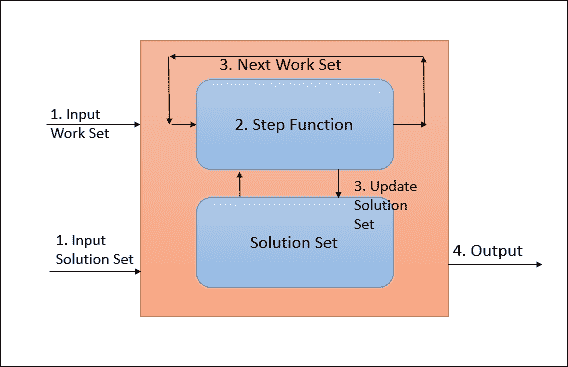

# 第三章。使用批处理应用编程接口的数据处理

尽管许多人欣赏大多数行业中流式数据处理的潜在价值，但也有许多用例，人们觉得没有必要以流式方式处理数据。在所有这些情况下，批量处理是必由之路。到目前为止，Hadoop 一直是数据处理的默认选择。但是，Flink 也支持数据集 API 进行批量数据处理。

对于 Flink，批处理是流处理的一个特例。这里有一篇非常有趣的文章在[http://data-工匠. com/batch-is-a-special-case-of-streaming/](http://data-artisans.com/batch-is-a-special-case-of-streaming/)详细解释了这一思想。

在本章中，我们将了解关于数据集应用编程接口的细节。这包括以下主题:

*   数据源
*   转换
*   数据接收器
*   连接器

正如我们在上一章中了解到的，任何 Flink 程序都在特定的解剖结构上工作，如下所示:


数据集应用编程接口也不例外。我们将详细了解每一步。我们在上一章已经讨论了如何获得执行环境。所以我们将直接进入数据集 API 支持的数据源的细节。

# 数据来源

源是数据集应用编程接口期望从中获取数据的地方。它可以是文件的形式，也可以是 Java 集合的形式。这是 Flink 程序解剖的第二步。数据集应用编程接口支持许多预先实现的数据源函数。它还支持编写自定义数据源函数，这样任何不支持的东西都可以轻松编程。首先让我们试着理解内置的源函数。

## 基于文件

Flink 支持从文件中读取数据。它逐行读取数据，并以字符串形式返回。以下是可以用来读取数据的内置函数:

*   `readTextFile(Stringpath)`:这将从路径中指定的文件中读取数据。默认情况下，它将读取`TextInputFormat`并将逐行读取字符串。
*   `readTextFileWithValue(Stringpath)`:这将从路径中指定的文件中读取数据。它返回`StringValues`。`StringValues`是易变的弦。
*   `readCsvFile(Stringpath`):这从逗号分隔的文件中读取数据。它返回 Java POJOs 或元组。
*   `readFileofPremitives(path, delimiter, class)`:这会将新行解析为字符串或整数等原始数据类型。
*   `readHadoopFile(FileInputFormat, Key, Value, path)`:从给定的`FileInputFormat`、`Key`类和`Value`类的指定路径读取文件。它将解析后的值作为元组返回`Tuple2<Key,Value>`。
*   `readSequenceFile(Key, Value, path)`:从给定的`SequenceFileInputFormat`、`Key`类和`Value`类的指定路径读取文件。它将解析后的值作为元组返回`Tuple2<Key,Value>`。

### 注

对于基于文件的输入，Flink 支持在给定路径中指定的文件夹的递归遍历。为了使用这个工具，我们需要设置一个环境变量，并在读取数据时将其作为参数传递。要设置的变量是`recursive.file.enumeration`。为了实现递归遍历，我们需要将这个变量设置为`true`。

## 基于集合

使用 Flink 数据集应用编程接口，我们还可以从基于 Java 的集合中读取数据。以下是我们可以用来读取数据的一些函数:

*   `fromCollection(Collection)`:这将从基于 Java 的集合中创建一个数据集。
*   `fromCollection(Iterator, Class)`:这将从迭代器创建一个数据集。迭代器的元素属于类参数给定的类型。
*   `fromElements(T)`:这将创建一系列对象的数据集。对象类型是在函数本身中指定的。
*   `fromParallelCollection(SplittableIterator, Class)`:这将从迭代器并行创建一个数据集。类表示对象类型。
*   `generateSequence(from, to)`:这产生给定界限之间的数字序列。

## 通用来源

数据集应用编程接口支持几个通用函数来读取数据:

*   `readFile(inputFormat, path)`:这将从给定路径创建类型为`FileInputFormat`的数据集
*   `createInput(inputFormat)`:这将创建通用输入格式的数据集

## 压缩文件

Flink 支持在读取文件时对文件进行解压缩，前提是这些文件标有正确的扩展名。我们不需要做任何不同的配置来读取压缩文件。如果检测到扩展名正确的文件，Flink 会自动对其进行解压缩，并将其发送以供进一步处理。

这里需要注意的一点是，文件解压缩不能并行进行，因此在实际数据处理开始之前，这可能需要一段时间。

在这个阶段，建议避免使用压缩文件，因为解压缩在 Flink 中不是可扩展的活动。

以下是支持的算法:

<colgroup><col> <col> <col></colgroup> 
| **压缩算法** | **延伸** | **平行吗？** |
| Gzip | `.gz`、`.gzip` | 不 |
| 紧缩 | `.deflate` | 不 |

# 转换

数据转换将数据集从一种形式转换为另一种形式。输入可以是一个或多个数据集，输出也可以是零，或者一个或多个数据流。现在让我们试着逐一理解每个转换。

## 地图

这是最简单的转换之一，其中输入是一个数据集，输出也是一个数据集。

在 Java 中:

```scala
inputSet.map(new MapFunction<Integer, Integer>() { 
  @Override 
  public Integer map(Integer value) throws Exception { 
        return 5 * value; 
      } 
    }); 

```

在 Scala 中:

```scala
inputSet.map { x => x * 5 } 

```

在 Python 中:

```scala
inputSet.map { lambda x : x * 5 } 

```

## 平面图

平面图采用一条记录，输出零条、一条或多条记录。

在 Java 中:

```scala
inputSet.flatMap(new FlatMapFunction<String, String>() { 
    @Override 
    public void flatMap(String value, Collector<String> out) 
        throws Exception { 
        for(String word: value.split(" ")){ 
            out.collect(word); 
        } 
    } 
}); 

```

在 Scala 中:

```scala
inputSet.flatMap { str => str.split(" ") } 

```

在 Python 中:

```scala
inputSet.flat_map {lambda str, c:[str.split() for line in str } 

```

## 过滤器

过滤功能评估条件，如果返回`true`，则仅发出记录。过滤函数可以输出零记录。

在 Java 中:

```scala
inputSet.filter(new FilterFunction<Integer>() { 
    @Override 
    public boolean filter(Integer value) throws Exception { 
        return value != 1; 
    } 
}); 
In Scala: 
inputSet.filter { _ != 1 } 

```

在 Python 中:

```scala
inputSet.filter {lambda x: x != 1 } 

```

## 项目

项目转换将元组的元素移除或移动到另一个元组中。这可用于对特定元素进行选择性处理。

在 Java 中:

```scala
DataSet<Tuple3<Integer, String, Double>> in = // [...] 
DataSet<Tuple2<String, Integer>> out = in.project(1,0); 

```

在 Scala 中，不支持这种转换。

在 Python 中:

```scala
inputSet.project(1,0) 

```

## 在分组数据集上缩小

Reduce 转换基于用户定义的 reduce 函数将每个组简化为一个元素。

在 Java 中:

```scala
public class WC { 
  public String word; 
  public int count; 
} 

//Reduce function 
public class WordCounter implements ReduceFunction<WC> { 
  @Override 
  public WC reduce(WC in1, WC in2) { 
    return new WC(in1.word, in1.count + in2.count); 
  } 
} 

// [...] 
DataSet<WC> words = // [...] 
DataSet<WC> wordCounts = words 
                         // grouping on field "word" 
                         .groupBy("word") 
                         // apply ReduceFunction on grouped DataSet 
                         .reduce(new WordCounter()); 

```

在 Scala 中:

```scala
class WC(val word: String, val count: Int) { 
  def this() { 
    this(null, -1) 
  } 
} 

val words: DataSet[WC] = // [...] 
val wordCounts = words.groupBy("word").reduce { 
  (w1, w2) => new WC(w1.word, w1.count + w2.count) 
} 

```

在 Python 中，不支持该代码。

## 按字段位置键减少分组数据集

对于包含元组的数据集，我们也可以按字段位置分组。以下是一个例子。

在 Java 中:

```scala
DataSet<Tuple3<String, Integer, Double>> reducedTuples = tuples 
                           // group by on second and third field  
                            .groupBy(1, 2) 
                            // apply ReduceFunction 
                            .reduce(new MyTupleReducer()); 

```

在 Scala 中:

```scala
val reducedTuples = tuples.groupBy(1, 2).reduce { ... } 

```

在 Python 中:

```scala
reducedTuples = tuples.group_by(1, 2).reduce( ... ) 

```

## 分组合并

在某些应用程序中，在进行更多转换之前进行中间操作是很重要的。在这种情况下，组组合操作非常方便。中间转换可以是缩小规模等等。

这是在内存中使用贪婪策略执行的，该策略分多个步骤执行。

在 Java 中:

```scala
DataSet<String> input = [..]  

  DataSet<Tuple2<String, Integer>> combinedWords = input 
  .groupBy(0); // group similar words 
  .combineGroup(new GroupCombineFunction<String, Tuple2<String,  
   Integer>() { 

    public void combine(Iterable<String> words,   
    Collector<Tuple2<String, Integer>>) { // combine 
        String key = null; 
        int count = 0; 

        for (String word : words) { 
            key = word; 
            count++; 
        } 
        // emit tuple with word and count 
        out.collect(new Tuple2(key, count)); 
    } 
}); 

```

在 Scala 中:

```scala
val input: DataSet[String] = [..]  

val combinedWords: DataSet[(String, Int)] = input 
  .groupBy(0) 
  .combineGroup { 
    (words, out: Collector[(String, Int)]) => 
        var key: String = null 
        var count = 0 

        for (word <- words) { 
            key = word 
            count += 1 
        } 
        out.collect((key, count)) 
} 

```

在 Python 中，不支持此代码。

## 在分组元组数据集上聚合

聚合转换非常常见。我们可以很容易地在元组数据集上执行常见的聚合，例如`sum`、`min`和`max`。以下是我们的做法。

在 Java 中:

```scala
DataSet<Tuple3<Integer, String, Double>> input = // [...] 
DataSet<Tuple3<Integer, String, Double>> output = input 
             .groupBy(1)        // group DataSet on second field 
             .aggregate(SUM, 0) // compute sum of the first field 
             .and(MIN, 2);      // compute minimum of the third field 

```

在 Scala 中:

```scala
val input: DataSet[(Int, String, Double)] = // [...] 
val output = input.groupBy(1).aggregate(SUM, 0).and(MIN, 2) 

```

在 Python 中:

```scala
input = # [...] 
output = input.group_by(1).aggregate(Sum, 0).and_agg(Min, 2) 

```

这里请注意，在 DataSet API 中，如果需要应用多个聚合，需要使用`and`关键字。

## 分组元组数据集上的最小比

`minBy`函数从每组元组数据集中选择一个值最小的元组。用于比较的字段必须具有可比性。

在 Java 中:

```scala
DataSet<Tuple3<Integer, String, Double>> input = // [...] 
DataSet<Tuple3<Integer, String, Double>> output = input 
                  .groupBy(1)   // group by on second field 
                  .minBy(0, 2); // select tuple with minimum values for first and third field. 

```

在 Scala 中:

```scala
val input: DataSet[(Int, String, Double)] = // [...] 
val output: DataSet[(Int, String, Double)] = input 
           .groupBy(1)                                     
           .minBy(0, 2)
```

在 Python 中，不支持此代码。

## 分组元组数据集上的最大比

`MaxBy`函数从每组元组数据集中选择一个值最大的元组。用于比较的字段必须具有可比性。

在 Java 中:

```scala
DataSet<Tuple3<Integer, String, Double>> input = // [...] 
DataSet<Tuple3<Integer, String, Double>> output = input 
                  .groupBy(1)   // group by on second field 
                  .maxBy(0, 2); // select tuple with maximum values for         
                                /*first and third field. */

```

在 Scala 中:

```scala
val input: DataSet[(Int, String, Double)] = // [...] 
val output: DataSet[(Int, String, Double)] = input 
.groupBy(1)                                    
.maxBy(0, 2)  

```

在 Python 中，不支持此代码。

## 在完整数据集上缩小

reduce 转换允许在整个数据集上应用用户定义的函数。这里有一个例子。

在 Java 中:

```scala
public class IntSumReducer implements ReduceFunction<Integer> { 
  @Override 
  public Integer reduce(Integer num1, Integer num2) { 
    return num1 + num2; 
  } 
} 

DataSet<Integer> intNumbers = // [...] 
DataSet<Integer> sum = intNumbers.reduce(new IntSumReducer()); 

```

在 Scala 中:

```scala
val sum = intNumbers.reduce (_ + _) 

```

在 Python 中:

```scala
sum = intNumbers.reduce(lambda x,y: x + y) 

```

## 在完整数据集上进行分组缩减

group reduce 转换允许在完整数据集上应用用户定义的函数。这里有一个例子。

在 Java 中:

```scala
DataSet<Integer> input = // [...] 
DataSet<Integer> output = input.reduceGroup(new MyGroupReducer()); 

```

在 Scala 中:

```scala
val input: DataSet[Int] = // [...] 
val output = input.reduceGroup(new MyGroupReducer())  

```

在 Python 中:

```scala
output = data.reduce_group(MyGroupReducer()) 

```

## 在全元组数据集上聚合

我们可以在完整数据集上运行通用聚合函数。到目前为止，Flink 支持`MAX`、`MIN`和`SUM`。

在 Java 中:

```scala
DataSet<Tuple2<Integer, Double>> output = input 
.aggregate(SUM, 0) // SUM of first field                   
.and(MIN, 1); // Minimum of second  

```

在 Scala 中:

```scala
val input: DataSet[(Int, String, Double)] = // [...] 
val output = input.aggregate(SUM, 0).and(MIN, 2)  

```

在 Python 中:

```scala
output = input.aggregate(Sum, 0).and_agg(Min, 2) 

```

## 全元组数据集上的最小比

`MinBy`函数从完整数据集中选择一个值最小的元组。用于比较的字段必须具有可比性。

在 Java 中:

```scala
DataSet<Tuple3<Integer, String, Double>> input = // [...] 
DataSet<Tuple3<Integer, String, Double>> output = input 
                  .minBy(0, 2); // select tuple with minimum values for 
                                first and third field. 

```

在 Scala 中:

```scala
val input: DataSet[(Int, String, Double)] = // [...] 
val output: DataSet[(Int, String, Double)] = input 
.minBy(0, 2)  

```

在 Python 中，不支持此代码。

## 全元组数据集上的最大比

`MaxBy`选择值最大的单元组完整数据集。用于比较的字段必须具有可比性。

在 Java 中:

```scala
DataSet<Tuple3<Integer, String, Double>> input = // [...] 
DataSet<Tuple3<Integer, String, Double>> output = input 
                 .maxBy(0, 2); // select tuple with maximum values for first and third field. 

```

在 Scala 中:

```scala
val input: DataSet[(Int, String, Double)] = // [...] 
val output: DataSet[(Int, String, Double)] = input 
                                  .maxBy(0, 2)  

```

在 Python 中，不支持此代码。

## 不同

不同的转换从源数据集中发出不同的值。这用于从源中删除重复值。

在 Java 中:

```scala
DataSet<Tuple2<Integer, Double>> output = input.distinct(); 

```

在 Scala 中:

```scala
val output = input.distinct() 

```

在 Python 中，不支持此代码。

## 加入

连接转换将两个数据集连接成一个数据集。连接条件可以定义为每个数据集中的一个关键字。

在 Java 中:

```scala
public static class Student { public String name; public int deptId; } 
public static class Dept { public String name; public int id; } 
DataSet<Student> input1 = // [...] 
DataSet<Dept> input2 = // [...] 
DataSet<Tuple2<Student, Dept>> 
            result = input1.join(input2) 
.where("deptId")                                  
.equalTo("id"); 

```

在 Scala 中:

```scala
val input1: DataSet[(String, Int)] = // [...] 
val input2: DataSet[(String, Int)] = // [...] 
val result = input1.join(input2).where(1).equalTo(1) 

```

在 Python 中

```scala
result = input1.join(input2).where(1).equal_to(1)  

```

### 注

还有各种其他方法可以连接两个数据集。这里有一个链接，你可以在这里阅读更多关于所有这样的连接选项:[https://ci . Apache . org/project/flink/flink-docs-master/dev/batch/dataset _ transformations . html # join](https://ci.apache.org/projects/flink/flink-docs-master/dev/batch/dataset_transformations.html#join)。

## 十字

交叉转换通过应用用户定义的函数来完成两个数据集的交叉乘积。

在 Java 中:

```scala
DataSet<Class> input1 = // [...] 
DataSet<class> input2 = // [...] 
DataSet<Tuple3<Integer, Integer, Double>> 
            result = 
            input1.cross(input2) 
                   // applying CrossFunction 
                   .with(new MyCrossFunction()); 

```

在 Scala 中:

```scala
val result = input1.cross(input2) { 
//custom function 
} 

```

在 Python 中:

```scala
result = input1.cross(input2).using(MyCrossFunction()) 

```

## 工会

联合转换结合了两个相似的数据集。我们还可以一次性合并多个数据集。

在 Java 中:

```scala
DataSet<Tuple2<String, Integer>> input1 = // [...] 
DataSet<Tuple2<String, Integer>> input2 = // [...] 
DataSet<Tuple2<String, Integer>> input3 = // [...] 
DataSet<Tuple2<String, Integer>> unioned = input1.union(input2).union(input3); 

```

在 Scala 中:

```scala
val input1: DataSet[(String, Int)] = // [...] 
val input2: DataSet[(String, Int)] = // [...] 
val input3: DataSet[(String, Int)] = // [...] 
val unioned = input1.union(input2).union(input3)  

```

在 Python 中:

```scala
unioned = input1.union(input2).union(input3) 

```

## 再平衡

这种转换均匀地重新平衡了并行分区。这有助于实现更好的性能，因为它有助于消除数据倾斜。

在 Java 中:

```scala
DataSet<String> in = // [...] 
DataSet<Tuple2<String, String>> out = in.rebalance(); 

```

在 Scala 中:

```scala
val in: DataSet[String] = // [...] 
val out = in.rebalance() 

```

在 Python 中，不支持此代码。

## 哈希分区

此转换在给定的键上对数据集进行分区。

在 Java 中:

```scala
DataSet<Tuple2<String, Integer>> in = // [...] 
DataSet<Tuple2<String, String>> out = in.partitionByHash(1); 

```

在 Scala 中:

```scala
val in: DataSet[(String, Int)] = // [...] 
val out = in.partitionByHash(1) 

```

在 Python 中，不支持此代码。

## 范围划分

此转换范围在给定的键上划分数据集。

在 Java 中:

```scala
DataSet<Tuple2<String, Integer>> in = // [...] 
DataSet<Tuple2<String, String>> out = in.partitionByRange(1); 

```

在 Scala 中:

```scala
val in: DataSet[(String, Int)] = // [...] 
val out = in.partitionByRange(1) 

```

在 Python 中，不支持此代码。

## 分类分区

这种转换按照给定的键和顺序对分区数据集进行本地排序。

在 Java 中:

```scala
DataSet<Tuple2<String, Integer>> in = // [...] 
DataSet<Tuple2<String, String>> out = in.sortPartition(1,Order.ASCENDING); 

```

在 Scala 中:

```scala
val in: DataSet[(String, Int)] = // [...] 
val out = in.sortPartition(1, Order.ASCENDING) 

```

在 Python 中，不支持此代码。

## 第一个 n

这个转换任意返回数据集的前 n 个元素。

在 Java 中:

```scala
DataSet<Tuple2<String, Integer>> in = // [...] 
// Returns first 10 elements of the data set.  
DataSet<Tuple2<String, String>> out = in.first(10); 

```

在 Scala 中:

```scala
val in: DataSet[(String, Int)] = // [...] 
val out = in.first(10) 

```

在 Python 中，不支持此代码。

# 广播变量

广播变量允许用户将特定数据集作为集合访问给所有操作员。一般来说，当我们您希望在某个操作中频繁引用少量数据时，会使用广播变量。熟悉 Spark 广播变量的人也将能够在 Flink 中使用相同的功能。

我们只需要广播一个具有特定名称的数据集，它就可以在每个执行器上方便地使用。广播变量保存在内存中，因此我们在使用它们时必须小心。下面的代码片段显示了如何广播数据集并根据需要使用它。

```scala
// Get a data set to be broadcasted 
DataSet<Integer> toBroadcast = env.fromElements(1, 2, 3); 
DataSet<String> data = env.fromElements("India", "USA", "UK").map(new RichMapFunction<String, String>() { 
    private List<Integer> toBroadcast; 
    // We have to use open method to get broadcast set from the context 
    @Override 
    public void open(Configuration parameters) throws Exception { 
    // Get the broadcast set, available as collection 
    this.toBroadcast = 
    getRuntimeContext().getBroadcastVariable("country"); 
    } 

    @Override 
    public String map(String input) throws Exception { 
          int sum = 0; 
          for (int a : toBroadcast) { 
                sum = a + sum; 
          } 
          return input.toUpperCase() + sum; 
    } 
}).withBroadcastSet(toBroadcast, "country"); // Broadcast the set with name 
data.print(); 

```

当我们有要用于转换的查找条件并且查找数据集相对较小时，广播变量非常有用。

# 数据接收器

数据转换完成后，我们需要将结果保存在某个地方。以下是 Flink 数据集应用编程接口为保存结果提供的一些选项:

*   `writeAsText()`:这将一次写入一行记录为字符串。
*   `writeAsCsV()`:这将元组写成逗号分隔的值文件。还可以配置行和字段分隔符。
*   `print()` / `printErr()`:这将记录写入标准输出。您也可以选择写入标准错误。
*   `write()`:支持在自定义`FileOutputFormat`中写入数据。
*   `output()`:用于非基于文件的数据集。这可以用于我们想要将数据写入某个数据库的地方。

# 连接器

Apache Flink 的 DataSet API 支持各种连接器，允许跨各种系统进行数据读/写。让我们尝试对此进行更多探索。

## 文件系统

默认情况下，Flink 允许连接到各种分布式文件系统，如 HDFS、S3、谷歌云存储、Alluxio 等。在本节中，我们将看到如何连接到这些文件系统。

为了连接到这些系统，我们需要在`pom.xml`中添加以下依赖项:

```scala
<dependency> 
  <groupId>org.apache.flink</groupId> 
  <artifactId>flink-hadoop-compatibility_2.11</artifactId> 
  <version>1.1.4</version> 
</dependency> 

```

这允许我们使用 Hadoop 数据类型、输入格式和输出格式。Flink 支持可写和可写的可比较现成的，所以我们不需要兼容性依赖。

### HDFS

为了从 HDFS 文件中读取数据，我们使用`readHadoopFile()`或`createHadoopInput()`方法创建一个数据源。为了使用这个连接器，我们首先需要配置`flink-conf.yaml`并将`fs.hdfs.hadoopconf`设置到合适的 Hadoop 配置目录。

结果数据集将是与 HDFS 数据类型匹配的类型的元组。下面的代码片段显示了如何做到这一点。

在 Java 中:

```scala
ExecutionEnvironment env = ExecutionEnvironment.getExecutionEnvironment(); 
DataSet<Tuple2<LongWritable, Text>> input = 
    env.readHadoopFile(new TextInputFormat(), LongWritable.class, Text.class, textPath);  

```

在 Scala 中:

```scala
val env = ExecutionEnvironment.getExecutionEnvironment 
val input: DataSet[(LongWritable, Text)] = 
  env.readHadoopFile(new TextInputFormat, classOf[LongWritable], classOf[Text], textPath) 

```

我们还可以使用这个连接器将处理后的数据写回 HDFS。`OutputFormat`包装器希望数据集采用`Tuple2`格式。下面的代码片段显示了如何将处理后的数据写回 HDFS。

在 Java 中:

```scala
// Get the processed data set 
DataSet<Tuple2<Text, IntWritable>> results = [...] 

// Set up the Hadoop Output Format. 
HadoopOutputFormat<Text, IntWritable> hadoopOF = 
  // create the Flink wrapper. 
  new HadoopOutputFormat<Text, IntWritable>( 
    // set the Hadoop OutputFormat and specify the job. 
    new TextOutputFormat<Text, IntWritable>(), job 
  ); 
hadoopOF.getConfiguration().set("mapreduce.output.textoutputformat.separator", " "); 
TextOutputFormat.setOutputPath(job, new Path(outputPath)); 

// Emit data  
result.output(hadoopOF); 

```

在 Scala 中:

```scala
// Get the processed data set 
val result: DataSet[(Text, IntWritable)] = [...] 

val hadoopOF = new HadoopOutputFormat[Text,IntWritable]( 
  new TextOutputFormat[Text, IntWritable], 
  new JobConf) 

hadoopOF.getJobConf.set("mapred.textoutputformat.separator", " ") 
FileOutputFormat.setOutputPath(hadoopOF.getJobConf, new Path(resultPath)) 

result.output(hadoopOF) 

```

### 亚马逊 S3

如前所述，默认情况下，Flink 支持从亚马逊 S3 读取数据。但是我们需要在 Hadoop 的`core-site.xml`中做一些配置。我们需要设置以下属性:

```scala
<!-- configure the file system implementation --> 
<property> 
  <name>fs.s3.impl</name> 
  <value>org.apache.hadoop.fs.s3native.NativeS3FileSystem</value> 
</property> 
<!-- set your AWS ID --> 
<property> 
  <name>fs.s3.awsAccessKeyId</name> 
  <value>putKeyHere</value> 
</property> 
<!-- set your AWS access key --> 
<property> 
  <name>fs.s3.awsSecretAccessKey</name> 
  <value>putSecretHere</value> 
</property> 

```

完成后，我们可以访问 S3 文件系统，如下所示:

```scala
// Read from S3 bucket 
env.readTextFile("s3://<bucket>/<endpoint>"); 
// Write to S3 bucket 
stream.writeAsText("s3://<bucket>/<endpoint>"); 

```

### 简称

Alluxio 是一个开源的、内存速度的虚拟分布式存储。许多公司一直在使用 Alluxio 进行高速数据存储和处理。你可以在 http://www.alluxio.org/阅读更多关于 Alluxio 的信息。

默认情况下，Flink 支持从 Alluxio 读取数据。但是我们需要在 Hadoop `core-site.xml`中做一些配置。我们需要设置以下属性:

```scala
<property> 
  <name>fs.alluxio.impl</name> 
  <value>alluxio.hadoop.FileSystem</value> 
</property> 

```

完成后，我们可以访问如下所示的 Alluxio 文件系统:

```scala
// Read from Alluxio path 
env.readTextFile("alluxio://<path>"); 

// Write to Alluxio path 
stream.writeAsText("alluxio://<path>"); 

```

### 欧元

Flink 内置了对 Avro 文件的支持。它允许轻松读写 Avro 文件。为了读取 Avro 文件，我们需要使用`AvroInputFormat`。下面的代码片段显示了如何读取 Avro 文件:

```scala
AvroInputFormat<User> users = new AvroInputFormat<User>(in, User.class); 
DataSet<User> userSet = env.createInput(users); 

```

一旦数据集准备就绪，我们就可以轻松地执行各种转换，例如:

```scala
userSet.groupBy("city") 

```

### 微软 Azure 存储

微软 Azure Storage 是一种基于云的存储，允许以持久和可扩展的方式存储数据。Flink 支持管理存储在微软 Azure 表存储上的数据。下面解释我们如何做到这一点。

首先需要从`git`下载`azure-tables-hadoop`项目，然后编译:

```scala
git clone https://github.com/mooso/azure-tables-hadoop.git 
cd azure-tables-hadoop 
mvn clean install 

```

接下来，我们在`pom.xml`中添加以下依赖项:

```scala
<dependency> 
    <groupId>org.apache.flink</groupId> 
    <artifactId>flink-hadoop-compatibility_2.11</artifactId> 
    <version>1.1.4</version> 
</dependency> 
<dependency> 
  <groupId>com.microsoft.hadoop</groupId> 
  <artifactId>microsoft-hadoop-azure</artifactId> 
  <version>0.0.4</version> 
</dependency> 

```

接下来，我们编写以下代码来访问 Azure 存储:

```scala
final ExecutionEnvironment env = ExecutionEnvironment.getExecutionEnvironment(); 

    // create a  AzureTableInputFormat, using a Hadoop input format wrapper 
    HadoopInputFormat<Text, WritableEntity> hdIf = new HadoopInputFormat<Text, WritableEntity>(new AzureTableInputFormat(), Text.class, WritableEntity.class, new Job()); 

// set account URI     
hdIf.getConfiguration().set(AzureTableConfiguration.Keys.ACCOUNT_URI.getKey(), "XXXX"); 
    // set the secret storage key 
    hdIf.getConfiguration().set(AzureTableConfiguration.Keys.STORAGE_KEY.getKey(), "XXXX"); 
    // set the table name  
    hdIf.getConfiguration().set(AzureTableConfiguration.Keys.TABLE_NAME.getKey(), "XXXX"); 

 DataSet<Tuple2<Text, WritableEntity>> input = env.createInput(hdIf); 

```

现在我们都准备好对数据集进行任何处理了。

## 蒙戈布

通过开源贡献，开发人员已经能够将 Flink 连接到 MongoDB。在本节中，我们将讨论一个这样的项目。

该项目是开源的，可以从 GitHub 下载:

```scala
git clone https://github.com/okkam-it/flink-mongodb-test.git 
cd flink-mongodb-test 
mvn clean install 

```

接下来，我们使用 Java 程序中前面的连接器连接到 MongoDB:

```scala
// set up the execution environment 
    final ExecutionEnvironment env = ExecutionEnvironment.getExecutionEnvironment(); 

// create a MongodbInputFormat, using a Hadoop input format wrapper 
HadoopInputFormat<BSONWritable, BSONWritable> hdIf =  
        new HadoopInputFormat<BSONWritable, BSONWritable>(new MongoInputFormat(), 
       BSONWritable.class, BSONWritable.class, new JobConf()); 

// specify connection parameters 
hdIf.getJobConf().set("mongo.input.uri",  
                "mongodb://localhost:27017/dbname.collectioname"); 

DataSet<Tuple2<BSONWritable, BSONWritable>> input = env.createInput(hdIf); 

```

一旦数据作为数据集可用，我们就可以轻松地进行所需的转换。我们还可以将数据写回 MongoDB 集合，如下所示:

```scala
MongoConfigUtil.setOutputURI( hdIf.getJobConf(),  
                "mongodb://localhost:27017/dbname.collectionname "); 
 // emit result (this works only locally) 
 result.output(new HadoopOutputFormat<Text,BSONWritable>( 
                new MongoOutputFormat<Text,BSONWritable>(), hdIf.getJobConf())); 

```

# 迭代

Flink 支持的独特功能之一是迭代。如今，许多开发人员希望使用大数据技术运行迭代机器学习和图形处理算法。为了满足这些需求，Flink 通过定义一个阶跃函数来支持运行迭代数据处理。

## 迭代器运算符

迭代器运算符由以下组件组成:


*   **迭代输入**:这要么是接收到的初始数据集，要么是上一次迭代的输出
*   **步长函数**:这是需要应用在输入数据集上的函数
*   **下一个部分解**:这是阶跃函数的输出，需要反馈到下一次迭代
*   **迭代结果** : 所有迭代完成后，我们得到迭代的结果

迭代的次数可以通过各种方式来控制。一种方法是设置要执行的迭代次数，或者我们也可以设置条件终止。

## 增量迭代器

delta 运算符迭代增量迭代操作的元素集。增量迭代器和常规迭代器的主要区别在于，增量迭代器致力于更新解集，而不是每次迭代都完全重新计算解集。

这将提高运营效率，因为它使我们能够在更短的时间内专注于解决方案的重要部分。下图显示了 Flink 中增量迭代器的流程。



*   **迭代输入**:我们必须从一些文件中读取增量迭代器的工作集和解集
*   **阶跃函数**:阶跃函数是需要在输入数据集上应用的函数
*   **下一个工作集/更新解决方案**:这里在每次迭代解决方案集之后，用最新的结果更新它，并且下一个工作集被馈送到下一次迭代
*   **迭代结果**:所有迭代完成后，我们以解集的形式得到迭代的结果

由于 delta 迭代器本身处理热数据集，因此性能和效率都很高。这里有一篇详细的文章，讨论了如何将 Flink 迭代用于 PageRank 算法。[http://data-工匠. com/data-analysis-with-flink-a-case-study-tutorial/](http://data-artisans.com/data-analysis-with-flink-a-case-study-and-tutorial/)。

# 用例-使用 Flink 批处理 API 的运动员数据洞察

现在我们已经了解了数据集应用编程接口的细节，让我们尝试将这些知识应用到实际的用例中。假设我们有一个数据集，其中有关于奥运会运动员及其在各种比赛中表现的信息。示例数据如下表所示:

<colgroup><col> <col> <col> <col> <col> <col> <col> <col></colgroup> 
| **玩家** | **国家** | **年** | **游戏** | **黄金** | **银色** | 青铜 | **总计** |
| 杨一琳 | 中国 | Two thousand and eight | 体操 | one | Zero | Two | three |
| 雷塞尔·琼斯 | 澳大利亚 | Two thousand | 游泳 | Zero | Two | Zero | Two |
| 去 Gi-Hyeon | 韩国 | Two thousand and two | 短道速滑 | one | one | Zero | Two |
| 陈若琳 | 中国 | Two thousand and eight | 潜水 | Two | Zero | Zero | Two |
| 凯蒂·莱德基 | 美国 | Two thousand and twelve | 游泳 | one | Zero | Zero | one |
| 半字节路径 | 立陶宛 | Two thousand and twelve | 游泳 | one | Zero | Zero | one |
| 丹尼尔·朱尔塔 | 匈牙利 | Two thousand and four | 游泳 | Zero | one | Zero | one |
| 阿丽亚娜方丹 | 意大利 | Two thousand and six | 短道速滑 | Zero | Zero | one | one |
| 奥尔加·格拉茨基赫 | 俄罗斯 | Two thousand and four | 艺术体操 | one | Zero | Zero | one |
| 喀里多尼亚 | 希腊 | Two thousand | 艺术体操 | Zero | Zero | one | one |
| 金·马丁 | 瑞典 | Two thousand and two | 冰曲棍球 | Zero | Zero | one | one |
| 凯拉·罗斯 | 美国 | Two thousand and twelve | 体操 | one | Zero | Zero | one |
| 加芙列拉·德拉吉 | 罗马尼亚 | Two thousand and eight | 体操 | Zero | Zero | one | one |
| 塔莎·施韦克-沃伦 | 美国 | Two thousand | 体操 | Zero | Zero | one | one |

现在我们想得到一些问题的答案，比如，每个国家有多少运动员参加了比赛？或者每场比赛有多少玩家参与？由于数据处于静止状态，我们将使用 Flink 批处理应用编程接口对其进行分析。

可用数据为 CSV 格式。因此，我们将使用 Flink API 提供的 CSV 阅读器，如以下代码片段所示。

```scala
final ExecutionEnvironment env = ExecutionEnvironment.getExecutionEnvironment(); 
DataSet<Record> csvInput = env.readCsvFile("olympic-athletes.csv") 
                     .pojoType(Record.class, "playerName", "country", "year", "game", "gold", "silver", "bronze", "total"); 

```

一旦数据被正确解析，就很容易继续前进并根据需要使用它。以下代码片段显示了如何获取每个国家的玩家数量信息:

```scala
DataSet<Tuple2<String, Integer>> groupedByCountry = csvInput
.flatMap(new FlatMapFunction<Record, Tuple2<String, Integer>>() {
private static final long serialVersionUID = 1L;
@Override
public void flatMap(Record record, Collector<Tuple2<String, Integer>> out) throws Exception {
out.collect(new Tuple2<String, Integer>(record.getCountry(), 1));
}
}).groupBy(0).sum(1);
groupedByCountry.print();
```

在前面的代码片段中，我们首先创建了一个数据集，其中键是玩家的国家，值是`1`，然后我们对它进行分组，并对值进行求和，得到总计数。一旦我们执行了代码，输出如下所示:

```scala
(Australia,11)
(Belarus,7)
(China,25)
(France,3)
(Germany,2)
(Italy,4)
(Turkey,1)
(United States,22)
(Cameroon,2)
(Hungary,1)
(Kenya,1)
(Lithuania,1)
(Russia,23)
(Spain,2)
(Ukraine,1)
(Chinese Taipei,2)
(Great Britain,1)
(Romania,14)
(Switzerland,1)
(Bulgaria,3)
(Finland,1)
(Greece,7)
(Japan,1)
(Mexico,1)
(Netherlands,2)
(Poland,1)
(South Korea,6)
(Sweden,6)
(Thailand,1)
```

同样，我们可以应用相同的逻辑来计算每场比赛的玩家数量，如下面的代码片段所示:

```scala
DataSet<Tuple2<String, Integer>> groupedByGame = csvInput
.flatMap(new FlatMapFunction<Record, Tuple2<String, Integer>>() { private static final long serialVersionUID = 1L;
@Override
public void flatMap(Record record, Collector<Tuple2<String, Integer>> out) throws Exception {
out.collect(new Tuple2<String, Integer>(record.getGame(), 1));
}
}).groupBy(0).sum(1);
groupedByGame.print();
```

前面代码片段的输出如下所示:

```scala
(Basketball,1)
(Gymnastics,42)
(Ice Hockey,7)
(Judo,1)
(Swimming,33)
(Athletics,2)
(Fencing,2)
(Nordic Combined,1)
(Rhythmic Gymnastics,27)
(Short-Track Speed Skating,5)
(Table Tennis,1)
(Weightlifting,4)
(Boxing,3)
(Taekwondo,3)
(Archery,3)
(Diving,14)
(Figure Skating,1)
(Football,2)
(Shooting,1)
```

通过这种方式，您可以运行各种其他转换来获得所需的输出。这个用例的完整代码可以在[https://github . com/deshandeltanmay/mastering-flink/tree/master/chapter 03/flink-batch](https://github.com/deshpandetanmay/mastering-flink/tree/master/chapter03/flink-batch)上找到。

# 总结

在本章中，我们学习了数据集应用编程接口。它使我们能够进行批量处理。为了进行数据处理，我们学习了各种变换。后来，我们还探索了各种基于文件的连接器，以读取/写入来自 HDFS、亚马逊 S3、微软 Azure、Alluxio 等的数据。

在最后一节中，我们看了一个用例，在这个用例中，我们应用了在前面几节中学到的知识。

在下一章中，我们将从 Flink 的生态系统的角度学习另一个非常重要的 API，那就是 Table API。