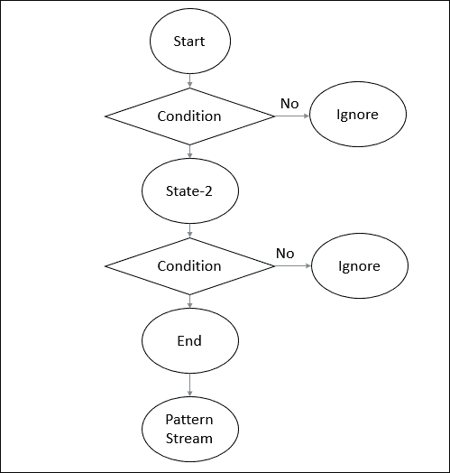
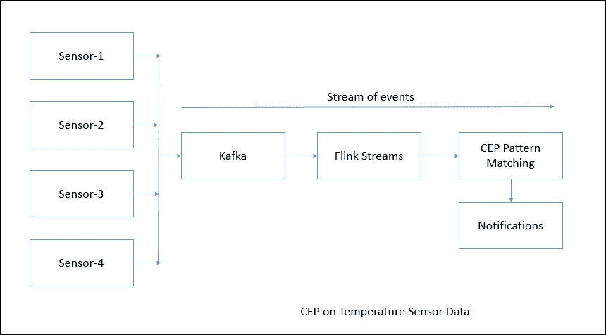

# 五、复杂事件处理

在前一章中，我们讨论了 Apache Flink 提供的 Table API，以及如何使用它来处理关系数据结构。从这一章开始，我们将开始学习更多关于 Apache Flink 提供的库，以及我们如何将它们用于特定的用例。首先，让我们试着理解一个名为**复杂事件处理** ( **CEP** )的库。CEP 是一个非常有趣但又复杂的话题，在各个行业都有其价值。只要有预期的事件流，人们自然希望在所有这样的用例中执行复杂的事件处理。让我们试着了解一下 CEP 到底是怎么回事。

# 什么是复杂事件处理？

CEP 分析以高频率和低延迟发生的不同事件流。如今，流媒体事件可以在各种行业中找到，例如:

*   在油气领域，传感器数据来自各种钻井工具或上游输油管道设备
*   在安全领域，活动数据、恶意软件信息和使用模式数据来自不同的端点
*   在可穿戴领域，数据来自各种腕带，这些腕带包含关于您的心率、活动等信息
*   在银行领域，数据来自信用卡使用、银行活动等

分析变化模式以实时了解常规装配中的任何变化是非常重要的。CEP 可以理解跨事件流、子事件流及其序列的模式。CEP 有助于识别不相关事件中有意义的模式和复杂的关系，并实时或接近实时地发送通知以防止损害:


上图显示了 CEP 流程的工作原理。尽管流程看起来很简单，但 CEP 具有各种能力，例如:

*   一旦输入事件流可用就产生结果的能力
*   提供计算的能力，例如两个感兴趣的事件之间随时间的聚合和超时
*   能够在检测到复杂事件模式时提供实时/接近实时的警报和通知
*   连接和关联异构源并分析其中模式的能力
*   实现高吞吐量、低延迟处理的能力

市场上有各种各样的解决方案。随着大数据技术的进步，我们有多个选项，如 Apache Spark、Apache Samza、Apache Beam 等，但没有一个专用库适合所有解决方案。现在让我们试着理解我们可以用 Flink 的 CEP 库实现什么。

# 快速拨号

Apache Flink 提供了 Flink CEP 库，该库提供了执行复杂事件处理的 API。该库由以下核心组件组成:

*   事件流
*   模式定义
*   模式检测
*   警报生成


Flink CEP 在 Flink 名为 DataStream 的流媒体应用编程接口上工作。程序员需要从事件流中定义要检测的模式，然后 Flink 的 CEP 引擎检测该模式并采取适当的措施，例如生成警报。

为了开始，我们需要添加以下 Maven 依赖项:

```scala
<!-- https://mvnrepository.com/artifact/org.apache.flink/flink-cep-scala_2.10 --> 
<dependency> 
    <groupId>org.apache.flink</groupId> 
    <artifactId>flink-cep-scala_2.11</artifactId> 
    <version>1.1.4</version> 
</dependency> 

```

## 事件流

CEP 的一个非常重要的组成部分是它的输入事件流。在前面的章节中，我们已经看到了数据流应用编程接口的细节。现在让我们用这些知识来实现 CEP。我们首先需要做的是为事件定义一个 Java POJO。假设我们需要监控温度传感器事件流。

首先我们定义一个抽象类，然后扩展这个类。

### 注

在定义事件 POJOs 时，我们需要确保实现`hashCode()`和`equals()`方法，因为在比较事件时，编译会利用它们。

下面的代码片段演示了这一点。

首先，我们编写一个抽象类，如下所示:

```scala
package com.demo.chapter05; 

public abstract class MonitoringEvent { 

  private String machineName; 

  public String getMachineName() { 
    return machineName; 
  } 

  public void setMachineName(String machineName) { 
    this.machineName = machineName; 
  } 

  @Override 
  public int hashCode() { 
    final int prime = 31; 
    int result = 1; 
    result = prime * result + ((machineName == null) ? 0 : machineName.hashCode()); 
    return result; 
  } 

  @Override 
  public boolean equals(Object obj) { 
    if (this == obj) 
      return true; 
    if (obj == null) 
      return false; 
    if (getClass() != obj.getClass()) 
      return false; 
    MonitoringEvent other = (MonitoringEvent) obj; 
    if (machineName == null) { 
      if (other.machineName != null) 
        return false; 
    } else if (!machineName.equals(other.machineName)) 
      return false; 
    return true; 
  } 

  public MonitoringEvent(String machineName) { 
    super(); 
    this.machineName = machineName; 
  } 

} 

```

然后，我们为实际温度事件创建一个 POJO:

```scala
package com.demo.chapter05; 

public class TemperatureEvent extends MonitoringEvent { 

  public TemperatureEvent(String machineName) { 
    super(machineName); 
  } 

  private double temperature; 

  public double getTemperature() { 
    return temperature; 
  } 

  public void setTemperature(double temperature) { 
    this.temperature = temperature; 
  } 

  @Override 
  public int hashCode() { 
    final int prime = 31; 
    int result = super.hashCode(); 
    long temp; 
    temp = Double.doubleToLongBits(temperature); 
    result = prime * result + (int) (temp ^ (temp >>> 32)); 
    return result; 
  } 

  @Override 
  public boolean equals(Object obj) { 
    if (this == obj) 
      return true; 
    if (!super.equals(obj)) 
      return false; 
    if (getClass() != obj.getClass()) 
      return false; 
    TemperatureEvent other = (TemperatureEvent) obj; 
    if (Double.doubleToLongBits(temperature) != Double.doubleToLongBits(other.temperature)) 
      return false; 
    return true; 
  } 

  public TemperatureEvent(String machineName, double temperature) { 
    super(machineName); 
    this.temperature = temperature; 
  } 

  @Override 
  public String toString() { 
    return "TemperatureEvent [getTemperature()=" + getTemperature() + ", getMachineName()=" + getMachineName() 
        + "]"; 
  } 

} 

```

现在我们可以如下定义事件源:

在 Java 中:

```scala
StreamExecutionEnvironment env = StreamExecutionEnvironment.getExecutionEnvironment(); 
    DataStream<TemperatureEvent> inputEventStream = env.fromElements(new TemperatureEvent("xyz", 22.0), 
        new TemperatureEvent("xyz", 20.1), new TemperatureEvent("xyz", 21.1), new TemperatureEvent("xyz", 22.2), 
        new TemperatureEvent("xyz", 22.1), new TemperatureEvent("xyz", 22.3), new TemperatureEvent("xyz", 22.1), 
        new TemperatureEvent("xyz", 22.4), new TemperatureEvent("xyz", 22.7), 
        new TemperatureEvent("xyz", 27.0)); 

```

在 Scala 中:

```scala
val env: StreamExecutionEnvironment = StreamExecutionEnvironment.getExecutionEnvironment 
    val input: DataStream[TemperatureEvent] = env.fromElements(new TemperatureEvent("xyz", 22.0), 
      new TemperatureEvent("xyz", 20.1), new TemperatureEvent("xyz", 21.1), new TemperatureEvent("xyz", 22.2), 
      new TemperatureEvent("xyz", 22.1), new TemperatureEvent("xyz", 22.3), new TemperatureEvent("xyz", 22.1), 
      new TemperatureEvent("xyz", 22.4), new TemperatureEvent("xyz", 22.7), 
      new TemperatureEvent("xyz", 27.0)) 

```

# 模式 API

模式应用编程接口允许您非常容易地定义复杂的事件模式。每个模式由多个状态组成。从一个状态到另一个状态，一般需要定义条件。条件可以是连续性或过滤掉的事件。



让我们试着详细理解每个模式操作。

## 开始

初始状态可以定义如下:

在 Java 中:

```scala
Pattern<Event, ?> start = Pattern.<Event>begin("start"); 

```

在 Scala 中:

```scala
val start : Pattern[Event, _] = Pattern.begin("start") 

```

## 过滤器

我们还可以指定初始状态的过滤条件:

在 Java 中:

```scala
start.where(new FilterFunction<Event>() { 
    @Override 
    public boolean filter(Event value) { 
        return ... // condition 
    } 
}); 

```

在 Scala 中:

```scala
start.where(event => ... /* condition */) 

```

## 亚型

我们还可以根据事件的子类型，使用`subtype()`方法过滤掉事件:

在 Java 中:

```scala
start.subtype(SubEvent.class).where(new FilterFunction<SubEvent>() { 
    @Override 
    public boolean filter(SubEvent value) { 
        return ... // condition 
    } 
}); 

```

在 Scala 中:

```scala
start.subtype(classOf[SubEvent]).where(subEvent => ... /* condition */) 

```

## 或

模式 API 还允许我们一起定义多个条件。我们可以使用`OR`和`AND`运算符。

在 Java 中:

```scala
pattern.where(new FilterFunction<Event>() { 
    @Override 
    public boolean filter(Event value) { 
        return ... // condition 
    } 
}).or(new FilterFunction<Event>() { 
    @Override 
    public boolean filter(Event value) { 
        return ... // or condition 
    } 
}); 

```

在 Scala 中:

```scala
pattern.where(event => ... /* condition */).or(event => ... /* or condition */) 

```

## 连续性

如前所述，我们并不总是需要过滤掉事件。总有一些模式我们需要连续性而不是过滤器。

连续性可以有两种类型——严格连续性和非严格连续性。

### 严格连续性

严格的连续性需要两个事件直接成功，这意味着中间不应该有其他事件。该模式可由`next()`定义。

在 Java 中:

```scala
Pattern<Event, ?> strictNext = start.next("middle"); 

```

在 Scala 中:

```scala
val strictNext: Pattern[Event, _] = start.next("middle") 

```

### 非严格连续性

非严格连续性可以表述为允许其他事件处于特定的两个事件之间。该模式可由`followedBy()`定义。

在 Java 中:

```scala
Pattern<Event, ?> nonStrictNext = start.followedBy("middle"); 

```

在 Scala 中:

```scala
val nonStrictNext : Pattern[Event, _] = start.followedBy("middle") 

```

## 以内

模式 API 还允许我们基于时间间隔进行模式匹配。我们可以如下定义基于时间的时间约束。

在 Java 中:

```scala
next.within(Time.seconds(30)); 

```

在 Scala 中:

```scala
next.within(Time.seconds(10)) 

```

## 检测模式

为了针对事件流检测模式，我们需要通过模式运行流。`CEP.pattern()`返回`PatternStream`。

下面的代码片段展示了我们如何检测一个模式。首先定义模式以检查温度值是否在`10`秒内大于`26.0`度。

在 Java 中:

```scala
Pattern<TemperatureEvent, ?> warningPattern = Pattern.<TemperatureEvent> begin("first") 
        .subtype(TemperatureEvent.class).where(new FilterFunction<TemperatureEvent>() { 
          public boolean filter(TemperatureEvent value) { 
            if (value.getTemperature() >= 26.0) { 
              return true; 
            } 
            return false; 
          } 
        }).within(Time.seconds(10)); 

    PatternStream<TemperatureEvent> patternStream = CEP.pattern(inputEventStream, warningPattern); 

```

在 Scala 中:

```scala
val env: StreamExecutionEnvironment = StreamExecutionEnvironment.getExecutionEnvironment 

val input = // data 

val pattern: Pattern[TempEvent, _] = Pattern.begin("start").where(event => event.temp >= 26.0) 

val patternStream: PatternStream[TempEvent] = CEP.pattern(input, pattern) 

```

## 从模式中选择

一旦模式流可用，我们需要从中选择模式，然后根据它采取适当的行动。我们可以使用`select`或`flatSelect`方法从模式中选择数据。

### 选择

选择方法需要`PatternSelectionFunction`实现。它有一个为每个事件序列调用的 select 方法。`select`方法接收匹配事件的字符串/事件对的映射。该字符串由状态的名称定义。`select`方法只返回一个结果。

为了收集结果，我们需要定义输出 POJO。在我们的例子中，假设我们需要生成警报作为输出。那么我们需要如下定义 POJO:

```scala
package com.demo.chapter05; 

public class Alert { 

  private String message; 

  public String getMessage() { 
    return message; 
  } 

  public void setMessage(String message) { 
    this.message = message; 
  } 

  public Alert(String message) { 
    super(); 
    this.message = message; 
  } 

  @Override 
  public String toString() { 
    return "Alert [message=" + message + "]"; 
  } 

  @Override 
  public int hashCode() { 
    final int prime = 31; 
    int result = 1; 
    result = prime * result + ((message == null) ? 0 :  
    message.hashCode()); 
    return result; 
  } 

  @Override 
  public boolean equals(Object obj) { 
    if (this == obj) 
      return true; 
    if (obj == null) 
      return false; 
    if (getClass() != obj.getClass()) 
      return false; 
    Alert other = (Alert) obj; 
    if (message == null) { 
      if (other.message != null) 
        return false; 
    } else if (!message.equals(other.message)) 
      return false; 
    return true; 
  } 

} 

```

接下来，我们定义选择函数。

在 Java 中:

```scala
class MyPatternSelectFunction<IN, OUT> implements PatternSelectFunction<IN, OUT> { 
    @Override 
    public OUT select(Map<String, IN> pattern) { 
        IN startEvent = pattern.get("start"); 
        IN endEvent = pattern.get("end"); 
        return new OUT(startEvent, endEvent); 
    } 
} 

```

在 Scala 中:

```scala
def selectFn(pattern : mutable.Map[String, IN]): OUT = { 
    val startEvent = pattern.get("start").get 
    val endEvent = pattern.get("end").get 
    OUT(startEvent, endEvent) 
} 

```

### 平面选择

`flatSelect`方法与`select`方法类似。两者唯一的区别是`flatSelect`可以返回任意数量的结果。`flatSelect`方法有一个附加的`Collector`参数，用于输出元素。

下面的例子展示了我们如何使用`flatSelect`方法。

在 Java 中:

```scala
class MyPatternFlatSelectFunction<IN, OUT> implements PatternFlatSelectFunction<IN, OUT> { 
    @Override 
    public void select(Map<String, IN> pattern, Collector<OUT> collector) { 
        IN startEvent = pattern.get("start"); 
        IN endEvent = pattern.get("end"); 

        for (int i = 0; i < startEvent.getValue(); i++ ) { 
            collector.collect(new OUT(startEvent, endEvent)); 
        } 
    } 
} 

```

在 Scala 中:

```scala
def flatSelectFn(pattern : mutable.Map[String, IN], collector : Collector[OUT]) = { 
    val startEvent = pattern.get("start").get 
    val endEvent = pattern.get("end").get 
    for (i <- 0 to startEvent.getValue) { 
        collector.collect(OUT(startEvent, endEvent)) 
    } 
} 

```

## 处理超时的部分模式

有时，如果我们用时间界限约束模式，我们可能会错过某些事件。事件可能会因为超过长度而被丢弃。为了对超时事件采取措施，`select`和`flatSelect`方法允许超时处理程序。为每个超时事件模式调用该处理程序。

在这种情况下，选择方法包含两个参数:`PatternSelectFunction`和`PatternTimeoutFunction`。超时功能的返回类型可以不同于选择模式功能。超时事件和选择事件包装在类`Either.Right`和`Either.Left`中。

下面的代码片段展示了我们如何在实践中做事。

在 Java 中:

```scala
PatternStream<Event> patternStream = CEP.pattern(input, pattern); 

DataStream<Either<TimeoutEvent, ComplexEvent>> result = patternStream.select( 
    new PatternTimeoutFunction<Event, TimeoutEvent>() {...}, 
    new PatternSelectFunction<Event, ComplexEvent>() {...} 
); 

DataStream<Either<TimeoutEvent, ComplexEvent>> flatResult = patternStream.flatSelect( 
    new PatternFlatTimeoutFunction<Event, TimeoutEvent>() {...}, 
    new PatternFlatSelectFunction<Event, ComplexEvent>() {...} 
);  

```

在 Scala 中，选择应用编程接口:

```scala
val patternStream: PatternStream[Event] = CEP.pattern(input, pattern) 

DataStream[Either[TimeoutEvent, ComplexEvent]] result = patternStream.select{ 
    (pattern: mutable.Map[String, Event], timestamp: Long) => TimeoutEvent() 
} { 
    pattern: mutable.Map[String, Event] => ComplexEvent() 
} 

```

使用`Collector`调用`flatSelect`应用编程接口，因为它可以发出任意数量的事件:

```scala
val patternStream: PatternStream[Event] = CEP.pattern(input, pattern) 

DataStream[Either[TimeoutEvent, ComplexEvent]] result = patternStream.flatSelect{ 
    (pattern: mutable.Map[String, Event], timestamp: Long, out: Collector[TimeoutEvent]) => 
        out.collect(TimeoutEvent()) 
} { 
    (pattern: mutable.Map[String, Event], out: Collector[ComplexEvent]) => 
        out.collect(ComplexEvent()) 
} 

```

# 温度传感器上的复杂事件处理用例

在前面的部分中，我们了解了 Flink CEP 引擎提供的各种功能。现在是时候了解我们如何在现实世界的解决方案中使用它了。为此，让我们假设我们为一家生产某些产品的机械公司工作。在产品工厂中，需要不断监控某些机器。工厂已经安装了传感器，可以在给定的时间持续发送机器的温度。

现在，我们将设置一个系统，不断监控温度值，并在温度超过某个值时生成警报。

我们可以使用以下体系结构:



这里我们将使用Kafka从传感器收集事件。为了编写一个 Java 应用程序，我们首先需要创建一个 Maven 项目，并添加以下依赖项:

```scala
  <!-- https://mvnrepository.com/artifact/org.apache.flink/flink-cep-scala_2.11 --> 
    <dependency> 
      <groupId>org.apache.flink</groupId> 
      <artifactId>flink-cep-scala_2.11</artifactId> 
      <version>1.1.4</version> 
    </dependency> 
    <!-- https://mvnrepository.com/artifact/org.apache.flink/flink- streaming-java_2.11 --> 
    <dependency> 
      <groupId>org.apache.flink</groupId> 
      <artifactId>flink-streaming-java_2.11</artifactId> 
      <version>1.1.4</version> 
    </dependency> 
    <!-- https://mvnrepository.com/artifact/org.apache.flink/flink- streaming-scala_2.11 --> 
    <dependency> 
      <groupId>org.apache.flink</groupId> 
      <artifactId>flink-streaming-scala_2.11</artifactId> 
      <version>1.1.4</version> 
    </dependency> 
    <dependency> 
      <groupId>org.apache.flink</groupId> 
      <artifactId>flink-connector-kafka-0.9_2.11</artifactId> 
      <version>1.1.4</version> 
    </dependency> 

```

接下来我们需要为使用Kafka做以下事情。

首先，我们需要定义一个自定义的Kafka解串器。这将从Kafka的主题中读取字节，并将其转换为`TemperatureEvent`。下面是这样做的代码。

`EventDeserializationSchema.java`:

```scala
package com.demo.chapter05; 

import java.io.IOException; 
import java.nio.charset.StandardCharsets; 

import org.apache.flink.api.common.typeinfo.TypeInformation; 
import org.apache.flink.api.java.typeutils.TypeExtractor; 
import org.apache.flink.streaming.util.serialization.DeserializationSchema; 

public class EventDeserializationSchema implements DeserializationSchema<TemperatureEvent> { 

  public TypeInformation<TemperatureEvent> getProducedType() { 
    return TypeExtractor.getForClass(TemperatureEvent.class); 
  } 

  public TemperatureEvent deserialize(byte[] arg0) throws IOException { 
    String str = new String(arg0, StandardCharsets.UTF_8); 

    String[] parts = str.split("="); 
    return new TemperatureEvent(parts[0], Double.parseDouble(parts[1])); 
  } 

  public boolean isEndOfStream(TemperatureEvent arg0) { 
    return false; 
  } 

} 

```

接下来，我们在Kafka中创造了名为`temperature`的话题:

```scala
bin/kafka-topics.sh --create --zookeeper localhost:2181 --replication-factor 1 --partitions 1 --topic temperature 

```

现在我们来看 Java 代码，它会在 Flink 流中监听这些事件:

```scala
StreamExecutionEnvironment env = StreamExecutionEnvironment.getExecutionEnvironment(); 

    Properties properties = new Properties(); 
    properties.setProperty("bootstrap.servers", "localhost:9092"); 
    properties.setProperty("group.id", "test"); 

DataStream<TemperatureEvent> inputEventStream = env.addSource( 
        new FlinkKafkaConsumer09<TemperatureEvent>("temperature", new EventDeserializationSchema(), properties)); 

```

接下来我们将定义模式来检查温度是否在`10`秒内高于`26.0`摄氏度:

```scala
Pattern<TemperatureEvent, ?> warningPattern = Pattern.<TemperatureEvent> begin("first").subtype(TemperatureEvent.class).where(new FilterFunction<TemperatureEvent>() { 
          private static final long serialVersionUID = 1L; 

          public boolean filter(TemperatureEvent value) { 
            if (value.getTemperature() >= 26.0) { 
              return true; 
            } 
            return false; 
          } 
        }).within(Time.seconds(10)); 

```

接下来，将该模式与事件流进行匹配，并选择事件。我们还会将警报消息添加到结果流中，如下所示:

```scala
DataStream<Alert> patternStream = CEP.pattern(inputEventStream, warningPattern) 
        .select(new PatternSelectFunction<TemperatureEvent, Alert>() { 
          private static final long serialVersionUID = 1L; 

          public Alert select(Map<String, TemperatureEvent> event) throws Exception { 

            return new Alert("Temperature Rise Detected:" + event.get("first").getTemperature() 
                + " on machine name:" + event.get("first").getMachineName()); 
          } 

}); 

```

为了了解生成了哪些警报，我们将打印结果:

```scala
patternStream.print(); 

```

我们执行数据流:

```scala
env.execute("CEP on Temperature Sensor"); 

```

现在我们都准备好执行应用程序了。当我们收到Kafka主题的信息时，文化教育会继续执行。

实际执行如下所示。以下是我们如何提供样本输入:

```scala
xyz=21.0 
xyz=30.0 
LogShaft=29.3 
Boiler=23.1 
Boiler=24.2 
Boiler=27.0 
Boiler=29.0 

```

以下是示例输出的外观:

```scala
Connected to JobManager at Actor[akka://flink/user/jobmanager_1#1010488393] 
10/09/2016 18:15:55  Job execution switched to status RUNNING. 
10/09/2016 18:15:55  Source: Custom Source(1/4) switched to SCHEDULED  
10/09/2016 18:15:55  Source: Custom Source(1/4) switched to DEPLOYING  
10/09/2016 18:15:55  Source: Custom Source(2/4) switched to SCHEDULED  
10/09/2016 18:15:55  Source: Custom Source(2/4) switched to DEPLOYING  
10/09/2016 18:15:55  Source: Custom Source(3/4) switched to SCHEDULED  
10/09/2016 18:15:55  Source: Custom Source(3/4) switched to DEPLOYING  
10/09/2016 18:15:55  Source: Custom Source(4/4) switched to SCHEDULED  
10/09/2016 18:15:55  Source: Custom Source(4/4) switched to DEPLOYING  
10/09/2016 18:15:55  CEPPatternOperator(1/1) switched to SCHEDULED  
10/09/2016 18:15:55  CEPPatternOperator(1/1) switched to DEPLOYING  
10/09/2016 18:15:55  Map -> Sink: Unnamed(1/4) switched to SCHEDULED  
10/09/2016 18:15:55  Map -> Sink: Unnamed(1/4) switched to DEPLOYING  
10/09/2016 18:15:55  Map -> Sink: Unnamed(2/4) switched to SCHEDULED  
10/09/2016 18:15:55  Map -> Sink: Unnamed(2/4) switched to DEPLOYING  
10/09/2016 18:15:55  Map -> Sink: Unnamed(3/4) switched to SCHEDULED  
10/09/2016 18:15:55  Map -> Sink: Unnamed(3/4) switched to DEPLOYING  
10/09/2016 18:15:55  Map -> Sink: Unnamed(4/4) switched to SCHEDULED  
10/09/2016 18:15:55  Map -> Sink: Unnamed(4/4) switched to DEPLOYING  
10/09/2016 18:15:55  Source: Custom Source(2/4) switched to RUNNING  
10/09/2016 18:15:55  Source: Custom Source(3/4) switched to RUNNING  
10/09/2016 18:15:55  Map -> Sink: Unnamed(1/4) switched to RUNNING  
10/09/2016 18:15:55  Map -> Sink: Unnamed(2/4) switched to RUNNING  
10/09/2016 18:15:55  Map -> Sink: Unnamed(3/4) switched to RUNNING  
10/09/2016 18:15:55  Source: Custom Source(4/4) switched to RUNNING  
10/09/2016 18:15:55  Source: Custom Source(1/4) switched to RUNNING  
10/09/2016 18:15:55  CEPPatternOperator(1/1) switched to RUNNING  
10/09/2016 18:15:55  Map -> Sink: Unnamed(4/4) switched to RUNNING  
1> Alert [message=Temperature Rise Detected:30.0 on machine name:xyz] 
2> Alert [message=Temperature Rise Detected:29.3 on machine name:LogShaft] 
3> Alert [message=Temperature Rise Detected:27.0 on machine name:Boiler] 
4> Alert [message=Temperature Rise Detected:29.0 on machine name:Boiler] 

```

我们还可以配置一个邮件客户端，并使用一些外部网络挂钩来发送电子邮件或信使通知。

### 注

应用程序的代码可以在 GitHub 上找到:[https://github.com/deshpandetanmay/mastering-flink](https://github.com/deshpandetanmay/mastering-flink)。

# 总结

在这一章中，我们学习了文化教育。我们讨论了所涉及的挑战以及如何使用 Flink CEP 库来解决 CEP 问题。我们还学习了模式应用编程接口以及我们可以用来定义模式的各种操作符。在最后一节中，我们试图将这些点连接起来，并看到一个完整的用例。经过一些更改，这种设置可以像在其他各种域中一样使用。

在下一章中，我们将看到如何使用 Flink 内置的机器学习库来解决复杂的问题。