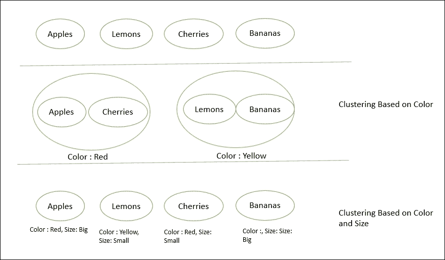
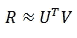
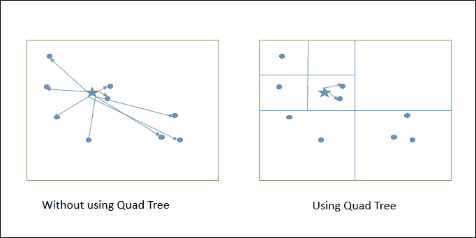

# 六、使用 FlinkML 的机器学习

在前一章中，我们讨论了如何使用 Flink CEP 库解决复杂的事件处理问题。在这一章中，我们将看到如何使用 Flink 的机器学习库进行机器学习，该库称为 FlinkML。FlinkML 由一组支持的算法组成，可以用来解决现实生活中的用例。在本章中，我们将了解 FlinkML 中有哪些算法，以及如何应用它们。

在深入研究 FlinkML 之前，让我们首先尝试了解基本的机器学习原理。

# 什么是机器学习？

机器学习是一个工程流，它使用数学来允许机器根据提供给它们的数据进行分类、预测、推荐等。这个领域很广，我们可以花几年时间来讨论它。但是为了保持我们的讨论集中，我们将只讨论这本书的范围需要什么。

从广义上讲，机器学习可以分为三大类:

*   监督学习
*   无监督学习
*   Semi supervised learning

    

上图显示了机器学习算法的广泛分类。现在让我们详细讨论这些。

## 监督学习

在监督学习中，我们通常会得到一个输入数据集，它是实际事件的历史记录。我们也被告知预期的输出应该是什么样子。使用历史数据，我们选择哪些因素对结果有贡献。这样的属性称为特征。使用历史数据，我们了解以前的结果是如何计算的，并将同样的理解应用于我们想要进行预测的数据。

监督学习可以再次细分为:

*   回归
*   分类

### 回归

在回归问题中，我们试图使用连续函数的输入来预测结果。回归意味着根据另一个变量的得分来预测一个变量的得分。我们将要预测的变量称为标准变量，我们将要进行预测的变量称为预测变量。可以有多个预测变量；在这种情况下，我们需要找到最佳拟合线，称为回归线。

### 注

你可以在[https://en.wikipedia.org/wiki/Regression_analysis](https://en.wikipedia.org/wiki/Regression_analysis)阅读更多关于回归的内容。

用于解决回归问题的一些非常常见的算法如下:

*   逻辑回归
*   决策树
*   支持向量机(SVM)
*   朴素贝叶斯
*   随机森林
*   线性回归
*   多项式回归

### 分类

在分类中，我们预测离散结果的输出。分类作为监督学习的一部分，也需要给出输入数据和样本输出。在这里，基于特征，我们尝试将结果分类到定义的类别集合中。例如，根据给定的特征，将人的记录分为男性或女性。或者，根据客户行为，预测他/她是否会购买产品。或者根据电子邮件内容和发件人，预测电子邮件是否是垃圾邮件。参考[https://en.wikipedia.org/wiki/Statistical_classification](https://en.wikipedia.org/wiki/Statistical_classification)。

为了理解回归和分类的区别，考虑股票数据的例子。回归算法可以帮助预测股票在未来几天的价值，而分类算法可以帮助决定是否购买股票。

## 无监督学习

无监督学习不会让我们知道我们的结果应该是什么样子。相反，它允许我们根据属性的特征对数据进行分组。我们根据记录之间的关系得出聚类。

与监督学习不同，我们无法进行验证来验证我们的结果，这意味着没有反馈方法来教我们做得对还是错。无监督学习主要基于聚类算法。

### 聚类

为了更容易理解聚类，我们来考虑一个例子；假设我们有 20，000 篇关于各种主题的新闻文章，我们必须根据它们的内容对它们进行分组。在这种情况下，我们可以使用聚类算法，将一组文章分组。

我们也可以考虑水果的基本例子。假设我们在一个水果篮子里有苹果、香蕉、柠檬和樱桃，我们需要把它们分成几组。如果我们看它们的颜色，我们可以把它们分成两组:

*   **红颜色组**:苹果和樱桃
*   **黄色组**:香蕉和柠檬

现在，我们可以根据另一个特性(其大小)进行更多分组:

*   **红色大码**:苹果
*   **红色小尺寸**:樱桃
*   **黄色大码**:香蕉
*   **黄色小尺寸**:柠檬

下图显示了集群的表示:



这样，通过观察更多的特征，我们也可以进行更多的聚类。这里，我们没有任何训练数据和要预测的变量，这与监督学习不同。我们唯一的任务是了解更多的特性，并根据输入对记录进行聚类。

以下是一些常用于聚类的算法:

*   k-均值聚类
*   分级聚类
*   隐马尔可夫模型

### 关联

关联问题更多的是学习，通过定义关联规则进行推荐。例如，关联规则可能指的是这样一种假设，即购买了 iPhone 的人更有可能购买 iPhone 外壳。

如今，许多零售公司使用这些算法来进行个性化推荐。比如在[www.amazon.com](http://www.amazon.com)上，如果我倾向于购买产品 *X* ，然后亚马逊也给我推荐产品 *Y* ，这两者之间一定有某种关联。

基于这些原理的一些算法如下:

*   Apriori 算法
*   Eclat 算法
*   FDP 增长算法

## 半监督学习

半监督学习是监督学习的一个子类，它考虑未标记的数据进行训练。一般来说，在训练时，它有大量的未标记数据，只有非常少量的标记数据。许多研究人员和机器学习实践者发现，当标记数据与未标记数据结合使用时，结果可能更准确。

### 注

关于半监督学习的更多细节可以在[https://en.wikipedia.org/wiki/Semi-supervised_learning](https://en.wikipedia.org/wiki/Semi-supervised_learning)找到。

# 敏捷 ML

FlinkML 是一个由 Flink 支持的算法集库，可以用来解决现实生活中的用例。算法的构建是为了利用 Flink 的分布式计算能力，轻松进行预测或聚类等。目前，只支持几组算法，但这个列表还在增长。

FlinkML 的构建重点是需要编写最少粘合代码的 ML 开发人员。粘合代码是帮助将各种组件绑定在一起的代码。FlinkML 的另一个目标是保持算法的简单使用。

Flink 利用内存中的数据流，本地执行迭代数据处理。FlinkML 允许数据科学家用数据子集在本地测试他们的模型，然后在更大的数据上以集群模式执行它们。

FlinkML 的灵感来自 scikit-learn 和 Spark 的 MLlib，它允许您干净地定义数据管道，并以分布式方式解决机器学习问题。

以下是 Flink 开发团队的目标路线图:

*   变压器和学习者管道
*   数据预处理:
    *   特征缩放
    *   多项式特征基映射器
    *   特征散列
    *   文本特征提取
    *   降维
*   型号选择和性能评估:
    *   使用各种评分函数的模型评估
    *   模型选择和评估的交叉验证
    *   超参数优化
*   监督学习:
    *   优化框架
    *   随机梯度下降
    *   L-BFGS(消歧义)
    *   广义线性模型
    *   多元线性回归
    *   拉索，岭回归
    *   多类逻辑回归
    *   随机森林
    *   支持向量机
    *   决策树
*   无监督学习:
    *   使聚集
    *   k-均值聚类
    *   主成分分析
*   建议:
    *   就像
*   文本分析:
    *   皱胃向左移
*   统计估计工具
*   分布式线性代数
*   流式毫升

突出显示的算法已经是现有 Flink 源代码的一部分。在下一节中，我们将看看如何在实践中使用它们。

# 支持的算法

要开始使用 FlinkML，我们首先需要添加以下 Maven 依赖项:

```scala
<!-- https://mvnrepository.com/artifact/org.apache.flink/flink-ml_2.11 --> 
<dependency> 
    <groupId>org.apache.flink</groupId> 
    <artifactId>flink-ml_2.11</artifactId> 
    <version>1.1.4</version> 
</dependency> 

```

现在让我们试着理解支持的算法以及如何使用它们。

## 监督学习

Flink 在监督学习类别中支持三种算法。它们如下:

*   支持向量机(SVM)
*   多元线性回归
*   优化框架

让我们开始一次了解一个。

### 支持向量机

**支持向量机** ( **支持向量机**)是监督学习模型，对解决分类和回归问题的数据进行分析。它有助于将对象分为一类或另一类。它是非概率线性分类。可以使用 SVM 的例子有很多，例如:

*   常规数据分类问题
*   文本和超文本分类问题
*   图像分类问题
*   生物和其他科学问题

Flink 基于使用通信高效的分布式双坐标上升算法的软余量来支持 SVM。

有关该算法的详细信息，请访问[https://ci . Apache . org/project/flink/flink-docs-release-1.2/dev/libs/ml/SVM . html # description](https://ci.apache.org/projects/flink/flink-docs-release-1.2/dev/libs/ml/svm.html#description)。

Flink 使用**随机对偶坐标上升** ( **SDCA** )来解决最小化问题。为了使这种算法在分布式环境中有效，Flink 使用了 CoCoA 算法，该算法计算本地数据块上的 SDCA，然后将其合并到全局状态中。

### 注

该算法的实现基于以下论文:[https://arxiv.org/pdf/1409.1458v2.pdf](https://arxiv.org/pdf/1409.1458v2.pdf)。

现在让我们看看如何使用这个算法解决现实生活中的问题。我们将以虹膜数据集([https://en.wikipedia.org/wiki/Iris_flower_data_set](https://en.wikipedia.org/wiki/Iris_flower_data_set))为例，它由决定虹膜种类的四个属性组成。以下是一些示例数据:

<colgroup><col> <col> <col> <col> <col></colgroup> 
| **萼片长度** | **萼片宽度** | **花瓣长度** | **花瓣宽度** | **物种** |
| Five point one | Three point five | One point four | Zero point two | one |
| Five point six | Two point nine | Three point six | One point three | Two |
| Five point eight | Two point seven | Five point one | One point nine | three |

这里，使用数字格式的类别作为 SVM 的输入非常重要:

<colgroup><col> <col></colgroup> 
| **物种代码** | **物种名称** |
| one | 伊里斯·濑户沙 |
| Two | 虹膜异色 |
| three | 弗吉尼亚 Iris |

在将数据用于 Flink 的 SVM 算法之前，我们还需要做的一件事是将这些 CSV 数据转换为 LibSVM 数据。

### 注

LibSVM 数据是一种用于指定 SVM 数据集的特殊格式。更多关于 LibSVM 的信息可在[https://www.csie.ntu.edu.tw/~cjlin/libsvmtools/datasets/](https://www.csie.ntu.edu.tw/~cjlin/libsvmtools/datasets/)获得。

要将 CSV 数据转换为 LibSVM 数据，我们将使用一些开源 Python 代码，这些代码可在[https://github . com/zygmuntz/phrag/blob/master/csv2libsvm . py](https://github.com/zygmuntz/phraug/blob/master/csv2libsvm.py)上获得。

要将 CSV 转换为 LibSVM，我们需要执行以下命令:

```scala
    csv2libsvm.py <input file> <output file> [<label index = 0>] [<skip 
    headers = 0>]

```

现在让我们开始编写程序:

```scala
package com.demo.chapter06 

import org.apache.flink.api.scala._ 
import org.apache.flink.ml.math.Vector 
import org.apache.flink.ml.common.LabeledVector 
import org.apache.flink.ml.classification.SVM 
import org.apache.flink.ml.RichExecutionEnvironment 

object MySVMApp { 
  def main(args: Array[String]) { 
    // set up the execution environment 
    val pathToTrainingFile: String = "iris-train.txt" 
    val pathToTestingFile: String = "iris-train.txt" 
    val env = ExecutionEnvironment.getExecutionEnvironment 

    // Read the training dataset, from a LibSVM formatted file 
    val trainingDS: DataSet[LabeledVector] = 
    env.readLibSVM(pathToTrainingFile) 

    // Create the SVM learner 
    val svm = SVM() 
      .setBlocks(10) 

    // Learn the SVM model 
    svm.fit(trainingDS) 

    // Read the testing dataset 
    val testingDS: DataSet[Vector] = 
    env.readLibSVM(pathToTestingFile).map(_.vector) 

    // Calculate the predictions for the testing dataset 
    val predictionDS: DataSet[(Vector, Double)] = 
    svm.predict(testingDS) 
    predictionDS.writeAsText("out") 

    env.execute("Flink SVM App") 
  } 
} 

```

所以，现在我们都设置好运行程序了，您将在输出文件夹中看到预测的输出。

以下是代码:

```scala
(SparseVector((0,5.1), (1,3.5), (2,1.4), (3,0.2)),1.0) 
(SparseVector((0,4.9), (1,3.0), (2,1.4), (3,0.2)),1.0) 
(SparseVector((0,4.7), (1,3.2), (2,1.3), (3,0.2)),1.0) 
(SparseVector((0,4.6), (1,3.1), (2,1.5), (3,0.2)),1.0) 
(SparseVector((0,5.0), (1,3.6), (2,1.4), (3,0.2)),1.0) 
(SparseVector((0,5.4), (1,3.9), (2,1.7), (3,0.4)),1.0) 
(SparseVector((0,4.6), (1,3.4), (2,1.4), (3,0.3)),1.0) 
(SparseVector((0,5.0), (1,3.4), (2,1.5), (3,0.2)),1.0) 
(SparseVector((0,4.4), (1,2.9), (2,1.4), (3,0.2)),1.0) 
(SparseVector((0,4.9), (1,3.1), (2,1.5), (3,0.1)),1.0) 
(SparseVector((0,5.4), (1,3.7), (2,1.5), (3,0.2)),1.0) 
(SparseVector((0,4.8), (1,3.4), (2,1.6), (3,0.2)),1.0) 
(SparseVector((0,4.8), (1,3.0), (2,1.4), (3,0.1)),1.0) 

```

我们还可以通过设置各种参数来微调结果:

<colgroup><col> <col></colgroup> 
| **参数** | **描述** |
| `Blocks` | 设置输入数据将被分割成的块数。理想的情况是将这个数字设置为您想要实现的并行度。在每个区块上，进行局部随机双坐标上升。默认值为`None`。 |
| `Iterations` | 设置外环方法的迭代次数，例如，SDCA 方法应该应用于阻塞数据的时间量。默认值为`10`。 |
| `LocalIterations` | 定义需要在本地执行的最大 SDCA 迭代次数。默认值为`10`。 |
| `Regularization` | 设置算法的正则化常数。设置的值越高，加权向量的 2 范数越小。默认值为`1`。 |
| `StepSize` | 定义权重向量更新的初始步长。该值需要设置，以防算法变得不稳定。默认值为`1.0`。 |
| `ThresholdValue` | 定义决策函数的极限值。默认值为`0.0`。 |
| `OutputDecisionFunction` | 将此设置为 true 将返回每个示例的超平面距离。将其设置为 false 将返回二进制标签。 |
| `Seed` | 设置随机长整数。这将用于初始化随机数生成器。 |

### 多元线性回归

**多元线性回归** ( **MLR** )是简单线性回归的扩展，其中使用多个自变量( *X* )来确定单个自变量( *Y* )。预测值是输入变量的线性变换，使得观测值和预测值的方差之和最小。

MLR 试图通过拟合一个线性方程来模拟多个解释变量和响应变量之间的关系。

### 注

关于 MLR 更详细的解释可以在这个链接[http://www.stat.yale.edu/Courses/1997-98/101/linmult.htm](http://www.stat.yale.edu/Courses/1997-98/101/linmult.htm)找到。

让我们现在尝试使用 MLR 解决 Iris 数据集的相同分类问题。首先，我们需要训练数据集，我们可以在其上训练我们的模式。

在这里，我们将使用与上一节中使用的 SVM 相同的数据文件。所以现在我们有`iris-train.txt`和`iris-test.txt`转换成 LibSVM 格式。

以下代码片段显示了如何使用 MLR:

```scala
package com.demo.flink.ml 

import org.apache.flink.api.scala._ 
import org.apache.flink.ml._ 
import org.apache.flink.ml.common.LabeledVector 
import org.apache.flink.ml.math.DenseVector 
import org.apache.flink.ml.math.Vector 
import org.apache.flink.ml.preprocessing.Splitter 
import org.apache.flink.ml.regression.MultipleLinearRegression 

object MLRJob { 
  def main(args: Array[String]) { 
    // set up the execution environment 
    val env = ExecutionEnvironment.getExecutionEnvironment 
    val trainingDataset = MLUtils.readLibSVM(env, "iris-train.txt") 
    val testingDataset = MLUtils.readLibSVM(env, "iris-test.txt").map { 
    lv => lv.vector } 
    val mlr = MultipleLinearRegression() 
      .setStepsize(1.0) 
      .setIterations(5) 
      .setConvergenceThreshold(0.001) 

    mlr.fit(trainingDataset) 

    // The fitted model can now be used to make predictions 
    val predictions = mlr.predict(testingDataset) 

    predictions.print() 

  } 
} 

```

完整的代码和数据文件可在[https://github . com/deshandeltanmay/mastering-flink/tree/master/chapter 06](https://github.com/deshpandetanmay/mastering-flink/tree/master/chapter06)上下载。我们还可以通过设置各种参数来微调结果:

<colgroup><col> <col></colgroup> 
| **参数** | **描述** |
| `Iterations` | 设置最大迭代次数。默认值为`10`。 |
| `Stepsize` | 梯度下降法的步长。该值控制梯度下降方法可以在相反方向移动多远。调整此参数对于获得更好的结果非常重要。默认值为`0.1`。 |
| `Convergencethreshold` | 迭代停止前残差平方和相对变化的阈值。默认值为`None`。 |
| `Learningratemethod` | `Learningratemethod`用于计算每次迭代的学习速率。 |

### 优化框架

Flink 中的优化框架是一个开发者友好的包，可以用来解决优化问题。这不是解决精确问题的具体算法，但却是每一个机器学习问题的基础。

一般来说，这是关于找到模型，一组参数，一个最小化函数。FlinkML 支持**随机梯度下降** ( **SGD** )，具有以下类型的正则化:

<colgroup><col> <col></colgroup> 
| **正则化函数** | **类名** |
| L1 正则化 | `GradientDescentL1` |
| L2 正则化 | `GradientDescentL2` |
| 没有正规化 | `SimpleGradient` |

下面的代码片段显示了如何使用 FlinkML 使用 SGD:

```scala
// Create SGD solver 
val sgd = GradientDescentL1() 
  .setLossFunction(SquaredLoss()) 
  .setRegularizationConstant(0.2) 
  .setIterations(100) 
  .setLearningRate(0.01) 
  .setLearningRateMethod(LearningRateMethod.Xu(-0.75)) 

// Obtain data 
val trainingDS: DataSet[LabeledVector] = ... 

// Optimize the weights, according to the provided data 
val weightDS = sgd.optimize(trainingDS) 

```

我们还可以使用参数来微调算法:

<colgroup><col> <col></colgroup> 
| **参数** | **描述** |
| `LossFunction` | Flink 支持以下损耗功能:

*   平方损失
*   铰链损失
*   物流损失
*   默认为`None`

 |
| `RegularizationConstant` | 要应用的正则化权重。默认值为`0.1`。 |
| `Iterations` | 要执行的最大迭代次数。默认为`10`。 |
| `ConvergenceThreshold` | 迭代停止前残差平方和相对变化的阈值。默认值为`None`。 |
| `LearningRateMethod` | 该方法用于计算每次迭代的学习速率。 |
| `LearningRate` | 这是梯度下降法的初始学习率。 |
| `Decay` | 默认值为`0.0`。 |

## 建议

推荐引擎是最有趣和最常用的机器学习技术之一，用于提供基于用户和基于项目的推荐。亚马逊等电子商务公司使用推荐引擎根据购买模式个性化推荐，并审核客户的评级。

Flink 还支持基于 ALS 的建议。让我们更详细地看看 ALS。

### 交替最小二乘法

**交替最小二乘** ( **ALS** )算法将给定矩阵 *R* 分解为两个因子 *U* 和 *V* ，从而

为了更好地理解该算法的应用，让我们假设我们有一个数据集，该数据集包含由用户 *u* 为图书 *b* 提供的评级 *r* 。

下面是一个示例数据格式(`user_id`、`book_id`、`rating)`:

```scala
1  10 1 
1  11 2 
1  12 5 
1  13 5 
1  14 5 
1  15 4 
1  16 5 
1  17 1 
1  18 5 
2  10 1 
2  11 2 
2  15 5 
2  16 4.5 
2  17 1 
2  18 5 
3  11 2.5 
3  12 4.5 
3  13 4 
3  14 3 
3  15 3.5 
3  16 4.5 
3  17 4 
3  18 5 
4  10 5 
4  11 5 
4  12 5 
4  13 0 
4  14 2 
4  15 3 
4  16 1 
4  17 4 
4  18 1 

```

现在，我们可以将这些信息输入到 ALS 算法中，并开始从中获得推荐。以下是使用 ALS 的代码片段:

```scala
package com.demo.chapter06 

import org.apache.flink.api.scala._ 
import org.apache.flink.ml.recommendation._ 
import org.apache.flink.ml.common.ParameterMap 

object MyALSApp { 
  def main(args: Array[String]): Unit = { 

    val env = ExecutionEnvironment.getExecutionEnvironment 
    val inputDS: DataSet[(Int, Int, Double)] = env.readCsvFile[(Int,  
    Int, Double)]("input.csv") 

    // Setup the ALS learner 
    val als = ALS() 
      .setIterations(10) 
      .setNumFactors(10) 
      .setBlocks(100) 
      .setTemporaryPath("tmp") 

    // Set the other parameters via a parameter map 
    val parameters = ParameterMap() 
      .add(ALS.Lambda, 0.9) 
      .add(ALS.Seed, 42L) 

    // Calculate the factorization 
    als.fit(inputDS, parameters) 

    // Read the testing dataset from a csv file 
    val testingDS: DataSet[(Int, Int)] = env.readCsvFile[(Int, Int)]   
    ("test-data.csv") 

    // Calculate the ratings according to the matrix factorization 
    val predictedRatings = als.predict(testingDS) 

    predictedRatings.writeAsCsv("output") 

    env.execute("Flink Recommendation App") 
  } 
} 

```

一旦您执行了应用程序，您将获得推荐的结果。与其他算法一样，您可以微调参数以获得更好的结果:

<colgroup><col> <col></colgroup> 
| **参数** | **描述** |
| `NumFactors` | 用于基础模型的潜在因素的数量。默认值为`10`。 |
| `Lambda` | 这是一个正则化因子；我们可以调整这个参数以获得更好的结果。默认为`1`。 |
| `Iterations` | 要执行的最大迭代次数。默认为`10`。 |
| `Blocks` | 用户和项目矩阵分组的块数。块越少，冗余发送的数据就越少。默认值为`None`。 |
| `Seed` | 启动项目矩阵生成器的种子值。默认为`0`。 |
| `TemporaryPath` | 这是用于存储中间结果的路径。 |

## 无监督学习

现在让我们试着理解 FinkML 为无监督学习提供了什么。目前，它只支持一种算法，称为 k 近邻连接算法。

### k 最近邻加入

**k 最近邻** ( **kNN** )算法旨在为另一个数据集中的每个对象从一个数据集中找到 k 最近邻。它是许多数据挖掘算法中使用最广泛的解决方案之一。kNN 是一个昂贵的操作，因为它是寻找 k 个最近的邻居和执行连接的组合。考虑到数据量，在一台集中的机器上执行这个操作是非常困难的，因此拥有可以在分布式体系结构上工作的解决方案总是好的。FlinkML 算法在分布式环境中提供 kNN。

### 注

描述分布式环境下 kNN 实现的研究论文可以在这里找到:[https://arxiv.org/pdf/1207.0141v1.pdf](https://arxiv.org/pdf/1207.0141v1.pdf)。

这里的想法是计算每个训练点和测试点之间的距离，然后为给定点找到最近的点。计算每个点之间的距离是一项耗时的活动，在 Flink 中通过实现四叉树来缓解这一问题。

使用四叉树通过对数据集进行分区来减少计算量。这仅将计算减少到数据子集。下图显示了使用和不使用四叉树的计算:



你可以在这里找到关于使用四叉树计算最近邻居的详细讨论:[http://danielblazevski . github . io/assets/player/keynote dhtmlplayer . html](http://danielblazevski.github.io/assets/player/KeynoteDHTMLPlayer.html)。

四叉树并不总是表现得更好。如果数据是空间数据，四叉树可能是最差的选择。但是作为一个开发人员，我们不需要担心它，因为 FlinkML 会根据可用的数据来决定是否使用四叉树。

下面的代码片段显示了如何在 FlinkML 中使用 kNN 连接:

```scala
import org.apache.flink.api.common.operators.base.CrossOperatorBase.CrossHint 
import org.apache.flink.api.scala._ 
import org.apache.flink.ml.nn.KNN 
import org.apache.flink.ml.math.Vector 
import org.apache.flink.ml.metrics.distances.SquaredEuclideanDistanceMetric 

val env = ExecutionEnvironment.getExecutionEnvironment 

// prepare data 
val trainingSet: DataSet[Vector] = ... 
val testingSet: DataSet[Vector] = ... 

val knn = KNN() 
  .setK(3) 
  .setBlocks(10) 
  .setDistanceMetric(SquaredEuclideanDistanceMetric()) 
  .setUseQuadTree(false) 
  .setSizeHint(CrossHint.SECOND_IS_SMALL) 

// run knn join 
knn.fit(trainingSet) 
val result = knn.predict(testingSet).collect() 

```

以下是我们可以用来微调结果的一些参数:

<colgroup><col> <col></colgroup> 
| **参数** | **描述** |
| `K` | 要搜索的最近邻居的数量。默认为`5`。 |
| `DistanceMetric` | 设置用于计算两点之间距离的距离度量。默认情况下，使用欧几里德距离度量。 |
| `Blocks` | 输入数据应分割成的块数。理想的情况是将该数值设置为平行度。 |
| `UseQuadTree` | 设置是否使用四叉树进行处理。默认值为`None`。如果没有指定任何内容，算法将自行决定。 |

## 公用事业

FlinkML 支持各种可扩展的实用程序，在进行数据分析和预测时非常方便。一个这样的效用是距离度量。Flink 支持一组可以使用的距离度量。以下链接显示了 Flink 支持的距离度量:[https://ci . Apache . org/project/Flink/Flink-docs-release-1.2/dev/libs/ml/distance _ metrics . html](https://ci.apache.org/projects/flink/flink-docs-release-1.2/dev/libs/ml/distance_metrics.html)。

如果前面提到的任何算法都不能满足您的需求，您可以考虑编写自己的自定义距离算法。下面的代码片段展示了如何做到这一点:

```scala
class MyDistance extends DistanceMetric { 
  override def distance(a: Vector, b: Vector) = ... // your implementation  
} 

object MyDistance { 
  def apply() = new MyDistance() 
} 

val myMetric = MyDistance() 

```

使用距离度量的一个很好的应用是 kNN 连接算法，您可以在其中设置要使用的距离度量。

另一个重要的实用程序是`Splitter`，可以用于交叉验证。在某些情况下，我们可能没有测试数据集来验证我们的结果。在这种情况下，我们可以使用`Splitter`分割训练数据集。

以下是一个例子:

```scala
// A Simple Train-Test-Split 
val dataTrainTest: TrainTestDataSet = Splitter.trainTestSplit(data, 0.6, true) 

```

在前面的例子中，我们将训练数据集分为 60%和 40%的实际数据。

还有一种方法可以得到更好的结果，叫做`TrainTestHoldout`分裂。这里，我们使用一部分数据进行训练，一部分用于测试，另一部分用于最终结果验证。下面的代码片段展示了如何做到这一点:

```scala
// Create a train test holdout DataSet 
val dataTrainTestHO: trainTestHoldoutDataSet = Splitter.trainTestHoldoutSplit(data, Array(6.0, 3.0, 1.0)) 

```

我们可以使用另一种策略，称为 K 折叠拆分。该方法将训练集拆分为 *k* 个大小相等的折叠。这里，为每个文件夹创建一个算法，然后根据其测试集进行验证。下面的代码显示了如何进行 k 折叠拆分:

```scala
// Create an Array of K TrainTestDataSets 
val dataKFolded: Array[TrainTestDataSet] =  Splitter.kFoldSplit(data, 10) 

```

我们也可以使用**多随机拆分**；在这里，我们可以指定要创建多少数据集以及原始数据集的哪一部分:

```scala
// create an array of 5 datasets of 1 of 50%, and 5 of 10% each  
val dataMultiRandom: Array[DataSet[T]] = Splitter.multiRandomSplit(data, Array(0.5, 0.1, 0.1, 0.1, 0.1)) 

```

## 数据预处理和管道

Flink 支持 Python scikit-learn 风格的管道。FlinkML 中的一个管道的特点是一次性链接多个转换器和预测器。总的来说，许多数据科学家希望看到并轻松构建机器学习应用程序的流程。Flink 允许他们使用管道的概念这样做。

一般来说，ML 管道有三个构造块:

*   **估计器:**估计器使用`fit`方法执行模型的实际训练。例如，在线性回归模型中寻找正确的权重。
*   **Transformer:** Transformer 顾名思义有一个`transform`方法，可以帮助缩放输入。
*   **预测器:**预测器具有`predict`方法，该方法应用生成预测的算法，例如，SVM 或 MLR。

流水线是由估计器、转换器和预测器组成的链。预测器是管道的末端，在那之后没有什么可以被链接。

Flink 支持各种数据预处理工具，可以帮助我们提高结果。让我们开始了解细节。

### 多项式特征

多项式特征是将向量映射到次数为 *d* 的多项式特征空间的变换器。多项式特征通过改变函数的图形来帮助解决分类问题。让我们试着通过一个例子来理解这一点:

*   考虑一个线性公式: *F(x，y)= 1 * x+2 * y；*
*   假设我们有两个观察结果:
    *   *x=12* 和 *y=2*
    *   *x=5* 和 *y =5.5*

在这两种情况下，我们得到 *f() = 16* 。如果这些观察属于两个不同的类别，那么我们就不能区分这两者。现在如果我们再添加一个名为 *z* 的特性，它是前面两个特性 *z = x+y* 的组合。

所以现在 *f(x，y，z) = 1*x + 2*y + 3*z*

同样的观察结果是

*   *(1*12)+ (2*2) + (3*24) = 88*
*   *(1 * 5)+(2 * 5.5)+(3 * 27.5)= 98.5*

这样，使用现有功能添加新功能可以帮助我们获得更好的结果。Flink 多项式特性允许我们对预构建函数做同样的事情。

为了在 Flink 中使用多项式特征，我们有以下代码:

```scala
val polyFeatures = PolynomialFeatures() 
      .setDegree(3) 

```

### 标准定标器

标准定标器有助于使用用户指定的均值和方差来定标输入数据。如果用户未指定任何值，则默认平均值为`0`，标准偏差为`1`。标准定标器是有`fit`和`transform`方法的变压器。

首先，我们需要定义均值和标准差的值，如下面的代码片段所示:

```scala
  val scaler = StandardScaler() 
      .setMean(10.0) 
      .setStd(2.0) 

```

接下来，我们需要让它了解训练数据集的均值和标准差，如下面的代码片段所示:

```scala
scaler.fit(trainingDataset)
```

最后，我们使用用户定义的平均值和标准差来缩放提供的数据，如下面的代码片段所示:

```scala
val scaledDS = scaler.transform(trainingDataset)
```

现在我们可以使用这个缩放的输入数据来做进一步的转换和分析。

### 最小-最大刻度线

最小最大缩放器类似于标准缩放器，但唯一的区别是它确保每个特征的缩放位于用户定义的`min`和`max`值之间。

下面的代码片段显示了如何使用它:

```scala
val minMaxscaler = MinMaxScaler()
.setMin(1.0)
.setMax(3.0)
minMaxscaler.fit(trainingDataset)
val scaledDS = minMaxscaler.transform(trainingDataset)
```

因此，我们可以使用这些数据预处理操作来增强结果。这些也可以在管道中组合以创建工作流。

下面的代码片段显示了如何在管道中使用这些数据预处理操作:

```scala
// Create pipeline PolynomialFeatures -> MultipleLinearRegression
val pipeline = polyFeatures.chainPredictor(mlr)
// train the model
pipeline.fit(scaledDS)
// The fitted model can now be used to make predictions
val predictions = pipeline.predict(testingDataset)
predictions.print()
```

完整的代码可在 GitHub 上的[https://GitHub . com/deshandeltanmay/mastering-flink/tree/master/chapter 06](https://github.com/deshpandetanmay/mastering-flink/tree/master/chapter06)获得。

# 总结

在本章中，我们学习了不同类型的机器学习算法。我们看了各种有监督和无监督的算法，以及它们各自的例子。我们还查看了 FlinkML 提供的各种实用程序，这些程序在数据分析过程中非常方便。后来我们研究了数据预处理操作以及如何在管道中使用它们。

在下一章中，我们将看看 Flink 的图处理能力。