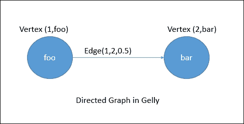
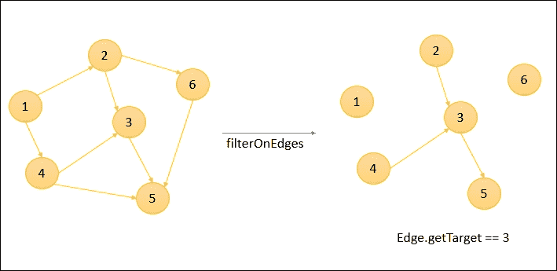
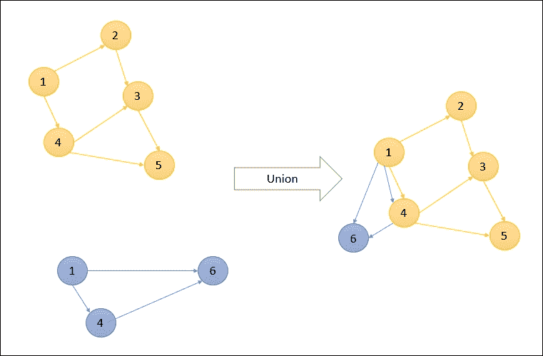

# 第七章。弗林克图形应用编程接口-盖利

我们生活在社交媒体时代，每个人都通过某种方式相互联系。每一个物体都与另一个物体有关系。脸书和推特就是社交图的绝佳例子，其中 *x* 是 *y* 的好友， *p* 跟在 *q* 后面，以此类推。这些图表如此之大，我们需要一个能有效处理它们的引擎。如果我们被这样的图表所包围，那么对它们进行分析是非常重要的，这样才能对它们之间的关系和下一级关系有更多的了解。

市场上有各种各样的技术可以帮助我们分析这样的图形，比如 Titan 和 Neo4J 这样的图形数据库，Spark GraphX 和 Flink Gelly 这样的图形处理库等等。在本章中，我们将了解图形的细节，以及如何使用 Flink Gelly 分析图形数据。

让我们开始吧。

# 什么是图形？

在计算机科学领域，图形是表示对象之间关系的一种手段。它由一组通过边连接的顶点组成。**顶点**是平面上的对象，由坐标或一些唯一的 id/名称来标识，而**边**是具有特定权重或关系的顶点之间的连接。图可以是有向的，也可以是无向的。在有向图中，边从一个顶点指向另一个顶点，而无向图中的边没有方向。

下图显示了有向图的基本表示:


图结构可以用于各种目的，例如寻找到某个目的地的最短路径，或者它可以用于找出某些顶点之间的关系程度，或者它可以用于找出最近的邻居。

现在让我们深入研究弗林克的图形应用编程接口——盖利。

# 弗林克图 API -盖利

Flink 提供了一个名为 Gelly 的图形处理库，以简化图形分析的开发。它提供了存储和表示图形数据的数据结构，并提供了分析图形的方法。在 Gelly 中，我们可以使用 Flink 的高级函数将图形从一种状态转换为另一种状态。它还提供了一套用于详细图形分析的算法。

Gelly 目前作为 Flink 库的一部分可用，因此我们需要在程序中添加一个 Maven 依赖项来使用它。

Java 依赖项:

```scala
<dependency> 
    <groupId>org.apache.flink</groupId> 
    <artifactId>flink-gelly_2.11</artifactId> 
    <version>1.1.4</version> 
</dependency> 

```

Scala 依赖关系:

```scala
<dependency> 
    <groupId>org.apache.flink</groupId> 
    <artifactId>flink-gelly-scala_2.11</artifactId> 
    <version>1.1.4</version> 
</dependency> 

```

现在让我们看看为了有效地使用 Gelly，我们有哪些选择。

## 图形表示

在 Gelly 中，图被表示为节点数据集和边数据集。

### 图形节点

图形节点由`Vertex`数据类型表示。一个`Vertex`数据类型由一个唯一标识和一个可选值组成。一个唯一的标识应该实现一个可比较的接口，因为在进行图形处理时，我们通过它们的标识来比较节点。`Vertex`可以有值，也可以有空值。空值顶点由类型`NullValue`定义。

以下代码片段显示了如何创建节点:

在 Java 中:

```scala
// A vertex with a Long ID and a String value 
Vertex<Long, String> v = new Vertex<Long, String>(1L, "foo"); 

// A vertex with a Long ID and no value 
Vertex<Long, NullValue> v = new Vertex<Long, NullValue>(1L, NullValue.getInstance()); 

```

在 Scala 中:

```scala
// A vertex with a Long ID and a String value 
val v = new Vertex(1L, "foo") 

// A vertex with a Long ID and no value 
val v = new Vertex(1L, NullValue.getInstance()) 

```

### 图形边缘

类似地，边可以由类型`Edge`定义。`Edge`有一个源节点标识、一个目的节点标识和一个可选值。该值表示关系的程度或权重。源和目标标识必须是同一类型。没有值的边可以使用`NullValue`定义。

以下代码片段显示了 Java 和 Scala 中的`Edge`定义:

在 Java 中:

```scala
// Edge connecting Vertices with Ids 1 and 2 having weight 0.5 

Edge<Long, Double> e = new Edge<Long, Double>(1L, 2L, 0.5); 

Double weight = e.getValue(); // weight = 0.5 

```

在 Scala 中:

```scala
// Edge connecting Vertices with Ids 1 and 2 having weight 0.5 

val e = new Edge(1L, 2L, 0.5) 

val weight = e.getValue // weight = 0.5 

```

在盖里，一个图总是从一个源指向一个目的顶点。为了显示无向图，我们应该添加另一条边来表示从目的地到源和返回的连接。

以下代码片段表示 Gelly 中的有向图:

在 Java 中:

```scala
// A vertex with a Long ID and a String value 
Vertex<Long, String> v1 = new Vertex<Long, String>(1L, "foo"); 

// A vertex with a Long ID and a String value 
Vertex<Long, String> v2 = new Vertex<Long, String>(2L, "bar"); 

// Edge connecting Vertices with Ids 1 and 2 having weight 0.5 

Edge<Long, Double> e = new Edge<Long, Double>(1L, 2L, 0.5); 

```

在 Scala 中:

```scala
// A vertex with a Long ID and a String value 
val v1 = new Vertex(1L, "foo") 

// A vertex with a Long ID and a String value 
val v2 = new Vertex(1L, "bar") 

// Edge connecting Vertices with Ids 1 and 2 having weight 0.5 

val e = new Edge(1L, 2L, 0.5) 

```

下面是它的可视化表示:



下面的代码片段表示 Gelly 中无向图的顶点和边定义:

在 Java 中:

```scala
// A vertex with a Long ID and a String value 
Vertex<Long, String> v1 = new Vertex<Long, String>(1L, "foo"); 

// A vertex with a Long ID and a String value 
Vertex<Long, String> v2 = new Vertex<Long, String>(2L, "bar"); 

// Edges connecting Vertices with Ids 1 and 2 having weight 0.5 

Edge<Long, Double> e1 = new Edge<Long, Double>(1L, 2L, 0.5); 

Edge<Long, Double> e2 = new Edge<Long, Double>(2L, 1L, 0.5); 

```

在 Scala 中:

```scala
// A vertex with a Long ID and a String value 
val v1 = new Vertex(1L, "foo") 

// A vertex with a Long ID and a String value 
val v2 = new Vertex(1L, "bar") 

// Edges connecting Vertices with Ids 1 and 2 having weight 0.5 

val e1 = new Edge(1L, 2L, 0.5) 

val e2 = new Edge(2L, 1L, 0.5) 

```

下面是它的可视化表示:


## 图形创建

在 Flink Gelly 中，可以通过多种方式创建图表。以下是一些例子。

### 来自边和顶点的数据集

以下代码片段表示我们如何使用边和可选顶点的数据集创建图形:

在 Java 中:

```scala
ExecutionEnvironment env = ExecutionEnvironment.getExecutionEnvironment(); 

DataSet<Vertex<String, Long>> vertices = ... 

DataSet<Edge<String, Double>> edges = ... 

Graph<String, Long, Double> graph = Graph.fromDataSet(vertices, edges, env); 

```

在 Scala 中:

```scala
val env = ExecutionEnvironment.getExecutionEnvironment 

val vertices: DataSet[Vertex[String, Long]] = ... 

val edges: DataSet[Edge[String, Double]] = ... 

val graph = Graph.fromDataSet(vertices, edges, env) 

```

### 来自表示边的元组数据集

下面的代码片段表示我们如何使用代表边的图 2 数据集创建图形。这里，Gelly 自动将 Tuple2 转换为具有源和目标顶点标识和空值的边。

在 Java 中:

```scala
ExecutionEnvironment env = ExecutionEnvironment.getExecutionEnvironment(); 

DataSet<Tuple2<String, String>> edges = ... 

Graph<String, NullValue, NullValue> graph = Graph.fromTuple2DataSet(edges, env); 

```

在 Scala 中:

```scala
val env = ExecutionEnvironment.getExecutionEnvironment 

val edges: DataSet[(String, String)] = ... 

val graph = Graph.fromTuple2DataSet(edges, env) 

```

下面的代码片段表示我们如何使用代表边的图 3 数据集创建图形。这里，顶点使用图 2 表示，而使用图 3 的边使用关于源、目标顶点和权重的信息表示。我们还可以从 CSV 文件中读取这组值:

在 Java 中:

```scala
ExecutionEnvironment env = ExecutionEnvironment.getExecutionEnvironment(); 

DataSet<Tuple2<String, Long>> vertexTuples = env.readCsvFile("path/to/vertex/input.csv").types(String.class, Long.class); 

DataSet<Tuple3<String, String, Double>> edgeTuples = env.readCsvFile("path/to/edge/input.csv").types(String.class, String.class, Double.class); 

Graph<String, Long, Double> graph = Graph.fromTupleDataSet(vertexTuples, edgeTuples, env); 

```

在 Scala 中:

```scala
val env = ExecutionEnvironment.getExecutionEnvironment 

val vertexTuples = env.readCsvFile[String, Long]("path/to/vertex/input.csv") 

val edgeTuples = env.readCsvFile[String, String, Double]("path/to/edge/input.csv") 

val graph = Graph.fromTupleDataSet(vertexTuples, edgeTuples, env) 

```

### 来自 CSV 文件

下面的代码片段代表了我们如何使用 CSV 文件阅读器创建图形。CSV 文件应该具有以顶点和边形式表示的数据。

下面的代码片段从格式、源、目标、权重、边和标识、顶点名称的 CSV 文件创建一个图形:

```scala
val env = ExecutionEnvironment.getExecutionEnvironment 

// create a Graph with String Vertex IDs, Long Vertex values and Double Edge values 
val graph = Graph.fromCsvReader[String, Long, Double]( 
    pathVertices = "path/to/vertex/input.csv", 
    pathEdges = "path/to/edge/input.csv", 
    env = env) 

```

我们也可以通过在创建图形时定义`map`函数来使用顶点值初始化器:

```scala
val simpleGraph = Graph.fromCsvReader[Long, Double, NullValue]( 
        pathEdges = "path/to/edge/input.csv", 
        vertexValueInitializer = new MapFunction[Long, Double]() { 
            def map(id: Long): Double = { 
                id.toDouble 
            } 
        }, 
        env = env) 

```

### 来自收藏列表

我们还可以从列表集合中创建图表。下面的代码片段显示了我们如何从边和顶点列表创建图形:

在 Java 中:

```scala
ExecutionEnvironment env = ExecutionEnvironment.getExecutionEnvironment(); 

List<Vertex<Long, Long>> vertexList = new ArrayList... 

List<Edge<Long, String>> edgeList = new ArrayList... 

Graph<Long, Long, String> graph = Graph.fromCollection(vertexList, edgeList, env); 

```

在 Scala 中:

```scala
val env = ExecutionEnvironment.getExecutionEnvironment 

val vertexList = List(...) 

val edgeList = List(...) 

val graph = Graph.fromCollection(vertexList, edgeList, env) 

```

如果没有提供顶点输入，那么我们可以考虑提供一个`map`初始化函数，如下图所示:

```scala
val env = ExecutionEnvironment.getExecutionEnvironment 

// initialize the vertex value to be equal to the vertex ID 
val graph = Graph.fromCollection(edgeList, 
    new MapFunction[Long, Long] { 
       def map(id: Long): Long = id 
    }, env)
```

## 图形属性

下表显示了可用于检索图形属性的一组方法:

<colgroup><col> <col> <col></colgroup> 
| **属性** | **在 Java 中** | **在斯卡拉** |
| `getVertices`数据集 | `DataSet<Vertex<K, VV>> getVertices()` | `getVertices: DataSet[Vertex[K, VV]]` |
| `getEdges`数据集 | `DataSet<Edge<K, EV>> getEdges()` | `getEdges: DataSet[Edge[K, EV]]` |
| `getVertexIds` | `DataSet<K> getVertexIds()` | `getVertexIds: DataSet[K]` |
| `getEdgeIds` | `DataSet<Tuple2<K, K>> getEdgeIds()` | `getEdgeIds: DataSet[(K, K)]` |
| 获取所有顶点的顶点标识和`inDegrees`的数据集 | `DataSet<Tuple2<K, LongValue>> inDegrees()` | `inDegrees: DataSet[(K, LongValue)]` |
| 获取所有顶点的顶点标识和`outDegrees`的数据集 | `DataSet<Tuple2<K, LongValue>> outDegrees()` | `outDegrees: DataSet[(K, LongValue)]` |
| 获取顶点标识的数据集，并在所有顶点的`getDegree`中 | `DataSet<Tuple2<K, LongValue>> getDegrees()` | `getDegrees: DataSet[(K, LongValue)]` |
| 获取`numberOfVertices` | `long numberOfVertices()` | `numberOfVertices: Long` |
| 获取`numberOfEdges` | `long numberOfEdges()` | `numberOfEdges: Long` |
| `getTriplets`提供由源顶点、目标顶点和边组成的三元组 | `DataSet<Triplet<K, VV, EV>> getTriplets()` | `getTriplets: DataSet[Triplet[K, VV, EV]]` |

## 图形转换

Gelly 提供了各种转换操作，帮助将图形从一种形式转换为另一种形式。以下是我们可以通过使用 Gelly 进行的一些转换。

### 地图

Gelly 提供了保持顶点和边标识完整的映射转换，并根据函数中给出的值进行转换。这个操作总是返回一个新的图形。下面的代码片段显示了如何使用它。

在 Java 中:

```scala
ExecutionEnvironment env = ExecutionEnvironment.getExecutionEnvironment(); 
Graph<Long, Long, Long> graph = Graph.fromDataSet(vertices, edges, env); 

// increment each vertex value by 5 
Graph<Long, Long, Long> updatedGraph = graph.mapVertices( 
        new MapFunction<Vertex<Long, Long>, Long>() { 
          public Long map(Vertex<Long, Long> value) { 
            return value.getValue() + 5; 
          } 
        }); 

```

在 Scala 中:

```scala
val env = ExecutionEnvironment.getExecutionEnvironment 
val graph = Graph.fromDataSet(vertices, edges, env) 

// increment each vertex value by 5 
val updatedGraph = graph.mapVertices(v => v.getValue + 5) 

```

### 翻译

翻译是一个特殊的功能，允许翻译顶点标识，顶点值，边标识，等等。使用用户提供的自定义映射功能来执行翻译。下面的代码片段展示了我们如何使用 translate 函数。

在 Java 中:

```scala
// translate each vertex and edge ID to a String 
Graph<String, Long, Long> updatedGraph = graph.translateGraphIds( 
        new MapFunction<Long, String>() { 
          public String map(Long id) { 
            return id.toString(); 
          } 
        }); 

// translate vertex IDs, edge IDs, vertex values, and edge values to LongValue 
Graph<LongValue, LongValue, LongValue> updatedGraph = graph 
                .translateGraphIds(new LongToLongValue()) 
                .translateVertexValues(new LongToLongValue()) 
                .translateEdgeValues(new LongToLongValue()) 

```

在 Scala 中:

```scala
// translate each vertex and edge ID to a String 
val updatedGraph = graph.translateGraphIds(id => id.toString) 

```

### 过滤器

`FilterFunction`可以根据一定条件过滤掉顶点和边。`filterOnEdges`将创建原始图形的子图形。在此操作中，顶点数据集保持不变。类似地，`filterOnVertices`对顶点值应用过滤器。在这种情况下，没有找到目标节点的边将被移除。下面的代码片段展示了我们如何在 Gelly 中使用`FilterFunction`。

在 Java 中:

```scala
Graph<Long, Long, Long> graph = ... 

graph.subgraph( 
    new FilterFunction<Vertex<Long, Long>>() { 
           public boolean filter(Vertex<Long, Long> vertex) { 
          // keep only vertices with positive values 
          return (vertex.getValue() > 2); 
         } 
       }, 
    new FilterFunction<Edge<Long, Long>>() { 
        public boolean filter(Edge<Long, Long> edge) { 
          // keep only edges with negative values 
          return (edge.getTarget() == 3); 
        } 
    }) 

```

在 Scala 中:

```scala
val graph: Graph[Long, Long, Long] = ... 
graph.subgraph((vertex => vertex.getValue > 2), (edge => edge.getTarget == 3)) 

```

下面是前面代码的图形表示:


同样，下图显示`filterOnEdges`:



### 加入

`join`操作有助于将顶点和边缘数据集与其他数据集连接起来。`joinWithVertices`方法连接顶点标识和图 2 的第一个字段。`join`方法返回一个新的图形。类似地，输入数据集可以用边连接。有三种方法可以连接边:

*   `joinWithEdges`:在源和目标顶点标识的复合关键点上，将图形与 Tuple3 数据集连接起来
*   `joinWithEdgeOnSource`:在 Tuple2 数据集的源键和第一个属性上与 Tuple2 数据集连接
*   `joinWithEdgeOnTarget`:在 Tuple2 数据集的目标键和第一个属性上与 Tuple2 数据集连接

下面的代码片段显示了如何在 Gelly 中使用联接:

在 Java 中:

```scala
Graph<Long, Double, Double> network = ... 

DataSet<Tuple2<Long, LongValue>> vertexOutDegrees = network.outDegrees(); 

// assign the transition probabilities as the edge weights 
Graph<Long, Double, Double> networkWithWeights = network.joinWithEdgesOnSource(vertexOutDegrees, 
        new VertexJoinFunction<Double, LongValue>() { 
          public Double vertexJoin(Double vertexValue, LongValue inputValue) { 
            return vertexValue / inputValue.getValue(); 
          } 
        }); 

```

在 Scala 中:

```scala
val network: Graph[Long, Double, Double] = ... 

val vertexOutDegrees: DataSet[(Long, LongValue)] = network.outDegrees 
// assign the transition probabilities as the edge weights 

val networkWithWeights = network.joinWithEdgesOnSource(vertexOutDegrees, (v1: Double, v2: LongValue) => v1 / v2.getValue) 

```

### 反转

`reverse`方法返回一个边缘方向反转的图形。

下面的代码片段显示了如何使用相同的:

在 Java 中:

```scala
Graph<Long, Double, Double> network = ...; 
Graph<Long, Double, Double> networkReverse  = network.reverse(); 

```

在 Scala 中:

```scala
val network: Graph[Long, Double, Double] = ... 
val networkReversed: Graph[Long, Double, Double] = network.reverse  

```

### 无向

`undirected`方法返回一个新的图形，该图形具有与原始图形相反的附加边。

下面的代码片段显示了如何使用相同的:

在 Java 中:

```scala
Graph<Long, Double, Double> network = ...; 
Graph<Long, Double, Double> networkUD  = network.undirected(); 

```

在 Scala 中:

```scala
val network: Graph[Long, Double, Double] = ... 
val networkUD: Graph[Long, Double, Double] = network.undirected 

```

### 工会

`union`操作返回一个结合了两个图的顶点和边的图。它连接顶点标识上的顶点。保留边的同时删除重复的顶点。

以下是`union`操作的图形表示:



### 相交

`intersect`方法执行给定图形数据集的边的交集。如果两条边具有相同的源顶点和目标顶点，则认为它们是相等的。该方法还包含不同的参数；如果设置为`true`，它只返回不同的图形。以下是一些显示`intersect`方法用法的代码片段。

在 Java 中:

```scala
ExecutionEnvironment env = ExecutionEnvironment.getExecutionEnvironment(); 

// create first graph from edges {(1, 2, 10) (1, 2, 11), (1, 2, 10)} 
List<Edge<Long, Long>> edges1 = ... 
Graph<Long, NullValue, Long> graph1 = Graph.fromCollection(edges1, env); 

// create second graph from edges {(1, 2, 10)} 
List<Edge<Long, Long>> edges2 = ... 
Graph<Long, NullValue, Long> graph2 = Graph.fromCollection(edges2, env); 

// Using distinct = true results in {(1,2,10)} 
Graph<Long, NullValue, Long> intersect1 = graph1.intersect(graph2, true); 

// Using distinct = false results in {(1,2,10),(1,2,10)} as there is one edge pair 
Graph<Long, NullValue, Long> intersect2 = graph1.intersect(graph2, false); 

```

在 Scala 中:

```scala
val env = ExecutionEnvironment.getExecutionEnvironment 

// create first graph from edges {(1, 2, 10) (1, 2, 11), (1, 2, 10)} 
val edges1: List[Edge[Long, Long]] = ... 
val graph1 = Graph.fromCollection(edges1, env) 

// create second graph from edges {(1, 2, 10)} 
val edges2: List[Edge[Long, Long]] = ... 
val graph2 = Graph.fromCollection(edges2, env) 

// Using distinct = true results in {(1,2,10)} 
val intersect1 = graph1.intersect(graph2, true) 

// Using distinct = false results in {(1,2,10),(1,2,10)} as there is one edge pair 
val intersect2 = graph1.intersect(graph2, false) 

```

## 图形突变

Gelly 提供了在现有图中添加/移除边和顶点的方法。让我们试着逐一了解这些突变。

<colgroup><col> <col> <col></colgroup> 
| **突变** | **在 Java 中** | **在斯卡拉** |
| 添加顶点。 | `Graph<K, VV, EV> addVertex(final Vertex<K, VV> vertex)` | `addVertex(vertex: Vertex[K, VV])` |
| 添加顶点列表。 | `Graph<K, VV, EV> addVertices(List<Vertex<K, VV>> verticesToAdd)` | `addVertices(verticesToAdd: List[Vertex[K, VV]])` |
| 给图表添加边。这将添加新的边和顶点，如果它们还不存在的话。 | `Graph<K, VV, EV> addEdge(Vertex<K, VV> source, Vertex<K, VV> target, EV edgeValue)` | `addEdge(source: Vertex[K, VV], target: Vertex[K, VV], edgeValue: EV)` |
| 添加边，如果顶点不存在，则认为边无效。 | `Graph<K, VV, EV> addEdges(List<Edge<K, EV>> newEdges)` | `addEdges(edges: List[Edge[K, EV]])` |
| 移除顶点，从给定的图中移除边和顶点。 | `Graph<K, VV, EV> removeVertex(Vertex<K, VV> vertex)` | `removeVertex(vertex: Vertex[K, VV])` |
| 从给定的图中移除多个顶点。 | `Graph<K, VV, EV> removeVertices(List<Vertex<K, VV>> verticesToBeRemoved)` | `removeVertices(verticesToBeRemoved: List[Vertex[K, VV]])` |
| 移除与给定边匹配的所有边。 | `Graph<K, VV, EV> removeEdge(Edge<K, EV> edge)` | `removeEdge(edge: Edge[K, EV])` |
| 移除与给定边列表匹配的边。 | `Graph<K, VV, EV> removeEdges(List<Edge<K, EV>> edgesToBeRemoved)` | `removeEdges(edgesToBeRemoved: List[Edge[K, EV]])` |

## 邻域法

邻域方法有助于执行与其第一跳邻域相关的操作。可以使用`reduceOnEdges()`、`reduceOnNeighbours()`等方法进行聚合操作。第一个用于计算顶点相邻边上的聚合，而第二个用于计算相邻顶点上的聚合。邻居范围可以通过提供边方向来定义，我们有`IN`、`OUT`或`ALL`等选项。

考虑一个例子，我们需要获得`OUT`方向边的所有顶点的最大权重:


现在我们要找出每个顶点的最大加权`OUT`边。Gelly 为我们提供了邻域方法，通过这些方法我们可以找到期望的结果。下面是相同的代码片段:

在 Java 中:

```scala
Graph<Long, Long, Double> graph = ... 

DataSet<Tuple2<Long, Double>> maxWeights = graph.reduceOnEdges(new SelectMaxWeight(), EdgeDirection.OUT); 

// user-defined function to select the max weight 
static final class SelectMaxWeight implements ReduceEdgesFunction<Double> { 

    @Override 
    public Double reduceEdges(Double firstEdgeValue, Double secondEdgeValue) { 
      return Math.max(firstEdgeValue, secondEdgeValue); 
    } 
} 

```

在 Scala 中:

```scala
val graph: Graph[Long, Long, Double] = ... 

val minWeights = graph.reduceOnEdges(new SelectMaxWeight, EdgeDirection.OUT) 

// user-defined function to select the max weight 
final class SelectMaxWeight extends ReduceEdgesFunction[Double] { 
  override def reduceEdges(firstEdgeValue: Double, secondEdgeValue: Double): Double = { 
    Math.max(firstEdgeValue, secondEdgeValue) 
  } 
 } 

```

Gelly 通过首先分离每个顶点并找出每个顶点的最大加权边来解决这个问题。以下是其图形表示:


类似地，我们还可以再写一个函数来对所有邻域中的入射边的值求和。

在 Java 中:

```scala
Graph<Long, Long, Double> graph = ... 

DataSet<Tuple2<Long, Long>> verticesWithSum = graph.reduceOnNeighbors(new SumValues(), EdgeDirection.IN); 

static final class SumValues implements ReduceNeighborsFunction<Long> { 

        @Override 
        public Long reduceNeighbors(Long firstNeighbor, Long secondNeighbor) { 
          return firstNeighbor + secondNeighbor; 
      } 
} 

```

在 Scala 中:

```scala
val graph: Graph[Long, Long, Double] = ... 

val verticesWithSum = graph.reduceOnNeighbors(new SumValues, EdgeDirection.IN) 

final class SumValues extends ReduceNeighborsFunction[Long] { 
     override def reduceNeighbors(firstNeighbor: Long, secondNeighbor: Long): Long = { 
      firstNeighbor + secondNeighbor 
    } 
} 

```

## 图形验证

Gelly 为我们提供了一个在发送输入图进行处理之前验证它的实用程序。在各种情况下，我们首先需要在特定条件下验证该图，然后才将其发送进行进一步处理。验证可以是检查图形是否包含重复的边，或者检查图形结构是否是二分的。

### 注

二部图或双图是这样一种图，它的顶点可以分成两个不同的集合，使得每个集合中的每个顶点都有一条边连接到另一个集合中的顶点。二部图的一个简单例子是篮球运动员和他们效力的球队的图。在这里，我们将有两个玩家和团队集合，玩家集合中的每个顶点都有边到团队集合。关于二分图的更多细节可以在这里阅读[https://en.wikipedia.org/wiki/Bipartite_graph](https://en.wikipedia.org/wiki/Bipartite_graph)。

我们还可以定义自定义验证方法来获得所需的输出。Gelly 还提供了一个名为`InvalidVertexValidator`的内置验证器。这将检查边集是否包含验证顶点标识。以下是展示其用法的一些代码片段。

在 Java 中:

```scala
Graph<Long, Long, Long> graph = Graph.fromCollection(vertices, edges, env); 

// Returns false for invalid vertex id.  
graph.validate(new InvalidVertexIdsValidator<Long, Long, Long>()); 

```

在 Scala 中:

```scala
val graph = Graph.fromCollection(vertices, edges, env) 

// Returns false for invalid vertex id.  
graph.validate(new InvalidVertexIdsValidator[Long, Long, Long]) 

```

# 迭代图形处理

Gelly 增强了 Flink 的迭代处理能力，以支持大规模图形处理。目前，它支持以下模型的实现:

*   以顶点为中心
*   分散-聚集
*   收集-求和-应用

让我们从理解盖里的这些模型开始。

## 以顶点为中心的迭代

顾名思义，这些迭代是在顶点位于中心的情况下构建的。这里，每个顶点并行处理相同的用户定义函数。执行的每一步都被称为**超集**。一个顶点只要知道自己唯一的 ID，就可以向另一个顶点发送消息。该消息将被用作下一个超集的输入。

要使用以顶点为中心的迭代，用户需要提供一个`ComputeFunction`。我们还可以定义一个可选的`MessageCombiner`来降低通信成本。我们可以解决一些问题，比如单源最短路径，我们需要找到从源顶点到所有其他顶点的最短路径。

### 注

单源最短路径是我们试图最小化连接两个不同顶点的权重之和的地方。一个非常简单的例子是城市和飞行路线的图表。在这种情况下，考虑到可用的飞行路线，SSSP 算法将试图找到连接两个城市的最短距离。更多关于 SSSP 的细节可以在[https://en.wikipedia.org/wiki/Shortest_path_problem](https://en.wikipedia.org/wiki/Shortest_path_problem)找到。

下面的代码片段展示了我们如何使用 Gelly 解决单源最短路径问题。

在 Java 中:

```scala
// maximum number of iterations 
int maxIterations = 5; 

// Run vertex-centric iteration 
Graph<Long, Double, Double> result = graph.runVertexCentricIteration( 
            new SSSPComputeFunction(), new SSSPCombiner(), maxIterations); 

// Extract the vertices as the result 
DataSet<Vertex<Long, Double>> singleSourceShortestPaths = result.getVertices(); 

//User defined compute function to minimize the distance between //the vertices 

public static final class SSSPComputeFunction extends ComputeFunction<Long, Double, Double, Double> { 

public void compute(Vertex<Long, Double> vertex, MessageIterator<Double> messages) { 

    double minDistance = (vertex.getId().equals(srcId)) ? 0d : Double.POSITIVE_INFINITY; 

    for (Double msg : messages) { 
        minDistance = Math.min(minDistance, msg); 
    } 

    if (minDistance < vertex.getValue()) { 
        setNewVertexValue(minDistance); 
        for (Edge<Long, Double> e: getEdges()) { 
            sendMessageTo(e.getTarget(), minDistance + e.getValue()); 
        } 
    } 
} 

// message combiner helps in optimizing the communications 
public static final class SSSPCombiner extends MessageCombiner<Long, Double> { 

    public void combineMessages(MessageIterator<Double> messages) { 

        double minMessage = Double.POSITIVE_INFINITY; 
        for (Double msg: messages) { 
           minMessage = Math.min(minMessage, msg); 
        } 
        sendCombinedMessage(minMessage); 
    } 
} 

```

在 Scala 中:

```scala
// maximum number of iterations 
val maxIterations = 5 

// Run the vertex-centric iteration 
val result = graph.runVertexCentricIteration(new SSSPComputeFunction, new SSSPCombiner, maxIterations) 

// Extract the vertices as the result 
val singleSourceShortestPaths = result.getVertices 

//User defined compute function to minimize the distance between //the vertices 

final class SSSPComputeFunction extends ComputeFunction[Long, Double, Double, Double] { 

    override def compute(vertex: Vertex[Long, Double], messages:   
    MessageIterator[Double]) = { 

    var minDistance = if (vertex.getId.equals(srcId)) 0 else  
    Double.MaxValue 

    while (messages.hasNext) { 
        val msg = messages.next 
        if (msg < minDistance) { 
            minDistance = msg 
        } 
    } 

    if (vertex.getValue > minDistance) { 
        setNewVertexValue(minDistance) 
        for (edge: Edge[Long, Double] <- getEdges) { 
            sendMessageTo(edge.getTarget, vertex.getValue +  
            edge.getValue) 
        } 
    } 
} 

// message combiner helps in optimizing the communications 
final class SSSPCombiner extends MessageCombiner[Long, Double] { 

    override def combineMessages(messages: MessageIterator[Double]) { 

        var minDistance = Double.MaxValue 

        while (messages.hasNext) { 
          val msg = inMessages.next 
          if (msg < minDistance) { 
            minDistance = msg 
          } 
        } 
        sendCombinedMessage(minMessage) 
    } 
} 

```

我们可以在以顶点为中心的迭代中使用以下配置。

<colgroup><col> <col></colgroup> 
| **参数** | **描述** |
| 名称:`setName()` | 设置以顶点为中心的迭代的名称。可以在日志中看到。 |
| 平行度:`setParallelism()` | 设置并行执行的并行度。 |
| 广播变量:`addBroadcastSet()` | 向计算函数添加广播变量。 |
| 聚合器:`registerAggregator()` | 注册由计算函数使用的自定义聚合函数。 |
| 非托管内存中的解决方案集:`setSolutionSetUnmanagedMemory()` | 定义解决方案集是否保存在托管内存中。 |

## 分散-聚集迭代

分散-聚集迭代也在超集迭代中工作，并且在其中心也有一个顶点，我们还定义了一个并行执行的函数。这里每个顶点都有两件重要的事情要做:

*   **分散**:分散产生需要发送到其他顶点的消息
*   **收集**:收集从它收到的消息更新顶点值

Gelly 提供了分散和聚集的方法。用户只需要实现这两个功能来利用这些迭代。`ScatterFunction`为其余顶点生成消息，而`GatherFunction`根据收到的消息计算顶点的更新值。

下面的代码片段展示了我们如何使用 Gelly-散点-聚集迭代来解决单源最短路径问题:

在 Java 中:

```scala
// maximum number of iterations 
int maxIterations = 5; 

// Run the scatter-gather iteration 
Graph<Long, Double, Double> result = graph.runScatterGatherIteration( 
      new MinDistanceMessenger(), new VertexDistanceUpdater(), maxIterations); 

// Extract the vertices as the result 
DataSet<Vertex<Long, Double>> singleSourceShortestPaths = result.getVertices(); 

// Scatter Gather function definition  

// Through scatter function, we send distances from each vertex 
public static final class MinDistanceMessenger extends ScatterFunction<Long, Double, Double, Double> { 

  public void sendMessages(Vertex<Long, Double> vertex) { 
    for (Edge<Long, Double> edge : getEdges()) { 
      sendMessageTo(edge.getTarget(), vertex.getValue() + edge.getValue()); 
    } 
  } 
} 

// In gather function, we gather messages sent in previous //superstep to find out the minimum distance.  
public static final class VertexDistanceUpdater extends GatherFunction<Long, Double, Double> { 

  public void updateVertex(Vertex<Long, Double> vertex, MessageIterator<Double> inMessages) { 
    Double minDistance = Double.MAX_VALUE; 

    for (double msg : inMessages) { 
      if (msg < minDistance) { 
        minDistance = msg; 
      } 
    } 

    if (vertex.getValue() > minDistance) { 
      setNewVertexValue(minDistance); 
    } 
  } 
} 

```

在 Scala 中:

```scala
// maximum number of iterations 
val maxIterations = 5 

// Run the scatter-gather iteration 
val result = graph.runScatterGatherIteration(new MinDistanceMessenger, new VertexDistanceUpdater, maxIterations) 

// Extract the vertices as the result 
val singleSourceShortestPaths = result.getVertices 

// Scatter Gather definitions 

// Through scatter function, we send distances from each vertex 
final class MinDistanceMessenger extends ScatterFunction[Long, Double, Double, Double] { 

  override def sendMessages(vertex: Vertex[Long, Double]) = { 
    for (edge: Edge[Long, Double] <- getEdges) { 
      sendMessageTo(edge.getTarget, vertex.getValue + edge.getValue) 
    } 
  } 
} 

// In gather function, we gather messages sent in previous //superstep to find out the minimum distance.  
final class VertexDistanceUpdater extends GatherFunction[Long, Double, Double] { 

  override def updateVertex(vertex: Vertex[Long, Double], inMessages: MessageIterator[Double]) = { 
    var minDistance = Double.MaxValue 

    while (inMessages.hasNext) { 
      val msg = inMessages.next 
      if (msg < minDistance) { 
      minDistance = msg 
      } 
    } 

    if (vertex.getValue > minDistance) { 
      setNewVertexValue(minDistance) 
    } 
  } 
} 

```

我们可以使用以下参数配置分散-聚集迭代:

<colgroup><col> <col></colgroup> 
| 

参数

 | 

描述

 |
| --- | --- |
| 名称:`setName()` | 设置分散-聚集迭代的名称。可以在日志中看到。 |
| 平行度:`setParallelism()` | 设置并行执行的并行度。 |
| 广播变量:`addBroadcastSet()` | 向计算函数添加广播变量。 |
| 聚合器:`registerAggregator()` | 注册由计算函数使用的自定义聚合函数。 |
| 非托管内存中的解决方案集:`setSolutionSetUnmanagedMemory()` | 定义解决方案集是否保存在托管内存中。 |
| 顶点数:`setOptNumVertices()` | 访问迭代中顶点的总数。 |
| 度数:`setOptDegrees()` | 设置迭代中要达到的入/出度数。 |
| 消息方向:`setDirection()` | 默认情况下，我们只考虑加工的度数，但是我们可以通过设置这个属性来改变它。选项有`in`、 `out`和`all`。 |

## 聚集-求和-应用迭代

和前面两个模型一样，**聚集-求和-应用** ( **GSA** )迭代也是在迭代步骤中同步的。每个超集由以下步骤组成:

1.  **聚集**:在边和每个相邻边上执行的用户定义函数，产生部分值。
2.  **求和**:上一步计算的部分值会在这一步汇总。
3.  **应用**:通过对上一步的聚合值和当前值应用函数来更新每个顶点值。

我们将尝试使用 GSA 迭代来求解单源最短路径。为了使用它，我们需要为聚集、求和和应用定义自定义函数。

在 Java 中:

```scala
// maximum number of iterations 
int maxIterations = 5; 

// Run the GSA iteration 
Graph<Long, Double, Double> result = graph.runGatherSumApplyIteration( 
        new CalculateDistances(), new ChooseMinDistance(), new UpdateDistance(), maxIterations); 

// Extract the vertices as the result 
DataSet<Vertex<Long, Double>> singleSourceShortestPaths = result.getVertices(); 

// Functions for GSA 

// Gather 
private static final class CalculateDistances extends GatherFunction<Double, Double, Double> { 

  public Double gather(Neighbor<Double, Double> neighbor) { 
    return neighbor.getNeighborValue() + neighbor.getEdgeValue(); 
  } 
} 

// Sum 
private static final class ChooseMinDistance extends SumFunction<Double, Double, Double> { 

  public Double sum(Double newValue, Double currentValue) { 
    return Math.min(newValue, currentValue); 
  } 
} 

// Apply 
private static final class UpdateDistance extends ApplyFunction<Long, Double, Double> { 

  public void apply(Double newDistance, Double oldDistance) { 
    if (newDistance < oldDistance) { 
      setResult(newDistance); 
    } 
  } 
} 

```

在 Scala 中:

```scala
// maximum number of iterations 
val maxIterations = 10 

// Run the GSA iteration 
val result = graph.runGatherSumApplyIteration(new CalculateDistances, new ChooseMinDistance, new UpdateDistance, maxIterations) 

// Extract the vertices as the result 
val singleSourceShortestPaths = result.getVertices 

// Custom function for GSA 

// Gather 
final class CalculateDistances extends GatherFunction[Double, Double, Double] { 

  override def gather(neighbor: Neighbor[Double, Double]): Double = { 
    neighbor.getNeighborValue + neighbor.getEdgeValue 
  } 
} 

// Sum 
final class ChooseMinDistance extends SumFunction[Double, Double, Double] { 

  override def sum(newValue: Double, currentValue: Double): Double = { 
    Math.min(newValue, currentValue) 
  } 
} 

// Apply 
final class UpdateDistance extends ApplyFunction[Long, Double, Double] { 

  override def apply(newDistance: Double, oldDistance: Double) = { 
    if (newDistance < oldDistance) { 
      setResult(newDistance) 
    } 
  } 
} 

```

我们可以使用以下参数配置 GSA 迭代:

<colgroup><col> <col></colgroup> 
| **参数** | **描述** |
| 名称:`setName()` | 设置 GSA 迭代的名称。可以在日志中看到。 |
| 平行度:`setParallelism()` | 设置并行执行的并行度。 |
| 广播变量:`addBroadcastSet()` | 向计算函数添加广播变量。 |
| 聚合器:`registerAggregator()` | 注册由计算函数使用的自定义聚合函数。 |
| 非托管内存中的解决方案集:`setSolutionSetUnmanagedMemory()` | 定义解决方案集是否保存在托管内存中。 |
| 顶点数:`setOptNumVertices()` | 访问迭代中顶点的总数。 |
| 邻居方向:`setDirection()` | 默认情况下，我们只考虑`OUT`度进行处理，但我们可以通过设置该属性来更改。选项有`IN`、`OUT`和`ALL`。 |

# 用例-机场出行优化

让我们考虑一个用例，其中我们有机场的数据和它们之间的距离。为了从一个特定的机场前往某个目的地，我们必须找到两者之间的最短路径。我们的机场数据如下表所示:

<colgroup><col> <col></colgroup> 
| 

身份

 | 

机场名称

 |
| --- | --- |
| s01 | A |
| 第二季 | B |
| 第三季 | C |
| 第四季 | D |
| 第五季 | E |

机场之间的距离信息如下表所示:

<colgroup><col> <col> <col></colgroup> 
| 

从

 | 

到

 | 

距离

 |
| --- | --- | --- |
| s01 | 第二季 | Ten |
| s01 | 第二季 | Twelve |
| s01 | 第三季 | Twenty-two |
| s01 | 第四季 | Twenty-one |
| 第四季 | s11 | Twenty-two |
| 第五季 | s15 | Twenty-one |
| 第六季 | s17 | Twenty-one |
| 第八季 | 第九季 | Eleven |
| 第八季 | 第九季 | Twelve |

现在让我们使用 Gelly 来寻找单源最短路径。

在这里，我们可以从上一节学习的三种算法中进行选择。在这个例子中，我们将使用顶点为中心的迭代方法。

为了求解单源最短路径，我们必须首先从 CSV 文件中加载数据，如以下代码所示:

```scala
// set up the batch execution environment 
final ExecutionEnvironment env = ExecutionEnvironment.getExecutionEnvironment(); 

// Create graph by reading from CSV files 
DataSet<Tuple2<String, Double>> airportVertices = env 
            .readCsvFile("nodes.csv").types(String.class, Double.class); 

DataSet<Tuple3<String, String, Double>> airportEdges = env 
            .readCsvFile("edges.csv") 
            .types(String.class, String.class, Double.class); 

Graph<String, Double, Double> graph = Graph.fromTupleDataSet(airportVertices, airportEdges, env); 

```

接下来，我们运行以顶点为中心的迭代，如前一节在我们创建的图上所讨论的:

```scala
// define the maximum number of iterations
int maxIterations = 10;

// Execute the vertex-centric iteration
Graph<String, Double, Double> result = graph.runVertexCentricIteration(new SSSPComputeFunction(), new SSSPCombiner(), maxIterations);

// Extract the vertices as the result
DataSet<Vertex<String, Double>> singleSourceShortestPaths = result.getVertices();
singleSourceShortestPaths.print();
```

计算函数和组合器的实现类似于我们在前面部分看到的。当我们运行这段代码时，我们将从给定的源顶点得到 SSSP 的答案。

该用例的完整代码和示例数据可在[https://github . com/deshandeltanmay/mastering-flink/tree/master/chapter 07/flink-gelly](https://github.com/deshpandetanmay/mastering-flink/tree/master/chapter07/flink-gelly)获得

总的来说，所有三种迭代方式看起来相似，但它们有细微的差别。一个人需要根据用例真正考虑使用哪种算法。这里有一些关于这个思想的好的阅读[https://ci . Apache . org/project/flink/flink-docs-release-1.1/API/batch/libs/gelly . html #迭代-抽象-比较](https://ci.apache.org/projects/flink/flink-docs-release-1.1/apis/batch/libs/gelly.html#iteration-abstractions-comparison)。

# 总结

在本章中，我们探讨了 Flink Gelly 库提供的图形处理 API 的各个方面。我们学习了如何定义图表、加载数据和处理数据。我们还研究了人们可以在图上做的各种变换。最后，我们学习了 Gelly 提供的迭代图形处理选项的细节。

在下一章中，我们将看到如何在 Hadoop 和 YARN 上执行 Flink 应用程序。