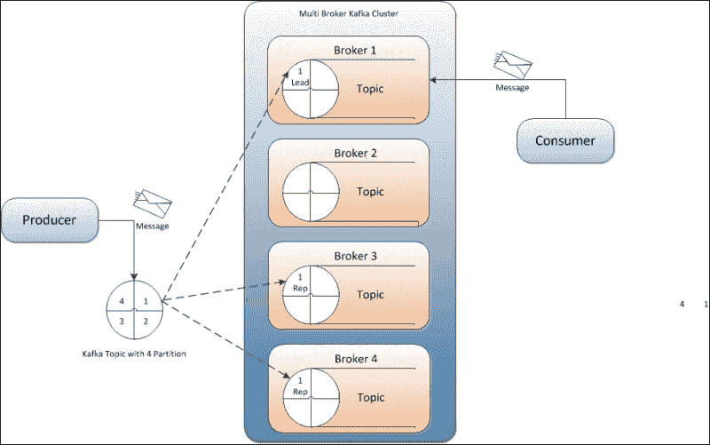

# 三、Kafka 设计

在我们开始通过编写 Kafka 生产者和消费者的代码来弄脏我们的手之前，让我们快速讨论一下 Kafka 的内部设计。

在本章中，我们将重点讨论以下主题:

*   Kafka 设计基础
*   Kafka 中的信息压缩
*   Kafka 中的复制

由于与 JMS 及其各种实现相关的开销以及扩展架构的限制，LinkedIn([www.linkedin.com](http://www.linkedin.com))决定构建 Kafka 来满足其监控活动流数据和操作指标(如 CPU、I/O 使用和请求计时)的需求。

开发 Kafka 时，主要重点是提供以下内容:

*   生产者和消费者支持定制实现的应用编程接口
*   低网络和存储开销，消息持久存储在磁盘上
*   支持发布和订阅数百万条消息的高吞吐量，例如实时日志聚合或数据馈送
*   分布式和高度可扩展的体系结构，用于处理低延迟交付
*   出现故障时自动平衡多个用户
*   保证服务器故障时的容错能力

# Kafka 设计基础

Kafka 既不是消费者池中单一消费者接收消息的排队平台，也不是向所有消费者发布消息的发布者-订阅者平台。在一个非常基本的结构中，生产者向 Kafka 主题发布消息(与“消息队列”同义)。主题也被视为消息发布到的消息类别或订阅源名称。Kafka 主题是由一个 Kafka 经纪人作为 Kafka 服务器创作的。如果需要的话，Kafka 经纪人也会存储这些信息。消费者然后订阅 Kafka 主题(一个或多个)来获取信息。在这里，经纪人和消费者分别使用 Zookeeper 获取状态信息和跟踪消息偏移量。这就是下图中描述的:

在上图中，显示了单个节点—单个代理架构，主题有四个分区。就组件而言，上图显示了 Kafka 集群的所有五个组件:动物园管理员、经纪人、主题、生产者和消费者。

在 Kafka 主题中，每个分区都被映射到一个逻辑日志文件，该文件被表示为一组大小相等的段文件。每个分区都是有序的、不可变的消息序列；每次消息发布到分区时，代理都会将消息追加到最后一个段文件中。在可配置数量的消息发布后或经过一定时间后，这些段文件被刷新到磁盘。一旦段文件被刷新，消息就可供消费者使用。

所有消息分区都被分配了一个唯一的序列号，称为*偏移量*，用于标识分区内的每个消息。为了实现容错，每个分区可以选择性地在可配置数量的服务器上复制。

在任一服务器上可用的每个分区都充当*领导者*，并且有零个或多个服务器充当*追随者*。在这里，领导者负责处理分区的所有读写请求，而追随者从领导者异步复制数据。Kafka 动态维护一组同步副本 ( **ISR** )，这些副本被领导者追赶，并始终将最新的 ISR 集保存到 ZooKeeper。在中，如果领导者失败，其中一个追随者(同步副本)将自动成为新领导者。在 Kafka 集群中，每台服务器都扮演着双重角色；它是一些分区的领导者，也是其他分区的追随者。这确保了 Kafka 集群内的负载平衡。

Kafka 平台是建立在从传统平台和消费群体的概念中学到的基础上的。在这里，每个消费者被表示为一个过程，并且这些过程被组织在称为消费者组的组中。

主题中的一条消息由消费者组中的单个进程(消费者)消费，如果要求一条消息由多个消费者消费，则所有这些消费者需要保存在不同的消费者组中。使用者总是按顺序使用来自特定分区的消息，并确认消息偏移量。这种确认意味着消费者已经消费了所有先前的消息。使用者向代理发出一个包含要使用的消息偏移量的异步拉请求，并获取字节缓冲区。

根据 Kafka 的设计，代理是无状态的，这意味着任何被消费的消息的消息状态都是在消息消费者中维护的，Kafka 的代理不维护被谁消费了什么的记录。如果实现得不好，消费者最终会多次阅读同一条消息。如果消息从代理中删除(因为代理不知道消息是否被消费)，Kafka 将基于时间的 SLA(服务级别协议)定义为消息保留策略。根据此策略，如果消息在代理中保留的时间超过了定义的服务级别协议期限，它将被自动删除。这种消息保留策略使消费者能够故意倒回旧的偏移量并重新消费数据，尽管与传统的消息传递系统一样，这违反了与消费者的排队契约。

让我们讨论一下 Kafka 在生产者和消费者之间提供的信息传递语义。传递消息有多种可能的方式，例如:

*   消息永远不会被重新传递，但可能会丢失
*   消息可以重新传递，但永远不会丢失
*   消息只传递一次

发布时，消息会提交到日志中。如果制作者在发布时遇到网络错误，则永远无法确定该错误是发生在消息提交之前还是之后。一旦提交，只要复制该消息所写入的分区的任一代理保持可用，该消息就不会丢失。对于有保证的消息发布，在生产者端提供了诸如获得确认和消息提交的等待时间等配置。

从使用者的角度来看，副本具有完全相同的日志和相同的偏移量，并且使用者控制其在该日志中的位置。对于消费者来说，Kafka 通过阅读信息、处理信息，最后保存自己的位置，保证信息至少传递一次。如果使用者进程在处理消息后但在保存其位置前崩溃，另一个使用者进程将接管主题分区，并可能接收到前几条已经处理过的消息。

# 原木压实

日志压缩是一种实现更细粒度的每消息保留的机制，而不是更粗粒度的基于时间的保留。它确保了主题分区日志中每个消息关键字的最后一个已知值必须通过删除使用相同主键进行更新的记录来保留。日志压缩还处理系统故障或系统重启等情况。

在 Kafka 集群中，可以根据每个主题设置保留策略，例如基于时间、基于大小或基于日志压缩。原木压实可确保以下几点:

*   始终保持消息的顺序
*   消息将具有连续的偏移量，并且偏移量永远不会改变
*   从偏移量 0 开始的读取，或者从日志开始处开始的使用者，将至少看到按照写入顺序的所有记录的最终状态

日志压缩由一个后台线程池处理，该线程池重新复制日志段文件，删除其关键字出现在日志头中的记录。

以下几点总结了重要的 Kafka 设计事实:

*   Kafka 的基本支柱是在 fiesystem 上缓存和存储消息。在 Kafka 中，数据会立即写入操作系统内核页面。将数据缓存和刷新到磁盘是可配置的。
*   即使在消费之后，Kafka 也提供了更长的消息保留时间，允许消费者在需要时重新消费。
*   Kafka 使用消息集对消息进行分组，以减少网络开销。
*   Unlike most messaging systems, where metadata of the consumed messages are kept at the server level, in Kafka the state of the consumed messages is maintained at the consumer level. This also addresses issues such as:
    *   由于失败而丢失邮件
    *   同一邮件的多次传递

    默认情况下，消费者将状态存储在 Zookeeper 中，但 Kafka 也允许将其存储在用于**在线交易处理** ( **OLTP** )应用程序的其他存储系统中。

*   在 Kafka，生产者和消费者在传统的推拉模式下工作，生产者把信息推给 Kafka 经纪人，消费者从经纪人那里拉信息。
*   Kafka 没有任何大师的概念，把所有的经纪人都当作同行。这种方法便于在任何时候添加和删除 Kafka 式经纪人，因为经纪人的元数据在 Zookeeper 中维护并与消费者共享。
*   生产者还可以选择异步或同步模式向代理发送消息。

# Kafka 中的消息压缩

对于网络带宽成为瓶颈的情况，Kafka 提供了消息组压缩功能，以实现高效的消息传递。Kafka 通过允许递归消息集来支持高效的压缩，其中压缩的消息相对于其内部的消息可能具有无限的深度。高效压缩需要将多条消息压缩在一起，而不是单独压缩每条消息。一批消息被压缩在一起并发送给代理。压缩消息集的网络开销减少，解压缩也几乎不会产生额外的开销。

在早期版本的 Kafka 0.7 中，压缩的消息批次在日志文件中保持压缩状态，并作为单个消息呈现给消费者，消费者随后对其进行解压缩。因此，额外的解压缩开销只出现在消费者端。

在 Kafka 0.8 中，代理处理消息偏移量的方式发生了变化；在压缩消息的情况下，这也可能导致代理性能下降。

### 注

在 Kafka 0.7 中，消息可通过分区日志中的物理字节偏移量来寻址，而在 Kafka 0.8 中，每个消息可通过每个分区唯一的不可比较的、不断增加的逻辑偏移量来寻址——也就是说，第一个消息的偏移量为`1`，第十个消息的偏移量为`10`，依此类推。在 Kafka 0.8 中，对偏移管理的更改简化了消费者倒带消息偏移的能力。

在 Kafka 0.8 中，主代理负责为一个分区提供消息服务，在将每个消息附加到日志之前，为其分配唯一的逻辑偏移量。在压缩数据的情况下，主代理必须解压缩消息集，以便为压缩消息集中的消息分配偏移量。一旦分配了偏移，引线将再次压缩数据，然后将其附加到磁盘上。主代理对它收到的每个压缩消息集都遵循这个过程，这会导致 Kafka 代理的 CPU 负载。

在 Kafka，数据由消息生产者使用 GZIP 或 T4 的压缩协议进行压缩。需要提供以下生成器配置，以便在生成器端使用压缩。

<colgroup><col style="text-align: left"> <col style="text-align: left"> <col style="text-align: left"></colgroup> 
| 

属性名

 | 

描述

 | 

缺省值

 |
| --- | --- | --- |
| `compression.codec` | 此参数指定了此制作者生成的所有数据的压缩编解码器。有效值为`none`、`gzip`和`snappy`。 | `none` |
| `compressed.topics` | 此参数允许您设置是否应该为特定主题打开压缩。如果压缩编解码器不是`none`编解码器，只对指定的主题(如果有)启用压缩。如果压缩主题列表为空，则为所有主题启用指定的压缩编解码器。如果压缩编解码器为`none`，则所有主题都禁用压缩。 | `null` |

表示消息集的`ByteBufferMessageSet`类可以由未压缩数据和压缩数据组成。为了区分压缩和未压缩的消息，在消息头中引入了压缩属性字节。在这个压缩字节中，最低的两位用于表示用于压缩的压缩编解码器，最后两位的值 0 表示未压缩的消息。

消息压缩技术对于使用 Kafka 在数据中心之间镜像数据非常有用，在 Kafka 中，大量数据以压缩格式从主动数据中心传输到被动数据中心。

# Kafka 中的复制

在我们讨论 Kafka 中的复制之前，我们先来讨论一下消息分区。在 Kafka 中，在 Kafka 代理端使用了一种消息分割策略。关于如何分割消息的决定由生产者做出，代理按照消息到达的相同顺序存储消息。可以在 Kafka 代理中为每个主题配置分区的数量。

Kafka 复制是 Kafka 0.8 中引入的非常重要的特性之一。尽管 Kafka 具有很高的可伸缩性，但为了更好的消息持久性和 Kafka 集群的高可用性，复制保证了消息即使在代理失败的情况下也能被发布和消费，而代理失败可能是由任何原因引起的。在 Kafka，生产者和消费者都有复制意识。下图解释了 Kafka 中的复制:

让我们详细讨论前面的图表。

在复制中，消息的每个分区都有 *n* 个副本，并且可以承受 *n-1* 个故障来保证消息传递。在 *n* 副本中，一个副本充当其余副本的主要副本。Zookeeper 保存关于前导副本和当前从动副本**同步副本** ( **ISR** )的信息。主副本维护所有同步从副本的列表。

每个副本在本地日志和偏移中存储其消息部分，并定期同步到磁盘。该过程还确保消息要么写入所有副本，要么不写入任何副本。

Kafka 支持以下复制模式:

*   **同步复制**:在同步复制中，生产者首先从 ZooKeeper 中识别主要副本并发布消息。消息一发布，就被写入到线索副本的日志中，线索的所有追随者都开始拉消息；通过使用单一通道，保证了消息的顺序。一旦消息被写入各自的日志中，每个跟随者副本都会向领导者副本发送一个确认。一旦复制完成并收到所有预期的确认，主副本将向生产者发送确认。在消费者方面，所有消息的提取都是从主副本中完成的。
*   **异步复制**:这种模式的唯一区别是，只要一个主副本将消息写入其本地日志，它就会将确认发送到消息客户端，而不等待从副本的确认。但是，不利的一面是，在代理失败的情况下，这种模式不能确保消息传递。

如果任何从机同步副本出现故障，引导机会在配置的超时时间后将故障从机从其 ISR 列表中删除，并继续写入 ISR 中的剩余副本。每当失败的跟随者返回时，它首先将其日志截断到最后一个检查点(最后提交的消息的偏移量)，然后从检查点开始追赶来自领导者的所有消息。一旦跟随者与领导者完全同步，领导者就将其添加回当前的 ISR 列表。

如果主副本失败，无论是在将消息分区写入其本地日志时，还是在向消息生成器发送确认之前，生成器都会将消息分区重新发送给新的主代理。

选择新线索复制品的过程包括所有追随者的 ISR 向 Zookeeper 注册他们自己。第一个注册的副本成为新的前导副本，其 **日志结束偏移量** ( **LEO** )成为最后提交的消息的偏移量(也称为高水位线 ( **HW** ))。其余的注册副本成为新当选领导人的追随者。每个副本都在 Zookeeper 中注册了一个监听器，这样它就会被告知任何领导者的变化。每当选出新的领导者并且通知的副本不是领导者时，它将其日志截断到最后提交的消息的偏移量，然后开始追赶新的领导者。新当选的领导者要么等到配置的时间过去，要么等到所有实时副本同步，然后领导者将当前的 ISR 写入 Zookeeper，并为消息读取和写入打开自己。

Kafka 中的复制确保了更强的持久性和更高的可用性。它保证任何成功发布的消息都不会丢失和被消费，即使在代理失败的情况下。

### 注

欲了解更多关于 Kafka 复制实现的见解，请访问[https://cwiki . Apache . org/converge/display/Kafka/Kafka+Detailed+Replication+Design+V3](https://cwiki.apache.org/confluence/display/KAFKA/kafka+Detailed+Replication+Design+V3)。

# 总结

在本章中，您学习了用于为 Kafka 建立坚实基础的设计理念。您还学习了 Kafka 中如何进行消息压缩和复制。

在下一章中，我们将关注如何使用提供的 API 编写 Kafka 制作人。