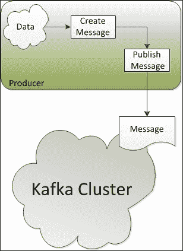
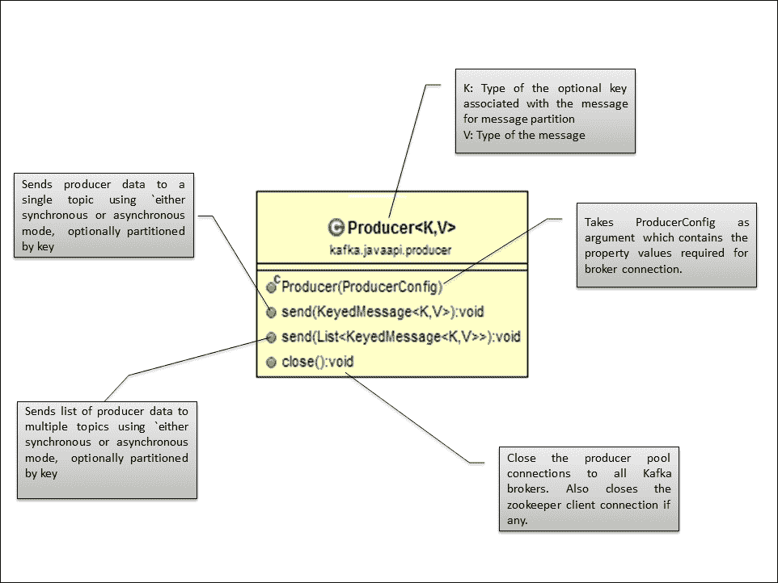

# 第四章。写作生产者

生产者是创建消息并将消息发布给Kafka经纪人以供进一步消费的应用程序。这些生产者本质上可以不同；例如，前端应用程序、后端服务、代理应用程序、遗留系统的适配器以及 Hadoop 的生产者。这些生成器也可以用不同的语言实现，如 Java、C 和 Python。

在本章中，我们将重点关注以下主题:

*   面向消息生产者的Kafka应用编程接口
*   基于 Java 的Kafka制作人
*   使用自定义消息分区的基于 Java 的生产者

在这一章的最后，我们还将探讨Kafka制作人需要的几个重要配置。

我们开始吧。下图解释了Kafka制作人在制作这些信息时的高级工作:



生产者连接到任何活动节点，并请求关于主题分区的领导者的元数据。这允许生产者将消息直接发送给分区的主要代理。

Kafka制作人应用编程接口通过允许制作人指定一个分区的键并使用这个键散列到一个分区，公开了语义分区的接口。因此，生产者可以完全控制它将消息发布到哪个分区；例如，如果选择客户 ID 作为关键字，那么给定客户的所有数据都将被发送到同一个分区。这也允许数据消费者对客户数据进行区域性假设。

为了在Kafka中获得高效率，生产者也可以批量发布只在异步模式下工作的消息。在异步模式下，生产者要么使用固定数量的消息，要么使用生产者配置定义的固定延迟`queue.time`或`batch.size`，例如 10 秒或 50 条消息。数据在生产者端积累在内存中，并在单个请求中分批发布。异步模式还带来了在生产者崩溃的情况下丢失数据的风险，其中累积了未发布的内存数据。

### 注

对于异步生产者，回调方法的功能是为将来的版本提出的；这将用于注册处理程序来捕获发送的错误。

在接下来的几节中，我们将讨论Kafka为编写基于 Java 的定制生产者提供的 API。

# Java 生产者 API

让我们首先了解为编写Kafka集群的基于 Java 的基本生产者而导入的重要类:

*   `Producer`: Kafka provides the `kafka.javaapi.producer.Producer` class (`class Producer<K, V>`) for creating messages for single or multiple topics with message partition as an optional feature. The default message partitioner is based on the hash of the key. Here, `Producer` is a type of Java generic ([http://en.wikipedia.org/wiki/Generics_in_Java](http://en.wikipedia.org/wiki/Generics_in_Java)) written in Scala where we need to specify the type of parameters; `K` and `V` specify the types for the partition key and message value, respectively. The following is the class diagram and its explanation:

    

*   `KeyedMessage`: The `kafka.producer.KeyedMessage` class takes the topic name, partition key, and the message value that need to be passed from the producer as follows:

    ```scala
    class KeyedMessage[K, V](val topic: String, val key: K, val message: V) 
    ```

    这里，`KeyedMessage`是一种用 Scala 编写的 Java 泛型，我们需要在这里指定参数的类型；`K`和`V`分别指定分区键和消息值的类型，主题始终为`String`类型。

*   `ProducerConfig`:`kafka.producer.ProducerConfig`类封装了与代理建立连接所需的值，如代理列表、消息分区类、消息的序列化程序类和分区密钥。

生产者应用编程接口包装了基于生产者配置`producer.type`获得的同步(默认行为)和异步生产者的低级生产者实现。例如，在异步生产者的情况下，`kafka.producer.Producer`类处理生产者数据的缓冲，然后数据被序列化并分派到适当的Kafka代理分区。在内部，`kafka.producer.async.ProducerSendThread`实例将该批消息出列，`kafka.producer.EventHandler`序列化并调度数据。Kafka制作人配置`event.handler`还提供了定义自定义事件处理程序的能力。

### 注

所有示例都是为多代理集群(单个或多个节点)开发和测试的。有关如何设置单节点多代理集群的更多信息，请参考[第 2 章](2.html "Chapter 2. Setting Up a Kafka Cluster")、*设置Kafka集群*。

# 简单的 Java 生产者

现在我们将开始编写一个简单的基于 Java 的生产者来将消息传输给代理。这个`SimpleProducer`类用于为特定的主题创建一个消息，并使用默认的消息划分来传输它。

## 导入类

作为第一步，我们需要导入以下类:

```scala
import kafka.javaapi.producer.Producer;
import kafka.producer.KeyedMessage;
import kafka.producer.ProducerConfig;
```

## 定义属性

作为编写制作人的下一步，我们需要定义与Kafka经纪人建立连接的属性，并将这些属性传递给Kafka制作人:

```scala
Properties props = new Properties();
props.put("metadata.broker.list","localhost:9092, localhost:9093, localhost:9094");
props.put("serializer.class","kafka.serializer.StringEncoder");
props.put("request.required.acks", "1");
ProducerConfig config = new ProducerConfig(props); 
Producer<String, String> producer = new Producer<String, String> (config);
```

现在让我们看看代码中提到的主要属性:

*   `metadata.broker.list`:该属性指定生产者需要连接的代理列表(采用`[<node:port>, <node:port>]`格式)。Kafka 生产者自动确定主题的主要代理，通过对元数据提出请求对其进行划分，并在发布任何消息之前连接到正确的代理。
*   `serializer.class`:该属性指定了在准备消息从生产者传输到代理时需要使用的`serializer`类。在这个例子中，我们将使用Kafka提供的字符串编码器。默认情况下，键和消息的`serializer`类是相同的，但是我们也可以通过扩展基于 Scala 的`kafka.serializer.Encoder`实现来实现自定义的`serializer`类。生产者配置`key.serializer.class`用于设置自定义编码器。
*   `request.required.acks`:该属性指示Kafka经纪人在收到消息时向制作人发送确认。值`1`表示一旦主副本接收到数据，生产者就会收到确认。这个选项提供了更好的持久性，因为生产者等待直到经纪人确认请求成功。默认情况下，制作人工作在“火灾和忘记”模式下，并且在消息丢失的情况下不被通知。

## 构建消息并发送

作为最后一步，我们需要构建消息并将其发送给代理，如以下代码所示:

```scala
String runtime = new Date().toString();;
String msg = "Message Publishing Time - " + runtime;
KeyedMessage<String, String> data = new KeyedMessage<String, String> (topic, msg);
producer.send(data); 
```

完整的程序如下所示:

```scala
package kafka.examples.ch4;

import java.util.Date;
import java.util.Properties;

import kafka.javaapi.producer.Producer;
import kafka.producer.KeyedMessage;
import kafka.producer.ProducerConfig;

public class SimpleProducer {
  private static Producer<String, String> producer;

  public SimpleProducer() {
    Properties props = new Properties();

    // Set the broker list for requesting metadata to find the lead broker
    props.put("metadata.broker.list",
            "192.168.146.132:9092, 192.168.146.132:9093, 192.168.146.132:9094");

    //This specifies the serializer class for keys 
    props.put("serializer.class", "kafka.serializer.StringEncoder");

    // 1 means the producer receives an acknowledgment once the lead replica 
    // has received the data. This option provides better durability as the 
    // client waits until the server acknowledges the request as successful.
    props.put("request.required.acks", "1");

    ProducerConfig config = new ProducerConfig(props);
    producer = new Producer<String, String>(config);
  }

  public static void main(String[] args) {
    int argsCount = args.length;
    if (argsCount == 0 || argsCount == 1)
      throw new IllegalArgumentException(
        "Please provide topic name and Message count as arguments");

    // Topic name and the message count to be published is passed from the
    // command line 
    String topic = (String) args[0];
    String count = (String) args[1];
    int messageCount = Integer.parseInt(count);
    System.out.println("Topic Name - " + topic);
    System.out.println("Message Count - " + messageCount);

    SimpleProducer simpleProducer = new SimpleProducer();
    simpleProducer.publishMessage(topic, messageCount);
  }

  private void publishMessage(String topic, int messageCount) {
    for (int mCount = 0; mCount < messageCount; mCount++) {
      String runtime = new Date().toString();

      String msg = "Message Publishing Time - " + runtime;
      System.out.println(msg);
      // Creates a KeyedMessage instance
      KeyedMessage<String, String> data = 
        new KeyedMessage<String, String>(topic, msg);

      // Publish the message
      producer.send(data);
    }
    // Close producer connection with broker.
    producer.close();
  }
}
```

在运行之前，确保您已经使用应用编程接口或从命令行创建了主题`kafkatopic`，如下所示:

```scala
[root@localhost kafka_2.9.2-0.8.1.1]#bin/kafka-topics.sh --create --zookeeper localhost:2181 --replication-factor 1 --partitions 3 --topic kafkatopic

```

### 注

在控制台中编译和运行基于 Java 的 Kafka 程序之前，确保从[http://www.slf4j.org/download.html](http://www.slf4j.org/download.html)下载 `slf4j-1.7.7.tar.gz`文件，并将`slf4j-1.7.7.tar.gz`中包含的`slf4j-log4j12-1.7.7.jar`复制到`/opt/kafka_2.9.2-0.8.1.1/libs`目录中。使用以下命令添加`KAFKA_LIB`环境变量并将`/opt/kafka_2.9.2-0.8.1.1/libs`中可用的所有库添加到类路径中:

```scala
[root@localhost kafka_2.9.2-0.8.1.1]# export KAFKA_LIB=/opt/kafka_2.9.2-0.8.1.1/libs
[root@localhost kafka_2.9.2-0.8.1.1]# export CLASSPATH=.:$KAFKA_LIB/jopt-simple-3.2.jar:$KAFKA_LIB/kafka_2.9.2-0.8.1.1.jar:$KAFKA_LIB/log4j-1.2.15.jar:$KAFKA_LIB/metrics-core-2.2.0.jar:$KAFKA_LIB/scala-library-2.9.2.jar:$KAFKA_LIB/slf4j-api-1.7.2.jar:$KAFKA_LIB/slf4j-log4j12-1.7.7.jar:$KAFKA_LIB/snappy-java-1.0.5.jar:$KAFKA_LIB/zkclient-0.3.jar:$KAFKA_LIB/zookeeper-3.3.4.jar

```

使用以下命令编译前面的程序:

```scala
[root@localhost kafka_2.9.2-0.8.1.1]# javac -d . kafka/examples/ch4/SimpleProducer.java

```

使用以下命令运行简单生成器:

```scala
[root@localhost kafka_2.9.2-0.8.1.1]# java kafka.examples.ch4.SimpleProducer kafkatopic 10

```

`SimpleProducer`类取两个参数；首先是主题名称，其次是要发布的消息数量。一旦生产者成功执行并开始向代理发布消息，运行命令行消费者来消费消息，因为它订阅了在Kafka代理中创建的主题，如下所示:

```scala
[root@localhost kafka_2.9.2-0.8.1.1]# bin/kafka-console-consumer.sh --zookeeper localhost:2181 --from-beginning --topic kafkatopic

```

# 创建带有自定义分区的 Java 生成器

前面的例子是一个非常基本的例子，在单节点、多代理集群上运行的`Producer`类没有显式的消息分区。跳到下一个层次，让我们编写另一个使用定制消息分区的程序。在本例中，从任何 IP 地址获取网站访问的日志消息并发布。该日志消息有三个部分:

*   网站点击的时间戳
*   网站本身的名称
*   访问网站的 IP 地址

让我们从编码开始。

## 导入类

首先导入以下类:

```scala
import java.util.Date;
import java.util.Properties;
import java.util.Random;

import kafka.javaapi.producer.Producer;
import kafka.producer.KeyedMessage;
import kafka.producer.ProducerConfig;
```

## 定义属性

下一步，我们需要定义与Kafka经纪人建立连接的属性，如下面的代码所示，并将这些属性传递给Kafka制作人:

```scala
Properties props = new Properties();
props.put("metadata.broker.list","localhost:9092, localhost:9093, localhost:9094");
props.put("serializer.class","kafka.serializer.StringEncoder"); 
props.put("partitioner.class", "kafka.examples.ch4.SimplePartitioner");
props.put("request.required.acks", "1");
ProducerConfig config = new ProducerConfig(props); 
Producer<Integer, String> producer = new Producer<Integer, String>(config);
```

之前的属性列表唯一的变化就是增加了`partitioner.class`配置。

`partitioner.class`属性定义了用于确定主题中需要发送消息的分区的类。如果密钥为空，Kafka使用密钥的哈希值。

## 实现分区器类

接下来，我们需要通过实现`Partitioner`类(一个用 Scala 编写的抽象类)来开发一个定制的分区器类`SimplePartitioner`，该类获取密钥，在这个的例子中是 IP 地址。然后，它找到最后一个二进制八位数，并对Kafka为该主题定义的分区数进行模运算。以下是`SimplePartitioner`班的代码:

```scala
package kafka.examples.ch4;

import kafka.producer.Partitioner;

public class SimplePartitioner implements Partitioner {

  public SimplePartitioner (VerifiableProperties props) {

  }

  /*
   * The method takes the key, which in this case is the IP address, 
   * It finds the last octet and does a modulo operation on the number 
   * of partitions defined within Kafka for the topic.
   * 
   * @see kafka.producer.Partitioner#partition(java.lang.Object, int)
   */
  public int partition(Object key, int a_numPartitions) {
    int partition = 0;
    String partitionKey = (String) key;
    int offset = partitionKey.lastIndexOf('.');
    if (offset > 0) {
      partition = Integer.parseInt(partitionKey.substring(offset + 1))
          % a_numPartitions;
    }
    return partition;
  }
}
```

## 构建消息并发送

作为最后一步，我们需要构建消息并将其发送给代理。以下是程序的完整列表:

```scala
package kafka.examples.ch4;

import java.util.Date;
import java.util.Properties;
import java.util.Random;

import kafka.javaapi.producer.Producer;
import kafka.producer.KeyedMessage;
import kafka.producer.ProducerConfig;

public class CustomPartitionProducer {
  private static Producer<String, String> producer;

  public CustomPartitionProducer() {
    Properties props = new Properties();

    // Set the broker list for requesting metadata to find the lead broker
    props.put("metadata.broker.list",
          "192.168.146.132:9092, 192.168.146.132:9093, 192.168.146.132:9094");

    // This specifies the serializer class for keys 
    props.put("serializer.class", "kafka.serializer.StringEncoder");

    // Defines the class to be used for determining the partition 
    // in the topic where the message needs to be sent.
    props.put("partitioner.class", "kafka.examples.ch4.SimplePartitioner");

    // 1 means the producer receives an acknowledgment once the lead replica 
    // has received the data. This option provides better durability as the 
    // client waits until the server acknowledges the request as successful.
    props.put("request.required.acks", "1");

    ProducerConfig config = new ProducerConfig(props);
    producer = new Producer<String, String>(config);
  }

  public static void main(String[] args) {
    int argsCount = args.length;
    if (argsCount == 0 || argsCount == 1)
      throw new IllegalArgumentException(
        "Please provide topic name and Message count as arguments");

    // Topic name and the message count to be published is passed from the
    // command line
    String topic = (String) args[0];
    String count = (String) args[1];
    int messageCount = Integer.parseInt(count);

    System.out.println("Topic Name - " + topic);
    System.out.println("Message Count - " + messageCount);

    CustomPartitionProducer simpleProducer = new CustomPartitionProducer();
    simpleProducer.publishMessage(topic, messageCount);
  }

  private void publishMessage(String topic, int messageCount) {
    Random random = new Random();
    for (int mCount = 0; mCount < messageCount; mCount++) {

    String clientIP = "192.168.14." + random.nextInt(255); 
    String accessTime = new Date().toString();

    String message = accessTime + ",kafka.apache.org," + clientIP; 
      System.out.println(message);

      // Creates a KeyedMessage instance
      KeyedMessage<String, String> data = 
        new KeyedMessage<String, String>(topic, clientIP, message);

      // Publish the message
      producer.send(data);
    }
    // Close producer connection with broker.
    producer.close();
  }
}
```

在运行此程序之前，请确保您已经从命令行创建了主题`website-hits`:

```scala
[root@localhost kafka_2.9.2-0.8.1.1]# bin/kafka-topics.sh --create --zookeeper localhost:2181 --replication-factor 3 --partitions 5 --topic website-hits

```

此外，如前一示例开头所述，如果尚未完成类路径设置，则进行类路径设置。现在使用以下命令编译分割器类和前面的生产者程序:

```scala
[root@localhost kafka_2.9.2-0.8.1.1]# javac -d . kafka/examples/ch4/SimplePartitioner.java

[root@localhost kafka_2.9.2-0.8.1.1]# javac -d . kafka/examples/ch4/CustomPartitionProducer.java

```

使用以下命令运行自定义分区生成器:

```scala
[root@localhost kafka_2.9.2-0.8.1.1]# java kafka.examples.ch4.CustomPartitionProducer website-hits 100

```

`CustomPartitionProducer`程序取两个参数；首先是主题名称，其次是要发布的日志消息数量。一旦生产者成功执行并开始向代理发布消息，运行命令行消费者来消费消息，因为它订阅了在 Kafka 代理中创建的主题:

```scala
[root@localhost kafka_2.9.2-0.8.1.1]# bin/kafka-console-consumer.sh --zookeeper localhost:2181 --from-beginning --topic kafkatopic

```

在前面的示例中，使用自定义分区逻辑的好处是，为相同的客户端 IP 地址生成的所有日志消息最终都将到达相同的分区。同样，同一个分区可能有不同 IP 地址的批处理日志消息。

### 注

分区逻辑也需要为消费者所知，以便消费者可以消费为期望的入侵防御发布的消息。这部分包含在[第 5 章](5.html "Chapter 5. Writing Consumers")*写消费者*中。

# Kafka制作人财产清单

下面的表列出了可以为Kafka制作人配置的几个重要属性。Scala 类`kafka.producer.ProducerConfig`提供了生产者配置的实现级细节。欲了解完整列表，请访问[http://kafka.apache.org/documentation.html#producerconfigs](http://kafka.apache.org/documentation.html#producerconfigs)。

<colgroup><col style="text-align: left"> <col style="text-align: left"> <col style="text-align: left"></colgroup> 
| 

属性名

 | 

描述

 | 

缺省值

 |
| --- | --- | --- |
| `metadata.broker.list` | 生产者使用该属性获取元数据(主题、分区和副本)。用于发送实际数据的套接字连接将基于元数据中返回的代理信息来建立。格式为`host1:port1,host2:port2`。 |   |
| `serializer.class` | 这个为消息指定了`serializer`类。默认编码器接受一个字节并返回相同的字节。 | `kafka.serializer.DefaultEncoder` |
| `producer.type` | 该属性指定如何发送消息:

*   `async`用于异步发送(与消息批处理一起使用)
*   `sync`为同步发送

 | `sync` |
| `request.required.acks` | 该值控制生产者请求何时被视为完成，以及生产者是否收到来自代理的确认:

*   `0`表示生产者永远不会等待经纪人的确认。这用于最低延迟，但耐久性最弱。
*   `1`表示一旦主副本收到数据，生产者就会收到确认。该选项提供了更好的持久性，因为客户端一直等到服务器确认请求成功。
*   `-1`表示一旦所有同步副本接收到数据，生产者将收到确认。该选项提供最佳耐用性。

 | `0` |
| `key.serializer.class` | 此指定键的序列化程序类。 | `${serializer.class}` |
| `partitioner.class` | 这个是用于在子主题之间划分消息的划分器类。默认分区器基于密钥的哈希值。 | `kafka.producer.DefaultPartitioner` |
| `compression.codec` | 此参数指定了此制作者生成的所有数据的压缩编解码器。有效值为`none`、`gzip`和`snappy`。 | `none` |
| `batch.num.messages` | 此指定使用异步模式时一批发送的消息数量。生产者将等待，直到该数量的消息准备好发送或达到`queue.buffer.max.ms`。 | `200` |

# 总结

在本章中，我们学习了如何编写使用消息分区的基本生产者和一些高级 Java 生产者。我们还介绍了Kafka制作人的财产细节。

在下一章中，我们将学习如何为消息消费编写基于 Java 的消费者。