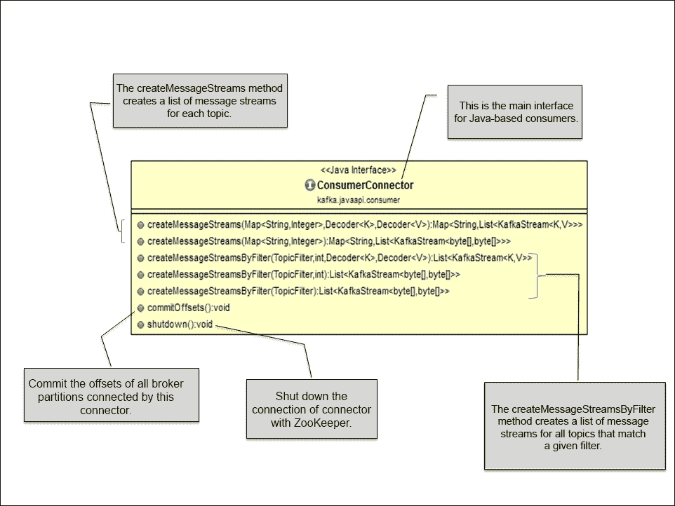
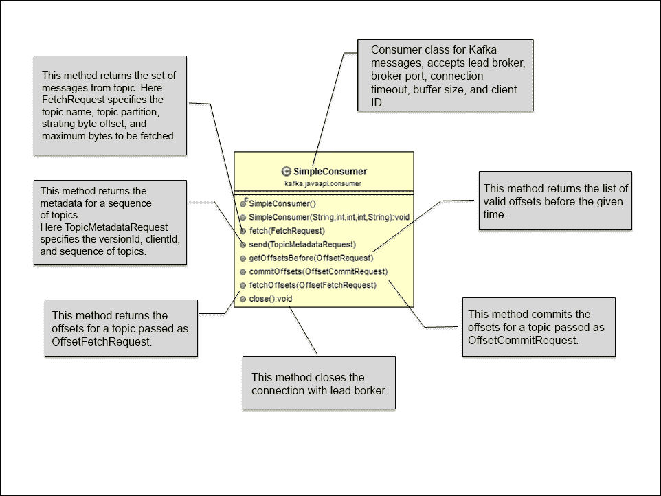

# 五、与消费者通信

消费者是消费Kafka制作者发布的消息并处理从中提取的数据的应用程序。与生产者一样，消费者在本质上也可能不同，例如进行实时或接近实时分析的应用程序、具有 NoSQL 或数据仓库解决方案的应用程序、后端服务、Hadoop 的消费者或其他基于订户的解决方案。这些消费者也可以用不同的语言实现，如 Java、C 和 Python。

在本章中，我们将重点讨论以下主题:

*   Kafka消费 API
*   基于 Java 的Kafka消费者
*   使用分区消息的基于 Java 的Kafka消费者

在这一章的最后，我们将探讨可以为Kafka消费者设置的一些重要属性。那么，让我们开始吧。


上图解释了Kafka消费者在消费信息时的高级工作。消费者在Kafka经纪人上订阅特定主题的消息消费。然后，使用者向引导代理发出提取请求，通过指定消息偏移量(消息偏移量的开始位置)来使用消息分区。因此，Kafka消费者在拉取模型中工作，并且总是在Kafka日志(Kafka内部数据表示)中的当前位置之后拉取所有可用的消息。

订阅时，消费者连接到任何活动节点，并请求主题分区的领导者的元数据。这允许消费者直接与接收消息的主代理通信。Kafka的主题被分成一组有序的分区，每个分区只被一个消费者使用。一旦一个分区被使用，使用者就将消息偏移量更改为要使用的下一个分区。这表示已消耗的状态，还提供了有意倒回旧偏移并重新消耗分区的灵活性。在接下来的几节中，我们将讨论Kafka为编写基于 Java 的定制消费者提供的 API。

### 注

本书中提到的所有Kafka类实际上都是用 Scala 编写的。

# Kafka消费原料药

Kafka 为 Java 消费者提供了两种类型的 API:

*   高级应用编程接口
*   低级应用编程接口

## 高级消费者 API

当只需要数据而不需要处理消息偏移时，使用高级消费者应用编程接口。这个应用编程接口向消费者隐藏了代理的细节，并通过在低级实现上提供抽象，允许轻松的与Kafka集群通信。高级消费者存储从 Zookeeper 中的特定分区读取的最后一个偏移量(消息分区中消费者停止消费消息的位置)。该偏移量是根据流程开始时提供给Kafka的消费者组名称存储的。

在整个 Kafka 集群中，消费者组名称是唯一的和全局的，任何具有正在使用的消费者组名称的新消费者都可能在系统中导致不明确的行为。当一个新的进程以现有的消费组名称启动时，Kafka会触发消费组的新和现有进程线程之间的重新平衡。在重新平衡之后，一些用于新进程的消息可能会转到旧进程，从而导致意外的结果。为了避免这种模棱两可的行为，在为现有的使用者组名称启动新的使用者之前，应该关闭任何现有的使用者。

以下是使用 Kafka 集群的高级消费者 API 为编写基于 Java 的基本消费者而导入的类:

*   `ConsumerConnector`: Kafka provides the `ConsumerConnector` interface (`interface ConsumerConnector`) that is further implemented by the `ZookeeperConsumerConnector` class (`kafka.javaapi.consumer.ZookeeperConsumerConnector`). This class is responsible for all the interaction a consumer has with ZooKeeper.

    以下是`ConsumerConnector`类的类图:

    

*   `KafkaStream`: Objects of the `kafka.consumer.KafkaStream` class are returned by the `createMessageStreams` call from the `ConsumerConnector` implementation. This list of the `KafkaStream` objects is returned for each topic, which can further create an iterator over messages in the stream. The following is the Scala-based class declaration:

    ```scala
    class KafkaStream[K,V](private val queue: 
                          BlockingQueue[FetchedDataChunk],
                          consumerTimeoutMs: Int,
                          private val keyDecoder: Decoder[K],
                          private val valueDecoder: Decoder[V],
                          val clientId: String)
    ```

    这里，参数`K`和`V`分别指定分区键和消息值的类型。

    在`ConsumerConnector`类的创建调用中，客户端可以指定所需流的数量，其中每个流对象用于单线程处理。这些流对象可以表示多个唯一分区的合并。

*   `ConsumerConfig`:`kafka.consumer.ConsumerConfig`类封装了与 ZooKeeper 建立连接所需的属性值，例如 ZooKeeper URL、ZooKeeper 会话超时和 ZooKeeper 接收器时间。它还包含消费者所需的属性值，如组标识等。

下一节将讨论一个基于高级 API 的工作消费者示例。

## 低级别消费 API

高级应用编程接口不允许消费者控制与经纪人的交互。也称为“简单消费者应用编程接口”，低级消费者应用编程接口是无状态的，并对Kafka经纪人和消费者之间的通信提供细粒度控制。它允许消费者为向代理提出的每个请求设置消息偏移量，并在消费者端维护元数据。这个应用编程接口既可以被在线消费者使用，也可以被离线消费者使用，比如 Hadoop。这些类型的使用者还可以对同一消息执行多次读取或管理事务，以确保消息只被使用一次。

与高级消费者应用编程接口相比，开发人员需要付出额外的努力，通过跟踪偏移量、找出主题和分区的线索代理、处理线索代理更改等方式，在消费者内部获得低级别的控制。

在低级消费者 API 中，消费者首先查询实时代理，以找出关于主代理的详细信息。关于实时代理的信息可以通过属性文件或命令行传递给消费者。`kafka.javaapi.TopicMetadataResponse`类的`topicsMetadata()`方法用于从主代理中找出感兴趣主题的元数据。对于消息分区读取，`kafka.api.OffsetRequest`类定义了两个常量:`EarliestTime`和`LatestTime`，以查找日志和新消息流中数据的开头。这些常量还有助于消费者跟踪哪些消息已经被读取。

低级消费者应用编程接口中使用的主要类是`SimpleConsumer` ( `kafka.javaapi.consumer.SimpleConsumer`)类。以下是`SimpleConsumer`班级的班级图:



一个简单的消费者类提供了一个到主要代理的连接，用于从主题中获取消息，以及获取主题元数据和偏移量列表的方法。

构建不同请求对象的几个更重要的类是`FetchRequest` ( `kafka.api.FetchRequest`)、`OffsetRequest` ( `kafka.javaapi.OffsetRequest`)、`OffsetFetchRequest` ( `kafka.javaapi.OffsetFetchRequest`)、`OffsetCommitRequest` ( `kafka.javaapi.OffsetCommitRequest`)和`TopicMetadataRequest` ( `kafka.javaapi.TopicMetadataRequest`)。

### 注

本章中的所有示例都是基于高级消费者 API。基于低级消费者 API 的示例，参考[https://cwiki . Apache . org/converge/display/KAFKA/0 . 8 . 0+simple consumer+示例](https://cwiki.apache.org/confluence/display/KAFKA/0.8.0+SimpleConsumer+Example)。

# 简单的 Java 消费者

现在我们将开始编写一个单线程的简单 Java 消费者，它是使用高级消费者 API 开发的，用于消费来自某个主题的消息。这个`SimpleHLConsumer`类用于从一个特定的主题中获取一条消息并使用它，假设主题中有一个单独的分区。

## 导入类

作为第一步，我们需要导入以下类:

```scala
import kafka.consumer.ConsumerConfig;
import kafka.consumer.ConsumerIterator;
import kafka.consumer.KafkaStream;
import kafka.javaapi.consumer.ConsumerConnector;
```

## 定义属性

下一步，我们需要定义与 Zookeeper 建立连接的属性，并使用以下代码将这些属性传递给 Kafka 消费者:

```scala
Properties props = new Properties();
props.put("zookeeper.connect", "localhost:2181");
props.put("group.id", "testgroup");
props.put("zookeeper.session.timeout.ms", "500");
props.put("zookeeper.sync.time.ms", "250");
props.put("auto.commit.interval.ms", "1000");
new ConsumerConfig(props);
```

现在让我们看看代码中提到的主要属性:

*   `zookeeper.connect`:该属性指定了 ZooKeeper `<node:port>`连接细节，用于在集群中查找 ZooKeeper 运行实例。在 Kafka 集群中，Zookeeper 用于存储特定主题所消费的消息的偏移量，并由该消费组进行分区。
*   `group.id`:该属性为组内所有消费者共享的消费者组指定名称。这也是 Zookeeper 用来存储偏移量的进程名。
*   `zookeeper.session.timeout.ms`:该属性以毫秒为单位指定 Zookeeper 会话超时，代表 Kafka 在放弃并继续消耗消息之前等待 Zookeeper 响应请求的时间。
*   `zookeeper.sync.time.ms`:这个属性指定了 ZooKeeper 领导者和追随者之间的 ZooKeeper 同步时间(以毫秒为单位)。
*   `auto.commit.interval.ms`:这个属性定义了以毫秒为单位的频率，在这个频率下，消费者补偿被提交给 Zookeeper。

# 阅读某个主题的信息并打印出来

作为最后一步，我们需要使用以下代码读取消息:

```scala
Map<String, Integer> topicMap = new HashMap<String, Integer>();
// 1 represents the single thread
topicCount.put(topic, new Integer(1));

Map<String, List<KafkaStream<byte[], byte[]>>> consumerStreamsMap = consumer.createMessageStreams(topicMap);

// Get the list of message streams for each topic, using the default decoder.
List<KafkaStream<byte[], byte[]>>streamList =  consumerStreamsMap.get(topic);

for (final KafkaStream <byte[], byte[]> stream : streamList) {
ConsumerIterator<byte[], byte[]> consumerIte = stream.iterator();
  while (consumerIte.hasNext())
    System.out.println("Message from Single Topic :: "
    + new String(consumerIte.next().message()));
} 
```

所以完整的程序看起来像下面的代码:

```scala
package kafka.examples.ch5;

import java.util.HashMap;
import java.util.List;
import java.util.Map;
import java.util.Properties;

import kafka.consumer.ConsumerConfig;
import kafka.consumer.ConsumerIterator;
import kafka.consumer.KafkaStream;
import kafka.javaapi.consumer.ConsumerConnector;

public class SimpleHLConsumer {
  private final ConsumerConnector consumer;
  private final String topic;

  public SimpleHLConsumer(String zookeeper, String groupId, String topic) {
    consumer = kafka.consumer.Consumer
        .createJavaConsumerConnector(createConsumerConfig(zookeeper,
            groupId));
    this.topic = topic;
  }

  private static ConsumerConfig createConsumerConfig(String zookeeper,
        String groupId) {
    Properties props = new Properties();
    props.put("zookeeper.connect", zookeeper);
    props.put("group.id", groupId);
    props.put("zookeeper.session.timeout.ms", "500");
    props.put("zookeeper.sync.time.ms", "250");
    props.put("auto.commit.interval.ms", "1000");

    return new ConsumerConfig(props);

  }

  public void testConsumer() {

    Map<String, Integer> topicMap = new HashMap<String, Integer>();

    // Define single thread for topic
    topicMap.put(topic, new Integer(1));

    Map<String, List<KafkaStream<byte[], byte[]>>> consumerStreamsMap = 
        consumer.createMessageStreams(topicMap);

    List<KafkaStream<byte[], byte[]>> streamList = consumerStreamsMap
        .get(topic);

    for (final KafkaStream<byte[], byte[]> stream : streamList) {
      ConsumerIterator<byte[], byte[]> consumerIte = stream.iterator();
      while (consumerIte.hasNext())
        System.out.println("Message from Single Topic :: "
          + new String(consumerIte.next().message()));
    }
    if (consumer != null)
      consumer.shutdown();
  }

  public static void main(String[] args) {

    String zooKeeper = args[0];
    String groupId = args[1];
    String topic = args[2];
    SimpleHLConsumer simpleHLConsumer = new SimpleHLConsumer(
          zooKeeper, groupId, topic);
    simpleHLConsumer.testConsumer();
  }

}
```

运行此程序之前，请确保您已经从命令行创建了主题`kafkatopic`:

```scala
[root@localhost kafka_2.9.2-0.8.1.1]#bin/kafka-topics.sh --create --zookeeper localhost:2181 --replication-factor 1 --partitions 3 --topic kafkatopic

```

### 注

在控制台中编译和运行基于 Java 的 Kafka 程序之前，请确保从[http://www.slf4j.org/download.html](http://www.slf4j.org/download.html)下载`slf4j-1.7.7.tar.gz`文件，并将包含在`slf4j-1.7.7.tar.gz`中的`slf4j-log4j12-1.7.7.jar`复制到`/opt/kafka_2.9.2-0.8.1.1/libs`目录。使用以下命令将`/opt/kafka_2.9.2-0.8.1.1/libs`中所有可用的库添加到类路径中:

```scala
[root@localhost kafka_2.9.2-0.8.1.1]# export KAFKA_LIB=/opt/kafka_2.9.2-0.8.1.1/libs
[root@localhost kafka_2.9.2-0.8.1.1]# export CLASSPATH=.:$KAFKA_LIB/jopt-simple-3.2.jar:$KAFKA_LIB/kafka_2.9.2-0.8.1.1.jar:$KAFKA_LIB/log4j-1.2.15.jar:$KAFKA_LIB/metrics-core-2.2.0.jar:$KAFKA_LIB/scala-library-2.9.2.jar:$KAFKA_LIB/slf4j-api-1.7.2.jar:$KAFKA_LIB/slf4j-log4j12-1.7.7.jar:$KAFKA_LIB/snappy-java-1.0.5.jar:$KAFKA_LIB/zkclient-0.3.jar:$KAFKA_LIB/zookeeper-3.3.4.jar

```

还要运行在[第 4 章](4.html "Chapter 4. Writing Producers")、*写作制作者*中开发的`SimpleProducer`类，它采用两个参数:一是主题名称，二是要发布的消息数量，如下所示:

```scala
[root@localhost kafka_2.9.2-0.8.1.1]# java kafka.examples.ch4.SimpleProducer kafkatopic 100

```

使用以下命令编译前面的`SimpleHLConsumer`类:

```scala
[root@localhost kafka_2.9.2-0.8.1.1]# javac -d . kafka/examples/ch5/SimpleHLConsumer.java

```

在单独的控制台窗口中使用以下命令运行简单的高级消费程序:

```scala
[root@localhost kafka_2.9.2-0.8.1.1]# java kafka.examples.ch5.SimpleHLConsumer localhost:2181 testgroup kafkatopic

```

对于成功的执行，`SimpleHLConsumer`类接受三个参数:第一，动物园管理员连接字符串`<host:port>`；第二，唯一的组 ID；第三，Kafka的主题名。

# 多线程 Java 消费者

前面的例子是一个非常基本的例子，一个消费者使用来自单个代理的消息，而没有对主题中的消息进行明确的划分。让我们跳到下一个层次，编写另一个程序，使用来自连接到单个/多个主题的多个分区的消息。

基于消费者应用编程接口的多线程高级设计通常基于主题中的分区数量，并遵循主题中线程和分区之间的一对一映射方法。例如，如果为任何主题定义了四个分区，作为最佳实践，只有四个线程应该由消费者应用程序启动来读取数据；否则，可能会出现一些冲突行为，例如线程从不接收消息或线程从多个分区接收消息。此外，接收多条消息并不能保证消息会按顺序排列。例如，一个线程可能从第一分区接收两个消息，从第二分区接收三个消息，然后从第一分区再接收三个消息，接着从第一分区再接收一些消息，即使第二分区有数据可用。

让我们继续前进。

## 导入类

作为第一步，我们需要导入以下类:

```scala
import kafka.consumer.ConsumerConfig;
import kafka.consumer.ConsumerIterator;
import kafka.consumer.KafkaStream;
import kafka.javaapi.consumer.ConsumerConnector;
```

## 定义属性

作为下一步，我们需要定义属性来与 Zookeeper 建立连接，并使用以下代码将这些属性传递给 Kafka 消费者:

```scala
Properties props = new Properties();
props.put("zookeeper.connect", "localhost:2181");
props.put("group.id", "testgroup");
props.put("zookeeper.session.timeout.ms", "500");
props.put("zookeeper.sync.time.ms", "250");
props.put("auto.commit.interval.ms", "1000");
new ConsumerConfig(props);
```

前面的属性已经在前面的例子中讨论过了。有关Kafka消费属性的更多细节，请参阅本章最后一节。

## 从线程读取消息并打印

本节与上一节的唯一区别是，我们首先创建一个线程池，并获取线程池中与每个线程相关联的 Kafka 流，如以下代码所示:

```scala
// Define thread count for each topic
topicMap.put(topic, new Integer(threadCount));

// Here we have used a single topic but we can also add
// multiple topics to topicCount MAP
Map<String, List<KafkaStream<byte[], byte[]>>> consumerStreamsMap 
           = consumer.createMessageStreams(topicMap);

List<KafkaStream<byte[], byte[]>> streamList = consumerStreamsMap.get(topic);

// Launching the thread pool
executor = Executors.newFixedThreadPool(threadCount);
```

基于Kafka高级消费程序接口的多线程Kafka消费程序的完整程序列表如下:

```scala
package kafka.examples.ch5;

import java.util.HashMap;
import java.util.List;
import java.util.Map;
import java.util.Properties;
import java.util.concurrent.ExecutorService;
import java.util.concurrent.Executors;

import kafka.consumer.ConsumerConfig;
import kafka.consumer.ConsumerIterator;
import kafka.consumer.KafkaStream;
import kafka.javaapi.consumer.ConsumerConnector;

public class MultiThreadHLConsumer {

  private ExecutorService executor;
  private final ConsumerConnector consumer;
  private final String topic;

  public MultiThreadHLConsumer(String zookeeper, String groupId, String topic) {
    consumer = kafka.consumer.Consumer
        .createJavaConsumerConnector(createConsumerConfig(zookeeper, groupId));
    this.topic = topic;
  }

  private static ConsumerConfig createConsumerConfig(String zookeeper,
        String groupId) {
    Properties props = new Properties();
    props.put("zookeeper.connect", zookeeper);
    props.put("group.id", groupId);
    props.put("zookeeper.session.timeout.ms", "500");
    props.put("zookeeper.sync.time.ms", "250");
    props.put("auto.commit.interval.ms", "1000");

    return new ConsumerConfig(props);

  }

  public void shutdown() {
    if (consumer != null)
      consumer.shutdown();
    if (executor != null)
      executor.shutdown();
  }

  public void testMultiThreadConsumer(int threadCount) {

    Map<String, Integer> topicMap = new HashMap<String, Integer>();

    // Define thread count for each topic
    topicMap.put(topic, new Integer(threadCount));

    // Here we have used a single topic but we can also add
    // multiple topics to topicCount MAP
    Map<String, List<KafkaStream<byte[], byte[]>>> consumerStreamsMap = 
        consumer.createMessageStreams(topicMap);

    List<KafkaStream<byte[], byte[]>> streamList = consumerStreamsMap
        .get(topic);

    // Launching the thread pool
    executor = Executors.newFixedThreadPool(threadCount);

    // Creating an object messages consumption
    int count = 0;
    for (final KafkaStream<byte[], byte[]> stream : streamList) {
      final int threadNumber = count;
      executor.submit(new Runnable() {
      public void run() {
      ConsumerIterator<byte[], byte[]> consumerIte = stream.iterator();
      while (consumerIte.hasNext())
        System.out.println("Thread Number " + threadNumber + ": "
        + new String(consumerIte.next().message()));
        System.out.println("Shutting down Thread Number: " + 
        threadNumber);
        }
      });
      count++;
    }
    if (consumer != null)
      consumer.shutdown();
    if (executor != null)
      executor.shutdown();
  }

  public static void main(String[] args) {

    String zooKeeper = args[0];
    String groupId = args[1];
    String topic = args[2];
    int threadCount = Integer.parseInt(args[3]);
    MultiThreadHLConsumer multiThreadHLConsumer = 
        new MultiThreadHLConsumer(zooKeeper, groupId, topic);
    multiThreadHLConsumer.testMultiThreadConsumer(threadCount);
    try {
      Thread.sleep(10000);
    } catch (InterruptedException ie) {

    }
    multiThreadHLConsumer.shutdown();

  }
}
```

编译前面的程序，在运行之前，阅读下面的提示。

### 类型

在我们运行这个程序之前，我们需要确保我们的集群作为一个多代理集群运行(包括单个或多个节点)。有关如何设置单节点多代理集群的更多信息，请参考[第 2 章](2.html "Chapter 2. Setting Up a Kafka Cluster")、*设置Kafka集群*。

一旦您的多代理集群启动，在使用以下命令运行该程序之前，创建一个包含四个分区的主题并将复制因子设置为`2`:

```scala
[root@localhost kafka-0.8]# bin/kafka-topics.sh --zookeeper localhost:2181 --create --topic kafkatopic --partitions 4 --replication-factor 2

```

此外，运行在[第 4 章](4.html "Chapter 4. Writing Producers")、*编写生产者*中开发的`SimpleProducer`类，该类采用两个参数:第一，主题名称，第二，要发布的消息数量，如下所示:

```scala
[root@localhost kafka_2.9.2-0.8.1.1]# java kafka.examples.ch4.SimpleProducer kafkatopic 100

```

使用以下命令编译前面的`MultiThreadHLConsumer`类:

```scala
[root@localhost kafka_2.9.2-0.8.1.1]# javac -d . kafka/examples/ch5/MultiThreadHLConsumer.java

```

现在在单独的控制台窗口中使用以下命令运行多线程高级消费程序:

```scala
[root@localhost kafka_2.9.2-0.8.1.1]# java kafka.examples.ch5.MultiThreadHLConsumer localhost:2181 testgroup kafkatopic 4

```

为了成功执行，`SimpleHLConsumer`类需要四个参数:

*   动物园管理员连接字符串`<host:port>`
*   唯一的组标识
*   Kafka的主题名
*   线程数

这个程序将打印与每个线程相关的所有消息分区。

# Kafka消费财产清单

下面列出了一些重要的属性，可以为基于消费者应用编程接口的高级Kafka消费者进行配置。Scala 类`kafka.consumer.ConsumerConfig`提供了消费者配置的实现级细节。欲了解完整列表，请访问[http://kafka.apache.org/documentation.html#consumerconfigs](http://kafka.apache.org/documentation.html#consumerconfigs)。

<colgroup><col style="text-align: left"> <col style="text-align: left"> <col style="text-align: left"></colgroup> 
| 

属性名

 | 

描述

 | 

缺省值

 |
| --- | --- | --- |
| `group.id` | 该属性为同一消费群内的一组消费者定义了唯一的身份。 |   |
| `consumer.id` | 该属性是为Kafka消费者指定的，如果没有定义则自动生成。 | `null` |
| `zookeeper.connect` | 该属性指定动物园管理员连接字符串`< hostname:port/chroot/path>`。Kafka 使用 Zookeeper 来存储消费组为特定主题和分区消费的消息的偏移量。`/chroot/path`定义全局 zookeeper 命名空间中的数据位置。 |   |
| `client.id` | `client.id`值是Kafka客户端为每个请求指定的，用于识别发出请求的客户端。 | `${group.id}` |
| `zookeeper.session.timeout.ms` | 该属性定义了Kafka消费者等待动物园管理员脉冲的时间(以毫秒为单位)，然后宣布死亡并开始重新平衡。 | `6000` |
| `zookeeper.connection.timeout.ms` | 该值定义了客户端与 ZooKeeper 建立连接的最大等待时间(毫秒)。 | `6000` |
| `zookeeper.sync.time.ms` | 该属性定义了将动物园管理员追随者与动物园管理员领导者同步所需的时间(毫秒)。 | `2000` |
| `auto.commit.enable` | 该属性允许定期向 Zookeeper 提交消费者已经获取的消息偏移量。在消费者失败的情况下，这些承诺的补偿被新消费者用作起始位置。 | `true` |
| `auto.commit.interval.ms` | 该属性为提交给 ZooKeeper 的消耗的偏移量定义频率(以毫秒为单位)。 | `60 * 1000` |
| `auto.offset.reset` | 如果动物园管理员中有初始偏移或偏移超出范围，该属性定义偏移值。可能的值有:

*   `largest`:复位到最大偏移量
*   `smallest`:复位到最小偏移量
*   其他:抛出异常

 | `largest` |
| `consumer.timeout.ms` | 如果在指定的时间间隔后没有可用的消息，则该属性向消费者抛出异常。 | `-1` |

# 总结

在这一章中，我们学习了如何编写基本的使用者，并了解了使用来自分区的消息的一些高级 Java 使用者。

在下一章中，我们将学习如何将 Kafka 与 Storm 和 Hadoop 集成。