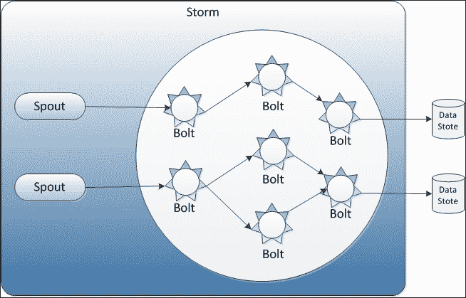
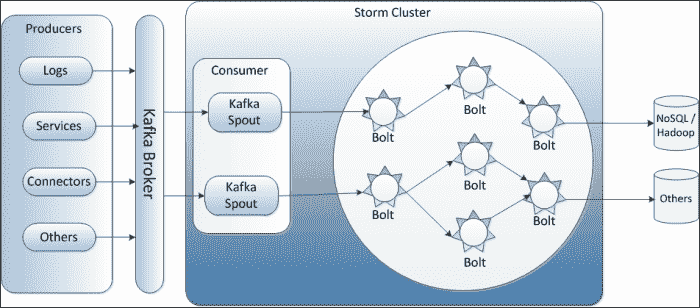
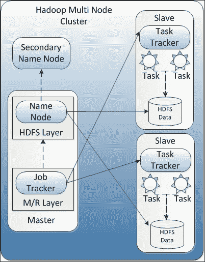

# 六、Kafka集成

考虑一个网站的使用案例，其中需要跟踪连续的安全事件，例如用户身份验证和访问安全资源的授权，并且需要针对任何安全漏洞实时做出决策。使用任何典型的面向批处理的数据处理系统，如 Hadoop，所有数据都需要先收集，然后进行处理以揭示模式，这将使判断网络应用程序是否存在任何安全威胁为时已晚。因此，这是实时数据处理的经典用例。

让我们考虑另一个使用案例，其中捕获并预处理了客户通过网站使用生成的原始点击流。处理这些点击流提供了对客户偏好的有价值的洞察，并且这些洞察可以在以后与营销活动和推荐引擎相结合，以提供对消费者的分析。因此，我们可以简单地说，存储在 Hadoop 上的大量点击流数据将由 Hadoop MapReduce 作业以批处理模式进行处理，而不是实时处理。

在本章中，我们将探索如何将Kafka与以下技术集成，以解决不同的用例，例如使用Storm的实时处理，如Spark流，以及使用 Hadoop 的批处理:

*   Kafka与《Storm》的融合
*   Kafka 与 Hadoop 的集成

让我们开始吧。

# Kafka与Storm的融合

使用诸如**【Java 消息服务】** ( **JMS** )等技术，实时处理少量数据从来不是一个挑战；然而，当处理大量流数据时，这些处理系统表现出性能限制。此外，这些系统不是好的水平可扩展解决方案。

# 引入Storm

**Storm** 是一个开源、分布式、可靠、容错的系统，用于实时处理大容量数据流。它支持许多用例，例如实时分析、在线机器学习、连续计算，以及**提取转换负载** ( **ETL** )范式。

有多种组件可以协同工作进行流数据处理，如下所示:

*   **喷口**:这是一个连续的日志数据流。
*   **螺栓**:喷口将数据传递给一个叫做**螺栓**的部件。一个 bolt 消耗任意数量的输入流，进行一些处理，并可能发出新的流。例如，通过处理推文流发出趋势分析流。

下图显示了 Storm 体系结构中的喷管和螺栓:



我们可以假设一个Storm集群是一个螺栓组件链，其中每个螺栓对喷口流过的数据执行某种转换。除了喷管和螺栓，其他几个部件如下:

*   元组:这是Storm 使用的原生数据结构(任意数据类型的名称列表值)。
*   流:这表示元组序列。
*   工人:这些代表Storm过程。
*   执行者:Storm工作者发起的Storm线程。在这里，工人可以运行一个或多个执行器，执行器可以从喷口或插销运行一个或多个Storm作业。

接下来在Storm集群中，作业通常被称为**拓扑**；唯一的区别是这些拓扑永远运行。对于Storm上的实时计算，创建的拓扑只是计算图。通常，拓扑定义数据如何从喷口通过螺栓流动。这些拓扑本质上可以是事务性的，也可以是非事务性的。

### 注

关于Storm的完整信息可以在[http://storm-project.net/](http://storm-project.net/)找到。

如果您使用过 Storm 或者对 Storm 有一定的了解，以下部分将会非常有用。

## 整合Storm

我们在前面的章节中已经了解到，Kafka 是一个基于发布者-订阅者的高性能消息传递系统，具有高度可伸缩性。Kafka喷口可用于整合Storm和Kafka集群。

Kafka喷口是一个常规喷口实现，从Kafka集群读取数据。这个Kafka壶嘴，之前在[https://github.com/wurstmeister/storm-kafka-0.8-plus](https://github.com/wurstmeister/storm-kafka-0.8-plus)有，现在合并到核心Storm项目 0.9.2 版本-孵化中，可以在[https://github . com/Apache/Storm/tree/master/external/Storm-Kafka](https://github.com/apache/storm/tree/master/external/storm-kafka)找到。这个Storm-Kafka喷口提供了关键特性，如支持动态发现Kafka经纪人和“恰好一次”元组处理。除了常规的KafkaStorm喷口，它还为Kafka提供了三叉戟喷口的实现。在这一部分，我们的重点将仍然是常规的Storm-Kafka喷口。

### 注

三叉戟是在Storm之上做实时计算的高级抽象。它允许我们无缝混合高吞吐量(每秒数百万条消息)、有状态流处理和低延迟分布式查询。欲了解更多信息[。](https://storm.apache.org/documentation/Trident-tutorial.html)

两个 spout 实现都使用`BrokerHost`接口，该接口跟踪 Kafka 代理主机到分区的映射和`KafkaConfig`参数。为`BrokerHost`界面提供了`ZkHosts`和`StaticHosts`两种实现方式。

`ZkHosts`实现用于借助Kafka动物园管理员的条目动态跟踪Kafka经纪人到分区的映射:

```scala
public ZkHosts(String brokerZkStr, String brokerZkPath) 
public ZkHosts(String brokerZkStr)
```

前面的构造函数用于创建`ZkHosts`的实例。这里`brokerZkStr`可以是`localhost:9092`，`brokerZkPath`是存储所有话题和分区信息的根目录。`brokerZkPath`的默认值为`/brokers`。

`StaticHosts`实现用于静态分区信息，如下所示:

```scala
//localhost:9092\. Uses default port as 9092.
Broker brokerPartition0 = new Broker("localhost");

//localhost:9092\. Takes the port explicitly
Broker brokerPartition1 = new Broker("localhost", 9092);    

//localhost:9092 specified as one string.
Broker brokerPartition2 = new Broker("localhost:9092");    

GlobalPartitionInformation partitionInfo = new GlobalPartitionInformation();

//mapping form partition 0 to brokerPartition0
partitionInfo.addPartition(0, brokerPartition0);

//mapping form partition 1 to brokerPartition1
partitionInfo.addPartition(1, brokerPartition1);    

//mapping form partition 2 to brokerPartition2
partitionInfo.addPartition(2, brokerPartition2);

StaticHosts hosts = new StaticHosts(partitionInfo);
```

为了创建`StaticHosts`实例，`GlobalPartitionInformation`的第一个实例被创建，如前面的代码所示。接下来，需要创建`KafkaConfig`实例来构建Kafka喷口，如下所示:

```scala
public KafkaConfig(BrokerHosts hosts, String topic)
public KafkaConfig(BrokerHosts hosts, String topic, String clientId)
```

前面的构造函数采用以下参数:

*   Kafka经纪人名单
*   用于阅读消息的主题名称
*   客户端标识，用作动物园管理员路径的一部分，喷口作为消费者存储当前消费补偿。

`KafkaConfig`类还有一堆公共变量，用于控制应用程序的行为以及 spout 如何从Kafka集群获取消息:

```scala
  public int fetchSizeBytes = 1024 * 1024;
  public int socketTimeoutMs = 10000;
  public int fetchMaxWait = 10000;
  public int bufferSizeBytes = 1024 * 1024;
  public MultiScheme scheme = new RawMultiScheme();
  public boolean forceFromStart = false;
  public long startOffsetTime = 
        kafka.api.OffsetRequest.EarliestTime();
  public long maxOffsetBehind = Long.MAX_VALUE;
  public boolean useStartOffsetTimeIfOffsetOutOfRange = true;
  public int metricsTimeBucketSizeInSecs = 60;
```

`Spoutconfig`类扩展了`KafkaConfig`类，支持两个附加值，如`zkroot`和`id`:

```scala
public SpoutConfig(BrokerHosts hosts, String topic, String zkRoot, String id);
```

前面的构造函数还采用了以下内容:

*   Zookeeper 中的根路径，spout 在这里存储消费者偏移量
*   喷口的独特身份

下面的代码示例显示了使用前面的参数进行的`KafkaSpout`类实例初始化:

```scala
// Creating instance for BrokerHosts interface implementation
BrokerHosts hosts = new ZkHosts(brokerZkConnString);

// Creating instance of SpoutConfig
SpoutConfig spoutConfig = new SpoutConfig(brokerHosts, topicName, "/" + topicName, UUID.randomUUID().toString());

// Defines how the byte[] consumed from kafka gets transformed into // a storm tuple
spoutConfig.scheme = new SchemeAsMultiScheme(new StringScheme());

// Creating instance of KafkaSpout
KafkaSpout kafkaSpout = new KafkaSpout(spoutConfig);
```

下图显示了KafkaStorm工作模型的高级集成视图:



Kafka喷口使用与 Apache Storm 相同的 Zookeeper 实例来存储消息偏移的状态，并在消息被消耗时跟踪片段消耗。这些偏移量存储在为 Zookeeper 指定的根路径上。Kafka喷口使用这些偏移量在下游故障或超时的情况下重放元组。虽然 Kafka 也提供了倒回前一个偏移量的功能，而不是从最后一个保存的偏移量开始，但是它选择了围绕指定时间戳写入的最新偏移量:

```scala
spoutConfig.forceStartOffsetTime(TIMESTAMP);
```

这里的值`-1`强制Kafka喷口从最近的偏移重新开始，而`-2`强制喷口从最早的偏移重新开始。

这个Storm-Kafka喷口也有一个，因为它不支持Kafka 0.7x 经纪人，只支持Kafka 0.8.1.x 以上。

### 注

要运行带有Storm的Kafka，Storm和Kafka的集群都需要设置并应该运行。Storm集群的设置超出了本书的范围。

# Kafka与 Hadoop 的融合

资源共享、稳定性、可用性和可扩展性是分布式计算面临的众多挑战中的几个。如今，另一个挑战是处理待定项或待决项中的大量数据。

## 介绍 Hadoop

Hadoop 是一个大规模分布式批处理框架，可以跨多个节点并行处理数据，解决了分布式计算的挑战，包括大数据。

Hadoop 的工作原理是 MapReduce 框架(由 Google 引入)，它为大规模计算的并行化和分布提供了一个简单的接口。Hadoop 有自己的分布式数据文件系统，称为 **Hadoop 分布式文件系统** ( **HDFS** )。在任何典型的 Hadoop 集群中，HDFS 将数据分割成小块(称为**)并将其分发给所有节点。HDFS 还复制这些小块数据并存储起来，以确保在任何节点出现故障时，数据都可以从另一个节点获得。**

 **下图显示了多节点 Hadoop 集群的高级视图:



Hadoop 有以下主要组件:

*   **名称节点**:这是 HDFS 的一个单点互动。名称节点存储关于分布在节点上的小块数据的信息。
*   **二级名称节点**:该节点存储编辑日志，有助于在名称节点发生故障的情况下恢复 HDFS 的最新更新状态。
*   **数据节点**:这些节点以块的形式存储名称节点分发的实际数据，也存储来自其他节点的数据的复制副本。
*   **作业跟踪器**:这是负责将 MapReduce 作业拆分成更小的任务。
*   **任务跟踪器**:任务跟踪器负责执行作业跟踪器拆分的任务。

数据节点和任务跟踪器共享相同的机器和 MapReduce 作业分割；任务的执行是基于名称节点提供的数据存储位置信息来完成的。

现在，在我们讨论Kafka 与 Hadoop 的集成之前，让我们快速建立一个伪分布式模式的单节点 Hadoop 集群。

### 注

Hadoop 集群可以以三种不同的模式进行设置:

*   本地方式
*   伪分布式模式
*   全分布式模式

本地模式和伪分布式模式在单节点集群上工作。在本地模式下，所有 Hadoop 主要组件运行在单个 JVM 实例中；而在伪分布式模式下，每个组件运行在单个节点上的独立 JVM 实例中。伪分布式模式主要被开发人员用作开发环境。在完全分布式模式下，所有组件都运行在不同的节点上，并在测试和生产环境中使用。

以下是用于创建伪分布式模式集群的步骤:

1.  安装和配置 Java。参见[第一章](1.html "Chapter 1. Introducing Kafka")、*介绍Kafka*中的*安装 Java 1.7 或更高版本*部分。
2.  从[http://www.apache.org/dyn/closer.cgi/hadoop/common/](http://www.apache.org/dyn/closer.cgi/hadoop/common/)下载当前稳定的 Hadoop 发行版。
3.  在`/opt`中解压下载的 Hadoop 发行版，并将 Hadoop 的`bin`目录添加到路径中，如下所示:

    ```scala
     # Assuming your installation directory is /opt/Hadoop-2.6.0
     [root@localhost opt]#export HADOOP_HOME=/opt/hadoop-2.6.0
     [root@localhost opt]#export PATH=$PATH:$HADOOP_HOME/bin
    ```

4.  添加以下配置:

    ```scala
    etc/hadoop/core-site.xml:
    <configuration>
        <property>
            <name>fs.defaultFS</name>
            <value>hdfs://localhost:9000</value>
        </property>
    </configuration>

     etc/hadoop/hdfs-site.xml:
    <configuration>
        <property>
            <name>dfs.replication</name>
            <value>1</value>
        </property>
    </configuration>
    ```

5.  Set up ssh to the localhost without a passphrase:

    ```scala
    [root@localhost opt]# ssh localhost
    ```

    如果 ssh 到 localhost 在没有密码的情况下无法工作，请执行以下命令:

    ```scala
    [root@localhost opt]# ssh-keygen -t dsa -P '' -f ~/.ssh/id_dsa [root@localhost opt]# cat ~/.ssh/id_dsa.pub >> ~/.ssh/authorized_keys

    ```

6.  格式化文件系统:

    ```scala
    [root@localhost opt]# bin/hdfs namenode -format

    ```

7.  启动名称节点守护程序和数据节点守护程序:

    ```scala
    [root@localhost opt]# sbin/start-dfs.sh

    ```

一旦 Hadoop 集群设置成功，在`http://localhost:50070/`浏览名称节点的网页界面。

## 集成 Hadoop

如果你曾经使用过 Hadoop 或者对 Hadoop 有所了解，这个部分会很有用。

对于实时发布-订阅用例，Kafka 用于构建可用于实时处理或监控的管道，并将数据加载到 Hadoop、NoSQL 或数据仓库系统中进行离线处理和报告。

Kafka 在其`contrib`目录下为 Hadoop 生产者和消费者提供了源代码。

## Hadoop 生产者

一个 Hadoop 生产者为从 Hadoop 集群向 Kafka 发布数据提供了一个桥梁，如下图所示:


对于一个Kafka式的制作人来说，Kafka式的主题被认为是 URIs，而为了联系到一个特定的Kafka式经纪人，URIs 被指定如下:

```scala
kafka://<kafka-broker>/<kafka-topic>
```

Hadoop 生产者代码提出了从 Hadoop 获取数据的两种可能方法:

*   **Using the Pig script and writing messages in Avro format**: In this approach, Kafka producers use Pig scripts for writing data in a binary Avro format, where each row signifies a single message. For pushing the data into the Kafka cluster, the `AvroKafkaStorage` class (it extends Pig's `StoreFunc` class) takes the Avro schema as its first argument and connects to the Kafka URI. Using the `AvroKafkaStorage` producer, we can also easily write to multiple topics and brokers in the same Pig-script-based job. While writing Pig scripts, required Kafka JAR files also need to be registered. The following is the sample Pig script:

    ```scala
        REGISTER hadoop-producer_2.8.0-0.8.0.jar;
        REGISTER avro-1.4.0.jar;
        REGISTER piggybank.jar;
        REGISTER kafka-0.8.0.jar;
        REGISTER jackson-core-asl-1.5.5.jar;
        REGISTER jackson-mapper-asl-1.5.5.jar;
        REGISTER scala-library.jar;

    member_info = LOAD 'member_info.tsv' AS (member_id : int, name : chararray);

    names = FOREACH member_info GENERATE name;

    STORE member_info INTO 'kafka://localhost:9092/member_info' USING kafka.bridge.AvroKafkaStorage('"string"');
    ```

    在前面的脚本中，Pig `StoreFunc`类利用 Piggybank 中的`AvroStorage`将 Pig 的数据模型转换为指定的 Avro 模式。

*   **为作业使用 Kafka OutputFormat 类**:在这种方法中，Kafka `OutputFormat`类(它扩展了 Hadoop 的`OutputFormat`类)用于向 Kafka 集群发布数据。使用 0.20 MapReduce 应用编程接口，这种方法以字节形式发布消息，并通过使用低级发布方法提供对输出的控制。Kafka`OutputFormat`类使用`KafkaRecordWriter`类(它扩展了 Hadoop 的`RecordWriter`类)向 Hadoop 集群写入记录(消息)。

对于Kafka制作人，我们也可以在作业配置中通过在`kafka.output`前加前缀来配置Kafka制作人参数。例如，要更改压缩编解码器，请添加`kafka.output.compression.codec`参数(例如，Pig 脚本中的`SET kafka.output.compression.codec 0`表示无压缩)。与这些值一起，Kafka经纪人信息(`kafka.metadata.broker.list`)、主题(`kafka.output.topic`)和模式(`kafka.output.schema`)被注入到作业的配置中。

## Hadoop 消费者

一个 Hadoop 消费者是一个 Hadoop 作业，它从Kafka经纪人那里获取数据，然后将数据推送到 HDFS。下图显示了Kafka消费者在架构模式中的位置:


一个 Hadoop 作业执行从 Kafka 到 HDFS 的并行加载，加载数据的映射器数量取决于输入目录中的文件数量。输出目录包含来自Kafka的数据和更新的主题偏移。单个地图绘制者在地图任务结束时将最后一条消耗的消息的偏移量写入 HDFS。如果某个作业失败并且重新启动了作业，则每个映射器只需从存储在 HDFS 的偏移量重新启动。

`Kafka-0.8.1.1-src/contrib/hadoop-consumer`目录中提供的 ETL 示例演示了提取Kafka数据并将其加载到 HDFS。它需要来自配置文件的以下输入，例如:`test/test.properties`:

*   `kafka.etl.topic`:要取的题目。
*   `kafka.server.uri`:Kafka服务器 URI。
*   `input`:包含`DataGenerator`可以生成的主题偏移的输入目录。该目录中的文件数量决定了 Hadoop 作业中映射器的数量。
*   `output`:包含Kafka数据和更新的主题偏移的输出目录。
*   `kafka.request.limit`:用于限制获取的事件数量。

在Kafka消费者中，`KafkaETLRecordReader`实例是与`KafkaETLInputFormat`相关联的记录读取器。它从提供的偏移量(由`input`指定)开始从服务器获取Kafka数据，并在达到最大可用偏移量或指定限制(由`kafka.request.limit`指定)时停止。`KafkaETLJob`还包含一些帮助函数来初始化作业配置，`SimpleKafkaETLJob`设置作业属性并提交 Hadoop 作业。一旦作业开始`SimpleKafkaETLMapper`将Kafka数据转储到 HDFS(由`output`指定)。

# 总结

在这一章中，我们主要学习了 Kafka 如何在实时/批处理数据处理领域与现有的开源框架集成。在实时数据处理领域，Kafka利用现有的Storm喷口与Storm整合。至于批量数据处理，Kafka带来了基于 Hadoop 的数据生产者和消费者，这样数据可以发布到 HDFS，使用 MapReduce 处理，然后消费。

在下一章，也是本书的最后一章，我们将看看关于Kafka的一些其他重要事实。**