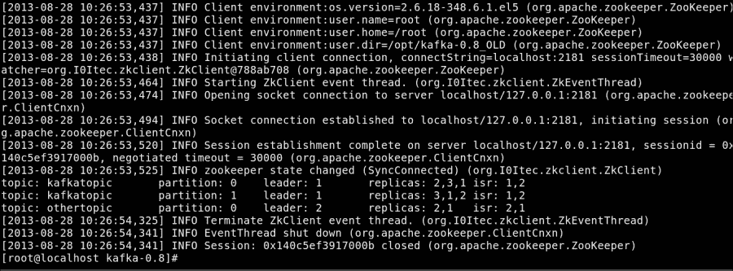
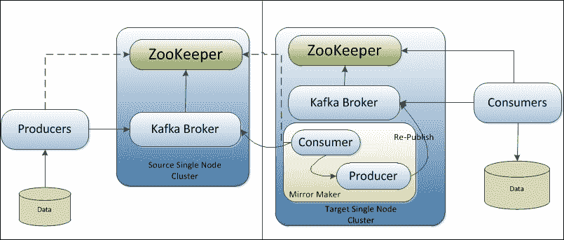

# 第七章。卡夫卡的运作

在最后一章中，我们将探索卡夫卡集群管理和卡夫卡主题管理可用的工具。此外，我们还将简要讨论卡夫卡集群镜像以及卡夫卡与第三方工具的集成。

本章的主要重点领域如下:

*   卡夫卡管理工具
*   卡夫卡集群镜像
*   与其他工具的集成

# 卡夫卡管理工具

Kafka 0.8.x 提供了许多工具或实用程序来管理诸如集群管理、主题工具、集群镜像等功能。让我们快速了解一下这些工具。

## 卡夫卡集群工具

集群管理是卡夫卡行政官的主要职责之一。一旦集群成功启动，就需要对其进行维护，以进行服务器关闭、领导者平衡、复制、集群镜像和扩展卡夫卡集群等活动。让我们详细谈谈这些。

正如我们从卡夫卡的设计中学到的，在复制中，多个分区可以有复制的数据，在这些多个副本中，一个副本充当主导副本，其余副本充当主导副本的同步追随者。在潜在客户副本不可用的情况下，可能由于代理关闭，需要选择新的潜在客户副本。

对于诸如为了维护活动而关闭 Kafka 代理这样的场景，新领导者的选举是按顺序进行的，这导致 Zookeeper 的大量读/写操作。在任何具有许多主题/分区的大型集群中，潜在副本的顺序选择会导致可用性延迟。

为了确保高可用性，卡夫卡为卡夫卡经纪人的受控关闭提供了工具。如果代理关闭了引导分区，此工具会主动将引导转移到另一个代理上的其他同步副本。如果没有同步副本可用，该工具将无法关闭代理，以确保没有数据丢失。

以下是使用此工具的格式:

```scala
[root@localhost kafka_2.9.2-0.8.1.1]# bin/kafka-run-class.sh kafka.admin.ShutdownBroker --zookeeper <zookeeper_host:port/namespace> --broker <brokerID> --num.retries 3 --retry.interval.ms 100

```

需要关闭的 ZooKeeper 主机和代理 ID 是强制参数。我们还可以使用受控关机工具指定可选参数、重试次数(`--num.retries, default value 0`)和重试间隔(以毫秒为单位)(`--retry.interval.ms, default value 1000`)。

当服务器正常停止时，它会自动将其所有日志同步到磁盘，以避免再次重新启动时进行任何日志恢复，因为日志恢复是一项耗时的活动。在关闭之前，它还会将服务器上的前导分区迁移到其他副本。这确保了每个分区的停机时间最小(最多几毫秒)。服务器的受控关闭也需要启用，如下所示:

```scala
    controlled.shutdown.enable=true
```

接下来，在任何具有许多代理、主题和分区的大型 Kafka 集群中，Kafka 确保分区的首选/主要副本在代理之间平均分布。但是，如果发生关闭(也受控制)或代理故障，这种销售线索副本的平均分布可能会在集群内不平衡。

Kafka 提供了一个工具，用于在 Kafka 集群内的可用经纪人之间保持销售线索副本的平衡分布。

以下是使用此工具的格式:

```scala
[root@localhost kafka_2.9.2-0.8.1.1]# bin/kafka-preferred-replica-election.sh --zookeeper <zookeeper_host:port/namespace>

```

这个工具用主题分区的列表更新 ZooKeeper 路径，主题分区的领导者需要被移动到首选副本列表。一旦列表被更新，控制器从 ZooKeeper 异步检索优选主题分区的列表，并且对于每个主题分区，控制器验证优选副本是否是领导者。如果控制器发现首选副本不是领导者，并且不在 ISR 列表中，它会向代理发出请求，让首选副本成为分区的领导者，以创建平衡的分布。如果首选副本不在 ISR 列表中，控制器将使操作失败，以避免任何数据丢失。对于该工具，还可以提供 JSON 文件格式的主题分区列表，如下所示:

```scala
[root@localhost kafka_2.9.2-0.8.1.1]# bin/kafka-preferred-replica-election.sh --zookeeper <zookeeper_host:port/namespace> --path-to-json-file topicPartitionList.json

```

以下是`topicPartitionList.json`文件的格式:

```scala
{
  "partitions":
  [
    {"topic": "Kafkatopic", "partition": "0"},
    {"topic": "Kafkatopic", "partition": "1"},
    {"topic": "Kafkatopic", "partition": "2"},

    {"topic": "Kafkatopic1", "partition": "0"},
    {"topic": "Kafkatopic1", "partition": "1"},
    {"topic": "Kafkatopic1", "partition": "2"},
  ]
}
```

## 添加服务器

为了向 Kafka 集群添加服务器，需要为新服务器分配一个唯一的代理 ID，以便在新服务器上设置/启动 Kafka。这种添加新服务器的方式不会自动分配任何数据分区。因此，除非将现有分区迁移到服务器或创建新主题，否则新添加的服务器不会执行任何工作。

现有分区的迁移过程由 Kafka 管理员手动启动，因为管理员必须找出应该移动哪些主题或分区。一旦分区被管理员识别，分区重新分配工具(`bin/kafka-reassign-partitions.sh`)就被用来在代理之间移动分区，这就解决了所有问题。作为迁移过程，Kafka 将使这个新添加的服务器成为它正在迁移的分区的追随者。这允许新服务器完全复制该分区中的现有数据。一旦新服务器完全复制了分区的内容并成为同步副本的一部分，现有副本之一将删除分区的数据。分区重新分配工具(`kafka-reassign-partitions.sh`)以三种不同的模式运行:

*   `--generate`:在该模式下，工具根据工具共享的主题和代理列表，生成候选重新分配，将指定主题的所有分区移动到新服务器
*   -执行:在此模式下，工具根据用户提供的重新分配计划开始重新分配分区，该计划由`--reassignment-json-file`选项指定
*   `--verify`:在该模式下，工具验证最后一次`--execute`中列出的所有分区的重新分配状态(成功完成/失败/进行中)

分区重新分配工具可用于将当前代理集中的选定主题移动到新添加的代理(服务器)中。管理员应该提供一个要移动到新服务器的主题列表和一个新代理标识的目标列表。该工具在新代理之间平均分配给定主题的所有分区，并且还移动输入主题列表的所有分区的副本。

```scala
[root@localhost kafka_2.9.2-0.8.1.1]# cat topics-for-new-server.json
{"partitions":
 [{"topic": "kafkatopic",
 {"topic": "kafkatopic1"}],
 "version":1
}

[root@localhost kafka_2.9.2-0.8.1.1]# bin/kafka-reassign-partitions.sh --zookeeper localhost:2181 
--topics-to-move-json-file topics-for-new-server.json --broker-list "4,5" -–generate new-topic-reassignment.json

```

前面的命令生成分配(`new-topic-reassignment.json`)计划，将主题`kafkatopic`和`kafkatopic1`的所有分区移动到具有标识`4`和`5`的新经纪人集合。在此移动结束时，主题`foo1`和`foo2`的所有分区将只存在于经纪人`5`和`6`上。要启动分配，使用`kafka-reassign-partitions.sh`工具:

```scala
[root@localhost kafka_2.9.2-0.8.1.1]# bin/kafka-reassign-partitions.sh --zookeeper localhost:2181 --reassignment-json-file new-topic-reassignment.json --execute

```

此工具还可用于选择性地将分区从现有代理移动到新代理:

```scala
[root@localhost kafka_2.9.2-0.8.1.1]# cat partitions-reassignment.json
{"partitions":
 [{"topic": "kafkatopic",
 "partition": 1,
 "replicas": [1,2,4] }], 
 }],
 "version":1
}

[root@localhost kafka_2.9.2-0.8.1.1]# bin/kafka-reassign-partitions.sh --zookeeper localhost:2181
 --reassignment-json-file partitions-reassignment.json --execute

```

前面的命令有选择地将某些分区的一些副本移动到新服务器。重新分配完成后，可以验证操作:

```scala
[root@localhost kafka_2.9.2-0.8.1.1]# bin/kafka-reassign-partitions.sh --zookeeper localhost:2181 --reassignment-json-file new-topic-reassignment.json --verify

Status of partition reassignment:
Reassignment of partition [kafkatopic,0] completed successfully
Reassignment of partition [kafkatopic,1] is in progress
Reassignment of partition [kafkatopic,2] completed successfully
Reassignment of partition [kafkatopic1,0] completed successfully
Reassignment of partition [kafkatopic1,1] completed successfully
Reassignment of partition [kafkatopic1,2] is in progress 

```

要使 Kafka 集群中的任何服务器退役，管理员必须将待退役的代理(服务器)上托管的所有分区的副本移动到分布均匀的其余代理。`kafka-reassign-partitions.sh`工具也可以用来增加分区的复制因子，如下所示:

```scala
[root@localhost kafka_2.9.2-0.8.1.1]# cat increase-replication-factor.json
{"partitions":[{"topic":"kafkatopic","partition":0,"replicas":[2,3]}],
 "version":1
}

[root@localhost kafka_2.9.2-0.8.1.1]# bin/kafka-reassign-partitions.sh --zookeeper localhost:2181
 --reassignment-json-file increase-replication-factor.json --execute

```

前面的命令假设`kafkatopic`主题的分区`0`具有存在于代理 2 上的复制因子`1`；现在它将复制因子从`1`增加到了`2`，并且还在代理 3 上创建了新的副本。

## 卡夫卡话题工具

在默认情况下，卡夫卡用默认的分区数和复制因子创建主题(两者的默认值都是`1`)。但是，在现实场景中，我们可能需要不止一次地定义分区数量和复制因素。

以下是使用特定参数创建主题的命令:

```scala
[root@localhost kafka_2.9.2-0.8.1.1]# bin/kafka-topics.sh --create --zookeeper localhost:2181/chroot --replication-factor 3 --partitions 10 --topic kafkatopic

```

在前面的命令中，复制因子控制有多少服务器将复制由消息生产者发布的每条消息。例如，复制因子`3`意味着在失去对数据的访问之前，最多可以有两台服务器出现故障。为使用者启用并行的分区计数反映了主题将被分割到的日志数量。这里，每个分区必须完全适合一台服务器。例如，如果为一个主题定义了 10 个分区，则除副本之外，不超过 10 台服务器将处理整个数据集。

卡夫卡话题实用工具`kafka-topics.sh`也可以用来改变卡夫卡话题，如下所示:

```scala
[root@localhost kafka_2.9.2-0.8.1.1]# bin/kafka-topics.sh --alter --zookeeper localhost:2181/chroot --partitions 20 --topic kafkatopic

```

在前面的命令中，在前面的示例中创建的卡夫卡主题中又添加了 10 个分区。目前，Kafka 不支持减少分区数量或更改主题的复制因子。要删除卡夫卡主题，请使用以下命令:

```scala
[root@localhost kafka_2.9.2-0.8.1.1]# bin/kafka-topics.sh --delete --zookeeper localhost:2181/chroot --topic kafkatopic

```

使用`kafka-topics.sh`卡夫卡主题实用程序，也可以将配置添加到卡夫卡主题，如下所示:

```scala
[root@localhost kafka_2.9.2-0.8.1.1]# bin/kafka-topics.sh --alter --zookeeper localhost:2181/chroot --topic kafkatopic --config <key>=<value>

```

要从卡夫卡主题中删除配置，请使用以下命令:

```scala
[root@localhost kafka_2.9.2-0.8.1.1]# bin/kafka-topics.sh --alter --zookeeper localhost:2181/chroot --topic kafkatopic --deleteconfig <key>=<value>

```

Kafka 还提供了一个实用工具来搜索 Kafka 服务器中的主题列表。“列出主题”工具通过查询 Zookeeper，提供了主题列表以及关于它们的分区、副本或领导者的信息。

以下命令获取主题列表:

```scala
[root@localhost kafka_2.9.2-0.8.1.1]# bin/kafka-topics.sh --list --zookeeper localhost:2181

```

在执行前面的命令时，您应该会得到如下截图所示的输出:



前面的控制台输出显示，我们可以获得关于主题和具有复制数据的分区的信息。上一张截图的输出可以解释如下:

*   `leader`:这是为分区的特定部分随机选择的节点，负责该分区的所有读写操作
*   `replicas`:表示保存指定分区日志的节点列表
*   `isr`:这表示同步副本列表中当前活动的子集，并且与领导者同步

注意`kafkatopic`有两个分区(分区`0`和`1`，有三个副本，而`othertopic`只有一个分区，有两个副本。

在获取卡夫卡主题列表的同时，还可以提供两个可选参数:`under-replicated-partitions`和`unavailable-partitions`。`under-replicated-partitions`参数用于获取那些副本复制不足的主题/分区的详细信息。`unavailable-partitions`参数用于获取那些标题不可用的主题/分区的详细信息。

# 卡夫卡集群镜像

卡夫卡镜像功能用于创建现有集群的复制，例如，将主动数据中心复制到被动数据中心。Kafka 提供了一个镜像工具，用于将源集群镜像到目标集群中。

下图描述了架构形式的镜像工具放置:



在这种体系结构中，镜像工具的工作是使用来自源集群的消息，并使用嵌入式生成器在目标集群上重新发布它们。卡夫卡迁移工具使用类似的方法从 0.7.x 卡夫卡集群迁移到 0.8.x 卡夫卡集群。

要镜像源集群，调出目标集群并启动镜像器进程，如下所示:

```scala
[root@localhost kafka_2.9.2-0.8.1.1]# bin/kafka-run-class.sh kafka.tools.MirrorMaker --consumer.config sourceClusterConsumer.config --num.streams 2 --producer.config targetClusterProducer.config --whitelist=".*"

```

成功启动 MirrorMaker 工具所需的最小参数是一个或多个使用者配置、生产者配置，以及作为标准 Java regex 模式的白名单或黑名单，例如，使用`--whitelist 'A|B'`镜像两个名为`A`和`B`的主题，或者使用`--whitelist '*'`镜像所有主题。`--blacklist`配置也可以用作标准的 Java regex 模式，以指定镜像时要排除的内容。它还要求镜像工具的使用者连接到源集群的 ZooKeeper，生产者连接到镜像集群的 ZooKeeper，或者`broker.list`参数。

为了实现高吞吐量，使用了以阻塞模式配置的异步嵌入式生成器。这确保了消息不会丢失，并且如果生成器的队列已满，阻塞生成器将一直等到消息被写入目标集群。生产者队列已满始终表明 MirrorMaker 瓶颈式地将消息重新发布到目标镜像集群和/或将消息刷新到磁盘。`--num.producers`选项也可以用来表示 MirrorMaker 中的生产者池，以提高吞吐量，因为目标集群的多个消费流可以处理多个生产者请求。`--num.streams`选项指定要创建的镜像使用者线程的数量。

镜像经常在跨数据中心的场景中使用，通常，高值用于 MirrorMaker 的使用者配置上的套接字缓冲区大小(`socket.buffersize`)和源集群代理配置上的`socket.send.buffer`。此外，MirrorMaker 使用者的获取大小(`fetch.size`)应该高于使用者的套接字缓冲区大小。如果`broker.list`与硬件负载平衡器一起用于生产者配置，还可以提供生产者故障重试次数的配置。

卡夫卡还提供工具，在镜像或一般情况下检查消费者的位置。这个工具显示了一个消费群中所有消费者的位置，以及距离日志消费者的终点有多远；它指示集群镜像的性能。该工具可按如下方式使用:

```scala
[root@localhost kafka_2.9.2-0.8.1.1]#bin/kafka-run-class.sh kafka.tools.ConsumerOffsetChecker --group MirrorGroup --zkconnect localhost:2181 --topic kafkatopic

Group         Topic      Pid Offset   logSize     Lag       Owner
MirrorGroup  kafkatopic   0    5         5         0        none
MirrorGroup kafkatopic    1    3         4         1        none
MirrorGroup kafkatopic    2    6         9         3        none

```

这里`--zkconnect`参数指向源集群的 ZooKeeper(例如，源数据中心)。`--topic`参数是一个可选参数，如果没有指定主题，则工具会打印指定消费群下所有主题的信息。

# 与其他工具的集成

本节讨论了许多贡献者为各种需求(如日志记录、打包、云集成和 Hadoop 集成)提供与 Apache Kafka 集成的贡献。

加缪([https://github.com/linkedin/camus](https://github.com/linkedin/camus))提供了一条从卡夫卡到 HDFS 的管道。在这个项目中，单个 MapReduce 作业执行以下步骤，以分布式方式将数据加载到 HDFS:

1.  作为第一步，它从 ZooKeeper 中发现了最新的主题和分区偏移量。
2.  MapReduce 作业中的每个任务从 Kafka 代理获取事件，并将提取的数据和审计计数一起提交到输出文件夹。
3.  作业完成后，最终偏移将写入 HDFS，并可由后续的 MapReduce 作业进一步使用。
4.  关于所消费消息的信息也在卡夫卡集群中更新。

其他一些有用的贡献有:

*   在亚马逊上自动部署和配置卡夫卡和动物园管理员([https://github.com/nathanmarz/kafka-deploy](https://github.com/nathanmarz/kafka-deploy))
*   伐木工具([https://github.com/leandrosilva/klogd2](https://github.com/leandrosilva/klogd2))
*   针对 Mozilla Metrics([https://github.com/mozilla-metrics/bagheera](https://github.com/mozilla-metrics/bagheera))的 REST 服务
*   阿帕奇骆驼-卡夫卡一体化([https://github.com/BreizhBeans/camel-kafka/wiki](https://github.com/BreizhBeans/camel-kafka/wiki))

### 注

卡夫卡生态系统工具的详细列表，请参考[https://cwiki.apache.org/confluence/display/KAFKA/Ecosystem](https://cwiki.apache.org/confluence/display/KAFKA/Ecosystem)。

# 总结

在这一章中，我们添加了一些关于 Kafka 的更多信息，比如它的管理员工具、它的集成以及 Kafka 非 Java 客户端。

在这个穿越阿帕奇卡夫卡的完整旅程中，我们接触到了许多关于卡夫卡的重要事实。您已经了解了开发 Kafka 的原因、它的安装过程以及它对不同类型集群的支持。我们还探索了卡夫卡的设计方法，写了一些基本的生产者和消费者。

最后，我们讨论了卡夫卡与 Hadoop 和风暴等技术的集成。

进化的旅程永远不会结束。