# Spark SQL 入门

Spark SQL 是使用 Spark 开发的所有应用程序的核心。在本书中，我们将非常详细地探讨 Spark SQL，包括它在各种类型的应用程序中的使用以及它的内部工作方式。开发人员和架构师在阅读本书的过程中，会欣赏每一章中介绍的技术概念和实践环节。

在本章中，我们将向您介绍与 Spark SQL 相关的关键概念。我们将从Spark会话开始，Spark 2.0 中Spark SQL 的新入口点。然后，我们将探索 Spark SQL 的接口 RDDs、数据框架和数据集 API。稍后，我们将解释关于 Catalyst 优化器和项目钨的开发人员级别的细节。

最后，我们将在 Spark 2.0 中为流式应用引入一个令人兴奋的新功能，称为结构化流。具体的实践练习(使用公开可用的数据集)将贯穿本章，因此您可以在阅读各个章节时积极跟进。

更具体地说，本章各节将涵盖以下主题以及实践操作会议:

*   什么是Spark SQL？
*   介绍迷你会话
*   理解Spark SQL 概念
    *   理解关系数据库、数据框架和数据集
    *   了解催化剂优化器
    *   了解钨项目
*   在连续应用中使用Spark SQL
*   理解结构化流内部

# 什么是Spark SQL？

Spark SQL 是 Apache Spark 最先进的组件之一。自 Spark 1.0 以来，它一直是核心发行版的一部分，支持 Python、Scala、Java 和 R 编程 API。如下图所示，Spark SQL 组件为 Spark 机器学习应用程序、流应用程序、图形应用程序和许多其他类型的应用程序架构提供了基础。


这类应用程序通常使用 Spark ML 管道、结构化流和 GraphFrames，它们都基于 Spark SQL 接口(DataFrame/Dataset API)。这些应用程序，以及诸如 SQL、数据框架和数据集应用编程接口等构造，自动获得了 Catalyst 优化器的好处。该优化器还负责基于较低级别的 RDD 接口生成可执行的查询计划。

我们将在[第 6 章](06.html#3279U0-e9cbc07f866e437b8aa14e841622275c)、*中更详细地探讨在机器学习应用程序*中使用 Spark SQL。图形框架将在[第 7 章](07.html#3VPBC0-e9cbc07f866e437b8aa14e841622275c)、*中介绍，在图形应用程序中使用 Spark SQL*。虽然我们将在本章中介绍关于结构化流和 Catalyst 优化器的关键概念，但我们将在[第 5 章](05.html#2H1VQ0-e9cbc07f866e437b8aa14e841622275c)、*在流应用程序中使用 Spark SQL*和[第 11 章](11.html#5RRUQ0-e9cbc07f866e437b8aa14e841622275c)、*为性能调整 Spark SQL 组件*中获得更多详细信息。

在 Spark 2.0 中，数据框架应用编程接口已经与数据集应用编程接口合并，从而统一了 Spark 库中的数据处理能力。这也使开发人员能够使用单个高级和类型安全的应用编程接口。然而，Spark 软件栈并不阻止开发人员在他们的应用程序中直接使用低级别的 RDD 接口。尽管低级别的 RDD 应用编程接口将继续可用，但是绝大多数开发人员预计(并且被推荐)使用高级别的应用编程接口，即数据集和数据框架应用编程接口。

此外，Spark 2.0 扩展了 Spark SQL 功能，包括一个新的 ANSI SQL 解析器，支持子查询和 SQL:2003 标准。更具体地说，子查询支持现在包括相关/不相关子查询，以及`WHERE / HAVING`子句中的`IN / NOT IN`和`EXISTS / NOT` `EXISTS`谓词。

Spark SQL 的核心是 Catalyst 优化器，它利用 Scala 的高级功能(如模式匹配)来提供可扩展的查询优化器。数据框架、数据集和 SQL 查询共享相同的执行和优化管道；因此，使用这些构造中的任何一个(或使用任何支持的编程接口)都不会对性能产生影响。开发人员编写的基于 DataFrame 的高级代码在通过该管道时被转换为 Catalyst 表达式，然后再转换为低级 Java 字节码。

`SparkSession`是 Spark SQL 相关功能的入口点，我们将在下一节更详细地描述它。

# 介绍迷你会话

在 Spark 2.0 中，`SparkSession`代表在 Spark 中操作数据的统一入口点。它最大限度地减少了开发人员在使用 Spark 时必须使用的不同上下文的数量。`SparkSession`替换多个上下文对象，如`SparkContext`、`SQLContext`和`HiveContext`。这些上下文现在封装在`SparkSession`对象中。

在 Spark 程序中，我们使用构建器设计模式来实例化一个`SparkSession`对象。但是，在 REPL 环境中(也就是说，在Spark外壳会话中)，会自动创建`SparkSession`，并通过名为**Spark**的实例对象提供给您。

此时，在您的计算机上启动 Spark shell，以交互方式执行本节中的代码片段。当 shell 启动时，您会注意到屏幕上出现一堆消息，如下图所示。您应该会看到显示`SparkSession`对象(作为 Spark)可用性的消息，Spark 版本为 2.2.0，Scala 版本为 2.11.8，Java 版本为 1.8.x。


`SparkSession`对象可用于配置 Spark 的运行时配置属性。例如，Spark 和 Yarn 管理的两个主要资源是 CPU 和内存。如果您想为 Spark 执行器设置内核数量和堆大小，那么您可以通过分别设置`spark.executor.cores`和`spark.executor.memory`属性来实现。在本例中，我们将这些运行时属性分别设置为`2`内核和`4` GB，如图所示:

```scala
    scala> spark.conf.set("spark.executor.cores", "2")

    scala> spark.conf.set("spark.executor.memory", "4g")
```

`SparkSession`对象可以用来读取各种来源的数据，比如 CSV、JSON、JDBC、stream 等等。此外，它还可用于执行 SQL 语句、注册**用户定义函数** ( **UDFs** )以及处理数据集和数据框。下面的部分将说明 Spark 中的一些基本操作。

例如，我们使用威斯康星大学麦迪逊医院的威廉·沃尔伯格博士创建的乳腺癌数据库。您可以从[https://archive . ics . UCI . edu/ml/datasets/乳腺癌+癌症+威斯康星+(原文)](https://archive.ics.uci.edu/ml/datasets/Breast+Cancer+Wisconsin+(Original))下载原始数据集。数据集中的每一行包含样本号、分级为`1`至`10`的乳腺细针抽吸物的九个细胞学特征以及类别`label`、`benign (2)`或`malignant (4)`。

首先，我们为文件中的记录定义一个模式。字段描述可在数据集的下载网站上找到。

```scala
scala> import org.apache.spark.sql.types._

scala> val recordSchema = new StructType().add("sample", "long").add("cThick", "integer").add("uCSize", "integer").add("uCShape", "integer").add("mAdhes", "integer").add("sECSize", "integer").add("bNuc", "integer").add("bChrom", "integer").add("nNuc", "integer").add("mitosis", "integer").add("clas", "integer")

```

接下来，我们使用上一步中定义的记录模式从输入 CSV 文件创建一个数据帧:

```scala
val df = spark.read.format("csv").option("header", false).schema(recordSchema).load("file:///Users/aurobindosarkar/Downloads/breast-cancer-wisconsin.data")
```

可以使用`show()`方法显示新创建的数据帧:

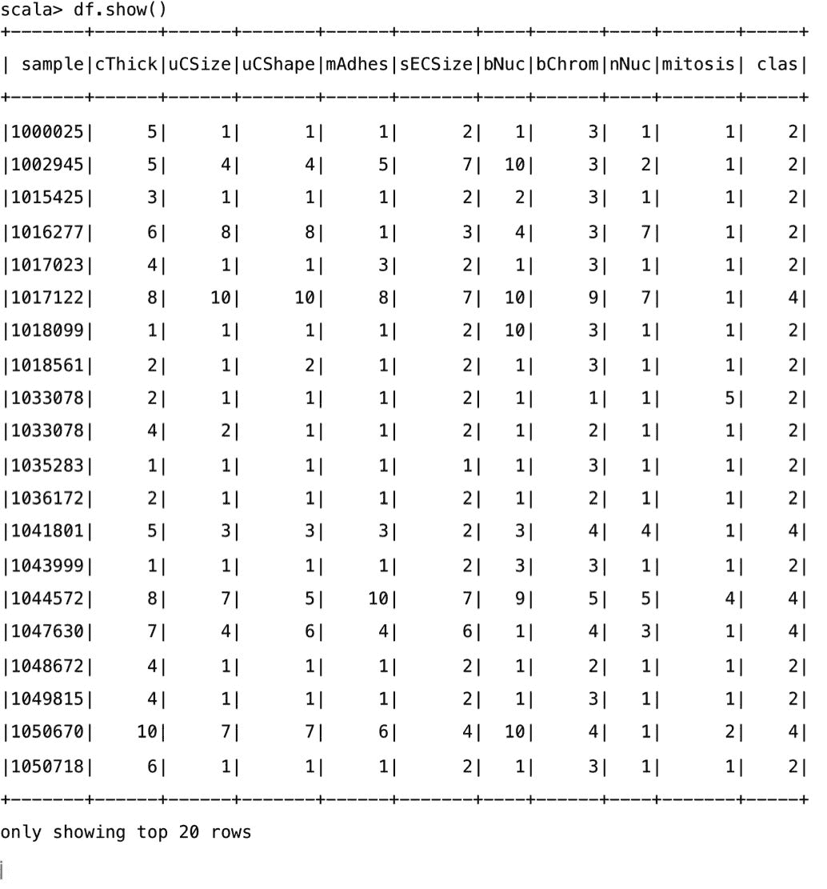

可以使用`createOrReplaceTempView()`方法将数据框注册为一个 SQL 临时视图。这允许应用程序使用 SparkSession 对象的`sql`函数运行 SQL 查询，并将结果作为数据帧返回。

接下来，我们为数据框创建一个临时视图，并对其执行一个简单的 SQL 语句:

```scala
scala> df.createOrReplaceTempView("cancerTable") 

scala> val sqlDF = spark.sql("SELECT sample, bNuc from cancerTable") 
```

使用`show()`方法显示结果数据框的内容:

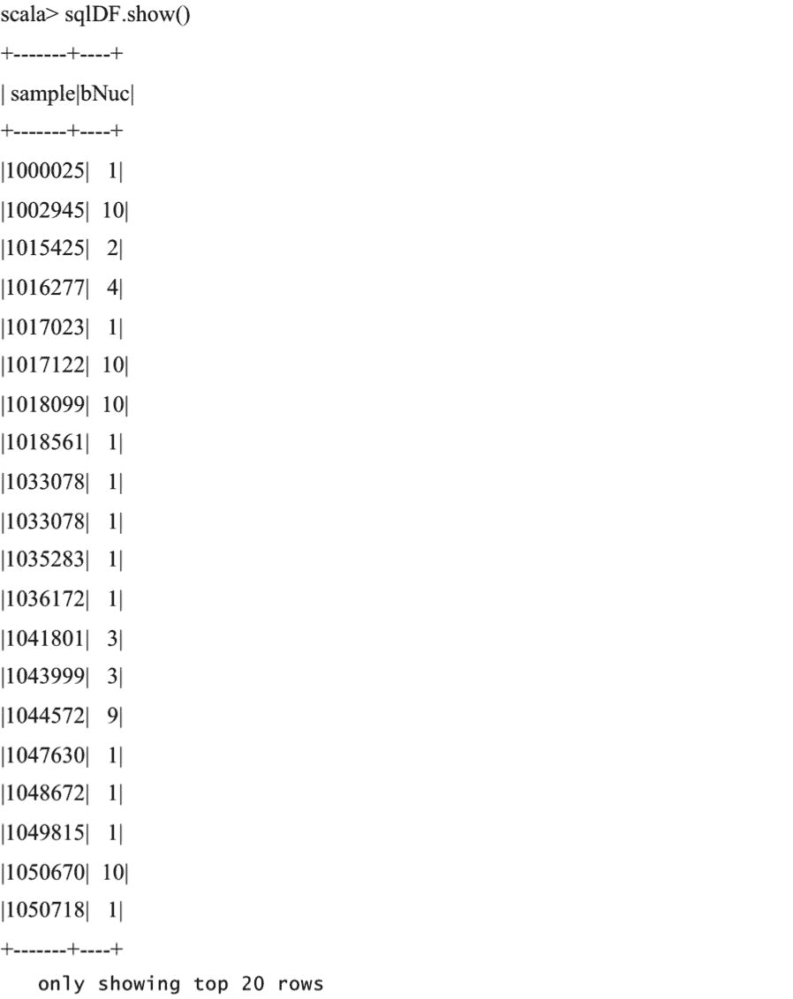

在下一个代码片段中，我们向您展示了使用`case`类和`toDS()`方法创建Spark数据集的语句。然后，我们定义一个 UDF 来转换`clas`列，当前分别包含`2's`和`4's`到`0's`和`1's`。我们使用`SparkSession`对象注册 UDF，并在一个 SQL 语句中使用它:

```scala
scala> case class CancerClass(sample: Long, cThick: Int, uCSize: Int, uCShape: Int, mAdhes: Int, sECSize: Int, bNuc: Int, bChrom: Int, nNuc: Int, mitosis: Int, clas: Int)scala> val cancerDS = spark.sparkContext.textFile("file:///Users/aurobindosarkar/Documents/SparkBook/data/breast-cancer-wisconsin.data").map(_.split(",")).map(attributes => CancerClass(attributes(0).trim.toLong, attributes(1).trim.toInt, attributes(2).trim.toInt, attributes(3).trim.toInt, attributes(4).trim.toInt, attributes(5).trim.toInt, attributes(6).trim.toInt, attributes(7).trim.toInt, attributes(8).trim.toInt, attributes(9).trim.toInt, attributes(10).trim.toInt)).toDS()scala> def binarize(s: Int): Int = s match {case 2 => 0 case 4 => 1 }scala> spark.udf.register("udfValueToCategory", (arg: Int) => binarize(arg))scala> val sqlUDF = spark.sql("SELECT *, udfValueToCategory(clas) from cancerTable")scala> sqlUDF.show()
```


`SparkSession`公开访问底层元数据的方法(通过 catalog 属性)，如可用的数据库和表、注册的 UDF、临时视图等。此外，我们还可以缓存表、删除临时视图和清除缓存。这里显示了其中一些语句及其相应的输出:

```scala
scala> spark.catalog.currentDatabaseres5: String = defaultscala> spark.catalog.isCached("cancerTable") res6: Boolean = false scala> spark.catalog.cacheTable("cancerTable") scala> spark.catalog.isCached("cancerTable") res8: Boolean = true scala> spark.catalog.clearCache scala> spark.catalog.isCached("cancerTable") res10: Boolean = false scala> spark.catalog.listDatabases.show()
```

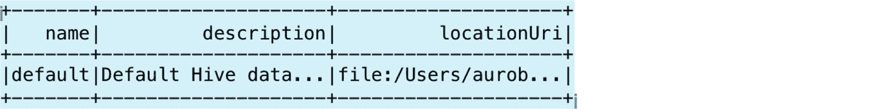

也可以使用`take`方法在数据框中显示特定数量的记录:

```scala
scala> spark.catalog.listDatabases.take(1)res13: Array[org.apache.spark.sql.catalog.Database] = Array(Database[name='default', description='Default Hive database', path='file:/Users/aurobindosarkar/Downloads/spark-2.2.0-bin-hadoop2.7/spark-warehouse'])scala> spark.catalog.listTables.show()
```

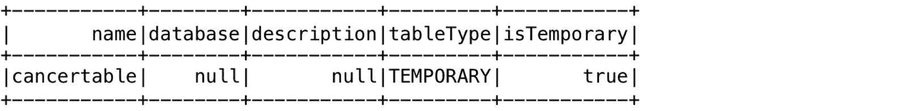

我们可以使用以下语句删除之前创建的临时表:

```scala
scala> spark.catalog.dropTempView("cancerTable")scala> spark.catalog.listTables.show()
```


在接下来的几节中，我们将更详细地描述关系数据库、数据框架和数据集构造。

# 理解Spark SQL 概念

在本节中，我们将探讨与弹性分布式数据集(RDD)、数据框架和数据集、催化剂优化器和钨项目相关的关键概念。

# 理解弹性分布式数据集

RDDs 是 Spark 的主要分布式数据集抽象。它是不可变、分布式、延迟评估、类型推断和可缓存的数据集合。在执行之前，开发人员代码(使用更高级别的结构，如 SQL、数据框架和数据集应用编程接口)被转换为一组关系数据库(准备执行)。

您可以通过并行化现有数据集合或访问驻留在外部存储系统(如文件系统或各种基于 Hadoop 的数据源)中的数据集来创建关系数据库。并行化的集合形成了一个分布式数据集，可以对其进行并行操作。

您可以使用指定的分区数从输入文件创建 RDD，如图所示:

```scala
scala> val cancerRDD = sc.textFile("file:///Users/aurobindosarkar/Downloads/breast-cancer-wisconsin.data", 4)scala> cancerRDD.partitions.sizeres37: Int = 4
```

您可以通过导入`spark.implicits`包并使用`toDF()`方法将 RDD 隐式转换为数据帧:

```scala
scala> import spark.implicits._scala> val cancerDF = cancerRDD.toDF()
```

为了创建具有特定模式的数据框，我们为数据框中包含的行定义了一个 Row 对象。此外，我们拆分逗号分隔的数据，将其转换为字段列表，然后将其映射到 Row 对象。最后，我们使用`createDataFrame()`创建具有指定模式的数据帧:

```scala
def row(line: List[String]): Row = { Row(line(0).toLong, line(1).toInt, line(2).toInt, line(3).toInt, line(4).toInt, line(5).toInt, line(6).toInt, line(7).toInt, line(8).toInt, line(9).toInt, line(10).toInt) }val data = cancerRDD.map(_.split(",").to[List]).map(row)val cancerDF = spark.createDataFrame(data, recordSchema)
```

此外，我们可以使用前面定义的`case`类轻松地将前面的数据框转换为数据集:

```scala
scala> val cancerDS = cancerDF.as[CancerClass]
```

RDD 数据在逻辑上被分成一组分区；此外，所有输入、中间和输出数据也表示为分区。RDD 分区的数量定义了数据碎片的级别。这些分区也是并行的基本单位。Spark 执行作业被分成多个阶段，由于每个阶段一次只能在一个分区上运行，因此调整分区的数量非常重要。比活动阶段更少的分区意味着您的群集可能未得到充分利用，而过多的分区会由于更高的磁盘和网络 I/O 而影响性能

RDDs 的编程接口支持两种类型的操作:转换和动作。转换从现有数据集创建一个新数据集，而操作返回一个值或计算结果。所有的转换都是延迟评估的——只有在执行一个操作来计算结果时，才会实际执行。这些转换形成了一个谱系图，而不是实际在多台机器上复制数据。这种基于图的方法实现了有效的容错模型。例如，如果 RDD 分区丢失，则可以基于沿袭图重新计算它。

您可以控制数据持久性(例如缓存)并为 RDD 分区指定放置首选项，然后使用特定的操作符来操作它们。默认情况下，Spark 将 rdd 保存在内存中，但是如果没有足够的内存，它会将它们溢出到磁盘。缓存将性能提高了几个数量级；然而，它通常是内存密集型的。其他持久性选项包括将 rdd 存储到磁盘，并在集群中的节点间复制它们。持久 rdd 的内存存储可以是反序列化或序列化的 Java 对象的形式。反序列化选项更快，而序列化选项更节省内存(但更慢)。未使用的 rdd 会自动从缓存中删除，但是，根据您的要求；如果不再需要特定的 RDD，那么您也可以显式地释放它。

# 理解数据框架和数据集

数据框类似于关系数据库中的表、pandas 数据框或 r 中的数据框。它是组织成列的分布式行集合。它使用 RDD 的不可变、内存中、弹性、分布式和并行能力，并将模式应用于数据。数据帧也是延迟评估的。此外，它们为分布式数据操作提供了一种特定于领域的语言。

从概念上讲，数据框是泛型对象集合`Dataset[Row]`的别名，其中一行是泛型非类型化对象。这意味着数据帧的语法错误会在编译阶段被捕获；但是，只有在运行时才会检测到分析错误。

数据框架可以从多种来源构建，如结构化数据文件、配置单元表、数据库或关系数据库。源数据可以从本地文件系统、HDFS、亚马逊 S3 和关系数据库管理系统中读取。此外，还支持其他流行的数据格式，如 CSV、JSON、Avro、Parquet 等。此外，您还可以创建和使用自定义数据源。

数据框架应用编程接口支持 Scala、Java、Python 和 R 编程接口。数据框架应用编程接口是声明性的，与过程性的 Spark 代码相结合，它在应用程序中的关系处理和过程性处理之间提供了更紧密的集成。数据帧可以使用 Spark 的过程应用编程接口或关系应用编程接口(具有更丰富的优化)来操作。

在早期版本的 Spark 中，您必须编写在 RDDs 上运行的任意 Java、Python 或 Scala 函数。在这个场景中，函数在不透明的 Java 对象上执行。因此，用户函数本质上是使用不透明对象和数据类型执行不透明计算的黑盒。这种方法非常通用，这样的程序可以完全控制每个数据操作的执行。但是，由于引擎不知道您正在执行的代码或数据的性质，因此不可能优化这些任意的 Java 对象。此外，开发人员有责任根据其特定工作负载的性质编写高效的程序。

在 Spark 2.0 中，使用 SQL、数据框和数据集的主要好处是，使用这些高级编程接口编程更容易，同时自动获得性能提高的好处。您必须编写少得多的代码行，程序会自动优化，并为您生成高效的代码。这将带来更好的性能，同时显著减轻开发人员的负担。现在，开发人员可以专注于需要完成的事情的“什么”而不是“如何”。

数据集应用编程接口最初被添加到 Spark 1.6 中，以提供 RDDs 和 Spark SQL 优化器的优点。数据集可以从 JVM 对象构建，然后使用功能转换(如`map`、`filter`等)进行操作。由于数据集是使用用户定义的 case 类指定的强类型对象的集合，因此可以在编译时检测语法错误和分析错误。

统一数据集应用编程接口可以在 Scala 和 Java 中使用。然而，Python 还不支持数据集应用编程接口。

在下面的示例中，我们展示了一些基本的数据框/数据集操作。为此，我们将使用两个餐厅列表数据集，它们通常用于重复记录检测和记录链接应用程序。这两份名单分别来自扎加特和福多的餐厅指南，它们之间有重复的记录。为了使这个例子简单，我们已经手动将输入文件转换为 CSV 格式。可以从[http://www.cs.utexas.edu/users/ml/riddle/data.html](http://www.cs.utexas.edu/users/ml/riddle/data.html)下载原始数据集。

首先，我们为两个文件中的记录定义一个`case`类:

```scala
scala> case class RestClass(name: String, street: String, city: String, phone: String, cuisine: String)
```

接下来，我们从两个文件创建数据集:

```scala
scala> val rest1DS = spark.sparkContext.textFile("file:///Users/aurobindosarkar/Documents/SparkBook/data/zagats.csv").map(_.split(",")).map(attributes => RestClass(attributes(0).trim, attributes(1).trim, attributes(2).trim, attributes(3).trim, attributes(4).trim)).toDS()scala> val rest2DS = spark.sparkContext.textFile("file:///Users/aurobindosarkar/Documents/SparkBook/data/fodors.csv").map(_.split(",")).map(attributes => RestClass(attributes(0).trim, attributes(1).trim, attributes(2).trim, attributes(3).trim, attributes(4).trim)).toDS()
```

我们定义了一个 UDF 来清理和转换第二个数据集中的电话号码，以匹配第一个文件中的格式:

```scala
scala> def formatPhoneNo(s: String): String = s match {case s if s.contains("/") => s.replaceAll("/", "-").replaceAll("- ", "-").replaceAll("--", "-") case _ => s } scala> val udfStandardizePhoneNos = udf[String, String]( x => formatPhoneNo(x) ) scala> val rest2DSM1 = rest2DS.withColumn("stdphone", udfStandardizePhoneNos(rest2DS.col("phone")))
```


接下来，我们从数据集创建临时视图:

```scala
scala> rest1DS.createOrReplaceTempView("rest1Table") scala> rest2DSM1.createOrReplaceTempView("rest2Table")
```

我们可以通过在这些表上执行一条 SQL 语句来计算重复项的数量，该语句返回具有匹配电话号码的记录的数量:

```scala
scala> spark.sql("SELECT count(*) from rest1Table, rest2Table where rest1Table.phone = rest2Table.stdphone").show()
```

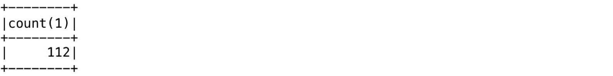

接下来，我们执行一个 SQL 语句，该语句返回一个包含电话号码匹配的行的数据帧:

```scala
scala> val sqlDF = spark.sql("SELECT a.name, b.name, a.phone, b.stdphone from rest1Table a, rest2Table b where a.phone = b.stdphone")
```

如果结果可能重复，可以显示两个表中列出姓名和电话号码列的结果，以直观地验证:

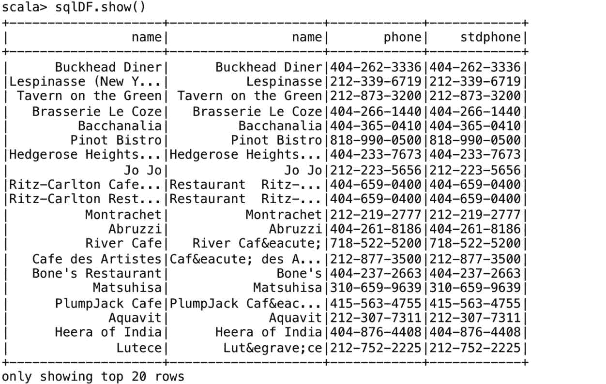

在下一节中，我们将把重点转移到 Spark SQL 内部，更具体地说，转移到 Catalyst 优化器和项目钨。

# 了解催化剂优化器

Catalyst 优化器是 Spark SQL 的核心，在 Scala 中实现。它支持几个关键特性，例如模式推断(来自 JSON 数据)，这在数据分析工作中非常有用。

下图显示了从包含数据框架/数据集的开发人员程序到最终执行计划的高级转换过程:

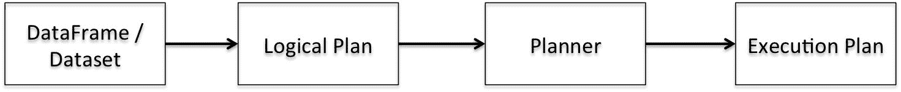

程序的内部表示是一个查询计划。查询计划描述了与查询中定义的内容相匹配的数据操作，如聚合、连接和筛选。这些操作从输入数据集生成一个新数据集。在我们准备好查询计划的初始版本后，Catalyst 优化器将应用一系列转换，将其转换为优化的查询计划。最后，Spark SQL 代码生成机制将优化后的查询计划转换成一个可以执行的 RDDs that。查询计划和优化的查询计划在内部表示为树。因此，在其核心，Catalyst 优化器包含一个通用库，用于表示树并应用规则来操作它们。除了这个库，还有几个更具体的关系查询处理库。

Catalyst 有两种查询计划:**逻辑**和**物理计划**。逻辑计划描述了数据集上的计算，但没有定义如何执行特定的计算。通常，逻辑计划在生成的行的一组约束下生成属性或列的列表作为输出。物理计划描述了数据集上的计算以及如何执行它们的具体定义(它是可执行的)。

让我们更详细地探讨一下转换步骤。最初的查询计划本质上是一个未解决的逻辑计划，也就是说，在这个阶段，我们不知道数据集或列(包含在数据集中)的来源，也不知道列的类型。这个管道的第一步是分析步骤。在分析过程中，目录信息用于将未解析的逻辑计划转换为已解析的逻辑计划。

在下一步中，将一组逻辑优化规则应用于已解析的逻辑计划，从而生成优化的逻辑计划。在下一步中，优化器可能会生成多个物理计划，并比较它们的成本以选择最佳计划。建立在 Spark SQL 之上的第一个版本的**基于成本的优化器** ( **CBO** )已经在 Spark 2.2 中发布。关于基于成本的优化的更多细节在[第 11 章](11.html#5RRUQ0-e9cbc07f866e437b8aa14e841622275c)、*为性能调整Spark SQL 组件*中介绍。

所有三个- **数据框**、**数据集**和 SQL -共享相同的优化管道，如下图所示:


# 了解催化剂优化

在 Catalyst 中，有两种主要的优化类型:逻辑优化和物理优化:

*   **逻辑优化**:这包括优化器将过滤谓词下推到数据源的能力，并允许执行跳过不相关的数据。例如，在 Parquet 文件的情况下，可以跳过整个块，并且可以通过字典编码将字符串上的比较转化为更便宜的整数比较。在关系数据库管理系统的情况下，谓词被下推到数据库，以减少数据流量。

*   **物理优化**:这包括在广播连接和洗牌连接之间智能选择的能力，以减少网络流量，执行较低级别的优化，例如消除昂贵的对象分配和减少虚拟函数调用。因此，当在程序中引入数据帧时，性能通常会提高。

规则执行器负责分析和逻辑优化步骤，而一组策略和规则执行器负责物理规划步骤。规则执行器通过成批应用一组规则，将一棵树转换为另一棵相同类型的树。这些规则可以应用一次或多次。此外，这些规则中的每一个都是作为转换实现的。转换基本上是一个函数，与每棵树相关联，用于实现一个规则。在 Scala 术语中，转换被定义为部分函数(为其可能的参数子集定义的函数)。这些通常被定义为 case 语句，用于确定是否为给定的输入定义了部分函数(使用模式匹配)。

规则执行器通过准备标量子查询、确保输入行满足特定操作的要求以及应用物理优化，使物理计划为执行做好准备。例如，在排序合并联接操作中，需要根据联接条件对输入行进行排序。优化器在执行排序合并连接操作之前，根据需要在输入行上插入适当的排序操作。

# 理解催化剂转化

从概念上讲，Catalyst 优化器执行两种类型的转换。第一种方法将输入树类型转换为相同的树类型(即不改变树类型)。这种类型的转换包括将一个表达式转换为另一个表达式，将一个逻辑计划转换为另一个逻辑计划，以及将一个物理计划转换为另一个物理计划。第二种类型的转换将一种树类型转换为另一种类型，例如，从逻辑计划转换为物理计划。通过应用一组策略，逻辑计划被转换为物理计划。这些策略使用模式匹配将一棵树转换成另一种类型。例如，我们有特定的模式来分别将逻辑项目和过滤器操作符匹配到物理项目和过滤器操作符。

一组规则也可以组合成单个规则来完成特定的转换。例如，根据您的查询，可以在执行联接操作之前，向下推过滤器等谓词，以减少总行数。此外，如果查询中有一个包含常量的表达式，那么常量折叠优化会在编译时计算一次表达式，而不是在运行时对每一行重复计算。此外，如果您的查询需要列的子集，那么列修剪可以帮助将列减少到必要的列。所有这些规则可以组合成一个单一的规则，以实现所有三个转换。

在下面的示例中，我们测量了 Spark 1.6 和 Spark 2.2 上执行时间的差异。在下一个例子中，我们使用 iPinYou 实时竞价数据集进行计算广告研究。该数据集包含 iPinYou 全球 RTB 竞价算法竞赛三季的数据。您可以从 http://data.computational-advertising.org/伦敦大学学院的数据服务器下载该数据集。

首先，我们为`bid transactions`和`region`文件中的记录定义`case`类:

```scala
scala> case class PinTrans(bidid: String, timestamp: String, ipinyouid: String, useragent: String, IP: String, region: String, city: String, adexchange: String, domain: String, url:String, urlid: String, slotid: String, slotwidth: String, slotheight: String, slotvisibility: String, slotformat: String, slotprice: String, creative: String, bidprice: String) scala> case class PinRegion(region: String, regionName: String)
```

接下来，我们从其中一个`bids`文件和`region`文件创建数据帧:

```scala
scala> val pintransDF = spark.sparkContext.textFile("file:///Users/aurobindosarkar/Downloads/make-ipinyou-data-master/original-data/ipinyou.contest.dataset/training1st/bid.20130314.txt").map(_.split("\t")).map(attributes => PinTrans(attributes(0).trim, attributes(1).trim, attributes(2).trim, attributes(3).trim, attributes(4).trim, attributes(5).trim, attributes(6).trim, attributes(7).trim, attributes(8).trim, attributes(9).trim, attributes(10).trim, attributes(11).trim, attributes(12).trim, attributes(13).trim, attributes(14).trim, attributes(15).trim, attributes(16).trim, attributes(17).trim, attributes(18).trim)).toDF() scala> val pinregionDF = spark.sparkContext.textFile("file:///Users/aurobindosarkar/Downloads/make-ipinyou-data-master/original-data/ipinyou.contest.dataset/region.en.txt").map(_.split("\t")).map(attributes => PinRegion(attributes(0).trim, attributes(1).trim)).toDF()
```

接下来，我们借用一个简单的基准函数(在几个 Databricks 示例笔记本中提供)来测量执行时间:

```scala
scala> def benchmark(name: String)(f: => Unit) { val startTime = System.nanoTime f val endTime = System.nanoTime println(s"Time taken in $name: " + (endTime - startTime).toDouble / 1000000000 + " seconds") }
```

我们使用 SparkSession 对象来关闭整个阶段的代码生成参数(这大致相当于 Spark 1.6 环境)。我们还测量两个数据帧之间`join`操作的执行时间:

```scala
scala> spark.conf.set("spark.sql.codegen.wholeStage", false) scala> benchmark("Spark 1.6") {  |  pintransDF.join(pinregionDF, "region").count()  | }Time taken in Spark 1.6: 3.742190552 seconds 
```

接下来，我们将整个阶段的代码生成参数设置为 true，并测量执行时间。我们注意到，对于 Spark 2.2 中的相同代码，执行时间要短得多:

```scala
scala> spark.conf.set("spark.sql.codegen.wholeStage", true) scala> benchmark("Spark 2.2") {  |  pintransDF.join(pinregionDF, "region").count()  | }Time taken in Spark 2.2: 1.881881579 seconds    
```

我们使用`explain()`函数打印出 Catalyst 转换管道中的各个阶段。我们将在[第 11 章](11.html#5RRUQ0-e9cbc07f866e437b8aa14e841622275c)、*为性能调整Spark SQL 组件*中更详细地解释以下输出:

```scala
scala> pintransDF.join(pinregionDF, "region").selectExpr("count(*)").explain(true) 
```


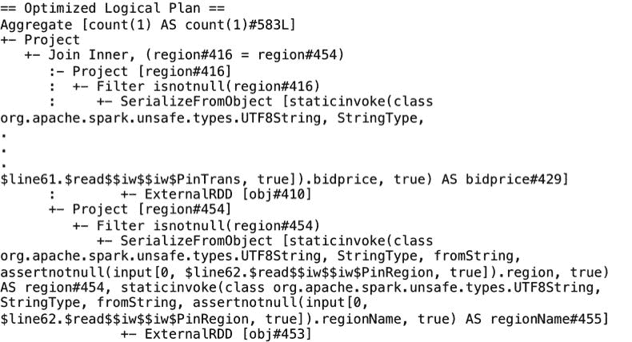

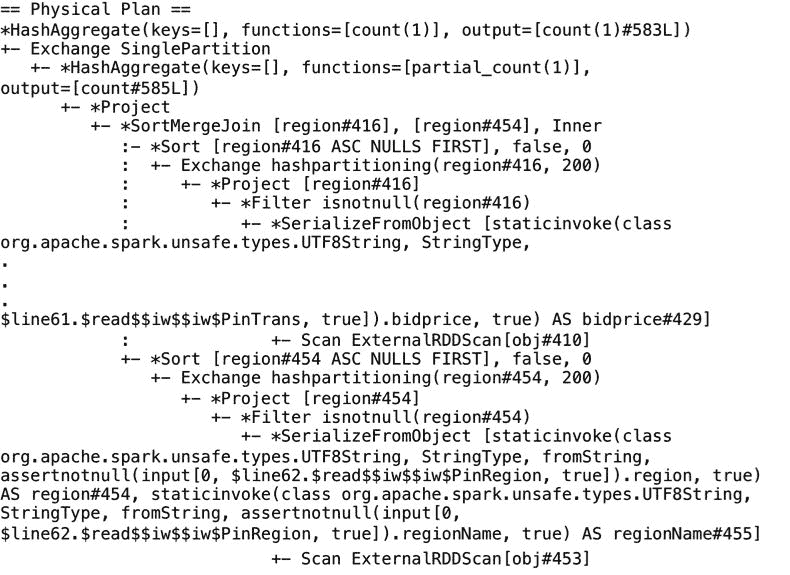

在下一节中，我们将介绍钨项目的开发者相关细节。

# 钨项目简介

钨项目被吹捧为自项目开始以来对 Spark 执行引擎的最大改变。钨项目的动机是观察到 CPU 和内存，而不是输入/输出和网络，是大多数 Spark 工作负载的瓶颈。

由于硬件的改进(例如，用于存储的固态硬盘和条带硬盘阵列)、对 Spark 的输入/输出所做的优化(例如，洗牌和网络层实现、用于减少磁盘输入/输出的输入数据修剪等)以及数据格式的改进(例如，像 Parquet 这样的列格式、二进制数据格式等)，CPU 现在是瓶颈。此外，Spark 中的大规模序列化和哈希任务是受 CPU 限制的操作。

Spark 1.x 使用了基于迭代器模型(称为火山模型)的查询评估策略。由于查询中的每个运算符都提供了一个接口，该接口一次向树中的下一个运算符返回一个元组，因此该接口允许查询执行引擎组成任意的运算符组合。在 Spark 2.0 之前，大部分的 CPU 周期都花在了无用的工作上，比如进行虚函数调用或者向 CPU 缓存或内存中读写中间数据。

钨项目专注于三个领域，以提高内存和中央处理器的效率，将性能推向底层硬件的极限。这三个领域是内存管理和二进制处理、缓存感知计算和代码生成。此外，集成在 Spark 2.0 中的第二代钨执行引擎使用了一种称为全阶段代码生成的技术。这项技术使引擎能够消除虚拟函数调度，并将中间数据从内存移动到中央处理器寄存器，并通过循环展开和 SIMD 利用现代中央处理器的功能。此外，Spark 2.0 引擎还通过采用另一种称为矢量化的技术来加快被认为过于复杂的代码生成操作。

全阶段代码生成将整个查询折叠成一个函数。此外，它消除了虚拟函数调用，并使用中央处理器寄存器来存储中间数据。这反过来又显著提高了 CPU 效率和运行时性能。它实现了手写代码的性能，同时仍然是一个通用引擎。

在矢量化中，引擎以列格式将多行批处理在一起，每个操作符迭代批处理中的数据。然而，它仍然需要将中间数据放在内存中，而不是将它们保存在中央处理器寄存器中。因此，矢量化仅在不可能进行全阶段代码生成时使用。

wow 内存管理的改进集中在以紧凑的二进制格式存储 Java 对象以减少 GC 开销，以更密集的内存数据格式来减少溢出(例如，Parquet 格式)，以及对于理解数据类型的操作符(在 DataFrames、Datasets 和 SQL 的情况下)来说，在内存中直接针对二进制格式工作，而不是序列化/反序列化等等。

代码生成利用现代编译器和中央处理器来实现改进。其中包括更快的表达式计算和数据框/SQL 运算符，以及更快的序列化程序。由于虚函数调用、基于表达式类型的分支、对象创建以及原语装箱导致的内存消耗，表达式的泛型计算在 JVM 上非常昂贵。通过动态生成定制字节码，这些开销被大大消除了。

在这里，我们为我们的投标和区域数据帧之间的连接操作提供了物理计划，这些数据帧来自前面启用了全阶段代码生成的部分。在`explain()`输出中，当一个操作符被标上星号`*`时，则意味着该操作的全阶段代码生成被启用。在以下物理计划中，这包括聚合、项目、`SortMergeJoin`、筛选和排序运算符。但是，Exchange 不实现全阶段代码生成，因为它通过网络发送数据:

```scala
scala> pintransDF.join(pinregionDF, "region").selectExpr("count(*)").explain() 
```

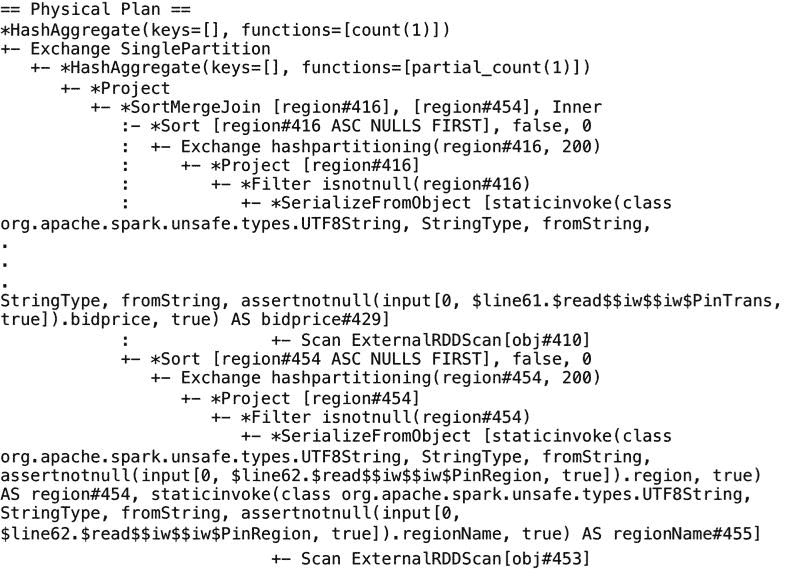

钨项目极大地受益于数据框架和数据集(对于所有编程接口——Java、Scala、Python 和 R)以及Spark SQL 查询。此外，对于许多数据处理操作员来说，新引擎要快几个数量级。

在下一节中，我们将重点转移到一个新的 Spark 2.0 特性，称为结构化流，它支持基于 Spark 的流应用程序。

# 在流应用程序中使用Spark SQL

流式应用变得越来越复杂，因为这种计算不是孤立运行的。他们需要与批处理数据交互，支持交互分析，支持复杂的机器学习应用程序，等等。典型地，这种应用程序将输入事件流存储在长期存储器上，连续监控事件，并对存储的数据运行机器学习模型，同时实现对输入流的连续学习。它们还能够交互查询存储的数据，同时提供一次写入保证、处理延迟到达的数据、执行聚合等。这些类型的应用程序不仅仅是流应用程序，因此被称为连续应用程序。

在 Spark 2.0 之前，流式应用程序建立在数据流的概念上。使用数据流有几个痛点。在数据流中，时间戳是事件实际进入Spark系统的时间；事件中的时间没有考虑在内。此外，虽然同一个引擎可以同时处理批处理和流计算，但所涉及的 API 虽然在 RDDs(批处理)和 DStream(流)之间相似，但要求开发人员进行代码更改。数据流模型给开发人员带来了解决各种故障情况的负担，并且很难对数据一致性问题进行推理。在 Spark 2.0 中，引入了结构化流来处理所有这些痛点。

结构化流是一种快速、容错、一次性的有状态流处理方法。它支持流分析，而不必考虑流的底层机制。在新模型中，输入可以被认为是来自一个只追加的表(不断增长)的数据。触发器指定检查输入是否有新数据到达的时间间隔。如下图所示，查询表示输入上的查询或操作，如映射、筛选和缩减，结果表示根据指定操作在每个触发间隔中更新的最终表。输出定义了在每个时间间隔内要写入数据接收器的结果部分。

输出模式可以是完整、增量或追加，其中完整输出模式意味着每次写入完整的结果表，增量输出模式分别写入前一批中已更改的行，追加输出模式仅写入新行:


在 Spark 2.0 中，除了静态有界数据帧之外，我们还有连续无界数据帧的概念。静态和连续数据帧都使用相同的应用编程接口，从而统一了流、交互和批处理查询。例如，您可以聚合流中的数据，然后使用 JDBC 服务它。高级流应用编程接口建立在Spark SQL 引擎上，并与 SQL 查询和数据框架/数据集应用编程接口紧密集成。主要的好处是您使用相同的高级 Spark 数据框架和数据集 API，并且 Spark 引擎计算出操作所需的增量和连续执行。

此外，还有查询管理 API，可以用来管理多个并发运行的流查询。例如，您可以列出正在运行的查询，停止和重新启动查询，在出现故障时检索异常，等等。我们将在[第 5 章](05.html#2H1VQ0-e9cbc07f866e437b8aa14e841622275c)、*中获得更多关于在流应用程序中使用 Spark SQL 的详细信息。*

在下面的示例代码中，我们使用 iPinYou 数据集中的两个投标文件作为流数据的来源。首先，我们定义输入记录模式，并创建一个流输入数据帧:

```scala
scala> import org.apache.spark.sql.types._ scala> import org.apache.spark.sql.functions._ scala> import scala.concurrent.duration._ scala> import org.apache.spark.sql.streaming.ProcessingTime scala> import org.apache.spark.sql.streaming.OutputMode.Complete scala> val bidSchema = new StructType().add("bidid", StringType).add("timestamp", StringType).add("ipinyouid", StringType).add("useragent", StringType).add("IP", StringType).add("region", IntegerType).add("city", IntegerType).add("adexchange", StringType).add("domain", StringType).add("url:String", StringType).add("urlid: String", StringType).add("slotid: String", StringType).add("slotwidth", StringType).add("slotheight", StringType).add("slotvisibility", StringType).add("slotformat", StringType).add("slotprice", StringType).add("creative", StringType).add("bidprice", StringType) scala> val streamingInputDF = spark.readStream.format("csv").schema(bidSchema).option("header", false).option("inferSchema", true).option("sep", "\t").option("maxFilesPerTrigger", 1).load("file:///Users/aurobindosarkar/Downloads/make-ipinyou-data-master/original-data/ipinyou.contest.dataset/bidfiles")
```

接下来，我们用时间间隔`20 seconds`定义我们的查询，输出模式为`Complete`:

```scala
scala> val streamingCountsDF = streamingInputDF.groupBy($"city").count() scala> val query = streamingCountsDF.writeStream.format("console").trigger(ProcessingTime(20.seconds)).queryName("counts").outputMode(Complete).start()
```

在输出中，您将观察到，随着新数据的到来，每个地区的投标计数在每个时间间隔内都会更新。您需要将新的投标文件(或从多个投标文件开始，因为它们将根据`maxFilesPerTrigger`的值一次处理一个)从原始数据集放入`bidfiles`目录，以查看更新的结果:

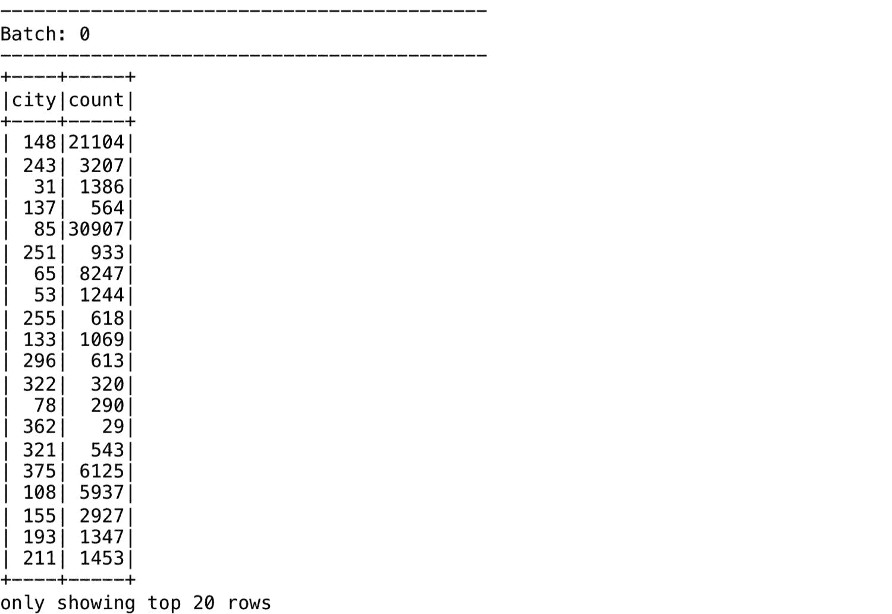


此外，您还可以查询系统中的活动流，如下所示:

```scala
scala> spark.streams.active.foreach(println) Streaming Query - counts [state = ACTIVE]
```

最后，您可以使用`stop()`方法停止流应用程序的执行，如图所示:

```scala
//Execute the stop() function after you have finished executing the code in the next section.scala> query.stop()
```

在下一节中，我们从概念上描述结构化流如何在内部工作。

# 理解结构化流内部

为了启用结构化流功能，规划器轮询源中的新数据，并在将其写入接收器之前对其递增执行计算。此外，应用程序所需的任何运行聚合都被维护为内存状态，由**预写日志** ( **WAL** )支持。内存中的状态数据是跨增量执行生成和使用的。此类应用程序的容错要求包括恢复和重放系统中所有数据和元数据的能力。如图所示，在执行之前，计划程序将偏移量写入持久存储(如 HDFS)上的容错 WAL。


如果规划器在当前增量执行中失败，重新启动的规划器从 WAL 中读取并重新执行所需的精确偏移范围。通常，如 Kafka 这样的源也是容错的，并生成原始交易数据，给定由规划者恢复的适当偏移量。在 Spark workers 中，状态数据通常保存在版本化的键值映射中，并由 HDFS 的 WAL 提供支持。计划员确保在失败后使用正确版本的状态来重新执行事务。此外，接收器在设计上是幂等的，可以处理重复执行，而无需输出的双重提交。因此，WAL 中的偏移跟踪、状态管理以及容错源和接收器的整体组合提供了端到端的一次性保证。

我们可以使用`explain`方法列出结构化流示例的物理计划，如图所示:

```scala
scala> spark.streams.active(0).explain 
```

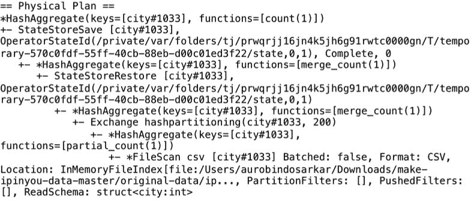

我们将在[第 11 章](11.html#5RRUQ0-e9cbc07f866e437b8aa14e841622275c)、*为性能调整Spark SQL 组件*中更详细地解释前面的输出。

# 摘要

在本章中，我们向您介绍了Spark SQL、Spark会话(Spark SQL 的主要入口点)和Spark SQL 接口(关系数据库、数据框架和数据集)。然后我们描述了 Spark SQL 的一些内部结构，包括 Catalyst 和基于 Project 的优化。最后，我们探讨了如何在流应用程序中使用 Spark SQL 以及结构化流的概念。本章的主要目标是向您概述 Spark SQL，同时通过实践会话(使用公共数据集)让您熟悉 Spark 环境。

在下一章中，我们将深入探讨使用 Spark SQL 来探索大数据应用程序典型的结构化和半结构化数据的细节。