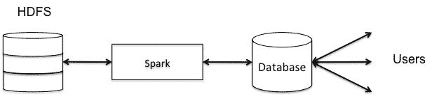
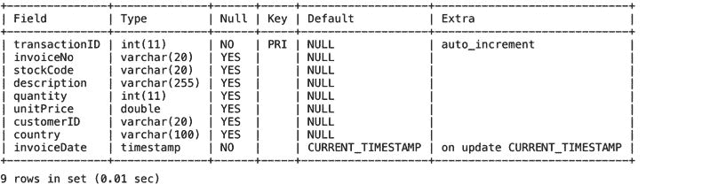
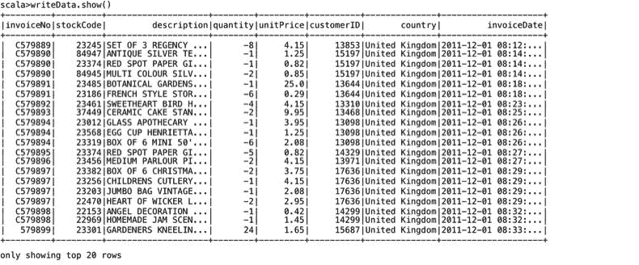
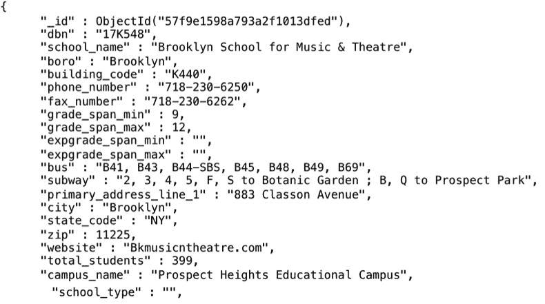
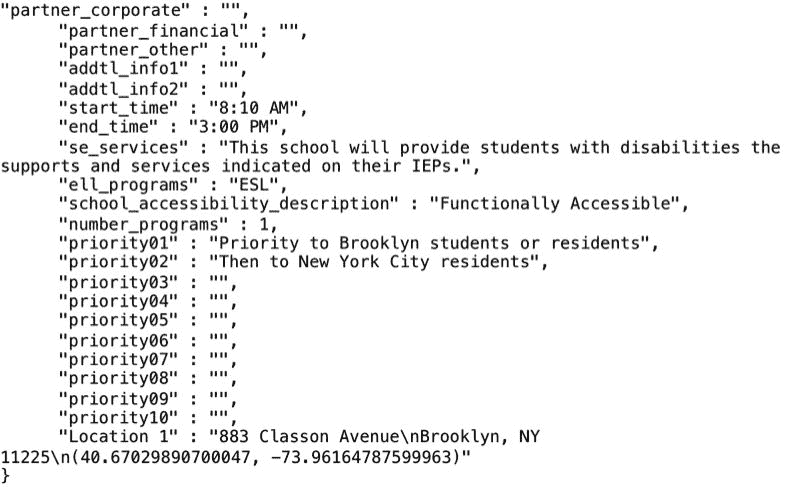
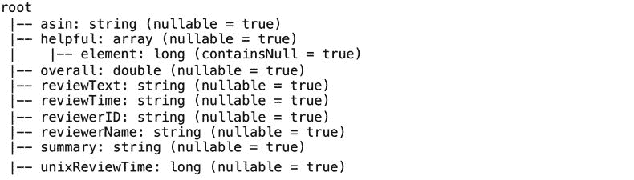
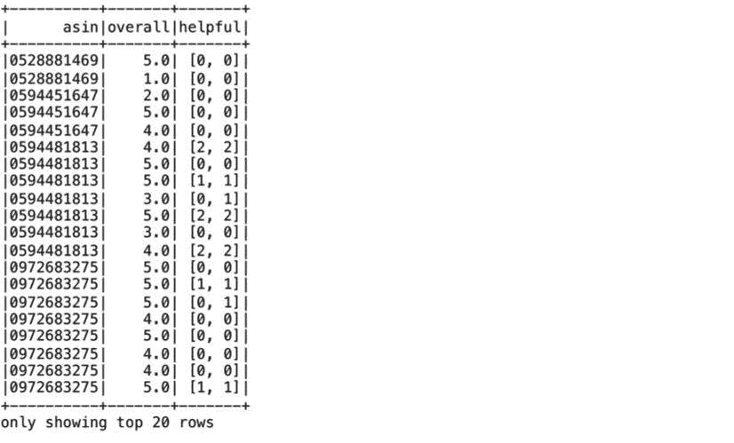
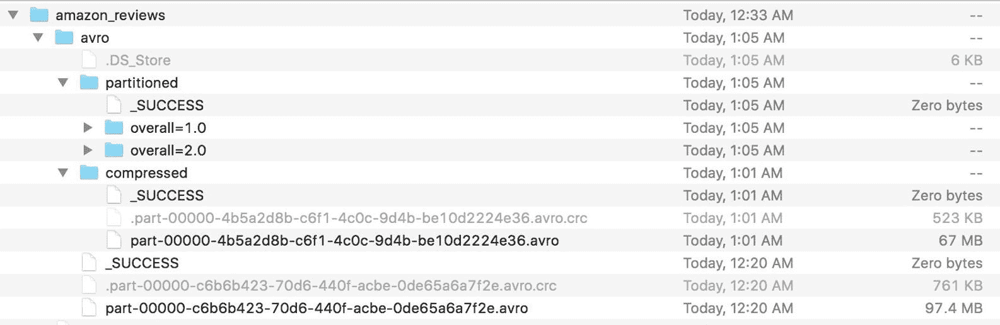

# 二、使用Spark SQL 处理结构化和半结构化数据

在本章中，我们将让您熟悉如何使用 Spark SQL 来处理不同类型的数据源和数据存储格式。Spark 提供了简单且标准的结构(即关系数据库和数据框架/数据集)来处理结构化和半结构化数据。我们包括大数据应用中最常用的一些数据源，如关系数据、NoSQL 数据库和文件(CSV、JSON、Parquet 和 Avro)。Spark 还允许您定义和使用自定义数据源。本章中的一系列实践练习将使您能够将 Spark 用于不同类型的数据源和数据格式。

在本章中，您将学习以下主题:

*   了解 Spark 应用中的数据源
*   使用 JDBC 处理关系数据库
*   将 Spark 与 MongoDB (NoSQL 数据库)结合使用
*   使用 JSON 数据
*   将 Spark 用于 Avro 和拼花数据集

# 了解 Spark 应用中的数据源

Spark 可以连接到许多不同的数据源，包括文件、SQL 和 NoSQL 数据库。一些比较流行的数据源包括文件(CSV、JSON、Parquet、AVRO)、MySQL、MongoDB、HBase 和 Cassandra。


此外，它还可以连接到特殊用途的引擎和数据源，如 ElasticSearch、Apache Kafka 和 Redis。这些引擎支持 Spark 应用中的特定功能，如搜索、流、缓存等。例如，Redis 支持在高性能应用中部署缓存的机器学习模型。我们将在[第 12 章](12.html#6DVPG0-e9cbc07f866e437b8aa14e841622275c)、*大规模应用架构*中详细讨论基于 Redis 的应用部署。Kafka 在 Spark 流式应用中非常受欢迎，我们将在[第 5 章](05.html#2H1VQ0-e9cbc07f866e437b8aa14e841622275c)、*在流式应用中使用 Spark SQL、*和[第 12 章](12.html#6DVPG0-e9cbc07f866e437b8aa14e841622275c)、*在大规模应用架构中使用 Spark SQL 中详细介绍基于 Kafka 的流式应用。数据源应用编程接口支持 Spark 连接到各种数据源，包括自定义数据源。*

Refer to the Spark packages website [https://spark-packages.org/](https://spark-packages.org/) to work with various data sources, algorithms, and specialized Datasets.

在[第 1 章](01.html#KVCC0-e9cbc07f866e437b8aa14e841622275c)、*开始使用 Spark SQL、*中，我们使用文件系统上的 CSV 和 JSON 文件作为输入数据源，并使用 SQL 进行查询。但是，使用 Spark SQL 查询驻留在文件中的数据并不能代替使用数据库。最初，一些人使用 HDFS 作为数据源，因为使用 Spark SQL 查询这类数据简单易行。但是，根据正在执行的查询和工作负载的性质，执行性能可能会有很大差异。架构师和开发人员需要了解使用哪些数据存储，以便最好地满足他们的处理需求。我们将在下面讨论选择 Spark 数据源的一些高级注意事项。

# 选择Spark数据源

文件系统是转储大量数据和支持大型数据集的通用处理的好地方。使用文件的一些好处是存储成本低、处理灵活和可扩展。将大规模数据存储在文件中的决定通常是由将这些数据存储在商业数据库中的高昂成本驱动的。此外，当数据的性质无法从典型的数据库优化中获益时，例如非结构化数据，文件存储也是首选。此外，具有迭代内存处理需求和分布式算法的工作负载(如机器学习应用)可能更适合在分布式文件系统上运行。

您通常存储在文件系统中的数据类型包括归档数据、非结构化数据、海量社交媒体和其他网络规模的数据集，以及主数据存储的备份副本。文件最受支持的工作负载类型是批处理工作负载、探索性数据分析、多级处理管道和迭代工作负载。使用文件的流行用例包括 ETL 管道、跨各种数据源拼接数据，如日志文件、CSV、Parquet、压缩文件格式等。此外，您可以选择以针对您的特定处理要求而优化的多种格式存储相同的数据。

连接到文件系统的 Spark 不太好的地方在于用例，包括频繁的随机访问、频繁的插入、频繁/增量的更新，以及在许多用户的高负载条件下的报告或搜索操作。随着我们的继续，将更详细地讨论这些用例。

Spark 支持从分布式存储中选择一小部分记录的查询，但效率不高，因为它通常需要 Spark 遍历所有文件来查找结果行。对于数据探索任务来说，这可能是可以接受的，但是对于来自多个并发用户的持续处理负载来说，这可能是不可接受的。如果您需要频繁随机地访问数据，使用数据库可能是更有效的解决方案。使用传统的 SQL 数据库向用户提供数据并在关键列上创建索引可以更好地支持这种用例。或者，键值 NoSQL 商店也可以更高效地检索键值。

当每次插入创建一个新文件时，插入相当快，但是查询变得很低，因为 Spark 作业需要打开所有这些文件并从中读取以支持查询。同样，用于支持频繁插入的数据库可能是更好的解决方案。或者，您也可以定期压缩您的Spark SQL 表文件，以减少文件的总数。使用`Select *`和`coalesce`数据框命令，将从多个输入文件创建的数据框中的数据写入单个/组合输出文件。

使用数据库或专用引擎可以更好地处理其他操作和用例，例如频繁/增量更新、报告和搜索。文件未针对更新随机行进行优化。然而，数据库是执行高效更新操作的理想选择。您可以将 Spark 连接到 HDFS 并使用 BI 工具，如 Tableau，但最好将数据转储到数据库，以便在负载下为并发用户提供服务。通常，最好使用 Spark 来读取数据、执行聚合等，然后将结果写入为最终用户服务的数据库。在搜索用例中，Spark 将需要遍历每一行来查找并返回搜索结果，从而影响性能。在这种情况下，使用弹性搜索和 Apache Solr 等专业引擎可能是比使用 Spark 更好的解决方案。

在数据严重倾斜的情况下，或者为了在集群上执行更快的连接，我们可以使用按集群或分时段技术来提高性能。

# 将 Spark 用于关系数据库

关于关系数据库是否适合大数据处理场景，存在巨大的争论。然而，不可否认的是，企业中大量的结构化数据都存在于这样的数据库中，组织的关键业务事务严重依赖于现有的关系数据库管理系统。

绝大多数开发人员最习惯使用关系数据库和领先供应商提供的丰富工具集。越来越多的云服务提供商，如亚马逊 AWS，已经使管理、复制和扩展变得足够简单，以至于许多组织将其大型关系数据库迁移到云中。

关系数据库的一些好的大数据用例包括:

*   复杂的 OLTP 事务
*   需要符合 ACID 标准的应用或功能
*   对标准 SQL 的支持
*   实时特别查询功能
*   实现许多复杂关系的系统

For an excellent coverage of NoSQL and relational use cases, refer to the blog titled What the heck are you actually using NoSQL for? at [http://highscalability.com/blog/2010/12/6/what-the-heck-are-you-actually-using-nosql-for.html](http://highscalability.com/blog/2010/12/6/what-the-heck-are-you-actually-using-nosql-for.html).

在 Spark 中，很容易处理关系数据，并以不同的形式和格式将其与其他数据源相结合:



作为一个例子，我们将实现一个用例，在这个用例中，我们在 HDFS 和 MySQL 之间分割数据。MySQL 数据库的目标是支持并发用户的交互式查询，而 HDFS 的数据将用于批处理、运行机器学习应用以及使商业智能工具可以使用这些数据。在本例中，我们假设交互式查询仅针对当月的数据。因此，我们将只在 MySQL 中保留当月的数据，并将其余数据写到 HDFS(以 JSON 格式)。

我们将遵循的实施步骤是:

1.  创建 MySQL 数据库。
2.  定义一个表。
3.  创建用户标识并授予权限。
4.  用 MySQL JDBC 驱动启动 Spark shell。
5.  从输入数据文件创建 RDD，分离标题，定义模式，并创建数据帧。
6.  为时间戳创建一个新列。
7.  根据时间戳值将数据分为两个数据帧(当月数据和前几个月的剩余数据)。
8.  删除原始的 invoiceDate 列，然后将时间戳列重命名为 invoiceDate。
9.  将包含当月数据的数据框写到 MySQL 表中。
10.  将包含数据(当月数据除外)的数据框写出到 HDFS(JSON 格式)。

If you do not have MySQL already installed and available, you can download it from [https://www.mysql.com/downloads/](https://www.mysql.com/downloads/). Follow the installation instructions for your specific OS to install the database. Also, download the JDBC connector available on the same website.

在您的 MySQL 数据库服务器启动并运行之后，启动 MySQL 外壳。在下面的步骤中，我们将创建一个新的数据库并定义一个事务表。我们使用了一个跨国数据集，其中包含了 2010 年 1 月 12 日至 2011 年 9 月 12 日发生在英国的注册非在线零售的所有交易。该数据集由伦敦南岸大学工程学院公共分析组主任陈大庆博士提供，可在[https://archive.ics.uci.edu/ml/datasets/Online+Retail](https://archive.ics.uci.edu/ml/datasets/Online+Retail)获得。

当您启动 MySQL shell 时，您应该会看到类似于下面的屏幕:


1.  创建一个名为`retailDB`的新数据库来存储我们的客户交易数据:

```scala
      mysql> create database retailDB;Connect to retailDB as follows:mysql> use retailDB;
```

2.  这里，我们定义一个以`transactionID`为主键的事务表。在生产场景中，您还可以在其他字段上创建索引，例如`CustomerID`，以更有效地支持查询:

```scala
      mysql>create table transactions(transactionID integer not null auto_increment, invoiceNovarchar(20), stockCodevarchar(20), description varchar(255), quantity integer, unitPrice double, customerIDvarchar(20), country varchar(100), invoiceDate Timestamp, primary key(transactionID));
```

接下来，我们使用`describe`命令验证事务表模式，以确保它完全符合我们的要求:

```scala
mysql> describe transactions;
```



3.  创建一个用户标识`retaildbuser`并授予其所有权限。我们将使用 Spark shell 中的这个用户来连接和执行我们的查询。

```scala
      mysql> CREATE USER 'retaildbuser'@'localhost' IDENTIFIED BY 'mypass';mysql> GRANT ALL ON retailDB.* TO 'retaildbuser'@'localhost';
```

4.  用包含 MySQL JDBC 驱动程序路径的类路径启动 Spark shell，如下所示:

```scala
      SPARK_CLASSPATH=/Users/aurobindosarkar/Downloads/mysql-connector-java-5.1.38/mysql-connector-java-5.1.38-bin.jar bin/spark-shell
```

5.  创建一个包含我们下载的数据集中所有行的`RDD`:

```scala
      scala> import org.apache.spark.sql.types._scala> import org.apache.spark.sql.Rowscala> import java.util.Propertiesscala>val inFileRDD =       sc.textFile("file:///Users/aurobindosarkar/Downloads/UCI Online  Retail.txt")
```

6.  将标题与其余数据分开:

```scala
      scala>val allRowsRDD = inFileRDD.map(line =>line.split("\t").map(_.trim))scala>val header = allRowsRDD.firstscala>val data = allRowsRDD.filter(_(0) != header(0))
```

7.  为我们的数据记录定义字段和模式，如下所示:

```scala
      scala>val fields = Seq(| StructField("invoiceNo", StringType, true),| StructField("stockCode", StringType, true),| StructField("description", StringType, true),| StructField("quantity", IntegerType, true),| StructField("invoiceDate", StringType, true),| StructField("unitPrice", DoubleType, true),| StructField("customerID", StringType, true),| StructField("country", StringType, true)| )scala>val schema = StructType(fields)
```

8.  创建行对象的`RDD`，使用之前创建的模式创建数据帧:

```scala
      scala>val rowRDD = data.map(attributes => Row(attributes(0), attributes(1), attributes(2), attributes(3).toInt, attributes(4), attributes(5).toDouble, attributes(6), attributes(7)))scala>val r1DF = spark.createDataFrame(rowRDD, schema)
```

9.  向数据框中添加一个名为`ts`的列(时间戳列)，如下所示:

```scala
      scala>val ts = unix_timestamp($"invoiceDate","dd/MM/yyHH:mm").cast("timestamp")scala>val r2DF = r1DF.withColumn("ts", ts)scala>r2DF.show()
```


10.  创建一个表对象并执行适当的 SQL，根据时间戳将表数据分成两个数据帧:

```scala
      scala> r2DF.createOrReplaceTempView("retailTable")scala>val r3DF = spark.sql("select * from retailTable where ts< '2011-12-01'")scala>val r4DF = spark.sql("select * from retailTable where ts>= '2011-12-01'")
```

11.  在我们的新数据框中删除`invoiceDate`列。

```scala
      scala>val selectData = r4DF.select("invoiceNo", "stockCode", "description", "quantity", "unitPrice", "customerID", "country", "ts")
```

12.  将`ts`列重命名为`invoiceDate`，如下所示:

```scala
      scala>val writeData = selectData.withColumnRenamed("ts", "invoiceDate")scala>writeData.show()
```



13.  创建一个指向数据库网址的变量。此外，创建一个`Properties`对象来保存连接到`retailDB.`所需的用户标识和密码。接下来，连接到 MySQL 数据库，并将“当月”的记录插入到事务表中:

```scala
      scala>val dbUrl = "jdbc:mysql://localhost:3306/retailDB"scala>val prop = new Properties()scala>prop.setProperty("user", "retaildbuser")scala>prop.setProperty("password", "mypass")scala>writeData.write.mode("append").jdbc(dbUrl, "transactions", prop)
```

14.  从数据框中选择感兴趣的列(包含当前月份以外的数据)，并以 JSON 格式将其写入 HDFS 文件系统:

```scala
      scala>val selectData = r3DF.select("invoiceNo", "stockCode", "description", "quantity", "unitPrice", "customerID", "country", "ts")scala>val writeData = selectData.withColumnRenamed("ts", "invoiceDate")scala>writeData.select("*").write.format("json").save("hdfs://localhost:9000/Users/r3DF")
```

# 将 Spark 与 MongoDB (NoSQL 数据库)结合使用

在本节中，我们将使用 Spark 和最流行的 NoSQL 数据库之一——MongoDB。MongoDB 是一个分布式文档数据库，以类似 JSON 的格式存储数据。与关系数据库中僵化的模式不同，MongoDB 中的数据结构更加灵活，存储的文档可以有任意字段。这种灵活性与高可用性和可扩展性相结合，使其成为许多应用中存储数据的良好选择。它也是免费的开源软件。

If you do not have MongoDB already installed and available, then you can download it from [https://www.mongodb.org/downloads](https://www.mongodb.com/download-center#community). Follow the installation instructions for your specific OS to install the database.

本例的纽约市学校目录数据集取自纽约市开放数据网站，可从[https://nycplatform.socrata.com/data?browseSearch=&范围= &机构= & cat=education &类型=数据集](https://nycplatform.socrata.com/data?browseSearch=&scope=&agency=&cat=education&type=datasets)下载。

在您的 MongoDB 数据库服务器启动并运行之后，启动 MongoDB 外壳。在下面的步骤中，我们将创建一个新的数据库，定义一个集合，并使用 MongoDB 导入实用程序从命令行插入纽约市学校的数据。

当您启动 MongoDB 外壳时，您应该会看到类似于下面的屏幕:


接下来，执行使用`<DATABASE>`命令选择一个现有的数据库或创建一个新的数据库，如果它不存在的话。

If you make a mistake while creating a new collection, you can use the `db.dropDatabase()` and/or `db.collection.drop()` commands to delete the dababase and/or the collection, respectively, and then recreate it with the required changes.

```scala
>use nycschoolsDBswitched to dbnycschoolsDB
```

需要从命令提示符(而不是在`mongodb` shell 中)执行`mongoimport`实用程序:

```scala
mongoimport --host localhost --port 27017 --username <your user name here> --password "<your password here>" --collection schools --db nycschoolsDB --file <your download file name here>
```

您可以列出导入的集合并打印一条记录来验证导入操作，如下所示:

```scala
>show collectionsschools>db.schools.findOne()
```






您可以从[http://repo 1 . maven . org/maven 2/org/MongoDB/Spark/mongo-Spark-connector _ 2.11/2 . 2 . 0/](http://repo1.maven.org/maven2/org/mongodb/spark/mongo-spark-connector_2.11/2.2.0/)下载 Spark 2.2 ( `mongo-spark-connector_2.11-2.2.0-assembly.jar`)的`mongo-spark-connector jar`。

接下来，使用命令行中指定的`mongo-spark-connector_2.11-2.2.0-assembly.jar`文件启动 Spark shell:

```scala
./bin/spark-shell --jars /Users/aurobindosarkar/Downloads/mongo-spark-connector_2.11-2.2.0-assembly.jarscala> import org.apache.spark.sql.SQLContextscala> import org.apache.spark.{SparkConf, SparkContext}scala> import com.mongodb.spark.MongoSparkscala> import com.mongodb.spark.config.{ReadConfig, WriteConfig}
```

接下来，我们从 Spark 为`read`和`write`操作定义 URIs:

```scala
scala>val readConfig = ReadConfig(Map("uri" -> "mongodb://localhost:27017/nycschoolsDB.schools?readPreference=primaryPreferred"))scala>val writeConfig = WriteConfig(Map("uri" -> "mongodb://localhost:27017/nycschoolsDB.outCollection"))
```

为学校记录定义一个`case`班级，如下所示:


接下来，您可以从我们的集合中创建一个数据框，并显示新创建的数据框中的记录。

```scala
scala>val schoolsDF = MongoSpark.load(sc, readConfig).toDF[School]scala>schoolsDF.take(1).foreach(println)
```


Note: The following sections will be updated with the latest versions of the connector packages later.

在接下来的几节中，我们将描述如何使用 Spark 和几种流行的大数据文件格式。

# 使用带有 JSON 数据的 Spark

JSON 是一种简单、灵活和紧凑的格式，广泛用作 web 服务中的数据交换格式。Spark 对 JSON 的支持非常棒。没有必要为 JSON 数据定义模式，因为模式是自动推断的。此外，Spark 大大简化了访问复杂 JSON 数据结构中的字段所需的查询语法。我们将在[第 12 章](12.html#6DVPG0-e9cbc07f866e437b8aa14e841622275c)、*大规模应用架构*中给出 JSON 数据的详细示例。

本例的数据集包含大约 169 万条亚马逊电子产品评论，可从:[http://jmcauley.ucsd.edu/data/amazon/](http://jmcauley.ucsd.edu/data/amazon/)下载。

我们可以直接读取一个 JSON 数据集来创建 Spark SQL 数据框架。我们将从一个 JSON 文件中读入一组示例订单记录:

```scala
scala>val reviewsDF = spark.read.json("file:///Users/aurobindosarkar/Downloads/reviews_Electronics_5.json")
```

您可以使用`printSchema`方法打印新创建的数据框的模式来验证字段及其特征。

```scala
scala> reviewsDF.printSchema()
```



一旦 JSON 数据集被转换为Spark SQL 数据框架，您就可以用标准的方式广泛地使用它。接下来，我们将执行一条 SQL 语句，从从特定年龄段的客户处收到的订单中选择某些列:

```scala
scala>reviewsDF.createOrReplaceTempView("reviewsTable")scala>val selectedDF = spark.sql("SELECT asin, overall, reviewTime, reviewerID, reviewerName FROM reviewsTable WHERE overall >= 3")
```

使用`show`方法显示 SQL 执行的结果(存储在另一个数据框中)，如下所示:

```scala
scala> selectedDF.show()
```


我们可以访问`reviewDF`数据帧中`helpful`列的数组元素(使用 DSL)，如图所示:

```scala
scala> val selectedJSONArrayElementDF = reviewsDF.select($"asin", $"overall", $"helpful").where($"helpful".getItem(0) < 3)scala>selectedJSONArrayElementDF.show()
```



一个将数据框写成 JSON 文件的例子出现在前面的部分，我们从数据框中选择感兴趣的列(包含当前月份以外的数据)，并以 JSON 格式将它们写到 HDFS 文件系统中。

# 将 Spark 与 Avro 文件一起使用

Avro 是一个非常流行的数据序列化系统，它提供了一种紧凑而快速的二进制数据格式。Avro 文件是自描述的，因为模式与数据一起存储。

可以从[https://mvnrepository . com/artifact/com . databricks/spark-avro _ 2.11/3 . 2 . 0](https://mvnrepository.com/artifact/com.databricks/spark-avro_2.11/3.2.0)下载`spark-avro connector` JAR。

We will switch to Spark 2.1 for this section. At the time of writing this book due to a documented bug in the `spark-avro connector` library, we are getting exceptions while writing Avro files (using `spark-avro connector 3.2`) with Spark 2.2.

用会话中包含的 spark-avro JAR 启动 Spark shell:

```scala
Aurobindos-MacBook-Pro-2:spark-2.1.0-bin-hadoop2.7 aurobindosarkar$ bin/spark-shell --jars /Users/aurobindosarkar/Downloads/spark-avro_2.11-3.2.0.jar
```

我们将使用上一节中包含亚马逊评论数据的 JSON 文件来创建`Avro`文件。从输入 JSON 文件创建一个数据帧，并显示记录的数量:

```scala
scala> import com.databricks.spark.avro._scala> val reviewsDF = spark.read.json("file:///Users/aurobindosarkar/Downloads/reviews_Electronics_5.json")scala> reviewsDF.count()res4: Long = 1689188  
```

接下来，我们将所有总体评分低于`3`、`coalesce`的评论过滤到一个文件中，并将结果数据框写入一个`Avro`文件:

```scala
scala> reviewsDF.filter("overall < 3").coalesce(1).write.avro("file:///Users/aurobindosarkar/Downloads/amazon_reviews/avro")
```

接下来，我们展示如何通过从上一步创建的`Avro`文件创建一个数据帧来读取`Avro`文件，并显示其中的记录数:

```scala
scala> val reviewsAvroDF = spark.read.avro("file:///Users/aurobindosarkar/Downloads/amazon_reviews/avro/part-00000-c6b6b423-70d6-440f-acbe-0de65a6a7f2e.avro")scala> reviewsAvroDF.count()res5: Long = 190864
```

接下来，我们通过指定`show(5)`，从结果数据框中选择几列并显示五条记录:

```scala
scala> reviewsAvroDF.select("asin", "helpful", "overall", "reviewTime", "reviewerID", "reviewerName").show(5)
```


接下来，我们通过设置Spark会话配置值来指定`Avro`文件的压缩选项:

```scala
scala> spark.conf.set("spark.sql.avro.compression.codec", "deflate")scala> spark.conf.set("spark.sql.avro.deflate.level", "5")
```

现在，当我们写入数据帧时，`Avro`文件以压缩格式存储:

```scala
scala> val reviewsAvroDF = spark.read.avro("file:////Users/aurobindosarkar/Downloads/amazon_reviews/avro/part-00000-c6b6b423-70d6-440f-acbe-0de65a6a7f2e.avro")
```

您还可以写出由特定列分区的数据帧。这里，我们根据`overall`列(每行包含`values < 3`)进行划分:

```scala
scala> reviewsAvroDF.write.partitionBy("overall").avro("file:////Users/aurobindosarkar/Downloads/amazon_reviews/avro/partitioned")
```

此处显示了此会话中 Avro 文件的屏幕截图。请注意压缩版本(67 MB)与原始文件(97.4 MB)的大小。此外，请注意为分区的(由`overall`值)`Avro`文件创建的两个单独的目录。



For more details on `spark-avro`, refer: [https://github.com/databricks/spark-avro](https://github.com/databricks/spark-avro)

# 对拼花文件使用 Spark

Apache Parquet 是一种流行的柱状存储格式。它被用于 Hadoop 生态系统中的许多大数据应用。拼花支持非常高效的压缩和编码方案，可以显著提升此类应用的性能。在本节中，我们向您展示了将拼花文件直接读入标准Spark SQL 数据帧的简单性。

在这里，我们使用之前从包含在 JSON 格式文件中的亚马逊评论创建的 reviewsDF，并以拼花格式写出它来创建拼花文件。我们使用`coalesce(1)`创建单个输出文件:

```scala
scala> reviewsDF.filter("overall < 3").coalesce(1).write.parquet("file:///Users/aurobindosarkar/Downloads/amazon_reviews/parquet")
```

在下一步中，我们只使用一条语句从拼花文件创建一个数据帧:

```scala
scala> val reviewsParquetDF = spark.read.parquet("file:///Users/aurobindosarkar/Downloads/amazon_reviews/parquet/part-00000-3b512935-ec11-48fa-8720-e52a6a29416b.snappy.parquet")
```

创建数据框后，您可以像使用从任何其他数据源创建的数据框一样对其进行操作。这里，我们将数据框注册为临时视图，并使用 SQL 进行查询:

```scala
scala> reviewsParquetDF.createOrReplaceTempView("reviewsTable")scala> val reviews1RatingsDF = spark.sql("select asin, overall, reviewerID, reviewerName from reviewsTable where overall < 2")
```

这里，我们指定两个参数来显示结果数据帧中的记录。第一个参数指定要显示的记录数，第二个参数的 false 值显示列中的完整值(没有截断)。

```scala
scala> reviews1RatingsDF.show(5, false)
```


# 在 Spark 中定义和使用自定义数据源

您可以定义自己的数据源，并将这些数据源中的数据与其他更标准的数据源(例如，关系数据库、Parquet 文件等)中的数据相结合。在[第 5 章](05.html#2H1VQ0-e9cbc07f866e437b8aa14e841622275c)、*在流式应用*中使用 Spark SQL 中，我们定义了一个自定义数据源，用于从公共 API 流式传输数据，这些 API 可从**伦敦运输** ( **TfL** 网站获得。

Refer to the video *Spark DataFrames Simple and Fast Analysis of Structured Data - Michael Armbrust (Databricks)* at [https://www.youtube.com/watch?v=xWkJCUcD55w](https://www.youtube.com/watch?v=xWkJCUcD55w) for a good example of defining a data source for Jira and creating a Spark SQL DataFrame from it.

# 摘要

在本章中，我们演示了如何将 Spark 用于各种数据源和数据格式。我们使用 Spark 与关系数据库(MySQL)、NoSQL 数据库(MongoDB)、半结构化数据(JSON)和 Hadoop 生态系统中常用的数据存储格式(Avro 和 Parquet)一起工作。这为后面更高级的面向 Spark 应用的章节做了很好的准备。

在下一章中，我们将把重点从使用 Spark 的机制转移到如何使用 Spark SQL 来探索数据、执行数据质量检查和可视化数据。