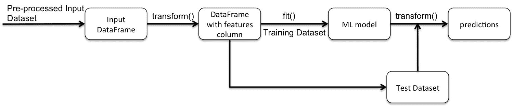
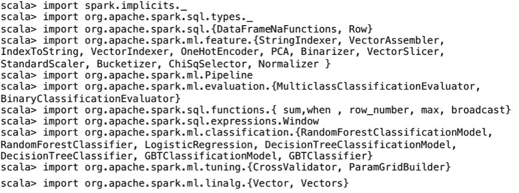
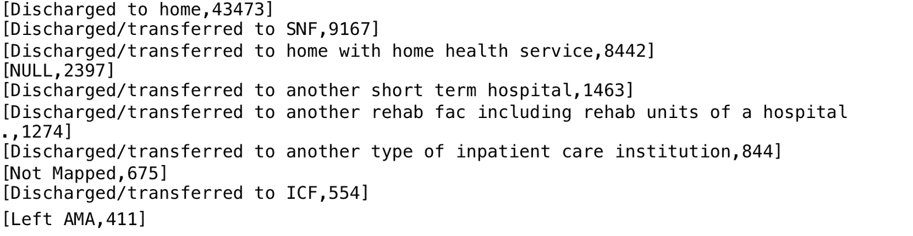
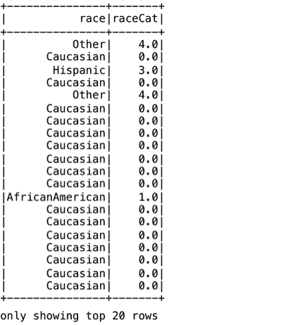
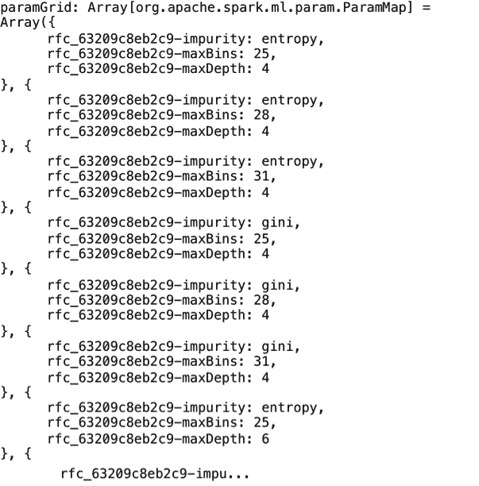
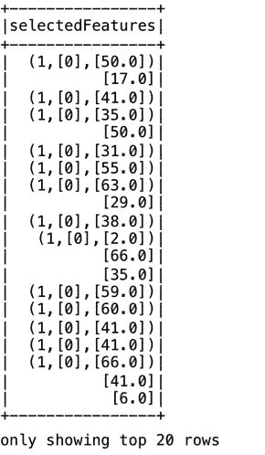
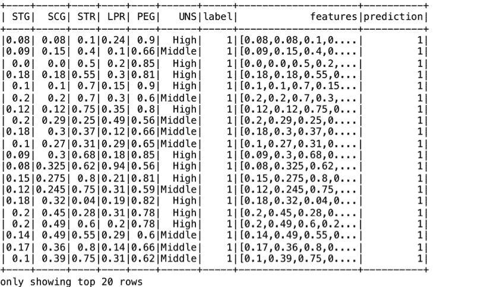
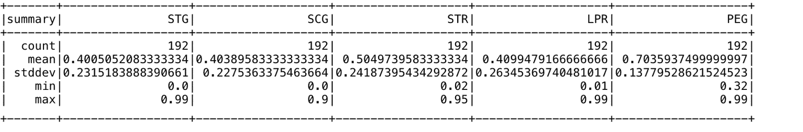

# Spark SQL 在机器学习应用中的应用

在本章中，我们将介绍在机器学习应用程序中使用 Spark SQL 的典型用例。我们将重点介绍名为`spark.ml`的 Spark 机器学习 API，它是实现 ML 工作流的推荐解决方案。`spark.ml`应用编程接口建立在数据框架上，提供许多现成的包，包括特征提取器、转换器、选择器和机器学习算法，如分类、回归和聚类算法。我们还将使用 Apache Spark 执行**探索性数据分析** ( **EDA** )、数据预处理、特征工程，以及使用`spark.ml`API 和算法开发机器学习管道。

更具体地说，在本章中，您将学习以下主题:

*   机器学习应用
*   Spark毫升管道的关键部件
*   理解特征工程
*   实施机器学习管道/应用
*   使用 Spark MLlib 的代码示例

# 介绍机器学习应用

机器学习、预测分析和相关的数据科学主题正变得越来越流行，用于解决各种业务领域的现实问题。

如今，机器学习应用程序正在许多组织中推动任务关键型业务决策。这些应用包括推荐引擎、定向广告、语音识别、欺诈检测、图像识别和分类等。

在下一节中，我们将介绍 Spark ML 管道 API 的关键组件。

# 了解 Spark ML 管道及其组件

机器学习管道 API 是在 Apache Spark 1.2 中引入的。Spark MLlib 为开发人员创建和执行复杂的 ML 工作流提供了一个 API。管道应用编程接口允许开发人员快速组装分布式机器学习管道，因为该接口已经被标准化以应用不同的机器学习算法。此外，我们还可以将多种机器学习算法组合到单个管道中。这些管道由几个关键组件组成，便于数据分析和机器学习应用程序的实施。

这里列出了 ML 管道的主要组件:

*   **数据集** : Spark SQL 数据框架/数据集用于在 ML 管道中存储和处理数据。数据帧/数据集应用编程接口提供了一个标准的应用编程接口和一种处理静态数据(通常用于批处理)和流数据(通常用于在线流处理)的通用方式。正如我们将在以下章节中看到的，这些数据集将用于存储和处理输入数据、转换后的输入数据、特征向量、标签、预测等。
*   **管道** : ML 工作流被实现为由一系列阶段组成的管道。例如，您可以在埃德加网站上为`10-K`文件的“完整提交文本文件”设置一个文本预处理管道。这样的管道会在一端将文档中的行作为输入，并在通过一系列转换器(将正则表达式和其他过滤器应用于特定序列中的数据)后，生成一个单词列表作为输出。本章以及[第 9 章](09.html#4U9TC0-e9cbc07f866e437b8aa14e841622275c)、*使用 Spark SQL 开发应用程序*中给出了数据和 ML 管道的几个示例。
*   **流水线阶段**:每个流水线阶段包括一个按照指定顺序执行的转换器或估计器。
    *   **转换器**:这是一种将输入数据帧转换为添加了一个或多个特征的另一个数据帧的算法。有几个变形器，如 RegexTokenizer、二进制化器、OneHotEncoder、各种索引器(例如`StringIndexer`和`VectorIndexer`)以及其他作为库的一部分可用的东西。您也可以像我们在[第 9 章](09.html#4U9TC0-e9cbc07f866e437b8aa14e841622275c)、*中使用 Spark SQL 开发应用程序一样定义您自己的定制变压器。*
    *   **估计器**:这是一个机器学习算法，从提供的输入数据中学习。估计器的输入是数据帧，输出是变压器。MLlib 库中有几种可用的估计器，如`LogisticRegression`、`RandomForest`等。来自这些估计器的输出转换器是相应的模型，例如物流计算模型、随机森林模型等等。

# 了解管道应用程序开发过程中的步骤

机器学习管道应用程序开发过程通常包括以下步骤:

*   **数据摄取**:典型机器学习管道摄取的输入数据来自多个数据源，通常采用几种不同的格式(如[第 2 章](02.html#11C3M0-e9cbc07f866e437b8aa14e841622275c)、*使用 Spark SQL 处理结构化和半结构化数据*所述)。这些来源可以包括文件、数据库(关系数据库管理系统、NoSQL、图形等)、网络服务(例如，REST 端点)、卡夫卡和亚马逊驱动流等。
*   **数据清理和预处理**:数据清理是整个数据分析管道中的一个关键步骤。该预处理步骤修复了数据质量问题，并使其适合机器学习模型使用。比如我们可能需要去掉 HTML 标签，替换特殊字符(比如`&nbsp`；和其他)从源 HTML 文档中删除。我们可能需要根据 Spark MLlib 管道所需的标准化格式来重命名(或指定)列。最重要的是，我们还需要将数据框中的各种列组合成一个包含特征向量的列。
*   **特征工程**:在这一步中，我们使用各种技术从输入数据中提取并生成特定的特征。然后将它们组合成一个特征向量，并传递到流程的下一步。通常，使用`VectorAssembler`从指定的数据帧列创建特征向量。
*   **模型训练**:机器学习模型训练包括指定一个算法和一些训练数据(模型可以从中学习)。通常，我们通过为每个数据集随机选择一定比例的输入记录，将输入数据集分为训练数据集和测试数据集。通过在训练数据集上调用`fit()`方法来训练模型。
*   **模型验证**:这一步包括评估和调整最大似然模型，以评估预测的好坏。在此步骤中，使用`transform()`方法将模型应用于测试数据集，并计算模型的适当性能度量，例如精度、误差等。
*   **模型选择**:这一步，我们为产生最佳 ML 模型的变形器和估计器选择参数。通常，我们创建一个参数网格，并使用一个称为交叉验证的过程执行网格搜索，为给定的模型找到最合适的参数集。交叉验证器返回的最佳模型可以保存下来，然后加载到生产环境中。
*   **模型部署**:最后我们部署生产的最佳模型。对于某些模型，将模型参数(如系数、截距或带有分支逻辑的决策树)转换为其他格式(如 JSON)可能更容易，以便在复杂的生产环境中进行更简单、更高效的部署。有关此类部署的更多详细信息，请参见[第 12 章](12.html#6DVPG0-e9cbc07f866e437b8aa14e841622275c)、*大规模应用架构中的Spark SQL*。

在生产环境中，部署的模型需要持续维护、升级、优化等等。

# 引入特征工程

特征工程是使用数据的领域知识来创建特征的过程，这些特征是应用机器学习算法的关键。任何属性都可以是一个特征，选择一组好的特征来帮助解决问题并产生可接受的结果是整个过程的关键。这一步通常是机器学习应用中最具挑战性的方面。特征的质量和数量都会极大地影响模型的整体质量。

更好的特性也意味着更大的灵活性，因为即使在使用不太理想的模型时，它们也能产生好的结果。大多数 ML 模型都能很好地理解底层数据的结构和模式。良好特性的灵活性允许我们使用更快、更容易理解和维护的不太复杂的模型。更好的特性通常也会导致更简单的模型。这些特性使得选择正确的模型和最优化的参数变得更加容易。

For a good blog on feature engineering, refer: Discover Feature Engineering, How to Engineer Features and How to Get Good at It, Jason Brownlee, at: [https://machinelearningmastery.com/discover-feature-engineering-how-to-engineer-features-and-how-to-get-good-at-it/](https://machinelearningmastery.com/discover-feature-engineering-how-to-engineer-features-and-how-to-get-good-at-it/)

从处理和计算成本的角度来看，为真实数据集中的每条信息生成特征向量是不切实际的。典型地，特征变换，例如索引和宁滨，被用来降低预测变量的维数。此外，不相关的低频值通常从模型中移除，连续变量被分组到合理数量的箱中。一些原始特征可能是高度相关的，或者是冗余的，因此也可以从进一步的考虑中删除。此外，可以组合多个特征以产生新的特征(从而也降低了整体维度)。根据模型的不同，我们可能还需要对一些变量的值进行归一化，以避免使用绝对值导致的结果偏差。我们对训练数据集应用变换，以获得将被输入机器学习算法的特征向量。

因此，特征工程是一个迭代过程，包括数据选择和模型评估的多个周期。如果问题被很好地定义，那么迭代过程可以在适当的点停止，并尝试其他配置或模型。

# 从原始数据创建新功能

从原始数据中选择特征可能会产生许多不同的特征集，但是我们需要保留那些与要解决的问题最相关的特征集。

特征选择可以揭示各种特征的重要性，但是必须首先识别这些特征。特征的数量可能会受到我们收集数据能力的限制，但是一旦收集，就完全取决于我们的选择过程。通常，它们需要手动创建，这需要时间、耐心、创造力和对原始输入数据的熟悉。

原始输入数据的转换取决于数据的性质。例如，对于文本数据，这可能意味着生成文档向量，而对于图像数据，这可能意味着应用各种过滤器从图像中提取轮廓。因此，这个过程主要是手动的、缓慢的、迭代的，并且需要大量的领域专业知识。

# 评估特征的重要性

我们必须从成百上千个潜在的特征中选择一个子集来包含在建模过程中。做出这些选择需要对可能对模型性能产生最大影响的特性有更深入的了解。典型地，考虑中的特征被评分，然后根据它们的分数进行排序。通常，选择得分最高的要素包含在训练数据集中，而忽略其他要素。此外，我们还可以从原始数据特征中生成新特征。我们如何知道这些生成的特征是否对手头的任务有帮助？

可以使用不同的方法来估计特征的重要性。例如，我们可以将相关特征集合分组，并将没有这些特征的模型的性能与完整的模型(包括删除的特征)进行比较。我们还可以对完整模型和丢弃模型执行 k 倍交叉验证，并在各种统计指标上进行比较。然而，这种方法对于在生产中连续运行来说成本太高，因为它需要为每个特征组构建每个模型 k 次(对于 k 倍交叉验证)，这可能很多(取决于分组的级别)。因此，在实践中，这个练习会定期在模型的代表性样本上执行。

特征工程的其他有效技术包括可视化和应用特定的方法，这些方法在特定类型的数据上工作良好。可视化是快速分析要素之间关系和评估生成要素影响的强大工具。在各种领域使用众所周知的方法和手段有助于加速特征工程过程。例如，对于文本数据，使用 n-gram、TF-IDF、特征散列等是众所周知且广泛应用的特征工程方法。

# 理解降维

首先，降维处理模型中预测变量数量的适当减少。使用各种变换限制要素矩阵中的结果列数后，选择成为训练数据集一部分的要素会有所帮助。被评估为与问题基本无关的属性需要删除。

有些特征对模型的准确性比其他特征更重要。还会有一些功能在其他功能出现时变得多余。

特征选择通过选择对解决问题最有用的特征子集来解决这些挑战。特征选择算法可以计算相关系数、协方差和其他统计量来选择一组好的特征。如果一个特征与因变量(被预测的事物)高度相关，则通常包括该特征。我们还可以使用**主成分分析** ( **主成分分析**)和无监督聚类方法进行特征选择。更高级的方法可以搜索各种特征集，自动创建和评估模型，以便得出特征的最佳预测子组。

# 驾驶良好的功能

在这一节中，我们将提供一些额外的技巧来获得好的特性和评估它们的方法。这些功能可以由领域专家手工制作，也可以使用主成分分析或深度学习等方法自动化(参见[第 10 章](10.html#59O440-e9cbc07f866e437b8aa14e841622275c)、*在深度学习应用程序中使用 Spark SQL*)*。*这些方法中的每一种都可以独立使用，也可以联合使用，以获得最佳的特征集。

在进行机器学习项目时，除了用于解决业务问题的实际学习模型和算法之外，数据准备和清理等任务也是关键。在机器学习应用中缺少数据预处理步骤的情况下，得到的模式将不会准确或有用，和/或预测结果将具有较低的准确性。

在这里，我们提供了一些通用的技巧来获得一组良好的预处理特征和净化数据:

*   探索分类值的分组和/或将特征矩阵中成为预测变量的分类值的数量限制为最常见的。
    *   通过从提供的特征中计算多项式特征来评估和添加新特征。但是，请注意避免过度拟合，当模型与包含过多特征的数据紧密拟合时，可能会出现过度拟合。这导致了一个记忆数据的模型，而不是从中学习，这反过来降低了它准确预测新数据的能力。
*   评估每个特征，通过使用排名指标(如皮尔逊相关)独立测试其与类别的相关性。然后，我们可以选择特征的子集，例如排名前 10%或前 20%的特征。
*   使用基尼指数和熵等标准来评估每个特征有多好。
*   探索特征之间的协方差；例如，如果两个特征以相同的方式变化，选择它们作为特征可能不会达到总体目的。
*   模型也可能会使训练数据集不足，这将导致较低的模型精度。当您的模型不适合数据集时，您应该考虑引入新的功能。
*   日期-时间字段包含大量信息，模型很难在其原始格式中利用这些信息。将日期-时间字段分解为月、日、年等单独的字段，以允许模型利用这些关系。
*   将线性变换应用于数值域，如权重和距离，用于回归和其他算法。
*   探索在一段时间间隔内将数量度量(如权重或距离)存储为比率或总量，以揭示结构，如季节性。

在下一节中，我们将展示一个 Spark ML 管道的详细代码示例。

# 实现Spark最大似然分类模型

实现机器学习模型的第一步是对输入数据执行 EDA。该分析通常涉及使用齐柏林飞艇等工具进行数据可视化、评估特征类型(数值/分类)、计算基本统计、计算协方差和相关系数、创建数据透视表等(有关 EDA 的更多详细信息，请参见[第 3 章](03.html#1AT9A0-e9cbc07f866e437b8aa14e841622275c)、*使用 Spark SQL 进行数据探索*)。

下一步包括执行数据预处理和/或数据收集操作。几乎在所有情况下，真实世界的输入数据都不会是可以在模型中使用的高质量数据。将要素从源格式转换为最终变量需要几个转换；例如，对于每个分类值，分类特征可能需要使用一种热编码技术转换为二进制变量(有关数据收集的更多详细信息，请参见[第 4 章](04.html#1MBG20-e9cbc07f866e437b8aa14e841622275c)、*使用 Spark SQL 进行数据收集*)。

接下来是功能工程步骤。在这一步中，我们将导出新的特征，与其他现有特征一起包含在训练数据中。使用本章前面提供的技巧，导出一组最终用于训练模型的良好特征。

最后，我们将使用选定的特征训练模型，并使用测试数据集对其进行测试。

For a good blog containing a detailed step-by-step example of a classification model applied to the Kaggle knowledge challenge--Titanic: Machine Learning from Disaster, refer: *Building Classification model using Apache Spark* by Vishnu Viswanath at: [http://vishnuviswanath.com/spark_lr.html](http://vishnuviswanath.com/spark_lr.html).

下图显示了这些步骤以及每个阶段的操作和输入/输出:



我们将使用公共可用的糖尿病数据集，该数据集由 101，766 行组成，代表来自 130 家美国医院和集成交付网络的十年临床护理记录。它包括 50 多个代表患者和医院结果的特征(属性)。

The Dataset can be downloaded from the UCI website at [https://archive.ics.uci.edu/ml/datasets/Diabetes+130-US+hospitals+for+years+1999-2008](https://archive.ics.uci.edu/ml/datasets/Diabetes+130-US+hospitals+for+years+1999-2008).

源 ZIP 文件包含两个 CSV 文件。第一个文件`diabetic_data.csv`是主输入数据集，第二个文件`IDs_mapping.csv`是`admission_type_id`、`discharge_disposition_id`和`admission_source_id`的主数据。第二个文件足够小，可以手动分成三部分，每组标识映射一个。

The example in this section closely follows the approach and analysis presented in: Impact of HbA1c measurement on hospital readmission rates: analysis of 70,000 clinical database patient records, by Beata Strack, Jonathan P. DeShazo, Chris Gennings,Juan L. Olmo,Sebastian Ventura,Krzysztof J. Ciosand John N. Clore, Biomed Res Int. 2014; 2014: 781670, available at: [http://europepmc.org/articles/PMC3996476](http://europepmc.org/articles/PMC3996476).

首先，我们将导入此编码练习所需的所有包:



# 探索糖尿病数据集

数据集包含最初由临床专家根据其与糖尿病病情或管理的潜在联系选择的属性/特征。

A full list of the features and their description is available at [https://www.hindawi.com/journals/bmri/2014/781670/tab1/](https://www.hindawi.com/journals/bmri/2014/781670/tab1/).

我们将输入数据加载到 Spark 数据框中，如下所示:

```scala
scala> val inDiaDataDF = spark.read.option("header", true).csv("file:///Users/aurobindosarkar/Downloads/dataset_diabetes/diabetic_data.csv").cache() 
```

我们可以显示上一步中创建的数据框的模式，以列出数据框中的列或字段，如下所示:

```scala
scala> inDiaDataDF.printSchema() 
```


接下来，我们打印出一些示例记录，以获得数据集字段中包含的值的高级意义:

```scala
scala> inDiaDataDF.take(5).foreach(println)
```


我们也可以使用`dataFrame.describe("column")`计算数值列的基本统计。例如，我们显示几个数字数据列的计数、平均值、标准偏差以及最小值和最大值:

```scala
scala> inDiaDataDF.select("num_lab_procedures", "num_procedures", "num_medications", "number_diagnoses").describe().show() 

+-------+------------------+------------------+------------------+------------------+ 
|summary|num_lab_procedures|    num_procedures|   num_medications|  number_diagnoses| 
+-------+------------------+------------------+------------------+------------------+ 
|  count|            101766|            101766|            101766|            101766| 
|   mean| 43.09564098028811| 1.339730361810428|16.021844230882614| 7.422606764538254| 
| stddev| 19.67436224914214|1.7058069791211583| 8.127566209167293|1.9336001449974298| 
|    min|                 1|                 0|                 1|                 1| 
|    max|                99|                 6|                 9|                 9| 
+-------+------------------+------------------+------------------+------------------+ 

```

原始输入数据集包含不完整、冗余和有噪声的信息，这在任何真实数据集中都是可以预期的。有几个字段的缺失值百分比很高。

我们计算缺少特定字段的记录数量，如下所示:

```scala
scala> inDiaDataDF.select($"weight").groupBy($"weight").count().select($"weight", (($"count" / inDiaDataDF.count())*100).alias("percent_recs")).where("weight = '?'").show()+------+-----------------+ 
|weight|     percent_recs| 
+------+-----------------+ 
|     ?|96.85847925633315| 
+------+-----------------+ 

scala> inDiaDataDF.select($"payer_code").groupBy($"payer_code").count().select($"payer_code", (($"count" / inDiaDataDF.count())*100).alias("percent_recs")).where("payer_code = '?'").show() 

+----------+----------------+ 
|payer_code|    percent_recs| 
+----------+----------------+ 
|         ?|39.5574160328597| 
+----------+----------------+ scala> inDiaDataDF.select($"medical_specialty").groupBy($"medical_specialty").count().select($"medical_specialty", (($"count" / inDiaDataDF.count())*100).alias("percent_recs")).where("medical_specialty = '?'").show() 

+-----------------+-----------------+ 
|medical_specialty|     percent_recs| 
+-----------------+-----------------+ 
|                ?|49.08220820313268| 
+-----------------+-----------------+ 
```

如前所述，具有许多缺失值的特征被识别为重量、付款人代码和医学专业。我们删除了重量和付款人代码列，但是保留了医疗专业属性(可能是一个非常相关的特性):

```scala
scala> val diaDataDrpDF = inDiaDataDF.drop("weight", "payer_code") 
```

数据集还包含一些患者多次住院的记录。在这里，我们提取了一组多次住院的患者。

我们观察到此类患者的总体数量很大:

```scala

scala> diaDataDrpDF.select($"patient_nbr").groupBy($"patient_nbr").count().where("count > 1").show(5) 

+-----------+-----+ 
|patient_nbr|count| 
+-----------+-----+ 
|    4311585|    2| 
|    4624767|    2| 
|   24962301|    3| 
|   11889666|    2| 
|    2585367|    2| 
+-----------+-----+ 
only showing top 5 rows scala>  diaDataDrpDF.select($"patient_nbr").groupBy($"patient_nbr").count().where("count > 1").count() 
res67: Long = 16773 
```

如参考研究/论文中所述，这种观察不能被认为是统计上独立的，因此，我们只包括每个患者的首次就诊。完成这些操作后，我们确认数据框中没有与多个就诊记录相对应的患者记录:

```scala
scala> val w = Window.partitionBy($"patient_nbr").orderBy($"encounter_id".desc) scala> val diaDataSlctFirstDF = diaDataDrpDF.withColumn("rn", row_number.over(w)).where($"rn" === 1).drop("rn") 

scala> diaDataSlctFirstDF.select($"patient_nbr").groupBy($"patient_nbr").count().where("count > 1").show() 
+-----------+-----+ 
|patient_nbr|count| 
+-----------+-----+ 
+-----------+-----+ 

scala> diaDataSlctFirstDF.count() 
res35: Long = 71518 
```

与参考研究/论文一样，我们也删除了导致患者死亡的遭遇记录，以避免偏见:

```scala
scala> val diaDataAdmttedDF = diaDataSlctFirstDF.filter($"discharge_disposition_id" =!= "11") scala> diaDataAdmttedDF.count() 
res16: Long = 69934 
```

在执行上述操作后，我们只剩下`69,934`次相遇，它们构成了用于进一步分析的最终数据集。

接下来，我们执行一组`JOIN`操作，根据`discharge disposition`、`admission types`和`admission sources`的顶级类别更好地理解数据:


```scala
scala> joinDF.select("encounter_id", "dchrgDisp", "admType", "admission_source").show() 
```


```scala
scala> joinDF.select("encounter_id", "dchrgDisp").groupBy("dchrgDisp").count().orderBy($"count".desc).take(10).foreach(println) 
```



```scala
scala> joinDF.select("encounter_id", "admType").groupBy("admType").count().orderBy($"count".desc).take(5).foreach(println) 
[Emergency,35988] 
[Elective,13698] 
[Urgent,12799] 
[NULL,4373] 
[Not Available,2752] scala> joinDF.select("encounter_id", "admission_source").groupBy("admission_source").count().orderBy($"count".desc).take(5).foreach(println) 

[ Emergency Room,37649]                                                          
[ Physician Referral,21196] 
[NULL,4801] 
[Transfer from a hospital,2622] 
[ Transfer from another health care facility,1797] 
```

在下一节中，我们将执行一系列数据收集或数据预处理步骤，以提高整体数据质量。

# 预处理数据

预处理数据需要几个数据收集步骤。我们将从解决缺失的字段值开始。在处理空值或缺失值时，我们有几个选项。我们可以使用`df.na.drop()`删除它们，或者使用`df.na.fill()`用默认值填充它们。此类字段可以用该列最常出现的值替换，对于数值字段，也可以用平均值替换。此外，您还可以在列上训练回归模型，并使用它来预测缺少值的行的字段值。

这里，我们在数据集中有用`?`值表示的缺失字段，因此我们使用`df.na.replace()`函数用“缺失”字符串替换它们。

该操作在`medical_specialty`字段进行说明，如图所示:

```scala
 scala> diaDataAdmttedDF.select("medical_specialty").where("medical_specialty = '?'").groupBy("medical_specialty").count().show() 

+-----------------+-----+ 
|medical_specialty|count| 
+-----------------+-----+ 
|                ?|33733| 
+-----------------+-----+ scala> val diaDataRplcMedSplDF = diaDataAdmttedDF.na.replace("medical_specialty", Map("?" -> "Missing")) 
```

`medical_specialty`字段可以有值，如心脏病学、内科、家庭/全科、外科医生或缺失。对于一个模型来说，缺失值看起来就像`medical_specialty`的任何其他选择一样。我们本可以创建一个名为`has_ medical_specialty`的新的二进制特征，并在一行包含该值时为其赋值`1`，在该值未知或缺失时为其赋值`0`。或者，我们也可以为`medical_specialty`的每个值创建一个二进制特征，例如`Is_Cardiology`、`Is_Surgeon`和`Is_Missing`。这些附加功能可以用来替代或补充不同型号中的`medical_specialty`功能。

接下来，在原论文所包含的分析的指导下，我们从本章的进一步分析中删除了一组列，以保持问题的大小合理，如图所示:


如参考研究/论文中所述，我们还考虑了四组遭遇:未进行 HbA1c 测试，HbA1c 测试且在正常范围内，HbA1c 测试且结果大于 8%，HbA1c 测试且结果大于 8%。

完成该分组的这些步骤如下执行:

```scala
scala> diaDataDrpColsDF.groupBy($"A1Cresult").count().show() 

+---------+-----+                                                                
|A1Cresult|count| 
+---------+-----+ 
|     None|57645| 
|       >8| 5866| 
|     Norm| 3691| 
|       >7| 2732| 
+---------+-----+ scala> def udfA1CGrps() = udf[Double, String] { a => val x = a match { case "None" => 1.0; case ">8" => 2.0; case ">7" => 3.0; case "Norm" => 4.0;}; x;}  scala> val diaDataA1CResultsDF = diaDataDrpColsDF.withColumn("A1CResGrp", udfA1CGrps()($"A1Cresult")) 

scala> diaDataA1CResultsDF.groupBy("A1CResGrp").count().withColumn("Percent_of_Population", ($"count" / diaDataA1CResultsDF.count())*100).withColumnRenamed("count", "Num_of_Encounters").show() 
+--------------------+-----------------+---------------------+ 
|           A1CResGrp|Num_of_Encounters|Percent_of_Population| 
+--------------------+-----------------+---------------------+ 
|No test was perfo...|            57645|    82.42771756227299| 
|Result was high a...|             5866|    8.387908599536706| 
|Normal result of ...|             3691|     5.27783338576372| 
|Result was high b...|             2732|    3.906540452426573| 
+--------------------+-----------------+---------------------+ 
```

由于我们的主要目标集中在导致早期再入院的因素上，因此再入院属性(或结果)有两个值:`Readmitted`，如果患者在出院后 30 天内再入院，或者`Not Readmitted`，它既包括 30 天后的再入院，也包括完全没有再入院。

我们创建一个新的序数特征，称为`Readmitted`，有两个值:`Readmitted`和`Not Readmitted`。您也可以对年龄类别使用类似的方法:

```scala
scala> def udfReAdmBins() = udf[String, String] { a => val x = a match { case "<30" => "Readmitted"; case "NO" => "Not Readmitted"; case ">30" => "Not Readmitted";}; x;} scala> val diaDataReadmtdDF = diaDataA1CResultsDF.withColumn("Readmitted", udfReAdmBins()($"readmitted")) 
```

我们显示了几个特征的数量与目标变量值的关系，如下所示。这将有助于根据输入数据集中的各种属性识别记录数量的偏差:

```scala
scala> diaDataReadmtdDF.groupBy("race").pivot("Readmitted").agg(count("Readmitted")).show() 
+---------------+--------------+----------+                                      
|           race|Not Readmitted|Readmitted| 
+---------------+--------------+----------+ 
|      Caucasian|         49710|      2613| 
|          Other|          1095|        51| 
|AfricanAmerican|         12185|       423| 
|       Hispanic|          1424|        70| 
|          Asian|           478|        25| 
|              ?|          1795|        65| 
+---------------+--------------+----------+ scala> diaDataReadmtdDF.groupBy("A1CResGrp").pivot("Readmitted").agg(count("Readmitted")).orderBy("A1CResGrp").show() 
+--------------------+--------------+----------+                                 
|           A1CResGrp|Not Readmitted|Readmitted| 
+--------------------+--------------+----------+ 
|No test was perfo...|         54927|      2718| 
|Normal result of ...|          3545|       146| 
|Result was high a...|          5618|       248| 
|Result was high b...|          2597|       135| 
+--------------------+--------------+----------+ scala> diaDataReadmtdDF.groupBy("gender").pivot("Readmitted").agg(count("Readmitted")).show() 
+---------------+--------------+----------+                                      
|         gender|Not Readmitted|Readmitted| 
+---------------+--------------+----------+ 
|         Female|         35510|      1701| 
|Unknown/Invalid|             3|      null| 
|           Male|         31174|      1546| 
+---------------+--------------+----------+  
```

接下来，我们将不同的年龄范围分组到不同的类别中，并将其作为一个列添加，以获得数据集的最终版本，如图所示。另外，我们去掉了`gender`为`Unknown/Invalid`的三行:

```scala
scala> def udfAgeBins() = udf[String, String] { a => val x = a match { case "[0-10)" => "Young"; case "[10-20)" => "Young"; case "[20-30)" => "Young"; case "[30-40)" => "Middle"; case "[40-50)" => "Middle"; case "[50-60)" => "Middle"; case "[60-70)" => "Elder";  case "[70-80)" => "Elder"; case "[80-90)" => "Elder"; case "[90-100)" => "Elder";}; x;} 

scala> val diaDataAgeBinsDF = diaDataReadmtdDF.withColumn("age_category", udfAgeBins()($"age")) 

scala> val diaDataRmvGndrDF = diaDataAgeBinsDF.filter($"gender" =!= "Unknown/Invalid") 
```


预处理步骤后最终数据帧的模式如下所示:

```scala
scala> diaDataFinalDF.printSchema()
```


We display a few sample records from the final DataFrame, as shown:

```scala
scala> diaDataFinalDF.take(5).foreach(println)
```


在完成数据预处理阶段后，我们现在将重点转移到构建机器学习管道上。

# 构建Spark毫升管道

在我们的示例 ML 管道中，我们将有一系列管道组件，这些组件将在下面的章节中详细介绍。

# 使用 StringIndexer 为分类要素和标签编制索引

在本练习中，我们将训练一个随机森林分类器。首先，我们将按照`spark.ml`的要求对分类特征和标签进行索引。接下来，我们将把特征列组装成一个向量列，因为每个`spark.ml`机器学习算法都期望它。最后，我们可以在训练数据集上训练我们的随机森林。或者，我们也可以取消标签的索引，使它们更易读。

有几个现成的变压器可用于索引分类功能。我们可以将所有的特征集合成一个向量(使用`VectorAssembler`)，然后使用一个`VectorIndexer`对其进行索引。`VectorIndexer`的缺点是它将索引每个不同值的数量少于`maxCategories`的特征。它不区分给定的特征是否是分类的。或者，我们可以使用`StringIndexer`逐个索引每个分类特征，如下所示。

我们使用`StringIndexer`将字符串特征转换为`Double`值。例如，`raceIndexer`是一个转换种族列的估计器，也就是说，它为输入列中的不同种族生成索引，并创建一个名为`raceCat`的新输出列。

然后`fit()`方法将该列转换为`StringType`并计算每场比赛的次数。这些步骤如下所示:

```scala
scala> val raceIndexer = new StringIndexer().setInputCol("race").setOutputCol("raceCat").fit(diaDataFinalDF) 

scala> raceIndexer.transform(diaDataFinalDF).select("race", "raceCat").show() 
```



`raceIndexer.transform()`将生成的索引分配给列中的每个比赛值。比如`AfricanAmerican`被分配`1.0`、`Caucasian`被分配`0.0`等等，如图所示。

```scala
scala> raceIndexer.transform(diaDataFinalDF).select("race", "raceCat").groupBy("raceCat").count().show() 
+-------+-----+ 
|raceCat|count| 
+-------+-----+ 
|    0.0|52323| 
|    1.0|12608| 
|    4.0| 1145| 
|    3.0| 1494| 
|    2.0| 1858| 
|    5.0|  503| 
+-------+-----+ scala> val raceIndexer = new StringIndexer().setInputCol("race").setOutputCol("raceCat").fit(diaDataFinalDF) scala> val rDF = raceIndexer.transform(diaDataFinalDF) 

```

同样，我们为性别、年龄组、HbA1c 检测结果、药物变化和处方糖尿病药物创建索引，并在每个步骤将它们与结果数据框相匹配:

```scala
scala> val genderIndexer = new StringIndexer().setInputCol("gender").setOutputCol("genderCat").fit(rDF) 

scala> val gDF = genderIndexer.transform(rDF) scala>  val ageCategoryIndexer  = new StringIndexer().setInputCol("age").setOutputCol("ageCat").fit(gDF) scala> val acDF = ageCategoryIndexer.transform(gDF) 

scala>  val A1CresultIndexer  = new StringIndexer().setInputCol("A1CResGrp").setOutputCol("A1CResGrpCat").fit(acDF) scala> val a1crDF = A1CresultIndexer.transform(acDF) scala> val changeIndexer  = new StringIndexer().setInputCol("change").setOutputCol("changeCat").fit(a1crDF) scala> val cDF = changeIndexer.transform(a1crDF) scala> val diabetesMedIndexer  = new StringIndexer().setInputCol("diabetesMed").setOutputCol("diabetesMedCat").fit(cDF) scala> val dmDF = diabetesMedIndexer.transform(cDF)
```

我们打印结果数据框的模式，其中包含各种索引器的列:

```scala
scala>  dmDF.printSchema() 
```


我们也可以使用`StringIndexer`对标签进行索引，如下所示:

```scala
scala> val labelIndexer = new StringIndexer().setInputCol("Readmitted").setOutputCol("indexedLabel") 
```

或者，我们也可以简洁地定义我们的特性索引器，如图所示。`StringIndexers`序列然后可以与数字特征连接，以使用`VectorAssembler`导出特征向量:

```scala
scala> val stringIndexers = catFeatColNames.map { colName => 
     |   new StringIndexer() 
     |     .setInputCol(colName) 
     |     .setOutputCol(colName + "Cat") 
     |     .fit(diaDataFinalDF) | }
```

我们不需要为每个索引器显式调用`fit()`和`transform()`方法，这些方法可以由管道自动处理。

管道的行为可以总结如下:

*   它将执行每个阶段，并将当前阶段的结果传递给下一个阶段
*   如果舞台是一个变压器，那么管道在上面调用`transform()`
*   如果阶段是估计器，那么管道首先调用`fit()`，然后调用`transform()`
*   如果是流水线中的最后一个阶段，那么估计器将不调用`transform()`(在`fit()`之后)

# 使用矢量装配器将特征装配到一列中

现在我们的索引已经完成，我们需要将所有的特征列组装成一个包含一个向量的列，该向量将我们所有的特征组合在一起。为此，我们将使用`VectorAssembler`变压器，如以下步骤所示。但是，首先，由于每个标签的记录数量存在明显的偏差，我们以适当的比例对记录进行采样，以使每个标签的记录数量几乎相等:

```scala
scala> val dataDF = dmDF.stat.sampleBy("Readmitted", Map("Readmitted" -> 1.0, "Not Readmitted" -> .030), 0) scala> val assembler = new VectorAssembler().setInputCols(Array("num_lab_procedures", "num_procedures", "num_medications", "number_outpatient", "number_emergency", "number_inpatient", "number_diagnoses", "admission_type_id", "discharge_disposition_id", "admission_source_id", "time_in_hospital", "raceCat", "genderCat", "ageCat", "A1CresultCat", "changeCat", "diabetesMedCat")).setOutputCol("features") 
```

或者，我们也可以按照下面列出的步骤来实现同样的目的:

```scala
scala> val numFeatNames = Seq("num_lab_procedures", "num_procedures", "num_medications", "number_outpatient", "number_emergency", "number_inpatient", "number_diagnoses", "admission_type_id", "discharge_disposition_id", "admission_source_id", "time_in_hospital") scala> val catFeatNames = catFeatColNames.map(_ + "Cat") scala> val allFeatNames = numFeatNames ++ catFeatNames 

scala> val assembler = new VectorAssembler().setInputCols(Array(allFeatNames: _*)).setOutputCol("features") 
```

我们应用`transform()`操作，并打印一些结果数据帧的样本记录，如图所示:

```scala
scala> val df2 = assembler.transform(dataDF) 

scala> df2.select("Readmitted", "features").take(5).foreach(println) 
```


`VectorIndexer`用于索引特征。我们将传递用于预测的所有特征列，以创建名为`indexedFeatures`的新向量列，如图所示:

```scala
scala> val featureIndexer = new VectorIndexer().setInputCol("features").setOutputCol("indexedFeatures").setMaxCategories(4).fit(df2) 
```

在下一节中，我们将训练一个随机森林分类器。

# 使用Spark最大似然分类器

既然数据是以`spark.ml`机器学习算法所期望的正确格式，我们将创建一个`RandomForestClassifier`组件，如下所示:

```scala
scala> val rf = new RandomForestClassifier().setLabelCol("indexedLabel").setFeaturesCol("indexedFeatures").setNumTrees(10) 

```

标准化的数据帧格式允许用其他`spark.ml`分类器轻松替换`RandomForestClassifier`，如`DecisionTreeClassifier`和`GBTClassifier`，如图所示:

```scala
scala> val dt = new DecisionTreeClassifier().setLabelCol("indexedLabel").setFeaturesCol("indexedFeatures") scala> val gbt = new GBTClassifier().setLabelCol("indexedLabel").setFeaturesCol("indexedFeatures").setMaxIter(10)
```

在下一节中，我们将通过将标签和特征索引器以及随机森林分类器组装成管道中的阶段来创建管道。

# 创建Spark毫升管道

接下来，我们将使用到目前为止定义的所有组件创建一个管道对象。由于已经实现了所有不同的步骤，我们可以组装我们的管道，如图所示:

```scala
scala> val pipeline = new Pipeline().setStages(Array(labelIndexer, featureIndexer, rf)) 
```

在下一节中，我们将从输入数据集创建训练和测试数据集。

# 创建训练和测试数据集

为了训练和评估模型，我们在两个数据框架之间随机分割输入数据:一个训练集(包含 80%的记录)和一个测试集(包含 20%的记录)。我们将使用训练集训练模型，然后使用测试集对其进行评估。以下内容可用于分割输入数据:

```scala
scala> val Array(trainingData, testData) = df2.randomSplit(Array(0.8, 0.2), 11L) 
```

我们现在将使用管道来拟合训练数据。将管道拟合到训练数据后，返回一个`PipelineModel`对象:

```scala
scala> val model = pipeline.fit(trainingData) 
```

在下一节中，我们将对测试数据集进行预测。

# 使用管道模型进行预测

上一步中的`PipelineModel`对象用于对测试数据集进行预测，如下所示:

```scala
scala> val predictions = model.transform(testData) 

scala> predictions.select("prediction", "indexedLabel", "features").show(25) 
```


接下来，我们将通过测量预测的准确性来评估我们的模型，如以下步骤所示:

```scala
scala> val evaluator = new MulticlassClassificationEvaluator().setLabelCol("indexedLabel").setPredictionCol("prediction").setMetricName("accuracy")scala> val accuracy = evaluator.evaluate(predictions) 
accuracy: Double = 0.6483412322274882                                            scala> println("Test Error = " + (1.0 - accuracy)) 
Test Error = 0.3516587677725118 

```

最后，我们还可以打印我们的随机森林模型，以了解在我们的模型中创建的十棵树中使用的逻辑，如图所示:

```scala
scala> val rfModel = model.stages(2).asInstanceOf[RandomForestClassificationModel] 

scala> println("Learned classification forest model:\n" + rfModel.toDebugString) 

```


在下一节中，我们将展示交叉验证的过程，以从一组参数中选择最佳预测模型。

# 选择最佳型号

为了选择最佳模型，我们将在一组参数上执行网格搜索。对于每个参数组合，我们将进行交叉验证，并根据一些性能指标保留最佳模型。这个过程可能很繁琐，但是`spark.ml`用一个易于使用的 API 简化了这个过程。

对于交叉验证，我们选择一个值`k`作为折叠次数，例如，一个值`3`将数据集分成三部分。从这三个部分，将生成三个不同的训练和测试数据对(三分之二的数据用于训练，三分之一用于测试)。该模型根据三对绩效指标的平均值进行评估。

每个参数都有一组值。在我们的示例中使用的参数是`maxBins`(用于离散化连续特征和在每个节点分割特征的最大箱数)`maxDepth`(树的最大深度)和`impurity`(用于信息增益计算的标准)。

首先，我们创建一个参数网格，如图所示:

```scala
scala> val paramGrid = new ParamGridBuilder().addGrid(rf.maxBins, Array(25, 28, 31)).addGrid(rf.maxDepth, Array(4, 6, 8)).addGrid(rf.impurity, Array("entropy", "gini")).build() 
```



接下来，我们将定义一个评估器，顾名思义，它将根据某种度量来评估我们的模型。有可用于回归的内置评估器，以及二进制和多类分类模型。

```scala
scala> val evaluator = new BinaryClassificationEvaluator().setLabelCol("indexedLabel")
```

最后，在选择`k=2`(为真实模型设置一个更高的数值)后，在交叉验证时数据将被分割成的折叠数，我们可以创建一个`CrossValidator`对象，如下所示:

```scala
scala> val cv = new CrossValidator().setEstimator(pipeline).setEvaluator(evaluator).setEstimatorParamMaps(paramGrid).setNumFolds(2) 
```

运行交叉验证时必须小心，尤其是在更大的数据集上，因为它将训练 **k x p 模型**，其中 *p* 是网格中每个参数的值的数量的乘积。所以，对于`18`的一个 *p* ，交叉验证将训练`36`不同的模型。

由于我们的`CrossValidator`是一个估计量，我们可以通过调用其上的`fit()`方法来获得数据的最佳模型:

```scala
scala> val crossValidatorModel = cv.fit(df2) 
```

我们现在可以在`testData`上进行预测，如下图所示。请注意，与交叉验证前的值相比，准确性值略有提高:

```scala
scala> val predictions = crossValidatorModel.transform(testData) 

scala> predictions.select("prediction", "indexedLabel", "features").show(25) 
```


```scala
scala>  val accuracy = evaluator.evaluate(predictions) 
accuracy: Double = 0.6823964115630783 

scala>  println("Test Error = " + (1.0 - accuracy)) 
Test Error = 0.3176035884369217 
```

在下一节中，我们将向您展示 Spark ML 公开的通用接口的强大功能，以简化 ML 管道的开发和测试。

# 更改管道中的最大似然算法

在前面的部分中，我们展示了用其他分类器替换 RandomForestClassifier 是多么容易，例如 DecisionTreeClassifier 或 GBTClassifer。在本节中，我们将用逻辑回归模型替换随机森林分类器。逻辑回归解释了基于独立变量的二值因变量之间的关系。二进制值`0`或`1`可以表示预测值，如通过/失败、是/否、死/活等。基于自变量的值，它预测因变量取分类值之一的概率，如`0`或`1`。

首先，我们将创建一个`LogtisticRegression`组件，如图所示:

```scala
scala> val lr = new LogisticRegression().setMaxIter(10).setRegParam(0.3).setElasticNetParam(0.8).setLabelCol("indexedLabel").setFeaturesCol("indexedFeatures") 
```

我们可以使用之前的标签和特征索引器，并将它们与逻辑回归组件结合起来，创建一个新的管道，如下所示。此外，我们使用`fit()`和`transform()`方法对测试数据集进行训练和预测。请注意，该代码看起来非常类似于前面用于随机森林管道的方法:

```scala
scala> val pipeline = new Pipeline().setStages(Array(labelIndexer, featureIndexer, lr)) 

scala> val Array(trainingData, testData) = df2.randomSplit(Array(0.8, 0.2), 11L) 

scala> val model = pipeline.fit(trainingData) 

scala> val predictions = model.transform(testData) 

scala> predictions.select("A1CResGrpCat", "indexedLabel", "prediction").show() 
+------------+------------+----------+ 
|A1CResGrpCat|indexedLabel|prediction| 
+------------+------------+----------+ 
|         0.0|         0.0|       0.0| 
|         0.0|         0.0|       0.0| 
|         3.0|         0.0|       0.0| 
|         3.0|         0.0|       0.0| 
|         0.0|         1.0|       0.0| 
|         0.0|         0.0|       0.0| 
|         0.0|         0.0|       0.0| 
|         0.0|         0.0|       0.0| 
|         0.0|         1.0|       0.0| 
|         0.0|         0.0|       0.0| 
|         0.0|         1.0|       0.0| 
|         0.0|         1.0|       0.0| 
|         0.0|         1.0|       0.0| 
|         0.0|         0.0|       0.0| 
|         0.0|         1.0|       0.0| 
|         0.0|         0.0|       0.0| 
|         0.0|         0.0|       0.0| 
|         0.0|         0.0|       0.0| 
|         1.0|         0.0|       0.0| 
|         0.0|         0.0|       0.0| 
+------------+------------+----------+ 
only showing top 20 rows scala> predictions.select($"indexedLabel", $"prediction").where("indexedLabel != prediction").count() 
res104: Long = 407 
```

在接下来的几节中，我们将介绍 Spark 中提供的一系列工具和实用程序，它们可以用来实现更好的 ML 模型。

# 介绍 Spark ML 工具和实用程序

在接下来的部分中，我们将探索 Spark ML 提供的各种工具和实用程序，以轻松高效地选择功能并创建卓越的 ML 模型。

# 利用主成分分析选择特征

如前所述，我们可以使用**主成分分析** ( **主成分分析**)对数据进行新的特征推导。这种方法依赖于问题，所以对领域有一个很好的理解是非常必要的。

这项练习通常需要创造力和常识来选择一组可能与问题相关的特征。通常需要更广泛的探索性数据分析来帮助更好地理解数据和/或识别导致一组好的特征的模式。

主成分分析是一种统计过程，它将一组潜在的相关变量转换成一组典型的线性不相关变量。产生的一组不相关的变量称为主成分。一个`PCA`类训练一个模型将向量投影到一个低维空间。下面的例子展示了如何将我们的多维特征向量投影到三维主成分中。

According to Wikipedia, [https://en.wikipedia.org/wiki/Principal_component_analysis](https://en.wikipedia.org/wiki/Principal_component_analysis), "This transformation is defined in such a way that the first principal component has the largest possible variance (that is, it accounts for as much of the variability in the data as possible), and each succeeding component, in turn, has the highest variance possible under the constraint that it is orthogonal to the preceding components."

我们将使用数据集来构建我们的模型，该数据集用于适应本章前面用于分类的随机森林算法:

```scala
scala> val pca = new PCA().setInputCol("features").setOutputCol("pcaFeatures").setK(3).fit(df2) scala> val result = pca.transform(df2).select("pcaFeatures") scala> result.take(5).foreach(println) 
[[-52.49989457347012,-13.91558303051395,-0.9577895037038642]] 
[[-17.787698281398306,-2.3653156500575743,0.67773733633875]] 
[[-42.61350777796136,-8.019782413210889,4.744540532872854]] 
[[-36.62417236331611,-7.161756365322481,-0.06153645411567934]] 
[[-51.157132286686824,-2.6029561027003685,0.8995320464587268]] 
```

# 使用编码器

在本节中，我们使用 one-hot 编码将一列标签索引映射到一列最多只有一个单值的二进制向量。这种编码允许期望连续特征(如`LogisticRegression`)的算法使用分类特征:

```scala

scala> val indexer = new StringIndexer().setInputCol("race").setOutputCol("raceIndex").fit(df2) 

scala> val indexed = indexer.transform(df2) 

scala> val encoder = new OneHotEncoder().setInputCol("raceIndex").setOutputCol("raceVec") 

scala> val encoded = encoder.transform(indexed) 

scala> encoded.select("raceVec").show() 
```


# 使用桶化器

桶化器用于将一列连续要素转换为一列要素桶。我们指定`n+1`分割参数，用于将连续要素映射到 n 个桶中。拆分应该严格按照递增顺序进行。

通常，我们添加`Double.NegativeInfinity`和`Double.PositiveInfinity`作为拆分的外部界限，以防止潜在的桶化界限之外的异常。在以下示例中，我们指定了六个分割，然后为`num_lab_procedures`特征定义了一个`bucketizer`(在我们的数据集中，值从`1`到`126`变化)，如下所示:

```scala
scala> val splits = Array(Double.NegativeInfinity, 20.0, 40.0, 60.0, 80.0, 100.0, Double.PositiveInfinity) 

scala> val bucketizer = new Bucketizer().setInputCol("num_lab_procedures").setOutputCol("bucketedLabProcs").setSplits(splits) 

scala> // Transform original data into its bucket index. 

scala> val bucketedData = bucketizer.transform(df2) 

scala> println(s"Bucketizer output with ${bucketizer.getSplits.length-1} buckets") 
Bucketizer output with 6 buckets 
```


# 使用矢量策略

A `VectorSlicer`是一个 Transformer，它获取一个特征向量并返回一个新的特征向量，该特征向量是原始特征的子集。这对于从向量列中提取特征非常有用。我们可以使用一个`VectorSlicer`来测试我们的模型，它有不同的特征数量和组合。

在下面的例子中，我们最初使用四个特性，然后删除其中一个。这些要素切片可用于测试从要素集中包含/排除要素的重要性:

```scala
scala> val slicer = new VectorSlicer().setInputCol("features").setOutputCol("slicedfeatures").setNames(Array("raceCat", "genderCat", "ageCat", "A1CResGrpCat")) 

scala> val output = slicer.transform(df2) scala> output.select("slicedFeatures").take(5).foreach(println) 
[(4,[1],[1.0])] 
[[0.0,1.0,0.0,0.0]] 
[(4,[],[])] 
[(4,[1],[1.0])] 
[[1.0,1.0,1.0,0.0]] scala> val slicer = new VectorSlicer().setInputCol("features").setOutputCol("slicedfeatures").setNames(Array("raceCat", "genderCat", "ageCat")) 

scala> val output = slicer.transform(df2) scala> output.select("slicedFeatures").take(5).foreach(println) 
[(3,[1],[1.0])] 
[[0.0,1.0,0.0]] 
[(3,[],[])] 
[(3,[1],[1.0])] 
[[1.0,1.0,1.0]] 
```

# 使用卡方选择器

`ChiSqSelector`启用卡方特征选择。它对带有分类特征的标记数据进行操作。`ChiSqSelector`使用独立性的卡方检验来选择特征。在我们的示例中，我们使用`numTopFeatures`来选择固定数量的顶级特征，这些特征产生具有最大预测能力的特征:

```scala
scala> def udfReAdmLabels() = udf[Double, String] { a => val x = a match { case "Readmitted" => 0.0; case "Not Readmitted" => 0.0;}; x;} 

scala> val df3 = df2.withColumn("reAdmLabel", udfReAdmLabels()($"Readmitted")) 

scala> val selector = new ChiSqSelector().setNumTopFeatures(1).setFeaturesCol("features").setLabelCol("reAdmLabel").setOutputCol("selectedFeatures") scala> val result = selector.fit(df3).transform(df3) 

scala> println(s"ChiSqSelector output with top ${selector.getNumTopFeatures} features selected") 
ChiSqSelector output with top 1 features selected 

scala> result.select("selectedFeatures").show() 
```



# 使用规格化器

我们可以使用一个规格化器对象(一个转换器)来规格化数据。规格化器的输入是由`VectorAssembler.`创建的列，它规格化列中的值以产生包含规格化值的新列，新的特征向量具有原始特征的子阵列。这对于从向量列中提取特征非常有用。这种规范化有助于标准化输入数据并改善学习算法的行为:

```scala
val normalizer = new Normalizer().setInputCol("raw_features ").setOutputCol("features") 
```

# 检索我们的原始标签

`IndexToString`是`StringIndexer`的反向操作，将索引转换回其原始标签。由`RandomForestClassifier`产生的模型的随机森林变换方法产生了一个预测列，该预测列包含索引标签，我们需要对其进行未索引以检索原始标签值，如图所示:

```scala
scala> val labelIndexer = new StringIndexer().setInputCol("Readmitted").setOutputCol("indexedLabel").fit(df2) 

scala> val featureIndexer = new VectorIndexer().setInputCol("features").setOutputCol("indexedFeatures").setMaxCategories(4).fit(df2) scala> val Array(trainingData, testData) = df2.randomSplit(Array(0.7, 0.3)) scala> val gbt = new GBTClassifier().setLabelCol("indexedLabel").setFeaturesCol("indexedFeatures").setMaxIter(10) 

scala> val labelConverter = new IndexToString().setInputCol("prediction").setOutputCol("predictedLabel").setLabels(labelIndexer.labels) scala> val pipeline = new Pipeline().setStages(Array(labelIndexer, featureIndexer, gbt, labelConverter)) 

scala> val model = pipeline.fit(trainingData) 

scala> val predictions = model.transform(testData) 

scala> predictions.select("predictedLabel", "indexedLabel", "features").show(5) 
+--------------+------------+--------------------+ 
|predictedLabel|indexedLabel|            features| 
+--------------+------------+--------------------+ 
|    Readmitted|         0.0|(17,[0,2,5,6,7,8,...| 
|Not Readmitted|         1.0|[43.0,1.0,7.0,0.0...| 
|    Readmitted|         1.0|(17,[0,2,5,6,7,8,...| 
|    Readmitted|         0.0|(17,[0,1,2,6,7,8,...| 
|    Readmitted|         0.0|(17,[0,2,6,7,8,9,...| 
+--------------+------------+--------------------+ 
only showing top 5 rows 
```

在下一节中，我们将把重点转移到展示一个使用 k-means 算法的 Spark ML 聚类的例子。

# 实现Spark最大似然聚类模型

在这一节中，我们将使用 Spark ML 解释聚类。我们将使用一个关于学生对某一学科的知识状况的公开数据集。

The Dataset is available for download from the UCI website at [https://archive.ics.uci.edu/ml/datasets/User+Knowledge+Modeling](https://archive.ics.uci.edu/ml/datasets/User+Knowledge+Modeling).

数据集中包含的记录的属性已从前面提到的 UCI 网站复制到这里，以供参考:

*   **STG** :目标对象材料的学习时间程度(输入值)
*   **SCG** :目标对象素材用户重复次数的程度(输入值)
*   **STR** :用户对于与目标对象相关的对象的学习时间程度(输入值)
*   **LPR** :用户对与目标对象相关的对象的考试成绩(输入值)
*   **PEG** :用户对目标对象的考试成绩(输入值)
*   **UNS** :用户的知识水平(目标值)

首先，我们将编写一个 UDF 来创建代表两类学生的两个级别-低于平均水平和高于原始数据集中包含的五个平均水平。我们将训练和测试 CSV 文件结合起来，以获得足够数量的输入记录:

```scala
scala> def udfLabels() = udf[Integer, String] { a => val x = a match { case "very_low" => 0; case "Very Low" => 0; case "Low" => 0; case "Middle" => 1; case "High" => 1;}; x;} 
```

我们将读取输入数据集并创建一个名为`label`的列，该列由 UDF 填充。这使我们能够在每个类别中拥有几乎相等数量的记录:

```scala
scala> val inDataDF = spark.read.option("header", true).csv("file:///Users/aurobindosarkar/Downloads/Data_User_Modeling.csv").withColumn("label", udfLabels()($"UNS")) scala> inDataDF.select("label").groupBy("label").count().show() 
+-----+-----+ 
|label|count| 
+-----+-----+ 
|    1|  224| 
|    0|  179| 
+-----+-----+ scala> inDataDF.cache() 
```

接下来，我们将数字字段转换为`Double`值，验证数据框中的记录数量，显示一些示例记录，并打印模式，如图所示:

```scala
scala> val inDataFinalDF = inDataDF.select($"STG".cast(DoubleType), $"SCG".cast(DoubleType), $"STR".cast(DoubleType), $"LPR".cast(DoubleType), $"PEG".cast(DoubleType), $"UNS", $"label") scala> inDataFinalDF.count() 
res2: Long = 403 

scala> inDataFinalDF.take(5).foreach(println) 
[0.0,0.0,0.0,0.0,0.0,very_low,0] 
[0.08,0.08,0.1,0.24,0.9,High,1] 
[0.06,0.06,0.05,0.25,0.33,Low,0] 
[0.1,0.1,0.15,0.65,0.3,Middle,1] 
[0.08,0.08,0.08,0.98,0.24,Low,0] scala> inDataFinalDF.printSchema() 
root 
 |-- STG: double (nullable = true) 
 |-- SCG: double (nullable = true) 
 |-- STR: double (nullable = true) 
 |-- LPR: double (nullable = true) 
 |-- PEG: double (nullable = true) 
 |-- UNS: string (nullable = true) 
 |-- label: integer (nullable = true) 

```

接下来，我们将使用`VectorAssembler`创建特征列，如图所示:

```scala
scala> val allFeatNames = Seq("STG", "SCG", "STR", "LPR", "PEG") 

scala> val assembler = new VectorAssembler().setInputCols(Array(allFeatNames: _*)).setOutputCol("features") 

scala> val df2 = assembler.transform(inDataFinalDF) 

scala> df2.cache() 

scala> import org.apache.spark.ml.clustering.KMeans 

Below, we create the k-means component with 2 clusters. 

scala> val kmeans = new KMeans().setK(2).setSeed(1L) 

scala> val model = kmeans.fit(df2) 
```

您可以使用`explainParams`列出 k 均值模型的详细信息，如下所示:

```scala
scala> println(kmeans.explainParams) 
featuresCol: features column name (default: features) 
initMode: The initialization algorithm. Supported options: 'random' and 'k-means||'. (default: k-means||) 
initSteps: The number of steps for k-means|| initialization mode. Must be > 0\. (default: 2) k: The number of clusters to create. Must be > 1\. (default: 2, current: 2)maxIter: maximum number of iterations (>= 0) (default: 20)predictionCol: prediction column name (default: prediction)seed: random seed (default: -1689246527, current: 1)tol: the convergence tolerance for iterative algorithms (>= 0) (default: 1.0E-4)
```

通过计算**误差平方和** ( **WSSSE** )来评估聚类质量。标准的 k-means 算法旨在最小化质心到每个聚类中的点之间的距离的平方和。增加`k`的值可以减少这个误差。最佳`k`通常是在 WSSSE 图中有一个“弯头”的地方:

```scala
scala> val WSSSE = model.computeCost(df2) 
WSSSE: Double = 91.41199908476494 scala> println(s"Within Set Sum of Squared Errors = $WSSSE") 
Within Set Sum of Squared Errors = 91.41199908476494 scala> model.clusterCenters.foreach(println) 
[0.310042654028436,0.31230331753554513,0.41459715639810407,0.4508104265402843,0.2313886255924172] 
[0.4005052083333334,0.40389583333333334,0.5049739583333334,0.4099479166666665,0.7035937499999997] scala> val transformed =  model.transform(df2) scala> transformed.take(5).foreach(println) 
[0.0,0.0,0.0,0.0,0.0,very_low,0,(5,[],[]),0] 
[0.08,0.08,0.1,0.24,0.9,High,1,[0.08,0.08,0.1,0.24,0.9],1] 
[0.06,0.06,0.05,0.25,0.33,Low,0,[0.06,0.06,0.05,0.25,0.33],0] 
[0.1,0.1,0.15,0.65,0.3,Middle,1,[0.1,0.1,0.15,0.65,0.3],0] 
[0.08,0.08,0.08,0.98,0.24,Low,0,[0.08,0.08,0.08,0.98,0.24],0] 

```

在这里，我们将计算数据集中标签和预测值之间的差异数:

```scala
scala> transformed.select("prediction").groupBy("prediction").count().orderBy("prediction").show() 
+----------+-----+ 
|prediction|count| 
+----------+-----+ 
|         0|  211| 
|         1|  192| 
+----------+-----+ 

scala> val y1DF = transformed.select($"label", $"prediction").where("label != prediction") 

scala> y1DF.count() 
res14: Long = 34 
```

现在，我们将分离包含`0`和`1`预测值的数据帧，以显示样本记录:

```scala
scala> transformed.filter("prediction = 0").show() 
```


```scala
scala> transformed.filter("prediction = 1").show()
```



我们也可以使用`describe`查看每个预测标签的汇总统计，如图所示:

```scala
scala> transformed.filter("prediction = 0").select("STG", "SCG", "STR", "LPR", "PEG").describe().show() 
```


```scala
scala> transformed.filter("prediction = 1").select("STG", "SCG", "STR", "LPR", "PEG").describe().show() 
```



```scala
scala> println("No. of mis-matches between predictions and labels =" + y1DF.count()+"\nTotal no. of records=  "+ transformed.count()+"\nCorrect predictions =  "+ (1-(y1DF.count()).toDouble/transformed.count())+"\nMis-match = "+ (y1DF.count()).toDouble/transformed.count()) No. of mis-matches between predictions and labels =34Total no. of records= 403Correct predictions = 0.9156327543424317Mis-match = 0.08436724565756824
```

接下来，我们将输入一些测试输入记录，模型将为它们预测集群:

```scala
scala> val testDF = spark.createDataFrame(Seq((0.08,0.08,0.1,0.24,0.9, Vectors.dense(0.08,0.08,0.1,0.24,0.9)))).toDF("STG", "SCG", "STR", "LPR", "PEG", "features") scala> model.transform(testDF).show() +----+----+---+----+---+--------------------+----------+ 
| STG| SCG|STR| LPR|PEG|            features|prediction| 
+----+----+---+----+---+--------------------+----------+ 
|0.08|0.08|0.1|0.24|0.9|[0.08,0.08,0.1,0....|         1| 
+----+----+---+----+---+--------------------+----------+ scala> val testDF = spark.createDataFrame(Seq((0.06,0.06,0.05,0.25,0.33, Vectors.dense(0.06,0.06,0.05,0.25,0.33)))).toDF("STG", "SCG", "STR", "LPR", "PEG", "features")scala> model.transform(testDF).show() 
+----+----+----+----+----+--------------------+----------+ 
| STG| SCG| STR| LPR| PEG|            features|prediction| 
+----+----+----+----+----+--------------------+----------+ 
|0.06|0.06|0.05|0.25|0.33|[0.06,0.06,0.05,0...|         0| 
+----+----+----+----+----+--------------------+----------+ 

```

大规模处理的流 ML 应用和架构等主题将在[第 12 章](12.html#6DVPG0-e9cbc07f866e437b8aa14e841622275c)、*大规模应用架构*中详细介绍。

# 摘要

在本章中，我们介绍了机器学习应用。我们讨论了机器学习中最重要的一个主题，叫做特征工程。此外，我们提供了使用 Spark ML APIs 构建分类管道和集群应用程序的代码示例。此外，我们还引入了一些工具和实用程序，可以帮助您更轻松、更高效地选择功能和构建模型。

在下一章中，我们将介绍 GraphFrame 应用程序，并提供使用 Spark SQL data frame/Dataset API 构建图形应用程序的示例。我们还将把各种图形算法应用到图形应用中。