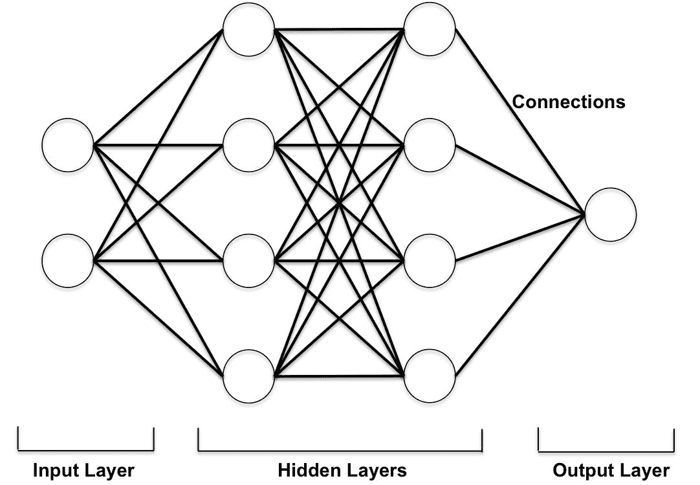
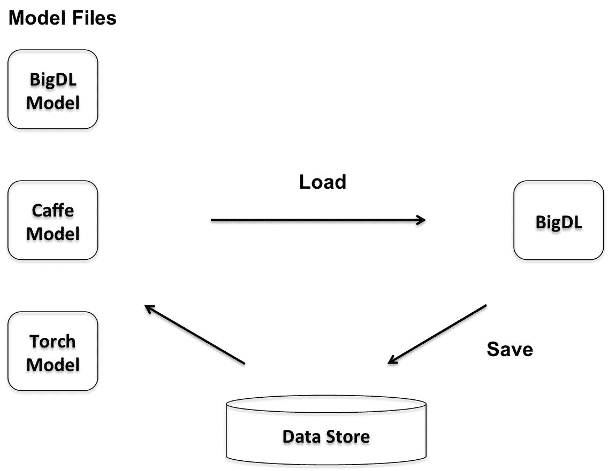
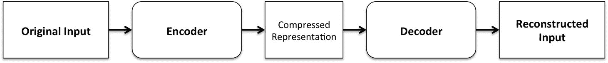
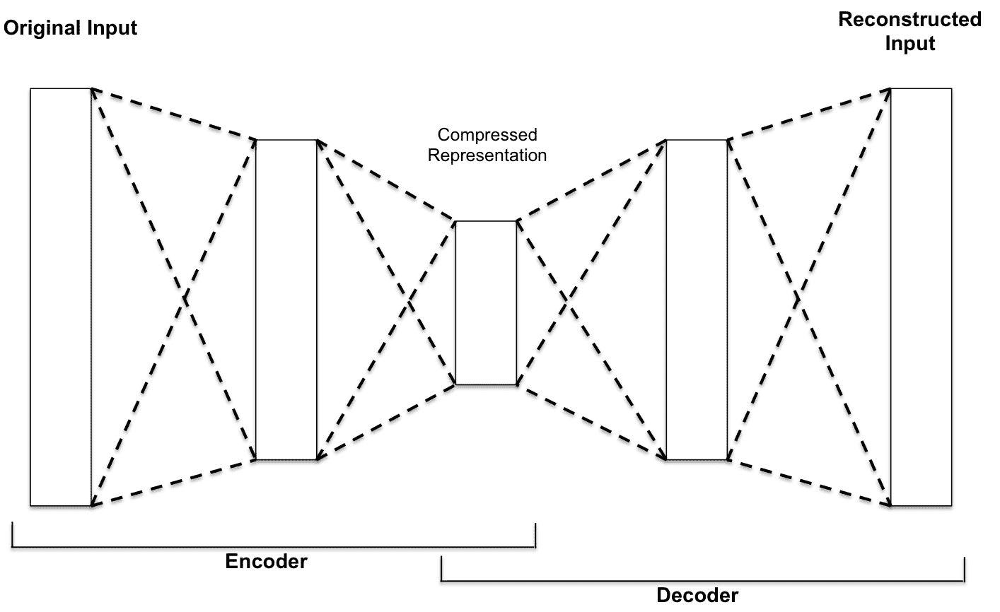

# 在深度学习应用中使用火花 SQL

在过去的十年里，深度学习已经成为解决机器学习中几个难题的一个很好的方法。我们听说深度学习被部署在许多不同的领域，包括计算机视觉、语音识别、自然语言处理、音频识别、社交媒体应用、机器翻译和生物学。通常，使用深度学习方法产生的结果与人类专家产生的结果相当或更好。

已经有几种不同类型的深度学习模型被应用于不同的问题。我们将回顾这些模型的基本概念，并给出一些代码。这是 Spark 中的一个新兴领域，因此即使有几个不同的库可用，许多库仍处于早期版本或每天都在发展。我们将简要概述其中一些库，包括一些使用 Spark 2.1.0、Scala 和 BigDL 的代码示例。我们选择 BigDL 是因为它是少数直接运行在 Spark Core 之上的库(类似于其他 Spark 包)，并且使用 Scala API 与 Spark SQL DataFrame API 和 ML 管道一起工作。

更具体地说，在本章中，您将了解以下内容:

*   什么是深度学习？
*   理解各种深度学习模型的关键概念
*   在 Spark 中理解深度学习
*   与 BigDL 和 Spark 合作

# 引入神经网络

神经网络，或者说**人工神经网络** ( **神经网络**)是一组算法，或者说是实际的硬件，它是松散地模仿人脑的。它们本质上是一组相互连接的处理节点，旨在识别模式。他们适应或学习一组训练模式，如图像、声音、文本、时间序列等。

神经网络通常被组织成由互连节点组成的层。这些节点通过连接发送信号来相互通信。模式通过输入层呈现给网络，然后被传递给一个或多个隐藏层。实际计算是在这些隐藏层中执行的。最后一个隐藏层连接到输出最终答案的输出层。

特定节点的总输入通常是每个连接节点输出的函数。这些输入对节点的贡献可以是兴奋性的，也可以是抑制性的，最终有助于确定信号是否以及在多大程度上进一步通过网络(通过激活函数)。通常，sigmoid 激活函数非常受欢迎。在一些应用中，还使用了线性、半线性或双曲线 tan ( `Tanh`)函数。在节点的输出是总输入的随机函数的情况下，输入决定了给定节点获得高激活值的概率。

基于学习规则修改网络内连接的权重；例如，当一个神经网络最初呈现一个模式时，它会猜测权重可能是多少。然后，它会评估其答案与实际答案的差距，并对其连接权重进行适当调整。

For good introduction to the basics of neural networks, refer: "*A Basic Introduction To Neural Networks*" by Bolo, available at: [http://pages.cs.wisc.edu/~bolo/shipyard/neural/local.html](http://pages.cs.wisc.edu/~bolo/shipyard/neural/local.html).

我们将在接下来的章节中介绍各种神经网络的更具体的细节。

# 理解深度学习

深度学习是人工神经网络在学习任务中的应用。深度学习方法基于学习数据表示，而不是特定于任务的算法。虽然学习可以是有监督的或无监督的，但是最近的焦点已经转向创建从大规模的、未标记的数据集学习这些表示的有效系统。

下图描绘了具有两个隐藏层的简单深度学习神经网络:



深度学习通常由多层处理单元组成，每个层内都有特征表示的学习。这些层形成了特征的层次结构，深度学习假设层次结构对应于抽象的层次。因此，它利用了层次解释因素的思想，即从较低层次的概念中学习较高层次的更抽象的概念。根据用例的需要，改变层的数量和层的大小可以提供不同的抽象量。

# 理解表征学习

深度学习方法是具有多个抽象层次的表征学习方法。这里，非线性模块将原始输入转换为更高、更抽象的表示。最终，非常复杂的函数可以通过组成足够数量的这样的层来学习。

For a review paper on deep learning, refer to *Deep Learning*, by Yann LeCun, Yoshua Bengio, and Geoffrey Hinton, which is available at [http://www.nature.com/nature/journal/v521/n7553/full/nature14539.html?foxtrotcallback=true](http://www.nature.com/nature/journal/v521/n7553/full/nature14539.html?foxtrotcallback=true).

现在，我们说明在传统模式识别任务中学习表示和特征的过程:


传统的机器学习技术在处理原始或原始形式的自然数据方面能力有限。构建这样的机器学习系统需要深厚的领域专业知识和大量的努力来识别(并保持更新)特征，学习子系统(通常是分类器)可以从中检测或分类输入中的模式。

许多传统的机器学习应用在手工特征的基础上使用线性分类器。这种分类器通常需要一个好的特征提取器，该特征提取器产生对图像方面有选择性的表示。然而，如果可以使用通用的学习程序自动学习好的特性，就不需要做这些努力。深度学习的这一特殊方面代表了深度学习的关键优势之一。

与早期的机器学习技术相反，深度学习的高级过程通常是端到端学习过程，其中包括也从数据中学习的特征。这里说明了这一点:


在下一节中，我们将简要讨论一个最常用的函数，随机梯度下降，用于调整网络中的权重。

# 理解随机梯度下降

深度学习系统可以由数百万个可调整的权重组成，数百万个标记的示例用于训练机器。在实践中，**随机梯度下降** ( **SGD** )优化被广泛应用于许多不同的情况。在 SGD 中，梯度描述了网络误差和单个权重之间的关系，即误差如何随着权重的调整而变化。

这种优化方法包括:

*   举几个例子来说明输入向量
*   计算输出和误差
*   计算示例的平均梯度
*   适当调整重量

对许多小的训练例子重复这个过程。当目标函数的平均值停止减小时，该过程停止。

与更复杂的优化技术相比，这个简单的过程通常非常有效地产生一组好的权重。此外，培训过程也需要更短的时间。训练过程完成后，通过在测试数据集上运行训练好的模型来测量系统的性能。测试集包含机器以前(在训练阶段)没有看到的新输入。

在深度学习神经网络中，激活函数通常设置在层级别，并应用于特定层中的所有神经元或节点。此外，多层深度学习神经网络的输出层起着特定的作用；例如，在监督学习(带有标记的输入)中，它基于从前一层接收的信号应用最可能的标签。输出层上的每个节点代表一个标签，该节点产生两种可能的结果之一，即`0`或`1`。虽然这种神经网络产生二进制输出，但它们接收的输入通常是连续的；例如，对推荐引擎的输入可以包括诸如客户在前一个月花费了多少以及过去一个月每周平均客户访问次数等因素。输出层必须将这些信号处理成给定输入的概率度量。

# 在 Spark 中引入深度学习

在本节中，我们将回顾一些使用 Spark 的更流行的深度学习库。其中包括 CaffeOnSpark、DL4J、TensorFrames 和 BigDL。

# 介绍咖啡馆

CaffeOnSpark 由雅虎开发，用于 Hadoop 集群上的大规模分布式深度学习。通过将深度学习框架 Caffe 的功能与 Apache Spark(和 Apache Hadoop)相结合，CaffeOnSpark 能够在 GPU 和 CPU 服务器集群上实现分布式深度学习。

For more details on CaffeOnSpark, refer to [https://github.com/yahoo/CaffeOnSpark](https://github.com/yahoo/CaffeOnSpark).

CaffeOnSpark 支持神经网络模型训练、测试和特征提取。它是对非深度学习库、Spark MLlib 和 Spark SQL 的补充。CaffeOnSpark 的 Scala API 为 Spark 应用程序提供了一种在分布式数据集上调用深度学习算法的简单机制。这里，深度学习通常在与现有数据处理流水线相同的集群中进行，以支持特征工程和传统的机器学习应用。因此，CaffeOnSpark 允许将深度学习培训和测试过程嵌入到 Spark 应用程序中。

# 介绍 DL4J

DL4J 支持在 Spark 集群上训练神经网络，以加速网络训练。当前版本的 DL4J 使用每个集群节点上的参数平均过程来训练网络。当主人有一份训练好的网络时，训练就完成了。

For more details on DL4J, refer to [https://deeplearning4j.org/spark](https://deeplearning4j.org/spark).

# 引入张量框架

Scala 和 Apache Spark 的实验性 TensorFlow 绑定目前在 GitHub 上可用。TensorFrames 本质上是 Spark 数据帧上的 TensorFlow，它允许您使用 TensorFlow 程序操作 Apache Spark 的数据帧。Scala 的支持目前比 Python 更有限 Scala DSL 的特点是 TensorFlow 转换的子集。

For more details on TensorFrames, visit [https://github.com/databricks/tensorframes](https://github.com/databricks/tensorframes).

在 Scala 中，操作可以从以`ProtocolBuffers`格式定义的现有图形中加载，也可以使用简单的 Scala DSL 加载。然而，考虑到 TensorFlow 的整体受欢迎程度，这个库正在获得吸引力，并且在 Python 社区中更受欢迎。

# 使用 BigDL

BigDL 是一个面向 Apache Spark 的开源分布式深度学习库。它最初由英特尔开发并开源。使用 BigDL，开发人员可以编写深度学习应用程序作为标准的 Spark 程序。这些程序直接运行在现有的 Spark 或 Hadoop 集群之上，如下图所示:


BigDL 模仿 Torch，它为深度学习提供支持，包括数值计算(通过 Tensors)和[神经网络](https://github.com/intel-analytics/BigDL/tree/master/spark/dl/src/main/scala/com/intel/analytics/bigdl/nn)。此外，开发人员可以将预处理后的 [Caffe](http://caffe.berkeleyvision.org/) 或 [Torch](http://torch.ch/) 模型加载到 BigDL-Spark 程序中，如下图所示:



为了实现高性能，BigDL 在每个 Spark 任务中使用[英特尔 MKL](https://software.intel.com/en-us/intel-mkl) 和多线程编程。

For BigDL documentation, examples, and API guides, check out [https://bigdl-project.github.io/master/](https://bigdl-project.github.io/master/).

下图显示了如何在 Spark 集群的高层执行 BigDL 程序。在集群管理器和驱动程序的帮助下，Spark 任务分布在 Spark 工作节点或容器(执行器)中:


我们将在本章的后面几节中执行 BigDL 分布中可用的深度神经网络的几个例子。目前，这是少数几个使用 Spark SQL 数据框架 API 和 ML 管道的库之一。

在下一节中，我们将重点介绍如何利用 Spark 并行调整超参数。

# 深度学习模型的超参数调整

在构建神经网络时，有许多重要的超参数需要仔细选择。考虑给定的示例:

*   每层中的神经元数量:很少的神经元会降低网络的表达能力，但是太多的神经元会大大增加运行时间并返回有噪声的估计值
*   学习率:如果太高，神经网络只会关注最后看到的几个样本，而忽略之前积累的所有经验，如果太低，达到好的状态需要太长时间

超参数调整过程是“令人尴尬的并行”，可以使用 Spark 进行分发。

For more details, refer to *Deep Learning with Apache Spark and TensorFlow*, by Tim Hunter, at [https://databricks.com/blog/2016/01/25/deep-learning-with-apache-spark-and-tensorflow.html](https://databricks.com/blog/2016/01/25/deep-learning-with-apache-spark-and-tensorflow.html).

# 引入深度学习管道

Spark 中有一个新兴的支持深度学习管道的库，它为使用 Apache Spark 在 Python 中进行可扩展的深度学习提供了高级 API。目前，支持 TensorFlow 和 TensorFlow 支持的 Keras 工作流，重点是模型推断/评分和大规模图像数据的迁移学习。

To follow developments on deep learning pipelines in Spark, visit [https://github.com/databricks/spark-deep-learning](https://github.com/databricks/spark-deep-learning).

此外，它还为数据科学家和机器学习专家提供工具，将深度学习模型转化为可供更广泛的用户使用的 SQL UDFs。这也是产生深度学习模型的好方法。

在下一节中，我们将把重点转移到监督学习上。

# 理解监督学习

机器学习最常见的形式是监督学习；例如，如果我们正在构建一个系统来对一组特定的图像进行分类，我们首先从相同的类别中收集大量的图像数据集。在训练过程中，机器会显示一幅图像，并以分数向量的形式产生输出，每个类别一个分数。作为培训的结果，我们期望期望的类别在所有类别中得分最高。

一种特殊类型的深度网络——卷积神经网络——比全连接网络更容易训练和推广。在监督学习场景中，深度卷积网络显著改善了图像、视频、语音和音频数据的处理结果。同样，循环网络也照亮了文本和语音等连续数据。我们将在后续章节中探讨这些类型的神经网络。

# 理解卷积神经网络

卷积神经网络是一种特殊的多层神经网络，设计用于通过最少的预处理直接从像素图像中识别视觉模式。它们能够识别具有广泛可变性的模式，并且能够有效地处理失真和简单的几何变换。中枢神经系统也使用反向传播算法的一个版本进行训练。

典型 ConvNet 的架构由一系列级构成，包括几级堆叠卷积、非线性和汇集层，随后是额外的卷积和全连接层。非线性函数通常是**校正线性单元** ( **ReLU** )函数，汇集层的作用是将语义上相似的特征合并为一个。因此，当前一层中的元素在位置和外观上发生变化时，池化允许表示变化很小。

LeNet-5 是为手写和机器打印字符识别而设计的卷积网络。在这里，我们给出了一个在 BigDL 发行版中可用的 Lenet-5 的例子。

The full source code for the example is available at [https://github.com/intel-analytics/BigDL/tree/master/spark/dl/src/main/scala/com/intel/analytics/bigdl/models/lenet](https://github.com/intel-analytics/BigDL/tree/master/spark/dl/src/main/scala/com/intel/analytics/bigdl/models/lenet).

在这里，我们将使用 Spark shell 来执行相同的代码。请注意，常量的值都是从上述网站的源代码中获取的。

首先，执行`bigdl` shell 脚本设置环境:

```scala
source /Users/aurobindosarkar/Downloads/BigDL-master/scripts/bigdl.sh
```

然后，我们用指定的适当 BigDL JAR 启动 Spark 外壳，如下所示:

```scala
bin/spark-shell --properties-file /Users/aurobindosarkar/Downloads/BigDL-master/spark/dist/target/bigdl-0.2.0-SNAPSHOT-spark-2.0.0-scala-2.11.8-mac-dist/conf/spark-bigdl.conf --jars /Users/aurobindosarkar/Downloads/BigDL-master/spark/dist/target/bigdl-0.2.0-SNAPSHOT-spark-2.0.0-scala-2.11.8-mac-dist/lib/bigdl-0.2.0-SNAPSHOT-jar-with-dependencies.jar
```

本例数据集可从[http://yann.lecun.com/exdb/mnist/](http://yann.lecun.com/exdb/mnist/)下载。

该示例的火花外壳会话如下所示:

```scala
scala> import com.intel.analytics.bigdl._scala> import com.intel.analytics.bigdl.dataset.DataSetscala> import com.intel.analytics.bigdl.dataset.image.{BytesToGreyImg, GreyImgNormalizer, GreyImgToBatch, GreyImgToSample}scala> import com.intel.analytics.bigdl.nn.{ClassNLLCriterion, Module}scala> import com.intel.analytics.bigdl.numeric.NumericFloatscala> import com.intel.analytics.bigdl.optim._scala> import com.intel.analytics.bigdl.utils.{Engine, T,scala> import com.intel.analytics.bigdl.nn._scala> import java.nio.ByteBufferscala> import java.nio.file.{Files, Path, Paths}scala> import com.intel.analytics.bigdl.dataset.ByteRecordscala> import com.intel.analytics.bigdl.utils.Filescala> val trainData = "/Users/aurobindosarkar/Downloads/mnist/train-images-idx3-ubyte"scala> val trainLabel = "/Users/aurobindosarkar/Downloads/mnist/train-labels-idx1-ubyte"scala> val validationData = "/Users/aurobindosarkar/Downloads/mnist/t10k-images-idx3-ubyte"scala> val validationLabel = "/Users/aurobindosarkar/Downloads/mnist/t10k-labels-idx1-ubyte"scala> val nodeNumber = 1 //Number of nodesscala> val coreNumber = 2 //Number of coresscala> Engine.initscala> val model = Sequential[Float]()model: com.intel.analytics.bigdl.nn.Sequential[Float] =nn.Sequential {[input -> -> output]}scala> val classNum = 10 //Number of classes (digits)scala> val batchSize = 12//The model uses the Tanh function for non-linearity.//It has two sets layers comprising of Convolution-Non-Linearity-Pooling//It uses a Softmax function to output the resultsscala> model.add(Reshape(Array(1, 28, 28))).add(SpatialConvolution(1, 6, 5, 5)).add(Tanh()).add(SpatialMaxPooling(2, 2, 2, 2)).add(Tanh()).add(SpatialConvolution(6, 12, 5, 5)).add(SpatialMaxPooling(2, 2, 2, 2)).add(Reshape(Array(12 * 4 * 4))).add(Linear(12 * 4 * 4, 100)).add(Tanh()).add(Linear(100, classNum)).add(LogSoftMax())res1: model.type =nn.Sequential {[input -> (1) -> (2) -> (3) -> (4) -> (5) -> (6) -> (7) -> (8) -> (9) -> (10) -> (11) -> (12) -> output](1): nn.Reshape(1x28x28)(2): nn.SpatialConvolution(1 -> 6, 5 x 5, 1, 1, 0, 0)(3): nn.Tanh(4): nn.SpatialMaxPooling(2, 2, 2, 2, 0, 0)(5): nn.Tanh(6): nn.SpatialConvolution(6 -> 12, 5 x 5, 1, 1, 0, 0)(7): nn.SpatialMaxPooling(2, 2, 2, 2, 0, 0)(8): nn.Reshape(192)(9): nn.Linear(192 -> 100)(10): nn.Tanh(11): nn.Linear(100 -> 10)(12): nn.LogSoftMax}//The following is a private function in Utils.scala> def load(featureFile: String, labelFile: String): Array[ByteRecord] = {|    val featureBuffer = ByteBuffer.wrap(Files.readAllBytes(Paths.get(featureFile)))|    val labelBuffer = ByteBuffer.wrap(Files.readAllBytes(Paths.get(labelFile)));|    val labelMagicNumber = labelBuffer.getInt();|    require(labelMagicNumber == 2049);|    val featureMagicNumber = featureBuffer.getInt();|    require(featureMagicNumber == 2051);|    val labelCount = labelBuffer.getInt();|    val featureCount = featureBuffer.getInt();|    require(labelCount == featureCount);|    val rowNum = featureBuffer.getInt();|    val colNum = featureBuffer.getInt();|    val result = new Array[ByteRecord](featureCount);|    var i = 0;|    while (i < featureCount) {|       val img = new Array[Byte]((rowNum * colNum));|       var y = 0;|       while (y < rowNum) {|          var x = 0;|          while (x < colNum) {|             img(x + y * colNum) = featureBuffer.get();|             x += 1;|          }|          y += 1;|       }|       result(i) = ByteRecord(img, labelBuffer.get().toFloat + 1.0f);|       i += 1;|    }|    result;| }scala> val trainMean = 0.13066047740239506scala> val trainStd = 0.3081078scala> val trainSet = DataSet.array(load(trainData, trainLabel), sc) -> BytesToGreyImg(28, 28) -> GreyImgNormalizer(trainMean, trainStd) -> GreyImgToBatch(batchSize)scala> val optimizer = Optimizer(model = model, dataset = trainSet, criterion = ClassNLLCriterion[Float]())scala> val testMean = 0.13251460696903547scala> val testStd = 0.31048024scala> val maxEpoch = 2scala> val validationSet = DataSet.array(load(validationData, validationLabel), sc) -> BytesToGreyImg(28, 28) -> GreyImgNormalizer(testMean, testStd) -> GreyImgToBatch(batchSize)scala> optimizer.setEndWhen(Trigger.maxEpoch(2))scala> optimizer.setState(T("learningRate" -> 0.05, "learningRateDecay" -> 0.0))scala> optimizer.setCheckpoint("/Users/aurobindosarkar/Downloads/mnist/checkpoint", Trigger.severalIteration(500))scala> optimizer.setValidation(trigger = Trigger.everyEpoch, dataset = validationSet, vMethods = Array(new Top1Accuracy, new Top5Accuracy[Float], new Loss[Float]))scala> optimizer.optimize()scala> model.save("/Users/aurobindosarkar/Downloads/mnist/model") //Save the trained model to disk.scala> val model = Module.load[Float]("/Users/aurobindosarkar/Downloads/mnist/model") //Retrieve the model from the diskscala> val partitionNum = 2scala> val rddData = sc.parallelize(load(validationData, validationLabel), partitionNum)scala> val transformer = BytesToGreyImg(28, 28) -> GreyImgNormalizer(testMean, testStd) -> GreyImgToSample()scala> val evaluationSet = transformer(rddData)scala> val result = model.evaluate(evaluationSet, Array(new Top1Accuracy[Float]), Some(batchSize))scala> result.foreach(r => println(s"${r._2} is ${r._1}"))Top1Accuracy is Accuracy(correct: 9831, count: 10000, accuracy: 0.9831)
```

在下一节中，我们将展示一个文本分类的例子。

# 利用神经网络进行文本分类

其他越来越重要的应用包括自然语言理解和语音识别。

The example in this section is available as a part of the BigDL distribution and the full source code is available at [https://github.com/intel-analytics/BigDL/tree/master/spark/dl/src/main/scala/com/intel/analytics/bigdl/example/textclassification](https://github.com/intel-analytics/BigDL/tree/master/spark/dl/src/main/scala/com/intel/analytics/bigdl/example/textclassification).

它使用预训练的手套嵌入将单词转换成向量，然后使用它在 20 个新闻组数据集上训练具有 20 个不同类别的文本分类模型。该模型经过两个时期的训练，准确率达到 90%以上。

这里给出了定义 CNN 模型和优化器的代码的关键部分:

```scala
val model = Sequential[Float]()//The model has 3 sets of Convolution and Pooling layers.model.add(Reshape(Array(param.embeddingDim, 1, param.maxSequenceLength)))model.add(SpatialConvolution(param.embeddingDim, 128, 5, 1))model.add(ReLU())model.add(SpatialMaxPooling(5, 1, 5, 1))model.add(SpatialConvolution(128, 128, 5, 1))model.add(ReLU())model.add(SpatialMaxPooling(5, 1, 5, 1))model.add(SpatialConvolution(128, 128, 5, 1))model.add(ReLU())model.add(SpatialMaxPooling(35, 1, 35, 1))model.add(Reshape(Array(128)))model.add(Linear(128, 100))model.add(Linear(100, classNum))model.add(LogSoftMax())//The optimizer uses the Adagrad methodval optimizer = Optimizer(model = buildModel(classNum),sampleRDD = trainingRDD,criterion = new ClassNLLCriterion[Float](),batchSize = param.batchSize)optimizer.setOptimMethod(new Adagrad(learningRate = 0.01, learningRateDecay = 0.0002)).setValidation(Trigger.everyEpoch, valRDD, Array(new Top1Accuracy[Float]), param.batchSize).setEndWhen(Trigger.maxEpoch(20)).optimize()
```

输入数据集及其下载网址描述如下:

*   **嵌入**:在 2014 年英语维基百科的一个转储上训练的 400 k 单词的 100 维预训练手套嵌入。从[http://nlp.stanford.edu/data/glove.6B.zip](http://nlp.stanford.edu/data/glove.6B.zip)下载预训练手套单词嵌入。
*   **训练数据**:“20 个新闻组数据集”，包含 20 个类别，共 19，997 篇文本。从[下载 20 个新闻组数据集作为训练数据。](http://www.cs.cmu.edu/afs/cs.cmu.edu/project/theo-20/www/data/news20.tar.gz)

在我们的示例中，我们将类别数量减少到了 8 个，以避免在内存小于 16 GB 的笔记本电脑上出现`Out-of-Memory`异常。将这些数据集放入`BASE_DIR`；最终的目录结构应该如图所示:


使用以下命令执行文本分类器:

```scala
Aurobindos-MacBook-Pro-2:BigDL aurobindosarkar$ /Users/aurobindosarkar/Downloads/BigDL-master/scripts/bigdl.sh -- /Users/aurobindosarkar/Downloads/spark-2.1.0-bin-hadoop2.7/bin/spark-submit --master "local[2]" --driver-memory 14g --class com.intel.analytics.bigdl.example.textclassification.TextClassifier /Users/aurobindosarkar/Downloads/BigDL-master/spark/dist/target/bigdl-0.2.0-SNAPSHOT-spark-2.0.0-scala-2.11.8-mac-dist/lib/bigdl-0.2.0-SNAPSHOT-jar-with-dependencies.jar --batchSize 128 -b /Users/aurobindosarkar/Downloads/textclassification -p 4
```

此处给出了示例输出，供您参考:

```scala
17/08/16 14:50:07 INFO textclassification.TextClassifier$: Current parameters: TextClassificationParams(/Users/aurobindosarkar/Downloads/textclassification,1000,20000,0.8,128,100,4)17/08/16 14:50:07 INFO utils.ThreadPool$: Set mkl threads to 1 on thread 117/08/16 14:50:09 INFO utils.Engine$: Auto detect executor number and executor cores number17/08/16 14:50:09 INFO utils.Engine$: Executor number is 1 and executor cores number is 217/08/16 14:50:09 INFO utils.Engine$: Find existing spark context. Checking the spark conf...17/08/16 14:50:10 INFO utils.TextClassifier: Found 8000 texts.17/08/16 14:50:10 INFO utils.TextClassifier: Found 8 classes17/08/16 14:50:13 INFO utils.TextClassifier: Indexing word vectors.17/08/16 14:50:16 INFO utils.TextClassifier: Found 17424 word vectors.17/08/16 14:50:16 INFO optim.DistriOptimizer$: caching training rdd ...17/08/16 14:50:37 INFO optim.DistriOptimizer$: Cache thread models...17/08/16 14:50:37 INFO optim.DistriOptimizer$: model thread pool size is 117/08/16 14:50:37 INFO optim.DistriOptimizer$: Cache thread models... done17/08/16 14:50:37 INFO optim.DistriOptimizer$: config {learningRate: 0.01maxDropPercentage: 0.0computeThresholdbatchSize: 100warmupIterationNum: 200learningRateDecay: 2.0E-4dropPercentage: 0.0}17/08/16 14:50:37 INFO optim.DistriOptimizer$: Shuffle data17/08/16 14:50:37 INFO optim.DistriOptimizer$: Shuffle data complete. Takes 0.012679728s17/08/16 14:50:38 INFO optim.DistriOptimizer$: [Epoch 1 0/6458][Iteration 1][Wall Clock 0.0s] Train 128 in 0.962042186seconds. Throughput is 133.0503 records/second. Loss is 2.0774076.17/08/16 14:50:40 INFO optim.DistriOptimizer$: [Epoch 1 128/6458][Iteration 2][Wall Clock 0.962042186s] Train 128 in 1.320501728seconds. Throughput is 96.93285 records/second. Loss is 4.793501.17/08/16 14:50:40 INFO optim.DistriOptimizer$: [Epoch 1 256/6458][Iteration 3][Wall Clock 2.282543914s] Train 128 in 0.610049842seconds. Throughput is 209.81892 records/second. Loss is 2.1110187.17/08/16 14:50:41 INFO optim.DistriOptimizer$: [Epoch 1 384/6458][Iteration 4][Wall Clock 2.892593756s] Train 128 in 0.609548069seconds. Throughput is 209.99164 records/second. Loss is 2.0820618.17/08/16 14:50:42 INFO optim.DistriOptimizer$: [Epoch 1 512/6458][Iteration 5][Wall Clock 3.502141825s] Train 128 in 0.607720212seconds. Throughput is 210.62325 records/second. Loss is 2.0860045.17/08/16 14:50:42 INFO optim.DistriOptimizer$: [Epoch 1 640/6458][Iteration 6][Wall Clock 4.109862037s] Train 128 in 0.607034064seconds. Throughput is 210.86131 records/second. Loss is 2.086178....17/08/16 15:04:57 INFO optim.DistriOptimizer$: [Epoch 20 6144/6458][Iteration 1018][Wall Clock 855.715191033s] Train 128 in 0.771615991seconds. Throughput is 165.88562 records/second. Loss is 2.4244189E-4.17/08/16 15:04:58 INFO optim.DistriOptimizer$: [Epoch 20 6272/6458][Iteration 1019][Wall Clock 856.486807024s] Train 128 in 0.770584628seconds. Throughput is 166.10765 records/second. Loss is 0.04117684.17/08/16 15:04:59 INFO optim.DistriOptimizer$: [Epoch 20 6400/6458][Iteration 1020][Wall Clock 857.257391652s] Train 128 in 0.783425485seconds. Throughput is 163.38503 records/second. Loss is 3.2506883E-4.17/08/16 15:04:59 INFO optim.DistriOptimizer$: [Epoch 20 6400/6458][Iteration 1020][Wall Clock 857.257391652s] Epoch finished. Wall clock time is 861322.002763ms17/08/16 15:04:59 INFO optim.DistriOptimizer$: [Wall Clock 861.322002763s] Validate model...17/08/16 15:05:02 INFO optim.DistriOptimizer$: Top1Accuracy is Accuracy(correct: 1537, count: 1542, accuracy: 0.996757457846952)
```

在下一节中，我们将探索深度神经网络在语言处理中的应用。

# 使用深度神经网络进行语言处理

正如[第 9 章](09.html#4U9TC0-e9cbc07f866e437b8aa14e841622275c)、*用 Spark SQL 开发应用程序*中所讨论的，语言统计建模的标准方法通常基于计算 n-gram 出现的频率。在大多数现实世界的用例中，这通常需要非常大的训练语料库。此外，n-grams 将每个单词视为一个独立的单元，因此它们不能在语义相关的单词序列中进行归纳。相反，神经语言模型将每个单词与一个实值特征向量相关联，因此语义相关的单词在向量空间中彼此接近。当单词序列来自真实文本的大型语料库时，学习单词向量也非常有效。这些单词向量由神经网络自动发现的学习特征组成。

从文本中学习到的单词的向量表示现在在自然语言应用中被广泛使用。在下一节中，我们将探索递归神经网络及其在文本分类任务中的应用。

# 理解递归神经网络

一般来说，对于涉及顺序输入的任务，建议使用**递归神经网络** ( **神经网络**)。这样的输入一次处理一个元素，同时保持一个“状态向量”(以隐藏的单位)。状态隐式包含序列中所有过去元素的信息。

通常，在传统的无线网络中，很难长时间存储信息。为了长时间记住输入，可以用外显记忆来扩充网络。同样，这也是**长短期记忆** ( **LSTM** )网络中使用的方法；他们使用可以记住输入的隐藏单元。事实证明，LSTM 网络比传统的无线网络更有效。

在这一节中，我们将探索用于模拟序列数据的递归神经网络。下图说明了一个简单的递归神经网络或埃尔曼网络:


这可能是递归神经网络最简单的版本，易于实现和训练。网络有一个输入层、一个隐藏层(也称为上下文层或状态)和一个输出层。时间上`t`网络的输入为**输入(t)** ，输出为**输出(t)** ，**上下文(t)** 为网络状态(隐藏层)。输入向量由表示当前单词的向量串联而成，并在时间`t − 1`从上下文层的神经元输出。

这些网络在几个时期中被训练，其中来自训练语料库的所有数据被顺序呈现。为了训练网络，我们可以使用具有随机梯度下降的标准反向传播算法。在每个时期之后，对网络进行验证数据测试。如果验证数据的对数似然性增加，训练将在新的时期继续。如果没有观察到明显的改善，在每个新时代开始时，学习率可以减半。如果学习速度没有明显的提高，那么训练就结束了。这种网络的融合通常在 10-20 个时代后实现。

这里，当给定前一个单词和**上下文(T1)**时，输出层表示下一个单词的概率分布。Softmax 确保概率分布有效。在每个训练步骤中，计算误差向量，并用标准反向传播算法更新权重，如下所示:

*误差(t) =所需(t)输出(t)*

这里，期望是使用`1-of-N`编码的向量，表示应该在特定上下文中预测的单词，**输出(t)** 是网络的实际输出。

为了提高性能，我们可以将所有出现频率低于给定阈值(在训练文本中)的单词合并到一个特殊的稀有标记中。因此，所有的生僻字都被平等对待，也就是说，概率在它们之间均匀分布。

现在，我们执行 BigDL 库中提供的一个简单的 RNN 示例。网络是一个完全连接的 RNN，输出反馈到输入。示例模型支持序列到序列的处理，并且是用于语言建模的简单递归神经网络的实现。

For the full source code of this example, refer to [https://github.com/intel-analytics/BigDL/tree/master/spark/dl/src/main/scala/com/intel/analytics/bigdl/models/rnn](https://github.com/intel-analytics/BigDL/tree/master/spark/dl/src/main/scala/com/intel/analytics/bigdl/models/rnn). The input Dataset, Tiny Shakespeare Texts, can be downloaded from [https://raw.githubusercontent.com/karpathy/char-rnn/master/data/tinyshakespeare/input.txt](https://raw.githubusercontent.com/karpathy/char-rnn/master/data/tinyshakespeare/input.txt).

下载文本后，将其放入适当的目录。我们将输入数据集分割成单独的`train.txt`和`val.txt`文件。在我们的示例中，我们选择 80%的输入作为训练数据集，剩下的 20%作为验证数据集。

通过执行以下命令分割输入数据集:

```scala
head -n 8000 input.txt > val.txttail -n +8000 input.txt > train.txt
```

`SentenceSplitter`和`SentenceTokenizer`课程使用`Apache OpenNLP`图书馆。训练好的模型文件- `en-token.bin`和`en-sent.bin` -可以从[http://opennlp.sourceforge.net/models-1.5/](http://opennlp.sourceforge.net/models-1.5/)下载。

这里列出了与模型和优化器相关的代码的关键部分:

```scala
val model = Sequential[Float]()//The RNN is created with the time-related parameter.model.add(Recurrent[Float]().add(RnnCell[Float](inputSize, hiddenSize, Tanh[Float]()))).add(TimeDistributed[Float](Linear[Float](hiddenSize, outputSize)))//The optimization method used is SGD.val optimMethod = if (param.stateSnapshot.isDefined) {OptimMethod.load[Float](param.stateSnapshot.get)} else {new SGD[Float](learningRate = param.learningRate, learningRateDecay = 0.0, weightDecay = param.weightDecay, momentum = param.momentum, dampening = param.dampening)}val optimizer = Optimizer(model = model,dataset = trainSet,criterion = TimeDistributedCriterion[Float](CrossEntropyCriterion[Float](), sizeAverage = true))optimizer.setValidation(Trigger.everyEpoch, validationSet, Array(new Loss[Float](TimeDistributedCriterion[Float](CrossEntropyCriterion[Float](), sizeAverage = true)))).setOptimMethod(optimMethod).setEndWhen(Trigger.maxEpoch(param.nEpochs)).setCheckpoint(param.checkpoint.get, Trigger.everyEpoch).optimize()
```

以下命令执行训练程序。修改特定于您环境的参数:

```scala
Aurobindos-MacBook-Pro-2:bigdl-rnn aurobindosarkar$ /Users/aurobindosarkar/Downloads/BigDL-master/scripts/bigdl.sh -- \> /Users/aurobindosarkar/Downloads/spark-2.1.0-bin-hadoop2.7/bin/spark-submit \> --master local[2] \> --executor-cores 2 \> --total-executor-cores 2 \> --class com.intel.analytics.bigdl.models.rnn.Train \> /Users/aurobindosarkar/Downloads/dist-spark-2.1.1-scala-2.11.8-mac-0.3.0-20170813.202825-21-dist/lib/bigdl-SPARK_2.1-0.3.0-SNAPSHOT-jar-with-dependencies.jar \> -f /Users/aurobindosarkar/Downloads/bigdl-rnn/inputdata/ -s /Users/aurobindosarkar/Downloads/bigdl-rnn/saveDict/ --checkpoint /Users/aurobindosarkar/Downloads/bigdl-rnn/model/ --batchSize 12 -e 2
```

下一个摘录来自训练过程中生成的输出:

```scala
17/08/16 21:32:38 INFO utils.ThreadPool$: Set mkl threads to 1 on thread 117/08/16 21:32:39 INFO utils.Engine$: Auto detect executor number and executor cores number17/08/16 21:32:39 INFO utils.Engine$: Executor number is 1 and executor cores number is 217/08/16 21:32:39 INFO utils.Engine$: Find existing spark context. Checking the spark conf...17/08/16 21:32:41 INFO text.Dictionary: 272304 words and32885 sentences processed17/08/16 21:32:41 INFO text.Dictionary: save created dictionary.txt and discard.txt to/Users/aurobindosarkar/Downloads/bigdl-rnn/saveDict17/08/16 21:32:41 INFO rnn.Train$: maxTrain length = 25, maxVal = 2217/08/16 21:32:42 INFO optim.DistriOptimizer$: caching training rdd ...17/08/16 21:32:42 INFO optim.DistriOptimizer$: Cache thread models...17/08/16 21:32:42 INFO optim.DistriOptimizer$: model thread pool size is 117/08/16 21:32:42 INFO optim.DistriOptimizer$: Cache thread models... done17/08/16 21:32:42 INFO optim.DistriOptimizer$: config {maxDropPercentage: 0.0computeThresholdbatchSize: 100warmupIterationNum: 200isLayerwiseScaled: falsedropPercentage: 0.0}17/08/16 21:32:42 INFO optim.DistriOptimizer$: Shuffle data17/08/16 21:32:42 INFO optim.DistriOptimizer$: Shuffle data complete. Takes 0.011933988s17/08/16 21:32:43 INFO optim.DistriOptimizer$: [Epoch 1 0/32885][Iteration 1][Wall Clock 0.0s] Train 12 in 0.642820037seconds. Throughput is 18.667744 records/second. Loss is 8.302014\. Current learning rate is 0.1.17/08/16 21:32:43 INFO optim.DistriOptimizer$: [Epoch 1 12/32885][Iteration 2][Wall Clock 0.642820037s] Train 12 in 0.211497603seconds. Throughput is 56.73823 records/second. Loss is 8.134232\. Current learning rate is 0.1.17/08/16 21:32:44 INFO optim.DistriOptimizer$: [Epoch 1 24/32885][Iteration 3][Wall Clock 0.85431764s] Train 12 in 0.337422962seconds. Throughput is 35.56367 records/second. Loss is 7.924248\. Current learning rate is 0.1.17/08/16 21:32:44 INFO optim.DistriOptimizer$: [Epoch 1 36/32885][Iteration 4][Wall Clock 1.191740602s] Train 12 in 0.189710956seconds. Throughput is 63.25412 records/second. Loss is 7.6132483\. Current learning rate is 0.1.17/08/16 21:32:44 INFO optim.DistriOptimizer$: [Epoch 1 48/32885][Iteration 5][Wall Clock 1.381451558s] Train 12 in 0.180944071seconds. Throughput is 66.31883 records/second. Loss is 7.095647\. Current learning rate is 0.1.17/08/16 21:32:44 INFO optim.DistriOptimizer$: [Epoch 1 60/32885][Iteration 6][Wall Clock 1.562395629s] Train 12 in 0.184258125seconds. Throughput is 65.12603 records/second. Loss is 6.3607793\. Current learning rate is 0.1....17/08/16 21:50:00 INFO optim.DistriOptimizer$: [Epoch 2 32856/32885][Iteration 5480][Wall Clock 989.905619531s] Train 12 in 0.19739412seconds. Throughput is 60.792084 records/second. Loss is 1.5389917\. Current learning rate is 0.1.17/08/16 21:50:00 INFO optim.DistriOptimizer$: [Epoch 2 32868/32885][Iteration 5481][Wall Clock 990.103013651s] Train 12 in 0.192780994seconds. Throughput is 62.2468 records/second. Loss is 1.3890615\. Current learning rate is 0.1.17/08/16 21:50:01 INFO optim.DistriOptimizer$: [Epoch 2 32880/32885][Iteration 5482][Wall Clock 990.295794645s] Train 12 in 0.197826032seconds. Throughput is 60.65936 records/second. Loss is 1.5320908\. Current learning rate is 0.1.17/08/16 21:50:01 INFO optim.DistriOptimizer$: [Epoch 2 32880/32885][Iteration 5482][Wall Clock 990.295794645s] Epoch finished. Wall clock time is 1038274.610521ms17/08/16 21:50:01 INFO optim.DistriOptimizer$: [Wall Clock 1038.274610521s] Validate model...17/08/16 21:50:52 INFO optim.DistriOptimizer$: Loss is (Loss: 1923.4493, count: 1388, Average Loss: 1.3857704)[Wall Clock 1038.274610521s] Save model to /Users/aurobindosarkar/Downloads/bigdl-rnn/model//20170816_213242
```

接下来，我们使用保存的模型在测试数据集上运行，如图所示:

```scala
Aurobindos-MacBook-Pro-2:bigdl-rnn aurobindosarkar$ /Users/aurobindosarkar/Downloads/BigDL-master/scripts/bigdl.sh -- \> /Users/aurobindosarkar/Downloads/spark-2.1.0-bin-hadoop2.7/bin/spark-submit \> --master local[2] \> --executor-cores 1 \> --total-executor-cores 2 \> --class com.intel.analytics.bigdl.models.rnn.Test \> /Users/aurobindosarkar/Downloads/dist-spark-2.1.1-scala-2.11.8-mac-0.3.0-20170813.202825-21-dist/lib/bigdl-SPARK_2.1-0.3.0-SNAPSHOT-jar-with-dependencies.jar \> -f /Users/aurobindosarkar/Downloads/bigdl-rnn/saveDict --model /Users/aurobindosarkar/Downloads/bigdl-rnn/model/20170816_213242/model.5483 --words 20 --batchSize 1217/08/16 21:53:21 INFO utils.ThreadPool$: Set mkl threads to 1 on thread 117/08/16 21:53:22 INFO utils.Engine$: Auto detect executor number and executor cores number17/08/16 21:53:22 INFO utils.Engine$: Executor number is 1 and executor cores number is 217/08/16 21:53:22 INFO utils.Engine$: Find existing spark context. Checking the spark conf...17/08/16 21:53:24 WARN optim.Validator$: Validator(model, dataset) is deprecated. 17/08/16 21:53:24 INFO optim.LocalValidator$: model thread pool size is 117/08/16 21:53:24 INFO optim.LocalValidator$: [Validation] 12/13 Throughput is 84.44181986758397 record / sec17/08/16 21:53:24 INFO optim.LocalValidator$: [Validation] 13/13 Throughput is 115.81166197957567 record / secLoss is (Loss: 11.877369, count: 3, Average Loss: 3.959123)
```

# 引入自动编码器

自动编码器神经网络是一种无监督学习算法，它将目标值设置为等于输入值。因此，自动编码器试图学习恒等式函数的近似值。

学习一个身份函数似乎不是一个值得的练习；然而，通过对网络施加约束，例如限制隐藏单元的数量，我们可以发现关于数据的有趣结构。下图描述了自动编码器的关键组件:



下图还显示了自动编码器的原始输入、压缩表示和输出图层。更具体地说，该图表示一种情况，例如，输入图像具有来自 10×10 图像(100 像素)的像素强度值，并且在第二层中存在`50`隐藏单元。在这里，网络被迫学习输入的“压缩”表示，其中它必须尝试使用`50`隐藏单元“重建”100 像素输入:



For more details on autoencoders, refer to *Reducing the Dimensionality of Data with Neural Networks* by G. E. Hinton and R. R. Salakhutdinov, available at [https://www.cs.toronto.edu/~hinton/science.pdf](https://www.cs.toronto.edu/~hinton/science.pdf).

现在，我们针对 MNIST 数据集展示一个来自 BigDL 分布的自动编码器的例子。

要训练自动编码器，您需要从[http://yann.lecun.com/exdb/mnist/](http://yann.lecun.com/exdb/mnist/)下载 MNIST 数据集。

您需要下载以下内容:

```scala
train-images-idx3-ubyte.gztrain-labels-idx1-ubyte.gz (the labels file is not actually used in this example)
```

然后，您必须解压缩它们以获得以下文件:

```scala
train-images-idx3-ubytetrain-labels-idx1-ubyte
```

对于我们的实现，ReLU 被用作激活函数，均方差被用作损失函数。此处列出了此示例中使用的模型和优化器代码的关键部分:

```scala
val rowN = 28val colN = 28val featureSize = rowN * colNval classNum = 32//The following model uses ReLUval model = Sequential[Float]()model.add(new Reshape(Array(featureSize)))model.add(new Linear(featureSize, classNum))model.add(new ReLU[Float]())model.add(new Linear(classNum, featureSize))model.add(new Sigmoid[Float]())val optimMethod = new Adagrad[Float](learningRate = 0.01, learningRateDecay = 0.0, weightDecay = 0.0005)val optimizer = Optimizer(model = model,dataset = trainDataSet,criterion = new MSECriterion[Float]())optimizer.setOptimMethod(optimMethod).setEndWhen(Trigger.maxEpoch(param.maxEpoch)).optimize()
```

以下是用于执行自动编码器示例的命令:

```scala
Aurobindos-MacBook-Pro-2:bigdl-rnn aurobindosarkar$ /Users/aurobindosarkar/Downloads/BigDL-master/scripts/bigdl.sh -- /Users/aurobindosarkar/Downloads/spark-2.1.0-bin-hadoop2.7/bin/spark-submit --master local[2] --class com.intel.analytics.bigdl.models.autoencoder.Train /Users/aurobindosarkar/Downloads/BigDL-master/spark/dist/target/bigdl-0.2.0-SNAPSHOT-spark-2.0.0-scala-2.11.8-mac-dist/lib/bigdl-0.2.0-SNAPSHOT-jar-with-dependencies.jar -b 150 -f /Users/aurobindosarkar/Downloads/mnist --maxEpoch 2 --checkpoint /Users/aurobindosarkar/Downloads/mnist
```

该示例生成的输出如下:

```scala
17/08/16 22:52:16 INFO utils.ThreadPool$: Set mkl threads to 1 on thread 117/08/16 22:52:17 INFO utils.Engine$: Auto detect executor number and executor cores number17/08/16 22:52:17 INFO utils.Engine$: Executor number is 1 and executor cores number is 217/08/16 22:52:17 INFO utils.Engine$: Find existing spark context. Checking the spark conf...17/08/16 22:52:18 INFO optim.DistriOptimizer$: caching training rdd ...17/08/16 22:52:19 INFO optim.DistriOptimizer$: Cache thread models...17/08/16 22:52:19 INFO optim.DistriOptimizer$: model thread pool size is 117/08/16 22:52:19 INFO optim.DistriOptimizer$: Cache thread models... done17/08/16 22:52:19 INFO optim.DistriOptimizer$: config {weightDecay: 5.0E-4learningRate: 0.01maxDropPercentage: 0.0computeThresholdbatchSize: 100momentum: 0.9warmupIterationNum: 200dampening: 0.0dropPercentage: 0.0}17/08/16 22:52:19 INFO optim.DistriOptimizer$: Shuffle data17/08/16 22:52:19 INFO optim.DistriOptimizer$: Shuffle data complete. Takes 0.013076416s17/08/16 22:52:19 INFO optim.DistriOptimizer$: [Epoch 1 0/60000][Iteration 1][Wall Clock 0.0s] Train 150 in 0.217233789seconds. Throughput is 690.5003 records/second. Loss is 1.2499084.17/08/16 22:52:20 INFO optim.DistriOptimizer$: [Epoch 1 150/60000][Iteration 2][Wall Clock 0.217233789s] Train 150 in 0.210093679seconds. Throughput is 713.9672 records/second. Loss is 1.1829382.17/08/16 22:52:20 INFO optim.DistriOptimizer$: [Epoch 1 300/60000][Iteration 3][Wall Clock 0.427327468s] Train 150 in 0.05808109seconds. Throughput is 2582.5962 records/second. Loss is 1.089432.17/08/16 22:52:20 INFO optim.DistriOptimizer$: [Epoch 1 450/60000][Iteration 4][Wall Clock 0.485408558s] Train 150 in 0.053720011seconds. Throughput is 2792.2556 records/second. Loss is 0.96986365.17/08/16 22:52:20 INFO optim.DistriOptimizer$: [Epoch 1 600/60000][Iteration 5][Wall Clock 0.539128569s] Train 150 in 0.052071024seconds. Throughput is 2880.681 records/second. Loss is 0.9202304....17/08/16 22:52:45 INFO optim.DistriOptimizer$: [Epoch 2 59400/60000][Iteration 797][Wall Clock 26.151645532s] Train 150 in 0.026734804seconds. Throughput is 5610.6636 records/second. Loss is 0.5562006.17/08/16 22:52:45 INFO optim.DistriOptimizer$: [Epoch 2 59550/60000][Iteration 798][Wall Clock 26.178380336s] Train 150 in 0.031001227seconds. Throughput is 4838.518 records/second. Loss is 0.55211174.17/08/16 22:52:45 INFO optim.DistriOptimizer$: [Epoch 2 59700/60000][Iteration 799][Wall Clock 26.209381563s] Train 150 in 0.027455972seconds. Throughput is 5463.292 records/second. Loss is 0.5566905.17/08/16 22:52:45 INFO optim.DistriOptimizer$: [Epoch 2 59850/60000][Iteration 800][Wall Clock 26.236837535s] Train 150 in 0.037863017seconds. Throughput is 3961.6494 records/second. Loss is 0.55880654.17/08/16 22:52:45 INFO optim.DistriOptimizer$: [Epoch 2 59850/60000][Iteration 800][Wall Clock 26.236837535s] Epoch finished. Wall clock time is 26374.372173ms[Wall Clock 26.374372173s] Save model to /Users/aurobindosarkar/Downloads/mnist/20170816_225219
```

# 摘要

在本章中，我们介绍了 Spark 中的深度学习。我们讨论了各种类型的深度神经网络及其应用。我们还研究了 BigDL 发行版中提供的一些代码示例。由于这在 Spark 中是一个快速发展的领域，目前，我们期望这些库使用 Spark SQL 和数据框架/数据集 API 提供更多的功能。此外，我们还预计它们将在未来几个月成熟并变得更加稳定。

在下一章中，我们将把重点转移到调整 Spark SQL 应用程序上。我们将介绍与使用编码器的序列化/反序列化相关的关键基础方面，以及与查询执行相关的逻辑和物理计划，然后介绍 Spark 2.2 中发布的**基于成本的优化** ( **CBO** )功能的细节。此外，我们还将介绍一些技巧和诀窍，开发人员可以使用它们来提高应用程序的性能。