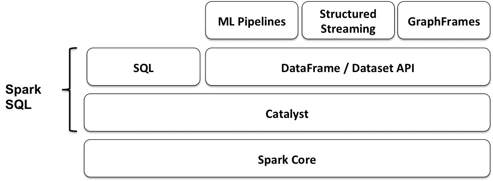
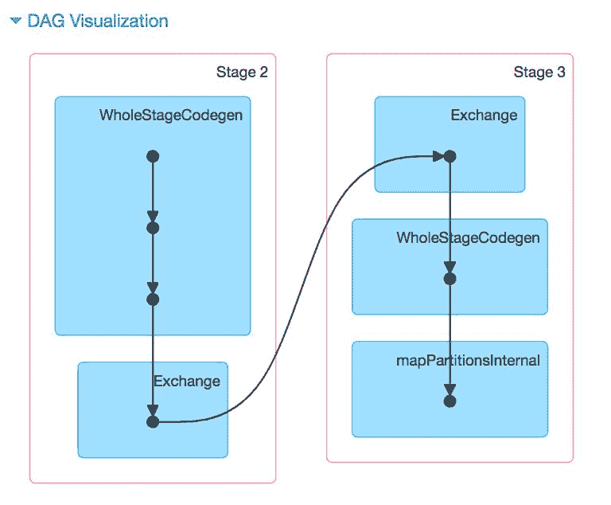
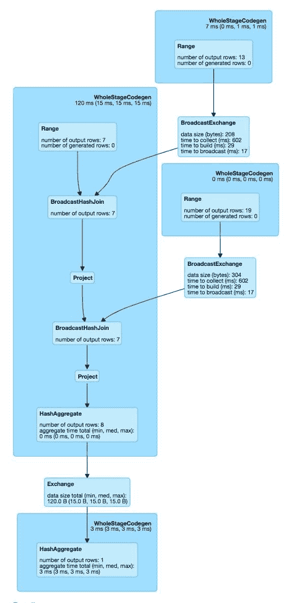
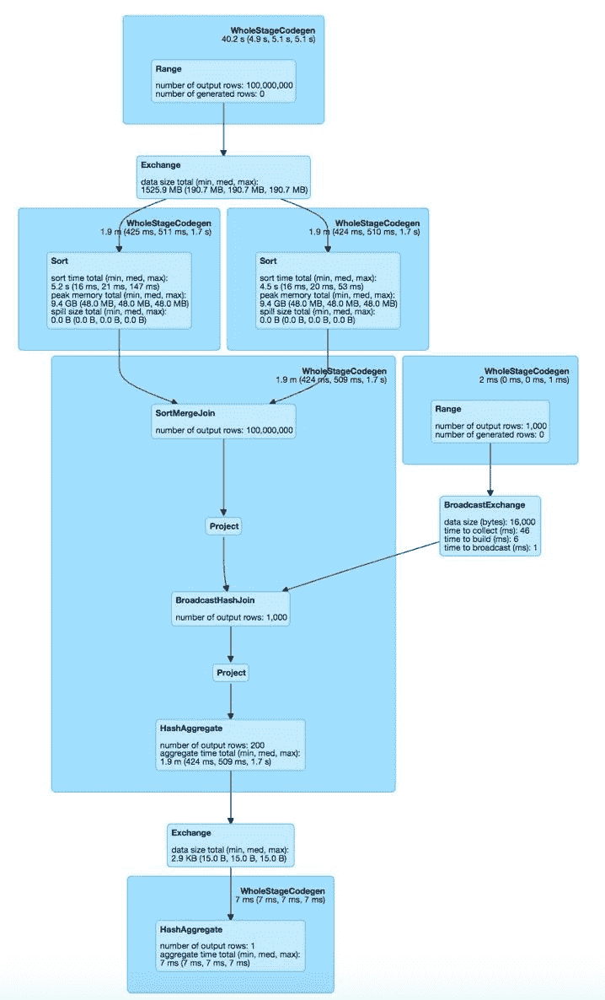
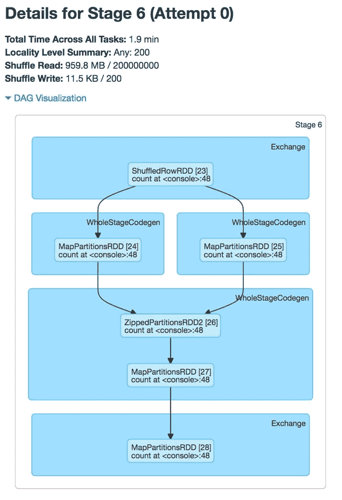
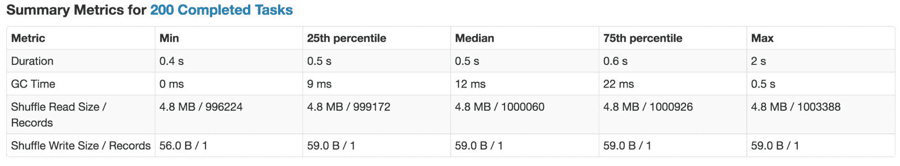
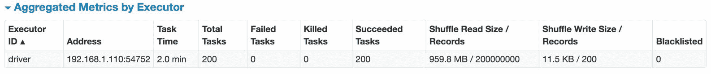
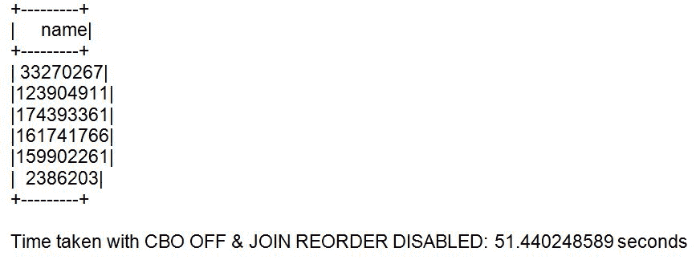
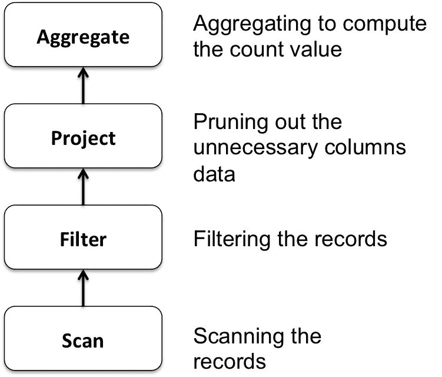

# 十一、针对性能调整Spark SQL 组件

在本章中，我们将重点关注基于 Spark SQL 的组件的性能调优方面。Spark SQL Catalyst 优化器是许多(如果不是全部的话)Spark 应用高效执行的核心，包括基于 **ML 管道**、**结构化流**和 **GraphFrames** 的应用。我们将首先解释与使用编码器的序列化/反序列化相关的关键基础方面，以及与查询执行相关的逻辑和物理计划，然后介绍 Spark 2.2 中发布的**基于成本的优化** ( **CBO** )特性的细节。此外，我们将在本章中介绍一些技巧和诀窍，开发人员可以使用它们来提高应用的性能。

更具体地说，在本章中，您将了解以下内容:

*   理解性能调优的基本概念
*   了解推动性能的Spark内部
*   理解基于成本的优化
*   了解启用全阶段代码生成对性能的影响

# 在Spark SQL 中引入性能调优

Spark 计算通常在内存中进行，可能会受到集群中的资源(CPU、网络带宽或内存)的阻碍。此外，虽然数据适合内存，但网络带宽可能具有挑战性。

Tuning Spark applications is a necessary step to reduce both the number and size of data transfer over the network and/or reduce the overall memory footprint of the computations.

在本章中，我们将重点关注 Spark SQL Catalyst，因为它是从一整套应用组件中获得好处的关键。

Spark SQL 是最近对 Spark 进行的主要增强的核心，包括 **ML 管道**、**结构化流**和 **GraphFrames** 。下图说明了 **Spark SQL** 在 **Spark Core** 和建立在其上的更高级别 API 之间发挥的关键作用:



在接下来的几节中，我们将介绍调优 Spark SQL 应用所需的基本知识。我们将从**数据框架/数据集**应用编程接口开始。

# 了解数据框架/数据集应用编程接口

一个**数据集**是一个特定领域对象的强类型集合，可以使用函数或关系操作并行转换。每个数据集还有一个名为**数据框**的视图，它不是强类型的，本质上是一个行对象的数据集。

Spark SQL 将结构化视图应用于使用不同数据格式存储的来自不同源系统的数据。结构化应用编程接口，如数据框架/数据集应用编程接口，允许开发人员使用高级应用编程接口编写他们的程序。这些 API 允许他们关注所需数据处理的“什么”而不是“如何”。

尽管应用一个结构会限制可以表达的内容，但实际上，结构化 API 可以容纳应用开发中所需的绝大多数计算。同样，正是这些限制(由结构化 API 强加的)带来了几个主要的优化机会。

在下一节中，我们将探讨编码器及其在高效序列化和反序列化中的作用。

# 优化数据序列化

**编码器**是 Spark SQL 2.0 中**序列化**和**反序列化** ( **SerDe** )框架中的基本概念。Spark SQL 使用 SerDe 框架进行输入/输出，从而提高了时间和空间效率。数据集使用专门的编码器来序列化对象，以便通过网络进行处理或传输，而不是使用 Java 序列化或 Kryo。

编码器需要有效地支持领域对象。这些编码器将域对象类型`T`映射到 Spark 的内部类型系统，`Encoder [T]`用于将类型为`T`的对象或原语转换到 Spark SQL 的内部二进制行格式表示(使用 Catalyst 表达式和代码生成)。生成的二进制结构通常具有低得多的内存占用，并且针对数据处理效率进行了优化(例如，以列格式)。

高效的序列化是在分布式应用中获得良好性能的关键。序列化对象速度慢的格式会显著影响性能。通常，这将是您优化 Spark 应用的第一件事。

编码器经过高度优化，使用运行时代码生成来构建自定义字节码，用于序列化和反序列化。此外，它们使用的格式允许 Spark 执行许多操作，如过滤和排序，而不需要反序列化回对象。由于编码器知道记录的模式，它们可以提供更快的序列化和反序列化(与默认的 Java 或 Kryo 序列化器相比)。

除了速度之外，编码器输出的序列化大小也可以显著减小，从而降低网络传输的成本。此外，序列化数据已经是钨二进制格式，这意味着许多操作可以就地执行，而不需要物化对象。Spark 内置了自动为基本类型(如 String 和 Integer)生成编码器的支持，还支持 case 类。

在这里，我们展示了一个为来自[第 1 章](01.html#KVCC0-e9cbc07f866e437b8aa14e841622275c)**的投标记录创建自定义编码器的示例。请注意，大多数常见类型的编码器都是通过导入`spark.implicits._`自动提供的，默认编码器已经导入到 Spark shell 中。**

首先，让我们导入本章代码所需的所有类:

```scala
scala> import org.apache.spark.sql._ 
scala> import org.apache.spark.sql.types._ 
scala> import org.apache.spark.sql.functions._ 
scala> import org.apache.spark.sql.streaming._ 
scala> import spark.implicits._ 
scala> import spark.sessionState.conf 
scala> import org.apache.spark.sql.internal.SQLConf.SHUFFLE_PARTITIONS 
scala> import org.apache.spark.sql.Encoders 
scala> import org.apache.spark.sql.catalyst.encoders.ExpressionEncoder 
```

接下来，我们将为输入数据集中的`Bid`记录定义我们的域对象的`case`类:

```scala
scala> case class Bid(bidid: String, timestamp: String, ipinyouid: String, useragent: String, IP: String, region: Integer, cityID: Integer, adexchange: String, domain: String, turl: String, urlid: String, slotid: String, slotwidth: String, slotheight: String, slotvisibility: String, slotformat: String, slotprice: String, creative: String, bidprice: String) 
```

接下来，我们将使用上一步中的`case`类创建一个`Encoder`对象，如图所示:

```scala
scala> val bidEncoder = Encoders.product[Bid] 
```

可以使用 schema 属性访问该模式，如下所示:

```scala
scala> bidEncoder.schema
```

我们使用`ExpressionEncoder`的实现(Spark SQL 2 中唯一可用的编码器特性的实现)，如图所示:

```scala
scala> val bidExprEncoder = bidEncoder.asInstanceOf[ExpressionEncoder[Bid]] 
```

以下是编码器的串行器和反串行器部分:

```scala
scala> bidExprEncoder.serializer 
scala> bidExprEncoder.namedExpressions 
```

接下来，我们将读入输入数据集，如下所示:

```scala
scala> val bidsDF = spark.read.format("csv").schema(bidEncoder.schema).option("sep", "\t").option("header", false).load("file:///Users/aurobindosarkar/Downloads/make-ipinyou-data-master/original-data/ipinyou.contest.dataset/bidfiles") 
```

然后，我们将显示新创建的数据帧中的`Bid`记录，如下所示:

```scala
scala> bidsDF.take(1).foreach(println) 
[e3d962536ef3ac7096b31fdd1c1c24b0,20130311172101557,37a6259cc0c1dae299a7866489dff0bd,Mozilla/4.0 (compatible; MSIE 8.0; Windows NT 6.1; Trident/4.0; QQDownload 734; SLCC2; .NET CLR 2.0.50727; .NET CLR 3.5.30729; .NET CLR 3.0.30729; eSobiSubscriber 2.0.4.16; MAAR),gzip(gfe),gzip(gfe),219.232.120.*,1,1,2,DF9blS9bQqsIFYB4uA5R,b6c5272dfc63032f659be9b786c5f8da,null,2006366309,728,90,1,0,5,5aca4c5f29e59e425c7ea657fdaac91e,300] 
```

为了方便起见，我们可以使用上一步的记录创建一个新记录，如`Dataset[Bid]`所示:

```scala
scala> val bid = Bid("e3d962536ef3ac7096b31fdd1c1c24b0","20130311172101557","37a6259cc0c1dae299a7866489dff0bd","Mozilla/4.0 (compatible; MSIE 8.0; Windows NT 6.1; Trident/4.0; QQDownload 734; SLCC2; .NET CLR 2.0.50727; .NET CLR 3.5.30729; .NET CLR 3.0.30729; eSobiSubscriber 2.0.4.16; MAAR),gzip(gfe),gzip(gfe)","219.232.120.*",1,1,"2","","DF9blS9bQqsIFYB4uA5R,b6c5272dfc63032f659be9b786c5f8da",null,"2006366309","728","90","1","0","5","5aca4c5f29e59e425c7ea657fdaac91e","300") 
```

然后，我们将记录序列化为内部表示，如图所示:

```scala
scala> val row = bidExprEncoder.toRow(bid)  
```

Spark 在内部使用`InternalRows`进行 I/O。因此，我们将字节反序列化为一个 JVM 对象，即`Scala`对象，如下所示。但是，我们需要导入`Dsl`表达式，并显式指定`DslSymbol`，因为 Spark shell 中有相互竞争的隐式:

```scala
scala> import org.apache.spark.sql.catalyst.dsl.expressions._ 

scala> val attrs = Seq(DslSymbol('bidid).string, DslSymbol('timestamp).string, DslSymbol('ipinyouid).string, DslSymbol('useragent).string, DslSymbol('IP).string, DslSymbol('region).int, DslSymbol('cityID).int, DslSymbol('adexchange).string, DslSymbol('domain).string, DslSymbol('turl).string, DslSymbol('urlid).string, DslSymbol('slotid).string, DslSymbol('slotwidth).string, DslSymbol('slotheight).string, DslSymbol('slotvisibility).string, DslSymbol('slotformat).string, DslSymbol('slotprice).string, DslSymbol('creative).string, DslSymbol('bidprice).string) 
```

在这里，我们检索序列化的`Bid`对象:

```scala
scala> val getBackBid = bidExprEncoder.resolveAndBind(attrs).fromRow(row) 
```

我们可以验证这两个对象是否相同，如图所示:

```scala
scala> bid == getBackBid 
res30: Boolean = true 
```

在下一节中，我们将把重点转移到 Spark SQL 的 Catalyst 优化上。

# 了解催化剂优化

我们在[第 1 章](01.html#KVCC0-e9cbc07f866e437b8aa14e841622275c)**中简要探讨了 Catalyst 优化器，开始使用 Spark SQL** 。基本上，Catalyst 有一个用户程序的内部表示，称为**查询计划**。对初始查询计划执行一组转换，以产生优化的查询计划。最后，通过 Spark SQL 的代码生成机制，优化的查询计划被转换成一个 RDDs 的 DAG，准备执行。Catalyst 优化器的核心是将用户程序的抽象定义为树，以及从一棵树到另一棵树的转换。

为了利用优化机会，我们需要一个优化器，它能自动找到执行数据操作(在用户程序中指定)的最有效计划。在本章的上下文中，Spark SQL 的 Catalyst 优化器充当了用户高级编程结构和低级执行计划之间的接口。

# 理解数据集/数据框架应用编程接口

数据集或数据框通常是在读取数据源或执行查询时创建的。在内部，查询由操作符树表示，例如逻辑树和物理树。在内部，数据集表示描述生成数据所需计算的逻辑计划。当一个动作被调用时，Spark 的查询优化器会优化逻辑计划，并生成一个物理计划，以便以并行和分布式的方式高效执行。

查询计划用于描述聚合、连接或筛选等数据操作，以使用不同类型的输入数据集生成新数据集。

第一种查询计划是逻辑计划，它描述了数据集所需的计算，但没有具体定义执行实际计算的机制。它为我们提供了用户程序的抽象，并允许我们自由地转换查询计划，而不用担心执行细节。

查询计划是 Catalyst 的一部分，它对关系运算符树(即结构化查询)进行建模。查询计划有一个`statePrefix`，在显示计划时使用`!`表示无效计划，`'`表示未解决的计划。如果缺少输入属性并且子节点非空，则查询计划无效，如果列名未得到验证并且列类型未在目录中查找，则查询计划无法解析。

作为优化的一部分，Catalyst 优化器应用各种规则来分阶段操作这些树。我们可以使用解释功能来探索逻辑以及优化的物理计划。

现在，我们将展示三个数据集的简单示例，并使用`explain()`函数显示它们的优化计划:

```scala
scala> val t1 = spark.range(7) 
scala> val t2 = spark.range(13) 
scala> val t3 = spark.range(19) scala> t1.explain() 
== Physical Plan == 
*Range (0, 7, step=1, splits=8) 

scala> t1.explain(extended=true) 
== Parsed Logical Plan == 
Range (0, 7, step=1, splits=Some(8)) 

== Analyzed Logical Plan == 
id: bigint 
Range (0, 7, step=1, splits=Some(8)) 

== Optimized Logical Plan == 
Range (0, 7, step=1, splits=Some(8)) 

== Physical Plan == 
*Range (0, 7, step=1, splits=8) 

scala> t1.filter("id != 0").filter("id != 2").explain(true) 
== Parsed Logical Plan == 
'Filter NOT ('id = 2) 
+- Filter NOT (id#0L = cast(0 as bigint)) 
   +- Range (0, 7, step=1, splits=Some(8)) 

== Analyzed Logical Plan == 
id: bigint 
Filter NOT (id#0L = cast(2 as bigint)) 
+- Filter NOT (id#0L = cast(0 as bigint)) 
   +- Range (0, 7, step=1, splits=Some(8)) 

== Optimized Logical Plan == 
Filter (NOT (id#0L = 0) && NOT (id#0L = 2)) 
+- Range (0, 7, step=1, splits=Some(8)) 

== Physical Plan == 
*Filter (NOT (id#0L = 0) && NOT (id#0L = 2)) 
+- *Range (0, 7, step=1, splits=8) 
```

分析的逻辑计划是将分析器的检查规则应用于初始分析计划的结果。Analyzer 是 Spark SQL 中的逻辑查询计划分析器，它从语义上验证未解析的逻辑计划并将其转换为已分析的逻辑计划(使用逻辑评估规则):

```scala
scala> spark.sessionState.analyzer 
res30: org.apache.spark.sql.catalyst.analysis.Analyzer = org.apache.spark.sql.hive.HiveSessionStateBuilder$$anon$1@21358f6c 
```

为各个特定于会话的记录器启用`TRACE`或`DEBUG`日志记录级别，以查看分析器内部发生的情况。例如，在`conf/log4j`属性中添加以下行:

```scala
log4j.logger.org.apache.spark.sql.hive.HiveSessionStateBuilder$$anon$1=DEBUG scala> val t1 = spark.range(7) 
17/07/13 10:25:38 DEBUG HiveSessionStateBuilder$$anon$1:  
=== Result of Batch Resolution === 
!'DeserializeToObject unresolveddeserializer(staticinvoke(class java.lang.Long, ObjectType(class java.lang.Long), valueOf, upcast(getcolumnbyordinal(0, LongType), LongType, - root class: "java.lang.Long"), true)), obj#2: java.lang.Long   DeserializeToObject staticinvoke(class java.lang.Long, ObjectType(class java.lang.Long), valueOf, cast(id#0L as bigint), true), obj#2: java.lang.Long 
 +- LocalRelation <empty>, [id#0L]                                                                                                                                                                                                            +- LocalRelation <empty>, [id#0L] 

t1: org.apache.spark.sql.Dataset[Long] = [id: bigint] 
```

分析器是一个规则执行器，它定义了逻辑计划评估规则，用于解决和修改这些规则。它使用会话目录解决未解决的关系和函数。此处还定义了不动点的优化规则和批处理中的一次通过规则(一次策略)。

在逻辑计划优化阶段，将执行以下一组操作:

*   规则将逻辑计划转换为语义上等价的计划，以获得更好的性能
*   启发式规则用于下推预测列、移除未引用的列等
*   较早的规则允许应用较晚的规则；例如，合并查询块启用全局连接重新排序

`SparkPlan`是用于构建物理查询计划的物理运算符的 Catalyst 查询计划。在执行时，物理操作符生成行的 rdd。可用的逻辑计划优化可以扩展，附加规则可以注册为实验方法。

```scala
scala> t1.filter("id != 0").filter("id != 2") 
17/07/13 10:43:17 DEBUG HiveSessionStateBuilder$$anon$1:  
=== Result of Batch Resolution === 
!'Filter NOT ('id = 0)                      
Filter NOT (id#0L = cast(0 as bigint)) 
 +- Range (0, 7, step=1, splits=Some(8))    
+- Range (0, 7, step=1, splits=Some(8)) 
... 

17/07/13 10:43:17 DEBUG HiveSessionStateBuilder$$anon$1:  
=== Result of Batch Resolution === 
!'Filter NOT ('id = 2)                         
Filter NOT (id#0L = cast(2 as bigint)) 
 +- Filter NOT (id#0L = cast(0 as bigint))     
   +- Filter NOT (id#0L = cast(0 as bigint)) 
    +- Range (0, 7, step=1, splits=Some(8))       
   +- Range (0, 7, step=1, splits=Some(8)) 
```

# 理解催化剂转化

在本节中，我们将详细探讨 Catalyst 转换。Spark 中的转换是纯函数，也就是说，在转换过程中，树不会发生突变(相反，会产生一个新的树)。在 Catalyst 中，有两种转换:

*   在第一种类型中，转换不会改变树的类型。使用这种转换，我们可以将一个表达式转换为另一个表达式，将一个逻辑计划转换为另一个逻辑计划，或者将一个物理计划转换为另一个物理计划。
*   第二种类型的转换将一棵树从一种树转换成另一种树。例如，这种类型的转换用于将逻辑计划更改为物理计划。

一个函数(与给定的树相关联)用于实现一个规则。例如，在表达式中，这可以用于常数折叠优化。变换被定义为部分函数。(回想一下，部分函数是为其可能参数的子集定义的函数。)通常情况下，case 语句会判断规则是否被触发；例如，谓词过滤器被推到`JOIN`节点之下，因为它减少了`JOIN`的输入大小；这被称为**谓词下推**。同样，只对查询中使用的必需列执行投影。这样，我们可以避免读取不必要的数据。

通常，我们需要组合不同类型的转换规则。规则执行器用于组合多个规则。它通过应用许多规则(成批定义)将一棵树转换为另一棵相同类型的树。

应用规则有两种方法:

*   在第一种方法中，我们重复应用规则，直到树不再变化(称为固定点)
*   在第二种类型中，我们批量应用所有规则，只应用一次(一次策略)

接下来，我们看第二种类型的转换，其中我们从一种树转换到另一种树:更具体地说，Spark 如何将逻辑计划转换为物理计划。通过应用一组策略，逻辑计划转化为物理计划。首先，这些转换采用模式匹配方法。例如，策略将逻辑项目节点转换为物理项目节点，将逻辑筛选器节点转换为物理筛选器节点，等等。一个策略可能无法转换所有内容，因此内置了在代码的特定点触发其他策略的机制(例如`planLater`方法)。

优化过程包括三个步骤:

1.  分析(规则执行器):这将未解析的逻辑计划转换为已解析的逻辑计划。未解析到已解析状态使用目录来查找数据集和列的来源以及列的类型。
2.  逻辑优化(规则执行器):这将解析的逻辑计划转换为优化的逻辑计划。

3.  物理规划(策略+规则执行者):这包括两个阶段:
    *   将优化的逻辑计划转换为物理计划。
    *   规则执行器用于调整物理计划，使其为执行做好准备。这包括我们如何洗牌和如何分割数据。

如下例所示，一个表达式代表一个新值，它是基于其输入值计算的，例如，给一列中的每个元素添加一个常数，如`1 + t1.normal`。类似地，属性是数据集中的一列(例如，`t1.id`)或由特定数据操作生成的列，例如，v。

输出中有这个逻辑计划生成的属性列表，例如 id 和 v，逻辑计划中也有一组关于这个计划生成的行的不变量，例如`t2.id > 5000000`。最后，我们有统计数据，以行/字节为单位的计划大小，每列统计数据，例如，最小值、最大值和不同值的数量，以及空值的数量。

第二种查询计划是物理计划，它描述了数据集上所需的计算，并具体定义了如何进行计算。物理计划实际上是可执行的:

```scala
scala> val t0 = spark.range(0, 10000000) 
scala> val df1 = t0.withColumn("uniform", rand(seed=10)) 
scala> val df2 = t0.withColumn("normal", randn(seed=27)) 
scala> df1.createOrReplaceTempView("t1") 
scala> df2.createOrReplaceTempView("t2") 

scala> spark.sql("SELECT sum(v) FROM (SELECT t1.id, 1 + t1.normal AS v FROM t1 JOIN t2 WHERE t1.id = t2.id AND t2.id > 5000000) tmp").explain(true) 
```

前面查询的所有计划都显示在下面的代码块中。请注意我们在解析的逻辑计划中的注释，反映了原始 SQL 查询的部分内容:

```scala
== Parsed Logical Plan == 
'Project [unresolvedalias('sum('v), None)] ------------------> SELECT sum(v) 
+- 'SubqueryAlias tmp 
   +- 'Project ['t1.id, (1 + 't1.normal) AS v#79] ----------->       SELECT t1.id,  
                                                               1 + t1.normal as v 
      +- 'Filter (('t1.id = 't2.id) && ('t2.id > 5000000))---> WHERE t1.id = t2.id,  
                                                                    t2.id > 5000000 
         +- 'Join Inner -------------------------------------> t1 JOIN t2 
            :- 'UnresolvedRelation `t1` 
            +- 'UnresolvedRelation `t2` 

== Analyzed Logical Plan == 
sum(v): double 
Aggregate [sum(v#79) AS sum(v)#86] 
+- SubqueryAlias tmp 
   +- Project [id#10L, (cast(1 as double) + normal#13) AS v#79] 
      +- Filter ((id#10L = id#51L) && (id#51L > cast(5000000 as bigint))) 
         +- Join Inner 
            :- SubqueryAlias t1 
            :  +- Project [id#10L, randn(27) AS normal#13] 
            :     +- Range (0, 10000000, step=1, splits=Some(8)) 
            +- SubqueryAlias t2 
               +- Project [id#51L, rand(10) AS uniform#54] 
                  +- Range (0, 10000000, step=1, splits=Some(8)) 

== Optimized Logical Plan == 
Aggregate [sum(v#79) AS sum(v)#86] 
+- Project [(1.0 + normal#13) AS v#79] 
   +- Join Inner, (id#10L = id#51L) 
      :- Filter (id#10L > 5000000) 
      :  +- Project [id#10L, randn(27) AS normal#13] 
      :     +- Range (0, 10000000, step=1, splits=Some(8)) 
      +- Filter (id#51L > 5000000) 
         +- Range (0, 10000000, step=1, splits=Some(8)) 

== Physical Plan == 
*HashAggregate(keys=[], functions=[sum(v#79)], output=[sum(v)#86]) 
+- Exchange SinglePartition 
   +- *HashAggregate(keys=[], functions=[partial_sum(v#79)], output=[sum#88]) 
      +- *Project [(1.0 + normal#13) AS v#79] 
         +- *SortMergeJoin [id#10L], [id#51L], Inner 
            :- *Sort [id#10L ASC NULLS FIRST], false, 0 
            :  +- Exchange hashpartitioning(id#10L, 200) 
            :     +- *Filter (id#10L > 5000000) 
            :        +- *Project [id#10L, randn(27) AS normal#13] 
            :           +- *Range (0, 10000000, step=1, splits=8) 
            +- *Sort [id#51L ASC NULLS FIRST], false, 0 
               +- Exchange hashpartitioning(id#51L, 200) 
                  +- *Filter (id#51L > 5000000) 
                     +- *Range (0, 10000000, step=1, splits=8) 
```

您可以使用 Catalyst 的应用编程接口定制 Spark 来推出您自己的计划器规则。

For more details on the Spark SQL Catalyst optimizer, refer to [https://spark-summit.org/2017/events/a-deep-dive-into-spark-sqls-catalyst-optimizer/](https://spark-summit.org/2017/events/a-deep-dive-into-spark-sqls-catalyst-optimizer/).

# 可视化 Spark 应用执行

在本节中，我们将介绍 SparkUI 界面的关键细节，这对于调优任务来说是必不可少的。有几种方法可以监控 Spark 应用，例如，使用网络用户界面、度量和外部工具。显示的信息包括调度器阶段和任务的列表、RDD 大小和内存使用的摘要、环境信息以及关于正在运行的执行器的信息。

只需在网页浏览器中打开`http://<driver-node>:4040` ( `http://localhost:4040`)即可进入该界面。在同一台主机上运行的附加`SparkContexts`绑定到连续的端口:4041、4042，以此类推。

For a more detailed coverage of monitoring and instrumentation in Spark, refer to [https://spark.apache.org/docs/latest/monitoring.html](https://spark.apache.org/docs/latest/monitoring.html).

我们将使用两个例子直观地探索 Spark SQL 执行。首先，我们创建两组数据集。`Dataset[Long]`第一套(`t1`、`t2`、`t3`)和第二套(`t4`、`t5`、`t6`)的区别在于大小:

```scala
scala> val t1 = spark.range(7) 
scala> val t2 = spark.range(13) 
scala> val t3 = spark.range(19) 
scala> val t4 = spark.range(1e8.toLong) 
scala> val t5 = spark.range(1e8.toLong) 
scala> val t6 = spark.range(1e3.toLong)  
```

我们将对两组数据集执行以下`JOIN`查询，以可视化 SparkUI 仪表板中的 Spark 作业信息:

```scala
scala> val query = t1.join(t2).where(t1("id") === t2("id")).join(t3).where(t3("id") === t1("id")).explain() 
== Physical Plan == 
*BroadcastHashJoin [id#6L], [id#12L], Inner, BuildRight 
:- *BroadcastHashJoin [id#6L], [id#9L], Inner, BuildRight 
:  :- *Range (0, 7, step=1, splits=8) 
:  +- BroadcastExchange HashedRelationBroadcastMode(List(input[0, bigint, false])) 
:     +- *Range (0, 13, step=1, splits=8) 
+- BroadcastExchange HashedRelationBroadcastMode(List(input[0, bigint, false])) 
   +- *Range (0, 19, step=1, splits=8) 
query: Unit = () 

scala> val query = t1.join(t2).where(t1("id") === t2("id")).join(t3).where(t3("id") === t1("id")).count() 
query: Long = 7 
```

以下屏幕截图显示了事件时间线:


接下来显示生成的带有阶段和洗牌(**交换**)的 **DAG 可视化**:



此处显示作业的摘要，包括执行持续时间、成功的任务和任务总数等:


单击 SQL 选项卡查看详细的执行流程，如下所示:



接下来，我们将对一组较大的数据集运行相同的查询。请注意，由于输入数据集的大小增加，第一个示例中的`BroadcastHashJoin`现在更改为`SortMergeJoin`:

```scala
scala> val query = t4.join(t5).where(t4("id") === t5("id")).join(t6).where(t4("id") === t6("id")).explain() 
== Physical Plan == 
*BroadcastHashJoin [id#72L], [id#78L], Inner, BuildRight 
:- *SortMergeJoin [id#72L], [id#75L], Inner 
:  :- *Sort [id#72L ASC NULLS FIRST], false, 0 
:  :  +- Exchange hashpartitioning(id#72L, 200) 
:  :     +- *Range (0, 100000000, step=1, splits=8) 
:  +- *Sort [id#75L ASC NULLS FIRST], false, 0 
:     +- ReusedExchange [id#75L], Exchange hashpartitioning(id#72L, 200) 
+- BroadcastExchange HashedRelationBroadcastMode(List(input[0, bigint, false])) 
   +- *Range (0, 1000, step=1, splits=8) 
query: Unit = () 
```

执行 DAG 如下图所示:


作业执行摘要如下所示:


下图显示了 SQL 执行的详细信息:



除了在用户界面中显示之外，度量还可以作为 JSON 数据。这给开发人员提供了一个为 Spark 创建新的可视化和监控工具的好方法。REST 端点安装在`/api/v1`；例如，它们通常可以在`http://localhost:4040/api/v1`访问。这些端点已经过严格的版本控制，以便于使用它们开发应用。

# 探索 Spark 应用执行指标

Spark 有一个基于`Dropwizard Metrics`库的可配置度量系统。这允许用户向各种接收器报告 Spark 指标，包括`HTTP`、`JMX`和`CSV`文件。Spark 对应于 Spark 组件的指标包括 Spark 独立主进程、主进程中报告各种应用的应用、Spark 独立工作进程、Spark 执行器、Spark 驱动程序进程和 Spark 洗牌服务。

接下来的一系列截图包含详细信息，包括概要指标和执行者针对较大数据集的 JOIN 查询的一个阶段的聚合指标:



已完成任务的汇总指标如下所示:



执行者汇总的指标如下所示:



# 使用外部工具进行性能调整

外部监控工具通常用于分析大型`Spark clusters`中 Spark 作业的性能。例如，Ganglia 可以提供对整体集群利用率和资源瓶颈的洞察。此外，`OS profiling`工具和`JVM`实用程序可以分别为单个节点和`JVM`内部提供细粒度的分析。

For more details on visualizing Spark application execution, refer to [https://databricks.com/blog/2015/06/22/understanding-your-spark-application-through-visualization.html](https://databricks.com/blog/2015/06/22/understanding-your-spark-application-through-visualization.html).

在下一节中，我们将把重点转移到 Spark 2.2 中发布的新的基于成本的优化器上。

# Apache Spark 2.2 中基于成本的优化器

在 Spark 中，优化器的目标是最小化端到端查询响应时间。它基于两个关键理念:

尽早修剪不必要的数据，例如，过滤器下推和列修剪。

最小化每个运营商的成本，例如，广播对洗牌和最佳加入顺序。

在 Spark 2.1 之前，Catalyst 本质上是一个基于规则的优化器。大多数 Spark SQL 优化器规则都是启发式规则:`PushDownPredicate`、`ColumnPruning`、`ConstantFolding`等等。在估计`JOIN`关系大小时，他们没有考虑每个操作员的成本或选择性。因此，`JOIN`顺序主要由其在`SQL queries`中的位置决定，物理连接实现是基于启发式规则决定的。这可能导致产生次优计划。然而，如果基数是预先知道的，可以获得更有效的查询。CBO 优化器的目标就是自动做到这一点。

华为最初在 Spark SQL 中实现了 CBO；在他们开源他们的工作后，包括 Databricks 在内的许多其他贡献者努力完成了它的第一个版本。Spark SQL 的 CBO 相关变更，特别是 Spark SQL 数据结构和工作流的主要入口点，已经以非侵入性的方式进行了设计和实施。

配置参数`spark.sql.cbo`可用于启用/禁用该功能。目前(在 Spark 2.2 中)，默认值为 false。

For more details, refer to Huawei's design document available at [https://issues.apache.org/jira/browse/SPARK-16026](https://issues.apache.org/jira/browse/SPARK-16026).

Spark SQL 的 Catalyst 优化器实现了许多基于规则的优化技术，例如，谓词下推可以在执行连接操作之前减少合格记录的数量，项目修剪可以在进一步处理之前减少参与列的数量。但是，如果没有关于数据分布的详细列统计信息，就很难准确估计过滤因子和基数，从而估计数据库操作符的输出大小。由于不准确和/或误导性的统计数据，优化器最终可能会选择次优的查询执行计划。

为了提高查询执行计划的质量，Spark SQL 优化器已经用详细的统计信息进行了增强。更好地估计输出记录的数量和输出大小(对于每个数据库操作符)有助于优化器选择更好的查询计划。CBO 实现收集、推断和传播`source / intermediate`数据的`table / column`统计数据。查询树用这些统计信息进行注释。此外，它还根据输出行数、输出大小等计算每个运算符的成本。基于这些成本计算，它选择最佳的查询执行计划。

# 了解 CBO 统计数据收集

`Statistics`类是保存统计信息的关键数据结构。当我们执行统计信息收集 SQL 语句将信息保存到系统目录中时，会引用该数据结构。当我们从系统目录中获取统计信息以优化查询计划时，也会引用该数据结构。

CBO 依靠详细的统计数据来优化查询执行计划。以下 SQL 语句可用于收集`table-level`统计数据，如行数、文件数(或 HDFS 数据块)和表大小(以字节为单位)。它收集`table-level`统计数据并保存在`meta-store`中。在 2.2 之前，我们只有表的大小，没有行数:

```scala
ANALYZE TABLE table_name COMPUTE STATISTICS 
```

同样，以下 SQL 语句可用于收集指定列的列级统计信息。收集的信息包括最大列值、最小列值、不同值的数量、空值的数量等。它收集列级统计数据并保存在`meta-store`中。通常，它只对`WHERE`和`GROUP BY`条款中的列执行:

```scala
ANALYZE TABLE table_name COMPUTE STATISTICS FOR COLUMNS column-name1, column-name2, .... 
```

给定的 SQL 语句以扩展格式显示元数据，包括表的表级统计信息:

```scala
DESCRIBE EXTENDED table_name 
```

`customers`表将在本章后面的章节中创建:

```scala
scala> sql("DESCRIBE EXTENDED customers").collect.foreach(println) [# col_name,data_type,comment] 
[id,bigint,null] 
[name,string,null] 
[,,] 
[# Detailed Table Information,,] 
[Database,default,] 
[Table,customers,] 
[Owner,aurobindosarkar,] 
[Created,Sun Jul 09 23:16:38 IST 2017,] 
[Last Access,Thu Jan 01 05:30:00 IST 1970,] 
[Type,MANAGED,] 
[Provider,parquet,] 
[Properties,[serialization.format=1],] 
[Statistics,1728063103 bytes, 200000000 rows,] 
[Location,file:/Users/aurobindosarkar/Downloads/spark-2.2.0-bin-hadoop2.7/spark-warehouse/customers,] 
[Serde Library,org.apache.hadoop.hive.ql.io.parquet.serde.ParquetHiveSerDe,] 
[InputFormat,org.apache.hadoop.hive.ql.io.parquet.MapredParquetInputFormat,] 
[OutputFormat,org.apache.hadoop.hive.ql.io.parquet.MapredParquetOutputFormat,] 
```

以下 SQL 语句可用于显示优化逻辑计划中的统计信息:

```scala
EXPLAIN COST SELECT * FROM table_name WHERE condition 
```

# 统计数据收集功能

统计数据是使用一组函数收集的，例如，行数实际上是通过运行一条 SQL 语句获得的，如`select count(1) from table_name`。使用 SQL 语句来获得行计数是很快的，因为我们正在利用 Spark SQL 的执行并行性。类似地，`analyzeColumns`函数获取给定列的基本统计信息。基本统计，如`max`、`min`、`number-of-distinct-values`也是通过运行 SQL 语句得到的。

# 过滤运算符

过滤条件是在 SQL select 语句的`WHERE`子句中指定的谓词表达式。当我们评估整体过滤因子时，谓词表达式可能相当复杂。

执行过滤器基数估计的操作符有几个，例如在`AND`、`OR`和`NOT`逻辑表达式之间，以及逻辑表达式如`=`、`<`、`<=`、`>`、`>=`和`in`之间。

对于过滤器操作符，我们的目标是计算过滤器，找出应用过滤器条件后前一个(或子)操作符输出的部分。过滤因子是介于`0.0`和`1.0`之间的双数。过滤器操作符的输出行数基本上是其`child node's`输出的数量乘以过滤器系数。其输出大小是其`child node's`输出大小乘以滤波因子。

# 连接运算符

在我们计算双表连接输出的基数之前，我们应该已经有了它两边的`child nodes`的输出基数。每个连接端的基数不再是原始连接表中的记录数。相反，它是在此联接运算符之前应用所有执行运算符后的合格记录数。

如果用户收集了`join column`的统计数据，那么我们就知道每个`join column`的不同值的数量。因为我们也知道连接关系上的记录数量，所以我们可以知道`join column`是否是唯一的键。我们可以计算`join column`上不同值的数量与连接关系中记录数量的比率。如果比值接近`1.0`(说大于`0.95`，那么我们可以假设`join column`是唯一的。因此，如果`join column`是唯一的，我们可以精确地确定每个不同值的记录数。

# 构建侧面选择

CBO 可以为执行操作者选择一个好的物理策略。例如，CBO 可以选择`hash join`操作的`build side`选项。对于双向散列连接，我们需要选择一个操作数作为`build side`，另一个操作数作为`probe side`。该方法选择低成本儿童作为`hash join`的`build side`。

在 Spark 2.2 之前，构建端是基于原始表大小选择的。对于下面的连接查询示例，早期的方法会选择`BuildRight`。然而，在 CBO，选择`build side`是基于加入前各运营商的估计成本。这里，`BuildLeft`早就被选中了。它还可以决定是否应该执行广播加入。此外，可以重新安排给定查询的数据库操作符的执行顺序。`cbo`可以在给定查询的多个候选计划中选择最佳计划。目标是选择成本最低的候选计划:

```scala
scala> spark.sql("DROP TABLE IF EXISTS t1") 
scala> spark.sql("DROP TABLE IF EXISTS t2") 
scala> spark.sql("CREATE TABLE IF NOT EXISTS t1(id long, value long) USING parquet") 
scala> spark.sql("CREATE TABLE IF NOT EXISTS t2(id long, value string) USING parquet") 

scala> spark.range(5E8.toLong).select('id, (rand(17) * 1E6) cast "long").write.mode("overwrite").insertInto("t1") 
scala> spark.range(1E8.toLong).select('id, 'id cast "string").write.mode("overwrite").insertInto("t2") 

scala> sql("SELECT t1.id FROM t1, t2 WHERE t1.id = t2.id AND t1.value = 100").explain() == Physical Plan == 
*Project [id#79L] 
+- *SortMergeJoin [id#79L], [id#81L], Inner 
   :- *Sort [id#79L ASC NULLS FIRST], false, 0 
   :  +- Exchange hashpartitioning(id#79L, 200) 
   :     +- *Project [id#79L] 
   :        +- *Filter ((isnotnull(value#80L) && (value#80L = 100)) && isnotnull(id#79L)) 
   :           +- *FileScan parquet default.t1[id#79L,value#80L] Batched: true, Format: Parquet, Location: InMemoryFileIndex[file:/Users/aurobindosarkar/Downloads/spark-2.2.0-bin-hadoop2.7/spark-warehouse..., PartitionFilters: [], PushedFilters: [IsNotNull(value), EqualTo(value,100), IsNotNull(id)], ReadSchema: struct<id:bigint,value:bigint> 
   +- *Sort [id#81L ASC NULLS FIRST], false, 0 
      +- Exchange hashpartitioning(id#81L, 200) 
         +- *Project [id#81L] 
            +- *Filter isnotnull(id#81L) 
               +- *FileScan parquet default.t2[id#81L] Batched: true, Format: Parquet, Location: InMemoryFileIndex[file:/Users/aurobindosarkar/Downloads/spark-2.2.0-bin-hadoop2.7/spark-warehouse..., PartitionFilters: [], PushedFilters: [IsNotNull(id)], ReadSchema: struct<id:bigint> 
```

在下一节中，我们将探讨多路连接中的 CBO 优化。

# 理解多路 JOIN 排序优化

Spark SQL 优化器的启发式规则可以将`SELECT`语句转换为具有以下特征的查询计划:

*   筛选运算符和项目运算符被下推到联接运算符的下方，也就是说，筛选运算符和项目运算符都在联接运算符之前执行
*   如果没有子查询块，连接运算符将被下推到 select 语句的聚合运算符下方，也就是说，连接运算符通常在聚合运算符之前执行

有了这个观察，我们可以从 CBO 获得的最大好处是多向连接排序优化。使用动态编程技术，我们试图为多路连接查询获得全局最优连接顺序。

For more details on multi-way join reordering in Spark 2.2, refer to [https://spark-summit.org/2017/events/cost-based-optimizer-in-apache-spark-22/](https://spark-summit.org/2017/events/cost-based-optimizer-in-apache-spark-22/).

显然，连接成本是选择最佳连接顺序的主要因素。成本公式取决于 Spark SQL 执行引擎的实现。

Spark 中的连接成本公式如下:

*权重*基数+大小* (1 -权重)*

公式中的权重是通过`spark.sql.cbo.joinReorder.card.weight`参数配置的调谐参数(默认值为`0.7`)。计划的成本是所有中间表成本的总和。请注意，当前的成本公式非常粗糙，后续版本的 Spark 预计会有更细粒度的公式。

For more details on reordering the joins using a dynamic programming algorithm, refer to the paper by Selinger et al, at [http://citeseerx.ist.psu.edu/viewdoc/download?doi=10.1.1.129.5879&rep=rep1&type=pdf](http://citeseerx.ist.psu.edu/viewdoc/download?doi=10.1.1.129.5879&rep=rep1&type=pdf).

首先，我们将所有项目(基本连接节点)放入第 1 层，然后我们从第 1 层的计划(单个项目)构建第 2 层的所有双向连接，然后从前一层的计划(双向连接和单个项目)构建所有三向连接，然后是四向连接，以此类推，直到我们构建完所有 n 向连接，并在每个阶段在它们之间选择最佳计划。

当构建 m-way 连接时，我们只保留同一组 m 个项目的最佳计划(成本最低)。例如，对于三方连接，我们只保留计划`(A J B) J C`、`(A J C) J B`和`(B J C) J A`中项目`{A, B, C}`的最佳计划。

这种算法的一个缺点是假设最低成本计划只能从以前的最低成本计划中生成。此外，因为选择保留输入顺序的排序合并连接的决定是在查询计划器阶段做出的，所以我们没有这些信息在优化器中做出好的决定。

接下来，我们展示了一个多路连接的扩展示例，其中`cbo`和`joinReorder`参数被关闭和打开，以演示速度的提高:

```scala
scala> sql("CREATE TABLE IF NOT EXISTS customers(id long, name string) USING parquet") 
scala> sql("CREATE TABLE IF NOT EXISTS goods(id long, price long) USING parquet") 
scala> sql("CREATE TABLE IF NOT EXISTS orders(customer_id long, good_id long) USING parquet") 

scala> import org.apache.spark.sql.functions.rand 

scala> spark.sql("CREATE TABLE IF NOT EXISTS customers(id long, name string) USING parquet") 
scala> spark.sql("CREATE TABLE IF NOT EXISTS goods(id long, price long) USING parquet") 
scala> spark.sql("CREATE TABLE IF NOT EXISTS orders(customer_id long, good_id long) USING parquet") 

scala> spark.range(2E8.toLong).select('id, 'id cast "string").write.mode("overwrite").insertInto("customers") 

scala> spark.range(1E8.toLong).select('id, (rand(17) * 1E6 + 2) cast "long").write.mode("overwrite").insertInto("goods") 
spark.range(1E7.toLong).select(rand(3) * 2E8 cast "long", (rand(5) * 1E8) cast "long").write.mode("overwrite").insertInto("orders") 
```

我们定义了一个函数基准来度量查询的执行时间:

```scala
scala> def benchmark(name: String)(f: => Unit) { 
     |      val startTime = System.nanoTime 
     |      f 
     |      val endTime = System.nanoTime 
     |      println(s"Time taken with $name: " + (endTime - startTime).toDouble / 1000000000 + " seconds") 
     | } 

```

在第一个例子中，如图所示，我们关闭`cbo`和`joinReorder`参数:

```scala

scala> val conf = spark.sessionState.conf 

scala> spark.conf.set("spark.sql.cbo.enabled", false) 

scala> conf.cboEnabled 
res1: Boolean = false 

scala> conf.joinReorderEnabled 
res2: Boolean = false 

scala> benchmark("CBO OFF & JOIN REORDER DISABLED"){ sql("SELECT name FROM customers, orders, goods WHERE customers.id = orders.customer_id AND orders.good_id = goods.id AND goods.price > 1000000").show() } 
```

以下是命令行上的输出:



在下一个例子中，我们打开`cbo`但保持`joinReorder`参数禁用:

```scala
scala> spark.conf.set("spark.sql.cbo.enabled", true) 
scala> conf.cboEnabled 
res11: Boolean = true 
scala> conf.joinReorderEnabled 
res12: Boolean = false 

scala> benchmark("CBO ON & JOIN REORDER DIABLED"){ sql("SELECT name FROM customers, orders, goods WHERE customers.id = orders.customer_id AND orders.good_id = goods.id AND goods.price > 1000000").show()} 
```

以下是命令行上的输出:


请注意，启用`cbo`参数后，查询的执行时间略有改善。

在最后一个例子中，我们打开`cbo`和`joinReorder`参数:

```scala
scala> spark.conf.set("spark.sql.cbo.enabled", true) 
scala> spark.conf.set("spark.sql.cbo.joinReorder.enabled", true) 
scala> conf.cboEnabled 
res2: Boolean = true 
scala> conf.joinReorderEnabled 
res3: Boolean = true 

scala> benchmark("CBO ON & JOIN REORDER ENABLED"){ sql("SELECT name FROM customers, orders, goods WHERE customers.id = orders.customer_id AND orders.good_id = goods.id AND goods.price > 1000000").show()} 
```

以下是命令行上的输出:


请注意，在启用这两个参数的情况下，查询的执行时间有了很大的改善。

在下一节中，我们将研究使用全阶段代码生成实现的各种`JOINs`的性能改进。

# 使用全阶段代码生成了解性能改进

在本节中，我们首先简要介绍了 Spark SQL 中的全阶段代码生成，然后通过一组示例展示了使用 Catalyst 的代码生成功能在各种`JOINs`中的改进。

在我们有了一个优化的查询计划之后，它需要被转换成一个 rdd 的 DAG，以便在集群上执行。我们用这个例子来解释 Spark SQL 全阶段代码生成的基本概念:

```scala
scala> sql("select count(*) from orders where customer_id = 26333955").explain() 

== Optimized Logical Plan == 
Aggregate [count(1) AS count(1)#45L] 
+- Project 
   +- Filter (isnotnull(customer_id#42L) && (customer_id#42L = 26333955)) 
      +- Relation[customer_id#42L,good_id#43L] parquet 
```

前面优化的逻辑方案可以看作是**扫描**、**过滤**、**项目**、**聚合**操作的顺序，如下图所示:



传统的数据库通常会基于火山迭代器模型执行前面的查询，其中每个操作符实现一个迭代器接口，并从其输入操作符中消费记录，并将记录输出给其后排序的操作符。该模型使得添加新的操作符变得容易，而与它们与其他操作符的交互无关。它还促进了运营商的可组合性。然而，火山模型是低效的，因为它涉及许多虚拟函数调用的执行，例如，对`Aggregate`函数中的每个记录执行三次调用。此外，它需要大量的内存访问(由于根据迭代器接口在每个操作符中进行读/写)。在火山模型上利用现代中央处理器功能也是一项挑战，例如流水线、预取和分支预测。

Spark SQL 没有为每个运算符生成迭代器代码，而是尝试为 SQL 语句中的一组运算符生成一个函数。例如，前面查询的伪代码可能如下所示。这里，`for`循环读取所有行(扫描操作)，if 条件大致对应于 Filter 条件，合计本质上是计数:

```scala
long count = 0; 
for (customer_id in orders) {  
   if (customer_id == 26333955) { 
         count += 1; 
   } 
} 
```

请注意，上面提到的简单代码没有虚函数调用，递增的计数变量在中央处理器寄存器中可用。编译器很容易理解这段代码，因此可以利用现代硬件来加速类似这样的查询。

整个阶段代码生成的关键思想包括将操作符融合在一起，识别操作符链(阶段)，以及将每个阶段编译成单个函数。这导致代码生成模拟了用于执行查询的手写优化代码。

For more details on compiling query plans on modern hardware, refer to [http://www.vldb.org/pvldb/vol4/p539-neumann.pdf](http://www.vldb.org/pvldb/vol4/p539-neumann.pdf).

我们可以使用`EXPLAIN CODEGEN`来浏览为查询生成的代码，如图所示:

```scala
scala> sql("EXPLAIN CODEGEN SELECT name FROM customers, orders, goods WHERE customers.id = orders.customer_id AND orders.good_id = goods.id AND goods.price > 1000000").take(1).foreach(println) [Found 6 WholeStageCodegen subtrees.                                             
== Subtree 1 / 6 == 
*Project [id#11738L] 
+- *Filter ((isnotnull(price#11739L) && (price#11739L > 1000000)) && isnotnull(id#11738L)) 
   +- *FileScan parquet default.goods[id#11738L,price#11739L] Batched: true, Format: Parquet, Location: InMemoryFileIndex[file:/Users/aurobindosarkar/Downloads/spark-2.2.0-bin-hadoop2.7/spark-warehouse..., PartitionFilters: [], PushedFilters: [IsNotNull(price), GreaterThan(price,1000000), IsNotNull(id)], ReadSchema: struct<id:bigint,price:bigint> 

Generated code: 
/* 001 */ public Object generate(Object[] references) { 
/* 002 */   return new GeneratedIterator(references); 
/* 003 */ } 
... 
== Subtree 6 / 6 == 
*Sort [id#11734L ASC NULLS FIRST], false, 0 
+- Exchange hashpartitioning(id#11734L, 200) 
   +- *Project [id#11734L, name#11735] 
      +- *Filter isnotnull(id#11734L) 
         +- *FileScan parquet default.customers[id#11734L,name#11735] Batched: true, Format: Parquet, Location: InMemoryFileIndex[file:/Users/aurobindosarkar/Downloads/spark-2.2.0-bin-hadoop2.7/spark-warehouse..., PartitionFilters: [], PushedFilters: [IsNotNull(id)], ReadSchema: struct<id:bigint,name:string> 

Generated code: 
/* 001 */ public Object generate(Object[] references) { 
/* 002 */   return new GeneratedIterator(references); 
/* 003 */ } 
... 
] 
```

在这里，我们给出了一系列`JOIN`示例，其中整个阶段代码生成被关闭，随后被打开，以查看对执行性能的显著影响。

The examples in this section have been taken from the `JoinBenchmark.scala` class available at [https://github.com/apache/spark/blob/master/sql/core/src/test/scala/org/apache/spark/sql/execution/benchmark/JoinBenchmark.scala](https://github.com/apache/spark/blob/master/sql/core/src/test/scala/org/apache/spark/sql/execution/benchmark/JoinBenchmark.scala).

在下面的示例中，我们展示了获取具有长值的 JOIN 操作的执行时间的细节:

```scala
scala> spark.conf.set("spark.sql.codegen.wholeStage", false) 

scala> conf.wholeStageEnabled 
res77: Boolean = false 

scala> val N = 20 << 20 
N: Int = 20971520 

scala> val M = 1 << 16 
M: Int = 65536 

scala> val dim = broadcast(spark.range(M).selectExpr("id as k", "cast(id as string) as v")) 

scala> benchmark("Join w long") { 
     |   spark.range(N).join(dim, (col("id") % M) === col("k")).count() 
     | } 
Time taken in Join w long: 2.612163207 seconds                                   

scala> spark.conf.set("spark.sql.codegen.wholeStage", true) 

scala> conf.wholeStageEnabled 
res80: Boolean = true 

scala> val dim = broadcast(spark.range(M).selectExpr("id as k", "cast(id as string) as v")) 

scala> benchmark("Join w long") { 
     |   spark.range(N).join(dim, (col("id") % M) === col("k")).count() 
     | } 
Time taken in Join w long: 0.777796256 seconds 
```

对于下面的示例集，我们只给出了在有和没有全阶段代码生成的情况下获取它们的执行时间的要点。参考前面的示例，按照相同的步骤顺序复制以下示例:

```scala
scala> val dim = broadcast(spark.range(M).selectExpr("id as k", "cast(id as string) as v")) 
scala> benchmark("Join w long duplicated") { 
     |     val dim = broadcast(spark.range(M).selectExpr("cast(id/10 as long) as k")) 
     |     spark.range(N).join(dim, (col("id") % M) === col("k")).count() 
     | } 
Time taken in Join w long duplicated: 1.514799811 seconds           
Time taken in Join w long duplicated: 0.278705816 seconds 

scala> val dim3 = broadcast(spark.range(M).selectExpr("id as k1", "id as k2", "cast(id as string) as v")) 
scala> benchmark("Join w 2 longs") { 
     |     spark.range(N).join(dim3, (col("id") % M) === col("k1") && (col("id") % M) === col("k2")).count() 
     | } 
Time taken in Join w 2 longs: 2.048950962 seconds       
Time taken in Join w 2 longs: 0.681936701 seconds 

scala> val dim4 = broadcast(spark.range(M).selectExpr("cast(id/10 as long) as k1", "cast(id/10 as long) as k2")) 
scala> benchmark("Join w 2 longs duplicated") { 
     |     spark.range(N).join(dim4, (col("id") bitwiseAND M) === col("k1") && (col("id") bitwiseAND M) === col("k2")).count() 
     | } 
Time taken in Join w 2 longs duplicated: 4.924196601 seconds      
Time taken in Join w 2 longs duplicated: 0.818748429 seconds      

scala> val dim = broadcast(spark.range(M).selectExpr("id as k", "cast(id as string) as v")) 
scala> benchmark("outer join w long") { 
     |     spark.range(N).join(dim, (col("id") % M) === col("k"), "left").count() 
     | } 
Time taken in outer join w long: 1.580664228 seconds        
Time taken in outer join w long: 0.280608235 seconds 

scala> val dim = broadcast(spark.range(M).selectExpr("id as k", "cast(id as string) as v")) 
scala> benchmark("semi join w long") { 
     |     spark.range(N).join(dim, (col("id") % M) === col("k"), "leftsemi").count() 
     | } 
Time taken in semi join w long: 1.027175143 seconds             
Time taken in semi join w long: 0.180771478 seconds 

scala> val N = 2 << 20 
N: Int = 2097152 
scala> benchmark("merge join") { 
     |     val df1 = spark.range(N).selectExpr(s"id * 2 as k1") 
     |     val df2 = spark.range(N).selectExpr(s"id * 3 as k2") 
     |     df1.join(df2, col("k1") === col("k2")).count() 
     | } 
Time taken in merge join: 2.260524298 seconds          
Time taken in merge join: 2.053497825 seconds             

scala> val N = 2 << 20 
N: Int = 2097152 
scala> benchmark("sort merge join") { 
     |     val df1 = spark.range(N).selectExpr(s"(id * 15485863) % ${N*10} as k1") 
     |     val df2 = spark.range(N).selectExpr(s"(id * 15485867) % ${N*10} as k2") 
     |     df1.join(df2, col("k1") === col("k2")).count() 
     | } 
Time taken in sort merge join: 2.481585466 seconds                
Time taken in sort merge join: 1.992168281 seconds                
```

作为练习，使用本节中的示例来探索他们的逻辑和物理计划，并使用 SparkUI 查看和了解他们的执行情况。

调优任务中使用了几个 Spark SQL 参数设置。`SQLConf`是内部键值配置存储，用于存储 Spark SQL 中使用的参数和提示。要打印这些参数的所有当前值，请使用以下语句:

```scala
scala> conf.getAllConfs.foreach(println) (spark.driver.host,192.168.1.103) 
(spark.sql.autoBroadcastJoinThreshold,1000000) 
(spark.driver.port,57085) 
(spark.repl.class.uri,spark://192.168.1.103:57085/classes) 
(spark.jars,) 
(spark.repl.class.outputDir,/private/var/folders/tj/prwqrjj16jn4k5jh6g91rwtc0000gn/T/spark-9f8b5ba4-e8f4-4c60-b01b-30c4b71a06e1/repl-ae75dedc-703a-41b8-b949-b91ed3b362f1) 
(spark.app.name,Spark shell) 
(spark.driver.memory,14g) 
(spark.sql.codegen.wholeStage,true) 
(spark.executor.id,driver) 
(spark.sql.cbo.enabled,true) 
(spark.sql.join.preferSortMergeJoin,false) 
(spark.submit.deployMode,client) 
(spark.master,local[*]) 
(spark.home,/Users/aurobindosarkar/Downloads/spark-2.2.0-bin-hadoop2.7) 
(spark.sql.catalogImplementation,hive) 
(spark.app.id,local-1499953390374) 
(spark.sql.shuffle.partitions,2) 
```

您还可以使用以下语句列出所有已定义配置参数的扩展集:

```scala
scala> conf.getAllDefinedConfs.foreach(println) 
```

# 摘要

在本章中，我们介绍了与调整 Spark 应用相关的基本概念，包括使用编码器的数据序列化。我们还介绍了 Spark 2.2 中引入的基于成本的优化器的关键方面，以自动优化 Spark SQL 的执行。最后，我们给出了一些`JOIN`操作的例子，以及使用全阶段代码生成带来的执行时间的改进。

在下一章中，我们将探索在现实应用中利用 Spark 模块和 Spark SQL 的应用体系结构。我们还将描述用于批处理、流式应用和机器学习管道的一些主要处理模型的部署。