# 二、探测暗物质——希格斯玻色子粒子

是真是假？正面还是负面？通过还是不通过？用户点击广告还是不点击广告？如果你以前问过/遇到过这些问题，那么你已经熟悉了*二元分类的概念。*

其核心是二元分类，也称为*二项式分类*，试图使用分类规则将一组元素分为两个不同的组，在我们的例子中，分类规则可以是机器学习算法。本章展示了如何在 Spark 和大数据的背景下处理它。我们将解释和演示:

*   用于二元分类的 Spark MLlib 模型，包括决策树、随机森林和梯度增强机器
*   H2O 的二元分类支持
*   在参数超空间中寻找最佳模型
*   二项式模型的评估指标

# 第一类与第二类误差

二进制分类器有直观的解释，因为它们试图将数据点分成两组。这听起来很简单，但是我们需要有一些概念来衡量这种分离的质量。此外，二元分类问题的一个重要特征是，通常一组标签与另一组标签的比例可能不相称。这意味着数据集可能相对于一个标签不平衡，这需要数据科学家仔细解释。

例如，假设我们试图在 1500 万人口中检测一种特殊罕见疾病的存在，我们发现——使用人口的一个大子集——只有 10000 或 1000 万人实际携带该疾病。如果不考虑这种巨大的不均衡，最天真的算法会猜测剩下的 500 万人中“没有疾病”，仅仅因为 0.1%的子集携带疾病。假设剩下的 500 万人中，同样比例的 0.1%携带疾病，那么这 5000 人就不会被正确诊断，因为天真的算法会简单地猜测没有人携带疾病。这可以接受吗？在这种情况下，二进制分类造成的错误的*成本*是一个需要考虑的重要因素，它与被问问题相关。

假设我们只处理这类问题的两种结果，我们可以创建不同类型的可能错误的二维表示。保留我们前面的携带/不携带疾病的人的例子，我们可以考虑我们的分类规则的结果如下:


Figure 1 - Relation between predicted and actual values

从上表中，绿色区域代表我们所处的位置*正确地*预测个体中疾病的存在/不存在，而白色区域代表我们的预测不正确的位置。这些错误的预测分为两类，即第一类**和第二类**错误:****

 *****   **第一类错误**:当我们拒绝无效假设(即一个没有携带疾病的人)时，事实上，它在现实中是真实的
*   **第二类错误**:当个体没有*携带疾病*时，我们预测疾病的存在

显然，这两个错误都不好，但在实践中，有些错误往往比其他错误更容易被接受。

考虑我们的模型产生的第二类错误明显多于第一类错误的情况；在这种情况下，我们的模型会预测携带疾病的人比实际情况更多——保守的方法可能比第二类错误更容易接受，在第二类错误中，我们无法识别疾病的存在。确定每种类型错误的*成本*是被问问题的函数，也是数据科学家必须考虑的事情。在我们建立了第一个试图预测希格斯玻色子粒子存在与否的二元分类模型后，我们将重新讨论这个错误的话题和模型质量的一些其他指标。

# 寻找希格斯玻色子粒子

2012 年 7 月 4 日，来自瑞士日内瓦欧洲核子研究中心实验室的科学家们展示了一种粒子的有力证据，他们认为这种粒子就是希格斯玻色子，有时也被称为*神粒子*。为什么这个发现如此有意义和重要？正如著名物理学家和作家加来道雄所写:

“在量子物理学中，是一种类似希格斯粒子引发了宇宙爆炸(也就是大爆炸)。换句话说，我们在周围看到的一切，包括星系、恒星、行星和我们，都归功于希格斯玻色子。”

通俗地说，希格斯玻色子是赋予物质质量的粒子，并为地球最初是如何产生的提供了一种可能的解释，因此在主流媒体渠道中广受欢迎。

# LHC 与数据创造

为了测试希格斯玻色子的存在，科学家们在日内瓦附近建造了最大的人造机器，名为大型强子对撞机，靠近法瑞边境。LHC 是一条环形隧道，全长 27 公里(相当于伦敦地铁的环线)，位于地下 100 米。

通过这个隧道，亚原子粒子在前述磁铁的帮助下以接近光速的速度向相反方向发射。一旦达到临界速度，粒子就会进入碰撞过程，探测器会监测并记录碰撞情况。有数以百万计的碰撞和次碰撞！-由此产生的*粒子碎片*给了探测希格斯玻色子的希望。

# 希格斯玻色子背后的理论

相当长一段时间以来，物理学家已经知道，一些基本粒子的质量与标准模型的数学基础相矛盾，标准模型认为这些粒子应该是无质量的。20 世纪 60 年代，彼得·希格斯和他的同事通过研究大爆炸后的宇宙来挑战这个质量难题。当时，人们普遍认为，粒子应该被视为量子果冻中的波纹，而不是微小的台球相互反弹。希格斯认为，在这个早期阶段，所有的颗粒果冻都是流动的，稠度像水；但是随着宇宙开始*冷却*，首先被称为*希格斯场*的一个粒子果冻开始凝结并变得粘稠。因此，其他粒子果冻，当与希格斯场相互作用时，由于惯性被拉向它；而且，根据艾萨克·牛顿爵士的说法，任何有惯性的粒子都应该包含质量。这一机制解释了构成标准模型的粒子——起初是无质量的——是如何获得质量的。因此，每个粒子获得的质量与感受希格斯场效应的强度成正比。

The article [https://plus.maths.org/content/particle-hunting-lhc-higgs-boson](https://plus.maths.org/content/particle-hunting-lhc-higgs-boson) is a great source of information for curious readers.

# 希格斯玻色子的测量

测试这一理论可以追溯到粒子果冻波纹的最初概念，特别是希格斯果冻，它 a)可以产生波纹，b)类似于实验中的粒子:臭名昭著的希格斯玻色子。那么科学家如何利用 LHC 探测到这种波动呢？

为了监测碰撞和由此产生的碰撞后，科学家们设置了探测器，其作用类似于三维数码相机，测量来自碰撞的粒子轨迹。来自这些轨迹的属性——也就是它们在磁场中弯曲的程度——被用来推断产生它们的粒子的各种属性；可以测量的一个极其常见的性质是电荷，人们认为希格斯粒子存在于 120 到 125 千兆电子伏之间的某个地方。也就是说，如果探测器发现一个带有电荷的事件存在于这两个范围之间，这将表明一个新的粒子，这可能表明希格斯玻色子。

# 数据集

在 2012 年向科学界公布他们的发现后，研究人员随后公开了他们在 LHC 实验中观察到的数据，并确定了一个表明希格斯玻色子粒子的信号。然而，在积极的发现中有许多背景噪声，这导致数据集内的不平衡。作为数据科学家，我们的任务是建立一个机器学习模型，能够从背景噪声中准确识别希格斯玻色子粒子。你应该已经在思考这个问题是如何表达的，这将表明二进制分类(也就是说，这个例子是希格斯玻色子对背景噪声？).

You can download the dataset from [https://archive.ics.uci.edu/ml/datasets/HIGGS](https://archive.ics.uci.edu/ml/datasets/HIGGS) or use the script `getdata.sh` located in the  `bin` folder of this chapter.

该文件为 2.6 千兆字节(未压缩)，包含 1100 万个标记为 0 背景噪声和 1 希格斯玻色子的例子。首先，您需要解压缩该文件，然后我们将开始将数据加载到 Spark 中进行处理和分析。共有 29 个字段组成数据集:

*   字段 1:类别标签(1 =希格斯玻色子的信号，2 =背景噪声)
*   字段 2-22: 21 来自碰撞检测器的“低级”特征
*   场 23-29:七个“高级”特征，由粒子物理学家手工导出，以帮助将粒子分类到适当的类别(希格斯粒子或背景噪声)

本章稍后，我们将介绍一个**深度神经网络**(**【DNN】**)示例，该示例将尝试通过对输入数据进行多层非线性变换来*学习*这些手动导出的特征。

请注意，为了本章的目的，我们将使用数据的子集，即前 100，000 行，但是我们显示的所有代码也将在原始数据集上工作。

# Spark启动和数据加载

现在是时候启动 Spark 集群了，它将为我们提供 Spark 的所有功能，同时允许我们使用 H2O 算法并可视化我们的数据。和往常一样，我们必须从[http://spark.apache.org/downloads.html](http://spark.apache.org/downloads.html)下载 Spark 2.1 发行版，并事先声明执行环境。比如从 Spark 下载页面下载`spark-2.1.1-bin-hadoop2.6.tgz`，可以通过以下方式准备环境:

```scala
tar -xvf spark-2.1.1-bin-hadoop2.6.tgz 
export SPARK_HOME="$(pwd)/spark-2.1.1-bin-hadoop2.6 
```

当环境准备就绪时，我们可以使用气泡水套装和本书套装启动交互式 Spark shell:

```scala
export SPARKLING_WATER_VERSION="2.1.12"
export SPARK_PACKAGES=\
"ai.h2o:sparkling-water-core_2.11:${SPARKLING_WATER_VERSION},\
ai.h2o:sparkling-water-repl_2.11:${SPARKLING_WATER_VERSION},\
ai.h2o:sparkling-water-ml_2.11:${SPARKLING_WATER_VERSION},\
com.packtpub:mastering-ml-w-spark-utils:1.0.0"

$SPARK_HOME/bin/spark-shell \      

            --master 'local[*]' \
            --driver-memory 4g \
            --executor-memory 4g \
            --packages "$SPARK_PACKAGES"

```

H2O.ai is constantly keeping up with the latest releases of the Spark project to match the version of Sparkling Water. The book is using Spark 2.1.1 distribution and Sparkling Water 2.1.12\. You can find the latest version of Sparkling Water for your version of Spark at [http://h2o.ai/download/](http://h2o.ai/download/) 
This case is using the provided Spark shell which downloads and uses Spark packages of Sparkling Water version 2.1.12\. The packages are identified by Maven coordinates - in this case `ai.h2o` represents organization ID, `sparkling-water-core` identifies Sparkling Water implementation (for Scala 2.11, since Scala versions are not binary compatible), and, finally, `2.1.12` is a version of the package. Furthermore, we are using this book -specific package which provides handful utilities.

The list of all published Sparkling Water versions is also available on Maven central: [http://search.maven.org](http://search.maven.org)

该命令以本地模式启动 Spark，也就是说，Spark 集群在您的计算机上有一个运行的节点。假设您成功完成了所有这些，您应该会看到标准的 Spark shell 输出，如下所示:


Figure 2 - Notice how the shell starts up showing you the version of Spark you are using. The provided book source code provides for each chapter the command starting the Spark environment; for this chapter, you can find it in the `chapter2/bin` folder.

Spark shell 是一个基于 Scala 的控制台应用，它接受 Scala 代码并以交互方式执行它。下一步是通过导入我们将在示例中使用的包来准备计算环境。

```scala
import org.apache.spark.mllib 
import org.apache.spark.mllib.regression.LabeledPoint 
import org.apache.spark.mllib.linalg._ 
import org.apache.spark.mllib.linalg.distributed.RowMatrix 
import org.apache.spark.mllib.util.MLUtils 
import org.apache.spark.mllib.evaluation._ 
import org.apache.spark.mllib.tree._ 
import org.apache.spark.mllib.tree.model._ 
import org.apache.spark.rdd._ 
```

让我们首先摄取您应该下载的`.csv`文件，并快速计数，看看我们的子集中有多少数据。这里，请注意，代码期望数据文件夹“data”相对于当前流程工作目录或指定位置:

```scala
val rawData = sc.textFile(s"${sys.env.get("DATADIR").getOrElse("data")}/higgs100k.csv")println(s"Number of rows: ${rawData.count}") 

```

输出如下:

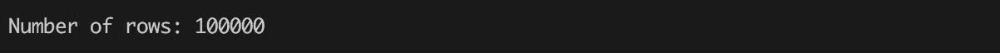

您可以观察到命令`sc.textFile(...)`的执行没有花费时间并且立即返回，而执行`rawData.count`花费了大部分时间。这恰恰说明了Spark**转换**和**动作**之间的区别。通过设计，Spark 采用了**惰性评估** -这意味着如果调用了一个转换，Spark 只是将其直接记录到其所谓的**执行图/计划**中。这完全符合大数据世界，因为用户无需等待就可以堆积转换。另一方面，一个操作评估执行图——Spark 实例化每个记录的转换，并将其应用到先前转换的输出中。这个概念还有助于 Spark 在执行之前分析和优化执行图——例如，Spark 可以重新组织转换的顺序，或者如果转换是独立的，可以决定并行运行转换。

现在，我们定义了一个转换，将数据加载到包含所有输入数据文件行的 Spark 数据结构`RDD[String]`中。让我们来看看前两行:

```scala
rawData.take(2) 
```

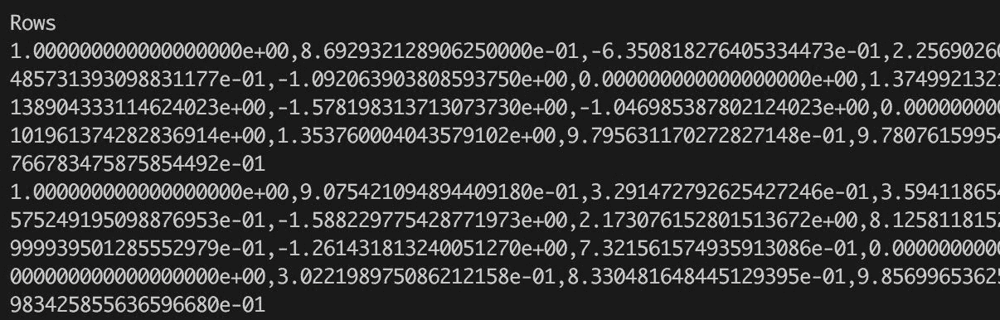

前两行包含从文件加载的原始数据。您可以看到，一行由值为 0，1 的响应列(该行的第一个值)和其他具有真实值的列组成。但是，这些行仍然表示为字符串，需要解析并转换为常规行。因此，基于输入数据格式的知识，我们可以定义一个简单的解析器，它根据逗号将输入行拆分成数字:

```scala
val data = rawData.map(line => line.split(',').map(_.toDouble)) 

```

现在，我们可以提取响应列(数据集中的第一列)和表示输入要素的其余数据:

```scala
val response: RDD[Int] = data.map(row => row(0).toInt)   
val features: RDD[Vector] = data.map(line => Vectors.dense(line.slice(1, line.size))) 
```

完成这一转换后，我们有两个 rdd:

*   一个代表响应列
*   另一个包含保持单个输入特征的密集数字向量

接下来，让我们更详细地看看输入特性，并执行一些非常基本的数据分析:

```scala
val featuresMatrix = new RowMatrix(features) 
val featuresSummary = featuresMatrix.computeColumnSummaryStatistics() 
```

我们把这个向量转换成一个分布式的行矩阵。这使我们能够执行简单的汇总统计(例如，计算平均值、方差等:)

```scala

import org.apache.spark.utils.Tabulizer._ 
println(s"Higgs Features Mean Values = ${table(featuresSummary.mean, 8)}")

```

输出如下:


看看下面的代码:

```scala
println(s"Higgs Features Variance Values = ${table(featuresSummary.variance, 8)}") 

```

输出如下:


在下一步中，让我们更详细地探索列。我们可以直接得到每一列中非 0 的个数，来判断数据是密集还是稀疏。密集数据大多包含非 0，稀疏数据则相反。数据中非 0 的数量与所有值的数量之比表示数据的稀疏性。稀疏性可以驱动我们对计算方法的选择，因为对于稀疏数据，只迭代非零值更有效:

```scala
val nonZeros = featuresSummary.numNonzeros 
println(s"Non-zero values count per column: ${table(nonZeros, cols = 8, format = "%.0f")}") 
```

输出如下:


然而，这个调用只是给了我们所有列的非 0 的数目，这并不是那么有趣。我们对包含一些零值的列更感兴趣:

```scala
val numRows = featuresMatrix.numRowsval numCols = featuresMatrix.numColsval colsWithZeros = nonZeros.toArray.zipWithIndex.filter { case (rows, idx) => rows != numRows }println(s"Columns with zeros:\n${table(Seq("#zeros", "column"), colsWithZeros, Map.empty[Int, String])}")
```

在这种情况下，我们用每个值的索引来扩充非 0 的原始向量，然后过滤掉所有与原始矩阵行数相等的值。我们得到:

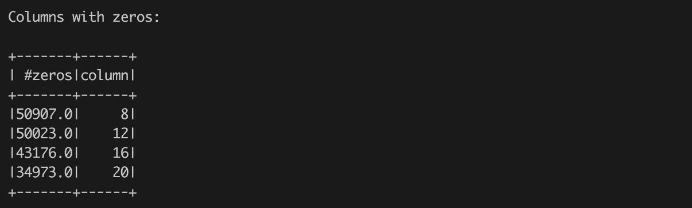

我们可以看到，第 8、12、16 和 20 列包含一些零数字，但仍然不足以将矩阵视为稀疏的。为了证实我们的观察，我们可以计算矩阵的整体稀疏度(余数:矩阵不包括响应列):

```scala
val sparsity = nonZeros.toArray.sum / (numRows * numCols)println(f"Data sparsity: ${sparsity}%.2f") 
```

输出如下:

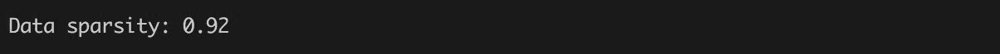

计算出的数字证实了我们之前的观察——输入矩阵是密集的。

现在是时候更详细地探讨响应列了。作为第一步，我们通过计算响应向量内的唯一值来验证响应仅包含值`0`和`1`:

```scala
val responseValues = response.distinct.collectprintln(s"Response values: ${responseValues.mkString(", ")}") 
```

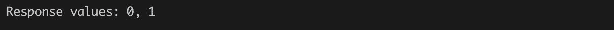

下一步是探索标签在响应向量中的分布。我们可以通过 Spark 直接计算费率:

```scala
val responseDistribution = response.map(v => (v,1)).countByKeyprintln(s"Response distribution:\n${table(responseDistribution)}") 
```

输出如下:

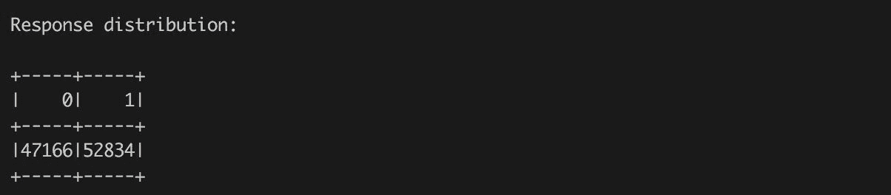

在这一步中，我们简单地将每一行转换为一个元组，该元组表示行值，`1`表示该值在行中出现一次。有了对的 rdd，Spark 方法`countByKey`通过一个键聚合对，并给我们一个键计数的总结。它显示，令人惊讶的是，数据包含了更多代表希格斯玻色子的情况，但我们仍然可以认为反应很好地平衡了。

在 H2O 图书馆的帮助下，我们还可以直观地探索标签的分布。为此，我们需要启动以`H2OContext`为代表的 H2O 服务:

```scala
import org.apache.spark.h2o._ 
val h2oContext = H2OContext.getOrCreate(sc) 

```

该代码初始化 H2O 库，并在 Spark 集群的每个节点上启动 H2O 服务。它还公开了一个名为 Flow 的交互环境，这对于数据探索和模型构建非常有用。在控制台中，`h2oContext`打印暴露的 UI 的位置:

```scala
h2oContext: org.apache.spark.h2o.H2OContext =  
Sparkling Water Context: 
 * H2O name: sparkling-water-user-303296214 
 * number of executors: 1 
 * list of used executors: 
  (executorId, host, port) 
  ------------------------ 
  (driver,192.168.1.65,54321) 
  ------------------------ 
  Open H2O Flow in browser: http://192.168.1.65:54321 (CMD + click in Mac OSX) 
```

现在我们可以直接打开 Flow UI 地址，开始探索数据了。但是，在此之前，我们需要将 Spark 数据发布为名为`response`的 H2O 框架:

```scala
val h2oResponse = h2oContext.asH2OFrame(response, "response")
```

If you import implicit conversions exposed by `H2OContext`, you will be able to invoke transformation transparently based on the defined type on the left-side of assignment:

例如:

```scala
import h2oContext.implicits._ 
val h2oResponse: H2OFrame = response 
```

现在是打开流量界面的时候了。您可以通过访问`H2OContext`报告的网址或在 Spark shell 中键入`h2oContext.openFlow`直接打开。

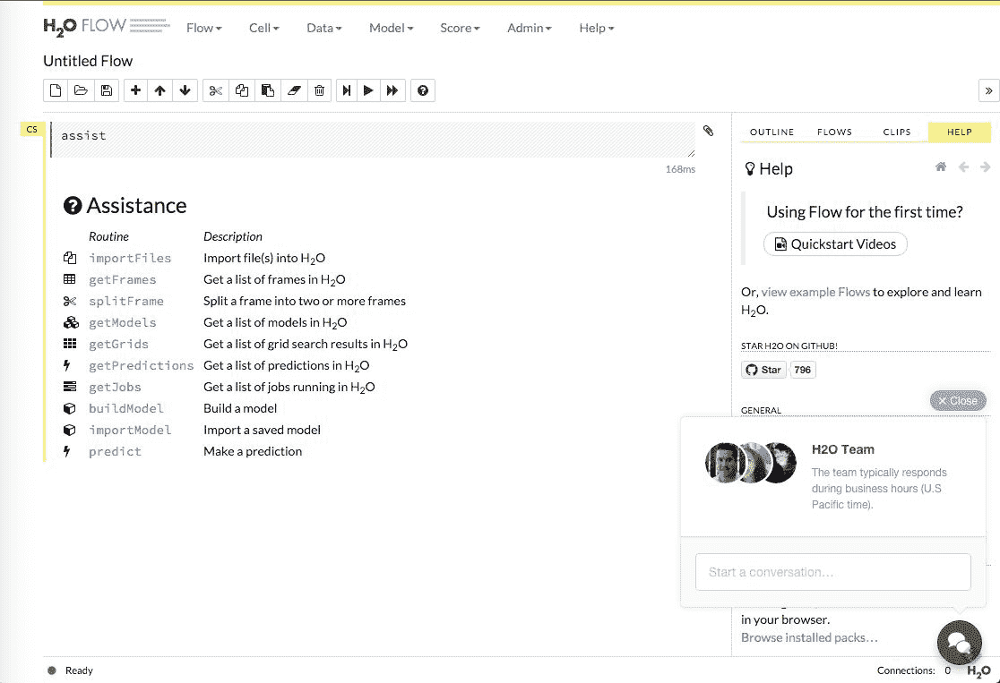

Figure 3 - Interactive Flow UI

流用户界面允许与存储的数据进行交互工作。让我们通过在突出显示的单元格中键入`getFrames`来查看流中显示了哪些数据:

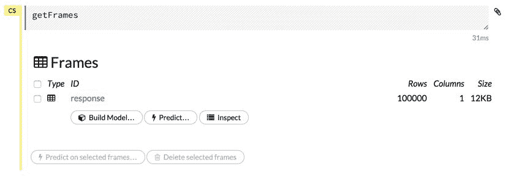

Figure 4 - Get list of available H2O frames

通过点击响应栏或输入`getColumnSummary "response", "values"`，我们可以直观的确认响应栏中的数值分布，看到问题稍微不平衡:


Figure 5 - Statistical properties of column named "response".

# 标记点向量

在使用 Spark MLlib 运行任何有监督的机器学习算法之前，我们必须将我们的数据集转换为标记点向量，该向量将特征映射到给定的标签/响应；标签以双精度形式存储，这有助于它们在分类和回归任务中的使用。对于所有二进制分类问题，标签应该存储为`0`或`1`，我们从前面的汇总统计中确认这对于我们的示例是正确的。

```scala
val higgs = response.zip(features).map {  
case (response, features) =>  
LabeledPoint(response, features) } 

higgs.setName("higgs").cache() 
```

标记点向量的示例如下:

```scala
(1.0, [0.123, 0.456, 0.567, 0.678, ..., 0.789]) 
```

在前面的例子中，括号内的所有双精度是特征，括号外的单个数字是我们的标签。请注意，我们尚未告诉 Spark，我们正在执行分类任务，而不是稍后将发生的回归任务。

In this example, all input features contain only numeric values, but in many situations data that contains categorical values or string data. All this non-numeric representation needs to be converted into numbers, which we will show later in this book.

# 数据缓存

许多机器学习算法本质上是迭代的，因此需要多次遍历数据。但是，默认情况下，存储在 Spark RDD 中的所有数据都是瞬态的，因为 RDD 只存储要执行的转换，而不是实际数据。这意味着每个操作都将通过执行存储在 RDD 的转换来一次又一次地重新计算数据。

因此，Spark 提供了一种方法来保存数据，以防我们需要对其进行迭代。Spark 还发布了几个`StorageLevels`，允许通过各种选项存储数据:

*   `NONE`:完全不缓存
*   `MEMORY_ONLY`:仅在内存中缓存 RDD 数据
*   `DISK_ONLY`:将缓存的 RDD 数据写入磁盘并从内存中释放
*   `MEMORY_AND_DISK`:如果无法将数据卸载到磁盘，则将 RDD 缓存在内存中
*   `OFF_HEAP`:使用不属于 JVM 堆的外部内存存储

此外，Spark 还为用户提供了两种缓存数据的能力:*原始数据*(例如`MEMORY_ONLY`)和*序列化数据*(例如`MEMORY_ONLY_SER`)。后者使用大内存缓冲区直接存储 RDD 的序列化内容。使用哪一个非常依赖于任务和资源。一个很好的经验法则是，如果您使用的数据集少于 10 千兆字节，那么原始缓存优于序列化缓存。但是，一旦超过 10 千兆字节的软阈值，原始缓存将比序列化缓存占用更多的内存。

可以通过在 RDD 上调用`cache()`方法或直接通过调用具有所需持久目标的持久化方法`persist(StorageLevels.MEMORY_ONLY_SER)`来强制缓存 Spark。知道 RDD 只允许我们设置一次存储级别是很有用的。

决定缓存什么和如何缓存是Spark魔术的一部分；但是，黄金法则是，当我们需要多次访问 RDD 数据并根据应用对速度和存储的偏好选择目的地时，使用缓存。一篇比这里给出的更详细的博客文章可以在以下网址找到:

[http://sujee . net/2015/01/22/了解-Spark-缓存/#.VpU1nJMrLdc](http://sujee.net/2015/01/22/understanding-spark-caching/#.VpU1nJMrLdc)

通过使用`getRDDs`评估单元格，也可以从 H2O 流用户界面访问缓存的关系数据库:


# 创建培训和测试集

与大多数监督学习任务一样，我们将在数据集中创建一个分割，以便我们*在一个子集上教*一个模型，然后测试它根据保持集在新数据上进行归纳的能力。出于本例的目的，我们对数据进行了 80/20 的拆分，但是对于拆分的比率没有硬性规定，或者说，首先应该有多少个拆分:

```scala
// Create Train & Test Splits 
val trainTestSplits = higgs.randomSplit(Array(0.8, 0.2)) 
val (trainingData, testData) = (trainTestSplits(0), trainTestSplits(1)) 
```

通过在数据集上创建我们的 80/20 分割，我们将随机抽取 880 万个示例作为我们的训练集，剩下的 220 万个作为我们的测试集。我们可以很容易地再进行一次随机的 80/20 分割，生成一个新的训练集，样本数相同(880 万)，但数据不同。对我们的原始数据集进行这种类型的*硬*分裂会引入采样偏差，这基本上意味着我们的模型将学会拟合训练数据，但训练数据可能不代表“现实”。假设我们已经处理了 1100 万个例子，例如，与原始数据集是 100 行的情况相比，这种偏差并不明显。这通常被称为模型验证的**保持方法**。

您也可以使用 H2O 流分割数据:

1.  将希格斯数据发布为 H2OFrame:

```scala
val higgsHF = h2oContext.asH2OFrame(higgs.toDF, "higgsHF") 
```

2.  使用命令`splitFrame`在流程界面中分割数据(参见*图 07* )。
3.  然后把结果发布回 RDD。


Figure 7 - Splitting Higgs dataset into two H2O frames representing 80 and 20 percent of data.

与 Spark 懒惰评估相反，H2O 计算模型是热切的。这意味着`splitFrame`调用会立即处理数据，并创建两个新的帧，可以直接访问。

# 交叉验证呢？

通常，在较小数据集的情况下，数据科学家采用一种称为交叉验证的技术，您也可以在 Spark 中使用这种技术。`CrossValidator`类首先将数据集分成 N 个折叠(用户声明的)-每个折叠作为训练集的一部分使用 N-1 次，一次用于模型验证。例如，如果我们声明希望使用 **5 倍交叉验证**，`CrossValidator`类将使用数据集的五分之四创建五对(训练和测试)数据集，以创建最后五分之一作为测试集的训练集，如下图所示。

我们的想法是，当我们在 80%的数据上创建训练/测试分割时，我们将看到我们的算法在不同的随机采样数据集上的性能，以说明固有的采样偏差。不能很好地概括的模型的一个例子是，精度——例如，用总体误差来衡量——在地图上到处都有不同的误差率，这表明我们需要重新思考我们的模型。

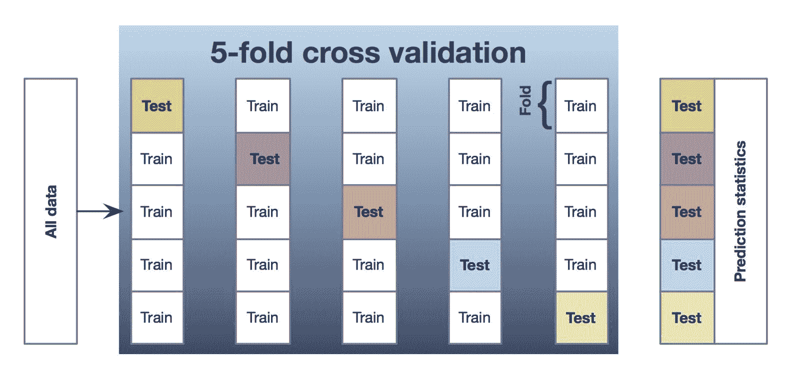

Figure 8 - Conceptual schema of 5-fold cross-validation.

对于应该执行多少次折叠没有固定的规则，因为这些问题在所使用的数据类型、示例数量等方面都是高度个性化的。在某些情况下，进行极端的交叉验证是有意义的，其中 N 等于输入数据集中的数据点数量。在这种情况下，**测试**集只包含一行。这种方法被称为**留一法** ( **LOO** )验证，计算成本更高。

一般来说，建议您在模型构建过程中执行一些交叉验证(通常建议 5 倍或 10 倍交叉验证)，以验证模型的质量，尤其是当数据集很小时。

# 我们的第一个模型——决策树

我们第一次尝试从背景噪声中分类希格斯玻色子将使用决策树算法。我们有意避免解释这种算法背后的直觉，因为这已经有大量的文献支持供读者使用。相反，我们将关注超参数以及如何解释模型在某些标准/误差测量方面的功效。让我们从基本参数开始:

```scala
val numClasses = 2 
val categoricalFeaturesInfo = Map[Int, Int]() 
val impurity = "gini" 
val maxDepth = 5 
val maxBins = 10 
```

现在，我们明确告诉 Spark，我们希望构建一个决策树分类器来区分两个类。让我们仔细看看决策树的一些超参数，看看它们是什么意思:

`numClasses`:我们要分几类？在这个例子中，我们希望区分希格斯玻色子粒子和背景噪声，因此有四类:

*   `categoricalFeaturesInfo`:我们声明哪些特征是分类特征而不应该被视为数字的规范(例如，邮政编码就是一个流行的例子)。这个数据集中没有我们需要担心的分类特征。
*   `impurity`:节点处标签同质性的度量。目前在 Spark 中，关于分类有两种杂质度量:基尼和熵，一种杂质用于回归:方差。
*   `maxDepth`:限制已建树木深度的停止标准。一般来说，更深的树导致更准确的结果，但有过度拟合的风险。
*   `maxBins`:树进行拆分时要考虑的箱数(想想“值”)。通常，增加箱的数量允许树考虑更多的值，但是也增加了计算时间。

# 基尼系数与熵

为了确定使用哪一种杂质测量，重要的是我们从**信息增益**的概念开始覆盖一些基础知识。

它的核心是信息增益，就像它听起来的那样:在两种状态之间移动的信息增益。更准确地说，某个事件的信息增益是事件发生前后已知信息量的差值。这种信息的一种常见测量方法是查看**熵**，它可以定义为:

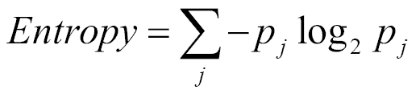

其中*p<sub class="calibre25">j</sub>T3】是节点处标注 *j* 的频率。*

现在，您已经熟悉了信息增益和熵的概念，我们可以继续讨论**基尼指数**的含义(与基尼系数没有任何关联)。

**基尼指数**:是一种衡量随机选择的元素被错误分类的频率，如果它根据给定节点的标签分布被随机赋予一个标签。

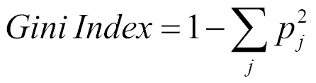

与熵的等式相比，基尼指数的计算速度应该稍快一些，因为没有日志计算，这可能是为什么它是包括 MLlib 在内的许多其他机器学习库的**默认**选项的原因。

但是，这是否使其成为更好的**度量来为我们的决策树进行拆分呢？结果表明，相对于单决策树算法，杂质测度的选择对性能影响不大。之所以这样，据谭等人说。艾尔在《数据挖掘导论》一书中写道:**

**"...This is because impurity measures are quite consistent with each other [...]. Indeed, the strategy used to prune the tree has a greater impact on the final tree than the choice of impurity measure."

现在是我们在训练数据上训练决策树分类器的时候了:

```scala
val dtreeModel = DecisionTree.trainClassifier( 
trainingData,  
numClasses,  
categoricalFeaturesInfo, 
impurity,  
maxDepth,  
maxBins) 

// Show the tree 
println("Decision Tree Model:\n" + dtreeModel.toDebugString) 
```

这应该会产生如下的最终输出(请注意，由于数据的随机分割，您的结果会略有不同):


输出显示决策树有深度`5`和`63`节点，组织在一个分层的决策谓词中。让我们通过前五个*决定*来解读它。它的读法是:*“如果特征 25 的值小于或等于 1.0559 AND 小于或等于 0.61558 AND 特征 27 的值小于或等于 0.87310 AND 特征 5 的值小于或等于 0.89683 AND 最后，特征 22 的值小于或等于 0.76688，则预测为 1.0(希格斯玻色子)。但是，这五个条件必须满足，预测才能成立。”*请注意，如果最后一个条件未被保持(特征 22 的值为`> 0.76688`)，但前面四个保持的条件保持为真，则预测从 1 变为 0，表示背景噪声。

现在，让我们在测试数据集上对模型进行评分，并打印预测误差:

```scala
val treeLabelAndPreds = testData.map { point =>val prediction = dtreeModel.predict(point.features)(point.label.toInt, prediction.toInt)}val treeTestErr = treeLabelAndPreds.filter(r => r._1 != r._2).count.toDouble / testData.count()println(f"Tree Model: Test Error = ${treeTestErr}%.3f") 
```

输出如下:

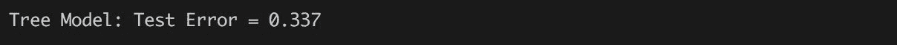

一段时间后，模型将对所有测试集数据进行评分，然后计算我们在前面代码中定义的错误率。同样，您的错误率将与我们的略有不同，但正如我们所示，我们的简单决策树模型的错误率约为 33%。但是，正如您所知，我们可能会犯不同类型的错误，因此通过构建一个混淆矩阵来探究这些类型的错误是值得的:

```scala
val cm = treeLabelAndPreds.combineByKey( 
  createCombiner = (label: Int) => if (label == 0) (1,0) else (0,1),  
  mergeValue = (v:(Int,Int), label:Int) => if (label == 0) (v._1 +1, v._2) else (v._1, v._2 + 1), 
  mergeCombiners = (v1:(Int,Int), v2:(Int,Int)) => (v1._1 + v2._1, v1._2 + v2._2)).collect 
```

前面的代码使用了高级的Spark方法`combineByKey`，它允许我们将每个(K，V)对映射到一个值，该值将通过按键操作来表示该组的输出。在这种情况下，(K，V)-对表示实际值 K 和预测值 V。我们通过创建组合器(参数`createCombiner`)将每个预测映射到一个元组-如果预测值是`0`，那么我们映射到`(1,0)`；否则，我们映射到`(0,1)`。然后我们需要定义组合器如何接受新值，以及组合器如何合并在一起。最后，该方法产生:

```scala
cm: Array[(Int, (Int, Int))] = Array((0,(5402,4131)), (1,(2724,7846))) 
```

结果数组包含两个元组——一个用于实际值`0`，另一个用于实际值`1`。每个元组包含预测数量`0`和`1`。因此，很容易提取所有必要的信息来呈现一个良好的混淆矩阵。

```scala
val (tn, tp, fn, fp) = (cm(0)._2._1, cm(1)._2._2, cm(1)._2._1, cm(0)._2._2) 
println(f"""Confusion Matrix 
  |   ${0}%5d ${1}%5d  ${"Err"}%10s 
  |0  ${tn}%5d ${fp}%5d ${tn+fp}%5d ${fp.toDouble/(tn+fp)}%5.4f 
  |1  ${fn}%5d ${tp}%5d ${fn+tp}%5d ${fn.toDouble/(fn+tp)}%5.4f 
  |   ${tn+fn}%5d ${fp+tp}%5d ${tn+fp+fn+tp}%5d ${(fp+fn).toDouble/(tn+fp+fn+tp)}%5.4f 
  |""".stripMargin) 
```

代码基于*图 9* 所示的模板，提取混淆矩阵的所有真实否定和肯定预测以及遗漏预测和输出:

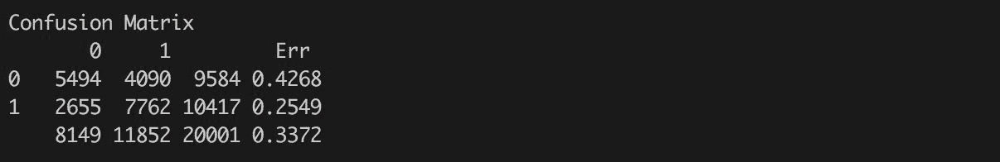

In the preceding code, we are using a powerful Scala feature, which is called *string interpolation*: `println(f"...")`. It allows for the easy construction of the desired output by combining a string output and actual Scala variables. Scala supports different string "interporlators", but the most used are *s* and *f*. The *s* interpolator allows for referencing any Scala variable or even code: `s"True negative: ${tn}"`. While, the *f* interpolator is type-safe - that means the user is required to specify the type of variable to show: `f"True negative: ${tn}%5d"` - and references the variable `tn` as decimal type and asks for printing on five decimal spaces.

回到本章的第一个例子，我们可以看到我们的模型在检测实际玻色子粒子时犯了大部分错误。在这种情况下，所有代表玻色子探测的数据点都被错误地归类为非玻色子。然而，总体错误率相当低！这是一个很好的例子，说明了对于响应不平衡的数据集，总体错误率可能会产生误导。

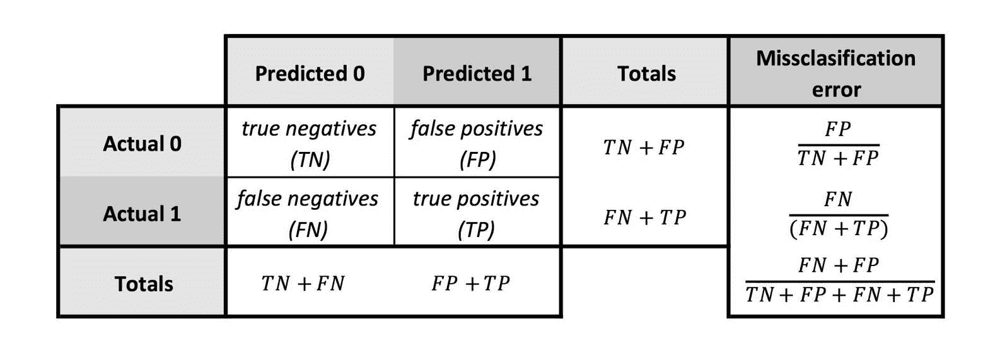

Figure 9 - Confusion matrix schema.

接下来，我们将考虑用于判断分类模型的另一个建模度量，称为(接收器工作特性)**曲线** ( **AUC** )下的**区域(见下图示例)。**接收器工作特性** ( **ROC** )曲线是**真阳性率**与**假阳性率**的图形表示:**

*   **真阳性率**:真阳性总数除以真阳性和假阴性之和。换句话说，它是希格斯玻色子粒子的真实信号(实际标签为 1)与希格斯玻色子的所有预测信号(我们的模型预测标签为 1)的比率。该值显示在 *y* 轴上。
*   **假阳性率**:假阳性总数除以假阳性和真阴性之和，绘制在 *x* 轴上。
*   有关更多指标，请参见“源自混淆矩阵的指标”图。


Figure 10 - Sample AUC Curve with an AUC value of 0.94

由此可见，ROC 曲线描绘了我们的模型在给定决策阈值(决策阈值是我们称之为标签 0 或标签 1 的分界点)下 TPR 与 FPR 之间的权衡。因此，ROC 曲线下的区域可以被认为是*平均模型精度*，由此值 1.0 将代表完美分类，0.5 将是抛硬币(意味着我们的模型在猜测 1 或 0 时做着 50-50 的工作)，任何小于 0.5 的都意味着抛硬币比我们的模型更精确！这是一个非常有用的指标，我们将看到它可以用来与不同的超参数调整和不同的模型进行比较！让我们继续创建一个函数，该函数将允许我们计算决策树模型的 AUC，我们将使用它与其他模型进行比较:

```scala
type Predictor = {  
  def predict(features: Vector): Double 
} 

def computeMetrics(model: Predictor, data: RDD[LabeledPoint]): BinaryClassificationMetrics = { 
    val predAndLabels = data.map(newData => (model.predict(newData.features), newData.label)) 
      new BinaryClassificationMetrics(predAndLabels) 
} 

val treeMetrics = computeMetrics(dtreeModel, testData) 
println(f"Tree Model: AUC on Test Data = ${treeMetrics.areaUnderROC()}%.3f") 
```

输出如下:


Spark MLlib models do not share a common definition of interfaces; hence in the preceding example, we have to define the type `Predictor` exposing the method predict and use Scala structural typing in the definition of the method `computeMetrics`. Later in the book, we will show the Spark ML package, which is based on a unified pipeline-based API.

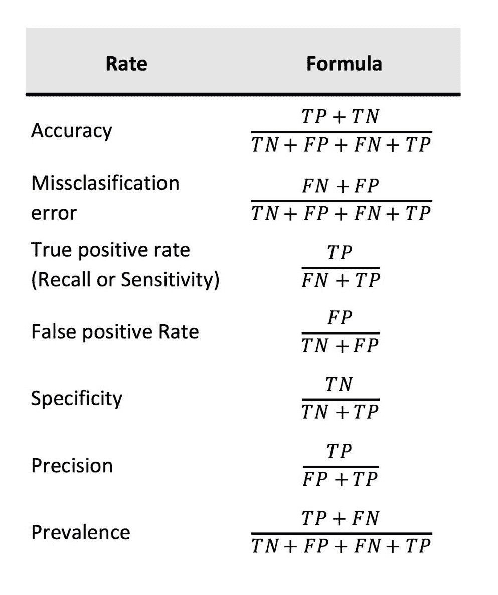

Figure 11 - Metrics derived from confusion matrix.

对这方面的大量阅读感兴趣吗？没有哪部圣经是万能的。斯坦福大学著名统计学教授特雷弗·哈斯蒂的著作《统计学习的要素》是一个很好的信息来源。这本书为机器学习的初学者和高级实践者提供了有用的信息，强烈推荐。

It is important to keep in mind that results between runs can be slightly different, since the Spark decision tree implementation is using internally the `RandomForest` algorithm, which is non-deterministic if a seed for a random generator is not specified. The problem is that the MLLib API for Spark `DecisionTree` does not allow to pass a seed as a parameter.

# 下一个模型——树集合

诸如**随机森林** ( **RF** )或**梯度增强机** ( **GBM)** (也称为梯度增强树)等算法是 MLlib 中目前可用的基于集成树的模型的两个例子；你可以把一个整体想象成一个*超级模型*，它代表了一个基础模型的集合。思考一个团体在幕后做什么的最好方法是考虑一个简单的类比:

*“假设你是一家著名足球俱乐部的主教练，你听说过一个来自巴西的不可思议的运动员的传闻，在其他球队之前将这个年轻的运动员签入你的俱乐部可能会有好处；但是你的日程安排非常繁忙，相反，你会派 10 名助理教练去评估球员。你的每一位助理教练都根据他/她的教练理念给球员打分——也许一位教练想衡量球员跑 40 码的速度，而另一位教练认为身高和手臂伸展度很重要。不管每个教练如何定义“运动员潜力”，你作为主教练，只想知道你是应该现在就和球员签约，还是等待。所以你的教练会飞到巴西，每个教练都会做一个评估；抵达后，你会走到你的每一位教练面前，问“我们应该现在选秀还是等一等？“而且，基于像多数票这样的简单规则，你可以做出决定。这是一个关于分类任务的集体幕后工作的例子。”*

您可以将每个教练视为一个决策树，因此，您将拥有 10 棵树的集合(对于 10 个教练)。每个教练如何评估球员是非常具体的，我们的树也是如此；对于 10 棵树中的每一棵树，在每个节点随机选择所创建的特征(因此在射频中是随机的。森林因为有很多树！).引入这种随机性和其他基础模型的原因是为了防止数据的过度拟合。虽然射频和 GBM 都是基于树的集合，但它们进行训练的方式略有不同，值得一提。

为了最小化一个`loss`函数(例如`log-loss`、平方误差等)，必须一次训练一棵树，并且通常比可以并行生成多个树的射频需要更长的训练时间。

然而，当训练 GBM 时，建议制作浅树，这反过来有助于更快的训练。

*   与 GBM 相比，RFs 通常不会过度采集数据；也就是说，与我们在 GBM 中添加更多的树相比，我们可以在我们的森林中添加更多的树，并且不容易过度拟合。
*   射频的超参数调谐比 GBM 简单得多。在他的论文中，*超参数对随机森林精度的影响*，Bernard 等人通过实验表明，在每个节点选择的 K 个随机特征的数量是模型精度的关键影响因素([https://hal.archives-ouvertes.fr/hal-00436358/document](https://hal.archives-ouvertes.fr/hal-00436358/document))相反，一个 GBM 有更多必须考虑的超参数，如`loss`函数、学习率、迭代次数等。

与数据科学中大多数更好的*问题一样，在射频和 GBM 之间进行选择是开放式的，并且非常依赖于任务和数据集。*

# 随机森林模型

现在，让我们尝试使用 10 棵决策树构建一个随机森林。

```scala
val numClasses = 2 
val categoricalFeaturesInfo = Map[Int, Int]() 
val numTrees = 10 
val featureSubsetStrategy = "auto"  
val impurity = "gini" 
val maxDepth = 5 
val maxBins = 10 
val seed = 42 

val rfModel = RandomForest.trainClassifier(trainingData, numClasses, categoricalFeaturesInfo, 
  numTrees, featureSubsetStrategy, impurity, maxDepth, maxBins, seed) 

```

就像我们的单一决策树模型一样，我们从声明超参数开始，您应该已经从决策树示例中熟悉了其中的许多参数。在前面的代码中，我们将从创建 10 棵树的随机森林开始，解决一个两类问题。一个不同的关键特征是特征子集策略，描述如下:

`featureSubsetStrategy`对象给出了用作在每个节点进行分割的候选要素的数量。可以是分数(例如 0.5)，也可以是基于数据集中要素数量的函数。设置`auto`允许算法为您选择这个数字，但是一个常见的软规则是使用您拥有的特征数量的平方根。

既然我们已经训练了我们的模型，让我们根据我们的等待集对它进行评分，并计算总误差:

```scala
def computeError(model: Predictor, data: RDD[LabeledPoint]): Double = {  
  val labelAndPreds = data.map { point => 
    val prediction = model.predict(point.features) 
    (point.label, prediction) 
  } 
  labelAndPreds.filter(r => r._1 != r._2).count.toDouble/data.count 
} 
val rfTestErr = computeError(rfModel, testData) 
println(f"RF Model: Test Error = ${rfTestErr}%.3f") 
```

输出如下:


并且还通过使用已经定义的方法`computeMetrics`来计算 AUC:

```scala

val rfMetrics = computeMetrics(rfModel, testData) 
println(f"RF Model: AUC on Test Data = ${rfMetrics.areaUnderROC}%.3f") 
```


就整体模型误差和 AUC 而言，我们的 RF(硬编码超参数)比我们的单一决策树表现得好得多。在下一节中，我们将介绍网格搜索的概念，以及我们如何尝试改变超参数值/组合，并测量对模型性能的影响。

Again, results can slightly differ between runs. However, in contrast to the decision tree, it is possible to make a run deterministic by passing a seed as a parameter of the method `RandomForest.trainClassifier`.

# 网格搜索

与 MLlib 和 H2O 的大多数算法一样，有许多超参数可供选择，这些参数会对模型的性能产生显著影响。鉴于可能的组合数量无穷无尽，有没有一种智能方法可以让我们开始观察哪些组合看起来比其他组合更有希望？谢天谢地，答案是一个明确的“是！”这个解决方案被称为网格搜索，它是运行许多使用不同超参数组合的模型的 ML 语言。

让我们尝试使用射频算法运行一个简单的网格搜索。在这种情况下，从定义的参数超空间中为每个参数组合调用射频模型构建器:

```scala
val rfGrid =  
    for ( 
    gridNumTrees <- Array(15, 20); 
    gridImpurity <- Array("entropy", "gini"); 
    gridDepth <- Array(20, 30); 
    gridBins <- Array(20, 50)) 
        yield { 
    val gridModel = RandomForest.trainClassifier(trainingData, 2, Map[Int, Int](), gridNumTrees, "auto", gridImpurity, gridDepth, gridBins) 
    val gridAUC = computeMetrics(gridModel, testData).areaUnderROC 
    val gridErr = computeError(gridModel, testData) 
    ((gridNumTrees, gridImpurity, gridDepth, gridBins), gridAUC, gridErr) 
  } 
```

我们刚刚写的是一个`for`循环，它将根据树的数量、杂质类型、树的深度和容器(即要尝试的值)来尝试许多不同的组合；然后，对于基于这些超参数排列创建的每个模型，我们将在计算 AUC 指标和总体错误率的同时，根据我们的搁置集对训练好的模型进行评分。我们总共得到 *2*2*2*2=16* 型号。同样，您的模型将与我们在此展示的模型略有不同，但您的输出应该类似于以下内容:


看看我们输出的第一个条目:

```scala
|(15,entropy,20,20)|0.697|0.302|
```

我们可以这样解释:对于 15 个决策树的组合，使用熵作为我们的杂质度量，以及 20 的树深度(对于每个树)和 20 的箱值，我们的 AUC 是`0.695`。请注意，结果是按照您最初编写它们的顺序显示的。对于使用射频算法的网格搜索，我们可以轻松获得产生最高 AUC 的超参数组合:

```scala
val rfParamsMaxAUC = rfGrid.maxBy(g => g._2)println(f"RF Model: Parameters ${rfParamsMaxAUC._1}%s producing max AUC = ${rfParamsMaxAUC._2}%.3f (error = ${rfParamsMaxAUC._3}%.3f)") 
```

输出如下:

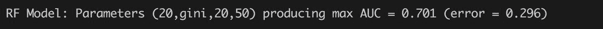

# 梯度增压机

到目前为止，我们能收集到的最好的 AUC 是 15 决策树 RF，其 AUC 值为`0.698`。现在，让我们通过同样的过程运行一个带有硬编码超参数的梯度增强机器，然后对这些参数进行网格搜索，看看我们是否可以使用该算法获得更高的 AUC。

回想一下，GBM 与射频略有不同，因为它试图减少我们预先声明的整体`loss`函数的迭代性质。从 1.6.0 开始，MLlib 中有三种不同的损失函数可供选择:

*   **日志丢失**:分类任务使用此`loss`功能(注意 GBM 只支持 Spark 的二进制分类。如果您希望使用 GBM 进行多类分类，请使用 H2O 的实现，我们将在下一章中展示。
*   **平方误差**:对于回归任务使用此`loss`函数。这是当前默认的此类问题的`loss`函数。
*   **绝对误差**:另一个可用于回归任务的`loss`功能。假设此函数采用预测值和实际值之间的绝对差值，它对异常值的控制要比平方误差好得多。

给定我们的二元分类任务，我们将使用`log-loss`函数并开始构建一个 10 树 GBM 模型:

```scala
import org.apache.spark.mllib.tree.GradientBoostedTreesimport org.apache.spark.mllib.tree.configuration.BoostingStrategyimport org.apache.spark.mllib.tree.configuration.Algoval gbmStrategy = BoostingStrategy.defaultParams(Algo.Classification)gbmStrategy.setNumIterations(10)gbmStrategy.setLearningRate(0.1)gbmStrategy.treeStrategy.setNumClasses(2)gbmStrategy.treeStrategy.setMaxDepth(10)gbmStrategy.treeStrategy.setCategoricalFeaturesInfo(java.util.Collections.emptyMap[Integer, Integer])val gbmModel = GradientBoostedTrees.train(trainingData, gbmStrategy)
```

请注意，在构建模型之前，我们必须声明一个增强策略。原因是 MLlib 事先不知道我们在处理什么类型的问题:分类还是回归？所以这个策略是让 Spark 知道这是一个二元分类问题，并使用声明的超参数来构建我们的模型。

以下是培训 GBMs 时需要记住的一些超级参数:

*   `numIterations`:根据定义，一个 GBM 一次构建一棵树，以便最小化我们声明的`loss`函数。该超参数控制要构建的树的数量；注意不要建立太多的树，因为测试时的性能可能不理想。
*   `loss`:在哪里声明使用哪个`loss`函数取决于被问问题和数据集。
*   `learningRate`:优化学习速度。较低的值(< 0.1)意味着较慢的学习和提高的泛化能力。然而，它也需要更高的迭代次数，因此需要更长的计算时间。

让我们根据搁置集对该模型进行评分，并计算我们的 AUC:

```scala
val gbmTestErr = computeError(gbmModel, testData) 
println(f"GBM Model: Test Error = ${gbmTestErr}%.3f") 
val gbmMetrics = computeMetrics(dtreeModel, testData) 
println(f"GBM Model: AUC on Test Data = ${gbmMetrics.areaUnderROC()}%.3f") 
```

输出如下:


作为最后一步，我们将对几个超参数执行网格搜索，并与之前的射频网格搜索示例类似，输出组合及其各自的误差和 AUC 计算:

```scala
val gbmGrid =  
for ( 
  gridNumIterations <- Array(5, 10, 50); 
  gridDepth <- Array(2, 3, 5, 7); 
  gridLearningRate <- Array(0.1, 0.01))  
yield { 
  gbmStrategy.numIterations = gridNumIterations 
  gbmStrategy.treeStrategy.maxDepth = gridDepth 
  gbmStrategy.learningRate = gridLearningRate 

  val gridModel = GradientBoostedTrees.train(trainingData, gbmStrategy) 
  val gridAUC = computeMetrics(gridModel, testData).areaUnderROC 
  val gridErr = computeError(gridModel, testData) 
  ((gridNumIterations, gridDepth, gridLearningRate), gridAUC, gridErr) 
} 
```

我们可以打印按 AUC 排序的结果的前 10 行:

```scala
println(s"""GBM Model: Grid results:|${table(Seq("iterations, depth, learningRate", "AUC", "error"), gbmGrid.sortBy(-_._2).take(10), format = Map(1 -> "%.3f", 2 -> "%.3f"))}""".stripMargin)
```

输出如下:

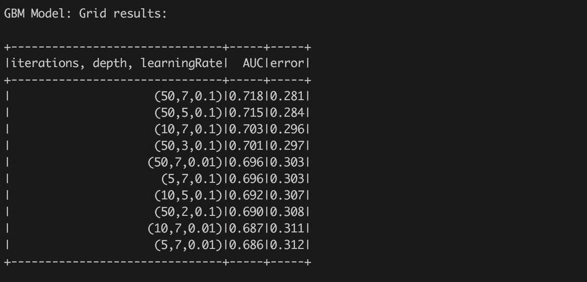

我们可以很容易地得到产生最大 AUC 的模型:

```scala
val gbmParamsMaxAUC = gbmGrid.maxBy(g => g._2) 
println(f"GBM Model: Parameters ${gbmParamsMaxAUC._1}%s producing max AUC = ${gbmParamsMaxAUC._2}%.3f (error = ${gbmParamsMaxAUC._3}%.3f)") 
```

输出如下:


# 最后一个模型——H2O 深度学习

到目前为止，我们使用 Spark MLlib 构建不同的模型；然而，我们也可以使用 H2O 算法。所以让我们试试吧！

首先，我们将把我们的训练和测试数据集转移到 H2O，并为我们的二元分类问题创建一个 DNN。重申一下，这之所以成为可能，是因为 Spark 和 H2O 共享同一个 JVM，这有助于将 Spark RDDs 传递给 H2O 十六进制帧，反之亦然。

到目前为止，我们运行的所有模型都在 MLlib 中，但现在我们将使用 H2O 构建一个 DNN，使用与我们使用的相同的训练和测试集，这意味着我们需要将这些数据发送到我们的 H2O 云，如下所示:

```scala
val trainingHF = h2oContext.asH2OFrame(trainingData.toDF, "trainingHF") 
val testHF = h2oContext.asH2OFrame(testData.toDF, "testHF") 
```

为了验证我们已经成功转移了我们的培训和测试 RDDs(我们将其转换为数据帧)，我们可以在我们的 Flow 笔记本中执行该命令(所有命令都是用 *Shift+Enter* 执行的)。请注意，我们有两个 H2O 帧，现在称为`trainingRDD`和`testRDD`，您可以通过运行命令`getFrames.`在我们的 H2O 笔记本中看到这两个帧


Figure 12 - List of available H2O frames is available by typing "getFrames" into Flow UI.

我们可以通过在“流”单元格中键入`getFrameSummary "trainingHF"`或只需点击框架名称(参见*图 13* )来轻松浏览框架以查看其结构。

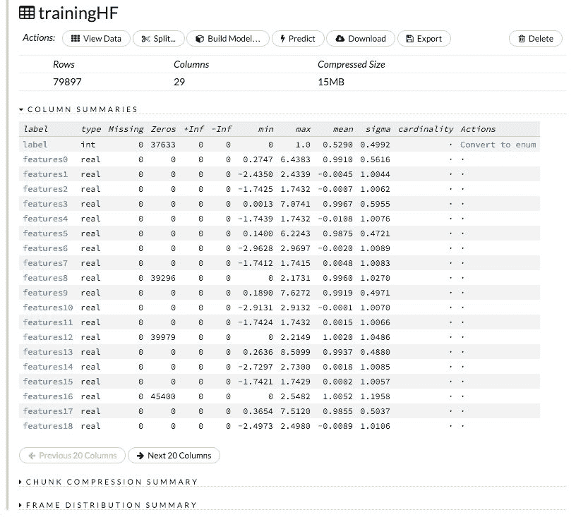

Figure 13 - Structure of training frame.

上图显示了训练框架的结构——它有 80，491 行和 29 列；有名为*特征 0* 、*特征 1* 的数字列，...第一列标签包含整数值。

由于我们想要执行二进制分类，我们需要将“标签”列从整数转换为分类类型。您可以通过执行以下命令，在流用户界面或Spark控制台中单击操作*转换为枚举*来轻松完成此操作:

```scala
trainingHF.replace(0, trainingHF.vecs()(0).toCategoricalVec).remove() 
trainingHF.update() 

testHF.replace(0, testHF.vecs()(0).toCategoricalVec).remove() 
testHF.update() 
```

代码将第一个向量替换为转换后的向量，并从内存中删除原始向量。此外，调用`update`将更改传播到共享的分布式存储中，因此集群中的所有节点都可以看到这些更改。

# 建造一个三层的 DNN

H2O 展示了略有不同的建模方式；但是，它在所有 H2O 车型中是统一的。有三个基本构件:

*   **模型参数**:定义输入和算法特定参数
*   **模型构建器**:接受模型参数并生成模型
*   **模型**:包含模型定义，但也包含关于模型构建的技术信息，例如每次迭代的得分时间或错误率

在构建模型之前，我们需要为深度学习算法构建参数:

```scala
import _root_.hex.deeplearning._ 
import DeepLearningParameters.Activation 

val dlParams = new DeepLearningParameters() 
dlParams._train = trainingHF._key 
dlParams._valid = testHF._key 
dlParams._response_column = "label" 
dlParams._epochs = 1 
dlParams._activation = Activation.RectifierWithDropout 
dlParams._hidden = Array[Int](500, 500, 500) 
```

让我们遍历参数，找出我们刚刚初始化的模型:

*   `train`和`valid`:指定我们创建的训练和测试集。请注意，这些 rdd 实际上是 H2O 框架。
*   `response_column`:指定我们预先声明的标签是每个帧中的第一个元素(从 0 开始的索引)。
*   `epochs`:一个极其重要的参数，指定网络应该传递多少次训练数据；通常，用更高的`epochs`训练的模型允许网络*学习*新特征并产生更好的模型结果。然而，需要注意的是，这些经过长期训练的网络存在过度拟合的问题，并且可能无法很好地推广新数据。
*   `activation`:这些是将应用于输入数据的各种非线性函数。在 H2O，有三种主要激活可供选择:
*   `Rectifier`:有时称为**整流线性单元** ( **ReLU** )，这是一个下限为 **0** 但以线性方式走向正无穷大的函数。就生物学而言，这些单位被证明更接近实际的神经元激活。目前，考虑到图像识别和速度等任务的结果，这是 H2O 的默认激活功能。


Figure 14 - Rectifier activation function

*   `Tanh`:在 **-1** 和 **1** 之间绑定的一个修正的逻辑函数，但是通过原点在(0，0)。由于其围绕 **0** 对称，收敛通常更快。


Figure 15 - Tanh activation function and Logistic function - note difference between Tanh.

*   `Maxout`:每个神经元从 k 个独立通道中选出最大值的函数:
    *   **隐藏**:另一个极其重要的超参数，这是我们指定两件事的地方:
        *   层数(可以用额外的逗号创建)。请注意，在图形用户界面中，默认参数是两层隐藏网络，每层有 200 个隐藏神经元。
        *   每层神经元的数量。和大多数关于机器学习的事情一样，这个数字没有固定的规则，实验通常是最好的。但是，我们将在下一章中介绍一些额外的调整参数，这些参数将帮助您思考这一点，即:L1 和 L2 正则化和退出。

# 添加更多层

网络增加更多层次的原因来自我们对视觉皮层如何为人类工作的理解。这是你大脑后部的一个专用区域，用于识别物体/模式/数字等，由复杂的神经元层组成，这些神经元工作来编码视觉信息，并根据先验知识对它们进行相应的分类。

毫不奇怪，网络需要多少层才能产生好的结果没有固定的规则，强烈建议进行实验！

# 建立模型并检查结果

现在，您已经对我们要运行的参数和模型有了一些了解，现在是时候继续训练和检查我们的网络了:

```scala
val dl = new DeepLearning(dlParams) 
val dlModel = dl.trainModel.get 
```

代码创建了`DeepLearning`模型构建器并启动了它。默认情况下，`trainModel`的启动是异步的(也就是说，它从不阻塞，而是返回一个作业)，但是通过调用方法`get`可以等到计算结束。也可以在 UI 中探索作业进度，甚至通过在 Flow UI 中键入`getJobs`来探索未完成的模型(见*图 18* )。

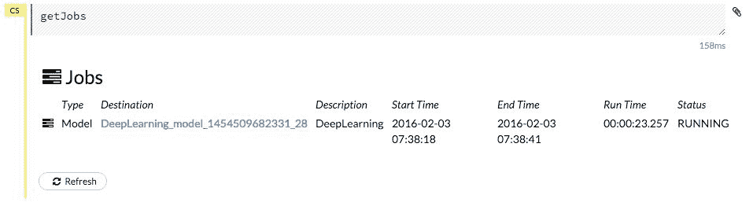

Figure 18 - The command getJobs provides a list of executed jobs with their status.

计算的结果是一个深度学习模型——我们可以从 Spark shell 中直接探索模型及其细节:

```scala
println(s"DL Model: ${dlModel}") 
```

我们也可以通过调用模型的`score`方法直接获得测试数据的预测框架:

```scala
val testPredictions = dlModel.score(testHF) 

testPredictions: water.fvec.Frame = 
Frame _95829d4e695316377f96db3edf0441ee (19912 rows and 3 cols): 
         predict                   p0                    p1 
    min           0.11323123896925524  0.017864442175851737 
   mean            0.4856033079851807    0.5143966920148184 
 stddev            0.1404849885490033   0.14048498854900326 
    max            0.9821355578241482    0.8867687610307448 
missing                           0.0                   0.0 
      0        1   0.3908680007591152    0.6091319992408847 
      1        1   0.3339873797352686    0.6660126202647314 
      2        1   0.2958578897481016    0.7041421102518984 
      3        1   0.2952981947808155    0.7047018052191846 
      4        0   0.7523906949762337   0.24760930502376632 
      5        1   0.53559438105240... 
```

该表包含三列:

*   `predict`:基于默认阈值的预测值
*   `p0`:选择 0 级的概率
*   `p1`:选择 1 类的概率

我们还可以获得测试数据的模型度量:

```scala
import water.app.ModelMetricsSupport._ 
val dlMetrics = binomialMM(dlModel, testHF) 

```


输出直接显示了 AUC 和精度(各自的误差率)。请注意，该模型确实擅长预测希格斯玻色子；另一方面，它的假阳性率很高！

最后，让我们看看如何使用图形用户界面构建类似的模型，只是这次，我们将从我们的模型中排除物理学家手动导出的特征，并为内层使用更多的神经元:

1.  选择用于训练高频的模型。

如您所见，H2O 和 MLlib 共享许多相同的算法，但功能级别不同。这里我们将选择*深度学习*，然后取消选择最后八个手动衍生特征。


Figure 19- Selecting model algorithm

2.  构建 DNN 并排除手动衍生特征。

在这里，我们手动选择忽略特征 21-27，它们代表物理学家衍生的特征，希望我们的网络能够学习它们。还要注意，如果您选择走这条路，也可以执行 k 折叠交叉验证。

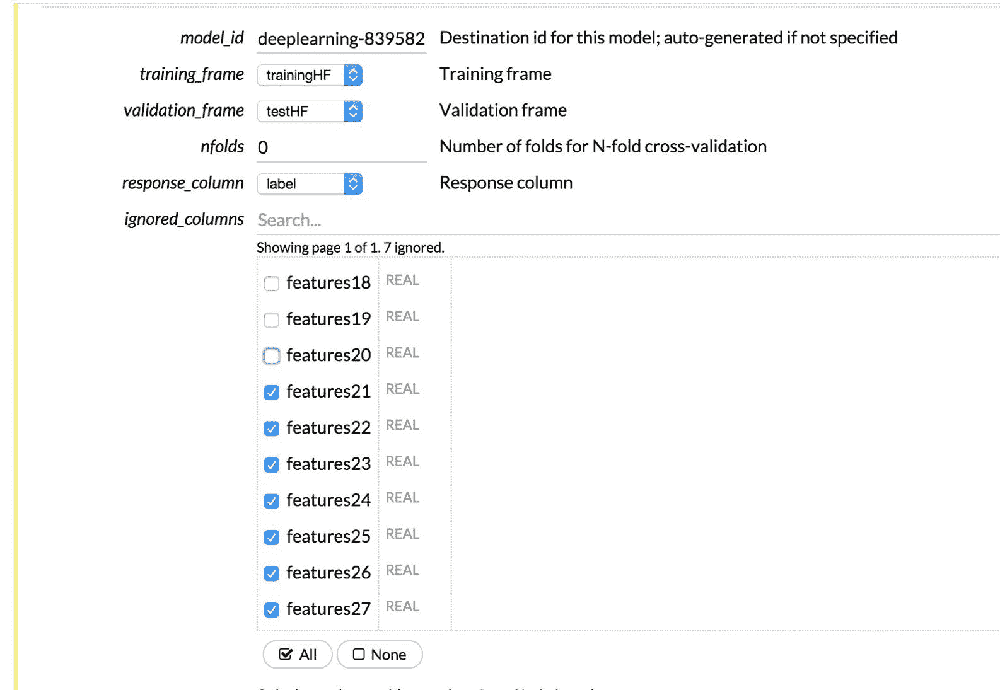

Figure 20 - Selecting input features.

3.  指定网络拓扑。

如您所见，我们将使用整流器激活功能构建一个三层 DNN，其中每层将有 1，024 个隐藏神经元，这将运行 100 `epochs`。

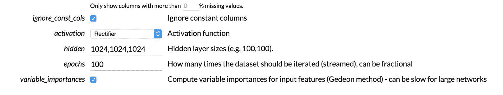

Figure 21 - Configuring network topology with 3 layers, 1024 neurons per layer.

4.  探索模型结果。

运行该模型(需要一些时间)后，我们可以单击“查看”按钮来检查训练集和测试集的 AUC:


Figure 22 - AUC curve for validation data.

如果您单击鼠标并拖放到曲线的某一部分，您实际上可以放大曲线的特定部分，H2O 会给出所选区域各种阈值的准确度和精确度的汇总统计数据。


Figure 23 - ROC curve can be easily explored to find optimal threshold.

此外，还有一个名为预览**普通旧 Java 对象** ( **POJO** )的小按钮，我们将在后面的章节中探讨，这就是如何将模型部署到生产环境中。

好的，我们已经建立了几十个模型；现在是时候开始检查我们的结果，并考虑到整体误差和 AUC 指标，找出哪一个能给我们最好的结果。有趣的是，当我们在办公室主持许多会议并与顶级主持人交谈时，这些类型的显示结果的表格经常被构建出来，这是一个很好的方法来跟踪 a)什么有效，什么无效，b)回顾一下你尝试过的文档形式。

| 模型 | 错误 | 罗马纪元 |
| 决策图表 | Zero point three three two | Zero point six six five |
| 网格搜索:随机森林 | Zero point two nine four | Zero point seven zero four |
| **网格搜索:GBM** | **0.287** | **0.712** |
| 深度学习-所有功能 | Zero point three seven six | Zero point seven zero five |
| 深度学习-子集专长。 | Zero point three zero one | Zero point seven one six |

那么，我们选哪一个？在这种情况下，我们喜欢 GBM 模型，因为它以最低的精度提供了第二高的 AUC 值。但这个决定总是由建模目标驱动的——在这个例子中，我们严格地被模型在寻找希格斯玻色子方面的准确性所激励；然而，在其他情况下，正确模型的选择可能会受到各种方面的影响——例如，找到并构建最佳模型的时间。

# 摘要

这一章是关于二进制分类问题的:对还是错，例如，指示希格斯玻色子的信号还是背景噪声？我们探索了四种不同的算法:**单决策树**、**随机森林**、**梯度增强机**和 DNN。对于这个确切的问题，DNNs 是目前的世界冠军，因为模型可以继续训练更长时间(即增加`epochs`的数量)，并且可以添加更多的层([http://papers . nips . cc/paper/5351-搜索-希格斯-玻色子-衰变-modes-with-deep-learning . pdf](http://papers.nips.cc/paper/5351-searching-for-higgs-boson-decay-modes-with-deep-learning.pdf))

除了探索四种算法以及如何针对许多超参数执行网格搜索之外，我们还查看了一些重要的模型指标，以帮助您更好地区分模型，并了解如何定义*好*好。我们这一章的目标是让你接触到 Spark 和 H2O 中各种不同的算法和调整来解决二进制分类问题。在下一章中，我们将探索多类分类以及如何创建模型(有时称为超级学习者)的集合，从而为我们的现实示例找到一个好的解决方案。******