# 多类分类的集成方法

我们的现代世界已经与许多收集人类行为数据的设备相互连接——例如，我们的手机是我们口袋里的小间谍，跟踪我们的步数、路线或饮食习惯。即使是我们现在佩戴的手表，也可以随时跟踪从我们走的步数到心率的一切。

在所有这些情况下，这些小工具试图根据收集的数据猜测用户在做什么，以提供用户一天活动的报告。从机器学习的角度来看，这项任务可以被视为一个分类问题:检测收集到的数据中的模式，并为它们分配正确的活动类别(即游泳、跑步、睡觉)。但重要的是，这仍然是一个有监督的问题——这意味着要训练一个模型，我们需要提供由实际类别注释的观察。

在这一节中，我们将重点介绍使用 UCI 数据集库提供的传感器数据集来建模多类分类问题(有时称为多项式分类)的集成方法。

Note that multi-class classification should not be confused with multi-label classification whereby multiple labels can be predicted for a given example. For example, a blog post can be tagged with multiple labels as one blog can encompass any number of topics; however, in multi-class classification, we are *forced* to choose one out of *N* possible topics where *N >* 2 possible labels.

读者将在本章中了解以下主题:

*   为多类分类准备数据，包括处理缺失值
*   使用Spark射频算法的多分类
*   用不同的方法评价Spark分类模型的质量
*   建立基于 H2O 树的分类模型并探索其质量

# 数据

在这一章中，我们将使用欧文大学在机器学习资源库中发布的**体力活动监测数据集**(**PAMAP 2**):https://archive . ics . UCI . edu/ml/datasets/PAMAP 2+体力+活动+监测

完整数据集包含 **52** 输入特征和 **3，850，505** 描述 18 种不同身体活动(例如，步行、骑自行车、跑步、`watching TV`)的事件。数据由心率监测器和位于手腕、胸部和优势侧脚踝的三个惯性测量单元记录。每个事件都有一个描述真相的活动标签和一个时间戳。数据集包含由值`NaN`指示的缺失值。此外，传感器产生的一些列被标记为无效(“方向”-参见数据集描述):

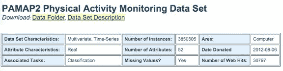

Figure 1: Properties of dataset as published in the Machine Learning Repository of the University of Irvine.

数据集代表了活动识别的完美示例:我们希望训练一个健壮的模型，该模型能够基于来自物理传感器的输入数据来预测执行的活动。

此外，数据集分布在多个文件中，每个文件代表单个主题的测量值，这是由多个数据源产生的数据的另一个真实方面，因此我们需要利用 Spark 从目录中读取并合并文件的能力来制作训练/测试数据集。

以下几行显示了数据示例。有几个重要的观察值得注意:

*   单个值由空格字符分隔
*   每行的第一个值代表时间戳，第二个值代表`activityId`

```scala
199.38 0 NaN 34.1875 1.54285 7.86975 5.88674 1.57679 7.65264 5.84959 -0.0855996 ... 1 0 0 0 
199.39 11 NaN 34.1875 1.46513 7.94554 5.80834 1.5336 7.81914 5.92477 -0.0907069 ...  1 0 0 0 
199.4 11 NaN 34.1875 1.41585 7.82933 5.5001 1.56628 8.03042 6.01488 -0.0399161 ...  1 0 0 0 
```

`activityId`用数值表示；因此，我们需要一个转换表来将一个标识转换为数据集给出的相应活动标签，如下所示:

| 1 说谎 | 2 次会议 |
| 3 站立 | 4 步行 |
| 5 跑步 | 6 骑自行车 |
| 7 北欧步行 | 9 看电视 |
| 10 计算机工作 | 11 汽车驾驶 |
| 12 级楼梯 | 13 个下行楼梯 |
| 16 真空清洁 | 17 熨烫 |
| 18 折叠洗衣房 | 19 房屋清洁 |
| 20 岁踢足球 | 24 跳绳 |
| 0 其他(短暂活动) |  |

示例线表示一个“其他活动”，然后两个测量值表示“汽车驾驶”。

第三列包含心率测量值，而其余的列表示来自三个不同惯性测量单位的数据:列 4-20 来自手传感器，列 21-37 包含来自胸部传感器的数据，最后列 38-54 保存脚踝传感器的测量值。每个传感器测量 17 个不同的值，包括温度、三维加速度、陀螺仪和磁力计数据以及方向。但是，方向列在此数据集中被标记为无效。

输入数据包包含两个不同的文件夹-协议和可选测量，可选测量包含来自执行一些额外活动的几个受试者的数据。在本章中，我们将只使用可选文件夹中的数据。

# 建模目标

在这个例子中，我们希望建立一个基于身体活动信息的模型，对看不见的数据进行分类，并用相应的身体活动对其进行注释。

# 挑战

对于传感器数据，有许多方法可以探索和建立模型。在本章中，我们主要关注分类；然而，有几个方面需要更深入的探索，尤其是以下方面:

*   训练数据表示事件的时间顺序流，但是我们不打算反映时间信息，而是将数据视为一条完整的信息
*   测试数据也是如此——单个活动事件是在执行活动期间捕获的事件流的一部分，使用实际上下文的知识对其进行分类会更容易

然而，目前，我们忽略了时间维度，并应用分类来探索传感器数据中表征所执行活动的可能模式。

# 机器学习工作流

为了构建初始模型，我们的工作流程包括几个步骤:

1.  数据加载和预处理，通常称为**提取-转换-加载** ( **ETL** )。
    *   负荷
    *   从语法上分析
    *   处理缺少的值
2.  将数据统一成算法所期望的形式。
    *   模型训练
    *   模型评估
    *   模型部署

# 启动Spark壳

第一步是准备 Spark 环境以执行分析。和前一章一样，我们要启动 Spark shell 但是，在这种情况下，命令行稍微复杂一些:

```scala
export SPARKLING_WATER_VERSION="2.1.12" 
export SPARK_PACKAGES=\ 
"ai.h2o:sparkling-water-core_2.11:${SPARKLING_WATER_VERSION},\ 
ai.h2o:sparkling-water-repl_2.11:${SPARKLING_WATER_VERSION},\ 
ai.h2o:sparkling-water-ml_2.11:${SPARKLING_WATER_VERSION},\ 
com.packtpub:mastering-ml-w-spark-utils:1.0.0" 

$SPARK_HOME/bin/spark-shell \ 
        --master 'local[*]' \ 
        --driver-memory 8g \ 
        --executor-memory 8g \ 
        --conf spark.executor.extraJavaOptions=-XX:MaxPermSize=384M\ 
        --conf spark.driver.extraJavaOptions=-XX:MaxPermSize=384M \ 
        --packages "$SPARK_PACKAGES" 
```

在这种情况下，我们需要更多的内存，因为我们要加载更大的数据。我们还需要增加 PermGen 的大小，PermGen 是 JVM 内存的一部分，用于存储关于加载的类的信息。这只有在您使用 Java 7 的情况下才有必要。

The memory settings for Spark jobs are an important part of job launching. In the simple `local[*]`-based scenario as we are using, there is no difference between the Spark driver and executor. However, for a larger job deployed on a standalone or YARN Spark cluster, the configuration of driver memory and executor memory needs to reflect the size of the data and performed transformations.
Moreover, as we discussed in the previous chapter, you can mitigate memory pressure by using a clever caching strategy and the right cache destination (for example, disk, off-heap memory).

# 探索数据

第一步涉及数据加载。在多个文件的情况下，SparkContext 的方法`wholeTextFiles`提供了我们需要的功能。它将每个文件作为单个记录读取，并将其作为键值对返回，其中键包含文件的位置，值保存文件内容。我们可以通过通配符模式`data/subject*`直接引用输入文件。这不仅在从本地文件系统加载文件时有用，而且对于从 HDFS 加载文件也特别重要。

```scala
val path = s"${sys.env.get("DATADIR").getOrElse("data")}/subject*"val dataFiles = sc.wholeTextFiles(path)println(s"Number of input files: ${dataFiles.count}")
```

由于名称不是输入数据的一部分，我们定义了一个变量来保存列名:

```scala
val allColumnNames = Array( 
  "timestamp", "activityId", "hr") ++ Array( 
  "hand", "chest", "ankle").flatMap(sensor => 
    Array( 
      "temp",  
      "accel1X", "accel1Y", "accel1Z", 
      "accel2X", "accel2Y", "accel2Z", 
      "gyroX", "gyroY", "gyroZ", 
      "magnetX", "magnetY", "magnetZ", 
      "orientX", "orientY", "orientZ"). 
    map(name => s"${sensor}_${name}")) 
```

我们只需定义前三个列名，然后为三个位置传感器中的每一个定义列名。此外，我们还准备了一个对建模无用的列索引列表，包括时间戳和方向数据:

```scala
val ignoredColumns =  
  Array(0,  
    3 + 13, 3 + 14, 3 + 15, 3 + 16, 
    20 + 13, 20 + 14, 20 + 15, 20 + 16, 
    37 + 13, 37 + 14, 37 + 15, 37 + 16) 
```

下一步是处理引用文件的内容，并创建一个`RDD`，我们将其用作数据探索和建模的输入。由于我们希望多次迭代数据并执行不同的转换，因此我们将数据缓存在内存中:

```scala
val rawData = dataFiles.flatMap { case (path, content) =>  
  content.split("\n") 
}.map { row =>  
  row.split(" ").map(_.trim). 
  zipWithIndex. 
  map(v => if (v.toUpperCase == "NAN") Double.NaN else v.toDouble). 
  collect {  
    case (cell, idx) if !ignoredColumns.contains(idx) => cell 
  } 
} 
rawData.cache() 

println(s"Number of rows: ${rawData.count}") 
```

输出如下:

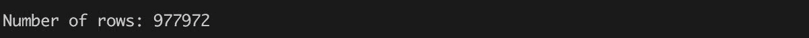

在这种情况下，对于每个键值对，我们提取其内容，并根据行边界将其拆分。然后我们根据文件分隔符转换每一行，文件分隔符是要素之间的一个空格。由于文件只包含数值和字符串值`NaN`作为缺失值的标记，我们可以简单地将所有值转换成 Java 的`Double`，留下`Double.NaN`作为缺失值的表示。

我们可以看到我们的输入文件有`977,972`行。在加载过程中，我们还跳过了时间戳列和在数据集描述中标记为无效的列(参见`ignoredColumns`数组)。

The RDD's interface follows the design principle of functional programming, the same principle which is adopted by the Scala programming language. This shared concept brings a uniform API for manipulating data structures; on the other hand, it is always good to know when an operation is invoked on a local object (array, list, sequence) and when it causes a distribution operation (`RDD`).

为了保持数据集视图的一致性，我们还需要根据前面步骤中准备的忽略列列表来过滤列名:

```scala
import org.apache.spark.utils.Tabulizer._val columnNames = allColumnNames.zipWithIndex.filter { case (_, idx) => !ignoredColumns.contains(idx) }.map { case (name, _) => name }println(s"Column names:${table(columnNames, 4, None)}") 
```

输出如下:

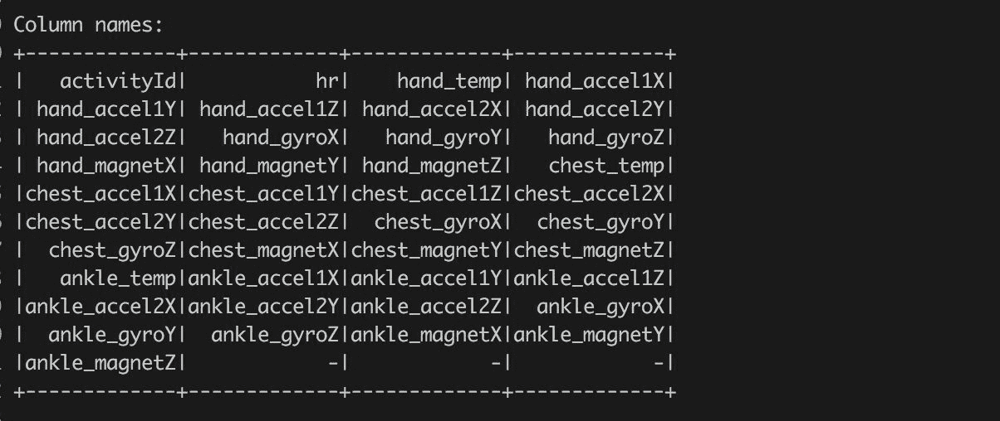

It is always good to get rid of data which is useless for modeling. The motivation is to mitigate memory pressure during computation and modeling. For example, good targets for data removal are columns which contain random IDs, timestamps, constant columns, or columns which are already represented in the dataset.
From an intuitive point of view also, modelling ID terms, for example, doesn't make a lot of sense given the nature of the field. Feature selection is a hugely important topic and one that we will spend a great deal of time on later in the book.

现在让我们看看数据集中各个活动的分布。我们将使用与前一章相同的技巧；然而，我们也希望看到活动的实际名称，而不是纯粹的基于数字的表示。因此，首先我们定义描述活动编号和名称之间关系的映射:

```scala
val activities = Map( 
  1 -> "lying", 2 -> "sitting", 3 -> "standing", 4 -> "walking",  
  5 -> "running", 6 -> "cycling", 7 -> "Nordic walking",  
  9 -> "watching TV", 10 -> "computer work", 11 -> "car driving", 
 12 -> "ascending stairs", 13 -> "descending stairs",  
 16 -> "vacuum cleaning", 17 -> "ironing", 
 18 -> "folding laundry", 19 -> "house cleaning", 
 20 -> "playing soccer", 24 -> "rope jumping", 0 -> "other") 

```

然后我们借助 Spark 方法`reduceByKey`计算数据中个人活动的数量:

```scala
val dataActivityId = rawData.map(l => l(0).toInt)val activityIdCounts = dataActivityId.map(n => (n, 1)).reduceByKey(_ + _)val activityCounts = activityIdCounts.collect.sortBy { case (activityId, count) =>-count}.map { case (activityId, count) =>(activitiesMap(activityId), count)}println(s"Activities distribution:${table({activityCounts})}")
```

该命令计算单个活动的计数，将活动编号转换为其标签，并根据计数按降序对结果进行排序:

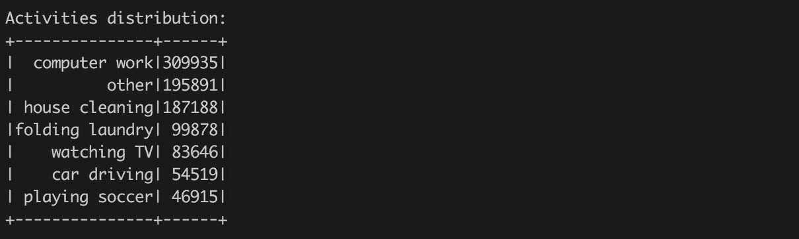

或者根据活动频率可视化，如图 2*所示。*


Figure 2: Frequencies of different activities in input data. It is always good to think about the order of the individual transformations which are applied on the data. In the preceding example, we applied the `sortBy` transformation after collecting all data locally with help of the Spark `collect` action. In this context, it makes perfect sense since we know that the result of the `collect` action is reasonably small (we have only 22 activity labels) and `sortBy` is applied on the local collection. On the other hand, putting `sortBy` before the `collect` action would force invocation of Spark RDD's transformation and scheduling sort as Spark distributed task.

# 缺失数据

数据描述提到，用于活动跟踪的传感器并不完全可靠，结果包含缺失的数据。我们需要更详细地探索它们，看看这个事实如何影响我们的建模策略。

第一个问题是我们的数据集中有多少缺失值。从数据描述中我们知道，所有缺失的值都用字符串`NaN`标记(即不是数字)，现在在`RDD` `rawData`中表示为`Double.NaN`。在下一个代码片段中，我们计算每行缺失值的数量以及数据集中缺失值的总数:

```scala
val nanCountPerRow = rawData.map { row => 
  row.foldLeft(0) { case (acc, v) =>  
    acc + (if (v.isNaN) 1 else 0)  
  } 
} 
val nanTotalCount = nanCount.sum 

val ncols = rawData.take(1)(0).length 
val nrows = rawData.count 

val nanRatio = 100.0 * nanTotalCount / (ncols * nrows)  

println(f"""|NaN count = ${nanTotalCount}%.0f 
            |NaN ratio = ${nanRatio}%.2f %%""".stripMargin) 
```

输出如下:

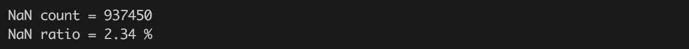

对，现在我们对数据中缺失值的数量有了全面的了解。但是我们不知道缺失值是如何分布的。它们是否均匀地分布在整个数据集上？还是有包含更多缺失值的行/列？在下文中，我们将试图找到这些问题的答案。

A common mistake is to compare a numeric value and `Double.NaN` with comparison operators. For example, the `if (v == Double.NaN) { ... }` is wrong, since the Java specification says:
"`NaN` is unordered: (1) The numerical comparison operators `<`,  `<=`, `>`, and `>=` return `false` if either or both operands are `NaN`, (2) The equality operator `==` returns `false` if either operand is `NaN`."
Hence, `Double.NaN == Double.NaN` returns always `false`. The right way to compare numeric values with `Double.NaN` is to use the method `isNaN`: `if (v.isNaN) { ... }` (or use the corresponding static method `java.lang.Double.isNaN`).

首先，考虑行，我们已经在上一步中计算了每行缺失值的数量。对它们进行排序并获取唯一值，可以让我们了解缺失值如何影响行:

```scala
val nanRowDistribution = nanCountPerRow.map( count => (count, 1)).reduceByKey(_ + _).sortBy(-_._1).collectprintln(s"${table(Seq("#NaN","#Rows"), nanRowDistribution, Map.empty[Int, String])}") 
```

输出如下:

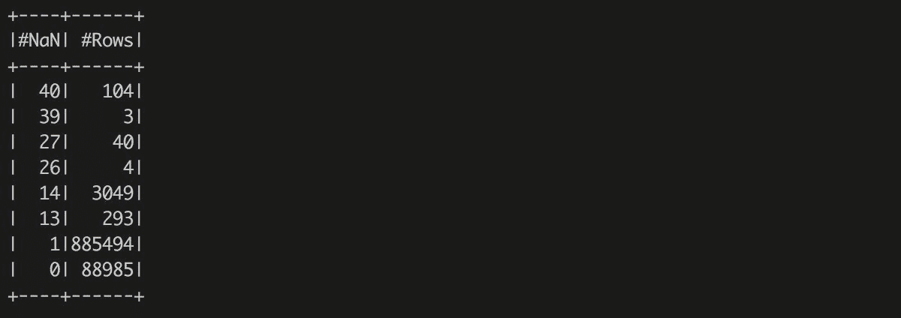

现在我们可以看到大多数行都包含一个缺失的值。但是，有很多包含`13`或`14`缺失值的行，甚至是包含`27` *NaNs* 的`40`行，以及包含 30 个以上缺失值的 107 行(`104`行包含`40`缺失值，`3`行包含`39`缺失值)。考虑到数据集包含 41 列，这意味着有 107 行是无用的(大部分值缺失)，剩下 3386 行至少有两个缺失值需要注意，`885,494`行只有一个缺失值。我们现在可以更详细地查看这些行。我们选择缺失值超过给定阈值的所有行，例如`26`。我们还收集行的索引(它是一个从零开始的索引！):

```scala
val nanRowThreshold = 26 
val badRows = nanCountPerRow.zipWithIndex.zip(rawData).filter(_._1._1 > nanRowThreshold).sortBy(-_._1._1) 
println(s"Bad rows (#NaN, Row Idx, Row):\n${badRows.collect.map(x => (x._1, x._2.mkString(","))).mkString("\n")}") 
```

现在我们确切地知道哪些行没有用。我们已经观察到有 107 个不包含任何有用信息的坏行。此外，我们可以看到具有`27`缺失值的线在代表手和脚踝惯性测量单元传感器的地方具有它们。

最后，大部分行都分配了`activityId` 10、19 或 20，代表`computer work`、`house cleaning`和`playing soccer`活动，它们是数据集中出现频率最高的类。这可以让我们得出这样的理论，即“坏”线是受试者明确拒绝测量设备而产生的。此外，我们还可以看到每个错误行的索引，并在输入数据集中验证它们。现在，我们将离开坏行，专注于列。

关于列，我们可以问同样的问题——是否有任何列包含更大数量的缺失值？我们能去掉这样的柱子吗？我们可以从收集每列缺失值的数量开始:

```scala
val nanCountPerColumn = rawData.map { row =>row.map(v => if (v.isNaN) 1 else 0)}.reduce((v1, v2) => v1.indices.map(i => v1(i) + v2(i)).toArray)println(s"""Number of missing values per column:^${table(columnNames.zip(nanCountPerColumn).map(t => (t._1, t._2, "%.2f%%".format(100.0 * t._2 / nrows))).sortBy(-_._2))}^""".stripMargin('^')) 
```

输出如下:


结果显示，代表受试者心率的第二列(不要忘记我们已经在数据加载过程中删除了无效列)包含大量缺失值。超过 90%的数值被`NaN`标记，这可能是由实验的测量过程引起的(受试者可能在日常活动中没有佩戴心率监测器，而只是在练习运动时)。

其余的列包含零星的缺失值。

另一个重要的观察结果是，包含`activityId`的第一列不包含任何缺失的值——这是一个好消息，意味着所有的观察结果都得到了适当的注释，我们不需要删除其中的任何一个(例如，如果没有训练目标，我们就不能训练一个模型)。

The RDD's `reduce` method represents action. That means it forces evaluation of the `RDD` and the result of the reduce is a single value and not `RDD`. Do not confuse it with `reduceByKey` which is an `RDD` operation and returns a new `RDD` of key-value pairs.

下一步是决定如何处理丢失的数据。有很多策略可以采用；然而，我们需要保留数据的意义。

我们可以简单地删除所有包含缺失数据的行或列——事实上这是一种非常常见的方法！对于被太多缺失值污染的行来说，这是很有意义的，但是在这种情况下，这不是一个好的全局策略，因为我们观察到缺失值分布在几乎所有的列和行上。因此，我们需要一个更好的策略来处理丢失的值。

A summary of missing values sources and imputation methods is available, for example, in the book *Data Analysis Using Regression and Mutlilevel/Hierarchical Models* by A. Gelman and J. Hill ([http://www.stat.columbia.edu/~gelman/arm/missing.pdf](http://www.stat.columbia.edu/~gelman/arm/missing.pdf)) or in the presentation [https://www.amstat.org/sections/srms/webinarfiles/ModernMethodWebinarMay2012.pdf](https://www.amstat.org/sections/srms/webinarfiles/ModernMethodWebinarMay2012.pdf) or [https://www.utexas.edu/cola/prc/_files/cs/Missing-Data.pdf](https://www.utexas.edu/cola/prc/_files/cs/Missing-Data.pdf)[.](http://www.stat.columbia.edu/~gelman/arm/missing.pdf)

首先考虑心率栏，我们不能放弃它，因为较高的心率和练习活动之间有明显的联系。然而，我们仍然可以用一个合理的常数来填充缺失的值。在心率的背景下，用列值的平均值替换缺失值——这种技术有时被称为*缺失值的平均值计算*——可能很有意义。我们可以用下面几行代码来计算:

```scala
val heartRateColumn = rawData. 
  map(row => row(1)). 
  filter(_.isNaN). 
  map(_.toInt) 

val heartRateValues = heartRateColumn.collect 
val meanHeartRate = heartRateValues.sum / heartRateValues.count 
scala.util.Sorting.quickSort(heartRateValues) 
val medianHeartRate = heartRateValues(heartRateValues.length / 2) 

println(s"Mean heart rate: ${meanHeartRate}") 
println(s"Median heart rate: ${medianHeartRate}") 
```

输出如下:


我们可以看到`mean heart rate`是一个相当高的数值，反映了心率测量主要与运动活动相关的事实(有读者可以验证)。但是，例如，考虑到活动`watching TV`，超过 90 的值略高于期望值，因为平均静止率在 60 到 100 之间(基于维基百科)。

因此，在这种情况下，我们可以用平均静息心率(80)替换丢失的心率值，或者我们可以取心率的计算平均值。稍后，我们将估算计算的平均值，并比较或组合结果(这称为多重估算法)。或者我们可以添加一列，标记一行缺少的值(例如，参见[https://www.utexas.edu/cola/prc/_files/cs/Missing-Data.pdf](https://www.utexas.edu/cola/prc/_files/cs/Missing-Data.pdf))。

下一步是替换其余列中缺失的值。我们应该执行与心率列相同的分析，看看丢失的数据中是否有模式，或者它们是否只是随机丢失的。例如，我们可以探索缺失值和我们的预测目标(在本例中为`activityId`)之间的依赖关系。因此，我们再次收集每列的一些缺失值；但是，现在我们也记住了`activityId`的每个缺失值:

```scala
def inc[K,V](l: Seq[(K, V)], v: (K, V)) // (3)(implicit num: Numeric[V]): Seq[(K,V)] =if (l.exists(_._1 == v._1)) l.map(e => e match {case (v._1, n) => (v._1, num.plus(n, v._2))case t => t}) else l ++ Seq(v)val distribTemplate = activityIdCounts.collect.map { case (id, _) => (id, 0) }.toSeqval nanColumnDistribV1 = rawData.map { row => // (1)val activityId = row(0).toIntrow.drop(1).map { v =>if (v.isNaN) inc(distribTemplate, (activityId, 1)) else distribTemplate} // Tip: Make sure that we are returning same type}.reduce { (v1, v2) =>  // (2)v1.indices.map(idx => v1(idx).foldLeft(v2(idx))(inc)).toArray}println(s"""^NaN Column x Response distribution V1:^${table(Seq(distribTemplate.map(v => activitiesMap(v._1)))++ columnNames.drop(1).zip(nanColumnDistribV1).map(v => Seq(v._1) ++ v._2.map(_._2)), true)}""".stripMargin('^')) 

```

输出如下:

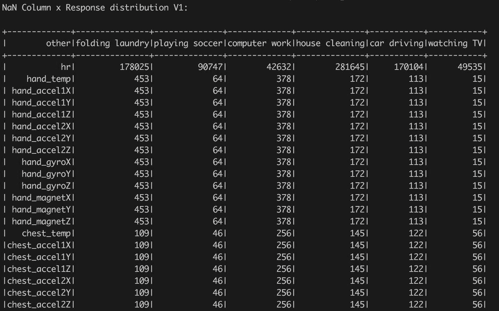

前面的代码稍微复杂一些，值得解释。调用`(1)`将一行中的每个值转换为一系列`(K, V)`对，其中`K`表示存储在该行中的`activityId`，如果相应的列包含缺失值，`V`为`1`，否则为`0`。然后，reduce 方法`(2)`递归地将序列表示的行值转换为最终结果，其中每一列都关联了由一系列`(K,V)`对表示的分布，其中`K`是`activityId`，`V`用`activityId`表示行中缺失值的数量。这个方法很简单，但是使用了一个非常复杂的函数`inc` `(3)`。此外，这种简单的解决方案内存效率非常低，因为对于每一列，我们都会复制`activityId`的信息。

因此，我们可以通过稍微改变结果表示来重申简单的解决方案，方法是不计算每列的分布，而是计算所有列，即每`activityId`的缺失值计数:

```scala
val nanColumnDistribV2 = rawData.map(row => {val activityId = row(0).toInt(activityId, row.drop(1).map(v => if (v.isNaN) 1 else 0))}).reduceByKey( (v1, v2) =>v1.indices.map(idx => v1(idx) + v2(idx)).toArray).map { case (activityId, d) =>(activitiesMap(activityId), d)}.collectprintln(s"""^NaN Column x Response distribution V2:^${table(Seq(columnNames.toSeq) ++ nanColumnDistribV2.map(v => Seq(v._1) ++ v._2), true)}""".stripMargin('^'))
```

在这种情况下，结果是键-值对的数组，其中键是活动名称，值包含表示个别列中缺失值的分布。简单地通过运行两个样本，我们可以观察到第一个样本比第二个样本花费更多的时间。此外，第一个有更高的内存需求，而且复杂得多。

最后，我们可以将结果可视化为热图，其中 *x* 轴对应于列， *y* 轴表示活动，如图 3 所示。这种图形表示为我们提供了缺失值如何与响应列相关联的全面概述:


Figure 3: Heatmap showing number of missing values in each column grouped by activity.

生成的热图很好地显示了缺失值的相关性。我们可以看到丢失的值与传感器有关。如果传感器不可用或出现故障，则所有测量值都不可用。例如，这对于脚踝传感器和`playing soccer`，其他活动是可见的。另一方面，活动`watching TV`不指示任何连接到传感器的缺失值模式。

此外，丢失的数据和活动之间没有其他直接可见的联系。因此，现在，我们可以决定用`0.0`来填充缺失值，以表示缺失的传感器提供默认值。但是，我们的目标是以后灵活尝试不同的插补策略(例如，用相同的`activityId`插补观察平均值)。

# 缺失值分析摘要

我们现在可以总结所有我们了解到的缺失值的事实:

*   有 107 行是无用的，需要过滤掉
*   有 44 行缺少`26`或`27`值。这些行似乎没有用，所以我们要把它们过滤掉。
*   心率列包含大部分缺失值。因为我们期望该栏包含有助于区分不同体育活动的重要信息，所以我们不会忽略该栏。然而，我们将根据不同的策略估算缺失值:
    *   基于医学研究的平均静息心率
    *   `mean heart rate`根据可用数据计算
    *   其余列中的缺失值有一种模式——缺失值与传感器严格相关。我们用值`0.0`替换所有这些缺失的值。

# 数据统一

这种探索性分析为我们提供了一个关于数据形状的概述，以及我们需要执行的处理缺失值的操作。然而，我们仍然需要将数据转换成 Spark 算法所期望的形式。这包括:

*   处理缺失值
*   处理分类值

# 缺少值

缺失值处理步骤很容易，因为我们已经执行了缺失值探索，并在上一节中总结了所需的转换。下面的步骤将实现它们。

首先，我们定义一个估算值列表——对于每一列，我们分配一个单独的`Double`值:

```scala
val imputedValues = columnNames.map { 
  _ match { 
    case "hr" => 60.0 
    case _ => 0.0 
  } 
} 
```

以及一个允许我们将值注入数据集的函数:

```scala
import org.apache.spark.rdd.RDD 
def imputeNaN( 
  data: RDD[Array[Double]],  
  values: Array[Double]): RDD[Array[Double]] = { 
    data.map { row => 
      row.indices.map { i => 
        if (row(i).isNaN) values(i) 
        else row(i) 
      }.toArray 
    } 
} 
```

定义的函数接受一个Spark`RDD`，其中每行表示为一个`Double`数字数组，以及一个参数，该参数包含替换每列缺失值的值。

在下一步中，我们定义一个行过滤器——一种删除所有缺失值超过给定阈值的行的方法。在这种情况下，我们可以很容易地重用已经计算好的值`nanCountPerRow`:

```scala
def filterBadRows( 
  rdd: RDD[Array[Double]], 
  nanCountPerRow: RDD[Int], 
  nanThreshold: Int): RDD[Array[Double]] = { 
    rdd.zip(nanCountPerRow).filter { case (row, nanCount) => 
      nanCount > nanThreshold 
  }.map { case (row, _) => 
        row 
  } 
} 
```

Please notice that we parameterize defined transformations. It is good practice to keep code flexible enough to permit further experimentation with parameters. On the other hand, it is good to avoid building a complex framework. The rule of thumb is to parameterize functionality which we would like to use in different contexts or we need to have a freedom in configuring code constants.

# 分类价值

Spark 算法可以处理不同形式的分类特征，但是它们需要被转换成算法所期望的形式。例如，决策树可以直接处理分类特征；另一方面，线性回归或神经网络需要将分类值扩展为二进制列。

在本例中，好消息是我们数据集中的所有输入要素都是连续的。但是，目标要素- `activityId` -代表多类要素。Spark MLlib 分类指南(https://Spark . Apache . org/docs/latest/MLlib-linear-methods . html #分类)说:

"The training data set is represented by an RDD of LabeledPoint in MLlib, where labels are class indices starting from zero."

但是我们的数据集包含不同数量的活动——参见计算变量`activityIdCounts`。因此，我们需要通过定义从`activityId`到`activityIdx`的地图，将它们转换成 MLlib 所期望的形式:

```scala
val activityId2Idx = activityIdCounts. 
  map(_._1). 
  collect. 
  zipWithIndex. 
  toMap 
```

# 最终转化

最后，我们可以将所有定义的功能组合在一起，并为模型构建准备数据。首先借助`filterBadRows`对`rawData` `RDD`进行过滤，去除所有不良行，然后通过`imputeNaN`方法对结果进行处理，在缺失值的位置注入给定值:

```scala
val processedRawData = imputeNaN( 
  filterBadRows(rawData, nanCountPerRow, nanThreshold = 26), 
  imputedValues) 
```

最后，通过至少计算行数来验证我们调用了正确的转换:

```scala
println(s"Number of rows before/after: ${rawData.count} / ${ processedRawData.count}") 
```

输出如下:


我们可以看到，我们过滤出了 151 行，这对应于我们之前的观察。

Understanding data is the key point of data science. It involves also understanding missing data. Never skip this stage since it can lead to biased models giving too good results. And, as we continuously point out, not understanding your data will lead you to ask poor questions which ultimately results in lackluster answers.

# 用随机森林建模数据

随机森林是一种算法，可以用于不同的问题-二项式，正如我们在前面一章中所展示的，回归，或多类分类。随机森林的美妙之处在于它将多个以决策树为代表的弱学习者组合成一个集成。

此外，为了减少单个决策树的方差，算法使用了 bagging (Bootstrap aggregation)的概念。每个决策树都是在随机选择和替换产生的数据子集上训练的。

Do not confuse bagging with boosting. Boosting incrementally builds an ensemble by training each new model to emphasize observations that previous model misclassified. Typically, after a weak model is added into the ensemble, the data is reweighted, observations that are misclassified gain weight, and vice versa. Furthermore, bagging can be invoked in parallel while boosting is a sequential process. Nevertheless, the goal of boosting is the same as of bagging - combine predictions of several weak models in order to improve generalization and robustness over a single model.
An example of a boosting method is a **Gradient Boosting Machine** (**GBM**) which uses the boosting method to combine weak models (decision trees) into an ensemble; however, it generalizes the approach by allowing the use of an arbitrary loss function: instead of trying to correct the previous weak model misclassified observations, the GBM allows you to minimize a specified loss function (for example, mean squared error for regression). There are different variations of GBM - for example, stochastic GBM which combines boosting with bagging. The regular GBM and also stochastic GBM are available in H2O's machine learning toolbox. Furthermore, it is important to mention that GBM (as well as RandomForest) is an algorithm which builds pretty good models without extensive tuning.
More information about GBM is available in original paper of J.H. Friedman: *Greedy Function Approximation: A Gradient Boosting Machine* [http://www-stat.stanford.edu/~jhf/ftp/trebst.pdf](http://www-stat.stanford.edu/~jhf/ftp/trebst.pdf).

此外，RandomForest 采用所谓的“特征打包”——在构建决策树时，它选择特征的随机子集来进行拆分决策。其动机是建立一个弱的学习者并增强泛化能力——例如，如果一个特征是给定目标变量的强预测器，它将被大多数树选择，从而产生高度相似的树。然而，通过随机选择特征，该算法可以避免强预测器，并构建找到更细粒度数据结构的树。

RandomForest 还有助于轻松选择最具预测性的特征，因为它允许以不同的方式计算可变重要性。例如，计算所有树的整体特征杂质增益可以很好地估计特征的强度。

从实现的角度来看，RandomForest 可以很容易地并行化，因为*构建树*的步骤是独立的。另一方面，分发 RandomForest 计算稍微困难一些，因为每棵树都需要探索几乎全部的数据集。

RandomForest 的缺点是复杂的可解释性。由此产生的系综很难探索和解释单棵树之间的相互作用。然而，如果我们需要获得一个没有高级参数调整的好模型，它仍然是最好使用的模型之一。

A good source of information about RandomForest is the original paper of Leo Breiman and Adele Cutler available, for example, here: [https://www.stat.berkeley.edu/~breiman/RandomForests/cc_home.htm](https://www.stat.berkeley.edu/~breiman/RandomForests/cc_home.htm).

# 使用 Spark RandomForest 构建分类模型

在前一节中，我们探讨了数据，并将其统一到一个没有缺失值的表单中。我们仍然需要将数据转换成 Spark MLlib 所期望的形式。如前一章所述，它涉及到`LabeledPoints`的`RDD`的创建。每个`LabeledPoint`由定义输入特征的标签和向量定义。该标签用作模型构建者的训练目标，并引用分类变量的索引(参见准备好的转换`activityId2Idx`):

```scala
import org.apache.spark.mllib 
import org.apache.spark.mllib.regression.LabeledPoint 
import org.apache.spark.mllib.linalg.Vectors 
import org.apache.spark.mllib.tree.RandomForest 
import org.apache.spark.mllib.util.MLUtils 

val data = processedRawData.map { r =>  
    val activityId = r(0) 
    val activityIdx = activityId2Idx(activityId) 
    val features = r.drop(1) 
    LabeledPoint(activityIdx, Vectors.dense(features)) 
} 

```

下一步是为培训和模型验证准备数据。我们只需将数据分成两部分:80%用于培训，其余 20%用于验证:

```scala
val splits = data.randomSplit(Array(0.8, 0.2)) 
val (trainingData, testData) =  
    (splits(0), splits(1)) 
```

在这一步之后，我们准备好调用工作流的建模部分。构建 Spark RandomForest 模型的策略与我们在上一章中通过调用对象`RandomForest`上的静态方法`trainClassifier`所展示的 GBM 相同:

```scala
import org.apache.spark.mllib.tree.configuration._ 
import org.apache.spark.mllib.tree.impurity._ 
val rfStrategy = new Strategy( 
  algo = Algo.Classification, 
  impurity = Entropy, 
  maxDepth = 10, 
  maxBins = 20, 
  numClasses = activityId2Idx.size, 
  categoricalFeaturesInfo = Map[Int, Int](), 
  subsamplingRate = 0.68) 

val rfModel = RandomForest.trainClassifier( 
    input = trainingData,  
    strategy = rfStrategy, 
    numTrees = 50,  
    featureSubsetStrategy = "auto",  
    seed = 42) 
```

在本例中，参数分为两组:

*   定义构建决策树的公共参数的策略
*   随机森林特定参数

策略参数列表与上一章中讨论的决策树算法的参数列表重叠:

*   `input`:参考`LabeledPoints`的`RDD`代表的训练数据。
*   `numClasses`:输出类别数。在这种情况下，我们只对包含在输入数据中的类建模。
*   `categoricalFeaturesInfo`:分类特征及其关系图。我们在输入数据中没有分类特征，这就是我们传递空地图的原因。
*   `impurity`:用于树节点分裂的杂质度量。
*   `subsamplingRate`:用于构建单个决策树的训练数据的一部分。
*   `maxDepth`:单棵树的最大深度。深树倾向于对输入数据进行编码和过度编码。另一方面，随机森林中的过度拟合是通过将多棵树组装在一起来平衡的。此外，更大的树意味着更长的训练时间和更高的内存占用。
*   `maxBins`:连续特征转化为有序离散化特征，最多有`maxBins`个可能值。离散化是在每个节点拆分之前完成的。

特定于随机森林的参数如下:

*   `numTrees`:生成的森林中的树木数量。增加树的数量会降低模型方差。
*   `featureSubsetStrategy`:指定一种方法，该方法产生多少个特征被选择用于训练单个树。例如:“sqrt”通常用于分类，而“onethird”用于回归问题。可用值见`RandomForest.supportedFeatureSubsetStrategies`的值。
*   `seed`:随机生成器初始化的种子，因为随机森林依赖于特征和行的随机选择。

参数`numTrees`和`maxDepth`通常被称为停止标准。Spark 还提供了额外的参数来停止树木生长并生成细粒度的树木:

*   `minInstancesPerNode`:如果节点提供的左节点或右节点包含的观测值少于该参数指定的值，则该节点不再被拆分。默认值为 1，但通常对于回归问题或大树，该值应该更高。
*   `minInfoGain`:分裂必须获得的最小信息增益。默认值为 0.0。

此外，Spark RandomForest 接受影响执行性能的参数(参见 Spark 文档)。

RandomForest is by definition an algorithm which depends on randomization. However, having non-deterministic runs is not the right behavior if you are trying to reproduce results or test corner cases. In this case, the seed parameter provides a way of fixing execution and providing deterministic results.

This is a common practice for non-deterministic algorithms; however, it is not enough if the algorithm is parallelized and its result depends on thread scheduling. In this case, ad-hoc methods need to be adopted (for example, limit parallelization by having only one computation thread, limit parallelization by limiting number of input partitions, or switching task scheduler to provide a fix schedule).

# 分类模型评估

现在，当我们有一个模型时，我们需要评估模型的质量，以决定模型是否足够好来满足我们的需求。请记住，与模型相关的所有质量指标都需要在您的特定环境中进行考虑，并根据您的目标进行评估(例如销售增长、欺诈检测等)。

# Spark 模型度量

首先，使用 Spark API 提供的嵌入式模型度量。我们将使用与前一章相同的方法。我们首先定义一种方法来提取给定模型和数据集的模型度量:

```scala
import org.apache.spark.mllib.evaluation._ 
import org.apache.spark.mllib.tree.model._ 
def getMetrics(model: RandomForestModel, data: RDD[LabeledPoint]): 
    MulticlassMetrics = { 
        val predictionsAndLabels = data.map(example => 
            (model.predict(example.features), example.label) 
        ) 
        new MulticlassMetrics(predictionsAndLabels) 
} 
```

那么我们可以直接计算 Spark `MulticlassMetrics`:

```scala
val rfModelMetrics = getMetrics(rfModel, testData) 
```

先来看看有趣的分类模型指标`Confusion matrix`。它由类型`org.apache.spark.mllib.linalg.Matrix`表示，允许您执行代数运算:

```scala
println(s"""|Confusion matrix: 
  |${rfModelMetrics.confusionMatrix}""".stripMargin) 
```

输出如下:


在这种情况下，Spark 在列中打印预测的类。预测的类别存储在对象`rfModelMetrics`的字段`labels`中。但是，该字段只包含翻译后的索引(参见创建的变量`activityId2Idx`)。然而，我们可以轻松地创建一个函数，将标签索引转换为实际的标签字符串:

```scala
def idx2Activity(idx: Double): String =  
  activityId2Idx. 
  find(e => e._2 == idx.asInstanceOf[Int]). 
  map(e => activitiesMap(e._1)). 
  getOrElse("UNKNOWN") 

val rfCMLabels = rfModelMetrics.labels.map(idx2Activity(_)) 
println(s"""|Labels: 
  |${rfCMLabels.mkString(", ")}""".stripMargin) 
```

输出如下:

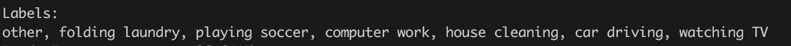

例如，我们可以看到其他活动与其他活动一起被错误预测了很多次——对于`36455`情况是正确预测的；然而，对于`1261`情况，模型预测了`other`活动，但实际活动是`house cleaning`。另一方面，模型预测的是活动`folding laundry`而不是`other`活动。

您可以直接看到，我们可以基于位于`Confusion matrix`对角线上的正确预测活动直接计算整体预测精度:

```scala
val rfCM = rfModelMetrics.confusionMatrix 
val rfCMTotal = rfCM.toArray.sum 
val rfAccuracy = (0 until rfCM.numCols).map(i => rfCM(i,i)).sum / rfCMTotal 
println(f"RandomForest accuracy = ${rfAccuracy*100}%.2f %%") 
```

输出如下:

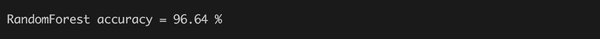

然而，在类不是均匀分布的情况下(例如，大多数实例由单个类表示)，整体准确性可能会产生误导。在这种情况下，总的准确性可能会令人困惑，因为模型仅仅预测一个优势类就能提供很高的准确性。因此，我们可以更详细地观察我们的预测，并探索每个类的准确性。然而，首先我们看实际标签和预测标签的分布，看看是否有优势类`(1)`和`(2)`如果模型保留了类的输入分布并且不偏向预测单个类:

```scala
import org.apache.spark.mllib.linalg.Matrixdef colSum(m: Matrix, colIdx: Int) = (0 until m.numRows).map(m(_, colIdx)).sumdef rowSum(m: Matrix, rowIdx: Int) = (0 until m.numCols).map(m(rowIdx, _)).sumval rfCMActDist = (0 until rfCM.numRows).map(rowSum(rfCM, _)/rfCMTotal)val rfCMPredDist = (0 until rfCM.numCols).map(colSum(rfCM, _)/rfCMTotal)println(s"""^Class distribution^${table(Seq("Class", "Actual", "Predicted"),rfCMLabels.zip(rfCMActDist.zip(rfCMPredDist)).map(p => (p._1, p._2._1, p._2._2)),Map(1 -> "%.2f", 2 -> "%.2f"))}""".stripMargin('^')) 
```

输出如下:

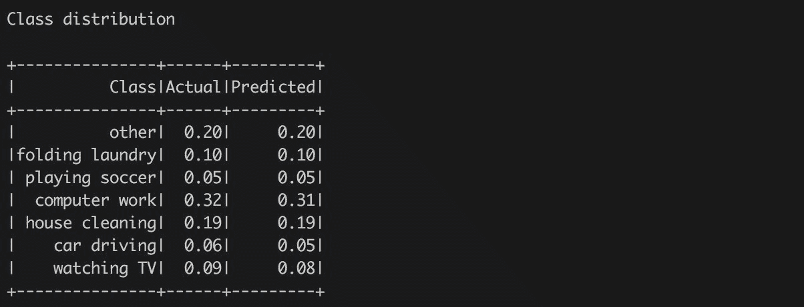

我们很容易看出，没有统治阶级；然而，这些类并不是均匀分布的。还值得注意的是，该模型保留了实际类的分布，没有倾向于单一类。这正好印证了我们基于`Confusion matrix`的观察。

最后，我们可以观察单个类别，并计算精度(又称正预测值)、召回率(或所谓的敏感度)和`F-1`分数。提醒一下上一章的定义:精度是给定类正确预测的一小部分(即 TP/TP+TF)，而召回定义为所有正确预测的类实例的一小部分(即 TP/TP+FN)。最后，`F-1`分数将两者结合起来，因为它被计算为精确度和召回率的加权调和平均值。借助我们已经定义的函数，我们可以轻松计算它们:

```scala
def rfPrecision(m: Matrix, feature: Int) = m(feature, feature) / colSum(m, feature)def rfRecall(m: Matrix, feature: Int) = m(feature, feature) / rowSum(m, feature)def rfF1(m: Matrix, feature: Int) = 2 * rfPrecision(m, feature) * rfRecall(m, feature) / (rfPrecision(m, feature) + rfRecall(m, feature))val rfPerClassSummary = rfCMLabels.indices.map { i =>(rfCMLabels(i), rfRecall(rfCM, i), rfPrecision(rfCM, i), rfF1(rfCM, i))}println(s"""^Per class summary:^${table(Seq("Label", "Recall", "Precision", "F-1"),rfPerClassSummary,Map(1 -> "%.4f", 2 -> "%.4f", 3 -> "%.4f"))}""".stripMargin('^')) 
```

输出如下:


在我们的例子中，我们处理了一个相当好的模型，因为大多数值接近值 1.0。这意味着该模型对于每个输入类别都表现良好——产生少量的假阳性(精度)和假阴性(召回)。

Spark API 的好特性是它已经提供了计算我们手动计算的所有三个度量的方法。我们可以很容易的用标签的索引调用方法`precision`、`recall`、`fMeasure`得到相同的值。然而，在Spark的情况下，`Confusion matrix`是为每个调用收集的，因此增加了整体计算时间。

在我们的例子中，我们使用已经计算好的`Confusion matrix`并直接得到相同的结果。读者可以验证以下代码给出的数字与`rfPerClassSummary`中存储的数字相同:

```scala
val rfPerClassSummary2 = rfCMLabels.indices.map { i =>  
    (rfCMLabels(i), rfModelMetrics.recall(i), rfModelMetrics.precision(i), rfModelMetrics.fMeasure(i))  
} 
```

通过对每个类进行统计，我们可以简单地通过计算每个计算指标的平均值来计算宏观平均指标:

```scala
val rfMacroRecall = rfCMLabels.indices.map(i => rfRecall(rfCM, i)).sum/rfCMLabels.size 
val rfMacroPrecision = rfCMLabels.indices.map(i => rfPrecision(rfCM, i)).sum/rfCMLabels.size 
val rfMacroF1 = rfCMLabels.indices.map(i => rfF1(rfCM, i)).sum/rfCMLabels.size 

println(f"""|Macro statistics 
  |Recall, Precision, F-1 
  |${rfMacroRecall}%.4f, ${rfMacroPrecision}%.4f, ${rfMacroF1}%.4f""".stripMargin) 
```

输出如下:

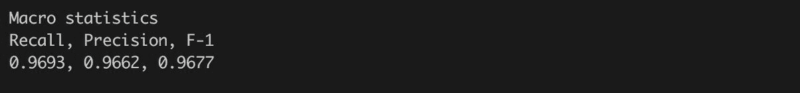

`Macro`统计给了我们所有特征统计的总体特征。我们可以看到期望值接近 1.0，因为我们的模型在测试数据上表现得相当好。

此外，Spark ModelMetrics API 还提供了加权精度、召回率和`F-1`分数，如果我们处理不平衡的类，这些分数主要是有用的:

```scala
println(f"""|Weighted statistics 
  |Recall, Precision, F-1 
  |${rfModelMetrics.weightedRecall}%.4f, ${rfModelMetrics.weightedPrecision}%.4f, ${rfModelMetrics.weightedFMeasure}%.4f 
  |""".stripMargin) 
```

输出如下:

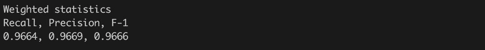

最后，我们将看到另一种计算模型度量的方法，这种方法在类分布不均匀的情况下也很有用。该方法被称为一对全，它一次提供一个类的分类器性能。这意味着我们将为每个输出类计算一个`Confusion matrix`-我们可以将这种方法视为将分类器视为二进制分类器，预测一个类为正例，其他任何类为负例:

```scala
import org.apache.spark.mllib.linalg.Matrices 
val rfOneVsAll = rfCMLabels.indices.map { i => 
    val icm = rfCM(i,i) 
    val irowSum = rowSum(rfCM, i) 
    val icolSum = colSum(rfCM, i) 
    Matrices.dense(2,2,  
      Array( 
        icm, irowSum - icm, 
        icolSum - icm, rfCMTotal - irowSum - icolSum + icm)) 
  } 
println(rfCMLabels.indices.map(i => s"${rfCMLabels(i)}\n${rfOneVsAll(i)}").mkString("\n")) 
```

这将为我们提供每个类相对于由简单二进制`Confusion matrix`表示的其他类的性能。我们可以对所有矩阵求和，得到一个`Confusion matrix`来计算每类的平均精度和微平均度量:

```scala
val rfOneVsAllCM = rfOneVsAll.foldLeft(Matrices.zeros(2,2))((acc, m) => 
  Matrices.dense(2, 2,  
    Array(acc(0, 0) + m(0, 0),  
          acc(1, 0) + m(1, 0), 
          acc(0, 1) + m(0, 1), 
          acc(1, 1) + m(1, 1))) 
) 
println(s"Sum of oneVsAll CM:\n${rfOneVsAllCM}") 
```

输出如下:


有了一个整体`Confusion matrix`，我们可以计算每类的平均准确度:

```scala
println(f"Average accuracy: ${(rfOneVsAllCM(0,0) + rfOneVsAllCM(1,1))/rfOneVsAllCM.toArray.sum}%.4f") 
```

输出如下:

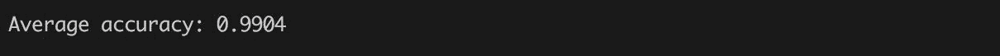

矩阵也给了我们`Micro-averaged metrics`(回忆，精准，`F-1`)。不过值得一提的是，我们的`rfOneVsAllCM`矩阵是对称的。这意味着`Recall`、`Precision`和`F-1`具有相同的值(因为 FP 和 FN 相同):

```scala
println(f"Micro-averaged metrics: ${rfOneVsAllCM(0,0)/(rfOneVsAllCM(0,0)+rfOneVsAllCM(1,0))}%.4f") 
```

输出如下:


An overview of the Spark ModelMetrics API is provided by the Spark documentation [https://spark.apache.org/docs/latest/mllib-evaluation-metrics.html](https://spark.apache.org/docs/latest/mllib-evaluation-metrics.html).
Furthermore, an understanding of model metrics and especially of a role of `Confusion matrix` in multiclass classification is crucial but not connected only to the Spark API. A great source of information is the Python scikit documentation ([http://scikit-learn.org/stable/modules/model_evaluation.html](http://scikit-learn.org/stable/modules/model_evaluation.html)) or various R packages (for example, [http://blog.revolutionanalytics.com/2016/03/com_class_eval_metrics_r.html](http://blog.revolutionanalytics.com/2016/03/com_class_eval_metrics_r.html)).

# 利用 H2O 随机森林建立分类模型

H2O 为构建分类模型提供了多种算法。在本章中，我们将再次关注树集合，但我们将在传感器数据问题的上下文中演示它们的用法。

我们已经准备了数据，可以直接用来构建 H2O 随机森林模型。要将它们转换成 H2O 格式，我们需要创建`H2OContext`，然后调用相应的转换:

```scala
import org.apache.spark.h2o._ 
val h2oContext = H2OContext.getOrCreate(sc) 

val trainHF = h2oContext.asH2OFrame(trainingData, "trainHF") 
trainHF.setNames(columnNames) 
trainHF.update() 
val testHF = h2oContext.asH2OFrame(testData, "testHF") 
testHF.setNames(columnNames) 
testHF.update() 
```

我们创建了两个由名称`trainHF`和`testHF`引用的表。代码还通过调用方法`setNames`更新了列的名称，因为输入`RDD`不携带关于列的信息。重要的一步是调用`update`方法将更改保存到 H2O 的分布式内存存储中。这是 H2O API 公开的一个重要模式——对一个对象所做的所有更改都是在本地完成的；为了使它们对其他计算节点可见，有必要将它们保存到内存存储中(所谓的**分布式键值存储** ( **DKV** ))

将数据存储为 H2O 表后，我们可以通过调用`h2oContext.openFlow`打开 H2O 流用户界面，并以图形方式浏览数据。例如，*图 4 中显示了作为数字特征的`activityId`列的分布:*

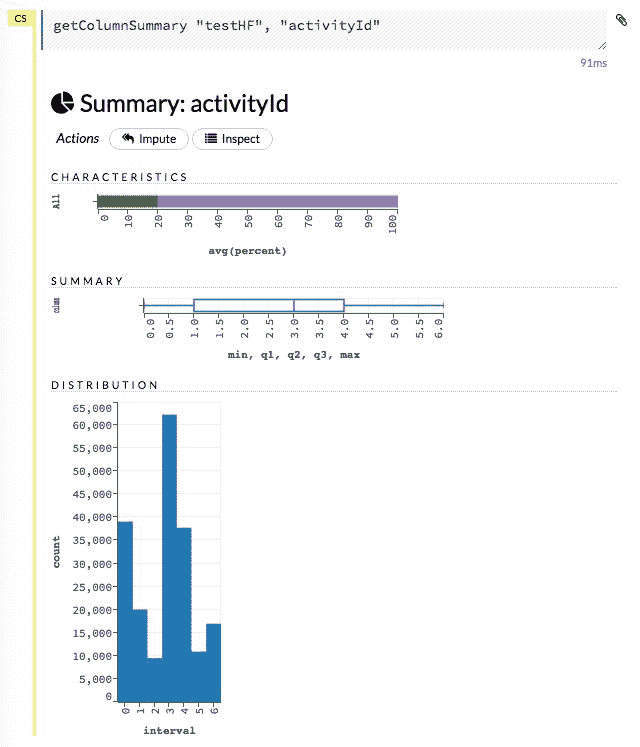

Figure 4: The view of numeric column activityId which needs transformation to categorical type.

我们可以直接比较结果，并通过一段 Spark 代码验证我们观察到了正确的分布:

```scala
println(s"""^Distribution of activityId:^${table(Seq("activityId", "Count"),testData.map(row => (row.label, 1)).reduceByKey(_ + _).collect.sortBy(_._1),Map.empty[Int, String])}""".stripMargin('^')) 
```

输出如下:


下一步是准备运行 H2O 算法的输入数据。首先，我们需要验证列类型是否符合算法预期的形式。H2O 流程界面提供了一个包含基本属性的列列表(*图 5* ):

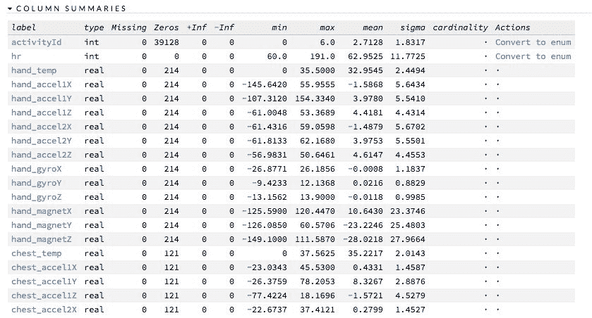

Figure 5: Columns of imported training dataset shown in Flow UI.

我们可以看到`activityId`列是数字；然而，为了进行分类，H2O 要求列是分类的。因此，我们需要通过单击用户界面中的转换为枚举或以编程方式转换列:

```scala
trainHF.replace(0, trainHF.vec(0).toCategoricalVec).remove 
trainHF.update 
testHF.replace(0, testHF.vec(0).toCategoricalVec).remove 
testHF.update 
```

同样，我们需要通过调用`update`方法来更新内存存储中修改后的帧。此外，我们正在将一个向量转换为另一个向量类型，并且我们不再需要原始向量，因此我们可以根据`replace`调用的结果调用`remove`方法。

变换后`activityId`列为分类；然而，向量域包含值“0”、“1”，...“6”-它们存储在字段`trainHF.vec("activityId").domain`中。然而，我们可以用实际的类别名称更新向量。我们已经准备了名为`idx2Activity`的索引到名称的转换，因此我们准备了一个新的域并更新了用于训练和测试表的`activityId`向量域:

```scala
val domain = trainHF.vec(0).domain.map(i => idx2Activity(i.toDouble)) 
trainHF.vec(0).setDomain(domain) 
water.DKV.put(trainHF.vec(0)) 
testHF.vec(0).setDomain(domain) 
water.DKV.put(testHF.vec(0)) 
```

在这种情况下，我们还需要更新内存存储中的修改向量——代码不调用`update`方法，而是显式调用直接将对象保存到内存存储中的方法`water.DKV.put`。

在用户界面中，我们可以再次浏览测试数据集的`activityId`列，并将其与计算的结果进行比较- *图 6:*


Figure 6: The column activityId values distribution in test dataset.

此时，我们已经准备好数据来执行模型构建。分类问题的 H2O 随机森林的配置遵循我们在上一章中介绍的相同模式:

```scala
import _root_.hex.tree.drf.DRF 
import _root_.hex.tree.drf.DRFModel 
import _root_.hex.tree.drf.DRFModel.DRFParameters 
import _root_.hex.ScoreKeeper._ 
import _root_.hex.ConfusionMatrix 
import water.Key.make 

val drfParams = new DRFParameters 
drfParams._train = trainHF._key 
drfParams._valid = testHF._key 
drfParams._response_column = "activityId" 
drfParams._max_depth = 20 
drfParams._ntrees = 50 
drfParams._score_each_iteration = true 
drfParams._stopping_rounds = 2 
drfParams._stopping_metric = StoppingMetric.misclassification 
drfParams._stopping_tolerance = 1e-3 
drfParams._seed = 42 
drfParams._nbins = 20 
drfParams._nbins_cats = 1024 

val drfModel = new DRF(drfParams, make[DRFModel]("drfModel")).trainModel.get 
```

有几个重要的区别，区分 H2O 算法和Spark。第一个重要的区别是，我们可以直接指定一个验证数据集作为输入参数(`_valid`字段)。这是不必要的，因为我们可以在模型构建后执行验证；但是，当指定验证数据集时，如果我们认为模型足够好，我们可以在构建期间实时跟踪模型的质量，并停止模型构建(参见*图 7* -“取消作业”操作停止训练，但模型仍可用于进一步的操作)。此外，以后我们可以继续建模，如果需要的话，可以添加更多的树。参数`_score_each_iteration`控制评分的频率:

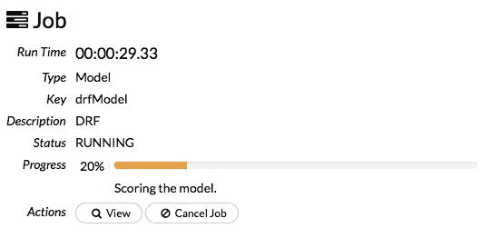

Figure 7: Model training can be tracked in Flow UI and also stopped by pressing "Cancel Job" button.

另一个区别由参数`_nbins`、`_nbins_top_level`和`_nbins_cats`表示。Spark随机森林实现接受控制连续特征离散化的参数`maxBins`。在 H2O 的情况下，它对应于参数`_nbins`。然而，H2O 机器学习平台允许对离散化进行更精细的调整。由于顶层拆分是最重要的，并且由于离散化会导致信息丢失，H2O 允许通过参数`_nbins_top_level`临时增加顶层拆分的离散类别数量。此外，高值分类特征(> 1，024 级)通常会迫使算法考虑将所有可能的分割成两个不同的子集，从而降低计算性能。由于`N`分类级别有 2 个 <sup class="calibre21">N</sup> 子集，因此为这些特征寻找分割点可能很昂贵。对于这种情况，H2O 引入了参数`_nbins_cats`，该参数控制分类级别的数量-如果一个特征包含的分类级别比存储在参数中的值多，那么这些值将被重新入库以适合`_nbins_cats`箱。

最后一个重要的区别是，我们指定了一个额外的停止标准以及集合中的传统深度和树的数量。该标准限制了验证数据的计算错误分类的改进——在这种情况下，我们规定，如果验证数据(字段`_stopping_rounds`)的两个连续评分测量值没有改进 0.001(字段`_stopping_tolerance`的值)，则模型构建应该停止。如果我们知道模型的预期质量并希望限制模型训练时间，这是一个完美的标准。在我们的例子中，我们可以探索结果集合中的树的数量:

```scala
println(s"Number of trees: ${drfModel._output._ntrees}") 
```

输出如下:

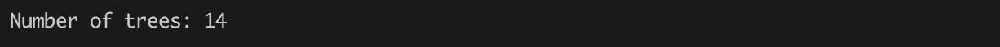

即使我们要求 50 棵树，由于错误分类率相对于给定的阈值没有提高，因此模型训练停止，结果模型只有`14`棵树。

H2O API exposes multiple stopping criteria which can be used by any of the algorithms - a user can use AUC value for binomial problems or MSE for regression problems. This is one of the most powerful feature which allow you to decrease computation time if huge space of hyper-parameters is explored

模型的质量可以通过两种方式进行探索:(1)直接使用 Scala API 并访问携带所有输出度量的模型字段`_output`，或者(2)使用图形界面以更用户友好的方式探索度量。例如，指定验证集上的`Confusion matrix`可以作为模型视图的一部分直接显示在流程用户界面中。请参考下图:


Figure 8: Confusion matrix for initial RandomForest model composed of 14 trees.

它直接给我们错误率(0.22%)和每个类的错误分类，我们可以使用 Spark 模型直接将结果与计算精度进行比较。此外，`Confusion matrix`可用于计算我们探索的额外指标。

例如，计算每个类的召回率、精确度和`F-1`度量。我们可以简单地将 H2O 的`Confusion matrix`转换为Spark`Confusion matrix`，并重用所有定义的方法。但是我们必须小心，不要在结果`Confusion matrix`中混淆实际值和预测值(Spark矩阵在列中有预测值，而 H2O 矩阵在行中有预测值):

```scala
val drfCM = drfModel._output._validation_metrics.cm 
def h2oCM2SparkCM(h2oCM: ConfusionMatrix): Matrix = { 
  Matrices.dense(h2oCM.size, h2oCM.size, h2oCM._cm.flatMap(x => x)) 
} 
val drfSparkCM = h2oCM2SparkCM(drfCM) 
```

您可以看到指定验证数据集的计算度量存储在模型输出字段`_output._validation_metrics`中。它包含`Confusion matrix`但也包含培训期间跟踪的模型性能的附加信息。然后我们简单地将 H2O 表示转换成Spark矩阵。然后，我们可以轻松计算每个类的宏性能:

```scala
val drfPerClassSummary = drfCM._domain.indices.map { i =>(drfCM._domain(i), rfRecall(drfSparkCM, i), rfPrecision(drfSparkCM, i), rfF1(drfSparkCM, i))}println(s"""^Per class summary^${table(Seq("Label", "Recall", "Precision", "F-1"),drfPerClassSummary,Map(1 -> "%.4f", 2 -> "%.4f", 3 -> "%.4f"))}""".stripMargin('^')) 
```

输出如下:

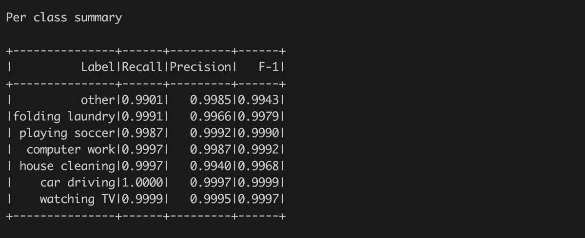

您可以看到，结果比之前计算的 Spark 结果稍好，尽管 H2O 使用的树更少。解释需要探究 RandomForest 算法的 H2O 实现——H2O 使用的是基于为每个输出类生成一个回归决策树的算法——这种方法通常被称为“一对全”方案。该算法允许对单个类进行更细粒度的优化。因此，在这种情况下，14 个随机森林树在内部由 14*7 = 98 个内部决策树表示。

The reader can find more explanation about the benefits of a "one-versus-all" scheme for multiclass classification problems in the paper *In Defense of One-Vs-All Classification* from Ryan Rifkin and Aldebaro Klautau. The authors show that the schema is as accurate as any other approaches; on the other hand, the algorithm forces the generation of more decision trees which can negatively influence computation time and memory consumption.

我们可以探索训练模型的更多属性。一个重要的随机森林指标是可变重要性。它存储在模型的字段`_output._varimp`下。对象包含原始值，可以通过调用`scaled_values`方法进行缩放，或者通过调用`summary`方法获取相对重要性。不过，它们可以在*图 9* 所示的流程界面中进行可视化探索。该图显示，最重要的特征是来自所有三个传感器的测量温度，然后是各种运动数据。出乎我们的意料，心率不在顶级特征之内:


Figure 9: Variable importance for model "drfModel". The most important features include measured temperature.

如果我们对模型的质量不满意，可以通过更多的树来扩展。我们可以重用已定义的参数，并以下列方式修改它们:

*   在生成的集合中设置所需的树数(例如，20)。
*   禁用提前停止标准，以避免在达到所需的树数之前停止模型训练。
*   配置一个所谓的*模型检查点*指向之前训练的模型。模型检查点是 H2O 机器学习平台的独特功能，适用于所有已发布的模型。在需要通过执行更多的训练迭代来改进给定模型的情况下，它非常有用。

之后，我们可以简单地再次启动模型构建。在这种情况下，H2O 平台只需继续模型训练，重建模型状态，并构建新树并将其附加到新模型中:

```scala
drfParams._ntrees = 20 
drfParams._stopping_rounds = 0 
drfParams._checkpoint = drfModel._key 

val drfModel20 = new DRF(drfParams, make[DRFModel]("drfMode20")).trainModel.get 
println(s"Number of trees: ${drfModel20._output._ntrees}") 
```

输出如下:


在这种情况下，只构建了`6`树——要看到这一点，用户可以在控制台中浏览模型训练输出，并找到结束模型训练输出和报告的一行:


第 6<sup class="calibre21">树在 2 秒内生成，它是附加到现有系综中创建新模型的最后一棵树。我们可以再次探索新建模型的`Confusion matrix`，看到整体错误率从 0.23 提高到 0.2%(见*图 9* ):</sup>

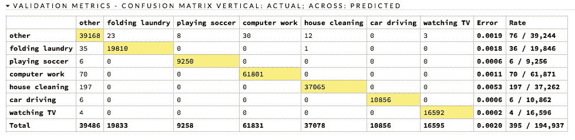

Figure 10: Confusion matrix for RandomForest model with 20 trees.

# 摘要

本章介绍了几个重要的概念，包括数据清理和处理缺失和分类值，使用 Spark 和 H2O 来训练多分类模型，以及分类模型的各种评估指标。此外，这一章引入了在 RandomForest 上演示的模型集成的概念，作为决策树的集成。

读者应该看到数据准备的重要性，这在每个模型训练和评估过程中都起着关键作用。在不理解建模环境的情况下训练和使用模型会导致误导性决策。此外，每个模型都需要针对建模目标进行评估(例如，最小化误报)。因此，理解分类模型的不同模型度量的权衡是至关重要的。

在这一章中，我们没有涵盖分类模型的所有可能的建模技巧，但其中有一些仍然对好奇的读者开放:

我们使用了一个简单的策略来估算心率列中的缺失值，但是还有其他可能的解决方案-例如，平均值插补，或者将插补与标记有缺失值的行的附加二进制列相结合。这两种策略都可以提高模型的准确性，我们将在本书后面使用它们。

此外，奥卡姆剃刀原理表明，在提供相同精度的情况下，更喜欢简单的模型而不是复杂的模型是个好主意。因此，一个好的想法是定义一个超参数空间，并使用探索策略来寻找最简单的模型(例如，更少的树，更少的深度)，该模型提供与本章中训练的模型相同(或更好)的精度。

在这一章的结尾，重要的是要提到，这一章提出的树集成是一个原始的例子，集成和超级学习者的强大概念，我们将在本书的后面介绍。