# 使用自然语言处理和Spark流预测电影评论

在这一章中，我们将深入探讨**自然语言处理** ( **NLP** )领域，不要与神经语言编程混淆！自然语言处理有助于分析原始文本数据，并提取有用的信息，如句子结构、文本情感，甚至语言之间的文本翻译。因为许多数据源包含原始文本(例如，评论、新闻文章和医疗记录)。自然语言处理越来越受欢迎，这要归功于它提供了对文本的洞察，并帮助自动化决策变得更加容易。

在幕后，自然语言处理经常使用机器学习算法来提取和建模文本的结构。如果将自然语言处理应用于另一种机器方法的上下文中，自然语言处理的能力会更加明显，例如，文本可以表示输入特征之一。

本章我们将应用 NLP 来分析影评的*情绪*。基于带注释的训练数据，我们将建立一个分类模型来区分正面和负面的电影评论。值得一提的是，我们不直接从文本中提取情感(基于爱、恨等词)，而是利用我们在上一章已经探索过的二元分类。

为了实现这一点，我们将采用预先人工评分的原始电影评论，并训练一个集合-一组模型-如下所示:

1.  处理电影评论，为我们的模型合成特征。

在这里，我们将探索我们可以使用文本数据创建的各种功能，从单词包方法到加权单词包(例如，TF-IDF)，然后简要探索 word2vec 算法，我们将在[第 5 章](5.html#30A8Q0-d18ba71168a441bd917775fac13ca893)中详细探讨 Word2vec 用于预测和聚类。

除此之外，我们还将研究一些基本的特征选择/省略方法，包括删除停用词和标点符号，或者词干。

2.  使用生成的特征，我们将运行各种有监督的二元分类算法来帮助我们对正面和负面评论进行分类，包括以下内容:
    *   分类决策树
    *   朴素贝叶斯
    *   随机森林
    *   梯度增强树

3.  利用四种不同学习算法的组合预测能力，我们将创建一个超级学习者模型，该模型将模型的所有四个“猜测”作为元特征来训练深度神经网络以输出最终预测。

4.  最后，我们将为此过程创建一个 Spark 机器学习管道，它执行以下操作:
    *   从新电影评论中提取特征
    *   提出一个预测
    *   在 Spark 流应用中输出这个预测(是的，在本书的剩余部分，您将在每一章中构建您的第一个机器学习应用！)

如果这听起来有点野心勃勃，振作起来！我们将以一种既有条理又有目的的方式逐步完成这些任务中的每一项，以便您有信心构建自己的 NLP 应用；但是首先，这个令人兴奋的领域背后的一点背景历史和一些理论。

# NLP -简单入门

就像人工神经网络一样，自然语言处理是一个相对“古老”的学科，但由于计算能力的提高和机器学习算法在任务中的各种应用，它最近获得了大量的关注，这些任务包括但不限于以下内容:

*   **机器翻译** ( **MT** ):最简单的形式，这是机器将一种文字语言翻译成另一种文字语言的能力。有趣的是，机器翻译系统的提议早于数字计算机的产生。第一批 NLP 应用之一是在第二次世界大战期间由一位名叫沃伦·韦弗的美国科学家创建的，他的工作是试图破解德国代码。如今，我们拥有高度复杂的应用，可以将一段文本翻译成我们想要的任何数量的不同语言！
*   **语音识别** ( **SR** ):这些方法和技术试图使用机器识别口语单词并将其翻译成文本。我们在如今的智能手机中看到了这些技术，它们在任务中使用 SR 系统，从帮助我们找到最近加油站的方向，到查询谷歌周末的天气预报。当我们对着手机说话时，机器能够识别我们说的单词，然后将这些单词翻译成计算机可以识别的文本，并在需要时执行一些任务。
*   **信息检索** ( **IR** ):你有没有看过一篇文字，比如新闻网站上的一篇文章，想看类似你刚刚看的那篇新闻文章？这只是信息检索系统的一个例子，它将一段文本作为“输入”，并试图获得与输入文本相似的其他相关文本。也许红外系统最简单和最容易识别的例子是在基于网络的搜索引擎上进行搜索。我们给出一些我们想“了解”更多的单词(这是“输入”)，输出是搜索结果，希望与我们的输入搜索查询相关。
*   **信息提取** ( **IE** ):这是从文本、视频、图片等非结构化数据中提取结构化信息位的任务。例如，当你在某个网站上阅读一篇博客文章时，该文章通常会被标记上几个描述该文章一般主题的关键词，这些关键词可以使用信息提取系统进行分类。工业工程中一种非常流行的方法叫做*视觉信息提取*，它试图从网页的视觉布局中识别复杂的实体，例如，这在典型的自然语言处理方法中是无法捕捉到的。
*   **文字摘要** ( **该死，这里没有缩略词！**):这是一个非常受欢迎的兴趣领域。例如，这是一项通过识别主题来获取不同长度的文本片段并进行总结的任务。在下一章中，我们将通过主题模型探索两种流行的文本摘要方法，如**潜在狄利克雷分配** ( **LDA** )和**潜在语义分析** ( **LSA** )。

在本章中，我们将使用自然语言处理技术来帮助我们解决一个二元分类问题，用于对来自**国际电影数据库** ( **IMDb** )的电影评论进行评级。现在让我们将注意力转移到我们将使用的数据集上，并了解更多关于 Spark 的特征提取技术。

# 数据集

大型电影评论数据库，最初发表在安德鲁·马斯等人的论文《情感分析的*学习词向量》*中，可从[http://ai.stanford.edu/~amaas/data/sentiment/](http://ai.stanford.edu/~amaas/data/sentiment/)下载。

下载的档案包含两个标有*列车*和*测试*的文件夹。对于 train，有 12，500 个正面评论和 12，500 个负面评论，我们将对它们进行分类器训练。测试数据集包含相同数量的正面和负面评价，在两个文件中总共有 50，000 个正面和负面评价。

让我们看一个回顾的例子，看看数据是什么样的:

"Bromwell High is nothing short of brilliant. Expertly scripted and perfectly delivered, this searing parody of  students and teachers at a South London Public School leaves you literally rolling with laughter. It's vulgar, provocative, witty and sharp. The characters are a superbly caricatured cross-section of British society (or to be more accurate, of any society). Following the escapades of Keisha, Latrina, and Natella, our three "protagonists", for want of a better term, the show doesn't shy away from parodying every imaginable subject. Political correctness flies out the window in every episode. If you enjoy shows that aren't afraid to poke fun of every taboo subject imaginable, then Bromwell High will not disappoint!"

似乎我们唯一要处理的就是电影评论和评论情绪的原始文本；我们对发布的日期、谁发布了评论以及除了文本之外可能对我们有帮助/没有帮助的其他数据一无所知。

# 数据集准备

在运行任何数据操作之前，我们需要像前面几章一样准备好 Spark 环境。让我们启动 Spark shell 并请求足够的内存来处理下载的数据集:

```scala
export SPARK_HOME="<path to your Spark2.0 distribution"export SPARKLING_WATER_VERSION="2.1.12"export SPARK_PACKAGES=\"ai.h2o:sparkling-water-core_2.11:${SPARKLING_WATER_VERSION},\ai.h2o:sparkling-water-repl_2.11:${SPARKLING_WATER_VERSION},\ai.h2o:sparkling-water-ml_2.11:${SPARKLING_WATER_VERSION},\com.packtpub:mastering-ml-w-spark-utils:1.0.0"$SPARK_HOME/bin/spark-shell \--master 'local[*]' \--driver-memory 10g \--executor-memory 10g \--confspark.executor.extraJavaOptions=-XX:MaxPermSize=384M \--confspark.driver.extraJavaOptions=-XX:MaxPermSize=384M \--packages "$SPARK_PACKAGES" "$@"
```

To avoid too much logging output from Spark, it is possible to control logging level at runtime directly by calling `setLogLevel` on SparkContext:
`sc.setLogLevel("WARN")`
The command decreases the verbosity of the Spark output.

下一个挑战是读入由 25，000 个正面和负面电影评论组成的训练数据集。下面几行代码将读入这些文件，然后创建我们的二进制标签，0 表示负面评价，1 表示正面评价。

我们直接使用公开的 Spark `sqlContext`方法`textFile`，该方法允许读取多个文件并返回数据集[字符串]。这与前几章提到的方法不同，前几章提到的方法是使用名为`wholeTextFiles`的方法并产生 RDD[字符串]:

```scala
val positiveReviews= spark.sqlContext.read.textFile("../data/aclImdb/train/pos/*.txt") 
   .toDF("reviewText") 
println(s"Number of positive reviews: ${positiveReviews.count}") Number of positive reviews: 12500
```

我们可以使用 dataset 方法`show`直接显示前五行(可以修改 truncate 参数显示评论全文):

```scala
println("Positive reviews:")positiveReviews.show(5, truncate = true)
```

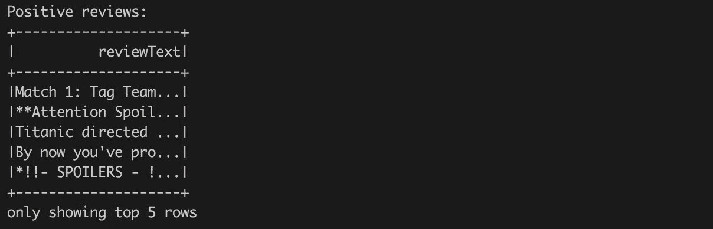

接下来，我们将对负面评价做同样的事情:

```scala
val negativeReviews= spark.sqlContext.read.textFile("../data/aclImdb/train/neg/*.txt").toDF("reviewText")println(s"Number of negative reviews: ${negativeReviews.count}")
```

请看下面的截图:


现在，每个*肯定视图*和*否定视图*变量代表已加载评论的 RDD。数据集的每一行都包含一个表示单个审阅的字符串。但是，我们仍然需要生成相应的标签，并将两个加载的数据集合并在一起。

标记很容易，因为我们将负面和正面评论作为单独的Spark数据框加载。我们可以直接添加一个常量列，表示负面评价的标签 0 和正面评价的标签 1:

```scala
import org.apache.spark.sql.functions._val pos= positiveReviews.withColumn("label", lit(1.0))val neg= negativeReviews.withColumn("label", lit(0.0))var movieReviews= pos.union(neg).withColumn("row_id", monotonically_increasing_id)println("All reviews:")movieReviews.show(5)
```

请看下面的截图:


在本例中，我们使用了`withColumn`方法，该方法向现有数据集追加一个新列。新列`lit(1.0)`的定义是指由数字文字 *1.0* 定义的常量列。我们需要使用一个实数来定义目标值，因为 Spark API 需要它。最后，我们使用`union`方法将两个数据集合并在一起。

我们还追加了魔术列`row_id`，它唯一地标识了数据集中的每一行。当我们需要加入几个算法的输出时，这个技巧简化了我们的工作流程。

Why did we use a double value instead of a string label representation? In the code labeling individual reviews, we defined a constant column with numeric literals representing double numbers. We could use also *lit("positive")* to label positive reviews, but using plain text labels would force us to transform the string value into numeric value in the later steps anyway. Hence, in this example, we will make our life easier using double value labels directly. Furthermore, we used double values directly since it is required by the Spark API.

# 特征抽出

在这个阶段，我们只有代表评论的原始文本，这不足以运行任何机器学习算法。我们需要将文本转换成数字格式，也就是执行所谓的“特征提取”(听起来是这样的；我们正在获取输入数据并提取我们将用来训练模型的特征)。该方法基于输入特征生成一些新特征。关于如何将文本转换为数字特征，有许多方法。我们可以计算单词的数量、文本的长度或标点符号的数量。然而，为了以系统的方式来表示文本，以反映文本结构，我们需要更精细的方法。

# 特征提取方法——词袋模型

现在我们已经摄取了我们的数据并创建了我们的标签，是时候提取我们的特征来构建我们的二元分类模型了。顾名思义，单词包方法是一种非常常见的特征提取技术，通过这种技术，我们可以提取一段文本，在本例中是一篇电影评论，并将其表示为单词和语法标记的包(也称为多集)。让我们用一些电影评论来看一个例子:

**回顾 1:** *侏罗纪世界就是这样翻牌的！*

**回顾 2:** *泰坦尼克号...瞬间经典。电影摄影和表演一样好！！*

对于每个标记(可以是一个单词和/或标点符号)，我们将创建一个特征，然后计算该标记在整个文档中的出现次数。以下是我们的单词包数据集在第一次回顾时的样子:

| **审核标识** | **一** | **翻牌** | **侏罗纪** | **这样的** | **世界** | **！** |
| 回顾 1 | one | one | one | one | one | one |

首先，注意这个数据集的排列，通常称为*文档-术语矩阵*(每个文档[行]由组成这个二维矩阵的某一组单词[术语]组成)。我们也可以对其进行不同的排列，并对行和列进行转置，从而创建一个*术语文档矩阵*，其中列现在显示具有该特定术语的文档，单元格内的数字是计数。此外，要意识到单词的顺序是按字母顺序排列的，这意味着我们失去了任何单词顺序的感觉。这意味着“扑通”一词与“侏罗纪”一词在相似性上是等距的，虽然我们知道这不是真的，但这凸显了单词包方法的一个局限性:*单词顺序的* *丢失了，有时，不同的文档可以有相同的表示，但意味着完全不同的东西。*

在下一章中，您将了解到一种极其强大的学习算法，该算法由谷歌首创，并包含在 Spark 中，名为**单词到矢量** ( **单词 2vec** )，该算法本质上是将术语数字化，以“编码”其含义。

其次，请注意，对于我们给定的六个标记(包括标点符号)的回顾，我们有六列。假设我们将第二篇评论添加到我们的文档-术语-矩阵中；我们最初的单词包会有什么变化？

| **审核标识** | **一** | **演技** | **一** | **为** | **电影摄影** | **经典** | **翻牌** | **好** | 即时 | **侏罗纪** | **这样的** | **泰坦尼克号** | **是** | **世界** | **。** | **！** |
| 回顾 1 | one | Zero | Zero | Zero | Zero | Zero | one | Zero | Zero | one | one | Zero | Zero | one | Zero | one |
| 审查 2 | Zero | one | one | Two | one | one | Zero | one | one | Zero | Zero | one | one | Zero | one | Two |

我们将最初的功能数量从 5 个增加到 16 个，这让我们对这种方法有了另一个考虑。假设我们必须为每个标记创建一个特征，不难看出我们很快就会有一个极其广泛和非常稀疏的矩阵表示(稀疏是因为一个文档肯定不会包含每个单词/符号/表情符号等等，因此，大多数单元格输入将为零)。这给我们的算法带来了一些有趣的维数问题。

考虑这样一种情况，我们试图在一个具有+200k 个标记的文本文档上使用单词包方法训练一个随机森林，其中大多数输入将为零。回想一下，在基于树的学习者中，它决定“向左还是向右”，这取决于特征类型。在一个单词包的例子中，我们可以将特征计数为真或假(即文档是否有术语)或一个术语的出现(即文档有这个术语多少次)。对于我们的树中的每个连续分支，算法必须考虑所有这些特征(或者在随机森林的情况下，至少是特征数量的平方根)，这些特征可能非常宽和稀疏，并做出影响整体结果的决定。

幸运的是，您将在下一节学习 Spark 如何处理这种类型的维度和稀疏性，以及我们可以采取的减少特征数量的一些步骤。

# 文本标记化

为了执行特征提取，我们仍然需要提供组成原始文本的单个单词-标记。然而，我们不需要考虑所有的单词或字符。例如，我们可以直接跳过标点符号或不重要的词，如介词或文章，这些词大多不会带来任何有用的信息。

此外，一个常见的做法是将标记正则化为一个公共表示。这可以包括诸如统一字符(例如，仅使用小写字符、删除音调符号、使用通用字符编码(例如 utf8)等)或将单词放入通用形式(例如，所谓的词干，“哭”/“哭”/“哭”用“哭”表示)等方法。

在我们的示例中，我们将使用以下步骤执行此过程:

1.  小写所有单词(“因为”和“因为”是同一个单词)。
2.  使用正则表达式函数删除标点符号。
3.  删除 stopwords。这些基本上是禁令和连词，如中的*、*中的*、*中的*、*和*、*等*等等，它们没有给我们想要分类的评论添加上下文含义。*

4.  在我们的评论语料库中找到总出现次数少于三次的“稀有标记”。
5.  最后，移除所有“稀有代币”

Each of the steps in the preceding sequence represent our best practices when doing sentiment classification on text. For your situation, you may not want to lowercase all words (for example, "Python", the language and "python", the snake type, is an important distinction!). Furthermore, your stopwords list-if you choose to include one-may be different and incorporate more business logic given your task. One website that has done a fine job in collecting lists of stopwords is [http://www.ranks.nl/stopwords](http://www.ranks.nl/stopwords).

# 声明我们的停用词列表

**在这里，我们可以直接重用 Spark 提供的通用英语停用词列表。但是，我们可以通过我们的具体的结束语来丰富它:**

```scala
import org.apache.spark.ml.feature.StopWordsRemover 
val stopWords= StopWordsRemover.loadDefaultStopWords("english") ++ Array("ax", "arent", "re")
```

如前所述，这是一项极其微妙的任务，高度依赖于您希望解决的业务问题。您可能希望在此列表中添加与您的领域相关的术语，这些术语对预测任务没有帮助。

声明一个标记器，标记评论并省略所有停止词和太短的词:

```scala
val *MIN_TOKEN_LENGTH* = 3val *toTokens*= (minTokenLen: Int, stopWords: Array[String], review: String) =>review.split("""\W+""").map(_.toLowerCase.replaceAll("[^\\p{IsAlphabetic}]", "")).filter(w =>w.length>minTokenLen).filter(w => !stopWords.contains(w))
```

让我们一步一步地看看这个函数，看看它在做什么。它接受单个评审作为输入，然后调用以下函数:

*   `.split("""\W+""")`:这将电影评论文本拆分为仅由字母数字字符表示的标记。
*   `.map(_.toLowerCase.replaceAll("[^\\p{IsAlphabetic}]", ""))`:作为最佳实践，我们将代币小写，这样在索引时， *Java = JAVA = java* 。然而，这种统一并不总是这样，重要的是你要意识到降低文本数据对模型的影响。例如，计算语言“python”将小写成“Python”，它也是一条蛇。显然，这两种代币是不一样的；然而，低音量会让它变得如此！我们还将过滤掉所有的数字字符。
*   `.filter(w =>w.length>minTokenLen)`:只保留那些长度大于指定限制(我们这里是三个字符)的令牌。
*   `.filter(w => !stopWords.contains(w))`:使用我们预先声明的停止词列表，我们可以从标记化的数据中移除这些术语。

我们现在可以直接在评论语料库上应用定义的函数:

```scala
import spark.implicits._ 
val toTokensUDF= udf(toTokens.curried(MIN_TOKEN_LENGTH)(stopWords)) 
movieReviews= movieReviews.withColumn("reviewTokens", toTokensUDF('reviewText)) 
```

在这种情况下，我们通过调用`udf`标记将函数`toTokens`标记为Spark用户定义的函数，这公开了一个在Spark数据框上下文中使用的公共 Scala 函数。之后，我们可以在加载的数据集中的`reviewText`列上直接应用定义的`udf`函数。该函数的输出创建了一个名为`reviewTokens`的新列。

We separated `toTokens` and `toTokensUDF` definitions since it would be easier to define them in one expression. This is a common practice that allows you to test the `toTokens` method in separation without the need of using and knowing Spark infrastructure.
Furthermore, you can reuse the defined `toTokens` method among different projects, which do not necessarily need to be Spark-based.

以下代码查找所有稀有令牌:

```scala
val RARE_TOKEN = 2val rareTokens= movieReviews.select("reviewTokens").flatMap(r =>r.getAs[Seq[String]]("reviewTokens")).map((v:String) => (v, 1)).groupByKey(t => t._1).reduceGroups((a,b) => (a._1, a._2 + b._2)).map(_._2).filter(t => t._2 <RARE_TOKEN).map(_._1).collect()
```

稀有令牌计算是一个复杂的操作。在我们的示例中，输入由包含令牌列表的行表示。但是，我们需要计算所有唯一的标记及其出现次数。

因此，我们使用`flatMap`方法将结构展平成一个新的数据集，其中每行代表一个标记。

然后，我们可以使用与前几章中相同的策略。我们可以为每个单词生成键值对*(单词，1)* 。

这一对表示给定单词出现的次数。然后，我们将相同单词的所有对组合在一起(方法`groupByKey`，计算代表一个组的单词的总出现次数(`reduceGroups`)。以下步骤只是过滤掉所有过于频繁的单词，最后将结果收集为单词列表。

下一个目标是找到稀有代币。在我们的示例中，我们将每个出现次数少于三次的令牌视为罕见:

```scala
println(s"Rare tokens count: ${rareTokens.size}")println(s"Rare tokens: ${rareTokens.take(10).mkString(", ")}")
```

输出如下:

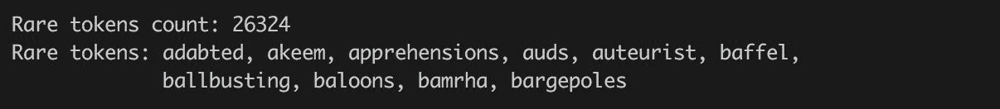

现在我们已经有了令牌化函数，是时候通过定义另一个 Spark UDF 来过滤掉稀有令牌了，我们将直接应用于`reviewTokens`输入数据列:

```scala
val rareTokensFilter= (rareTokens: Array[String], tokens: Seq[String]) =>tokens.filter(token => !rareTokens.contains(token)) 
val rareTokensFilterUDF= udf(rareTokensFilter.curried(rareTokens)) 

movieReviews= movieReviews.withColumn("reviewTokens", rareTokensFilterUDF('reviewTokens)) 

println("Movie reviews tokens:") 
movieReviews.show(5) 
```

电影评论令牌如下:

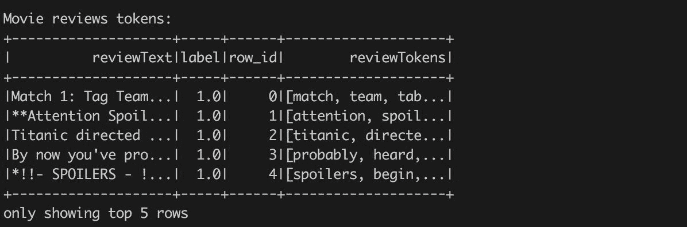

根据您的特定任务，您可能希望添加或删除一些停止词或探索不同的正则表达式模式(例如，使用正则表达式梳理电子邮件地址是很常见的)。现在，我们将获取我们必须的令牌，并使用它来构建我们的数据集。

# 词干和引理化

自然语言处理中一个非常流行的步骤是将单词词根化。例如，“账户”和“会计”都可以归结为“账户”，乍一看似乎很合理。但是，您应该注意以下两个方面:

1.**过词干**:这是词干没有把两个意思截然不同的词分开的时候。例如，stem ("general "，" genetic") = "gene "。

2.**词干不足**:这是无法将意义相同的词还原为词根形式。例如，stem(“跳跃”，“跳跃”)= *jumpi* 但是 stem(“跳跃”，“跳跃”)=“跳跃”在这个例子中，我们知道前面的每个术语只是词根“jump”的一个词尾变化但是，根据您选择使用的词干分析器(两个最常见的词干分析器是 Porter[最古老也是最常见的]和 Lancaster)，您可能会陷入此错误。

考虑到语料库中单词词干过多或过少的可能性，自然语言处理从业者编造了词汇化的概念来帮助解决这些已知的问题。单词“Lemming”是基于单词的上下文，采用一组相关单词*的规范(字典)形式。例如，lemma(“paying”，“pays”，“payed”)=“pay”。“像词干一样，引理化试图将相关单词分组，但更进一步，试图根据词义对单词进行分组，因为毕竟，根据上下文，相同的两个单词可能有完全不同的含义！鉴于本章的深度和复杂性，我们将避免使用任何引理化技术，但是感兴趣的人可以在[http://stanfordnlp.github.io/CoreNLP/](http://stanfordnlp.github.io/CoreNLP/)进一步了解这个主题。*

# 特征化-特征散列

现在，是时候将字符串表示转换为数字表示了。我们采用了一个单词包的方法；然而，我们使用一种叫做特征散列的技巧。让我们更详细地看看 Spark 如何利用这种强大的技术来帮助我们高效地构建和访问我们的标记化数据集。如前所述，我们使用特征散列作为一个节省时间的单词包实现。

本质上，特征哈希是一种快速且节省空间的方法，通过将任意特征转换为向量或矩阵中的索引来处理高维数据，这在处理文本时非常典型。这最好用一个示例文本来描述。假设我们有以下两个电影评论:

1.  电影《好家伙》花的钱是值得的。精彩的表演！
2.  《好家伙》是一部引人入胜的电影，演员阵容强大，剧情精彩——是所有电影爱好者的必看之作！

对于这些评论中的每个标记，我们可以应用一个“散列技巧”，从而为不同的标记分配一个数字。因此，前面两个评论中的唯一标记集(在低级编码+文本处理之后)将按字母顺序排列:

```scala
{"acting": 1, "all": 2, "brilliant": 3, "cast": 4, "goodfellas": 5, "great": 6, "lover": 7, "money": 8, "movie": 9, "must": 10, "plot": 11, "riveting": 12, "see": 13, "spent": 14, "well": 15, "with": 16, "worth": 17}
```

然后，我们将应用哈希来创建以下矩阵:

```scala
[[1, 1, 0, 1, 0, 0, 0, 0, 1, 0, 0, 0, 0, 1, 1, 0, 1][0, 1, 1, 1, 1, 1, 1, 0, 0, 1, 0, 1, 1, 0, 0, 1, 0]]
```

来自特征散列的矩阵构造如下:

*   行*代表*电影评论号。
*   列*代表*特征(不是实际单词！).特征空间由一系列使用的散列函数表示。请注意，每行都有相同数量的列，而不仅仅是一个不断增长的宽矩阵。
*   因此，矩阵中的每个条目( *i，j)* = *k* 意味着在第 *i、*特征 *j、*出现 *k* 次。因此，例如，在特征 9 上散列的标记“电影”在第二次评论中出现两次；因此，矩阵(2，9) = 2。
*   使用的散列函数会产生间隙。如果散列函数将一小组单词散列到大的数字空间中，则得到的矩阵将具有高稀疏性。
*   需要考虑的一个重要因素是哈希冲突的概念，即两个不同的特征(在本例中是令牌)被哈希到我们的特征矩阵中的相同索引号中。防范这种情况的一种方法是选择大量的特征进行哈希，这是我们可以在 Spark 中控制的一个参数(Spark 中对此的默认设置是 2^20 ~ 100 万个特征)。

现在，我们可以使用 Spark 的散列函数，它将每个标记映射到一个散列索引，该索引将构成我们的特征向量/矩阵。像往常一样，我们将从导入我们需要的必要类开始，然后将创建散列的特性数量的默认值更改为大约 4096 (2^12).

在代码中，我们将使用 Spark ML 包中的`HashingTF`转换器(您将在本章后面了解更多关于转换的信息)。它需要输入和输出列的名称。对于我们的数据集`movieReviews`，输入列是`reviewTokens`，它保存在前面的步骤中创建的令牌。转换结果存储在名为`tf`的新列中:

```scala
val hashingTF= new HashingTF hashingTF.setInputCol("reviewTokens").setOutputCol("tf").setNumFeatures(1 <<12) // 2^12.setBinary(false)val tfTokens= hashingTF.transform(movieReviews)println("Vectorized movie reviews:")tfTokens.show(5)
```

输出如下:

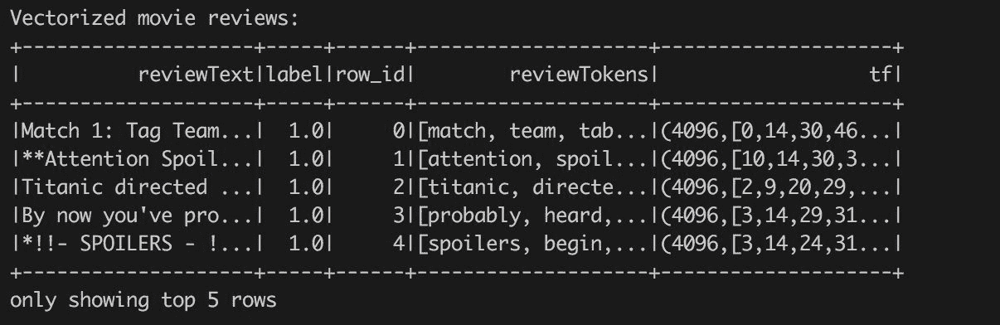

调用转换后，生成的`tfTokens`数据集在原始数据的旁边包含一个名为`tf`的新列，其中保存了一个`org.apache.spark.ml.linalg`的实例。每个输入行的向量。在我们的例子中，向量是一个稀疏向量(因为散列空间比唯一标记的数量大得多)。

# 术语频率-反向文档频率加权方案

我们现在将使用 Spark ML 来应用一种非常常见的加权方案，称为 TF-IDF，以将我们的标记化评论转换为向量，这些向量将作为我们的机器学习模型的输入。这种转变背后的数学原理相对简单:

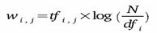

对于每个令牌:

1.  在给定的文档(在我们的例子中，是电影评论)中找到术语频率。
2.  将此计数乘以反向文档频率的日志，该日志查看令牌在所有文档(通常称为语料库)中出现的频率。
3.  取逆是有用的，因为它将惩罚文档中出现频率过高的标记(例如，“电影”)，并提升那些出现频率较低的标记。

现在，我们可以基于前面解释的逆术语文档频率公式来缩放术语。首先，我们需要计算一个模型——一个关于如何缩放词频的处方。在这种情况下，我们使用 Spark `IDF`估计器基于上一步`hashingTF`产生的输入数据创建一个模型:

```scala
import org.apache.spark.ml.feature.IDFval idf= new IDF idf.setInputCol(hashingTF.getOutputCol).setOutputCol("tf-idf")val idfModel= idf.fit(tfTokens)
```

现在，我们将构建一个 Spark 估计器，我们对输入数据(=上一步转换的输出)进行了训练(拟合)。IDF 估计器计算单个令牌的权重。有了模型，就可以将其应用于包含拟合过程中定义的列的任何数据:

```scala
val tfIdfTokens= idfModel.transform(tfTokens)println("Vectorized and scaled movie reviews:")tfIdfTokens.show(5)
```

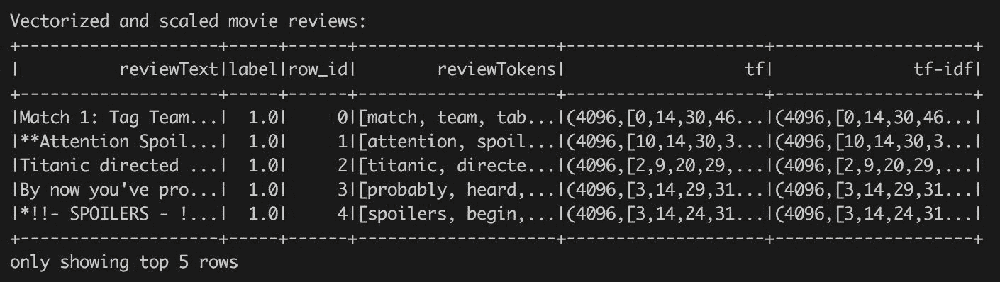

让我们更详细地看看单个行以及`hashingTF`和`IDF`输出之间的区别。这两个操作产生了相同长度的稀疏向量。我们可以查看非零元素，并验证两行在相同的位置包含非零值:

```scala
import org.apache.spark.ml.linalg.Vectorval vecTf= tfTokens.take(1)(0).getAs[Vector]("tf").toSparseval vecTfIdf= tfIdfTokens.take(1)(0).getAs[Vector]("tf-idf").toSparseprintln(s"Both vectors contains the same layout of non-zeros: ${java.util.Arrays.equals(vecTf.indices, vecTfIdf.indices)}")
```

我们还可以打印一些非零值:

```scala
println(s"${vecTf.values.zip(vecTfIdf.values).take(5).mkString("\n")}")
```


您可以直接看到，在句子中具有相同频率的标记根据它们在所有句子中的频率可以有不同的结果分数。

# 让我们做一些(模型)训练！

此时，我们有了文本数据的数字表示，它以一种简单的方式捕获了评论的结构。现在，是建模的时候了。首先，我们将选择训练所需的列，并分割结果数据集。我们将在数据集中保留生成的`row_id`列。但是，我们不会将其用作输入功能，而仅将其用作简单的唯一行标识符:

```scala
valsplits = tfIdfTokens.select("row_id", "label", idf.getOutputCol).randomSplit(Array(0.7, 0.1, 0.1, 0.1), seed = 42)val(trainData, testData, transferData, validationData) = (splits(0), splits(1), splits(2), splits(3))Seq(trainData, testData, transferData, validationData).foreach(_.cache())
```

请注意，我们已经创建了四个不同的数据子集:训练数据集、测试数据集、传输数据集和最终验证数据集。传输数据集将在本章后面解释，但是从前面几章开始，您应该已经对其他内容非常熟悉了。

此外，缓存调用很重要，因为大多数算法都要迭代查询数据集数据，我们希望避免重复评估所有数据准备操作。

# Spark决策树模型

首先，让我们从一个简单的决策树开始，对一些超参数进行网格搜索。我们将遵循[第二章](2.html#147LC0-d18ba71168a441bd917775fac13ca893)、*探测暗物质:希格斯玻色子粒子*中的代码来构建我们的模型，这些模型被训练为最大化 AUC 统计量。但是，我们将采用 Spark ML 包中的模型，而不是使用 MLlib 库中的模型。当我们需要将模型组合成管道的形式时，使用 ML 包的动机将会更加清晰。尽管如此，在下面的代码中，我们将使用适合`trainData`的`DecisionTreeClassifier`，为`testData`生成预测，并借助`BinaryClassificationEvaluato`评估模型的 AUC 性能:

```scala
import org.apache.spark.ml.classification.DecisionTreeClassifierimport org.apache.spark.ml.classification.DecisionTreeClassificationModelimport org.apache.spark.ml.evaluation.BinaryClassificationEvaluatorimport java.io.Fileval dtModelPath = s" $ MODELS_DIR /dtModel"val dtModel= {val dtGridSearch = for (dtImpurity<- Array("entropy", "gini");dtDepth<- Array(3, 5))yield {println(s"Training decision tree: impurity $dtImpurity,depth: $dtDepth")val dtModel = new DecisionTreeClassifier().setFeaturesCol(idf.getOutputCol).setLabelCol("label").setImpurity(dtImpurity).setMaxDepth(dtDepth).setMaxBins(10).setSeed(42).setCacheNodeIds(true).fit(trainData)val dtPrediction = dtModel.transform(testData)val dtAUC = new BinaryClassificationEvaluator().setLabelCol("label").evaluate(dtPrediction)println(s" DT AUC on test data: $dtAUC")((dtImpurity, dtDepth), dtModel, dtAUC)}println(dtGridSearch.sortBy(-_._3).take(5).mkString("\n"))val bestModel = dtGridSearch.sortBy(-_._3).head._2bestModel.write.overwrite.save(dtModelPath)bestModel}
```


选择好最佳型号后，我们会将其写入文件。这是一个有用的技巧，因为模型训练可能耗费时间和资源，下一次，我们可以直接从文件中加载模型，而不是再次重新训练它:

```scala
val dtModel= if (new File(dtModelPath).exists()) {DecisionTreeClassificationModel.load(dtModelPath)} else { /* do training */ }
```

# Spark朴素贝叶斯模型

接下来，让我们看看如何使用 Spark 的朴素贝叶斯实现。提醒一下，我们故意远离进入算法本身，因为这已经在许多机器学习书籍中有所涉及；相反，我们将关注模型的参数，并最终关注我们如何在本章后面的 Spark 流应用中“部署”这些模型。

Spark 对朴素贝叶斯的实现相对简单，只需要记住几个参数。它们主要如下:

*   **getLambda** :有时被称为“加性平滑”或“拉普拉斯平滑”，这个参数允许我们平滑分类变量的观察比例，以创建更均匀的分布。当您试图预测的类别数量非常少，并且您不希望整个类别因低采样而丢失时，此参数尤其重要。输入 lambda 参数，通过引入一些类别的最小表示来“帮助”您解决这个问题。
*   **getModelType** :这里有两个选项:“*多项式“*(默认)或“*伯努利。”*伯努利模型类型假设我们的特征是二进制的，在我们的文本示例中是“*review 是否有单词 _____？是还是不是？*“然而，*多项式*模型类型采用离散字数。另一种模型类型是高斯模型类型，目前还没有在朴素贝叶斯的 Spark 中实现，但是您应该知道。这使得我们的模型特征可以自由地来自正态分布。

考虑到在这种情况下我们只有一个超参数需要处理，我们将简单地使用 lamda 的默认值，但是我们鼓励您尝试网格搜索方法来获得最佳结果:

```scala
import org.apache.spark.ml.classification.{NaiveBayes, NaiveBayesModel}val nbModelPath= s"$MODELS_DIR/nbModel"val nbModel= {val model = new NaiveBayes().setFeaturesCol(idf.getOutputCol).setLabelCol("label").setSmoothing(1.0).setModelType("multinomial") // Note: input data are multinomial.fit(trainData)val nbPrediction = model.transform(testData)val nbAUC = new BinaryClassificationEvaluator().setLabelCol("label").evaluate(nbPrediction)println(s"Naive Bayes AUC: $nbAUC")model.write.overwrite.save(nbModelPath)model}
```

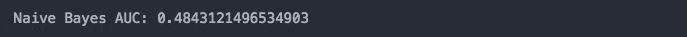

比较同一输入数据集的不同模型的性能很有意思。事实证明，即使是简单的朴素贝叶斯算法也非常适合文本分类任务。部分原因与这个算法的第一个形容词有关:“天真”具体来说，这种特殊的算法假设我们的特征——在这种情况下是全局加权项频率——是相互独立的。这在现实世界中是真的吗？更多的时候，这个假设经常被违背；然而，这种算法的性能即使不比更复杂的模型好，也是一样好。

# Spark随机森林模型

接下来，我们将继续讨论我们的随机森林算法，正如您将从前面的章节中回忆的那样，它是各种决策树的集合，由此我们在各种深度和其他超参数之间交替执行网格搜索，这将是我们所熟悉的:

```scala
import org.apache.spark.ml.classification.{RandomForestClassifier, RandomForestClassificationModel}val rfModelPath= s"$MODELS_DIR/rfModel"val rfModel= {val rfGridSearch = for (rfNumTrees<- Array(10, 15);rfImpurity<- Array("entropy", "gini");rfDepth<- Array(3, 5))yield {println( s"Training random forest: numTrees: $rfNumTrees, impurity $rfImpurity, depth: $rfDepth")val rfModel = new RandomForestClassifier().setFeaturesCol(idf.getOutputCol).setLabelCol("label").setNumTrees(rfNumTrees).setImpurity(rfImpurity).setMaxDepth(rfDepth).setMaxBins(10).setSubsamplingRate(0.67).setSeed(42).setCacheNodeIds(true).fit(trainData)val rfPrediction = rfModel.transform(testData)val rfAUC = new BinaryClassificationEvaluator().setLabelCol("label").evaluate(rfPrediction)println(s" RF AUC on test data: $rfAUC")((rfNumTrees, rfImpurity, rfDepth), rfModel, rfAUC)}println(rfGridSearch.sortBy(-_._3).take(5).mkString("\n"))val bestModel = rfGridSearch.sortBy(-_._3).head._2 // Stress that the model is minimal because of defined gird space^bestModel.write.overwrite.save(rfModelPath)bestModel}
```


从我们的网格搜索来看，我们看到的最高 AUC 是`0.769`。

# Spark GBM 模型

最后，我们将继续讨论我们的**梯度增强机** ( **GBM** )，这将是我们模型集合中的最终模型。请注意，在前面的章节中，我们使用了 H2O 版本的 GBM，但是现在，我们将继续使用 Spark，并使用 Spark 的 GBM 实现，如下所示:

```scala
import org.apache.spark.ml.classification.{GBTClassifier, GBTClassificationModel}val gbmModelPath= s"$MODELS_DIR/gbmModel"val gbmModel= {val model = new GBTClassifier().setFeaturesCol(idf.getOutputCol).setLabelCol("label").setMaxIter(20).setMaxDepth(6).setCacheNodeIds(true).fit(trainData)val gbmPrediction = model.transform(testData)gbmPrediction.show()val gbmAUC = new BinaryClassificationEvaluator().setLabelCol("label").setRawPredictionCol(model.getPredictionCol).evaluate(gbmPrediction)println(s" GBM AUC on test data: $gbmAUC")model.write.overwrite.save(gbmModelPath)model}
```


现在，我们已经训练了四种不同的学习算法:一个(单个)决策树、一个随机森林、朴素贝叶斯和一个梯度增强机器。每个都提供了不同的 AUC，如下表所示。我们可以看到，性能最好的模型是 RandomForest，其次是 GBM。然而，公平地说，我们没有对 GBM 模型执行任何穷尽的搜索，也没有像通常建议的那样使用大量的迭代:

| 决策图表 | Zero point six five nine |
| 朴素贝叶斯 | Zero point four eight four |
| 随机森林 | Zero point seven six nine |
| 马恩岛 | Zero point seven five five |

# 超级学习者模型

现在，我们将结合所有这些算法的预测能力，在神经网络的帮助下生成一个“超级学习者”，该神经网络将每个模型的预测作为输入，然后根据单独训练的模型的猜测，尝试得出更好的预测。从高层次来看，架构看起来像这样:

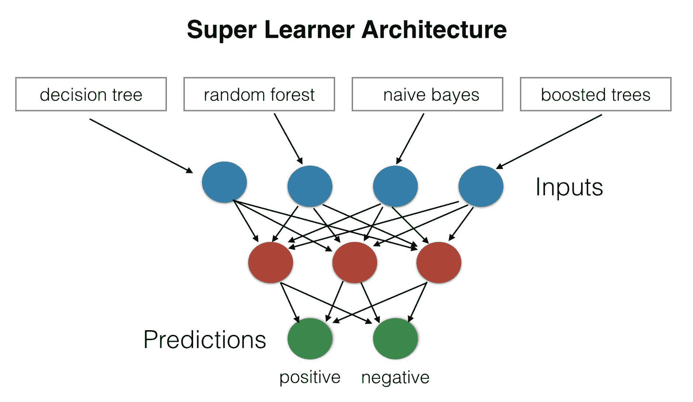

我们将进一步解释构建“超级学习者”背后的直觉和这种方法的好处，并教您如何构建您的 Spark 流应用，该应用将接收您的文本(即您将编写的电影评论)，并通过您每个模型的预测引擎运行它。使用这些预测作为你的神经网络的输入，我们将利用各种算法的综合能力产生积极或消极的情绪。

# 超级学习者

在前面几节中，我们训练了几个模型。现在，我们将使用深度学习模型将它们组合成一个称为超级学习者的集合。构建超级学习者的过程很简单(见上图):

1.  选择基本算法(例如，GLM、随机森林、GBM 等)。
2.  选择元学习算法(例如深度学习)。
3.  在训练集上训练每个基本算法。
4.  对每个学习者进行 K 倍交叉验证，并从每个基本算法中收集交叉验证的预测值。
5.  来自每个基于 L 的算法的 N 个交叉验证的预测值可以被组合以形成新的 NxL 矩阵。这个矩阵和原始响应向量一起被称为“一级”数据。
6.  在一级数据上训练元学习算法。
7.  超级学习器(或所谓的“集成模型”)由基于 L 的学习模型和元学习模型组成，元学习模型可用于在测试集上生成预测。

合奏的关键技巧是将一组不同的强有力的学习者结合在一起。我们已经在随机森林算法的上下文中讨论了类似的技巧。

The PhD thesis of Erin LeDell contains much more detailed information about super learners and their scalability. You can find it at [http://www.stat.berkeley.edu/~ledell/papers/ledell-phd-thesis.pdf](http://www.stat.berkeley.edu/~ledell/papers/ledell-phd-thesis.pdf).

在我们的示例中，我们将通过跳过交叉验证但使用单个保留数据集来简化整个过程。值得一提的是，这不是推荐的方法！

作为第一步，我们使用训练好的模型和一个转移数据集来获得预测，并将它们组成一个新的数据集，用实际的标签来扩充它。

这听起来很容易；但是，我们不能直接使用 *DataFrame#withColumn* 方法，从不同数据集的多个列创建一个新的`DataFrame`，因为该方法只接受左侧的列`DataFrame`或常量列。

然而，我们已经为这种情况准备了数据集，为每一行分配了一个唯一的标识。在这种情况下，我们将使用它并基于`row_id`加入单个模型预测。我们还需要重命名每个模型预测列，以唯一标识数据集中的模型预测:

```scala
import org.apache.spark.ml.PredictionModel 
import org.apache.spark.sql.DataFrame 

val models = Seq(("NB", nbModel), ("DT", dtModel), ("RF", rfModel), ("GBM", gbmModel)) 
def mlData(inputData: DataFrame, responseColumn: String, baseModels: Seq[(String, PredictionModel[_, _])]): DataFrame= { 
baseModels.map{ case(name, model) => 
model.transform(inputData) 
     .select("row_id", model.getPredictionCol ) 
     .withColumnRenamed("prediction", s"${name}_prediction") 
  }.reduceLeft((a, b) =>a.join(b, Seq("row_id"), "inner")) 
   .join(inputData.select("row_id", responseColumn), Seq("row_id"), "inner") 
} 
val mlTrainData= mlData(transferData, "label", models).drop("row_id") 
mlTrainData.show() 
```


该表由模型的预测组成，并用实际标签进行注释。有趣的是，我们可以看到单个模型如何同意/不同意预测值。

我们可以使用相同的转换为我们的超级学习者准备一个验证数据集:

```scala
val mlTestData = mlData(validationData, "label", models).drop("row_id") 
```

现在，我们可以构建我们的元学习器算法。在这种情况下，我们将使用 H2O 机器学习库提供的深度学习算法。然而，这需要一点准备——我们需要将准备好的列车和测试数据作为 H2O 框架发布:

```scala
import org.apache.spark.h2o._ 
val hc= H2OContext.getOrCreate(sc) 
val mlTrainHF= hc.asH2OFrame(mlTrainData, "metaLearnerTrain") 
val mlTestHF= hc.asH2OFrame(mlTestData, "metaLearnerTest") 
```

我们还需要将`label`列转换为分类列。这是必要的；否则，H2O 深度学习算法将执行回归，因为`label`列是数字:

```scala
importwater.fvec.Vecval toEnumUDF= (name: String, vec: Vec) =>vec.toCategoricalVecmlTrainHF(toEnumUDF, 'label).update()mlTestHF(toEnumUDF, 'label).update()
```

现在，我们可以建立一个 H2O 深度学习模型。我们可以直接使用算法的 Java API 但是，由于我们希望将所有步骤组成一个单一的 Spark 管道，因此我们将利用一个包装器来公开 Spark 估算器 API:

```scala
val metaLearningModel= new H2ODeepLearning()(hc, spark.sqlContext).setTrainKey(mlTrainHF.key).setValidKey(mlTestHF.key).setResponseColumn("label").setEpochs(10).setHidden(Array(100, 100, 50)).fit(null)
```

由于我们直接指定了验证数据集，我们可以探索模型的性能:


或者，我们可以打开 H2O 流 UI(通过调用`hc.openFlow`)并以视觉形式探究其表现:


您可以很容易地看到，该模型在验证数据集上的 AUC 为 0.868619 -该值高于单个模型的所有 AUC 值。

# 将所有转换组合在一起

在前一节中，我们使用 Spark 原语开发了各个步骤，即 UDFs、本机 Spark 算法和 H2O 算法。然而，要在看不见的数据上调用所有这些转换需要大量的手动工作。因此，Spark 引入了管道的概念，主要是受 Python scikit 管道([http://sci kit-learn . org/stable/modules/generated/sklearn . pipeline . html](http://scikit-learn.org/stable/modules/generated/sklearn.pipeline.Pipeline.html))的推动。

To learn more about the design decision behind Python, we recommend that you read the excellent paper "API design for machine learning software: experiences from the scikit-learn project" by Lars Buitinck et al ([https://arxiv.org/abs/1309.0238](https://arxiv.org/abs/1309.0238)).

管道由估算器和转换表示的阶段组成:

*   **评估者**:这些是展示创建模型的拟合方法的核心元素。大多数分类和回归算法都表示为一个估计量。
*   **变形器**:这些变形器将输入数据集转换成新的数据集。变形金刚暴露方法`transform`，实现变形的逻辑。变压器可以在多个矢量上产生单个。估计器产生的大多数模型都是转换器——它们将输入数据集转换成表示预测的新数据集。另一个例子可以是本节中使用的 TF 变压器。

管道本身公开了与估计器相同的接口。它有 fit 方法，所以可以训练它并产生一个“管道模型”，可以用于数据转换(它有与 transformers 相同的接口)。因此，管道可以分层组合在一起。此外，以顺序调用各个流水线阶段；但是，它们仍然可以表示有向无环图(例如，一个阶段可以有两个输入列，每个列由不同的阶段产生)。在这种情况下，顺序必须遵循图的拓扑顺序。

在我们的例子中，我们将把所有的转换组合在一起。然而，我们不会定义一个训练管道(也就是说，一个将训练所有模型的管道)，但是我们将使用已经训练好的模型来设置管道阶段。我们的动机是定义一个管道，我们可以用它来评分新的电影评论。

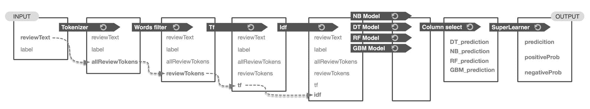

因此，让我们从示例的开头开始——我们对输入数据应用的第一个操作是一个简单的标记器。它是由一个 Scala 函数定义的，我们把它包装成一个 Spark UDF 的形式。然而，要将其用作管道的一部分，我们需要将定义的 Scala 函数包装成一个转换。Spark 没有为此提供任何简单的包装器，因此有必要从头定义一个通用转换。我们知道我们将把一个单独的列转换成一个新的列。在这种情况下，我们可以使用`UnaryTransformer`，它精确地定义了一对一的列转换。我们可以更通用一点，并为 Scala 函数定义一个通用包装器(又名Spark UDFs):

```scala
import org.apache.spark.ml.{Pipeline, UnaryTransformer} 
import org.apache.spark.sql.types._ 
import org.apache.spark.ml.param.ParamMapimport org.apache.spark.ml.util.{MLWritable, MLWriter} 

class UDFTransformer[T, U](override valuid: String, 
                           f: T =>U, inType: DataType, outType: DataType) 
extendsUnaryTransformer[T, U, UDFTransformer[T, U]] with MLWritable { 

override protected defcreateTransformFunc: T =>U = f 

override protected defvalidateInputType(inputType: DataType): Unit = require(inputType == inType) 

override protected defoutputDataType: DataType = outType 

override defwrite: MLWriter = new MLWriter { 
override protected defsaveImpl(path: String): Unit = {} 
 } 
} 
```

`UDFTransformer`类包装一个函数`f`，该函数接受一个泛型类型`T`，并生成类型`U`。在 Spark 数据集级别，它将类型为`inType`的输入列(参见`UnaryTransformer`)转换为类型为`outType`的新输出列(同样，该字段由`UnaryTransformer`定义)。该类还有一个特性`MLWritable`的虚拟实现，支持将转换器序列化为文件。

现在，我们只需要定义我们的令牌转换器:

```scala
val tokenizerTransformer= new UDFTransformer[String, Array[String]]("tokenizer", toTokens.curried(MIN_TOKEN_LENGTH)(stopWords),StringType, new ArrayType(StringType, true))
```

已定义的转换器接受一个字符串列(即电影评论)，并生成一个包含表示电影评论标记的字符串数组的新列。变压器直接使用`toTokens`功能，这是我们在本章开头使用的。

下一个转换应该移除稀有词。在这种情况下，我们将使用与上一步类似的方法，并利用定义的`UDFTransformer`函数:

```scala
val rareTokensFilterTransformer= new UDFTransformer[Seq[String], Seq[String]]("rareWordsRemover",rareTokensFilter.curried(rareTokens),newArrayType(StringType, true), new ArrayType(StringType, true))
```

此转换器接受包含标记数组的列，并生成包含筛选后的标记数组的新列。它正在使用已经定义的`rareTokensFilter` Scala 函数。

So far, we have not specified any input data dependencies, including names of input columns. We will keep it for the final pipeline definition.

接下来的步骤包括在`TF`方法的帮助下向量化，将字符串标记散列到一个大的数字空间中，然后基于构建的`IDF`模型进行转换。两个变换都已经以预期的形式定义了-第一个`hashingTF`变换已经是一个将一组标记转换成数字向量的变换器，第二个`idfModel`接受数字向量并基于计算的系数对其进行缩放。

这些步骤为训练好的二项式模型提供输入。每个基本模型代表一个产生几个新列的转换器，例如预测、原始预测和概率。然而，重要的是要提到，并不是所有的模型都提供完整的列集。例如，Spark GBM 目前(Spark 2 . 0 . 0 版)仅提供预测列。然而，对于我们的例子来说，这已经足够好了。

生成预测后，我们的数据集包含许多列；例如，输入列、带有标记的列、转换后的标记等。然而，为了应用生成的元学习器，我们只需要具有由基础模型生成的预测的列。因此，我们将定义一个列选择器转换，删除所有不必要的列。在这种情况下，我们有一个具有 N 列的接受转换的数据集，并生成一个具有 M 列的新数据集。因此，我们不能使用前面定义的`UnaryTransformer`，我们需要定义一个新的临时转换，称为`ColumnSelector`:

```scala
import org.apache.spark.ml.Transformer 
class ColumnSelector(override valuid: String, valcolumnsToSelect: Array[String]) extends Transformer with MLWritable { 

  override deftransform(dataset: Dataset[_]): DataFrame= { 
    dataset.select(columnsToSelect.map(dataset.col): _*) 
  } 

  override deftransformSchema(schema: StructType): StructType = { 
    StructType(schema.fields.filter(col=>columnsToSelect.contains(col.name))) 
  } 

  override defcopy(extra: ParamMap): ColumnSelector = defaultCopy(extra) 

  override defwrite: MLWriter = new MLWriter { 
    override protected defsaveImpl(path: String): Unit = {} 
  } 
} 
```

`ColumnSelector`表示一个通用转换器，它只从输入数据集中选择给定的列。重要的是要提到两个阶段的概念——第一个阶段转换模式(即与每个数据集相关联的元数据)，第二个阶段转换实际数据集。这种分离允许 Spark 在调用实际数据转换之前调用对转换器的早期检查，以发现不兼容之处。

我们需要通过创建`columnSelector`的实例来定义实际的列选择器转换器——注意指定要保留的正确列:

```scala
val columnSelector= new ColumnSelector( 
  "columnSelector",  Array(s"DT_${dtModel.getPredictionCol}", 
  s"NB_${nbModel.getPredictionCol}", 
  s"RF_${rfModel.getPredictionCol}", 
  s"GBM_${gbmModel.getPredictionCol}") 
```

此时，我们的变形金刚已经准备好进入最终的“超级学习”管道。管道的应用编程接口很简单——它接受顺序调用的单个阶段。然而，我们仍然需要指定各个阶段之间的依赖关系。依赖关系主要由输入和输出列名描述:

```scala
val superLearnerPipeline = new Pipeline() 
 .setStages(Array( 
// Tokenize 
tokenizerTransformer 
     .setInputCol("reviewText") 
     .setOutputCol("allReviewTokens"), 
// Remove rare items 
rareTokensFilterTransformer 
     .setInputCol("allReviewTokens") 
     .setOutputCol("reviewTokens"), 
hashingTF, 
idfModel, 
dtModel 
     .setPredictionCol(s"DT_${dtModel.getPredictionCol}") 
     .setRawPredictionCol(s"DT_${dtModel.getRawPredictionCol}") 
     .setProbabilityCol(s"DT_${dtModel.getProbabilityCol}"), 
nbModel 
     .setPredictionCol(s"NB_${nbModel.getPredictionCol}") 
     .setRawPredictionCol(s"NB_${nbModel.getRawPredictionCol}") 
     .setProbabilityCol(s"NB_${nbModel.getProbabilityCol}"), 
rfModel 
     .setPredictionCol(s"RF_${rfModel.getPredictionCol}") 
     .setRawPredictionCol(s"RF_${rfModel.getRawPredictionCol}") 
     .setProbabilityCol(s"RF_${rfModel.getProbabilityCol}"), 
gbmModel// Note: GBM does not have full API of PredictionModel 
.setPredictionCol(s"GBM_${gbmModel.getPredictionCol}"), 
columnSelector, 
metaLearningModel 
 )) 
```

有几个重要的概念值得一提:

*   `tokenizerTransformer`和`rareTokensFilterTransformer`通过`allReviewTokens`栏目连接——第一个是栏目制作方，第二个是栏目消费方。
*   `dtModel`、`nbModel`、`rfModel`和`gbmModel`型号的输入栏定义为`idf.getOutputColumn`。在这种情况下，我们有效地使用了计算 DAG，它是拓扑有序的序列
*   所有模型都有相同的输出列(在 GBM 的情况下，有一些例外)，它们不能一起追加到结果数据集中，因为管道需要唯一的列名。因此，我们需要通过调用`setPredictionCol`、`setRawPredictionCol`和`setProbabilityCol`来重命名模型的输出列。值得一提的是，GBM 现在不生成原始预测和概率列。

现在，我们可以拟合管道以获得管道模型。事实上，这是一个空操作，因为我们的管道只由变压器组成。但是，我们仍然需要调用`fit`方法:

```scala
val superLearnerModel= superLearnerPipeline.fit(pos)
```

瞧，我们有我们的超级学习者模型，由多个 Spark 模型组成，并由 H2O 深度学习模型编排。是时候用模型做个预测了！

# 使用超级学习者模型

模型的使用很简单——我们需要提供一个名为`reviewText`的单列数据集，并用`superLearnerModel`进行转换:

```scala
val review = "Although I love this movie, I can barely watch it, it is so real....."val reviewToScore= sc.parallelize(Seq(review)).toDF("reviewText")val reviewPrediction= superLearnerModel.transform(reviewToScore)
```

返回的预测`reviewPrediction`是具有以下结构的数据集:

```scala
reviewPrediction.printSchema()
```

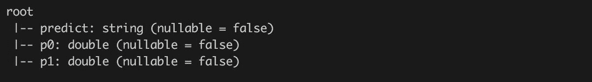

第一列包含基于 F1 阈值决定的预测值。列`p0`和`p1`表示各个预测类别的概率。

如果我们探究返回数据集的内容，它包含一行:

```scala
reviewPrediction.show()
```

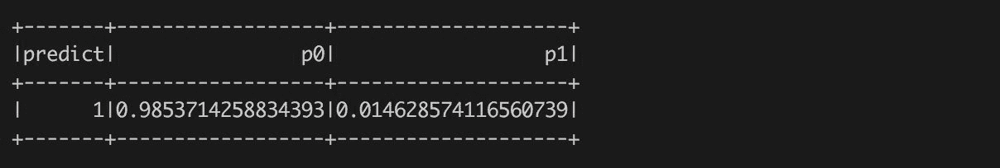

# 摘要

本章展示了三个强大的概念:文本处理、Spark 管道和超级学习者。

文本处理是一个强大的概念，正等待被业界广泛采用。因此，我们将在接下来的章节中深入探讨这个主题，并研究自然语言处理的其他方法。

Spark 管道也是如此，它已经成为 Spark 固有的一部分，也是 Spark ML 包的核心。它们提供了一种在训练和评分期间重用相同概念的优雅方式。因此，我们也希望在接下来的章节中使用这个概念。

最后，通过超级学习者，也就是集成，你学到了如何在元学习者的帮助下将多个模型集成在一起并从中受益的基本概念。这提供了一种简单但强大的方法来培养强大的学习者，这些学习者仍然足够简单易懂。**