# 用于预测和聚类的单词 2

在前面的章节中，我们通过创建**术语频率-反向文档频率** ( **TF-IDF** )矩阵来完成预测电影评论情感的监督学习任务，从而涵盖了一些基本的 NLP 步骤，例如标记化、停用词列表移除和特征创建。在这一章中，我们将扩展我们之前的例子，现在包括单词向量的惊人力量，这是由谷歌研究人员托马斯·米科洛夫和伊利亚·萨斯凯弗在他们的论文《单词和短语的分布式表示及其组成》中推广的。

我们将从单词向量背后的动机的简要概述开始，利用我们对以前的 NLP 特征提取技术的理解，然后我们将解释表示 word2vec 框架的算法家族背后的概念(事实上，word2vec 不仅仅是一个单一的算法)。然后，我们将讨论 word2vec 的一个非常流行的扩展，称为 doc2vec，由此我们对将整个文档矢量化为 N 个数字的单个固定数组感兴趣。我们将进一步研究这个非常受欢迎的自然语言处理领域，即认知计算研究。接下来，我们将对电影评论数据集应用 word2vec 算法，检查结果单词向量，并通过取单个单词向量的平均值来创建文档向量，以便执行监督学习任务。最后，我们将使用这些文档向量来运行一个聚类算法，看看我们的电影评论向量组合得有多好。

鉴于词向量编码单个词的语义和句法意义的能力，词向量的能力是一个爆炸性的研究领域，谷歌和脸书等公司已经投入巨资，我们将很快讨论这一点。Spark 实现了自己版本的 word2vec 并不是巧合，这也可以在谷歌的 Tensorflow 库和脸书的 Torch 中找到。最近，脸书宣布了一种新的实时文本处理技术，称为深度文本，使用他们预先训练的单词向量，在其中他们展示了他们对这项惊人技术的信念，以及它对他们的业务应用程序已经或正在产生的影响。然而，在这一章中，我们将只涉及这个令人兴奋的领域的一小部分，包括以下内容:

*   word2vec 算法说明
*   概括了 word2vec 的思想，产生了 doc2vec
*   两种算法在电影评论数据集上的应用

# 词向量的理据

与我们在上一章中所做的工作类似，传统的自然语言处理方法依赖于将单个单词(我们通过标记化创建的)转换成计算机算法可以学习的格式(即预测电影情绪)。这样做需要我们通过创建一个 TF-IDF 矩阵，将 *N* 标记的单个评论转换成一个固定的表示。这样做，我们在幕后做了两件重要的事情*:*

 *1.  单个单词被分配了一个整数标识(例如，散列)。例如，单词*朋友*可能被分配到 39，584，而单词*最佳*可能被分配到 99，928，472。认知上，我们知道*朋友*和*闺蜜*很像；然而，通过将这些标记转换成整数标识，任何相似性的概念都会丢失。
2.  通过将每个令牌转换成一个整数标识，我们就失去了使用该令牌的上下文。这很重要，因为为了理解单词的认知意义，从而训练计算机学习*朋友*和*闺蜜*是相似的，我们需要理解这两个标记是如何使用的(例如，它们各自的上下文)。

鉴于传统自然语言处理技术在对单词的语义和句法含义进行编码方面的功能有限，托马斯·米科洛夫和其他研究人员探索了利用神经网络将单词的含义更好地编码为数字向量的方法(例如，向量 *bestie* = [0.574，0.821，0.756，..., 0.156]).当计算正确时，我们会发现 *bestie* 和 *friend* 的向量在空间上是接近的，由此接近度被定义为余弦相似度。事实证明，这些向量表示(通常称为*单词嵌入*)让我们能够捕捉到对文本更丰富的理解。

有趣的是，使用单词嵌入还使我们能够跨多种语言学习相同的语义，尽管书面形式有所不同(例如，日语和英语)。比如电影的日语单词是*eiga*()；因此，使用单词向量，这两个单词*电影*和 *、*应该在向量空间中接近，尽管它们在外观上有所不同。因此，嵌入这个词允许应用程序与语言无关——这也是这项技术如此受欢迎的另一个原因！

# Word2vec 解释道

首先:word2vec 并不代表一个单一的*算法，而是一系列试图将单词的语义和句法*含义*编码为 *N* 个数字的向量(因此，单词到向量= word2vec)。我们将在本章中深入探讨这些算法中的每一个，同时也让您有机会阅读/研究文本的*矢量化*的其他领域，这可能会对您有所帮助。*

 *# 什么是词向量？

最简单的形式是，一个单词向量仅仅是一个热编码，向量中的每个元素代表我们词汇表中的一个单词，给定的单词是用`1`编码的*，而所有其他单词元素是用`0`编码的。假设我们的词汇只有以下电影术语:**爆米花****糖果****汽水****门票****大片**。*

 *按照我们刚才解释的逻辑，我们可以将术语**票**编码如下:


使用这种简单的编码形式，这就是我们在创建一个单词包矩阵时所做的，我们无法在单词之间进行有意义的比较(例如，*是与 Soda 相关的爆米花；糖果和门票相似吗？)*。

鉴于这些明显的限制，word2vec 试图通过单词的分布式表示来弥补这一点。假设对于每个单词，我们有一个分布式向量，比如说，300 个代表单个单词的数字，由此我们词汇表中的每个单词也由这 300 个元素的权重分布来表示。现在，我们的图片会发生巨大的变化，看起来像这样:


现在，假设单个单词的分布式表示为 300 个数值，例如，我们可以使用余弦相似度在单词之间进行有意义的比较。也就是说，使用**票据**和**苏打**的向量，我们可以确定这两个术语不相关，给定它们的向量表示和它们彼此的余弦相似性。这不是我们能做的全部！在他们开创性的论文中，Mikolov 等人。al 还执行了单词向量的数学功能，做出了一些令人难以置信的发现；特别是，作者将以下*数学问题*添加到他们的 word 2 电子词典中:

*V(国王)- V(男人)+ V(女人)~ V(女王)*

事实证明，这些单词的分布式向量表示在比较问题中极其强大(例如，A 和 B 有关系吗？)，当你考虑到这些语义和句法知识是在没有其他必要信息的情况下通过观察大量单词及其上下文而获得的时候，这一点就显得更加突出了。也就是说，我们不必告诉我们的机器*爆米花*是食物、名词、单数等等。

这是如何实现的？Word2vec 以有监督的方式利用神经网络的能力来学习单词的向量表示(这是一项无监督的任务)。如果一开始这听起来有点矛盾，那就不要害怕！有了几个例子，一切都会变得更加清晰，首先从**连续单词包**模型开始，通常被称为只是 **CBOW** 模型。

# CBOW 模型

首先，让我们考虑一个简单的电影评论，它将在接下来的几节中作为我们的基础示例:

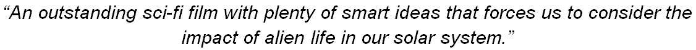

现在，假设我们有一个充当滑块的窗口，其中包括当前处于焦点的主词(在下图中以红色突出显示)，以及焦点词前后的五个词(以黄色突出显示):


黄色的单词构成了当前焦点单词*思想*的上下文。这些上下文词作为前馈神经网络的输入，每个词通过一个隐藏层和一个输出层的一次热编码(所有其他元素归零)进行编码:

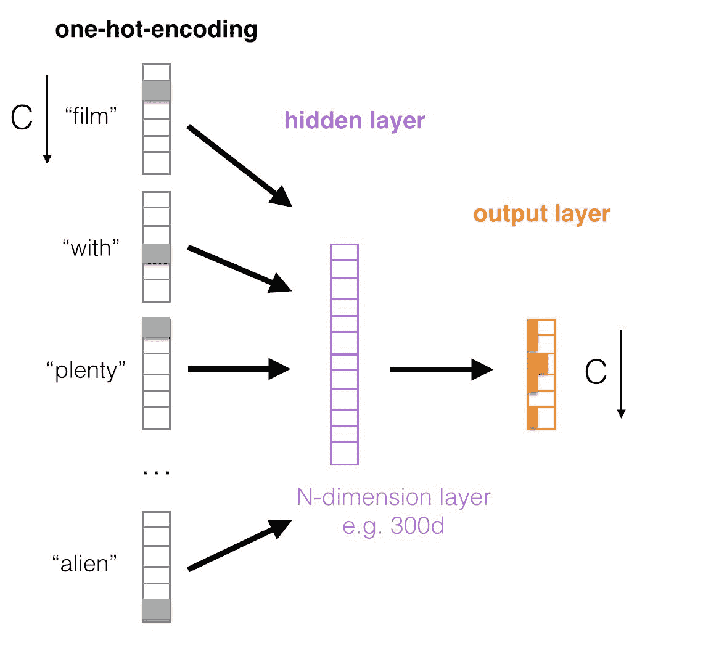

在上图中，我们词汇的总大小(例如，后标记化)用大写的 C 表示，由此我们对上下文窗口中的每个单词执行一次热编码，在这种情况下，我们的焦点单词前后的五个单词，即 *ideas* 。在这一点上，我们通过加权和将编码向量传播到我们的隐藏层，就像*标准*前馈神经网络一样，由此，我们预先指定隐藏层中的权重数量。最后，从单个隐藏层向输出层应用 sigmoid 函数，该函数试图预测当前的焦点单词。这是通过最大化观察焦点单词( *idea* )的条件概率来实现的，给定其周围单词的上下文( **film** ，**带有**，**大量**，**的**， **smart** ，**关于**，**的**，**撞击**，**的**，以及**外星人**请注意，输出层的大小也与我们的初始词汇表 c 相同。

word2vec 算法的两个家族都有一个有趣的特性:它本质上是一个无监督的学习算法，依靠有监督的学习来学习单个单词向量。对于 CBOW 模型和 skip-gram 模型来说都是如此，我们接下来将介绍这一点。请注意，在写这本书的时候，Spark 的 MLlib 只包含了 word2vec 的 skip-gram 模型。

# 跳跃式模型

在前面的模型中，我们使用焦点词前后的词窗口来预测焦点词。skip-gram 模型采用了类似的方法，但颠倒了神经网络的结构。也就是说，我们将从焦点词作为我们网络的输入开始，然后尝试使用单个隐藏层来预测周围的上下文词:

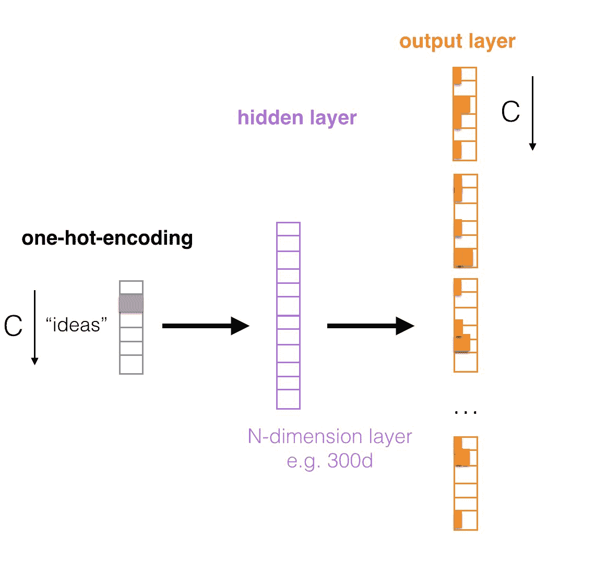

如您所见，skip-gram 模型与 CBOW 模型完全相反。网络的训练目标是最小化输出层中所有上下文词的合计预测误差，在我们的示例中，输出层是*思想的输入*和预测*电影*、*的输出层，其中*、*大量*、*的*、*智能*、*关于*、*的*、*影响*、

*In the previous chapter, you saw that we used a tokenization function that removed stopwords, such as *the*, *with*, *to*, and so on, which we have not shown here intentionally to clearly convey our examples without losing the reader. In the example that follows, we will perform the same tokenization function as [Chapter 4](4.html#2C9D00-d18ba71168a441bd917775fac13ca893), *Predicting Movie Reviews Using NLP and Spark Streaming*, which will remove the stopwords.

# 单词向量的乐趣

既然我们已经把单词(记号)压缩成了数字的向量，我们就可以和它们玩得开心了。下面是谷歌原创论文中的几个经典例子，你可以自己尝试一下:

*   **数学运算**:如前所述，这方面的典范是 *v(国王)- v(男人)+ v(女人)~ v(女王)*。使用简单的加法，比如 *v(软件)+ v(工程师)*，我们可以得出一些引人入胜的关系；这里还有几个例子:

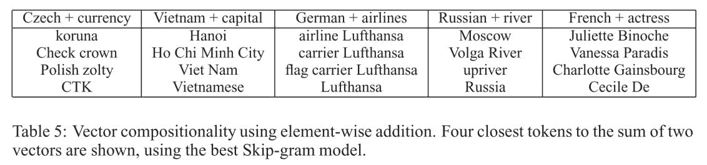

*   **相似度**:假设我们正在使用一个向量空间，我们可以使用余弦相似度来比较一个标记和多个标记，以便看到相似的标记。例如，类似于 *v(Spark)*的词可能是 *v(MLlib)* 、 *v(斯卡拉)*、 *v(石墨烯)*等等。
*   **匹配/不匹配**:给定列表中的哪些单词不在一起？比如*不 _ 匹配【v(午餐、晚餐、早餐、东京)】== v(东京)*。
*   **A 对 B 就像 C 对？**:根据谷歌的论文，这里有一个单词比较的列表，可以使用 word2vec 的 skip-gram 实现:

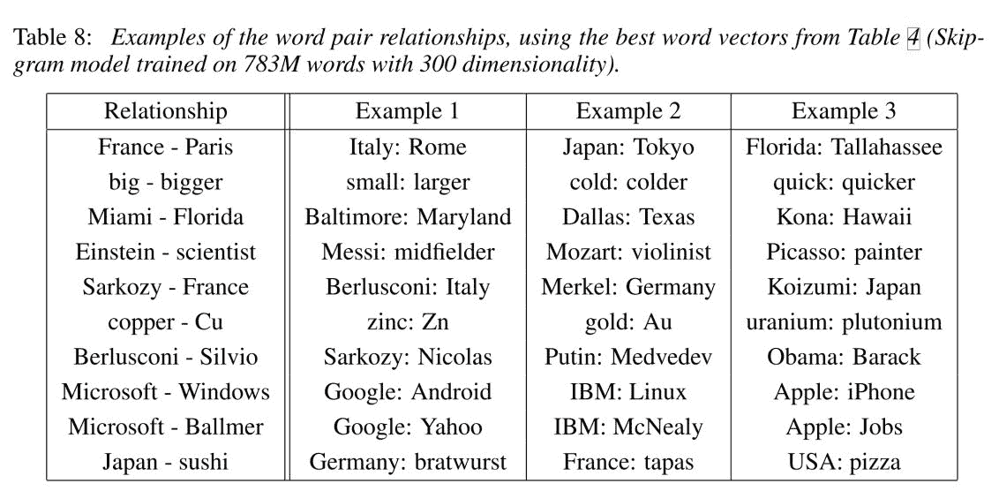

# 余弦相似性

词的相似性/不相似性是通过余弦相似性来衡量的，余弦相似性有一个非常好的性质，即被束缚在`-1`和`1`之间。两个词完全相似会产生`1`的分数，没有关系会产生`0`，而`-1`意味着它们是对立的。

Note that the cosine similarity function for the word2vec algorithm (again, just the CBOW implementation in Spark, for now) is already baked into MLlib, which we will see shortly.

请看下图:

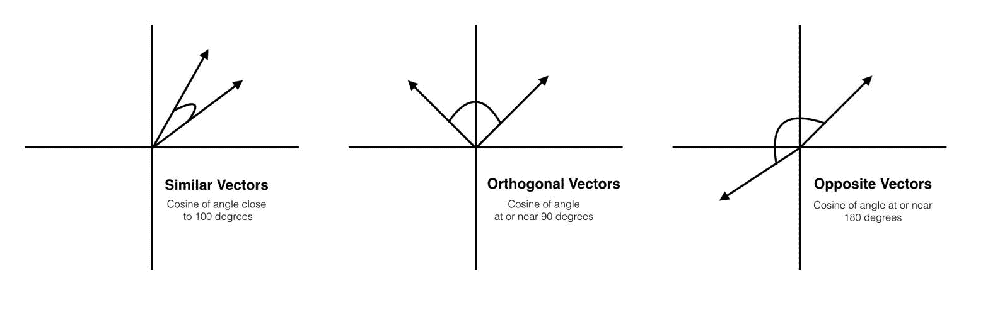

对于那些对其他相似性度量感兴趣的人来说，最近发表的一项研究有力地证明了使用**地球移动者距离** ( **EMD** )是一种不同于余弦相似性的方法，需要一些额外的计算，但显示出有希望的早期结果。

# Doc2vec 解释道

正如我们在本章介绍中提到的，word2vec 有一个扩展，它对整个*文档*进行编码，而不是对单个单词进行编码。在这种情况下，文档就是你对它的理解，无论是一个句子、一个段落、一篇文章、一篇文章等等。不足为奇的是，这篇论文是在 word2vec 的原始论文之后发表的，但也不足为奇的是，它是由 Tomas Mikolov 和 Quoc Le 合著的。尽管 MLlib 还没有将 doc2vec 引入到他们的稳定算法中，但我们认为数据科学从业者有必要了解 word2vec 的这种扩展，因为它有望在监督学习和信息检索任务中产生结果。

像 word2vec 一样，doc2vec(有时称为*段落向量*)依赖于监督学习任务来学习基于上下文单词的文档分布式表示。Doc2vec 也是一个算法家族，因此该架构看起来与您在前面几节中学习的 word2vec 的 CBOW 和 skip-gram 模型极其相似。正如您接下来将看到的，实现 doc2vec 将需要对单个单词向量和文档向量进行并行训练，这些向量表示我们认为的*文档*。

# 分布式内存模型

doc2vec 的这种特殊风格非常类似于 word2vec 的 CBOW 模型，算法试图预测一个*焦点词*，给定其周围的*上下文词*，但是增加了一个段落 ID。把它想象成另一个单独的上下文单词向量，它有助于预测任务，但在我们认为是文档的整个过程中是不变的。继续我们之前的示例，如果我们有这个电影评论(我们将一个文档定义为一个电影评论)，并且我们的焦点词是*创意*，那么我们现在将有以下架构:

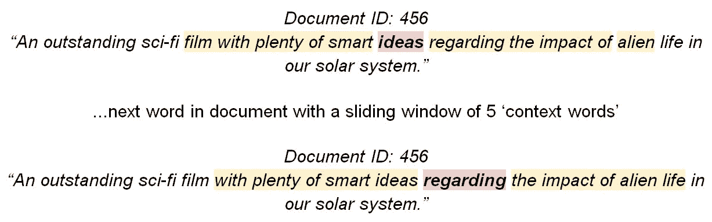

请注意，当我们向下移动文档并将*焦点词*从*想法*更改为*关于*，我们的上下文词显然会发生变化；但是**文件编号:456** 保持不变。这是 doc2vec 中的一个关键点，因为文档标识用于预测任务:

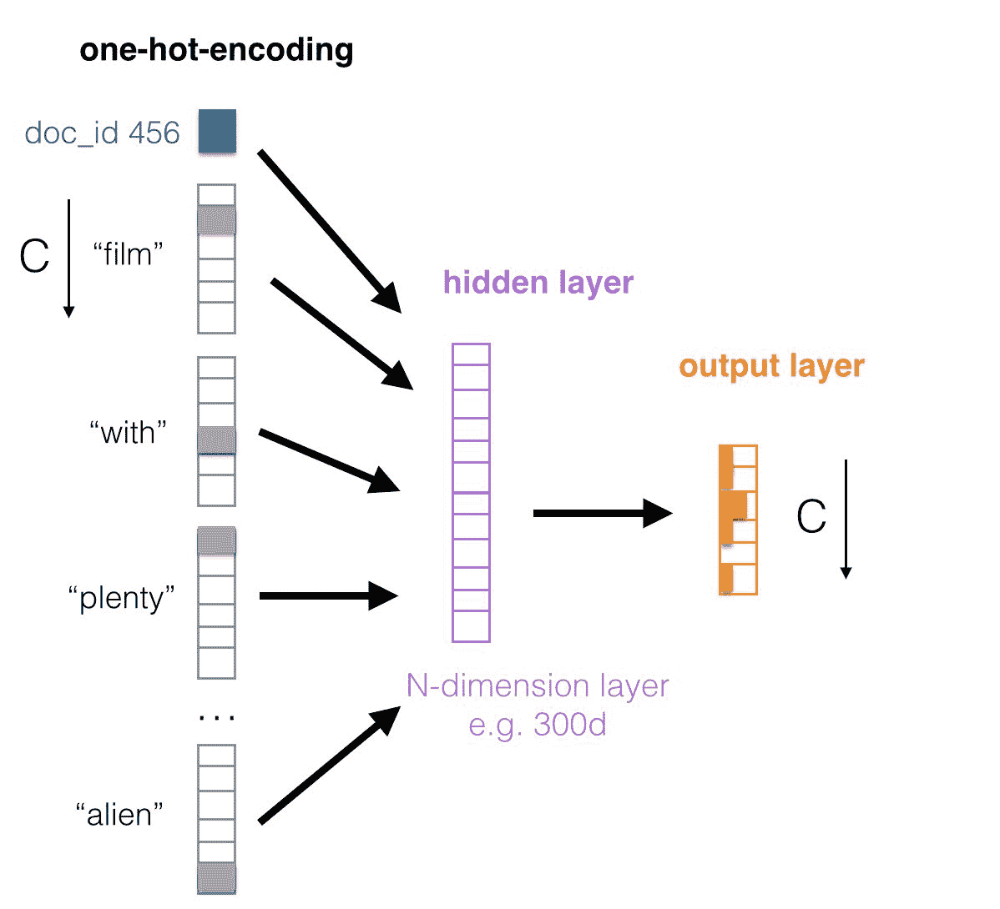

# 分布式单词包模型

doc2vec 中的最后一个算法是仿照 word2vec 的 skip-gram 模型，只有一个例外——我们现在将文档 ID 作为输入，尝试预测从文档中随机采样的*单词，而不是使用 *focus* 单词作为输入。也就是说，我们将完全忽略输出中的上下文单词:*

 *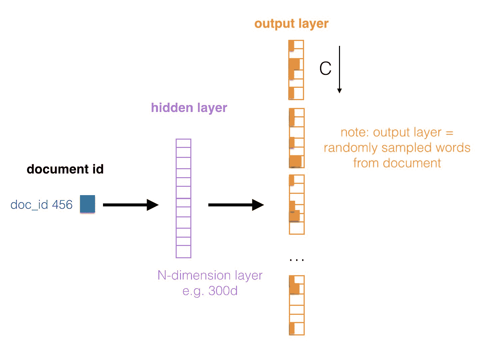

像 word2vec 一样，我们可以使用这些*段落向量*来获取 N 个单词的文档的相似性，这些段落向量在有监督和无监督的任务中都被证明非常成功。以下是米科洛夫等人的一些实验。值得注意的是，al ran 使用了监督任务，该任务利用了我们在前两章中使用的相同数据集！

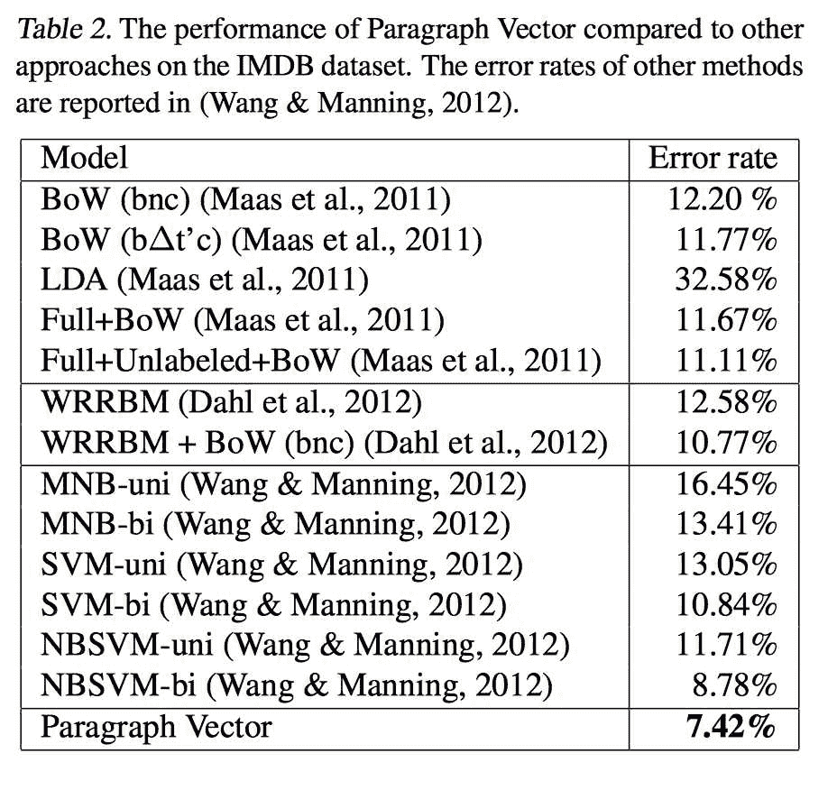

信息检索任务(三段，第一段应*音*比第三段更接近第二段):

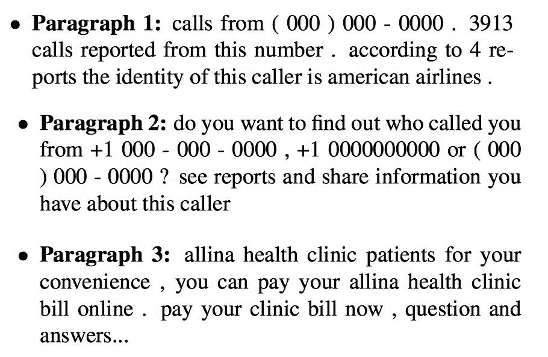

在接下来的部分中，我们将通过取单个单词向量的平均值来创建一个*穷人的文档向量*，以形成我们的文档向量，它将把整个 n 长度的电影评论编码成维数为 300 的向量。

At the time of writing this book, Spark's MLlib does not have an implementation of doc2vec; however, there are many projects that are leveraging this technology, which are in the incubation phase and which you can test out.

# 应用 word2vec，用向量探索我们的数据

现在，您已经很好地理解了 word2vec、doc2vec 以及单词向量的强大功能，现在是我们将注意力转向原始 IMDB 数据集的时候了，我们将据此执行以下预处理:

*   将每个电影评论中的单词拆分一个空格
*   删除标点符号
*   删除停止词和所有字母数字单词
*   使用上一章中的标记化函数，我们将以逗号分隔的单词数组结束

Because we have already covered the preceding steps in [Chapter 4](4.html#2C9D00-d18ba71168a441bd917775fac13ca893), *Predicting Movie Reviews Using NLP and Spark Streaming*, we'll quickly reproduce them in this section.

像往常一样，我们从启动 Spark shell 开始，这是我们的工作环境:

```scala
export SPARKLING_WATER_VERSION="2.1.12" 
export SPARK_PACKAGES=\ 
"ai.h2o:sparkling-water-core_2.11:${SPARKLING_WATER_VERSION},\ 
ai.h2o:sparkling-water-repl_2.11:${SPARKLING_WATER_VERSION},\ 
ai.h2o:sparkling-water-ml_2.11:${SPARKLING_WATER_VERSION},\ 
com.packtpub:mastering-ml-w-spark-utils:1.0.0" 

$SPARK_HOME/bin/spark-shell \ 
        --master 'local[*]' \ 
        --driver-memory 8g \ 
        --executor-memory 8g \ 
        --conf spark.executor.extraJavaOptions=-XX:MaxPermSize=384M \ 
        --conf spark.driver.extraJavaOptions=-XX:MaxPermSize=384M \ 
        --packages "$SPARK_PACKAGES" "$@"
```

在准备好的环境中，我们可以直接加载数据:

```scala
val DATASET_DIR = s"${sys.env.get("DATADIR").getOrElse("data")}/aclImdb/train"val FILE_SELECTOR = "*.txt" 

case class Review(label: Int, reviewText: String) 
val positiveReviews = spark.read.textFile(s"$DATASET_DIR/pos/$FILE_SELECTOR").map(line => Review(1, line)).toDFval negativeReviews = spark.read.textFile(s"$DATASET_DIR/neg/$FILE_SELECTOR").map(line => Review(0, line)).toDFvar movieReviews = positiveReviews.union(negativeReviews)
```

我们还可以定义标记化函数，将评论分成标记，去掉所有常用词:

```scala
import org.apache.spark.ml.feature.StopWordsRemoverval stopWords = StopWordsRemover.loadDefaultStopWords("english") ++ Array("ax", "arent", "re")val MIN_TOKEN_LENGTH = 3val toTokens = (minTokenLen: Int, stopWords: Array[String], review: String) =>review.split("""\W+""").map(_.toLowerCase.replaceAll("[^\\p{IsAlphabetic}]", "")).filter(w => w.length > minTokenLen).filter(w => !stopWords.contains(w))
```

准备好所有构建块后，我们只需将它们应用于加载的输入数据，并通过一个新的列`reviewTokens`对它们进行扩充，该列包含从评论中提取的单词列表:

```scala
val toTokensUDF = udf(toTokens.curried(MIN_TOKEN_LENGTH)(stopWords))movieReviews = movieReviews.withColumn("reviewTokens", toTokensUDF('reviewText))
```

`reviewTokens`栏是 word2vec 模型的完美输入。我们可以使用 Spark ML 库来构建它:

```scala
val word2vec = new Word2Vec().setInputCol("reviewTokens").setOutputCol("reviewVector").setMinCount(1)val w2vModel = word2vec.fit(movieReviews)
```

Spark 实现有几个附加的超参数:

*   `setMinCount`:这是我们可以创造一个单词的最小频率。这是另一个处理步骤，这样模型就不会以极低的计数运行。
*   `setNumIterations`:通常情况下，我们看到迭代次数越多，得到的*词向量就越精确*(把这些看作是传统前馈神经网络中的纪元数)。默认值设置为`1`。
*   `setVectorSize`:这是我们声明向量大小的地方。可以是任意整数，默认大小为`100`。许多经过预处理的*公共*单词向量倾向于更大的向量大小；然而，这完全依赖于应用程序。
*   `setLearningRate`:就像我们在[第二章](2.html#147LC0-d18ba71168a441bd917775fac13ca893)*中了解到的*常规*神经网络一样，探测暗物质——希格斯玻色子粒子，*数据科学家需要一定的判断力——学习率太少，模型需要一天一天才能收敛。然而，如果学习速率太大，网络中学习权重的集合可能不是最优的。默认值为`0`。

现在我们的模型已经完成，是时候检查我们的一些单词向量了！回想一下，当你不确定你的模型能产生什么值时，总是点击*标签*按钮，如下所示:

```scala
w2vModel.findSynonyms("funny", 5).show()
```

输出如下:


让我们后退一步，考虑一下我们刚才在这里做了什么。首先，我们将单词*滑稽的*压缩为一个由 100 个浮点数组成的向量(回想一下，这是 word2vec 算法的 Spark 实现的默认值)。因为我们已经将评论语料库中的所有单词简化为 100 个数字的相同分布式表示，所以我们可以使用余弦相似度进行比较，这是我们的结果集中的第二个数字所反映的(在这种情况下，最高的余弦相似度是单词*【坚果】* ) *。*

请注意，我们也可以使用`getVectors`函数访问*滑稽*或字典中任何其他单词的向量，如下所示:

```scala
w2vModel.getVectors.where("word = 'funny'").show(truncate = false)
```

输出如下:


在基于这些表示将相似的单词聚类在一起方面，已经做了很多有趣的研究。我们将在本章的后面重新讨论聚类，当我们在下一节执行 doc2vec 的黑客版本后，我们将尝试聚类类似的电影评论。

# 创建文档向量

因此，现在我们可以创建向量来编码单词的*含义*，并且我们知道任何给定的电影评论标记化后都是一组 *N* 单词，我们可以通过取组成评论的所有单词的平均值来开始创建穷人的 doc2vec。也就是说，对于每次审核，通过对单个单词向量求平均值，我们会丢失单词的特定排序，这取决于您的应用程序的敏感度，可能会有所不同:

*v(word _ 1)+v(word _ 2)+v(word _ 3)...v(word_Z) / count(正在复习的单词)*

理想情况下，可以使用 doc2vec 风格来创建文档向量；然而，在撰写本书时，doc2vec 还没有在 MLlib 中实现，所以目前，我们将使用这个简单的版本，正如您将看到的，它有令人惊讶的结果。幸运的是，如果 word2vec 模型包含一个标记列表，那么该模型的 Spark ML 实现已经对单词向量进行了平均。例如，我们可以显示短语*搞笑电影*的向量等于`funny`和`movie`标记向量的平均值:

```scala
val testDf = Seq(Seq("funny"), Seq("movie"), Seq("funny", "movie")).toDF("reviewTokens")w2vModel.transform(testDf).show(truncate=false)
```

输出如下:


因此，我们可以通过简单的模型转换来准备 doc2vec 的简单版本:

```scala
val inputData = w2vModel.transform(movieReviews)
```

As practitioners in this field, we have had the unique opportunity to work with various flavors of document vectors, including word averaging, doc2vec, LSTM auto-encoders, and skip-thought vectors. What we have found is that for small word snippets, where the sequencing of words isn't crucial, the simple word averaging does a surprisingly good job as supervised learning tasks. That is, not to say that it could be improved with doc2vec and other variants but is rather an observation based on the many use cases we have seen across various customer applications.

# 监督学习任务

和前一章一样，我们需要准备训练和验证数据。在这种情况下，我们将重用 Spark API 来拆分数据:

```scala
val trainValidSplits = inputData.randomSplit(Array(0.8, 0.2))val (trainData, validData) = (trainValidSplits(0), trainValidSplits(1))
```

现在，让我们使用一个简单的决策树和几个超参数来执行网格搜索:

```scala
val gridSearch =for (hpImpurity <- Array("entropy", "gini");hpDepth <- Array(5, 20);hpBins <- Array(10, 50))yield {println(s"Building model with: impurity=${hpImpurity}, depth=${hpDepth}, bins=${hpBins}")val model = new DecisionTreeClassifier().setFeaturesCol("reviewVector").setLabelCol("label").setImpurity(hpImpurity).setMaxDepth(hpDepth).setMaxBins(hpBins).fit(trainData)val preds = model.transform(validData)val auc = new BinaryClassificationEvaluator().setLabelCol("label").evaluate(preds)(hpImpurity, hpDepth, hpBins, auc)}
```

我们现在可以检查结果并显示最佳模型 AUC:

```scala
import com.packtpub.mmlwspark.utils.Tabulizer.tableprintln(table(Seq("Impurity", "Depth", "Bins", "AUC"),gridSearch.sortBy(_._4).reverse,Map.empty[Int,String]))
```

输出如下:

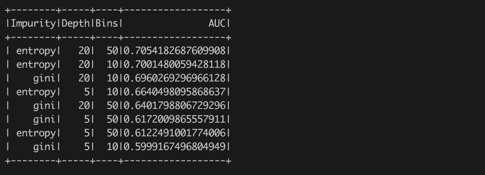

在决策树上使用这个简单的网格搜索，我们可以看到我们的*穷人的 doc2vec* 产生了 0.7054 的 AUC。让我们也向 H2O 展示我们精确的训练和测试数据，并使用 Flow UI 尝试深度学习算法:

```scala
import org.apache.spark.h2o._val hc = H2OContext.getOrCreate(sc)val trainHf = hc.asH2OFrame(trainData, "trainData")val validHf = hc.asH2OFrame(validData, "validData")
```

现在我们已经成功地将数据集发布为 H2O 框架，让我们打开流用户界面并运行深度学习算法:

```scala
hc.openFlow()
```

首先，请注意，如果我们运行`getFrames`命令，我们将看到我们从 Spark 无缝传递到 H2O 的两个 rdd:

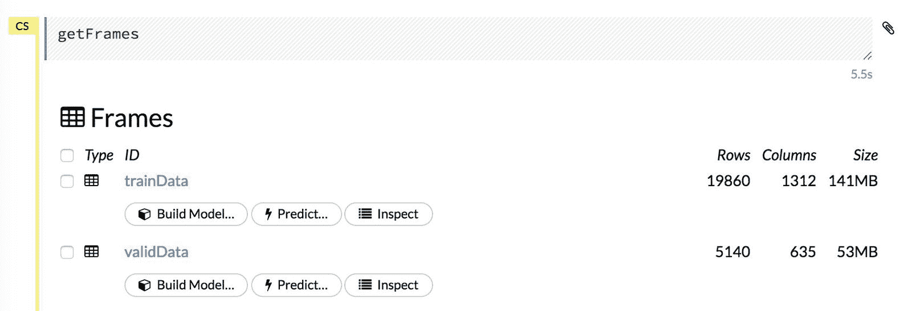

我们需要将两个框架的列标签类型从数字列更改为分类列，方法是单击“转换为枚举”:

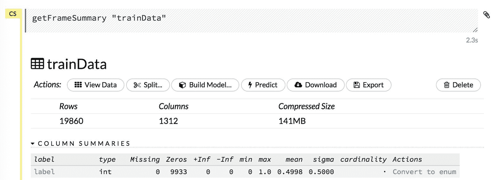

接下来，我们将运行一个深度学习模型，将所有超参数设置为默认值，并将第一列设置为我们的标签:

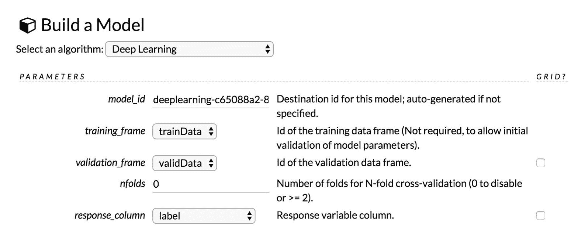

如果没有显式创建训练/测试数据集，也可以使用之前的 *nfolds* 超参数执行 *n 次折叠交叉验证*:


运行模型训练后，我们可以通过单击查看查看训练数据集和验证数据集的 AUC 来查看模型输出:

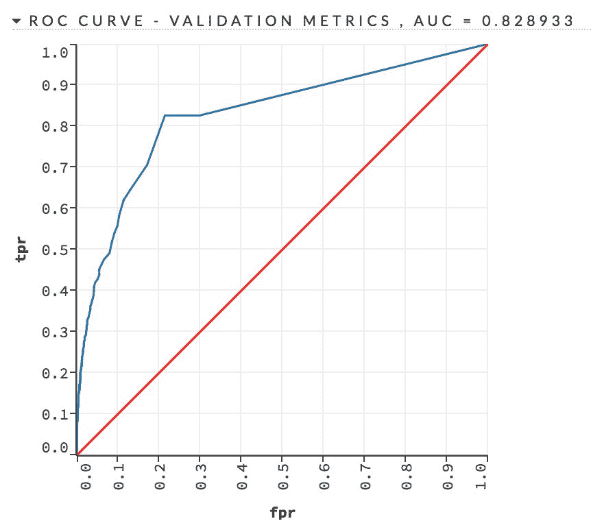

我们看到我们简单的深度学习模型的 AUC 更高，约为 0.8289。这是一个没有任何调整或超参数搜索的结果。

我们还可以采取哪些措施来进一步提高 AUC？我们当然可以尝试用网格搜索超参数的新算法，但更有趣的是，我们能调整文档向量吗？答案是肯定和否定！这是部分的*不*因为，你会记得，word2vec 本质上是一个无监督的学习任务；然而，我们可以通过观察一些返回的相似单词来了解向量的强度。比如说`drama`这个词:

```scala
w2vModel.findSynonyms("drama", 5).show()
```

输出如下:

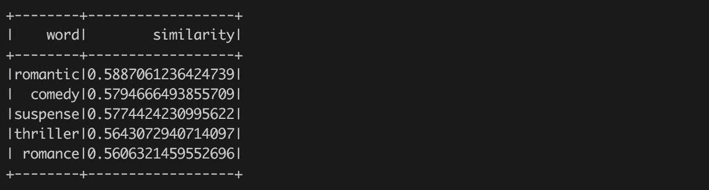

直观来说，我们可以看结果，问这五个字是否真的是*剧*这个词最好的同义词(也就是最好的余弦相似点)。现在让我们尝试通过修改输入参数来重新运行 word2vec 模型:

```scala
val newW2VModel = new Word2Vec().setInputCol("reviewTokens").setOutputCol("reviewVector").setMinCount(3).setMaxIter(250).setStepSize(0.02).fit(movieReviews)newW2VModel.findSynonyms("drama", 5).show()
```

输出如下:

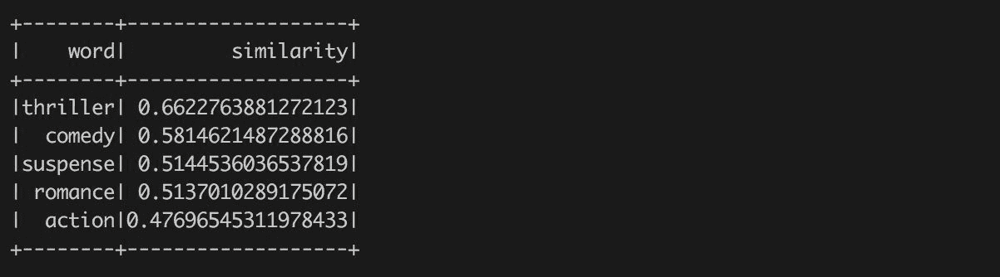

您应该立即注意到，就与所讨论的单词的相似性而言，同义词*比*更好，但也要注意，术语的余弦相似性也明显更高。回想一下，word2vec 的默认迭代次数是 1，现在我们已经将其设置为`250`，允许我们的网络在一些高质量的单词向量上进行真正的三角测量，这可以通过更多的预处理步骤和进一步调整 word2vec 的超参数来进一步改进，这应该会产生更高质量的文档向量。

# 摘要

许多公司，如谷歌，为各种向量维度自由给出预训练的单词向量(在谷歌新闻的子集上训练，包含前 300 万个单词/短语):例如，25d、50d、100d、300d 等等。您可以在这里找到代码(和结果单词向量)。除了谷歌新闻，还有其他来源的训练词向量，使用维基百科和各种语言。你可能会有一个问题，如果像谷歌这样的公司免费提供预训练的单词向量，为什么要费心自己构建呢？这个问题的答案当然取决于应用程序；谷歌的预训练词典有三个基于大写的单词*java*(JAVA、JAVA 和 JAVA 的意思不同)，但也许，你的应用只是咖啡，所以只需要一个*版本的 JAVA*。

我们本章的目标是给你一个清晰简洁的解释 word2vec 算法和这个算法非常流行的扩展，比如 doc2vec 和序列到序列学习模型，它们采用了各种风格的递归神经网络。一如既往，一章的时间几乎不足以涵盖自然语言处理这个极其激动人心的领域，但希望这足以激起你现在的胃口！

作为这一领域的实践者和研究者，我们(作者)不断在思考将文档表示为固定向量的新方法，并且有大量的论文致力于这个问题。你可以考虑 *LDA2vec* 和*跳过思维向量*来进一步阅读这个主题。

关于**自然语言处理** ( **自然语言处理**)和*矢量化*的其他一些博客添加到您的阅读列表中，如下所示:

*   谷歌研究博客([https://research.googleblog.com/](https://research.googleblog.com/))
*   NLP 博客(总是经过深思熟虑的帖子，有很多链接供进一步阅读)([http://nlpers.blogspot.com/](http://nlpers.blogspot.com/))
*   斯坦福 NLP 博客([http://nlp.stanford.edu/blog/](http://nlp.stanford.edu/blog/))

在下一章中，我们将再次看到单词向量，在这里我们将结合您到目前为止所学的所有知识来解决一个问题，该问题需要*厨房水槽*来处理各种处理任务和模型输入。留下来！*****