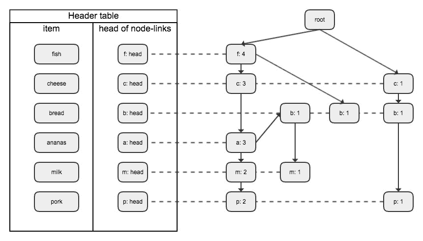
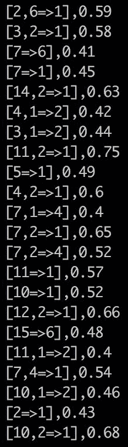
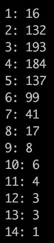
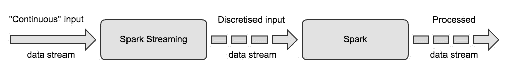
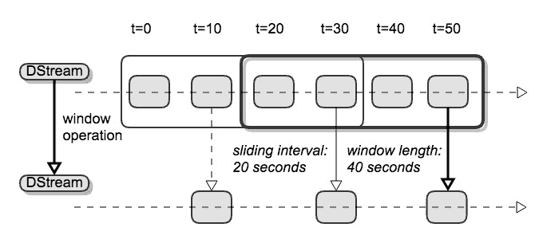

# 从点击流数据中提取模式

当收集单个度量或事件之间的真实数据时，通常有非常复杂的关系需要观察。本章的指导示例是观察用户在网站及其子域上生成的点击事件。这样的数据既有趣又具有挑战性。这很有意思，因为通常有许多*模式*，用户组在他们的浏览行为中显示，以及他们可能遵循的某些*规则*。总体而言，获得关于用户群体的见解是令人感兴趣的，至少对于运营网站的公司来说是如此，并且可能是他们数据科学团队的重点。撇开方法论不谈，建立一个可以实时检测模式的生产系统，例如，发现恶意行为，在技术上是非常具有挑战性的。能够理解和实现算法和技术两方面是非常有价值的。

在本章中，我们将深入研究两个主题:在 Spark 中进行*模式挖掘*和处理*流数据*。这一章分为两个主要部分。在第一部分中，我们将介绍 Spark 目前提供的三种可用的模式挖掘算法，并将它们应用于一个有趣的数据集。在第二部分中，我们将从更技术性的角度看待事物，并解决使用第一部分中的算法部署流数据应用程序时出现的核心问题。特别是，您将了解以下内容:

*   频繁模式挖掘的基本原理。
*   对应用程序有用和相关的数据格式。
*   如何在[http://MSNBC.com](http://MSNBC.com)加载和分析用户活动产生的点击流数据集。
*   了解并比较 Spark 中可用的三种模式挖掘算法，即 *FP-growth、关联规则*和*T3】前缀 span。*
*   如何将这些算法应用到 MSNBC 点击数据和其他例子中来识别相关的模式。
*   *Spark Streaming* 的基础知识，以及它可以涵盖哪些用例。
*   如何通过使用 Spark Streaming 将上述算法部署到产品中。
*   实现更真实的流式应用，点击事件实时聚合。

通过构建，这一章在技术上更接近尾声，但是通过 *Spark Streaming* ，它也允许我们引入另一个来自 Spark 生态圈的非常重要的工具。我们首先介绍模式挖掘的一些基本问题，然后讨论如何解决它们。

# 频繁模式挖掘

When presented with a new data set, a natural sequence of questions is:

*   我们看什么样的数据；也就是说，它有什么结构？
*   数据中哪些观察可以经常找到；也就是说，我们可以在数据中识别哪些模式或规则？
*   我们如何评估什么是频繁的；也就是说，相关性有哪些好的衡量标准，我们如何进行测试？

在很高的层次上，频繁模式挖掘恰恰解决了这些问题。虽然首先深入更先进的机器学习技术非常容易，但这些模式挖掘算法可以提供大量信息，并有助于建立对数据的直觉。

为了介绍频繁模式挖掘的一些关键概念，让我们首先考虑这种情况下的一个典型例子，即购物车。很长一段时间以来，对顾客对某些产品的兴趣和购买的研究一直是全球营销人员最感兴趣的。虽然在线商店确实有助于进一步分析客户行为，例如，通过跟踪购物会话中的浏览数据，但购买了哪些商品以及购买行为的哪些模式的问题也适用于纯离线场景。我们将很快看到一个网站上积累的点击流数据的更复杂的例子；目前，我们将在这样的假设下工作，即只有我们可以跟踪的事件才是某个项目的实际支付交易。

仅仅是这个给定的数据，例如，超市或网上的杂货购物车，就引出了很多有趣的问题，我们将主要关注以下三个:

*   *哪些物品经常一起买？*例如，有轶事证据表明，啤酒和尿布经常在一次购物中一起购买。例如，找到经常放在一起的产品模式可以让商店将这些产品放得更近，以增加购物体验或促销价值，即使它们乍一看不属于一起。就网上商店而言，这种分析可能是简单推荐系统的基础。
*   基于前面的问题，*在购物行为中有什么有趣的暗示或规律可循吗？，*继续购物车的例子，我们能不能建立起像*这样的联想如果买了面包黄油，我们也经常在购物车*里找到奶酪？找到这样的关联规则可能会很有意思，但是也需要更多的澄清我们认为的*经常*是什么意思，也就是频繁是什么意思。
*   请注意，到目前为止，我们的购物车只是被认为是一袋物品，没有额外的结构。至少在网购场景中，我们可以赋予数据更多的信息。我们将关注的一个方面是项目的*顺序性*；也就是说，我们将记录产品放入购物车的顺序。考虑到这一点，类似于第一个问题，人们可能会问，*在我们的交易数据中经常可以找到哪些项目序列？*例如，购买较大的电子设备后，可能会购买额外的实用物品。

我们之所以特别关注这三个问题，是因为 Spark MLlib 恰好附带了三种模式挖掘算法，它们通过回答问题的能力大致对应于上述问题。具体来说，我们将依次仔细介绍 *FP-growth* 、*关联规则*、*前缀 span、*，来解决这些问题，并展示如何使用 Spark 解决。在此之前，让我们后退一步，正式介绍我们迄今为止一直致力于的概念，以及一个运行示例。我们将在下一小节中提到前面的三个问题。

# 模式挖掘术语

我们先从一组物品开始 *I = {a <sub class="calibre25">1</sub> ，...，一个 <sub class="calibre25">n</sub> }* ，它是以下所有概念的基础。A *交易* T 只是 I 中的一组项目，如果包含 *l* 项目，我们说 T 是长度为 *l* 的交易。A *交易数据库* D 是交易标识及其对应交易的数据库。

举一个具体的例子，考虑以下情况。假设从*开始购物的全套物品是由*I = {面包、奶酪、菠萝、鸡蛋、甜甜圈、鱼、猪肉、牛奶、大蒜、冰淇淋、柠檬、油、蜂蜜、果酱、羽衣甘蓝、盐}* 给出的。由于我们将查看许多项目子集，为了使以后的内容更易读，我们将简单地通过它们的第一个字母来缩写这些项目，也就是说，我们将编写 *I = {b，c，a，e，d，f，p，m，g，I，l，o，h，j，k，s}* 。给定这些项目，一个小型事务数据库 D 可以如下所示:*

| **交易标识** | **交易** |
| one | a、c、d、f、g、I、m、p |
| Two | a、b、c、f、l、m、o |
| three | b、f、h、j、o |
| four | b、c、k、s、p |
| five | a、c、e、f、l、m、n、p |

Table 1: A small shopping cart database with five transactions

# 频繁模式挖掘问题

给定事务数据库的定义，*模式* P 是包含在 D 中的事务中的*事务，模式的支持 *supp(P)* 是其为真的事务数，除以或归一化为 D 中的事务数:*

*supp(s) = supp<sub class="calibre31">D</sub>(s) = |{ s' ∈ S | s <s'}| / |D|*

我们用 *<* 符号来表示*的*作为*的*的子模式，或者相反，称*的*为*的*的超模式。请注意，在文献中，您有时还会发现一个稍微不同的支持版本，它不会使值正常化。例如，模式 *{a，c，f}* 可以在交易 1，2，5 中找到。这意味着 *{a，c，f}* 是我们数据库 D 中的五项支持 *0.6* 的模式。

支持是一个重要的概念，因为它为我们提供了测量模式频率的第一个例子，最终，这就是我们所追求的。在这种情况下，对于给定的最小支持阈值 *t* ，当且仅当 *supp(P)* 至少为 *t* 时，我们说 *P* 是频繁模式。在我们的跑步示例中，长度 1 和最小支撑 *0.6* 的常见模式是 *{a}* 、 *{b}* 、 *{c}* 、 *{p}* 和 *{m}* 支撑 0.6 和 *{f}* 支撑 0.8。在接下来的内容中，我们会经常去掉项目或图案的括号，比如写 *f* 而不是 *{f}* 。

给定一个最小支持度阈值，找到所有频繁模式的问题被称为*频繁模式挖掘问题*，实际上它是前面提到的第一个问题的形式化版本。继续我们的例子，我们已经找到了所有长度为 1 的频繁模式 *t = 0.6* 。我们如何找到更长的模式？从理论上讲，给定无限的资源，这不是什么大问题，因为我们所需要做的就是计算项目的出现次数。然而，在实际层面上，我们需要聪明地对待如何做到这一点，以保持计算效率。特别是对于大到足以让 Spark 派上用场的数据库，解决频繁模式挖掘问题的计算量可能非常大。

一种直观的方法如下:

1.  查找长度为 1 的所有频繁模式，这需要一次完整的数据库扫描。这就是我们在前面例子中开始的方式。
2.  对于长度为 2 的模式，生成频繁 1 模式的所有组合，即所谓的候选*、*，并通过再次扫描 d 来测试它们是否超过最小支持度。
3.  重要的是，我们不必考虑不频繁模式的组合，因为包含不频繁模式的模式不会变得频繁。这种原理被称为**先验原理** *。*
4.  对于更长的模式，迭代地继续这个过程，直到没有更多的模式可以组合。

这种算法使用生成和测试方法进行模式挖掘，并利用 apriori 原理来绑定组合，称为 apriori 算法。这种基线算法有许多变体，它们在可伸缩性方面都有类似的缺点。例如，执行迭代需要多次完整的数据库扫描，这对于庞大的数据集来说可能已经非常昂贵了。除此之外，生成候选人本身已经很昂贵，但计算他们的组合可能根本不可行。在下一节中，我们将看到 Spark 中提供的名为 *FP-growth* 算法的并行版本如何克服刚刚讨论的大多数问题。

# 关联规则挖掘问题

为了推进我们对概念的一般性介绍，接下来让我们转向*关联规则，*首先在*中介绍，在大型数据库*中挖掘项目集之间的关联规则，可在[http://arbor.ee.ntu.edu.tw/~chyun/dmpaper/agrama93.pdf](http://arbor.ee.ntu.edu.tw/~chyun/dmpaper/agrama93.pdf)获得。与仅计算数据库中项目的出现次数不同，我们现在想了解规则或模式的含义。我的意思是，给定一个模式 *P <sub class="calibre25">1</sub>* 和另一个模式 *P <sub class="calibre25">2</sub>* ，我们想知道只要在 *D* 中能找到 *P <sub class="calibre25">1</sub>* 时，*P<sub class="calibre25">2</sub>*是否频繁出现，我们用写*P<sub class="calibre25">1</sub>P*来表示为了使其更加精确，我们需要一个类似于支持模式的规则频率的概念，即*置信度。*对于规则*P<sub class="calibre25">1</sub>P<sub class="calibre25">2</sub>T39】，置信度定义如下:*

*conf(P<sub class="calibre31">1</sub> ⇒ P<sub class="calibre31">2</sub>) = supp(P<sub class="calibre31">1</sub> ∪ P<sub class="calibre31">2</sub>) / supp(P<sub class="calibre31">1</sub>)*

这可以解释为 *P <sub class="calibre25">2</sub>* 给予 *P <sub class="calibre25">1</sub>* 的条件支持；也就是说，如果将 *D* 限制为支持 *P <sub class="calibre25">1</sub>* 的所有交易，那么这个受限数据库中 *P <sub class="calibre25">2</sub>* 的支持将等于*conf(P<sub class="calibre25">1</sub>P<sub class="calibre25">2</sub>)*。我们把*P<sub class="calibre25">1</sub>P<sub class="calibre25">2</sub>*称为 *D* 中的一个规则，如果它超过了最小置信阈值 *t* ，就像频繁模式的情况一样。找到置信度阈值的所有规则代表了第二个问题*关联规则挖掘的正式答案。*而且，在这种情况下，我们称 P <sub class="calibre25">1</sub> 为规则的*先行*和 P <sub class="calibre25">2</sub> 为规则的*后继*。一般来说，对先行词或结果词的结构都没有限制。然而，为了简单起见，在接下来的内容中，我们将假设结果的长度为 1。

在我们的运行示例中，模式 *{f，m}* 出现了三次，而 *{f，m，p}* 只是出现了两次，这意味着规则 *{f，m }**{ p }*有信心 *2/3* 。如果我们将最小置信阈值设置为 *t = 0.6* ，我们可以很容易地检查以下具有长度为 1 的前因和后果的关联规则对于我们的情况是否有效:

*{a} ⇒ {c}, **{a} ⇒ {f}, {a} ⇒ {m}, {a} ⇒ {p}* * {c} ⇒ {a}, {c} ⇒ {f}, {c} ⇒ {m}, {c} ⇒ {p}* * {f} ⇒ {a}, {f} ⇒ {c}, {f} ⇒ {m}* * {m} ⇒ {a}, {m} ⇒ {c}, {m} ⇒ {f}, {m} ⇒ {p}* * {p} ⇒ {a}, {p} ⇒ {c}, {p} ⇒ {f}, {p} ⇒ {m}*

根据前面的置信度定义，现在应该很清楚，一旦我们有了所有频繁模式的支持值，计算关联规则就相对简单了。事实上，我们很快就会看到，Spark 的关联规则实现是基于预先计算频繁模式。

At this point, it should be noted that while we will restrict ourselves to the measures of support and confidence, there are many other interesting criteria available that we can't discuss in this book; for instance, the concepts of *conviction, leverage, *or *lift. *For an in-depth comparison of the other measures, refer to [http://www.cse.msu.edu/~ptan/papers/IS.pdf](http://www.cse.msu.edu/~ptan/papers/IS.pdf).

# 序列模式挖掘问题

让我们继续进行形式化，这是我们在本章中要解决的第三个也是最后一个模式匹配问题。让我们更详细地看看*序列*。顺序不同于我们之前看到的交易，因为顺序现在很重要。对于给定的项目集 *I* ，长度为 *l* 的 *I* 中的序列 *S* 定义如下:

*s = <s<sub class="calibre31">1,</sub> s<sub class="calibre31">2</sub>,..., s<sub class="calibre31">l</sub>>*

这里，每个个体*s<sub class="calibre25">I</sub>T3】是一个项目的串联，即 *s <sub class="calibre25">i</sub> = (a <sub class="calibre25">i1</sub> ...a <sub class="calibre25">im)</sub>* ，其中 *a <sub class="calibre25">ij</sub>* 是 *I* 中的一项。注意，我们关心的是顺序项 *s <sub class="calibre25">i</sub>* 的顺序，而不是 *s <sub class="calibre25">i</sub>* 中个体*a<sub class="calibre25">ij</sub>T25】的内部顺序。序列数据库 *S* 由成对的序列标识和序列组成，类似于我们以前拥有的。这种数据库的一个例子可以在下表中找到，其中字母代表与我们前面的购物车示例中相同的项目:**

| **序列编号** | **序列** |
| one | *< a(abc)(ac)d(cf) >* |
| Two | *<【ad】c(BC)【AE)>* |
| three | *< (ef)(ab)(df)cb >* |
| four | *< eg(af)cbc >* |

Table 2: A small sequence database with four short sequences. 

在示例序列中，请注意将单个项目分组到序列项目中的圆括号。还要注意，如果序列项由单个项组成，我们会删除这些冗余的大括号。重要的是，子序列的概念需要比无序结构更仔细一点。我们称 *u = (u <sub class="calibre25">1</sub> ，...，u <sub class="calibre25">n</sub> )* 一个子序列的 *s = (s <sub class="calibre25">1</sub> ，...，s <sub class="calibre25">l</sub> )* 如果有索引 *1* *≤ i1 < i2 <，则写*u<<sub class="calibre25">s</sub>s*...< in ≤ m* 所以我们有以下几点:

*u<sub class="calibre31">1</sub> < s<sub class="calibre31">i1</sub>, ..., u<sub class="calibre31">n</sub> <s<sub class="calibre31">in</sub>*

在这里，最后一行的 *<* 符号表示*u<sub class="calibre25">j</sub>T5】是<sub class="calibre25">s<sub class="calibre25">ij</sub></sub>*的子模式。大致来说，如果 *u* 的所有元素都是 *s* 的子模式，那么 *u* 就是 *s* 的子序列。同样，我们称 *s* 为 *u* 的超序列。在上例中，我们看到 *< a(ab)ac >* 和 *a(cb)(ac)dc >* 是*<a(ABC)(AC)d(cf)>*子序列的例子，而*<【fa】c>*是 *< eg(af)cbc >* 子序列的例子。

借助于超序列的概念，我们现在可以在给定的序列数据库 *S* 中定义序列 *s* 的*支持*，如下所示:

*supp<sub class="calibre31">S</sub>(s) = supp(s) = |{ s' ∈ S | s <s'}| / |S|*

请注意，在结构上，这与普通无序模式的定义相同，但是 *<* 符号意味着其他东西，即子序列。如前所述，如果上下文中的信息清晰，我们将数据库下标放在*支持*的符号中。有了*支持*的概念，序列模式的定义完全类似地遵循前面的定义。给定最小支持阈值 *t* ，如果 *supp(s)* 大于或等于 *t* ，则 *S* 中的序列 *s* 被称为*序列模式*。第三个问题的形式化称为*序列模式挖掘问题*，即对于给定的阈值 *t* ，在 *S* 中找到作为序列模式的完整序列集。

即使在我们只有四个序列的小例子中，手动检查所有的序列模式已经是一个挑战。仅举一个支持 1.0 的*序列模式的例子，所有四个序列中长度为 2 的子序列是 *< ac >* 。找到所有的序列模式是一个有趣的问题，我们将在下一节了解 Spark 用来解决这个问题的所谓的*前缀跨度*算法。*

# 利用 Spark MLlib 进行模式挖掘

在激发并介绍了三个模式挖掘问题以及正确谈论它们的必要符号之后，我们接下来将讨论如何使用 Spark MLlib 中可用的算法来解决这些问题。通常情况下，实际应用算法本身相当简单，因为 Spark MLlib 方便的`run`方法适用于大多数算法。更具挑战性的是理解算法和随之而来的复杂性。为此，我们将逐一讲解这三种模式挖掘算法，并研究它们是如何实现的，以及如何在玩具示例上使用它们。只有在完成所有这些之后，我们才会将这些算法应用于从[http://MSNBC.com](http://MSNBC.com)检索到的真实点击事件数据集。

Spark 中模式挖掘算法的文档可以在[https://Spark . Apache . org/docs/2 . 1 . 0/mllib-frequency-pattern-mining . html](https://spark.apache.org/docs/2.1.0/mllib-frequent-pattern-mining.html)中找到。它为想要深入了解的用户提供了一个很好的切入点。

# 基于 FP 增长的频繁模式挖掘

在介绍频繁模式挖掘问题时，我们还快速讨论了一种基于先验原理的策略。该方法基于一次又一次地扫描整个事务数据库，以昂贵的代价生成长度不断增长的候选模式，并检查它们的支持。我们指出，这种策略对于非常大的数据可能不可行。

所谓的 *FP-growth 算法*，其中 **FP** 代表**频繁模式**，为这个数据挖掘问题提供了一个有趣的解决方案。该算法最初在*挖掘频繁模式而不生成候选项中描述，可在[https://www.cs.sfu.ca/~jpei/publications/sigmod00.pdf](https://www.cs.sfu.ca/~jpei/publications/sigmod00.pdf)获得。我们将从解释这个算法的基础开始，然后继续讨论它的分布式版本，*并行 FP-growth，*已经在 *PFP:查询推荐的并行 FP-Growth*中介绍，可在[https://static . googleuser content . com/media/research . Google . com/en//pubs/archive/34668 . pdf](https://static.googleusercontent.com/media/research.google.com/en//pubs/archive/34668.pdf)找到。虽然 Spark 的实现是基于后一篇论文，但最好首先理解基线算法并从那里进行扩展。*

FP-growth 的核心思想是在一开始就对感兴趣的事务数据库 D 进行一次精确扫描，找出长度为 1 的所有频繁模式，并从这些模式中构建一个称为 *FP-tree* 的特殊树结构。一旦完成这一步，我们不再使用 D，而是只在通常小得多的 FP-tree 上进行递归计算。这个步骤被称为算法的 *FP-growth 步骤*，因为它从原始树的子树递归地构建树来识别模式。我们将这个过程称为*片段模式增长*，它不需要我们生成候选，而是建立在*分治*策略的基础上，大大减少了每个递归步骤的工作量。

更准确地说，让我们首先定义什么是 FP-tree，以及它在一个示例中的样子。回想一下我们在上一节中使用的示例数据库，如*表 1* 所示。我们的项目集由以下 15 个杂货项目组成，用第一个字母表示: *b* 、 *c* 、 *a* 、 *e* 、 *d* 、 *f* 、 *p* 、 *m* 、 *i* 、 *l* 、 *o* 、 *h 我们还讨论了经常出现的项目；也就是说，对于最小支持阈值 *t = 0.6* ，长度为 1 的模式由 *{f，c，b，a，m，p}* 给出。在 FP-growth 中，我们首先利用项目的排序对于频繁模式挖掘问题无关紧要的事实；也就是说，我们可以选择频繁项目的呈现顺序。我们通过降低频率来排序它们。总结一下情况，我们来看看下表:*

| **交易标识** | **交易** | **订购的常用物品** |
| one | *a、c、d、f、g、I、m、p* | *f、c、a、m、p* |
| Two | *a、b、c、f、l、m、o* | *f、c、a、b、m* |
| three | *b、f、h、j、o* | *f，b* |
| four | *b、c、k、s、p* | *c、b、p* |
| five | *a、c、e、f、l、m、n、p* | *f、c、a、m、p* |

Table 3: Continuation of the example started with Table 1, augmenting the table by ordered frequent items. 

正如我们所看到的，像这样经常订购的物品已经帮助我们确定了一些结构。例如，我们看到项目集 *{f，c，a，m，p}* 出现了两次，并被略微更改为 *{f，c，a，b，m}* 。FP-growth 的关键思想是使用这种表示从有序的频繁项目中构建一棵树，该树反映了*表 3* 第三列中项目的结构和相互依赖性。每个 FP-tree 都有一个所谓的*根*节点，该节点被用作连接所构建的有序频繁项的基础。在下图的右边，我们看到这意味着什么:



Figure 1: FP-tree and header table for our frequent pattern mining running example.

*图 1* 的左侧显示了一个标题表，我们将稍微解释一下并形式化，而右侧显示了实际的 FP-tree。对于我们示例中的每个有序频繁项，都有一个从根开始的有向路径，从而表示它。树的每个节点不仅跟踪频繁项本身，还跟踪通过该节点的路径数量。例如，五个订购的频繁项目集中有四个以字母 *f* 开头，一个以 *c* 开头。因此，在 FP-tree 中，我们在顶层看到`f: 4`和`c: 1`。对这个事实的另一种解释是 *f* 是一个*前缀*表示四个项目集， *c* 表示一个项目集。对于这种推理的另一个例子，让我们把注意力转向树的左下方，也就是叶节点`p: 2`。 *p* 的两次出现告诉我们，恰恰两条完全相同的路径在这里结束，我们已经知道: *{f，c，a，m，p}* 被表示了两次。这个观察很有趣，因为它已经暗示了 FP 中使用的一种技术——生长——从树的叶节点开始，或者项集的后缀开始，我们可以追溯每个频繁项集，所有这些不同根节点路径的并集产生所有路径——这是并行化的一个重要思想。

您在*图 1* 左侧看到的表头是一种智能的物品存储方式。请注意，通过树的构造，节点与频繁项不同，而是项可以并且通常确实出现多次，即对于它们所属的每个不同路径出现一次。为了跟踪项目及其相互关系，标题表本质上是一个项目的*链表*，也就是说，每个项目的出现都通过这个表链接到下一个。为了便于说明，我们在*图 1* 中用水平虚线标出了每个常用项目的链接。

考虑到这个例子，现在让我们给出一个 FP 树的正式定义。FP-tree *T* 是由根节点和从根开始的频繁项前缀子树以及频繁项标题表组成的树。树的每个节点由一个三元组组成，即项目名称、其出现次数和指向同名下一个节点的节点链接，如果没有这样的下一个节点，则为`null`。

快速回顾一下，为了构建 *T* ，我们首先计算给定最小支持阈值 *t* 的频繁项，然后从根开始，将事务的排序频繁模式列表所表示的每个路径插入到树中。现在，我们能从中获得什么？需要考虑的最重要的属性是，解决频繁模式挖掘问题所需的所有信息都被编码在 FP-tree *T* 中，因为我们有效地编码了具有重复的频繁项目的所有共现。由于 *T* 最多也可以有与频繁项目出现次数一样多的节点， *T* 通常比我们的原始数据库 d 小得多。这意味着我们已经将挖掘问题映射到了一个更小数据集上的问题，这本身就比之前概述的简单方法降低了计算复杂度。

接下来，我们将讨论如何从构建的 FP 树获得的片段中递归地生长模式。为此，让我们做以下观察。对于任何给定的频繁项 *x* ，我们可以通过跟随 *x* 的节点链接，从 *x* 的头表条目开始，通过在各自的子树进行分析，获得涉及 *x* 的所有模式。为了解释具体是如何做到的，我们进一步研究了我们的例子，并从标题表的底部开始，分析包含 *p* 的模式。从我们的 FP-tree *T* 中可以清楚的看到 *p* 出现在两条路径中: *(f:4，c:3，a:3，m:3，p:2)* 和 *(c:1，b:1，p:1)* ，跟随 *p* 的节点链接。现在，在第一个路径中， *p* 只出现两次，也就是说，在原始数据库 d 中，模式 *{f，c，a，m，p}* 总共最多可以出现两次，所以，在 *p* 存在的条件下*，*涉及 *p* 的路径实际上如下所示: *(f:2，c:2，a:2，m:2，p:2)*其实既然知道要分析模式，给定 *p* ，就可以稍微缩短批注，简单写 *(f:2，c:2，a:2，m:2)* 和 *(c:1，b:1)* 。这就是我们所说的 p 的**条件模式库。更进一步，我们可以从这个条件数据库构建一个新的 FP-tree。在三次出现 *p* 的条件下，这个新树只包含一个节点，即 *(c:3)* 。这意味着，除了 *p* 本身之外，我们最终将 *{c，p}* 作为涉及 *p* 的单一模式。为了更好地说明这种情况，我们引入以下符号: *p* 的条件 FP-tree 用 *{(c:3)}|p* 表示。****

为了获得更多的直觉，让我们考虑一个更频繁的项目，并讨论它的条件模式库。继续自下而上分析 *m* ，我们再次看到两条相关的路径: *(f:4，c:3，a:3，m:2)* 和 *(f:4，c:3，a:3，b:1，m:1)* 。注意，在第一条路径中，我们在最后丢弃了 *p:2* ，因为我们已经覆盖了 *p* 的情况。遵循将所有其他计数减少到所讨论项目的计数并在 *m* 上进行条件化的相同逻辑，我们最终得到条件模式库 *{(f:2，c:2，a:2)，(f:1，c:1，a:1，b:1)}* 。这种情况下的条件 FP-tree 由 *{f:3，c:3，a:3}|m* 给出。现在很容易看出，实际上 *m* 与 *f* 、 *c* 和 *a* 的每一个可能的组合都形成了一个频繁的模式。给定 *m* 的全套图案因此是 *{m}* 、 *{am}* 、 *{cm}* 、 *{fm}* 、*{ cam】{ T35】、 *{fam}* 、 *{fcm}* 和 *{fcam}* 。现在，应该很清楚如何继续，我们将不会全面开展这项工作，而是在下表中总结其结果:*

| **频繁模式** | **条件模式库** | **条件 FP-tree** |
| *p* | *{(f:2，c:2，a:2，m:2)，(c:1，b:1)}* | *{(c:3)}&#124;p* |
| *米* | *{(f :2，c:2，a:2)，(f :1，c:1，a:1，b:1)}* | *{f:3，c:3，a:3}&#124;m* |
| *b* | *{(f :1，c:1，a:1)，(f :1)，(c:1)}* | 空 |
| *一* | *{(f:3，c:3)}* | *{(f:3，c:3)}&#124;a* |
| *c* | *{(f:3)}* | *{(f:3)}&#124;c* |
| *f* | 空 | 空 |

Table 4: The complete list of conditional FP-trees and conditional pattern bases for our running example.

由于这种推导需要非常注意细节，让我们退一步总结一下到目前为止的情况:

1.  从最初的 FP-tree *T* 开始，我们使用节点链接迭代所有的项目。
2.  对于每一项 *x* ，我们构建了它的条件模式库和条件 FP 树。为此，我们使用了以下两个属性:
    *   我们丢弃了每个潜在模式中 *x* 之后的所有项目，也就是说，我们只保留了 *x* 的*前缀*
    *   我们修改了条件模式库中的项目计数，以匹配 *x* 的计数
3.  使用后两个属性修改路径，我们称之为 *x* 的变换前缀路径。

为了最终说明算法的 FP-growth 步骤，我们需要两个更基本的观察，我们已经在示例中隐式使用了这两个观察。首先，条件模式库中的项的支持与它在原始数据库中的表示相同。其次，从原始数据库中的频繁模式 *x* 和任意一组项目 *y* 出发，我们知道 *xy* 是频繁模式的当且仅当 *y* 是。这两个事实一般很容易推导出来，但应该在前面的例子中清楚地说明。

这意味着我们可以完全专注于在条件模式库中寻找模式，因为将它们与频繁模式连接起来又是一个模式，这样，我们就可以找到所有的模式。这种通过计算条件模式库递归增长模式的机制因此被称为模式增长，这就是 FP-growth 得名的原因。考虑到所有这些，我们现在可以用伪代码总结 FP-growth 过程，如下所示:

```scala
def fpGrowth(tree: FPTree, i: Item):if (tree consists of a single path P){compute transformed prefix path P' of Preturn all combinations p in P' joined with i}else{for each item in tree {newI = i joined with itemconstruct conditional pattern base and conditional FP-tree newTreecall fpGrowth(newTree, newI)}}
```

通过这个过程，我们可以将完整的 FP-growth 算法的描述总结如下:

1.  从 D 计算频繁项，并从中计算原始 FP-tree*T*(*FP-tree 计算)。*
2.  运行`fpGrowth(T, null)`(*FP-增长计算)。*

了解了基础构造之后，我们现在可以开始讨论基础 FP-growth 的并行扩展，也就是 Spark 实现的基础。**并行 FP-growth** ，简称 **PFP** ，是 Spark 等并行计算引擎 FP-growth 的自然进化。它解决了基线算法的以下问题:

*   *分布式存储:*对于频繁模式挖掘，我们的数据库 D 可能放不下内存，这已经可以使 FP-growth 以其原始形式变得不可应用。Spark 在这方面确实有所帮助，原因显而易见。
*   *分布式计算:*有了分布式存储，我们将不得不适当地并行化算法的所有步骤，而 PFP 正是这样做的。
*   *足够的支持值:*在处理寻找频繁模式时，我们通常不希望将最小支持阈值 *t* 设置得太高，从而在长尾中找到感兴趣的模式。然而，一个小的 *t* 可能会阻止 FP-tree 适合足够大的 D 的内存，这将迫使我们增加 *t* 。正如我们将看到的那样，私营部门筹资和伙伴关系司也成功地解决了这个问题。

私营部门筹资和伙伴关系司的基本轮廓如下，其中考虑到了Spark的实施:

*   **分片**:我们不是把我们的数据库 D 存储在一台机器上，而是把它分发给多个分区。不考虑特定的存储层，例如，使用 Spark，我们可以创建一个 RDD 来加载数据
*   **并行频繁项计数**:计算 D 的频繁项的第一步自然可以作为 RDD 上的地图缩减操作来执行。
*   **建立频繁项组**:频繁项集分为多个组，每个组都有唯一的组 ID。*T3】*
*   **并行 FP-growth**:*FP-growth 步骤分为两步来利用并行性:

    *   **映射阶段** : 映射器的输出是由组 ID 和对应事务组成的一对。
    *   **缩减阶段** : 缩减器根据组 ID 收集数据，并对这些依赖组的事务进行 FP-growth。* 
**   **聚合**:算法的最后一步是在组 id 上聚合结果。*

 *鉴于已经花了大量时间单独研究 FP-growth，我们不再深入讨论 Spark 中 PFP 的太多实现细节，而是看看如何在我们一直使用的玩具示例上使用实际算法:

```scala
import org.apache.spark.mllib.fpm.FPGrowth
import org.apache.spark.rdd.RDD

val transactions: RDD[Array[String]] = sc.parallelize(Array(Array("a", "c", "d", "f", "g", "i", "m", "p"),Array("a", "b", "c", "f", "l", "m", "o"),Array("b", "f", "h", "j", "o"),Array("b", "c", "k", "s", "p"),Array("a", "c", "e", "f", "l", "m", "n", "p")))

val fpGrowth = new FPGrowth()
  .setMinSupport(0.6)
  .setNumPartitions(5)
val model = fpGrowth.run(transactions)

model.freqItemsets.collect().foreach { itemset =>
  println(itemset.items.mkString("[", ",", "]") + ", " + itemset.freq)
}
```

代码很简单。我们将数据加载到`transactions`中，并初始化 Spark 的`FPGrowth`实现，最小支持值为 *0.6* 和 *5* 分区。这返回了一个模型，我们可以在前面构建的事务上`run`。通过调用`freqItemsets`，我们可以访问指定最低支持的模式或频繁项目集，以格式化的方式打印，总共产生 18 个模式的以下输出:


Recall that we have defined transactions as *sets*, and we often call them item sets. This means that within such an item set, a particular item can only occur once, and `FPGrowth` depends on this. If we were to replace, for instance, the third transaction in the preceding example by `Array("b", "b", "h", "j", "o")`, calling `run` on these transactions would throw an error message. We will see later on how to deal with such situations.

解释完*关联规则*和*前缀跨度*后，我们将转向这些算法在真实数据集上的应用。

# 关联规则挖掘

回想一下关联规则的介绍，在计算关联规则时，一旦我们有了频繁项目集，也就是指定最小阈值的模式，我们就已经进行了一半。事实上，Spark 的关联规则实现假设我们提供了一个`FreqItemsets[Item]`的 RDD，我们已经在前面对`model.freqItemsets`的调用中看到了一个例子。除此之外，计算关联规则不仅可以作为独立算法使用，还可以通过`FPGrowth`获得。

在展示如何在我们的运行示例上运行各自的算法之前，让我们快速解释一下关联规则是如何在 Spark 中实现的:

1.  该算法已经提供了频繁项集，所以我们不必再计算它们了。
2.  对于每一对图案，X 和 *Y* ，计算两个项目 X 和 Y 共现的频率并存储( *X* 、( *Y* 、supp(*X*∩*Y*))。我们称这样的模式对为*候选对，*其中 *X* 作为潜在先行词， *Y* 作为结果词。
3.  将所有模式与候选对连接，以获得该形式的语句，(X，((Y，supp(*X*∩*Y*))、supp( *X* ))。
4.  然后，我们可以通过期望的最小置信度值过滤形式(X，((Y，supp(*)X*∩*Y*))、supp( *X* ))的表达式，以返回具有该置信度的所有规则*X Y*。

假设我们在最后一节中没有通过 FP-growth 计算模式，而是给出了这些项目集的完整列表，我们可以从头开始从一系列`FreqItemset`创建一个 RDD，然后在其上运行一个新的`AssociationRules`实例:

```scala
import org.apache.spark.mllib.fpm.AssociationRules
import org.apache.spark.mllib.fpm.FPGrowth.FreqItemset

val patterns: RDD[FreqItemset[String]] = sc.parallelize(Seq(
  new FreqItemset(Array("m"), 3L),
  new FreqItemset(Array("m", "c"), 3L),new FreqItemset(Array("m", "c", "f"), 3L), new FreqItemset(Array("m", "a"), 3L), new FreqItemset(Array("m", "a", "c"), 3L),new FreqItemset(Array("m", "a", "c", "f"), 3L),  new FreqItemset(Array("m", "a", "f"), 3L), new FreqItemset(Array("m", "f"), 3L), new FreqItemset(Array("f"), 4L), new FreqItemset(Array("c"), 4L), new FreqItemset(Array("c", "f"), 3L), new FreqItemset(Array("p"), 3L), new FreqItemset(Array("p", "c"), 3L), new FreqItemset(Array("a"), 3L), new FreqItemset(Array("a", "c"), 3L), new FreqItemset(Array("a", "c", "f"), 3L), new FreqItemset(Array("a", "f"), 3L), 
  new FreqItemset(Array("b"), 3L)
))

val associationRules = new AssociationRules().setMinConfidence(0.7)
val rules = associationRules.run(patterns)

rules.collect().foreach { rule =>
  println("[" + rule.antecedent.mkString(",") + "=>"
    + rule.consequent.mkString(",") + "]," + rule.confidence)
}
```

注意初始化算法后，我们在采集结果前将最小置信度设置为`0.7`。此外，运行`AssociationRules`会返回一个`Rule`类型的 RDD 规则。这些规则对象具有用于`antecedent`、`consequent`和`confidence`的访问器，我们使用这些访问器来收集如下所示的结果:


我们从头开始这个例子的原因是为了传达这样一个思想，即关联规则在 Spark 中确实是一个独立的算法。由于 Spark 中计算模式的唯一内置方式目前是通过 FP-growth，关联规则依赖于`FreqItemset`的概念(从`FPGrowth`子模块导入)反正这看起来有点不切实际。使用我们从前面的 FP-growth 示例中得到的结果，我们完全可以编写以下内容来实现同样的结果:

```scala
val patterns = model.freqItemsets
```

有趣的是，关联规则也可以通过`FPGrowth`界面直接计算。继续前面例子中的符号，我们可以简单地写下下面的内容，得到与前面相同的规则集:

```scala
val rules = model.generateAssociationRules(confidence = 0.7)
```

实际上，虽然这两种表述都可能有用，但后一种肯定会更简洁。

# 带前缀跨度的序列模式挖掘

转到顺序模式匹配，*前缀跨度算法*比关联规则稍微复杂一点，所以我们需要退一步，先说明一下基础。前缀跨度首先在[http://hanj.cs.illinois.edu/pdf/tkde04_spgjn.pdf](http://hanj.cs.illinois.edu/pdf/tkde04_spgjn.pdf)中被描述为所谓的*自由跨度*算法的自然延伸。该算法本身代表了对其他方法的显著改进，例如**通用顺序模式** ( **普惠制**)。后者是基于 apriori 原理的，并且我们前面讨论的基于它的许多算法的所有缺点也适用于顺序挖掘，即昂贵的候选生成、多次数据库扫描等。

前缀 span，在其基本公式中，使用了与 FP-growth 相同的基本思想，即将原始数据库投影到通常更小的结构中进行分析*。*在 FP-growth 中，我们为原始 FP-tree 中的每个*后缀*递归构建新的 FP-tree，顾名思义，前缀 span 通过考虑*前缀*来增长或跨越新的结构。

让我们首先正确定义序列上下文中前缀和后缀的直观概念。在接下来的内容中，我们将始终假设序列项目中的项目是按字母顺序排列的，也就是说，如果 *s = < s <sub class="calibre25">1、</sub> s <sub class="calibre25">2</sub> 、...，s <sub class="calibre25">l</sub> >* 是 *S* 中的一个序列，每个 *s <sub class="calibre25">i</sub>* 是项的串联，即 *s <sub class="calibre25">i</sub> = (a <sub class="calibre25">i1</sub> ...a <sub class="calibre25">im</sub> )* ，其中 a <sub xmlns:epub="http://www.idpf.org/2007/ops" class="calibre25">ij</sub> 是 *I* 中的项目，我们假设所有*a<sub class="calibre25">ij</sub>T31】在*s<sub class="calibre25">I</sub>T35】中是按字母顺序排列的。在这样的情况下，一个元素 *s' = < s' <sub class="calibre25">1、</sub> s' <sub class="calibre25">2</sub> 、<sub class="calibre25">T42】...，s'm ></sub>* 被称为 *s* 的前缀当且仅当满足以下三个属性时:*** 

**   对于所有 *i < m* ，我们有相等的顺序项，即*的<sub class="calibre25">I</sub>= s<sub class="calibre25">I</sub>T7】**   *的<sub class="calibre25">m</sub>T12】s<sub class="calibre25">m</sub>T5，也就是*s*的最后一项是*s<sub class="calibre25">m</sub>T11】的子模式***
*   *如果我们从 *s <sub class="calibre25">m</sub>* 中减去*s<sub class="calibre25">m</sub>T3【也就是从*s<sub class="calibre25">m</sub>T15】中删除子模式*s<sub class="calibre25">m</sub>T11】，那么*s<sub class="calibre25">m</sub>-s】<sub class="calibre25">m</sub>T21】中剩下的所有频繁项都要排在 *s】中的所有元素之后******

虽然前两点来得相当自然，但最后一点可能看起来有点奇怪，所以让我们用一个例子来解释一下。给定一个序列， *< a(abc) >* ，来自数据库 D，其中 *a* 、 *b* 、 *c* 确实频繁，那么， *< aa >* 和 *< a(ab) >* 是 *< a(abc) >* 的前缀，但是 *< ab > *<(ABC)>-<b>=<(AC)>*，字母 *a* 不是从 *< ab >* 按字母顺序排在 *b* 之后。 本质上，第三个属性告诉我们，前缀只能在它影响的最后一个序列项的开始处剪切出部分。*

有了前缀的概念，现在就很容易说出什么是后缀。和之前一样的记数法，如果*的*是 *s* 的前缀，那么*s ' ' =<(s<sub class="calibre25">m</sub>-s’<sub class="calibre25">m</sub>，s <sub class="calibre25">m+1</sub> ，...，s <sub class="calibre25">l</sub> >* 是这个前缀的后缀，我们表示为 *s'' = s / s'* 。此外，我们将在产品符号中写入*s = s ' '*。例如，假设 *< a(abc) >* 是原始序列，而 *< aa >* 是前缀，我们将该前缀的后缀表示如下:

*<(_bc)> = <a(abc)> / <aa>*

请注意，我们使用下划线符号通过前缀来表示序列的剩余部分。

前缀和后缀的概念都有助于将原始的序列模式挖掘问题分解或分割成更小的部分，如下所示。让 *{ < p <sub class="calibre25">1</sub> >，...，< p <sub class="calibre25">n</sub> > }* 是长度为 1 的完整系列图案。然后，我们可以进行以下观察:

*   所有的序列模式都是从其中一个*p<sub class="calibre25">I</sub>T3 开始的。这反过来意味着我们可以将所有顺序模式划分为 *n* 个不相交的集合，即那些以*p<sub class="calibre25">I</sub>T9】开始的集合，对于 *i* 来说介于 *1* 和 *n* 之间的集合。**
*   递归地应用这个推理，我们得出如下结论:如果 *s* 是给定的长度为 1 和 *{s <sup class="calibre21">1</sup> 的序列模式，...，s <sup class="calibre21">m</sup> }* 是 *s* 的长度 *l+1* 序贯超模式的完整列表，那么所有前缀为 *s* 的序贯模式都可以划分为前缀为 *s <sup class="calibre21">i</sup>* 的 *m* 集合。

这两种说法都很容易实现，但提供了一个强大的工具，可以将原始问题集细分为不连贯的较小问题。这样的策略叫做*分治*。考虑到这一点，我们现在可以非常类似于我们在 FP-growth 中对条件数据库所做的工作，即针对给定前缀的项目数据库。给定一个序列模式数据库 S 和一个前缀 *s* ， **s 投影数据库**， *S| <sub class="calibre25">s</sub>* ，是 S 中 *s* 的所有后缀的集合

我们需要最后一个定义来陈述和分析前缀跨度算法。如果 *s* 是 S 中的序列模式， *x* 是前缀为 *s* 的模式，那么*S |<sub class="calibre25">S</sub>T13】中 *x* 的*支持计数*，用 *supp <sub class="calibre25">S|s</sub> (x)* 表示，就是 *S| <sub class="calibre25">中的序列数 *y* 也就是说，我们只是延续了支持 s-projected 数据库的概念。从这个定义中我们可以得出一些有趣的性质，这使得我们的情况变得容易得多。例如，根据定义，我们看到对于任何前缀为 *s* 的序列 *x* ，我们有以下内容:</sub>**

*supp<sub class="calibre31">S</sub>(x) = supp<sub class="calibre31">S|s</sub>(x)*

也就是说，在这种情况下，我们是否计算原始或计划数据库中的支持并不重要。而且如果*的*是 *s* 的前缀的话，很明显*S |<sub class="calibre25">S</sub>=(S |<sub class="calibre25">S '</sub>)|<sub class="calibre25">S</sub>*，意思是我们可以连续前缀而不丢失信息。从计算复杂性的角度来看，最后一点也是最重要的一点是，预计的数据库不能超过其原始大小。这个属性应该再次从定义中明确，但是它非常有助于证明前缀跨度的递归性质。

给定所有这些信息，我们现在可以用伪代码勾画前缀跨度算法如下。请注意，我们区分附加到序列模式`s`末尾的项目`s'`和从添加到`s`末尾的`s'`生成的序列`<s'>`。举个例子，我们可以将字母 *e* 加到 *< a(abc) >* 形成 *< a(abce) >* 或者在末尾加上 *< e >* 形成 *< a(abc)e >* :

```scala
def prefixSpan(s: Prefix, l: Length, S: ProjectedDatabase):S' = set of all s' in S|s if {(s' appended to s is a sequential pattern) or(<s'> appended to s is a sequential pattern)}for s' in S' {s'' = s' appended to soutput s''call prefixSpan(s'', l+1, S|s'')}}call prefixSpan(<>, 0, S)
```

如前所述，前缀跨度算法查找所有顺序模式；也就是说，它代表了序列模式挖掘问题的解决方案。我们不能在这里概述这种说法的证据，但我们希望已经为你提供了足够的直觉来看看它是如何以及为什么工作的。

以 Spark 为例，注意我们没有讨论如何有效地并行化基线算法。如果您有兴趣了解实现细节，请参见[https://github . com/Apache/spark/blob/v 2 . 2 . 0/mllib/src/main/Scala/org/Apache/spark/mllib/fpm/prefixspan . Scala](https://github.com/apache/spark/blob/v2.2.0/mllib/src/main/scala/org/apache/spark/mllib/fpm/PrefixSpan.scala)，因为并行版本有点过于复杂，因此有理由在此进行介绍。我们先来研究一下*表 2* 中提供的例子，即*<a(ABC)(AC)d(cf)>*、*<(ad)c(BC)(AE)>*、*<【ef】(ab)(df)CB>*、 *< eg(af)cbc >* 这四个序列。为了对序列的嵌套结构进行编码，我们使用字符串数组的数组，并对它们进行并行化，以根据它们创建 RDD。初始化和运行`PrefixSpan`的一个实例的工作方式与它对其他两个算法的工作方式非常相似。这里唯一值得注意的是，除了通过`setMinSupport`将最小支持阈值设置为`0.7`之外，我们还将模式的最大长度指定为`5`到`setMaxPatternLength`。最后一个参数用于限制递归深度。尽管实现很巧妙，但算法(尤其是计算数据库预测)可能会花费大量时间:

```scala
import org.apache.spark.mllib.fpm.PrefixSpanval sequences:RDD[Array[Array[String]]] = sc.parallelize(Seq(Array(Array("a"), Array("a", "b", "c"), Array("a", "c"), Array("d"), Array("c", "f")),Array(Array("a", "d"), Array("c"), Array("b", "c"), Array("a", "e")),Array(Array("e", "f"), Array("a", "b"), Array("d", "f"), Array("c"), Array("b")),Array(Array("e"), Array("g"), Array("a", "f"), Array("c"), Array("b"), Array("c")) ))val prefixSpan = new PrefixSpan().setMinSupport(0.7).setMaxPatternLength(5)val model = prefixSpan.run(sequences)model.freqSequences.collect().foreach {freqSequence => println(freqSequence.sequence.map(_.mkString("[", ", ", "]")).mkString("[", ", ", "]") + ", " + freqSequence.freq) }
```

在您的 Spark shell 中运行这段代码应该会产生以下 14 个顺序模式的输出:


# MSNBC 点击流数据的模式挖掘

在花了大量时间解释模式挖掘的基础之后，让我们最终转向一个更现实的应用程序。我们接下来要讨论的数据来自[http://msnbc.com](http://msnbc.com)(部分来自[http://msn.com](http://msn.com)，当与新闻相关时)的服务器日志，从这些网站用户的页面浏览量来看，代表了一整天的浏览活动。数据于 1999 年 9 月收集，可在[http://archive . ics . UCI . edu/ml/机器学习-数据库/msnbc-mld/msnbc 990928 . seq . gz](http://archive.ics.uci.edu/ml/machine-learning-databases/msnbc-mld/msnbc990928.seq.gz)下载。将该文件存储在本地并解压，`msnbc990928.seq`文件基本上由一个标题和不同长度的整数行组成。以下是文件的前几行:

```scala
% Different categories found in input file:

frontpage news tech local opinion on-air misc weather msn-news health living business msn-sports sports summary bbs travel

% Sequences:

1 1 
2 
3 2 2 4 2 2 2 3 3 
5 
1 
6 
1 1 
6 
6 7 7 7 6 6 8 8 8 8 
```

该文件中的每一行都是用户当天的编码页面访问量的*序列*。页面访问量没有被收集到最精细的水平，而是被分成 17 个与新闻相关的类别，这些类别被编码为整数。这些类别对应的类别名称在前面的标题中列出，大多不言自明(除了`bbs`，代表**公告牌服务**)。该列表中的第 n 项对应于类别 n；比如`1`代表`frontpage`，而`travel`编码为`17`。例如，这个文件中的第四个用户点击`opinion`一次，而第三个用户总共有九次页面浏览，以`tech`开始和结束。

需要注意的是，每行中的页面访问确实已经按时间顺序存储了*，也就是说，这确实是关于页面访问顺序的顺序数据。总共收集了 989，818 名用户的数据；也就是说，数据集恰好具有该数量的序列。不幸的是，我们不知道有多少网址被分组形成了每个类别，但我们知道它的范围相当广泛，从 10 到 5000。更多信息请参见[网站的描述。](http://archive.ics.uci.edu/ml/machine-learning-databases/msnbc-mld/msnbc.data.html)*

 *仅从这个数据集的描述来看，应该很清楚，我们到目前为止讨论的所有三个模式挖掘问题都可以应用于这个数据——我们可以在这个顺序数据库中搜索顺序模式，并且忽略顺序性，同时分析频繁模式和关联规则。为此，让我们首先使用 Spark 加载数据。在接下来的内容中，我们将假设文件的头已经被移除，并且已经从存储序列文件的文件夹中创建了一个 Spark shell 会话:

```scala
val transactions: RDD[Array[Int]] = sc.textFile("./msnbc990928.seq") map { line =>line.split(" ").map(_.toInt)}
```

我们首先将序列文件加载到整数值数组的 RDD 中。回想一下前面几节，频繁模式挖掘中事务的一个假设是，项目集实际上是集合，因此不包含重复项。为了应用 FP-growth 和关联规则挖掘，我们必须删除重复条目，如下所示:

```scala
val uniqueTransactions: RDD[Array[Int]] = transactions.map(_.distinct).cache()
```

请注意，我们不仅为每个事务限制了不同的项目，而且还缓存了结果 RDD，这是所有三种模式挖掘算法都推荐的。这允许我们在这个数据上运行 FP-growth，为此我们必须找到一个合适的最小支持阈值 *t* 。到目前为止，在玩具示例中，我们选择的 *t* 相当大(在 0.6 到 0.8 之间)。期望*的任何*模式在更大的数据库中有如此大的支持值是不现实的。虽然我们只需要处理 17 个类别，但浏览行为会因用户而异。相反，我们选择仅 5 %的支持值来获得一些见解:

```scala
val fpGrowth = new FPGrowth().setMinSupport(0.05)val model = fpGrowth.run(uniqueTransactions)val count = uniqueTransactions.count()model.freqItemsets.collect().foreach { itemset =>println(itemset.items.mkString("[", ",", "]") + ", " + itemset.freq / count.toDouble )}
```

这个计算的输出显示对于 *t=0.05* 我们只恢复了 14 个频繁模式，如下所示:


不仅图案数量比你预期的要少，而且除了一个以外，所有图案的长度都是 *1* 。不太令人惊讶的是，*头版*的点击率最高，为 31%，其次是分类、*直播*和*新闻。*无论是*首页*还是*新闻*网站当天都只有 7%的用户访问过，没有其他一对网站类别被超过 5%的用户群访问过。第 5 类、第 15 类、第 16 类和第 17 类甚至没有上榜。如果我们用 1%的 *t* 值来重复实验，模式的数量将增加到总共 74 个。

让我们看看其中有多少长度为 3 的模式:

```scala
model.freqItemsets.collect().foreach { itemset =>if (itemset.items.length >= 3)println(itemset.items.mkString("[", ",", "]") + ", " + itemset.freq / count.toDouble )}
```

在最小支持值为 *t=0.01* 的`FPGrowth`实例上运行该程序将产生以下结果:


正如我们所能猜到的，最常见的长度为 1 的模式在 3-模式中也占主导地位。在这 11 种模式中，10 种关注*头版、*和*T3，9 种关注*新闻。*有趣的是，类别 *misc* 虽然只访问了 7%的时间，但根据之前的分析，总共出现了 4 个 3-模式。如果我们有更多关于底层用户组的信息，跟踪这个模式会很有趣。推测起来，对很多*杂类*话题感兴趣的用户最终会和其他一些类别一起进入这个混合类别。*

在此基础上分析关联规则在技术上很容易；我们只需运行以下代码就可以从现有的 FP-growth `model`中有把握地获得所有规则`0.4`:

```scala
val rules = model.generateAssociationRules(confidence = 0.4)rules.collect().foreach { rule =>println("[" + rule.antecedent.mkString(",") + "=>"+ rule.consequent.mkString(",") + "]," + (100 * rule.confidence).round / 100.0)}
```

注意我们如何方便地访问各自规则的前因、后果和可信度。这个的输出如下；这次置信度四舍五入到两位小数:



很自然，最常见的长度为 1 的模式出现在许多规则中，最明显的是 *frontpage* 作为结果。在整个示例中，我们选择了支持值和置信度值，这样输出就很短，计数也很容易手动验证，但是让我们对规则集进行一些自动计算，无论如何:

```scala
rules.countval frontPageConseqRules = rules.filter(_.consequent.head == 1)frontPageConseqRules.countfrontPageConseqRules.filter(_.antecedent.contains(2)).count
```

执行这些语句，我们看到大约三分之二的规则都有*首页*作为后序，也就是说 22 条规则中总共有 14 条，其中有 9 条在其前件中包含*新闻*。

转到这个数据集的序列挖掘问题，我们需要首先将原始的`transactions`转换为`Array[Array[Int]]`类型的 RDD，因为嵌套数组是在 Spark 中为前缀跨度编码序列的方式，正如我们之前看到的。虽然有些显而易见，但仍然需要指出的是，有了序列，我们不必像对 FP-growth 那样丢弃重复项的附加信息。

事实上，我们甚至通过对单个记录施加顺序性来获得更多的结构。为了完成刚才指出的转换，我们只需执行以下操作:

```scala
val sequences: RDD[Array[Array[Int]]] = transactions.map(_.map(Array(_))).cache()
```

再次，我们缓存结果来提高算法的性能，这次是`prefixspan`。运行算法本身就像以前一样:

```scala
val prefixSpan = new PrefixSpan().setMinSupport(0.005).setMaxPatternLength(15)val psModel = prefixSpan.run(sequences)
```

我们将最小支持值设置得非常低，为 0.5%，这一次得到的结果集稍大。请注意，我们还搜索不超过 15 个序列项目的模式。让我们通过运行以下命令来分析频繁序列长度上的分布:

```scala
psModel.freqSequences.map(fs => (fs.sequence.length, 1)).reduceByKey(_ + _).sortByKey().collect().foreach(fs => println(s"${fs._1}: ${fs._2}"))
```

在这个操作链中，我们首先将每个序列映射到一个由长度和计数 1 组成的键值对。然后，我们继续进行一个减少操作，通过键将这些值相加，也就是说，我们计算这个长度出现的频率。剩下的只是排序和格式化，结果如下:



我们可以看到，最长的序列长度为 14，这特别意味着我们的最大值 15 并没有限制搜索空间，我们找到了所选支持阈值`t=0.005`的所有序列模式。有趣的是，大多数用户频繁的连续访问在[http://msnbc.com](http://msnbc.com)上有两到六个触摸点。

为了完成这个例子，让我们看看每个长度最常见的模式是什么，最长的顺序模式实际上是什么样子。回答第二个问题也会给我们第一个，因为只有一个长度-14 的模式。计算方法如下:

```scala
psModel.freqSequences.map(fs => (fs.sequence.length, fs)).groupByKey().map(group => group._2.reduce((f1, f2) => if (f1.freq > f2.freq) f1 else f2)).map(_.sequence.map(_.mkString("[", ", ", "]")).mkString("[", ", ", "]")).collect.foreach(println)
```

由于这是我们到目前为止考虑过的更复杂的 RDD 操作之一，让我们讨论一下涉及的所有步骤。我们首先将每个频繁序列映射到一个由它的长度和序列本身组成的对。这一开始可能看起来有点奇怪，但是它允许我们按长度对所有序列进行分组，这是我们在下一步要做的。每个组由它的键和一个频繁序列的迭代器组成*。*我们将每个组映射到它的迭代器，并通过只保留频率最大的一个来减少序列。为了正确显示这个操作的结果，我们使用`mkString`两次，从不可读的嵌套数组中创建一个字符串(打印时)。前一个链的结果如下:


我们之前讨论过*首页*是目前为止最常出现的项目，这在直觉上很有意义，因为它是网站的自然入口点。然而，令人有点惊讶的是，对于所选择的阈值，所有长度的最频繁序列仅由*首页*点击组成。显然，许多用户在首页内外花费了大量的时间和点击量，与其他类别的页面相比，这可能是其广告价值的第一个指标。正如我们在本章的介绍中所指出的，分析这样的数据，尤其是如果用其他数据源来丰富数据，对于相应网站的所有者来说可能具有巨大的价值，我们希望已经展示了频繁模式挖掘技术如何在这样做的过程中发挥作用。

# 部署模式挖掘应用程序

上一节中开发的示例是一个有趣的游戏场，可以应用我们在整个章节中精心布置的算法，但是我们必须认识到这样一个事实:*我们刚刚拿到了数据。*在写这本书的时候，在*数据科学*和*数据工程*之间的沙子上划一条线通常是构建数据产品的文化的一部分，在这一点上，也就是说，在实时数据收集和聚合，以及(通常是离线的)数据分析之间划一条线，随后将获得的见解反馈到生产系统的报告中。虽然这种方法有其价值，但也有某些缺点。举例来说，如果不考虑整体情况，我们可能无法确切知道数据是如何收集的。像这样的信息缺失会导致错误的假设，最终得出错误的结论。虽然专业化在一定程度上既有用又必要，但最起码从业者要努力对应用*端到端*有一个基本的了解。

当我们在最后一节介绍 MSNBC 数据集时，我们说它是从网站的服务器日志中检索到的。我们大大简化了这一过程，让我们仔细看看:

*   *高可用性和容错性:*网站上的点击事件需要在一天中的任何时间点不间断地进行跟踪。一些企业，尤其是涉及任何类型的支付交易时，例如网上商店，不能失去某些事件。
*   *实时数据的高吞吐量和可扩展性:*我们需要一个能够实时存储和处理此类事件的系统，并且能够在不减慢速度的情况下应对一定的负载。例如，MSNBC 数据集中大约 100 万的 T2 唯一用户意味着平均每秒有大约 11 个用户在活动*。*还有很多事件需要跟踪，特别是要记住我们唯一衡量的是页面浏览量。
*   *流数据及其批处理:*原则上，前两点可以通过将事件写入足够复杂的日志来解决。然而，我们甚至还没有触及聚合数据的话题，我们最好需要一个在线处理系统来做到这一点。首先，每个事件必须归属于一个用户，该用户必须配备某种标识。接下来，我们将不得不考虑用户会话的概念。虽然用户数据已经在 MSNBC 数据集中每天汇总，但对于许多目的来说，这还不够精细。分析用户实际活跃的时间段的行为是有意义的。因此，通常会考虑活动的*窗口*，并根据这些窗口聚合点击和其他事件。
*   *流数据分析:*假设我们有一个像我们刚刚描述的系统，并且可以实时访问聚合的用户会话数据，我们希望实现什么？我们需要一个分析平台，允许我们应用算法并从这些数据中获得见解。

Spark 解决这些问题的方案是其 **Spark Streaming** 模块，接下来我们将简单介绍一下。使用 Spark Streaming，我们将构建一个至少可以*模拟*生成和聚合事件的应用程序，以便将我们研究的模式挖掘算法应用到*事件流中。*

# Spark流模块

这里没有足够的时间来深入介绍 Spark Streaming，但我们至少可以触及一些关键概念，提供一些示例，并为更高级的主题提供一些指导。

Spark Streaming 是 Spark 的流数据处理模块，它确实配备了我们在前面列表中解释的所有属性:它是一个高度容错、可扩展和高吞吐量的系统，用于处理和分析实时数据流。它的应用编程接口是 Spark 本身的自然扩展，许多可用于 RDDs 和数据帧的工具都延续到了 Spark Streaming。

Spark Streaming 应用程序的核心抽象是*数据流的概念，*代表*离散流。*为了解释术语，我们通常认为数据流是连续的事件流，这当然是理想化的，因为我们所能测量的都是离散的事件。不管怎样，这种连续的数据流会冲击我们的系统，为了进一步处理，我们*将其离散化为不相交的数据批次。该离散数据批次流在 Spark Streaming 中实现为数据流，并在内部实现为 RDDs 的*序列*。*

下图概括介绍了使用 Spark Streaming 的数据流和转换:



Figure 2: Input data is fed into Spark Streaming, which discretises this stream as a so called DStream. These sequences of RDDs can then be further transformed and processed by Spark and any module thereof.

如图所示，数据通过输入数据流进入Spark流。这些数据可以从许多不同的来源产生和获取，我们将在后面进一步讨论。我们谈到产生事件的系统，Spark流可以将其作为*源*进行处理。输入数据流从数据源获取数据，并通过这些数据源的*接收器*进行。一旦创建了输入数据流，就可以通过允许许多有趣转换的丰富的应用编程接口来处理它。将数据流视为 rdd 的序列或集合是一个很好的心理模型，我们可以通过一个非常接近 Spark 核心中 rdd 的接口来操作它。例如，诸如地图缩减和过滤等操作也可用于数据流，并且简单地将各个功能从单个关系数据库转移到关系数据库序列。我们将更详细地讨论所有这些，但是让我们首先转向一个基本的例子。

作为开始使用 Spark Streaming 的第一个示例，让我们考虑以下场景。假设我们已经加载了早期的 MSNBC 数据集，并根据它计算了前缀跨度模型(`psModel`)。这个模型适合于来自一天用户活动的数据，比如昨天的数据。今天，新的用户活动事件出现了。我们将创建一个简单的 Spark Streaming 应用程序，该应用程序有一个基本的源，可以精确地按照 MSNBC 数据的模式生成用户数据；也就是说，我们得到了包含 1 到 17 之间的数字的用空格分隔的字符串。然后，我们的应用程序将提取这些事件并从中创建`DStream`。然后，我们可以将我们的前缀跨度模型应用到`DStream`的数据中，以根据`psModel`找出输入系统的新序列是否确实是频繁序列。

首先从 Spark Streaming 应用程序开始，我们需要创建一个所谓的`StreamingContext` API，按照惯例，它将被实例化为`ssc`。假设我们从头开始一个应用程序，我们创建以下上下文:

```scala
import org.apache.spark.streaming.{Seconds, StreamingContext}import org.apache.spark.{SparkConf, SparkContext}val conf = new SparkConf().setAppName("MSNBC data first streaming example").setMaster("local[2]")val sc = new SparkContext(conf)val ssc = new StreamingContext(sc, batchDuration = Seconds(10))
```

如果您使用 Spark shell，除了第一行和最后一行之外，其他行都是不必要的，因为在这种情况下，您已经获得了 Spark 上下文(`sc`)。我们包括后者的创建，因为我们的目标是一个独立的应用程序。创建新的`StreamingContext`应用编程接口需要两个参数，即一个`SparkContext`和一个名为`batchDuration`的参数，我们将其设置为 10 秒。批处理持续时间是告诉我们*如何离散化`DStream`的*数据的值，通过指定流数据应该收集多长时间以在`DStream`内形成一个批处理，即序列中的一个 rdd。另一个我们想引起大家注意的细节是，通过设置`local[2]`，Spark主控器被设置为两个核心。由于我们假设您在本地工作，因此为应用程序分配至少两个内核非常重要。原因是一个线程将被用来接收输入数据，而另一个线程则可以自由处理它。如果在更高级的应用中有更多的接收器，则需要为每个接收器保留一个内核。

接下来，为了这个应用程序的完整性，我们基本上重复了前缀跨度模型的部分内容。和以前一样，序列是从本地文本文件加载的。请注意，这一次，我们假设文件位于项目的 resources 文件夹中，但是您可以选择将其存储在任何您想要的位置:

```scala
val transactions: RDD[Array[Int]] = sc.textFile("src/main/resources/msnbc990928.seq") map { line =>line.split(" ").map(_.toInt)}val trainSequences = transactions.map(_.map(Array(_))).cache()val prefixSpan = new PrefixSpan().setMinSupport(0.005).setMaxPatternLength(15)val psModel = prefixSpan.run(trainSequences)val freqSequences = psModel.freqSequences.map(_.sequence).collect()
```

在前面计算的最后一步中，我们收集主程序上的所有频繁序列，并将它们存储为`freqSequences`。我们这样做的原因是，我们希望将这些数据与传入的数据进行比较，以查看新数据的序列相对于当前模型(`psModel`)是否频繁。不幸的是，与 MLlib 中的许多算法不同，Spark 中三个可用的模式挖掘模型都不是为了在训练后获取新数据而构建的，因此我们必须使用`freqSequences`自己进行比较。

接下来，我们最终可以创建一个`String`类型的`DStream`对象。为此，我们在我们的流上下文中调用`socketTextStream`，这将允许我们从运行在`localhost`的端口`8000`上的服务器接收数据，并监听 TCP 套接字:

```scala
val rawSequences: DStream[String] = ssc.socketTextStream("localhost", 8000)
```

我们称之为`rawSequences`的是通过该连接接收的数据，离散为 10 秒的间隔。在我们讨论*如何实际发送数据*之前，让我们先继续接收数据后进行处理的例子。回想一下，输入数据将具有与以前相同的格式，因此我们需要以完全相同的方式对其进行预处理，如下所示:

```scala
val sequences: DStream[Array[Array[Int]]] = rawSequences.map(line => line.split(" ").map(_.toInt)).map(_.map(Array(_)))
```

我们在这里使用的两个`map`操作在结构上与之前对原始 MSNBC 数据的操作相同，但是请记住，这一次，`map`有不同的上下文，因为我们使用的是数据流而不是 rdd。定义了`sequences`，一系列的`Array[Array[Int]]`类型的 rdd，我们可以用它来和`freqSequences`比赛。我们这样做是通过依次迭代每个 RDD，然后再迭代包含在这些关系数据库中的每个数组。接下来，我们统计在`freqSequences`中找到各自数组的频率，如果找到，我们打印出`array`对应的序列确实是频繁的:

```scala
print(">>> Analyzing new batch of data")sequences.foreachRDD(rdd => rdd.foreach(array => {println(">>> Sequence: ")println(array.map(_.mkString("[", ", ", "]")).mkString("[", ", ", "]"))freqSequences.count(_.deep == array.deep) match {case count if count > 0 => println("is frequent!")case _ => println("is not frequent.")}}))print(">>> done")
```

请注意，在前面的代码中，我们需要比较数组的深层副本，因为嵌套数组不能直接比较。更准确地说，人们可以检查它们是否相等，但结果总是错误的。

完成转换后，我们在应用程序接收端唯一剩下的事情就是告诉它开始监听传入的数据:

```scala
ssc.start()ssc.awaitTermination()
```

通过流上下文`ssc`，我们告诉应用程序开始并等待它的终止。请注意，在我们的特定环境中，对于这种方式的大多数其他应用程序，我们很少想要终止程序。根据设计，该应用程序旨在作为一项*长期运行的工作*，因为原则上，我们希望它无限期地监听和分析新数据。自然会有维护的情况，但我们可能也想用新获取的数据定期更新(重新训练)`psModel`。

We have already seen a few operations on DStreams and we recommend you to refer to the latest Spark Streaming documentation ([http://spark.apache.org/docs/latest/streaming-programming-guide.html](http://spark.apache.org/docs/latest/streaming-programming-guide.html)) for more details. Essentially, many of the (functional) programming functionalities available on basic Scala collections that we also know from RDDs carry over seamlessly to DStreams as well. To name a few, these are `filter`, `flatMap`, `map`, `reduce`, and `reduceByKey`. Other SQL-like functionalities, such as cogroup, `count`, `countByValue`, `join`, or `union`, are also at your disposal. We will see some of the more advanced functionalities later on in a second example. 

现在我们已经介绍了接收端，让我们简单讨论一下如何为我们的应用程序创建数据源。通过 TCP 套接字从命令行发送输入数据的最简单方法之一是使用*网猫*，大多数操作系统都可以使用它，通常是预装的。要在端口`8000`本地启动 Netcat，请在独立于您的 Spark 应用程序或外壳的终端中运行以下命令:

```scala
nc -lk 8000
```

假设您已经启动了 Spark Streaming 应用程序来接收之前的数据，我们现在可以在 Netcat 终端窗口中键入新的序列，并通过点击*进入*来确认每个序列。例如，在 10 秒内输入以下四个序列*:*


您将看到以下输出:


如果你打字真的很慢，或者运气太差，在 10 秒钟的窗口快结束时才开始打字，输出可能会被分成更多的部分。看实际输出，你会看到经常讨论的类目*首页*和*新闻*、*T5【以类目 1 和 2 为代表】频繁出现。此外，由于 23 不是包含在原始数据集中的序列项，因此不能频繁出现。最后，序列< 4，5 >显然也不频繁，这是我们之前不知道的。*

Choosing Netcat for this example is a natural choice for the time and space given in this chapter, but you will never see it used for this purpose in serious production environments. In general, Spark Streaming has two types of sources available: basic and advanced. Basic sources can also be queues of RDDsand other custom sources apart from file streams, which the preceding example represents. On the side of advanced sources, Spark Streaming has a lot of interesting connectors to offer: Kafka, Kinesis, Flume, and advanced custom sources*.* This wide variety of advanced sources makes it attractive to incorporate Spark Streaming as a production component, integrating well with the other infrastructure components.

退一步来看，考虑到我们通过讨论这个例子所取得的成就，您可能会倾向于说，除了引入 Spark Streaming 本身并与数据生产者和接收者合作之外，应用程序本身并没有解决我们前面提到的许多问题。这种批评是正确的，在第二个例子中，我们希望用我们的方法解决以下遗留问题:

*   我们的数据流的输入数据具有与我们的离线数据相同的结构，也就是说，它已经针对用户进行了预聚合，这是不太现实的
*   除了对`map`的两次调用和对`foreachRDD`的一次调用之外，我们在使用数据流的操作中没有看到太多的功能和附加值
*   我们没有对数据流进行任何分析，只是对照预先计算的模式列表对它们进行了检查

为了解决这些问题，让我们稍微重新定义一下我们的示例设置。这一次，让我们假设一个事件由一个用户点击一个站点来表示，其中每个这样的站点都属于类别 1-17 之一，就像以前一样。现在，我们不可能模拟一个完整的生产环境，所以我们做了一个简化的假设，即每个唯一的用户都已经配备了一个标识。给定这些信息，假设事件以键值对的形式出现，由用户标识和点击事件的类别组成。

有了这个设置，我们必须考虑如何聚合这些事件来从它们生成序列。为此，我们需要在给定的窗口*中为每个用户 ID 收集数据点。*在原始数据集中，这个窗口显然是一整天，但根据应用，选择一个小得多的窗口可能是有意义的。如果我们考虑一个用户浏览他最喜欢的在线商店的场景，几个小时前的点击和其他事件不太可能影响他或她当前的购买欲望。为此，在线营销和相关领域做出的合理假设是将感兴趣的窗口限制在 20-30 分钟左右，即所谓的*用户会话。*为了让我们更快地看到结果，我们将为我们的应用程序使用更小的 20 秒窗口。我们称之为**窗长** *。*

既然我们知道了要分析给定时间点的数据要追溯到多远，我们还必须定义*我们要执行聚合步骤的频率*，我们称之为*滑动区间。*一个自然的选择是将两者设置为相同的时间量，导致聚合窗口不相交，即每 20 秒一次。然而，选择更短的 10 秒滑动窗口也可能是有趣的，这将导致聚合数据每个重叠 10 秒。下图说明了我们刚刚讨论的概念:



Figure 3: Visualisation of a window operation transforming a DStream to another. In this example the batch duration of the Spark Streaming application has been set to 10 seconds. The window length for the transformation operating on batches of data is 40 seconds and we carry out the window operation every 20 seconds, leading to an overlap of 20 seconds each and a resulting DStream that is batched in 20-second blocks.

为了将这一知识转化为一个具体的例子，我们假设事件数据具有形式*键:值*，也就是说，一个这样的事件可以是`137: 2`，这意味着 ID 为`137`的用户点击了类别为*新闻*的页面。为了处理这些事件，我们必须修改我们的预处理，如下所示:

```scala
val rawEvents: DStream[String] = ssc.socketTextStream("localhost", 9999)val events: DStream[(Int, String)] = rawEvents.map(line => line.split(": ")).map(kv => (kv(0).toInt, kv(1)))
```

有了这些键值对，我们现在可以按照用户标识对事件进行必要的聚合。如前所述，我们通过在 20 秒的给定窗口上以 10 秒的滑动间隔进行聚合来实现这一点:

```scala
val duration = Seconds(20)val slide = Seconds(10)val rawSequencesWithIds: DStream[(Int, String)] = events.reduceByKeyAndWindow((v1: String, v2: String) => v1 + " " + v2, duration, slide)val rawSequences = rawSequencesWithIds.map(_.2)// remainder as in previous example
```

在前面的代码中，我们在数据流上使用了一个更高级的操作，即`reduceByKeyAndWindow`，其中我们指定了键值对的值的聚合函数，以及窗口持续时间和滑动间隔。在计算的最后一步，我们剥离用户标识，使`rawSequences`的结构与前面的例子相同。这意味着我们已经成功地将我们的示例转换为处理未处理的事件，并且它仍然会检查基线模型的频繁序列。我们不会展示更多关于这个应用程序的输出是什么样子的例子，但是我们鼓励您使用这个应用程序，看看聚合是如何在键值对上工作的。

为了总结这个例子和这一章，让我们来看一个更有趣的聚合事件数据的方法。假设我们想动态统计某个 ID 在事件流中出现的频率，也就是用户产生的页面点击次数。我们已经有了之前定义的`events`数据流，因此我们可以按照如下方式计算:

```scala
val countIds = events.map(e => (e._1, 1))val counts: DStream[(Int, Int)] = countIds.reduceByKey(_ + _)
```

在某种程度上，这正如我们所愿；它为标识计数事件。然而，请注意，返回的仍然是数据流，也就是说，我们实际上并没有跨流窗口聚合*，而只是在 rdd 序列内聚合。为了聚合整个事件流，我们需要从一开始就跟踪计数状态。Spark流提供了一种在数据流上实现这一目的的方法，即`updateStateByKey`。提供`updateFunction`即可使用，以当前状态和新值为输入，返回更新状态。让我们看看它在实践中如何用于我们的事件计数:*

```scala
def updateFunction(newValues: Seq[Int], runningCount: Option[Int]): Option[Int] = {Some(runningCount.getOrElse(0) + newValues.sum)}val runningCounts = countIds.updateStateByKey[Int](updateFunction _)
```

我们首先定义我们的更新函数本身。注意`updateStateByKey`的签名要求我们返回一个`Option`，但本质上我们只是计算状态和传入值的运行和。接下来，我们为`updateStateByKey`提供一个`Int`类型的签名和之前创建的`updateFunction`方法。这样做，我们首先得到了我们想要的聚合。

总之，我们引入了事件聚合，对数据流(`reduceByKeyAndWindow`和`updateStateByKey`)的两个更复杂的操作，并用这个例子统计了一个流中的事件。虽然这个例子在功能上仍然过于简单，但我们希望已经为读者提供了一个更高级应用程序的良好切入点。例如，我们可以扩展这个例子来计算事件流的移动平均线，或者改变它来计算每个窗口的频繁模式。

# 摘要

在本章中，我们介绍了一类新的算法，即频繁模式挖掘应用程序，并向您展示了如何在现实场景中部署它们。我们首先讨论了模式挖掘的基础以及使用这些技术可以解决的问题。特别是，我们看到了如何在 Spark、 *FP-growth* 、*关联规则*和*前缀 span* 中实现这三个可用的算法。作为应用程序的运行示例，我们使用了 MSNBC 提供的点击流数据，这也有助于我们对算法进行定性比较。

接下来，我们介绍了 Spark Streaming 的基本术语和入口点，并考虑了一些实际场景。我们首先讨论了如何使用流上下文部署和评估频繁模式挖掘算法。之后，我们解决了从原始流数据中聚合用户会话数据的问题。为此，我们必须找到一个解决方案来模拟将点击数据作为流式事件提供。*