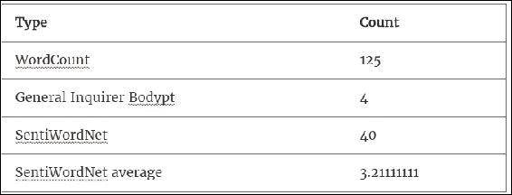
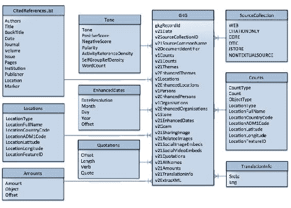
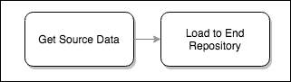

# 三、输入格式和模式

本章的目的是演示如何将数据从原始格式加载到不同的模式中，从而使各种不同类型的下游分析能够在相同的数据上运行。当编写分析时，或者更好的是，构建可重用软件库时，您通常必须使用固定输入类型的接口。因此，根据目的，灵活地在模式之间转换数据，可以带来可观的下游价值，包括扩展可能的分析类型和重用现有代码。

我们的主要目标是了解 Spark 附带的数据格式功能，尽管我们还将通过引入行之有效的方法来深入研究数据管理的细节，这些方法将增强您的数据处理能力并提高您的工作效率。毕竟，最有可能的是，你会被要求在某个时候正式化你的工作，并且在编写分析时以及之后很长时间里，介绍如何避免潜在的长期陷阱是非常宝贵的。

考虑到这一点，我们将使用这一章来查看*数据模式*的传统上被很好理解的区域。我们将涵盖传统数据库建模的关键领域，并解释这些基石原则如何仍然适用于 Spark。

此外，在磨练 Spark 技能的同时，我们将分析 GDELT 数据模型，并展示如何以高效且可扩展的方式存储这个大数据集。

我们将涵盖以下主题:

*   维度建模:与 Spark 相关的优点和缺点
*   关注全球英语教学模式
*   揭开阅读模式的盖子
*   Avro 对象模型
*   拼花储物模型

让我们从一些最佳实践开始。

# 有条理的生活是美好的生活

在了解 Spark 和大数据的优势时，您可能已经听到了关于*结构化*数据与*半结构化*数据与*非结构化*数据的讨论。虽然 Spark 提倡使用结构化、半结构化和非结构化数据，但它也为其一致处理提供了基础。唯一的限制是它应该是基于*记录的*。只要它们是基于记录的，数据集就可以以相同的方式进行转换、丰富和操作，而不管它们的组织如何。

然而，值得注意的是，拥有非结构化数据并不一定需要采用非结构化*方法*。在前一章中确定了探索数据集的技术后，直接将数据藏在某个可访问的地方并立即开始简单的概要分析是很有诱惑力的。在现实生活中，这种活动通常优先于尽职调查。我们再次鼓励您在开始这项探索之前，考虑几个感兴趣的关键领域，例如文件完整性、数据质量、进度管理、版本管理、安全性等。这些不应该被忽视，许多本身就是大话题。

因此，虽然我们已经在[第 2 章](02.html "Chapter 2. Data Acquisition")、*数据采集*中讨论了其中的许多问题，并将在后面进行更多的研究，例如在[第 13 章](13.html "Chapter 13. Secure Data")、*安全数据*中，在本章中，我们将专门关注数据输入和输出格式，探索我们可以采用的一些方法，以确保更好的数据处理和管理。

# GDELT 维度建模

由于我们在本书中选择使用 GDELT 进行分析，我们将介绍使用该数据集的第一个示例。首先，让我们选择一些数据。

有两个数据流可用:**全球知识图** ( **GKG** )和**事件**。

在本章中，我们将使用 GKG 数据创建一个可从 Spark SQL 查询的时间序列数据集。这将为我们创建一些简单的介绍性分析提供一个很好的起点。

在接下来的章节中，[第 4 章](04.html "Chapter 4. Exploratory Data Analysis")、*探索性数据分析*和[第 5 章](05.html "Chapter 5. Spark for Geographic Analysis")、*地理分析Spark*，我们将深入探讨更多细节，但仍停留在 GKG。然后，在[第 7 章](07.html "Chapter 7. Building Communities")、*构建社区*中，我们将通过制作我们自己的人的网络图并将其用于一些很酷的分析来探索事件。

## 格德尔特模型

GDELT 已经存在了 20 多年，在此期间，它经历了一些重大的修改。对于我们的介绍性示例，为了简单起见，让我们从 2013 年 4 月 1 日开始限制我们的数据范围，当时 GDELT 进行了一次大的文件结构检查，引入了 GKG 文件。值得注意的是，本章中讨论的原则适用于所有版本的 GDELT 数据，但是，在此日期之前的特定模式和**统一资源标识符** ( **URIs** )可能与描述的不同。我们将使用的版本是 GDELT v2.1，这是编写本文时的最新版本。但同样值得注意的是，这与 GDELT 2.0 仅略有不同。

GKG 数据中有两个数据轨道:

1.  整个知识图，以及它的所有领域。
2.  图形的子集，包含一组预定义的类别。

我们来看看第一首曲目。

### 先看数据

我们在[第二章](02.html "Chapter 2. Data Acquisition")、*数据采集*中讨论了如何下载 GDELT 数据，所以如果你已经有配置了 NiFi 管道来下载 GKG 数据，只要确保它在 HDFS 可用就可以了。然而，如果你还没有完成那一章，那么我们会鼓励你先这样做，因为它解释了为什么你应该采取结构化的方法来获取数据。

虽然我们已经竭尽全力不鼓励使用临时数据下载，但本章的范围当然是已知的，因此，如果您有兴趣遵循这里看到的示例，您可以跳过使用 NiFi，直接获取数据(以便尽快开始)。

如果您确实希望下载一个示例，这里有一个提示，告诉您在哪里可以找到 GDELT 2.1 GKG 主文件列表:

```scala
http://data.gdeltproject.org/gdeltv2/masterfilelist.txt
```

记下几个符合`.gkg.csv.zip`的最新条目，用你最喜欢的 HTTP 工具复制它们，然后上传到 HDFS。例如:

```scala
wget http://data.gdeltproject.org/gdeltv2/20150218230000.gkg.csv.zip -o log.txt  
unzip 20150218230000.gkg.csv.zip 
hdfs dfs -put 20150218230000.gkg.csv /data/gdelt/gkg/2015/02/21/ 

```

现在，您已经解压缩了 CSV 文件并将其加载到 HDFS，让我们继续查看数据。

### 注

在加载到 HDFS 之前，实际上没有必要解压缩数据。Spark 的`TextInputFormat`类支持压缩类型，会透明解压。但是，当我们在上一章解压缩 NiFi 管道中的内容时，为了保持一致性，这里会执行解压缩。

### 核心全局知识图模型

有一些重要的原则需要理解，从长远来看，这肯定会节省时间，无论是在计算还是人力方面。像许多客户服务提供商一样，这个文件隐藏了一些复杂性，如果在这个阶段没有很好地理解，可能会在我们以后的大规模分析中成为一个真正的问题。GDELT 文档描述了这些数据。可以在这里找到:[http://data . gdeltproject . org/documentation/GDELT-Global _ Knowledge _ Graph _ Codebook-v 2.1 . pdf](http://data.gdeltproject.org/documentation/GDELT-Global_Knowledge_Graph_Codebook-V2.1.pdf)。

表示每条 CSV 线都是换行定界，结构如图*图 1* :


图 1 gdeltg GK v 2.1

从表面上看，这似乎是一个很好的简单模型，我们可以简单地查询一个字段并使用其中的数据——就像我们每天导入和导出到微软 Excel 的 CSV 文件一样。但是，如果我们更详细地检查这些字段，就会发现一些字段实际上是对外部源的引用，而其他字段是展平的数据，实际上由其他表表示。

### 隐藏的复杂性

核心 GKG 模型中的扁平数据结构表示隐藏的复杂性。例如，查看文档中的字段 V2GCAM，它概述了这是一系列逗号分隔的块，包含冒号分隔的键值对，这些对代表 GCAM 变量及其各自的计数。就像这样:

```scala
wc:125,c2.21:4,c10.1:40,v10.1:3.21111111

```

如果我们参考 GCAM 规范。TXT 我们可以把这个翻译成:



还有其他领域也是这样工作的，比如`V2Locations`、`V2Persons`、`V2Organizations`等等。这里到底发生了什么？所有这些嵌套结构是什么，为什么您会选择以这种方式表示数据？事实证明，这是一种折叠**维度模型**的便捷方法，这样就可以在单行记录中表示它，而不会丢失任何数据或交叉引用。事实上，这是一种经常使用的技术，被称为*反规格化*。

### 反规格化模型

传统上，维度模型是由许多事实表和维度表组成的数据库表结构。由于它们在实体关系图中的出现，它们通常被称为具有星形或雪花形模式。在这样的模型中，*事实*是可以计数或求和的值，并且通常在给定的时间点提供测量。由于它们通常基于事务或重复事件，事实的数量往往会变得非常大。另一方面，*维度*是信息的逻辑分组，其目的是限定或语境化事实。它们通常为通过分组或聚合的方式解释事实提供一个切入点。此外，维度可以是分层的，一个维度可以引用另一个维度。我们可以在*图 2* 中看到展开的 GKG 维度结构图。

在我们的 GCAM 示例中，事实是上表中的条目，维度是 GCAM 引用本身。虽然这看起来像是一个简单的逻辑抽象，但它确实意味着我们有一个需要仔细考虑的重要领域:维度建模对于传统数据库非常有用，在传统数据库中，数据可以拆分成表——在本例中是 GKG 表和 GCAM 表——因为这些类型的数据库本质上是针对这种结构进行优化的。例如，查找值或聚合事实的操作是本地可用的。然而，当使用 Spark 时，一些我们认为理所当然的操作可能会非常昂贵。例如，如果我们想要对数百万个条目的所有 GCAM 字段进行平均，那么我们将需要执行非常大的计算。我们将在下图中更详细地讨论这一点:



图 2 扩展的 GKG 英语教学 2.1

### 数据扁平化带来的挑战

研究了 GKG 数据模式之后，我们现在知道分类法是一个典型的星型模式，它有一个引用多个维度表的事实表。有了这种层次结构，如果我们需要以传统数据库所允许的相同方式对数据进行切片，我们肯定会遇到困难。

但是是什么让它在 Spark 上如此难以处理呢？让我们看看这种类型的组织固有的三个不同的问题。

#### 问题 1 -上下文信息丢失

首先，数据集的每条记录中使用的各种数组。例如，`V1Locations`、`V1Organizations`和`V1Persons`字段都包含 0 个或更多对象的列表。由于我们没有用于导出这些信息的原始文本主体(尽管如果源是 WEB、JSTOR 等，我们有时可以获得它，因为这些将包含到源文档的链接)，我们失去了实体之间关系的上下文。

例如，如果我们的数据中有[巴拉克·奥巴马、大卫·卡梅伦、弗朗索瓦·德努瓦耶、美国、法国、英国、德士古、埃索、壳牌]，那么我们可以假设来源文章与国家元首就石油危机举行的会议有关。然而，这只是一个假设，可能不是这样，如果我们真的客观，我们同样可以假设这篇文章与那些拥有著名员工的公司有关。

为了帮助我们推断实体之间的这些关系，我们可以开发一个时间序列模型，该模型在某个时间段内获取一个 GDELT 字段的所有单独内容，并执行扩展连接。因此，在一个简单的层面上，那些经常被看到的对更有可能实际上相互关联，我们可以开始做出一些更具体的假设。例如，如果我们在我们的时间序列中看到[巴拉克·奥巴马，美国] 100，000 次，而[巴拉克·奥巴马，法国]只有 5000 次，那么很可能第一对之间有很强的关系，第二对之间有次要的关系。换句话说，我们可以识别脆弱的关系，并在需要时消除它们。这种方法可以大规模地用于识别明显不相关的实体之间的关系。在[第七章](07.html "Chapter 7. Building Communities")、*建设社区*中，我们用这个原则来识别一些非常不太可能的人之间的关系！

#### 第 2 期:重建维度

对于任何非标准化数据，都应该可以重建或膨胀原始维度模型。考虑到这一点，让我们看看一个有用的 Spark 函数，它将帮助我们扩展我们的数组并产生一个平坦的结果；它叫做`DataFrame.explode`，这里有一个说明性的例子:

```scala
case class Grouped(locations:Array[String], people:Array[String]) 

val group = Grouped(Array("USA","France","GB"), 
       Array("Barack Obama","David Cameron", "Francois Hollande")) 

val ds = Seq(group).toDS 

ds.show 

+-----------------+--------------------+ 
|        locations|              people| 
+-----------------+--------------------+ 
|[USA, France, GB]|[Barack Obama, Da...| 
+-----------------+--------------------+ 

val flatLocs = ds.withColumn("locations",explode($"locations")) 
flatLocs.show 

+---------+--------------------+ 
|Locations|              People| 
+---------+--------------------+ 
|      USA|[Barack Obama, Da...| 
|   France|[Barack Obama, Da...| 
|       GB|[Barack Obama, Da...| 
+---------+--------------------+ 

val flatFolk = flatLocs.withColumn("people",explode($"people")) 
flatFolk.show 

+---------+-----------------+ 
|Locations|           People| 
+---------+-----------------+ 
|      USA|     Barack Obama| 
|      USA|    David Cameron| 
|      USA|Francois Hollande| 
|   France|     Barack Obama| 
|   France|    David Cameron| 
|   France|Francois Hollande| 
|       GB|     Barack Obama| 
|       GB|    David Cameron| 
|       GB|Francois Hollande| 
+---------+-----------------+ 

```

使用这种方法，我们可以轻松地扩展数组，然后执行我们选择的分组。一旦扩展，数据很容易使用`DataFrame`方法聚合，甚至可以使用 SparkSQL 完成。这方面的一个例子可以在我们存储库中的齐柏林飞艇笔记本中找到。

理解这一点很重要，虽然这个函数实现起来很简单，但它不一定有性能，而且可能隐藏了所需的底层处理复杂性。事实上，本章附带了一个使用齐柏林飞艇笔记本中的 GKG 数据的 explot 函数的例子，如果 explot 函数的作用域不合理，那么该函数会在内存耗尽时返回堆空间问题。

这个函数没有解决消耗大量系统资源的固有问题，所以在使用时还是要小心。虽然这个一般性问题无法解决，但可以通过只执行必要的分组和连接，或者通过提前计算它们并确保它们在可用资源范围内完成来进行管理。您甚至可能希望编写一个算法来拆分数据集并按顺序执行分组，每次都保持不变。在[第 14 章](14.html "Chapter 14. Scalable Algorithms")、*可扩展算法*中，我们探索了帮助我们解决这个问题和其他常见处理问题的方法。

#### 第三期:包含参考数据

对于这个问题，我们来看看 GDELT 事件数据，我们已经在*图 3* 中展开了:


图 3 全球英语教学事件分类

这种类型的图形表示吸引了对数据中的关系的注意，并给出了我们可能想要如何膨胀它的指示。在这里，我们看到许多字段只是代码，需要翻译回它们的原始描述，以便呈现任何有意义的东西。例如，为了解释`Actor1CountryCode` (GDELT 事件)，我们需要将事件数据与一个或多个提供翻译文本的独立参考数据集连接起来。在这种情况下，文档告诉我们引用位于这里的 CAMEO 数据集:[http://data.gdeltproject.org/documentation/CAMEO.Manual.1.1b3.pdf](http://data.gdeltproject.org/documentation/CAMEO.Manual.1.1b3.pdf)。

这种类型的连接在数据规模上一直是一个严重的问题，根据给定的场景，有各种各样的方法来处理它——在这个阶段，准确地了解如何使用您的数据是很重要的，哪些连接可能是立即需要的，哪些可能被推迟到将来的某个时候。

如果我们选择在处理之前对数据进行完全反规格化或展平，那么提前进行连接是有意义的。在这种情况下，后续分析肯定会更高效，因为相关的连接已经完成:

所以，在我们的例子中:

```scala
wc:125,c2.21:4,c10.1:40,v10.1:3.21111111

```

对于记录中的每个代码，都有一个到相应引用表的连接，整个记录变成:

```scala
WordCount:125, General_Inquirer_Bodypt:4, SentiWordNet:40, SentiWordNet average: v10.1:3.21111111

```

这是一个简单的更改，但是如果跨大量行执行，会占用大量磁盘空间。代价是连接必须在某个时间点执行，可能是在接收时，也可能是接收后的常规批处理作业；照原样摄取数据，并在方便用户的时间对数据集进行展平是完全合理的。在任何情况下，任何分析人员都可以使用展平的数据，数据分析师不必担心这个潜在的隐藏问题。

另一方面，通常，将连接推迟到处理的稍后阶段意味着要连接的记录更少，因为管道中可能有聚合步骤。在这种情况下，在最后一个可能的机会连接到表是有回报的，因为引用表或维度表通常小到足以成为广播连接或地图端连接。由于这是一个如此重要的主题，我们将在整本书中继续研究处理连接场景的不同方法。

# 加载您的数据

正如我们在前面几章中所概述的，传统的系统工程通常采用一种模式将数据从其源移动到其目的地，即 ETL，而 Spark 倾向于依赖模式读取。理解这些概念与模式和输入格式的关系非常重要，让我们更详细地描述这一方面:


从表面上看，ETL 方法似乎是明智的，实际上几乎每个存储和处理数据的组织都已经实现了这种方法。有一些非常受欢迎、功能丰富的产品可以很好地执行 ETL 任务，更不用说 Apache 的开源产品 Apache Camel[http://camel.apache.org/etl-example.html](http://camel.apache.org/etl-example.html)了。

然而，这种看似简单的方法掩盖了实现简单数据管道所需的真正努力。这是因为我们必须确保所有数据都符合固定的模式，然后才能使用它。例如，如果我们想从一个起始目录摄取一些数据，最少的工作如下:

1.  确保我们一直在查看提货目录。
2.  当数据到达时，收集它。
3.  确保数据没有丢失，并根据预定义的规则集进行验证。
4.  根据预定义的规则集，提取我们感兴趣的数据部分。
5.  根据预定义的模式转换这些选定的部分。
6.  使用正确的版本化模式将数据加载到存储库中(例如，数据库)。
7.  处理任何失败的记录。

我们可以立即看到许多必须解决的格式问题:

1.  我们有一个预定义的规则集，因此，这必须是版本控制的。任何错误都将意味着最终数据库中的坏数据，以及通过 ETL 过程重新摄取这些数据来纠正它(非常耗费时间和资源)。对入站数据集格式和此规则集的任何更改都必须更改。
2.  对目标模式的任何更改都需要非常仔细的管理。至少，ETL 中的版本控制更改，甚至可能是部分或全部先前数据的重新处理(这可能是非常耗时且昂贵的回程)。
3.  对最终存储库的任何更改都将导致至少一个版本控制模式的更改，甚至可能导致一个新的 ETL 模块(同样，非常耗费时间和资源)。
4.  不可避免地，会有一些坏数据进入数据库。因此，管理员需要设置规则来监控表的引用完整性，以确保将损坏保持在最低程度，并安排重新接收任何损坏的数据。

如果我们现在考虑这些问题，并大规模增加数据的数量、速度、多样性和准确性，很容易看到我们简单的 ETL 系统已经很快发展成为一个近乎不可管理的系统。任何格式、模式和业务规则的更改都会产生负面影响。在某些情况下，由于需要所有的处理步骤，可能没有足够的处理器和内存资源来跟上进度。在所有的 ETL 步骤达成一致并到位之前，数据不能被获取。在大公司中，在任何实现开始之前，可能需要几个月的时间来商定模式转换，从而导致大量的积压，甚至数据丢失。所有这些导致了一个脆弱的系统，很难改变。

## 模式敏捷性

为了克服这一点，读时模式鼓励我们转向一个非常简单的原则:*在运行时将模式应用于数据，而不是在加载时(即摄取时)*。换句话说，当数据被读入进行处理时，模式被应用于数据。这在一定程度上简化了 ETL 过程:



当然，这并不意味着您完全取消了转换步骤。您只是简单地*推迟*验证、应用业务规则、错误处理、确保引用完整性、丰富、聚合和膨胀模型的行为，直到您准备好使用它。这个想法是，到这一点，你应该知道更多的数据，当然也知道你希望使用它的方式。因此，您可以利用这些增加的数据知识来提高加载方法的效率。同样，这是一种权衡。您节省的前期处理成本可能会因重复处理和潜在的不一致性而损失。然而，持久性、索引、记忆和缓存等技术在这方面都有帮助。如前一章所述，由于处理步骤的顺序颠倒，这个过程通常被称为英语教学。

这种方法的一个好处是，它允许对任何给定用例的数据表示和建模方式做出适当的决定。例如，有多种方法可以对数据进行结构化、格式化、存储、压缩或序列化，考虑到与您试图解决的特定问题相关的一组特定要求，选择最合适的方法是有意义的。

这种方法提供的最重要的机会之一是，您可以选择如何对数据进行物理布局，也就是说，决定保存数据的目录结构。通常不建议将您的所有数据存储在一个目录中，因为随着文件数量的增长，底层文件系统需要花费更长的时间来处理它们。但是，理想情况下，我们希望能够指定尽可能小的数据分割来实现功能，并在所需的卷上高效地存储和检索。因此，数据应该根据所需的分析和预期接收的数据量进行逻辑分组。换句话说，数据可以根据类型、子类型、日期、时间或一些其他相关属性跨目录划分，但应确保没有单个目录承受过度的负担。这里要意识到的另一个重要点是，一旦数据落地，它总是可以在以后重新格式化或重组，而在 ETL 范例中，这通常要困难得多。

除此之外，ELT 在**变更管理**和**版本控制**上也有惊人的好处。例如，如果外部因素导致数据模式改变，您可以简单地将不同的数据加载到数据存储中的新目录中，并使用灵活的模式容忍序列化库，如 Avro 或 Parquet，它们都支持**模式演化**(我们将在本章稍后部分讨论这些)；或者，如果某个特定作业的结果不令人满意，我们只需要在重新运行之前更改该作业的内部。这意味着模式变化成为可以在每个分析的基础上管理的东西，而不是在每个提要的基础上管理的东西，并且变化的影响被更好地隔离和管理。

顺便说一句，值得考虑一种混合方法，在流用例中特别有用，其中一些处理可以在收集和摄取期间完成，而另一些可以在运行时完成。关于是使用 ETL 还是 ELT 的决定不一定是二元的。Spark 提供的功能使您可以控制数据管道。反过来，这为您提供了在有意义时转换或持久化数据的灵活性，而不是采用一刀切的方法。

确定采用哪种方法的最佳方式是从特定数据集的实际日常使用中学习，并相应地调整其处理，随着经验的积累，识别瓶颈和脆弱性。还可能会征收公司规则，如病毒扫描或数据安全，这将决定特定的路线。我们将在这一章的结尾对此进行更深入的探讨。

### 现实检查

和计算领域的大多数事情一样，没有灵丹妙药。英语教学和阅读模式不会解决你所有的数据格式问题，但它们是工具箱中有用的工具，一般来说，利大于弊。然而，值得注意的是，有些情况下，如果你不小心，你实际上会带来困难。

特别是，对复杂的数据模型执行特别分析(相对于数据库而言)会更复杂。例如，在提取新闻文章中提到的所有城市名称列表的简单情况下，在一个 SQL 数据库中，您基本上可以运行`select CITY from GKG`，而在 Spark 中，您首先需要理解数据模型，解析和验证数据，然后创建相关的表并动态处理任何错误，有时是在每次运行查询时。

同样，这是一种权衡。通过读取模式，您失去了固定模式的内置数据表示和固有知识，但是您获得了根据需要应用不同模型或视图的灵活性。像往常一样，Spark 提供了一些旨在帮助利用这种方法的特性，例如转换、`DataFrames`、`SparkSQL`和 REPL，如果使用得当，它们可以让您最大限度地利用读取模式的优势。随着我们的深入，我们会了解到更多的情况。

## gg ELT

由于我们的 NiFi 管道将数据写入 HDFS，我们可以充分利用读取时模式，并立即开始使用它，而不必等待它被处理。如果您想更高级一点，那么您可以以可拆分和/或压缩的格式加载数据，例如`bzip2`(原生于 Spark)。让我们看一个简单的例子。

### 注

HDFS 使用区块系统存储数据。为了以最有效的方式存储和利用数据，HDFS 文件应该尽可能是可拆分的。例如，如果使用`TextOutputFormat`类加载 CSV GDELT 文件，则大于块大小的文件将被分割为文件大小/块大小的块。部分块不会占用磁盘上的全部块大小。

通过使用`DataFrames`，我们可以编写 SQL 语句来探索数据，或者使用数据集来链接流畅的方法，但是无论哪种情况都需要一些初始准备。

好消息是，这通常可以完全由 Spark 来完成，因为它支持使用**编码器**通过案例类将数据透明地加载到数据集，所以大多数时候你不需要太担心内部工作。事实上，当您有一个相对简单的数据模型时，定义一个案例类，将您的数据映射到它上面，并使用`toDS`方法转换成数据集就足够了。然而，在大多数现实场景中，数据模型更加复杂，您需要编写自己的定制解析器。自定义解析器在数据工程中并不新鲜，但是在读取模式设置中，数据科学家经常需要使用它们，因为数据的解释是在运行时完成的，而不是在加载时。下面是在我们的存储库中可以找到的自定义 GKG 解析器的使用示例:

```scala

import org.apache.spark.sql.functions._      

val rdd = rawDS map GdeltParser.toCaseClass    
val ds = rdd.toDS()     

// DataFrame-style API 
ds.agg(avg("goldstein")).as("goldstein").show()    

// Dataset-style API 
ds.groupBy(_.eventCode).count().show() 

```

在此之前可以看到，一旦数据被解析，它就可以在各种各样的 Spark APIs 中使用。

如果您更愿意使用 SQL，您可以定义自己的模式，注册一个表，并使用 SparkSQL。无论采用哪种方法，您都可以根据数据的使用方式来选择如何加载数据，从而可以更加灵活地分析哪些方面。例如，加载 GKG 的最基本模式是将每个字段视为一个字符串，如下所示:

```scala
import org.apache.spark.sql.types._ 

val schema = StructType(Array( 
    StructField("GkgRecordId"           , StringType, true), 
    StructField("V21Date"               , StringType, true), 
    StructField("V2SrcCollectionId"     , StringType, true),        
    StructField("V2SrcCmnName"          , StringType, true),  
    StructField("V2DocId"               , StringType, true),  
    StructField("V1Counts"              , StringType, true),  
    StructField("V21Counts"             , StringType, true),  
    StructField("V1Themes"              , StringType, true),  
    StructField("V2Themes"              , StringType, true),  
    StructField("V1Locations"           , StringType, true),  
    StructField("V2Locations"           , StringType, true),  
    StructField("V1Persons"             , StringType, true),  
    StructField("V2Persons"             , StringType, true),  
    StructField("V1Orgs"                , StringType, true),  
    StructField("V2Orgs"                , StringType, true),  
    StructField("V15Tone"               , StringType, true),  
    StructField("V21Dates"              , StringType, true),  
    StructField("V2GCAM"                , StringType, true),  
    StructField("V21ShareImg"           , StringType, true),  
    StructField("V21RelImg"             , StringType, true),  
    StructField("V21SocImage"           , StringType, true), 
    StructField("V21SocVideo"           , StringType, true),  
    StructField("V21Quotations"         , StringType, true),  
    StructField("V21AllNames"           , StringType, true),  
    StructField("V21Amounts"            , StringType, true), 
    StructField("V21TransInfo"          , StringType, true),  
    StructField("V2ExtrasXML"           , StringType, true)   
)) 

val filename="path_to_your_gkg_files"  

val df = spark 
   .read 
   .option("header", "false") 
   .schema(schema) 
   .option("delimiter", "t") 
   .csv(filename) 

df.createOrReplaceTempView("GKG") 

```

现在，您可以执行 SQL 查询，如下所示:

```scala
spark.sql("SELECT V2GCAM FROM GKG LIMIT 5").show 
spark.sql("SELECT AVG(GOLDSTEIN) AS GOLDSTEIN FROM GKG WHERE GOLDSTEIN IS NOT NULL").show() 

```

使用这种方法，您可以立即开始分析数据，这对于许多数据工程任务都很有用。当你准备好了，你可以选择 GKG 记录的其他元素来扩展。我们将在下一章中看到更多关于这方面的内容。

一旦有了数据框，就可以通过定义案例类和强制转换将其转换为数据集，如下所示:

```scala
val ds = df.as[GdeltEntity] 

```

### 位置很重要

这里值得注意的是，从 CSV 加载数据时，Spark 的模式匹配完全是*定位*。这意味着，当 Spark 根据给定的分隔符标记记录时，它会使用每个标记的位置将每个标记分配给架构中的一个字段，即使存在标头也是如此。因此，如果在模式定义中省略了一列，或者由于数据漂移或数据版本控制，数据集会随着时间的推移而变化，您可能会遇到 Spark 不一定会警告您的未对齐情况！

因此，我们建议定期进行基本数据分析和数据质量检查，以缓解这些情况。您可以使用`DataFrameStatFunctions`中的内置功能来辅助此操作。一些示例如下所示:

```scala

df.describe("V1Themes").show 

df.stat.freqItems(Array("V2Persons")).show 

df.stat.crosstab("V2Persons","V2Locations").show 

```

接下来，让我们解释一个很好的方法，通过使用 Avro 或 Parquet，在代码周围放置一些结构，并减少编写的代码量。

# 欧元

我们已经看到了摄取一些数据并使用 Spark 来分析它是多么容易，而不需要任何传统的 ETL 工具。虽然在模式几乎被忽略的环境中工作非常有用，但这在商业世界中是不现实的。然而，有一个很好的中间地带，它给了我们一些超越 ETL 和无界数据处理的巨大优势——Avro。

Apache Avro 是序列化技术，目的类似于谷歌的协议缓冲区。像许多其他序列化技术一样，Avro 使用模式来描述数据，但其有用性的关键在于它提供了以下特性:

*   **它将模式存储在数据旁边**。这允许有效的存储，因为模式只存储一次，在文件的顶部。这也意味着即使原始类文件不再可用，也可以读取数据。
*   **支持阅读时模式和模式进化**。这意味着它可以为数据的读写实现不同的模式，提供模式版本控制的优势，而没有每次我们希望修改数据时管理开销大的缺点。
*   **是语言不可知论**。因此，它可以与任何允许自定义序列化框架的工具或技术一起使用。例如，它对于直接写入 Hive 特别有用。

由于 Avro 将模式与包含的数据一起存储，所以它是*自描述的*。因此，与其因为没有类而费力地读取数据，或者试图猜测模式的哪个版本适用，或者在最糟糕的情况下不得不完全丢弃数据，我们可以简单地询问 Avro 文件，以获取写入数据的模式。

Avro 还允许以附加更改或追加的形式对模式进行修改，这样可以使特定的实现向后兼容旧的数据。

由于 Avro 以二进制形式表示数据，因此可以更有效地传输和操作数据。此外，由于其固有的压缩，它占用的磁盘空间更少。

出于上述原因，Avro 是一种非常流行的序列化格式，被各种各样的技术和终端系统使用，毫无疑问，您有理由在某个时候使用它。因此，在接下来的部分中，我们将演示读取和写入 Avro 格式数据的两种不同方式。第一种是一种优雅而简单的方法，它使用第三方专门构建的库，称为`spark-avro`，第二种是一种隐藏的方法，有助于理解 Avro 的机制是如何工作的。

## Spark-阿夫罗法

为了解决实现 Avro 的复杂性，开发了`spark-avro`库。可以使用 maven 以通常的方式导入:

```scala

<dependency> 
    <groupId>com.databricks</groupId> 
    <artifactId>spark-avro_2.11</artifactId> 
    <version>3.1.0</version> 
</dependency> 

```

对于这个实现，我们将使用`StructType`对象创建 Avro 模式，使用`RDD`转换输入数据，并从这两个对象创建`DataFrame`。最后，结果可以使用`spark-avro`库以 Avro 格式写入文件。

`StructType`对象是在[第四章](04.html "Chapter 4. Exploratory Data Analysis")、*探索性数据分析*中使用的`GkgCoreSchema`的变体，其构造如下:

```scala
val GkgSchema = StructType(Array(
   StructField("GkgRecordId", GkgRecordIdStruct, true), 
   StructField("V21Date", LongType, true), 
   StructField("V2SrcCollectionId", StringType, true), 
   StructField("V2SrcCmnName", StringType, true), 
   StructField("V2DocId", StringType, true), 
   StructField("V1Counts", ArrayType(V1CountStruct), true),            
   StructField("V21Counts", ArrayType(V21CountStruct), true),           
   StructField("V1Themes", ArrayType(StringType), true),
   StructField("V2EnhancedThemes",ArrayType(EnhancedThemes),true),    
   StructField("V1Locations", ArrayType(V1LocationStruct), true),         
   StructField("V2Locations", ArrayType(EnhancedLocations), true), 
   StructField("V1Persons", ArrayType(StringType), true), 
   StructField("V2Persons", ArrayType(EnhancedPersonStruct), true),   
   StructField("V1Orgs", ArrayType(StringType), true), 
   StructField("V2Orgs", ArrayType(EnhancedOrgStruct), true),      
   StructField("V1Stone", V1StoneStruct, true), 
   StructField("V21Dates", ArrayType(V21EnhancedDateStruct), true),    
   StructField("V2GCAM", ArrayType(V2GcamStruct), true), 
   StructField("V21ShareImg", StringType, true), 
   StructField("V21RelImg", ArrayType(StringType), true), 
   StructField("V21SocImage", ArrayType(StringType), true), 
   StructField("V21SocVideo", ArrayType(StringType), true), 
   StructField("V21Quotations", ArrayType(QuotationStruct), true), 
   StructField("V21AllNames", ArrayType(V21NameStruct), true), 
   StructField("V21Amounts", ArrayType(V21AmountStruct), true), 
   StructField("V21TransInfo", V21TranslationInfoStruct, true), 
   StructField("V2ExtrasXML", StringType, true) 
 ))
```

我们使用了许多定制的`StructTypes`，可以为`GkgSchema`内联指定，但是为了便于阅读，我们将它们分开了。

例如，`GkgRecordIdStruct`是:

```scala
val GkgRecordIdStruct = StructType(Array(
  StructField("Date", LongType),
  StructField("TransLingual", BooleanType),     
  StructField("NumberInBatch";, IntegerType)
))
```

在我们使用这个模式之前，我们必须首先通过将输入的 GDELT 数据解析成一个`Row`来产生一个`RDD`:

```scala
val gdeltRDD = sparkContext.textFile("20160101020000.gkg.csv")

val gdeltRowOfRowsRDD = gdeltRDD.map(_.split("\t"))
   .map(attributes =>
      Row(
       createGkgRecordID(attributes(0)),
       attributes(1).toLong,
       createSourceCollectionIdentifier(attributes(2),
       attributes(3),
       attributes(4),
       createV1Counts(attributes(5),
       createV21Counts(attributes(6),
       .
       .
       .
      )
   ))
```

在这里，您可以看到许多定制的解析函数，例如，`createGkgRecordID`，它们获取原始数据并包含读取和解释每个字段的逻辑。由于 GKG 字段很复杂，通常包含*嵌套数据结构*，我们需要一种方法将它们嵌入到`Row`中。为了帮助我们，星火允许我们在`Rows`里面把他们当成`Rows`。因此，我们只需编写返回`Row`对象的解析函数，如下所示:

```scala
def createGkgRecordID(str: String): Row = {
   if (str != "") {
     val split = str.split("-")
     if (split(1).length > 1) {
       Row(split(0).toLong, true, split(1).substring(1).toInt)
     }
     else {
       Row(split(0).toLong, false, split(1).toInt)
     }
   }
   else {
     Row(0L, false, 0)
   }
 }
```

将代码放在一起，我们只需几行就能看到整个解决方案:

```scala
import org.apache.spark.sql.types._
import com.databricks.spark.avro._
import org.apache.spark.sql.Row

val df = spark.createDataFrame(gdeltRowOfRowsRDD, GkgSchema)

df.write.avro("/path/to/avro/output")
```

将 Avro 文件读入`DataFrame`同样简单:

```scala
val avroDF = spark
  .read
  .format("com.databricks.spark.avro")
  .load("/path/to/avro/output")
```

这为处理 Avro 文件提供了一个整洁的解决方案，但是在幕后发生了什么？

## 教学法

为了解释 Avro 是如何工作的，让我们来看看一个你自己的解决方案。在这种情况下，我们需要做的第一件事是为我们打算摄取的数据版本创建一个 Avro 模式。

有几种语言的 Avro 实现，包括 Java。这些实现允许您为 Avro 生成绑定，以便您可以高效地序列化和反序列化数据对象。我们将使用一个 maven 插件来帮助我们使用 GKG 模式的 Avro IDL 表示自动编译这些绑定。绑定将以 Java 类的形式出现，我们可以在以后使用它来帮助我们构建 Avro 对象。在项目中使用以下导入:

```scala
<dependency>  
   <groupId>org.apache.avro</groupId>  
   <artifactId>avro</artifactId>  
   <version>1.7.7</version>
</dependency>

<plugin>  
   <groupId>org.apache.avro</groupId>  
   <artifactId>avro-maven-plugin</artifactId>  
   <version>1.7.7</version>  
   <executions>    
      <execution>      
         <phase>generate-sources</phase>      
         <goals>        
            <goal>schema</goal>      
         </goals>      
         <configuration>           
           <sourceDirectory>
           ${project.basedir}/src/main/avro/
           </sourceDirectory>          
           <outputDirectory>
              ${project.basedir}/src/main/java/
           </outputDirectory>         
         </configuration>    
      </execution>  
   </executions>
</plugin>
```

我们现在可以看看我们的 Avro IDL 模式，它是从可用 Avro 类型的子集创建的:

```scala
+----------------+-------------+
|       primitive|      complex|
+----------------+-------------+
|null            |       record|
|Boolean         |         enum|
|int             |        array|
|long            |          map|
|float           |        union|
|double          |        fixed|
|bytes           |             |
|string          |             |
+----------------+-------------+
```

GDELT 2.1 的完整 Avro IDL 模式可以在我们的代码 repo 中找到，但这里有一个片段:

```scala
@namespace("org.io.gzet.gdelt.gkg")
 protocol Gkg21
 {

    @namespace("org.io.gzet.gdelt.gkg.v1")
    record Location
    {
       int locationType = 0;
       union { null , string } fullName = null;
       union { null , string } countryCode = null;
       union { null , string } aDM1Code = null;
       float locationLatitude = 0.0;
       float locationLongitude = 0.0;
       union { null , string } featureId = null;
    }

    @namespace("org.io.gzet.gdelt.gkg.v1")
    record Count
    {
       union { null , string } countType = null;
       int count = 0;
       union { null , string } objectType = null;
       union { null , org.io.gzet.gdelt.gkg.v1.Location } v1Location = null;
    }

@namespace("org.io.gzet.gdelt.gkg.v21")
 record Specification
 {
    GkgRecordId gkgRecordId;
    union { null , long } v21Date = null;
    union { null , org.io.gzet.gdelt.gkg.v2.SourceCollectionIdentifier } v2SourceCollectionIdentifier = null;
    union { null , string } v21SourceCommonName = null;
    union { null , string } v2DocumentIdentifier = null;
    union { null , array<org.io.gzet.gdelt.gkg.v1.Count> } v1Counts = null;
    union { null , array<org.io.gzet.gdelt.gkg.v21.Count> } v21Counts = null;
    union { null , array<string> } v1Themes = null;
 }
```

Avro 提供了一个支持**自定义类型**的可扩展类型系统。它也是模块化的，并提供了名称空间，因此我们可以随着模式的发展添加新的类型并重用自定义类型。在前面的例子中，我们可以看到广泛使用的原语类型，但也可以看到自定义对象，如`org.io.gzet.gdelt.gkg.v1.Location`。

要创建 Avro 文件，我们可以使用以下代码(代码库中的完整示例):

```scala
  val inputFile = new File("gkg.csv");
  val outputFile = new File("gkg.avro");

  val userDatumWriter = new  
       SpecificDatumWriter[Specification](classOf[Specification])

  val dataFileWriter = new
       DataFileWriter[Specification](userDatumWriter)

  dataFileWriter.create(Specification.getClassSchema, outputFile)

  for (line <- Source.fromFile(inputFile).getLines())
      dataFileWriter.append(generateAvro(line))

  dataFileWriter.close()

  def generateAvro(line: String): Specification = {

    val values = line.split("\t",-1)
    if(values.length == 27){
      val specification = Specification.newBuilder()
        .setGkgRecordId(createGkgRecordId(values{0}))
        .setV21Date(values{1}.toLong)   
        .setV2SourceCollectionIdentifier(
          createSourceCollectionIdentifier(values{2}))
        .setV21SourceCommonName(values{3})
        .setV2DocumentIdentifier(values{4})
        .setV1Counts(createV1CountArray(values{5}))
        .setV21Counts(createV21CountArray(values{6}))
        .setV1Themes(createV1Themes(values{7}))
        .setV2EnhancedThemes(createV2EnhancedThemes(values{8}))
        .setV1Locations(createV1LocationsArray(values{9}))
  .
  .
  .

   }
 }
```

一旦我们编译了 IDL(使用 maven 插件)，就为我们创建了`Specification`对象。它包含访问 Avro 模型所需的所有方法，例如`setV2EnhancedLocations`。然后我们创建函数来解析我们的 GKG 数据；下面显示了两个示例:

```scala
def createSourceCollectionIdentifier(str: String) :    SourceCollectionIdentifier = {
   str.toInt match {
   case 1 => SourceCollectionIdentifier.WEB
   case 2 => SourceCollectionIdentifier.CITATIONONLY
   case 3 => SourceCollectionIdentifier.CORE
   case 4 => SourceCollectionIdentifier.DTIC
   case 5 => SourceCollectionIdentifier.JSTOR
   case 6 => SourceCollectionIdentifier.NONTEXTUALSOURCE
   case _ => SourceCollectionIdentifier.WEB
 }
   }
def createV1LocationsArray(str: String): Array[Location] = {
   val counts = str.split(";")
   counts map(createV1Location(_))
}
```

这种方法创建了所需的 Avro 文件，但这里显示的是演示 Avro 如何工作。照目前的情况来看，这段代码并不是并行运行的，因此不应该在大数据上使用。如果我们想将其并行化，我们可以创建一个定制的`InputFormat`，将原始数据打包成一个 RDD，并在此基础上执行处理。幸运的是，我们不必这样做，因为`spark-avro`已经为我们做了。

## 何时进行 Avro 变换

为了最好地利用 Avro，接下来，我们需要决定何时最好转换数据。转换为 Avro 是一个相对昂贵的操作，因此应该在最有意义的时候进行。再一次，这是一个权衡。这一次，它介于支持非结构化处理、探索性数据分析、临时查询的灵活数据模型和结构化类型系统之间。有两个主要选项需要考虑:

1.  **尽可能晚地转换**:可以在作业的每次运行中执行 Avro 转换。这里有一些明显的缺点，所以最好考虑在某个时候保留 Avro 文件，以避免重新计算。你可以在第一次的时候懒洋洋地这样做，但是很有可能这会很快变得混乱。更简单的选择是定期对静态数据运行批处理作业。这项工作的唯一任务是创建 Avro 数据并将其写回磁盘。这种方法让我们可以完全控制转换作业的执行时间。在繁忙的环境中，可以将作业安排在安静的时间段，并且可以临时分配优先级。缺点是，我们需要知道处理需要多长时间，以确保有足够的时间完成。如果在下一批数据到达之前没有完成处理，那么就会形成积压，很难赶上。
2.  **尽早转换**:另一种方法是创建一个接收管道，从而将传入的数据动态转换为 Avro(在流式传输场景中特别有用)。这样做，我们就有接近 ETL 风格场景的危险，所以这实际上是对哪种方法最适合当时使用的特定环境的判断。

现在，我们来看一个在 Spark 中广泛使用的相关技术，那就是 Apache Parquet。

# 检察机关

Apache Parquet 是一种专为 Hadoop 生态系统设计的柱状存储格式。传统的基于行的存储格式经过优化，一次只能处理一条记录，这意味着对于某些类型的工作负载，它们可能会很慢。相反，Parquet 按列序列化和存储数据，从而允许跨大型数据集优化存储、压缩、谓词处理和批量顺序访问——这正是适合 Spark 的工作负载类型！

由于 Parquet 实现了每列数据压缩，因此它特别适合 CSV 数据，尤其是对于低基数的字段，并且与 Avro 相比，文件大小可以大幅减少。

```scala
+--------------------------+--------------+ 
|                 File Type|          Size| 
+--------------------------+--------------+ 
|20160101020000.gkg.csv    |      20326266| 
|20160101020000.gkg.avro   |      13557119| 
|20160101020000.gkg.parquet|       6567110| 
|20160101020000.gkg.csv.bz2|       4028862| 
+--------------------------+--------------+ 

```

拼花地板还与 Avro 原生集成。Parquet 采用 Avro 内存中的数据表示，并映射到其内部数据类型。然后，它使用 Parquet 柱状文件格式将数据序列化到磁盘。

我们已经看到了如何将 Avro 应用到模型中，现在我们可以采取下一步，使用这个 Avro 模型通过 Parquet 格式将数据持久化到磁盘中。同样，我们将展示当前的方法，然后展示一些用于演示目的的低级代码。一、推荐方法:

```scala
val gdeltAvroDF = spark 
    .read
    .format("com.databricks.spark.avro")
    .load("/path/to/avro/output")

gdeltAvroDF.write.parquet("/path/to/parquet/output")
```

现在来了解一下 Avro 和 Parquet 之间的关系:

```scala
val inputFile = new File("("/path/to/avro/output ")
 val outputFile = new Path("/path/to/parquet/output")

 val schema = Specification.getClassSchema
 val reader =  new GenericDatumReader[IndexedRecord](schema)
 val avroFileReader = DataFileReader.openReader(inputFile, reader)

 val parquetWriter =
     new AvroParquetWriter[IndexedRecord](outputFile, schema)

 while(avroFileReader.hasNext)  {
     parquetWriter.write(dataFileReader.next())
 }

 dataFileReader.close()
 parquetWriter.close()

```

和以前一样，较低级别的代码相当冗长，尽管它确实对所需的各种步骤提供了一些见解。您可以在我们的存储库中找到完整的代码。

我们现在有一个很好的模型来存储和检索我们的 GKG 数据，它使用 Avro 和 Parquet，并且可以很容易地使用`DataFrames`来实现。

# 总结

在这一章中，我们已经看到了为什么在进行太多的探索工作之前，数据集总是应该被彻底理解。我们已经讨论了结构化数据和维度建模的细节，特别是关于如何将其应用于 GDELT 数据集，并扩展了 GKG 模型以显示其潜在的复杂性。

我们已经解释了传统的 ETL 和较新的模式读取 ELT 技术之间的区别，并且已经触及了数据工程师面临的一些关于数据存储、压缩和数据格式的问题——特别是 Avro 和 Parquet 的优点和实现。我们还展示了使用各种 Spark API 探索数据的几种方法，包括如何在 Spark shell 上使用 SQL 的示例。

我们可以在本章结束时提到，我们存储库中的代码将所有内容整合在一起，是读取原始 GKG 文件的完整模型(如果您需要一些数据，请使用来自[第 1 章](02.html "Chapter 2. Data Acquisition")、*数据采集*的 Apache NiFi GDELT 数据摄取管道)。

在下一章中，我们将通过探索用于大规模探索和分析数据的技术来深入探讨 GKG 模型。我们将看到如何使用 SQL 开发和丰富我们的 GKG 数据模型，并研究Apache齐柏林笔记本如何提供更丰富的数据科学体验。