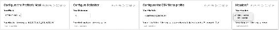
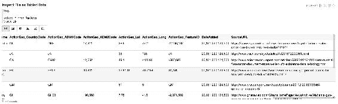
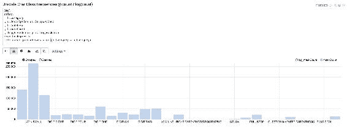
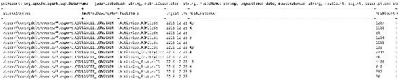
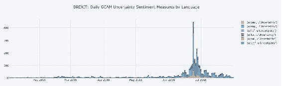
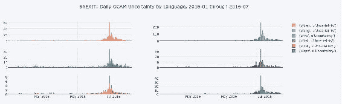

# 第四章。探索性数据分析

**在商业环境中执行的探索性数据分析** ( **EDA** )通常被委托作为按照可行性评估的思路组织和执行的更大工作的一部分。这一可行性评估的目的，也是我们可以称之为“T4”扩展 EDA“T5”的重点，是回答一系列关于所检查的数据是否符合目的以及是否值得进一步投资的问题。

根据这一总体职权范围，数据调查预计将涵盖可行性的几个方面，包括在生产中使用数据的实际方面，如及时性、质量、复杂性和覆盖面，以及是否适合待测试的预期假设。虽然从数据科学的角度来看，其中一些方面可能不那么有趣，但这些数据质量主导的调查与纯粹的统计见解一样重要。当所讨论的数据集非常大和复杂，并且为数据科学准备数据所需的投资可能很大时，尤其如此。为了说明这一点，并使主题生动起来，我们提出了对庞大而复杂的**全球知识图**(**【GKG】**)数据馈送进行 EDA 的方法，该数据馈送由**事件、语言和音调全球数据库** ( **GDELT** )项目提供。

在本章中，我们将创建和解释 EDA，同时涵盖以下主题:

*   理解扩展探索性数据分析的规划和结构的问题和设计目标
*   什么是数据剖析，举例说明，以及如何围绕连续数据质量监控技术形成数据质量的通用框架
*   如何围绕该方法构建一个通用的基于*掩码的*数据剖析器
*   如何将探索性度量存储到标准模式中，以促进度量中数据随时间漂移的研究，并提供示例
*   如何使用阿帕奇齐柏林笔记本进行快速 EDA 工作，以及绘制图表和图形
*   如何提取和研究 GDELT 中的 GCAM 情绪，包括时间序列和时空数据集
*   如何利用`plot.ly`库扩展阿帕奇齐柏林飞艇生成自定义图表

# 问题、原则和规划

在本节中，我们将探讨为什么需要电子设计自动化，并讨论创建电子设计自动化的重要考虑事项。

## 理解 EDA 问题

EDA 项目前的一个难题是:*你能给我一个你提议的 EDA 成本的估计和细分吗？*

我们如何回答这个问题最终决定了我们的 EDA 战略和战术。在过去的日子里，这个问题的答案通常是这样开始的:*基本上你按栏付费....*这个经验法则是基于这样一个前提，即*有一个可迭代的数据探索工作单位*，这些工作单位推动了对工作量的估计，从而推动了执行 EDA 的粗略价格。

这个想法的有趣之处在于，工作单位是根据*数据结构引用的，用来研究*而不是需要编写的*函数。原因很简单。假设函数的数据处理管道已经存在，而不是新的工作，因此提供的报价实际上是为我们的标准数据处理管道配置新输入数据结构以探索数据的隐含成本。*

这种想法把我们带到了 EDA 的主要问题上，即*探索*似乎很难在计划任务和估计时间方面确定下来。推荐的方法是将探索视为配置驱动的任务。这有助于我们更有效地构建和评估工作，也有助于形成围绕工作的思考，从而使配置成为核心挑战，而不是编写大量临时的一次性代码。

配置数据探索的过程也促使我们考虑可能需要的处理模板。我们需要根据我们探索的数据的形式来配置这些。例如，对于结构化数据、文本数据、图形数据、图像数据、声音数据、时间序列数据和空间数据，我们需要一个标准的探索管道。一旦我们有了这些模板，我们需要简单地将我们的输入数据映射到它们，并配置我们的摄取过滤器来传递聚焦在数据上的镜头。

## 设计原则

为基于 Apache Spark 的 EDA 处理更新这些想法意味着我们需要在设计可配置的 EDA 功能和代码时牢记一些一般原则:

*   **可轻松重用的功能/特性** *:* 我们需要定义我们的功能，以便以通用的方式处理通用的数据结构，从而产生良好的探索性特性，并以最大限度减少为新数据集配置这些特性所需的工作量的方式交付这些特性
*   **最小化中间数据结构** *:* 我们需要避免中间模式的激增，帮助最小化中间配置，并在可能的情况下创建可重用的数据结构
*   **数据驱动配置** *:* 在可能的情况下，我们需要有可以从元数据生成的配置，以减少手动样板工作
*   **模板化可视化**:由通用输入模式和元数据驱动的通用可重用可视化

最后，虽然它本身不是一个严格的原则，但我们需要构建足够灵活的探索性工具来发现数据结构，而不是依赖于严格的预定义配置。这有助于当事情出错时，通过帮助我们逆向工程文件内容、编码，或者当我们遇到它们时文件定义中的潜在错误。

## 勘探总平面图

所有 EDA 工作的早期阶段总是基于确定数据是否具有良好质量的简单目标。如果我们把重点放在这里，创建一个广泛适用的通用*入门*计划，那么我们就可以制定一套通用的任务。

这些任务创建了一个建议的 EDA 项目计划的总体形状，如下所示:

*   准备源工具，获取我们的输入数据集，查看文档，等等。必要时审查数据安全性。
*   在 HDFS 获取、解密和存储数据；收集**非功能需求** ( **NFRs** )进行规划。
*   对文件内容运行代码点级频率报告。
*   对文件字段中缺失的数据量进行填充检查。
*   运行低粒度格式分析器来检查文件中的高基数字段。
*   对文件中受格式控制的字段运行高粒度格式分析器检查。
*   在适当的情况下运行引用完整性检查。
*   运行字典内检查，以验证外部尺寸。
*   运行数值数据的基本数值和统计探索。
*   对感兴趣的关键数据进行更多基于可视化的探索。

### 注

在字符编码术语中，代码点或代码位置是组成代码空间的任何数值。许多代码点代表单个字符，但它们也可以有其他含义，例如用于格式化。

# 准备

既然我们已经有了一个总体的行动计划，在探索我们的数据之前，我们必须首先投资构建可重用的工具，用于指导探索管道的早期普通部分，帮助我们验证数据；然后作为第二步，调查 GDELT 的内容。

## 引入基于掩码的数据剖析

快速探索新数据类型的一种简单而有效的方法是使用基于掩码的数据分析。本文中的*掩码*是一个字符串的转换函数，它将数据项概括为一个特征，作为掩码的集合，该特征的基数低于研究领域中的原始值。

当一列数据被总结为掩码频率计数(通常称为*数据分析*的过程)时，它可以快速洞察字符串的常见结构和内容，从而揭示原始数据是如何编码的。考虑以下用于探索数据的掩码:

*   将大写字母翻译成 *A*
*   将小写字母翻译成 *a*
*   将数字 0 到 9 转换为 *9*

乍一看，这似乎是一个非常简单的转变。例如，让我们将此掩码应用于高基数数据字段，例如 GDELT GKG 文件的 *V2.1 源通用名称*字段。文档显示，它记录了被研究的新闻文章来源的通用名称，通常是新闻文章被抓取的网站的名称。我们的预期是包含域名，比如[nytimes.com](https://www.nytimes.com/)。

在 Spark 中实现生产解决方案之前，让我们在 Unix 命令行上原型化一个探查器，以提供一个我们可以在任何地方运行的示例:

```scala
$ cat 20150218230000.gkg.csv | gawk -F"\t" '{print $4}' | \ 
  sed "s/[0-9]/9/g; s/[a-z]/a/g; s/[A-Z]/A/g" | sort |    \ 
  uniq -c | sort -r -n | head -20 

 232 aaaa.aaa 
 195 aaaaaaaaaa.aaa 
 186 aaaaaa.aaa 
 182 aaaaaaaa.aaa 
 168 aaaaaaa.aaa 
 167 aaaaaaaaaaaa.aaa 
 167 aaaaa.aaa 
 153 aaaaaaaaaaaaa.aaa 
 147 aaaaaaaaaaa.aaa 
 120 aaaaaaaaaaaaaa.aaa 

```

输出是在正则表达式(正则表达式)生成的掩码旁边的“源公用名”列中找到的记录的排序计数。从这个*概要数据*的结果来看，应该非常清楚该字段包含域名——或者是这样吗？由于我们只查看了最常见的掩码(本例中为前 20 个)，因此排序列表另一端的掩码长尾可能以较低的频率存在潜在的数据质量问题。

我们可以引入一个微妙的变化来提高我们的遮罩功能的泛化能力，而不是只看前 20 个遮罩，甚至是后 20 个。通过让正则表达式将多个相邻的小写字母折叠成单个`a`字符，可以减少掩码的基数，而不会降低我们解释结果的能力。我们只需对正则表达式做一点小小的修改就可以实现这一改进，并有望在一页输出中查看所有的掩码:

```scala

$ # note: on a mac use gsed, on linux use sed. 
$ hdfs dfs -cat 20150218230000.gkg.csv |                 \ 
  gawk -F"\t" '{print $4}' | sed "s/[0-9]/9/g; s/[A-Z]/A/g; \ 
  s/[a-z]/a/g; s/a*a/a/g"| sort | uniq -c | sort -r -n 

2356 a.a 
 508 a.a.a 
  83 a-a.a 
  58 a99.a 
  36 a999.a 
  24 a-9.a 
  21 99a.a 
  21 9-a.a 
  15 a9.a 
  15 999a.a 
  12 a9a.a 
  11 a99a.a 
   8 a-a.a.a 
   7 9a.a 
   3 a-a-a.a 
   2 AAA Aa     <---note here the pattern that stands out 
   2 9a99a.a 
   2 9a.a.a 
   1 a9.a.a 
   1 a.99a.a 
   1 9a9a.a 
   1 9999a.a 

```

很快，我们已经原型化了一个面具，将 3000 个左右的原始值减少到一个非常短的 22 个值的列表，很容易用眼睛检查。由于长尾现在是一个短得多的尾巴，我们可以很容易地在这个数据字段中发现任何可能代表质量问题或特殊情况的异常值。这种类型的检查虽然是手动的，但功能非常强大。

请注意，例如，在输出中有一个特殊的掩码，`AAA Aa`，它里面没有一个*点*，正如我们在域名中所期望的那样。我们将这一发现解释为我们发现了两行不是有效域名的原始数据，但可能是通用描述符。也许这是一个错误，或者是所谓的*非逻辑字段使用*的一个例子，这意味着可能有其他的值滑入这个列，也许逻辑上应该去别的地方。

这是值得研究的，并且很容易检查那两个精确的记录。我们这样做是通过在原始数据旁边生成掩码，然后过滤有问题的掩码来定位原始字符串以供手动检查。

我们可以使用用 awk 编写的名为`bytefreq`(T2 字节频率的缩写)的遗留数据分析器来检查这些记录，而不是在命令行上编写很长的一行代码。它具有生成格式化报告、数据库就绪度量的开关，以及并排输出掩码和数据的开关。我们有专为这本书读者准备的开源`bytefreq`，建议大家玩一玩，真正了解这种技术有多有用:[https://bitbucket.org/bytesumo/bytefreq](https://bitbucket.org/bytesumo/bytefreq)。

```scala
$ # here is a Low Granularity report from bytefreq
$ hdfs dfs –cat 20150218230000.gkg.csv |         \
gawk -F"\t" '{print $4}' | awk -F"," –f        \ ~/bytefreq/bytefreq_v1.04.awk -v header="0" -v report="0"  \
  -v grain="L"

-  ##column_100000001  2356  a.a    sfgate.com
-  ##column_100000001  508  a.a.a    theaustralian.com.au
-  ##column_100000001  109  a9.a    france24.com
-  ##column_100000001  83  a-a.a    news-gazette.com
-  ##column_100000001  44  9a.a    927thevan.com
-  ##column_100000001  24  a-9.a    abc-7.com
-  ##column_100000001  23  a9a.a    abc10up.com
-  ##column_100000001  21  9-a.a    4-traders.com
-  ##column_100000001  8  a-a.a.a  gazette-news.co.uk
-  ##column_100000001  3  9a9a.a    8points9seconds.com
-  ##column_100000001  3  a-a-a.a  the-american-interest.com
-  ##column_100000001  2  9a.a.a    9news.com.au
-  ##column_100000001  2  A Aa    BBC Monitoring
-  ##column_100000001  1  a.9a.a    vancouver.24hrs.ca
-  ##column_100000001  1  a9.a.a    guide2.co.nz

$ hdfs dfs -cat 20150218230000.gkg.csv | gawk                  \
-F"\t" '{print $4}'|gawk -F"," -f ~/bytefreq/bytefreq_v1.04.awk\
-v header="0" -v report="2" -v grain="L" | grep ",A Aa"

BBC Monitoring,A Aa
BBC Monitoring,A Aa
```

当我们检查奇数掩码`A Aa`时，我们可以看到发现的违规文本是`BBC Monitoring`，在重新阅读 GDELT 文档时，我们会看到这不是一个错误，而是一个已知的特例。这意味着在使用这个字段时，我们必须记住处理这个特殊情况。处理它的一种方法是包含一个修正规则，将这个字符串值替换为一个更好的值，例如有效的域名[www.monitor.bbc.co.uk](http://www.monitor.bbc.co.uk)，它是文本字符串引用的数据源。

我们在这里介绍的想法是，掩码可以用作*键*来检索特定字段中的违规记录。这个逻辑将我们引向基于掩码的分析的下一个主要好处:输出掩码是一种形式的*数据质量错误代码*。这些错误代码可以分为两类:*好的*掩码的白名单，和用于查找劣质数据的*坏的*掩码的黑名单。想到这一点，掩码就成为搜索和检索数据清理方法的基础，或者可能是发出警报或拒绝记录的基础。

教训是，我们可以创建*处理函数*来修复使用特定字段中的数据计算的特定掩码找到的原始字符串。这种想法导致以下结论:当我们在数据读取管道中读取数据时，我们可以围绕基于掩码的分析创建一个通用框架来进行数据质量控制和补救*。这有一些非常有利的解决方案特性:*

*   生成数据质量掩码是一个读取时的过程；我们可以接受新的原始数据并将其写入磁盘，然后，在读取时，我们只能在查询时需要时生成掩码，因此数据清理可以是一个动态过程。
*   然后，可以动态地将处理功能应用于有助于在读取时清理数据的目标补救工作。
*   因为以前看不到的字符串被归纳到掩码中，所以新的字符串可能会被标记为有质量问题，即使那个确切的字符串以前从未出现过。这种普遍性有助于我们降低复杂性，简化流程，并创建可重用的智能解决方案——甚至跨主题领域。
*   创建不属于掩码白名单、修复名单或黑名单的掩码的数据项可能会被隔离以引起注意；人类分析师可以检查这些记录，并希望将它们列入白名单，或者创建新的治疗功能，帮助将数据从隔离区取出并重新投入生产。
*   数据隔离可以简单地实现为读取时过滤器，当创建新的修复功能来清理或修复数据时，读取时应用的动态处理将自动*向用户释放*校正后的数据，而不会有长时间的延迟。
*   最终将创建一个数据质量处理库，该库会随着时间的推移而稳定下来。新的工作主要是通过将现有的处理方法映射和应用到新的数据上来完成的。例如，电话号码重新格式化治疗功能可以在许多数据集和项目中广泛重用。

通过现在解释的方法和架构优势，构建基于通用掩码的探查器的要求应该更加清晰。请注意，掩码生成过程是一个经典的 Hadoop MapReduce 过程:将输入的数据映射到掩码，并将这些掩码减少到汇总的频率计数。还要注意，即使在这个简短的例子中，我们也已经使用了两种类型的掩码，每种掩码都是由底层转换管道组成的。这表明我们需要一个工具，支持预定义的掩码库，并允许用户定义的掩码，可以根据需要快速创建。它还建议应该有办法把面具堆积成复杂的管道。

可能还不太明显的是，以这种方式完成的所有数据剖析都可以将剖析器度量写入*一个通用的输出格式。*通过简化分析数据的记录、存储、检索和使用，这有助于提高代码的可重用性。

例如，我们应该能够使用以下模式报告所有基于掩码的探查器指标:

```scala
Metric Descriptor 
Source Studied 
IngestTime 
MaskType 
FieldName 
Occurrence Count 
KeyCount   
MaskCount 
Description 

```

一旦我们的度量以这种单一的模式格式被捕获，我们就可以使用用户界面(比如齐柏林飞艇笔记本)构建辅助报告。

在我们实现这些函数之前，需要介绍一下字符类掩码，因为这些掩码与普通的分析掩码略有不同。

## 引入字符类掩码

我们还可以应用另一种简单类型的数据分析来帮助文件检查。它包括分析组成整个文件的实际字节。这是一种古老的方法，最初来自密码学，通过对文本中字母的频率分析来获得破译替代码的优势。

虽然字节级分析在今天的数据科学界不是一种常见的技术，但在需要的时候，它却非常有用。过去，数据编码是一个大问题。文件被编码在一系列代码页中，跨越 ASCII 和 EBCDIC 标准。字节频率报告对于发现文件中使用的实际编码、分隔符和行尾通常至关重要。当时，有多少人可以创建文件，但不能从技术上描述它们，waq 令人惊讶。如今，随着世界越来越多地转向基于 Unicode 的字符编码，这些旧方法需要更新。在 Unicode 中，一个字节的概念被现代化为多字节*代码点*，这可以通过以下函数在 Scala 中揭示:

```scala
val tst = "Andrew "

def toCodePointVector(input: String) = input.map{
    case (i) if i > 65535 =>
        val hchar = (i - 0x10000) / 0x400 + 0xD800
        val lchar = (i - 0x10000) % 0x400 + 0xDC00
        f"\\u$hchar%04x\\u$lchar%04x"
    case (i) if i > 0 => f"\\u$i%04x"
    // kudos to Ben Reich: http://k.bytefreq.com/1MjyvNz
    }

val out = toCodePointVector(tst)

val rows = sc.parallelize(out)
rows.countByValue().foreach(println)

// results in the following: [codepoint], [Frequency_count]
(\u0065,1)
(\u03d6,1)
(\u006e,1)
(\u0072,1)
(\u0077,1)
(\u0041,1)
(\u0020,2)
(\u6f22,1)
(\u0064,1)
(\u5b57,1)
```

使用这个函数，我们可以开始分析我们在 GDELT 数据集中收到的任何国际字符级数据，并开始了解我们在利用这些数据时可能面临的复杂性。但是，与其他掩码不同的是，为了从代码点创建可解释的结果，我们需要一个字典来查找有意义的上下文信息，例如 unicode 类别和 unicode 字符名称。

为了生成一个上下文查找，我们可以使用这个快速的命令行黑客从在[unicode.org](http://unicode.org)找到的主字典中生成一个简化的字典，这将帮助我们更好地报告我们的发现:

```scala
$ wget ftp://ftp.unicode.org/Public/UNIDATA/UnicodeData.txt      
$ cat UnicodeData.txt | gawk -F";" '{OFS=";"} {print $1,$3,$2}' \ 
  | sed 's/-/ /g'| gawk '{print $1,$2}'| gawk -F";" '{OFS="\t"} \ 
  length($1) < 5 {print $1,$2,$3}' > codepoints.txt 

# use "hdfs dfs -put" to load codepoints.txt to hdfs, so  
# you can use it later 

head -1300 codepoints.txt | tail -4 
0513      Ll    CYRILLIC SMALL 
0514      Lu    CYRILLIC CAPITAL 
0515      Ll    CYRILLIC SMALL 
0516      Lu    CYRILLIC CAPITAL 

```

我们将使用这个字典，结合我们发现的代码点，来报告文件中每个字节的字符类频率。虽然这看起来是一种简单的分析形式，但结果往往令人惊讶，并提供了对我们正在处理的数据、其来源以及我们可以成功应用于其中的算法和方法类型的司法理解。我们还将使用以下查找表来查找通用 Unicode 类别以简化我们的报告:

```scala
Cc  Other, Control 
Cf  Other, Format 
Cn  Other, Not Assigned 
Co  Other, Private Use 
Cs  Other, Surrogate 
LC  Letter, Cased 
Ll  Letter, Lowercase 
Lm  Letter, Modifier 
Lo  Letter, Other 
Lt  Letter, Titlecase 
Lu  Letter, Uppercase 
Mc  Mark, Spacing Combining 
Me  Mark, Enclosing 
Mn  Mark, Nonspacing 
Nd  Number, Decimal Digit 
Nl  Number, Letter 
No  Number, Other 
Pc  Punctuation, Connector 
Pd  Punctuation, Dash 
Pe  Punctuation, Close 
Pf  Punctuation, Final quote 
Pi  Punctuation, Initial quote 
Po  Punctuation, Other 
Ps  Punctuation, Open 
Sc  Symbol, Currency 
Sk  Symbol, Modifier 
Sm  Symbol, Math 
So  Symbol, Other 
Zl  Separator, Line 
Zp  Separator, Paragraph 
Zs  Separator, Space 

```

## 构建基于遮罩的剖面图

让我们在 Spark 中创建一个基于笔记本的工具包来分析数据。我们将实现的掩码功能由几个细节组成，从文件级到行级，再到字段级:

1.  Character level masks applied across whole files are:
    *   文件级 Unicode 频率，UTF-16 多字节表示(又称代码点)
    *   文件级 UTF 字符分类频率
    *   行级分隔符频率
2.  String level masks applied to fields within files are:
    *   ASCII 低颗粒轮廓，每块田地
    *   每块田地的高纹理轮廓
    *   每个字段的人口检查

### 建立阿帕奇齐柏林飞艇

由于我们将在视觉上探索我们的数据，一个对于相对容易地混合和匹配技术非常有用的产品是 Apache Zeppelin。Apache Zeppelin 是一个 Apache 孵化器产品，它使我们能够创建一个笔记本或工作表，包含多种不同语言的混合，包括 Python、Scala、SQL 和 Bash，这使得它非常适合与 Spark 一起运行探索性数据分析。

代码是使用*段落*(或单元格)以笔记本风格编写的，其中每个单元格都可以独立执行，这使得处理一小部分代码变得容易，而不必重复编译和运行整个程序。它还作为用于产生任何给定输出的代码的记录，并帮助我们集成可视化。

齐柏林飞艇可以非常快速地安装和运行，最低限度的安装过程解释如下:

*   从这里下载并提取齐柏林飞艇:[https://zeppelin.incubator.apache.org/download.html](https://zeppelin.incubator.apache.org/download.html)
*   找到会议目录，复制一份名为`zeppelin-env.sh`的`zeppelin-env.sh.template` 。
*   更改 `zeppelin-env.sh`文件，取消注释并将`JAVA_HOME` 和`SPARK_HOME`条目设置到机器上的相关位置。
*   如果你想让齐柏林飞艇在星火中使用 HDFS，将`HADOOP_CONF_DIR`条目设置到你的 Hadoop 文件的位置；`hdfs-site.xml`、`core-site.xml`等等。
*   启动齐柏林飞船服务:`bin/zeppelin-daemon.sh start`。这将自动提取在`conf/zeppelin-env.sh`中所做的更改。

在我们的测试集群中，我们使用的是霍顿工程 HDP 2.6，齐柏林飞艇是安装的一部分。

使用齐柏林飞艇时需要注意的一点是，第一段应该始终是外部包的声明。任何 Spark 依赖项都可以使用`ZeppelinContext`以这种方式添加，在每次重启齐柏林飞艇中的解释器后立即运行；例如:

```scala
%dep
z.reset
// z.load("groupId>:artifactId:version")
```

之后，我们可以用任何可用的语言编写代码。我们将在笔记本上混合使用 Scala、SQL 和 Bash，方法是使用一种解释器来声明每个单元格，即`%spark`、`%sql`和`%shell`。如果没有给出解释器`(%spark`，齐柏林飞艇默认为 Scala Spark)。

您可以找到本章附带的齐柏林飞艇笔记本，以及我们代码库中的其他笔记本。

### 构建可重复使用的笔记本

在我们的代码存储库中，我们创建了一个简单、可扩展的开源数据探查器库，也可以在这里找到:[https://bytesumo@bitbucket.org/gzet_io/profilers.git](https://bytesumo@bitbucket.org/gzet_io/profilers.git)

该库负责将掩码应用于数据帧所需的框架，包括将文件的原始行转换为只有一列的数据帧的特殊情况。我们不会一行一行地讨论那个框架的所有细节，但是最感兴趣的类在文件`MaskBasedProfiler.scala`中找到，它也包含了每个可用掩码函数的定义。

使用该库的一个很好的方法是构建一个用户友好的笔记本应用程序，允许对数据进行可视化探索。我们使用阿帕奇齐柏林飞船为我们的分析准备了这样一个笔记本。接下来，我们将以前面的部分为起点，介绍如何构建自己的笔记本。我们示例中的数据是 GDELT `event`文件，它具有简单的制表符分隔格式。

构建笔记本的第一步(甚至只是为了玩我们的现成笔记本)，是将我们库中的`profilers-1.0.0.jar`文件复制到我们集群上的齐柏林飞艇用户可以访问的本地目录中，在 Hortonworks 安装中，该目录是齐柏林飞艇用户在 Namenode 上的主目录:

```scala
git clone https://bytesumo@bitbucket.org/gzet_io/profilers.git 
sudo cp profilers-1.0.0.jar /home/zeppelin/. 
sudo ls /home/zeppelin/  

```

然后我们可以访问`http://{main.install.hostname}:9995`进入阿帕奇齐柏林飞船主页。从那个页面，我们可以上传我们的笔记本并继续，或者我们可以通过点击**创建新笔记**来创建一个新的并构建我们自己的。

在齐柏林飞艇中，笔记本的第一段是我们执行 Spark 代码依赖项的地方。我们将导入稍后需要的探查器 jars:

```scala
%dep 
// you need to put the profiler jar into a directory 
// that Zeppelin has access to.  
// For example, /home/zeppelin, a non-hdfs directory on  
// the namenode. 
z.load("/home/zeppelin/profilers-1.0.0.jar") 
// you may need to restart your interpreter, then run  
// this paragraph 

```

在第二段中，我们包含了一个小的 shell 脚本来检查我们想要分析的文件，以验证我们选择了正确的文件。注意使用`column`和`colrm`，这两个非常方便的 Unix 命令可以在命令行上检查列表数据:

```scala
%sh
# list the first two files in the directory, make sure the header file exists
# note - a great trick is to write just the headers to a delimited file
# that sorts to the top of your file glob, a trick that works well with
# Spark’s csv reader where headers are not on each file you
# hold in hdfs.
# this is a quick inspection check, see we use column and
# colrm to format it:

hdfs dfs -cat "/user/feeds/gdelt/events/*.export.CSV" \
|head -4|column -t -s $'\t'|colrm 68

GlobalEventID  Day       MonthYear  Year  FractionDate  Actor1Code
610182939      20151221  201512     2015  2015.9616              
610182940      20151221  201512     2015  2015.9616              
610182941      20151221  201512     2015  2015.9616     CAN 
```

在第 3、4、5 和 6 段中，我们使用齐柏林飞艇的用户输入框工具来允许用户配置 EDA 笔记本，就像它是一个合适的基于网络的应用程序一样。这允许用户配置四个可以在笔记本中重用的变量，以推动进一步的调查:**您的掩码**、**您的分隔符**、**您的文件路径**和**您的标题**。当我们隐藏编辑器并调整窗口的对齐和大小时，这些看起来很棒:



如果我们打开准备好的笔记本，在这些输入段落中的任何一个上点击**显示编辑器**，我们将看到我们如何在齐柏林飞艇中设置这些来提供下拉框，例如:

```scala
val YourHeader = z.select("YourHeaders", Seq(  ("true", "HasHeader"), ("false", "No Header"))).toString 

```

接下来，我们有一个段落用于导入我们需要的函数:

```scala
import io.gzet.profilers._ 
import sys.process._ 
import org.apache.spark.sql.SQLContext 
import org.apache.spark.sql.functions.udf 
import org.apache.spark.sql.types.{StructType, StructField, StringType, IntegerType} 
import org.apache.spark.sql.SaveMode 
import sqlContext.implicits._ 

```

然后，我们进入一个新的段落，它配置并吸收我们读到的数据:

```scala
val InputFilePath = YourFilePath    
// set our input to user's file glob 
val RawData = sqlContext.read                       
// read in tabular data 
        .option("header", YourHeader)               
// configurable headers 
        .option("delimiter", YourDelimiter )        
// configurable delimiters 
        .option("nullValue", "NULL")                
// set a default char if nulls seen 
        .option("treatEmptyValuesAsNulls", "true")  
// set to null  
        .option("inferschema", "false")             
// do not infer schema, we'll discover it 
        .csv(InputFilePath)                         
// file glob path. Can use wildcards 
RawData.registerTempTable("RawData")                
// register data for Spark SQL access to it 
RawData.cache()                                     
// cache the file for use 
val RawLines = sc.textFile(InputFilePath)           
// read the file lines as a string 
RawLines.toDF.registerTempTable("RawLines")      
// useful to check for schema corruption 
RawData.printSchema()                               
// print out the schema we found 

// define our profiler apps 
val ASCIICLASS_HIGHGRAIN    = MaskBasedProfiler(PredefinedMasks.ASCIICLASS_HIGHGRAIN) 
val CLASS_FREQS             = MaskBasedProfiler(PredefinedMasks.CLASS_FREQS) 
val UNICODE                 = MaskBasedProfiler(PredefinedMasks.UNICODE) 
val HEX                     = MaskBasedProfiler(PredefinedMasks.HEX) 
val ASCIICLASS_LOWGRAIN     = MaskBasedProfiler(PredefinedMasks.ASCIICLASS_LOWGRAIN) 
val POPCHECKS               = MaskBasedProfiler(PredefinedMasks.POPCHECKS) 

// configure our profiler apps 
val Metrics_ASCIICLASS_HIGHGRAIN    = ASCIICLASS_HIGHGRAIN.profile(YourFilePath, RawData)        
val Metrics_CLASS_FREQS             = CLASS_FREQS.profile(YourFilePath, RawLines.toDF)            
val Metrics_UNICODE                 = UNICODE.profile(YourFilePath, RawLines.toDF)               
val Metrics_HEX                     = HEX.profile(YourFilePath, RawLines.toDF)                   
val Metrics_ASCIICLASS_LOWGRAIN     = ASCIICLASS_LOWGRAIN.profile(YourFilePath, RawData)         
val Metrics_POPCHECKS               = POPCHECKS.profile(YourFilePath, RawData)

// note some of the above read tabular data, some read rawlines of string data

// now register the profiler output as sql accessible data frames

Metrics_ASCIICLASS_HIGHGRAIN.toDF.registerTempTable("Metrics_ASCIICLASS_HIGHGRAIN")
Metrics_CLASS_FREQS.toDF.registerTempTable("Metrics_CLASS_FREQS") 
Metrics_UNICODE.toDF.registerTempTable("Metrics_UNICODE") 
Metrics_HEX.toDF.registerTempTable("Metrics_HEX") 
Metrics_ASCIICLASS_LOWGRAIN.toDF.registerTempTable("Metrics_ASCIICLASS_LOWGRAIN") 
Metrics_POPCHECKS.toDF.registerTempTable("Metrics_POPCHECKS") 

```

现在我们已经完成了配置步骤，我们可以开始检查我们的表格数据，并发现我们报告的列名是否与我们的输入数据匹配。在新的段落窗口中，我们使用 SQL 上下文来简化调用 SparkSQL 和运行查询:

```scala
%sql 
select * from RawData 
limit 10 

```

齐柏林飞艇最大的优点是输出被格式化成一个适当的 HTML 表，我们可以很容易地用它来检查有许多列的宽文件(例如，GDELT 事件文件):



我们可以从这个显示的数据中看到，我们的列与输入数据相匹配；因此，我们可以继续我们的分析。

### 注

如果你想阅读 GDELT 事件文件，你可以在我们的代码库中找到头文件。

如果此时列和内容之间的数据对齐有错误，也可以选择前面配置的 RawLines Dataframe 的前 10 行，它将只显示基于原始字符串的数据输入的前 10 行。如果数据碰巧是制表符分隔的，我们将立即看到另一个好处，齐柏林飞艇格式的输出将自动在原始字符串上为我们对齐列，很像我们之前使用 bash 命令*列所做的那样。*

现在我们将继续研究文件的字节，以发现其中编码的细节。为此，我们加载我们的查找表，然后将它们连接到我们的 profiler 函数的输出中，我们之前将它注册为一个表。请注意探查器的输出如何直接被视为一个 SQL 可调用表:

```scala
// load the UTF lookup tables

 val codePointsSchema = StructType(Array(
     StructField("CodePoint"  , StringType, true),     //$1       
     StructField("Category"   , StringType, true),     //$2     
     StructField("CodeDesc"   , StringType, true)      //$3
     ))

 val UnicodeCatSchema = StructType(Array(
     StructField("Category"         , StringType, true), //$1       
     StructField("Description"      , StringType, true)  //$2     
     ))

 val codePoints = sqlContext.read
     .option("header", "false")     // configurable headers
     .schema(codePointsSchema)
     .option("delimiter", "\t" )   // configurable delimiters
     .csv("/user/feeds/ref/codepoints2.txt")  // configurable path

 codePoints.registerTempTable("codepoints")
 codePoints.cache()
 val utfcats = sqlContext.read
      .option("header", "false")    // configurable headers
      .schema(UnicodeCatSchema)
      .option("delimiter", "\t" )   // configurable delimiters
      .csv("/user/feeds/ref/UnicodeCategory.txt")                   

 utfcats.registerTempTable("utfcats")
 utfcats.cache()

 // Next we build the different presentation layer views for the codepoints
 val hexReport = sqlContext.sql("""
 select
   r.Category
 , r.CodeDesc
 , sum(maskCount) as maskCount
 from
     ( select
              h.*
             ,c.*
         from Metrics_HEX h
         left outer join codepoints c
             on ( upper(h.MaskType) = c.CodePoint)
     ) r 
 group by r.Category, r.CodeDesc
 order by r.Category, r.CodeDesc, 2 DESC
 """)
 hexReport.registerTempTable("hexReport")
 hexReport.cache()
 hexReport.show(10)
 +--------+-----------------+---------+
 |Category|         CodeDesc|maskCount|
 +--------+-----------------+---------+
 |      Cc|  CTRL: CHARACTER|   141120|
 |      Ll|      LATIN SMALL|   266070|
 |      Lu|    LATIN CAPITAL|   115728|
 |      Nd|      DIGIT EIGHT|    18934|
 |      Nd|       DIGIT FIVE|    24389|
 |      Nd|       DIGIT FOUR|    24106|
 |      Nd|       DIGIT NINE|    17204|
 |      Nd|        DIGIT ONE|    61165|
 |      Nd|      DIGIT SEVEN|    16497|
 |      Nd|        DIGIT SIX|    31706|
 +--------+-----------------+---------+
```

在新的段落中，我们可以使用 SQLContext 来可视化输出。为了帮助查看有偏差的值，我们可以使用 SQL 语句来计算计数日志。这产生了一个图形，我们可以将它包括在最终报告中，在这里我们可以在原始频率和对数频率之间切换。



因为我们已经加载了字符类的类别，我们还可以调整可视化以进一步简化图表:


进行 EDA 时，我们必须始终运行的一项基本检查是人口检查，我们使用 POPCHECKS 进行计算。POPCHECKS 是我们在 Scala 代码中定义的一个特殊掩码，如果填充了一个字段，它会返回一个`1`，如果没有填充，它会返回一个`0`。当我们检查结果时，我们注意到我们需要写一些最终报告，以一种更直接的解释方式呈现这些数字:

```scala
Metrics_POPCHECKS.toDF.show(1000, false)  

```


我们可以分两步走。首先，我们可以使用一个 SQL case 表达式将数据转换为*填充的*或*缺失的*的值，这应该会有所帮助。然后，我们可以通过对文件名、`metricDescriptor`和`fieldname`执行`groupby`来透视这个聚合数据集，同时对填充值和缺失值执行求和。当我们这样做的时候，我们还可以包括默认值零，在这里探查器没有发现任何数据被填充或丢失的情况。当我们计算百分比时，这样做很重要，以确保我们永远不会有空的记数器或分母。虽然这段代码没有它应该的那么短，但是它说明了在`SparkSQL`中操作数据的许多技术。

还要注意的是，在`SparkSQL`中，我们可以使用 SQL `coalesce`语句来操作关系数据库，这不会与 Spark 原生`coalesce`功能相混淆。在 SQL 意义上，该函数将空值转换为默认值，并且它经常被无端地用于捕获生产级代码中数据不是特别可信的特殊情况。还值得注意的是`SparkSQL`很好地支持子选择。你甚至可以大量使用这些，Spark 也不会抱怨。这尤其有用，因为对于许多传统数据库工程师以及对各种数据库都有经验的人来说，这是最自然的编程方式:

```scala
val pop_qry = sqlContext.sql("""
select * from (
    select
          fieldName as rawFieldName
    ,    coalesce( cast(regexp_replace(fieldName, "C", "") as INT), fieldName) as fieldName
    ,   case when maskType = 0 then "Populated"
             when maskType = 1 then "Missing"
        end as PopulationCheck
    ,     coalesce(maskCount, 0) as maskCount
    ,   metricDescriptor as fileName
    from Metrics_POPCHECKS
) x
order by fieldName
""")
val pivot_popquery = pop_qry.groupBy("fileName","fieldName").pivot("PopulationCheck").sum("maskCount")
 pivot_popquery.registerTempTable("pivot_popquery")
 val per_pivot_popquery = sqlContext.sql("""
 Select 
 x.* 
 , round(Missing/(Missing + Populated)*100,2) as PercentMissing
 from
     (select 
         fieldname
         , coalesce(Missing, 0) as Missing
         , coalesce(Populated,0) as Populated
         , fileName
     from pivot_popquery) x
 order by x.fieldname ASC
 """)
 per_pivot_popquery.registerTempTable("per_pivot_popquery")
 per_pivot_popquery.select("fieldname","Missing","Populated","PercentMissing","fileName").show(1000,false)
```

前面代码的输出是一个关于我们数据中字段级填充计数的清晰报告表:


当使用`stacked`条形图功能以图形方式显示在我们的齐柏林飞艇笔记本中时，数据会产生出色的可视化效果，可以立即告诉我们文件中的数据填充级别:


由于齐柏林飞艇的条形图支持工具提示，我们可以使用指针来观察列的全名，即使它们在默认视图中显示不佳。

最后，我们还可以在笔记本中包含更多的段落，以揭示前面解释的`ASCII_HighGrain`和`ASCII_LowGrain`遮罩的结果。这可以通过简单地将探查器输出作为表格来查看，或者在齐柏林飞艇中使用更高级的功能来实现。作为一个表，我们可以尝试以下方法:

```scala
val proReport = sqlContext.sql("""
 select * from (
 select 
      metricDescriptor as sourceStudied
 ,   "ASCII_LOWGRAIN" as metricDescriptor
 , coalesce(cast(  regexp_replace(fieldName, "C", "") as INT),fieldname) as fieldName
 , ingestTime
 , maskType as maskInstance
 , maskCount
 , description
 from Metrics_ASCIICLASS_LOWGRAIN 
 ) x
 order by fieldNAme, maskCount DESC
 """)
 proReport.show(1000, false)
```



为了构建一个交互式查看器，这在我们查看可能具有非常高基数的 ASCII _ HighGrain 掩码时非常有用，我们可以设置一个接受齐柏林用户输入框值的 SQL 语句，用户可以在其中键入列号或字段名来检索我们收集的指标的相关部分。

我们在一个新的 SQL 段落中这样做，SQL 谓词为`x.fieldName like '%${ColumnName}%'`:

```scala
%sql
 select x.* from (
 select 
      metricDescriptor as sourceStudied
 ,   "ASCII_HIGHGRAIN" as metricDescriptor
 , coalesce(cast(  regexp_replace(fieldName, "C", "")
   as INT),fieldname) as fieldName
 , ingestTime
 , maskType as maskInstance
 , maskCount
 , log(maskCount) as log_maskCount
 from Metrics_ASCIICLASS_HIGHGRAIN 
 ) x
 where  x.fieldName like '%${ColumnName}%'
 order by fieldName, maskCount DESC
```

这将创建一个交互式用户窗口，在用户输入时刷新，从而创建一个具有多个输出配置的动态分析报告。在这里，我们不是以表格的形式显示输出，而是以日志图表的形式显示应该具有低基数的字段的频率计数，即事件文件中标识的*操作*的经度:


结果向我们显示，即使像经度这样的简单字段在数据中也有很大的格式分布。

到目前为止所回顾的技术应该有助于创建一个非常可重用的笔记本，用于对我们所有的输入数据执行探索性的数据分析，既快速又高效，生成图形输出，我们可以使用它来生成关于输入文件质量的出色报告和文档。

# 探索全球英语教学

EDA 旅程的很大一部分是获取和记录数据源，GDELT 内容也不例外。在研究了 GKG 数据集之后，我们发现仅仅记录我们应该使用的数据的实际来源是具有挑战性的。在接下来的部分中，我们提供了我们找到的要使用的资源的全面列表，这些资源需要在示例中运行。

### 注

下载时间注意事项:使用典型的 5 Mb 家庭宽带，下载 2000 个 GKG 文件大约需要 3.5 小时。考虑到仅 GKG 英语语言文件就有超过 40，000 个文件，这可能需要一段时间来下载。

## gdelt gg 数据集

截至 2016 年 12 月，我们应该使用最新的 GDELT 数据馈送，版本 2.1。此数据的主要文档如下:

[http://data . gdeltproject . org/documentation/GDELT-Global _ Knowledge _ Graph _ Codebook-v 2.1 . pdf](http://data.gdeltproject.org/documentation/GDELT-Global_Knowledge_Graph_Codebook-V2.1.pdf)

在下一节中，我们已经包括了数据和二次引用来查找表，以及进一步的文档。

### 文件

GKG-英语全球知识图(2.1 版)

http://data . gdeltproject . org/gdeltv 2/master ilelist . txt

[http://data.gdeltproject.org/gdeltv2/lastupdate.txt](http://data.gdeltproject.org/gdeltv2/lastupdate.txt)

GKG-翻译-非英语全球知识图

[http://data . gdeltproject . org/gdeltv2/last update-translation . txt](http://data.gdeltproject.org/gdeltv2/lastupdate-translation.txt)

[http://data . gdeltproject . org/gdeltv2/master filelist-translation . txt](http://data.gdeltproject.org/gdeltv2/masterfilelist-translation.txt)

GKG-电视(互联网档案-美国电视全球知识图)

[http://data . gdeltproject . org/gdeltv2 _ iate levion/last update . txt](http://data.gdeltproject.org/gdeltv2_iatelevision/lastupdate.txt)

[http://data . gdeltproject . org/gdeltv2 _ iate levion/master filelist . txt](http://data.gdeltproject.org/gdeltv2_iatelevision/masterfilelist.txt)

GKG-视觉-云视觉

[http://data . gdeltproject . org/gdeltv2 _ cloud vision/last update . txt](http://data.gdeltproject.org/gdeltv2_cloudvision/lastupdate.txt)

### 特别收藏

GKG-AME -非洲和中东全球知识图

[http://data . gdeltproject . org/ggv 2 _ special connections/ame-gg。中情局 ggv 2 . CSV . zip](http://data.gdeltproject.org/gkgv2_specialcollections/AME-GKG.CIA.gkgv2.csv.zip)

[AME-GKG。CORE.gkgv2.csv.zip](http://data.gdeltproject.org/gkgv2_specialcollections/AME-GKG.CORE.gkgv2.csv.zip)

[AME-GKG。DTIC.gkgv2.csv.zip](http://data.gdeltproject.org/gkgv2_specialcollections/AME-GKG.DTIC.gkgv2.csv.zip)

[AME-GKG。IADISSERT.gkgv2.csv.zip](http://data.gdeltproject.org/gkgv2_specialcollections/AME-GKG.IADISSERT.gkgv2.csv.zip)

[http://data . gdeltproject . org/ggv 2 _ special connections/ame-gg。ianondissert . ggv 2 . CSV . zip](http://data.gdeltproject.org/gkgv2_specialcollections/AME-GKG.IANONDISSERT.gkgv2.csv.zip)

[http://data . gdeltproject . org/ggv 2 _ special connections/ame-GGG . jstor . ggv 2 . CSV . zip](http://data.gdeltproject.org/gkgv2_specialcollections/AME-GKG.JSTOR.gkgv2.csv.zip)

GKG-人权(人权收集)

[http://data . gdeltproject . org/gkgv2 _ special collections/HR-GKG。AMNESTY.gkgv2.csv.zip](http://data.gdeltproject.org/gkgv2_specialcollections/HR-GKG.AMNESTY.gkgv2.csv.zip)

[http://data . gdeltproject . org/gkgv2 _ special collections/HR-GKG。CRISISGROUP.gkgv2.csv.zip](http://data.gdeltproject.org/gkgv2_specialcollections/HR-GKG.CRISISGROUP.gkgv2.csv.zip)

[http://data . gdeltproject . org/gkgv2 _ special collections/HR-GKG。FIDH.gkgv2.csv.zip](http://data.gdeltproject.org/gkgv2_specialcollections/HR-GKG.FIDH.gkgv2.csv.zip)

[http://data . gdeltproject . org/gkgv2 _ special collections/HR-GKG。HRW.gkgv2.csv.zip](http://data.gdeltproject.org/gkgv2_specialcollections/HR-GKG.HRW.gkgv2.csv.zip)

[http://data . gdeltproject . org/gkgv2 _ special collections/HR-GKG。ICC.gkgv2.csv.zip](http://data.gdeltproject.org/gkgv2_specialcollections/HR-GKG.ICC.gkgv2.csv.zip)

[http://data . gdeltproject . org/gkgv2 _ special collections/HR-GKG。OHCHR.gkgv2.csv.zip](http://data.gdeltproject.org/gkgv2_specialcollections/HR-GKG.OHCHR.gkgv2.csv.zip)

[http://data . gdeltproject . org/gkgv2 _ special collections/HR-GKG。USSTATE.gkgv2.csv.zip](http://data.gdeltproject.org/gkgv2_specialcollections/HR-GKG.USSTATE.gkgv2.csv.zip)

### 参考数据

[http://data . gdeltproject . org/documentation/GCAM-MASTER-CODEBOOK。TXT](http://data.gdeltproject.org/documentation/GCAM-MASTER-CODEBOOK.TXT)

[http://data . gdeltproject . org/supporting dataset/GNS-GAUL-ADM2-cross alk。TXT.zip](http://data.gdeltproject.org/supportingdatasets/GNS-GAUL-ADM2-CROSSWALK.TXT.zip)

[http://data . gdeltproject . org/supporting dataset/DOMAINSBYCOUNTRY-ENGLISH。TXT](http://data.gdeltproject.org/supportingdatasets/DOMAINSBYCOUNTRY-ENGLISH.TXT)

[http://data . gdeltproject . org/supporting dataset/DOMAINSBYCOUNTRY-all languages。TXT](http://data.gdeltproject.org/supportingdatasets/DOMAINSBYCOUNTRY-ALLLANGUAGES.TXT)

[http://www.unicode.org/Public/UNIDATA/UnicodeData.txt](http://www.unicode.org/Public/UNIDATA/UnicodeData.txt)

[http://www.geonames.org/about.html](http://www.geonames.org/about.html)

## 探索 GKG 2.1 版

当我们回顾探索 GDELT 数据馈送的现有文章时，我们发现许多研究关注文章的人物、主题和基调，还有一些关注早期的事件文件。但是没有太多的出版物探究现在包含在 GKG 文件中的**全球内容分析测量**(**【GCAM】**)内容。当我们尝试使用我们构建的数据质量工作簿来检查 GDELT 数据馈送时，我们发现全局知识图很难使用，因为文件是使用多个嵌套分隔符编码的。快速处理这种嵌套格式的数据是处理 GKG 以及 GCAM 的关键挑战，也是本章其余部分的重点。

在探索 GKG 档案中的 GCAM 数据时，我们需要回答一些显而易见的问题:

*   英语 GKG 文件和翻译的*跨语言*国际文件有什么区别？考虑到某些实体识别算法可能无法很好地处理翻译后的文件，这些提要之间的数据填充方式是否存在差异？
*   如果 GKG 文件中包含的 GCAM 情感度量数据集的翻译数据填充良好，它(或者实际上是英文版本)是否可信？我们如何访问和标准化这些数据，它是否包含有价值的信号而不是噪声？

如果我们能单独回答这两个问题，我们将已经建立了许多关于 GDELT 作为执行数据科学的信号来源的有用性。然而，*我们如何回答这些问题很重要，我们需要在获得这些答案时尝试并模板化我们的代码，以创建可重用的配置驱动的 EDA 组件。如果我们能够根据我们的原则创造出可重新使用的探索，我们将会比硬编码我们的分析产生更多的价值。*

### 跨语言文件

让我们重复使用我们早期的工作来揭示一些质量问题，然后将我们的探索扩展到这些更详细和复杂的问题。通过将一些人口统计(POPCHECK)指标运行到一个临时文件中，对于正常的 GKG 数据和翻译后的文件，我们可以将结果导入并合并在一起。这是我们重用标准化度量格式的好处；我们可以轻松地跨数据集进行比较！

我们将给出一些标题性的答案，而不是详细介绍代码。当我们检查英语和翻译的 GKG 文件之间的人口统计时，我们确实发现了可用内容的一些差异:


我们在这里看到，翻译后的 GKG 跨语言文件根本没有语录数据，在识别人员与我们在一般英语新闻提要中看到的人数对比时，它们的人数非常少。因此，肯定有一些需要注意的差异。

因此，我们应该仔细检查我们希望在生产中依赖的跨语言数据馈送中的任何内容。稍后我们将看到 GCAM 情感内容中的翻译信息如何与英语母语情感相比较。

### 可配置的 GCAM 时间序列 EDA

《GCAM》的内容主要由*字数*组成，通过使用字典过滤器过滤新闻文章并对表征感兴趣主题的同义词进行字数统计而创建。结果计数可以通过将计数除以文档中的总字数来归一化。它还包括*评分值*提供情感评分，这似乎是基于直接研究原始语言文本。

我们可以在几行代码中快速总结出要在 GCAM 学习和探索的情感变量的范围，代码的输出用语言的名称进行注释:

```scala
wget http://data.gdeltproject.org/documentation/GCAM-MASTER-CODEBOOK.TXT 
cat GCAM-MASTER-CODEBOOK.TXT | \ 
gawk 'BEGIN{OFS="\t"} $4 != "Type" {print $4,$5}' | column -t -s $'\t' \  
| sort | uniq -c | gawk ' BEGIN{print "Lang Type Count" }{print $3, $2,\ $1}' | column -t -s $' ' 

Lang  Type         Count    Annotation 
ara   SCOREDVALUE  1        Arabic 
cat   SCOREDVALUE  16       Catalan 
deu   SCOREDVALUE  1        German 
eng   SCOREDVALUE  30       English 
fra   SCOREDVALUE  1        French 
glg   SCOREDVALUE  16       Galician 
hin   SCOREDVALUE  1        Hindi 
ind   SCOREDVALUE  1        Indonesian 
kor   SCOREDVALUE  1        Korean 
por   SCOREDVALUE  1        Portuguese 
rus   SCOREDVALUE  1        Russian 
spa   SCOREDVALUE  29       Spanish 
urd   SCOREDVALUE  1        Urdu 
zho   SCOREDVALUE  1        Chinese 
ara   WORDCOUNT    1        Arabic 
cat   WORDCOUNT    16       Catalan 
deu   WORDCOUNT    44       German 
eng   WORDCOUNT    2441     English 
fra   WORDCOUNT    78       French 
glg   WORDCOUNT    16       Galician 
hin   WORDCOUNT    1        Hindi 
hun   WORDCOUNT    36       Hungarian 
ind   WORDCOUNT    1        Indonesian 
kor   WORDCOUNT    1        Korean 
por   WORDCOUNT    46       Portuguese 
rus   WORDCOUNT    65       Russian 
spa   WORDCOUNT    62       Spanish 
swe   WORDCOUNT    64       Swedish 
urd   WORDCOUNT    1        Urdu 
zho   WORDCOUNT    1        Chinese 

```

基于 GCAM 字数的时间序列似乎发展得最充分，尤其是在英语中，有 2441 个情感指标！使用如此大量的措施似乎很难，即使做简单的分析也是如此。我们需要一些工具来简化事情，我们需要专注于我们的范围。

为了提供帮助，我们创建了一个简单的基于 SparkSQL 的浏览器，用于从 GCAM 数据块中提取和可视化时间序列数据，该数据块专门针对基于字数的情感。它是通过克隆和调整我们在齐柏林飞船上的原始数据质量探索者而创建的。

它的工作原理是使用一个定义好的模式将它调整为在 GKG 文件 glob 中读取，并且只预览我们想要关注的原始数据:

```scala
val GkgCoreSchema = StructType(Array(
     StructField("GkgRecordId"           , StringType, true), //$1       
     StructField("V21Date"               , StringType, true), //$2       
     StructField("V2SrcCollectionId"     , StringType, true), //$3       
     StructField("V2SrcCmnName"          , StringType, true), //$4
     StructField("V2DocId"               , StringType, true), //$5
     StructField("V1Counts"              , StringType, true), //$6
     StructField("V21Counts"             , StringType, true), //$7
     StructField("V1Themes"              , StringType, true), //$8
     StructField("V2Themes"              , StringType, true), //$9
     StructField("V1Locations"           , StringType, true), //$10
     StructField("V2Locations"           , StringType, true), //$11
     StructField("V1Persons"             , StringType, true), //$12
     StructField("V2Persons"             , StringType, true), //$13    
     StructField("V1Orgs"                , StringType, true), //$14
     StructField("V2Orgs"                , StringType, true), //$15
     StructField("V15Tone"               , StringType, true), //$16
     StructField("V21Dates"              , StringType, true), //$17
     StructField("V2GCAM"                , StringType, true), //$18
     StructField("V21ShareImg"           , StringType, true), //$19
     StructField("V21RelImg"             , StringType, true), //$20
     StructField("V21SocImage"           , StringType, true), //$21
     StructField("V21SocVideo"           , StringType, true), //$22
     StructField("V21Quotations"         , StringType, true), //$23
     StructField("V21AllNames"           , StringType, true), //$24
     StructField("V21Amounts"            , StringType, true), //$25
     StructField("V21TransInfo"          , StringType, true), //$26
     StructField("V2ExtrasXML"           , StringType, true)  //$27
     ))

val InputFilePath = YourFilePath

val GkgRawData = sqlContext.read
                           .option("header", "false")
                           .schema(GkgCoreSchema)
                           .option("delimiter", "\t")
                           .csv(InputFilePath) 

GkgRawData.registerTempTable("GkgRawData")

// now we register slices of the file we want to explore quickly

val PreRawData = GkgRawData.select("GkgRecordID","V21Date","V2GCAM", "V2DocId")
// we select the GCAM, plus the story URLs in V2DocID, which later we can //filter on.

PreRawData.registerTempTable("PreRawData")
```

早期栏目选择的结果将我们的内容隔离在需要探索的领域；时间(`V21Date`)、情感(`V2GCAM`)、来源网址(`V2DocID`):

```scala
+----+--------------+--------------------+--------------------+
|  ID|       V21Date|              V2GCAM|             V2DocId|
+----+--------------+--------------------+--------------------+
|...0|20161101000000|wc:77,c12.1:2,c12...|http://www.tampab...|
|...1|20161101000000|wc:57,c12.1:6,c12...|http://regator.co...|
|...2|20161101000000|wc:740,c1.3:2,c12...|http://www.9news....|
|...3|20161101000000|wc:1011,c1.3:1,c1...|http://www.gaming...|
|...4|20161101000000|wc:260,c1.2:1,c1....|http://cnafinance...|
+----+--------------+--------------------+--------------------+
```

在新的齐柏林飞艇段落中，我们创建了一个 SQLContext，并仔细地解开了 GCAM 记录的嵌套结构。请注意，V2GCAM 字段中第一个内部逗号分隔的行包含`wc`维度和一个表示该 GkgRecordID 故事字数的度量，然后列出了其他情感度量。我们需要将这些数据展开成实际的行，并将所有基于字数的情感除以`wc`中文章的总字数，以标准化分数。

在下面的片段中，我们设计了一个`SparkSQL`语句，以典型的*洋葱*方式，使用子选择来实现这一点。这是一种编码风格，如果你还不知道的话，你可能希望学会阅读。它的工作原理是这样的——创建最里面的选择/查询，然后运行它来测试它，然后将其包装在括号中，并通过将数据选择到下一个查询过程中来继续，等等。然后，catalyst 优化器施展魔法，优化了整个管道。它产生了一个既声明性又可读的 ETL 过程，如果需要，它还提供了在管道的任何部分排除和隔离问题的能力。如果我们想了解如何处理嵌套数组过程，我们可以很容易地重建下面的 SQL，首先运行最里面的片段，然后查看它的输出，然后扩展它以包括包装它的下一个查询，等等。然后，我们可以一步一步地回顾分阶段的输出，以回顾整个语句是如何一起工作来交付最终结果的。

以下查询中的关键技巧是如何将单词计数分母应用于其他每个情感单词计数，以规范化这些值。这种规范化方法实际上是在 GKG 文档中建议的，尽管没有提供实现提示。

同样值得注意的是，V21Date 字段如何从整数转换为日期，这是有效绘制时间序列所必需的。除了笔记本中导入的其他库之外，转换还需要我们预导入以下库:

```scala
import org.apache.spark.sql.functions.{Unix_timestamp, to_date}  

```

使用`Unix_timestamp`函数，我们将 V21Date 转换为`Unix_timestamp`，这是一个整数，然后将该整数再次转换为日期字段，所有这些都使用本机 Spark 库来配置格式和时间分辨率。

下面的 SQL 查询实现了我们想要的调查:

```scala
%sql 
 -- for urls containing “trump” build 15min “election fraud” sentiment time series chart.
 select 
   V21Date
 , regexp_replace(z.Series, "\\.", "_") as Series
 , sum(coalesce(z.Measure, 0) / coalesce (z.WordCount, 1)) as Sum_Normalised_Measure
 from
 (
     select
       GkgRecordID
     , V21Date
     , norm_array[0] as wc_norm_series
     , norm_array[1] as WordCount
     , ts_array[0] as Series
     , ts_array[1] as Measure
     from 
     (
         select
           GkgRecordID
         ,   V21Date
         , split(wc_row, ":")     as norm_array
         , split(gcam_array, ":") as ts_array
         from
             (
             select 
               GkgRecordID
             ,   V21Date
             , gcam_row[0] as wc_row
             , explode(gcam_row) as gcam_array
             from
                 (
                  select
                         GkgRecordID 
                     ,   from_Unixtime(
                              Unix_timestamp(
                                 V21Date, "yyyyMMddHHmmss")
                               , 'YYYY-MM-dd-HH-mm'
                               ) as V21Date
                     ,   split(V2GCAM, ",")  as gcam_row
                     from PreRawData
                     where length(V2GCAM) >1
                     and V2DocId like '%trump%'
                 ) w     
             ) x
     ) y
 ) z
 where z.Series <> "wc" and z.Series = 'c18.134'
                         -- c18.134 is "ELECTION_FRAUD"
 group by z.V21Date, z.Series
 order by z.V21Date ASC
```

这里使用齐柏林飞艇的时间序列查看器展示了查询的结果。它表明时间序列数据正在适当积累，并且看起来非常可信，在 2016 年 11 月 8 日美国总统大选当天出现了短暂的峰值；


现在，我们有了一个工作 SQL 语句来检查 GCAM 情绪得分，也许我们应该再次检查一些其他措施，例如在一个不同但相关的主题上，例如英国的英国退出欧盟投票。

除了*选举舞弊*指标外，我们还选择了三个看起来很有趣的 GCAM 情绪指标，希望这将为我们看到的美国大选结果提供一个有趣的比较。我们将考虑的措施有:

*   c18.101' -移民
*   c18.100' -民主
*   c18.140' -选举

为了包含它们，我们需要扩展我们的查询来获取多个规范化的系列，我们可能还需要注意，结果可能并不都适合齐柏林飞船的查看器，该查看器默认只接收前 1000 个结果，因此我们可能需要进一步汇总到几个小时或几天。虽然变化不大，但看看我们现有工作的可扩展性会很有趣:

```scala
val ExtractGcam = sqlContext.sql("""
select  
   a.V21Date
, a.Series
, Sum(a.Sum_Normalised_Measure) as Sum_Normalised_Measure
from (
    select 
    z.partitionkey
    , z.V21Date
    , regexp_replace(z.Series, "\\.", "_") as Series
    , sum(coalesce(z.Measure, 0) / coalesce (z.WordCount, 1))
     as Sum_Normalised_Measure
    from
    (
        select
        y.V21Date
        , cast(cast(round(rand(10) *1000,0) as INT) as string)
         as partitionkey
        , y.norm_array[0] as wc_norm_series
        , y.norm_array[1] as WordCount
        , y.ts_array[0] as Series
        , y.ts_array[1] as Measure
        from 
        (
            select
               x.V21Date
            , split(x.wc_row, ":")     as norm_array
            , split(x.gcam_array, ":") as ts_array
            from
                (
                select 
                  w.V21Date
                , w.gcam_row[0] as wc_row
                , explode(w.gcam_row) as gcam_array
                from
                    (
                     select
                        from_Unixtime(Unix_timestamp(V21Date,
       "yyyyMMddHHmmss"), 'YYYY-MM-dd-HH-mm')
       as V21Date
                        ,   split(V2GCAM, ",")  as gcam_row
                        from PreRawData
                        where length(V2GCAM) > 20
                        and V2DocId like '%brexit%'
                    ) w
                    where gcam_row[0] like '%wc%'
                       OR gcam_row[0] like '%c18.1%'
                ) x

        ) y 
    ) z
    where z.Series <> "wc" 
        and 
        (   z.Series = 'c18.134' -- Election Fraud
         or z.Series = 'c18.101' -- Immigration
         or z.Series = 'c18.100' -- Democracy
         or z.Series = 'c18.140' -- Election
        )  
    group by z.partitionkey, z.V21Date, z.Series
) a
group by a.V21Date, a.Series
""")
```

在第二个例子中，我们进一步细化了我们的基本查询，删除了我们没有使用的不必要的 GKGRecordIDs。该查询还演示了如何使用一组简单的谓词根据许多`Series`名称过滤结果。请注意，我们还在预分组步骤中添加了以下内容:

```scala
group by z.partitionkey, z.V21Date, z.Series 

-- Where the partition key is: 
-- cast(cast(round(rand(10) *1000,0) as INT) as string) as partitionkey 

```

这个随机数被用来创建一个分区前缀键，我们在内部 group by 语句中使用它，然后在没有这个前缀的情况下再次进行分组。查询以这种方式编写，因为它有助于细分和预汇总*热点*数据，并消除任何管道瓶颈。

当我们在齐柏林飞船的时间序列查看器中查看这个查询的结果时，我们有机会进一步总结每小时的计数，并使用 case 语句将神秘的 GCAM 序列代码翻译成专有名称。我们可以在新的查询中做到这一点，帮助将*特定的*报告配置与一般的数据集构建查询隔离开来:

```scala
Select
a.Time
, a.Series
, Sum(Sum_Normalised_Measure) as Sum_Normalised_Measure
from
(
        select
        from_Unixtime(Unix_timestamp(V21Date,
                      "yyyy-MM-dd-HH-mm"),'YYYY-MM-dd-HH')
         as Time
       , CASE 
           when Series = 'c18_134' then 'Election Fraud'
           when Series = 'c18_101' then 'Immigration'
           when Series = 'c18_100' then 'Democracy'
           when Series = 'c18_140' then 'Election'
       END as Series
       , Sum_Normalised_Measure
       from ExtractGcam 
       -- where Series = 'c18_101' or Series = 'c18_140'
) a
group by a.Time, a.Series
order by a.Time
```

最后一个查询将数据减少到每小时一次的值，该值小于默认情况下齐柏林飞艇处理的默认最大 1000 行，此外，它还生成一个比较时间序列图表:


由此产生的图表表明，在英国退出欧盟投票之前，几乎没有关于选举欺诈的讨论，但是在 T2 选举中，移民是比民主更热门的话题。同样，GCAM 英语情感数据似乎持有真正的信号。

现在我们已经对英语记录有了一些了解，我们可以扩展我们的工作，根据 GCAM 的翻译数据来探索它们。

作为在本笔记本中完成分析的最后一种方式，我们可以注释掉特定`Series`上的过滤器，并将英国退出欧盟所有 GCAM 系列数据的时间序列数据库写入 HDFS 文件系统中的拼花文件。这允许我们将 GCAM 数据永久存储到磁盘，甚至随着时间的推移向其中添加新数据。以下是覆盖或附加到拼花文件所需的代码:

```scala
// save the data as a parquet file
val TimeSeriesParqueFile = "/user/feeds/gdelt/datastore/BrexitTimeSeries2016.parquet"   

// *** uncomment to append to an existing parquet file ***
// ExtractGcam.save(TimeSeriesParqueFile
                     //, "parquet" 
                     //, SaveMode.Append)
// ***************************************************************
// *** uncomment to initially load a new parquet file ***
    ExtractGcam.save(TimeSeriesParqueFile
          , "parquet"
    , SaveMode.Overwrite)
// ***************************************************************
```

随着拼花文件写入磁盘，我们现在已经建立了一个轻量级的 GCAM 时间序列数据存储，允许我们快速检索 GCAM 情绪，探索跨语言组。

### 绘制阿帕奇齐柏林飞艇的图表

对于我们的下一个探索，我们还将扩展我们对阿帕奇齐柏林笔记本的使用，包括使用名为 plotly 的外部图表库制作`%pyspark`图表，该库由[https://plot.ly/](https://plot.ly/)开源，可用于创建打印质量可视化。为了在我们的笔记本中使用 plotly，我们可以升级我们的 Apache Zeppelin 安装，使用在[https://github.com/beljun/zeppelin-plotly](https://github.com/beljun/zeppelin-plotly)找到的代码，它提供了所需的集成。在其 GitHub 页面上，有详细的安装说明，在它们的代码库中，它们提供了一个非常有用的示例笔记本。以下是在 HDP 集群上安装齐柏林飞艇的一些技巧:

*   以齐柏林飞艇用户的身份登录名称节点，在`/home/zeppelin`将目录更改为齐柏林飞艇主目录，我们将在此下载外部代码:

    ```scala
            git clone https://github.com/beljun/zeppelin-plotly
    ```

*   Change the directory to where the Zeppelin `*.war` file is kept. This location is revealed in the Zeppelin **Configuration** tab. For example:

    ```scala
            cd /usr/hdp/current/zeppelin-server/lib 

    ```

    现在，根据指示，我们需要编辑齐柏林飞艇`war`文件中的 index.html 文件:

    ```scala
       ls *war    # zeppelin-web-0.6.0.2.4.0.0-169.war
      cp zeppelin-web-0.6.0.2.4.0.0-169.war \
          bkp_zeppelin-web-0.6.0.2.4.0.0-169.war
      jar xvf zeppelin-web-0.6.0.2.4.0.0-169.war \
           index.html
      vi index.html
    ```

*   一旦`index.html`页面被提取，我们可以使用 vim 等编辑器在正文标签之前插入`plotly-latest.min.js` 脚本标签(按照说明)，并保存和执行文档。
*   使用

    ```scala
            jar uvf zeppelin-web-0.6.0.2.4.0.0-169.war index.html 

    ```

    将编辑后的`index.html`文件放回战争文件中
*   最后，登录安巴里，用它来重启齐柏林飞船服务。
*   按照剩下的说明在齐柏林飞船上生成一个测试图。
*   如果有问题，我们可能需要安装或更新旧库。登录名称节点，使用 pip 安装软件包:

    ```scala
            sudo pip install plotly 
            sudo pip install plotly --upgrade 
            sudo pip install colors 
            sudo pip install cufflinks 
            sudo pip install pandas 
            sudo pip install Ipython 
            sudo pip install -U pyOpenSSL 
            # note also install pyOpenSSL to get things running. 

    ```

安装完成后，我们现在应该能够创建齐柏林飞艇笔记本，从`%pyspark`段落生成在线图表，这些将使用本地库而不是在线服务离线创建。

### 探索翻译来源于 GCAM 情感与情节

为了进行比较，让我们关注在 GCAM 文档中发现的一个有趣的度量:*c 6.6*；*金融不确定性*。这个标准统计了新闻报道和财务导向的*不确定性词典*之间的词语匹配。如果我们在网上追踪它的出处，我们就能发现推动这一指标的学术论文和实际词典。然而，这种基于词典的方法对翻译后的新闻文本有效吗？为了研究这一点，我们可以回顾一下这个财务*不确定性*指标在六个主要的欧洲语言群体之间的差异:英语、法语、德语、西班牙语、意大利语和波兰语，与英国退出欧盟的主题相关。

我们创建了一个新的笔记本，包括一个 *pyspark* 段落来加载 plot.ly 库，并将它们设置为在离线模式下运行:

```scala
%pyspark
# Instructions here: https://github.com/beljun/zeppelin-plotly
import sys
sys.path.insert(0, "/home/zeppelin/zeppelin-plotly")

import offline

sys.modules["plotly"].offline = offline
sys.modules["plotly.offline"] = offline

import cufflinks as cf
cf.go_offline()

import plotly.plotly as py
import plotly.graph_objs as go

import pandas as pd
import numpy as np

```

然后，我们创建一个段落来读取拼花地板的缓存数据:

```scala
%pyspark

GcamParquet = sqlContext.read.parquet("/user/feeds/gdelt/datastore/BrexitTimeSeries2016.parquet")

# register the content as a python data frame
sqlContext.registerDataFrameAsTable(GcamParquet, "BrexitTimeSeries")
```

然后，我们可以创建一个 SQL 查询来读取和准备绘图，并注册它以供使用:

```scala
%pyspark 
FixedExtractGcam = sqlContext.sql(""" 
select  
  V21Date 
, Series 
, CASE 
    when LangLen = 0 then "eng" 
    when LangLen > 0 then SourceLanguage 
  END as SourceLanguage 
, FIPS104Country 
, Sum_Normalised_Measure 
from 
(   select *,length(SourceLanguage) as LangLen 
    from BrexitTimeSeries 
    where V21Date like "2016%" 
) a  
""") 

sqlContext.registerDataFrameAsTable(FixedExtractGcam, "Brexit") 
# pyspark accessible registration of the data 

```

现在我们已经定义了一个适配器，我们可以创建一个查询，将拼花文件中的数据汇总成更容易放入内存的内容:

```scala
%pyspark 

timeplot = sqlContext.sql(""" 
Select 
from_Unixtime(Unix_timestamp(Time, "yyyy-MM-dd"), 'YYYY-MM-dd HH:mm:ss.ssss') as Time 
, a.Series 
, SourceLanguage as Lang 
--, Country 
, sum(Sum_Normalised_Measure) as Sum_Normalised_Measure 
from 
(       select 
          from_Unixtime(Unix_timestamp(V21Date,  
                        "yyyy-MM-dd-HH"), 'YYYY-MM-dd') as Time 
        , SourceLanguage 
        , CASE 
           When Series = 'c6_6' then "Uncertainty" 
          END as Series 
        , Sum_Normalised_Measure 
        from Brexit  
        where Series in ('c6_6') 
        and SourceLanguage in ( 'deu', 'fra', 'ita', 'eng', 'spa', 'pol') 
        and V21Date like '2016%'   
) a 
group by a.Time, a.Series, a.SourceLanguage order by a.Time, a.Series, a.SourceLanguage 
""") 

sqlContext.registerDataFrameAsTable(timeplot, "timeplot")  
# pyspark accessible registration of the data 

```

这个主有效载荷查询生成了一组数据，我们可以将其加载到`pyspark`中的`pandas`数组中，该数组具有带有绘图就绪格式的时间戳:

```scala
+------------------------+-----------+----+----------------------+ 
|Time                    |Series     |Lang|Sum_Normalised_Measure| 
+------------------------+-----------+----+----------------------+ 
|2016-01-04 00:00:00.0000|Uncertainty|deu |0.0375                | 
|2016-01-04 00:00:00.0000|Uncertainty|eng |0.5603189694252122    | 
|2016-01-04 00:00:00.0000|Uncertainty|fra |0.08089269454114742   | 
+------------------------+-----------+----+----------------------+ 

```

为了将这些数据输入到绘图中，我们必须将我们生成的火花数据帧转换为`pandas`数据帧:

```scala
%pyspark 
explorer = pd.DataFrame(timeplot.collect(), columns=['Time', 'Series', 'SourceLanguage','Sum_Normalised_Measure']) 

```

当我们执行这一步时，我们必须记住`collect()`数据帧，以及为`pandas`重置要拾取的列名。借助 Python 环境中的`pandas`数组，我们可以轻松地将数据转换为便于绘制时间序列的形式:

```scala
pexp = pd.pivot_table(explorer, values='Sum_Normalised_Measure', index=['Time'], columns=['SourceLanguage','Series'], aggfunc=np.sum, fill_value=0) 

```

最后，我们包括一个生成图表的调用:

```scala
pexp.iplot(title="BREXIT: Daily GCAM Uncertainty Sentiment Measures by Language", kind ="bar", barmode="stack") 

```



既然我们已经制作了数据的工作图，我们应该创建一个定制的可视化，这在标准的齐柏林飞艇笔记本上是不可能的，来说明 plotly 库给我们的探索带来的价值。一个简单的例子就是生成一些*小倍数*如下:

```scala
pexp.iplot(title="BREXIT: Daily GCAM Uncertainty by Language, 2016-01 through 2016-07",subplots=True, shared_xaxes=True, fill=True,  kind ="bar") 

```

这将生成以下图表:



这张小倍数图帮助我们看到，在意大利媒体上，2016 年 6 月 15 日，金融不确定性似乎出现了局部峰值；就在选举前一周左右。这是我们可能希望调查的事情，因为它也存在于西班牙语新闻中，只是程度较低。

Plotly 还提供了许多其他有趣的可视化。如果您一直在仔细阅读代码片段，您可能已经注意到拼花文件包括来自 GKG 文件的 FIPS10-4 国家代码。我们应该能够利用这些位置代码，使用 Plotly 绘制不确定性度量的坐标图，同时利用我们以前的数据处理。

为了创建这个地理地图，我们重用了之前注册的拼花文件阅读器查询。不幸的是，GKG 文件使用 FIPS 10-4 两个字符的国家编码，而 Plotly 使用 ISO-3166 三个字符的国家代码来自动为其处理的用户记录进行地理标记。我们可以通过在 SQL 中使用 case 语句来重新映射代码来解决这个问题，然后在整个查询期间对代码进行汇总:

```scala
%pyspark 
mapplot = sqlContext.sql(""" 
Select 
  CountryCode 
, sum(Sum_Normalised_Measure) as Sum_Normalised_Measure 
from (  select 
        from_Unixtime(Unix_timestamp(V21Date, "yyyy-MM-dd-HH"),  
                                     'YYYY-MM') as Time 
        , CASE 
             when FIPS104Country = "AF" then "AFB" 
             when FIPS104Country = "AL" then "ALB" 
                -- I have excluded the full list of  
                -- countries in this code snippet 
             when FIPS104Country = "WI" then "ESH" 
             when FIPS104Country = "YM" then "YEM" 
             when FIPS104Country = "ZA" then "ZMB" 
             when FIPS104Country = "ZI" then "ZWE" 
          END as CountryCode 
        , Sum_Normalised_Measure 
        from Brexit  
        where Series in ('c6_6') 
        and V21Date like '2016%' 
) a 
group by a.CountryCode order by a.CountryCode 
""") 

sqlContext.registerDataFrameAsTable(mapplot, "mapplot") # python 

mapplot2 = pd.DataFrame(mapplot.collect(), columns=['Country', 'Sum_Normalised_Measure']) 

```

现在我们的数据准备在`pandas`数据框架中，我们可以使用下面的 Python 代码调用可视化:

```scala
mapplot2.iplot( kind = 'choropleth', locations = 'Country', z = 'Sum_Normalised_Measure', text = 'Country', locationmode = 'ISO-3', showframe = True, showcoastlines = False, projection = dict(type = 'equirectangular'), colorscale = [[0,"rgb(5, 10, 172)"],[0.9,"rgb(40, 60, 190)"],[0.9,"rgb(70, 100, 245)"],[1,"rgb(90, 120, 245)"],[1,"rgb(106, 137, 247)"],[1,"rgb(220, 220, 220)"]]) 

```

最终的结果是一个交互式的、可缩放的世界地图。我们将把它的政治解释留给读者，但从技术上得出结论，也许这张地图显示了一个与我们以后可以正常化的新闻量有关的效果；比如用我们的价值观除以每个国家的总故事数。


### 结束语

值得指出的是，在我们所有的研究中，有许多参数驱动着我们的 EDA，我们可以考虑如何将这些参数化，以构建适当的探索产品来监控 GDELT。需要考虑的参数如下:

*   我们可以选择一个非 GCAM 字段进行过滤。在前面的例子中，它被配置为 V2DocID，这是故事的网址。在网址中找到英国退出欧盟或特朗普这样的词，将有助于我们将调查范围扩大到与特定主题领域相关的故事。例如，我们也可以重用这种技术来过滤英国广播公司或纽约时报。或者，如果我们把这个专栏换成另一个，比如主题或人物，那么这些专栏将提供新的方法，让我们的研究集中在特定的主题或感兴趣的人身上。
*   我们已经转换并概括了时间戳 V21Date 的粒度，以提供每小时的时间序列增量，但是我们可以重新配置它来创建我们的时间序列，以月、周或日为基础，或者实际上以任何其他增量为基础。
*   我们首先选择了一个感兴趣的时间序列 *c18_134* ，也就是*选举舞弊*，并将其作为我们调查的范围，但是我们可以很容易地将其重新配置为查看*移民*或*仇恨言论*或任何其他基于字数的 2400+情绪分数。
*   我们在笔记本的开头引入了一个文件 glob，它定义了我们在摘要输出中包含的时间量。为了保持低成本，我们从一开始就将它保持在较小的范围内，但是如果有足够的处理预算(时间和金钱)，我们可以将这个时间范围重新集中在关键事件上，甚至将其开放给所有可用的文件。

我们现在已经说明，我们的代码可以很容易地进行调整，以构建一个基于笔记本的 GCAM 时间序列探索者，我们将能够根据需求构建大量的重点调查；每个都以可配置的方式探索 GCAM 数据的内容。

如果您在整个笔记本中一直在仔细阅读 SQL 代码，并且想知道为什么它不是使用 Python API 编写的，或者可能是使用惯用的 Scala 编写的，那么我们将以最后一点观察来完成这一部分:正是因为它是由 SQL 构建的，所以它可以在 Python、R 或 Scala 上下文之间移动，而在代码重构中几乎没有成本。如果 R 中的一个新的制图工具变得可用，它可以很容易地移植到 R，然后工作可以只集中在可视化上。事实上，随着 Spark 2.0+的到来，移植时可能最不需要审查的是 SQL 代码。代码可移植性的重要性怎么强调都不为过。然而，在 EDA 环境中使用 SQL 最有价值的好处是，它使得在齐柏林飞艇中生成参数驱动的笔记本变得非常容易，正如我们在前面的 profiler 部分中看到的那样。下拉框和其他 UI 小部件都可以结合字符串处理来创建，以便在执行之前定制代码，而不管后端语言如何。这是一种在我们的分析中构建交互性和配置的非常快速的方法，而不需要使用复杂的元编程方法。它还有助于我们避免解决 Apache Zeppelin/Spark 中不同语言后端的元编程复杂性。

关于构建广泛的数据探索，如果我们希望在拼花中更广泛地使用缓存的结果，也有机会完全消除“眼球看图表”的需要。参见第 12 章、*趋势演算*，了解我们如何以编程方式研究 GKG 所有数据的趋势。

在使用齐柏林飞艇为 EDA 报告制作图形时，最后一个值得注意的技巧是纯粹实用的。如果我们希望将我们的图形提取到文件中，以将其包含在我们的最终报告中，例如，我们可以直接从齐柏林飞艇中提取可缩放矢量图形文件(SVG)，并使用在此找到的*书签小工具*[http://nytimes.github.io/svg-crowbar/](http://nytimes.github.io/svg-crowbar/)将其下载到文件中。

### 一种可配置的 GCAM 时空 EDA

关于 GCAM 的另一个问题仍然没有答案；我们如何开始理解它是如何在空间上细分的？GCAM 的地理空间枢纽能否揭示全球新闻媒体如何将其总体地缘政治观点呈现为低于国家层面分析的详细地理信息？

如果我们能够构建这样一个数据集作为我们的电子设计自动化的一部分，它将有许多不同的应用。例如，在城市一级，它将是一个通用的地缘政治信号库，可以丰富广泛的其他数据科学项目。以新闻中出现的地缘政治主题为背景，考虑假日旅游预订模式。我们是否会发现，城市层面的全球新闻信号预示着媒体感兴趣的地方的旅游率会上升或下降？当我们将由此产生的信息视为地缘政治态势感知的来源时，这类数据的可能性几乎是无穷无尽的。

有这样的机会摆在我们面前，我们需要仔细考虑我们在这个更复杂的 EDA 上的投资。和以前一样，它需要一个通用的数据结构来开始我们的探索。

作为目标，我们将致力于构建以下数据框架，从中探索地缘政治趋势，我们称之为“ *GeoGcam* ”:

```scala
val GeoGcamSchema = StructType(Array(
        StructField("Date"          , StringType, true),  //$1       
        StructField("CountryCode"   , StringType, true),  //$2
        StructField("Lat"           , DoubleType, true),  //$3       
        StructField("Long"          , DoubleType, true),  //$4
        StructField("Geohash"       , StringType, true),  //$5
        StructField("NewsLang"      , StringType, true),  //$6
        StructField("Series"        , StringType, true),    //$7      
        StructField("Value"         , DoubleType, true),  //$8  
        StructField("ArticleCount"  , DoubleType, true),  //$9  
        StructField("AvgTone"       , DoubleType, true)  //$10 
    ))
```

### 引入 GeoGCAM

GeoGcam 是一个全球时空信号数据集，它是从原始的 GDELT 全球知识图(2.1)中导出的。它能够快速、轻松地探索全球新闻媒体情绪中不断演变的地缘政治趋势。数据本身是使用转换管道创建的，该转换管道将原始 GKG 文件转换为标准的、可重用的全球时间/空间/情感信号格式，从而允许直接的下游时空分析、制图可视化以及进一步的大规模地缘政治趋势分析。

它可以用作预测模型的外部协变量来源，尤其是那些需要提高地缘政治态势感知的模型。

它是通过将 GKG 的 GCAM 情感数据重铸为面向空间的模式而构建的。这是通过*将每个新闻故事的情感与 GKG 记录中确定的每个细粒度城市/城镇级别的位置进行对比来实现的。*

然后，在 15 分钟的 GKG 时间窗口内，按城市汇总所有索引故事的数据。结果是一个文件，为那个地方，在那个空间和时间窗口中的所有故事传递一个聚合的新闻媒体*情感共识*。尽管会有噪音，但我们的假设是，大的广泛地缘政治主题将会出现。

数据集示例(与目标模式匹配)如下:

```scala
+--------------+-------+------+--------+------------+ 
|Date          |Country|Lat   |Long    |Geohash     | 
|              |Code   |      |        |            | 
+--------------+-------+------+--------+------------+ 
|20151109103000|CI     |-33.45|-70.6667|66j9xyw5ds13| 
|20151109103000|CI     |-33.45|-70.6667|66j9xyw5ds13| 
|20151109103000|CI     |-33.45|-70.6667|66j9xyw5ds13| 
|20151109103000|CI     |-33.45|-70.6667|66j9xyw5ds13| 
|20151109103000|CI     |-33.45|-70.6667|66j9xyw5ds13| 
|20151109103000|CI     |-33.45|-70.6667|66j9xyw5ds13| 
|20151109103000|CI     |-33.45|-70.6667|66j9xyw5ds13| 
|20151109103000|CI     |-33.45|-70.6667|66j9xyw5ds13| 
|20151109103000|CI     |-33.45|-70.6667|66j9xyw5ds13| 
|20151109103000|CI     |-33.45|-70.6667|66j9xyw5ds13| 
+--------------+-------+------+--------+------------+ 
+----+------+-----+-------+----------------+ 
|News|Series|SUM  |Article|AvgTone         | 
|Lang|      |Value|Count  |                | 
+----+------+-----+-------+----------------+ 
|E   |c12_1 |16.0 |1.0    |0.24390243902439| 
|E   |c12_10|26.0 |1.0    |0.24390243902439| 
|E   |c12_12|12.0 |1.0    |0.24390243902439| 
|E   |c12_13|3.0  |1.0    |0.24390243902439| 
|E   |c12_14|11.0 |1.0    |0.24390243902439| 
|E   |c12_3 |4.0  |1.0    |0.24390243902439| 
|E   |c12_4 |3.0  |1.0    |0.24390243902439| 
|E   |c12_5 |10.0 |1.0    |0.24390243902439| 
|E   |c12_7 |15.0 |1.0    |0.24390243902439| 
|E   |c12_8 |6.0  |1.0    |0.24390243902439| 
+----+------+-----+-------+----------------+ 

```

数据集的技术说明:

*   仅包含标记有特定城市位置的新闻文章，这意味着仅包含那些被 GKG 标记为位置类型代码为 3=USCITY 或 4=WORLDCITY 的文章。
*   我们计算并包含了每个城市的完整地理哈希(更多信息请参见[第 5 章](05.html "Chapter 5. Spark for Geographic Analysis") *【地理分析火花】*，简化了如何为更大的地理区域索引和汇总数据。
*   文件的粒度基于用于生成数据集的聚合键，即:`V21Date`、`LocCountryCode`、`Lat`、`Long`、`GeoHash`、`Language`、`Series.`
*   我们已将 GKG feed 中确定的主要位置国家代码字段转入城市级聚合功能；这使我们能够快速按国家检查数据，而不必执行复杂的查找。
*   提供的数据未标准化。我们应该稍后通过该位置的总文章字数对其进行规范化，这在名为`wc`的系列中是可用的。但这应该只针对基于字数的情绪测量。我们还携带了文章的计数，因此我们可以测试不同类型的规范化。
*   提要是根据英语 GKG 记录构建的，但是我们计划以相同的数据格式包含国际*跨语言*提要。在准备阶段，我们包含了一个字段，表示原始的新闻故事语言。
*   我们有一个将这个数据集摄取到 GeoMesa 的例程，GeoMesa 是一个可扩展的数据存储，允许我们在地理上探索结果数据；这可以在我们的代码库中找到。关于几何的深入探索，参见[第 5 章](05.html "Chapter 5. Spark for Geographic Analysis")、*地理分析火花*。

以下是构建 GeoGCAM 文件的管道:

```scala
// be sure to include a dependency to the geohash library
// here in the 1st para of zeppelin:
// z.load("com.github.davidmoten:geo:0.7.1")
// to use the geohash functionality in your code

val GcamRaw = GkgFileRaw.select("GkgRecordID","V21Date","V15Tone","V2GCAM", "V1Locations")
    GcamRaw.cache()
    GcamRaw.registerTempTable("GcamRaw")

def vgeoWrap (lat: Double, long: Double, len: Int): String = {
    var ret = GeoHash.encodeHash(lat, long, len)
    // select the length of the geohash, less than 12..
    // it pulls in the library dependency from       
    //   com.github.davidmoten:geo:0.7.1
    return(ret)
} // we wrap up the geohash function locally

// we register the vGeoHash function for use in SQL 
sqlContext.udf.register("vGeoHash", vgeoWrap(_:Double,_:Double,_:Int))

val ExtractGcam = sqlContext.sql("""
    select
        GkgRecordID 
    ,   V21Date
    ,   split(V2GCAM, ",")                  as Array
    ,   explode(split(V1Locations, ";"))    as LocArray
    ,   regexp_replace(V15Tone, ",.*$", "") as V15Tone 
       -- note we truncate off the other scores
    from GcamRaw 
    where length(V2GCAM) >1 and length(V1Locations) >1
""")

val explodeGcamDF = ExtractGcam.explode("Array", "GcamRow"){c: Seq[String] => c }

val GcamRows = explodeGcamDF.select("GkgRecordID","V21Date","V15Tone","GcamRow", "LocArray")
// note ALL the locations get repeated against
// every GCAM sentiment row

    GcamRows.registerTempTable("GcamRows")

val TimeSeries = sqlContext.sql("""
select   -- create geohash keys
  d.V21Date
, d.LocCountryCode
, d.Lat
, d.Long
 , vGeoHash(d.Lat, d.Long, 12)        as GeoHash
, 'E' as NewsLang
, regexp_replace(Series, "\\.", "_") as Series
, coalesce(sum(d.Value),0) as SumValue  
           -- SQL’s "coalesce” means “replaces nulls with"
, count(distinct  GkgRecordID )      as ArticleCount
, Avg(V15Tone)                       as AvgTone
from
(   select  -- build Cartesian join of the series
                -- and granular locations
      GkgRecordID
    , V21Date
    , ts_array[0]  as Series
    , ts_array[1]  as Value
    , loc_array[0] as LocType
    , loc_array[2] as LocCountryCode
    , loc_array[4] as Lat
    , loc_array[5] as Long
    , V15Tone
    from
       (select -- isolate the data to focus on
         GkgRecordID
       , V21Date
       , split(GcamRow,   ":") as ts_array
       , split(LocArray,  "#") as loc_array
       , V15Tone
       from GcamRows
       where length(GcamRow)>1
       ) x
    where
    (loc_array[0] = 3 or  loc_array[0] = 4) -- city level filter
) d
group by 
  d.V21Date
, d.LocCountryCode
, d.Lat
, d.Long
, vGeoHash(d.Lat, d.Long, 12)
, d.Series
order by 
  d.V21Date
, vGeoHash(d.Lat, d.Long, 12)
, d.Series
""")
```

该查询本质上执行以下操作:它在所有 GCAM 情感和记录(城市/地方)中标识的粒度位置之间建立笛卡尔连接，然后在 15 分钟的窗口中继续将所有新闻报道的音调和情感值放在这些位置上。输出是一个时空数据集，允许我们在地理上绘制 GCAM 情感地图。例如，可以在 QGIS 中快速导出和绘制这些数据，这是一个开源的制图工具。

### 我们的空间中枢工作吗？

当过滤前面的 GeoGCAM 数据集，将 GCAM *移民*情绪作为 2015 年 2 月前两周 GKG 数据的主题时，我们可以生成以下地图:


这说明了全球英语新闻媒体的色调，使用浅色(正平均色调)和深色(负平均色调)，这可以在那个时期的 GKG 文件中找到，并探讨了这种色调如何映射到地图上的每个地理区块(计算出的像素大小相当准确地反映了分组的截断地理哈希的大小)上，以移民情绪作为主题。

在这张地图上，我们可以非常清楚地看到，移民不仅是与英国各地相关的热门话题，而且在其他地方也有很强的空间集中性。例如，我们可以看到与中东部分地区相关的强烈负面情绪，这种情绪在一个集中的黑暗区域中非常突出。我们也看到了以前可能会错过的细节。例如，都柏林周围的移民有一种集中的负面语气，这是无法立即解释的，尼日利亚东北部似乎正在发生一些事情

地图显示，可能还有一种英语偏见需要注意，因为在非英语的地方很少有讨论，这似乎很奇怪，直到我们意识到我们还没有包括跨语言的 GKG 提要。这表明，我们应该扩展我们的处理，以包括跨语言数据源，以便获得更全面和完整的信号集，包括非英语新闻媒体。

可用的 GCAM 时间序列的完整列表列在此处的 GCAM 主码本中。TXT 。

目前，以 GeoGCAM 格式检查的英语新闻数据提供了一个迷人的世界观，我们发现 GDELT 确实提供了我们可以利用的真实信号。使用本章中开发的 GeoGCAM 格式的数据，您现在应该能够轻松快速地构建您自己的特定地缘政治探索，甚至可以将这些内容与您自己的数据集集成在一起。

# 总结

在本章中，我们回顾了许多探索数据质量和数据内容的想法。我们还向读者介绍了使用 GDELT 的工具和技术，旨在鼓励读者扩大自己的调查。我们已经在齐柏林演示了快速开发，并且用 SparkSQL 编写了大量代码来演示这种方法的出色可移植性。由于 GKG 文件在内容方面非常复杂，本书的其余大部分都致力于深入分析，而不仅仅是探索，当我们深入挖掘 Spark 代码库时，我们会远离 SparkSQL。

下一章，也就是[第五章](05.html "Chapter 5. Spark for Geographic Analysis")、*地理分析火花*我们将探索几何；管理和探索本章中创建的 GeoGCAM 数据集的理想工具，以及 GeoServer 和 GeoTools 工具集，以进一步扩展我们的时空探索和可视化知识。