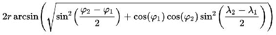

# 第五章。地理分析火花

地理处理是 Spark 的一个强大用例，因此本章的目的是解释数据科学家如何使用 Spark 处理地理数据，以生成非常大的数据集的强大的基于地图的视图。我们将演示如何通过 Spark 与 GeoMesa 的集成轻松处理时空数据集，这有助于将 Spark 转变为复杂的地理处理引擎。随着**物联网** ( **物联网**)和其他位置感知数据集变得越来越普遍，以及*移动对象*数据量的攀升，Spark 将成为缩小空间功能和处理可扩展性之间地理处理差距的关键工具。本章揭示了如何对全球新闻进行高级地缘政治分析，以便利用数据来分析和执行油价数据科学。

在本章中，我们将涵盖以下主题:

*   使用 Spark 摄取和预处理地理定位数据
*   存储适当索引的地理数据，在几何中使用地理散列索引
*   运行复杂的时空查询，跨时间和空间过滤数据
*   使用 Spark 和 GeoMesa 一起执行高级地理处理，以便研究随时间的变化
*   使用 Spark 计算密度图并可视化这些图随时间的变化
*   跨地图图层查询和集成空间数据以构建新的见解

# GDELT 和油

本章的前提是，我们可以操纵 GDELT 数据，根据历史事件或多或少地决定油价。我们预测的准确性将取决于许多变量，包括我们事件的细节、使用的数量以及我们围绕石油和这些事件之间关系的假设。

石油行业非常复杂，受多种因素驱动。然而，人们发现，大多数主要的油价波动在很大程度上是由原油需求的变化造成的。在对股票需求增加的时候，价格也会上涨，在中东地缘政治紧张的时候，价格历史上一直很高。特别是，政治事件对油价有很大的影响，我们将集中关注这一方面。

原油是世界上许多国家生产的；然而，生产者在定价时使用三个主要基准:

*   布伦特:由北海的不同实体生产
*   WTI: **西德克萨斯中质原油** ( **WTI** )覆盖北美中西部和墨西哥湾沿岸地区的实体
*   石油输出国组织:由石油输出国组织成员制作:

阿尔及利亚、安哥拉、厄瓜多尔、加蓬、印度尼西亚、伊朗、伊拉克、科威特、利比亚、尼日利亚、卡塔尔、沙特阿拉伯、阿联酋和委内瑞拉

很明显，我们需要做的第一件事是获取三个基线的历史定价数据。通过搜索互联网，可以在许多地方找到可下载的数据，例如:

*   布伦特:[https://fred.stlouisfed.org/](https://fred.stlouisfed.org/series/DCOILBRENTEU)
*   wti:[https://Fred . STL sfeidside . org/](https://fred.stlouisfed.org/series/DCOILBRENTEU)
*   石油输出国组织:[http://opec.org](http://opec.org)

现在我们知道油价主要由供求关系决定，我们的第一个假设是供求关系在更大程度上受到世界事件的影响，因此我们可以预测供求关系可能是什么。

我们希望尝试确定油价在接下来的一天、一周或一个月内是上涨还是下跌，正如我们在整本书中使用的 GDELT 一样，我们将利用这些知识，并将其扩展到运行一些非常大的处理作业。在我们开始之前，值得讨论我们将要走的路，以及做出决定的原因。第一个值得关注的领域是 GDELT 与石油的关系；这将定义初始工作的范围，并为我们以后的构建提供基础。重要的是，我们要决定如何利用 GDELT，以及这一决定的后果是什么；例如，我们可以决定一直使用所有的数据，但是这样做所需的处理时间确实非常长，因为仅一天的 GDELT 事件数据就可以平均为 15 MB，而 GKG 为 1.5 GB。因此，我们应该分析这两个集合的内容，并尝试建立我们的初始数据输入将是什么。

## GDELT 事件

纵观 GDELT 模式，有许多点可能是有用的；事件模式主要围绕确定故事中的两个主要角色，并将事件与他们联系起来。还有在不同层次上看待事件的能力，因此我们将有很好的灵活性来处理更高或更低层次的复杂性，这取决于我们的结果如何。例如:

`EventCode`字段是 CAMEO 动作代码:0251(请求减轻行政处罚)，也可以在 02(请求)和 025(请求让步)级别使用。

因此，我们的第二个假设是，事件的详细程度将从我们的算法中提供更好或更差的准确性。

其他有趣的标签还有`GoldsteinScale`、`NumMentions`、`Lat` / `Lon`。`GoldsteinScale`标签是一个从-10 到+10 的数字，它试图捕捉这种类型的事件对一个国家的稳定可能产生的理论上的潜在影响；基于我们已经确立的油价稳定性，这是一场伟大的比赛。`NumMentions`标签为我们提供了事件在所有源文档中出现的频率；如果我们发现在处理过程中需要减少评估事件的数量，这可以帮助我们给事件赋予重要性。例如，我们可以对数据进行处理，并根据事件被提及的频率，找到过去一小时、一天或一周中的前 10、100 或 1000 个事件。最后，`lat` / `lon`标签信息试图为事件分配一个地理参考点，这对于我们想要在 GeoMesa 中制作地图非常有用。

## gdelt gg

GKG 模式与总结事件内容和提供特定于该内容的增强信息相关。我们感兴趣的领域包括`Counts`、`Themes`、`GCAM`和`Locations`；`Counts`字段映射任何数字提及，因此潜在地允许我们计算严重性，例如 KILLS=47。`Themes`字段根据 GDELT 类别列表列出所有主题；随着时间的推移，这可以帮助我们机器学习影响油价的特定领域。`GCAM`字段是事件内容分析的结果；快速浏览一下 GCAM 列表，我们会发现有一些可能有用的方面需要注意:

```scala
c9.366  9   366   WORDCOUNT   eng   Roget's Thesaurus 1911 Edition   CLASS III - RELATED TO MATTER/3.2 INORGANIC MATTER/3.2.3 IMPERFECT FLUIDS/366 OIL

c18.172  18   172     WORDCOUNT   eng   GDELT   GKG   Themes   ENV_OIL
c18.314  18   314     WORDCOUNT   eng   GDELT   GKG   Themes   ECON_OILPRICE
```

最后，我们有`Locations`字段，它提供了与事件类似的信息，因此也可以用于地图的可视化。

# 制定行动计划

在检查了 GDELT 模式之后，我们现在需要围绕我们将要使用的数据做出一些决定，并确保我们基于我们的假设证明了使用的合理性。这是一个关键阶段，因为有许多方面需要考虑，至少我们需要:

*   确保我们的假设是清楚的，以便我们有一个已知的起点
*   确保我们清楚如何实施假设，并确定行动计划
*   确保我们使用足够的适当数据来满足我们的行动计划；确定数据使用的范围，以确保我们可以在给定的时间范围内得出结论，例如，使用所有 GDELT 数据会很好，但除非有一个大的处理集群可用，否则这可能是不合理的。另一方面，用一天时间显然不足以衡量一段时间内的任何模式
*   制定一个 B 计划，以防我们的初步结果不确定

我们的第二个假设是关于事件的细节；为了清楚起见，在本章中，我们将最初只选择其中一个数据源，以便在我们的模型表现不佳时增加进一步的复杂性。因此，我们可以选择 GDELT 事件，因为上面提到的字段提供了一个很好的基础来证明我们的算法；具体来说，`gcam`字段对于确定事件的性质非常有用，`NumMentions`字段在考虑事件的重要性时可以快速实现。虽然 GKG 的数据看起来也很有用，但我们想在这个阶段尝试使用一般事件；因此，例如，GCAM 石油数据被认为过于具体，因为与这些领域相关的文章很有可能经常是关于对油价变化的反应，因此对于我们的模型来说考虑为时已晚。

我们的初始处理流程(行动计划)将包括以下步骤:

*   获取过去 5 年的油价数据
*   获取过去 5 年的全球英语教学活动
*   安装基因组和相关工具
*   将 gdelt 数据加载到基因组中
*   建立一个可视化，在世界地图上显示一些事件
*   使用适当的机器学习算法学习针对油价上涨/下跌的事件类型
*   用这个模型预测石油价格的涨跌

# 大地测量

GeoMesa 是一个开源产品，旨在利用存储系统的分布式特性，如 Accumulo 和 Cassandra，来保存分布式时空数据库。通过这种设计，GeoMesa 能够运行包括 GDELT 在内的非常大的数据集所需的大规模地理空间分析。

我们将使用 GeoMesa 来存储 GDELT 数据，并在大部分数据上运行我们的分析；这应该会让我们获得足够的数据来训练我们的模型，这样我们就可以预测未来油价的涨跌。此外，几何图形将使我们能够在地图上绘制大量的点，这样我们就可以可视化地理教学和任何其他有用的数据。

## 安装

GeoMesa 网站([www.geomesa.org](http://www.geomesa.org))上有一个非常好的教程，指导用户完成安装过程。因此，我们无意在此提出另一个操作指南；但是，有几点值得注意，可以为您节省启动和运行一切的时间:

*   GeoMesa 有很多组件，其中很多有很多版本。确保软件堆栈的所有版本与 GeoMesa maven POMs 中指定的版本完全匹配是非常重要的。特别感兴趣的是 Hadoop、Zookeeper 和 Accumulo 版本位置可以在几何教程和其他相关下载的根`pom.xml`文件中找到。
*   在撰写本文时，在将 GeoMesa 与一些 Hadoop 供应商的堆栈集成时，还存在一些额外的问题。如果可以的话，将 GeoMesa 与自己的 Hadoop/accumula 等堆栈一起使用，以确保版本兼容性。
*   几何图形版本依赖项标签已从版本 1.3.0 更改。确保所有版本与您选择的几何图形版本一致是非常重要的；如果有任何冲突的类，那么肯定会有问题。
*   如果你以前没有使用过伏隔，我们已经在本书的其他章节中详细讨论过了。在使用 GeoMesa 时，初步的熟悉会有很大帮助(参见[第 7 章](07.html "Chapter 7. Building Communities")、*构建社区*)。
*   在几何图形中使用累积 1.6 或更高版本时，可以选择使用累积名称空间。如果您对此不熟悉，那么选择不使用名称空间，只需将 GeoMesa 运行时 JAR 复制到您的 Accumulo 根文件夹中的`/lib/text`中。
*   GeoMesa 使用一些外壳脚本；由于操作系统的性质，运行这些脚本可能会有奇怪的问题，这取决于您的平台。这些问题很小，可以通过一些快速的互联网搜索来解决；例如，在运行 `jai-image.sh`时，Mac OSX 上的用户确认出现了一个小问题。
*   可以在[https://repo . location tech . org/content/reportsa/releases/org/location tech/geomasa/](https://repo.locationtech.org/content/repositories/releases/org/locationtech/geomesa/)找到 GeoMesa maven 资源库

一旦您能够从命令行成功运行几何图形，我们就可以进入下一部分。

## GDELT 吞咽

下一阶段是获取 GDELT 数据并将其加载到 GeoMesa 中。这里有许多选择，这取决于您计划如何进行；如果您只是浏览本章，那么您可以使用脚本一次下载数据:

```scala
$ mkdir gdelt && cd gdelt
$ wget http://data.gdeltproject.org/events/md5sums
$ for file in `cat md5sums | cut -d' ' -f3 | grep '^201[56]'` ; do wget http://data.gdeltproject.org/events/$file ; done
$ md5sum -c md5sums 2>&1 | grep '^201[56]'
```

这将下载并验证 2015 年和 2016 年的所有 GDELT 事件数据。所需的数据量是我们在这个阶段需要估计的，因为我们不知道我们的算法将如何工作，所以我们选择了两年的时间作为开始。

脚本的另一种选择是阅读[第 2 章](02.html "Chapter 2. Data Acquisition")、*数据采集* n，详细说明如何配置 Apache NiFi 实时下载 GDELT 数据，并进一步加载到 HDFS 准备使用。否则，允许将上述数据传输到 HDFS 的脚本如下所示:

```scala
$ ls -1 *.zip | xargs -n 1 unzip
$ rm *.zip
$ hdfs dfs -copyFromLocal *.CSV hdfs:///data/gdelt/
```

### 注

HDFS 使用数据块；我们希望确保尽可能高效地存储文件。编写一个将文件聚合到 HDFS 块大小(默认为 64 MB)的方法将确保 NameNode 内存不会被许多小文件的条目填满，并且还会提高处理效率。使用多个块的大型文件(文件大小> 64 MB)称为分割文件。

我们在 HDFS 有大量数据(2015/16 年约为 48 GB)。现在，我们将通过 GeoMesa 把它加载到 Accumulo。

## 大地测量摄入量

几何教程讨论了使用`MapReduce`作业将数据从 HDFS 加载到库库洛的想法。让我们看看这个，并创建一个等效的 Spark。

### 映射到火花

由于 **MapReduce** ( **MR** )一般被认为是死了，或者至少是快死了，所以知道如何从 MR 中存在的工作岗位中创建 Spark 工作岗位是非常有用的。对于这种情况，我们将考虑几何教程(`geomesa-examples-gdelt`)中描述的几何累积加载作业。

磁共振作业通常由三部分组成:映射器、减速器和驱动器。几何示例是一个仅地图作业，因此不需要减速器。该作业采用一个 GDELT 输入行，从一个空的`Text`对象和创建的几何图形`SimpleFeature`中创建一个(键、值)对，并使用`GeoMesaOutputFormat`将数据加载到累积表中。磁共振作业的完整代码可以在我们的存储库中找到；接下来，我们将研究关键部分，并建议 Spark 所需的更改。

作业从`main`方法开始；前几行与从命令行解析所需选项有关，例如 Accumulo 用户名和密码。然后我们到达:

```scala
SimpleFeatureType featureType =
    buildGDELTFeatureType(featureName);
DataStore ds = DataStoreFinder.getDataStore(dsConf);
ds.createSchema(featureType);
runMapReduceJob(featureName, dsConf,
    new Path(cmd.getOptionValue(INGEST_FILE)));
```

几何图形`SimpleFeatureType`是用于在几何图形数据存储中存储数据的主要机制，它需要初始化一次，以及数据存储初始化。一旦完成，我们就执行磁共振作业本身。在 Spark 中，我们可以像以前一样通过命令行传递参数，然后进行一次性设置:

```scala
spark-submit --class io.gzet.geomesa.ingest /
             --master yarn /
             geomesa-ingest.jar <accumulo-instance-id>
...
```

罐子里的东西包含一个标准的火花作业:

```scala
val conf = new SparkConf()
val sc = new SparkContext(conf.setAppName("Geomesa Ingest"))
```

像以前一样解析命令行参数，并执行初始化:

```scala
val featureType = buildGDELTFeatureType(featureName)
val ds = DataStoreFinder
   .getDataStore(dsConf)
   .createSchema(featureType)
```

现在我们可以从 HDFS 加载数据，如果需要可以使用通配符。这将为文件的每个块创建一个分区(默认为 64 MB)，从而产生一个`RDD[String]`:

```scala
val distDataRDD = sc.textFile(/data/gdelt/*.CSV)
```

或者，我们可以根据可用资源确定分区数量:

```scala
val distDataRDD = sc.textFile(/data/gdelt/*.CSV, 20) 
```

然后我们可以执行映射，在这里我们可以嵌入函数来替换原始 MR `map`方法中的过程。我们创建一个元组(文本，简单特征类型)来复制一个(键，值)对，这样我们就可以在下一步中使用`OutputFormat`。当以这种方式创建 Scala 元组时，产生的 RDD 获得了额外的方法，例如`ReduceByKey`，它在功能上等同于 MR Reducer(关于我们真正应该使用什么的更多信息，请参见下面的`mapPartitions`):

```scala
val processedRDD = distDataRDD.map(s =>{
   // Processing as before to build the SimpleFeatureType
   (new Text, simpleFeatureType)
})
```

然后，我们最终可以使用原始作业中的`GeomesaOutputFormat`输出到 Accumulo:

```scala
processedRDD.saveAsNewAPIHadoopFile("output/path", classOf[Text], classOf[SimpleFeatureType], classOf[GeomesaOutputFormat])
```

现阶段我们还没有提到 MR 工作中的`setup`方法；在处理任何输入之前调用这个方法来分配一个昂贵的资源，比如数据库连接，或者在我们的例子中，一个可重用的对象，然后使用`cleanup`方法来释放该资源，如果它在范围之外时仍然存在的话。在我们的例子中，`setup`方法被用来创建一个`SimpleFeatureBuilder`，它可以在映射器的每次调用中被重用来构建`SimpleFeatures`用于输出；没有`cleanup`方法，因为当对象超出范围时(代码已经完成)，内存会自动释放。

Spark `map`函数一次只对一个输入进行操作，并且不提供在转换一批值之前或之后执行代码的方法。在调用`map`之前和之后简单地放置设置和清理代码看起来是合理的:

```scala
// do setup work 
val processedRDD = distDataRDD.map(s =>{ 
   // Processing as before to build the SimpleFeatureType 
   (new Text, simpleFeatureType) 
}) 
// do cleanup work 

```

但是，这失败有几个原因:

*   它将`map`中使用的任何对象放入映射函数的闭包中，这要求它是可序列化的(例如，通过实现`java.io.Serializable`)。并非所有对象都是可序列化的，因此可能会引发异常。
*   `map`函数是一个变换，而不是一个运算，被懒洋洋地求值。因此，`map`功能后的指令不能保证立即执行。
*   即使前面的问题针对特定的实现进行了讨论，我们也只会在驱动程序上执行代码，不一定会释放序列化副本分配的资源。

与 Spark 中的映射器最相似的是`mapPartitions`方法。这个方法不仅仅将一个值映射到另一个值，而是将一个值的迭代器映射到其他值的迭代器，类似于批量映射方法。这意味着`mapPartitions`可以在开始时在本地分配资源:

```scala
val processedRDD = distDataRDD.mapPartitions { valueIterator =>
   // setup code for SimpleFeatureBuilder
   val transformed = valueIterator.map( . . . )
   transformed
}
```

然而，释放资源(`cleanup`)并不简单，因为我们仍然会遇到懒惰的评估问题；如果资源在`map`之后被释放，那么迭代器可能在这些资源消失之前没有进行评估。对此的一个解决方案如下:

```scala
val processedRDD = distDataRDD.mapPartitions { valueIterator =>
  if (valueIterator.isEmpty) {
    // return an Iterator
  } else {
    //  setup code for SimpleFeatureBuilder
    valueIterator.map { s =>
// Processing as before to build the SimpleFeatureType
      val simpleFeature =
      if (!valueIterator.hasNext) {
       // cleanup here
      }
      simpleFeature
    }
  }
}
```

现在我们已经有了用于摄取的 Spark 代码，我们还可以做一个额外的更改，那就是添加一个`Geohash`字段(有关如何生成该字段的更多信息，请参见下文)。要将该字段插入到代码中，我们需要在 GDELT 属性列表的末尾添加一个条目:

```scala
Geohash:String 

```

和一行设置`simpleFeature`类型的值:

```scala
simpleFeature.setAttribute(Geomesa, calculatedGeoHash)
```

最后，我们可以运行 Spark 作业，用来自 HDFS 的 GDELT 数据加载 GeoMesa Accumulo 实例。GDELT 的两年是 1 亿左右的参赛作品！您可以使用从`accumulo/bin`目录运行的累积外壳来检查累积中有多少数据:

```scala
./accumulo shell -u username -p password -e "scan -t gdelt_records -np" | wc
```

## 地理哈希

Geohash 是古斯塔沃·尼迈耶发明的地理编码系统。它是一种分层的空间数据结构，将空间细分为网格形状的桶，这是所谓的 Z 阶曲线和一般的空间填充曲线的许多应用之一。

Geohashes 提供了诸如任意精度的属性，以及从代码末尾逐渐删除字符以减小其大小(并逐渐失去精度)的可能性。

由于精度逐渐降低，附近的地理位置将经常(但不总是)出现类似的前缀。共享前缀越长，两个位置越接近；如果我们想使用来自特定区域的点，这在几何中非常有用，因为我们可以使用前面摄取代码中添加的`Geohash`字段。

地理散列的主要用途是:

*   作为唯一标识符
*   例如，在数据库中表示点数据

在数据库中使用时，地理散列数据的结构有两个优点。首先，由 Geohash 索引的数据将具有连续切片中给定矩形区域的所有点(切片的数量取决于所需的精度和 Geohash *断层线*的存在)。这在数据库系统中特别有用，在数据库系统中，对单个索引的查询比多索引查询更容易或更快:例如，Accumulo。其次，这种索引结构可以用于快速和肮脏的邻近搜索:最近的点通常在最近的地理散列中。这些优点使得地理散列非常适合在几何中使用。以下是大卫·奥尔索普优秀的 Geohash scala 实现[https://github.com/davidallsopp/geohash-scala](https://github.com/davidallsopp/geohash-scala)的代码摘录。该代码可用于基于`lat` / `lon`输入生成地理散列:

```scala
/** Geohash encoding/decoding as per http://en.wikipedia.org/wiki/Geohash */
object Geohash {

  val LAT_RANGE = (-90.0, 90.0)
  val LON_RANGE = (-180.0, 180.0)

  // Aliases, utility functions
  type Bounds = (Double, Double)
  private def mid(b: Bounds) = (b._1 + b._2) / 2.0
  implicit class BoundedNum(x: Double) { def in(b: Bounds): Boolean = x >= b._1 && x <= b._2 }

  /**
   * Encode lat/long as a base32 geohash.
   *
   * Precision (optional) is the number of base32 chars desired; default is 12, which gives precision well under a meter.
   */
  def encode(lat: Double, lon: Double, precision: Int=12): String = { // scalastyle:ignore
    require(lat in LAT_RANGE, "Latitude out of range")
    require(lon in LON_RANGE, "Longitude out of range")
    require(precision > 0, "Precision must be a positive integer")
    val rem = precision % 2 // if precision is odd, we need an extra bit so the total bits divide by 5
    val numbits = (precision * 5) / 2
    val latBits = findBits(lat, LAT_RANGE, numbits)
    val lonBits = findBits(lon, LON_RANGE, numbits + rem)
    val bits = intercalatelonBits, latBits)
    bits.grouped(5).map(toBase32).mkString // scalastyle:ignore
  }

  private def findBits(part: Double, bounds: Bounds, p: Int): List[Boolean] = {
    if (p == 0) Nil
    else {
      val avg = mid(bounds)
      if (part >= avg) true :: findBits(part, (avg, bounds._2), p - 1)
// >= to match geohash.org encoding
      else false :: findBits(part, (bounds._1, avg), p - 1)
    }
  }

  /**
   * Decode a base32 geohash into a tuple of (lat, lon)
   */
  def decode(hash: String): (Double, Double) = {
    require(isValid(hash), "Not a valid Base32 number")
    val (odd, even) =toBits(hash).foldRight((List[A](), List[A]())) { case (b, (a1, a2)) => (b :: a2, a1) }
    val lon = mid(decodeBits(LON_RANGE, odd))
    val lat = mid(decodeBits(LAT_RANGE, even))
    (lat, lon)
  }

  private def decodeBits(bounds: Bounds, bits: Seq[Boolean]) =
    bits.foldLeft(bounds)((acc, bit) => if (bit) (mid(acc), acc._2) else (acc._1, mid(acc)))
}

def intercalate[A](a: List[A], b: List[A]): List[A] = a match {
 case h :: t => h :: intercalate(b, t)
 case _ => b
}
```

Geohash 算法的一个限制是试图利用它来基于公共前缀找到彼此邻近的点。彼此靠近但位于 180 度子午线相对两侧的边缘情况位置将导致 Geohash 码没有公共前缀(靠近物理位置的经度不同)。在北极和南极附近的点将具有非常不同的地理散列(对于附近的物理位置，不同的经度)。

此外，赤道(或格林威治子午线)两侧的两个相近位置不会有很长的共同前缀，因为它们属于世界的不同部分；一个位置的二进制纬度(或经度)将是 011111...另外 10 万...因此它们将没有共同的前缀，并且大多数位将被翻转。

为了进行邻近搜索，我们可以计算边界框的西南角(低地理散列，低纬度和经度)和东北角(高地理散列，高纬度和经度)，并在这两者之间搜索地理散列。这将检索两个角之间的 Z 阶曲线中的所有点；这也在 180°经脉和两极分解。

最后，由于地理散列(在这个实现中)是基于经度和纬度的坐标，所以两个地理散列之间的距离反映了两个点之间的纬度/经度坐标的距离，这并不转化为实际距离。在这种情况下，我们可以使用**哈弗辛**公式:



考虑到地球的曲率，这就给出了两点之间的实际距离，其中:

*   **r** 是球体的半径，
*   **φ1** 、 **φ2** :点 1 的纬度和点 2 的纬度，单位为弧度
*   **λ1** 、 **λ2** :点 1 的经度和点 2 的经度，单位为弧度

## ■T0） 地理服务器

现在，我们已经通过 GeoMesa 成功地将 GDELT 数据加载到了 Accumulo，我们可以在地图上可视化这些数据；例如，此功能对于在世界地图上绘制分析结果非常有用。为此，GeoMesa 与 GeoServer 很好地集成在一起。GeoServer 是一个**开放地理空间联盟** ( **OGC** )符合多项标准的实施，包括**网络要素服务** ( **WFS** )和**网络地图服务** ( **WMS** )。“它发布来自任何主要空间数据源的数据”。

我们将使用地理服务器以一种清晰、直观的方式查看我们的分析结果。同样，我们不打算深入研究如何启动和运行地理服务器，因为在 GeoMesa 文档中有一个非常好的教程可以实现两者的集成。需要注意的几个常见问题如下:

*   The system uses **Java Advanced Imaging** (**JAI**) libraries; if you have issues with these, specifically on a Mac, then these can often be fixed by removing the libraries from the default Java installation:

    ```scala
            rm /System/Library/Java/Extensions/jai_*.
    ```

    这将允许使用位于`$GEOSERVER_HOME/webapps/geoserver/WEB-INF/lib/`的地理服务器版本

*   同样，我们不能强调版本的重要性。您必须非常清楚您正在使用的主要模块的哪些版本，例如，Hadoop、Accumulo、Zookeeper，最重要的是，GeoMesa。如果你混合版本，你会看到问题，堆栈跟踪往往掩盖了真正的问题。如果您确实有例外，请检查并再次检查您的版本。

### 地图图层

一旦地理服务器运行，我们就可以创建一个可视化的层。地理服务器使我们能够发布单个或一组图层来生成图形。当我们创建一个图层时，我们可以指定边界框，查看特征(这是我们之前在 Spark 代码中创建的`SimpleFeature`)，甚至可以运行**通用查询语言** ( **CQL** )查询来过滤数据(关于这一点的更多信息如下)。创建图层后，选择图层预览和 JPG 选项将产生一个网址，其图形如下所示；这里的时间边界是 2016 年 1 月，这样地图就不会过于拥挤:


网址可以用来生成其他图形，只需操作参数即可。网址的简要分类如下:

标准的`geoserver`网址:

```scala
http://localhost:8080/geoserver/geomesa/wms?

```

`request`类型:

```scala
service=WMS&version=1.1.0&request=GetMap& 

```

`layers`和`styles`:

```scala
layers=geomesa:event&styles=& 

```

如果需要，设置图层`transparency`:

```scala
transparency=true& 

```

`cql`语句，在这种情况下，任何具有`GoldsteinScale>8`条目的行:

```scala
cql_filter=GoldsteinScale>8& 

```

边界框`bbox`:

```scala
bbox=-180.0,-90.0,180.0,90.0& 

```

图形的`height`和`width`:

```scala
width=768&height=384& 

```

来源及`image`类型:

```scala
srs=EPSG:4326&format=image%2Fjpeg& 

```

按时间查询界限过滤内容:

```scala
time=2016-01-01T00:00:00.000Z/2016-01-30T23:00:00.000Z 

```

这一部分的最后一步是将世界地图附加到这个图层上，这样图像就变得更易读了。如果您在互联网上搜索世界地图形状文件，有许多选项；我们使用了一个来自 http://thematicmapping.org 的。将其中的一个作为形状文件存储添加到 GeoServer 中，然后在创建我们的 GDELT 数据和形状文件的图层组之前创建并发布一个图层，将生成类似如下的图像:


为了让事情更有趣一点，我们根据`FeatureType`中的`GoldsteinScale`字段过滤了事件。通过将`cql_filter=GoldsteinScale > 8`添加到网址，我们可以绘制出`GoldsteinScale`得分大于 8 的所有点；所以本质上，上图向我们展示了 2016 年 1 月，世界上积极情绪水平最高的地方！

### CQL

**通用查询语言** ( **CQL** )是 OGC 为[目录网络服务规范](http://www.opengeospatial.org/standards/cat)创建的纯文本查询语言。它是一种人类可读的查询语言(不像，例如， [OGC 过滤器](http://www.opengeospatial.org/standards/filter))，并且使用与 SQL 相似的语法。虽然与 SQL 相似，但 CQL 的功能要少得多；例如，要求属性位于任何比较运算符的左侧是非常严格的。

以下列出了 CQL 支持的运营商:

*   比较运算符:=，<>，>，> =，
*   标识、列表和其他运算符:介于、之前、之后、类似、是、存在、不是、在
*   算术表达式运算符:+，-，*，/
*   几何运算符:相等、不相交、相交、接触、交叉、内部、包含、重叠、相关、扩散、超越

由于 CQL 的限制，GeoServer 提供了 CQL 的扩展版本，称为 ECQL。ECQL 提供了许多 CQL 所缺少的功能，提供了一种更灵活的语言，与 SQL 有更多的共同点。地理服务器支持在 WMS 使用 CQL 和 ECQL 以及 WFS 请求。

测试 CQL 查询的最快方法是修改一个图层的 URL，比如我们上面创建的图层，例如使用 JPGs，或者使用 GeoMesa 中图层选项底部的 CQL 框。

如果我们在一个 WMS 请求中定义了几个层，例如:

```scala
http://localhost:8080/geoserver/wms?service=WMS&version=1.1.0&request=GetMap&layers=layer1,layer2,layer3   ...   

```

然后，我们可能希望使用 CQL 查询来过滤其中的一个层。在这种情况下，CQL 滤波器必须以与层相同的方式排序；我们对不想过滤的图层使用`INCLUDE`关键字，并使用“；”对其进行定界。例如，在我们的示例中，为了仅过滤`layer2`，WMS 请求将显示如下:

```scala
http://localhost:8080/geoserver/wms?service=WMS&version=1.1.0&request=GetMap&layers=layer1,layer2,layer3&cql_filter=INCLUDE;(LAYER2_COL='value');INCLUDE...   

```

### 注

使用`Date`型柱时要注意；我们需要确定他们的格式，然后再尝试任何 CQL。通常是 ISO8601 格式；2012-01-01T00:00:00Z。但是，根据数据的加载方式，可能会出现不同的格式。在我们的例子中，我们已经确保了 SQLDATE 的格式是正确的。

# 测量油价

现在我们的数据存储中有了大量的数据(我们总是可以使用前面的 Spark 作业添加更多的数据)，我们将继续使用几何应用编程接口查询这些数据，以准备好应用到我们的学习算法中的行。我们当然可以使用原始的 GDELT 文件，但是下面的方法是一个有用的工具。

## 使用几何查询应用编程接口

几何查询应用编程接口使我们能够基于时空属性查询结果，同时还利用了数据存储的并行化，在本例中是带有迭代器的累积。我们可以使用应用编程接口来构建`SimpleFeatureCollections`，然后我们可以解析它来实现几何`SimpleFeatures`，并最终获得与我们的查询相匹配的原始数据。

在这个阶段，我们应该构建通用的代码，这样，如果我们稍后决定没有使用足够的数据，或者如果我们需要更改输出字段，我们可以很容易地更改它。最初，我们将提取几个字段；`SQLDATE`、`Actor1Name`、`Actor2Name`和`EventCode`。我们还应该决定查询的边界框；当我们看着三个不同的石油指数时，就要决定我们如何假设事件的地理影响与石油价格本身有关。这是最难评估的变量之一，因为决定价格的因素太多了；可以说，边界框就是整个世界。然而，当我们使用三个指数时，我们将基于对石油供应领域和需求领域的研究，假设每个指数都有自己的地理限制。如果我们有更多的相关信息，或者如果结果不利，我们需要重新评估，我们可以随时改变这些界限。建议的初始边界框是:

*   布伦特:北海和英国(供应)和中欧(需求):34.515610，-21.445313 - 69.744748，36.9140630063
*   WTI:美洲(供应)和西欧(需求):-58.130121、-162.070313、71.381635、-30.58593838006
*   石油输出国组织:中东(供应)和欧洲(需求):-38.350273，-20.390625，38.195022，149.41400630006

从几何中提取结果的代码如下(布伦特原油):

```scala
object CountByWeek {

   // specify the params for the datastore
   val params = Map(
     "instanceId" -> "accumulo",
     "zookeepers" -> "127.0.0.1:2181",
     "user"       -> "root",
     "password"   -> "accumulo",
     "tableName"  -> "gdelt")

   // matches the params in the datastore loading code
   val typeName      = "event"
   val geom          = "geom"
   val date          = "SQLDATE"
   val actor1        = "Actor1Name"
   val actor2        = "Actor2Name"
   val eventCode     = "EventCode"
   val numArticles   = "NumArticles"

   // specify the geographical bounding
   val bbox   = "34.515610, -21.445313, 69.744748, 36.914063"

  // specify the temporal bounding
  val during = "2016-01-01T00:00:00.000Z/2016-12-30T00:00:00.000Z"

  // create the filter
  val filter = s"bbox($geom, $bbox) AND $date during $during"

  def main(args: Array[String]) {
    // Get a handle to the data store
    val ds = DataStoreFinder
       .getDataStore(params)
       .asInstanceOf[AccumuloDataStore]

    // Construct a CQL query to filter by bounding box
    val q = new Query(typeName, ECQL.toFilter(filter))

    // Configure Spark
    val sc = new SparkContext(GeoMesaSpark.init(
       new SparkConf(true), ds))

     // Create an RDD from the query
     val simpleFeaureRDD = GeoMesaSpark.rdd(new Configuration,
       sc, params, q)

     // Convert RDD[SimpleFeature] to RDD[Row] for DataFrame creation below
     val gdeltAttrRDD = simpleFeaureRDD.mapPartitions { iter =>
       val df = new SimpleDateFormat("yyyy-MM-dd")
       val ff = CommonFactoryFinder.getFilterFactory2
       val dt = ff.property(date)
       val a1n = ff.property(actor1)
       val a2n = ff.property(actor2)
       val ec = ff.property(eventCode)
       val na = ff.property(numArticles)
       iter.map { f =>
         Row(
           df.format(dt.evaluate(f).asInstanceOf[java.util.Date]),
           a1n.evaluate(f),
           a2n.evaluate(f),
           ec.evaluate(f),
           na.evaluate(f)
         )
       }
     }
   }
}
```

`RDD[Row]`集合可以写入磁盘以备将来使用，如下所示:

```scala
gdeltAttrRDD.saveAsTextFile("/data/gdelt/brent-2016-rdd-row)
```

### 注

此时我们应该读入尽可能多的数据，以便为我们的算法提供大量的训练数据。我们将在稍后阶段在训练和测试数据之间分割我们的输入数据。因此，没有必要保留任何数据。

## 数据准备

在这一阶段，我们已经根据边界框和特定石油指数的日期范围从 GeoMesa 获得了数据。输出被组织成这样，我们有一个行的集合，每个行包含一个事件的假定的重要细节。我们不确定我们为每个事件选择的字段是否完全相关，以提供足够的信息来构建一个可靠的模型，因此，根据我们的结果，这可能是我们以后必须尝试的事情。接下来，我们需要将数据转换成我们的学习过程可以使用的东西。在这种情况下，我们将把数据聚合成一周的块，并将数据转换成一个典型的*单词包*，从加载上一步的数据开始:

```scala
val gdeltAttrRDD = sc.textFile("/data/gdelt/brent-2016-rdd-row)
```

在这个 RDD 中，我们有`EventCodes` (CAMEO 代码):这些将需要转换成它们各自的描述，以便可以构建单词包。通过从[http://gdeltproject.org/data/lookups/CAMEO.eventcodes.txt](http://gdeltproject.org/data/lookups/CAMEO.eventcodes.txt)下载 CAMEO 代码，我们可以创建一个`Map`对象用于下一步:

```scala
var cameoMap = scala.collection.mutable.Map[String, String]()

val linesRDD = sc.textFile("file://CAMEO.eventcodes.txt")
linesRDD.collect.foreach(line => {
  val splitsArr = line.split("\t")
  cameoMap += (splitsArr(0) -> splitsArr(1).
replaceAll("[^A-Za-z0-9 ]", ""))
})
```

请注意，我们通过删除任何非标准字符来规范化输出；这样做的目的是试图避免错误的字符影响我们的训练模型。

我们现在可以通过在`EventCode`映射描述的两侧添加演员代码来创建我们的`bagOfWordsRDD`，并根据日期和形成的句子创建一个数据框:

```scala
val bagOfWordsRDD = gdeltAttrRDD.map(f => Row(
   f.get(0),
   f.get(1).toString.replaceAll("\\s","").
     toLowerCase + " " + cameoMap(f.get(3).toString).
     toLowerCase + " " + f.get(2).toString.replaceAll("\\s","").
     toLowerCase)
 )

 val gdeltSentenceStruct = StructType(Array(
   StructField("Date", StringType, true),
   StructField("sentence", StringType, true)
 ))

 val gdeltSentenceDF 
 spark.createDataFrame(bagOfWordsRDD,gdeltSentenceStruct)
 gdeltSentenceDF.show(false)

+----------+-----------------------------------------------------+
|Date      |sentence                                             |
+----------+-----------------------------------------------------+
|2016-01-02|president demand not specified below unitedstates    |
|2016-01-02|vladimirputin engage in negotiation beijing          |
|2016-01-02|northcarolina make pessimistic comment neighborhood  |
+----------+-----------------------------------------------------+
```

我们之前提到过，我们可以每天、每周甚至每年处理我们的数据；通过选择每周，我们接下来需要按周对我们的数据帧进行分组。在 Spark 2.0 中，我们可以使用窗口功能轻松实现这一点:

```scala
val windowAgg = gdeltSentenceDF.
    groupBy(window(gdeltSentenceDF.col("Date"),
      "7 days", "7 days", "1 day"))
val sentencesDF = windowAgg.agg(
    collect_list("sentence") as "sentenceArray")
```

由于我们将生成每周结束时的油价数据，因此我们应该确保将周五到周四这几天的句子数据进行分组，以便我们稍后可以将其与该周五的价格数据结合起来。这是通过改变`window`函数的第四个参数来实现的；在这种情况下，有一天提供了正确的分组。如果我们运行命令`sentencesDF.printSchema`，我们会看到`sentenceArray`列是一个字符串数组，而我们只需要一个`String`作为我们学习算法的输入。下一个代码摘录演示了这一变化，并生成了列`commonFriday`，它为我们提供了每一行的工作日期的参考，以及我们可以稍后加入的唯一键:

```scala
val convertWrappedArrayToStringUDF = udf {(array: WrappedArray[String]) =>
  array.mkString(" ")
 }

val dateConvertUDF = udf {(date: String) =>
  new SimpleDateFormat("yyyy-MM-dd").
    format(new SimpleDateFormat("yyyy-MM-dd hh:mm:ss").
      parse(date))
  }

val aggSentenceDF = sentencesDF.withColumn("text",
 convertWrappedArrayToStringUDF(
   sentencesDF("sentenceArray"))).
      withColumn("commonFriday", dateConvertUDF(sentencesDF("window.end")))

aggSentenceDF.show

+--------------------+-----------------+--------------+-------------+
|              window|    sentenceArray|          text| commonFriday|
+--------------------+-----------------+--------------+-------------+
|[2016-09-09 00:00...|[unitedstates app|unitedstates a|   2016-09-16|
|[2016-06-24 00:00...|[student make emp|student make e|   2016-07-01|
|[2016-03-04 00:00...|[american provide|american provi|   2016-03-11|
+--------------------+-----------------+--------------+-------------+
```

下一步是收集我们的数据，并为其贴上标签，以便在下一阶段使用。为了给它贴标签，我们必须对下载的油价数据进行标准化。本章前面我们提到了数据点的频率；目前，数据包含日期和当天结束时的价格。我们需要将我们的数据转换成(日期，变化)的元组，其中日期是该周的星期五，变化是基于从前一个星期一开始的每日价格平均值的上涨或下跌；如果价格保持不变，我们将把这视为下跌，这样我们以后就可以实现二进制值学习算法。

我们可以再次使用 Spark DataFrames 中的窗口功能，轻松地按周对数据进行分组；我们还将按如下方式重新格式化日期，以便窗口组功能正确运行:

```scala
// define a function to reformat the date field
def convert(date:String) : String = {
  val dt = new SimpleDateFormat("dd/MM/yyyy").parse(date)
  new SimpleDateFormat("yyyy-MM-dd").format(dt)
}

val oilPriceDF = spark
  .read
  .option("header","true")
  .option("inferSchema", "true")
  .csv("oil-prices.csv")

// create a User Defined Function for the date changes
val convertDateUDF = udf {(Date: String) => convert(Date)}

val oilPriceDatedDF = oilPriceDF.withColumn("DATE", convertDateUDF(oilPriceDF("DATE")))

// offset to start at beginning of week, 4 days in this case
val windowDF = oilPriceDatedDF.groupBy(window(oilPriceDatedDF.col("DATE"),"7 days", "7 days", "4 days"))

// find the last value in each window, this is the trading close price for that week
val windowLastDF = windowDF.agg(last("PRICE") as "last(PRICE)"
).sort("window")

windowLastDF.show(20, false)
```

这会产生类似这样的东西:

```scala
+---------------------------------------------+-----------+
|window                                       |last(PRICE)|
+---------------------------------------------+-----------+
|[2011-11-21 00:00:00.0,2011-11-28 00:00:00.0]|106.08     |
|[2011-11-28 00:00:00.0,2011-12-05 00:00:00.0]|109.59     |
|[2011-12-05 00:00:00.0,2011-12-12 00:00:00.0]|107.91     |
|[2011-12-12 00:00:00.0,2011-12-19 00:00:00.0]|104.0      |
+---------------------------------------------+-----------+
```

现在我们可以计算前一周的涨跌；首先将前一周的`last(PRICE)`添加到每一行(使用 Spark `lag`函数)，然后计算结果:

```scala
val sortedWindow = Window.orderBy("window.start")

// add the previous last value to each row
val lagLastCol = lag(col("last(PRICE)"), 1).over(sortedWindow)
val lagLastColDF = windowLastDF.withColumn("lastPrev(PRICE)", lagLastCol)

// create a UDF to calculate the price rise or fall
val simplePriceChangeFunc = udf{(last : Double, prevLast : Double) =>
  var change = ((last - prevLast) compare 0).signum
  if(change == -1)
    change = 0
  change.toDouble
}

// create a UDF to calculate the date of the Friday for that week
val findDateTwoDaysAgoUDF = udf{(date: String) =>
  val dateFormat = new SimpleDateFormat( "yyyy-MM-dd" )
  val cal = Calendar.getInstance
  cal.setTime( dateFormat.parse(date))
  cal.add( Calendar.DATE, -3 )
  dateFormat.format(cal.getTime)
}

val oilPriceChangeDF = lagLastColDF.withColumn("label", simplePriceChangeFunc(
  lagLastColDF("last(PRICE)"),
  lagLastColDF("lastPrev(PRICE)")
)).withColumn("commonFriday", findDateTwoDaysAgoUDF(lagLastColDF("window.end"))

oilPriceChangeDF.show(20, false)

+--------------------+-----------+---------------+-----+------------+
|              window|last(PRICE)|lastPrev(PRICE)|label|commonFriday|
+--------------------+-----------+---------------+-----+------------+
|[2015-12-28 00:00...|       36.4|           null| null|  2016-01-01|
|[2016-01-04 00:00...|      31.67|           36.4|  0.0|  2016-01-08|
|[2016-01-11 00:00...|       28.8|          31.67|  0.0|  2016-01-15|
+--------------------+-----------+---------------+-----+------------+
```

您会注意到`signum`功能的使用；这对于比较非常有用，因为它会产生以下结果:

*   如果第一个值小于第二个值，输出-1
*   如果第一个值大于第二个值，输出+1
*   如果两个值相等，输出 0

现在我们有了两个数据框`aggSentenceDF`和`oilPriceChangeDF`，我们可以使用`commonFriday`列连接这两个数据框来生成一个带标签的数据集:

```scala
val changeJoinDF = aggSentenceDF
 .drop("window")
 .drop("sentenceArray")
 .join(oilPriceChangeDF, Seq("commonFriday"))
 .withColumn("id", monotonicallyIncreasingId)
```

我们还删除了窗口和`sentenceArray`列，并添加了一个 ID 列，这样我们就可以唯一地引用每一行:

```scala
changeJoinDF,show
+------------+---------+---------+-----------+---------+-----+------+
|commonFriday|     text|   window|last(PRICE)| lastPrev|label|    id|
+------------+---------+---------+-----------+---------+-----+------+
|  2016-09-16|unitedsta|[2016-09-|      45.26|    48.37|  0.0|   121|
|  2016-07-01|student m|[2016-06-|      47.65|    46.69|  1.0|   783|
|  2016-03-11|american |[2016-03-|      39.41|    37.61|  1.0|   356|
+------------+---------+---------+-----------+---------+-----+------+
```

## 机器学习

我们现在有输入数据和每周的价格变化；接下来，我们将把我们的几何数据转换成机器学习模型可以处理的数字向量。火花机器学习库，MLlib，有一个名为`HashingTF`的实用程序可以做到这一点。`HashingTF`通过对每个术语应用散列函数，将一袋单词转换成术语频率向量。因为向量有有限数量的元素，所以两个项可能映射到同一个散列项；散列的、矢量化的特征可能不完全代表输入文本的实际内容。因此，我们将建立一个相对较大的特征向量，容纳 10，000 个不同的散列值，以减少这些冲突的机会。这背后的逻辑是，只有这么多可能的事件(无论大小)，因此重复以前看到的事件应该会产生类似的结果。当然，事件的组合可能会改变这一点，这是通过最初采取一周的区块来解释的。为了正确格式化`HashingTF`的输入数据，我们还将对输入文本执行`Tokenizer`:

```scala
val tokenizer = new Tokenizer().
   setInputCol("text").
   setOutputCol("words")
 val hashingTF = new HashingTF().
   setNumFeatures(10000).
   setInputCol(tokenizer.getOutputCol).
   setOutputCol("rawFeatures")
```

最后的准备步骤是实施**反向文档频率** ( **IDF** )，这是每个术语提供多少信息的数字度量:

```scala
val idf = new IDF().
  setInputCol(hashingTF.getOutputCol).
  setOutputCol("features")
```

出于本练习的目的，我们将实现一个朴素贝叶斯实现来执行我们功能的机器学习部分。该算法非常适合从一系列输入中学习结果；就我们的情况而言，我们希望在考虑到上周发生的一系列事件的情况下，了解油价的涨跌。

## 朴素贝叶斯

朴素贝叶斯是一种构造分类器的简单技术:将类标签分配给问题实例的模型，表示为特征值向量，其中类标签是从某个有限集合中提取的。Spark MLlib 中提供了朴素贝叶斯，因此:

```scala
val nb = new NaiveBayes() 

```

我们可以使用 MLlib 管道将上述所有步骤联系在一起；管道可以被认为是简化多种算法组合的工作流。火花文档中的一些定义如下:

*   数据框架:这个 ML API 使用来自 Spark SQL 的数据框架作为 ML 数据集，可以保存各种数据类型。例如，数据框可以有不同的列来存储文本、特征向量、真实标签和预测。
*   转换器:转换器是一种可以将一个数据帧转换成另一个数据帧的算法。例如，ML 模型是一个将具有特征的数据帧转换成具有预测的数据帧的转换器。
*   估计器:估计器是一种算法，它可以“拟合”一个数据帧来产生一个转换器。例如，学习算法是在数据帧上训练并产生模型的估计器。
*   管道:管道将多个转换器和评估器链接在一起，以指定最大似然工作流。

`pipeline`声明如下:

```scala
val pipeline = new Pipeline().
  setStages(Array(tokenizer, hashingTF, idf, nb))
```

我们之前提到，所有可用的数据都应该从 GeoMesa 中读取，因为我们将在稍后阶段拆分数据，以便提供训练和测试数据集。这在这里执行:

```scala
val splitDS = changeJoinDF.randomSplit(Array(0.75,0.25))
val (trainingDF,testDF) = (splitDS(0),splitDS(1))
```

最后，我们可以执行完整的模型:

```scala
val model = pipeline.fit(trainingDF)
```

模型可以轻松保存和加载:

```scala
model.save("/data/models/gdelt-naivebayes-2016") 
val naivebayesModel = PipelineModel.load("/data/models/Gdelt-naivebayes-2016") 

```

## 结果

为了测试我们的模型，我们应该执行`model`变压器，如下所述:

```scala
model
  .transform(testDF)
  .select("id", "prediction", "label").
  .collect()
  .foreach {
    case Row(id: Long, pred: Double, label: Double) =>
       println(s"$id --> prediction=$pred --> should be: $label")
  }
```

这为每个输入行提供了预测:

```scala
8847632629761 --> prediction=1.0 --> should be: 1.0
1065151889408 --> prediction=0.0 --> should be: 0.0
1451698946048 --> prediction=1.0 --> should be: 1.0
```

从结果数据帧(`model.transform(testDF).select("rawPrediction", "probability", "prediction").show`)获得的结果如下:

```scala
+--------------------+--------------------+----------+
|       rawPrediction|         probability|prediction|
+--------------------+--------------------+----------+
|[-6487.5367247911...|[2.26431216092671...|       1.0|
|[-8366.2851849035...|[2.42791395068146...|       1.0|
|[-4309.9770937765...|[3.18816589322004...|       1.0|
+--------------------+--------------------+----------+
```

## 分析

在像油价预测这样的问题领域，创建一个真正成功的算法总是非常困难/几乎不可能，所以这一章总是面向更多的示范作品。然而，我们有结果，它们的合法性并非无关紧要；我们用来自石油指数和 GDELT 的几年数据训练了上述算法，然后从模型执行的结果中收集结果，然后将其与正确的标签进行比较。

在测试中，之前的模型显示了 51%的准确性。这比我们从简单的随机选择结果中所期望的要稍微好一点，但是为改进提供了坚实的基础。有了保存数据集和模型的能力，在努力提高准确性的过程中对模型进行更改就变得简单了。

有许多可以改进的地方，我们已经在本章中提到了其中的一些。为了改进我们的模型，我们应该以系统的方式处理特定的领域。由于我们只能对哪些变化会影响改进做出有根据的猜测，所以首先尝试解决最受关注的领域是很重要的。以下是我们如何应对这些变化的简要总结。我们应该经常访问我们的假设，并确定它们是否仍然有效，或者应该在哪里进行更改。

假设 1: *“石油的供应和需求在更大程度上受到世界事件的影响，因此我们可以预测这种供应和需求可能是什么。”*我们对模型的初步尝试显示了 51%的准确性；尽管这不足以确定这个假设是否有效，但值得继续研究模型的其他领域，并尝试在完全否定假设之前提高准确性。

假设 2: *“事件的详细程度将从我们的算法中提供更好或更差的准确性。”*我们这里变化空间巨大；我们可以在几个方面修改代码并快速重新运行模型，例如:

*   事件数量:增加会影响准确性吗？
*   每日/每周/每月数据汇总:每周汇总可能永远不会给出好的结果
*   有限的数据集:我们目前只使用了几个来自 GDELT 的字段，更多的字段会有助于准确性吗？
*   排除任何其他类型的数据:引入 GKG 数据有助于提高准确性吗？

总之，我们可能有比开始时更多的问题；然而，我们现在已经做了基础工作，以产生一个我们可以建立的初始模型，希望提高准确性，并导致对数据及其对油价的潜在影响的进一步理解。

# 总结

在本章中，我们介绍了以时空方式存储数据的概念，这样我们就可以使用几何和地理服务器来创建和运行查询。我们已经展示了这些查询是在工具本身中执行的，并且是以编程方式执行的，利用地理服务器来显示结果。此外，我们已经演示了如何在任何后续处理之前，合并不同的工件，纯粹从原始的 GDELT 事件中创建见解。接下来，我们已经接触了高度复杂的石油定价世界，并研究了一个简单的算法来估计每周的石油变化。虽然用可用的时间和资源创建一个准确的模型是不合理的，但我们已经探索了许多关注的领域，并试图解决这些问题，至少在较高的层次上，以便深入了解在这个问题空间中可以采取的可能方法。

在这一章中，我们已经介绍了一些关键的 Spark 库和函数，其中的关键部分是 MLlib，我们将在本书的剩余部分中详细介绍。

在下一章[第 6 章](06.html "Chapter 6. Scraping Link-Based External Data")、*刮基于链接的外部数据*中，我们进一步实现了 GDELT 数据集，以构建一个用于跟踪趋势的 web 级新闻扫描器。