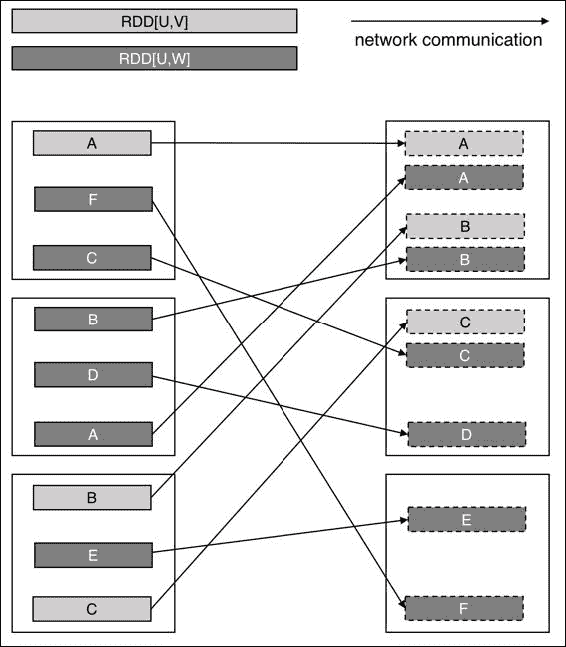
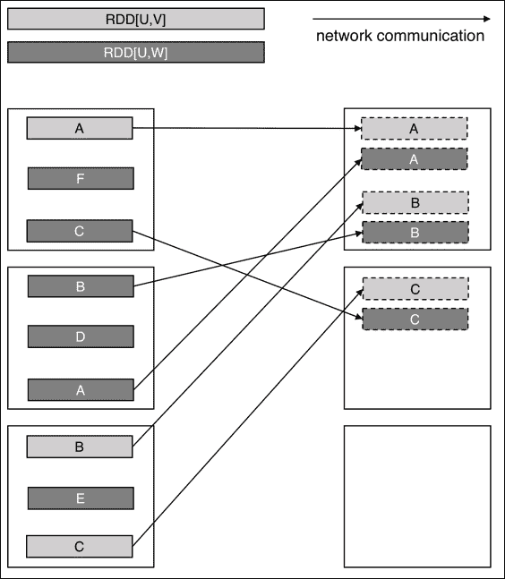
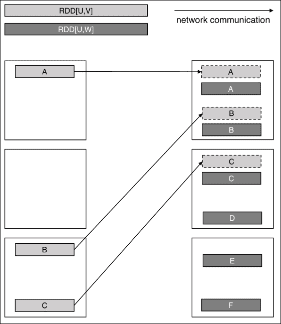
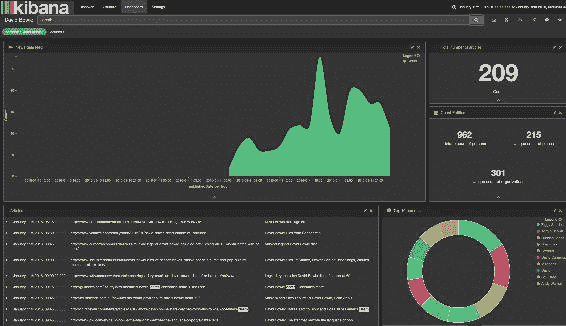

# 六、基于链接抓取外部数据

本章旨在解释一种通过 URL 或 API 上的外部内容增强本地数据的通用模式。例如，当从 GDELT 或 Twitter 收到 URL 时。我们为读者提供了一个教程，使用 GDELT 新闻索引服务作为新闻网址的来源，演示如何构建一个网络规模的新闻扫描仪，从互联网上抓取感兴趣的全球突发新闻。我们解释如何以克服规模挑战的方式构建这个专业的网页抓取组件。在许多用例中，访问原始的 HTML 内容不足以对正在出现的全球事件提供更深入的见解。专家数据科学家必须能够从原始文本内容中提取实体，以帮助构建跟踪更广泛趋势所需的上下文。

在本章中，我们将涵盖以下主题:

*   使用 *Goose* 库创建一个可扩展的网页内容提取器
*   利用自然语言处理的 Spark 框架
*   使用双隐喻算法去重名
*   利用地理名称数据集进行地理坐标查找

# 搭建网页级新闻扫描器

数据科学与统计学的不同之处在于强调可扩展处理，以克服围绕收集数据的质量和多样性的复杂问题。虽然统计学家研究干净数据集的样本，可能来自关系数据库，但数据科学家则相反，他们大规模研究来自各种来源的非结构化数据。前者侧重于构建具有高度精确性和准确性的模型，而后者通常侧重于构建丰富的集成数据集，以发现定义不太严格的见解。数据科学之旅通常包括折磨最初的数据来源，连接理论上不应该连接的数据集，用公开可用的信息丰富内容，实验，探索，发现，尝试，失败，再尝试。无论是技术还是数学技能，普通数据科学家和专家数据科学家之间的主要区别在于他们在挖掘数据潜在价值时的好奇心和创造力。例如，您可以构建一个简单的模型，为业务团队提供他们要求的最少内容，或者您可以注意并利用数据中提到的所有这些网址，然后抓取这些内容，并使用这些扩展的结果来发现超出业务团队最初提出的问题的新见解。

## 访问网页内容

除非你在 2016 年初真的很努力，否则你会听说歌手*大卫·鲍依*在 2016 年 1 月 10 日去世，享年 69 岁。这一消息被所有媒体出版商广泛报道，在社交网络上转发，随后世界各地最伟大的艺术家们纷纷发表了悼念。可悲的是，这是本书内容的一个完美用例，也是本章的一个很好的例证。在这一部分，我们将使用英国广播公司的以下文章作为参考:


图 1:英国广播公司关于大卫·鲍依的文章，来源:http://www.bbc.co.uk/news/entertainment-arts-35278872

查看本文背后的 HTML 源代码，首先要注意的是，大部分内容并不包含任何有价值的信息。这包括页眉、页脚、导航面板、侧边栏和所有隐藏的 JavaScript 代码。虽然我们只对标题、一些参考资料(比如发布日期)感兴趣，而且对于文章本身来说，最多只有几十行，但分析页面将需要解析 1500 多行 HTML 代码。尽管我们可以找到很多用于解析 HTML 文件内容的库，但是创建一个足够通用的解析器来处理来自随机文章的未知 HTML 结构本身可能会成为一个真正的挑战。

### 鹅库

我们将这个逻辑委托给优秀的 Scala 库**Goose**([https://github.com/GravityLabs/goose](https://github.com/GravityLabs/goose))。这个库打开一个网址连接，下载 HTML 内容，清除所有垃圾，使用一些英语停止词的聚类对不同的段落进行评分，最后返回去掉任何底层 HTML 代码的纯文本内容。通过正确安装 *imagemagick* ，该库甚至可以检测到给定网站的最具代表性的图片(超出此处范围)。`goose`依赖项在 Maven central 上可用:

```scala
<dependency>
  <groupId>com.gravity</groupId>
  <artifactId>goose</artifactId>
  <version>2.1.23</version>
</dependency>
```

与 Goose API 的交互就像库本身一样令人愉快。我们创建一个新的 Goose 配置，禁用图像提取，修改一些可选设置，如用户代理和超时选项，并创建一个新的`Goose`对象:

```scala
def getGooseScraper(): Goose = {
  val conf: Configuration = new Configuration
  conf.setEnableImageFetching(false)
  conf.setBrowserUserAgent(userAgent)
  conf.setConnectionTimeout(connectionTimeout)
  conf.setSocketTimeout(socketTimeout)
  new Goose(conf)
}

val url = "http://www.bbc.co.uk/news/entertainment-arts-35278872"
val goose: Goose = getGooseScraper()
val article: Article = goose.extractContent(url)
```

调用`extractContent`方法返回一个具有以下值的文章类:

```scala
val cleanedBody: String = article.cleanedArticleText
val title: String = article.title
val description: String = article.metaDescription
val keywords: String = article.metaKeywords
val domain: String = article.domain
val date: Date = article.publishDate
val tags: Set[String] = article.tags

/*
Body: Singer David Bowie, one of the most influential musicians...
Title: David Bowie dies of cancer aged 69
Description: Tributes are paid to David Bowie...
Domain: www.bbc.co.uk
*/
```

使用这样一个库，打开一个连接并解析 HTML 内容不需要我们花费十几行代码，并且该技术可以应用于文章 URL 的随机列表，而不管它们的来源或 HTML 结构如何。最终输出是一个解析清晰的数据集，它是一致的，并且在下游分析中高度可用。

## 与Spark的融合

下一个合乎逻辑的步骤是集成这样一个库，并使其应用编程接口在可扩展的 Spark 应用中可用。一旦集成，我们将解释如何有效地从大量的 URL 集合中检索远程内容，以及如何在 Spark 转换中使用不可序列化的类，并以一种高效的方式。

### Scala 兼容性

Maven 上的 Goose 库是为 Scala 2.9 编译的，因此与 Spark 发行版不兼容(Spark 的 2.0+版本需要 Scala 2.11)。为了使用它，我们必须为 Scala 2.11 重新编译 Goose 发行版，为了您的方便，我们在我们的主要 GitHub 存储库中提供了它。可以使用以下命令快速安装:

```scala
$ git clone git@bitbucket.org:gzet_io/goose.git
$ cd goose && mvn clean install
```

注意，你将不得不使用这个新的依赖项来修改你的项目`pom.xml`文件。

```scala
<dependency>
  <groupId>com.gravity</groupId>
  <artifactId>goose_2.11</artifactId>
  <version>2.1.30</version>
</dependency>
```

### 序列化问题

任何使用第三方依赖项的 Spark 开发人员都应该至少经历过一次`NotSerializableException`。尽管在一个有大量转换的大型项目中找到确切的根本原因可能很有挑战性，但原因很简单。Spark 试图在将其转换发送给适当的执行者之前将其序列化。由于`Goose`类是不可序列化的，并且因为我们在闭包之外构建了一个实例，所以这段代码是一个被抛出的`NotSerializableException`的完美例子。

```scala
val goose = getGooseScraper()
def fetchArticles(urlRdd: RDD[String]): RDD[Article] = {
  urlRdd.map(goose.extractContent)
}
```

我们简单地通过在`map`变换中创建一个`Goose`类的实例来克服这个约束。通过这样做，我们避免了传递对我们可能已经创建的不可序列化对象的任何引用。Spark 将能够将代码*原样*发送给其每个执行器，而无需序列化任何引用的对象。

```scala
def fechArticles(urlRdd: RDD[String]): RDD[Article] = {
  urlRdd map { url =>
    val goose = getGooseScraper()
    goose.extractContent(url)
  }
}
```

## 创建可扩展、生产就绪的库

提高运行在单个服务器上的简单应用的性能有时并不容易；但是，在运行在多个节点上的分布式应用上并行处理大量数据通常要困难得多，因为有太多影响性能的附加因素需要考虑。接下来，我们将展示我们用来调整内容提取库的原则，这样它就可以放心地在任何规模的集群上运行，而不会出现问题。

### 建一次，读多次

值得一提的是，在前面的示例中，为每个 URL 创建了一个新的 Goose 实例，这使得我们的代码在大规模运行时效率特别低。作为一个简单的例子来说明这一点，创建一个`Goose`类的新实例可能需要大约 30 毫秒。在我们数百万条记录中的每一条上这样做都需要在 10 个节点的集群上花费 1 小时，更不用说会严重影响垃圾收集性能了。使用`mapPartitions`变换可以显著改善这一过程。这个闭包将被发送给 Spark 执行器(就像`map`转换一样)，但是这个模式允许我们为每个执行器创建一个 Goose 实例，并为每个执行器的记录调用它的`extractContent`方法。

```scala
def fetchArticles(urlRdd: RDD[String]): RDD[Article] = {
  urlRdd mapPartitions { urls =>
    val goose = getGooseScraper()
    urls map goose.extractContent
  }
}
```

### 异常处理

异常处理是适当软件工程的基石。在分布式计算中尤其如此，在分布式计算中，我们可能与大量不受我们直接控制的外部资源和服务进行交互。例如，如果我们没有正确处理异常，在获取外部网站内容时发生的任何错误都会使 Spark 在抛出最终异常并中止作业之前，在其他节点上重新计划整个任务几次。在生产级的熄灯刮网操作中，这种类型的问题可能会危及整个服务。我们当然不想因为一个简单的 404 错误而中止整个网页抓取内容处理过程。

为了针对这些潜在的问题强化我们的代码，任何异常都应该被适当地捕获，并且我们应该确保所有返回的对象都应该一致地被可选，对于所有失败的 URL 都是未定义的。在这方面，关于 Goose 库唯一不好的地方是它的返回值不一致:可以为标题和日期返回 null，而为缺少的描述和正文返回一个空字符串。返回 null 在 Java/Scala 中是一个非常糟糕的做法，因为它通常会导致`NullPointerException`——尽管大多数开发人员通常会在它旁边写一个“这不应该发生”的注释。在 Scala 中，建议返回一个选项而不是空值。在我们的示例代码中，我们从远程内容中获得的任何字段都应该可选地返回，因为它可能不存在于原始的源页面上。此外，当我们收集数据时，我们还应该解决其他一致性方面的问题，例如，我们可以将日期转换为字符串，因为这可能会导致调用操作时的序列化问题(例如**收集**)。基于所有这些原因，我们应该重新设计我们的`mapPartitions`转换如下。

*   我们测试每个对象的存在性，并返回可选结果
*   我们将文章内容包装成一个可序列化的案例类`Content`
*   我们捕捉任何异常，并返回一个带有未定义值的默认对象

修改后的代码如下所示:

```scala
case class Content(
     url: String,
     title: Option[String],
     description: Option[String],
     body: Option[String],
     publishDate: Option[String]
)

def fetchArticles(urlRdd: RDD[String]): RDD[Content] = {

  urlRdd mapPartitions { urls =>

    val sdf = new SimpleDateFormat("yyyy-MM-dd'T'HH:mm:ssZ")
    val goose = getGooseScraper()

    urls map { url =>

      try {

        val article = goose.extractContent(url)
        var body = None: Option[String]
        var title = None: Option[String]
        var description = None: Option[String]
        var publishDate = None: Option[String]

        if (StringUtils.isNotEmpty(article.cleanedArticleText))
          body = Some(article.cleanedArticleText)

        if (StringUtils.isNotEmpty(article.title))
          title = Some(article.title)

        if (StringUtils.isNotEmpty(article.metaDescription))
          description = Some(article.metaDescription)

        if (article.publishDate != null)
          publishDate = Some(sdf.format(article.publishDate))

        Content(url, title, description, body, publishDate)

      } catch {
        case e: Throwable => Content(url, None, None, None, None)
      }
    }
  }

}
```

### 性能调整

虽然在大多数情况下，Spark 应用的性能可以从代码本身的更改中得到很大的提高(我们已经看到了使用`mapPartitions`而不是`map`函数来实现完全相同的目的的概念)，但是您可能还必须在执行器的总数、每个执行器的内核数量和分配给每个容器的内存之间找到正确的平衡。

在进行第二种应用调优时，首先要问自己的问题是，您的应用是受 I/O 限制(大量读/写访问)、受网络限制(节点间大量传输)、受内存限制还是受 CPU 限制(您的任务通常需要太多时间才能完成)。

很容易发现我们的 web 刮刀应用中的主要瓶颈。创建一个`Goose`实例大约需要 30 毫秒，获取给定网址的 HTML 大约需要 3 秒钟。我们基本上花费 99%的时间等待一大块内容被检索，主要是因为互联网连接和网站可用性。克服这个问题的唯一方法是大幅增加我们 Spark 工作中使用的执行者的数量。请注意，由于执行器通常位于不同的节点上(假设 Hadoop 设置正确)，较高的并行度不会达到带宽方面的网络限制(因为它肯定会在具有多个线程的单个节点上实现)。

此外，需要注意的是，在该过程的任何阶段都不涉及缩减操作(无混洗)，因为该应用是一个*仅限地图的*作业，因此本质上是可线性扩展的。从逻辑上讲，多两次执行者将使我们的刮刀性能提高两倍。为了在我们的应用中反映这些设置，我们需要确保我们的数据集被均匀地分区，至少与我们定义的执行器数量一样多。如果我们的数据集只适合单个分区，那么将只使用我们众多执行器中的一个，这使得我们新的 Spark 设置不仅不充分，而且效率非常低。假设我们正确地缓存和物化了我们的 RDD，那么对我们的集合进行重新分区是一个一次性的操作(尽管是一个昂贵的操作)。我们这里用`200`的排比:

```scala
val urlRdd = getDistinctUrls(gdeltRdd).repartition(200)
urlRdd.cache()
urlRdd.count()

val contentRdd: RDD[Content] = fetchArticles(urlRdd)
contentRdd.persist(StorageLevel.DISK_ONLY)
contentRdd.count()
```

最后要记住的是彻底缓存返回的 RDD，因为这消除了所有延迟定义的转换(包括 HTML 内容获取)可能在我们可能调用的任何进一步操作中被重新评估的风险。为了安全起见，并且因为我们绝对不希望通过互联网两次获取 HTML 内容，所以我们通过将返回的数据集持久化到`DISK_ONLY`来强制显式进行缓存。

# 命名实体识别

构建一个网页抓取器，用外部基于网页的 HTML 内容丰富包含 URL 的输入数据集，在大数据摄取服务中具有巨大的商业价值。但是，虽然一个普通的数据科学家应该能够通过使用一些基本的聚类和分类技术来研究返回的内容，但是一个专家数据科学家将通过在后期过程中进一步丰富和增加数据的价值，将这一数据丰富过程带到下一个层次。通常，这些增值的发布过程包括消除外部文本内容的歧义、提取实体(如人物、地点和日期)，以及将原始文本转换为最简单的语法形式。我们将在本节中解释如何利用 Spark 框架来创建一个可靠的**自然语言处理** ( **NLP** )管道，该管道包含这些有价值的后处理输出，并且可以处理任何规模的基于英语的内容。

## Scala 库

**ScalaNLP**([http://www.scalanlp.org/](http://www.scalanlp.org/))是 breeze(以及其他)的父项目，是 Spark MLlib 中大量使用的数值计算框架。如果这个库没有在 breeze 和 epic 的不同版本之间造成如此多的依赖问题，它将是 Spark 上 NLP 的完美候选。为了克服这些核心依赖不匹配，我们必须重新编译整个 Spark 发行版或完整的 ScalaNLP 堆栈，这两者都不是一步到位。相反，我们的首选候选是来自计算语言理解实验室([https://github.com/clulab/processors](https://github.com/clulab/processors))的一套自然语言处理器。它用 Scala 2.11 编写，提供了三种不同的 API:一种是斯坦福 **CoreNLP** 处理器，一种是快速处理器，还有一种是处理生物医学文本的。在这个库中，我们可以使用`FastNLPProcessor`，它对于基本的**命名实体识别** ( **NER** )功能足够精确，并且在 Apache v2 下获得许可。

```scala
<dependency>
  <groupId>org.clulab</groupId>
  <artifactId>processors-corenlp_2.11</artifactId>
  <version>6.0.1</version>
</dependency>

<dependency>
  <groupId>org.clulab</groupId>
  <artifactId>processors-main_2.11</artifactId>
  <version>6.0.1</version>
</dependency>

<dependency>
  <groupId>org.clulab</groupId>
  <artifactId>processors-models_2.11</artifactId>
  <version>6.0.1</version>
</dependency>
```

## NLP 漫游

自然语言处理程序注释一个文档，并返回一个引理列表(最简单语法形式的单词)、一个命名实体类型列表(如`[ORGANIZATION]`、`[LOCATION]`、`[PERSON]`)和一个规范化实体列表(如实际日期值)。

### 提取实体

在下面的例子中，我们初始化一个`FastNLPProcessor`对象，将文档注释并标记为一个`Sentence`列表，压缩引理和 NER 类型，最后为每个给定的句子返回一个可识别实体的数组。

```scala
case class Entity(eType: String, eVal: String)

def processSentence(sentence: Sentence): List[Entity] = {
  val entities = sentence.lemmas.get
    .zip(sentence.entities.get)
    .map {
      case (eVal, eType) =>
        Entity(eType, eVal)
    }
}

def extractEntities(processor: Processor, corpus: String) = {
  val doc = processor.annotate(corpus)
  doc.sentences map processSentence
}

val t = "David Bowie was born in London"
val processor: Processor = new FastNLPProcessor()
val sentences = extractEntities(processor, t)

sentences foreach { sentence =>
  sentence foreach println
}

/*
Entity(David,PERSON)
Entity(Bowie,PERSON)
Entity(was,O)
Entity(born,O)
Entity(in,O) 
Entity(London,LOCATION) 
*/
```

查看上面的输出，您可能会注意到所有检索到的实体没有链接在一起，`David`和`Bowie`都是一个类型的两个不同实体`[PERSON]`。我们使用以下方法递归聚合连续的相似实体。

```scala
def aggregate(entities: Array[Entity]) = {
  aggregateEntities(entities.head, entities.tail, List())
}

def aggregateEntity(e1: Entity, e2: Entity) = {
  Entity(e1.eType, e1.eVal + " " + e2.eVal)
}

def aggEntities(current: Entity, entities: Array[Entity], processed : List[Entity]): List[Entity] = {
  if(entities.isEmpty) {
// End of recusion, no additional entity to process
    // Append our last un-processed entity to our list
    current :: processed
  } else {
    val entity = entities.head
    if(entity.eType == current.eType) {
 // Aggregate consecutive values only of a same entity type      val aggEntity = aggregateEntity(current, entity)
*      // Process next record*
      aggEntities(aggEntity, entities.tail, processed)
    } else {
// Add current entity as a candidate for a next aggregation
      // Append our previous un-processed entity to our list      aggEntities(entity, entities.tail, current :: processed)
    }
  }
}

def processSentence(sentence: Sentence): List[Entity] = {
  val entities = sentence.lemmas.get
    .zip(sentence.entities.get)
    .map {
      case (eVal, eType) =>
        Entity(eType, eVal)
    }
  aggregate(entities)
}
```

现在打印出相同的内容给了我们更加一致的输出。

```scala
/*
(PERSON,David Bowie)
(O,was born in)
(LOCATION,London) 
*/
```

### 类型

在函数式编程环境中，尽量限制任何可变对象的使用(如使用`var`)。根据经验，使用前面的递归函数总是可以避免任何可变对象。

### 抽象方法

我们理解处理一系列句子(句子本身就是一系列实体)可能听起来很模糊。根据经验，当大规模运行时，这将更加令人困惑，因为在 RDD 上进行简单的转换需要几个`flatMap`函数。我们将结果包装到一个类`Entities`中，并公开以下方法:

```scala
case class Entities(sentences: Array[List[(String, String)]])
 {

  def getSentences = sentences

  def getEntities(entity: String) = {
    sentences flatMap { sentence =>
      sentence
    } filter { case (entityType, entityValue) =>
      entityType == entity
    } map { case (entityType, entityValue) =>
      entityValue
    } toSeq
  }
```

## 构建可伸缩的代码

我们现在已经定义了我们的 NLP 框架，并将大多数复杂的逻辑抽象成一组方法和方便的类。下一步是将这段代码集成到 Spark 上下文中，并开始大规模处理文本内容。为了编写可伸缩代码，需要特别注意解决以下几点:

*   在 Spark 作业中任何不可序列化类的使用都必须在闭包中小心声明，以避免引发`NotSerializableException`。请参考我们在上一节中讨论的 Goose 库序列化问题。
*   每当我们创建`FastNLPProcessor`的新实例时(每当我们第一次遇到它的`annotate`方法时，因为懒定义)，所有需要的模型将从类路径中检索，反序列化，并加载到内存中。这个过程大约需要 10 秒钟来完成。
*   除了实例化过程非常缓慢之外，值得一提的是，模型可能非常大(大约 1gb)，将所有这些模型保存在内存中会逐渐消耗我们的可用堆空间。

### 建一次，读多次

出于所有这些原因，将我们的代码*原样*嵌入到`map`函数中会非常低效(并且可能会耗尽我们所有的可用堆空间)。根据下面的例子，我们利用`mapPartitions`模式来优化加载和反序列化模型的开销时间，以及减少执行器使用的内存量。使用`mapPartitions`强制处理每个分区的第一条记录，以评估引发模型加载和反序列化过程的模型，并且对该执行器的所有后续调用将在该分区内重用这些模型，这有助于将昂贵的模型传输和初始化成本限制在每个执行器一次。

```scala
def extract(corpusRdd: RDD[String]): RDD[Entities] = {
  corpusRdd mapPartitions {
    case it=>
      val processor = new FastNLPProcessor()
      it map {
        corpus =>
          val entities = extractEntities(processor, corpus)
          new Entities(entities)
      }
    }
  }
```

这个 NLP 可伸缩性问题的最终目标是加载尽可能少的模型，同时处理尽可能多的记录。有了一个执行器，我们将只加载模型一次，但将完全失去并行计算的意义。有了大量的执行器，我们将花费比实际处理文本内容更多的时间去反序列化模型。这将在性能调优部分讨论。

### 扩展性也是一种心态

因为在将代码集成到 Spark 之前，我们是在本地设计代码的，所以我们牢记要以最方便的方式编写代码。这一点很重要，因为可伸缩性不仅仅是您的代码在大数据环境中工作的速度，还包括人们对它的感受，以及开发人员与您的 API 交互的效率。作为一名开发人员，如果你需要链接嵌套的`flatMap`函数来执行本应简单的转换，你的代码根本无法扩展！由于我们的数据结构完全抽象在一个`Entities`类中，从我们的自然语言处理提取中导出不同的关系数据库可以通过一个简单的映射函数来完成。

```scala
val entityRdd: RDD[Entities] = extract(corpusRdd)
entityRdd.persist(StorageLevel.DISK_ONLY)
entityRdd.count()

val perRdd = entityRdd.map(_.getEntities("PERSON"))
val locRdd = entityRdd.map(_.getEntities("LOCATION"))
val orgRdd = entityRdd.map(_.getEntities("ORGANIZATION"))
```

### 类型

这里注意`persist`的使用很关键。正如之前在 HTML 提取器过程中所做的那样，我们彻底缓存了返回的 RDD，以避免在我们可能调用的任何进一步操作中重新评估其所有底层转换的情况。NLP 处理是一个相当昂贵的过程，您必须确保它不会被执行两次，因此这里有`DISK_ONLY`缓存。

### 性能调整

为了扩展这个应用，您需要问自己同样的关键问题:这项工作是受输入/输出、内存、中央处理器还是网络限制的？NLP 提取是一项昂贵的任务，加载模型需要大量内存。我们可能必须减少执行器的数量，同时为每个执行器分配更多的内存。为了反映这些设置，我们需要确保我们的数据集将使用至少与执行器数量一样多的分区进行均匀分区。我们还需要通过缓存我们的 RDD 并调用一个简单的`count`操作来执行这个重新分区，该操作将评估我们之前的所有转换(包括分区本身)。

```scala
val corpusRdd: RDD[String] = inputRdd.repartition(120)
corpusRdd.cache()
corpusRdd.count()

val entityRdd: RDD[Entities] = extract(corpusRdd)
```

# 地理信息系统查找

在前一节中，我们介绍了一个有趣的用例，如何从非结构化数据中提取位置实体。在本节中，我们将通过尝试基于我们能够识别的实体的位置检索实际的地理坐标信息(如纬度和经度)，使我们的丰富过程更加智能。给定一个输入字符串`London`，我们可以检测到伦敦-英国城市及其相对经纬度吗？我们将讨论如何构建一个高效的地理查找系统，该系统不依赖于任何外部应用编程接口，并且可以通过利用 Spark 框架和*减少边连接*模式来处理任何规模的位置数据。在构建该查找服务时，我们必须记住，世界上许多地方可能使用相同的名称(仅在美国就有大约 50 个不同的地方称为曼彻斯特)，并且输入记录可能不会使用它所指的地方的官方名称(常用的日内瓦/瑞士的官方名称是日内瓦)**。**

## 地理名称数据集

**地名**([http://www.geonames.org/](http://www.geonames.org/))是一个覆盖所有国家的地理数据库，包含 1000 多万个带地理坐标的地名，可免费下载。在本例中，我们将使用`AllCountries.zip` 数据集(1.5 GB)和`admin1CodesASCII.txt`参考数据，以便将我们的位置字符串转化为具有地理坐标的有价值的位置对象。我们将只保留与大陆、国家、州、地区和城市以及主要海洋、河流、湖泊和山脉相关的记录，从而将整个数据集减少一半。尽管管理代码数据集很容易放入内存，但地理名称必须在 RDD 内处理，并且需要转换为以下案例类:

```scala
case class GeoName(
  geoId: Long,
  name: String,
  altNames: Array[String],
  country: Option[String],
  adminCode: Option[String],
  featureClass: Char,
  featureCode: String,
  population: Long,
  timezone: Array[String],
  geoPoint: GeoPoint
)

case class GeoPoint(
  lat: Double,
  lon: Double
)
```

这里我们将不描述将平面文件解析成`geoNameRDD`的过程。解析器本身非常简单，处理一个制表符分隔的记录文件，并根据上面的 case 类定义转换每个值。我们改为公开以下静态方法:

```scala
val geoNameRdd: RDD[GeoName] = GeoNameLookup.load(
  sc,
  adminCodesPath,
  allCountriesPath
)
```

## 构建高效连接

主要的查找策略将依赖于对我们的地理名称和输入数据执行的`join`操作。为了最大化获得位置匹配的机会，我们将使用`flatMap`函数在所有可能的替代名称上扩展我们的初始数据，因此将 500 万个记录的初始大小大幅增加到大约 2000 万个记录。我们还确保清除名称中可能包含的任何重音、破折号或模糊字符:

```scala
val geoAltNameRdd = geoNameRdd.flatMap {
  geoName =>
    altNames map { altName =>
      (clean(altName), geoName)
    }
} filter { case (altName, geoName) =>
  StringUtils.isNotEmpty(altName.length)
} distinct()

val inputNameRdd = inputRdd.map { name =>
  (clean(name), name)
} filter { case (cleanName, place) =>
  StringUtils.*isNotEmpty*(cleanName.length)
 }
```

瞧，剩下的过程是一个简单的`join`操作，在一个干净的输入和一个干净的`geoNameRDD`之间。最后，我们可以将所有匹配的位置组合成一组简单的`GeoName`对象:

```scala
def geoLookup(
  inputNameRdd: RDD[(String, String)],
  geoNameRdd: RDD[(String, GeoName)]
): RDD[(String, Array[GeoName])] = {

  inputNameRdd
    .join(geoNameRdd)
    .map { case (key, (name, geo)) =>
      (name, geo)
    }
    .groupByKey()
    .mapValues(_.toSet)

}
```

这里可以讨论一个有趣的模式。Spark 如何在大数据集上执行`join`操作？在遗留 MapReduce 中被称为 *Reduce-Side-Join* 模式，它要求框架对来自两个 rdd 的所有键进行散列，并在专用节点上发送具有相同键(相同散列)的所有元素，以便在本地`join` 它们的值。*缩边结合*的原理在*图 2* 中说明如下。因为*减少侧连接*是一项昂贵的任务(网络绑定)，我们必须特别注意解决以下两点:

*   *地名*数据集比我们输入的 RDD *大得多。*我们将会浪费大量精力来洗牌那些根本不匹配的数据，这不仅会使我们的`join`效率低下，而且基本上毫无用处。
*   *地理名称*数据集不会随时间变化*。*在批量接收位置事件的伪实时系统(如 Spark Streaming)上重新洗牌这个不可变的数据集是没有意义的。

我们可以建立两种不同的策略，线下策略和线上策略。前者将使用*布隆过滤器*来大幅减少要混洗的数据量，而后者将通过密钥对我们的 RDD 进行分区，以降低与`join`操作相关的网络成本。



图 2:减少侧连接

### 离线策略-布隆过滤

**Bloom filter** 是一种空间高效的概率数据结构，用于测试元素是否是误报概率有限的集合的成员。在遗留的 MapReduce 中大量使用，一些实现已经为 Scala 编译。我们将使用 maven central 上提供的 breeze 库的 Bloom 过滤器(与我们之前讨论的 ScalaNLP 模型相比，breeze 本身可以在没有太多依赖不匹配的情况下使用)。

```scala
<dependency>
  <groupId>org.scalanlp</groupId>
  <artifactId>breeze_2.11</artifactId>
  <version>0.12</version>
</dependency>
```

因为我们的输入数据集比我们的`geoNameRDD`小得多，我们将通过利用`mapPartitions`函数针对前者训练一个布隆过滤器。每个执行器都将构建自己的布隆过滤器，由于其关联属性，我们可以使用`reduce`函数中的按位运算符将该过滤器聚合为单个对象:

```scala
val bfSize = inputRdd.count()
val bf: BloomFilter[String] = inputRdd.mapPartitions { it =>
  val bf = BloomFilter.optimallySized[String](bfSize, 0.001)
  it.foreach { cleanName =>
    bf += cleanName
  }
  Iterator(bf)
} reduce(_ | _)
```

我们针对完整的`geoNameRDD`测试我们的过滤器，以便移除我们知道不匹配的地方，最后执行我们相同的`join`操作，但这次使用的数据要少得多:

```scala
val geoNameFilterRdd = geoAltNameRdd filter {
  case(name, geo) =>
    bf.contains(name)
}

val resultRdd = geoLookup(inputNameRdd, geoNameFilterRdd)
```

通过缩小`geoNameRDD`的规模，我们已经能够从洗牌过程中释放很多压力，使我们的`join`操作更加高效。由此产生的*减少侧连接*报告如下*图 3* :



图 3:使用布隆过滤器减少边连接

### 在线策略-哈希分区

在离线过程中，我们通过预处理我们的`geoNameRDD`来减少要混洗的数据量。在流式传输过程中，因为任何新的数据批次都是不同的，所以不值得一遍又一遍地过滤我们的参考数据。在这种情况下，我们可以通过使用分区数量至少等于执行器数量的`HashPartitioner`来按键预划分我们的`geoNameRDD`数据，从而大大提高`join`的性能。因为 Spark 框架知道所使用的重新分区，所以只有输入 RDD 会被发送到 shuffle，这使得我们的查找服务明显更快。这在*图 4* 中有说明。请注意用于强制分区的`cache`和`count`方法。最后，我们可以安全地执行相同的`join`操作，这次对网络的压力要小得多:

```scala
val geoAltNamePartitionRdd = geoAltNameRdd.partitionBy(
  new HashPartitioner(100)
).cache()

geoAltNamePartitionRdd.count()
val resultRdd = geoLookup(inputNameRdd, geoAltNamePartitionRdd)
```



图 4:散列分区的简化边连接

## 内容重复数据消除

像曼彻斯特这样的城市在我们的数据集中被发现了 100 次，我们需要为相似的名字制定一个重复数据删除策略，考虑到一些城市在随机文本内容中被发现的概率可能不如其他城市重要。

### 情境学习

消除位置内容重复的最准确方法可能是研究位置记录的上下文，就像苹果公司研究谷歌和雅虎一样！苹果——水果——之于香蕉和橘子。通过机器学习它们上下文中的位置，我们可能会发现单词*海狸*和*熊*在上下文中接近加拿大安大略省的伦敦市。据我们所知，在英国伦敦撞上野生熊的风险相当小。假设一个人可以访问文本内容，训练一个模型应该不难，但是访问地理坐标需要建立一个索引字典，包含每个地方的地理值和描述最多的主题。因为我们无法访问这样的数据集(尽管我们可能正在抓取*维基百科*)，并且我们不想假设一个人可以访问文本内容，所以我们将简单地按照重要性排序。

### 位置评分

鉴于我们从地名网站上提取的不同代码，我们假设一个大陆将比一个国家更重要，一个国家将比一个州或一个首都更重要，等等。这种天真的方法在 80%的情况下是有意义的，但是在某些边缘情况下可能会返回不相关的结果。以曼彻斯特为例，我们会发现曼彻斯特是牙买加一个主要州曼彻斯特的教区，而不是英国一个简单的城市曼城。我们可以通过在评分方面减少限制以及通过按人口降序对相同分数的地方进行排序来解决这个问题。返回最重要和最相关的地方是有意义的，这样的方法无论如何都是由大多数在线 API 完成的，但是这对不太重要的城市公平吗？我们改进了我们的评分引擎，在几个位置可能一起被提及的上下文中添加了一个唯一的引用标识。如果一份文件只关注加拿大的城市，如果没有提到英国，那么*伦敦*很可能是加拿大的地方。如果没有提到任何国家或州，或者同时找到加拿大和英国，我们将数据集中最重要的城市伦敦作为英国的伦敦。重复数据消除是通过按上下文中提到的相似大陆/国家/地区、重要性和人口对所有匹配记录进行排序来实现的。第一个结果将作为我们的最佳候选人返回。

# 名称重复数据消除

当我们在没有任何验证的情况下从 NLP 提取过程中提取实体时，我们能够检索到的名称可以用许多不同的方式编写。它们可以按不同的顺序书写，可能包含中间名或首字母、称呼或贵族头衔、昵称，甚至一些错别字和拼写错误。虽然我们的目标不是完全去重内容(例如了解到*瑞格星尘*和*大卫·鲍依*代表同一个人)，但我们将介绍两种简单的技术，通过结合 MapReduce 范式和函数式编程的概念，以最小的成本去重大量数据。

## 用 Scalaz 进行函数编程

这一部分是关于作为摄取管道的一部分来丰富数据。因此，我们对使用先进的机器学习技术构建最精确的系统不太感兴趣，而是最具可扩展性和效率的系统。我们希望为每条记录保留一个替代名称的字典，以尽可能少的代码和非常大的规模快速合并和更新它们。我们希望这些结构表现得像幺半群，即在用于进行纯函数编程的库**Scalaz**([https://github.com/scalaz/scalaz](https://github.com/scalaz/scalaz))上适当支持的代数关联结构:

```scala
<dependency>
  <groupId>org.scalaz</groupId>
  <artifactId>scalaz-core_2.11</artifactId>
  <version>7.2.0</version>
</dependency>
```

### 我们的重复数据消除战略

我们使用下面一个简单的例子来证明使用 Scalaz 编程来构建由多个转换组成的可扩展的重复数据消除管道的必要性。使用人的 RDD`personRDD`作为测试数据集，如下所示:

```scala
personRDD.take(8).foreach(println)

/*
David Bowie
david bowie
david#Bowie
David Bowie
david bowie
David Bowie
David Bowie
Ziggy Stardust
*/
```

这里，我们首先计算每个条目的出现次数。这实际上是一个简单的字数统计算法，MapReduce 编程的 *101* :

```scala
val wcRDD = personRDD
  .map(_ -> 1)
  .reduceByKey(_+_)

wcRDD.collect.foreach(println)
/*
(David Bowie, 4)
(david bowie, 2)
(david#Bowie, 1)
(Ziggy Stardust, 1)
*/
```

在这里，我们应用第一个转换，如`lowercase`，并产生一个更新的报告:

```scala
val lcRDD = wcRDD.map { case (p, tf) => 
  (p.lowerCase(), tf) 
} 
.reduceByKey(_+_) 

lcRDD.collect.foreach(println) 

/* 
(david bowie, 6) 
(david#bowie, 1) 
(ziggy stardust, 1) 
*/ 

```

在这里，我们应用第二个转换，删除任何特殊字符:

```scala
val reRDD = lcRDD.map { case (p, tf) =>
  (p.replaceAll("[^a-z]", ""), tf)
}
.reduceByKey(_+_)

reRDD.collect.foreach(println)

/*
(david bowie, 7)
(ziggy stardust, 1)
*/
```

我们现在已经将六个条目的列表减少到只有两个，但是由于我们在转换中丢失了原始记录，我们无法以[原始值]->[新值]的形式构建字典。

### 使用映射运算符

相反，使用 Scalaz API，我们为每个原始记录提前初始化一个名称的频率字典(作为映射，初始化为 1)，并使用`mappend`函数(通过`|+|`运算符访问)合并这些字典。合并发生在每次转换之后，在一个`reduceByKey`函数内，以转换结果为关键字，以术语频率图为值:

```scala
import scalaz.Scalaz._

def initialize(rdd: RDD[String]) = {
  rdd.map(s => (s, Map(s -> 1)))
     .reduceByKey(_ |+| _)
}

def lcDedup(rdd: RDD[(String, Map[String, Int])]) = {
  rdd.map { case (name, tf) =>
    (name.toLowerCase(), tf)
  }
  .reduceByKey(_ |+| _)
}

def reDedup(rdd: RDD[(String, Map[String, Int])]) = {
  rdd.map { case (name, tf) =>
    (name.replaceAll("\\W", ""), tf)
  }
  .reduceByKey(_ |+| _)
}

val wcTfRdd = initialize(personRDD)
val lcTfRdd = lcDedup(wcTfRdd)
val reTfRdd = reDedup(lcTfRdd)

reTfRdd.values.collect.foreach(println)

/*
Map(David Bowie -> 4, david bowie -> 2, david#Bowie -> 1)
Map(ziggy stardust -> 1)
*/
```

对于每个重复数据消除条目，我们找到最常见的条目，并按照如下方式构建我们的 RDD 字典:

```scala
val dicRDD = fuTfRdd.values.flatMap {
  alternatives =>
    val top = alternatives.toList.sortBy(_._2).last._1
    tf.filter(_._1 != top).map { case (alternative, tf) =>
      (alternative, top)
    }
}

dicRDD.collect.foreach(println)

/*
david bowie, David Bowie
david#Bowie, David Bowie
*/
```

为了完全去重复我们的人 RDD，需要用`David Bowie`替换所有`david bowie`和`david#bowie`事件。现在我们已经解释了重复数据消除策略本身，让我们深入探讨一下转换集。

## 简单干净

第一个重复数据消除转换显然是清除名称中所有模糊的字符或多余的空格。我们用匹配的 ASCII 字符替换重音符号，正确处理驼色大小写，并删除任何终止词，如[先生、小姐、先生]。将这一功能应用于汤加首相[sialeʻataongotuʻivakanō先生]，我们会返回[siale ataongo tu ivakano]，这是一个更加简洁的版本，至少在字符串重复数据消除方面是如此。使用 MapReduce 范例和前面介绍的 monoids 概念，执行重复数据消除本身就像几行代码一样简单:

```scala
def clean(name: String, stopWords: Set[String]) = {

  StringUtils.stripAccents(name)
    .split("\\W+").map(_.trim).filter { case part =>
      !stopWords.contains(part.toLowerCase())
    }
    .mkString(" ")
    .split("(?<=[a-z])(?=[A-Z])")
    .filter(_.length >= 2)
    .mkString(" ")
    .toLowerCase()

}

def simpleDedup(rdd: RDD[(String, Map[String, Int])], stopWords: Set[String]) = {

  rdd.map { case (name, tf) =>
    (clean(name, stopWords), tf)
  }
  .reduceByKey(_ |+| _)

}
```

## 双重隐喻

**double 隐喻**是一个有用的算法，可以根据名字的英语发音来索引名字。虽然它不能产生名称的精确语音表示，但它创建了一个简单的散列函数，可用于将具有相似音素的名称分组。

### 注

关于 double 隐喻算法的更多信息，请参考: *Philips，L. (1990)。悬挂在隐喻上(第七卷)。计算机语言。)*

出于性能原因，我们求助于这种算法，因为在大型词典中查找潜在的错别字和拼写错误通常是一项昂贵的操作；它通常需要一个候选人的名字与我们正在跟踪的其他每个人进行比较。这种类型的比较在大数据环境中具有挑战性，因为它通常需要笛卡尔`join`来生成过大的中间数据集。隐喻算法提供了一个更好、更快的选择。

使用 Apache commons 包中的`DoubleMetaphone`类，我们只需通过对共享相同发音的名称进行分组来利用 MapReduce 范例。例如`[david bowie]`、`[david bowi]`和`[davide bowie]`都是共享同一个代码`[TFT#P]`，将全部分组在一起。在下面的例子中，我们为每条记录计算双隐喻哈希，并调用`reduceByKey`来合并和更新我们所有名字的频率映射:

```scala
def metaphone(name: String) = {
  val dm = new DoubleMetaphone()
  name.split("\\s")
    .map(dm.doubleMetaphone)
    .mkString("#")
}

def metaphoneDedup(rdd: RDD[(String, Map[String, Int])]) = {
  rdd.map { case (name, tf) =>
    (metaphone(name), tf)
  }
  .reduceByKey(_ |+| _)
}
```

我们还可以通过保留常见英语昵称(bill、bob、will、beth、al 等)及其相关主要名称的列表来大大改进这一简单技术，这样我们就可以跨非语音同义词进行匹配。我们可以通过预处理我们的名字 RDD 来做到这一点，方法是用关联的主要名字的哈希代码替换已知昵称的哈希代码，然后我们可以运行相同的重复数据消除算法来解决基于语音和同义词的匹配中的重复。这将检测拼写错误和替代昵称，如下所示:

```scala
persons.foreach(p => println(p + "\t" + metaphoneAndNickNames(p))

/*
David Bowie  TFT#P
David Bowi   TFT#P
Dave Bowie   TFT#P
*/
```

我们要再次强调一个事实，即这个算法(以及上面显示的简单清理例程)不会像一个合适的模糊字符串匹配方法那样准确，例如，该方法会计算每对可能的名称之间的*莱文斯坦*距离。然而，通过牺牲准确性，我们确实创造了一种高度可扩展的方法，能够以最小的代价找到最常见的拼写错误，尤其是无声辅音的拼写错误。一旦所有的替代名称都在结果散列码上分组，我们就可以输出所呈现名称的最佳替代，作为我们从术语频率对象返回的最频繁的名称。该最佳替代通过一个名为 RDD 的`join`应用，以便用其首选替代(如果有)替换任何记录:

```scala
def getBestNameRdd(rdd: RDD[(String, Map[String, Int])]) = {
  rdd.flatMap { case (key, tf) =>
    val bestName = tf.toSeq.sortBy(_._2).last._1
    tf.keySet.map { altName =>
      (altName, bestName)
    } 
  }
}

val bestNameRdd = getBestNameRdd(nameTfRdd)

val dedupRdd = nameRdd
  .map(_ -> 1)
  .leftOuterJoin(bestNameRdd)
  .map { case (name, (dummy, optBest)) =>
    optBest.getOrElse(name)
  }
```

# 新闻指数仪表盘

既然我们能够用有价值的信息丰富输入网址上的内容，自然下一步就是开始可视化我们的数据。虽然探索性数据分析的不同技术已经在[第 4 章](04.html "Chapter 4. Exploratory Data Analysis")、*探索性数据分析*中进行了深入的讨论，但我们认为使用基巴纳的一个简单仪表板来总结我们到目前为止所学的内容是值得的。从大约 50，000 篇文章中，我们能够在 1 月 10 日至 11 日获取和分析，我们过滤任何提到*大卫·鲍依*为 NLP 实体并包含*死亡一词的记录。*因为我们所有的文本内容都在 Elasticsearch 中进行了适当的索引，所以我们可以在几秒钟内将 209 篇匹配的文章与其内容拉出来。



图 5:新闻索引仪表板

我们可以很快得到与**大卫·鲍依**并列的前十名，包括他的艺名*齐格·星尘*，他的儿子*邓肯·琼斯*，他的前制片人*托尼·维斯康帝*，或者英国首相*大卫·卡梅伦*。多亏了我们建立的*地理国家*服务，我们展示了提到的所有不同的地方，发现了梵蒂冈城国周围的一个小团体，教皇文化委员会主席吉安弗兰科·拉瓦西在推特上发布了*大卫·鲍依的*著名歌词*太空古怪*。


图 6:梵蒂冈通过推特表达敬意

最后，在争当第一家报道突发新闻的新闻出版公司的竞赛中，找到第一家发布关于*大卫·鲍依*死亡的新闻的公司，就像简单的点击一样简单！

# 总结

数据科学不仅仅是机器学习。事实上，机器学习只是其中的一小部分。在我们对现代数据科学的理解中，科学往往就发生在这里，在数据丰富的过程中。当一个人可以将一个无意义的数据集转化为一组有价值的信息并从中获得新的见解时，真正的魔力就出现了。在这一节中，我们一直在描述如何使用一组简单的网址(和一点小技巧)来构建一个功能齐全的数据洞察系统。

在本章中，我们演示了如何使用 Goose 库使用 Spark 创建高效的网页抓取器，以及如何使用 NLP 技术和 GeoNames 数据库从原始文本中提取和消除重复特征。我们还介绍了一些有趣的设计模式，例如*地图分区*和*布隆过滤器*，这将在[第 14 章](14.html "Chapter 14. Scalable Algorithms")、*可扩展算法*中进一步讨论。

在下一章中，我们将把重点放在我们能够从所有这些新闻文章中提取的人物上。我们将描述如何使用简单的联系链接技术在它们之间创建连接，如何从 Spark 上下文中有效地存储和查询一个大图，以及如何使用 *GraphX* 和 *Pregel* 来检测社区。