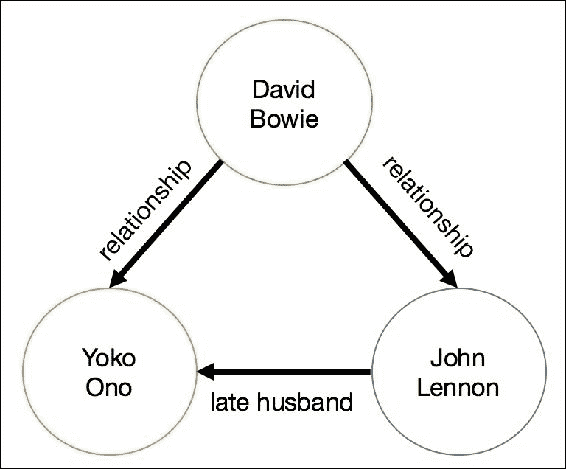
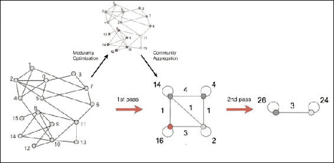
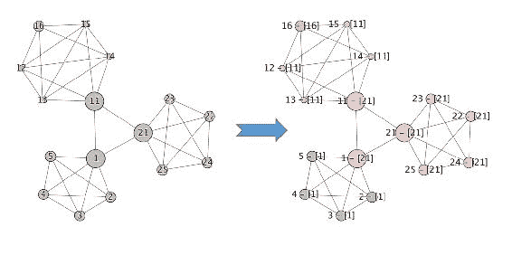
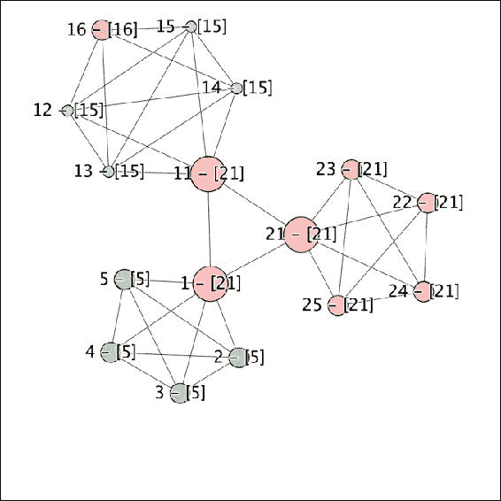
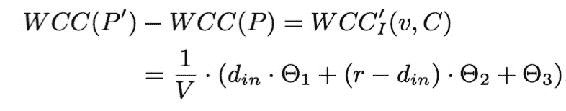
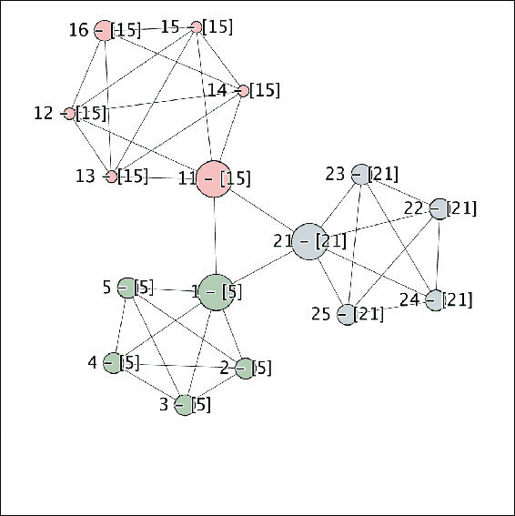
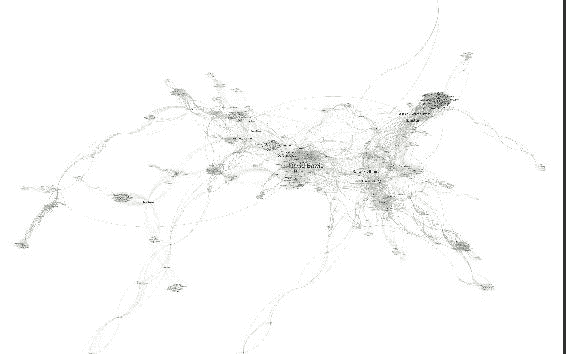
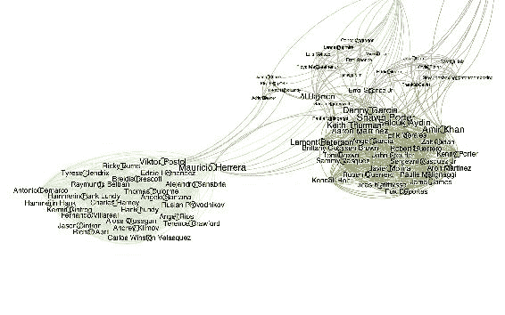

# 第七章。建设社区

随着越来越多的人在一起互动和交流，交换信息，或者只是分享对不同主题的共同兴趣，大多数数据科学用例都可以使用图形表示来解决。尽管很长一段时间以来，非常大的图只被互联网巨头、政府和国家安全机构使用，但使用包含数百万个顶点的大型图变得越来越普遍。因此，数据科学家面临的主要挑战不一定是检测社区并在图上找到影响者，而是以完全分布式和高效的方式这样做，以克服规模的限制。本章通过构建一个图表示例，使用我们使用[第 6 章](06.html "Chapter 6. Scraping Link-Based External Data")、*中描述的自然语言处理提取识别出的人员，按比例抓取基于链接的外部数据*。

在本章中，我们将涵盖以下主题:

*   使用 Spark 从 Elasticsearch 中提取内容，构建个人实体的图表，并了解使用 Accumulo 作为安全图表数据库的好处
*   使用 *GraphX* 和三角形优化编写一个从 A 到 Z 的社区检测算法
*   利用 Accumulo 特定的特性，包括观察社区变化的单元级安全性，以及提供服务器端和客户端计算的迭代器

这一章技术性很强，我们希望读者已经熟悉了图论、消息传递和 *Pregel* API。我们还邀请读者阅读本章中提到的每一份白皮书。

# 构建人物图表

我们以前使用自然语言处理实体识别从一个 HTML 原始文本格式识别人。在本章中，我们通过尝试推断这些实体之间的关系并检测它们周围可能的社区来进入一个较低的层次。

## 联系链接

在新闻文章的语境中，我们首先需要问自己一个根本性的问题。什么定义了两个实体之间的关系？最优雅的答案可能是使用第 6 章、*中描述的斯坦福自然语言处理库来研究单词。给出以下输入句子，摘自[http://www . ibtimes . co . uk/David-Bowie-Yoko-Ono-says-starmans-death-has-left-big-empty-space-1545160](http://www.ibtimes.co.uk/david-bowie-yoko-ono-says-starmans-death-has-left-big-empty-space-1545160):*

> *“小野洋子说她和已故丈夫约翰·列侬与大卫·鲍依有着密切的关系”*

我们可以很容易地提取出句法树，这是一种语言学家用来模拟句子是如何语法构建的结构，其中每个元素都以其类型报告，如名词(`NN`)、动词(`VR`)或限定词(`DT`)及其在句子中的相对位置:

```scala
val processor = new CoreNLPProcessor()
val document = processor.annotate(text)

document.sentences foreach { sentence =>
  println(sentence.syntacticTree.get)
}

/*
(NNP Yoko)
(NNP Ono)
(VBD said)
        (PRP she)
      (CC and)
        (JJ late)
        (NN husband)
          (NNP John)
          (NNP Lennon)
      (VBD shared)
        (DT a)
        (JJ close)
        (NN relationship)
        (IN with)
          (NNP David)
          (NNP Bowie)
*/
```

对每个元素、它的类型、它的前身和后继者的彻底研究将有助于建立一个有向图，其中边是所有这三个实体之间存在的关系的真正定义。根据这句话构建的图表示例如下:



图 1:大卫·鲍依、小野洋子和约翰·列侬的句法图

虽然从语法上讲，这是完全有意义的，但是从句法树中构建一个图需要过多的编码，可能需要一整章的时间，并且不会带来太多的附加值，因为我们构建的大多数关系(在新闻文章的上下文中)不是基于从历史书上获取的真实事实，而是需要放在它们的上下文中。为了说明这一点，我们有两句话摘自[:](http://www.digitalspy.com/music/news/a779577/paul-mccartney-pays-tribute-to-great-star-david-bowie-his-star-will-shine-in-the-sky-forever/)

> *“保罗·麦卡特尼爵士形容(大卫·鲍依)是一位伟大的明星”*

> “[保罗·麦卡特尼爵士]珍惜他们在一起的时光”

这将在顶点[保罗·麦卡特尼]和[大卫·鲍依]之间建立相同的语法联系，而只有后者假设它们之间有物理联系(他们实际上一起度过了时间)。

相反，我们使用一种更快的方法，根据名称在文本中的位置对名称进行分组。我们天真的假设是，大多数作者通常首先提到重要人物的名字，然后写次要人物，最后写不太重要的人。因此，我们的联系链是一个简单的嵌套循环，跨越给定文章中的所有名称，使用名称的实际位置从最重要的到最不重要的进行排序。由于其相对的时间复杂性 *O(n <sup class="calibre78">2</sup> )* 这种方法将只对每篇文章的数百条记录有效，并且对于提到几十万个不同实体的文本来说肯定是一个限制因素。

```scala
def buildTuples(p: Array[String]): Array[(String, String)] = {
    for(i <- 0 to p.length - 2; j <- i + 1 to p.length - 1) yield {
      (p(i), p(j))
    }
  }
```

在我们的代码库中，您将看到一个替代方案:`Combinations`，这是一个更通用的解决方案，允许指定一个变量`r`；这允许我们指定需要出现在每个输出组合中的实体数量，也就是说，本章 2 个，但在其他上下文中更多。使用`Combinations.buildTuples`在功能上等同于前面给出的`buildTuples`代码。

## 从弹性搜索中提取数据

Elasticsearch 是一个完美的工具，用于存储和索引文本内容及其元数据属性，因此是我们在线数据存储使用上一章提取的文本内容的合理选择。由于这一部分更加面向批处理，我们使用优秀的 Spark Elasticsearch API 将数据从 Elasticsearch 获取到我们的 Spark 集群中，如以下代码所示:

```scala
<dependency>
  <groupId>org.elasticsearch</groupId>
  <artifactId>elasticsearch-spark_2.11</artifactId>
  <version>2.4.0<version>
</dependency>
```

给定一个索引类型和名称，与弹性搜索应用编程接口交互的一个方便方法是使用Spark数据框。在大多数用例中足够高效(下面显示了一个简单的例子)，当处理更复杂和嵌套的模式时，这可能会成为一个挑战:

```scala
val spark = SparkSession
  .builder()
  .config("es.nodes", "localhost")
  .config("es.port", "9200")
  .appName("communities-es-download")
  .getOrCreate()

spark
  .read
  .format("org.elasticsearch.spark.sql")
  .load("gzet/news")
  .select("title", "url")
  .show(5)

+--------------------+--------------------+
|               title|                 url|
+--------------------+--------------------+
|Sonia Meets Mehbo...|http://www.newind...|
|"A Job Well Done ...|http://daphneanso...|
|New reading progr...|http://www.mailtr...|
|Barrie fire servi...|http://www.simcoe...|
|Paris police stat...|http://www.dailym...|
+--------------------+--------------------+
```

事实上，弹性搜索应用编程接口不够灵活，无法读取嵌套结构和复杂数组。使用最新版本的 Spark，会很快遇到错误，例如*“字段‘人员’由数组支持，但是相关的 Spark 模式没有反映这一点”*。通过一些实验，我们可以看到，使用一组标准的 JSON 解析器(如下面代码中的`json4s`)从 Elasticsearch 访问嵌套的复杂结构通常要容易得多:

```scala
<dependency>
  <groupId>org.json4s</groupId>
  <artifactId>json4s-native_2.11</artifactId>
  <version>3.2.11</version>
</dependency>
```

我们使用来自Spark上下文的隐式`esJsonRdd`函数查询弹性搜索:

```scala
import org.elasticsearch.spark._
import org.json4s.native.JsonMethods._
import org.json4s.DefaultFormats

def readFromES(query: String = "?q=*"): RDD[Array[String]] = {

  sc.esJsonRDD("gzet/news", query)
    .values
    . map {
      jsonStr =>
        implicit val format = DefaultFormats
        val json = parse(jsonStr)
        (json \ "persons").extract[Array[String]]
    }

}

readFromEs("?persons='david bowie'")
   .map(_.mkString(","))
   .take(3)
   .foreach(println)

/*
david bowie,yoko ono,john lennon,paul mc cartney
duncan jones,david bowie,tony visconti
david bowie,boris johnson,david cameron
*/
```

使用`query`参数，我们可以访问来自 Elasticsearch 的所有数据，它的一个示例，甚至是匹配特定查询的所有记录。我们最终可以使用前面解释的简单联系链方法来构建元组列表。

```scala
val personRdd = readFromES()
val tupleRdd = personRdd flatMap buildTuples
```

# 使用累积数据库

我们已经看到了一种从弹性搜索中读取我们的`personRdd`对象的方法，这为我们的存储需求形成了一个简单而整洁的解决方案。但是，在编写商业应用时，我们必须时刻注意安全性，在编写时，Elasticsearch 安全性仍在开发中；因此，在这个阶段引入具有本地安全性的存储机制将是有用的。这是我们使用 GDELT 数据时需要考虑的一个重要问题，当然，根据定义，GDELT 数据是开源的。在商业环境中，数据集在某种程度上是机密的或商业敏感的是非常常见的，客户通常会在讨论数据科学方面本身之前很久就要求提供如何保护其数据的详细信息。作者的经验是，由于解决方案提供商无法展示强大和安全的数据架构，许多商业机会都丧失了。

**Accumulo**([http://accumulo.apache.org](http://accumulo.apache.org))是基于谷歌 Bigtable 设计([http://research.google.com/archive/bigtable.html](http://research.google.com/archive/bigtable.html))的 NoSQL 数据库，最初由美国国家安全局开发，随后于 2011 年发布给 Apache 社区。Accumulo 为我们提供了通常的大数据优势，如大容量加载和并行读取，但也有一些额外的功能，如迭代器，用于高效的服务器和客户端预计算、数据聚合，以及最重要的单元级安全性。

对于我们在社区检测方面的工作，我们将使用 Accumulo 来特别利用它的迭代器和单元级安全特性。首先，我们应该建立一个 Accumulo 实例，然后将一些数据从 Elasticsearch 加载到 Accumulo，您可以在我们的 GitHub 存储库中找到完整的代码。

## 设置累计

安装 Accumulo 所需的步骤不在本书的讨论范围内；网上有几个教程。本章只需要一个普通的根用户安装，尽管我们需要特别注意 Accumulo 配置中的初始安全设置。一旦成功运行了 Accumulo shell，就可以继续了。

使用以下代码作为创建用户的指南。目的是创建几个具有不同安全标签的用户，这样当我们加载数据时，用户将有不同的访问权限。

```scala
# set up some users
createuser matt
createuser ant
createuser dave
createuser andy

# create the persons table
createtable persons

# switch to the persons table
table persons

# ensure all of the users can access the table
grant -s System.READ_TABLE -u matt
grant -s System.READ_TABLE -u ant
grant -s System.READ_TABLE -u dave
grant -s System.READ_TABLE -u andy

# allocate security labels to the users
addauths -s unclassified,secret,topsecret -u matt
addauths -s unclassified,secret -u ant
addauths -s unclassified,topsecret -u dave
addauths -s unclassified -u andy

# display user auths
getauths -u matt

# create a server side iterator to sum values
setiter -t persons -p 10 -scan -minc -majc -n sumCombiner -class
org.apache.accumulo.core.iterators.user.SummingCombiner

# list iterators in use
listiter –all

# once the table contains some records ...
user matt

# we'll see all of the records that match security labels for the user
scan
```

## 小区安全

Accumulo 使用令牌保护其细胞。代币由标签组成；在我们的例子中，它们是[ `unclassified` ]、[ `secret` ]和[ `topsecret` ]，但是您可以使用任何逗号分隔的值。累积行用`visibility`字段(参考下面的代码)写入，该字段只是访问行值所需标签的字符串表示。`visibility`字段可以包含布尔逻辑来组合不同的标签，并允许基本的优先级，例如:

```scala
secret&topsecret (secret AND topsecret)
secret|topsecret (secret OR topsecret)
unclassified&(secret|topsecret) (unclassified AND secret, or unclassified AND topsecret)
```

用户必须至少匹配`visibility`字段才能被授予访问权限，并且必须提供存储在 Accumulo 中的令牌子集的标签(否则查询将被拒绝)。任何不匹配的值都不会在用户查询中返回，这是很重要的一点，因为如果有某种迹象向用户表明数据丢失，用户通常可以得出关于数据性质的逻辑、正确(或者更糟糕的是，不正确)的结论，例如，在联系人链中，如果一些顶点对用户可用，而另一些顶点不可用，但是不可用的顶点被这样标记，则用户可能能够基于周围的图来确定关于那些丢失的实体的信息。例如，调查有组织犯罪的政府机构可能允许高级员工查看整个图表，但初级员工只能查看其中的一部分。假设图中显示了一些知名人士，并且某个顶点有一个空白条目，那么就可以直接确定缺失的实体是谁；如果这个占位符完全不存在，那么就没有明显的迹象表明这个链条会进一步延伸，从而允许机构控制信息的传播。然而，该图仍然对分析师有用，他们不会注意到该链接，可以继续研究该图的特定区域。

## 迭代器

迭代器是 Accumulo 中一个非常重要的特性，它提供了一个实时处理框架，该框架利用了 Accumulo 的能力和并行性，以非常低的延迟产生数据的修改版本。我们在这里不详细讨论，因为 Accumulo 文档有很多例子，但是我们将使用迭代器来保存同一个 Accumulo 行的值的总和，也就是我们看到同一对人的次数；这将被存储在行值中。每当扫描表时，这个迭代器就会生效；我们还将演示如何从客户端调用同一个迭代器(当它还没有应用到服务器时使用)。

## 弹性搜索以积累

让我们利用 Spark 使用 Hadoop 输入和输出格式的能力，它利用了本机弹性搜索和累积库。值得注意的是，我们在这里可以采取不同的路线，第一种是使用前面给出的 Elasticsearch 代码来产生一个字符串元组数组，并将其馈入`AccumuloLoader`(在代码库中找到)；二是探索使用额外 Hadoop `InputFormat`的替代方案；我们可以生成使用`EsInputFormat`从 Elasticsearch 读取并使用`AccumuloOutputFormat`类写入 Accumulo 的代码。

### 阿库鲁的图形数据模型

在深入研究代码之前，值得描述一下我们将用来在 Accumulo 中存储人员图表的模式。每个源节点(`person A`)将被存储为行关键字，关联名称(如“也称为”)将被存储为列族，目标节点(`person B`)将被存储为列限定符，默认值`1`将被存储为列值(这将通过我们的迭代器进行聚合)。这在图 2 中报告:


图 2:累积的图形数据模型

这种模型的主要优点是，给定一个输入顶点(一个人的名字)，可以通过一个简单的 GET 查询快速访问其所有已知的关系。读者肯定会理解单元级安全性，在这种安全性中，我们对大多数未经[ `SECRET` ]授权的累积用户隐藏特定的边缘三元组`[personA] <= [relationB] => [personD]`。

这种模型的缺点是，与图形数据库(如 Neo4J 或 OrientDB)相比，遍历查询(如深度优先搜索)效率非常低(我们需要多个递归查询)。在本章的后面，我们将任何图形处理逻辑委托给 GraphX。

### Hadoop 输入输出格式

我们使用以下 maven 依赖项来构建我们的输入/输出格式和我们的 Spark 客户端。版本显然取决于安装的 Hadoop 和 Accumulo 的分布。

```scala
<dependency>
  <groupId>org.apache.accumulo</groupId>
  <artifactId>accumulo-core</artifactId>
  <version>1.7.0<version>
</dependency>
```

我们通过`ESInputFormat`类配置从弹性搜索中读取。我们提取了一对键值对`Text`和`MapWritable`RDD，其中键包含文档标识和封装在可序列化哈希表中的所有 JSON 文档的值:

```scala
val spark = SparkSession
  .builder()
  .appName("communities-loader")
  .getOrCreate()

val sc = spark.sparkContext
val hdpConf = sc.hadoopConfiguration

// set the ES entry points
hdpConf.set("es.nodes", "localhost:9200")
hdpConf.set("es.resource", "gzet/articles")

// Read map writable objects
import org.apache.hadoop.io.Text
import org.apache.hadoop.io.MapWritable
import org.elasticsearch.hadoop.mr.EsInputFormat

val esRDD: RDD[MapWritable] = sc.newAPIHadoopRDD(
  hdpConf,
  classOf[EsInputFormat[Text, MapWritable]],
  classOf[Text],
  classOf[MapWritable]
).values
```

一个 Accumulo `mutation`类似于 HBase 中的一个`put`对象，包含表的坐标，如行键、列族、列限定符、列值和可见性。该对象的构建如下:

```scala
def buildMutations(value: MapWritable) = {

  // Extract list of persons
  val people = value
    .get("person")
    .asInstanceOf[ArrayWritable]
    .get()
    .map(_.asInstanceOf[Text])
    .map(_.toString)

  // Use a default Visibility
  val visibility = new ColumnVisibility("unclassified")

  // Build mutation on tuples
  buildTuples(people.toArray)
    .map {
      case (src, dst) =>
        val mutation = new Mutation(src)
        mutation.put("associated", dst, visibility, "1")
        (new Text(accumuloTable), mutation)
    }
```

我们使用前面提到的`buildTuples`方法来计算我们的人对，并使用 Hadoop `AccumuloOutputFormat`将它们写入 Accumulo。请注意，我们可以选择使用`ColumnVisibility`将安全标签应用于我们的每个输出行；参考我们之前看到的*细胞安全*。

我们配置为向 Accumulo 写入。我们的输出 RDD 将是一个键-值对 RDD`Text`和`Mutation`，其中键包含累积表和突变要插入的值:

```scala
// Build Mutations
val accumuloRDD = esRDD flatMap buildMutations

// Save Mutations to Accumulo
accumuloRDD.saveAsNewAPIHadoopFile(
  "",
  classOf[Text],
  classOf[Mutation],
  classOf[AccumuloOutputFormat]
)
```

## 从伏隔核读取

现在我们已经在 Accumulo 中有了数据，我们可以使用 shell 来检查它(假设我们选择了一个有足够权限查看数据的用户)。使用 Accumulo shell 中的`scan`命令，我们可以模拟一个特定的用户并进行查询，从而验证`io.gzet.community.accumulo.AccumuloReader`的结果。当使用 Scala 版本时，我们必须确保使用了正确的授权——它是通过`String`传递到读取函数的，例如`"secret,topsecret"`:

```scala
def read(
  sc: SparkContext,
  accumuloTable: String,
  authorization: Option[String] = None
)
```

这种应用 Hadoop 输入/输出格式的方法利用了 Java Accumulo 库中的`static`方法(`AbstractInputFormat`由`InputFormatBase`子类化，而`AccumuloInputFormat`子类化)。Spark 用户必须特别注意这些通过一个`Job`对象的实例改变 Hadoop 配置的实用方法。这可以设置如下:

```scala
val hdpConf = sc.hadoopConfiguration
val job = Job.getInstance(hdpConf)

val clientConfig = new ClientConfiguration()
  .withInstance(accumuloInstance)
  .withZkHosts(zookeeperHosts)

AbstractInputFormat.setConnectorInfo(
  job,
  accumuloUser,
  new PasswordToken(accumuloPassword)
)

AbstractInputFormat.setZooKeeperInstance(
  job,
  clientConfig
)

if(authorization.isDefined) {
  AbstractInputFormat.setScanAuthorizations(
    job,
    new Authorizations(authorization.get)
  )
}

InputFormatBase.addIterator(job, is)
InputFormatBase.setInputTableName(job, accumuloTable)
```

您还会注意到累积迭代器的配置:

```scala
val is = new IteratorSetting(
  1,
  "summingCombiner",
  "org.apache.accumulo.core.iterators.user.SummingCombiner"
)

is.addOption("all", "")
is.addOption("columns", "associated")
is.addOption("lossy", "TRUE")
is.addOption("type", "STRING")
```

我们可以使用客户端或服务器端迭代器，我们之前已经看到过通过 shell 配置 Accumulo 时服务器端的例子。主要区别在于客户端迭代器是在客户端 JVM 中执行的，而服务器端迭代器利用了 Accumulo 平板服务器的能力。完整的解释可以在 Accumulo 文档中找到。然而，选择客户端或服务器端迭代器有很多原因，包括平板电脑服务器性能是否应该受到影响、JVM 内存使用等选择。这些决定应该在创建您的积累架构时做出。在我们的`AccumuloReader`代码末尾，我们可以看到产生`EdgeWritable`RDD 的调用函数:

```scala
val edgeWritableRdd: RDD[EdgeWritable] = sc.newAPIHadoopRDD(
  job.getConfiguration,
  classOf[AccumuloGraphxInputFormat],
  classOf[NullWritable],
  classOf[EdgeWritable]
) values
```

## 累积图形输入格式和边缘可写

我们已经实现了自己的 accumula`InputFormat`，使我们能够读取 accumula 行并自动输出自己的 Hadoop`Writable`；`EdgeWritable`。这提供了一个方便的包装器来保存我们的源顶点、目标顶点和作为边权重的计数，然后可以在构建图时使用。这非常有用，因为 Accumulo 使用前面讨论的迭代器来计算每个唯一行的总计数，从而消除了手动计算的需要。由于 Accumulo 是用 Java 编写的，我们的`InputFormat`使用 Java 扩展`InputFormatBase`，从而继承了所有的 Accumulo `InputFormat`默认行为，但是输出了我们选择的模式。

我们只对输出`EdgeWritables`感兴趣；因此，我们将所有的键设置为空(`NullWritable`)并将值设置为`EdgeWritable`，另外一个优点是 Hadoop 中的值只需要从`Writable`接口继承(尽管为了完整性，我们已经继承了`WritableComparable`，因此`EdgeWritable`可以用作键，如果需要的话)。

## 构建图表

因为 GraphX 使用长对象作为存储顶点和边的底层类型，所以我们首先需要将从 Accumulo 获取的所有人转换成一组唯一的标识。我们假设我们的唯一人员列表不适合内存，或者这样做效率不高，因此我们只需使用`zipWithIndex`函数构建一个分布式字典，如以下代码所示:

```scala
val dictionary = edgeWritableRdd
  .flatMap {
    edge =>
      List(edge.getSourceVertex, edge.getDestVertex)
  }
  .distinct()
  .zipWithIndex()
  .mapValues {
    index =>
      index + 1L
  }
}

dictionary.cache()
dictionary.count()

dictionary
  .take(3)
  .foreach(println)

/*
(david bowie, 1L)
(yoko ono, 2L)
(john lennon, 3L)
*/
```

我们使用对我们的人元组的两个连续连接操作来创建一个边缘 RDD，并且最终构建我们的加权和有向的人图，其顶点包含人的名字，并且边缘属性每个元组的频率计数。

```scala
val vertices = dictionary.map(_.swap)

val edges = edgeWritableRdd
  .map {
    edge =>
      (edge.getSourceVertex, edge)
  }
  .join(dictionary)
  .map {
    case (from, (edge, fromId)) =>
      (edge.getDestVertex, (fromId, edge))
  }
  .join(dictionary)
  .map {
    case (to, ((fromId, edge), toId)) =>
      Edge(fromId, toId, edge.getCount.toLong)
  }

val personGraph = Graph.apply(vertices, edges)

personGraph.cache()
personGraph.vertices.count()

personGraph
  .triplets
  .take(2)
  .foreach(println)

/*
((david bowie,1),(yoko ono,2),1)
((david bowie,1),(john lennon,3),1)
((yoko ono,2),(john lennon,3),1)
*/
```

# 社区检测算法

在过去的几十年里，社区检测已经成为一个热门的研究领域。可悲的是，它没有真正的数据科学家生活的数字世界移动得快，每秒钟收集的数据越来越多。因此，大多数建议的解决方案根本不适合大数据环境。

尽管许多算法都提出了一种新的可扩展的社区检测方法，但实际上没有一种算法在分布式算法和并行计算的意义上是可扩展的。

## 卢万算法

Louvain 算法可能是无向加权图上检测社区最流行和最广泛使用的算法。

### 注

关于 Louvain 算法的更多信息，请参考出版物:*大型网络中社区的快速展开。文森特·布隆德尔、让-卢普·纪尧姆、雷诺·兰比约特、艾蒂安·列斐伏尔。2008*

这个想法是从每个顶点作为自己社区的中心开始。在每一步，我们寻找社区邻居，并检查将两个社区合并在一起是否会带来模块化价值的任何收益。通过每个顶点，我们压缩图，使得作为同一社区一部分的所有节点成为唯一的社区顶点，所有社区内部边成为具有聚合权重的自边。我们重复这个过程，直到模块性不能再被优化。过程报告如下*图 3* :



图 3:大型网络中社区的快速发展——文森特·布隆德尔、让-卢普·纪尧姆、雷诺·兰比约特、艾蒂安·勒菲弗尔，2008 年

因为模块化会在一个顶点发生变化的任何时候进行更新，并且因为每个顶点的变化都会被全局模块化更新所驱动，所以顶点需要以串行的顺序进行处理；使得模块化优化成为并行计算本质的分界点。最近的研究报告说，结果的质量可能会随着图的大小过度增加而下降，因此模块化无法检测到小的和定义明确的社区。

据我们所知，公开可用的 Louvain 的唯一分布式版本是由国家安全技术供应商 Sotera 创建的([https://github . com/Sotera/distributed-graph-analytics/tree/master/DGA-graph x](https://github.com/Sotera/distributed-graph-analytics/tree/master/dga-graphx))。对于 MapReduce、Giraph 或 GraphX 上的不同实现，他们的想法是同时进行顶点选择，并在每次更改后更新图形状态。由于并行的性质，一些顶点选择将是不正确的，因为它们可能不会最大化全局模块化，但最终会在重复迭代后变得越来越一致。

这个(潜在的)稍微不太准确，但绝对高度可扩展的算法值得研究，但是因为社区检测问题没有正确或错误的解决方案，并且因为每个数据科学用例不同，我们决定构建我们自己的不同算法的分布式版本，而不是描述一个现有的。为了方便起见，我们重新打包了 Louvain 的这个分布式版本，并在我们的 GitHub 存储库中提供了它。

## 加权社区聚类(WCC)

通过搜索一些关于图形算法的文档资料，我们看到了一份精彩的白皮书，其中提到了可伸缩性和并行计算。我们邀请读者先阅读本文，然后再继续实施。

### 注

有关 WCC 算法的更多信息，请参考出版物: *A. Prat-Perez，D. Dominguez-Sal 和 j-l . Larriba-Pey，“大型真实图的高质量、可扩展和并行社区检测”，载于《第 23 届国际万维网会议论文集》，ser。WWW '14。美国纽约州纽约市:ACM，2014，第 225-236 页*

虽然找不到实现，并且作者对他们所使用的技术不太了解，但是我们对用作图划分度量的启发式方法特别感兴趣，因为检测可以并行进行，而不必重新计算全局度量，例如图模块化。

### 描述

同样有趣的是，他们从现实生活的社交网络中得到启发，使用假设作为检测社区的质量标准。因为社区是紧密连接在一起并与图的其余部分松散连接的顶点组，所以每个社区中应该有高度集中的闭合三角形。换句话说，构成社区一部分的顶点在自己的社区中闭合的三角形应该比在外部闭合的三角形多得多:


根据前面的等式，当 **x** 在社区内闭合的三角形比在社区外闭合的三角形多(社区将被很好地定义)和/或当它没有闭合任何三角形的邻居数量最小时(所有节点都是互连的)，社区 **C** 中给定顶点 **x** 的聚类系数(WCC)将被最大化。如下式所示，社区 **S** 的 **WCC** 将是其每个顶点的平均值 **WCC** :


同样，图分区 **P** 的 **WCC** 将是每个社区的 WCC 的加权平均值:


该算法由三个不同的阶段组成，下面解释。创建初始社区集的预处理步骤，确保初始社区一致的社区反向传播，最后是优化全局聚类系数值的迭代算法。

### 预处理阶段

第一步是定义一个图结构，其中的顶点包含我们在本地计算 WCC 度量所需的所有变量，包括一个顶点所属的当前社区、每个顶点在其社区内外闭合的三角形数量、与其共享三角形的节点数量以及当前的 WCC 度量。所有这些变量将被包装成一个`VState`类:

```scala
class VState extends Serializable {
  var vId = -1L
  var cId = -1L
  var changed = false
  var txV = 0
  var txC = 0
  var vtxV = 0
  var vtxV_C = 0
  var wcc = 0.0d
}
```

为了计算初始 WCC，我们首先需要计算任意顶点在其邻域内闭合的三角形数量。计算三角形的数量通常包括聚合每个顶点的邻居标识，将该列表发送给其每个邻居，并在顶点邻居和顶点邻居的邻居中搜索公共标识。给定两个相连的顶点 A 和 B，A 和 B 各自的邻居列表之间的交集是顶点 A 与 B 闭合的三角形数量，A 中的聚合返回顶点 A 在整个图中闭合的三角形总数。

在具有高度连接的顶点的大型网络中，向每个邻居发送相邻顶点的列表可能非常耗时，并且需要大量网络资源。在 GraphX 中，`triangleCount`函数已经过优化，因此对于每条边，只有最不重要的顶点(以度为单位)会将其列表发送给其相邻节点，从而最小化相关成本。这种优化要求图形是规范的(源标识低于目标标识)和分区的。使用我们的人员图表，这可以按如下方式完成:

```scala
val cEdges: RDD[Edge[ED]] = graph.edges
  .map { e =>
    if(e.srcId > e.dstId) {
      Edge(e.dstId, e.srcId, e.attr)
    } else e
  }

val canonicalGraph = Graph
  .apply(graph.vertices, cEdges)
  .partitionBy(PartitionStrategy.EdgePartition2D)

canonicalGraph.cache()
canonicalGraph.vertices.count()
```

WCC 优化的一个先决条件是移除不属于任何三角形的边，因为它们对社区没有贡献。因此，我们需要计算三角形的数量、每个顶点的度数、邻居的 id，最后我们移除邻居 id 的交集为空的边。可以使用`subGraph`方法过滤掉这些边，该方法将边的三元组的`filter`函数和顶点的`filter`函数作为输入参数:

```scala
val triGraph = graph.triangleCount()
val neighborRdd = graph.collectNeighborIds(EdgeDirection.Either)

val subGraph = triGraph.outerJoinVertices(neighborRdd)({ (vId, triangle, neighbors) =>
  (triangle, neighbors.getOrElse(Array()))
}).subgraph((t: EdgeTriplet[(Int, Array[Long]), ED]) => {
  t.srcAttr._2.intersect(t.dstAttr._2).nonEmpty
}, (vId: VertexId, vStats: (Int, Array[Long])) => {
  vStats._1 > 0
})
```

因为我们去掉了没有闭合任何三角形的所有边，每个顶点的度数就变成了给定顶点闭合三角形的不同顶点的数量。最后，我们创建如下初始`VState`图，其中每个顶点成为其自己社区的中心节点:

```scala
val initGraph: Graph[VState, ED] = subGraph.outerJoinVertices(subGraph.degrees)((vId, vStat, degrees) => {
  val state = new VState()
  state.vId = vId
  state.cId = vId
  state.changed = true
  state.txV = vStat._1
  state.vtxV = degrees.getOrElse(0)
  state.wcc = degrees.getOrElse(0).toDouble / vStat._1 
  state
})

initGraph.cache()
initGraph.vertices.count()

canonicalGraph.unpersist(blocking = false)
```

### 初始群落

这个阶段的第二步是使用这些初始 WCC 值初始化社区。当且仅当满足以下三个要求时，我们将初始社区集定义为一致的:

*   任何社区都必须包含单个中心节点和边界节点，并且所有边界顶点都必须连接到社区中心
*   任何社区中心必须在其社区中具有最高的聚类系数
*   连接到两个不同中心(因此根据规则 1 是两个不同的社区)的边界顶点必须是其中心具有最高聚类系数的社区的一部分

#### 消息传递

为了定义我们的初始社区，每个顶点都需要向它的邻居发送信息，包括它的 ID、它的聚类系数、它的度以及它所属的当前社区。为了方便起见，我们将主顶点属性`VState`类作为消息发送，因为它已经包含了所有这些信息。顶点将从其邻域接收这些消息，将选择具有最高 WCC 分数(在我们的`getBestCid`方法内)、最高学位、最高 ID 的最佳消息，并将相应地更新其社区。

这种跨顶点的通信是`aggregateMessages`函数的完美用例，相当于 GraphX 中的 map-reduce 范例。这个函数需要实现两个函数，一个从一个顶点向其相邻节点发送消息，另一个在顶点级别聚合多个消息。这个过程叫做*消息传递*，描述如下:

```scala
def getBestCid(v: VState, msgs: Array[VState]): VertexId = {

  val candidates = msgs filter {

    msg =>
      msg.wcc > v.wcc ||
      (msg.wcc == v.wcc && msg.vtxV > v.vtxV) ||
      (msg.wcc == v.wcc && msg.vtxV > v.vtxV && msg.cId > v.cId)
    }

  if(candidates.isEmpty) {

    v.cId

  } else {

    candidates
     .sortBy {
       msg =>
         (msg.wcc, msg.vtxV, msg.cId)
      }
      .last
      .cId
  }

}

def sendMsg = (ctx: EdgeContext[VState, ED, Array[VState]]) => {

  ctx.sendToDst(
    Array(ctx.srcAttr)
  )

  ctx.sendToSrc(
    Array(ctx.dstAttr)
  )
}

def mergeMsg = (m1: Array[VState], m2: Array[VState]) => {
  m1 ++ m2
}

def msgs = subGraph.aggregateMessages(sendMsg, mergeMsg)

val initCIdGraph = subGraph.outerJoinVertices(msgs)((vId, vData, msgs) => {
  val newCId = getBestCid(vData, msgs.getOrElse(Array()))
  vData.cId = newCId
  vData
})

initCIdGraph.cache()
initCIdGraph.vertices.count()
initGraph.unpersist(blocking = false)
```

在*图 4* 中报告了该社区初始化过程的一个示例。左图的节点按比例调整大小以反映其真实的 WCC 系数，已经用四个不同的社区进行了初始化: **1** 、 **11** 、 **16** 和 **21** 。



图 4: WCC 社区初始化

尽管人们肯定会意识到单个`aggregateMessages`函数返回相对一致的社区，但这种初始划分违反了我们前面定义的第三条规则。部分顶点(如 **2** 、 **3** 、 **4** 、 **5** )属于中心不是中心节点的社区(顶点 **1** 属于社区 **21** )。社区 **11** 也注意到了同样的问题。

#### 群落回繁

为了解决这种不一致并遵守我们的第三个要求，任何顶点 *x* 必须将其更新的社区广播给所有具有较低系数的邻居，因为根据我们的第二个规则，只有这些排名较低的顶点可能成为 *x* 的边界节点。任何进一步的更新都将导致一条新消息被传递给较低等级的顶点，以此类推，直到没有顶点改变社区，此时我们的第三个规则将得到满足。

由于迭代之间不需要图的全局知识(例如计算全局 WCC 值)，因此可以使用 GraphX 的 Pregel API 广泛地并行化社区更新。Pregel 最初是在谷歌开发的，它允许顶点从以前的迭代中接收消息，向它们的邻居发送新消息，并修改它们自己的状态，直到没有进一步的消息可以发送。

### 注

有关 *Pregel* 算法的更多信息，请参考出版物: *G. Malewicz，M. H. Austern，A. J. Bik，J. C. Dehnert，I. Horn，N. Leiser 和 G. Czajkowski，“Pregel:大规模图形处理系统”，载于 2010 年 ACM SIGMOD 国际数据管理会议论文集，ser。SIGMOD '10。美国纽约:美国计算机学会，2010 年，第 135-146 页。[在线]。可用:[http://doi.acm.org/10.1145/1807167.1807184](http://doi.acm.org/10.1145/1807167.1807184)T5】*

类似于前面提到的`aggregateMessages`函数，我们将顶点属性`VState`作为跨顶点的消息发送，作为 Pregel 超级步骤的初始消息，使用默认值初始化一个新对象(WCC 为 0)。

```scala
val initialMsg = new VState() 

```

当在顶点级收到多条消息时，我们只保留聚类系数最高的一条，给定相同的系数，保留度最高的一条(然后是 ID 最高的一条)。为此，我们在`VState`上创建了一个隐式排序:

```scala
implicit val VSOrdering: Ordering[VState] = Ordering.by({ state =>
  (state.wcc, state.vtxV, state.vId)
})

def compareState(c1: VState, c2: VState) = {
  List(c1, c2).sorted(VStateOrdering.reverse)
}

val mergeMsg = (c1: VState, c2: VState) => {
  compareState(c1, c2).head
}
```

遵循与递归算法相同的原则，我们需要正确定义 breaking 子句，此时 Pregel 应该停止发送和处理消息。这将在 send 函数中完成，该函数将一个边缘三元组作为输入，并返回一个消息迭代器。当且仅当一个顶点的社区在上一次迭代中发生变化时，该顶点才会发送其`VState`属性。在这种情况下，顶点将通知其排名较低的邻居它的社区更新，但也将向它自己发送一个信号来确认这个成功的广播。后者是我们的中断条款，因为它确保不会从该给定节点发送更多消息(除非其社区在后续步骤中得到更新):

```scala
def sendMsg = (t: EdgeTriplet[VState, ED]) => {

  val messages = mutable.Map[Long, VState]()
  val sorted = compareState(t.srcAttr, t.dstAttr)
  val (fromNode, toNode) = (sorted.head, sorted.last)
  if (fromNode.changed) {
    messages.put(fromNode.vId, fromNode)
    messages.put(toNode.vId, fromNode)
  }

  messages.toIterator

}
```

最后要实现的功能是 Pregel 算法的核心功能。在这里，我们定义了要在顶点级别应用的逻辑，给出了我们从`mergeMsg`函数中选择的唯一消息。我们确定了消息的四种不同可能性，每种可能性都用应用于顶点状态的逻辑来定义。

1.  如果消息是从 Pregel 发送的初始消息(顶点 ID 未设置，WCC 为空)，我们不会更新顶点社区 ID。
2.  如果消息来自顶点本身，这是来自`sendMsg`功能的确认，我们将顶点状态设置为静默。
3.  如果消息(具有更高的 WCC)来自社区的中心节点，我们将顶点属性更新为这个新社区的边界节点。
4.  如果消息(具有较高的 WCC)来自社区的边界节点，则该顶点成为其自己社区的中心，并将进一步向其排名较低的网络广播该更新。

```scala
def vprog = (vId: VertexId, state: VState, message: VState) => {

  if (message.vId >= 0L) {

    // message comes from myself
    // I stop spamming people
    if (message.vId == vId) {
      state.changed = false
    }

    // Sender is a center of its own community
    // I become a border node of its community
    if (message.cId == message.vId) {
      state.changed = false
      state.cId = message.cId
    }

    // Sender is a border node of a foreign community
    // I become a center of my own community
    // I broadcast this change downstream
    if (message.cId != message.vId) {
      state.changed = true
      state.cId = vId
    }

  }
  state

}
```

最后，我们使用`Pregel`对象的`apply`函数将这三个函数链接在一起。我们将最大迭代次数设置为无穷大，因为我们依赖于使用确认类型消息定义的 breaking 子句:

```scala
val pregelGraph: Graph[VState, ED] = Pregel.apply(
  initCIdGraph, 
  initialMsg, 
  Int.MaxValue 
)(
  vprog,
  sendMsg,
  mergeMsg
)

pregelGraph.cache()
pregelGraph.vertices.count()
```

虽然 Pregel 的概念很吸引人，但它的实现肯定不是。作为对这一巨大努力的奖励，我们接下来在*图 5* 中显示结果图。顶点 **1** 和 **11** 仍然是仍然有效的社区 **21** 的一部分，但是社区 **1** 和 **11** 现在已经分别被社区 **15** 和 **5** 所取代，顶点在其社区中具有最高的聚类系数、度或 id，因此验证了第三个要求:



图 5:社区反向传播更新

我们使用了 Pregel API 来创建我们的初始社区集，这些社区集是关于前面介绍的规则的，但是我们还没有设置。上图明确提出了一些将在下一小节中讨论的改进。但是，在继续之前，可以注意到这里没有使用特定的分区。如果我们要跨社区节点发送多个消息，并且如果这些顶点位于不同的分区上(因此执行器不同)，我们肯定不会优化与消息传递相关的网络流量。GraphX 中存在不同种类的划分，但是它们都不允许我们使用顶点属性(比如社区标识)作为划分的度量。

在下面的简单函数中，我们提取所有的图三元组，从社区元组中构建一个 hashcode，并使用标准键值`HashPartitioner`类对这个边缘 RDD 进行重新分区。我们最终从这个重新划分的集合中构建了一个新的图，这样我们就可以保证从 C1 社区到 C2 社区的所有顶点都属于同一个分区:

```scala
def repartition[ED: ClassTag](graph: Graph[VState, ED]) = {

  val partitionedEdges = graph
    .triplets
    .map {
      e =>
        val cId1 = e.srcAttr.cId
        val cId2 = e.dstAttr.cId
        val hash = math.abs((cId1, cId2).hashCode())
        val partition = hash % partitions
        (partition, e)
    }
    .partitionBy(new HashPartitioner(partitions))
    .map {
      pair =>
        Edge(pair._2.srcId, pair._2.dstId, pair._2.attr)
    }

  Graph(graph.vertices, partitionedEdges)

}
```

### WCC 迭代

此阶段的目的是迭代地让所有顶点在以下三个选项之间进行选择，直到 WCC 值不能再优化，此时我们的社区检测算法将收敛到其最佳图结构:

*   **停留**:停留在它的社区里
*   **转移**:离开自己的社区，成为邻居社区的一部分
*   **REMOVE** :离开自己的社区，成为自己社区的一部分

对于每个顶点，最好的运动是使总 WCC 值最大化的运动。类似于卢万方法，每个动作都依赖于要计算的全局分数，但我们转向该算法的原因是，该分数可以使用来自阿尔瑙·普拉特-佩雷斯等人的大型真实图形的高质量、可扩展和并行社区检测中定义的启发式方法来近似。艾尔。因为这种启发式方法不需要计算所有内部三角形，顶点可以同时移动，因此这个过程可以以完全分散和高度可扩展的方式设计。

#### 收集社区统计数据

为了计算这种启发，我们首先需要在社区级别聚合基本统计数据，例如元素的数量以及入站和出站链接的数量，这两者在这里都表示为一个简单的字数统计函数。我们将它们组合在内存中，因为社区的数量将远远小于顶点的数量:

```scala
case class CommunityStats(
   r: Int,
   d: Double,
   b: Int
)

def getCommunityStats[ED: ClassTag](graph: Graph[VState, ED]) = {

  val cVert = graph
    .vertices
    .map(_._2.cId -> 1)
    .reduceByKey(_+_)
    .collectAsMap()

  val cEdges = graph
    .triplets
    .flatMap { t =>
      if(t.srcAttr.cId == t.dstAttr.cId){
        Iterator((("I", t.srcAttr.cId), 1))
      } else {
        Iterator(
          (("O", t.srcAttr.cId), 1), 
          (("O", t.dstAttr.cId), 1)
        )
      }
    }
    .reduceByKey(_+_)
    .collectAsMap()

  cVert.map {
    case (cId, cCount) =>
      val intEdges = cEdges.getOrElse(("I", cId), 0)
      val extEdges = cEdges.getOrElse(("O", cId), 0)
      val density = 2 * intEdges / math.pow(cCount, 2)
      (cId, CommunityStats(cCount, density, extEdges))
  } 

}
```

最后，我们收集顶点数量和社区统计数据(包括社区边缘密度)，并将结果广播给所有 Spark 执行者:

```scala
var communityStats = getCommunityStats(pregelGraph)
val bCommunityStats = sc.broadcast(communityStats)
```

### 类型

在这里理解`broadcast`方法的使用很重要。如果在 Spark 转换中使用了社区统计信息，那么这个对象将被发送给执行者处理的每个记录。我们计算它们一次，将结果广播到执行器的缓存中，这样任何闭包都可以在本地使用它们，从而节省了大量不必要的网络传输。

#### WCC 计算

根据前面定义的方程组，每个顶点必须能够访问它所属的社区统计数据，以及它与社区内任何顶点闭合的三角形数量。为此，我们通过简单的消息传递收集邻居，但仅在同一社区内的顶点上，从而限制网络流量:

```scala
def collectCommunityEdges[ED: ClassTag](graph: Graph[VState, ED]) = {

  graph.outerJoinVertices(graph.aggregateMessages((e: EdgeContext[VState, ED, Array[VertexId]]) => {
    if(e.dstAttr.cId == e.srcAttr.cId){
      e.sendToDst(Array(e.srcId))
      e.sendToSrc(Array(e.dstId))
    }
  }, (e1: Array[VertexId], e2: Array[VertexId]) => {
    e1 ++ e2
  }))((vid, vState, vNeighbours) => {
    (vState, vNeighbours.getOrElse(Array()))
  })

}
```

同样，我们使用以下函数计算共享三角形的数量。请注意，我们使用与默认`triangleCount`方法相同的优化，使用最小的集合只向最大的集合发送消息。

```scala
def collectCommunityTriangles[ED: ClassTag](graph: Graph[(VState, Array[Long]), ED]) = {

  graph.aggregateMessages((ctx: EdgeContext[(VState, Array[Long]), ED, Int]) => {
    if(ctx.srcAttr._1.cId == ctx.dstAttr._1.cId){
      val (smallSet, largeSet) = if (ctx.srcAttr._2.length < ctx.dstAttr._2.length) {
        (ctx.srcAttr._2.toSet, ctx.dstAttr._2.toSet)
      } else {
        (ctx.dstAttr._2.toSet, ctx.srcAttr._2.toSet)
      }
      val it = smallSet.iterator
      var counter: Int = 0
      while (it.hasNext) {
        val vid = it.next()
        if (
          vid != ctx.srcId &&
          vid != ctx.dstId &&
          largeSet.contains(vid)
        ) {
          counter += 1
        }
      }

      ctx.sendToSrc(counter)
      ctx.sendToDst(counter)

    }
  }, (e1: Int, e2: Int) => (e1 + e2))

}
```

我们计算并更新每个顶点的新 WCC 分数，作为社区邻域大小和社区三角形数量的函数。这个方程是前面介绍 WCC 算法时描述的方程。给定一个顶点 *x* ，我们将分数计算为社区内封闭三角形与社区外封闭三角形的比率:

```scala
def updateGraph[ED: ClassTag](graph: Graph[VState, ED], stats: Broadcast[Map[VertexId, CommunityStats]]) = {

  val cNeighbours = collectCommunityEdges(graph)
  val cTriangles = collectCommunityTriangles(cNeighbours)

  cNeighbours.outerJoinVertices(cTriangles)(
    (vId, vData, tri) => {
      val s = vData._1
      val r = stats.value.get(s.cId).get.r

      // Core equation: compute WCC(v,C)
      val a = s.txC * s.vtxV
      val b = (s.txV * (r - 1 + s.vtxV_C).toDouble) 
      val wcc = a / b

      val vtxC = vData._2.length
      s.vtxV_C = s.vtxV – vtxC

      // Triangles are counted twice (incoming / outgoing)
      s.txC = tri.getOrElse(0) / 2
      s.wcc = wcc
      s
  })

}

val wccGraph = updateGraph(pregelGraph, bCommunityStats)
```

全局 WCC 值是每个顶点 WCC 的简单聚合，用每个社区中的元素数量进行规范化。该值也必须广播给Spark执行器，因为它将在Spark转换中使用:

```scala
def computeWCC[ED: ClassTag](graph: Graph[VState, ED], cStats: Broadcast[Map[VertexId, CommunityStats]]): Double = {

  val total = graph.vertices
    .map {
      case (vId, vState) =>
        (vState.cId, vState.wcc)
    }
    .reduceByKey(_+_)
    .map {
      case (cId, wcc) =>
        cStats.value.get(cId).get.r * wcc
    }
    .sum

  total / graph.vertices.count

}

val wcc = computeWCC(wccGraph, bCommunityStats)
val bWcc = sc.broadCast(wcc)
```

#### WCC 迭代

给定将一个顶点 *x* 插入一个社区 **C** 的成本，从/向一个社区 **C** 移除/转移 *x* 的成本可以表示为前者的函数，并且可以由三个参数**θ<sub class="calibre86">1</sub>**、**θ<sub class="calibre86">2</sub>**和**θ<sub class="calibre86">3</sub>**导出。这种启发式方法规定，对于每个顶点 *x* ，其周围的每个社区 **C** 都需要一次计算，并且可以并行进行，假设我们首先收集了所有的社区统计数据:



**θ<sub class="calibre86">1</sub>**、**θ<sub class="calibre86">2</sub>**和**θ<sub class="calibre86">3</sub>**的计算将不会在此报告(它在我们的 GitHub 上可用)，而是取决于社区密度、外部边缘和元素数量，所有这些都可以在我们之前定义的广播的`CommunityStats`对象集中获得。最后，值得一提的是，该计算具有线性时间复杂度。

在每次迭代中，我们将收集任何顶点周围的不同社区，并将使用我们在[第 6 章](06.html "Chapter 6. Scraping Link-Based External Data")、*中介绍的来自 Scalaz 的`mappend`聚合来聚合边的数量，刮基于链接的外部数据*。这有助于我们限制编写的代码量，并避免使用可变对象。

```scala
val cDegrees = itGraph.aggregateMessages((ctx: EdgeContext[VState, ED, Map[VertexId, Int]]) => {

  ctx.sendToDst(
    Map(ctx.srcAttr.cId -> 1)
  )

  ctx.sendToSrc(
    Map(ctx.dstAttr.cId -> 1)
  )

}, (e1: Map[VertexId, Int], e2: Map[VertexId, Int]) => {
  e1 |+| e2
})
```

使用社区统计数据、上一次迭代的 WCC 值、顶点数和上述边数，我们现在可以估计将每个顶点 *x* 插入周围社区 **C** 的成本。我们为每个顶点及其周围的每个社区找到局部最佳运动，并最终应用最大化 WCC 值的最佳运动。

最后，我们调用前面定义的方法和函数集，以便为每个顶点、每个社区、然后为图分区本身更新新的 WCC 值，以查看所有这些更改是否导致了任何 WCC 改进。如果 WCC 值不能再优化，算法已经收敛到它的最优结构，我们最终返回一个包含顶点标识和该顶点所属的最终社区标识的顶点 RDD。

我们的测试社区图已经被优化了(不是没有它的努力的公平份额)并且被报告，如*图 6* 所示:



图 6: WCC 优化社区

我们从之前的数据中观察到了我们所期待的所有变化。顶点 **1** 和 **11** 现在分别是它们预期社区的一部分 **5** 和 **11** 。我们还注意到顶点 16 现在已经包含在其社区 11 中。

# GDELT 数据集

为了验证我们的实现，我们使用了上一章分析的 GDELT 数据集。我们提取了所有的社区，花了一些时间查看人名，看看我们的社区聚类是否一致。社区的全貌在*图 7* 中报告，并已使用 Gephi 软件实现，其中仅导入了前几千个连接:



图 7:1 月 12 日的社区检测

我们首先观察到，我们检测到的大多数社区都与我们可以在力导向布局中看到的社区完全一致，这为算法准确性提供了良好的置信度。

## 鲍伊效应

任何定义明确的社区都已被正确识别，不太明显的社区是围绕高度连通的顶点(如大卫·鲍依)的社区。在 GDELT 文章中，大卫·鲍依这个名字被大量提及，旁边还有许多不同的人，以至于在 2016 年 1 月 12 日那天，它变得太大，无法成为其逻辑社区(音乐行业)的一部分，并形成了一个影响其所有周围顶点的更广泛的社区。这里肯定有一个有趣的模式，因为这个社区结构让我们清楚地了解到在特定的一天某个特定的人可能会看到的突发新闻。

在*图 8* 中查看大卫·鲍依最近的社区，我们观察到节点高度互联，因为我们将称之为*鲍伊效应*。事实上，已经有如此多的不同社区支付了如此多的贡品，以至于跨不同社区形成的三角形数量异常高。因此，它让不同的逻辑社区彼此更加接近，这些社区在理论上是不应该存在的，比如与宗教人士足够接近的*70 年代*摇滚明星偶像。

斯坦利·米尔格拉姆(Stanley Milgram)在 60 年代定义的小世界现象表明，每个人都通过少量的熟人联系在一起。美国演员凯文·贝肯甚至建议他和其他演员最大深度 6 次联系，也就是著名的“培根号”(T2)和“https://oracleofbacon.org/号”(T3)。

在那一天，教皇方济各和米克·贾格尔的凯文·贝肯号只有 1，这要归功于红衣主教吉安弗兰科·拉瓦西，他在推特上发布了关于大卫·鲍依的消息。


图 8:大卫·鲍依周边社区，1 月 12 日

尽管鲍伊效应，就其突发新闻文章的性质而言，是该特定图结构上的真实模式，但它的影响可以通过使用基于名称频率计数的加权边来最小化。事实上，来自 GDELT 数据集的一些随机噪声可能足以闭合来自两个不同社区的关键三角形，从而使它们彼此靠近，而不管这个关键边的权重如何。这种限制在所有非加权算法中都很常见，需要一个预处理阶段来减少这种不必要的噪声。

## 较小的社区

然而，我们可以在这里观察到一些更明确的群体，比如英国政治家托尼·布莱尔、大卫·卡梅伦和鲍里斯·约翰逊，或者电影导演克里斯托弗·诺兰、马丁·斯科塞斯或昆汀·塔伦蒂诺。从更广的层面来看，我们可以发现定义明确的社区，如网球运动员、足球运动员、艺术家或特定国家的政治家。作为不可否认的准确性证明，我们甚至发现麦特·雷布兰克、科妮·寇克丝、马修·派瑞和珍妮弗·安妮斯顿是同一个朋友社区的一部分，卢克·天行者、阿纳金·天行者、丘巴卡和帕尔帕庭皇帝是《星球大战》社区及其最近失去的女演员凯丽·费雪的一部分。*图 9* 中报道了一个职业拳击手的社区示例:



图 9:职业拳击手社区

## 使用累积单元级安全性

我们之前已经讨论过伏隔核细胞水平安全的本质。在我们这里生成的图的上下文中，可以很好地模拟安全性的有用性。如果我们配置了 Accumulo，使得包含大卫·鲍依的行被安全地标记为不同于所有其他行，那么我们可以打开和关闭鲍伊效应。任何拥有完全访问权限的累积用户都将看到前面提供的完整图表。如果我们将该用户限制在大卫·鲍依之外的任何地方(对`AccumuloReader`中的授权进行简单更改)，那么我们会看到下图。这张新图表非常有趣，因为它有多种用途:

*   它消除了大卫·鲍依之死的社交媒体效应所产生的噪音，从而揭示了真正的相关社区
*   它消除了实体之间的许多虚假联系，从而增加了它们的培根数量，显示了它们的真实关系
*   它证明了可以删除图中的关键数字，并且仍然保留大量有用的信息，从而证明了前面关于出于安全原因删除关键实体的观点(如*单元安全*中所述)

当然，还必须说，通过移除一个实体，我们也可能正在移除实体之间的关键关系；也就是说，联系链效应，这是一个消极的方面，特别是当试图联系单个实体时——然而，总的来说，社区保持完整。


图 10:限制出入的大卫·鲍依社区

# 总结

我们已经讨论并构建了一个图形社区的真实实现，利用了安全和健壮的架构的力量。我们已经概述了社区检测问题空间中没有正确或错误解决方案的想法，因为它强烈依赖于用例。例如，在社交网络环境中，顶点紧密连接在一起(一条边代表两个用户之间的真实连接)，边权重并不重要，而三角形方法可能重要。在电信行业，人们可能会对基于给定用户 A 对用户 B 的频率呼叫的社区感兴趣，因此求助于诸如 Louvain 的加权算法。

我们意识到构建这个社区算法远不是一件容易的事情，并且可能扩展了本书的目标，但是它包含了 Spark 中所有的图形处理技术，这使得 GraphX 成为一个迷人的和可扩展的工具。我们引入了消息传递、Pregel、图划分和变量广播的概念，并以 Elasticsearch 和 Accumulo 中的真实实现为后盾。

在下一章中，我们将把这里学到的图论的概念应用到音乐行业，学习如何使用音频信号、傅立叶变换和 *PageRank* 算法构建音乐推荐引擎。