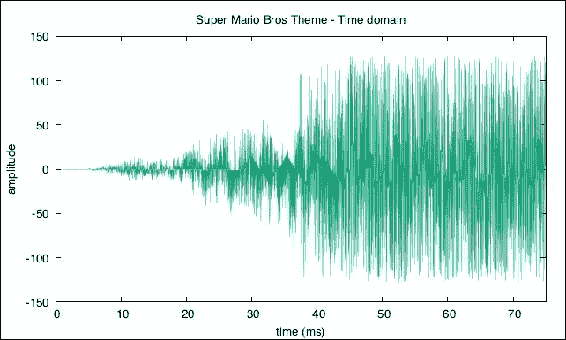
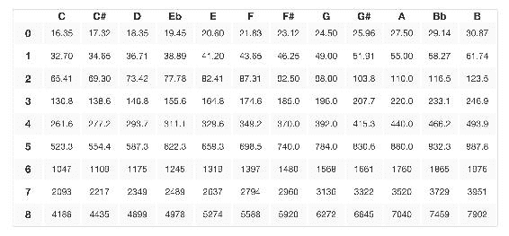
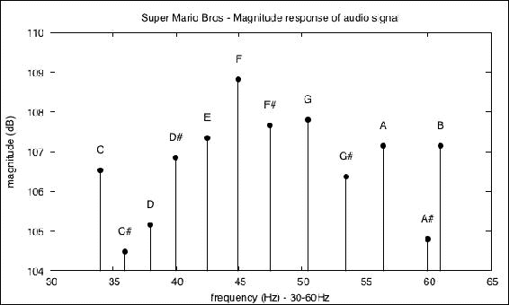
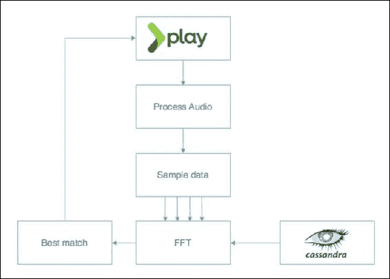
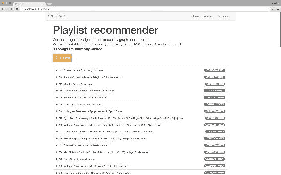
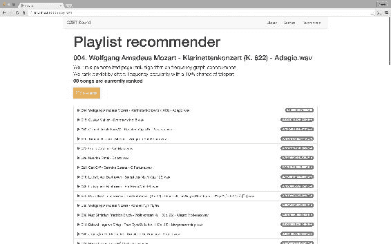

# 第八章。构建推荐系统

如果要选择一种算法向公众展示数据科学，推荐系统肯定是可行的。如今，推荐系统无处不在。它们受欢迎的原因是它们的多功能性、实用性和广泛适用性。无论是用来根据用户的购物行为推荐产品，还是根据观看喜好推荐新电影，推荐者现在都是生活中的事实。甚至有可能这本书是根据营销公司对你的了解神奇地提出来的，比如你的社交网络偏好、你的工作状态或你的浏览历史。

在本章中，我们将演示如何使用原始音频信号推荐音乐内容。为此，我们将涵盖以下主题:

*   使用 Spark 处理存储在 HDFS 的音频文件
*   学习用于音频信号变换的*傅立叶变换*
*   使用 Cassandra 作为在线层和离线层之间的缓存层
*   使用 *PageRank* 作为无监督推荐算法
*   将 Spark 作业服务器与 Play 框架集成，构建端到端原型

# 不同的方法

推荐系统的最终目标是基于用户的历史使用和偏好来推荐新项目。基本思想是对客户过去感兴趣的任何产品进行排名。这个排名可以是显式的(要求用户对电影进行 1 到 5 的排名)，也可以是隐式的(用户访问该页面的次数)。无论是买产品、听歌曲还是读文章，数据科学家通常从两个不同的角度来解决这个问题:*协同过滤*和*基于内容的过滤*。

## 协同过滤

使用这种方法，我们通过收集更多关于人们行为的信息来利用大数据。虽然一个人从定义上来说是独一无二的，但他们的购物行为通常不是，一些相似之处总是可以与他人找到。推荐的项目将针对特定的个人，但是它们将通过将用户的行为与相似用户的行为相结合来导出。这是大多数零售网站的名言:

> *“买这个的人也买那个……”*

当然，这需要事先了解客户、他们过去的购买情况，并且您还必须有足够的其他客户的信息来进行比较。因此，一个主要的限制因素是，物品必须至少看过一次，才能作为潜在的推荐物品入围。事实上，在一件商品至少被看过/买过一次之前，我们不能推荐它。

### 注

协同过滤的虹膜数据集通常使用 LastFM 数据集的样本完成:[http://labrosa.ee.columbia.edu/millionsong/lastfm](http://labrosa.ee.columbia.edu/millionsong/lastfm)。

## 基于内容的过滤

另一种方法不是利用与其他用户的相似性，而是关注产品本身和客户过去感兴趣的产品类型。如果你对*古典音乐*和 *speed meta* l 都感兴趣，那么可以有把握地假设你可能会购买(至少考虑)任何混合了古典节奏和重金属即兴片段的新专辑。这样的推荐在协作过滤方法中很难找到，因为在你的邻居中没有人分享你的音乐品味。

这种方法的主要优点是，假设我们对要推荐的内容(如类别、标签等)有足够的了解，即使以前没有人看过，我们也可以推荐一个新项目。缺点是，模型可能更难构建，在不丢失信息的情况下选择正确的功能可能具有挑战性。

## 定制方法

由于本书的重点是*为数据科学掌握 Spark*我们希望为读者提供一种新的和创新的方式来解决推荐问题，而不仅仅是解释任何人都可以使用现成的 Spark APIs 构建的标准协同过滤算法，并遵循基本教程[。让我们从一个假设开始:](http://spark.apache.org/docs/latest/mllib-collaborative-filtering.html)

*如果我们要向最终用户推荐歌曲，难道我们不能建立一个系统来推荐歌曲吗，不是基于人们喜欢或不喜欢什么，也不是基于歌曲属性(流派、艺术家)，而是基于歌曲的真实声音和你对它的感觉。*

为了演示如何构建这样一个系统(由于您可能无法访问包含音乐内容的公共数据集，并且至少无法对合法的数据集进行排名)，我们将解释如何使用您自己的个人音乐库在本地构建它。尽情玩吧！

# 无信息数据

以下技术可以被视为大多数现代数据科学家工作方式的某种游戏改变者。虽然处理结构化和非结构化文本很常见，但处理原始二进制数据就不那么常见了，原因是计算机科学和数据科学之间存在差距。文本处理仅限于大多数人熟悉的一组标准操作，即获取、解析和存储等。我们将不再局限于这些操作，而是直接进行音频转换，并将未知的信号数据丰富成有根据的转录。在这样做的时候，我们启用了一种新型的数据管道，类似于教计算机从音频文件中听到声音。

我们在这里鼓励的第二个(突破性的)想法是围绕数据科学家如今如何参与 Hadoop 和大数据的思维转变。虽然许多人仍然认为这些技术只是另一个数据库，但我们想展示这些工具带来的大量可能性。毕竟，没有人会嘲笑这位数据科学家，他可以训练机器与客户交谈或理解呼叫中心的录音。

## 处理字节

首先要考虑的是音频文件格式。`.wav`文件可以像使用`javax.sound`的`AudioSystem`库一样进行处理，而`.mp3`则需要使用外部编解码器库进行预处理。如果我们从`InputStream`中读取一个文件，我们可以创建一个包含音频信号的输出字节数组，如下所示:

```scala
def readFile(song: String) = {
  val is = new FileInputStream(song)
   processSong(is)
}
def processSong(stream: InputStream): Array[Byte] = {

   val bufferedIn = new BufferedInputStream(stream)
   val out = new ByteArrayOutputStream
   val audioInputStream = AudioSystem.getAudioInputStream(bufferedIn)

   val format = audioInputStream.getFormat
   val sizeTmp = Math.rint((format.getFrameRate *
                  format.getFrameSize) /
                  format.getFrameRate)
                .toInt

  val size = (sizeTmp + format.getFrameSize) -
             (sizeTmp % format.getFrameSize)

   val buffer = new Array[Byte](size)

   var available = true
   var totalRead = 0
   while (available) {
     val c = audioInputStream.read(buffer, 0, size)
     totalRead += c
     if (c > -1) {
       out.write(buffer, 0, c)
     } else {
       available = false
     }
   }

   audioInputStream.close()
   out.close()
   out.toByteArray
 }
```

歌曲通常使用 44KHz 的采样率进行编码，根据**奈奎斯特**定理，该采样率是人耳能够感知的最高频率的两倍(覆盖范围从 20Hz 到 20Hz)。

### 注

有关奈奎斯特定理的更多信息，请访问:[http://redwood.berkeley.edu/bruno/npb261/aliasing.pdf](http://redwood.berkeley.edu/bruno/npb261/aliasing.pdf)。

为了表示人类可以听到的声音，我们每秒需要大约 44，000 个样本，因此立体声(两个声道)每秒需要 176，400 字节。后者是以下字节频率:

```scala
val format = audioInputStream.getFormat

val sampleRate = format.getSampleRate

val sizeTmp = Math.rint((format.getFrameRate *
                format.getFrameSize) /
                format.getFrameRate)
              .toInt

 val size = (sizeTmp + format.getFrameSize) -
           (sizeTmp % format.getFrameSize)

 val byteFreq = format.getFrameSize * format.getFrameRate.toInt
```

最后，我们通过处理输出字节数组并绘制样本数据的前几个字节来访问音频信号(在本例中，*图 1* ，显示了马里奥兄弟的主题曲)。请注意可以使用字节索引和字节频率值检索的时间戳，如下所示:

```scala
val data: Array[Byte] = processSong(inputStream)

val timeDomain: Array[(Double, Int)] = data
  .zipWithIndex
  .map { case (b, idx) =>
      (minTime + idx * 1000L / byteFreq.toDouble, b.toInt)
   }
```



图 1:马里奥兄弟主题-时域

为了方便起见，我们将所有这些音频特征打包到一个案例类`Audio`(如下面的片段所示)中，我们将在本章中添加额外的实用方法:

```scala
case class Audio(data: Array[Byte],
                byteFreq: Int,
                sampleRate: Float,
                minTime: Long,
                id: Int= 0) {

  def duration: Double =
    (data.length + 1) * 1000L / byteFreq.toDouble

  def timeDomain: Array[(Double, Int)] = data
   .zipWithIndex
   .map { case (b, idx) =>
        (minTime + idx * 1000L / byteFreq.toDouble, b.toInt)
    }

  def findPeak: Float = {
    val freqDomain = frequencyDomain()
    freqDomain
     .sortBy(_._2)
     .reverse
     .map(_._1)
     .head
  }

 // Next to come

 }
```

## 创建可伸缩代码

既然我们已经创建了从`.wav`文件中提取音频信号的功能(通过一个`FileInputStream`，自然下一步就是使用它来处理存储在 HDFS 的剩余记录。正如前面几章已经强调的，一旦逻辑在一条记录上运行，这并不是一项困难的任务。事实上，Spark 附带了一个开箱即用的处理二进制数据的实用程序，因此我们只需插入以下函数:

```scala
def read(library: String, sc: SparkContext) = {
   sc.binaryFiles(library)
     .filter { case (filename, stream) =>
       filename.endsWith(".wav")
     }
     .map { case (filename, stream) =>
       val audio =  processSong(stream.open())
       (filename, audio)
     }
}

val audioRDD: RDD[(String, Audio)] = read(library, sc)
```

我们确保只向处理器发送`.wav`文件，并获得由文件名(歌曲名)及其对应的`Audio`案例类(包括提取的音频信号)组成的新 RDD。

### 类型

Spark 的`binaryFiles`方法读取一个文件整体(不拆分)，并输出一个包含文件路径及其相应输入流的 RDD。因此，建议处理相对较小的文件(可能只有几兆字节)，因为这显然会影响内存消耗，从而影响性能。

## 从时域到频域

访问音频时域是一项伟大的成就，但可悲的是，它本身并没有多大价值。然而，我们可以用它来更好地理解信号真正代表什么，也就是说，提取它包含的隐藏频率。自然，我们可以使用*傅立叶变换*将时域信号转换到频域。

### 注

你可以在[上了解更多*傅里叶变换*。](http://www.phys.hawaii.edu/~jgl/p274/fourier_intro_Shatkay.pdf)

总之，在不涉及太多细节或处理复杂方程的情况下，约瑟夫·傅立叶在他传奇和同名的公式中所做的基本假设是，所有信号都是由来自不同频率和相位的正弦波无限积累而成的。

### 快速傅里叶变换

**离散傅里叶变换** ( **离散傅里叶变换**)是不同正弦波的总和，可以用以下等式表示:


虽然这个算法使用蛮力方法实现起来很简单，但是效率非常低 *O(n <sup class="calibre78">2</sup> )* ，因为对于每个数据点 *n* ，我们必须计算 *n* 指数的和。因此，一首三分钟的歌曲会产生 *(3 x 60 x 176，400)<sup class="calibre78">2</sup>≈10<sup class="calibre78">15</sup>*<sup class="calibre78">的操作次数。相反，库利和图基贡献了**快速傅立叶变换** ( **快速傅立叶变换**)，使用分治法进行离散傅立叶变换，将整体时间复杂度降低到*0(n . log(n))*。</sup>

### 注

描述库利和图基算法的官方论文可在线查阅:[http://www . AMS . org/journals/mcom/1965-19-090/S0025-5718-1965-0178586-1/S0025-5718-1965-0178586-1 . pdf](http://www.ams.org/journals/mcom/1965-19-090/S0025-5718-1965-0178586-1/S0025-5718-1965-0178586-1.pdf)

对我们来说幸运的是，现有的 FFT 实现是可用的，因此我们将使用`org.apache.commons.math3`提供的基于 Java 的库来计算 FFT。当使用这个库时，我们只需要确保我们的输入数据用零填充，以便总长度是 2 的幂，并且可以分为奇数和偶数序列:

```scala
def fft(): Array[Complex] = {

  val array = Audio.paddingToPowerOf2(data)
  val transformer = new FastFourierTransformer(
                         DftNormalization.STANDARD)

  transformer.transform(array.map(_.toDouble),
      TransformType.FORWARD)

}
```

这将返回一组由实部和虚部组成的`Complex`数字，并且可以很容易地转换为频率和振幅(或幅度)，如下所示。根据奈奎斯特定理，我们只需要一半的频率:

```scala
def frequencyDomain(): Array[(Float, Double)] = {

   val t = fft()
   t.take(t.length / 2) // Nyquist
   .zipWithIndex
   .map { case (c, idx) =>
      val freq = (idx + 1) * sampleRate / t.length
      val amplitude =  sqrt(pow(c.getReal, 2) +
                         pow(c.getImaginary, 2))
      val db = 20 * log10(amplitude)
      (freq, db)
    }

 }
```

最后，我们将这些函数包含在`Audio`案例类中，并为马里奥兄弟主题曲的前几秒绘制频域:


图 2:马里奥兄弟主题-频域

在图 2 中，在中高频范围(4 千赫和 7 千赫之间)可以看到明显的峰值，我们将使用这些峰值作为歌曲的指纹。

### 按时间窗采样

虽然效率更高，但由于其高内存消耗，FFT 仍然是一个昂贵的操作(请记住，一首典型的三分钟歌曲大约需要处理 *3 x 60 x 176，400* 个点)。当应用于大量数据点时，这变得特别成问题，因此必须考虑大规模处理。

我们不是查看全部频谱，而是使用时间窗口对我们的歌曲进行采样。事实上，一个完整的快速傅立叶变换不会有任何用处，因为我们想知道每个主要频率被听到的时间。因此，我们迭代地将每个`Audio`类分成 20 毫秒样本的更小的案例类。这个时间范围对于分析来说应该足够小，这意味着足够小，以便可以计算快速傅立叶变换，并且足够密集，以确保提取足够的频率来提供足够的音频指纹。产生的 20 毫秒的块将大幅增加我们的 RDD 的整体大小:

```scala
def sampleByTime(duration: Double = 20.0d,
                padding: Boolean = true): List[Audio] = {

   val  size = (duration * byteFreq / 1000.0f).toInt
   sample(size, padding)

 }

 def sample(size: Int= math.pow(2, 20).toInt,
          padding: Boolean = true): List[Audio] = {

   Audio
    .sample(data, size, padding)
    .zipWithIndex
    .map { case (sampleAudio, idx) =>
      val firstByte = idx * size
       val firstTime = firstByte * 1000L / byteFreq.toLong
       Audio(
           sampleAudio,
           byteFreq,
           sampleRate,
           firstTime,
           idx
      )
    }

 }

val sampleRDD = audioRDDflatMap { case (song, audio) =>
   audio.sampleByTime()
    .map { sample =>
       (song, sample)
     }
 }
```

### 类型

虽然这不是我们的主要关注点，但我们可以通过将样本与内部和外部快速傅立叶变换重新组合并应用旋转因子[https://en.wikipedia.org/wiki/Twiddle_factor](https://en.wikipedia.org/wiki/Twiddle_factor)来重建整个信号的完整快速傅立叶变换频谱。当处理可用内存有限的大型记录时，这可能很有用。

### 提取音频签名

现在我们有了多个固定时间间隔的样本，我们可以使用快速傅立叶变换提取频率特征。为了生成样本签名，我们尝试在不同的频带中找到最接近的音符，而不是使用精确的峰值(可能是近似值)。这提供了一个近似值，但这样做可以克服原始信号中存在的任何噪声问题，因为噪声会干扰我们的签名。

我们看下面的频段 20-60 Hz、60-250Hz、250-2000Hz、2-4Kz、4-6Kz，根据下面的频率参考表找到最接近的音符。这些波段不是随机的。它们对应的是乐器的不同音域(例如低音提琴跨度在 50 到 200Hz 之间，短笛跨度在 500 到 5KHz 之间)。



图 3:频率注释参考表

*图 4* ，展示了我们的马里奥兄弟主题曲在较低频段的第一个样本。我们可以看到，43Hz 的最高幅度对应的是音符 **F** 的素八度:



图 4:马里奥兄弟主题-低频

对于每个样本，我们构建一个由五个字母(如[**E**-**D #**-**A**-**B**-**B**-**F**)组成的散列，对应于前面每个频带中最强的音符(最高峰)。我们认为这个散列是特定 20 毫秒时间窗口的指纹。然后，我们构建一个由哈希值组成的新 RDD，如下所示(我们在`Audio`案例类中包含一个哈希函数):

```scala
def hash: String = {
  val freqDomain = frequencyDomain()
  freqDomain.groupBy { case (fq, db) =>
    Audio.getFrequencyBand(fq)
  }.map { case (bucket, frequencies) =>
    val (dominant, _) = frequencies.map { case (fq, db) =>
      (Audio.findClosestNote(fq), db)
    }.sortBy { case (note, db) =>
      db
    }.last
    (bucket, dominant)
  }.toList
 .sortBy(_._1)
 .map(_._2)
 .mkString("-")
 }

*/** 
*001 Amadeus Mozart - Requiem (K. 626)        E-D#-A-B-B-F* 
*001 Amadeus Mozart - Requiem (K. 626)        G#-D-F#-B-B-F* 
*001 Amadeus Mozart - Requiem (K. 626)        F#-F#-C-B-C-F* 
*001 Amadeus Mozart - Requiem (K. 626)        E-F-F#-B-B-F* 
*001 Amadeus Mozart - Requiem (K. 626)        E-F#-C#-B-B-F* 
*001 Amadeus Mozart - Requiem (K. 626)        B-E-F-A#-C#-F* 
**/*

```

现在，我们对共享相同散列的所有歌曲 id 进行分组，以便构建具有唯一散列的 RDD:

```scala
case class HashSongsPair(
                         id: String,
                         songs: List[Long]
                         )

 val hashRDD = sampleRDD.map { case (id, sample) =>
   (sample.hash, id)
  }
 .groupByKey()
 .map { case (id, songs) =>
    HashSongsPair(id, songs.toList)
  }
```

我们的假设是，当在特定时间窗口在歌曲中定义散列时，相似的歌曲可能共享相似的散列，但是具有所有相同散列(并且按顺序)的两首歌曲将是真正相同的；一个人可以分享我的部分 DNA，但一个拥有完全相同 DNA 的人将是我的完美克隆。

如果一个音乐爱好者在听柴可夫斯基的 D 中的*协奏曲时感到幸福，我们能不能仅仅因为他们两个有一个音乐节奏(也就是在 *D* 周围的共同频率)就推荐*帕切尔贝尔的 D* 中的佳能？*

推荐仅基于特定频段的播放列表是否有效(可行)？频率本身肯定不足以完全描述一首歌。速度、音色或节奏呢？这个模型是否足够完整，能够准确地代表音乐多样性和音域的所有细微差别？大概不会，但出于数据科学的目的，无论如何都值得调查！

# 搭建歌曲分析器

然而，在深入到推荐器本身之前，读者可能已经注意到我们能够从信号数据中提取的一个重要属性。由于我们以固定的时间间隔生成音频签名，因此我们可以比较签名并找到潜在的副本。例如，给定一首随机歌曲，我们应该能够根据先前索引的签名猜测标题。事实上，这正是许多公司在提供音乐识别服务时采取的方法。更进一步，我们可以提供对一个乐队音乐影响力的洞察，或者更进一步，甚至可以识别歌曲抄袭，一劳永逸地解决齐柏林飞船和美国摇滚乐队“精神 T2”之间的纠纷。

考虑到这一点，我们将绕过我们的推荐用例，继续深入研究歌曲识别。接下来，我们构建了一个分析器系统，能够匿名接收一首歌曲，分析其流，并返回歌曲的标题(在我们的例子中，是原始文件名)。

## 卖数据科学就是卖纸杯蛋糕

可悲的是，数据科学之旅中一个经常被忽视的方面就是数据可视化。换句话说，如何向最终用户展示您的结果。虽然许多数据科学家满足于在 Excel 电子表格中展示他们的发现，但今天的最终用户渴望更丰富、更身临其境的体验。他们经常想四处游玩，用数据与互动。事实上，为最终用户提供完整的端到端用户体验，即使是简单的体验，也是激发对科学兴趣的好方法；将一个简单的概念证明制作成人们容易理解的原型。由于 Web 2.0 技术的流行，用户的期望很高，但谢天谢地，有各种免费的开源产品可以提供帮助，例如，迈克·博斯托克的 D3.js 是一个流行的框架，它提供了一个工具包来创建这样的用户界面。

没有丰富的数据可视化就卖数据科学，就像试图卖一块没有糖衣的蛋糕，很少有人会信任成品。因此，我们将为我们的分析仪系统构建一个用户界面。但是首先，让我们从 Spark 中获取音频数据(我们的散列目前存储在 RDD 内部的内存中)并将其放入网络规模的数据存储中。

### 使用卡珊德拉

我们需要一个快速、高效、分布式的键值存储来保存我们所有的哈希值。虽然许多数据库都适合这个目的，但我们将选择 Cassandra 来展示它与 Spark 的集成。首先，使用 Maven 依赖项导入 Cassandra 输入和输出格式:

```scala
<dependency>
  <groupId>com.datastax.spark</groupId>
  <artifactId>spark-cassandra-connector_2.11</artifactId>            
  <version>2.0.0</version>
</dependency> 

```

如您所料，从 Spark 到 Cassandra 持久化(和检索)rdd 相对来说并不重要:

```scala
import com.datastax.spark.connector._

 val keyspace = "gzet"
 val table = "hashes"

 // Persist RDD
 hashRDD.saveAsCassandraTable(keyspace, table)

 // Retrieve RDD
 val retrievedRDD = sc.cassandraTable[HashSongsPair](
  keyspace,
  table
)
```

这将在键空间`gzet`上创建一个新表`hashes`，从`HashSongsPair`对象推断模式。以下是执行的等效 SQL 语句(此处仅供参考):

```scala
CREATE TABLE gzet.hashes (
  id text PRIMARY KEY,
  songs list<bigint>
)
```

### 使用播放框架

由于我们的网络用户界面将处理将歌曲转换成频率哈希所需的复杂处理，我们希望它是一个交互式网络应用，而不是一组简单的静态 HTML 页面。此外，这必须以与我们使用 Spark 完全相同的方式和功能来完成(也就是说，同一首歌应该生成相同的哈希)。Play 框架([https://www.playframework.com/](https://www.playframework.com/))会让我们做到这一点，Twitter 的 bootstrap([http://getbootstrap.com/](http://getbootstrap.com/))会用来锦上添花，让观感更专业。

虽然这本书不是关于构建用户界面，但我们将介绍一些与 Play 框架相关的概念，就好像使用得当它可以为数据科学家提供一个极具价值的来源。像往常一样，完整的代码可以在我们的 GitHub 存储库中找到。

首先，我们创建一个**数据访问层**，负责处理到 Cassandra 的连接和查询。对于任何给定的散列，我们返回匹配歌曲 id 的列表。同样，对于任何给定的 ID，我们返回歌曲名称:

```scala
val cluster = Cluster
  .builder()
  .addContactPoint(cassandraHost)
  .withPort(cassandraPort)
  .build()
val session = cluster.connect()

 def findSongsByHash(hash: String): List[Long] = {
   val stmt = s"SELECT songs FROM hashes WHERE id = '$hash';"
   val results = session.execute(stmt)
   results flatMap { row =>
     row.getList("songs", classOf[Long])
   }
   .toList
 }
```

接下来，我们创建一个简单的**视图**，由三个对象组成，一个`text`字段，一个文件`Upload`，和一个`submit`按钮。这几行足以提供我们的用户界面:

```scala
<div>
   <input type="text" class="form-control">
   <span class="input-group-btn">
     <button class="btn-primary">Upload</button>
     <button class="btn-success">Analyze</button>
   </span>
</div>
```

然后我们创建一个**控制器**，分别通过`index`和`submit`方法处理`GET`和`POST` HTTP 请求。后者将处理上传的文件，方法是将一个`FileInputStream`转换成一个`Audio`案例类，将其分割成 20 毫秒的块，提取快速傅立叶变换签名(哈希)，并向卡珊德拉查询匹配的标识:

```scala
def index = Action { implicit request =>
   Ok(views.html.analyze("Select a wav file to analyze"))
 }

 def submit = Action(parse.multipartFormData) { request =>
   request.body.file("song").map { upload =>
     val file = new File(s"/tmp/${UUID.randomUUID()}")
     upload.ref.moveTo(file)
     val song = process(file)
     if(song.isEmpty) {
       Redirect(routes.Analyze.index())
         .flashing("warning" -> s"No match")
     } else {
       Redirect(routes.Analyze.index())
         .flashing("success" -> song.get)
     }
   }.getOrElse {
     Redirect(routes.Analyze.index())
       .flashing("error" -> "Missing file")
   }
 }

 def process(file: File): Option[String] = {
   val is = new FileInputStream(file)
   val audio = Audio.processSong(is)
   val potentialMatches = audio.sampleByTime().map {a =>
     queryCassandra(a.hash)
   }
   bestMatch(potentialMatches)
 }
```

最后，我们通过一条闪烁的消息返回匹配结果(如果有)，并通过为我们的`Analyze`服务定义新的路由，将视图和控制器链接在一起:

```scala
GET      /analyze      controllers.Analyze.index
POST     /analyze      controllers.Analyze.submit
```

产生的 UI 在*图 5* 中报告，并且与我们自己的音乐库完美配合:


图 5:声音分析器 UI

下面的*图 6* 显示了端到端的过程:



图 6:声音分析器流程

如上所述，Play 框架与我们的离线 Spark 作业共享一些代码。这之所以成为可能，是因为我们以函数式的方式进行编程，并且很好地分离了关注点。虽然 Play 框架不能与 Spark 一起工作(就 RDDs 和 Spark 上下文对象而言)，但因为它们不依赖于 Spark，所以我们可以使用之前创建的任何函数(例如 Audio 类中的函数)。这是函数式编程的众多优点之一；根据定义，函数是无状态的，是采用六边形**架构**:[http://wiki.c2.com/?HexagonalArchitecture](http://wiki.c2.com/?HexagonalArchitecture)的关键组件。无论是在 RDD 内部还是在 Play 控制器内部，独立的函数总是可以被不同的参与者调用。

# 建立推荐人

既然我们已经探索了我们的歌曲分析器，让我们回到推荐引擎的轨道上来。如前所述，我们希望根据从音频信号中提取的频率哈希来推荐歌曲。以齐柏林飞船和圣灵之间的争论为例，我们认为这两首歌彼此相对接近，因为据称它们共享一个旋律。用这个想法作为我们的主要假设，我们可以潜在地向对*通往天堂的阶梯*感兴趣的人推荐*金牛座*。

## page rank 算法

我们将推荐播放列表，而不是推荐特定的歌曲。一个播放列表将由我们所有歌曲的列表组成，这些歌曲按相关性排序，从最相关到最不相关。我们先假设人们听音乐的方式和在网上浏览文章的方式类似，也就是沿着一条逻辑路径从一个链接到另一个链接，但偶尔会切换方向，或者瞬间移动，浏览到一个完全不同的网站。继续这个类比，在听音乐的时候，你可以继续听类似风格的音乐(因此跟随他们最期待的旅程)，或者跳到一首完全不同风格的随机歌曲。事实证明，这正是谷歌使用 **PageRank** 算法根据受欢迎程度对网站进行排名的方式。

### 注

有关 PageRank 算法的更多详情，请访问:[http://ilpubs.stanford.edu:8090/422/1/1999-66.pdf](http://ilpubs.stanford.edu:8090/422/1/1999-66.pdf)。

一个网站的受欢迎程度是通过它指向的链接数量来衡量的。在我们的音乐用例中，流行度是由一首给定歌曲与其所有邻居共享的散列数来构建的。我们引入歌曲共性的概念，而不是流行。

### 建立频率共现图

我们首先从卡珊德拉那里读取哈希值，并为每个不同的哈希值重新建立歌曲标识列表。一旦我们有了这个，我们就可以使用一个简单的`reduceByKey`函数来计算每首歌曲的散列数，并且因为音频库相对较小，我们收集它并将其广播给我们的 Spark 执行者:

```scala
val hashSongsRDD = sc.cassandraTable[HashSongsPair]("gzet", "hashes")

 val songHashRDD = hashSongsRDD flatMap { hash =>
     hash.songs map { song =>
       ((hash, song), 1)
     }
   }

 val songTfRDD = songHashRDD map { case ((hash,songId),count) =>
     (songId, count)
   } reduceByKey(_+_)

 val songTf = sc.broadcast(songTfRDD.collectAsMap())
```

接下来，我们通过获取共享相同哈希值的每首歌曲的叉积来构建共现矩阵，并计算观察到相同元组的次数。最后，我们将歌曲标识和归一化的(使用我们刚刚广播的术语频率)频率计数包装在来自 GraphX 的`Edge`类中:

```scala
implicit class Crossable[X](xs: Traversable[X]) {
      def cross[Y](ys: Traversable[Y]) = for { x <- xs; y <- ys } yield (x, y)

val crossSongRDD = songHashRDD.keys
    .groupByKey()
    .values
    .flatMap { songIds =>
        songIds cross songIds filter { case (from, to) =>
           from != to
      }.map(_ -> 1)
    }.reduceByKey(_+_)
     .map { case ((from, to), count) =>
       val weight = count.toDouble /
                    songTfB.value.getOrElse(from, 1)
       Edge(from, to, weight)
    }.filter { edge =>
     edge.attr > minSimilarityB.value
   }

val graph = Graph.fromEdges(crossSongRDD, 0L)
```

为了构建我们的哈希频率图，我们只保留权重(意味着哈希共现)大于预定义阈值的边。

### 运行页面排名

与运行 PageRank 时通常预期的相反，我们的图是无向的。事实证明，对于我们的推荐人来说，缺乏方向并不重要，因为我们只是想找到齐柏林飞船和圣灵之间的相似之处。引入方向的一个可能方法是看歌曲的出版日期。为了找到音乐的影响，我们当然可以引入一个从最古老到最新的歌曲的时间表，给我们的边缘以方向性。

在下面的`pageRank`中，我们定义了 15%的概率跳过，或者**传送**到任何随机的歌曲，但是这显然可以根据不同的需求进行调整:

```scala
val prGraph = graph.pageRank(0.001, 0.15)
```

最后，我们提取页面排名顶点，并通过`Song`案例类的 RDD 将它们保存为 Cassandra 中的播放列表:

```scala
case class Song(id: Long, name: String, commonality: Double)
val vertices = prGraph
  .vertices
  .mapPartitions { vertices =>
    val songIds = songIdsB
  .value
  .vertices
  .map { case (songId, pr) =>
       val songName = songIds.get(vId).get
        Song(songId, songName, pr)
      }
  }

 vertices.saveAsCassandraTable("gzet", "playlist")
```

读者可能正在思考 PageRank 的确切用途，以及如何将其用作推荐器？事实上，我们使用 PageRank 意味着排名最高的歌曲将是那些与其他歌曲共享许多频率的歌曲。这可能是由于一个共同的安排，关键主题，或旋律；或者可能是因为某个特定的艺术家对音乐潮流产生了重大影响。然而，这些歌曲至少在理论上应该更受欢迎(因为它们出现的频率更高)，这意味着它们更有可能具有大众吸引力。

另一方面，排名靠后的歌曲是我们没有发现任何相似之处的歌曲。要么这些歌曲太前卫了，以至于以前没有人探索过这些音乐理念，要么太糟糕了，以至于从来没有人想复制它们！也许它们甚至是由你在叛逆的青少年时代听的那位崭露头角的艺术家创作的。无论哪种方式，随机用户喜欢这些歌曲的机会都被视为微不足道。令人惊讶的是，无论这是纯粹的巧合还是这个假设真的有意义，这个特定音频库中排名最低的歌曲是蠢朋克的- *主板*这是一个相当原创的标题(虽然是一个辉煌的标题)，并且有一个明确的独特声音。

## 构建个性化播放列表

我们刚刚看到一个简单的 PageRank 可以帮助我们创建一个通用的播放列表。虽然这不是针对任何个人，但它可以作为随机用户的播放列表。这是我们可以在没有任何用户偏好信息的情况下做出的最佳推荐。我们对用户了解得越多，我们就能更好地针对他们真正喜欢的内容个性化播放列表。为此，我们可能会遵循基于内容的推荐方法。

没有关于用户偏好的预先信息，我们可以在用户播放歌曲时收集我们自己的信息，从而在运行时个性化他们的播放列表。为此，我们将假设我们的用户正在欣赏他们听的前一首歌。我们还需要禁用传送，并生成一个新的播放列表，该播放列表是从该特定的歌曲标识种子。

PageRank 和个性化 PageRank 在计算分数的方式上是相同的(使用传入/传出边的权重)，但是个性化版本只允许用户传送到提供的 ID。对代码的简单修改允许我们使用某个社区 ID(参见[第 7 章](07.html "Chapter 7. Building Communities")、*构建社区*，了解社区的定义)或使用某个音乐属性(如艺术家或流派)来个性化 PageRank。给定我们之前的图表，个性化页面排名实现如下:

```scala
val graph = Graph.fromEdges(edgeRDD, 0L)
val prGraph = graph.personalizedPageRank(id, 0.001, 0.1)
```

在这里，传送到随机歌曲的几率为零。仍然有 10%的机会跳过，但是在提供的歌曲 ID 的非常小的容限内。换句话说，不管我们当前正在听的歌曲是什么，我们基本上定义了播放我们作为种子提供的歌曲的 10%的机会。

## 扩大我们的纸杯蛋糕工厂

类似于我们的歌曲分析器原型，我们希望在一个漂亮整洁的用户界面中向我们想象中的客户展示我们建议的播放列表。

### 建立播放列表服务

仍然使用 Play 框架，我们的技术堆栈保持不变，这次我们只需创建一个新的端点(新的路由):

```scala
GET       /playlist      controllers.Playlist.index
```

就像以前一样，我们创建了一个额外的控制器来处理简单的 GET 请求(当用户加载播放列表网页时触发)。我们加载存储在 Cassandra 中的通用播放列表，将所有这些歌曲包装在一个`Playlist`案例类中，并将其发送回`playlist.scala.html`视图。控制器模型如下所示:

```scala
def getSongs: List[Song] = {
   val s = "SELECT id, name, commonality FROM gzet.playlist;"
   val results = session.execute(s)
   results map { row =>
     val id = row.getLong("id")
     val name = row.getString("name")
     val popularity = row.getDouble("commonality")
     Song(id, name, popularity)
   } toList
 }

 def index = Action { implicit request =>
   val playlist = models.Playlist(getSongs)
   Ok(views.html.playlist(playlist))
 }
```

该视图保持相当简单，因为我们遍历所有要显示的歌曲，按共性排序(从最常见到最不常见):

```scala
@(playlist: Playlist)

@displaySongs(playlist: Playlist) = {
   @for(node <- playlist.songs.sortBy(_.commonality).reverse) {
     <a href="/playlist/@node.id" class="list-group-item">
       <iclass="glyphiconglyphicon-play"></i>
       <span class="badge">
         @node.commonality
       </span>
       @node.name
     </a>
   }
 }

 @main("playlist") {
   <div class="row">
     <div class="list-group">
       @displaySongs(playlist)
     </div>
   </div>
 }
```

### 注

请注意每个列表项中的`href`属性-每当用户点击该列表中的歌曲时，我们将生成对/playlist/id 端点的新`REST`调用(这将在下一节中描述)。

最后，我们很高兴在*图 7* 中公布推荐(通用)播放列表。由于一些我们不知道的原因，显然一个古典音乐的新手应该开始听*古斯塔夫·马勒，第五交响曲*。



图 7:播放列表推荐器

### 利用Spark作业服务器

又一个有趣的挑战来了。虽然我们的通用播放列表和页面排名分数的歌曲列表存储在 Cassandra 上，但这对于个性化播放列表来说是不可行的，因为这需要预先计算所有可能歌曲 id 的所有页面排名分数。由于我们希望伪实时地构建个性化播放列表，并且我们可能还会定期加载新歌，因此我们需要找到一种比根据每个请求启动`SparkContext`更好的方法。

第一个限制是 PageRank 函数本质上是一个分布式进程，不能在 Spark 的上下文之外使用(也就是说，在我们 Play 框架的 JVM 内部)。我们意识到在每个 http 请求上创建一个新的 Spark 作业肯定会有点矫枉过正，所以我们希望只启动一个 Spark 作业，并且只在需要的时候处理新的图形，最好是通过一个简单的 REST API 调用。

第二个挑战是我们不希望重复从 Cassandra 加载相同的图形数据集。这应该加载一次并缓存在 Spark 内存中，并在不同的作业之间共享。在 Spark 术语中，这将需要从共享的上下文中访问 RDD。

幸运的是，这两点都是通过 Spark **作业服务器**([https://github.com/spark-jobserver/spark-jobserver](https://github.com/spark-jobserver/spark-jobserver))解决的。尽管这个项目相当不成熟(或者至少还没有完全做好生产准备)，但它是展示数据科学的完美可行的解决方案。

出于本书的目的，我们仅使用本地配置来编译和部署 Spark 作业服务器。我们强烈建议读者深入查看 job server 网站(参见之前的链接)，了解有关打包和部署的更多信息。一旦我们的服务器启动，我们需要创建一个新的上下文(意味着启动一个新的 Spark 作业)，并使用额外的配置设置来处理与 Cassandra 的连接。我们给这个上下文起了一个名字，以便以后使用:

```scala
curl -XPOST 'localhost:8090/contexts/gzet?\
  num-cpu-cores=4&\
  memory-per-node=4g&\
  spark.executor.instances=2&\
  spark.driver.memory=2g&\
  passthrough.spark.cassandra.connection.host=127.0.0.1&\
  passthrough.spark.cassandra.connection.port=9042'
```

下一步是修改我们的代码，使其符合 Spark 作业服务器。我们需要以下依赖关系:

```scala
<dependency>
   <groupId>spark.jobserver</groupId>
   <artifactId>job-server-api_2.11</artifactId>
   <version>spark-2.0-preview</version>
 </dependency>
```

我们使用作业服务器附带的`SparkJob`接口的签名来修改我们的 SparkJob。这是所有 Spark 作业服务器作业的要求:

```scala
object PlaylistBuilder extends SparkJob {

  override def runJob(
    sc: SparkContext,
    jobConfig: Config
  ): Any = ???

  override def validate(
    sc: SparkContext,
    config: Config
  ): SparkJobValidation = ???

}
```

在`validate`方法中，我们确保所有的作业需求都将得到满足(例如该作业所需的输入配置)，在`runJob`中，我们像以前一样执行正常的 Spark 逻辑。最后一个变化是，虽然我们仍然将我们的通用播放列表存储到 Cassandra 中，但我们将在 Spark 共享内存中缓存节点和边缘 rdd，在那里它将可供进一步的作业使用。这可以通过扩展`NamedRddSupport`特征来实现。

我们只需保存边和节点 RDDs(注意，还不支持保存`Graph`对象)就可以在后续作业中继续访问图形:

```scala
this.namedRdds.update("rdd:edges", edgeRDD)
this.namedRdds.update("rdd:nodes", nodeRDD)
```

从个性化`Playlist`作业中，我们检索并处理我们的关系数据库，如下所示:

```scala
val edgeRDD = this.namedRdds.get[Edge]("rdd:edges").get
val nodeRDD = this.namedRdds.get[Node]("rdd:nodes").get

val graph = Graph.fromEdges(edgeRDD, 0L)
```

然后，我们执行个性化的 PageRank，但我们不会将结果保存回 Cassandra，而是简单地收集前 50 首歌曲。部署后，由于作业服务器的魔力，此操作将隐式地将此列表输出回客户端:

```scala
val prGraph = graph.personalizedPageRank(id, 0.001, 0.1)

prGraph
 .vertices
 .map { case(vId, pr) =>
   List(vId, songIds.value.get(vId).get, pr).mkString(",")
  }
 .take(50)
```

我们编译代码并将着色 jar 文件发布到作业服务器中，给它一个应用名，如下所示:

```scala
curl --data-binary @recommender-core-1.0.jar \
 'localhost:8090/jars/gzet'
```

现在，我们几乎已经准备好部署我们的推荐系统，让我们回顾一下我们将要演示的内容。我们将很快执行两个不同的用户流:

*   当用户登录到推荐页面时，我们检索 Cassandra 中可用的最新通用播放列表。或者，如果需要，我们启动一个新的异步作业来创建一个新的。这将在 Spark 上下文中加载所需的 rdd。
*   当用户播放我们推荐项目中的一首新歌时，我们会加速对 Spark 作业服务器的同步调用，并基于该歌曲 ID 构建下一个播放列表。

通用 PageRank 播放列表的流程如图 8 所示:


图 8:播放列表推荐过程

个性化 PageRank 播放列表的流程如图 9 所示:


图 9:个性化播放列表推荐流程

### 用户界面

剩下的最后一块拼图是从 Play Framework 中的服务层调用 Spark 作业服务器。虽然这是使用`java.net`包以编程方式完成的，但由于它是一个 REST 应用编程接口，等效的`curl`请求显示在下面的代码片段中:

```scala
# Asynchronous Playlist Builder
curl -XPOST 'localhost:8090/jobs?\
 context=gzet&\
 appName=gzet&\
 classPath=io.gzet.recommender.PlaylistBuilder'

# Synchronous Personalized Playlist for song 12
curl -XPOST -d "song.id=12" 'localhost:8090/jobs?\
 context=gzet&\
 appName=gzet&\
 sync=true&\
 timeout=60000&\
 classPath=io.gzet.recommender.PersonalizedPlaylistBuilder'
```

最初，当我们构建我们的 HTML 代码时，我们引入了一个链接，或`href`，到`/playlist/${id}`。这个 REST 调用将为您转换为对`Playlist`控制器的 GET 请求，并绑定到您的`personalize`功能，如下所示:

```scala
GET /playlist/:id controllers.Playlist.personalize(id: Long) 

```

对 Spark 作业服务器的第一次调用将同步启动一个新的 Spark 作业，从作业输出中读取结果，并使用更新的播放列表重定向到相同的页面视图，这次是基于以下歌曲 ID:

```scala
def personalize(id: Long) = Action { implicit request =>
   val name = cassandra.getSongName(id)
   try {
     val nodes = sparkServer.generatePlaylist(id)
     val playlist = models.Playlist(nodes, name)
     Ok(views.html.playlist(playlist))
   } catch {
     case e: Exception =>
       Redirect(routes.Playlist.index())
         .flashing("error" -> e.getMessage)
   }
 }
```

瞧，结果用户界面如图 10 所示。每当用户播放一首歌曲时，播放列表都会被更新和显示，充当成熟的排名推荐引擎。



图 10:个性化播放列表推荐流程

# 总结

虽然我们的推荐系统可能没有采用典型的教科书方法，也可能不是最准确的推荐方法，但它确实代表了一种对当今数据科学中最常见的技术之一的完全可演示和令人难以置信的有趣的方法。此外，通过持久数据存储、REST API 接口、分布式共享内存缓存和基于 web 2.0 的现代用户界面，它提供了一个相当完整和全面的候选解决方案。

当然，用这个原型构建生产级产品仍然需要很多努力和专业知识。在信号处理领域还有待改进。例如，可以通过使用响度滤波器[http://languagelog.ldc.upenn.edu/myl/StevensJASA1955.pdf](http://languagelog.ldc.upenn.edu/myl/StevensJASA1955.pdf)，通过提取音高和旋律，或者最重要的是，通过将立体声转换为单声道信号，来提高声压并降低信号噪声。

### 注

所有这些过程实际上都是研究活跃领域的一部分——读者可以看看以下一些出版物:[http://www.justinsalamon.com/publications.html](http://www.justinsalamon.com/publications.html)和[http://www.mattmcvicar.com/publications/](http://www.mattmcvicar.com/publications/)。

此外，我们质疑如何通过使用简单的(交互式)用户界面来改进数据科学演示。如上所述，这是一个经常被忽视的方面，也是演示的一个关键特征。即使在项目的早期阶段，在数据可视化上投入一些时间也是值得的，因为它在说服业务人员相信您的产品的可行性时特别有用。

最后一个想法，作为一个有抱负的章节，我们探索了在 Spark 环境中解决数据科学用例的创新方法。通过平衡数学和计算机科学之间的技能，数据科学家应该可以自由探索，有创造力，把可行的前沿推回去，承担人们所说的不可行的事情，但最重要的是，享受数据带来的乐趣。因为这是为什么数据科学家被认为是 21 世纪最性感的工作的主要原因。

这一章是音乐插曲。在下一章中，我们将通过使用推特数据引导分类模型来对 GDELT 文章进行分类，至少可以说这是另一个雄心勃勃的任务。