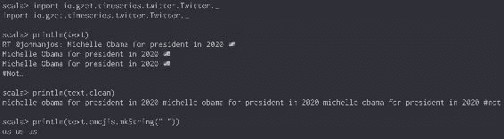
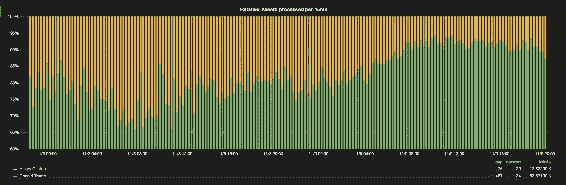
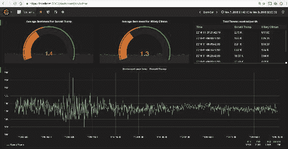
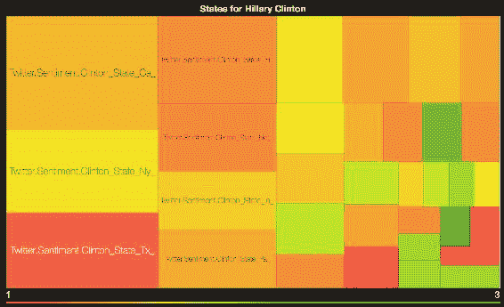
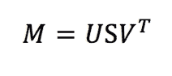
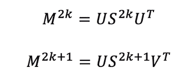
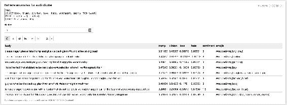

# 十一、基于情感分析的异常检测

当我们回顾 2016 年时，我们肯定会记得这是一个发生了许多重大地缘政治事件的时代，从英国退出欧盟、英国投票退出欧盟，到许多受人爱戴的名人英年早逝，包括歌手大卫·鲍依的突然去世(涵盖在[第 6 章](06.html "Chapter 6. Scraping Link-Based External Data")、*基于刮链的外部数据*和[第 7 章](07.html "Chapter 7. Building Communities")、*构建社区*中)。然而，今年最引人注目的事件可能是紧张的美国总统选举及其最终结果——唐纳德·特朗普总统的当选。一场将被长久铭记的运动，不仅仅是因为其对社交媒体的空前使用，以及其用户激情的激发，他们中的大多数人通过使用标签来表达他们的感受:要么是积极的，比如*# make americagreat re*或*# strong gether*，要么是相反的消极的，比如 *#DumpTrump* 或*# lockerup*。因为这一章是关于情绪分析的，所以选举呈现了理想的用例。然而，我们不会试图预测结果本身，而是旨在利用实时推特信息检测美国大选期间的异常推特。我们将涵盖以下主题:

*   实时批量获取推特数据
*   利用斯坦福自然语言处理提取情感
*   及时将情绪时间序列存储在*中*
*   使用 *Word2Vec* 仅从 140 个字符中获取特征
*   引入图*遍历性*和*最短路径*的概念
*   训练 KMeans 模型来检测潜在的异常
*   通过*张量流*嵌入投影仪可视化模型

# 推特关注美国大选

2016 年 11 月 8 日，数百万美国公民前往投票站为美国下一任总统投票。计数几乎立即开始，尽管直到稍后某个时候才得到官方确认，但预测结果在第二天早上就已经众所周知了。让我们在 2016 年 11 月 6 日这一重大事件发生前几天开始调查，这样我们就可以在筹备阶段保留一些背景。虽然我们不知道我们会提前发现什么，但我们知道*推特*将在政治评论中发挥过大的作用，因为它在构建中具有影响力，尽快开始收集数据是有意义的。事实上，数据科学家有时可能会把这当作一种*直觉* -一种奇怪且通常令人兴奋的想法，迫使我们在没有明确计划或绝对理由的情况下开始工作，只是觉得它会有回报。实际上，这种方法可能至关重要，因为考虑到制定和实现此类计划所需的正常时间以及事件的短暂性，可能会发生重大新闻事件(参见[第 10 章](10.html "Chapter 10. Story De-duplication and Mutation")、*故事重复和突变*)、新产品可能已经发布，或者股票市场趋势可能不同(参见[第 12 章](12.html "Chapter 12. TrendCalculus")、*趋势演算*)；此时，原始数据集可能不再可用

## 获取流中的数据

第一个行动是开始获取推特数据。由于我们计划下载超过 48 小时的推文，代码应该足够健壮，不会在过程中的某个地方失败；没有什么比经过数小时的紧张处理后出现致命的`NullPointerException`更令人沮丧的了。我们知道我们将在未来的某个时候进行情感分析，但是目前我们不希望让我们的代码过于复杂，因为这可能会降低稳定性，并导致更多未检查的异常。相反，我们将从收集和存储数据开始，后续处理将对收集的数据离线进行，而不是将此逻辑应用于实时流。

我们使用在[第 9 章](09.html "Chapter 9.  News Dictionary and Real-Time Tagging System") *、新闻词典和实时标记系统*中创建的实用方法，从 Twitter 1% fire water 创建一个新的流上下文阅读。我们还使用优秀的 GSON 库将 Java 类`Status` (Java 类嵌入 Twitter4J 记录)序列化为 JSON 对象。

```scala
<dependency> 
  <groupId>com.google.code.gson</groupId>
  <artifactId>gson</artifactId>
  <version>2.3.1</version>
</dependency>
```

我们每 5 分钟读取一次推特数据，并可以选择提供推特过滤器作为命令行参数。过滤器可以是关键字，如 ***【特朗普】*** 、 ***【克林顿】*** 或 ***#MAGA*** 、***# strong gether***。然而，我们必须记住，通过这样做，我们可能无法捕获所有相关的推文，因为我们永远无法完全了解最新的标签趋势(例如 ***#DumpTrump*** 、***# drawintheswamp***、 ***#LockHerUp*** 或*# lovetrampshate*)，并且许多推文会因过滤器不足而被忽略，因此我们将使用

```scala
val sparkConf  = new SparkConf().setAppName("Twitter Extractor")
val sc = new SparkContext(sparkConf)
val ssc = new StreamingContext(sc, Minutes(5))

val filter = args

val twitterStream = createTwitterStream(ssc, filter)
  .mapPartitions { it =>
     val gson = new GsonBuilder().create()
     it.map { s: Status =>
       Try(gson.toJson(s)).toOption
     }
  }
```

我们使用 GSON 库序列化我们的`Status`类，并将我们的 JSON 对象保存在 HDFS。请注意，序列化发生在`Try`子句中，以确保不会引发不需要的异常。相反，我们将 JSON 作为可选的`String`返回:

```scala
twitterStream
  .filter(_.isSuccess)
  .map(_.get)
  .saveAsTextFiles("/path/to/twitter")
```

最后，我们运行我们的 Spark Streaming 上下文，并保持它的活力，直到选出新总统，无论发生什么！

```scala
ssc.start()
ssc.awaitTermination()
```

## 批量采集数据

只有 1%的推文是通过 Spark Streaming API 检索的，这意味着 99%的记录将被丢弃。虽然能够下载大约 1000 万条推文，但我们有可能下载更多的数据，但这一次只针对选定的哈希表，而且是在很短的时间内。例如，我们可以下载所有与 ***#LockHerUp*** 或 ***#BuildTheWall*** 标签相关的推文。

### 搜索 API

为此，我们通过`twitter4j` Java API 消费 Twitter 历史数据。这个库是`spark-streaming-twitter_2.11`的一个可传递依赖项。要在 Spark 项目之外使用它，应该使用以下 maven 依赖项:

```scala
<dependency>
  <groupId>org.twitter4j</groupId>
  <artifactId>twitter4j-core</artifactId>
  <version>4.0.4</version>
</dependency>
```

我们创建一个如下所示的 Twitter4J 客户端:

```scala
ConfigurationBuilder builder = new ConfigurationBuilder();
builder.setOAuthConsumerKey(apiKey);
builder.setOAuthConsumerSecret(apiSecret);
Configuration configuration = builder.build();

AccessToken token = new AccessToken(
  accessToken,
  accessTokenSecret
);

Twitter twitter =
  new TwitterFactory(configuration)
      .getInstance(token);
```

然后，我们通过`Query`对象消费`/search/tweets`服务:

```scala
Query q = new Query(filter);
q.setSince(fromDate);
q.setUntil(toDate);
q.setCount(400);

QueryResult r = twitter.search(q);
List<Status> tweets = r.getTweets();
```

最后，我们得到一个`Status`对象的列表，这些对象可以使用前面介绍的 GSON 库轻松序列化。

### 速率限制

推特是数据科学的绝佳资源，但它远非非营利组织，因此，他们知道如何对数据进行估值和定价。在没有任何特别约定的情况下，搜索 API 仅限于几天回溯，每 15 分钟窗口最多 180 个查询，每个查询 450 条记录。这一限制可以在推特开发网站([https://dev.twitter.com/rest/public/rate-limits](https://dev.twitter.com/rest/public/rate-limits))和使用`RateLimitStatus`类的应用编程接口上确认:

```scala
Map<String, RateLimitStatus> rls = twitter.getRateLimitStatus("search");
System.out.println(rls.get("/search/tweets"));

/*
RateLimitStatusJSONImpl{remaining=179, limit=180, resetTimeInSeconds=1482102697, secondsUntilReset=873}
*/
```

不出所料，任何对热门词汇的质疑，比如 2016 年 11 月 9 日的 ***#MAGA*** 都达到了这个门槛。为了避免速率限制异常，我们必须通过跟踪处理的推文标识的最大数量来寻呼和限制我们的下载请求，并在每次搜索请求后监控我们的状态限制。

```scala
RateLimitStatus strl = rls.get("/search/tweets");
int totalTweets = 0;
long maxID = -1;
for (int i = 0; i < 400; i++) {

  // throttling
  if (strl.getRemaining() == 0)
    Thread.sleep(strl.getSecondsUntilReset() * 1000L);

  Query q = new Query(filter);
  q.setSince(fromDate);
  q.setUntil(toDate);
  q.setCount(100);

  // paging
  if (maxID != -1) q.setMaxId(maxID - 1);

  QueryResult r = twitter.search(q);
  for (Status s: r.getTweets()) {
    totalTweets++;
    if (maxID == -1 || s.getId() < maxID)
     maxID = s.getId();
     writer.println(gson.toJson(s));
  }
  strl = r.getRateLimitStatus();
}
```

每天大约有 5 亿条推文，收集所有与美国相关的数据是乐观的，如果不是天真的话。相反，前面详述的简单接收过程应该用于拦截仅匹配特定查询的推文。它被打包成一个程序集 jar 中的主类，可以按如下方式执行:

```scala
java -Dtwitter.properties=twitter.properties /
  -jar trump-1.0.jar #maga 2016-11-08 2016-11-09 /
  /path/to/twitter-maga.json
```

在这里，`twitter.properties`文件包含您的推特应用编程接口密钥:

```scala
twitter.token = XXXXXXXXXXXXXX
twitter.token.secret = XXXXXXXXXXXXXX
twitter.api.key = XXXXXXXXXXXXXX
twitter.api.secret = XXXXXXXXXXXXXX
```

# 分析情绪

经过 4 天的紧张处理，我们提取了约 1000 万条推文；代表大约 30 GB 的 JSON 数据。

## 按摩推特数据

推特变得如此受欢迎的一个关键原因是，任何消息都必须最多 140 个字符。缺点也是每条消息最多只能容纳 140 个字符！因此，结果是缩写、首字母缩略词、俚语、表情符号和标签的使用大量增加。在这种情况下，主要情绪可能不再来自文本本身，而是来自所使用的表情符号([http://dl.acm.org/citation.cfm?id=1628969](http://dl.acm.org/citation.cfm?id=1628969))，尽管一些研究表明表情符号有时可能导致情绪预测不足([https://arxiv.org/pdf/1511.02556.pdf](https://arxiv.org/pdf/1511.02556.pdf))。表情符号甚至比表情符号更广泛，因为它们包括动物图片、交通工具、商业图标等等。此外，虽然表情符号可以通过简单的正则表达式轻松检索，但表情符号通常是用 Unicode 编码的，如果没有专门的库，提取起来会更加困难。

```scala
<dependency>
  <groupId>com.kcthota</groupId>
  <artifactId>emoji4j</artifactId>
  <version>5.0</version>
</dependency>
```

`Emoji4J`库很容易使用(虽然计算成本很高)，给定一些带有表情符号/表情符号的文本，我们可以`codify` -用实际的代码名替换 Unicode 值-或者`clean` -简单地删除任何表情符号。


图 1:表情符号解析

首先，让我们清除所有垃圾(特殊字符、表情符号、口音、网址等)来访问纯英语内容:

```scala
import emoji4j.EmojiUtils

def clean = {
  var text = tweet.toLowerCase()
  text = text.replaceAll("https?:\\/\\/\\S+", "")
  text = StringUtils.stripAccents(text)
  EmojiUtils.removeAllEmojis(text)
    .trim
    .toLowerCase()
    .replaceAll("rt\\s+", "")
    .replaceAll("@[\\w\\d-_]+", "")
    .replaceAll("[^\\w#\\[\\]:'\\.!\\?,]+", " ")
    .replaceAll("\\s+([:'\\.!\\?,])\\1", "$1")
    .replaceAll("[\\s\\t]+", " ")
    .replaceAll("[\\r\\n]+", ". ")
    .replaceAll("(\\w)\\1{2,}", "$1$1") // avoid looooool 
    .replaceAll("#\\W", "")
    .replaceAll("[#':,;\\.]$", "")
    .trim
}
```

让我们整理并提取所有表情符号和表情符号，并把它们作为一个列表放在一边:

```scala
val eR = "(:\\w+:)".r

def emojis = {
  var text = tweet.toLowerCase()
  text = text.replaceAll("https?:\\/\\/\\S+", "")
  eR.findAllMatchIn(EmojiUtils.shortCodify(text))
    .map(_.group(1))
    .filter { emoji =>
      EmojiUtils.isEmoji(emoji)
    }.map(_.replaceAll("\\W", ""))
    .toArray
}
```

在一个*隐式类*中编写这些方法意味着它们可以通过一个简单的导入语句直接应用于一个字符串。



图 2:推特解析

## 使用斯坦福自然语言处理程序

我们的下一步是通过*情感注释器*传递我们的干净文本。为此，我们使用斯坦福自然语言处理库:

```scala
<dependency>
  <groupId>edu.stanford.nlp</groupId>
  <artifactId>stanford-corenlp</artifactId>
  <version>3.5.0</version>
  <classifier>models</classifier>
</dependency>

<dependency>
  <groupId>edu.stanford.nlp</groupId>
  <artifactId>stanford-corenlp</artifactId>
  <version>3.5.0</version>
</dependency>
```

我们创建了一个 Stanford `annotator`，在分析整体情绪之前，它将内容标记为句子(`tokenize`)、拆分句子(`ssplit`)、标记元素(`pos`)并引理每个单词(`lemma`):

```scala
def getAnnotator: StanfordCoreNLP = {
  val p = new Properties()
  p.setProperty(
    "annotators",
    "tokenize, ssplit, pos, lemma, parse, sentiment"
  )
  new StanfordCoreNLP(pipelineProps)
}

def lemmatize(text: String,
              annotator: StanfordCoreNLP = getAnnotator) = {

  val annotation = annotator.process(text.clean)
  val sentences = annotation.get(classOf[SentencesAnnotation])
    sentences.flatMap { sentence =>
    sentence.get(classOf[TokensAnnotation])
  .map { token =>
    token.get(classOf[LemmaAnnotation])
  }
  .mkString(" ")
}

val text = "If you're bashing Trump and his voters and calling them a variety of hateful names, aren't you doing exactly what you accuse them?"

println(lemmatize(text))

/*
if you be bash trump and he voter and call they a variety of hateful name, be not you do exactly what you accuse they
*/
```

任何一个字都是用它最基本的形式来代替的，那就是*你是*被*代替你是*、*你不是在做*被*代替你不是在做*。

```scala
def sentiment(coreMap: CoreMap) = {

 coreMap.get(classOf[SentimentCoreAnnotations.ClassName].match {
     case "Very negative" => 0
     case "Negative" => 1
     case "Neutral" => 2
     case "Positive" => 3
     case "Very positive" => 4
     case _ =>
       throw new IllegalArgumentException(
         s"Could not get sentiment for [${coreMap.toString}]"
       )
  }
}

def extractSentiment(text: String,
                     annotator: StanfordCoreNLP = getSentimentAnnotator) = {

  val annotation = annotator.process(text)
  val sentences = annotation.get(classOf[SentencesAnnotation])
  val totalScore = sentences map sentiment

  if (sentences.nonEmpty) {
    totalScore.sum / sentences.size()
  } else {
    2.0f
  }

}

extractSentiment("God bless America. Thank you Donald Trump!")
 // 2.5

extractSentiment("This is the most horrible day ever")
 // 1.0
```

一种情绪的范围从*非常消极* (0.0)到*非常积极* (4.0)，并且是每句话的平均值。由于我们每条推文得到的句子不超过 1 或 2 句，我们预计差异非常小；大部分推文应该是*中立*(2.0 左右)，只有极端情况需要评分(低于~1.5 或高于~2.5)。

## 建造管道

对于我们的每条推特记录(存储为 JSON 对象)，我们会做以下事情:

*   使用`json4s`库解析 JSON 对象
*   提取日期
*   提取文本
*   提取位置并将其映射到美国的一个州
*   清除文本
*   提取 emojis
*   引理文本
*   分析情绪

然后，我们将所有这些值包装到下面的`Tweet`案例类中:

```scala
case class Tweet(
            date: Long,
            body: String,
            sentiment: Float,
            state: Option[String],
            geoHash: Option[String],
            emojis: Array[String]
         )
```

正如前面几章中提到的，创建一个新的 NLP 实例不会为我们 1000 万条记录的数据集中的每一条记录进行扩展。相反，我们每个`Iterator`只创建一个`annotator`(这意味着每个分区一个):

```scala
val analyzeJson = (it: Iterator[String]) => {

  implicit val format = DefaultFormats
  val annotator = getAnnotator
  val sdf = new SimpleDateFormat("MMM d, yyyy hh:mm:ss a")

  it.map { tweet =>

    val json = parse(tweet)
    val dateStr = (json \ "createdAt").extract[String]
    val date = Try(
      sdf.parse(dateStr).getTime
    )
     .getOrElse(0L)

    val text = (json \ "text").extract[String] 
    val location = Try(
      (json \ "user" \ "location").extract[String]
    )
     .getOrElse("")
     .toLowerCase()

     val state = Try {
       location.split("\\s")
        .map(_.toUpperCase())
        .filter { s =>
          states.contains(s)
        }
        .head
     }
     .toOption

    val cleaned = text.clean

    Tweet(
     date,
     cleaned.lemmatize(annotator),
     cleaned.sentiment(annotator),
     state, 
     text.emojis
    )
  }
}

val tweetJsonRDD = sc.textFile("/path/to/twitter")
val tweetRDD = twitterJsonRDD mapPartitions analyzeJson
tweetRDD.toDF().show(5)

/*
+-------------+---------------+---------+--------+----------+
|         date|           body|sentiment|   state|    emojis|
+-------------+---------------+---------+--------+----------+
|1478557859000|happy halloween|      2.0|    None [ghost]   |            
|1478557860000|slave to the gr|      2.5|    None|[]      |                 
|1478557862000|why be he so pe|      3.0|Some(MD)|[]        |
|1478557862000|marcador sentim|      2.0|    None|[]        |
|1478557868000|you mindset tow|      2.0|    None|[sparkles]|
+-------------+---------------+---------+--------+----------+
*/
```

# 使用适时作为时间序列数据库

现在，我们能够将原始信息转换成一系列干净的推特情绪，并带有标签、表情符号或美国状态等参数，这样的时间序列应该被可靠地存储起来，并可用于快速查询查找。

在 Hadoop 生态系统中，*OpenTSDB*([http://opentsdb.net/](http://opentsdb.net/))是存储数百万时序数据点的默认数据库。但是，我们不使用明显的候选，而是介绍一个你可能以前没有遇到过的，叫做*及时*([https://nationalsecurityagency.github.io/timely/](https://nationalsecurityagency.github.io/timely/))。适时是最近由**国家安全局** ( **NSA** )启动的一个开源项目，作为 OpenTSDB 的克隆，OpenTSDB 的底层存储使用了 Accumulo 而不是 HBase。大家可能还记得，Accumulo 支持单元级安全性，我们稍后会看到这一点。

## 存储数据

每个记录都由一个度量名称(例如，hashtag)、时间戳、度量值(例如，情绪)、一组关联的标签(例如，状态)和单元格可见性组成:

```scala
case class Metric(name: String,
                 time: Long,
                 value: Double,
                 tags: Map[String, String],
                 viz: Option[String] = None
                 )
```

在本练习中，我们将过滤掉仅提及特朗普或克林顿的推文的数据:

```scala
def expandedTweets = rdd.flatMap { tweet =>
  List("trump", "clinton") filter { f =>
    tweet.body.contains(f)
  } map { tag =>
    (tag, tweet)
  }
}
```

接下来，我们构建一个名为`io.gzet.state.clinton`和`io.gzet.state.trump`的`Metric`对象以及相关的可见性。出于本练习的目的，我们将假设没有`SECRET`许可的初级分析师不会被授予访问高度负面推文的权限。这使我们能够展示伏隔室出色的单元级安全性:

```scala
def buildViz(tone: Float) = {
  if (tone <= 1.5f) Some("SECRET") else None: Option[String]
}
```

此外，我们还需要处理*重复记录*。如果同时收到多条推文(可能有不同的情绪)，它们将覆盖伏隔线上的一个现有单元:

```scala
def sentimentByState = {
  expandedTweets.map { case (tag, tweet) =>
    ((tag, tweet.date, tweet.state), tweet.sentiment)
  }
  .groupByKey()
  .mapValues { f =>
    f.sum / f.size
  }
  .map { case ((tag, date, state), sentiment) =>
    val viz = buildViz(sentiment)
    val meta = Map("state" -> state) 
    Metric("io.gzet.state.$tag", date, sentiment, meta, viz)
  }
}
```

我们或者从`POST`请求中插入数据，或者简单地通过打开的套接字将数据传送回及时服务器:

```scala
def toPut = {

  val vizMap = if(viz.isDefined) {
    List("viz" -> viz.get)
  } else {
    List[(String, String)]()
  }

  val strTags = vizMap
    .union(tags.toList)
    .map { case (k, v) => s"$k=$v" }
    .mkString(" ")

  s"put $name $time $value $strTags"
}

implicit class Metrics(rdd: RDD[Metric]) {

  def publish = {

    rdd.foreachPartition { it: Iterator[Metric] =>

      val sock = new Socket(timelyHost, timelyPort)
      val writer = new PrintStream(
        sock.getOutputStream,
        true,
        StandardCharsets.UTF_8.name
      )

      it.foreach { metric =>
        writer.println(metric.toPut)
      }
      writer.flush()
    }

  }
}

tweetRDD.sentimentByState.publish
```

我们的数据现在安全地存储在 Accumulo 中，任何拥有正确访问权限的人都可以使用。

我们已经创建了一系列输入格式来将及时数据检索回 Spark 作业。这里不做介绍，但可以在我们的 GitHub 存储库中找到:

```scala
// Read  metrics from Timely
val conf = AccumuloConfig(
            "GZET",
            "alice",
            "alice",
            "localhost:2181"
            )

val metricsRDD = sc.timely(conf, Some("io.gzet.state.*"))
```

### 类型

在撰写本文时，及时还在积极开发中，因此还没有一个干净的输入/输出格式可以从 Spark/MapReduce 中使用。发送数据的唯一方式是通过 HTTP 或 Telnet。

## 用 Grafana 形象化情绪

“及时”本身并没有可视化工具。然而，它确实与使用适时格拉夫纳插件的*格拉夫纳*([https://grafana.net/](https://grafana.net/))很好地、安全地集成在一起。更多信息可以在及时网站上找到。

### 已处理的推文数量

作为第一个简单的可视化，我们显示了两位候选人在 2016 年 11 月 8 日和 9 日(世界协调时)的推文数量:



图 3:及时处理的推文

随着选举结果的公布，我们观察到越来越多与特朗普相关的推文。平均而言，我们观察到的特朗普相关推文比克林顿相关推文多 6 倍左右。

### 把我的推特账号还给我

对这种情绪的快速研究表明，它相对负面(平均为 1.3)，两位候选人的推文没有显著差异，这有助于预测美国大选的结果。



图 4:时间序列

然而，仔细观察，我们发现一个真正有趣的现象。2016 年 11 月 8 日，格林尼治时间下午 1 点左右(美国东部时间上午 8 点，也就是纽约第一批投票站开放的时候)，我们观察到*情绪方差*出现大规模下降。一个奇怪的现象，见上图，无法完全解释。我们可以推测，要么第一次投票正式标志着动荡的总统竞选的结束，并成为选举后回顾期的起点——也许，比以前更基于 T2 事实的对话——要么特朗普的顾问拿走他的推特账户真的是他们最大的想法。

现在，我们以另一个用户的身份登录 Grafana，给出了一个 Accumulo 安全性多功能性的例子，这次没有授予`SECRET`授权。不出所料，在进程图像中，情绪看起来更加积极(因为隐藏了极其消极的情绪)，因此确认了“及时”上的可见性设置；伏库卢的优雅不言而喻:


图 5:非秘密的时间序列

如何创建累积用户的示例可以在[第 7 章](07.html "Chapter 7. Building Communities")、*建设社区*中找到。

### 识别摇摆状态

我们将从及时和格拉夫纳利用的最后一个有趣的特性是树图聚合。由于所有美国州的名称都作为指标属性的一部分存储，我们将为两个候选州创建一个简单的树形图。每个框的大小对应于观察的数量，而颜色则与观察到的情绪相关:



图 6:希拉里·克林顿的美国各州时间树地图

当我们以前使用 2 天情绪平均值时，我们无法区分共和党和民主党的州，因为情绪在统计上是持平的，相对较差(平均为 1.3)。然而，如果我们只考虑选举前一天，那么这似乎更有趣，因为我们观察到我们的情绪数据有更多的差异。在上图中，我们看到佛罗里达州、北卡罗来纳州和宾夕法尼亚州——12 个摇摆州中的 3 个——表现出对希拉里·克林顿出乎意料的负面情绪。这种模式可能是选举结果的早期指标吗？

# 推特和戈德温点

正确清理文本内容后，我们可以输入一个 *Word2Vec* 算法，并尝试在实际的*上下文*中理解单词。

## 学习情境

正如 tin 上所说， *Word2Ve* c 算法将一个单词转换成一个向量。这个想法是，相似的单词将被嵌入到相似的向量空间中，因此，在上下文中看起来彼此很接近。

### 注

关于`Word2Vec`算法的更多信息可以在[上找到。](https://papers.nips.cc/paper/5021-distributed-representations-of-words-and-phrases-and-their-compositionality.pdf)

很好地集成到 Spark 中，一个`Word2Vec`模型可以训练如下:

```scala
import org.apache.spark.mllib.feature.Word2Vec

val corpusRDD = tweetRDD
   .map(_.body.split("\\s").toSeq)
   .filter(_.distinct.length >= 4)

val model = new Word2Vec().fit(corpusRDD)
```

在这里，我们将每条推文提取为一系列单词，只保留至少`4`个不同单词的记录。请注意，所有单词的列表需要适合内存，因为它是作为单词和向量的映射(作为浮点数组)收集回驱动程序的。向量大小和学习率可以分别通过`setVectorSize`和`setLearningRate`方法进行调整。

接下来，我们使用齐柏林飞艇笔记本与我们的模型进行交互，发送不同的单词，并要求模型获取最接近的同义词。结果令人印象深刻:

```scala
model.findSynonyms("#lockherup", 10).foreach(println)

/*
(#hillaryforprison,2.3266071900089313)
(#neverhillary,2.2890002973310066)
(#draintheswamp,2.2440446323298175)
(#trumppencelandslide,2.2392471034643604)
(#womenfortrump,2.2331140131326874)
(#trumpwinsbecause,2.2182999853485454)
(#imwithhim,2.1950198833564563)
(#deplorable,2.1570936207197016)
(#trumpsarmy,2.155859656266577)
(#rednationrising,2.146132149205829)
*/  
```

虽然标签通常不被注意地通过标准的自然语言处理程序，但它们确实对语气和情绪有很大的贡献。事实上，标记为中立的推文可能比使用像*# hillaryforrison*或***# lockerup***这样的标签听起来要糟糕得多。因此，让我们尝试使用一个有趣的特性*单词向量关联*来考虑这一点。原始的 *Word2Vec* 算法给出了这种关联的一个常见示例，如下所示:

```scala
[KING] is at [MAN] what [QUEEN] is at [?????] 

```

这可以转换为以下向量:

```scala
VKING - VQUEEN = VMAN - V???? 
V???? = VMAN - VKING + VQUEEN 

```

因此，最近的点应该是`[WOMEN]`。从技术上讲，这可以翻译如下:

```scala
import org.apache.spark.mllib.linalg.Vectors

def association(word1: String, word2: String, word3: String) = {

  val isTo = model
    .getVectors
    .get(word2)
    .get
    .zip(model.getVectors.get(word1).get)
    .map(t => t._1 - t._2)

 val what = model
   .getVectors
   .get(word3)
   .get

 val vec = isTo
   .zip(what)
   .map(t => t._1 + t._2)
   .map(_.toDouble)

 Vectors.dense(vec)

}

val assoc = association("trump", "republican", "clinton")

model.findSynonyms(assoc, 1)
     .foreach(println)

*// (democrat,1.6838367309269164)* 

```

保存/检索该模型可以通过以下方式完成:

```scala
model.save(sc, "/path/to/word2vec")

val retrieved = Word2VecModel.load(sc, "/path/to/word2vec")
```

## 可视化我们的模型

由于我们的向量有 100 维宽，所以很难用传统方法在图中表示。然而，您可能已经遇到了*张量流*项目及其最近开源的*嵌入式投影仪*([http://projector.tensorflow.org/](http://projector.tensorflow.org/))。这个项目提供了一个很好的方式来可视化我们的模型，因为它能够快速渲染高维数据。它也很容易使用——我们只需将矢量导出为制表符分隔的数据点，将它们加载到网络浏览器中，瞧！


图 7:嵌入项目，计算机的邻居

*嵌入式投影仪*将高维向量投影到三维空间，每个维度代表前三个**主成分** ( **PCA** )之一。我们也可以建立自己的投影，基本上是将矢量向四个特定的方向延伸。在下面的表示中，我们将向量向左、向右、向上和向下拉伸到[ `Trump` ]、[ `Clinton` ]、[ `Love` ]和[ `Hate` ]:


图 8:嵌入项目，自定义投影

现在我们有了一个大大简化的向量空间，我们可以更容易地理解每个单词及其与其邻居的关系(`democrat` 对`republican`和`love`对`hate`)。例如，随着明年法国大选的临近，我们看到法国与特朗普的距离比与克林顿的距离更近。这能被视为即将到来的选举的早期迹象吗？

## Word2Graph 和 Godwin 点

在你遇到关于二战的敏感术语和参考文献之前，你不必在推特上玩很长时间。事实上，这一事件最初是由迈克·戈德温在 1990 年作为戈德温定律([https://www.wired.com/1994/10/godwin-if-2/](https://www.wired.com/1994/10/godwin-if-2/))提出的，其陈述如下:

> *随着在线讨论变得越来越长，涉及纳粹或希特勒的比较概率接近 1*

截至 2012 年，它甚至是牛津英语词典的一部分。


图 9:戈德温定律

### 构建单词 2 图

尽管戈德温定律更多的是一种修辞手段，而不是实际的数学定律，但它仍然是一个引人入胜的反常现象，似乎与美国大选有关。自然，我们将决定使用图论来进一步探索这个想法。第一步是向执行者广播我们的模型，并并行化我们的单词列表。对于每个单词，我们输出前五个同义词，并构建一个以单词相似度作为边缘权重的`Edge`对象。让我们来看看:

```scala
val bModel = sc.broadcast(model)
val bDictionary = sc.broadcast(
  model.getVectors
    .keys
    .toList
    .zipWithIndex
    .map(l => (l._1, l._2.toLong + 1L))
    .toMap
)

import org.apache.spark.graphx._

val wordRDD = sc.parallelize(
  model.getVectors
    .keys
    .toSeq
    .filter(s => s.length > 3)
)

val word2EdgeRDD = wordRDD.mapPartitions { it =>
  val model = bModel.value
  val dictionary = bDictionary.value

  it.flatMap { from =>
    val synonyms = model.findSynonyms(from, 5)
    val tot = synonyms.map(_._2).sum
    synonyms.map { case (to, sim) =>
      val norm = sim / tot
      Edge(
           dictionary.get(from).get,
           dictionary.get(to).get,
           norm
         )
      }
   }
}

val word2Graph = Graph.fromEdges(word2EdgeRDD, 0L)

word2Graph.cache()
word2Graph.vertices.count()
```

为了证明戈德温定律，我们必须证明，无论输入节点是什么，我们总能找到从该节点到*戈德温点*的路径。用数学术语来说，这假设图形是*遍历的*。如果有一个以上的连通分量，我们的图就不能遍历，因为有些节点永远不会到达戈德温点。因此:

```scala
val cc = word2Graph
  .connectedComponents()
  .vertices
  .values
  .distinct
  .count

println(s"Do we still have faith in humanity? ${cc > 1L}")
// false
```

由于我们只有一个连接的组件，下一步是计算每个节点到戈德温点的最短路径:

```scala
import org.apache.spark.graphx.lib.ShortestPaths

val shortestPaths = ShortestPaths.run(graph, Seq(godwin))
```

最短路径算法非常简单，可以使用[第 7 章](07.html "Chapter 7. Building Communities")、*构建社区*中描述的相同技术，通过 *Pregel* 轻松实现。基本方法是在目标节点(我们的戈德温点)上启动 Pregel，并将消息发送回其传入边缘，在每一跳递增一个计数器。每个节点将始终保持最小可能的计数器，并将该值向下游传播到其输入边。当没有发现进一步的边缘时，算法停止。

我们使用 16 的戈德温深度对该距离进行归一化，计算为每条最短路径的最大值:

```scala
val depth = sc.broadcast(
  shortestPaths.vertices
    .values
    .filter(_.nonEmpty)
    .map(_.values.min)
    .max()
)

logInfo(s"Godwin depth is [${depth.value}]")
// 16

shortestPaths.vertices.map { case (vid, hops) =>
  if(hops.nonEmpty) {
    val godwin = Option(
      math.min(hops.values.min / depth.value.toDouble, 1.0)
    )
    (vid, godwin)
   } else {
     (vid, None: Option[Double])
   }
}
.filter(_._2.isDefined)
.map { case (vid, distance) =>
  (vid, distance.get)
}
.collectAsMap()
```

下图显示了深度 4 -我们将 0、1、2、3 和 4 的分数分别归一化为 **0.0** 、 **0.25** 、 **0.5** 、 **0.75** 和 **1.0** :


图 10:归一化戈德温距离

最后，我们收集每个顶点及其关联的距离作为地图。我们可以很容易地从最敏感的词到最不敏感的词对这个集合进行排序，但是我们不会在这里报告我们的发现(因为显而易见的原因！).

2016 年 11 月 7 日和 8 日，这张地图包含了我们推特词典中的所有单词，暗示着一种完全的遍历性。根据戈德温定律，任何一个词，只要有足够的时间，都可以引出戈德温点。当我们从推特文本内容构建功能时，我们将在本章后面使用这个地图。

### 随机漫步

模拟随机漫步通过 *Word2Vec* 算法的一种方法是将该图视为一系列**马尔可夫链**。假设 *N* 随机游走和一个转移矩阵 *T* ，我们计算转移矩阵 *T <sup class="calibre78">N</sup>* 。给定一个状态， *S <sub class="calibre86">1</sub>* (意为一个单词 *w <sub class="calibre86">1</sub>* )，我们提取概率分布，在 *N* 给定的跃迁中，从 *S <sub class="calibre86">1</sub>* 跳到一个 *S <sub class="calibre86">N</sub>* 状态。实际上，给定一个大约 10 万个单词的字典，这种转换矩阵的密集表示将需要大约 50 GB 的内存。我们可以使用 MLlib 中的`IndexedRowMatrix`类轻松构建 *T* 的稀疏表示:

```scala
val size = sc.broadcast(
  word2Graph
    .vertices
    .count()
    .toInt
)

val indexedRowRDD = word2Graph.edges
  .map { case edge =>
    (edge.srcId,(edge.dstId.toInt, edge.attr))
  }
  .groupByKey()
  .map { case (id, it) =>
    new IndexedRow(id, Vectors.sparse(size.value, it.toSeq))
  }

val m1 = new IndexedRowMatrix(indexedRowRDD)
val m3 = m1.multiply(m2)
```

不幸的是，Spark 中没有内置的方法来执行稀疏支持的矩阵乘法。因此，m2 矩阵需要密集，并且必须适合内存。一个解决方案可以是分解这个矩阵(使用 SVD)，利用 word2vec 矩阵的对称属性(如果 word*w<sub class="calibre86">1</sub>T3】是*w<sub class="calibre86">2</sub>T7】的同义词，那么*w<sub class="calibre86">2</sub>T11】就是*w<sub class="calibre86">1</sub>T15】的同义词)来简化这个过程。利用简单的矩阵代数，可以证明给定一个矩阵 *M* :****



和 *M* 对称，那么



分别为 *n* 的偶数和奇数。理论上，我们只需要计算 *S* 的乘法，这是一个对角矩阵。在实践中，这需要大量的努力，并且由于没有实际价值而在计算上很昂贵(我们想要的只是生成随机的单词关联)。相反，我们使用我们的 Word2Vec 图、Pregel API 和蒙特卡罗模拟生成随机漫步。这将从种子`love`开始产生单词关联。算法在 100 次迭代后或者当一条路径到达我们的戈德温点时停止。这个算法的细节可以在我们的代码库中找到。

```scala
Godwin.randomWalks(graph, "love", 100) 

```

### 类型

还值得一提的是，如果存在整数 *n* ，那么矩阵 *M* 据说是遍历的(因此也证明了戈德温定律)，使得 M<sup class="calibre146">n</sup>T6】0。

# 挖苦检测的一小步

检测讽刺是一个活跃的研究领域。事实上，检测讽刺对人类来说往往并不容易，那么计算机怎么可能容易呢？如果我说“我们将使美国再次伟大”；不了解我，不观察我，不听我说话的语气，你怎么知道我说的话是不是真心的？现在，如果你读到我的一条推文，上面写着“*我们将让美国再次伟大:(:(:(*)”，这在某种意义上有帮助吗？

## 建筑特征

我们认为仅使用纯英文文本无法检测到讽刺，尤其是当纯文本长度小于 140 个字符时。然而，我们在这一章中展示了表情符号在情绪定义中的重要作用。一个天真的假设是，一条既有积极情绪又有消极表情的推文可能会导致讽刺。除了语气之外，我们还发现有些词更接近一些可以归类为相当负面的想法/意识形态。

### #爱情王牌

我们已经证明，任何单词都可以在单词之间的高维空间中表示，例如[ `clinton` ]、[ `trump` ]、[ `love` ]和[ `hate` ]。因此，对于我们的第一个提取器，我们使用这些单词之间的平均余弦相似度来构建特征:

```scala
case class Word2Score(
                     trump: Double,
                     clinton: Double,
                     love: Double,
                     hate: Double
                      )

def cosineSimilarity(x: Array[Float],
                    y: Array[Float]): Double = {

  val dot = x.zip(y).map(a => a._1 * a._2).sum
  val magX = math.sqrt(x.map(i => i*i).sum)
  val magY = math.sqrt(y.map(i => i*i).sum)

  dot / (magX * magY)
}

val trump = model.getVectors.get("trump").get
val clinton = model.getVectors.get("clinton").get
val love = model.getVectors.get("love").get
val hate = model.getVectors.get("hate").get

val word2Score = sc.broadcast(
   model.getVectors.map { case (word, vector) =>
     val scores = Word2Score(
                        cosineSimilarity(vector, trump),
                        cosineSimilarity(vector, clinton),
                        cosineSimilarity(vector, love),
                        cosineSimilarity(vector, hate)
                        )
     (word, scores)
   }
)
```

我们将此方法公开为用户定义的函数，以便可以根据以下四个维度对每条推文进行评分:

```scala
import org.apache.spark.sql.functions._
import collection.mutable.WrappedArray

val featureTrump = udf((words:WrappedArray[String]) => {
  words.map(word2Score.value.get)
       .map(_.get.trump)
       .sum / words.length
})

val featureClinton = udf((words:WrappedArray[String]) => {
  words.map(word2Score.value.get)
       .map(_.get.clinton)
       .sum / words.length
})

val featureLove = udf((words:WrappedArray[String]) => {
  words.map(word2Score.value.get)
       .map(_.get.love)
       .sum / words.length
})

val featureHate = udf((words:WrappedArray[String]) => {
  words.map(word2Score.value.get)
       .map(_.get.hate)
       .sum / words.length
})
```

### 表情符号评分

我们可以提取所有表情符号，运行一个基本的字数统计，只检索最常用的表情符号。然后我们可以将它们分为五个不同的组:`love`、`joy`、`joke`、`sad`和`cry`:

```scala
val lov = sc.broadcast(
  Set("heart", "heart_eyes", "kissing_heart", "hearts", "kiss")
)

val joy = sc.broadcast(
  Set("joy", "grin", "laughing", "grinning", "smiley", "clap", "sparkles")
)

val jok = sc.broadcast(
  Set("wink", "stuck_out_tongue_winking_eye", "stuck_out_tongue")
)

val sad = sc.broadcast(
  Set("weary", "tired_face", "unamused", "frowning", "grimacing", "disappointed")
)

val cry = sc.broadcast(
  Set("sob", "rage", "cry", "scream", "fearful", "broken_heart")
)

val allEmojis = sc.broadcast(
  lov.value ++ joy.value ++ jok.value ++ sad.value ++ cry.value
)
```

同样，我们将此方法公开为可应用于数据帧的 UDF。表情符号得分为 1.0 将是非常积极的，0.0 将是高度消极的。

### 训练一个 KMeans 模型

使用 UDFs 集，我们获得了初始的 Twitter 数据框架，并构建了特征向量:

```scala
val buildVector = udf((sentiment: Double, tone: Double, trump: Double, clinton: Double, love: Double, hate: Double, godwin: Double) => {
  Vectors.dense(
    Array(
      sentiment,
      tone,
      trump,
      clinton,
      love,
      hate,
      godwin
    )
  )
})

val featureTweetDF = tweetRDD.toDF
  .withColumn("words", extractWords($"body"))
  .withColumn("tone", featureEmojis($"emojis"))
  .withColumn("trump", featureTrump($"body"))
  .withColumn("clinton", featureClinton($"body"))
  .withColumn("godwin", featureGodwin($"body"))
  .withColumn("love", featureLove($"words"))
  .withColumn("hate", featureHate($"words"))
  .withColumn("features",
    buildVector(
      $"sentiment",
      $"tone",
      $"trump",
      $"clinton",
      $"love",
      $"hate",
      $"godwin")
    )

import org.apache.spark.ml.feature.Normalizer

val normalizer = new Normalizer()
  .setInputCol("features")
  .setOutputCol("vector")
  .setP(1.0)
```

我们使用`Normalizer`类来规范化我们的向量，并提供一个只有五个聚类的 KMeans 算法。与[第 10 章](10.html "Chapter 10. Story De-duplication and Mutation")、*故事去重和突变*相比，KMeans 优化(就 *k* 而言)在这里并不重要，因为我们对将推文分类并不感兴趣，而是检测异常值(远离任何集群中心的推文):

```scala
import org.apache.spark.ml.clustering.KMeans

val kmeansModel = new KMeans()
  .setFeaturesCol("vector")
  .setPredictionCol("cluster")
  .setK(5)
  .setMaxIter(Int.MaxValue)
  .setInitMode("k-means||")
  .setInitSteps(10)
  .setTol(0.01)
  .fit(vectorTweetDF)
```

我们建议使用 ML 包，而不是 MLlib。在过去几个版本的 Spark 中，这个包在数据集采用和 catalyst 优化方面有了巨大的改进。不幸的是，有一个主要的限制:所有的 ML 类都被定义为私有的，不能扩展。当我们想要提取预测聚类旁边的距离时，我们将不得不构建我们自己的欧几里德度量作为 UDF 函数:

```scala
import org.apache.spark.ml.clustering.KMeansModel

val centers = sc.broadcast(kmeansModel.clusterCenters)
import org.apache.spark.mllib.linalg.Vector

val euclidean = udf((v: Vector, cluster: Int) => {
   math.sqrt(centers.value(cluster).toArray.zip(v.toArray).map {
    case (x1, x2) => math.pow(x1 - x2, 2)
  }
  .sum)
})
```

最后，我们预测我们的集群和我们的*特色推文*数据帧的欧几里德距离，并将这个数据帧注册为一个持久的配置单元表:

```scala
val predictionDF = kmeansModel
   .transform(vectorTweetDF)
   .withColumn("distance", euclidean($"vector", $"cluster"))

predictionDF.write.saveAsTable("twitter")
```

## 检测异常

如果一条推文的特征向量离任何已知的聚类中心太远(根据欧几里德距离)，我们认为它是异常的。由于我们将预测存储为 Hive 表，因此我们可以通过简单的 SQL 语句对所有点进行排序，并且只获取前几条记录。

在我们的齐柏林飞艇笔记本中查询 Hive 时，报告了一个示例，如下所示:



图 11:用于检测异常的齐柏林飞艇笔记本

在不涉及太多细节的情况下(异常的推文可能是敏感的)，这里列出了几个从 Hive 查询中提取的示例:

*   祝今天的美国好运#投票#不做鬼脸]
*   这太棒了，我们再次成为伟大的美国
*   我们爱你先生谢谢你一直以来的爱[哭泣]
*   我无法形容我现在有多开心

然而，请注意，我们发现的异常值并不都是讽刺性的推文。我们对讽刺的研究才刚刚开始，为了写出一个全面的检测器，还需要大量的提炼(包括手工)以及可能更高级的模型(比如*神经网络*)。

# 总结

本章的目的是涵盖时间序列、单词嵌入、情感分析、图论和异常检测等不同主题。值得注意的是，用来说明例子的推文丝毫没有反映作者自己的观点:“美国是否会再次伟大不在这里讨论范围之内”:(:(-讽刺与否？

在下一章中，我们将介绍一种使用*趋势演算*方法从时间序列数据中检测趋势的创新方法。这将用于市场数据，但可以很容易地应用于不同的用例，包括我们在这里构建的*情绪时间序列*。